# 2022 年电子邮件设计终极指南

> 原文：<https://kinsta.com/blog/email-design/>

你可能会认为电子邮件是一种垂死的媒介，但根据 Campaign Monitor 的一份报告，他们的客户在 2020 年比 2019 年多发送了[130 亿封电子邮件](https://kinsta.com/blog/email-marketing-statistics/#average-email-open-rates-what-percentage-of-emails-are-read)，总数超过 1000 亿封。在如此激烈的竞争中，让你的邮件脱颖而出绝非易事。

好的电子邮件设计可以帮助你打破与潜在读者的僵局，立刻抓住他们的注意力。

有了正确的设计，你可以抓住读者的想象力，让他们参与进来，并促使他们对你的产品或服务“立即购买”。

如果你不确定什么是好的设计，不要担心。这就是我们将在本指南中讨论的内容。具体来说，我们将教你如何改进你的电子邮件设计，甚至向你展示 26 个例子来启发你。

## 是什么让电子邮件设计变得优秀？

超过 90%的美国人口目前使用电子邮件。所以，当然，没有一种*完美的电子邮件设计风格能吸引所有人。*

然而，一些通用的概念可以帮助你始终如一地设计有效的电子邮件。我们喜欢称之为“三个 c”

*   清楚:这封邮件的目的一目了然
*   迷人的:电子邮件抓住了读者的注意力，激起了他们的兴趣
*   这封邮件是独一无二的，从其他营销邮件中脱颖而出

我们来看一个获奖的例子，看看现实生活中的三个 c 是什么样子的。

> Kinsta 把我宠坏了，所以我现在要求每个供应商都提供这样的服务。我们还试图通过我们的 SaaS 工具支持达到这一水平。
> 
> <footer class="wp-block-kinsta-client-quote__footer">
> 
> 
> 
> <cite class="wp-block-kinsta-client-quote__cite">Suganthan Mohanadasan from @Suganthanmn</cite></footer>

[View plans](https://kinsta.com/plans/)

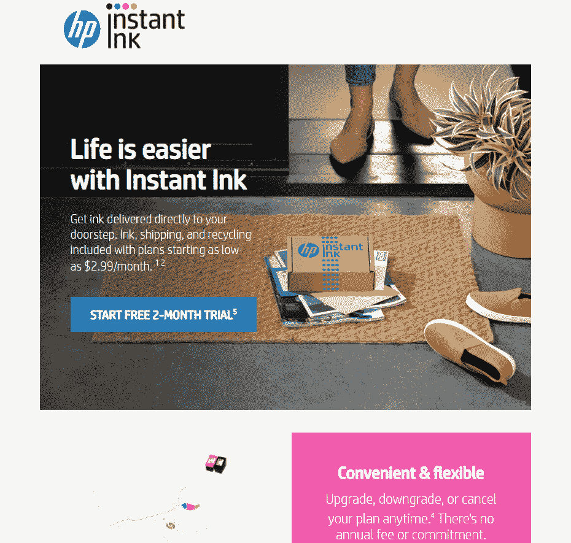

HP Instant Ink marketing email.

这封来自 HP Instant Ink 的营销电子邮件赢得了 2021 年 IAC“最佳技术电子邮件宣传活动”奖。

即时墨水的标志和标题强调墨水运送到你家的想法。

它很吸引人——插图、颜色和出色的特色图片的混合，抓住了你的注意力。

它很有创意——不是关注墨盒，而是关注服务送货上门这一事实。

你不需要有史以来最惊人的想法来创造一个好的设计。从评估你现有的邮件开始，找出需要改进的地方。

您应该考虑:

*   你的电子邮件与三个“C”相比如何
*   你的点击率(CTR)。作为参考，平均现金收益率范围[为 2.6%至 2.34%](https://kinsta.com/blog/email-marketing-statistics/)
*   你的电子邮件是否有助于你实现目标
*   您的电子邮件[是否增加了您网站的流量](https://kinsta.com/blog/how-to-drive-traffic-to-your-website/#email-marketing)

当创建新的电子邮件和活动时，继续利用你所学到的知识。

如果您是从零开始，我们还为您提供了可以立即使用的技巧和最佳实践。

## 11 个重要的电子邮件设计最佳实践

以下是所有电子邮件营销人员应该遵循的 11 条最佳实践。当你专注于电子邮件的营销方面时，你也可以考虑[电子邮件营销最佳实践](https://kinsta.com/blog/email-marketing-best-practices/)。

### 1.精心设计一个强有力的主题

主题行是你给读者留下第一印象的机会，对打开率有独特的影响。虽然电子邮件的平均打开率从 [18-22%](https://kinsta.com/blog/email-marketing-statistics/) 不等，但一些营销人员仅通过优化主题行就获得了高达 [57%](https://www.activecampaign.com/blog/ab-testing-email-subject-lines) 的打开率。

基本上，主题是至关重要的。为了优化它们，使用简洁的描述性语言，包括统计数据、数字或“挂钩”来吸引读者的眼球。你也应该避免“垃圾”词汇，如“免费”或“轻松赚钱”

### 2.保持品牌形象

你的电子邮件的设计会影响消费者如何看待你的品牌，所以仔细考虑每个设计元素是至关重要的。设计元素包括标志、颜色、字体、布局选择、视频、图像和信息图。

为了获得最佳效果，请将您的设计与您的受众相匹配。例如，如果你需要瞄准 B2B 受众，你可以使用专业的设计元素，比如柔和的颜色和干净的字体。B2C 产品可能会使用更“随意”的品牌。

### 3.保持简单和专注

复杂的电子邮件布局可能会让读者感到困惑，当读者感到困惑时，他们会单击“后退”按钮。你应该在邮件中采用简单、干净、简约的设计。

你也应该在每封邮件中使用相同的布局和品牌，这样读者就知道会看到什么。

### 4.刺激接合

激发读者的参与，在每封邮件中加入强烈的行动号召(CTA)。仔细选择你的锚文本，使你的 CTA 按钮变大，并有策略地放置它来优化你的转化率。

### 5.给你的内容空间呼吸

如果你填满了读者屏幕的每一平方英寸，他们就不知道往哪里看了。使用分隔符和空白将他们的注意力吸引到您的内容上，并强调关键组件，如您的 CTA 或产品图像。

### 6.跟随信息瀑布

信息瀑布(有时称为信息金字塔)将最重要的信息和最不重要的信息放在底部。

### 7.使用回复邮件

你是否曾经打开一封邮件却看不到整篇文章或图片？如果使用固定尺寸，变化的设备屏幕尺寸会扭曲你的设计。这就是为什么响应是至关重要的。使用[响应式网页设计](https://kinsta.com/blog/responsive-web-design/)原则，使你的设计适应不同窗口和屏幕尺寸的最佳比例。

### 8.确保可访问性

如果你想最大限度地扩大你的影响范围，并满足无障碍指南和法律，有必要考虑患有阅读障碍、色盲或视觉障碍的人会如何看待你的电子邮件营销。为了使你的电子邮件设计具有可访问性，使用阅读障碍友好的字体、替代文本、色盲友好的颜色以及屏幕阅读器(如 [KNFB 阅读器](https://nfb.org/programs-services/knfb-reader))可以大声朗读的纯文本。

### 9.优化性能

由于普通人浏览一封邮件的时间只有 11 秒，所以你需要把注意力放在性能上来获得结果。理想情况下，你的电子邮件应该能够快速加载，并在所有设备上工作(如 2021 年， [54.8%的互联网流量](https://kinsta.com/blog/email-marketing-statistics/#environment-share-what-device-do-people-use-to-open-their-emails)来自移动设备)。

你还应该[跟踪你的转化率](https://kinsta.com/blog/conversion-tracking/)来衡量你的营销努力和你尝试的任何新策略的有效性。

### 10.包括取消订阅链接

许多法规要求使用退订链接。美国联邦贸易委员会 2003 年的 CAN-SPAM 规则(控制未经请求的色情攻击和营销(CAN-SPAM))就是这些法规之一。

为了确保人们可以毫无问题地取消订阅，请始终包含一个清晰、易于使用且醒目的链接。

### 11.使用电子邮件认证

[电子邮件认证](https://kinsta.com/blog/email-authentication/)允许您的电子邮件营销工具以您的域名发送电子邮件(因此它们来自“yourwebsite.com”，而不是“via mcsv.net”)。使用电子邮件认证会让你的电子邮件看起来更专业。
T3】

## 优秀电子邮件设计的例子

从头开始构建一个有创意的高质量设计不是一件容易的事情，即使你是一个天生有创造力的人。谢天谢地，你不必从零开始。

这一部分将分解 26 个好的电子邮件设计的例子，突出我们喜欢它们的地方。

### 欢迎电子邮件

当客户注册您的邮件列表时，他们收到的第一封邮件就是欢迎邮件。做一个好的介绍对于建立一个持久的[吸引人的关系](https://kinsta.com/blog/email-marketing-best-practices/#engage)至关重要。

#### Ipsy

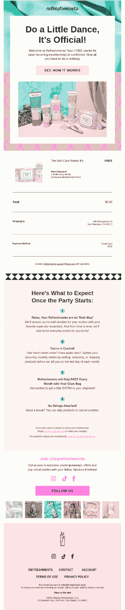

Welcome email from Ipsy.

Ipsy 的欢迎邮件是一个很好的介绍的 A+例子。以下是我们喜欢它的地方:

*   Ipsy 将其电子邮件通讯命名为“点心”(这让它感觉更像一个爱好俱乐部，而不是营销邮件)
*   Ipsy 的电子邮件为读者提供了一个免费的自我保健入门工具包
*   Ipsy 匹配背景、图像和产品包装中的颜色

#### 下装甲

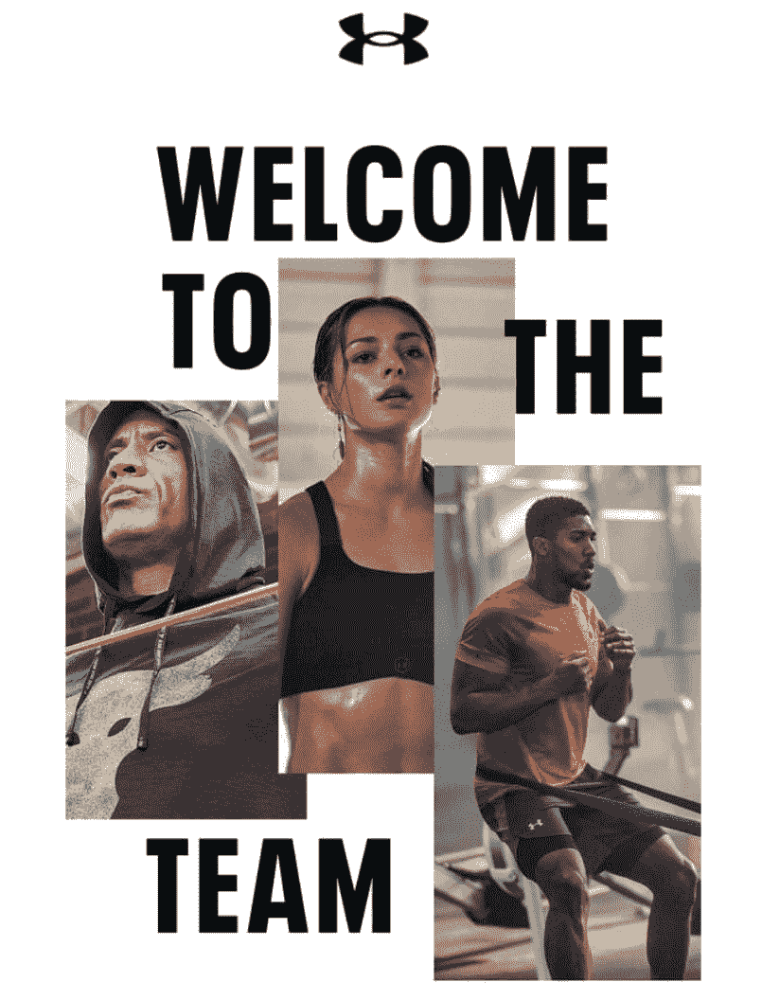

Welcome email from Under Armor.

Under Armor 的欢迎邮件之所以奏效，是因为营销团队选择了围绕其产品的图片和文字。这里还有一些我们喜欢的东西:

*   Under Armor 的标志是你首先看到的
*   图像中的颜色匹配，使电子邮件流行
*   电子邮件的视觉层次让它看起来很有趣

#### Beefree.io

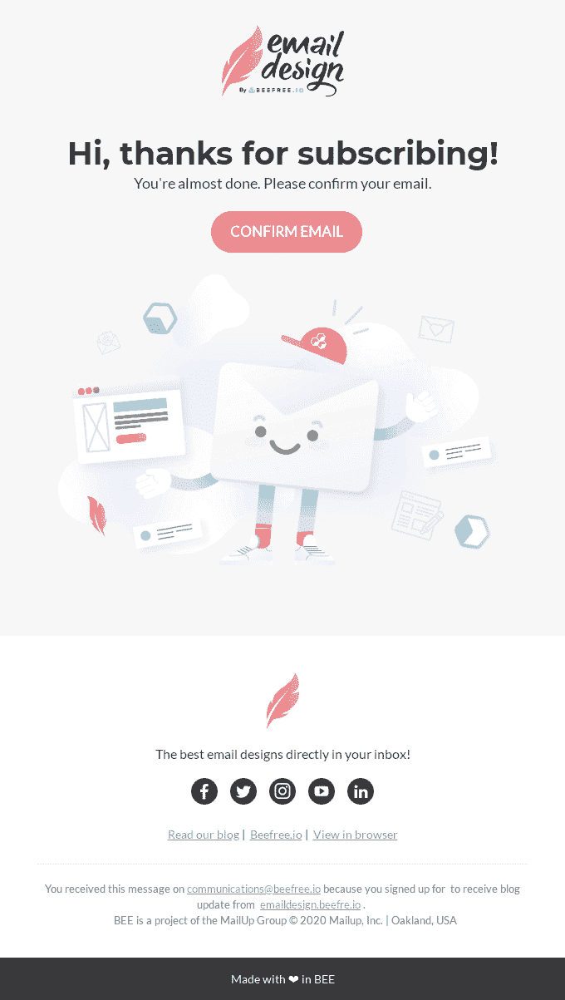

Welcome email from beefree.io.

虽然从技术上来说，这不是一封欢迎邮件，但这封免费的确认邮件非常好，我们不得不在这里展示它。为什么？这封邮件完美地展示了 BeeFree 设计软件的可能性。这里还有一些我们喜欢的东西:

*   这部动画很可爱
*   柔和的颜色很漂亮，但看起来不幼稚
*   befree 包含了其社交媒体的链接
*   befree 使用其软件来创建电子邮件设计

#### 珀洛东

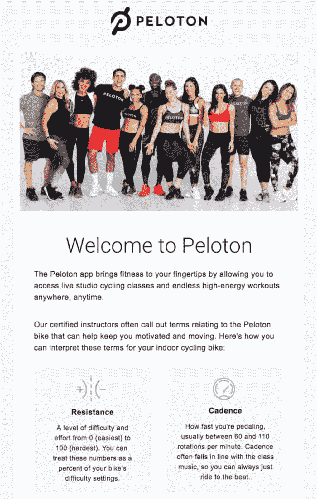

Welclme email from Peloton.

Peloton 的欢迎邮件包含几个文本部分，但看起来并不拥挤，因为他们有效地使用了空白。我们喜欢它还因为:

*   Peloton 使用符号将读者的注意力吸引到“阻力”和“节奏”部分
*   Peloton 的电子邮件以一幅图像开始，给人一种社区感
*   这封邮件解释了 Peloton 应用程序的功能，并教读者如何使用它

#### Evernote

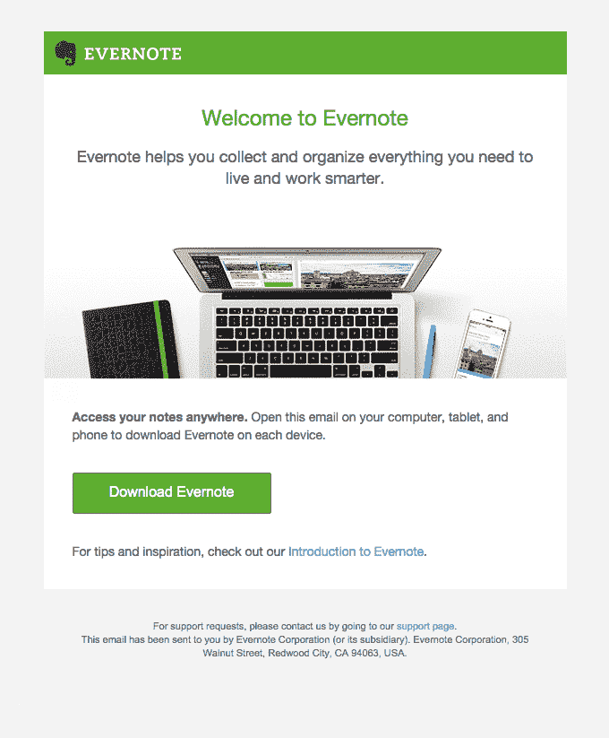

Welcome email from Evernote.

Evernote 的欢迎邮件有两个目的:欢迎订阅者，帮助他们下载免费的 Evernote 应用。我们喜欢它还因为:

*   这封邮件包含了 Evernote 介绍资源的链接
*   Evernote 的 CTA 按钮是绿色的，与 Evernote 的品牌颜色相匹配
*   Evernote 包含了一个客户服务链接，供安装该应用有困难的客户使用

### 购物车放弃电子邮件

[弃车电子邮件](https://kinsta.com/blog/abandoned-cart-email/)是自动生成的电子邮件，您会在客户弃车后的 24-72 小时内发送给他们。由于重新吸引潜在客户是这些电子邮件的主要目标，它们需要抓住读者的注意力。

#### 美国巨人

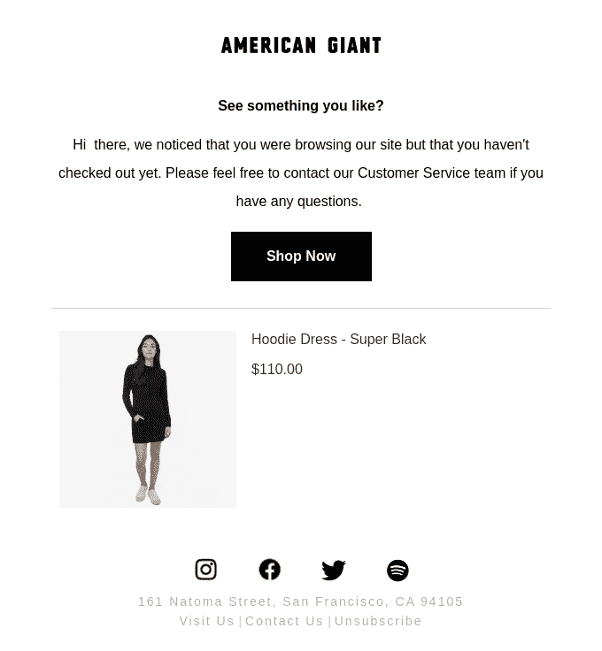

Cart abandon email from American Giant.

美国巨人的购物车放弃邮件是一个很好的例子，一个时尚的黑白设计，看起来很活泼。我们喜欢它还因为:

*   美国巨人向读者展示他们购物车中的商品
*   美国巨头链接到其社交媒体
*   电子邮件有效地使用了前置文本

#### 格里的

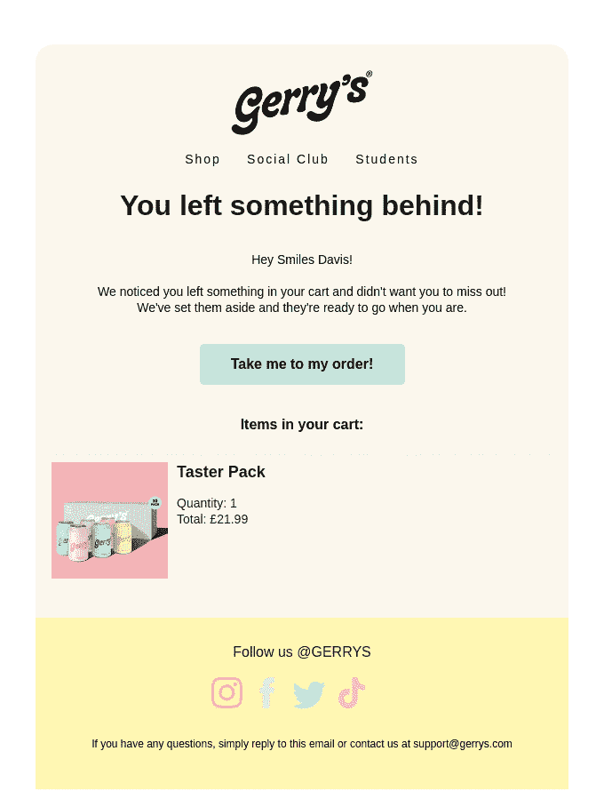

Cart abandonment email from Gerry’s.

格里的电子邮件与美国巨人的电子邮件截然不同。这是我们喜欢的:

*   标题以一种创造性的方式提醒读者他们的[废弃的购物车](https://kinsta.com/blog/shopping-cart-abandonment/)
*   电子邮件按姓名来称呼收件人
*   这些颜色很有趣，但并不夸张

#### 斯泰森毡帽

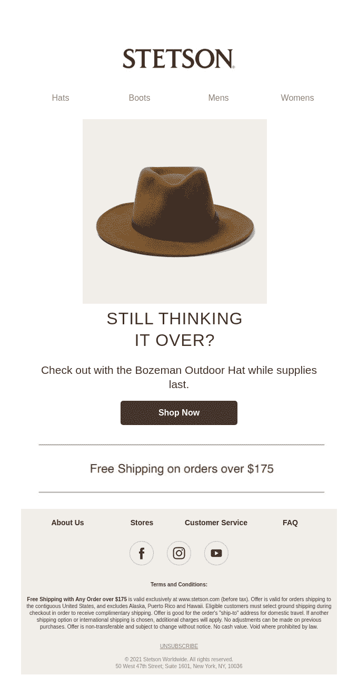

Cart abandonment email from Stetson.

斯特森的电子邮件有一个对客户友好的转折，使其奏效:提供免费送货。这里还有一些我们喜欢的东西:

*   斯特森在邮件中使用了其品牌颜色
*   这封邮件将读者链接到相关的商店类别
*   CTA 通过说明“当供应持续时”来指示稀缺

### 时事通讯

[时事通讯](https://kinsta.com/blog/newsletter-examples/)是定期发送的电子邮件，向您的客户更新新产品和服务、您的最新内容以及慈善工作。当然，它们需要信息丰富，但又引人入胜。

#### 舒卡设计局

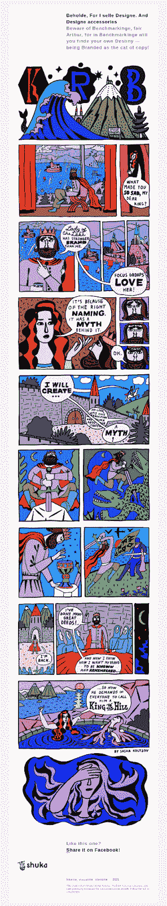

Newsletter from Shuka Design Bureau.

这封来自舒卡设计局的邮件是一个创意时事通讯的极好例子。这是我们喜欢的:

*   这封邮件有一幅引人注目的漫画
*   文案符合漫画的主题
*   这部漫画使用明亮的色彩和独特的艺术风格

#### 关于 Acid 的电子邮件

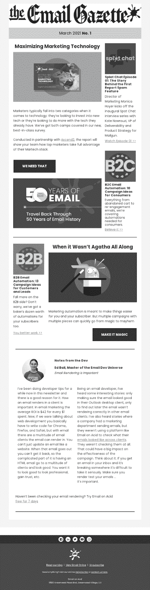

Newsletter from Email on Acid.

Acid 时事通讯上的电子邮件也采取了一种独特的方式。我们喜欢:

*   电子邮件的报纸主题
*   使用空白来分隔文本
*   这是电子邮件如何在有效的内容营销中发挥作用的一个很好的例子
*   黑白配色方案

#### 增量

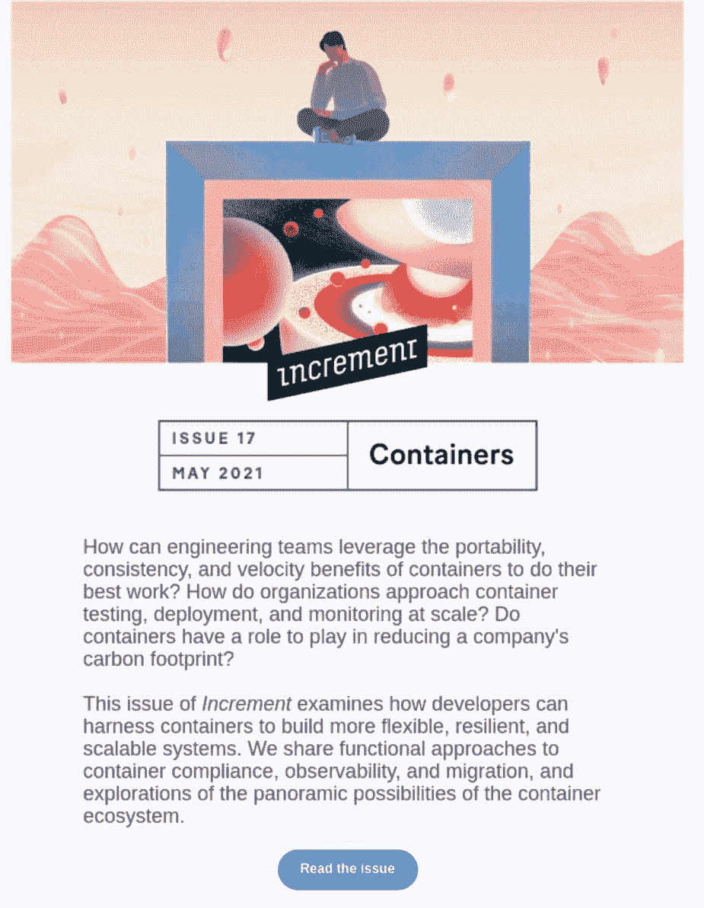

Newsletter from Increment.

Increment 对其时事通讯的设计采取了更时尚的方式。我们喜欢:

## 注册订阅时事通讯

### 想知道我们是怎么让流量增长超过 1000%的吗？

加入 20，000 多名获得我们每周时事通讯和内部消息的人的行列吧！

[Subscribe Now](#newsletter)

*   Increment 使用问题激励读者点击“阅读问题”的方式
*   《增量》杂志将这期时事通讯命名为“容器”,给它一个主题
*   以空间为主题的标题图像如何与主题对齐

### 假日电子邮件

节日邮件吸引读者的注意力，并利用特殊的庆祝优惠激励他们购买。这一切都是为了用你的电子邮件和促销活动抓住节日的精髓。

#### BarkBox

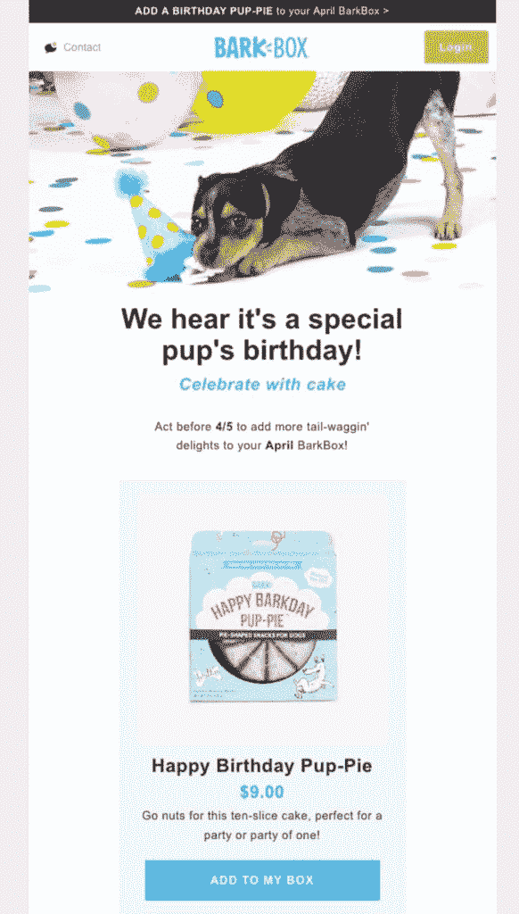

Happy Birthday email from BarkBox.

BarkBox 的“生日快乐”电子邮件通过向客户提供一种独特的产品(一个给狗的生日蛋糕)来提升销售。我们喜欢这种独特的方法，以及:

*   有趣的语言，比如摇尾巴的快乐
*   它使报价的价格、时间限制和期望变得清晰的方式

#### Gantri

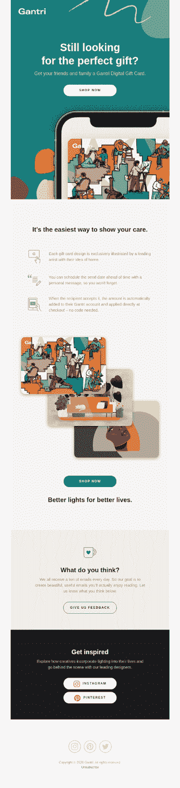

Holiday email from Gantri.

Gantri 的电子邮件巧妙地向读者提出了一个问题(“仍然在寻找完美的礼物”，并将 Gantri 卡定位为一种解决方案)。我们也喜欢这样:

*   这封邮件强调了 Gantri 卡的优势
*   将 CTA 放在以问题为中心的标题下

#### 朱迪

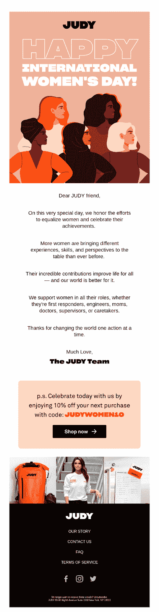

International Women’s day email from Judy.

朱迪的电子邮件采取了不同于 BarkBox 或 Gantri 的方法，因为朱迪的电子邮件旨在与读者建立关系。我们喜欢它，因为:

*   大字体和设计强调了标题
*   这封邮件的标题图片中有不同背景的女性
*   它使用空白来突出显示文本

#### RXBAR

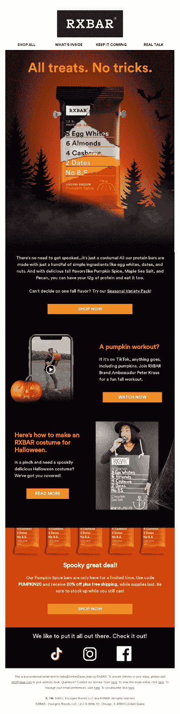

Halloween email from RXBAR.

RXBAR 的万圣节邮件又诡异又好玩。我们喜欢这样:

*   标题用了一个有趣的“不给糖就捣蛋”的旋转
*   该电子邮件在顶部包含相关链接
*   该设计使用了标志性的万圣节形象，如弗兰肯斯坦的指甲、蝙蝠和南瓜

### 数码产品的电子邮件

电子邮件对于数字产品的销售尤其有效，因为客户在通过您的 CTA 链接注册后不久就可以获得您的服务。他们的重点通常是强迫人们当场购买。

#### 轻便的

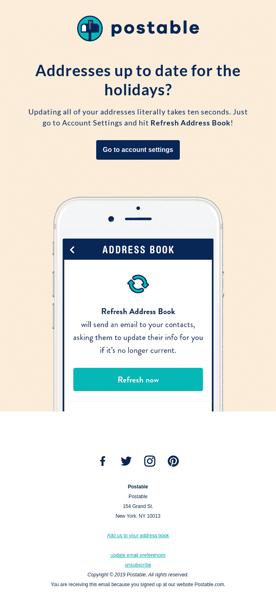

Digital products email from Postable.

这封来自 Postable 的邮件之所以有效，是因为它解决了读者的问题:假期里过时的地址。我们喜欢它还因为:

*   Postable 的 CTA 是读者首先看到的
*   该电子邮件包括便携式应用程序的图片
*   大量使用空白来突出主要目标——让用户更新他们的地址

#### 利润

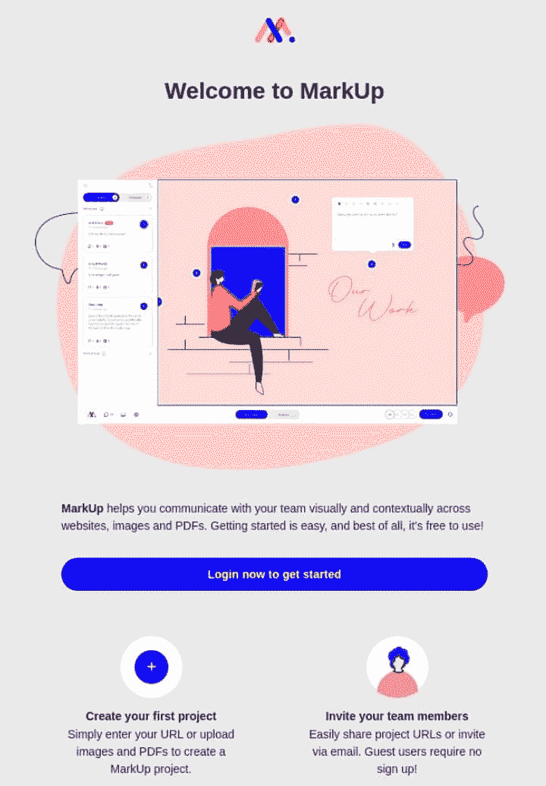

Welcome email from MarkUp.

这封来自 MarkUp 的邮件非常好，因为它教读者在向他们出售软件时如何使用 MarkUp。我们喜欢它还因为:

*   标记使用图标来突出文案
*   MarkUp 的软件是你首先看到的东西
*   CTA 在折叠上方

#### 字体

“About our product” email from Typeform.

Typeform 的电子邮件之所以有效，是因为它以该公司独特的卖点(USP)开头——“一种在营销中使用视频的新方式。”我们也喜欢这样:

Struggling with downtime and WordPress problems? Kinsta is the hosting solution designed to save you time! [Check out our features](https://kinsta.com/features/)

*   Typeform 展示了其视频营销的例子
*   电子邮件使用可访问的字体
*   这张图片使用层次来吸引读者的眼球

### 销售电子邮件

[销售电子邮件](https://kinsta.com/blog/email-marketing-tips/#tips-for-a-successful-b2b-email-marketing-strategy)为订户提供独家折扣，激励他们购买。自然，他们需要强大的 CTA。

#### GoPro

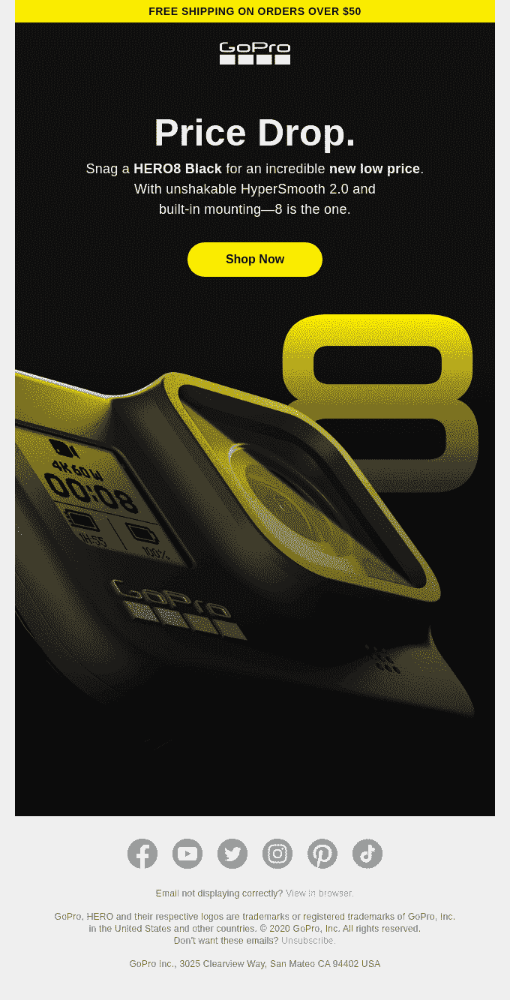

Sales email from GoPro.

GoPro 的这封电子邮件中的 CTA 工作得很好，因为文本的层次结构使它成为观众在“价格下降”之后阅读的第二件事。我们喜欢它还因为:

*   GoPro 在整个电子邮件中使用了匹配配色方案
*   巨大的产品图片突出了产品
*   这封邮件包含两个优惠:免费送货和较低的价格

#### 美国大学生数学建模竞赛

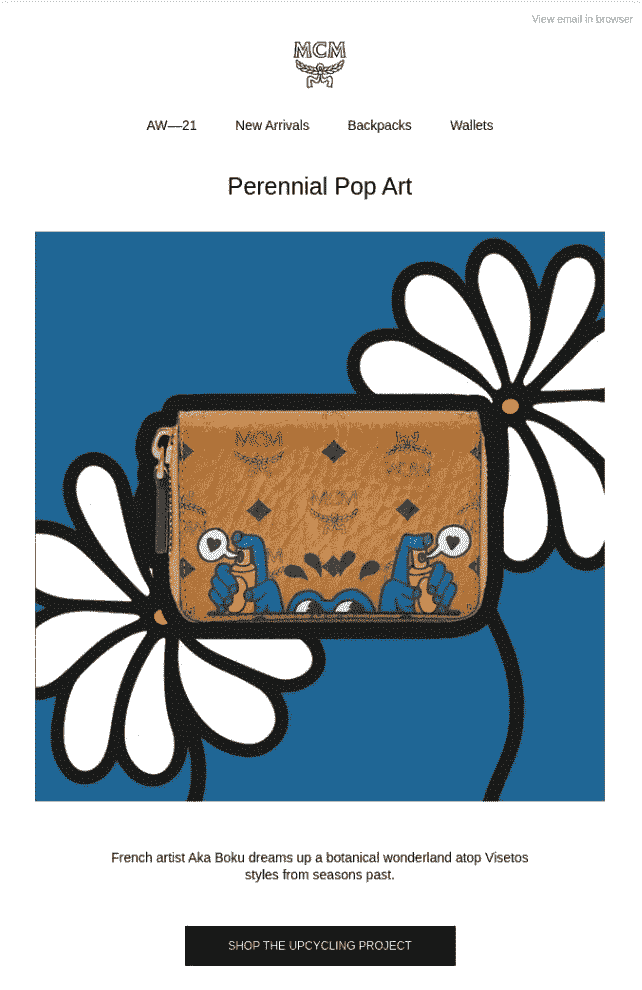

New product email from MCM.

这封来自 MCM 的销售邮件非常出色，因为它使用了一张图片而不是一大段文字来宣传这款包。我们也喜欢这样:

*   特色图片融合了插图和摄影
*   CTA 按钮非常突出
*   电子邮件的标题中包含商店链接

#### 现代哺乳动物

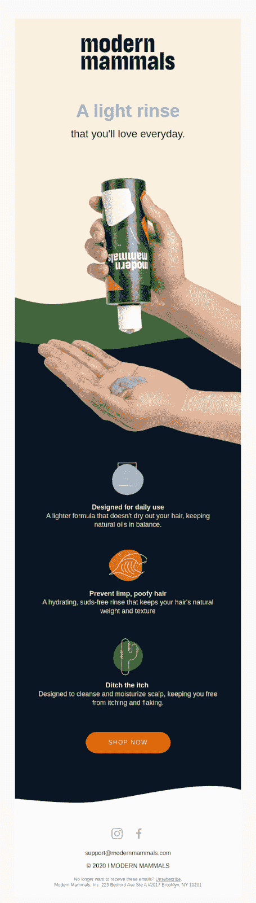

New product email from Modern Mammals.

这封来自现代哺乳动物的销售邮件效果很好，因为它通过静态照片展示了产品的动态。我们喜欢它还因为:

*   这封邮件使用了多种字体颜色来强调
*   背景图片与产品包装相配
*   文本强调了产品的 USP

### 证明和评论电子邮件

推荐和评论邮件要求读者帮忙，因此，他们需要利用忠诚度来激励读者留下评论。

#### G2 Esports 电子竞技俱乐部

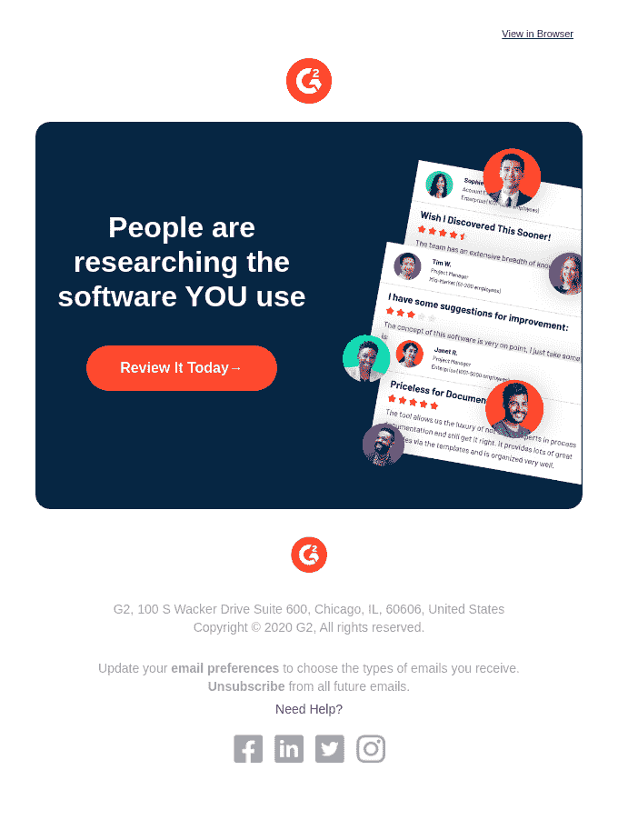

Review it email from G2.

G2 的“今天评论”邮件很有说服力，因为它让读者觉得他们可以帮助别人进行评论。我们也喜欢这样:

*   G2 在图片中显示了一系列评论(不仅仅是正面的)
*   G2 保持邮件简短
*   CTA 是描述性的

#### 目标

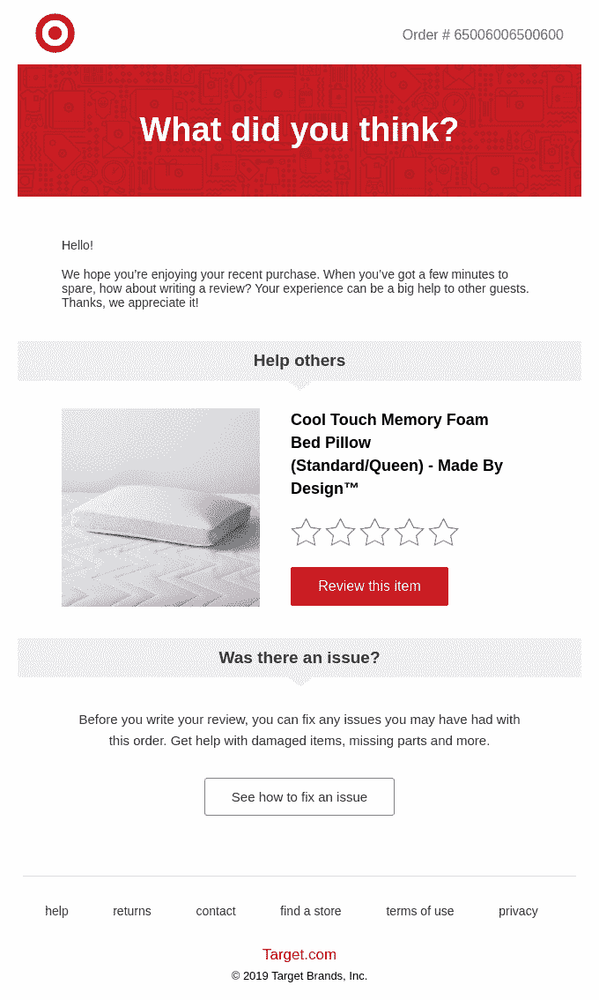

Review it today email from Target.

Target 的电子邮件之所以有效，是因为它对每个客户都是个性化的——要求审查，并帮助不满意的客户联系支持部门。我们也喜欢这样:

*   电子邮件使用标题作为内容块之间的分隔符
*   为清晰起见，[两个 CTA 按钮](https://kinsta.com/blog/newsletter-examples/#clear-ctas-drive-sales)采用不同的颜色
*   它用图像显示读者的购买

#### 咬

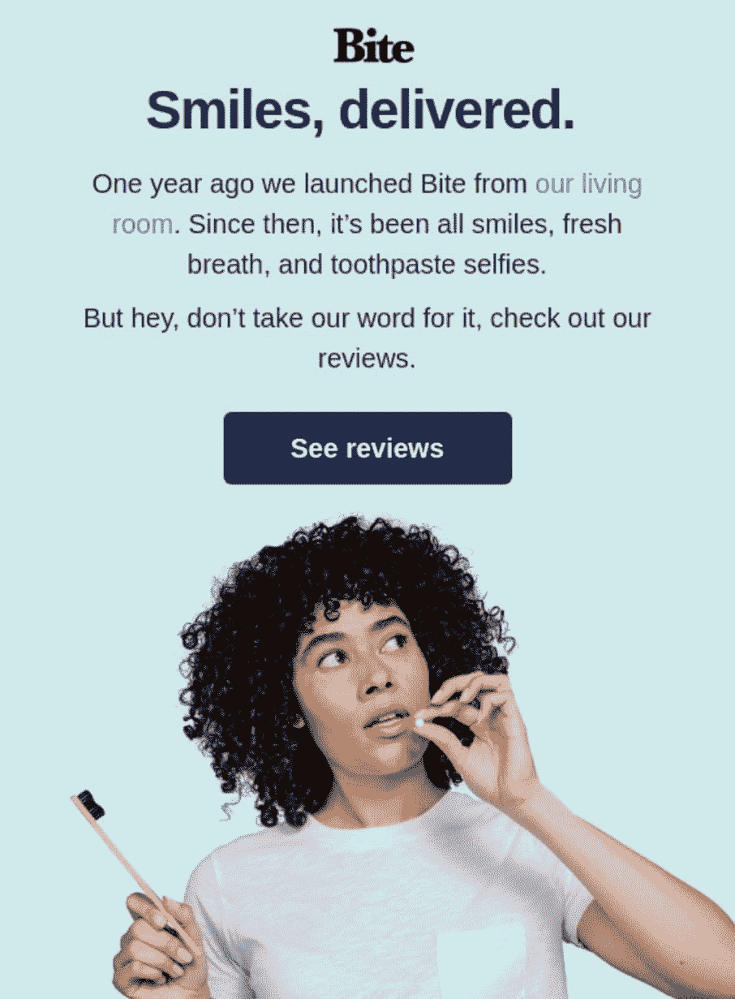

Review email from Bite.

Bite 的这封评论邮件采用了一种独特的方式，因为它向读者展示了其他客户的评论。我们也喜欢这样:

*   比特使用多种色调的绿色来创造层次
*   链接到其[“关于我们”页面](https://kinsta.com/blog/about-us-page/)
*   Bite 在图片中包括其产品

### 品牌电子邮件

品牌邮件告诉读者你业务的“ABC ”,包括你的品牌身份、使命和 USP。自然，他们需要对你的品牌产生浓厚的兴趣。

#### Thinx

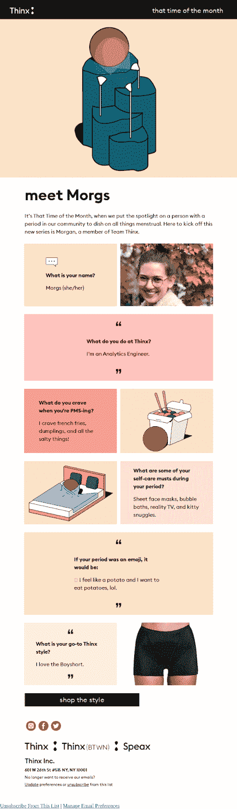

Personal branding email from Thinx.

Thinx 的这封品牌电子邮件通过将读者介绍给一名员工(Morgs)来吸引读者的注意力。我们也喜欢这样:

*   Thinx 使用了合适的哑光调色板
*   Thinx 围绕其产品和使命为电子邮件的文案设计了主题

#### 小精灵

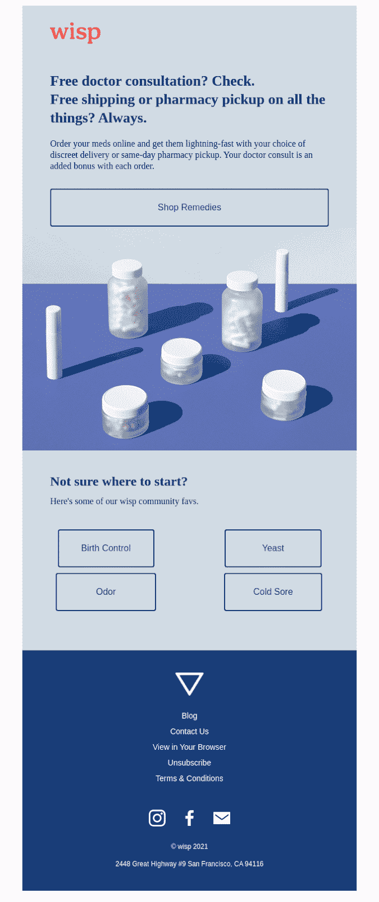

Personal branding email from Wisp.

Wisp 的这封品牌邮件之所以有效，是因为它帮助潜在客户浏览他们的产品。我们也喜欢这样:

*   Wisp 使用问题来抓住读者的注意力
*   Wisp 链接到它的“社区收藏夹”
*   Wisp 使用一张图片，融合到电子邮件的背景中

## 如何创建自己的电子邮件设计

现在你已经看到了 26 个好的邮件设计的例子，你已经准备好让你新训练的设计眼光发挥作用了。这里有三种方法来创建你的电子邮件设计:

### 1.使用电子邮件营销软件

许多流行的[电子邮件营销软件工具](https://kinsta.com/blog/constant-contact-vs-mailchimp/)都有你可以使用的内置模板。这包括 Mailchimp、Constant Contact、SendinBlue、Drop 和 HubSpot。

您可以轻松地使用他们的模板和拖放构建器来创建您独特的设计。

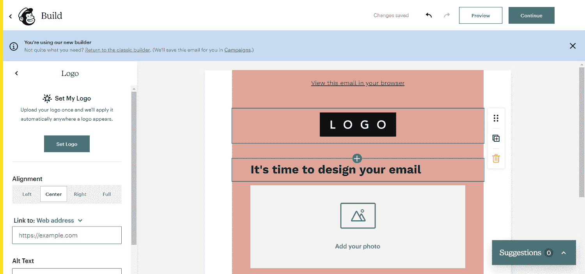

The Mailchimp Email Builder.

**优点:**

*   简单快捷
*   您可以更改模板的文本、图像和重要部分
*   你知道你的设计可以在桌面和移动设备上工作
*   您可以多次使用相同的模板
*   你通常不需要额外付费

**缺点:**

*   这些模板是为广泛的目标受众制作的(因此它们可能与您的其他品牌不匹配)

### 2.使用专用的电子邮件设计工具

电子邮件设计软件工具提供电子邮件模板和独特的功能来创建独特的设计。Stripo、Chamaileon、BeeFree 和明信片都是不错的选择。

**优点:**

*   对于没有设计背景的人来说非常容易使用
*   这些工具有数百个模板(因此很容易找到适合您需求的模板)
*   完全可定制性—更改布局、颜色、图像、样式和文本
*   许多模板是移动设备友好的

**缺点:**

*   您可能需要为使用这些工具付费
*   您需要下载您的模板并将其导入到您的电子邮件营销软件中(或在可用的情况下使用集成)

### 3.创建自定义设计

最后，你可以使用 Adobe InDesign、VivaDesigner、Scribus 等工具从头开始创建一个定制的电子邮件设计，或者简单地使用 [HTML](https://kinsta.com/blog/html-email/) 和内联 CSS 进行编码。

**优点:**

*   你的设计将独一无二
*   充分的灵活性
*   您可以确保您的设计是移动友好的，您的图像是高质量的

**缺点:**

*   设计软件很贵
*   非常耗时
*   你需要很强的设计背景

[Learn how to improve your email designs and see 26 examples to get inspired in this guide 📧⬇️Click to Tweet](https://twitter.com/intent/tweet?url=https%3A%2F%2Fkinsta.com%2Fblog%2Femail-design%2F&via=kinsta&text=Learn+how+to+improve+your+email+designs+and+see+26+examples+to+get+inspired+in+this+guide+%F0%9F%93%A7%E2%AC%87%EF%B8%8F&hashtags=EmailMarketing%2CDesignTips)

## 摘要

截至 2020 年，全球有超过[40.3 亿电子邮件用户](https://www.statista.com/topics/4295/e-mail-usage-in-the-united-states/?#topicHeader__wrapper)，人们每天发送和接收 3196 亿封电子邮件。自然，在用户的收件箱中脱颖而出是很棘手的。

这就是为什么好的电子邮件设计是至关重要的。抓住受众的注意力是培养与潜在客户的关系、增加收入和有效追加销售客户的第一步。

要掌握良好的电子邮件设计，请确保:

*   使用空白来强调
*   开发高质量的视觉效果来吸引读者的注意力
*   使用清晰的文本——尤其是在您的标题和 CTA 中
*   使用自上而下的方法来区分内容的优先级
*   发挥创造力

我们想听听你所知道的关于好的电子邮件设计的一切。你最喜欢这些设计中的哪一个，你是如何为你的品牌创建独特的电子邮件的？请在下面的评论中告诉我们。

* * *

让你所有的[应用程序](https://kinsta.com/application-hosting/)、[数据库](https://kinsta.com/database-hosting/)和 [WordPress 网站](https://kinsta.com/wordpress-hosting/)在线并在一个屋檐下。我们功能丰富的高性能云平台包括:

*   在 MyKinsta 仪表盘中轻松设置和管理
*   24/7 专家支持
*   最好的谷歌云平台硬件和网络，由 Kubernetes 提供最大的可扩展性
*   面向速度和安全性的企业级 Cloudflare 集成
*   全球受众覆盖全球多达 35 个数据中心和 275 多个 pop

在第一个月使用托管的[应用程序或托管](https://kinsta.com/application-hosting/)的[数据库，您可以享受 20 美元的优惠，亲自测试一下。探索我们的](https://kinsta.com/database-hosting/)[计划](https://kinsta.com/plans/)或[与销售人员交谈](https://kinsta.com/contact-us/)以找到最适合您的方式。