# 2022 年最佳云存储服务

> 原文：<https://kinsta.com/blog/best-cloud-storage/>

想象一下，有人发来一封紧急邮件，要求您对文档进行最后的润色。然而，有一个问题——没有电脑你无法访问该文档。

随着这种情况在我们的数字世界中普遍存在，人们越来越多地转向[云存储](https://kinsta.com/blog/what-is-cloud-storage/)。根据网络安全风险投资公司 2020 年的一份报告，到 2025 年，个人、企业、组织和政府将在云中存储 [100 兆字节的数据](https://cybersecurityventures.com/the-world-will-store-200-zettabytes-of-data-by-2025/)。研究还表明 [50%的个人](https://www.goodfirms.co/resources/personal-cloud-storage-trends)在办公室或家里使用云存储。

如果你不是这些人中的一员，或者正在寻求改变云存储服务，那么进入在线存储的世界可能会让你望而生畏。

但是我们可以帮忙。本文将回顾十种基于云的存储工具，帮助您选择最佳的云存储选项。

## 什么是云存储？

云存储(有时称为“基于云的存储”)允许您将文档、照片和文件存储在设备外部的安全位置。

云存储有三种主要[类型:](https://kinsta.com/blog/types-of-cloud-computing/#iass)

1.  **私有云存储:**当您将数据存储在私有服务器(如由您的企业拥有和运营的服务器)中时
2.  **公共云存储:**当你将数据存储在别人设置的服务器上时(公共云存储是[“基础设施即服务”或“IaaS”的一种形式](https://kinsta.com/blog/what-is-iaas/))
3.  **混合云存储:**当你公开和私下存储数据时

根据 [Flexera 2021 年云状态报告](https://info.flexera.com/CM-REPORT-State-of-the-Cloud)，19%的组织使用公共存储，2%使用私有存储，78%使用公共和私有存储。

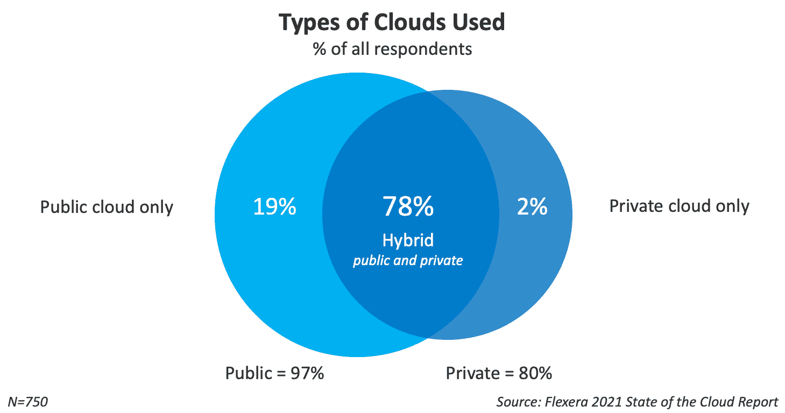

Cloud Storage popularity. (**Source:** [Flexera](//info.flexera.com/CM-REPORT-State-of-the-Cloud%E2%80%9D))

### 云存储是如何工作的？

你需要一个云存储提供商来把你的数据保存在云中。当您激活此工具时，它会备份您的文件并将其存储在第三方位置。这个第三方位置可以是您办公室中的服务器、组织控制的区域或数据中心。

当你用云计算归档和检索一个文档时，流程看起来是这样的:你的设备→互联网→数据服务器→互联网→你的设备。

[Which Cloud storage option is right for you? ☁️ Learn more in this guide 👇Click to Tweet](https://twitter.com/intent/tweet?url=https%3A%2F%2Fkinsta.com%2Fblog%2Fbest-cloud-storage%2F&via=kinsta&text=Which+Cloud+storage+option+is+right+for+you%3F+%E2%98%81%EF%B8%8F+Learn+more+in+this+guide+%F0%9F%91%87&hashtags=CloudStorage%2CWebTips)

### 云存储的优势

在您的组织中采用云存储可以帮助您:

#### 省钱

虽然许多云存储工具收取月费和年费，但将文件存储在云中往往比存储在外部硬盘上更便宜。

例如，如果你想存储 5tb 的数据，云存储提供商 iDrive 每年可能会花费你[59.62 美元](https://www.idrive.com/pricing)，或者[123.04 美元+税](https://www.amazon.com/Seagate-Portable-External-Hard-Drive/dp/B07VS8QCXC)来购买一个希捷便携式外置硬盘。

投资云存储也比本地存储更灵活，因为您可以使用提供[按需付费和自动扩展](https://kinsta.com/blog/benefits-of-cloud-computing/)的工具，所以您只需为您需要的存储付费。

#### 保护文件免受黑客和恶意软件的攻击

尽管我们许多人只是通过黑客在科幻剧中的角色来熟悉他们，但他们对全球组织构成了越来越大的威胁——主要是当他们使用恶意软件时。

截至 2020 年，黑客使用了超过 6.7766 亿种已知的[类型的恶意软件](https://kinsta.com/blog/types-of-malware/)侵入人们的电脑，窃取他们的数据，并勒索赎金。

恶意软件攻击会给组织带来灾难性的后果。一项针对来自德国、法国、北美和英国的 1，998 名消费者的研究显示， [59%的消费者](http://arcserve.com/protect-against-ransomware/)可能会避免与前一年遭受过网络攻击的组织做生意。

此外，如果企业不能在网络攻击后的三天内恢复其系统和应用程序，超过 66%的消费者会转向竞争对手。

虽然每个黑客都有独特的方法，但许多人使用网络钓鱼和勒索软件等社会工程技术，通过电子邮件等易受攻击的渠道来攻击组织。

由于安全的云存储工具允许你在没有电子邮件的情况下共享文档，这降低了有人攻击你的风险。

#### 从其他设备访问文件

由于云存储文件位于您的计算机之外，您可以随时随地从任何设备访问它们(前提是您手边有登录信息)。

## 如何选择适合自己的云存储选项

如果你在谷歌上搜索“云存储工具”，你会得到大约 9.08 亿个结果。

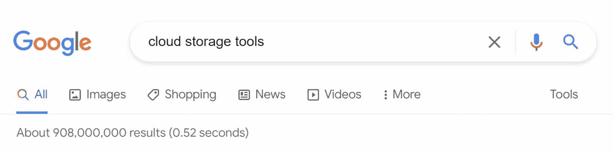

Results for the Google search “cloud storage tools.”

如何在如此大量的结果中找到合适的工具？让我们详细介绍如何选择最佳云存储的四个步骤。

### 第一步。考虑您需要的存储类型和功能

由于每个存储工具都不同，您需要首先建立您需要的工具。为了确定你的需求，问问你自己:

*   我使用多少存储空间？
*   我的预算是多少？
*   我需要多久创建一次备份？
*   同事、客户和外部用户可以在不下载软件的情况下查看我的文件吗？

然后，您需要考虑存储工具中需要的特性。常见功能包括:

*   移动应用程序
*   一种分类系统，允许您使用文件夹、文件或标签对文件进行分组
*   [机密文件的密码保护](https://kinsta.com/blog/password-managers/)
*   下载限制(这些限制谁可以编辑或下载每个文件)
*   实时备份(在您编辑文件时同步文件)
*   多用户访问(这允许其他人在您允许的情况下访问您的文件)

确定需求后，在你的价格范围内选择一些潜在的储物方案。尽管最流行的工具包括 Google Drive、Dropbox 和微软 OneDrive，但我们将在“云存储建议”一节中介绍其中的十个选项。

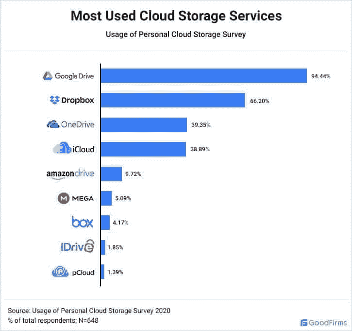

The popularity of cloud storage tools. (**Source:** [Goodfirms](//www.goodfirms.co/resources/personal-cloud-storage-trends%E2%80%9D))

### 第二步。考虑安全性

在选择你的工具之前，你需要考虑它的网络安全程度。安全性好的云存储工具一般提供:

*   口令保护
*   文件加密(加密会改变文件的内容，因此任何窃取它的人都无法读取它)
*   远程设备锁定(此功能允许您阻止被盗设备访问您的文件)
*   旧文件定时过期(这将使您能够自动删除您存储了一段时间的文件)
*   [双因素认证](https://kinsta.com/blog/wordpress-two-factor-authentication/)(双因素认证强制您在登录前使用两台设备确认身份)
*   受控用户权限(这允许您控制谁可以查看、编辑和下载每个文件)

此外，假设您需要存储符合法规的数据，如[欧洲通用数据保护条例(GDPR)](https://kinsta.com/blog/wordpress-gdpr-compliance/) 或美国健康保险便携性和责任法案(HIPAA)。在这种情况下，您需要再次检查您的工具是否符合要求。

在你找到一个具有良好网络安全的工具后，是时候对它进行测试了。

### 第三步。免费试用，测试您的首选

很容易在纸上看到一个工具，并假设它会为你工作，但你永远不会知道它的全部功能，直到你亲自尝试。当然，我们建议您通过免费试用或注册一个月来测试您的顶级存储选项。

评估您的工具时，请查看:

*   同步速度(工具保存文件的速度)
*   这个工具使用起来有多简单
*   该工具如何与您的其他业务系统集成
*   该工具是否适用于您的团队

一旦你找到了适合你的工具，你就可以过渡到在线文件存储了。

### 第四步。过渡到您的新存储解决方案

要过渡到您的新工具，请确定您需要传输的文件，并按照开发人员的说明将它们联机。

为了获得最佳效果，请确保您:

*   从具有可靠互联网连接的位置传输文件(因此网络崩溃不会影响您的传输)
*   在整个传输过程中监控您的设备
*   适当地命名您的文件，以便您可以找到它们
*   一边走一边整理您的文件
*   完成传输后，只删除每个文件的本地版本

如果您有许多文件要传输或互联网速度较慢，您可以小块上传文件。

## 云存储建议

目前有各种各样的云存储工具可用，尽管它们看起来非常相似，但每个工具都有不同的功能、优点和缺点，这使得它非常适合不同的用户。

这一部分将列出十个你可能用到的工具。

### 2022 年最佳云存储

#### iDrive

iDrive 是一款灵活、可扩展的数据存储工具，非常适合存储商业和个人文件。iDrive 可以在 Windows、Mac、Linux、iOS 和 Android 设备上运行。iDrive 目前免费提供高达 5GB 的存储空间。

iDrive.

iDrive 的运营公司(iDrive Pty Ltd .)位于加利福尼亚州。

**特性:**

*   iDrive 回溯(可以将文件恢复到早期版本)
*   快照(为后代拍摄文件的“快照”)
*   iDrive 仪表板(可让您从中央位置管理用户和文件)

**定价:**

iDrive 提供:

*   iDrive 个人版每年 79.50 美元起(包括 5 TB 数据)
*   iDrive 团队每年 99.50 美元起(包括多台电脑和用户)
*   iDrive Business 每年 99.50 美元起(包括不限数量的用户、服务器和电脑)
*   企业计划

**优点:**

*   您可以从任何设备访问您的文件
*   出色的用户界面(UI)
*   多种定价方案(第一年还有折扣)

**缺点:**

*   一些用户反映技术和客户支持缓慢

#### pCloud

pCloud 是一款经济实惠且高度安全的数据存储工具。它可以在 Windows、macOS、Linux、iOS 和 Android 设备上运行。pCloud 目前位于瑞士，但在德克萨斯州或卢森堡提供数据存储。

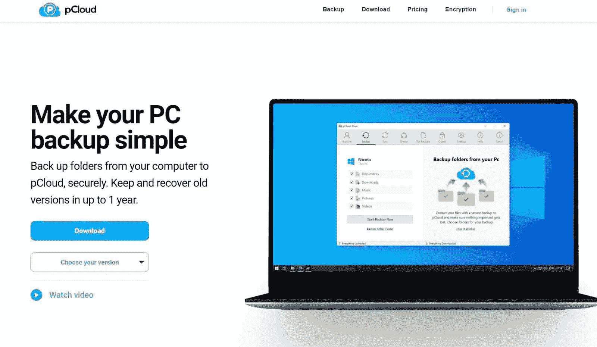

pCloud.

自 2013 年成立以来，pCloud 在全球范围内的用户数量已超过 1400 万，包括耐克、Twitter 和 Instagram。

**特性:**

*   30 天垃圾桶历史记录
*   pCloud Crypto(允许您使用密码锁定文件)
*   双因素认证
*   客户端加密
*   传输层安全性(TLS)和安全套接字层(SSL)加密

**定价:**

pCloud 提供年度和终身计划，包括:

*   保费从每年 59.88 美元或终身 500 美元起(包括 500 GB)
*   特优+从每年 119.88 美元或终身 980 美元起(包括 2 TB)

pCloud 还提供家庭计划、商业计划和 10 GB 存储空间的免费计划。

**优点:**

*   符合 GDPR 标准
*   伟大的用户界面
*   非常适合团队

**缺点:**

*   pCloud Crypto 额外收费
*   比其他存储选项更贵

### 最佳免费云存储

#### Google Drive

Google Drive 是目前 T2 最受欢迎的云平台之一。

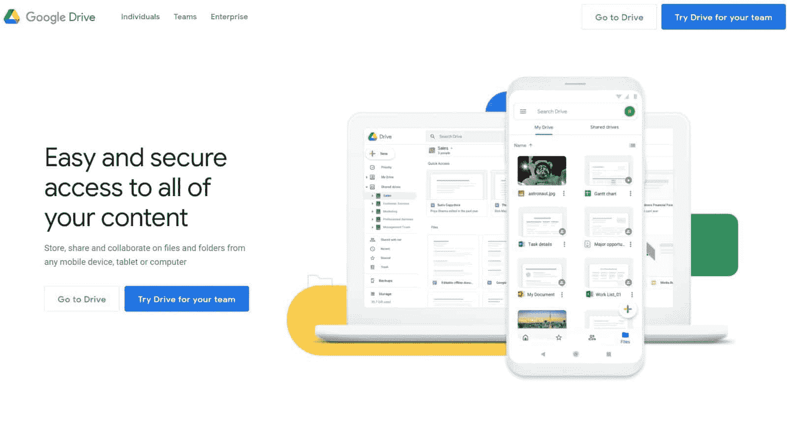

Google Drive.

它直观、易学、可扩展。Google Drive 是 G Suite 的一部分，G Suite 是一个生产力软件套件，每月有超过 20 亿活跃用户。G Suite 的前身是“谷歌工作空间”。

**特性:**

*   多用户
*   版本历史
*   谷歌文档和谷歌教室的兼容性

**定价:**

Google Drive(通过“Google One”)提供免费和付费计划。免费计划包括 15GB 的存储空间，而付费计划包括:

*   Google One Basic 每月 2 美元或每年 20 美元(包括 100 GB)
*   Google One Standard 每月 3 美元或每年 30 美元(包括 200 GB)
*   每月 10 美元或每年 100 美元的 Google One Premium(包括 2 TB)

**优点:**

*   使用方便
*   与 Adobe、DocuSign、Slack、Salesforce、AutoDesk 和 Atlassian 集成
*   灵活定价
*   对国际团队来说太棒了

**缺点:**

## 注册订阅时事通讯

### 想知道我们是怎么让流量增长超过 1000%的吗？

加入 20，000 多名获得我们每周时事通讯和内部消息的人的行列吧！

[Subscribe Now](#newsletter)

*   比其他选项功能更少
*   不适用于所有文件类型

#### Nextcloud

Nextcloud 是一款开源工具，可以帮助你在云端托管数据。

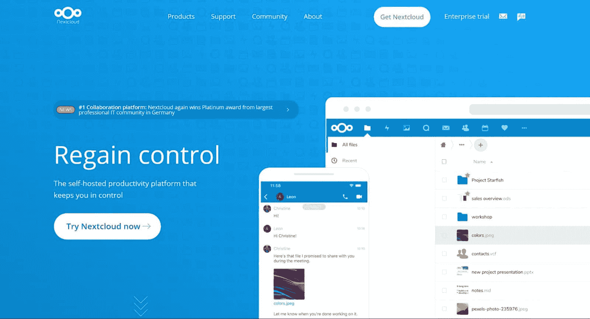

Nextcloud.

目前有数千万人在使用 Nextcloud，包括西门子、Regio IT 和 DEGES 等公司的员工。Nextcloud 可以通过你的网络浏览器、手机或桌面应用来工作。

**特性:**

*   Nextcloud 文件(加密和存储你的文件)
*   Nextcloud Talk(允许你主持视频通话和分享你的屏幕)
*   Nextcloud 群件(集成了你的收件箱、日历和其他生产力应用程序)

**定价:**

Nextcloud 是免费的，但 Nextcloud 也为拥有超过 100 名用户的组织提供这些高级计划:

*   Nextcloud Basic 每用户每年 36 欧元起
*   Nextcloud 标准，每位用户每年 65 欧元起
*   Nextcloud Premium 每用户每年 95.5 欧元起

**优点:**

*   符合 GDPR 和 HIPAA 标准
*   与 Microsoft Outlook 和 Mozilla Thunderbird 集成
*   允许您通过 Microsoft Office 协作处理文档
*   允许您锁定和解锁文件
*   为银行、医院、政府和公证人提供安全的文件交换

**缺点:**

*   最适合有 IT 经验的用户

### 最佳个人云存储

#### 冰人

IceDrive 是一款模仿硬盘的新型云存储工具。当你在 Windows 电脑上使用 IceDrive 时，你把它下载到你的电脑上，像普通硬盘一样把文件拖放到里面。

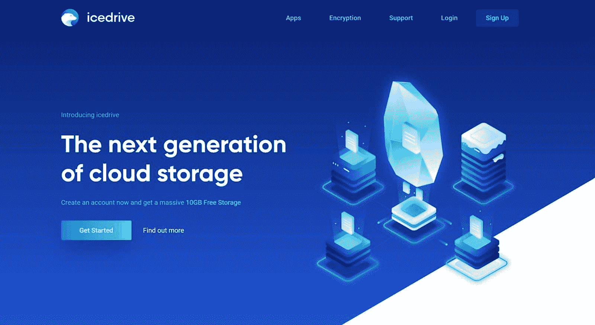

IceDrive.

IceDrive 也可以通过网络以及 Linux、Mac、iOS 和 Android 设备获得。IceDrive 是一家总部位于英国的公司，为全球客户提供服务。

**特性:**

*   视频和音频流
*   Twofish 算法加密
*   客户端加密
*   共享链接超时(允许您在设定的时间后切断某人对文件的访问)

**定价:**

IceDrive 免费提供 10GB 存储空间。如果您需要更多存储空间，IceDrive 的计划包括:

*   IceDrive Lite 每月 1.67 美元或每年 19.99 美元起(包括 150 GB 的存储空间)
*   IceDrive Pro 每月 4.17 美元或每年 49.99 美元起(包括 1 TB 的存储空间)
*   IceDrive Pro+每月 15 美元或每年 179.99 美元起(包括 5 TB 存储空间)

IceDrive 还为其每个计划提供终身支付。

**优点:**

*   您可以轻松地与朋友共享文件
*   IceDrive 可以像硬盘驱动器一样备份您的整个设备
*   符合 GDPR 标准
*   口令保护

**缺点:**

*   没有第三方集成

#### Dropbox

[Dropbox](https://kinsta.com/blog/google-drive-alternative/#2-dropbox) 是最早获得主流普及的云存储工具之一。

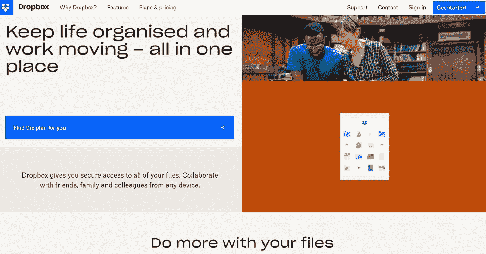

Dropbox.

Dropbox 于 2007 年推出，是一款易于使用的程序，可以在 dropbox.com 或 Mac、Windows、Linux、iOS 或 Android 设备上运行。

Struggling with downtime and WordPress problems? Kinsta is the hosting solution designed to save you time! [Check out our features](https://kinsta.com/features/)

**特性:**

*   实时备份
*   智能同步(通过在线存储文件来节省本地磁盘存储空间)
*   Dropbox 保管库(允许您对文件进行密码保护)
*   远程擦除
*   文件恢复
*   两步验证

**定价:**

Dropbox 提供了存储容量高达 2 GB 的免费计划。如果你需要更多，Dropbox 提供:

*   每月 11.99 美元或每年 119.88 美元的 Dropbox Plus(包括 2TB 的存储空间)
*   Dropbox Family 每月 19.99 美元或每年 203.88 美元(包括最多六人之间的 2TB 存储空间)

**优点:**

*   非常适合需要共享文件的家庭
*   非常适合照片和视频
*   良好的网络安全功能

**缺点:**

*   DropBox 只为付费套餐提供加密服务

### 最佳商业云存储

#### 微软 OneDrive

如果你使用微软办公软件，你可能已经可以使用微软的内置数据存储工具。

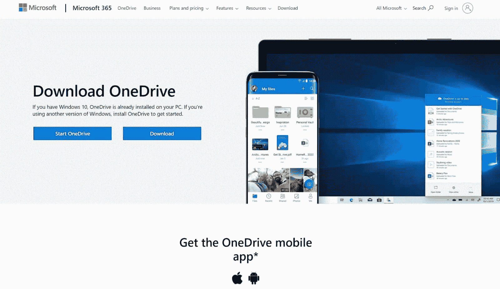

Microsoft OneDrive.

微软 OneDrive 与 IceDrive 的相似之处在于，它的工作方式类似于硬盘——只是在线。它可以在 Windows、Mac、Android、iOS、Xbox 和 Windows Phone 设备上使用。

**特性:**

*   用户控件
*   旧文件的到期日期
*   下载块
*   机密文件的自定义密码
*   版本历史

**定价:**

微软 OneDrive 自带微软 365，但你也可以通过微软的 OneDrive for Business plan 购买。该计划从每个用户每月 5 美元起，包含 1 TB 的数据。

**优点:**

*   与 Microsoft Office 应用程序兼容
*   快速同步时间
*   如果你熟悉微软的程序，很容易使用
*   有利于协作

**缺点:**

*   有限的安全功能
*   有限存储

### 最佳无限云存储

#### 箱子

[Box](https://kinsta.com/blog/google-drive-alternative/#4-box) 是一款可扩展的存储工具，专为员工需要每天协作处理多个文档的大中型企业而设计。

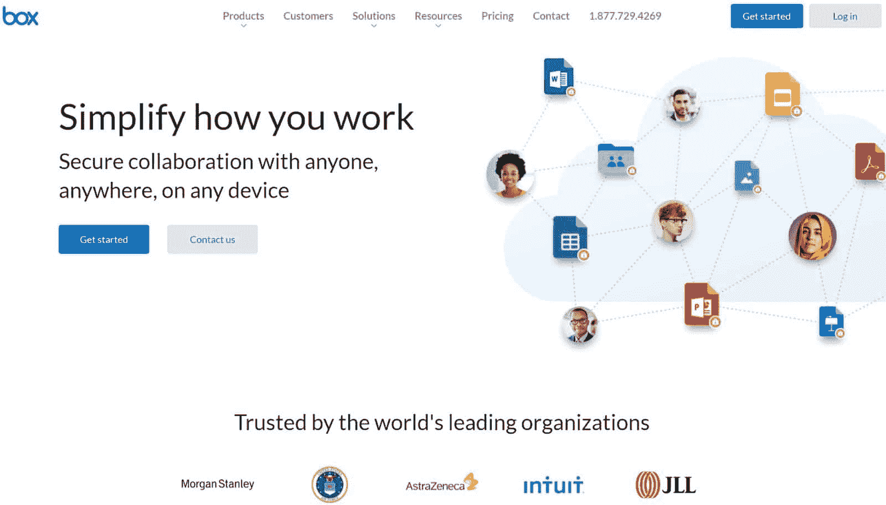

Box.

Box 提供无限的存储空间，并包括一个内置的内容管理系统。

**特性:**

*   云内容管理(团队协作的生产力工具)
*   版本历史
*   实时备份
*   框签名(帮助您创建数字签名的工具)
*   双因素认证

**定价:**

Box 提供高达 10 GB 存储空间的免费计划。如果您需要更多，Box 提供:

*   每个用户每月 15 美元起的盒子业务
*   Box Business Plus 每个用户每月 25 美元起
*   每个用户每月 35 美元起

**优点:**

*   与超过 1，500 个生产力应用程序集成(包括 Slack、Okta 和 ServiceNow)
*   强大的网络安全
*   非常适合团队协作

**缺点:**

*   你必须至少有三个用户才能使用 Box 的商业计划
*   Box 仅在企业计划中符合 HIPAA/ FedRAMP 标准

### 最安全的云存储

#### 诺德洛克

[NordLocker](https://kinsta.com/blog/google-drive-alternative/#13-nordlocker) 是由 NordVPN 开发的云存储服务，nord VPN 是一家帮助人们通过[虚拟专用网络(VPN)](https://kinsta.com/blog/proxy-vs-vpn/) 隐藏 IP 地址的公司。

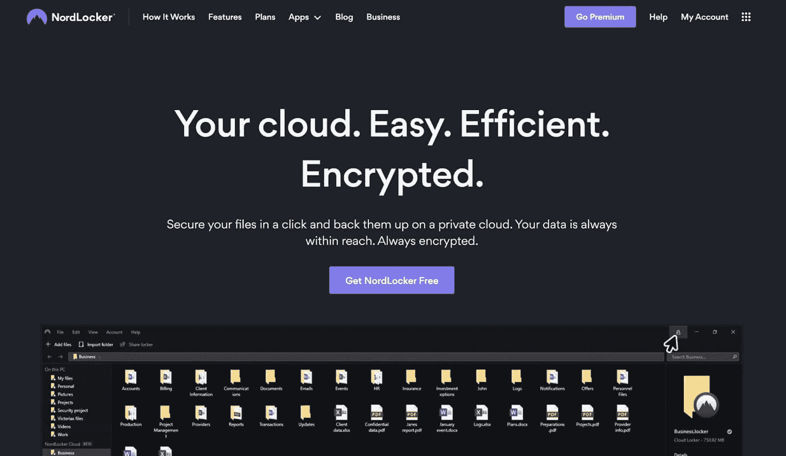

NordLocker.

NordLocker 使用许多网络安全功能来保护您的文件安全，包括 ECC、AES256 和 Argon2 加密协议。它还使用了“零知识”的方法，这意味着你是唯一一个谁可以解密你的文件。

**特性:**

*   本地文件库
*   自动云备份

**定价:**

NordLocker 提供高达 3 GB 的免费存储空间。如果您需要更多，NordLocker 提供:

*   500 GB 的数据，每月 3.19 美元
*   每月 7.99 美元即可获得 2 TB 的数据
*   企业计划
*   如果您使用 NordVPN，您可能已经可以免费访问 NordLocker(尽管这取决于您的 NordVPN 计划)。

**优点:**

*   巨大的网络安全
*   符合 GDPR 和 HIPAA 标准
*   易于使用(有一个拖放界面)
*   非常适合文件共享

**缺点:**

*   没有协作功能
*   有限的生产力特性
*   仅在 Windows 和 Mac 电脑上可用

### 最佳照片云存储

#### 闪烁（光）

虽然当人们寻找照片和视频的云存储解决方案时，Flickr 可能不是他们的第一选择，但它是一个经济实惠的平台，可以保持图片的质量。

Flickr.

电信巨头威瑞森目前拥有 Flickr。

**特性:**

*   可交换图像文件(EXIF)数据存储
*   Flickr 应用程序
*   社交媒体功能

**定价:**

Flickr 提供 1，000 张照片和视频存储容量的免费计划。Flickr 提供每月 5.99 美元的 Flickr Pro，如果你需要存储更多，则每年 49.99 美元。Flickr 为您提供无限的存储空间(尽管单个文件的存储空间限制为照片 200 MB，视频 1 GB)。

**优点:**

*   使用方便
*   保持照片质量
*   非常实惠

**缺点:**

*   不包括任何生产力特性
*   默认情况下，您的照片和视频是公开的
*   免费版的 Flickr 有广告
*   不适合大文件

[Entering the world of cloud storage can seem daunting, but this guide has ten great options to help you get started ☁️💥Click to Tweet](https://twitter.com/intent/tweet?url=https%3A%2F%2Fkinsta.com%2Fblog%2Fbest-cloud-storage%2F&via=kinsta&text=Entering+the+world+of+cloud+storage+can+seem+daunting%2C+but+this+guide+has+ten+great+options+to+help+you+get+started+%E2%98%81%EF%B8%8F%F0%9F%92%A5&hashtags=CloudStorage%2CWebTips) ## 摘要

随着我们对网络安全和[云技术能力的了解越来越多](https://kinsta.com/blog/types-of-cloud-computing/)，云存储服务越来越受欢迎。自然，尽管 2015 年世界上只有 25%的数据存储在云中，但这一数字将在 2025 年达到 50%。

如果你是众多寻求改变的人中的一员，我们建议:

*   用于一般存储的 iDrive 或 pCloud
*   用于个人云存储的 Dropbox
*   面向企业存储的 Microsoft OneDrive
*   无限储物盒
*   诺德洛克安全公司
*   照片的 Flickr

现在我们已经分享了我们的云存储服务建议，我们很想知道您如何存储您的文件，以及您会向其他人推荐什么工具？请在下面的评论中告诉我们。

* * *

让你所有的[应用程序](https://kinsta.com/application-hosting/)、[数据库](https://kinsta.com/database-hosting/)和 [WordPress 网站](https://kinsta.com/wordpress-hosting/)在线并在一个屋檐下。我们功能丰富的高性能云平台包括:

*   在 MyKinsta 仪表盘中轻松设置和管理
*   24/7 专家支持
*   最好的谷歌云平台硬件和网络，由 Kubernetes 提供最大的可扩展性
*   面向速度和安全性的企业级 Cloudflare 集成
*   全球受众覆盖全球多达 35 个数据中心和 275 多个 pop

在第一个月使用托管的[应用程序或托管](https://kinsta.com/application-hosting/)的[数据库，您可以享受 20 美元的优惠，亲自测试一下。探索我们的](https://kinsta.com/database-hosting/)[计划](https://kinsta.com/plans/)或[与销售人员交谈](https://kinsta.com/contact-us/)以找到最适合您的方式。