# 如何使用多种工具调试 Node.js 代码

> 原文：<https://kinsta.com/blog/node-debug/>

Node.js 是一个 JavaScript 运行时,基于与谷歌 Chrome 浏览器相同的 V8 引擎。它通常用于构建跨平台的服务器端和终端应用程序。 [Node.js 在过去十年里变得越来越受欢迎](https://kinsta.com/blog/node-js-apps/)，因为它的[易于安装](https://kinsta.com/blog/how-to-install-node-js/)，实用，快速，并允许客户端 web 开发人员[在其他地方利用他们的技能](https://kinsta.com/blog/node-js-developer-salary/)。

然而，软件开发仍然是一项复杂的任务，您的 Node.js 代码在某些时候会失败。本教程演示了帮助调试应用程序和查找问题原因的各种工具。

让我们开始吧。

### 查看我们的视频指南[调试 Node.js 代码](https://www.youtube.com/watch?v=Kz8EB9Lhul8)


### 信息

[Deno](https://deno.land/) 是一个替代的 JavaScript 运行时。它类似于 Node.js，但更新，并且消除了一些漏洞和不一致。下面的工具和信息可以经常应用到 Deno 应用和 Node.js 上


## 调试概述

“调试”是修复软件缺陷的各种方法的名称。修复一个 bug 通常很简单。查找 bug 的原因可能要复杂得多，并且要花很多时间绞尽脑汁。


> Kinsta 把我宠坏了，所以我现在要求每个供应商都提供这样的服务。我们还试图通过我们的 SaaS 工具支持达到这一水平。
> 
> <footer class="wp-block-kinsta-client-quote__footer">
> 
> 
> 
> <cite class="wp-block-kinsta-client-quote__cite">Suganthan Mohanadasan from @Suganthanmn</cite></footer>

[View plans](https://kinsta.com/plans/)

以下部分描述了您将会遇到的三种常见错误。


### 句法误差

你的代码没有遵循语言的规则——例如，当你省略了一个右括号或者拼错了一个语句，比如`console.lag(x)`。

优秀的代码编辑器可以通过以下方式帮助发现常见问题:

*   对有效或无效陈述进行颜色编码
*   类型检查变量
*   自动完成函数和变量名
*   突出显示匹配的括号
*   自动缩进代码块
*   检测无法到达的代码
*   重构混乱的函数

[免费编辑器](https://kinsta.com/blog/free-html-editor/)如 [VS Code](https://code.visualstudio.com/) 和 [Atom](https://atom.io/) 对 Node.js、JavaScript 和 TypeScript(将文件转换为 JavaScript)有很大的支持。基本语法问题通常可以在保存和测试代码之前发现。

像 [ESLint](https://eslint.org/) 这样的代码 linter 也会报告语法错误、错误的缩进和未声明的变量。ESLint 是一个 Node.js 工具，您可以使用以下工具进行全局安装:

```
npm i eslint -g
```

您可以使用以下命令从命令行检查 JavaScript 文件:

```
eslint mycode.js
```

…但使用编辑器插件更容易，例如 VS 代码的[ESLint](https://marketplace.visualstudio.com/items?itemName=dbaeumer.vscode-eslint)或 Atom 的[linter-ESLint](https://atom.io/packages/linter-eslint)，它们会在您键入时自动验证代码:


ESlint in VS Code.


### 逻辑错误

您的代码可以运行，但并不像您预期的那样工作。例如，当用户请求注销时，他们没有注销；一份报告显示不正确的数字；数据没有完全保存到数据库中；等等。

逻辑错误可能由以下原因引起:

*   使用错误的变量
*   不正确的条件，例如`if (a > 5)`而不是`if (a < 5)`
*   未考虑运算符优先级的计算，例如`1+2*3`产生 7 而不是 9。

[这是不可避免的:你的 Node.js 代码会在某个时候失败。😅查看您可以使用哪些工具来调试应用程序并找到问题的原因就在这里✅ 点击发推](https://twitter.com/intent/tweet?url=https%3A%2F%2Fkinsta.com%2Fblog%2Fnode-debug%2F&via=kinsta&text=It%27s+inevitable%3A+your+Node.js+code+will+fail+at+some+point.+%F0%9F%98%85+See+what+tools+you+can+use+to+debug+applications+and+find+the+cause+of+a+problem+right+here+%E2%9C%85&hashtags=Nodejs%2CJavaScript)

### 运行时(或执行)错误

只有在执行应用程序时，错误才会变得明显，这通常会导致崩溃。运行时错误可能由以下原因引起:

*   除以被设置为零的变量
*   试图访问不存在的数组项目
*   试图写入只读文件

逻辑和运行时错误更难发现，尽管以下开发技术会有所帮助:

1.  使用测试驱动开发: TTD 鼓励你在开发一个函数之前编写测试，比如当 Z 作为参数传递时，X 从 functionY 返回。这些测试在初始开发和后续更新期间运行，以确保代码继续按预期工作。
2.  **使用问题跟踪系统:**没有什么比声称*“你的软件不工作”*的电子邮件更糟糕的了！问题跟踪系统允许您记录特定的问题、记录复制步骤、确定优先级、分配开发人员以及跟踪修复的进度。
3.  **使用源代码控制:**像 Git 这样的源代码控制系统[将帮助你备份代码，管理修改，并识别哪里引入了 bug。在线知识库，包括](https://kinsta.com/knowledgebase/git-vs-github/) [Github](https://kinsta.com/knowledgebase/what-is-github/) 和 [Bitbucket、](https://kinsta.com/blog/bitbucket-vs-github/)为较小的或开源项目提供免费空间和工具。

您仍然会遇到 Node.js 错误，但是下面几节描述了定位这种难以捉摸的错误的方法。


## 设置适当的 Node.js 环境变量

在主机操作系统中设置的环境变量可以控制 Node.js 应用程序和模块设置。最常见的是`NODE_ENV`，调试时通常设置为开发，运行在活动服务器上时设置为生产。使用[命令](https://kinsta.com/blog/linux-commands/)在 macOS 或 Linux 上设置环境变量:

```
NODE_ENV=development
```

或者在(经典)Windows 命令提示符下:

```
set NODE_ENV=development
```

或 Windows Powershell:

```
$env:NODE_ENV="development"
```

在流行的 [Express.js 框架](http://expressjs.com/)中，将 NODE_ENV 设置为 development 会禁用模板文件缓存，并输出详细的错误消息，这在调试时会很有帮助。其他模块可能提供类似的特性，您可以向您的应用程序添加 NODE_ENV 条件，例如

```
// running in development mode?
const devMode = (process.env.NODE_ENV !== 'production');

if (devMode) {
  console.log('application is running in development mode');
} 
```

您还可以使用节点的 [util.debuglog](https://nodejs.org/api/util.html#utildebuglogsection-callback) 方法有条件地输出错误消息，例如

```
import { debuglog } from 'util';
const myappDebug = debuglog('myapp');
myappDebug('log something'); 
```

只有当 NODE_DEBUG 设置为 myapp 或通配符(如*或 my*)时，该应用程序才会输出日志消息。

## 使用 Node.js 命令行选项

节点脚本通常以 Node 启动，后跟条目脚本的名称:

```
node app.js
```

您还可以设置[命令行选项](https://nodejs.org/api/cli.html)来控制各种运行时方面。用于调试的有用标志包括:

*   `--check`
    语法检查脚本不执行
*   `--trace-warnings`
    JavaScript 承诺不解析或拒绝时输出堆栈跟踪
*   `--enable-source-maps`
    使用 transpiler 如 TypeScript 时显示源地图
*   `--throw-deprecation`
    使用不推荐使用的 Node.js 功能时发出警告
*   `--redirect-warnings=file`
    将警告输出到文件而不是 stderr
*   `--trace-exit`
    调用`process.exit()`时输出堆栈跟踪。

## 向控制台输出消息

输出控制台消息是调试 Node.js 应用程序的最简单方法之一:

```
console.log(`someVariable: ${ someVariable }`);
```

很少有开发人员意识到还有许多其他的控制台方法:

| 控制台方法 | 描述 |
| --- | --- |
| `.log(msg)` | 标准控制台消息 |
| `.log('%j', obj)` | 将对象输出为紧凑的 JSON 字符串 |
| `.dir(obj, opt)` | 漂亮打印对象属性 |
| `.table(obj)` | 以表格格式输出数组和对象 |
| `.error(msg)` | 错误消息 |
| `.count(label)` | 递增指定的计数器并输出 |
| `.countReset(label)` | 重置命名计数器 |
| `.group(label)` | 缩进一组邮件 |
| `.groupEnd(label)` | 终止一个组 |
| `.time(label)` | 启动指定的计时器 |
| `.timeLog(label)` | 报告经过的时间 |
| `.timeEnd(label)` | 停止指定的计时器 |
| `.trace()` | 输出堆栈跟踪(所有函数调用的列表) |
| `.clear()` | 清空控制台 |

`console.log()`也接受逗号分隔值列表:

```
let x = 123;
console.log('x:', x);
// x: 123 
```

…尽管 ES6 析构化以较少的工作量提供了类似的输出:

```
console.log({ x });
// { x: 123 } 
```

**console.dir()** 命令以与 [util.inspect()](https://nodejs.org/api/util.html#utilinspectobject-options) 相同的方式美化打印对象属性:

```
console.dir(myObject, { depth: null, color: true });
```

### 控制台争议

一些开发者声称你应该*永远不要*使用`console.log()`，因为:

*   您正在更改代码，可能会更改某些内容或忘记删除它，并且
*   当有更好的调试选项时，就没有必要了。

不要相信任何声称自己从来不用`console.log()`的人！日志记录又快又脏，但是每个人都在某个时候使用它。使用你喜欢的任何工具或技术。修复一个 bug 比你采用什么方法找到它更重要。

## 使用第三方日志系统

第三方日志记录系统提供了更复杂的功能，如消息传递级别、详细程度、排序、文件输出、分析、报告等等。流行的解决方案有[小屋](https://www.npmjs.com/package/cabin)、[日志级别](https://www.npmjs.com/package/loglevel)、[摩根](https://www.npmjs.com/package/morgan)、[皮诺](https://www.npmjs.com/package/pino)、[信号](https://www.npmjs.com/package/signale)、[故事板](https://www.npmjs.com/package/storyboard)、[追踪器](https://www.npmjs.com/package/tracer)和[温斯顿](https://www.npmjs.com/package/winston)。

## 使用 V8 检查器

V8 JavaScript 引擎提供了一个[调试客户端](https://nodejs.org/api/debugger.html)，您可以在 Node.js 中使用它

```
node inspect app.js
```

调试器在第一行暂停，并显示 debug >提示符:

```
$ node inspect .\mycode.js
< Debugger listening on ws://127.0.0.1:9229/143e23fb
< For help, see: https://nodejs.org/en/docs/inspector
<
 ok
< Debugger attached.
<
Break on start in mycode.js:1
> 1 const count = 10;
  2
  3 for (i = 0; i < counter; i++) {
debug> 
```

输入 help 查看命令列表。您可以通过输入以下命令来逐步完成应用程序:

*   **控制**或 **c** :继续执行
*   **下一条**或 **n** :运行下一条命令
*   **步骤**或**步骤**:进入被调用的函数
*   **out** 或 **o** :跳出一个函数，返回调用语句
*   **暂停**:暂停运行代码
*   **watch('myvar')** :观察一个变量
*   **设置断点()**或 **sb()** :设置断点
*   **重启**:重启脚本
*   **。退出**或 **Ctrl | Cmd + D** :退出调试器

不可否认，这种调试方法既耗时又笨拙。只有在没有其他选择的时候才使用它，比如当你在一个远程服务器上运行代码并且不能从其他地方连接或者安装额外的软件的时候。

## 注册订阅时事通讯


### 想知道我们是怎么让流量增长超过 1000%的吗？

加入 20，000 多名获得我们每周时事通讯和内部消息的人的行列吧！

[Subscribe Now](#newsletter)

T2】

## 使用 Chrome 浏览器调试 Node.js 代码

上面使用的 Node.js inspect 选项启动一个监听本地主机端口 9229 的 Web 套接字服务器。它还启动了一个基于文本的调试客户端，但也可以使用图形客户端——例如内置于谷歌 Chrome 的[客户端和基于 Chrome 的浏览器](https://kinsta.com/blog/inspect-element/)，如 Chromium、Edge、Opera、Vivaldi 和 [Brave](https://kinsta.com/blog/brave-browser-review/) 。

要调试典型的 web 应用程序，请使用–inspect 选项启动它，以启用 V8 调试器的 Web 套接字服务器:

```
node --inspect index.js
```

注意:

*   index.js 被认为是应用程序的入口脚本。
*   确保使用带双破折号的`--inspect`,以确保不会启动基于文本的调试器客户端。
*   如果您想在文件更改时自动重启应用程序，可以使用 [nodemon](https://nodemon.io/) 而不是 node。

默认情况下，调试器将只接受来自本地计算机的传入连接。如果您在另一个设备、虚拟机或 Docker 容器上运行应用程序，请使用:

```
node --inspect=0.0.0.0:9229 index.js
```

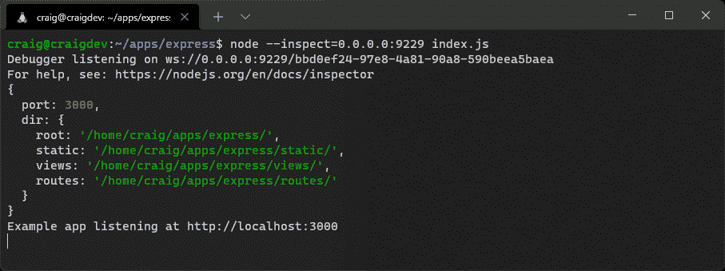

node inspect option.


您还可以使用`--inspect-brk`而不是`--inspect`在第一行暂停处理(设置断点),这样您就可以从头开始单步执行代码。

打开基于 Chrome 的浏览器，在地址栏输入`chrome://inspect`查看本地和联网设备:

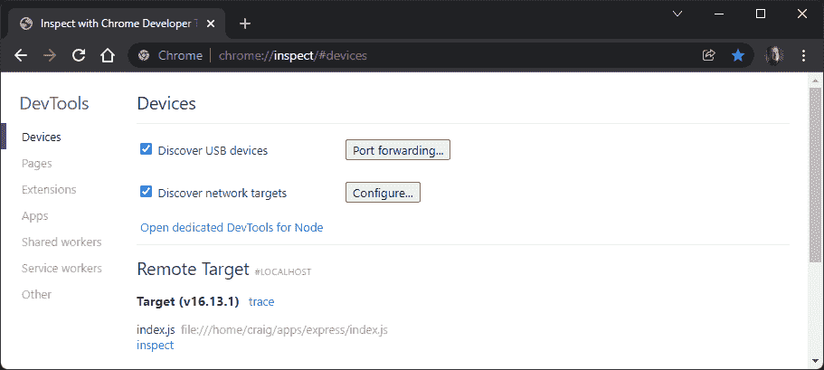

Chrome inspect tool.


如果 Node.js 应用程序没有作为**远程目标**出现，或者:

*   单击为节点打开专用的 DevTools 并选择地址和端口，或者
*   勾选**发现网络目标**，点击**配置**，然后添加运行设备的 IP 地址和端口。

单击目标的 **inspect** 链接以启动 DevTools 调试器客户端。任何使用 DevTools 进行客户端代码调试的人都应该对此很熟悉:

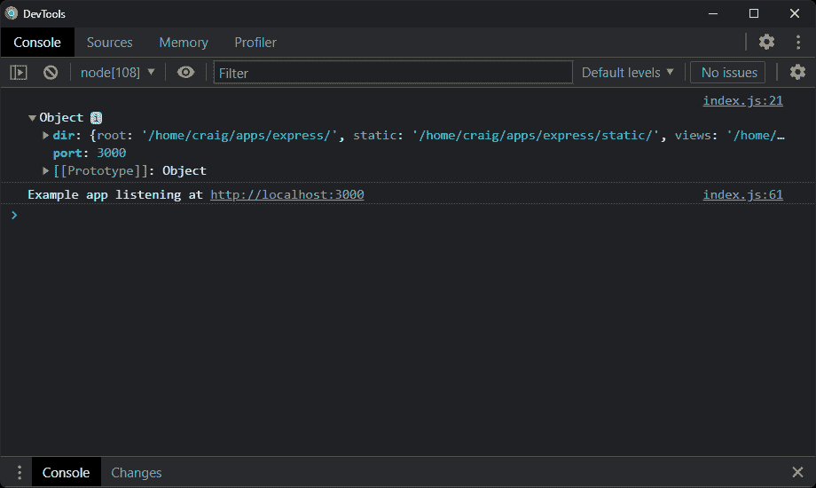

Chrome DevTools.


切换到**信号源**面板。您可以通过点击 Cmd | Ctrl + P 并输入其文件名(如 index.js)来打开任何文件。

但是，将项目文件夹添加到工作区更容易。这允许您直接从 DevTools 加载、编辑和保存文件(您是否认为这是一个好主意是另一回事！)

1.  点击 **+将文件夹添加到工作区**
2.  选择 Node.js 项目的位置
3.  点击**同意**允许文件更改

现在，您可以从左侧目录树中加载文件:

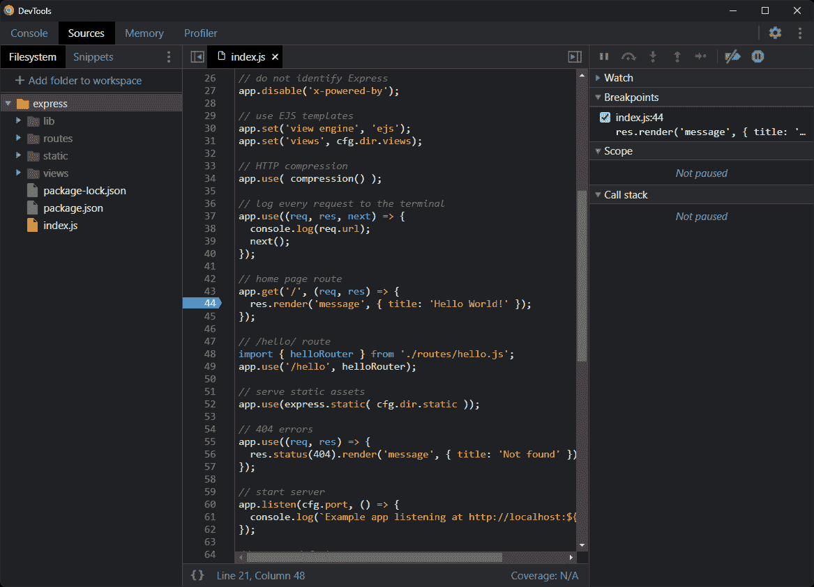

Chrome DevTools Sources panel.


单击任意行号设置由蓝色标记表示的断点。

调试基于*断点*。它们指定调试器应该在哪里暂停程序执行，并显示程序的当前状态(变量、调用堆栈等)。)

您可以在用户界面中定义任意数量的断点。另一种选择是放置一个调试器；语句，该语句在附加调试器时停止。

加载并使用 web 应用程序到达设置断点的语句。在这里的示例中， [http://localhost:3000/](http://localhost:3000) 在任何浏览器中打开，DevTools 将在第 44 行暂停执行:

Struggling with downtime and WordPress problems? Kinsta is the hosting solution designed to save you time! [Check out our features](https://kinsta.com/features/)

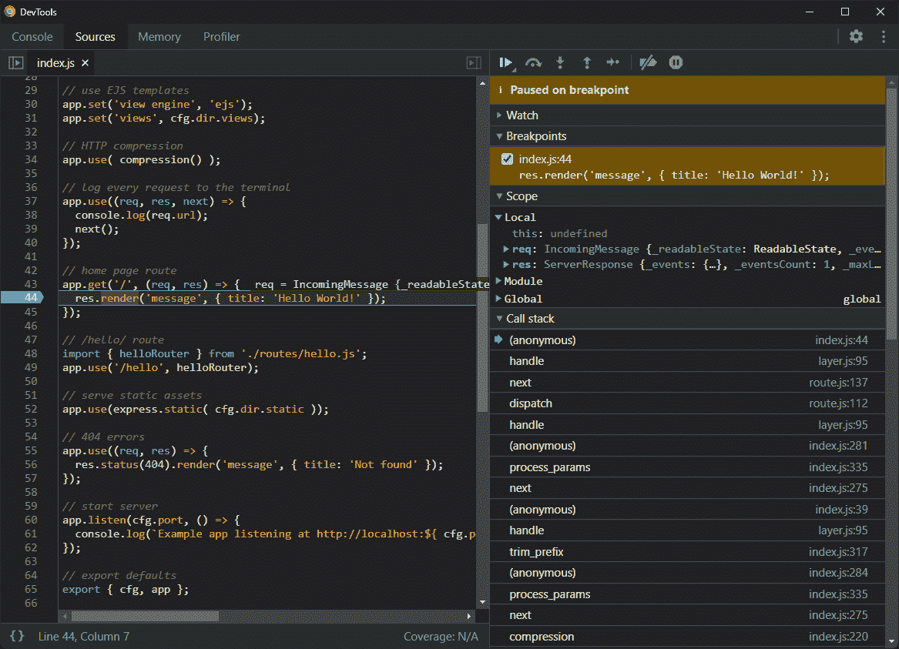

Chrome breakpoint.


右侧面板显示:

*   一排动作图标(见下文)。
*   一个**监视**窗格允许你通过点击 **+** 图标并输入它们的名称来监视变量。
*   一个**断点**窗格显示所有断点的列表，并允许启用或禁用它们。
*   一个**范围**窗格显示所有局部、模块和全局变量的状态。你会经常检查这个窗格。
*   一个**调用栈**窗格显示了到达这一点所调用的函数的层次结构。

在断点处暂停的**上方显示一行动作图标:**

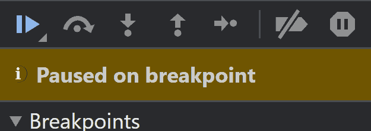

Chrome breakpoint icons.


从左到右，它们执行以下操作:

*   **继续执行**:继续加工，直到下一个断点
*   **步过**:执行下一条命令，但停留在当前代码块内——不要跳到它调用的任何函数中
*   **进入**:执行下一条命令，根据需要跳转到任意功能
*   **步出**:继续处理到函数结束，返回调用命令
*   **步骤**:类似于**步骤进入**，除了它不会跳转到异步功能
*   **取消激活**所有断点
*   **异常暂停**:发生错误时暂停处理。

## 条件断点

有时有必要对断点进行更多的控制。假设您有一个完成了 1000 次迭代的循环，但是您只对最后一次迭代的状态感兴趣:

```
 for (let i = 0; i < 1000; i++) {
  // set breakpoint here
} 
```

而不是点击**恢复执行** 999 次，你可以右击该行，选择**添加条件断点**，输入一个条件比如`i = 999`:

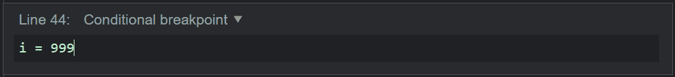

Chrome conditional breakpoint.


Chrome 以黄色而非蓝色显示条件断点。在这种情况下，断点仅在循环的最后一次迭代时触发。

## 日志点

日志点有效实现 console.log()，无需任何代码！当代码执行任何一行时，都可以输出一个表达式，但它不像断点那样暂停处理。

要添加日志点，右击任意一行，选择**添加日志点**，输入表达式，如`'loop counter i', i`:

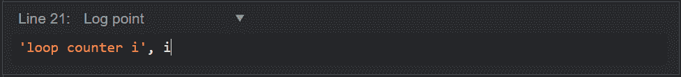

Chrome log point.


在上面的例子中，DevTools 控制台输出`loop counter i: 0`到`loop counter i: 999`。

## 使用 VS 代码调试 Node.js 应用程序

VS Code 或 Visual Studio Code，是微软的免费[代码编辑器](https://kinsta.com/blog/best-text-editors/)，它在[网络开发者](https://kinsta.com/blog/how-to-become-a-web-developer/)中很受欢迎。该应用程序可用于 Windows、macOS 和 Linux，并使用 web 技术在[电子框架](https://www.electronjs.org/)中开发。

VS 代码支持 Node.js，内置调试客户端。大多数应用程序不需要任何配置就可以调试；编辑器将自动启动调试服务器和客户端。

打开启动文件(如 index.js)，激活**运行调试**窗格，点击**运行调试**按钮，选择 **Node.js** 环境。单击任一行激活显示为红色圆圈图标的断点。然后，像以前一样在浏览器中打开应用程序——当到达断点时，VS 代码停止执行:

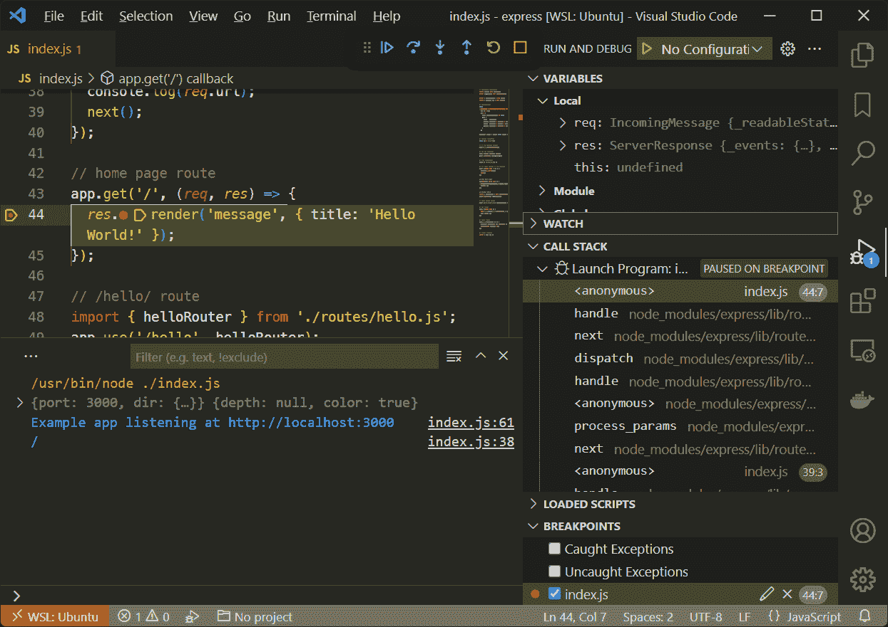

VS Code breakpoint.


**变量**、**观察**、**调用栈**和**断点**窗格与 [Chrome DevTools](https://kinsta.com/blog/inspect-element/) 中显示的类似。 **Loaded Scripts** 窗格显示哪些脚本已经被加载，尽管许多脚本在 Node.js 内部。

操作图标工具栏允许您:

*   **继续执行**:继续加工，直到下一个断点
*   **步过**:执行下一个命令，但停留在当前函数中——不要跳到它调用的任何函数中
*   **进入**:执行下一条命令，跳转到它调用的任何函数
*   **步出**:继续处理到函数结束，返回调用命令
*   **重启**应用程序和调试器
*   **停止**应用程序和调试器

和 Chrome DevTools 一样，你可以右击任意一行来添加**条件断点**和**日志点**。

有关更多信息，请参考 Visual Studio 代码中的[调试。](https://code.visualstudio.com/docs/introvideos/debugging)

## VS 代码高级调试配置

如果您想要在另一个设备、虚拟机上调试代码，或者需要使用其他启动选项(比如 nodemon ),那么可能需要进一步配置 VS 代码。

VS 代码将调试配置存储在项目的`.vscode`目录下的 launch.json 文件中。打开**运行调试**窗格，点击**创建 launch.json 文件**，选择 **Node.js** 环境生成该文件。提供了一个配置示例:

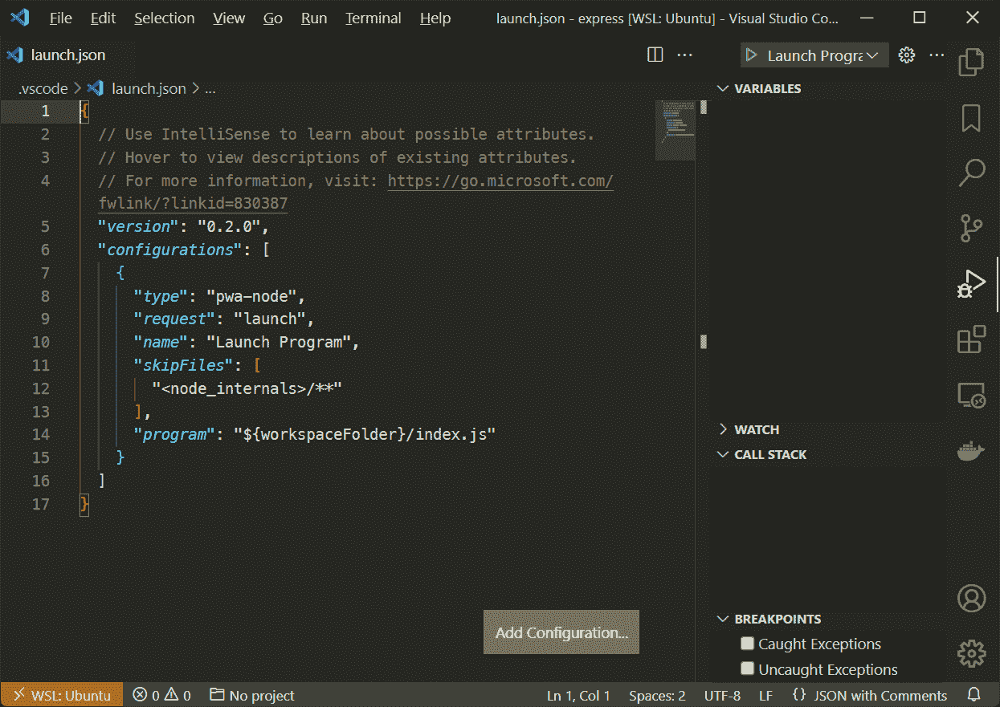

VS Code debugger configuration.


可以将任意数量的配置设置定义为`"configurations"`数组中的对象。点击**添加配置…** 并选择合适的选项。

单个 Node.js 配置可以:

1.  启动流程本身，或者
2.  连接到调试 Web Socket 服务器，可能运行在远程机器或 Docker 容器上。

例如，要定义一个 nodemon 配置，选择 **Node.js: Nodemon Setup** 并在必要时更改“程序”入口脚本:

```
{
  // custom configuration
  "version": "0.2.0",
  "configurations": [
    {
      "console": "integratedTerminal",
      "internalConsoleOptions": "neverOpen",
      "name": "nodemon",
      "program": "${workspaceFolder}/index.js",
      "request": "launch",
      "restart": true,
      "runtimeExecutable": "nodemon",
      "skipFiles": [
        "<node_internals>/**"
      ],
      "type": "pwa-node"
    }
  ]
} 
```

保存`launch.json`文件， **nodemon** (配置“名称”)出现在**运行和调试**窗格顶部的下拉列表中。单击绿色的 run 图标开始使用该配置，并使用 nodemon 启动应用程序:

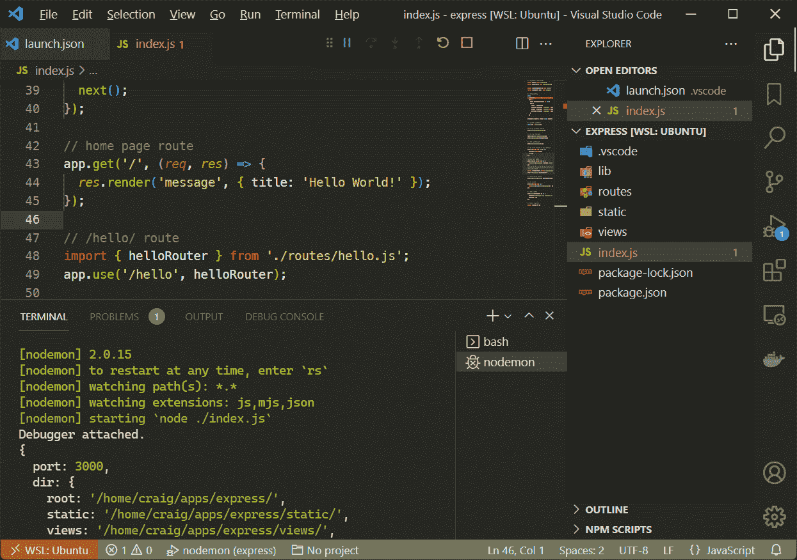

VS Code debugging with nodemon.


和以前一样，您可以添加断点、条件断点和日志点。主要区别在于，当文件被修改时，nodemon 会自动重启服务器。

更多信息，请参考[与代码启动配置](https://code.visualstudio.com/docs/editor/debugging#_launch-configurations)。

以下 VS 代码扩展还可以帮助您调试远程或隔离服务器环境中承载的代码:

*   [远程容器](https://marketplace.visualstudio.com/items?itemName=ms-vscode-remote.remote-containers):连接到 Docker 容器中运行的应用程序
*   [远程— SSH](https://marketplace.visualstudio.com/items?itemName=ms-vscode-remote.remote-ssh) :连接到运行在远程服务器上的应用程序
*   [Remote — WSL](https://marketplace.visualstudio.com/items?itemName=ms-vscode-remote.remote-wsl) :连接到运行在 Windows 子系统 for Linux (WSL)上的应用程序。

## 其他 Node.js 调试选项

[Node.js 调试指南](https://nodejs.org/en/docs/guides/debugging-getting-started/)为一系列文本编辑器和 ide 提供建议，包括 Visual Studio、JetBrains WebStorm、Gitpod 和 Eclipse。Atom 提供了一个[节点调试扩展](https://atom.io/packages/node-debug)，将 Chrome DevTools 调试器集成到编辑器中。

一旦您的应用程序上线，您可以考虑使用商业调试服务，如 [LogRocket](https://logrocket.com/) 和 [Sentry.io](https://sentry.io/) ，它们可以记录和回放真实用户遇到的客户端和服务器错误。

[需要一些调试应用程序的帮助吗？🐛从这里开始👇](https://twitter.com/intent/tweet?url=https%3A%2F%2Fkinsta.com%2Fblog%2Fnode-debug%2F&via=kinsta&text=Need+some+help+debugging+applications%3F+%F0%9F%90%9B+Start+here+%F0%9F%91%87&hashtags=Nodejs%2CWebDev)

T2】

## 摘要

从历史上看， [JavaScript 调试](https://kinsta.com/blog/errors-in-javascript/)一直很困难，但是在过去的十年中已经有了巨大的改进。这个选择和为其他语言提供的选择一样好——如果不是更好的话*。*

 *使用任何实用的工具来定位问题。使用 console.log()快速查找 bug 并没有错，但是对于更复杂的问题，Chrome DevTools 或 VS 代码可能更好。这些工具可以帮助您创建更健壮的代码，并且您将花费更少的时间来修复错误。

*你信誓旦旦的 Node.js 调试实践是什么？在下面的评论区分享吧！*

* * *

让你所有的[应用程序](https://kinsta.com/application-hosting/)、[数据库](https://kinsta.com/database-hosting/)和 [WordPress 网站](https://kinsta.com/wordpress-hosting/)在线并在一个屋檐下。我们功能丰富的高性能云平台包括:

*   在 MyKinsta 仪表盘中轻松设置和管理
*   24/7 专家支持
*   最好的谷歌云平台硬件和网络，由 Kubernetes 提供最大的可扩展性
*   面向速度和安全性的企业级 Cloudflare 集成
*   全球受众覆盖全球多达 35 个数据中心和 275 多个 pop

在第一个月使用托管的[应用程序或托管](https://kinsta.com/application-hosting/)的[数据库，您可以享受 20 美元的优惠，亲自测试一下。探索我们的](https://kinsta.com/database-hosting/)[计划](https://kinsta.com/plans/)或[与销售人员交谈](https://kinsta.com/contact-us/)以找到最适合您的方式。*