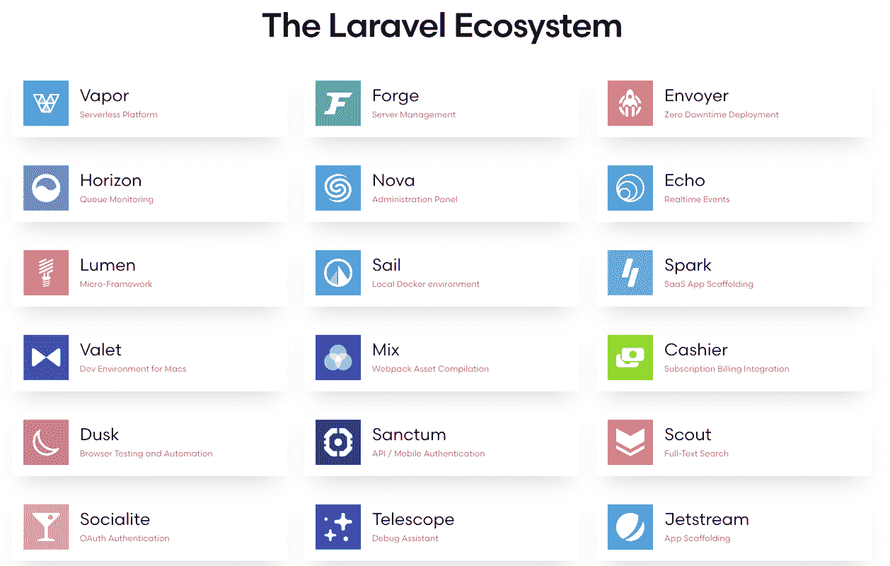
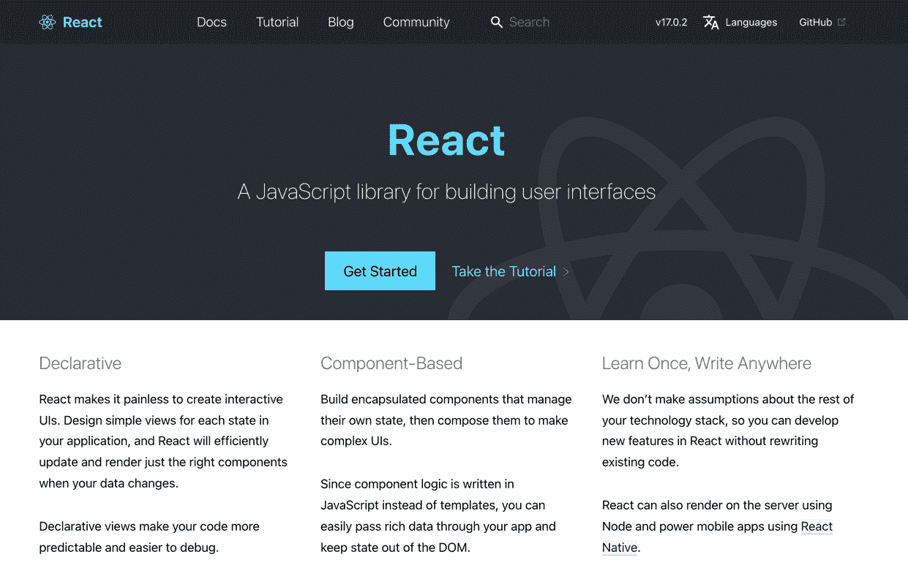
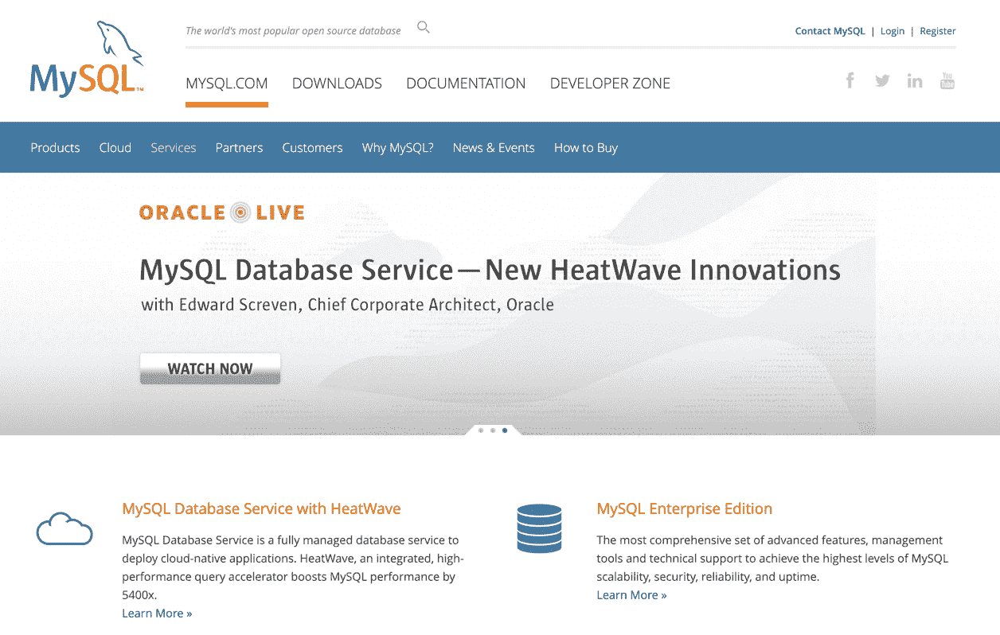
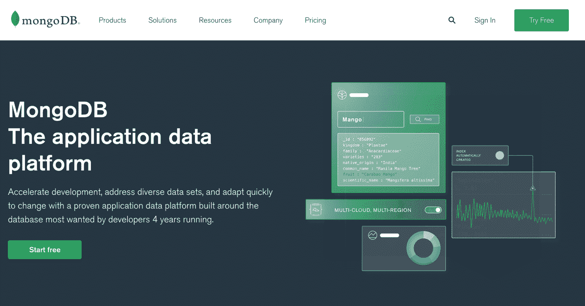
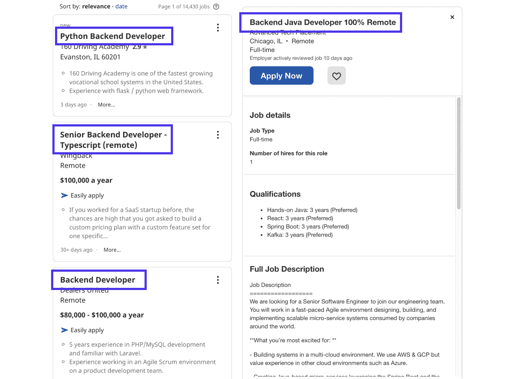

# 后端与前端:它们有什么不同？

> 原文：<https://kinsta.com/blog/backend-vs-frontend/>

像任何行业一样，Web 开发有自己的术语、工作类型、工具和技能。在 web 开发中，后端和前端经常被讨论。它们是什么意思？有没有重叠的地方？可以互换使用吗？

在这篇文章中，我们将比较后端和前端开发的主要区别，并通过 T2 探索工具 T3、T4 编程语言 T5 和每种开发人员使用的框架来具体说明这些区别。

此外，我们将帮助那些刚刚进入 web 开发行业的人。例如，后端开发比前端开发更赚钱吗？网站各个部分的工作流程是怎样的？

请继续阅读，查看我们对后端和前端 web 开发的深入比较！

## 后端与前端开发—主要区别

当比较后端和前端开发时，差异通常出现在以下几个方面:

*   这些类型的开发人员工作的领域。
*   各自使用的技术和工具。
*   后端和前端使用的语言。
*   工作要求和技能。

让我们从简单的开始:

> Kinsta 把我宠坏了，所以我现在要求每个供应商都提供这样的服务。我们还试图通过我们的 SaaS 工具支持达到这一水平。
> 
> <footer class="wp-block-kinsta-client-quote__footer">
> 
> 
> 
> <cite class="wp-block-kinsta-client-quote__cite">Suganthan Mohanadasan from @Suganthanmn</cite></footer>

[View plans](https://kinsta.com/plans/)

后端指的是在网站或 web 应用程序的后台运行的技术和接口，以产生完全面向服务器的接口或使前端成为可能。后端是面向服务器的，通常用户看不到。

前端指的是出现在网站或 web 应用程序前端的技术，这意味着它是一个面向客户端的界面，供用户使用计算机浏览器、按钮和文本等元素。

现在进入更详细的内容:

后端和前端开发之间的区别不仅仅是一个，而是一系列的技术、使用的工具、需要的技能和实现的语言，使它们彼此完全分离。当然，他们一起工作来渲染相同的最终产品:一个网站或 web 应用程序；然而，这低估了后端和前端开发过程的复杂性。

这里有一个更深入的探究是什么让每一个都独一无二。

[后端与前端—它们是什么意思？有没有重叠的地方？可以互换使用吗？在这里了解更多⬇️ 点击推文](https://twitter.com/intent/tweet?url=https%3A%2F%2Fkinsta.com%2Fblog%2Fbackend-vs-frontend%2F&via=kinsta&text=Backend+vs+Frontend+%E2%80%94+what+do+they+mean%3F+Is+there+any+overlap%3F+Can+you+use+them+interchangeably%3F+Learn+more+here+%E2%AC%87%EF%B8%8F&hashtags=WebDev%2CDevelopers)

### 后端开发

这就是你对后端开发的期望:

*   web 应用程序或网站的后端处理 web 项目数据管理的方方面面，尤其是在数据存储、交付和组织方面。
*   后端是网站开发的服务器端部分。有时，这意味着创建的网站或应用程序只能在服务器端呈现，比如在后台工作的内部数据库或为公司记录资源的文件服务器。然而，在 web 开发中，后端通常通过为前端工作人员提供数据库查找、云存储和文件管理等过程和服务，直接链接到前端。一个例子是约会网站上的用户数据库(后端)，其中的信息以个人资料的形式呈现(前端)。
*   用户几乎看不到后端。就像幕布后面的魔法；许多人不知道网站是如何工作的，但是后端经常告诉前端元素该做什么。
*   后端开发利用的语言有 [PHP](https://kinsta.com/knowledgebase/what-is-php/) 、 [Python](https://kinsta.com/blog/python-object-oriented-programming/) 、C++、Ruby、 [Java](https://kinsta.com/knowledgebase/what-is-javascript/) 等。
*   一些后端框架包括 [Laravel](https://kinsta.com/blog/laravel-developer/) ，Spring，Rails， [Django](https://kinsta.com/blog/django-vs-laravel/) ，以及 Express。其他脚本语言包括 Ruby、GO、REST 和 C#。
*   前端用户通过前端接口与后端进行技术上的交互，但是他们从来没有真正看到后端的工作。
*   额外的任务，如制作库和编写 API，也与后端接口相关联。开发人员只需利用它们来生成一个全新的功能。

### 前端开发

前端开发需要做的事情如下:

*   网站或 web 应用程序的前端包含用户交互的区域。它的主要目的是使用后端数据资源来传递信息，让用户做出决策，并使用按钮、媒体和计算器等工具来消费内容。
*   它是用户一直看到的东西，有时与从后端获取的数据结合在一起。
*   我们称前端为网站或应用程序的客户端，看看用户如何通过浏览器或其他界面导航前端。
*   前端常用的一些元素包括表格、按钮、颜色、文本、导航、图像，以及你在网站上遇到的所有视觉元素。
*   前端开发的语言包括 HTML、CSS 和 JavaScript。
*   前端开发人员的两个主要目标包括提高性能和响应能力，这意味着他们希望前端网站能够快速加载并在所有类型的设备上正常工作。
*   前端框架有 Flutter，SAAS， [jQuery](https://kinsta.com/knowledgebase/what-is-jquery/) ，React.js，AngularJS。
*   前端用户通常可以使用 GUI(图形用户界面)或命令行进行导航。

## 为什么 Web 开发中前端和后端是分开的？

出于几个原因，前端和后端是分开的。首先，它们是完全不同的接口，使用自己独特的框架、语言和开发机制。

然而，考虑到前端和后端在许多方面都有联系，这仍然是一个有效的问题。他们朝着同一个目标努力:制作一个功能网站、应用程序或软件。

难道我们不能说“发展”然后就到此为止吗？

是的，我们可以将前端和后端开发结合起来，用一个更通用的术语，比如“开发”，猜猜看，我们做到了！术语“开发”只是一个总括性的范畴，指所有类型的编码、设计和网站建设。此外，有一个术语叫做全栈开发，指的是前端和后端。

这有点像盖房子:在建筑团队中，你有木匠、电工、水管工、建筑师和许多其他工作，这些工作都参与到已完成的项目中。“建筑工人”、“房屋建造者”或任何你想称之为整个团队的东西都是由致力于完成一个共同目标的个人组成的。然而，这是一个广泛的范畴；说某人是房屋建筑商或建筑工人，并不能告诉我们他们的具体技能，他们使用的工具，或他们在房子的哪个部分工作。

建立一个网站就像建造一所房子。一个人自己盖房子可能吗？当然，但是效率较低，而且需要对那个人进行多方面的培训。前端和后端开发也是如此。他们是网站开发的子集，因为他们的能力是独一无二的。这使得行业内更容易为每项工作找到完美的人，而不是筛选许多自称为开发人员的人，但这只是意味着他们可以在一方面工作。

把一个前端开发者想象成一所房子的油漆工。后端开发人员就像一名电工，在墙内从事看不见但却至关重要的工作。油漆工可能有一些电工技能，电工可能有一点油漆经验，但是如果你想省钱却没有找到这项工作所需的专业人员，那你就太傻了。
T3】

## 用于前端和后端开发的技术和语言

我们提到前端和后端开发人员有独特的工具箱，这些工具箱包括不同的:

*   结构
*   [语言](https://kinsta.com/blog/best-programming-language-to-learn/)
*   图书馆
*   数据库

让我们从框架开始

### 后端框架

框架为开发人员快速创建网站和 web 应用程序提供了基础，就像模板一样。这些框架遵循旧的规则，不重新发明轮子；有人已经做好了基础工作，潜在的站点文件、数据库和其他元素已经准备就绪，可以在项目的起点使用。

框架可以节省时间，允许更标准化的开发世界，当公司不必从头开始时，他们可以更容易地扩展。你通常也不需要为框架付费。

Examples of components that make up a backend framework.

后端和前端开发人员都利用框架来加速他们的工作过程。一些最流行的后端开发框架包括:

*   Django: 一个开源框架，可用于各种应用程序，同时还实现了一个安全、功能丰富的开发环境。[开发人员倾向于 Django](https://kinsta.com/blog/django-vs-wordpress/) ，因为它被认为是最快的框架之一，同时提供了比其他框架不太陡峭的学习曲线。
*   **Spring Boot:** 使用 Java 语言，使用 Spring Boot 作为框架的优势包括其易于定制的应用程序属性，对 Jetty 和 Undertow 的支持，以及改进的依赖性管理。开源框架最适合应用程序，并为 Java 应用程序提供功能。
*   这个后端框架有一个[模块化打包系统](https://kinsta.com/knowledgebase/what-is-laravel/)和一个内置在框架中的依赖管理器。它非常适合接入关系数据库、[实时评论](https://kinsta.com/blog/laravel-comments/)、[缓存](https://kinsta.com/blog/laravel-caching/)，改进您的认证，并简化 API 过程。
*   Rails: 这个服务器端应用程序框架专注于通过提供最流行、最简单的后端框架选项，以经济高效、一致的方式构建数据库、web 服务和完整的网站。Ruby 背后的目标是在一个没有 bug 的环境中实现开发结果，同时也扩大网站规模，即使网站计划支持数量惊人的用户。
*   express js:express js 框架主要用于构建 API 和应用程序，它既是后端开源组件，也是 NoSQL 等特定数据库的前端解决方案。 [NodeJS 作为 ExpressJS 内部的编程语言](https://kinsta.com/blog/how-to-install-node-js/)。
*   Asp。NET:ASP.NET 核心被吹捧为一个模块化框架，用于最少的编码、改进的维护和跨平台支持，它努力争取比其他框架更好的性能，以及在整个项目中限制代码量的体验。C#语言支持这个框架。
*   CakePHP:CakePHP 框架通常用于面向媒体的网站，它是用 PHP 编写的，非常流行的开源框架源于 Ruby on Rails 系统，但它更关注数据映射、活动记录和对象关系映射。它的灵活性和可扩展性使 CakePHP 成为后端框架的理想选择。它允许开发人员生成可重用的代码片段，以便在其他项目中或在同一个项目中展开和利用。
*   **Phoenix:**Phoenix 后端框架的主要目的是生成高性能的应用程序，大多数应用程序从一开始就内置了可伸缩性。生产力是 Phoenix 的核心，因此由于其改进的容错能力和有助于提高可靠性的元素，您会发现更少的错误——并且您能够一次运行相当多的事件，加快开发过程，而不必太担心键入错误。

### 前端框架(和库)

在事物的前端，开发人员可以从框架和库中进行选择。有时候，库和框架之间的界限很模糊，但是，一般来说，前端框架是文件、语言和工具的模板，用于快速构建和扩展 web 应用程序或网站的前端部分。当比较后端和前端时，前端框架执行的任务包括网站设计、[管理 AJAX 请求](https://kinsta.com/blog/admin-ajax-php/)，以及弄清楚后端文件如何在前端使用和呈现。

React.js blurs the lines between frontend frameworks and libraries.

另一方面，库倾向于将更多的资源“转储”给开发者，而不提供同样多的结构。一些库是边缘框架，框架通常包含被认为是库的东西。简单地说，库可以帮助开发人员执行特定的任务，但不需要开发人员的任何架构站点风格。图书馆是资源的大集合，而不是指导性的基础。

框架通常是较小的软件包，旨在完成特定的目的，并从本质上“迫使”开发人员遵循特定的准则、语言和架构。框架通常被认为在效率方面更好(因为它们就像预置的模板)，而库提供了更多的自由(但是帮助少得多，所以它们并不意味着快速伸缩)。

看看一些流行的前端框架和库:

*   React.js: 作为一个用于构建用户界面的 JavaScript 库进行营销，这正是你应该从脸书管理的库所期待的。 [React.js](https://kinsta.com/blog/angular-vs-react/) 特性包括在整个开发过程中保持稳定和安全的用户界面组件；一套 SEO 友好的工具，非常适合在应用程序的其他部分或其他项目中重用；[快速调试](https://kinsta.com/blog/code-review-tools/)；提升速度；和单向完成的数据绑定。
*   **AngularJS:**[AngularJS 前端框架](https://kinsta.com/blog/angular-vs-react/)来自谷歌的人。它使用 Typescript 编程语言以及开发模型和产品实际视图之间的实时同步。TypeScript 语言是用 Angular 实现的，以帮助那些希望快速定位错误、减少编写错误、保持所有代码整洁和易于理解的开发人员；所有这些都是由 TypeScript 提供的(与 JavaScript 相关)。
*   **Bootstrap:** 如果你计划构建一个响应式网站的前端，你可能会考虑 Bootstrap 框架。有些人称它为框架，但它更像是一个库，具有令人难以置信的前端工具包、各种预构建的组件和一些令人印象深刻的插件，用于与您计划在移动友好网站中实现的任何 HTML、CSS 或 JavaScript 文件相结合。
*   **Vue.js:** 这是[另一个使用 JavaScript 语言的前端框架/库](https://kinsta.com/blog/vue-js/)，类似于 React.js，框架的主要[目的是开发单页应用和在线界面。它是设计上最简单的框架之一，提供了内置的 CSS 动画和过渡，各种 HTML 模板，并且比其他类似的框架要小得多。](https://kinsta.com/blog/headless-wordpress/)
*   jQuery: 也是一个使用 [JavaScript 语言的框架](https://kinsta.com/knowledgebase/what-is-javascript/)，jQuery 的历史可以追溯到 2006 年，这使得它成为开发人员轻松构建框架前端接口的最早选择之一(jQuery 可以在互联网的很大一部分找到，它有一个强大的社区来帮助那些使用框架的人)。总的来说，它是一个浏览器友好的、面向移动设备的框架，最显著的是减少了前端网站界面所需的 JavaScript 代码量。
*   **Ember.js:** 继续使用 [JavaScript 构建的框架](https://kinsta.com/blog/javascript-media-query/)，Ember.js 提供了更快的开发潜力、改进的组织，并为大型团队集成、调试和创建完整的稳定系统提供了选项。像 LinkedIn、Apple 和 Square 这样的顶级公司都使用 Ember.js，这主要是因为它简化了开发方法、模式、通用习惯用法和更多人可以理解的标准实践。
*   在谈论了这么多迎合 CSS、HTML 和 JavaScript 用户的库和框架之后，这一个是独一无二的。前端 Flutter 框架依赖于一种称为 Dart 的编程语言，而不是行业标准，这种语言有助于制作高性能的移动、桌面和 web 应用程序，从一个代码库中提取所有内容。
*   Semantic-UI: 坚持使用更简单、标准化的[语言，如 HTML](https://kinsta.com/blog/learn-html/) 和 [JavaScript](https://kinsta.com/blog/php-vs-javascript/) ，Semantic-UI 迎合了那些希望快速开发前端界面，并使用简洁的 HTML、简化的调试工具和数以千计的主题变量来生成响应性网站布局的人。除了 50 多个 UI 组件和 5，000 个提交之外，它还是一个可以与其他库很好地配合的框架，并为您提供了极大的灵活性。
*   顾名思义，这个前端框架加速了现代的、反应灵敏的网站的开发，同时使用了一种材料设计方法。该框架包含一些主题，并提示开发人员使用 JavaScript 和 CSS 来操作组件，生成表单等项目，并使用粗体、图形元素和动作来制作 web 设计以吸引注意力。
*   Backbone.js: 作为一个 web 应用程序库，Backbone.js 提供了一个快速的平台，用于使用 JavaScript 进行项目工作，以及创建单页 web 应用程序，但具有同步 web 应用程序多个部分的额外好处。它可以与 jQuery 以及其他框架和库(如 Underscore.js)协同工作。
*   **Foundation:** 你可以用 Foundation 制作各种移动优先的网络应用、网站，甚至 HTML 电子邮件，因为前端框架用 CSS 和 [HTML](https://kinsta.com/blog/html-best-practices/) 为[开发提供了一个快速响应的网格。开发人员可以利用按钮、代码片段和导航菜单等基本元素，同时还可以利用预先构建的模板。这使得 Foundation 成为许多前端开发人员的共同选择——因为它提供了构建移动网站所需的一些最常见的模式。](https://kinsta.com/blog/optimize-css/)

### 后端语言

您可能已经注意到，前几节中的所有框架和库都适用于特定的编程语言。这是因为在开发前端或后端 web 应用程序时，框架是核心基础；将这些基础结合在一起的是编程语言。

回到我们的房屋建造类比，框架就像是用来建造房屋的窗户、干墙和工具的集合。编程语言就像是使这些元素发挥作用的原材料，就像胶水、玻璃和窗户的木材。

编程语言允许开发者写出最终由计算机执行的脚本、指令和站点文件。因此，前端或后端开发人员必须精通特定的语言，才能使用框架创建应用程序或网站。

然后，他们可以使用框架作为快捷方式，同时使用相同的语言输入他们的定制代码。这些语言被输入到类似文本或 HTML 编辑器的东西中，为组织而编译，然后转换成机器语言，这样计算机就可以处理数据并完成所需的指令集。

后端语言与后端框架直接相关，并帮助处理后端工作，如业务逻辑、数据库调用、网络、图像处理等等。

PHP programming language’s website.

这些语言最常用于后端框架中，或者在任何形式的后端项目中使用:

*   **PHP:**PHP 也许是最著名的后端语言之一， [PHP](https://kinsta.com/knowledgebase/what-is-php/) 为各种 web 开发提供了一种包罗万象的通用脚本语言。它与 HTML 的前端语言交互，但是[与 JavaScript 的交互方式](https://kinsta.com/blog/php-vs-javascript/)不同。它可用于所有主要的操作系统，提供错误报告，是安全的，并给予开发人员极大的控制，而无需使用长行代码。
*   **Java:** 这种服务器端语言于 1995 年推出，使其对移动应用、桌面应用、web 服务器、web 应用、数据库连接等变得可靠。尽管许多人认为 Java 是 JavaScript 的前身，或者在某种程度上与之相关，但它们是完全不同的语言。就特性而言，Java 是一种免费的开源语言，可以在大多数主流操作系统上运行，并且安全、快速、简单易用。它是一种面向对象的语言，用于可管理的开发环境，许多人在 Java 和 C++(或者 Java 和 C#)之间转换，因为这两种语言非常相似。
*   **Python:** 另一种主流的服务器端语言叫做 Python。你可以在 Instagram、脸书、Quora 和许多其他大型科技公司的应用和网站上找到 Python 的实现。Python 非常适合数学、软件开发、脚本以及它更常见的用途:后端 web 开发。Python 的全部意义在于提高可读性，所以它有点类似于英语。
*   c++:c++编程语言通常在学校教授运行数学函数，它也是生成在线应用程序、网站元素和高性能计算的一种方式。作为一种流行的(如果不是最流行的)编程语言，它的后端使用对于适应多种平台、重用以前创建的程序以及与几乎任何图形用户界面集成都很方便。更不用说，C++看起来和 Java、C#比较接近，所以学习那些语言的人会发现从一种语言跳到另一种语言很容易。
*   **JavaScript:** 我们说 [JavaScript](https://kinsta.com/knowledgebase/what-is-javascript/) 和 Java 不一样，确实如此。JavaScript 为后端和前端提供了开发潜力，在两种类型的框架中都有使用。谈到后端开发，JavaScript 扩展了所有核心语言，为整个网站提供特定的对象，比如让一个应用程序与数据库通信。
*   Ruby 语言在 web 应用和网站的后端开发中持续流行，主要是因为它更容易读写；看起来很像英语。它也是一种面向对象的语言，不需要编译器来运行网站和应用程序，并且可以与它的合作伙伴框架 Rails 完美结合。

### 前端语言

客户端开发中使用的前端语言更加面向客户。因此，这些语言更为公众所熟知。当提到任何类型的 web 开发时，一般人都会想到这些语言。

前端语言对于制作用户友好的网站、网络应用和移动应用是必不可少的。它们是开发人员如何生成漂亮的界面、高性能的网站以及访问网站时通常会与之交互的所有元素。

当选择正确的前端语言时，开发人员从他们所知道的开始，然后选择适合预期结果的特定框架和语言。例如，HTML 为用户提供了基本的、高性能的体验，对于构建简单的网站很有意义。CSS 在样式方面将 HTML 推进了一步。

然而，你必须永远不要忘记，这些语言中的一些一起工作才能产生最好的结果。许多网站都有 HTML、CSS 和 JavaScript 的某种组合，它们协同工作。

以下是主要的前端开发语言:

*   **HTML:** 与网页设计的核心基础同义， [HTML(超文本标记语言)](https://kinsta.com/blog/html-vs-html5/)为在线开发任何类型的网站提供了基本的、主要的标记语言。HTML 可以组成从文本到图像、链接到标题的所有内容，并提供特定级别的样式来显示这些项目在页面上的最终位置。HTML 本身可以很好地生成静态网页。尽管如此，当与 JavaScript 和 CSS 等其他语言结合使用时，您可以完成更高级的任务，生成现代样式，并影响站点编码中其他语言的行为。
*   CSS: 层叠样式表的首字母缩略词，CSS 是关于操作前端元素使它们更可展示，清理所需的 HTML 代码量，以及样式化仅用 HTML 是不可能的过程。HTML 包含网站的实际前端内容(由于 HTML 中标签的限制，还有一些基本的样式选项)，而 CSS 为这些内容提供样式，它们都存储在服务器上 CSS 文件中的外部样式表中。
*   JavaScript: 我们谈到 JavaScript 是后端部分最流行的编程语言，但它也被认为是前端开发人员的首选语言之一。JavaScript 的前端版本与 HTML 和 CSS 协同工作以产生漂亮的布局。HTML 侧重于文档结构，CSS 侧重于样式，而 JavaScript 提供了让前端客户端与服务器交互的基本解决方案。
*   Dart 因其与 Java 和 C 语言的相似性而闻名，Dart 是用于移动应用程序开发和编程的，这意味着你可以用该语言创建任何东西，包括应用程序、网站、服务器和桌面软件。

### 数据库

除了语言、框架和库之外，前端和后端开发人员在处理数据库方面也有所不同。

数据库通常只由后端开发人员管理。全栈开发也处理数据库，但是前端工作人员只与数据库交互，以确保用户界面产生正确的结果。

简而言之，前端开发人员将测试数据库功能，检查结果，并检查连接是否顺畅。尽管如此，前端开发人员发现的任何问题都很可能被记录下来，并发送给后端开发人员进行分析和修复。

因此，后端利用数据库，将它们与系统集成，并在未来管理它们。

但是用什么数据库呢？

有相当多的数据库可用，但是后端 web 开发有两种标准类型:

## 注册订阅时事通讯

### 想知道我们是怎么让流量增长超过 1000%的吗？

加入 20，000 多名获得我们每周时事通讯和内部消息的人的行列吧！

[Subscribe Now](#newsletter)

*   关系数据库
*   非关系数据库

关系数据库，通常被称为 SQL(结构化查询语言)数据库，使用表来组织和定义数据之间的关系。SQL 是在关系数据库中实现的语言，因此它构造表、移动数据，并允许开发人员根据自己的需要修改数据库的特性。

在数据库中使用表时，后端开发人员可以轻松完成以下任务:

*   生成数据库记录
*   更新数据库记录
*   删除数据库记录
*   搜索整个数据库
*   用批量数据填充数据库

开发人员还通过维护和优化整个数据集来超越常规的更新、搜索和删除数据点。总的来说，SQL 数据库是垂直可伸缩的，这意味着您可以将任何系统(如处理器和存储)实现到后端开发中，并利用任何可用的资源。

然而，所有的计算机都有极限，所以可能很难扩展你当前机器设置的极限。假设数据负载超过了当前机器所能提供的。在这种情况下，您必须转移到更大的系统，或者将数据库重新配置为 NoSQL 数据库(可水平伸缩)。

以下是关于 SQL 或关系数据库需要记住的一些其他事情:

*   它们使用预定义的结构化模式，而不是结构化程度较低的动态数据模式。
*   由于其垂直可伸缩性，SQL 数据库需要高性能的硬件，这些硬件通常专门用于这项工作。这是因为您不希望最终处于数据库无法支持数据增长的境地。
*   用于 web 开发的关系(SQL)数据库示例包括 [MySQL](https://kinsta.com/knowledgebase/what-is-mysql/) 、Sybase、 [PostgreSQL](https://kinsta.com/knowledgebase/what-is-postgresql/) 和 Oracle SQL。
*   SQL 数据库对于需要复杂数据查询和数据有效性的项目最有意义。
*   当试图存储复杂的层次数据集时，它们并不出色。
*   许多 SQL 数据库是开源的，但是根据您的选择，您可能需要为一些数据库付费。

MySQL is of the most commonly used SQL databases.

另一方面，非关系数据库或 NoSQL 数据库提供了一个比 SQL 更容易扩展的数据库解决方案，可以存储大量的分层数据，并生成高性能的 web 应用程序。总的来说，当存储需求过高或者需要快速数据分发(通常是实时数据分发)时，这是一种很有价值的数据库类型。难怪脸书、推特和谷歌等最大的社交网络和搜索引擎都严重依赖 NoSQL 数据库的支持。

与 SQL 数据库的结构化表格式不同，NoSQL，非关系数据库提供了存储从结构化到非结构化数据的高级技术。它甚至支持多态存储。

这是因为 NoSQL 利用图形数据库、配对和文档日志，而不是来自 SQL 的基本表存储。NoSQL 有纵向扩展的潜力，最大限度地减少对最高性能机器的需求。相反，它提供了一种随着开发需求的出现而升级的方法，并在必要时链接到其他机器。

这也来自 NoSQL 的动态图式。非结构化数据库更加灵活。

非关系数据库包括 [MongoDB](https://kinsta.com/knowledgebase/what-is-mongodb/) ，Cassandra，Neo4j，Redis。这些是后端开发人员在实现 NoSQL 数据库时会考虑的产品名称。

MongoDB is one example of a NoSQL database.

以下是关于 NoSQL 数据库的一些其他想法:

*   它们都是开源的。
*   它们最适合海量数据存储和灵活性。
*   你不会发现它们适合复杂的查询。坚持使用 SQL 数据库。
*   NoSQL 在分层数据存储和管理方面做得很好。
*   这个想法是为了快速提供数据，有时以牺牲准确性为代价。

## 后端与前端开发人员:这些工作有什么不同？

我们现在知道了在后端和前端开发领域工作时所使用的工具(比如框架)和语言。但是实际的工作呢？作为前端或后端开发人员，日常工作是什么样的？

我们已经解释过，每种类型的发展都需要特定范围的技能，这意味着进入工作岗位的工作也是不同的。没错。

让我们看看每种开发类型所需的任务，以及前端和后端工作人员可用的职称。

### 前端开发任务

*   使用框架并为整个架构创建新的、面向用户的代码，确保高效、有吸引力的用户体验。
*   使用 AJAX 改进网站呈现数据和交互元素的方式，同时在后台动态加载特定的服务器数据，而无需重新加载页面。
*   与后端开发人员互动，将数据库等后端元素与表单、按钮和菜单等前端界面组件结合起来。
*   创建实体模型、线框和其他原型，并将它们从一个想法转变为最终产品。
*   测试界面和[调试](https://kinsta.com/blog/wordpress-debug/)以确保用户体验尽可能完美。
*   思考改善用户体验的方法，使用开箱即用的思维和沟通技巧与产品经理、客户支持代表和其他利益相关者进行互动。
*   接受来自利益相关者，甚至用户的建议、批评和变更，然后在另一端将这些想法转化为编码的解决方案。
*   将其他创意人员的所有视觉作品组合在一起，以确保一切按预期进行。前端开发人员基本上从照片(来自摄影师)到文本(来自文案)获取一切，并将其一起塑造成最终的艺术作品。
*   使用内容管理系统、API 和其他工具来完成设计。
*   一些前端开发者也被期望提供图形设计服务，内容，或者任何在网站前端的东西；这完全取决于公司可用的资源以及谁被雇佣来完成这项工作。

### 后端开发任务

*   处理面向服务器的应用程序逻辑，并弄清楚如何将重要工具集成到基础架构中。
*   建立数据库来存储从电子邮件联系信息到详细的员工资料、人们约会或产品的一切信息。
*   努力确保后台数据库准备好与网站或应用程序通信。
*   与组织内的 IT 专业人员互动以处理服务器维护。有时，大部分服务器维护完全由后端开发人员负责，这取决于组织。一些公司将他们的后端开发人员视为无所不知的技术人员。
*   编写代码以增强数据库的功能，改进服务器为最终应用程序生成结果的方式，并集成所有移动部分。
*   使用框架来构建和完成网站或应用程序的整个后端基础架构。
*   [监控网站的健康状况](https://kinsta.com/apm-tool/)，运行后端安全协议，并处理任何需要解决的错误。
*   使用 Python、Java 和 PHP 等常见后端语言进行编程。
*   创建干净的、记录良好的代码，这些代码也可以发送给涉众，并被公司中的其他人用来继续项目。
*   与产品经理和其他利益相关者合作，充分理解项目的基础。因此，沟通技巧是必不可少的，并且能够将交流的信息转化为最有效的编码解决方案。

### 前端开发人员可用的工作类型

以上所有任务合在一起，为开发人员形成了一个更加明确的工作角色。然而，并不是每个网站项目都是一样的。一些公司需要前端开发人员制作一页的移动登录页面，在这里你主要使用 iOS 和 Android 界面。

Struggling with downtime and WordPress problems? Kinsta is the hosting solution designed to save you time! [Check out our features](https://kinsta.com/features/)

相比之下，另一家公司可能会要求你通过消除 HTML 的过度使用并制定一个主要利用 JavaScript 的计划来简化数据密集型网站。

因此，这里有一些你可以期待看到的前端开发人员的职位名称:

*   CSS 开发人员
*   CSS/HTML 开发人员
*   内容管理器
*   前端可访问性专家
*   前端开发工程师
*   前端工程师
*   前端搜索引擎优化专家
*   前端测试工程师
*   前端 Web 应用程序开发人员
*   前端网页设计师
*   全栈开发人员
*   通用前端开发人员
*   HTML 开发者
*   IA 或 IxD 设计师
*   JavaScript 开发人员
*   移动前端开发者
*   网站开发者
*   UX 设计师
*   用户界面开发者
*   网页设计师
*   WordPress 开发者(见工资[信息这里](https://kinsta.com/blog/wordpress-developer-salary/)

### 后端开发人员可用的工作类型

正如你从前端开发人员的职位名称中可以看到的，一些常用术语与更具体的词语结合在一起，使公司能够精确地确定他们需要的人员类型。你也可能会看到虚构的职位名称，比如“黑客”、“忍者”或“摇滚明星”尽管如此，这些并没有告诉我们什么，通常是一个组织试图看起来异想天开。

你会发现后端开发人员的职位也有类似的趋势，只是他们通常会提到后端、工程或所使用的特定类型的编程语言。

以下是一些例子:

*   API 后端开发人员
*   后端开发人员
*   后端软件工程师
*   云开发者
*   数据库开发人员
*   DevOps 工程师
*   电子商务开发商
*   全栈开发者
*   iOS 开发者
*   [Java 开发者](https://kinsta.com/blog/java-developer/)
*   节点 JS 后端开发人员
*   PHP 开发人员
*   节目编排者
*   Python 开发者
*   软件工程师
*   Web 开发人员

Examples of backend development job titles.

你也可能会看到专注于网站建设、[内容管理系统](https://kinsta.com/knowledgebase/content-management-system/)或正在使用的电子商务平台的开发职位，如 Magento Developer、Shopify Developer 或 WordPress Developer。

请记住，许多职位名称并不准确。这完全取决于写职位描述的人，以及招聘该职位的公司。例如，软件工程师并不直接意味着你在谈论后端开发人员，但它经常被用来表明这一点。从技术上来说，软件工程师意味着“程序员，但不是 web 程序员”，所以这不是对后端开发人员的准确描述。

## 前端与后端开发人员工资

如果你打算从事网站开发工作，你可能想知道在获得文凭或通过培训项目后你能得到多少报酬。

那么，有哪些前端与后端开发工资的例子？

*   根据 Salary.com 的数据，美国前端开发人员的平均工资是 119，224 美元，在 106，000 美元到 130，000 美元之间。
*   后端开发的平均工资([来自 Salary.com](https://www.salary.com/research/salary/recruiting/back-end-developer-salary))是 106255 美元。价格范围在 91，000 美元到 120，000 美元之间。
*   Glassdoor 表示，前端开发人员的平均基本工资为 87，136 美元，在 52，000 美元到 147，000 美元之间。
*   根据 glass door 的统计，后端开发人员的平均基本工资为 80，086 美元，从 48，000 美元到 133，000 美元不等
*   Indeed.com 的分析对平均工资和奖金进行了更深入的分析，指出美国前端开发人员的平均年薪为 103，380 美元，现金奖金约为每年 2，500 美元。
*   此外，[根据 Indeed.com 的数据](https://www.indeed.com/career/back-end-developer/salaries)，前端工人的平均年薪为 117，811 美元，每年有 4，000 美元的现金奖金。

您还可以[查看我们对平均网络开发工资的深入调查](https://kinsta.com/blog/web-developer-salary/),了解以下信息:

*   网站开发工作需求
*   成为付费网站开发者所需的技能
*   基于工作经验、工作类型等多种来源的 web 开发人员平均工资
*   如何开始自由职业生涯，成为一名网页开发人员
*   按编程语言列出的薪金

我们还发布了关于 PHP 开发人员平均工资的更详细的信息。那篇文章首先详细介绍了后端工作和工资，以及 PHP 开发是否是一份好工作。

这并不是一个硬性规定，但是后端开发工作提供了更高的薪水*潜力。然而，根据我们的消息来源，许多前端开发人员与后端开发人员相比，获得了更高的*起薪*和*平均工资*。为什么会这样呢？*

总的来说，这取决于你的技能，具体工作的复杂性，以及你与公司一起成长的速度。此外，根据可变的生活成本，在某些地方工作会产生较高/较低的工资。

以下是基于地点的发展薪酬差异示例:

*   在旧金山，后端开发人员的平均收入高于前端开发人员(后端为 156，175 美元，前端为 146，806 美元)。尽管如此，根据对 Indeed.com[前端](https://www.indeed.com/career/front-end-developer/salaries)和[后端支付](https://www.indeed.com/career/back-end-developer/salaries)的地区分析，前端开发人员在西雅图的平均工资更高(前端为 122，256 美元，后端为 118，875 美元)。
*   前端开发薪资最高的城市包括旧金山、西雅图、洛杉矶、达勒姆、纽约、奥斯汀、芝加哥和丹佛(按此顺序)。相比之下，后端开发薪资最高的城市包括旧金山、圣何塞、波士顿、纽约、芝加哥、西雅图、达拉斯和拉斯维加斯(也是这个顺序)。
*   与全国平均水平相比，薪酬最低的州是爱达荷州、缅因州、密西西比州、新墨西哥州、阿拉巴马州、南卡罗来纳州和特拉华州。
*   与全国平均水平相比，后端开发工作薪酬最低的州是南卡罗来纳州、肯塔基州、印第安纳州、佛罗里达州、堪萨斯州、俄克拉荷马州、路易斯安那州、密苏里州、田纳西州、密歇根州、威斯康星州、俄亥俄州、特拉华州、内华达州和犹他州。

考虑到所有这些，我们应该记住，生活成本会根据你的位置而变化，因此，与纽约或洛杉矶的类似职位相比，印第安纳波利斯的后端开发工作的较低工资会带来更大的收益。

总体而言，后端开发人员似乎从高度复杂的技术项目中获得了回报，尤其是当该开发人员已经存在很长时间，并且对公司的持续成功至关重要时。这就是为什么我们倾向于看到后端开发人员有更高的增长。

这在某种程度上与非编码人员对后端开发的理解有关。他们能够理解前端开发，因为他们熟悉可视化组件。后端开发感觉和看起来像是除了开发人员之外没有人理解的胡言乱语、无聊的数据库和神奇的过程。

然而，一些消息来源称，前端开发人员的平均工资和起薪更高。我们只能猜测，但这可能是由于对高度视觉化、交互式界面的需求不断增长，因为科技公司正在争相用花哨的设计打动日常用户。

我们还生活在一个以移动为中心的世界，这个世界几乎总是落入前端开发者的手中。

不管怎样，后端与前端开发的薪资潜力现在看起来很有希望，而且在未来也很有希望。有才华的新开发人员可以从健康的 50，000 美元的薪水开始，如果产生高质量的结果，他们的薪水可以达到六位数。这两种职业都很受欢迎，而且随着技术的发展和进步，这种情况还会持续下去。

## 哪种类型的发展适合你？

web 开发的职业生涯通常是从这类问题开始的。你想通过前端或后端工作来创建网站、应用程序和其他项目吗？让自己沉浸在一个全栈开发环境中是可能的，但是你通常必须从一个或另一个开始，以免不知所措。

那么，你如何着手回答这个问题呢？

首先，你应该浏览一个你喜欢什么的列表，以及这些兴趣与技术的关系:

*   你喜欢漂亮的设计、可视化的架构，并且喜欢用风格来表现消费者可能会使用的东西吗？如果是这样，前端开发是一个很好的起点。
*   用逻辑结合语言来操纵界面的想法听起来有趣吗？那么，你准备好挑战自己去解决那些你最终能看到明显结果的问题了吗？同样，前端开发遵循这些偏好。
*   你喜欢数学的客观性，算法背后的独创性，以及解决可能还没有解决方案的问题的想法吗？对于这些类型的人，我们建议从后端开发开始。
*   你对数据库、业务问题、了解服务器、链接到云接口感兴趣吗？所有这些都与后端开发紧密相关。
*   你对修补 API、插件和第三方服务有兴趣吗？后端开发看起来像是适合你的职业道路。

此外，根据需要或雇主的要求，你可能不得不选择发展中国家的某一方。例如，如果一个项目需要一个数据库管理解决方案，组织必须找到一个后端开发人员。

以下是根据项目类型选择后端还是前端的一些原因:

*   数据库管理功能需要一个后端开发人员。
*   对于大多数编程工作，你也需要一个后端开发人员。
*   如果安全性和可访问性成为问题，雇佣一个后端开发者。
*   框架利用也属于后端开发的范畴。
*   前端开发人员需要牢固掌握客户端编程语言，如 CSS、HTML 和 JavaScript。
*   当使用自动化、API 和满意度管理系统时，前端开发人员通常会发挥作用。
*   所有的移动友好性和响应性都落在前端开发人员的手中。
*   前端工作人员通常还会调试代码和测试用户界面。

当然，选择后端还是前端开发取决于工作所需的语言和框架。

当公司需要精通 Python 编程语言和 Django 框架的后端开发人员时，有时称自己为后端开发人员是不够的。前端开发也是如此。项目可能会寻找 CSS、JavaScript、HTML 以及 Angular 和 React 等框架方面的前端开发人员技能。
[在本指南中了解这两个常见的科技术语👩‍💻 点击推文](https://twitter.com/intent/tweet?url=https%3A%2F%2Fkinsta.com%2Fblog%2Fbackend-vs-frontend%2F&via=kinsta&text=Get+the+scoop+on+these+two+common+tech+terms+in+this+guide+%F0%9F%91%A9%E2%80%8D%F0%9F%92%BB&hashtags=WebDev%2CWebDevLife)

## 摘要

总的来说，比较后端和前端开发需要研究两者之间的主要区别。此外，探索用于后端和前端目的的独特框架、库、语言和数据库也是必不可少的。

考虑一下这两方面发展的工作类型潜力。同样值得考虑的是你得到的报酬。

后端开发人员更关注服务器端的开发，如数据库通信、框架利用和编程，他们的武器库中有 JavaScript、Python 和 PHP 等语言。

至于前端开发，您可以期待更多地关注设计、样式和编码挑战，以便为用户生成多功能、视觉上有吸引力的界面。因此，前端语言包括 HTML、CSS 和 JavaScript。

综上所述，后端开发通常被视为更具技术性，前端工作更加可视化。

关于后端和前端开发，你有什么问题吗？请在下面的评论区告诉我们。是的，[我们正在招聘](https://kinsta.com/careers/)。

* * *

让你所有的[应用程序](https://kinsta.com/application-hosting/)、[数据库](https://kinsta.com/database-hosting/)和 [WordPress 网站](https://kinsta.com/wordpress-hosting/)在线并在一个屋檐下。我们功能丰富的高性能云平台包括:

*   在 MyKinsta 仪表盘中轻松设置和管理
*   24/7 专家支持
*   最好的谷歌云平台硬件和网络，由 Kubernetes 提供最大的可扩展性
*   面向速度和安全性的企业级 Cloudflare 集成
*   全球受众覆盖全球多达 35 个数据中心和 275 多个 pop

在第一个月使用托管的[应用程序或托管](https://kinsta.com/application-hosting/)的[数据库，您可以享受 20 美元的优惠，亲自测试一下。探索我们的](https://kinsta.com/database-hosting/)[计划](https://kinsta.com/plans/)或[与销售人员交谈](https://kinsta.com/contact-us/)以找到最适合您的方式。