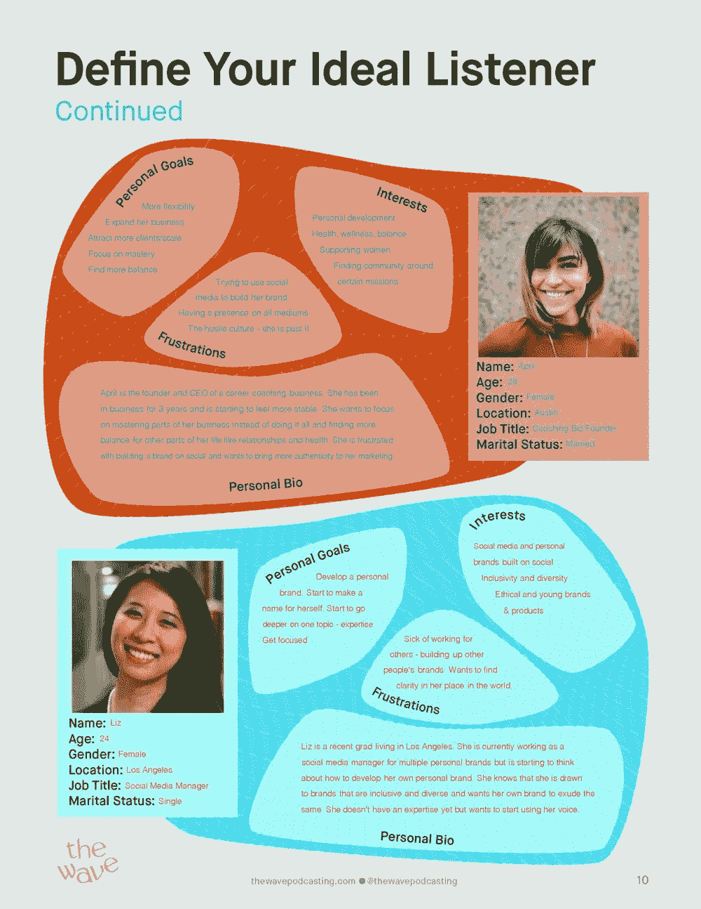
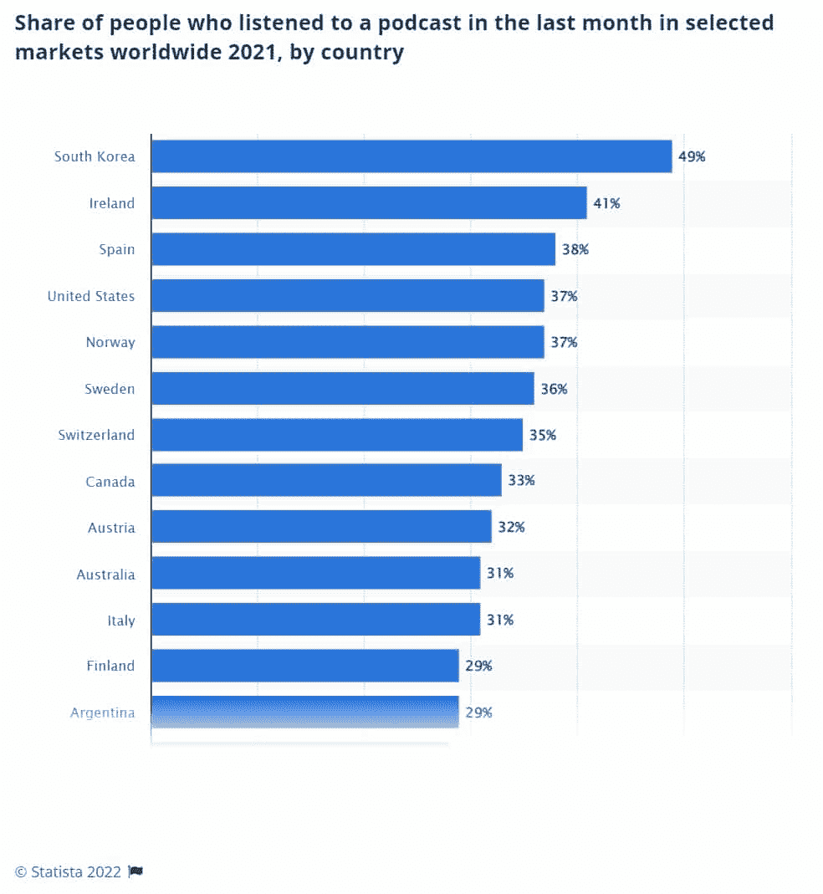
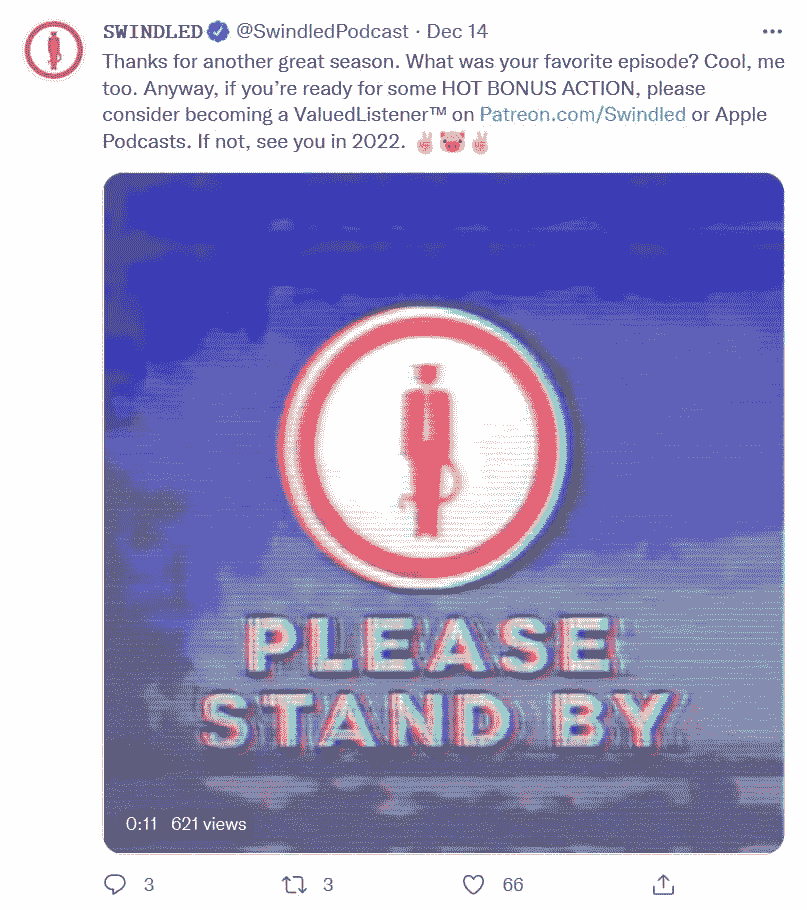
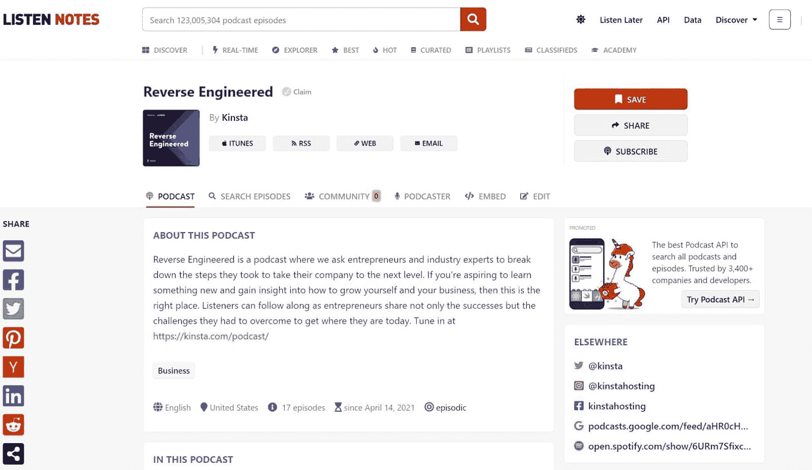
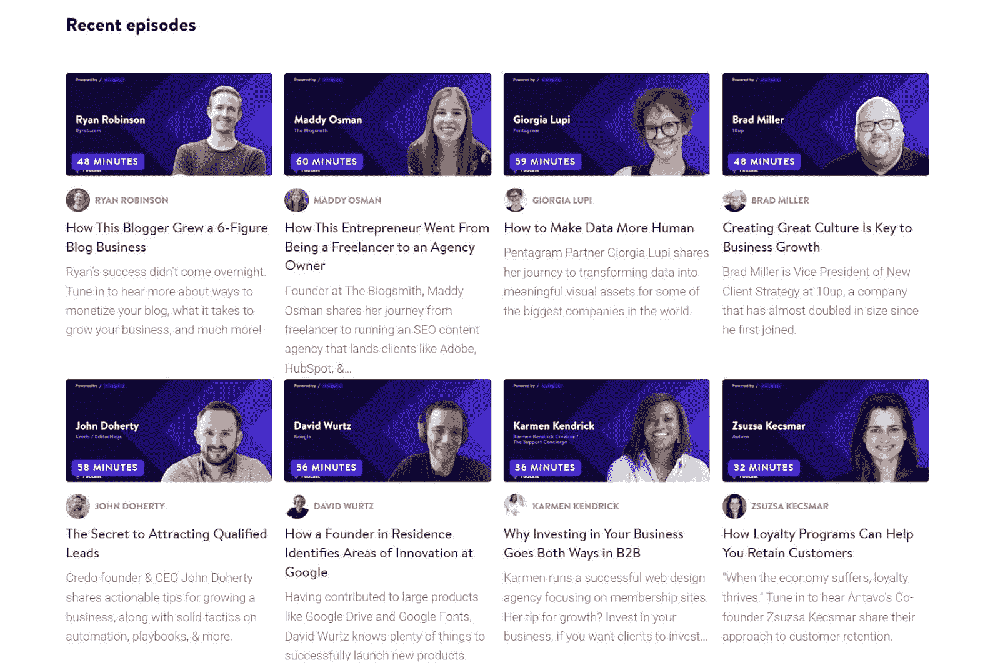
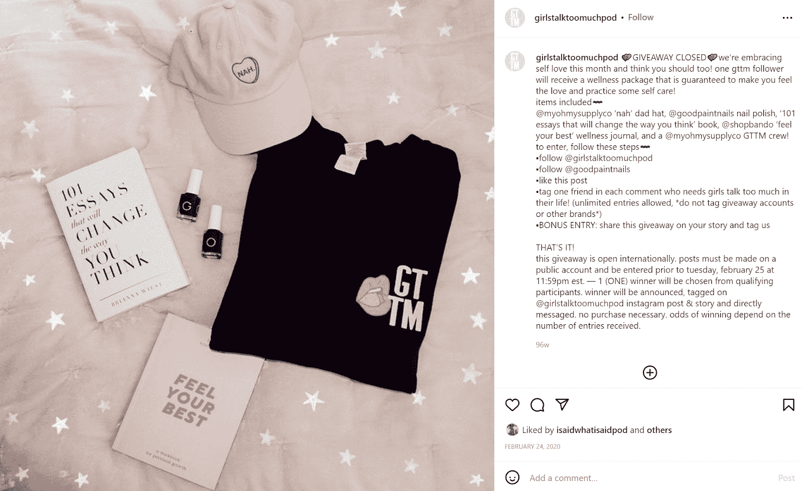
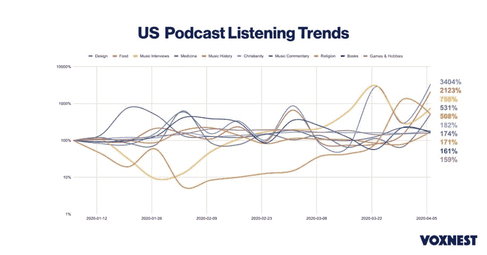

# 如何推广播客:赢得和留住听众指南

> 原文：<https://kinsta.com/blog/how-to-promote-a-podcast/>

学习如何推广播客是在激烈的播客竞争中保持领先的可靠方法。虽然播客只有 20 多年的历史，但来自 Listen Notes 的数据显示，今天在线上有超过 270 万个播客和 1.22 亿个播客片段。

风险很高。大约有 1 . 04 亿 12 岁以上的美国人每月收听播客。这大约是总人口的 1/3，也就是 39%的男性和 36%的女性。

但问题是。面对如此激烈的竞争，你如何有效地推广播客？你如何在每月数百万的播客听众中找到你的听众？

这就是这篇文章的内容。继续读下去，我们将涵盖 17 个你可以用来推广你的播客的策略，以及一些帮助你找到、激励和保持长期听众的技巧。

我们走吧。

## 识别并接触你的播客的目标受众

人们很容易看到成功的播客，如**星球金钱**和**你应该知道的东西**，而忘记它们背后的播客曾努力寻找听众。但这是真的。

所有的播客都是从某个地方开始的，但是成功的播客和不成功的播客有什么区别呢？巧妙营销，精心打造忠实受众。

> Kinsta 把我宠坏了，所以我现在要求每个供应商都提供这样的服务。我们还试图通过我们的 SaaS 工具支持达到这一水平。
> 
> <footer class="wp-block-kinsta-client-quote__footer">
> 
> 
> 
> <cite class="wp-block-kinsta-client-quote__cite">Suganthan Mohanadasan from @Suganthanmn</cite></footer>

[View plans](https://kinsta.com/plans/)

所以，在我们讨论播客营销之前，让我们先来看看三个建立听众群的策略，它们可以帮助你从第一天开始就建立一个忠实的听众群。

### 1.建立一个听众角色来理解你的听众

了解谁是你的受众是有效接触他们的关键。这就是听众档案或听众角色发挥作用的地方。

听众角色类似于购买者角色，但它是专门针对播客的。你的听众角色通过以下特征来描述你的听众:

*   年龄
*   种族划分
*   性别
*   兴趣
*   教育
*   位置
*   失败
*   目标和动机

建立一个听众角色将有助于你根据你的目标受众来设计好的内容。

要创建人物角色，请你的观众填写一份收集人口统计信息的调查。或者，如果你在像 Youtube 这样的平台上发布你的播客，你可以使用“YouTube Studio Analytics”标签收集一些人口统计数据。

一旦你收集了数据，你就可以使用[数据分析软件](https://kinsta.com/blog/google-analytics-alternatives/)来寻找趋势，并围绕最常见的观众特征建立你的档案。

要想获得建立一个可靠的听众角色的灵感，请看这个例子，它是由 Wave Podcasting 的 Lauren Popish 开发的:

A listener persona for a podcast (**Source:** [The Wave Podcasting](//thewavepodcasting.com/articles/making-the-pod-defining-my-ideal-listener%E2%80%9D))

[There are over 2.7 million podcasts and 122 million podcasts episodes online today... which means promoting your podcast effectively is essential for success in the space🎙Learn more here ⬇️Click to Tweet](https://twitter.com/intent/tweet?url=https%3A%2F%2Fkinsta.com%2Fblog%2Fhow-to-promote-a-podcast%2F&via=kinsta&text=There+are+over+2.7+million+podcasts+and+122+million+podcasts+episodes+online+today...+which+means+promoting+your+podcast+effectively+is+essential+for+success+in+the+space%F0%9F%8E%99Learn+more+here+%E2%AC%87%EF%B8%8F&hashtags=Podcasts%2CPodcasting)

### 2.使用观众反馈调整您的播客内容

人们不会听他们不喜欢的播客。这就是观众反馈的来源。收集听众的反馈可以帮助你调整剧集长度、节目形式、内容、广告阅读和编辑，以迎合观众的口味。

以下是一些从听众那里收集反馈的简单方法:

*   监控指标，如你的播客下载次数和你的观看时间(听众每集消费多少)
*   进行[观众调查](https://kinsta.com/blog/wordpress-survey-plugins/)
*   使用媒体监控工具来了解听众对您的在线播客的最新评价
*   阅读您的评论

### 3.开发高质量的内容

最后，确保你投资生产高质量的内容来吸引你的听众。虽然每个播客的“高质量内容”看起来都不一样，但看看排名靠前的播客，我们会看到一些高排名播客的一般趋势:

*   他们有专门的话题
*   主持人与观众建立融洽的关系
*   有一个清晰的结构(包括开头、中间和结尾)
*   每一集播客都有一条主线和一个“存在的理由”
*   每集足够长，可以深入一个主题，但不会长到让人厌烦(作为参考，平均播客时长为 41 分 31 秒)
*   播客主持人诚实可信，但并不主宰麦克风

## 如何推广你的播客(17 个技巧)

既然我们已经讨论了吸引你的听众的方法，让我们深入到 2022 年扩大你的播客的推广策略中。以下是你可以尝试的 17 件事:

### 1.在所有主要平台上发布你的播客

如果你只在一个平台上发布你的播客，你会大大限制你的流量。

数据显示，76%的播客消费者使用四个主要平台——Spotify、苹果播客、谷歌播客和 Pandora。

为了建立尽可能广泛的受众，您应该将您的内容发布到所有四个平台，以及更小的平台，如:

*   听得见的
*   NPR 一号
*   TuneIn
*   Deezer
*   播客迷
*   公共广播电台
*   钉书机
*   遮蔽
*   口袋模型
*   铸造箱
*   伊海尔特拉迪奥
*   豆荚鱼
*   波德贝
*   声音云

Popularity of podcasting platforms.

此外，由于 11%的听众通过播客网站播放播客，不要忘记用音频播放器将你的播客添加到你的网站[。](https://kinsta.com/blog/wordpress-audio-players/)

当然，不要只关注你本国的听众，除非你的定位是本地化的。Statista 数据显示，上个月韩国 49% 的人口，爱尔兰 41%的人口，西班牙 38%的人口收听了播客。

如果你选择本地化的平台，你可能会错过这些潜在的听众。

Podcast monthly listeners

### 2.发布有机社交媒体帖子

营销专家预测，2022 年全球将有 39.6 亿人使用社交媒体，在社交媒体渠道上推广你的播客是寻找新听众和吸引现有听众的绝佳方式。

发布有机内容有助于你建立一个观众群，给你一个与听众分享新剧集链接的途径，以及一个建立社区的媒介。

你可以在社交媒体上分享许多有趣的帖子，包括:

*   问答式帖子
*   民意调查
*   “幕后”帖子
*   关于您的播客主题的信息图、[图像](https://kinsta.com/blog/social-media-image-sizes/)和动画
*   听众发送的用户生成内容(UGC )(包括粉丝作品)
*   最近几集的引用和笑话
*   关于你的播客团队的“了解我们”风格的帖子
*   剧集剪辑
*   报道你所在领域的新闻文章

如果你正在从一个成功的播客中寻找一个社交媒体内容的例子，看看下面这篇来自“被骗”的 Twitter 帖子。

Swindled Twitter post

### 3.获得苹果智能横幅

苹果智能横幅链接您在苹果播客应用程序中的播客。人们在手机版 Safari(2021 年 12 月占手机浏览器流量 [26.45%](https://gs.statcounter.com/browser-market-share/mobile/worldwide) )中浏览网站时看到苹果智能横幅。

为了给你的网站添加一个横幅广告，把 meta 标签`<meta name=" apple-itunes-app" content=" myAppStoreID>`添加到你想要显示横幅广告的页面的 head 元素中。

您需要将`myAppStoreID`更改为您的播客 ID。您可以在 Apple Podcast 页面上找到此 ID。

### 4.加入播客社区

与其他播客交流可以帮助你改进工作，向其他播客学习，并在行业内建立联系。所有这三个结果都会增加你的流量，因为你的播客越好，就会有越多的人开始听它。

新的播客社区不断涌现，但以下是 2022 年将加入的一些顶级社区:

*   播客黑客脸书小组
*   [播客支持小组](https://www.facebook.com/groups/571436979623574/)
*   [Podcasts subreddit](https://www.reddit.com/r/podcasts/)
*   [播客运动](https://www.facebook.com/groups/podcastmovement)
*   [播客的聚集地](https://www.facebook.com/groups/podcastgroup/)
*   [纽约时报播客俱乐部](https://www.facebook.com/groups/nytpodcastclub/)

或者，你可以在你的领域内找到免费的播客，私下与主持人建立关系。免费播客涵盖类似的主题，但不是你的直接竞争对手。

### 5.将您的播客提交到播客目录

播客目录就像播客的电话簿。他们对播客的链接进行分类，并根据流派、制作人、播放列表和受欢迎程度进行分类。

将你的播客提交到目录中是增加你的听众基础的一个很好的方法，因为他们让在你的领域寻找播客的人很容易找到你。

最受欢迎的目录之一是 Listen Notes，它拥有数百万播客片段。

Podcast listing on Listen Notes.

您也可以使用其他目录，如 Podcast Index、Picasso、Charitable、Podchaser 和 Podtrac。

为了获得最佳效果，请确保在您发布的每个列表中包含您的播客的详细描述、高质量的图像、所有剧集的链接、您的网站的链接以及您的社交媒体的链接。

### 6.为你的播客建立一个网站

尽管 89%的听众在播客网站之外消费播客，但建立一个网站可以帮助你增加你的网络形象，并将听众链接到你的播客剧集。

建立一个 WordPress 网站比你想象的要容易，因为你需要[选择一个域名](https://kinsta.com/blog/choose-domain-name/)，注册一个 [WordPress 主机](https://kinsta.com/wordpress-hosting/)，并使用一个[免费或高级 WordPress 主题](https://kinsta.com/best-wordpress-themes/)来制作你的网站。

一旦你的网站开始运行，你可以定制它来推广你的播客。例如，您可以:

*   [将听众与你的社交媒体联系起来](https://kinsta.com/blog/wordpress-social-media-plugins/)
*   创建一个供人们讨论剧集的论坛
*   通过每集的专用页面分享额外的剧集注释、链接和信息
*   添加一个插件，这样人们就可以通过 [RSS 源](https://kinsta.com/blog/wordpress-rss-feed/)关注你的播客
*   创建一个博客来分享你的播客中更详细的信息

你也可以通过一个播客插件来分享新的剧集，比如非常简单的播客或者播客发布者。

### 7.投资社交媒体上的付费广告

付费社交媒体广告是向符合你的目标受众的人推广你的播客的一种负担得起的方式，因为你可以将你的广告瞄准符合你的听众角色的人。

## 注册订阅时事通讯

### 想知道我们是怎么让流量增长超过 1000%的吗？

加入 20，000 多名获得我们每周时事通讯和内部消息的人的行列吧！

[Subscribe Now](#newsletter)

许多社交媒体平台目前都提供广告，包括脸书、LinkedIn、Twitter、YouTube、Instagram 和 Pinterest。脸书营销小贴士总能派上用场，因为这个平台能让你接触到如此众多的受众。

### 8.向听众征求评论和分享

这个营销策略看起来很简单，但是我们把它包括进来是有原因的:它非常有效。

让人们给你留下评论并与他人分享你的播客是吸引新听众的最佳方式之一。这是因为 79%的人相信他们在网上阅读的评论，就像他们相信他们认识的人的推荐一样。

为了利用口碑营销，在每集结束时和在每集描述中提示人们分享你的播客。

### 9.参与客座播客

客座博文在播客界很受欢迎，因为它允许你通过免费播客来推广你的播客。

确保你在其他播客上客串，在你的播客上招待客人。就像博客上的客座博文一样，这在播客之间创造了交叉推广，所以你帮助别人越多，他们也会帮助你越多。

查看 subreddit[r/PodcastGuestExchange](https://www.reddit.com/r/PodcastGuestExchange/)或[“播客嘉宾协作社区——寻找嘉宾，成为嘉宾”](https://www.facebook.com/groups/podcastguestcollaboration/)脸书群组，了解嘉宾发布机会。

### 10.在 HARO 上推广你的播客

帮助一份报告(HARO)是一项服务，你可以将你的播客主持人列为你所在领域的专家。然后，记者可以就你所在领域的问题联系你。

在 HARO 上列出你的播客是吸引主流媒体反向链接和免费推广机会的绝佳方式。这些机会将把你的播客介绍给更多的人，并提高你作为可靠来源的可信度。

HARO 目前有超过 75，000 名记者和博客作者，包括来自路透社、时代周刊和精炼杂志的人。

### 11.创建听力图

听力图是包含 podcast 的图像、音频和声波的简短且引人入胜的片段。这些剪辑旨在抓住人们的兴趣，让他们投资于你的内容。

听力图本质上是文章中突出引用的音频和视频版本。这是播客“医疗保健中的人工智能:微软的凯文·斯科特关于技术如何对待疫情”的听力图的一个例子

An audiogram from Kevin Scott

要制作听力图，可以使用 Audiocado 或 GetAudioGram 等软件制作一个 5 到 50 秒的片段。然后，为您的剪辑创建一个标题，其中包括完整剧集的链接，并在社交媒体上分享它。你可能还想把它嵌入到你的网站上。

### 12.为听众和搜索引擎优化您的播客

这一策略似乎显而易见，但是为人们和搜索引擎优化你的播客列表可以增加你的播客剧集的覆盖范围。

要使用搜索引擎优化(SEO)来优化您的播客，请确保为您的专题节目指定一个吸引人的标题，并包含相关关键词，并将这些关键词包含在您的播客描述中。

使用您的播客描述将听众链接到其他内容，包括他们可能喜欢的类似剧集和您的社交媒体帐户。

或者，阅读“ [YouTube SEO:开始视频营销的终极 DIY 指南](https://kinsta.com/blog/youtube-seo/)”获得 YouTube 特有的技巧。

### 13.建立电子邮件列表

电子邮件营销是一种屡试不爽的促销技巧，每投资 1 美元，投资回报(ROI)为[36 美元。2022 年，我们预计电子邮件营销将大受欢迎，因为在 2021 年，](https://www.litmus.com/resources/2020-state-of-email-report-fall-edition/) [77%](https://www.hubspot.com/hubfs/State-of-Marketing%20(2).pdf) 的数字营销人员将从它那里获得更多的参与。自然，对于新的和已建立的播客来说，这是一种可靠的推广技术。

Struggling with downtime and WordPress problems? Kinsta is the hosting solution designed to save you time! [Check out our features](https://kinsta.com/features/)

你可以学习利用电子邮件营销，[快速有效地建立一个电子邮件列表](https://kinsta.com/blog/how-to-build-an-email-list/)，并在你的网站上添加一个电子邮件营销列表插件，如 [Holler Box 或 MailOptin](https://kinsta.com/blog/wordpress-lead-generation/) 。

### 14.与有影响力的人联系

影响者营销活动每花费 1 美元，投资回报率为[5.78 美元。因此，与有影响力的人合作有利于找到新的播客听众。](https://influencermarketinghub.com/influencer-marketing-benchmark-report-2020/)

要与有影响力的人合作，付钱给他们进行社交媒体推广，或者邀请他们作为嘉宾加入你的播客。

你不需要选择一个传统的社交媒体影响者来进行影响者营销。你所在领域的知名专家是很好的播客嘉宾。以下是逆向工程的一些客人:

Reverse Engineered episodes

如果这种合作方式不是你想要的，考虑在另一个播客上购买广告空间。例如，新的播客《小镇谋杀案》在广受欢迎的播客上购买了广告位。

### 15.转录您的播客片段

录制您的播客片段可以让您在其他媒体上分享它们，包括在文章和博客帖子中。此外，转录将使不能听播客的人能够通过从你的网站下载内容来消费你的内容。

以下是麦肯锡分享文字记录和展示笔记以获取灵感的一个例子:

A McKinsey podcast episode page

### 16.举办一个赠品

赠品是获得新听众的好方法，因为你可以用它们来激励听众分享你的播客，作为加入赠品的回报。

赠品是一种非常灵活的技术，因为你可以改变赠品的范围、内容和风格，以适应你的播客和观众。例如，虽然一些播客赠送免费商品，但 GirlsTalkTooMuch 选择与小品牌和符合听众兴趣的赠品合作。

GirlsTalkTooMuch giveaway

### 17.将视频添加到您的播客

最后，考虑将视频添加到您的播客中，并通过[视频托管服务](https://kinsta.com/blog/video-hosting/)进行流式传输。虽然我们倾向于认为播客是纯音频的，但大约 [17%](https://www.thepodcasthost.com/equipment/podcast-equipment-stats-in-2019/) 的播客现在有视频。

将视频添加到您的播客有许多优点，因为它:

*   让您的播客与众不同
*   允许您用图像、视频、动画和信息图表补充您的内容
*   帮助你抓住观众的注意力

要在你的播客中添加视频源，[开通一个 Youtube 频道](https://kinsta.com/blog/how-to-create-a-youtube-channel/)或者使用一个 [Youtube 替代品](https://kinsta.com/blog/alternatives-to-youtube/)，比如 Facebook Watch、Vimeo 或 DailyMotion。

如果你正在寻找你的播客如何与视频一起看的灵感，看看下面的[反向工程播客](https://kinsta.com/podcast/)如何使用视频。

一段视频播客插曲

## 找到正确的播客营销策略的 3 个技巧

即使对于经验丰富的营销人员和内容创作者来说，播客也是势不可挡的。自然地，在这篇文章中包含所有 17 个促销策略可能看起来令人生畏。

所以，我们想给你三个建议来帮助你决定哪些促销策略适合你。

### 1.尝试多种策略

由于每一个播客都是不同的，除非你尝试，否则你不会知道哪些策略对你的播客观众有效。

不要害怕尝试多种促销策略。利用几种方法可以帮助你最大限度地提高营销效果，并获得更广泛的受众(例如，如果你将推广活动限制在脸书这样的单一平台上，你只能接触到脸书用户)。

### 2.使用 KPI 跟踪您的进度

关键绩效指标(KPI)为您提供了一个有形且易于量化的指标来跟踪您的播客的成功。

有许多 KPI 可供选择，包括:

*   独特下载的数量
*   每集下载次数
*   每月平均新增用户数
*   每个来源(即苹果播客、谷歌播客、Spotify 等)的平均听众人数。)
*   [点击率](https://kinsta.com/blog/click-through-rate/)(点击率)
*   反向链接的数量(反向链接是从其他网站到你的播客或网站的链接)

为了获得最佳结果，设定 SMART(具体的、可衡量的、可实现的、现实的和有时限的)目标来指导每个 KPI。

尝试“按(时间/日期)，我们将(指标)”的格式来创建简单的 SMART 目标。例如，“到三月底，我们将达到 500 次独立下载。”

提示:因为人们的倾听习惯会随着时间而改变，所以你应该长期监控和更新你的 KPI。作为参考，以下是 2020 年美国播客收听趋势的变化:

Podcast listening trends from January to April 2020.

### 3.用等级量表比较你的策略

最后，一定要比较你的促销策略，看看哪个最有效，哪个最无效。比较策略的最简单方法之一是制定一个主观评定量表，根据以下因素对策略进行评定:

*   成本效益
*   结果
*   长期增长的可能性
*   易于实施
*   受观众欢迎

这种评分标准将为您提供一种比较策略的方法，这些策略看起来像苹果和橘子，或者没有共享可测量的 KPI。

例如，你可以给 Instagram 广告的成本效益打 1/3 分，给结果打 1/3 分，给长期增长的可能性打 1/3 分，给剧集成绩单打 2/3 分，2/3 分，1/3 分。

这将向你表明，剧集脚本更符合你的长期营销愿景。

[Approximately 104 million Americans aged 12+ listen to podcasts monthly. That's roughly 1/3 of the population! 😮 Learn how to promote yours here 🎙Click to Tweet](https://twitter.com/intent/tweet?url=https%3A%2F%2Fkinsta.com%2Fblog%2Fhow-to-promote-a-podcast%2F&via=kinsta&text=Approximately+104+million+Americans+aged+12%2B+listen+to+podcasts+monthly.+That%27s+roughly+1%2F3+of+the+population%21+%F0%9F%98%AE+Learn+how+to+promote+yours+here+%F0%9F%8E%99&hashtags=Podcasts%2CPodcasting) ## 摘要

根据 Voxnext 的数据，自 2020 年初以来，播客的收听量增加了 42%。虽然新冠肺炎帮助推动了播客的流行，但人们对播客的兴趣在过去几年中稳步增长。2009 年， [43%](http://www.edisonresearch.com/wp-content/uploads/2009/04/Infinite-Dial-2009-Presentation.pdf) 的美国人熟悉播客，到 2019 年，这一数字增加到了 [70%](https://www.edisonresearch.com/wp-content/uploads/2019/03/Infinite-Dial-2019-PDF-1.pdf) 。

竞争如此激烈，使用以下策略营销您的播客至关重要:

*   社交媒体推广
*   将您的播客提交到数据库，如收听笔记
*   利用视频播客
*   让您的播客在多个平台上可用

既然我们已经分享了推广播客的最佳策略，我们很想听听你的经验。哪种播客推广策略对你最有效，如果你能给一个新播客一条营销建议，会是什么？

请在下面的评论中分享你的答案。

* * *

让你所有的[应用程序](https://kinsta.com/application-hosting/)、[数据库](https://kinsta.com/database-hosting/)和 [WordPress 网站](https://kinsta.com/wordpress-hosting/)在线并在一个屋檐下。我们功能丰富的高性能云平台包括:

*   在 MyKinsta 仪表盘中轻松设置和管理
*   24/7 专家支持
*   最好的谷歌云平台硬件和网络，由 Kubernetes 提供最大的可扩展性
*   面向速度和安全性的企业级 Cloudflare 集成
*   全球受众覆盖全球多达 35 个数据中心和 275 多个 pop

在第一个月使用托管的[应用程序或托管](https://kinsta.com/application-hosting/)的[数据库，您可以享受 20 美元的优惠，亲自测试一下。探索我们的](https://kinsta.com/database-hosting/)[计划](https://kinsta.com/plans/)或[与销售人员交谈](https://kinsta.com/contact-us/)以找到最适合您的方式。