# 电子邮件跟踪软件:2022 年买家指南和主要建议

> 原文：<https://kinsta.com/blog/email-tracking-software/>

87%的 B2B 营销人员使用电子邮件营销作为分销渠道——它已经成为大多数企业不可或缺的沟通基石。但是当你点击“发送”后，你的电子邮件会发生什么呢？这就是电子邮件跟踪软件的用处。

电子邮件跟踪是衡量您与客户和订户沟通影响的重要工具。这有助于你了解你的邮件是否有效果。

有了电子邮件跟踪软件，你可以准确地看到客户如何与你的电子邮件互动，让你可以微调你的沟通方式，以[增加流量](https://kinsta.com/blog/how-to-drive-traffic-to-your-website/#email-marketing)，提高销售和转化率。

在本指南中，我们将回顾在电子邮件跟踪软件中要寻找什么，以及我们推荐的可以开始免费使用的软件。

## 什么是电子邮件跟踪软件？

发送电子邮件有时感觉就像把一封信从悬崖上扔下去。它会在哪里结束？会有人看吗？你怎么知道呢？

电子邮件营销的早期受到这种不确定性的困扰。

### 跟踪软件之前的电子邮件营销

如果没有电子邮件跟踪软件，营销部门就无法知道收件人是否打开、阅读或点击了一封电子邮件——当然，前提是它甚至到达了他们的收件箱。结果，电子邮件营销归结为猜测和试错。

谢天谢地，盲目发送邮件的日子已经一去不复返了。现在有了大量可供选择的电子邮件跟踪软件，在电子邮件发出后很长时间内跟踪它们比以往任何时候都更容易。

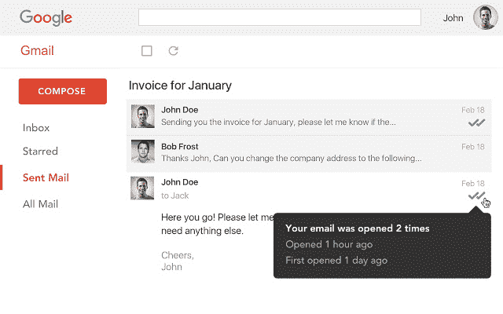

Mailtrack email tracking software integrated into Gmail.

但是邮件追踪软件到底是做什么的呢？虽然“跟踪电子邮件”在技术上是正确的答案，但电子邮件跟踪比看起来要复杂得多。

[What happens to your emails after you hit 'send?' 👀 With email tracking software, you can see exactly how customers interact with your emails, allowing you to drive more traffic and improve conversions. 📧Click to Tweet](https://twitter.com/intent/tweet?url=https%3A%2F%2Fbit.ly%2F3vQrZsH&via=kinsta&text=What+happens+to+your+emails+after+you+hit+%27send%3F%27+%F0%9F%91%80+With+email+tracking+software%2C+you+can+see+exactly+how+customers+interact+with+your+emails%2C+allowing+you+to+drive+more+traffic+and+improve+conversions.+%F0%9F%93%A7&hashtags=EmailTips%2CMarketing)

### 邮件跟踪软件是做什么的？

电子邮件跟踪软件跟踪电子邮件打开，链接点击，等等。虽然不同软件包的跟踪功能和选项略有不同，但大多数都提供相同的基本功能。

*   **跟踪电子邮件点击等。**大多数电子邮件跟踪器通过**开放式跟踪**来跟踪活动，其中一个不可见的跟踪像素被附加到你的电子邮件上。该像素跟踪日期和时间，并在查看后发送实时通知(例如，电子邮件被打开/阅读)。

虽然大多数电子邮件追踪器让你不仅可以追踪打开的电子邮件(例如链接点击)，但这个功能是大多数可用软件的基础。

大多数软件包还包括**点击跟踪**。在这里，你的电子邮件中嵌入的链接不是一个看不见的像素，而是通过一个跟踪 URL 发送的。当收件人单击该链接时，他们会访问该 URL，您的跟踪软件会收到通知。

一些软件还包括**活动跟踪**，它可以跟踪你自己或你组织中其他人的电子邮件和收件箱。然而，由于这不同于大多数电子邮件跟踪软件所提供的，我们将主要关注打开跟踪和点击跟踪。

*   **监控电子邮件活动和互动。**你发送的每一封邮件都可以在打开和点击追踪之间保持对用户活动的追踪。根据您选择的软件，无论用户何时打开电子邮件、点击链接，或者在某些情况下删除电子邮件或将其发送到垃圾邮件文件夹，您都会收到实时通知。
*   **记录联系人活动和潜在客户记录。**电子邮件跟踪不会在通知时结束。相反，大多数软件还保留了您活动中每个联系人的完整记录，让您可以看到他们每个人与您的通信互动的程度和频率。

一些软件甚至可以帮助你组织你的电子邮件营销活动，通过[建立有针对性的名单](https://kinsta.com/blog/how-to-build-an-email-list/)，这些人更有可能对某些类型的电子邮件做出良好的回应。

*   **提供有价值的数据和见解。**利用大量可用的跟踪数据，您可以了解整个营销活动或单个销售线索的趋势。这些信息可以帮助您进一步完善您的电子邮件通信，并与您的客户建立更好的关系。
*   **允许您比较不同的电子邮件格式和方法。**虽然大多数软件不包括 [A/B 测试](https://kinsta.com/blog/wordpress-ab-testing-tools/)作为内置功能，但电子邮件跟踪将使您能够比较不同的格式、消息、主题和活动方法。因此，电子邮件跟踪软件可以成为 A/B 测试的便捷工具。

总之，这些功能使电子邮件跟踪成为任何电子邮件营销活动的宝贵组成部分。请继续阅读，了解一些最重要的好处。

## 电子邮件跟踪软件的好处

正如你所想象的，了解你的潜在客户、潜在客户和联系人如何与你的电子邮件互动会带来很多好处。这里只是几个。

### 节省时间和金钱

虽然“节省时间和金钱”可能是任何产品最常见的(也是最虚假的)广告优势，但它是电子邮件跟踪软件的巨大优势之一。

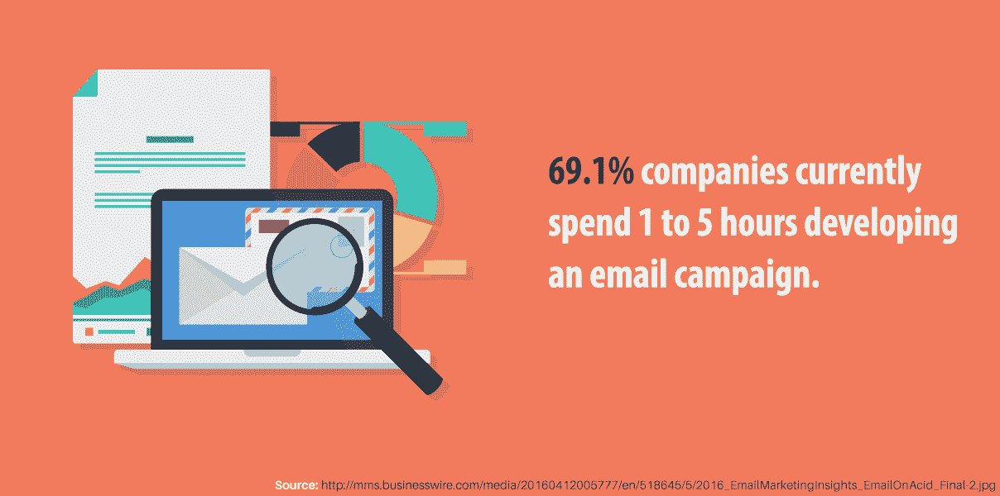

Email marketing campaigns can take up a lot of time

沟通需要时间，尤其是在追求潜在客户或试图吸引潜在客户时。当你没有得到你期望的回应时，通常最好发送多封跟进邮件来鼓励回复。但是众多后续*真的*值得你花时间吗？

看情况。发送至少一封跟进邮件可以将回复率从 [9%](https://woodpecker.co/blog/follow-up-statistics/) (没有跟进)提高到 13%，有经验的营销人员的回复率甚至会更高。虽然这是一个有希望的统计，但它假设收件人首先阅读了第一封电子邮件。

因此，许多电子邮件营销活动最终会浪费宝贵的时间、金钱和其他资源，向那些不感兴趣的人发送后续电子邮件。这就是电子邮件跟踪软件的用武之地。

使用电子邮件跟踪软件，您可以立即识别出没有打开第一封电子邮件的收件人，帮助您避免发送可能会被忽略的后续邮件。过滤掉没有回复的人还可以让你针对真正感兴趣的人建立更有针对性的个性化活动。

类似地，知道收件人是点击了链接还是下载了文件也是客户感兴趣的一个很好的标志。因此，电子邮件跟踪软件让你把时间和金钱集中在你最有希望的线索上。

### 提供有价值的见解

电子邮件跟踪是获得对您的潜在客户、潜在客户、客户和您网络中的其他联系人的新见解的最佳方式之一，以及您的电子邮件营销工作对他们的影响程度。

但是电子邮件跟踪软件能提供什么样的见解，你如何利用它们呢？而打开跟踪和点击跟踪提供相当简单的统计数据(例如，打开率、点击率等。)，明智地利用它们可以让你对你的联系人如何回复你的邮件有一个新的理解。

以下是你可以从电子邮件跟踪软件中获得的一些最有价值的见解。

*   谁在与您的电子邮件互动。您的联系人中有多少人会打开您的电子邮件？这个数字是电子邮件营销中最基本的指标——而电子邮件跟踪软件是打开它的钥匙。

然而，这个统计不仅仅是看谁读了你的邮件。由于大多数电子邮件追踪器还记录重复的电子邮件打开和点击，您可以查看联系人是否多次打开电子邮件以及他们打开它的时间。

从这些数据中，你可以判断一个联系人有多感兴趣，以及他们最喜欢什么类型的内容。

*   转化机会最大的潜在客户。只要知道谁看了你的邮件，谁没看，你就能立即在你的联系人中找到最有希望的潜在客户。通过额外的跟进邮件重复这一过程，可以进一步增加找到准备购买的潜在客户的机会。
*   一天中发送信息的最佳时间。难道你不喜欢早上 6:00 收到销售邮件吗？没人知道。然而，随着商业变得更加全球化和分散化，时区逐渐消失，一个人的早上 6:00 是另一个人的下午 5:00——或者两者之间的任何时间。

因此，不同的联系人在一天中的特定时间会更活跃，更容易接受。通过使用电子邮件跟踪软件来跟踪一天中不同时间的打开率和点击率，你将能够确定发送邮件的最佳时间。

了解这些信息可以帮助你确定发送跟进和其他电子邮件的最佳时间，最终有助于推动转化。

*   **您的联系人的详细信息。**许多电子邮件跟踪提供商将帮助您维护潜在客户、潜在客户和其他联系人的详细记录。除了基本的联系信息，这些记录还可能包括你发送给他们的电子邮件的完整历史，以及他们如何与他们互动。
*   有多少收件人点击了链接或下载了文件。虽然打开电子邮件是实现转化的第一步，但可点击的行动号召(CTA)和文件下载是更好的指标。

毕竟，在许多人打开他们甚至不感兴趣的电子邮件的地方，只有少数人点击链接并进行下载。这个小群体是任何电子邮件营销活动的主要目标，跟踪工具是找到他们的好方法。

然而，跟踪点击和下载并不仅仅适用于电子邮件营销。许多组织还使用电子邮件跟踪来确保员工阅读某些电子邮件和下载某些文档。例如，经理可能会使用电子邮件跟踪来确保其员工在安排会议之前阅读了电子邮件或关键文档。

根据你的[电子邮件营销策略](https://kinsta.com/blog/email-marketing-best-practices/)，你还可以获得更多的见解。在任何情况下，所有这些见解结合起来都可以让你对你的活动有深刻的了解，以及一些急需的清晰性。

### 让活动更加清晰

在起草电子邮件、维护联系人列表和追踪线索之间，很容易忽略大局。

借助电子邮件跟踪软件，您可以随时从细节中抽身出来，一目了然地查看整个活动。通过在较高层次上查看关键统计数据，您将获得电子邮件工作有效性的全新鸟瞰图。

相比之下，在没有跟踪工具的情况下开展电子邮件营销活动，要准确评估你的活动是极其困难的(如果不是不可能的话)。如果不知道打开电子邮件或点击链接的收件人的百分比，就没有可靠的方法知道你的电子邮件对销售的推动程度(除非它们是你唯一的营销渠道)。

## 如何挑选一个电子邮件跟踪软件

虽然许多电子邮件跟踪软件包提供类似的功能，但这并不意味着它们是平等的。

随着电子邮件跟踪对企业变得越来越重要，跟踪工具正变得随处可见。选择下一个电子邮件跟踪软件时，请记住这些品质。

### 电子邮件服务兼容性

如果你在寻找跟踪软件，很有可能你已经在使用特定的电子邮件客户端，如微软 Outlook 或 Gmail(阅读:[而不是你的主机](https://kinsta.com/blog/keep-email-and-hosting-separate/))。因此，确保您选择的软件与您选择的客户端兼容至关重要。

幸运的是，兼容性几乎不是电子邮件跟踪软件的问题。随着越来越多的电子邮件客户端和平台转向网络，许多跟踪工具作为简单的应用程序扩展出售。虽然这可能看起来不够强大，但它们仍然具有强大的跟踪能力。

在任何情况下，大多数跟踪工具都适用于大多数主要的电子邮件客户端，反之亦然。许多流行的电子邮件追踪器也可以作为浏览器扩展，有些甚至提供免费使用的选项。

### 跟踪类型

正如我们在本指南中看到的，有许多方法可以跟踪电子邮件。虽然你可能不需要每种类型的跟踪工具，但任何像样的软件包都会提供其中的大部分。

至少，确保你选择的追踪软件提供了**开放式追踪**和**点击追踪**。虽然一些工具也可能提供活动跟踪，但这一功能对于电子邮件或[内容营销](https://kinsta.com/learn/content-marketing/)来说通常是不必要的。

此外，就像兼容的客户端一样，跟踪方法在大多数可用的软件中都是相对标准的。只要确保可用的跟踪类型与您的活动目标和策略一致即可。

### 跟踪统计数据

虽然知道某人何时打开你的电子邮件或点击一个链接是很好的，但这些统计数据是随着时间的推移收集起来的，是最有价值的。通过查看联系人如何在一天的特定时间与您的电子邮件或特定主题行和 CTA 互动，您将更好地了解您的潜在客户的“点击量”(双关语)。

因此，确保您选择的电子邮件跟踪软件能够维护每个跟踪指标的完整记录和统计数据是至关重要的，例如打开率、点击率等等。

## 注册订阅时事通讯

### 想知道我们是怎么让流量增长超过 1000%的吗？

加入 20，000 多名获得我们每周时事通讯和内部消息的人的行列吧！

[Subscribe Now](#newsletter)

### 联系人档案和历史记录

个性化的电子邮件营销是最有效的，营销人员和客户都知道这一点。80%的消费者表示，如果一家公司能为他们提供个性化的体验，他们更有可能与这家公司做生意。

虽然电子邮件跟踪远不是个性化通信的唯一工具，但它仍然是一个重要的工具。为此，许多最好的电子邮件跟踪工具将维护个人客户的档案和统计数据，为您向潜在(或现有)客户发送高度个性化的通信奠定基础。

### 隐私

让第三方应用程序访问您的收件箱可能会带来严重的安全问题，尤其是在企业环境中。在购买或下载任何软件之前，一定要检查隐私政策和用户评论——这对你和你的联系人的隐私都很重要。

### 价格和承受能力

当然，与任何软件一样，找到一个符合您预算的、价格合理的解决方案至关重要。

虽然许多电子邮件跟踪工具可以免费使用，但免费版本通常会限制您可以跟踪的电子邮件或联系人的数量。令人欣慰的是，大多数专业和高级选项相对来说都是可以承受的，并且这些成本通常非常值得额外的深入了解。

### 您当前的电子邮件营销软件

如果你正在使用[电子邮件营销软件](https://kinsta.com/blog/email-marketing-software/)来组织你的活动，你可能已经有了电子邮件跟踪功能。确保首先检查您现有的工具。

当然，仅仅因为你现有的软件包含跟踪工具并不意味着它是这项工作的最佳工具。在任何情况下，在做出决定之前，一定要考虑所有可用的电子邮件跟踪工具，并阅读下一部分来查看我们的十大工具。

## 我们的十大电子邮件跟踪软件

现在，你应该对电子邮件跟踪软件有一个很好的想法。那么你应该选择哪一个呢？

虽然有大量的选项可供选择，但我们已经将其缩小到 10 个伟大的选择，其中两个是绝对免费的。

### 1.邮件跟踪(免费)

在全球拥有超过 150 万用户的情况下， [Mailtrack](https://mailtrack.io/en/) 是领先的 Gmail 用户免费电子邮件跟踪器。

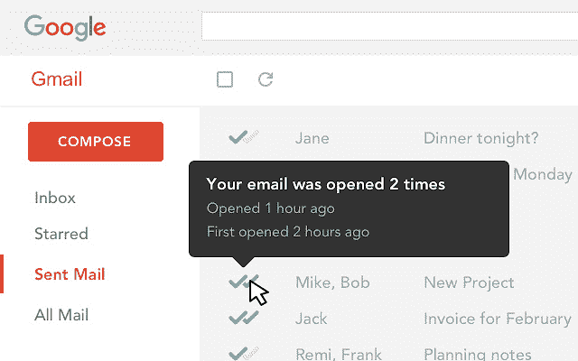

Mailtrack API integrated with Gmail’s user interface

虽然它主要是作为 Chrome 的扩展，但不要认为它动力不足。除了跟踪打开率、点击率和其他电子邮件分析，Mailtrack 还直接集成到 Gmail 用户界面中。

**支持的电子邮件客户端:** Gmail

### 2.免费销售

Gmail 用户的另一个免费选择， [SalesHandy](https://www.saleshandy.com/) 提供无限制的电子邮件跟踪和直接发送到你桌面的即时通知。

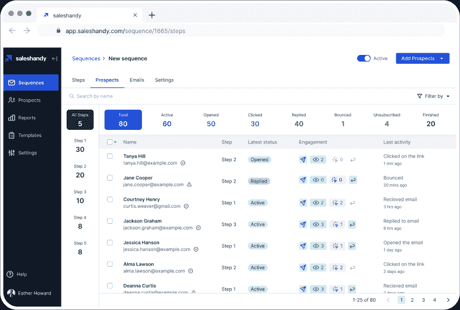

SalesHandy dashboard.

它甚至可以生成电子邮件模板和报告，并跟踪联系人和潜在客户。

Struggling with downtime and WordPress problems? Kinsta is the hosting solution designed to save you time! [Check out our features](https://kinsta.com/features/)

**支持的电子邮件客户端:** Gmail、Outlook(高级版)

### 3.Gmelius(高级)

对于想要跟踪和优化内部通信的 Gmail 用户来说，Gmelius 是另一个极好的选择。

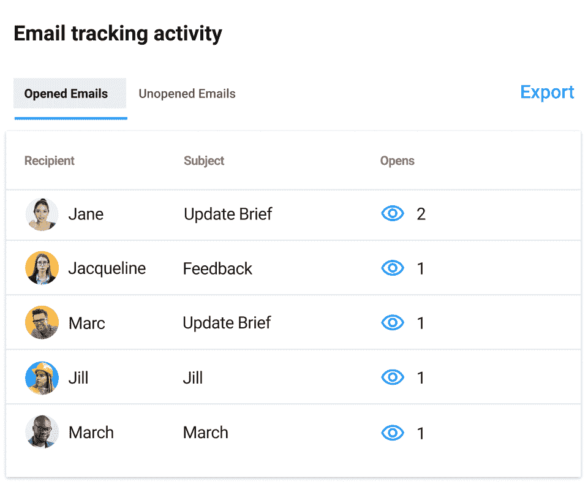

Gmelius email tracking dashboard.

虽然它没有免费选项，但它提供了大量功能来证明其成本:除了开放跟踪和点击跟踪，Gmelius 还提供了强大的电子邮件调度和协作工具。这不是监控电子邮件活动的最佳选择。

**支持的电子邮件客户端:** Gmail

### 4.条纹(高级)

寻找具有更多客户关系管理(CRM)功能的电子邮件跟踪？看不到比 [Streak 更远的地方。](https://www.streak.com/)

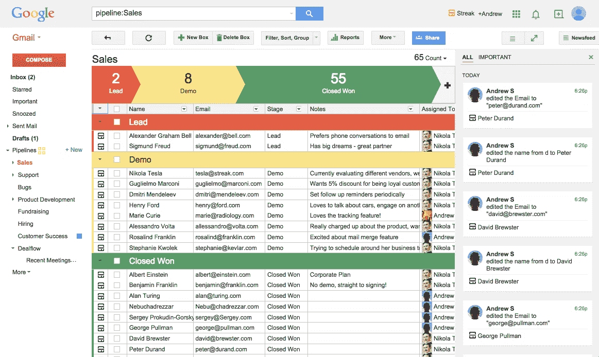

Streak integrated with Gmail.

与许多开放式跟踪平台不同，Streak 提供了 CRM 功能，可帮助您跟踪整个渠道中的销售线索，而不仅仅是他们的收件箱。

**支持的电子邮件客户端:** Gmail

### 5.Mixmax(高级)

虽然主要是一个基于 Gmail 的生产力和销售参与应用程序， [Mixmax](https://www.mixmax.com/features/email-tracking) 也提供强大的电子邮件跟踪功能。

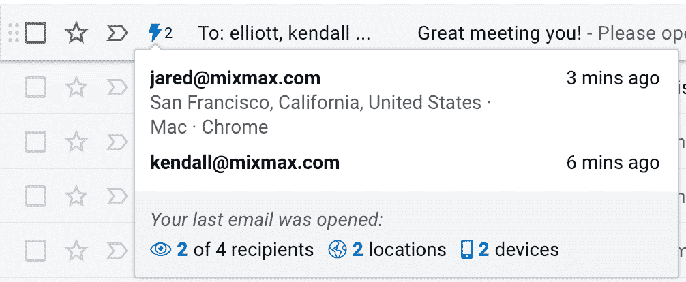

Mixmax tracking data for a contact.

除了您可能期望的所有跟踪功能，Mixmax 还提供了其他功能，如后续提醒、电子邮件轮询、日程安排工具和 Salesforce 集成。

**支持的电子邮件客户端:** Gmail、谷歌收件箱、Salesforce

### 6.右箱(溢价)

Gmail 用户的另一个受欢迎的选择是，[riginbox](https://www.rightinbox.com/)提供打开跟踪和点击跟踪以及其他功能，如电子邮件日程安排、后续提醒、模板等。

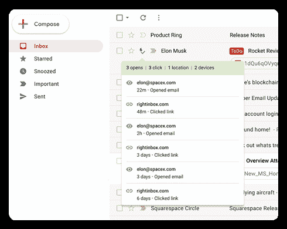

RightInbox interface.

**支持的电子邮件客户端:** Gmail

### 7.Mailchimp(高级版)

作为电子邮件营销平台的鼻祖， [Mailchimp](https://mailchimp.com/) 也提供电子邮件跟踪，这并不奇怪。

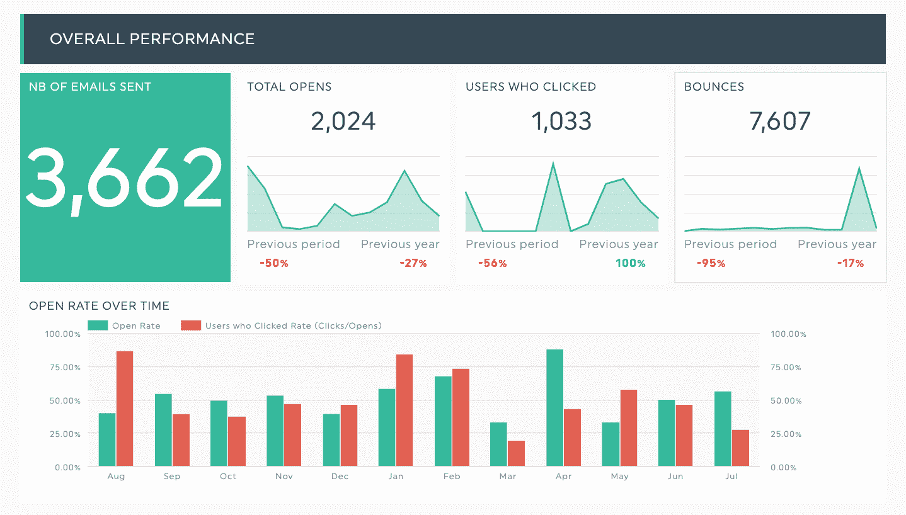

Mailchimp email tracking statistics.

虽然它不是一个专门的电子邮件跟踪平台，但对于那些寻找强调 A/B 测试的整体电子邮件营销解决方案的人来说，它是一个极好的选择。

如果它不合适，但你想要类似的东西，有大量的 Mailchimp 替代品供你选择。

**支持的电子邮件客户端:** Gmail、Outlook

### 8.Cirrus Insight(高级版)

虽然与其说是电子邮件跟踪软件，不如说是一个销售管理和营销自动化平台， [Cirrus Insight](https://www.cirrusinsight.com/) 是一个独特的顶级解决方案，可以与您现有的电子邮件客户端完全集成。

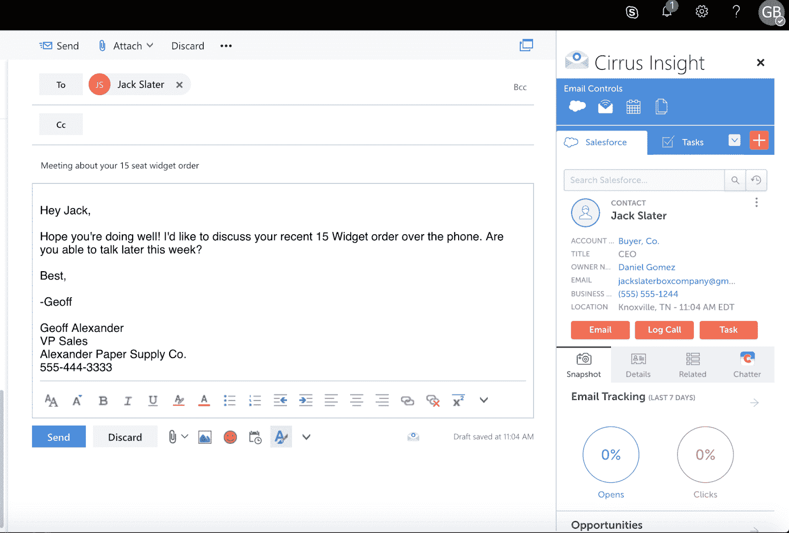

Cirrus Insight email tracking in Office 365.

这意味着您可以获得销售平台的所有功能，而无需在应用程序之间来回切换。

**支持的电子邮件客户端:** Gmail、Outlook

### 9.是软件(高级)

[Yesware](https://www.yesware.com/) 专为销售团队和销售人员打造，支持企业范围内的全面电子邮件推广，而没有专用平台的复杂性。

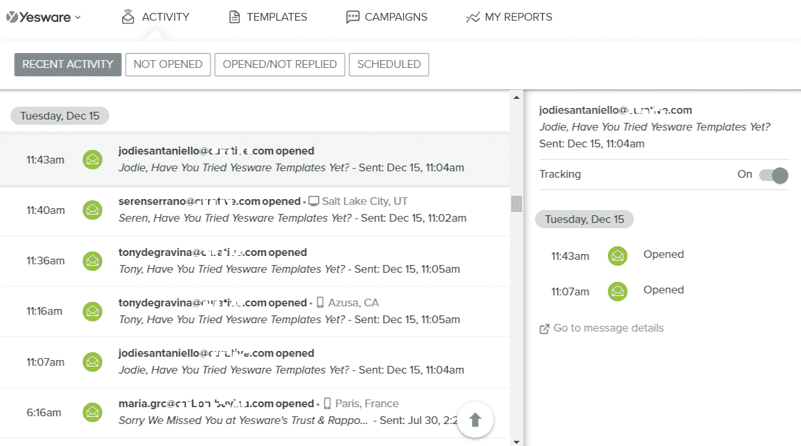

Yesware’s email tracking in Gmail.

作为 Gmail 或 Outlook 插件，Yesware 是销售代表处理电子邮件推广活动的明智选择。

**支持的电子邮件客户端:** Gmail、Outlook

### 10.轮毂点(高级)

像 Streak 一样， [HubSpot 销售平台](https://kinsta.com/blog/mailchimp-alternatives/#1-hubspot-email-marketing)是一个一体化的 CRM，而不是一个电子邮件跟踪工具。

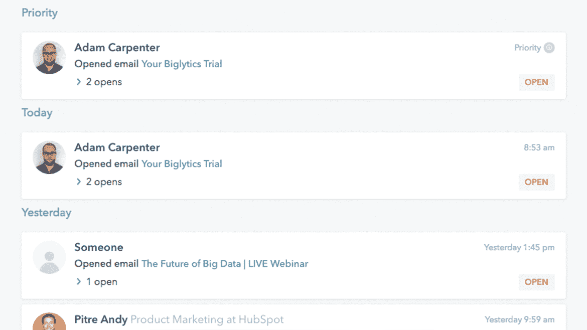

HubSpot sales platform.

然而，由于强大的电子邮件跟踪与一系列其他销售管理服务相结合，HubSpot 是任何寻求自上而下销售和电子邮件营销解决方案的人的理想解决方案。

**支持的电子邮件客户端:** Gmail、Outlook

[87% of B2B marketers use email marketing as a distribution channel- but how do you know your emails are delivering results? 📧Click to Tweet](https://twitter.com/intent/tweet?url=https%3A%2F%2Fbit.ly%2F3vQrZsH&via=kinsta&text=87%25+of+B2B+marketers+use+email+marketing+as+a+distribution+channel-+but+how+do+you+know+your+emails+are+delivering+results%3F+%F0%9F%93%A7&hashtags=EmailMarketing%2CB2B) ## 摘要

电子邮件跟踪无疑是你的电子邮件营销武库中最强大的工具之一。

通过电子邮件跟踪，您可以准确地知道谁打开或点击了您的电子邮件，从而消除您的活动中的猜测。有了合适的软件，您可以逐渐识别联系人中的关键趋势和见解，帮助您建立有意义的客户关系并[推动更多销售](https://kinsta.com/blog/ecommerce-strategies/)。

*要想了解更多关于提升电子邮件营销的信息，请查看我们的[电子邮件营销技巧](https://kinsta.com/topic/email-marketing-tips/)。*

* * *

让你所有的[应用程序](https://kinsta.com/application-hosting/)、[数据库](https://kinsta.com/database-hosting/)和 [WordPress 网站](https://kinsta.com/wordpress-hosting/)在线并在一个屋檐下。我们功能丰富的高性能云平台包括:

*   在 MyKinsta 仪表盘中轻松设置和管理
*   24/7 专家支持
*   最好的谷歌云平台硬件和网络，由 Kubernetes 提供最大的可扩展性
*   面向速度和安全性的企业级 Cloudflare 集成
*   全球受众覆盖全球多达 35 个数据中心和 275 多个 pop

在[应用程序托管](https://kinsta.com/application-hosting/)或[数据库托管](https://kinsta.com/database-hosting/)的第一个月，用 20 美元的折扣进行测试。探索我们的[计划](https://kinsta.com/plans/)或[与销售人员](https://kinsta.com/contact-us/)交流，以找到最适合您的产品。