# 你需要考虑的 15 种 Google Drive 选择

> 原文：<https://kinsta.com/blog/google-drive-alternative/>

有时 Google Drive 并不是这项工作的最佳文件存储平台。幸运的是，你有很多 Google Drive 可供选择。

为什么 Google Drive 总是不理想？尽管该平台很受欢迎，但许多用户很难完全理解它的特性和功能。其他人担心它的成本、安全性或功能。

谢天谢地，还有其他选择。

在本帖中，我们将考察 15 个值得关注的 Google Drive 替代品。在我们深入研究之前，让我们深入了解一下 Google Drive 及其一些潜在的缺点。

T3】

## 什么是 Google Drive？

Google Drive 是一个基于云的文件存储平台，允许用户存储、共享和协作来自多个设备的文件。

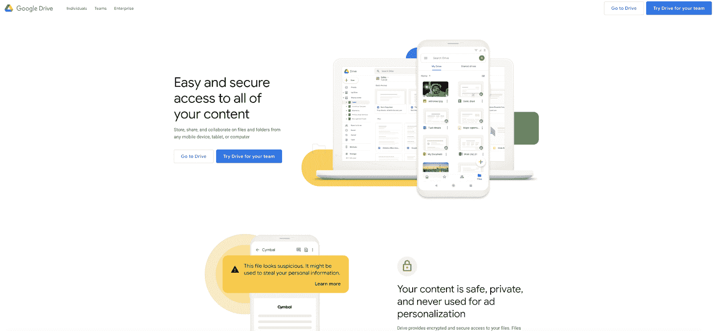

Google Drive website

它是谷歌 G 套件 T1 的一部分，每月活跃用户超过 20 亿 T2。

所以毫无疑问 [Google Drive 是受欢迎的](https://kinsta.com/blog/cloud-market-share/)。考虑到使用 Google Drive 的[优势，这并不奇怪，比如:](https://kinsta.com/blog/benefits-of-cloud-computing/)

> Kinsta 把我宠坏了，所以我现在要求每个供应商都提供这样的服务。我们还试图通过我们的 SaaS 工具支持达到这一水平。
> 
> <footer class="wp-block-kinsta-client-quote__footer">
> 
> 
> 
> <cite class="wp-block-kinsta-client-quote__cite">Suganthan Mohanadasan from @Suganthanmn</cite></footer>

[View plans](https://kinsta.com/plans/)

*   15 GB 的免费存储空间
*   释放计算机上的空间
*   可在桌面和移动设备上访问
*   与 Google Docs、Google Sheets 和其他 Google 应用程序无缝集成
*   提供共享和协作工具
*   文件与桌面同步
*   能够在驱动器中打开 30 多种类型的文件，无需安装软件

Google Drive 既实用又方便，主要是如果你已经在使用其他 Google 产品的话。那你为什么还要选择别的呢？

## 为什么要考虑 Google Drive 替代方案？

人们探索 Google Drive 的替代品有很多原因。这里有几个。

### 价格

Google Drive 提供 15 GB 的免费存储空间。如果你想存储几个文档和偶尔的照片，这就足够了(尽管需要注意的是，这个存储限制分布在你的整个 Google 帐户上，包括 Gmail、Google Photos 等等)。

即使超过 15 GB，Google Drive 也不可否认的便宜。可用的计划包括:

*   100 GB，每月 1.99 美元或每年 19.99 美元
*   200 GB，每月 2.99 美元或每年 29.99 美元。
*   2 TB，每月 9.99 美元或每年 99.99 美元

这些选择都是不错的交易，但如果你的主要目标是省钱，你可以货比三家。例如，如果您需要大于 15 GB 但小于 50gb，您可以以每月 0.99 美元的价格使用 iCloud。

### 和睦相处

Google Drive 的一个显著优势是它与其他 Google 工具的集成。它也可以用于许多不同的文件类型。

但是如果你用的不是 G Suite，你也许能找到一个更适合你的竞争对手。

### 安全性

用户对 Google Drive 最大的担忧之一是安全性。

也不全是坏消息。谷歌加密传输中和静止的文件。问题是，加密密钥也存储在谷歌的服务器上，这意味着它们可能会被黑客、政府、执法部门或谷歌本身访问。

这是许多[云存储服务](https://kinsta.com/blog/what-is-cloud-storage/)的典型特征，但也有一些具有更严格的安全措施。

然后是密码。

要访问您的 Google Drive，您需要登录您的 Google 帐户，这提供了一些安全性。然后，你可以选择只与某些其他谷歌账户共享文件。

但是驱动器中的单个文件不能用密码保护。如果你创建了一个可共享的链接，只发给几个人，它可能会比你想象的更广泛地被分享。

许多人开始使用 Google Drive，而没有探索替代方案。

这很容易做到——你登录 Gmail 帐户，打开一个共享文档，它就在你的驱动器里。

你可能都没听说过其他选择。

但是在你全力以赴使用 Google Drive 之前，先来看看这 15 个选项的列表。选择一个[云存储服务](https://kinsta.com/knowledgebase/wordpress-google-cloud-storage/)来存放你最重要的文件不应该是一个轻率的决定。

## 15 大 Google Drive 替代品

让我们来分解一下 Google Drive 的 15 个顶级替代品。

### 1.微软 OneDrive

对于谷歌文档、表格和幻灯片，我们有谷歌驱动。

对于微软 Word、Excel 和 PowerPoint，有[微软 OneDrive](https://www.microsoft.com/en-us/microsoft-365/onedrive/compare-onedrive-plans?activetab=tab%3aprimaryr1) 。

OneDrive 有许多与 Google Drive 相同的功能。您可以存储各种文档，实时共享和协作，并在云和桌面之间同步。如果你使用微软 Office 多年，你可能会比谷歌更熟悉这个界面。

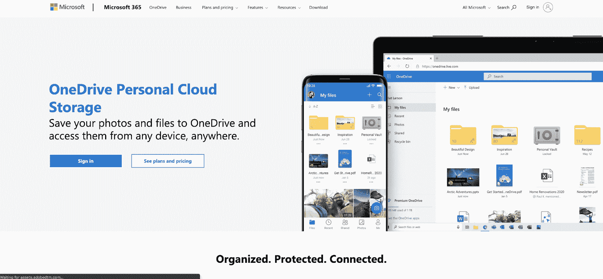

Microsoft OneDrive

桌面 OneDrive 应用内置于 Windows，而你必须下载谷歌的应用。

OneDrive 的安全和隐私功能与 Google Drive 类似，只有一个例外。OneDrive Personal Vault 通过要求指纹、面部、PIN 或通过电子邮件或短信发送的代码等身份验证，为您放入其中的文件提供了额外的安全保护。

OneDrive 的免费计划只给你 5 GB 的存储空间，但更广泛的计划是负担得起的。此外，OneDrive 是微软 365 订阅的一部分。

**定价**

主页:

*   免费:5 GB
*   OneDrive 独立版:100 GB，每月 1.99 美元
*   微软 365 个人版:1 TB，69.99 美元/年
*   微软 365 系列:总计 6 TB(每人 1000 GB ), 99.99 美元/年

商业:

*   OneDrive for Business(计划 1): 1 TB，5 美元/月/用户
*   OneDrive for Business(计划 2):无限制(如果您有 5 个以上的用户), 10 美元/月/用户
*   Microsoft 365 Business Basic: 1 TB，5 美元/月/用户
*   微软 365 商业标准:1 TB，12.50 美元/月/用户

### 2.Dropbox

[Dropbox](https://www.dropbox.com/) 是另一个知名的云存储平台。它自 2007 年就已经存在，是许多用户对云存储的介绍，尽管 Google Drive 今天更受欢迎。

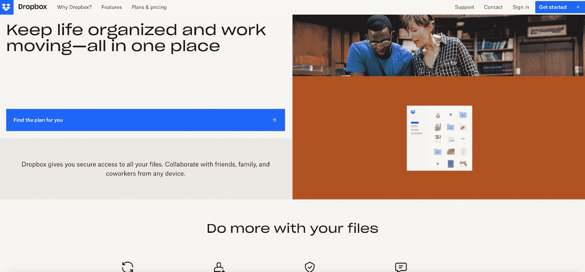

Dropbox

Dropbox 对静态文件使用了比 Google Drive 更强的加密类型，这使它成为一个稍微更安全的解决方案。它还允许您在单独共享的文件上设置密码，并提供远程设备擦除功能和[双因素身份验证](https://kinsta.com/blog/wordpress-two-factor-authentication/)。

由于块级文件复制，跨设备同步 Dropbox 比 Google Drive 更快。这意味着它只同步文件的变化，而不是重新上传或下载整个文件。

然而，只有在处理大型文件时，您才可能注意到速度上的差异。

使用 Dropbox，你只能获得 2 GB 的免费存储空间，尽管你可以通过推荐朋友将存储空间增加到最多 19 GB。

**定价**

个人

*   免费:2 GB
*   另外:2 TB，每月 9.99 美元
*   家庭:2 TB(每个用户 2,000 GB ),每月 16.99 美元

专业的

*   专业:3 TB，每月 16.58 美元
*   专业+设计:3 TB，每月 24.99 美元
*   标准团队:5 TB，12.50 美元/用户/月
*   高级团队:无限制，20 美元/用户/月

### 3\. pCloud

[pCloud](https://www.pcloud.com/) 号称最安全的云存储。

pCloud 的安全应用程序在文件仍在您的电脑上时对其进行加密，使它们在上传到云后不那么容易受到攻击。

pCloud 本身无法访问您的文件，因为加密密钥不储存在其服务器上。

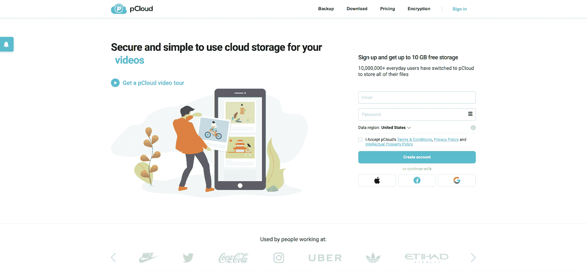

pCloud

和 Google Drive 一样，pCloud 可以让你和别人分享文件。您可以通过邀请他人访问文件或文件夹来共享文件，也可以创建上传或下载链接。上传链接允许他们将文件上传到您的文件夹，而下载链接允许他们查看和下载您的文件。

pCloud 为您提供 10 GB 的免费存储空间，并且有多种方法可以将这一空间增加到 20 GB。如果你确定你会在未来几年使用 pCloud，你可以通过终身计划来省钱。

**定价**

*   特优:1 TB，49.99 美元/年，或 175 美元/年
*   特优加:2 TB，99.99 美元/年，或 350 美元/年
*   企业:1 TB，7.99 美元/用户/月
*   家庭:2 TB，终身 500 美元

### 4.箱子

[Box](https://www.box.com/home) 并不像我们到目前为止谈论的解决方案那样广为人知，但由于其无限的存储计划和协作功能，它是企业的绝佳选择。

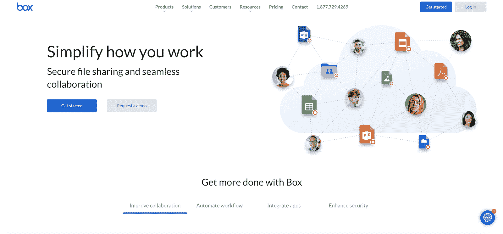

Box

Box 集成了谷歌和微软，因此你可以在 Box 中创建微软 Office 或[谷歌工作空间](https://kinsta.com/blog/google-workspace/)文档。

在 Box 和 Google Drive 上共享文件的方式类似，但 Box 提供了更好的用户管理——如果你与团队合作，这很有用。

Box 的缺点是它对上传的大小有更严格的限制。使用免费计划，你只能上传小于 250 MB 的文件，即使使用更贵的计划，也有 5 GB 的限制。

**定价**

个人和团队

*   个人(免费):10 GB
*   个人版:100 GB，每月 10 美元
*   商务入门:100 GB，5 美元/用户/月

商业

*   商业:无限制，15 美元/用户/月
*   Business Plus:无限制，25 美元/用户/月
*   企业:无限制，35 美元/用户/月
*   企业增强版:自定义

### 5.诗章

Canto 是一个面向品牌的数字资产管理解决方案。它让公司分享他们的图像、视频、文档和其他品牌资产。

Canto

Canto 的用户界面非常直观，将项目显示为大缩略图。

如果你已经有了 Dropbox、box 或 Google Drive 上的内容，Canto 会提供集成来帮助你进行迁移。

## 注册订阅时事通讯

### 想知道我们是怎么让流量增长超过 1000%的吗？

加入 20，000 多名获得我们每周时事通讯和内部消息的人的行列吧！

[Subscribe Now](#newsletter)

由于 Canto 是一款用于商业用途的产品，它拥有强大的用户管理功能。可以向员工、供应商或合作伙伴授予不同的权限。

**定价**

Canto 的定价是定制的。你可以在网站上填写联系表格以获取更多信息。

### 6.同步

[Sync](https://www.sync.com/) 是一款提供端到端加密的文件存储和共享解决方案。像 pCloud 和其他安全解决方案一样，Sync 在本地而不是在其服务器上生成加密密钥，因此即使 Sync 本身也无法访问您的文件。

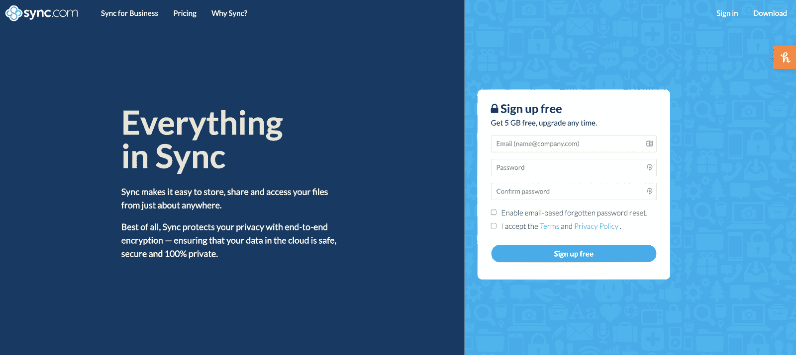

Sync.com

Sync 不像 Google Drive 那样有集成的应用程序，所以它不太适合协作，但它是一种长期保持文件安全的好方法。

您的同步帐户有一项称为同步保管库的功能。储存在同步保管库中的文件不会自动同步到其他设备。

**定价**

个人

*   免费:10 GB
*   Solo 基本版:2 TB，每月 8 美元
*   Solo Professional: 6 TB，20 美元/用户/月

**团队**

*   团队标准:1 TB，5 美元/用户/月
*   无限制团队:无限制，15 美元/用户/月
*   企业:自定义

### 7.iCloud

[iCloud](https://www.icloud.com/iclouddrive) 是苹果版本的云存储。它的功能和 Google Drive 的功能非常相似。

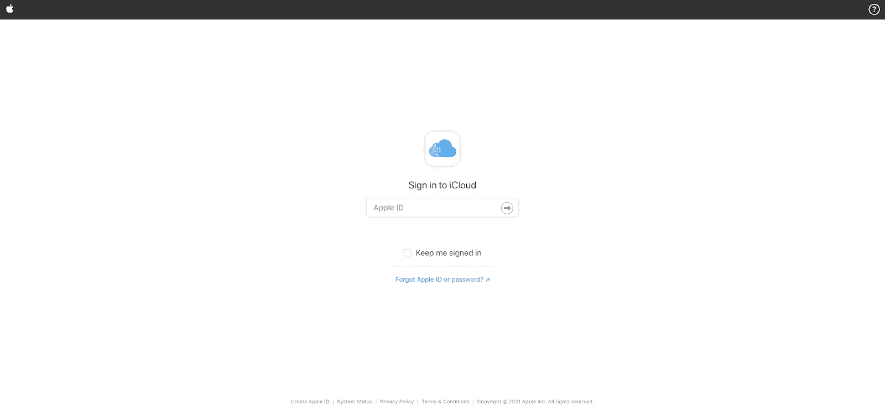

iCloud

如果您使用 iPhone 或其他 Apple 设备，您可能已经有一个 iCloud 帐户。苹果推用户到 iCloud 备份手机文件和数据。这是 iCloud 相对于 Google Drive 的最大优势——如果你已经在用它来备份你的 iPad，或许值得让它成为你的 Google Drive 替代品。

虽然 Google Drive 在 iOS 和 macOS 上运行良好，就像在 Android 上一样，但 iCloud 在苹果设备上运行得最好。

**定价**

*   免费:5 GB
*   50 GB，每月 0.99 美元
*   200 GB，每月 2.99 美元
*   2 TB，每月 9.99 美元

### 8.Kdan 云

Kdan 是一套专注于移动生产力和创造力的应用程序。Kdan 的云存储产品被称为 Kdan Cloud。

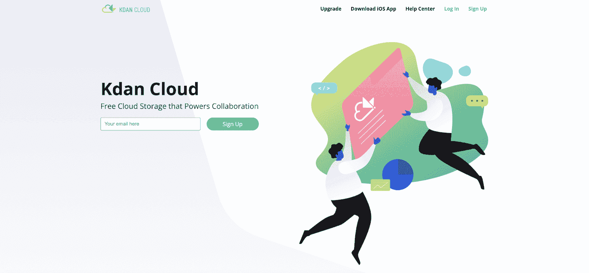

Kdan Cloud

Kdan Cloud 与原生 Kdan 应用程序一起工作，如 Animation Desk、NoteLedge 和 Write-on Video。您也可以在 Kdan 中查看 pdf 和 Microsoft Office 文稿。

文件共享功能让您可以与其他人协作。用户权限和密码保护您文件的隐私。

Kdan Cloud 的免费计划只包括 2 GB 的存储空间，但付费计划每年只需 9.99 美元即可获得 500 GB 的存储空间。您可以自行购买 Kdan 云，也可以订阅 Kdan 的应用套件、Document 365 或 Creativity 365。

**定价**

*   Kdan 云基础版(免费):2 GB
*   Kdan 云:500 GB，9.99 美元/年
*   文档 365: 1 TB，59.99 美元/年
*   创造力 365: 1 TB，59.99 美元/年

### 9.V2 云

[V2 云](https://v2cloud.com/)不是一个云存储解决方案，而是一个桌面即服务软件，允许您部署基于云的 Windows 桌面。

需要一个给你带来竞争优势的托管解决方案吗？Kinsta 为您提供了令人难以置信的速度、一流的安全性和自动伸缩功能。[查看我们的计划](https://kinsta.com/plans/?in-article-cta)

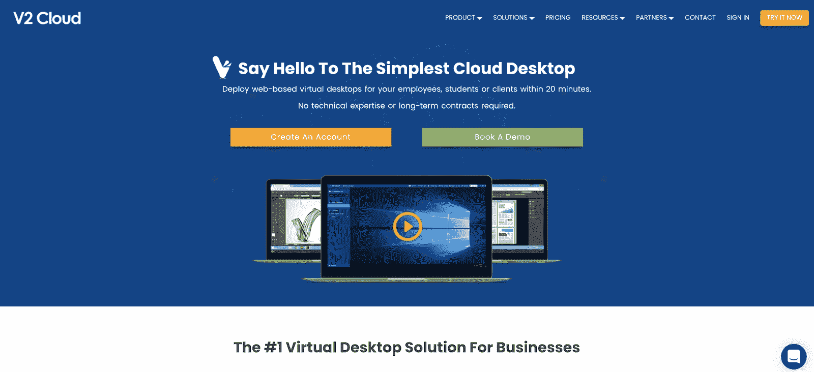

V2 Cloud

这种解决方案通常由简化 It 管理或方便员工在家工作的企业使用。

因为桌面是虚拟的，所以它们的文件保存在云中。

**定价**

V2 云有一长串针对个人和企业的定价方案，但它们都提供相同的存储容量:50 GB。您可以按 GB 支付额外的存储空间。

### 10.JustCloud

[JustCloud](https://www.justcloud.com/) 是一种云服务，具有与 Google Drive 相同的基本文件存储和共享功能。

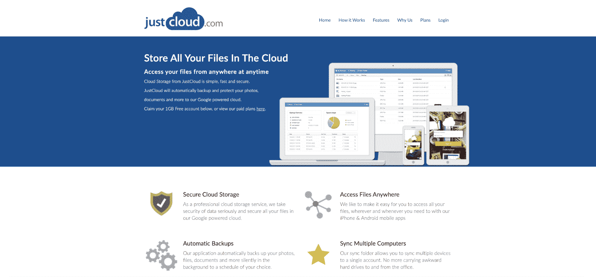

JustCloud

JustCloud 自动在桌面和云端同步。它以使用自动备份和拖放界面而自豪。

JustCloud 比 Google Drive 贵，尤其是如果你不想承诺下面列出的两年订阅条款的话。

**定价**

家庭/专业版:250 GB，每月 7.61 美元

特优:1 TB，每月 8.19 美元

终极版:4 TB，每月 10.69 美元

### 11.亚马逊大道

我们听到了像谷歌、微软和苹果这样的大公司的声音。现在轮到亚马逊了。

[Amazon Drive](https://www.amazon.com/b?ie=UTF8&node=16409408011) 是亚马逊的云存储和文件共享解决方案。

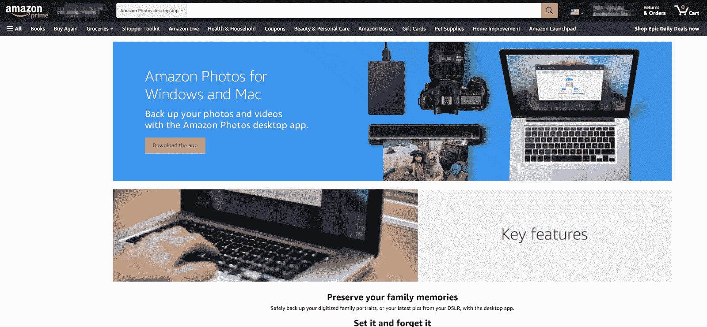

Amazon Drive

Amazon Drive 拥有与谷歌类似的直观界面和文件共享功能。每个亚马逊会员都可以获得 5 GB 的免费存储空间，与亚马逊照片共享。

一项名为 Family Vault 的功能允许您与最多四个人共享存储空间。只要小组中有一个成员拥有亚马逊 Prime 账户，每个人都可以存储无限量的照片和 5 GB 的视频。

**定价**

*   免费:5 GB
*   100 GB，每月 1.99 美元
*   1 TB，每月 6.99 美元
*   2 TB，每月 11.99 美元

### 12.非常

[MEGA](https://mega.io/) 是一个云服务，慷慨地免费给你 20 GB 的存储空间。

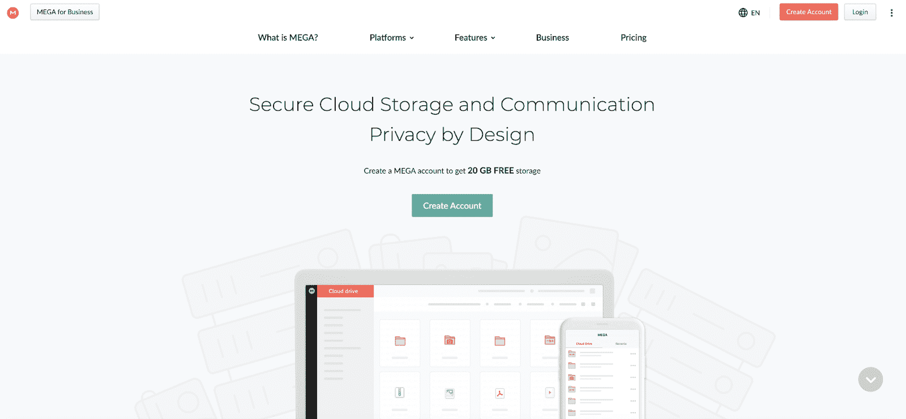

MEGA

MEGA 有助于文件共享、私人和群组聊天以及文件版本控制方面的协作。端到端加密保护您的文件安全。

桌面和移动应用程序可以设置为自动与云同步。虽然 MEGA 没有 Google Drive 的所有生产力和文档编辑功能，但它确实可以让你从 MEGA cloud 中传输任何文件。

**定价**

*   Pro Lite: 400 GB，58.59 美元/年
*   专业 I: 2 Tb，117.19 美元/年
*   专业 II: 8 TB，234.39 美元/年
*   Pro III: 6 TB，351.59 美元/年
*   商业:计划起价为 5.86 美元/用户/月

### 13.诺德洛克

[NordLocker](https://nordlocker.com/) 是一款安全的云存储解决方案，具有易于使用的界面。

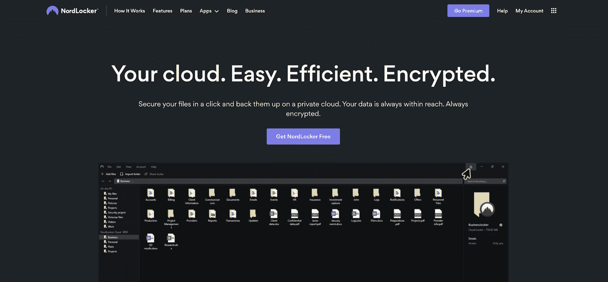

NordLocker

NordLocker 提供本地端到端加密。您可以在应用程序中打开您的文件，而无需先解密它们，并且您可以与其他 NordLocker 用户共享它们。

NordLocker 比 Google Drive 更便宜也更安全——所以有什么不喜欢的呢？

一个很大的缺点是它没有 Android 或 iOS 的移动应用程序。但是 NordLocker 相对较新，所以有希望在未来开发一个。

**定价**

*   免费:3 GB
*   500 GB，每月 3.19 美元
*   2 TB，每月 7.99 美元

### 14.蜘蛛橡树

[SpiderOak](https://spideroak.com/) One 是云备份解决方案。它在无限数量的设备上提供文件同步和共享。

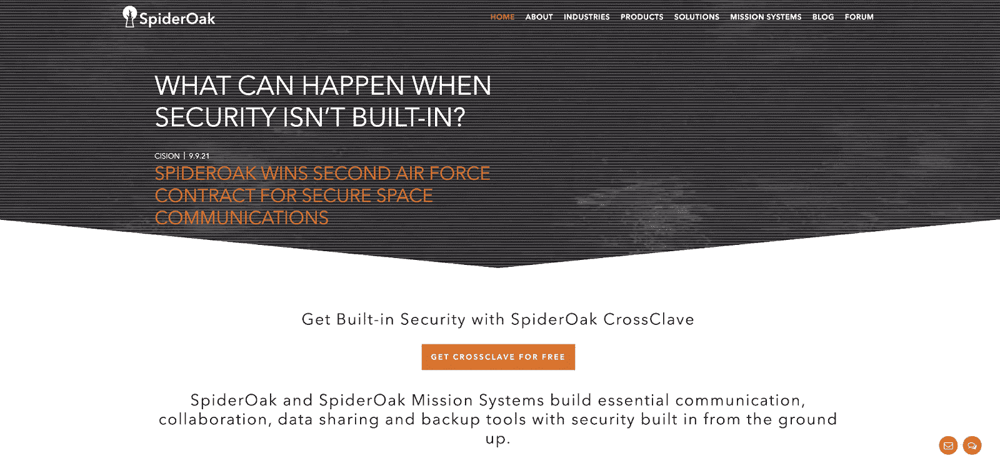

SpiderOak

SpiderOak 比 Google Drive 更安全，文件在本地加密，所以即使是 SpiderOak 也无法访问。它有强大的版本控制能力，所以你可以访问你所有的历史版本和删除的文件，没有任何时间限制或约束。

不幸的是，它不提供 iOS 应用程序或 21 天试用期后的免费计划。

**定价**

*   150 GB，每月 6 美元
*   400 GB，每月 11 美元
*   2 TB，每月 14 美元
*   5 TB，每月 29 美元

### 15.Backblaze

[Backblaze](https://www.backblaze.com/cloud-backup.html#af9utx) 是一项云服务，专注于无限备份您的计算机和外部驱动器。

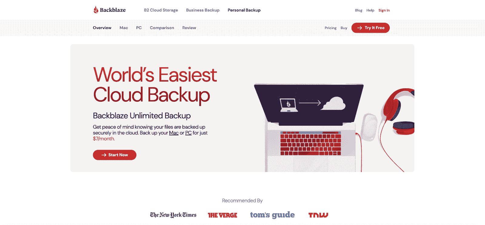

Backblaze

Backblaze 没有 Google Drive 作为备份服务提供的所有共享和协作功能。但它确实提供了无限的存储空间。

如果您丢失了数据，可以通过下载或通过 USB 发送给您来快速恢复。

但是，您不能使用 Backblaze 来释放计算机上的空间。Backblaze 是一面镜子，如果你在桌面上添加了一个文件，它会将该文件复制到云中。但如果你从桌面上删除了那个文件，Backblaze 也会从你的云存储中删除。

升级到无限版本历史记录可以确保您不会以这种方式丢失任何东西。

**定价**

Backblaze 只有一个定价方案。费用为每月 7 美元、每年 70 美元或两年 130 美元。

[不爱 Google Drive？😥不用担心，这些替代品可以完成任务✅ 点击推文](https://twitter.com/intent/tweet?url=https%3A%2F%2Fbit.ly%2F3skWwfQ&via=kinsta&text=Not+loving+Google+Drive%3F+%F0%9F%98%A5+Not+to+worry%2C+these+alternatives+can+get+the+job+done+%E2%9C%85&hashtags=GoogleDrive%2CCloudStorage)

## 摘要

如果 Google Drive 没有达到你的预期，是时候换一个了。幸运的是，有许多 Google Drive 替代品可供选择。

在你权衡了什么对你来说最重要之后，你将能够对适合你的[云技术解决方案](https://kinsta.com/blog/types-of-cloud-computing/)做出明智的选择。

* * *

让你所有的[应用程序](https://kinsta.com/application-hosting/)、[数据库](https://kinsta.com/database-hosting/)和 [WordPress 网站](https://kinsta.com/wordpress-hosting/)在线并在一个屋檐下。我们功能丰富的高性能云平台包括:

*   在 MyKinsta 仪表盘中轻松设置和管理
*   24/7 专家支持
*   最好的谷歌云平台硬件和网络，由 Kubernetes 提供最大的可扩展性
*   面向速度和安全性的企业级 Cloudflare 集成
*   全球受众覆盖全球多达 35 个数据中心和 275 多个 pop

在第一个月使用托管的[应用程序或托管](https://kinsta.com/application-hosting/)的[数据库，您可以享受 20 美元的优惠，亲自测试一下。探索我们的](https://kinsta.com/database-hosting/)[计划](https://kinsta.com/plans/)或[与销售人员交谈](https://kinsta.com/contact-us/)以找到最适合您的方式。