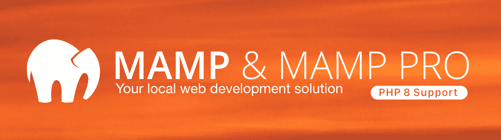
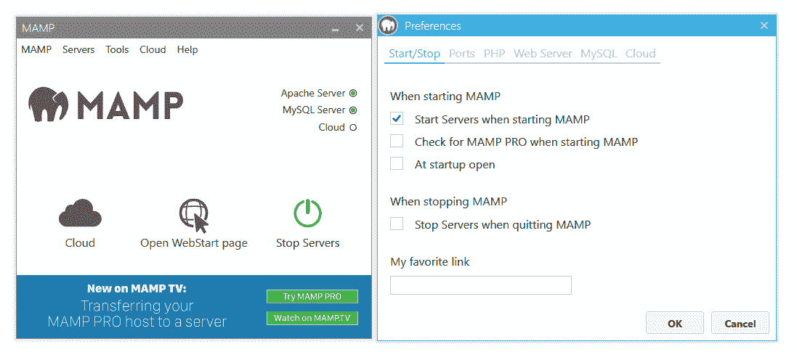
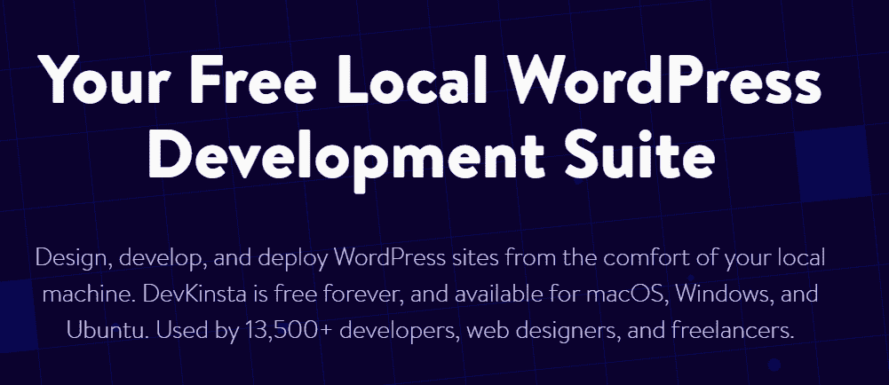
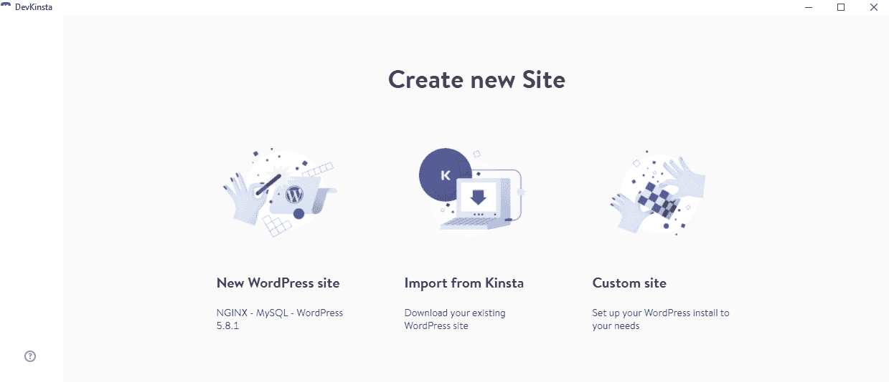
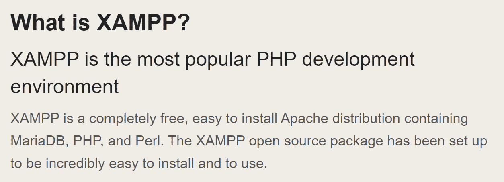
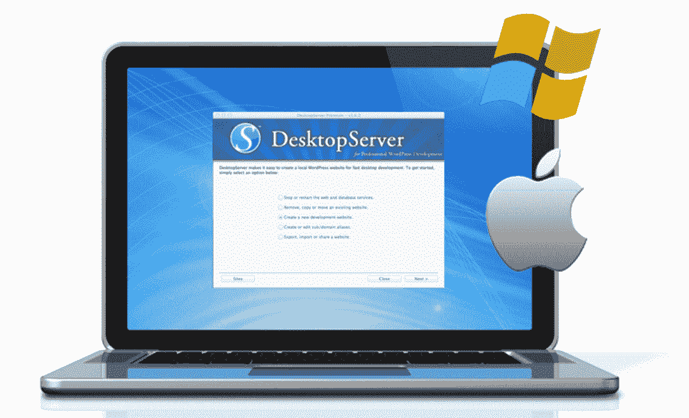
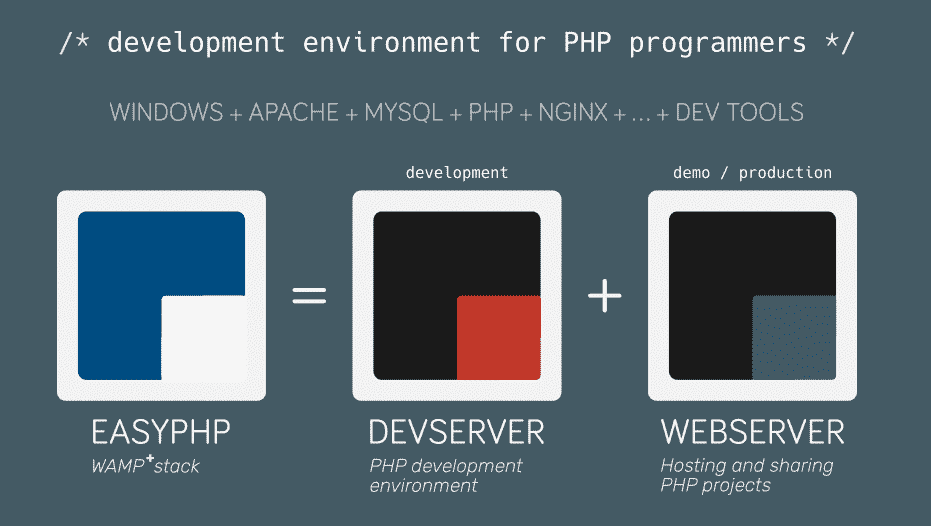
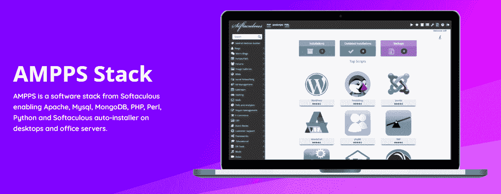
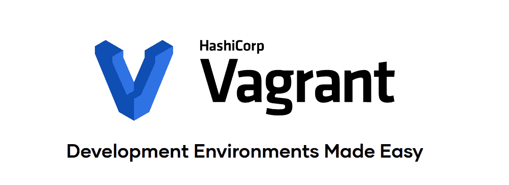

# 2022 年 8 个最佳 MAMP 备选方案

> 原文：<https://kinsta.com/blog/mamp-alternative/>

在开发新网站时，本地 web 开发环境通常是最佳选择。MAMP 是最受欢迎的 web 开发解决方案之一，但它并不适合所有人。幸运的是，你可以使用大量的 MAMP 替代品。

本地环境帮助你在本地设备上建立你的网站，直到它准备好转移到网络主机上。一些本地开发工具也为您提供了强大的功能，例如建立多个本地站点并将这些项目推向生产。

在这篇文章中，我们将仔细看看 MAMP，衡量其利弊，然后列出我们推荐的八大 MAMP 替代方案。

我们开始吧！

T3】

## 什么是 MAMP？

MAMP

[MAMP](https://www.mamp.info/en/windows/) 代表 macOS、Apache、MySQL/MariaDB，以及 PHP、Perl 或 Python。如果您以前从事过 web 开发，您会将这些软件组合视为“堆栈”MAMP 获得所有这些组件，并在 Windows 或 macOS 上设置[全栈](https://kinsta.com/blog/what-is-a-full-stack-developer/)。这样，您就可以访问在本地启动新项目所需的 web 开发软件。

除了为您设置完整的堆栈之外，MAMP 还提供了一个界面，使您无需使用命令行即可与每个组件进行交互:

MAMP Interface

该界面使得根据您正在处理的项目类型来配置您的 web 堆栈变得容易。此外，你可以随时点击几下鼠标来启动或停止你的 MAMP 服务器。

> Kinsta 把我宠坏了，所以我现在要求每个供应商都提供这样的服务。我们还试图通过我们的 SaaS 工具支持达到这一水平。
> 
> <footer class="wp-block-kinsta-client-quote__footer">
> 
> 
> 
> <cite class="wp-block-kinsta-client-quote__cite">Suganthan Mohanadasan from @Suganthanmn</cite></footer>

[View plans](https://kinsta.com/plans/)

[寻找 MAMP 替代？👀这些强大的工具可以帮助你将那些项目推向生产🛠 点击推文](https://twitter.com/intent/tweet?url=https%3A%2F%2Fkinsta.com%2Fblog%2Fmamp-alternative%2F&via=kinsta&text=Looking+for+a+MAMP+alternative%3F+%F0%9F%91%80+These+powerful+tools+can+help+you+push+those+projects+to+production+%F0%9F%9B%A0&hashtags=MAMP%2CPHP)

## MAMP 的利与弊(以及何时考虑替代方案)

MAMP 是处理简单的网络开发项目的一个极好的工具。然而，软件不是没有限制或缺陷的。使用 MAMP 有四个明显的缺点:

1.  启动多个本地项目非常复杂。总的来说，MAMP 并没有优化到可以帮助你启动众多的本地项目。例如，使用 MAMP 建立多个[本地 WordPress 网站](https://kinsta.com/blog/install-wordpress-locally/)需要几个变通方法。
2.  您在多个项目中使用相同的软件堆栈。与其他本地 web 开发工具不同，您可以为每个项目共享相同的软件堆栈。这意味着你不能为每个本地网站设置独特的配置。
3.  地方项目之间没有条块分割。每个 MAMP 网站共享相同的服务器和资源。其他本地 web 开发工具支持虚拟化来划分您的项目。
4.  **您不能修改 MAMP 软件堆栈。**你看到的栈就是你得到的栈。如果你想访问其他的[网络开发软件](https://kinsta.com/blog/website-design-software/)，你需要手动设置，并且你不能使用 MAMP 的控制面板来配置它。

抛开所有这些不利因素，如果你打算做一个 WordPress 本地开发项目，MAMP 是一个不错的选择。MAMP 栈包含了 WordPress 需要的所有组件，包括网络服务器、数据库和 PHP。实际上，你可以用 MAMP 在几分钟内启动一个 WordPress 网站。

同样，如果您不习惯使用命令行，MAMP 可以通过其控制面板轻松管理软件堆栈的每个组件。然而，控制面板本身非常有限。如果您需要更改面板中没有包含的任何配置，那就太不幸了。

考虑到这一点，有大量的 MAMP 替代品，既能对本地 web 开发项目提供更多的控制，又能提供易于使用的界面。如果这是你感兴趣的东西，那么你可能想看看几个不同的选项。在下一部分，我们将与您分享我们的最佳选择。

## 2022 年 8 大 MAMP 替代方案

在这一节中，我们将向您介绍其他软件选项，它们可以做 MAMP 做的所有事情，在许多情况下，甚至更多。我们将讨论专注于 WordPress 的本地 web 开发工具和其他适用于各种本地项目的选项。我们开始吧！

### 1.德夫金斯塔

DevKinsta

DevKinsta 是我们自己的本地 WordPress web 开发软件。该程序使你能够[使用虚拟化建立多个 WordPress 网站](https://kinsta.com/knowledgebase/devkinsta/installation/)。有了 Kinsta，你建立的每个网站都使用自己的 [Nginx](https://kinsta.com/knowledgebase/what-is-nginx/) 、 [PHP](https://kinsta.com/cheatsheets/wordpress-update-php/) 和 [MySQL](https://kinsta.com/blog/mysql-version/) 实例。

DevKinsta Interface

该软件自动为每个新的 WordPress 网站设置 HTTPS，并记录任何错误。你可以监控每个网站的电子邮件，并使用开源数据库管理工具 [Adminer](https://kinsta.com/blog/adminer/) 访问它们的数据库。

如果你是 Kinsta 的用户，你会很高兴知道 DevKinsta 可以让你点击一下就能把网站推上舞台。这意味着您可以在本地处理项目，将它们推向试运行，然后投入生产，而无需手动复制文件。此外，DevKinsta 可以导入您的 Kinsta 站点的副本，因此您可以在本地使用它们。

价格: [DevKinsta 是 100%免费的](https://kinsta.com/devkinsta/download/)，即使你不是 Kinsta 的用户。

### 2.WampServer

WampServer

就功能而言，WAP server 与 MAMP 相对相似。主要区别在于您可以访问更紧凑的堆栈。WampServer 支持 [Apache](https://kinsta.com/knowledgebase/mamp-apache-server-not-starting/) ，PHP，和 [MySQL](https://kinsta.com/knowledgebase/mysql-community-server/) ，它运行在 Windows 上。

与使用完整的控制面板不同，您主要使用一个简单的菜单与 WampServer 进行交互，该菜单使您能够访问它的 PHP 和数据库管理工具。您也可以随意停止和重新启动服务。

最终，WampServer 是一个轻量级本地 web 开发工具，非常适合单个本地项目。如果你想测试一个本地 WordPress 设置，WampServer 为你提供了设置内容管理系统(CMS)所需的所有软件，没有任何问题。

**价格:** WampServer 是一个开源项目。

### 3.XAMPP

XAMPP

[XAMPP](https://www.apachefriends.org/index.html) 是一个开源项目，包含 [MariaDB](https://kinsta.com/blog/mariadb-vs-mysql/) 、 [Perl](https://www.perl.org/) 、PHP 和 Apache。它适用于 Windows、macOS 和 Linux 发行版。XAMPP 的一个突出的方面是它允许你在设置过程中选择你想要的堆栈组件。

除了网络开发软件，XAMPP 还配备了 FTP 和邮件服务器。这意味着你可以用 XAMPP 建立本地网站，[通过 FTP](https://kinsta.com/blog/best-ftp-clients/) 连接它们，收发电子邮件。

## 注册订阅时事通讯

### 想知道我们是怎么让流量增长超过 1000%的吗？

加入 20，000 多名获得我们每周时事通讯和内部消息的人的行列吧！

[Subscribe Now](#newsletter)

与 MAMP 或 WampServer 相比，XAMPP 控制面板为您提供了更多的选项来管理您的本地开发设置。您可以访问每个软件组件的各种配置选项和管理控制。XAMPP 还为您提供深入的日志，以便您可以跟踪环境的每一次变化。

总的来说，XAMPP 的特性集使其成为本地 WordPress 主题和插件开发的完美选择。如果你试图[对本地网络项目](https://kinsta.com/knowledgebase/xampp-not-working/)进行故障诊断，它的日志也是一个很大的资产。

**价格:** XAMPP 是一个开源项目。

### 4.桌面服务器

DesktopServer

DesktopServer 可能是最古老的本地可视化界面 WordPress 开发工具。该软件允许你使用一步一步的向导建立多个本地 WordPress 网站(就像 DevKinsta 一样)。然而，你仍然需要运行五分钟的 WordPress 安装程序来完成安装过程。

使用 DesktopServer 最大的缺点是你只能访问三个免费的 WordPress 网站。DesktopServer 的高级版本包含了许多功能，使本地 web 开发变得更加容易。在这些功能中，你有 [WP-CLI 支持](https://kinsta.com/blog/wp-cli/)，建立多个 WordPress 网站的能力，存储网站蓝图的选项，以及多站点支持。

总而言之，如果你对配置本地 WordPress 开发栈的各个部分感到不舒服，DesktopServer 是相当容易使用的。然而，如果你打算运行多个网站，你需要考虑 DesktopServer 的高级版本。

**价格:** DesktopServer 提供免费和高级许可[起价 99.95 美元](https://serverpress.com/get-desktopserver/)。

### 5.EasyPHP

EasyPHP

到目前为止，我们主要关注那些即使你没有 web 开发背景也可以使用的工具。不过， [EasyPHP](https://www.easyphp.org/) 有点不一样。这是一个面向 PHP 爱好者和开发者的 MAMP 替代品。

有了这个软件，你可以得到一个包含 Apache、MySQL、PHP 和 Nginx 的堆栈，所有这些都在一个只适用于 Windows 的包中。EasyPHP 还包含 web 开发工具，包括 [Xdebug](https://xdebug.org/) 、 [PhpMyAdmin](https://kinsta.com/blog/install-phpmyadmin/) 等等。

该软件还提供了安装扩展其功能的模块的选项，例如对 [Laravel](https://kinsta.com/knowledgebase/what-is-laravel/) 的支持、移动测试插件和 PHP 代码嗅探器。如果你真的想在 Windows 环境下开发 WordPress，你可以考虑这个本地开发选项。

与我们世界一流的支持团队一起体验卓越的 WordPress 托管支持！与支持我们财富 500 强客户的同一个团队聊天。[查看我们的计划](https://kinsta.com/plans/?in-article-cta)

**价格:** EasyPHP 是开源软件。

### 6.安普斯

AMPPS

如果你曾经使用过提供 [cPanel](https://kinsta.com/knowledgebase/what-is-cpanel/) 的网络主机，那么你很可能熟悉 [Softaculous](https://www.softaculous.com/) 。该软件使您能够在您的 web 服务器上安装其他软件和 CMSs。它提供了一种最简单的安装 WordPress 的方法(如果你不想手动安装的话)，如果你开始了解这个平台的话，这是非常完美的。

[AMPSS](https://www.ampps.com/) 代表 Apache、MySQL、MongoDB、PHP、Perl、 [Python](https://kinsta.com/blog/python-tutorials/) 和 Softaculous。在所有本地开发工具中，这是提供最广泛的自安装 CMS 和应用程序的工具。您还可以完全控制 PHP 和 Apache 的安装。该软件可以让你在不同的 PHP 版本之间切换，只需点击几下鼠标。

AMPSS 的免费版本不限制你可以建立的本地网站的数量。然而，那个版本没有 AMPPS 内置的 WordPress 管理器工具。这个功能可以帮助你管理多个 WordPress 网站，使用一个非常类似于多站点设置的面板。

**价格:** AMPSS 是免费的，带有 WordPress manager 工具的高级版本从[每年 49 美元起](https://www.ampps.com/pricing)。

### 7.Zend 服务器

Zend Server

在我们讨论过的所有 MAMP 备选方案中， [Zend Server](https://www.zend.com/products/zend-server) 是我们归类为“企业”解决方案的唯一选择。顾名思义，Zend Server 使您能够建立一个本地 web 服务器。它支持多种选项，包括 Apache、IIS 和 Nginx。然而，当涉及 PHP 集成时，该软件大放异彩。

有了 Zend Server，你可以访问超过 75 个不同 CMS(包括 WordPress)和其他软件的插件。这些插件使你能够在本地设置应用程序，或者将 Zend Server 与第三方服务集成，例如[亚马逊网络服务(AWS)](https://kinsta.com/aws-market-share/) 。

Zend Server 的主要卖点之一是获得 PHP 自动更新和补丁。该软件包括强大的调试和速度优化工具、应用程序监控功能和数据缓存选项。

如果您计划将本地开发软件用于客户端项目，Zend Server 是一个值得考虑的选项。然而，Zend Server 也是这个列表中唯一不提供完全免费版本的 MAMP 替代产品。另外，它只适用于 Windows 和 Linux 发行版。

**价格:** Zend Server 提供 [30 天免费试用](https://www.zend.com/free-trial)，许可证从[开始，每年 250 美元](https://store.zend.com/products/zend-server)。

### 8.无赖

Vagrant

与这份名单上的任何其他 MAMP 备选方案不同，它不允许你建立一个预先确定的本地软件开发栈。其核心是一个虚拟化工具，允许你用很少的开销启动你需要的任意多的机器。根据每个项目的需要，您可以为每台机器分配特定数量的硬件资源。

既然我们在谈论一个虚拟化工具，那么流浪的机器可以拥有它的环境。您只能通过命令行与设备进行交互，并且您可以完全控制要设置的软件堆栈及其配置。

有了 vagger，您可以访问一个巨大的“盒子”库，这些盒子是预先构建的环境，您只需几个命令就可以部署它们。WordPress 开发者有很多奇妙的[流浪盒，包括](https://kinsta.com/blog/bedrock-trellis/) [VCCW](http://vccw.cc/) 和[塞拉沃](https://github.com/Seravo/wp-vagrant)以及其他选项。

如果你习惯使用命令行的话，你可以用一个神奇的工具运行任意多的本地虚拟机，每个虚拟机都有自己的 WordPress 设置。而且，你可以很容易地与其他用户共享流浪机器，很容易在不同的计算机上复制相同的工作环境。另外，它适用于所有主流操作系统，包括 Windows、macOS 和 Linux。

**价格:**流浪者是开源软件。

[这 8 个强大的 MAMP 备选方案将为你的下一个项目提供大量选择💪](https://twitter.com/intent/tweet?url=https%3A%2F%2Fkinsta.com%2Fblog%2Fmamp-alternative%2F&via=kinsta&text=These+8+powerful+MAMP+alternatives+will+give+you+plenty+of+options+for+your+next+project+%F0%9F%92%AA&hashtags=MAMP%2CPython)

## 摘要

MAMP 是本地 WordPress 开发的一个极好的工具。然而，有一整个世界的 MAMP 替代品，其中许多提供了更广泛的开发选项，并让您对您的环境有更多的控制。

如果你完全致力于 WordPress 项目，我们自己的 [DevKinsta](https://kinsta.com/devkinsta/) 工具提供了最友好的用户界面，你可以用它来启动你需要的许多本地网站。对于更多样化的本地 web 开发体验，您可能会考虑使用流浪者。有了这个软件，您可以为任何类型的开发项目启动任意多的本地虚拟机。

*准备好将您的开发项目投入使用了吗？金斯塔是你最好的选择。我们提供协助迁移和 30 天退款保证。[查看我们的计划](https://kinsta.com/plans/)或与我们的[销售代表](https://kinsta.com/contact-us/)交谈，找到满足您需求的理想计划。*

* * *

让你所有的[应用程序](https://kinsta.com/application-hosting/)、[数据库](https://kinsta.com/database-hosting/)和 [WordPress 网站](https://kinsta.com/wordpress-hosting/)在线并在一个屋檐下。我们功能丰富的高性能云平台包括:

*   在 MyKinsta 控制面板中轻松设置和管理
*   24/7 专家支持
*   最好的谷歌云平台硬件和网络，由 Kubernetes 提供最大的可扩展性
*   面向速度和安全性的企业级 Cloudflare 集成
*   全球受众覆盖全球多达 35 个数据中心和 275 多个 pop

在第一个月使用托管的[应用程序或托管](https://kinsta.com/application-hosting/)的[数据库，您可以享受 20 美元的优惠，亲自测试一下。探索我们的](https://kinsta.com/database-hosting/)[计划](https://kinsta.com/plans/)或[与销售人员交谈](https://kinsta.com/contact-us/)以找到最适合您的方式。