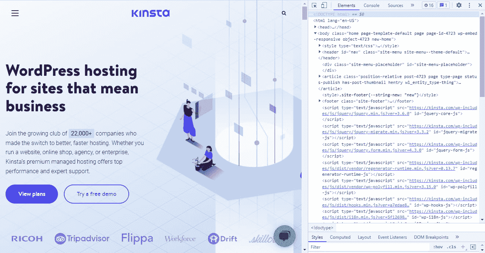
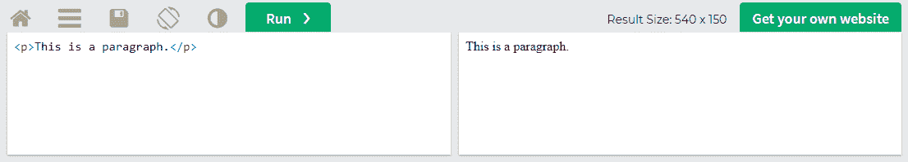
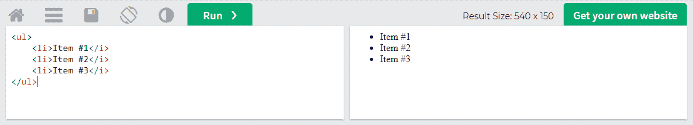
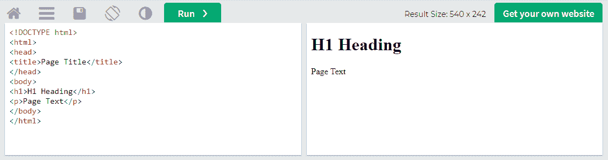

# XML 与 HTML:了解这些标记语言之间的区别

> 原文：<https://kinsta.com/blog/xml-vs-html/>

XML 和 HTML 都是标记语言。虽然它们听起来相似，但它们是具有不同应用的独特语言。然而，这两种标记语言以几种方式协同工作，如果你想精通 web 开发，理解这两种语言都很重要。这里是你需要知道的关于 XML 和 HTML 的一切。

本文探讨了什么是 XML 和 HTML，何时使用它们，它们之间的区别，以及如何将它们结合起来创建一个有效的网络。

T3】

## 什么是 XML？

XML 代表[可扩展标记语言](https://www.w3schools.com/xml/xml_whatis.asp)，它是用于跨应用程序和服务器传输数据的最常见的 web 语言之一。


XML (**Source:** [Wikipedia Commons](https://commons.wikimedia.org/wiki/File:Xml_logo.svg))


与其他标记语言不同，XML 本身不做任何事情。它所做的只是存储数据。它需要与另一个应用程序交互来显示、移动或使用存储的代码。

XML 确实有[语法](https://www.w3schools.com/xml/xml_syntax.asp)，但是它所有的标签都是由你定义的，你也可以添加或删除。这就是它“可扩展”的原因

[XML 和 HTML 可能有相似的名字，但实际上它们是非常独特的语言，有不同的应用。👀了解更多就在这里⬇️ 点击推文](https://twitter.com/intent/tweet?url=https%3A%2F%2Fkinsta.com%2Fblog%2Fxml-vs-html%2F&via=kinsta&text=XML+and+HTML+may+have+similar+names%2C+but+they+are+in+fact+very+unique+languages+with+different+applications.+%F0%9F%91%80+Learn+more+right+here+%E2%AC%87%EF%B8%8F&hashtags=XML%2CHTML)


### 什么时候使用 XML？

XML 的主要功能是存储和传输数据。与 HTML 非常相似，XML 也用于创建网站，但与 HTML 不同，它不涉及向访问者显示数据。


> Kinsta 把我宠坏了，所以我现在要求每个供应商都提供这样的服务。我们还试图通过我们的 SaaS 工具支持达到这一水平。
> 
> <footer class="wp-block-kinsta-client-quote__footer">
> 
> 
> 
> <cite class="wp-block-kinsta-client-quote__cite">Suganthan Mohanadasan from @Suganthanmn</cite></footer>

[View plans](https://kinsta.com/plans/)

XML 的唯一功能是移动数据；如何使用它取决于你和你与之搭配的技术。通常，您会将数据从服务器或另一个应用程序传输到数据库。

WordPress 使用 REST API 在服务器之间建立连接，可以传输数据，包括 XML。过去，它使用 [XML-RPC](https://kinsta.com/blog/xmlrpc-php/) 来代替，但是现在已经过时了。

XML 存储的数据类型完全由您决定，但是通常，它用于“[结构化数据](http://xml.coverpages.org/deroseStructure.html)，比如文档、发票、目录、书籍等等。它通常用于在表单等 web 应用程序中存储数据。

XML 是平台无关的，并且是纯文本格式，所以您不必担心无法打开和读取传输给您的数据。XML 基本上适用于任何技术。这就是为什么它至今仍被广泛使用的原因。

### XML 的特性

下面是 XML 及其功能的分类，这样你就可以很容易地将其与 HTML 进行比较。

*   XML 有效地存储数据，并把数据从一个地方带到另一个地方。
*   虽然它通常是人类可读的，但 XML 依赖于其他应用程序来显示、分析或输出数据。它只存储和移动它。
*   XML 是平台无关的，可以[挂钩到](https://kinsta.com/blog/wordpress-hooks/)任何支持它的应用程序。
*   它相对简单，易于编写和学习——尽管将它投入使用是 HTML 的一大进步。
*   XML 是动态的，可以用来创建非静态网页。
*   XML 标签是用户定义的。不需要像 HTML 一样死记硬背标签；你自己编的。
*   它是一种可扩展的语言，可以在任何时候写入或删除信息。

### XML 的例子

还在迷茫？让我们分解一个简单的 XML 实例。

```
<catalog>

  <plant>
    <id>01</id>
    <name>Daisies</name>
    <price>$2.95</price>
  </plant>

  <plant>
    <id>02</id>
    <name>Buttercup</name>
    <price>$2.30</price>
  </plant>

</catalog>
```

首先要注意的是:所有这些标签都是用户定义的。XML 中没有内置的“catalog”标记，也没有任何固有的功能。

这与 HTML 不同，在 HTML 中像`<title>`这样的标签会影响文本的格式。在 XML 中，标签本身不做任何事情。

如您所见，这只是一种对信息进行分类和编目的方式。顶层标签是`<catalog>`，应用于整个文档。接下来是`<plant>`目录，其中嵌套了两种不同花的 ID、名称和价格等信息。

就其本身而言，这没有任何作用。但是您可以使用这些数据创建一个动态目录，显示在您的网站上，并在您修改原始 XML 时自动更新。

每次在目录中添加或删除一朵花时，您都可以深入 HTML 并更新您的网站，但这种方法更有效。所有需要做的只是一个小的设置来节省大量的工作。

## 什么是 HTML？

HTML 代表超文本标记语言，它是世界上最常用的网络语言之一。HTML 是互联网无与伦比的构建模块，也是网站创建的标准语言。


HTML5 (**Source:** [Wikipedia Commons](https://commons.wikimedia.org/wiki/File:HTML5_logo_and_wordmark.svg))


想学前端开发，HTML 不是可选的。几乎 100%的网站使用它和 CSS。XML 是一种相当流行的标记语言，但是 HTML 完全超越了它。

幸运的是，XML 和 HTML 不是竞争对手。你可以一起使用它们来完成伟大的事情。

### 什么时候用 HTML？

HTML 是用于网站前端编码的主要语言。虽然它通常与 CSS、XML 等其他语言以及 Ruby 和 Python 等后端语言一起使用并集成，但 HTML 是负责制作网站布局和基本外观的主要语言。



HTML view of the Kinsta homepage.


它的工作方式是使用各种称为标签的元素来描述页面的结构和布局。这些与 XML 标签非常相似，但与 XML 不同的是，标签是预定义的；你需要记住它们，并且有一个内置的函数。

这些标签写在服务器的文档中，然后访问者的浏览器将 HTML 转换成可视显示。HTML 创建图像、视频、表格，甚至整个页面布局。

例如，HTML 标签`<b>`在浏览器中显示时会加粗文本。有关更详细的解释，请参见下面的示例。

### HTML 的特性

简而言之 HTML 是什么？以下是基本情况。

*   HTML 是最简单的编码语言之一，对于想要学习代码的初学 web 开发人员来说，这是一个很好的开端。
*   它是 web 开发的主要标准化语言。它是平台无关的，可以在所有支持它的浏览器和应用程序中工作。
*   HTML 使用由标签和属性组成的简单标记语法。这些标签是预定义的。
*   HTML 不区分大小写，即使有打字错误和语法错误也会显示。
*   它创建不更新或不改变的静态网页。
*   HTML 可以与 CSS、XML、后端语言等其他 web 语言集成。

### HTML 的例子

如前所述，HTML 只是一系列被称为标签的元素。它们由包含文本的开始和结束标记组成。HTML 标签中的文本可能会被加粗、倾斜、做成标题等等。

这里有一个例子:

## 注册订阅时事通讯


### 想知道我们是怎么让流量增长超过 1000%的吗？

加入 20，000 多名获得我们每周时事通讯和内部消息的人的行列吧！

[Subscribe Now](#newsletter)

```
<p>This is a paragraph</p>
```



HTML paragraph


标签设置了一个简单的文本段落。它本身不会做太多事情，但是您可以使用 CSS 来通用地样式化`<p>`标签。那么你网站上的每一段都将是你想要的样子。

以下是其他一些基本的 HTML 标签:

*   `<h1>`、 `<h2>`等。:设置页面的标题。上升到`<h6>`。
*   `<body>`:设置页面的正文。
*   `<b>`:粗体文本。
*   `<i>`:斜体文本。
*   ``:显示图像。
*   `<a href=" example.com">`:链接到一个页面。标签中包含的文本将是你的锚文本。
*   `<br>`:添加一个换行符。这是唯一一个不需要结束标签的 HTML 标签。

像 XML 一样，HTML 元素可以相互嵌套。比如，列表有点特殊；您需要使用`<ol>`(带数字的有序列表)或`<ul>`(带项目符号的无序列表)。每个列表元素都有一个`<li>`标签。

```
<ul>
  <li>Item #1</li>
  <li>Item #2</li>
  <li>Item #3</li>
</ul>
```



Itemized list in HTML.


HTML 元素还有“[属性](https://www.w3schools.com/html/html_attributes.asp)，进一步定制标签。下面是一个带有``标签的例子:

```

```

这将创建一个具有这些尺寸的图像。“src”或 source 属性要求外部链接或服务器上的文件，而 width 和 height 属性可以是任何数字。

最后，这里有一个基本 HTML 文档的例子。

```
<!DOCTYPE html>

  <html>

    <head>
      <title>Page Title</title>
    </head>

    <body>
      <h1>H1 Heading</h1>
      <p>Page Text</p>
    </body>

</html>
```



Headings in HTML.


`<!DOCTYPE html>`和`<html>`标签将文档定义为 HTML 文档。嵌套在`<html>`中的是`<head>`，其中包含页面标题。然后，`<body>`标签包含一个标题和一些示例文本。然后文档被关闭。永远记住关闭你所有的 HTML 标签！


## XML 和 HTML 的区别

HTML 和 XML 都是标记语言，与[编程语言](https://kinsta.com/blog/best-programming-language-to-learn/)相似但不同的是，它们使用标签来注释文档。他们也使用[类似的语法](https://www.w3schools.com/xml/xml_syntax.asp)，比如开始和结束标签。

所有的 Kinsta 托管计划都包括来自我们资深 WordPress 开发者和工程师的 24/7 支持。与支持我们财富 500 强客户的同一个团队聊天。查看我们的计划！

但相似之处仅限于此；这两种 web 语言在应用上有很大的不同。

HTML 代码是专门用来设计在浏览器中显示的网页的。XML 只用于数据传输和存储。虽然它是人类可读的，但它并不意味着在前端被看到。

HTML 是静态的，而 XML 是动态的。用 HTML 制作的网站一般不会自行更改或更新，而 XML 几乎总是被用来制作动态应用程序。

HTML 是一种完全预定义的标记语言，已经定义了标签和元素。您不能创建自己的 HTML 标签。XML 更像是标记语言的框架，标签完全是你自己做的。

最后，XML 在格式上要严格得多，而 HTML 更灵活，会试图呈现格式不正确的代码。XML 区分大小写，没有结束标记就无法解析，必须以正确的顺序嵌套，属性值必须用引号括起来。

任何文本编辑器都可以编辑 HTML 或 XML，尽管每个编辑器都有专门的代码编辑器。

## HTML 和 XML 是如何协同工作的？

由于除了存储和传输数据之外，XML 本身不做任何事情，所以您需要与 HTML 等其他技术一起工作，让它做任何事情。

如果您有任何随时间更新的数据，比如商店目录、天气预报服务或商店财务交易的发票清单，这是 XML 和 HTML 的主要集成。

仅使用 HTML，您需要进入代码并在每次有任何变化时更新您的站点。这要么太耗费时间，要么在某些情况下根本不可能。

相反，您可以实现 XML 将这些数据从 HTML 中分离出来。设置一些应用程序来收集数据，将其输出到 XML 文件，然后发送到服务器，在服务器上，HTML 对数据进行格式化，并根据需要更新页面。

换句话说，XML 充当了您的站点和另一个应用程序之间的桥梁。这是自动化你的网站并使其动态更新的众多方法之一。

当然，有很多方法可以实现 XML。这只是它能做什么的一个简单例子。


## XML 与 HTML 的利弊

如果你正在设计一个网站，HTML 基本上是不可避免的。你可以使用许多其他的语言，但是 HTML 是网页设计的主干，它没有其他的替代品。

好处是相对容易学。当你犯了错误时，编码语法是简单而灵活的，它主要只是记住每个标签做什么的问题。

当然，设计遵循现代编码标准的 HTML 完全是另一回事，但这适用于每一种编程语言。就基础知识而言，HTML 非常平易近人。

另一方面，这意味着它不是一种非常强大的语言，很难只用 HTML 设计出漂亮或具有复杂功能的东西。

这些缺点通过 [CSS](https://kinsta.com/blog/optimize-css/) 、 [Javascript](https://kinsta.com/knowledgebase/what-is-javascript/) 等等得到了解决，但是 HTML 仍然是一种静态简单的语言，只应该用于建立一个网站的基本布局和结构，而不是作为一个完整的网页设计工具。

现在 XML 的利与弊是:

XML 在应用程序或服务器之间传输文档和数据方面非常高效。它是一种动态语言，您可以使用它来处理 web 应用程序，并在您的站点上实现流程自动化。

根据它的用途，它比 HTML 更容易阅读，也更容易学习，因为它使用了相似的编码语法。因为所有的标签都是用户自定义的，所以你不需要记忆任何东西。

但是 XML 的难点在于应用它。虽然一旦知道了标签，创建一个基本的 HTML 文档就很容易了，但是将 XML 投入实际使用需要更多的 web 开发知识。

它的代码也是冗余的，这使得读写更加困难，并导致文件更大，需要更多的存储和网络空间。

[这些标记语言以几种关键的方式协同工作🤝如果你想精通 web 开发，一定要了解⬇️ 点击推文](https://twitter.com/intent/tweet?url=https%3A%2F%2Fkinsta.com%2Fblog%2Fxml-vs-html%2F&via=kinsta&text=These+markup+languages+work+together+in+several+key+ways+%F0%9F%A4%9D%2C+and+are+important+to+understand+if+you+want+to+become+proficient+in+web+development+%E2%AC%87%EF%B8%8F&hashtags=XML%2CHTML)

## 摘要

HTML 和 XML 都是执行不同功能的不同语言，因此不存在非此即彼的问题，而是在最合适的时候使用它们。

简而言之，HTML 是 web 开发的主要构件，用于定义页面的结构。XML 可以在服务器之间传输数据，通常与 HTML 或其他应用程序一起使用。

现在您已经了解了基础知识，是时候亲自尝试一下 HTML 和 XML 了。查看我们的 [web 开发工具列表](https://kinsta.com/blog/web-development-tools/)开始吧。

* * *

让你所有的[应用程序](https://kinsta.com/application-hosting/)、[数据库](https://kinsta.com/database-hosting/)和 [WordPress 网站](https://kinsta.com/wordpress-hosting/)在线并在一个屋檐下。我们功能丰富的高性能云平台包括:

*   在 MyKinsta 仪表盘中轻松设置和管理
*   24/7 专家支持
*   最好的谷歌云平台硬件和网络，由 Kubernetes 提供最大的可扩展性
*   面向速度和安全性的企业级 Cloudflare 集成
*   全球受众覆盖全球多达 35 个数据中心和 275 多个 pop

在第一个月使用托管的[应用程序或托管](https://kinsta.com/application-hosting/)的[数据库，您可以享受 20 美元的优惠，亲自测试一下。探索我们的](https://kinsta.com/database-hosting/)[计划](https://kinsta.com/plans/)或[与销售人员交谈](https://kinsta.com/contact-us/)以找到最适合您的方式。