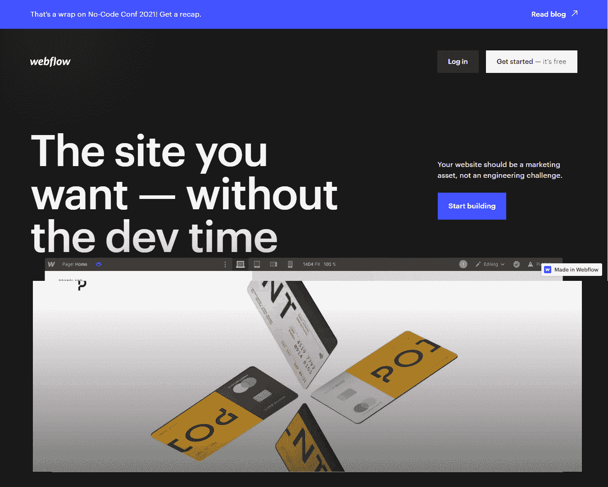
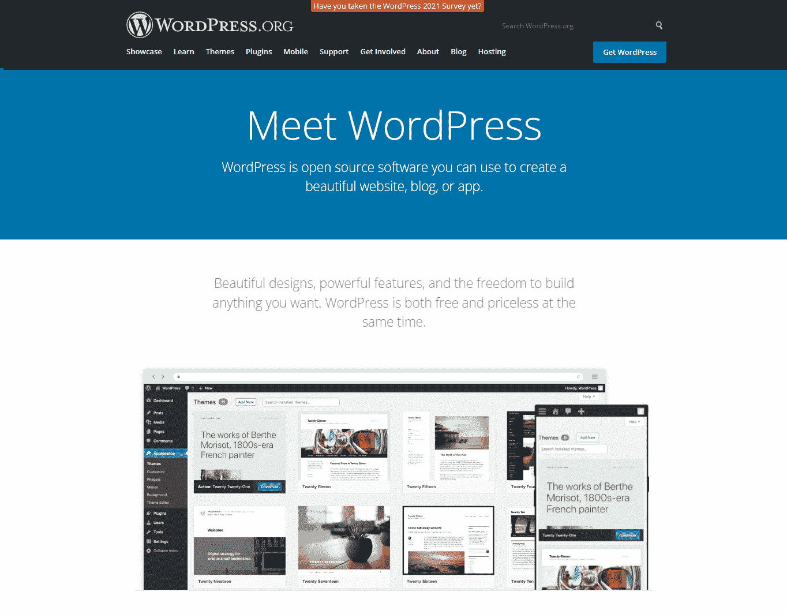
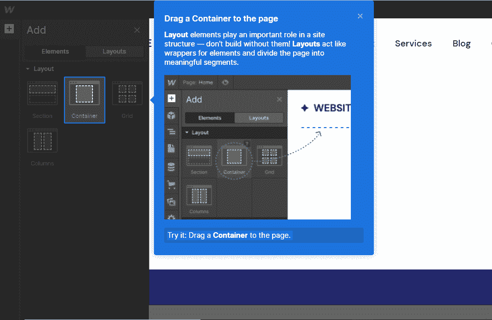
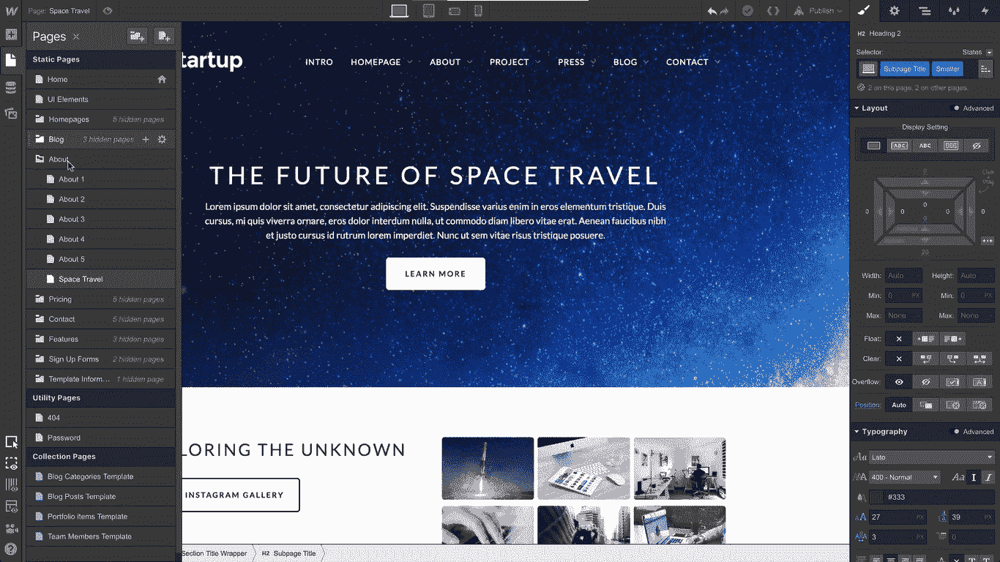
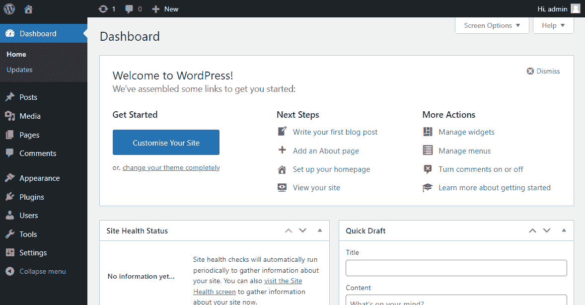
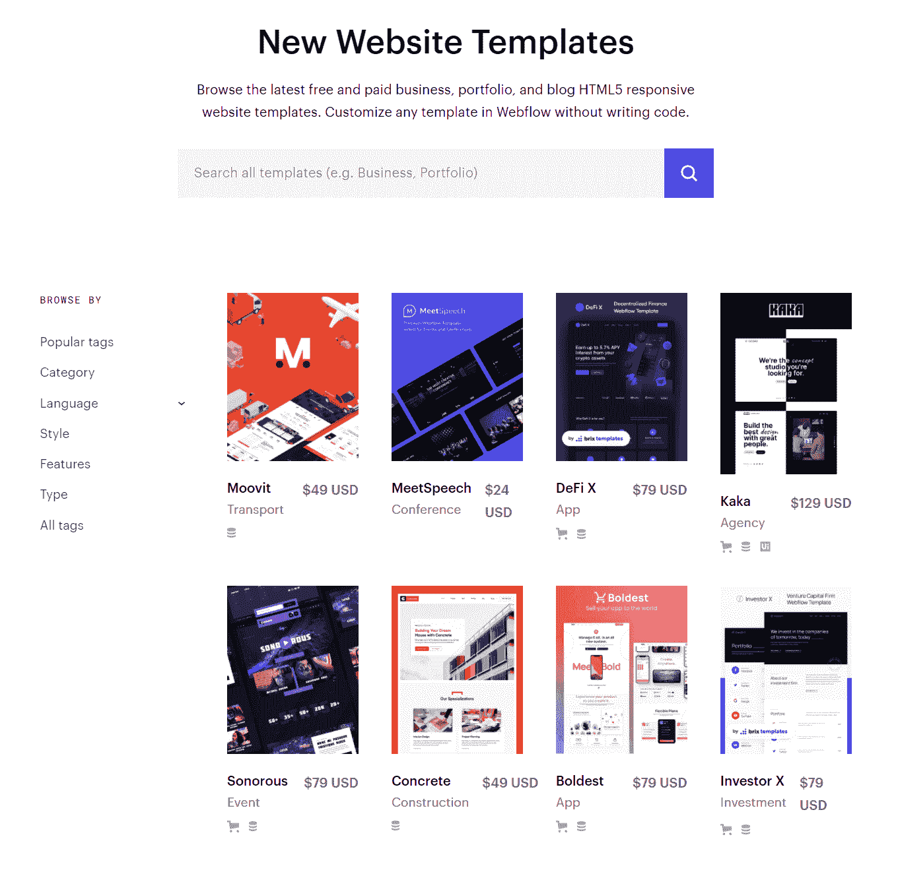
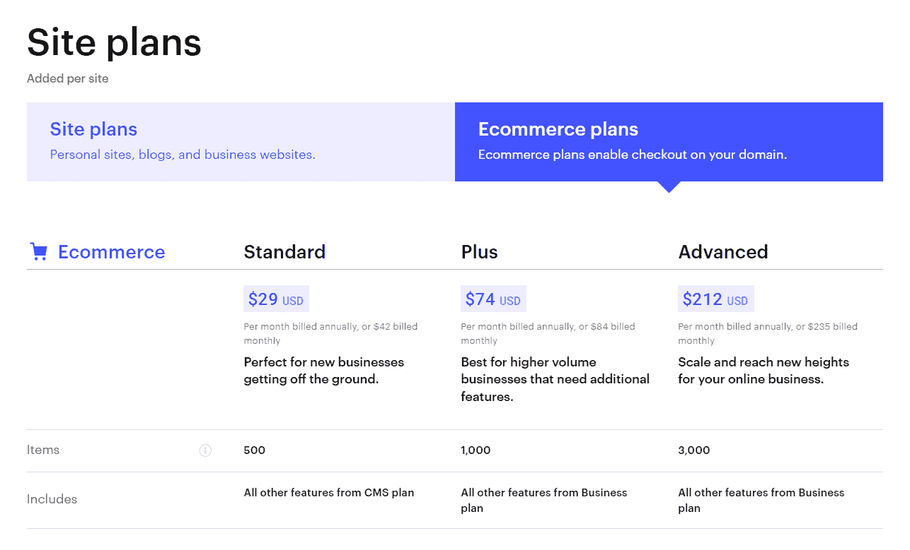
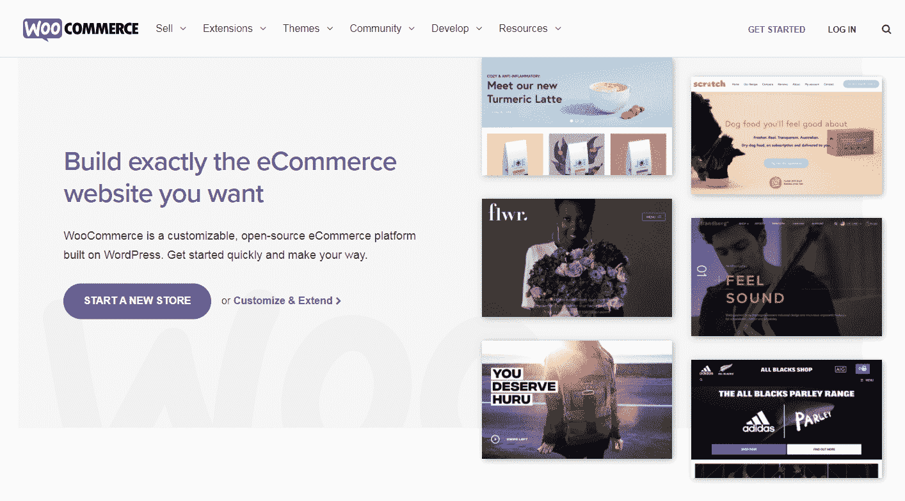

# Webflow vs WordPress:哪个更适合你的下一个站点？

> 原文：<https://kinsta.com/blog/webflow-vs-wordpress/>

如今，帮助你建立并运行网站的选择并不缺乏。然而，选择一个正确的会很困难。如果你在考虑两个主要的玩家，比如 Webflow 和 WordPress，这一点尤其正确。

幸运的是，有一种方法可以让这个选择变得稍微容易一些。通过在几个关键领域比较 Webflow 和 WordPress，你可以找出哪个最适合满足你的需求。

在本文中，我们将向您介绍 Webflow 和 WordPress 的基础知识。然后，我们将带您浏览在您选择其中一个之前可能需要考虑的五个主要因素。

让我们开始吧！

### 查看我们的视频指南 [Webflow vs WordPress](https://www.youtube.com/watch?v=3em3_n0FTiI)

## Webflow 简介

Webflow 自 2013 年以来一直提供网站建设和托管服务。通过用户友好的可视化编辑器，它提供了从创建到启动的无缝体验:

> 需要在这里大声喊出来。Kinsta 太神奇了，我用它做我的个人网站。支持是迅速和杰出的，他们的服务器是 WordPress 最快的。
> 
> <footer class="wp-block-kinsta-client-quote__footer">
> 
> 
> 
> <cite class="wp-block-kinsta-client-quote__cite">Phillip Stemann</cite></footer>

[View plans](https://kinsta.com/plans/)

Webflow

而且，不需要编码。Webflow 将自动生成 HTML、CSS 和 JavaScript，无需您动手。然而，如果你是一名开发人员，你仍然有机会直接编辑代码。

出于这个原因，Webflow 的目标受众往往是那些有一点网页设计知识的人。使用这个[内容管理系统(CMS)](https://kinsta.com/knowledgebase/content-management-system/) 你不需要成为一个专业人士，但是如果你希望建立一个高度定制的网站，它可能会有所帮助。

以下是 Webflow 的一些其他优势，您可能会喜欢:

*   足够的灵活性带来几乎无限的可能性
*   大量集成使集中化变得容易
*   经典的可视化编辑器，使设计更加直观

然而，没有一种产品是完美的。您可能还需要考虑一些潜在的不利因素:

*   设计选择的数量之多令人望而生畏
*   某些预算可能无法获得定价计划
*   这个界面很复杂，需要一个学习过程

最后说一下人气。就市场份额而言，Webflow 大约占所有网站的 0.6%。这比其他选项如 [Shopify](https://kinsta.com/blog/woocommerce-vs-shopify/) 和 [Squarespace](https://kinsta.com/blog/squarespace-vs-wordpress/) 要少。然而，Webflow 支持的网站往往比其竞争对手有更高的流量，这使它成为其利基市场中一个值得注意的选择。

## WordPress 简介

相对而言，WordPress.org 是一个更有经验的选择。自 2003 年以来，这个开源平台一直在以惊人的速度发展:

WordPress.org

顺便提一下，[WordPress.org 不同于 WordPress.com](https://kinsta.com/blog/wordpress-com-vs-wordpress-org/)。后者提供完全托管的解决方案，而前者是开源软件。正如他们在[独特的统计数据](https://kinsta.com/blog/wordpress-statistics/)所反映的那样，两者都是截然不同的经历。

WordPress 没有单一的目标受众。该平台的高度灵活性意味着几乎任何人都可以使用它。

如果你是一个网页设计专家，你可以利用这种自由。然而，不可否认的是，建立一个 WordPress 网站比使用像 [Wix](https://kinsta.com/blog/wix-vs-wordpress/) 这样的现成解决方案需要更多的工作。因此，你可能需要期待一点学习曲线，尤其是如果你是一个初学者。

然而，有几个原因让人们想使用 WordPress:

*   一个高度可定制和灵活的平台，可以创建各种各样的网站
*   允许您完全定制整个项目的开源设计
*   大型主题和插件库，包括免费和付费的

另一方面，也有一些缺点:

*   可以为黑客创造更多机会的开源设计
*   如果你做了错误的改变，深度编辑会有使你的网站崩溃的风险
*   CMS、插件和主题经常需要更新

让我们来看看 WordPress 的市场份额。这个内容管理系统在其领域是一个巨人，42.9%的网站利用了它的技术。这意味着如果你对这个程序感兴趣，你会有很多用户。

## Webflow vs WordPress:哪个更适合你的下一个站点？(5 个主要考虑事项)

现在我们已经讨论了基础知识，在你选择 Webflow 还是 WordPress 之前，这里有五个你可能需要考虑的因素。

### 1.方便用户

用户友好是网站建设的核心——毕竟，与平台斗争会占用你创建网站的宝贵时间。这里有一些事实可以帮助你在 Webflow 和 WordPress 之间做出选择，以获得最无缝的用户体验。

#### Webflow

Webflow 提供了一系列令人印象深刻的设置资源。例如，你可以访问 [Webflow 大学](https://university.webflow.com/)。这将为你提供一系列的课程、训练营和视频，让你的网站起步。

Webflow 还试图简化设置过程。启动后，您将获得一个安装向导形式的演示:

The Webflow setup wizard.

这个速成课程可能会让你有足够的能力开始浏览界面。不幸的是，这可能还不足以让你熟悉所有的关键元素——布局中充斥着令人眼花缭乱的选项:

Webflow interface.

如果你感到有点害怕，不要惊慌！即使是有经验的设计师也可能需要一些时间来适应这个界面。如果你是游戏新手，你可能需要更长的时间。

然而，你可能会很高兴你投资了那段时间。它看起来可能很复杂，但紧凑的设计也意味着您可以快速访问最常用的工具。

此外，Webflow 很容易扩展到各种任务。无论你是希望建立一个网上商店还是一个小型博客，你都可以用相同的格式使用相同的工具。但是，请记住，更复杂的设计可能需要对平台有更深入的了解。

#### WordPress

就入门而言，Webflow 与 WordPress 的争论是势均力敌的。然而，WordPress 的[著名的五分钟设置过程](https://wordpress.org/support/article/how-to-install-wordpress/)是一个令人生畏的功能。你所需要做的就是输入一些信息，然后你就可以上路了。

然而，使用 WordPress 意味着你需要[寻找你自己的主机提供商](https://kinsta.com/blog/managed-wordpress-hosting/)。相比之下，托管是 Webflow 的内置功能。如果你使用 WordPress，你会有更多的选择，但是找到最适合你的可能需要一些时间。

一旦您完成了这些初始任务，您就可以开始研究仪表板了。我们已经向您展示了 Webflow 有多复杂。相比之下，WordPress 的简化布局可能是一股新鲜空气:

WordPress dashboard.

然而，它也有自己的挑战。这种方法需要更多的点击来获得不同任务所需的工具。这意味着，如果你不知道从哪里开始，你可能会更难掌握诀窍。幸运的是，有组织的侧边栏让这变得简单了一些。

说到可扩展性，很难打败 WordPress。种类繁多的插件和主题意味着你可以定制你的网站来满足几乎任何目的。然而，这也意味着你必须了解每一个添加的独特的细节。

### 2.社区支持

无论你在 Webflow 和 WordPress 的争论中处于什么位置，有一点是肯定的:任何一种选择都会给你提供大量的其他用户来陪伴你。让我们看看这两个平台在社区和客户支持方面有何不同。

#### Webflow

Webflow 附带了一个专门的论坛。这是一种简单的方式，让您可以就可能遇到的问题与其他用户联系。它还允许您在 Webflow University 中搜索您想要查找的任何特定内容。

## 注册订阅时事通讯

### 想知道我们是怎么让流量增长超过 1000%的吗？

加入 20，000 多名获得我们每周时事通讯和内部消息的人的行列吧！

[Subscribe Now](#newsletter)

您还可以在这里找到“展示和讲述”部分。这是一个你可以展示你用这个平台所做的工作的地方。它也可以成为所有不同类型的创意的灵感来源。

如果你更喜欢专业支持，Webflow [提供客户服务](https://university.webflow.com/support)。您可以联系其团队，并在工作日收到电子邮件支持。如果您对自己的定价计划有疑问，这一点尤其有用。

Webflow 社区还提供各种活动和小组，您可以加入。与论坛类似，这些可以是了解更多关于平台和与其他创作者联系的机会。

#### WordPress

作为开源软件，WordPress 缺乏“官方”支持选项。然而，这个平台确实提供了你可以依赖的各种不同的资源。这些涵盖了几乎所有的技能水平，从经验丰富的设计师到那些还在学习 WordPress 绳索的人。

原因之一是 WordPress 是开源的。这意味着它的所有代码都是公开的。此外，这还意味着您可以以任何方式编辑或重新利用这些代码。

除了设计的灵活性，这也产生了一个强大的社区。你可以查看[复杂的 WordPress 文档](https://wordpress.org/support/)，以及[专门的论坛](https://wordpress.org/support/forums/)。个别插件和主题甚至有独特的论坛，你可以访问。

最后，WordPress 还提供了围绕程序的各种活动，用户可以在这里互相学习。这些天来，他们已经在很大程度上转移到虚拟领域。这使得融入社区变得更加容易。

### 3.设计选项

一旦你准备好开始设计，重要的是要考虑你有哪些选择。在你选择 CMS 之前，这里有一些需要考虑的因素。

#### Webflow

Webflow 最大的优势之一是它的模板。这些是由开发专业人员设计的预制网站。这意味着它们针对性能和美观进行了优化:

Webflow templates.

但是，您仍然可以根据需要自由编辑模板。因此，您可以构建一个高度定制的网站，而不必创建基础或担心后台代码。如果你正在寻找一个快速的开始，你甚至可以最小限度地改变它。

有了可视化编辑器，这个编辑过程变得简单了一些。结果很大程度上是“所见即所得”，这意味着不需要在编辑屏幕和预览之间切换。

在这个编辑器中，您还有很多选择。你几乎可以改变一切:布局、间距、文本、移动布局等等。只要你愿意投入时间，它就是一个虚拟的沙盒。

同样值得注意的是，你可以创建“收藏”。集合是可重复使用的内容，可以存储在数据库中供将来使用。因此，这是一个简化你网站不同区域工作的简单方法。

#### WordPress

如果你比较 Webflow 和 WordPress，可视化编辑器应该是首要考虑的因素。这是因为 WordPress 和 Webflow 使用的方法不太一样。它没有使用前端页面编辑器，而是使用了一个叫做[的模块编辑器](https://kinsta.com/blog/gutenberg-wordpress-editor/):

涡轮增压您的网站，享受我们的资深 WordPress 团队的 24/7 支持。我们的谷歌云驱动的基础设施侧重于可伸缩性、性能和安全性。[查看我们的计划](https://kinsta.com/plans/?in-article-cta)

WordPress Block Editor.

这种基于模块的系统非常容易使用:每一部分内容都作为自己的块存在，可以单独编辑和移动。然而，它不像 Webflow 的编辑器那样直观。你需要投资[一个页面构建插件](https://kinsta.com/blog/wordpress-page-builders/)来获得这种效果。

块编辑系统也存在于 [WordPress 小部件部分](https://kinsta.com/blog/wordpress-widgets/)中。这些都是小功能元素，可以放在你网站的特定部分。这是在边栏、页眉和页脚等区域增加一致性的简单方法。

在预制设计方面，WordPress 提供了令人印象深刻的主题集合。你可以在免费和付费选项之间进行选择，这些选项涵盖了所有领域。这些主题也非常灵活:你既可以直接编辑代码，也可以使用 WordPress 的内置系统来实现更简单的方法。

### 4.搜索引擎优化

[搜索引擎优化(SEO)](https://kinsta.com/blog/what-does-seo-stand-for/) 是帮助别人找到你网站的核心部分。在很大程度上，你的网站排名将取决于你是否写了高质量的内容。但是，有几个幕后因素取决于您对 CMS 的选择。

#### Webflow

正如我们所报道的，Webflow 比 WordPress 更像是一个一体化的解决方案。这意味着它还附带了各种工具来帮助您尽快实现优化搜索引擎优化。

例如，该平台是围绕创建[移动友好页面](https://kinsta.com/blog/google-mobile-first-index/)而构建的。这一指标对于提高搜索排名至关重要，更不用说对访问者的好处了。

Webflow 还采取了各种其他措施，包括:

*   自动生成并提交的[网站地图](https://kinsta.com/blog/wordpress-sitemap/)
*   干净，轻量级的代码，以更好地吸引网站爬虫
*   轻质结构确保更快的装载速度

所有这些都意味着你可能不必太担心后端搜索引擎优化。另一方面，你放弃了对这个重要元素的控制，必须依赖 Webflow 为你做的优化。

#### WordPress

默认情况下，WordPress 附带了一套较小的 SEO 工具。基本代码的设计考虑到了流畅的性能。然而，如果你改变了代码——这是 WordPress 的主要诉求之一——你可能会失去这个好处。

然而，WordPress 也可以帮助你更好地控制你的搜索排名，这要感谢许多可用的附加工具。像 [Yoast SEO](https://wordpress.org/plugins/wordpress-seo/) 和 [All in One SEO](https://wordpress.org/plugins/all-in-one-seo-pack/) 这样的插件可以通过优化关键词内容、为搜索引擎机器人添加元数据等等来帮助你提升这个关键指标。

同样值得注意的是，迁移一个 WordPress 站点会更容易。这很重要，因为如果你不小心的话，移动你的网站会损害它的 SEO。幸运的是，如果你选择了[的高质量托管 WordPress hosting](https://kinsta.com/blog/managed-wordpress-hosting/) ，你几乎可以肯定地依靠你的提供商来为你完成这项任务。

### 5.电子商务和定价计划

让我们总结一下电子商务和定价。这是 Webflow 和 WordPress 讨论变得有趣的一个领域。两者都为您提供了非常不同的选项，所以让我们深入了解一下。

#### Webflow

电子商务直接内置于 Webflow 引擎中。您需要做的只是激活一个扩展并整合您的运输服务。从那里，它只是一个设计你的网站的问题。

然而，这是 Webflow 和 WordPress 开始有很大不同的地方。如果你用的是 Webflow，支付处理商的选择会更少。这些将会有一个标准的 Webflow 费用——这是你支付给网关和运输公司的费用之外的费用。

由于 Webflow 托管其网站，您还需要选择一个[定价计划](https://webflow.com/pricing):

Webflow site plans.

这些按月支付，每月 29 美元起。有更便宜的网站计划，但如果你想要一个能让用户在你的网站上购买产品的电子商务计划，你需要选择高级选项。

#### WordPress

WordPress 的开源特性不仅让它变得灵活:还让它变得免费。你只需要下载软件就可以开始了。

然而，这并没有考虑到其他网站的成本。你需要为默认情况下包含在 Webflow 计划中的各种其他元素付费，包括非托管或[托管的 WordPress 主机](https://kinsta.com/ebooks/wordpress/managed-wordpress-hosting/)以及[域名](https://kinsta.com/blog/how-to-buy-a-domain-name/)。

说到电子商务，WordPress 用户最喜欢的选择是 WooCommerce:

WooCommerce.

尽管支付门户、信用卡和运输会产生费用，但 WooCommerce 本身是免费的。与 Webflow 相比，它可能需要更多的设置，但从长远来看，它也可能会更便宜。

[These days, there’s no shortage of options to help you get your website up and running. 🚀 But picking the right one can be tough. Start here ⬇️Click to Tweet](https://twitter.com/intent/tweet?url=https%3A%2F%2Fkinsta.com%2Fblog%2Fwebflow-vs-wordpress%2F&via=kinsta&text=These+days%2C+there%E2%80%99s+no+shortage+of+options+to+help+you+get+your+website+up+and+running.+%F0%9F%9A%80+But+picking+the+right+one+can+be+tough.+Start+here+%E2%AC%87%EF%B8%8F&hashtags=CMS%2CWordPress)

## 摘要

对于 Webflow 和 WordPress 哪个是最好的平台，没有唯一的答案。每个系统都有自己的优点、缺点和独特的属性。幸运的是，了解它们在一些关键领域的不同之处可以让你更容易做出决定。

在本文中，我们讨论了您在做出选择之前可能需要考虑的五个方面:

1.  用户友好程度
2.  每个人能提供多少社区支持
3.  设计选项的灵活性和强大功能
4.  实现高质量的 SEO 有多容易
5.  付费计划和电子商务网站的可用选项

关于 Webflow vs WordPress 你有什么问题吗？请在下面的评论区告诉我们！

* * *

让你所有的[应用程序](https://kinsta.com/application-hosting/)、[数据库](https://kinsta.com/database-hosting/)和 [WordPress 网站](https://kinsta.com/wordpress-hosting/)在线并在一个屋檐下。我们功能丰富的高性能云平台包括:

*   在 MyKinsta 仪表盘中轻松设置和管理
*   24/7 专家支持
*   最好的谷歌云平台硬件和网络，由 Kubernetes 提供最大的可扩展性
*   面向速度和安全性的企业级 Cloudflare 集成
*   全球受众覆盖全球多达 35 个数据中心和 275 多个 pop

在第一个月使用托管的[应用程序或托管](https://kinsta.com/application-hosting/)的[数据库，您可以享受 20 美元的优惠，亲自测试一下。探索我们的](https://kinsta.com/database-hosting/)[计划](https://kinsta.com/plans/)或[与销售人员交谈](https://kinsta.com/contact-us/)以找到最适合您的方式。