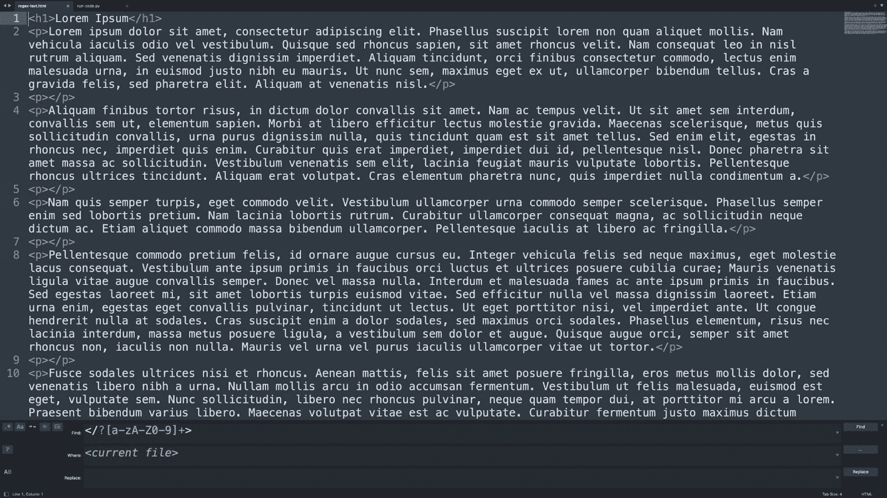
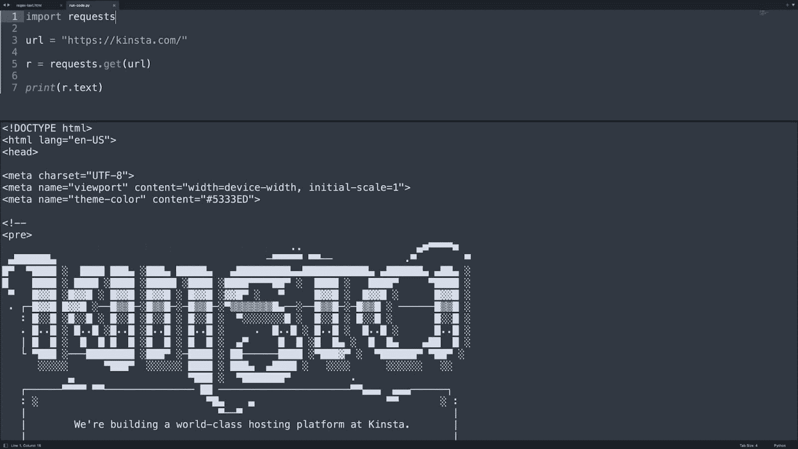
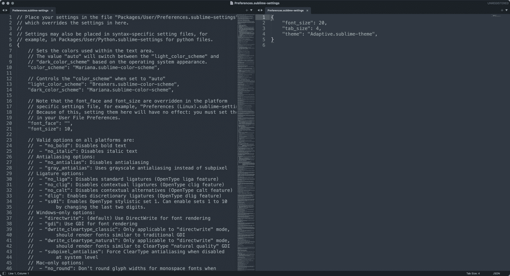
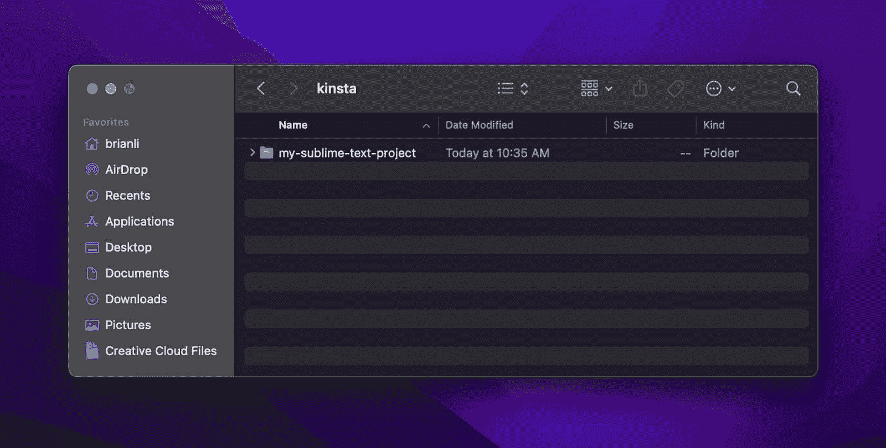
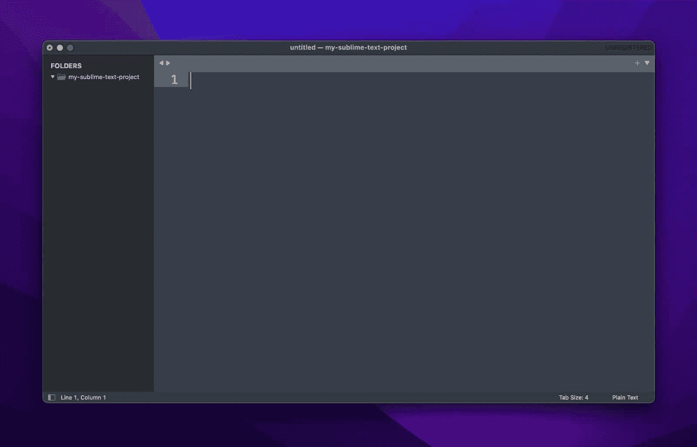
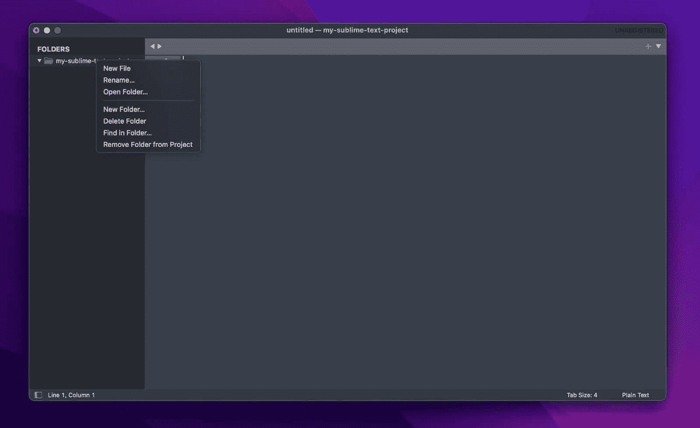

# 学习如何使用崇高的文本:快速概述

> 原文：<https://kinsta.com/blog/how-to-use-sublime-text/>

Sublime Text 是世界上最流行的文本编辑器之一。它集成了强大的功能，比如多行编辑、为几十种编程语言构建系统、正则表达式查找和替换、用于开发插件的 Python API 等等。

最棒的是，它是跨平台的(Mac、Windows 和 Linux)，并且作为“共享软件”分发，这意味着它可以免费使用，偶尔会弹出购买窗口。

在本文中，您将学习如何使用 Sublime Text 来满足您所有的文本和代码编辑需求！

### 使用崇高文本查看我们的视频指南


## 什么是崇高的文本？

崇高文本宣称自己是“代码、标记和散文的复杂文本编辑器”Sublime Text 最初发布于十多年前的 2008 年 1 月，现在是它的第四个主要版本，支持 Mac、Windows 和 Linux。


> 需要在这里大声喊出来。Kinsta 太神奇了，我用它做我的个人网站。支持是迅速和杰出的，他们的服务器是 WordPress 最快的。
> 
> <footer class="wp-block-kinsta-client-quote__footer">
> 
> 
> 
> <cite class="wp-block-kinsta-client-quote__cite">Phillip Stemann</cite></footer>

[View plans](https://kinsta.com/plans/)

就其核心而言，Sublime Text 类似于一把瑞士军刀，可以应用于任何涉及操作文本的用例或问题。

乍一看，Sublime Text 似乎是一个只对开发人员有用的文本编辑器。虽然它对开发者来说是一个很棒的工具，但对[作家和博客作者来说也是一个强大的应用。](https://kinsta.com/learn/blogging-tips/)

在我们深入研究 Sublime Text 的所有特性和功能之前，让我们快速浏览几个 Sublime Text 可能有用的场景。

### 正则表达式查找和替换

Regex 是正则表达式的缩写，是一种用于指定搜索模式的语法。正则表达式通常用于定位相似(但不同)的文本字符串以进行文本编辑。

例如，如果你想从一个文档中去掉所有的 [HTML](https://kinsta.com/blog/learn-html/) 标签，搜索每个要删除的标签(例如`<h1>`、 `<p>`、`<span>`等)将会非常耗时。).

相反，您可以使用单个正则表达式模式来执行搜索。在这种情况下，regex 模式`[a-zA-Z0-9]`可以用来查找文档中的所有 HTML 标签。



Find and replace text in Sublime Text.


在 Sublime 文本中执行正则表达式查找和替换非常简单。在菜单栏中，点击**查找>在文件中查找**。接下来，在查找和替换菜单中启用正则表达式模式，在“查找”字段中指定正则表达式模式，选择`<current file>`，并根据您需要完成的任务点击**查找**或**替换**。

[sublime text 是世界上最受欢迎的文本编辑器之一，它汇集了强大的功能—在本指南中了解更多信息⬇️ 点击推文](https://twitter.com/intent/tweet?url=https%3A%2F%2Fkinsta.com%2Fblog%2Fhow-to-use-sublime-text%2F&via=kinsta&text=Sublime+Text+is+one+of+the+most+popular+text+editors+in+the+world%2C+and+it%27s+jam-packed+with+powerful+features+%E2%80%94+learn+more+in+this+guide+%E2%AC%87%EF%B8%8F&hashtags=Python%2CSublimeText)


### 快速运行代码

与传统的文本编辑器不同，Sublime Text 允许您直接在应用程序中运行代码。这对于像 small Bash 或 [Python](https://kinsta.com/blog/python-tutorials/) 脚本这样的简单项目尤其有用。

例如，如果您正在编写一个简单的 Python 脚本来从 URL 列表中抓取数据，那么设置一个单独的终端来调试代码就没有在 Sublime 文本中直接运行脚本方便。



Run code in Sublime Text.


要在 Sublime 文本中运行代码，请转到**工具>构建系统**，并为您的代码选择语言(Sublime 支持各种语言，如 [Python](https://kinsta.com/blog/python-tutorials/) 、Ruby、Bash 等等)。接下来，在 Mac 上按下 **Cmd+B** 或者在 Windows 上按下 **Ctrl+B** 来运行你的代码。

### 多行编辑

在各种情况下，您可能需要同时编辑文本文档中的多行。假设你有一个[域名](https://kinsta.com/blog/how-to-buy-a-domain-name/)的列表，你需要在每一行前面加上`http://`。当然，您可以一行一行地进行，但是这可能需要很长时间。


Multi-line editing in Sublime Text


有了 Sublime Text，你可以选择所有你想编辑的行，按 **Shift+Cmd+L** ，同时编辑每一行！

正如您所看到的，虽然 Sublime Text 内置了面向开发人员的高级特性，但也有各种强大的工具，如正则表达式支持和多行编辑，无疑对非开发人员也很有用。

现在你对 Sublime Text 可以做什么有了一个大致的了解，让我们更深入地了解一下这个应用程序。

### 文本片段

也许 Sublime Text 最强大的特性(尤其是对编码人员而言)是文本片段。

我们都知道编写代码有时会很麻烦。Sublime 文本片段提供了一种快速简单的方法来插入将在任何项目中重复出现的文本块。

让这些文本片段更好的是，它们很容易理解，写起来也很简单。这个工具帮助开发人员节省时间，并在开发过程中[消除许多错误](https://kinsta.com/blog/wordpress-errors/)。

键入“trigger”一词，然后按下**选项卡**按钮开始一个片段。

## 如何下载崇高的文字

Sublime Text 可从 Sublime Text 官方网站免费下载。也就是说，Sublime Text 在技术上不是“免费软件”相反，Sublime Text 是一个“共享软件”应用程序，这意味着它可以免费下载，但一段时间后可能会有一些功能限制。

在 Sublime Text 的情况下，该应用程序将无限期地继续工作，但你偶尔会看到一个弹出窗口，详细介绍如何购买该应用程序。

如果你有兴趣购买 Sublime Text，你可以花 99 美元购买个人许可证，或者花 65 美元/座/年购买商业许可证。虽然付费许可证不能解锁任何额外的核心功能，但您确实可以获得以下额外好处:

*   没有购买提醒弹出窗口
*   访问 Sublime 文本的开发版本
*   应用内更新通知

## 崇高文本 101-基础

由于 Sublime Text 在功能方面是一个如此拥挤的应用程序，我们将讨论两个用户子集的基本功能和工作流程——作者和开发人员。但是首先，让我们先建立对崇高文本的核心理解，然后再分支到用户特定的项目。

### 如何自定义崇高的文本设置

与其他带有图形设置菜单的应用程序不同，Sublime 文本设置完全基于文本。要查看您的崇高文本设置，请转到**崇高文本>首选项**，并点击**设置**。然后，您应该会看到类似这样的文档:



Sublime Text settings.


这个设置文档一开始可能看起来令人望而生畏(特别是如果你不习惯使用面向开发者的工具)，但是现在我们将帮助你理解一切！

Sublime Text 的设置以 JSON 格式存储。JSON 是存储键值信息的行业标准格式，所以您可能以前在其他地方见过它。JSON 将信息存储在键值数组中，如下所示:

## 注册订阅时事通讯


### 想知道我们是怎么让流量增长超过 1000%的吗？

加入 20，000 多名获得我们每周时事通讯和内部消息的人的行列吧！

[Subscribe Now](#newsletter)

```
{
“color”: “blue”,
“type”: “sedan”,
“seats”: 5,
}
```

上面的数组可以用来描述一辆汽车的属性——在这个例子中，是一辆有五个座位的蓝色轿车。类似地，JSON 数组可以为应用程序指定设置，这正是 Sublime Text 所做的。

让我们回到 Sublime 文本设置文件。正如您在上面的截图中看到的，设置文件显示为两个 JSON 数组。左侧的数组包含 Sublime Text 的默认设置，而右侧的数组包含自定用户设置。

通常，您不应该直接更改默认设置。相反，您可以用自定义设置覆盖默认设置-这允许您在出现问题时恢复到默认设置。

那么，您将如何着手更改一些默认设置呢？假设您想要进行以下更改:

```
"font_size": 10 to "font_size": 20
```

```
"margin": 4 to "margin": 6
```

```
"line_numbers": true to "line_numbers": false
```

要进行这些更改，请将每个元素以有效的 JSON 格式添加到自定义用户设置文档中，如下所示(如果您有现有的自定义设置，请添加每个设置，而不要创建新的数组):

```
{
"font_size": 20,
"margin": 6,
"line_numbers": false,
} 
```

如果您不确定设置的格式是否正确，您可以使用在线工具，如 [JSONLint](https://jsonlint.com/) 来验证您的 JSON 数组。指定设置后，保存文件，一切都准备好了！

### Sublime Text 中的项目和文件管理

当从事一个项目时，无论是一系列的博客文章还是一个 web 应用程序的源代码，你的文件通常都被组织在一个项目文件夹中。Sublime Text 考虑并提供了一个管理文件和目录的功能图形界面。

假设你有一个名为“my-sublime-text-project”的文件夹，就像下面截图中的那样。如果您将此文件夹拖放到 Sublime Text 中，您将能够直接在 Sublime Text 中创建新文件和文件夹。



Sublime Text project.


正如你所看到的，“我的 sublime-text-project”文件夹可以在 Sublime Text 窗口的左侧“文件夹”下看到



File and folder management in Sublime Text.


右键单击项目文件夹会弹出一个子菜单，允许您创建新文件、重命名文件、创建和删除文件夹等等。Sublime Text 的内置文件管理功能消除了使用 Finder 等外部工具来执行基本文件管理任务的需要。

厌倦了低于 1 级的 WordPress 托管支持而没有答案？试试我们世界一流的支持团队！[查看我们的计划](https://kinsta.com/plans/?in-article-cta)



Create files and folders.


在 Sublime Text 中，项目是指导入的文件和文件夹的集合(例如，我们之前导入的“my-sublime-text-project”文件夹。如果你点击菜单栏中的**项目**，你会看到有“打开项目”、“切换项目”和“项目另存为”等选项但是，没有创建新项目的选项。

这是因为当您创建新文件和导入文件夹时，Sublime 文本项目是隐式创建的。在上例中，我们可以点击菜单栏中的**项目**，然后点击**将项目另存为**来保存项目。


## 作家的崇高文本

### 突出文件管理

强调文件管理和项目管理功能如何组织内容。例如，作者可以为书中的每一章创建一个文件，而博客作者可以为不同类别的文章创建不同的文件夹。

### 强大的搜索引擎和替代

Sublime Text 拥有强大的[搜索和替换](https://kinsta.com/feature-updates/search-replace-tool/)实现。它不仅支持 regex，还可以指定要搜索的文件和文件夹。例如，如果作者想更改故事中某个角色的名字，他们可以指定搜索文件夹，并对文件夹中的所有内容进行搜索。

### 非常可扩展

Sublime 文本是可扩展的，它的 [MarkdownEditing 包](https://github.com/SublimeText-Markdown/MarkdownEditing)对于使用 Markdown 语法的作者来说是一个很好的工具。

## 面向开发人员的崇高文本

### 丰富的插件生态系统

Sublime Text 有一个丰富的插件生态系统，可以通过内置的包管理器访问。开发者可以安装插件来改善他们的工作流程。例如，Formatter 插件包括 HTML、CSS、JS、Python 和其他语言的格式化规则。

该插件可以被配置为自动格式化源代码文件，这有助于保持代码的整洁和格式的标准化。

几个需要考虑的必备插件包括[包控制](https://packagecontrol.io/)(需要安装插件)和 [Emmet](https://packagecontrol.io/packages/Emmet) 。

### 多行编辑

Sublime Text 提供多行编辑，在 Mac 上按住 Command(Windows 上按住 Ctrl)并用鼠标选择多行即可访问。选中多行后，可以一次性编辑所有行，甚至支持多行复制/粘贴。

### 分割窗口支持

Sublime Text 支持拆分窗口来同时查看和编辑多个文件。这在处理项目时引用不同的文件时非常有用。

### 支持构建系统

Sublime Text 支持构建系统。构建系统允许你直接在 Sublime 文本编辑器的终端中运行代码，而不需要一个外部终端。

例如，您可以创建一个构建系统来运行 Python 程序，并创建另一个构建系统来运行 Go 程序。开发应用程序时，您可以选择一个构建系统，并使用快捷方式直接从 Sublime Text 运行程序。

### 主题更具可定制性

通过下载一个崇高的文本主题，您可以进一步增强您的编码体验。他们中的大多数已经捆绑了多种配色方案。

Sublime 文本的主题和配色方案之间的区别在于，主题修饰核心 UI 元素，如侧窗格、选项卡、菜单等，而配色方案负责语法突出显示。

一些最好的主题包括:

*   [素材主题](https://packagecontrol.io/packages/Material%20Theme)
*   [太空灰主题](https://packagecontrol.io/packages/Theme%20-%20Spacegray)
*   [阿玉主题](https://packagecontrol.io/packages/ayu)

[Ready to learn how to use Sublime Text to fulfill all your text and code editing needs? 🤓 Look no further 👇Click to Tweet](https://twitter.com/intent/tweet?url=https%3A%2F%2Fkinsta.com%2Fblog%2Fhow-to-use-sublime-text%2F&via=kinsta&text=Ready+to+learn+how+to+use+Sublime+Text+to+fulfill+all+your+text+and+code+editing+needs%3F+%F0%9F%A4%93+Look+no+further+%F0%9F%91%87&hashtags=Python%2CSublimeText)

## 摘要

Sublime Text 是当今最受欢迎的代码编辑器之一。的确，它为作者和开发者提供了大量的工具。

没有什么比找到完美的代码编辑器更令人满意的了。如果你从来没有尝试过 Sublime Text，值得一看。

你目前正在使用 Sublime Text 吗？比起其他代码编辑器，你更喜欢它吗？请在下面的评论区告诉我们。

* * *

让你所有的[应用程序](https://kinsta.com/application-hosting/)、[数据库](https://kinsta.com/database-hosting/)和 [WordPress 网站](https://kinsta.com/wordpress-hosting/)在线并在一个屋檐下。我们功能丰富的高性能云平台包括:

*   在 MyKinsta 仪表盘中轻松设置和管理
*   24/7 专家支持
*   最好的谷歌云平台硬件和网络，由 Kubernetes 提供最大的可扩展性
*   面向速度和安全性的企业级 Cloudflare 集成
*   全球受众覆盖全球多达 35 个数据中心和 275 多个 pop

在第一个月使用托管的[应用程序或托管](https://kinsta.com/application-hosting/)的[数据库，您可以享受 20 美元的优惠，亲自测试一下。探索我们的](https://kinsta.com/database-hosting/)[计划](https://kinsta.com/plans/)或[与销售人员交谈](https://kinsta.com/contact-us/)以找到最适合您的方式。