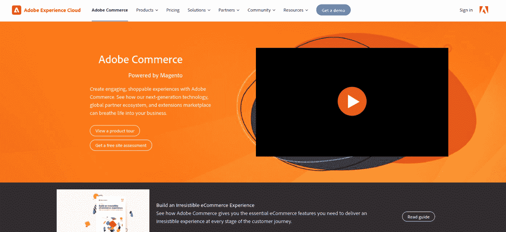
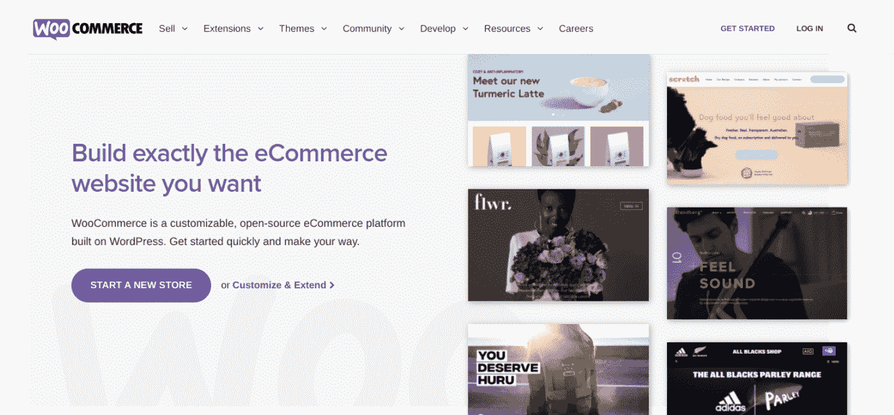
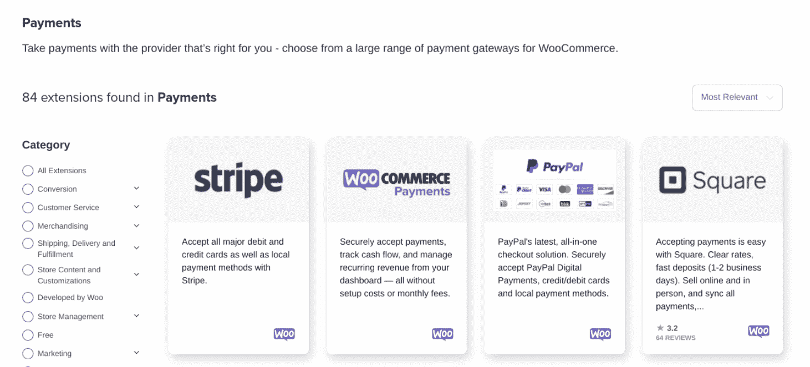
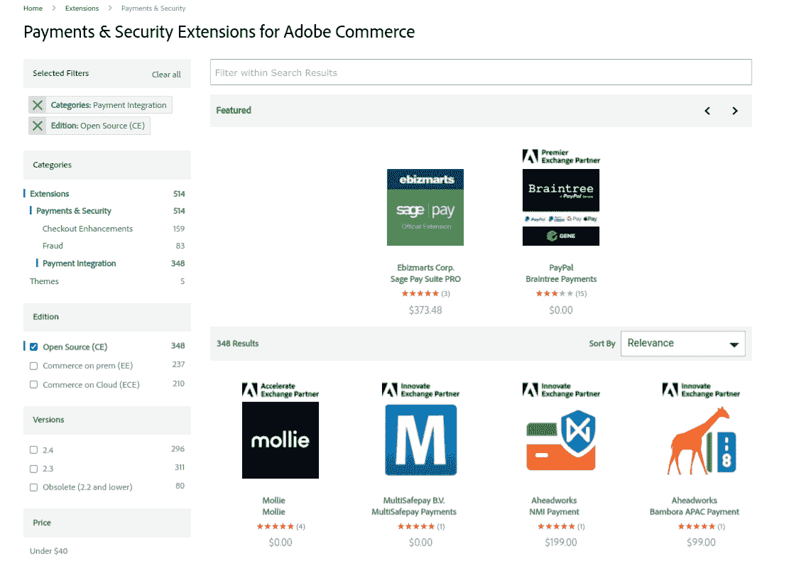
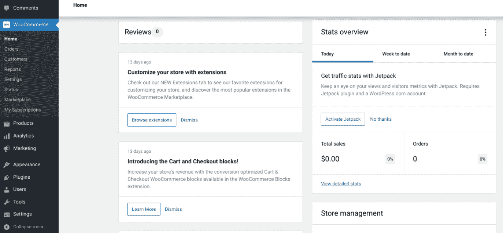
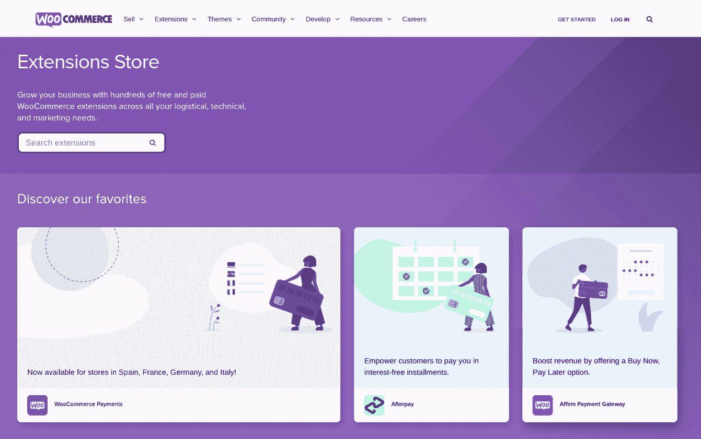
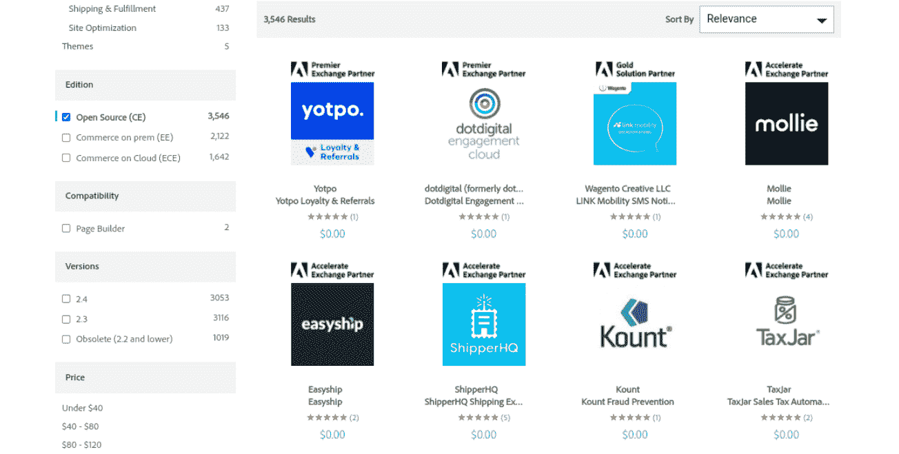
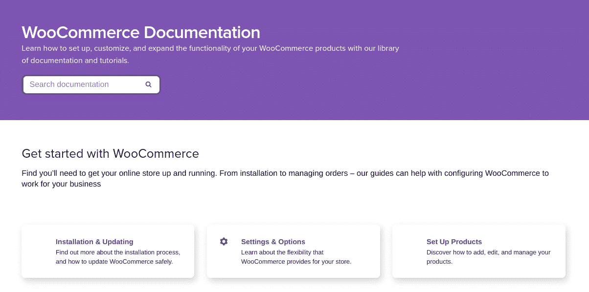
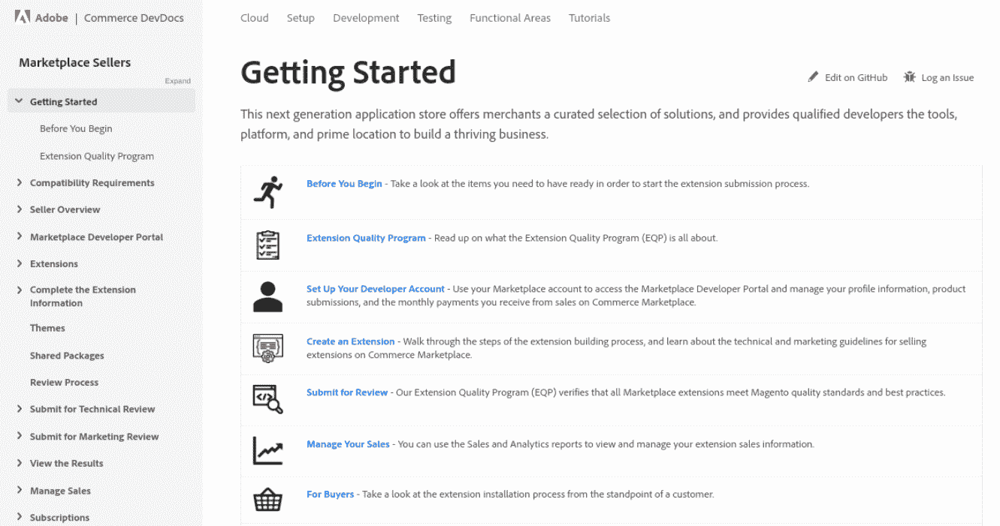

# Magento vs WooCommerce:哪个更好？

> 原文：<https://kinsta.com/blog/magento-vs-woocommerce/>

现在是涉足电子商务世界的最佳时机。然而，如果你正在考虑网上销售，弄清楚使用哪个平台可能会具有挑战性。许多人发现自己在 [Magento](https://business.adobe.com/products/magento/magento-commerce.html) 和 [WooCommerce](https://kinsta.com/blog/woocommerce-tutorial/) 之间争论不休。

两者都是功能丰富、广受欢迎且功能强大的平台。要确定哪一个最适合你，只需更多地了解每个选项所能提供的内容。

在本帖中，我们将向您介绍 Magento 和 WooCommerce，并讨论它们的主要特性。然后，我们将在一些重要因素上比较这两个平台，包括安全性和定价。

我们开始吧！

### 查看我们的视频指南 [Magento vs WooCommerce](https://www.youtube.com/watch?v=ERyiGEA3ceQ)

## Magento 和 WooCommerce 概述

Magento 和 WooCommerce 是最受欢迎的两个自主经营的电子商务平台。它们都有很多优点，也有各自的缺点。在我们进入细节之前，让我们快速看一下每个平台。

### Magento 简介

Magento.

Magento 是一个专门为电子商务打造的 T2 内容管理系统。2018 年被 [Adobe 收购，也被称为“Adobe Commerce”这个平台有些复杂，因为它主要面向开发人员。虽然它不是最适合初学者的选择，但如果你精通技术，并希望创建大规模、复杂的电子商务项目，它可能是一个强大的解决方案。](https://news.adobe.com/news/news-details/2018/Adobe-to-Acquire-Magento-Commerce/default.aspx)

Magento 有两个版本: [Magento 开源](https://magento.com/products/magento-open-source)(也称 Magento 社区)和 [Magento 商业](https://magento.com/compare-open-source-and-magento-commerce)(也称 Magento 企业)。在本文中，我们将主要关注 Magento 开源，因为它与 WooCommerce 有所不同。

Magento 的一些主要功能包括:

*   支持无限的产品
*   数百个免费扩展
*   API 集成
*   主题和布局系统

虽然 Magento 是一个灵活和直观的平台，但它可能不是初学者的最佳选择，因为它涉及到一点学习曲线。它更适合开发专业人员。

[There has never been a better time to get involved in the world of ecommerce... but which platform should you pick? 🤔 Learn more here 👇Click to Tweet](https://twitter.com/intent/tweet?url=https%3A%2F%2Fkinsta.com%2Fblog%2Fmagento-vs-woocommerce%2F&via=kinsta&text=There+has+never+been+a+better+time+to+get+involved+in+the+world+of+ecommerce...+but+which+platform+should+you+pick%3F+%F0%9F%A4%94+Learn+more+here+%F0%9F%91%87&hashtags=ecommerce%2CWooCommerce)

### 网络商务简介

WooCommerce.

WooCommerce 于 2011 年推出，是全球使用最广泛的电子商务平台之一。这是一个基于 WordPress 的开源插件，WordPress 是最流行的 CMS。

它非常用户友好，设置过程[快速简单](https://kinsta.com/blog/woocommerce-tutorial/)可以让你在几分钟内创建自己的在线商店。它还提供了大量的[扩展来增强内置功能](https://kinsta.com/blog/woocommerce-plugins/)。

WooCommerce 有许多有用的功能，包括:

*   无限产品
*   庞大的扩展库
*   [免费和高级主题](https://kinsta.com/blog/woocommerce-themes/)
*   快速简单的设置过程
*   内置安全功能
*   成吨的支付处理器
*   有用的文档

网络商务没有太多的缺点。然而，主要的缺点是，如果你还不是 WordPress 用户，CMS 可能需要一些时间来适应。这意味着你必须学会如何浏览 WooCommerce 和 WordPress。

## Magento vs WooCommerce:势均力敌的比较

现在我们已经介绍了每个平台，是时候更深入一点了。下面，我们将仔细看看 Magento 和 WooCommerce，看看他们在关键方面的比较。

### 支付网关

如果你想改善顾客的购买体验，就必须为他们提供便捷的[支付网关选项](https://kinsta.com/blog/woocommerce-payment-gateways/)。当选择支持最流行的支付处理器的平台时，这更容易做到。

Magento 和 WooCommerce 都提供了大量的选择。WooCommerce 内置了对 PayPal、T2、支票、线下和银行转账以及现金选项的支持。它还为其他支付网关提供扩展，包括 Amazon Pay、Square、Google Pay、支付宝等:

WooCommerce payment gateway options.

同时，Magento 为 PayPal、Authorize.net 和 [Braintree](https://kinsta.com/blog/stripe-vs-braintree/) 提供开箱即用的支持:

Magento payment gateway options.

有针对 Stripe、2Checkout、Skrill、Google Checkout 的扩展，以及针对其他支付网关的更多扩展。

这一类没有真正的赢家。每个平台都内置了对一些最大的支付网关的支持，以及大量的附加功能。

### 易用性

在电子商务平台中，易用性是需要考虑的关键因素，尤其是如果你是初学者。在这个部门中，WooCommerce 名列前茅。

正如我们提到的，Magento 更适合拥有技术知识的开发者。因此，对于普通用户来说，这并不容易。例如，你需要[学习一些基本代码](https://kinsta.com/blog/code-review-tools/)和相当多的技术术语。这是一个更复杂的平台，需要一些开发技能。

另一方面，WooCommerce 是一个对初学者非常友好的解决方案，尤其是如果你已经熟悉 WordPress:

WooCommerce backend.

要将它添加到你的站点，你需要去**插件>添加新的**。一旦激活，WooCommerce 将带你通过一个设置向导。

Magento 还有一个用户友好的仪表盘和一个直观的导航系统。然而，设置和配置过程并不是无缝的。你需要开发知识来设置它。

比如你需要用命令行来安装，设置一个符合 Magento 要求的服务器。此外，如果你已经熟悉 WordPress，学习一个全新的平台会很有挑战性。

### 速度和性能

网上商店的速度和性能对你的成功起着至关重要的作用。毕竟，如果你的页面需要很长时间才能加载，或者你的结账过程滞后，客户就不会逗留。

## 注册订阅时事通讯

### 想知道我们是怎么让流量增长超过 1000%的吗？

加入 20，000 多名获得我们每周时事通讯和内部消息的人的行列吧！

[Subscribe Now](#newsletter)

Quanta research 的一项研究显示，Magento 的加载速度比 WooCommerce 快。然而，比较 Magento 和 WooCommerce 的速度和性能可能会很棘手，因为有很多因素在起作用。例如，你使用的主机方案，你安装了多少插件和扩展，你的图片是否被优化，这些都会影响一个网站的速度。WooCommerce 确实有一些[极快的主题](https://kinsta.com/blog/fastest-woocommerce-theme/)。

### 安全性

确保你的商店是安全的是最重要的在线业务。[安全风险](https://www.sophos.com/en-us/medialibrary/pdfs/technical-papers/sophos-2021-threat-report.pdf)空前高涨。您需要选择一种解决方案来帮助保护您的数据和客户的个人信息，例如支付详情。

Magento 和 WooCommerce 都是开源平台。这意味着店主需要采取积极主动的措施来保护他们的网站。

也就是说，Magento 通常比 WooCommerce 需要更少的插件。反过来，这意味着引入安全漏洞的风险更小。它为安全功能提供的扩展往往比 WooCommerce 更完整。

Magento 还提供专用的安全补丁。然而，重要的是要注意这些并不容易实现，你可能需要专业开发人员的帮助。如果你不介意为商店的安全提供帮助，Magento 可能是更好的选择。

### 可量测性

当谈到比较 Magento 与 WooCommerce 的可扩展性时，Magento 是一个强有力的竞争者。然而，这仅适用于商业版本，而不是免费的开源平台，这可能是有限制的。

有了 Magento Enterprise，您可以毫无问题地处理数千份订单。WooCommerce 也是如此。两个平台都支持无限的产品。

不管你选择哪个平台，重要的是要确保你选择了强大的电子商务主机，能够处理意想不到的流量高峰。例如，在金塔，我们提供[高性能的 WooCommerce 托管计划](https://kinsta.com/woocommerce-hosting/)。Magento 的开源版本是自我托管的，但是 Magento 企业版包括网络托管。

### 展开性

开箱即用，Magento 提供了大量令人印象深刻的功能。这包括多语言选项、多商店功能和复杂的可配置产品。

WooCommerce 默认没有那么多功能。然而，这两个平台都可以通过插件、主题和附加组件进行高度扩展。

WooCommerce Marketplace 提供数千种免费和付费扩展:

WooCommerce extension store.

你也可以在 [WordPress 插件目录](https://wordpress.org/plugins/)中找到更多的电子商务工具。同样，Magento 为[提供了数千种扩展](https://marketplace.magento.com/extensions.html)，既有免费的，也有付费的:

Magento Marketplace.

然而，当比较 Magento 和 WooCommerce 的可扩展性时，重要的是要注意高级附加组件的价格。总的来说， [WooCommerce 插件](https://kinsta.com/blog/woocommerce-extensions/)往往比 Magento 的更实惠。另一方面，因为 Magento 的扩展更复杂，它们往往更强大。

需要一流的，快速的，安全的主机为您的新电子商务网站？Kinsta 提供超快的服务器和来自 WooCommerce 专家的 24/7 世界级支持。[查看我们的计划](https://kinsta.com/plans/?in-article-cta)

在 WooCommerce 上安装插件也比 Magento 容易。作为更复杂的平台，在 Magento 上设置和配置扩展通常需要 web 开发技能。

### 营销和搜索引擎优化

[搜索引擎优化(SEO)](https://kinsta.com/ebooks/wordpress/how-to-improve-seo/) 和在线营销是增加你的商店流量的重要部分，从而增加销售额。所以 Magento vs WooCommerce 的另一个重要考虑就是有哪些营销和 SEO 功能或选项。

WooCommerce 是建立在 CMS 的基础上的，最初是为了写博客。因此，它已经包含了发布帖子和其他内容营销活动所需的许多特性和功能。它还可以与几十种不同的营销和 SEO 插件配对，以帮助进一步优化内容，如 [Yoast SEO](https://kinsta.com/blog/yoast-seo/) :

Yoast SEO.

默认情况下，Magento 没有内置博客功能。为此，你需要一个扩展。然而，与 WooCommerce 类似，你可以使用大量的插件来帮助优化你的网站，并将其与营销工具整合，如 [Google Analytics](https://kinsta.com/blog/how-to-use-google-analytics/) 。

Magento 确实提供了先进的营销工具。然而，他们不包括在社区版本中，只有企业版。

### 支持

由于应用如此广泛，Magento 和 WooCommerce 都有庞大的支持社区。这意味着在网上寻找资源和问题的答案相对容易。

WooCommerce 提供了一个公共知识库，里面充满了有用的教程和指南:

WooCommerce documentation.

除此之外，只对付费扩展提供支持。对于 Magento 的免费版本，您可以在网上找到帮助:

Magento support documentation

只有购买 Magento Commerce 计划，才能通过电子邮件、电话或票务系统获得专门或直接的支持。对于更复杂的问题，您可能需要雇用开发人员。

### 定价

当您试图在平台之间做出选择时，成本可能是您做出决定的一个重要因素。Magento 和 WooCommerce 都是开源的，这意味着你可以免费下载和使用它们的核心代码。

然而，这并没有考虑定制或长期成本。例如，你可能计划使用主题和插件来扩展商店的外观和功能，而不是坚持使用现成的东西。

根据您购买的高级扩展，这些平台的成本可能会有很大差异。正如我们提到的，WooCommerce premium 扩展往往比 Magento 的更实惠。

Magento Enterprise 网站上不包含定价。然而，你可以预计每月支付大约 2000 美元。

对于 Magento 社区和 WooCommerce，你还需要考虑购买域名和托管计划的成本。然而，WooCommerce 仍然趋向于更便宜。

## 重温 Magento vs WooCommerce

至此，你应该对 Magento 和 WooCommerce 的区别有了扎实的了解。但是，在我们总结之前，让我们花点时间总结一下它们在关键领域的比较情况:

|  | **Magento** | **WooCommerce** |
| **支付网关** | 内置选项加扩展(贝宝 Authorize.net，布伦特里等。) | 内置选项和扩展(PayPal、Stripe 等。) |
| **易用性** | 面向开发者 | 初学者友好的 |
| **速度和性能** | 变化 | 变化 |
| **安全** | 安全扩展和补丁(需要开发人员) | 定期更新、内置安全功能和大量安全扩展(免费和付费) |
| **可扩展性** | 支持无限数量的产品 | 支持无限数量的产品 |
| **扩展性** | 高度可扩展，有数千种扩展，但它们往往价格昂贵 | 数以千计的免费和高级扩展 |
| **营销& SEO** | 可用扩展 | 内置博客功能；可用的 SEO 插件 |
| **支持** | 在线支持论坛；商务套装提供专门的支持 | 知识库；付费延期可获得专门支持 |
| **定价** | 免费(提供高级商业版) | 自由的 |

[Magento vs WooCommerce- which one is right for your ecommerce store? 🤔🛒Click to Tweet](https://twitter.com/intent/tweet?url=https%3A%2F%2Fkinsta.com%2Fblog%2Fmagento-vs-woocommerce%2F&via=kinsta&text=Magento+vs+WooCommerce-+which+one+is+right+for+your+ecommerce+store%3F+%F0%9F%A4%94%F0%9F%9B%92&hashtags=ecommerce%2CWooCommerce) ## 摘要

为你的电子商务业务选择一个平台不是一件容易的事情。有很多因素需要考虑，特别是当你比较 Magento 和 WooCommerce 时，这两者都是强大的解决方案，提供了很多东西。

如果你是一个小企业，没有太多的开发经验，WooCommerce 最有意义。然而，如果你精通技术，并且正在寻找更高级的解决方案，Magento 可能是一个可靠的选择。

关于 WooCommerce 和 Magento 的比较，你有什么问题吗？请在下面的评论区告诉我们！

* * *

让你所有的[应用程序](https://kinsta.com/application-hosting/)、[数据库](https://kinsta.com/database-hosting/)和 [WordPress 网站](https://kinsta.com/wordpress-hosting/)在线并在一个屋檐下。我们功能丰富的高性能云平台包括:

*   在 MyKinsta 仪表盘中轻松设置和管理
*   24/7 专家支持
*   最好的谷歌云平台硬件和网络，由 Kubernetes 提供最大的可扩展性
*   面向速度和安全性的企业级 Cloudflare 集成
*   全球受众覆盖全球多达 35 个数据中心和 275 多个 pop

在第一个月使用托管的[应用程序或托管](https://kinsta.com/application-hosting/)的[数据库，您可以享受 20 美元的优惠，亲自测试一下。探索我们的](https://kinsta.com/database-hosting/)[计划](https://kinsta.com/plans/)或[与销售人员交谈](https://kinsta.com/contact-us/)以找到最适合您的方式。