# 最好的 WordPress SEO 插件(以及 2022 年必备的 SEO 工具)

> 原文：<https://kinsta.com/blog/best-seo-plugins-for-wordpress/>

为你的 WordPress 站点找到一个好的主机肯定会加速你的搜索引擎优化排名。然而，还有更多的东西需要考虑，包括你的产品页面和博客文章的关键词，你的图片文件有多大，你的内容是否可读。几个 [WordPress SEO](https://kinsta.com/blog/wordpress-seo/) 插件让这项任务变得轻而易举。

此外，您可以找到一些第三方 SEO 工具来提供强大的统计数据、关键字排名和反向链接信息。

SEO 是令人困惑的，即使是有经验的网站所有者。对于大多数网站所有者来说，找到具有高潜力的帖子和页面，修复断开的链接，重组网站结构，或者进行一次完整的 T2 搜索引擎优化审计并不容易。但是，当你配备了正确的工具和实现这些工具所需的知识，你就会在搜索引擎的道路上取得成功。

开始吧！

### 查看我们的视频指南 [WordPress SEO 插件](https://www.youtube.com/watch?v=mBTfg03LT-Y)

## SEO 插件是做什么的？

搜索引擎优化包含了广泛的研究领域。它可以涵盖关键词研究、内容优化、添加链接等等。一般来说，任何帮助你优化网页的插件都属于这一类。

> 需要在这里大声喊出来。Kinsta 太神奇了，我用它做我的个人网站。支持是迅速和杰出的，他们的服务器是 WordPress 最快的。
> 
> <footer class="wp-block-kinsta-client-quote__footer">
> 
> 
> 
> <cite class="wp-block-kinsta-client-quote__cite">Phillip Stemann</cite></footer>

[View plans](https://kinsta.com/plans/)

一些 SEO 插件，比如 [Yoast SEO](https://kinsta.com/partners/yoast/) (我们在 Kinsta 使用的)，在帮助你改善搜索引擎内容方面做得更好。例如，它们可以帮助你避免过度使用精确的关键词和技巧来提高内容的可读性。

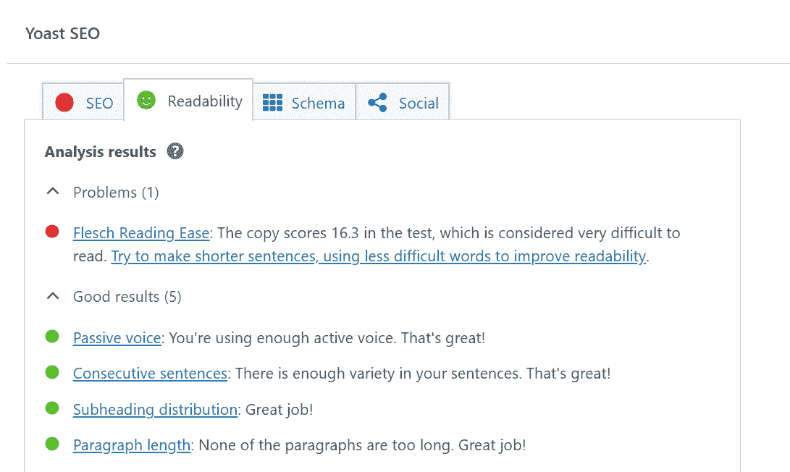

Yoast SEO 插件。

重要的是要明白 SEO WordPress 插件并不一定意味着你的内容在搜索引擎上会排名更高。然而，如果你不确定如何为搜索引擎优化内容，这些工具提供了一个很好的起点。

使用 WordPress SEO 插件可以帮助你更深入地了解你的受众和流量来源。然后，您可以使用这些有价值的信息来改进您的内容策略并提高参与度。

## WordPress 需要 SEO 插件吗？

你*不*需要使用 WordPress SEO 插件来优化你的帖子和页面。如果你熟悉 SEO 的基本原理，并且跟上算法的最新变化，你就可以在不使用插件的情况下获得惊人的效果。

在大多数情况下，SEO 插件为你提供了如何改进内容的指导，所以它对搜索引擎更友好。但是，实际的优化工作还是落在你的手上。

现成的，WordPress 已经包含了所有创建搜索引擎优化友好内容所需的工具和功能。内容管理系统(CMS)使您能够添加标题、元描述、标题、替代文本、标签、自定义 URL 等。

这些小任务(以及许多其他任务)增加了我们所说的 SEO。如果你不需要一个插件来提醒你基本的搜索引擎优化任务，那么你就更强大了。

然而，即使你决定不使用 SEO 插件，仍然有很多独特的工具可以用于关键字研究和竞争对手分析。这些也可以帮助你找出为什么你的网页排名[下滑](https://kinsta.com/blog/decline-seo-rankings/)，并让你确定需要改进的地方。

## WordPress 最佳搜索引擎优化插件(2022)

首先，我们将讨论 WordPress 的 SEO 插件。这些插件通常更容易理解和安装，您可以从大量具有不同特性的插件中进行选择。最好的插件在你的页面和帖子编辑器上向你展示搜索引擎优化的投影和推荐，而其他的插件则局限于它们的功能集。尽管如此，他们有独特的资产，如检查断开的链接或最小化图像的文件大小。

 上面显示了推荐的快速列表，但是我们强烈推荐滚动浏览下面我们已经完成的关于最佳 SEO WordPress 插件选项的更彻底的评论。

### 1.Yoast SEO

Yoast SEO 作为 WordPress SEO 插件之王独霸天下。这是我们在金斯塔博客上使用的**。在撰写本文时，Yoast 获得了令人震惊的 16，700 个五星评级，它继续以令人印象深刻的更新、漂亮的界面和最友好的用户界面让你的博客帖子和产品页面脱颖而出。**

Yoast SEO WordPress plugin.

更重要的是，Yoast SEO 有自己的[网站](https://yoast.com/wordpress/plugins/seo/)，提供高级支持选项，在论坛部分有一个繁荣的社区，有一个信息丰富的博客来了解更多关于 SEO 的知识，还有针对初学者、中级用户和高级用户的 SEO 课程。

您还可以从该网站访问 Yoast SEO premium，它提供了更多高级功能，如针对一个页面上的五个关键词进行关键词优化，预览您的页面在 Twitter 和脸书上的外观，以及将用户发送到网站上其他位置的内部链接建议。请记住，这只是所提供的高级功能的一小部分。

这个高级插件每个网站售价 89 美元，对任何人来说都是一笔理想的交易。然而，那些预算有限的用户仍然可以获得免费插件，这远远超过了大多数其他 SEO WordPress 插件。

#### 使 Yoast SEO 成为最佳选择的特性:

*   键入关键词，分析你在页面和文章中对这些关键词的优化程度。
*   确切地看到你的[谷歌搜索引擎](https://kinsta.com/blog/google-search-operators/)的结果会是什么样子。有了这个，你可以[调整元描述](https://kinsta.com/blog/meta-description-wordpress/)和标题，使它更有吸引力和关键字丰富。
*   所有页面都完成了可读性检查，以了解您是否需要拆分段落或添加元素，如编号列表或标题。
*   该插件检测你的页面或文章中是否有重复的内容。
*   Yoast 拥有我们所见过的来自插件开发者的最好的资源和支持。
*   他们还每两周更新一次插件。
*   高级插件提供了重定向管理器、免费支持、内容洞察和后端无广告界面。

要了解更多关于这个令人敬畏的插件，查看我们的深入教程:[如何在 WordPress 上使用 Yoast SEO:完整教程](https://kinsta.com/blog/yoast-seo/)

### 2.SEO 框架

搜索引擎优化框架插件为那些想要一个没有任何广告或追加销售的快速、轻量级搜索引擎优化插件的人提供了帮助。它去掉了一些你可能不需要的花里胡哨的东西，专注于帮助那些更关心保持网站高速度的人，同时减少花在令人困惑的 SEO 文章上的时间。它通常被认为是优斯特的最佳替代品。这与 SEO 评级的视觉本质和更灵活的针对关键词的选项有很大关系(比如稍微偏离的词或同义词)。

The SEO Framework WordPress plugin.

文章搜索引擎优化设置由几个选项卡控制，其中一个选项卡使用彩色刻度来显示你的文章搜索引擎准备就绪的程度。有了这个标尺，你可以立刻知道你需要在哪里为你的 SEO 做些工作，不像一些更混乱的 Yoast 版本。

你可能已经想到了，这个界面对于初学者来说是完美的。该 API 还对高级用户开放，让他们也能参与进来。该插件最初是 WPMUDEV 社区中的一个项目，但最终免费发布给大众。SEO 框架插件包罗万象，在扩展的[帮助下，它提供了更高级的功能。](https://theseoframework.com/extensions/)

其中一些包括:

*   [本地 SEO](https://kinsta.com/blog/what-is-google-my-business/)
*   放大器集成
*   文章增强
*   监测搜索引擎优化和正常运行时间
*   隐名模式
*   重新寄送
*   垃圾邮件发送者的评论缓存

#### 使 SEO 框架成为最佳选择的特性:

*   SEO 框架不卖任何东西给你。它与你在 Yoast 中找到的大多数所需功能相匹配，但你不需要为扩展或高级功能付费。
*   可视化的彩色指示器/标尺提供了一种更加用户友好的方式来检查你的帖子是否会在谷歌上表现良好。
*   它为需要设置和显示重要本地商业信息的公司提供了本地 SEO 扩展。
*   垃圾评论扩展消除了对额外插件的需求。
*   大多数 SEO 设置都是预先配置好的，所以安装插件后几乎不需要设置什么。
*   当其他插件利用 focus 关键字时，SEO 框架关注于 [focus subject](https://github.com/sybrew/the-seo-framework/issues/128) 以鼓励更自然的写作，因为 Google 将 SERPs 中的同义词视为同一事物。

### 3.SEOPress

SEOPress 是 WordPress 的免费 SEO 插件，没有广告。它完全是白色标签，没有足迹，即使是在免费版。它简单、快速、强大，让你管理你所有的文章/页面/文章类型/术语的标题和元描述。

[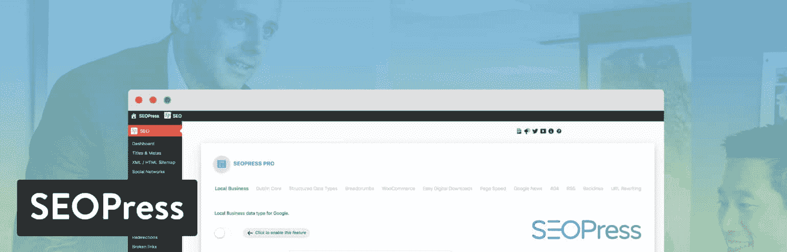](https://wordpress.org/plugins/wp-seopress/)

SEOPress plugin.

创建 XML 和 HTML 网站地图，使用 Google Analytics(与 RGPD 兼容)跟踪您的访问者，并优化标签(Open Graph 和 Twitter Cards)以便在社交网络上共享您的内容。免费版还提供内容分析，帮助网站管理员写出更好的文章。开发者可以使用超过 75 个钩子来随心所欲地设置插件。

高级版扩展了其功能并增加了高级特性，如:

*   本地商业搜索引擎优化。
*   面包屑优化搜索引擎优化和可访问性。
*   WooCommerce 和简易数字下载优化。
*   视频和谷歌新闻 XML 网站地图。
*   Google 结构化数据类型(schemas.org):产品、文章、事件、本地业务、菜谱、评论、 [FAQ](https://kinsta.com/blog/wordpress-faq-plugins/) 、课程和视频。
*   与 Majestic(第三方 API)集成的反向链接。
*   谷歌页面速度 v5 集成，以快速检查你的网页质量。
*   再反应和 404 监控。
*   你的 WordPress 仪表盘中的谷歌分析统计。

#### 使 SEOPress 成为最佳选择的特性:

*   没有广告，你的编辑会看到一个没有引用 SEOPress 的元框。在管理栏中也是一样。
*   它可以让你在几秒钟内将谷歌分析跟踪添加到你的网站。您可以从跟踪中排除用户角色，设置自定义维度，启用再销售、人口统计和兴趣报告，跟踪 PDF、DOCX、XLSX、下载、IP 匿名化、跨域跟踪等。
*   快速简单的 Twitter 元标签和脸书开放图表数据。

### 4.排名数学

SEO 是你的 WordPress 网站 SEO 工具的瑞士军刀。它提供了你所需要的一切来完全控制你的页面搜索引擎优化。Rank Math 结合了你可能在你的 WordPress 网站上使用的多个 SEO 插件的力量，把所有东西都放入一个易于管理的轻量级插件中。

[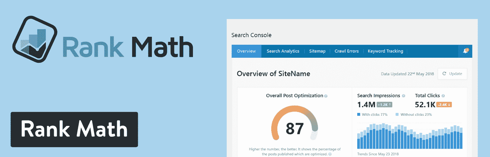](https://wordpress.org/plugins/seo-by-rank-math/)

Rank Math SEO WordPress plugin.

有了排名数学，你可以管理你的文章、页面、产品或其他分类的页面搜索引擎优化。您还可以控制一般和个别帖子或页面中所有分类法的 noindex/nofollow/noarchive meta 标签。

它与[谷歌搜索控制台](https://kinsta.com/blog/google-search-console/)紧密集成，在你的 WordPress 管理仪表板中为你带来重要信息。像你的关键词排名，你的网站有多少搜索印象，谷歌在你的网站上看到什么错误等信息。，一目了然。

除此之外，Rank Math 还带有内置的 404 监视器、重定向、丰富的片段、本地 SEO、XML 网站地图、自动图像 SEO、内部链接建设推荐等。

#### 使排名数学成为最佳选择的特性:

*   这是一个满足你所有搜索引擎优化需求的一站式商店。
*   每个帖子/页面/产品都经过一个基于 40 个因素的 SEO 分析工具。
*   用户界面非常干净，选项也很容易理解。
*   它给你选择添加 alt 或 title 标签到图像，自动丢失它们。
*   Rank Math 有一个 404 监视器来告诉你用户在哪里看到错误。
*   它还带有一个重定向模块，可以让你将那些 404 错误指向你的网站上更有用的地方。
*   XML Sitemap 模块与 Rank Math 捆绑在一起，一旦你对你的帖子做了任何修改，该插件还会自动 pings 搜索引擎。
*   丰富的片段支持包括一个选项，可以从 6 个不同的片段中进行选择，如文章、产品、食谱、事件、视频、当地商业等。
*   面包屑也是插件的一部分，所以你不必依赖另一个插件。
*   捆绑了 Open Graph 和 Twitter 卡支持。

### 5.SEO Squirrly

SEO squirly 是为那些不是 SEO 专家的人营销的。它通过提供一个没有复杂元素的完整的 SEO 套件来实现这种说法。SEO Squirrly 生成的 SEO 推荐不同于我们已经概述的其他插件。你首先输入你的文章主题。所需的关键字也被输入，这样当你继续写你的内容时，一系列绿灯会被实时激活。这几乎就像你在写作时有一个专家在你耳边低语。

SEO Squirrly WordPress plugin.

#### 使 SEO Squirrly 成为最佳选择的特性:

*   关键词优化是在你写文章的时候完成的。这比 Yoast 简单一点，在 Yoast 中，您经常需要保存文章才能看到建议和结果。
*   如果你计划用 Squirrly 替换 WordPress 的旧 SEO 插件，它仍然会保留你之前设置的所有设置。
*   有一种工具可以分析你的竞争对手，看看你如何超越它。
*   Squirrly 包括内容报告，您可以将其发送给组织中的其他人。例如，一个作者可能需要学习更多关于 SEO 的知识，所以你可以在写完一篇文章后发给他们。
*   你每周都会收到进度监控，还有一个可靠的工具，显示关于你的话题的最新推文。这既提供了灵感，也提供了改进内容的方法。

### 6.断开链接检查器

SEO 不仅仅是用大量的关键词填充你的页面和帖子。这也不仅仅是让你的内容可读。一个让你通过竞争的方法是浏览你的网站，删除任何损坏的链接。当谷歌看到一个断开的链接(也就是一个指向 404 页面的链接)时，它认为这是一个不太理想的用户体验。毕竟，你的客户对登陆一个空页面没有兴趣。

唯一的问题是，你可能需要几个小时或几天的时间来筛选所有的内容，以找到每个断开的链接。进入[断链检查器。](https://wordpress.org/plugins/broken-link-checker/)

Broken Link Checker WordPress plugin.

这个宝石通过扫描你的博客文章和页面为你做脏活。所有断开的链接都会在几分钟内显示出来。列表中填充了有问题的链接，因此您可以完全删除它们，或者将它们更改为更好的引用。如果你保持插件活动，它会继续搜索你的网站，并在链接断开时通知你。

链接被改正后，列表将会是空的，谷歌看到你把你的网站维护得相当好。

**重要提示:**由于此插件的持续扫描功能，我们建议启用它，分批检查并修复您的链接，然后再次禁用它。这将确保它不会影响您的网站的性能。🚀

#### 使断开的链接检查器成为最佳选择的功能:

*   你甚至不用去贴吧或页面更改断开的链接。所有的链接修改都是通过插件的主页完成的。
*   WordPress SEO 插件有一个搜索和过滤链接的选项。
*   这不仅仅是为了在帖子和页面中找到断开的链接。该插件监控评论、自定义字段等等。
*   丢失的图片和重定向也会被检测到——基本上，任何可能使读者困惑并使谷歌在你的网站上看起来不那么受欢迎的东西都会被检测到。
*   有一个可选的功能可以防止搜索引擎跟踪你网站上的坏链接。

### 7.Rel NoFollow 复选框

当链接到其他页面和网站时，重要的是要意识到这些链接对谷歌来说意味着什么。搜索引擎想知道这些链接的质量以及返回到你网站的链接的质量。这样做的原因是，如果你有数百个链接指向垃圾网站，谷歌认为这是操纵和无益于用户。这个插件对那些有会员链接的人来说是完美的。

确保你的链接不影响排名的一个方法是给所有外部链接添加“rel nofollow”属性。这样，链接就不会影响外部站点的排名。简而言之，它吓跑了那些看重这些链接排名的广告商。

不幸的是，在内容的所有链接中添加“rel nofollow”标签是一件痛苦的事情。然而， [Rel NoFollow Checkbox](https://wordpress.org/plugins/rel-nofollow-checkbox/) 插件提供了一个额外的复选框来标记在 WordPress 中创建的链接。

[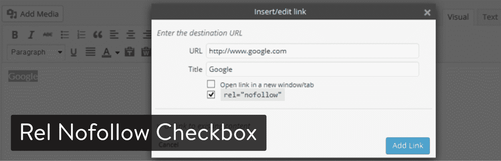](https://wordpress.org/plugins/rel-nofollow-checkbox/)

Rel Nofollow Checkbox WordPress plugin.

在“在新窗口/标签中打开链接”复选框下面，你还会发现一个“rel nofollow”选项，它可以减少你在 HTML 中花费的时间。

#### 使 Rel Nofollow 复选框成为最佳选择的功能:

*   它是轻量级的，所以你的网站仍然很快。
*   你有机会提高你的搜索引擎优化，而不需要花费大量的时间筛选 HTML(找到你的链接并添加一点代码)。
*   对于非编码人员来说，这使得这个过程更加容易。
*   为[代销商](https://kinsta.com/affiliate-academy/how-to-become-an-affiliate-marketer/)提供的完美插件。
*   安装过程不会超过一两分钟，并且不需要配置任何设置。
*   你可以快速浏览你的作者写的客座博文或文章，以确保他们没有试图在未经你允许的情况下推销某些产品或公司。

如果你是一个代销商，你可能也想看看一个免费的链接缩短插件，比如[漂亮链接](https://wordpress.org/plugins/pretty-link/)，它可以自动将 nofollow 属性添加到你的链接中。

### 8.全在一个模式中丰富的片段

[丰富的片段是视觉搜索元素](https://kinsta.com/blog/schema-markup-wordpress/),如星级排名、图片和其他重要细节，通过与常规搜索结果不同的内容来吸引用户的注意力。丰富的片段通常用于电子商务产品页面结果和博客文章评论。谷歌喜欢丰富的片段，因为它们没有那么侵入性，但仍然向用户揭示了有价值的信息。

WordPress 没有提供丰富片段的内置方法，但是[All in One Schema Rich Snippets](https://wordpress.org/plugins/all-in-one-schemaorg-rich-snippets/)插件为你做了这项工作。

All In One Schema Rich Snippets WordPress plugin.

有了这个插件，你的搜索引擎结果会减少到最重要的元素。此外，用户可以看到从照片到星级到作者头像的所有内容。

#### 使所有模式丰富的片段成为最佳选择的特性:

*   谷歌搜索为用户提供了更直观的结构。谷歌喜欢这样，用户也喜欢。
*   该插件支持多种类型的内容，包括事件、评论、人物、产品、食谱和视频。因此，举例来说，一个食谱可能有星级，评论的数量，和食物的照片。
*   你的搜索结果更容易在脸书上分享，因为适当的信息已经编辑好了。

如果你的网站上没有评论，只是需要一个更轻量级的插件，我们建议查看免费的[模式](https://wordpress.org/plugins/schema/)插件。

### 9.提词

[WordLift](https://wordlift.io/) 是一个 WordPress 插件，它使用人工智能将高级 SEO 带到内容编辑和营销人员的手中。[这个插件](https://wordpress.org/plugins/wordlift/)帮助你组织你的内容，同时自动化结构化数据标记，让你访问谷歌中的 [SERP 功能。最重要的是，WordLift 通过添加内部链接、推荐小部件和语义丰富的元数据来提高内容的可查找性。计划起价为每月 59 欧元(65 美元/月)。](https://developers.google.com/search/docs/advanced/structured-data/search-gallery)

WordLift WordPress plugin.

通过利用这个插件，你还可以开始将你的文章和页面翻译成机器友好的内容，搜索爬虫、聊天机器人和个人数字助理(如谷歌助理、Siri 和 Alexa)可以使用和理解你的有机流量。

#### 使 WordLift 成为最佳选择的功能:

*   使用自然语言处理和知识图表来自动化结构化链接数据标记。
*   添加 WooRank 的技术来帮助您跟踪内容的性能，并就如何优化您的网站提供相关建议。
*   与谷歌分析整合。
*   这个插件的一些用户是 Airbnb、Amazon Audible、绿色和平组织、默克集团和 TheNextWeb。

### 10.重寄

重定向是现代 SEO 的重要组成部分。如果你想把用户从一个不再存在的页面重定向到另一个 URL，你需要[实现一个 301 重定向](https://kinsta.com/help/redirect-rules/)。通过 301 重定向，你可以让搜索引擎知道他们应该关注新的 URL 并丢弃以前的 URL。

重定向插件。

[重定向](https://wordpress.org/plugins/redirection/)使您能够使用简单的 URL 管理器实现 301 重定向。没有插件，实现重定向是一件复杂的事情，需要你修改*。htaccess* 文件，并为每个新重定向添加手动条目。

该插件还包括一个允许设置“有条件”重定向的系统。这意味着您可以根据用户的登录状态、他们使用的浏览器、他们的 IP 地址和其他条件来实现重定向。这个条件系统最好的一点是，为 404 页面设置自动重定向非常简单。

#### 使重定向成为最佳选择的功能:

*   重定向使得设置 301 重定向比手动添加更容易。
*   该插件包括一个条件重定向系统，支持登录状态、页面类型、IP 地址等参数。
*   它记录每一个重定向发生在您的网站上。
*   你可以在 WordPress 中追踪 404 错误。
*   你也可以改变你网站的永久链接结构。

### 11.瘦搜索引擎优化

大多数 WordPress SEO 插件为你提供了如此多的设置和选项，以至于学习如何使用它们很有挑战性。这不一定是件坏事，但是根据您的风格，您可能更喜欢使用不需要您花费太多时间来配置的工具。

苗条徐老。

Slim SEO 的主要卖点是它能让你自动生成元标签和站点地图，添加模式标记，并创建重定向。该插件还可以帮助您设置开放图形元标签，并配置您的内容在社交媒体上的显示方式。

此外，您可以使用 Slim SEO 在页眉和页脚中添加自定义代码。这非常适合集成解决方案，如 Google Analytics 或其他类型的跟踪代码。

与 Yoast SEO 或 Rankmath 等插件相比，Slim SEO 缺乏页面分析功能。然而，如果你不需要备忘单就能轻松运行优化，这个插件是一个值得的选择。

#### 使 Slim SEO 成为最佳选择的特性:

*   Slim SEO 可以自动生成元标签、站点地图，并为你的文章和页面添加模式标记。
*   您可以使用该插件为作者页面设置重定向。
*   当用户在社交媒体上分享内容时，该插件使您能够修改您的内容。
*   它很容易配置，并且它的默认设置对大多数用户来说应该是完美的。

### 12.内部链接榨汁机

你可能知道，内部链接是伟大的 SEO 最关键的元素之一。你的内部链接策略越好，用户就越容易在你的网站中找到更多的内容，他们就会花更多的时间浏览。问题是，随着内容库的增长，找出要链接的帖子可能会成为一个挑战。这就是[内部链接榨汁机](https://wordpress.org/plugins/internal-links/)的用武之地。

内部链接榨汁机插件。

这个插件可以让你为每篇文章设置锚关键词，它会自动添加相关内部内容的链接。您可以配置插件添加到每个帖子的链接数量，并阻止内容，这样它就不会被链接到。此外，您可以访问关于这些内部超链接的统计数据。

使用内部链接榨汁机的最好方法是让插件在你的帖子上施展它的魔法，然后仔细查看它们，看看你是否能发现任何额外的链接机会。尽管这个插件很好，但它仍然比不上你内容的深度专业知识，但它会节省你的时间。

#### 使 Internal Link 榨汁机成为最佳选择的特性:

*   为库中的每个帖子设定锚文本关键词
*   启用插件，根据你设置的关键词自动为每篇文章添加内部链接
*   配置插件可以添加到每个帖子的链接数量，以及它可以链接和不可以链接的内容
*   获取有关您的内部链接的报告

### 13.XML 站点地图

许多一体化的 WordPress SEO 插件会自动为你的网站创建 XML 站点地图。但是，假设您不打算使用这些工具，并且您能够在没有任何帮助的情况下优化您的内容。在这种情况下，您仍然可以从负责生成站点地图的插件中受益。

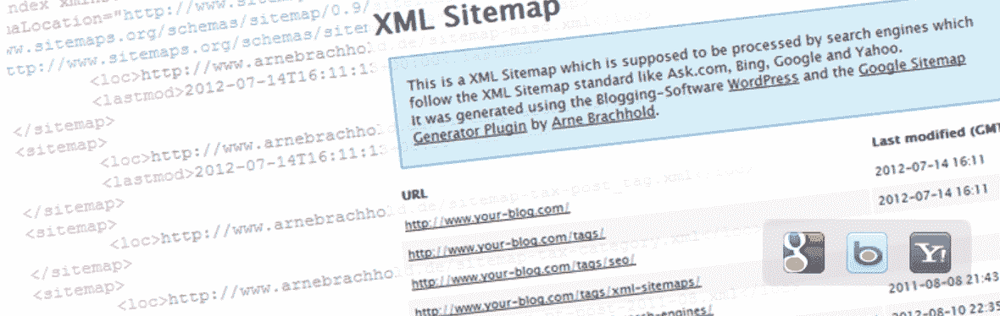

XML Sitemaps 插件。

XML 站点地图插件是即插即用的。一旦你激活插件，你可以配置它是否通知搜索引擎你的网站的每次更新。您还可以选择创建 HTML 格式的站点地图。

除了这些基本设置，插件会自动为你的网站生成一个完整的站点地图。你可能仍然想把网站地图提交给搜索引擎网站管理员工具，比如谷歌网站管理员工具，但是这部分工作取决于你。

#### 使 XML 站点地图成为最佳选择的特性:

*   它会自动为你的网站生成 XML 站点地图。
*   它通知搜索引擎你网站的更新。
*   它将你的站点地图 URL 添加到 *robots.txt* 文件中。

### 14.WP & AMP 的模式和结构化数据

模式标记可以改变内容在搜索引擎结果页面(SERPs)上的显示方式。如果你曾经看过带有图片、评级和产品价格的搜索结果，所有这些都在常规的元描述之上，那么这些都是丰富的片段。

## 注册订阅时事通讯

### 想知道我们是怎么让流量增长超过 1000%的吗？

加入 20，000 多名获得我们每周时事通讯和内部消息的人的行列吧！

[Subscribe Now](#newsletter)

为了显示丰富的代码片段，您需要在内容中添加模式标记。然而，有几十种模式类型，每一种都有独特的用途。[模式&WP 的结构化数据& AMP](https://wordpress.org/plugins/schema-and-structured-data-for-wp/) 帮助您为每种类型的内容选择和添加正确的模式:

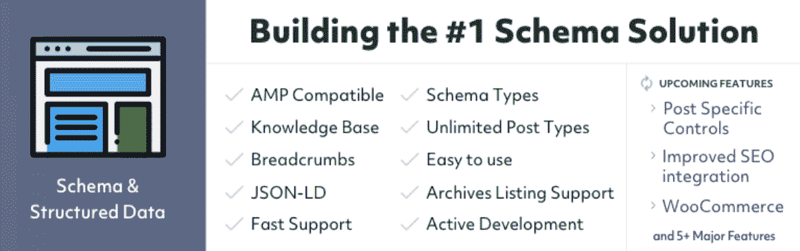

模式&WP&AMP 插件的结构化数据。

该插件包括一个功能，可以自动检测它正在处理的内容类型，并分配适当的模式。但是，您也可以从超过 35 种模式类型中手动选择，包括博客文章、新闻文章、食谱、产品页面等等。

您可以为 WP & AMP 配置模式和结构化数据，以排除特定类型的内容，并且不向它们分配模式标记。该插件还使您能够从其他模式标记工具导入数据，因此您可以选择并切换到它，而无需为整个网站重做模式。

#### 使 WP 模式和结构化数据成为最佳选择的特性:

*   该插件可以自动为超过 35 种类型的内容分配模式。
*   您可以手动选择要添加到每个帖子和页面的模式标记。
*   您可以配置插件，从模式分配中排除特定类型的内容。
*   你可以选择从其他流行的 WordPress 模式标记插件导入数据。

## WordPress 用户的最佳搜索引擎优化工具

如果你需要一个最好的搜索引擎优化工具的快速列表，或者任何用户，请随意点击我们在下面列表中提供的选项。

### 查看我们的视频指南【WordPress 的最佳 SEO 工具

如果你更愿意通过深入的研究，真正了解每个 SEO 工具的特点，继续阅读，了解从[关键词研究](https://kinsta.com/blog/keyword-research/)特点到 SEO 搜索量排名的一切。

### 1.Ahrefs

Ahrefs 是一个 SEO 巨擘，也是你能得到的覆盖你 SEO 需求方方面面的最接近的东西。整个要点是给你洞察你的竞争，并找到反向链接和关键字，可能会为你自己的业务。这对于定位竞争对手可能还没有利用的关键词也很有用。**我们每天在金斯塔利用 Ahrefs。😄**

[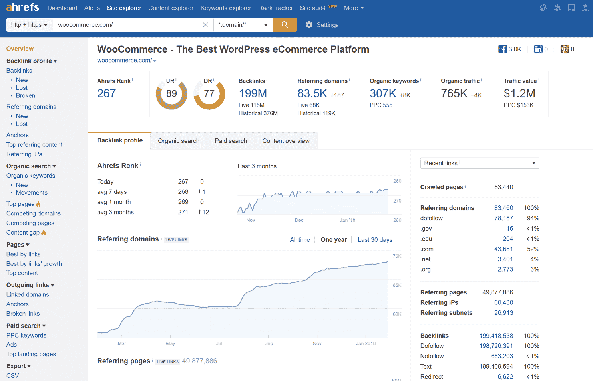](https://ahrefs.com/)

Ahrefs SEO tool

正如你在截图中看到的，Ahrefs 仪表板提供了几个标记、图表和图形，用于检查参考域名、有机关键词和付费关键词等内容。是的，它有点贵(一个用户每月 99 美元起)，但电子商务商店或博客可以轻松赚回这笔钱，因为它被认为是网络上最好的 SEO 工具之一。事实上，它帮助我们清除了网站上的负面搜索引擎优化攻击。

Ahrefs 实际上可以为其他不使用 WordPress 的网站工作，因为它提供了一个全面的站点浏览器和仪表板，独立于 WordPress。

#### 为什么我们喜欢这个搜索引擎优化工具

*   Ahrefs 无疑是市场上最好的关键词浏览器。
*   它拥有网络上最大的反向链接数据库之一，我们在很多事情上都依赖于它的数据。
*   它提供了一个排名追踪器，可以看到你在网上与同类公司的对比情况。
*   内容创意更容易获得，因为你可以根据你在网站上销售或谈论的内容来搜索主题。
*   你可以找到链接到你的竞争对手的网站，然后接触那些相同的网站(或类似的)。
*   Ahrefs 展示了在社交媒体上与你的品牌互动的人。
*   您可以配置几个警报来确定何时添加或丢失反向链接。它也非常适合查看新的关键词和网络提及。

### 2.生长条

[GrowthBar](https://growthbarseo.com/) 让你一键获取关键词结果，查看竞争对手的反向链接，谷歌广告数据，生成博客内容。博客作者和内容创作者将从这个工具中受益最多。事实上，GrowthBar 附带了一个内容生成功能，这使它有别于其他 SEO 工具。得益于此，你将能够创建包含你想要的正确关键词的内容大纲、介绍段落等。

GrowthBar 的拖放式内容编辑器非常独特，非常适合 WordPress 用户。GrowthBar 由一个使用开放人工智能构建的工具提供支持，这意味着——有史以来最复杂的语言模型。这意味着您使用该工具的次数越多，结果和建议就会越好。

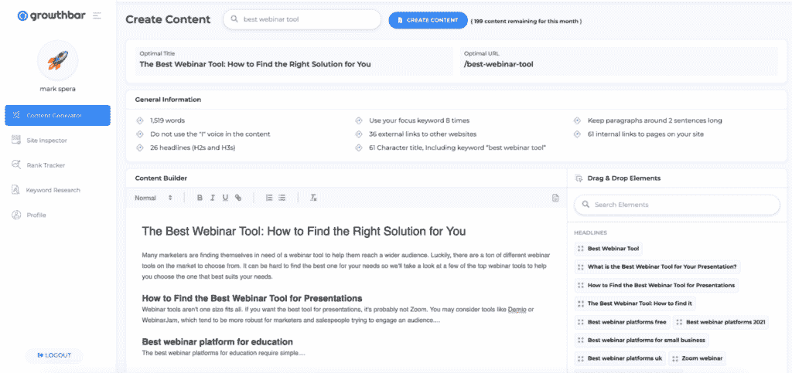

GrowthBar SEO Extension

由于简单的用户界面和强大的数据集，几乎任何人都可以使用它，不管他们的技术经验如何。企业家、小企业和自由职业者都可以利用这个强大的搜索引擎优化工具。

#### 为什么我们喜欢这个搜索引擎优化工具

*   GrowthBar 的内容生成可以帮你节省时间。
*   它允许您将所有内容大纲导出到 Google Docs，这样您或您的作者团队就可以更快地创建内容。
*   它有一个大的关键词索引和反向链接建议。
*   它有一个光滑易用的用户界面。

### 3.精确器

Ahrefs 擅长关键字研究和反向链接研究，而 Accuranker 负责关键字跟踪。事实上，整个系统是建立在跟踪你的搜索引擎优化排名和提升你的搜索引擎优化的关键词上的。定价比 Ahrefs 好一点，但你要记住，它不是同一类型的 SEO 工具。**我们在 Kinsta** 利用 Accuranker 监控我们在 SERPs 中的内容营销。

[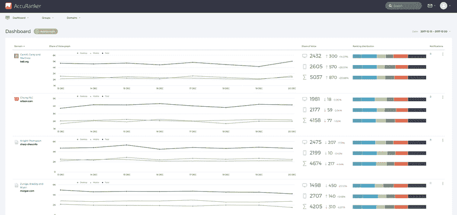](https://www.accuranker.com/)

Accuranker SEO tool

Accuranker 起价为每月 44.95 美元，允许您跟踪多达 600 个关键词。您还可以在无限的域名上使用该工具，并查看一个竞争对手。当您升级到其他计划时，随着代理和企业套餐的推出，这些数字会变得更大。

必应和谷歌都被 Accuranker 跟踪，因为它根据关键词或其他指标提供精确的每日结果。

#### 为什么我们喜欢这个搜索引擎优化工具

*   关键字跟踪是每天进行的。但是你也可以**随时手动刷新你的关键词排名**。这是最好的功能之一！大多数关键字跟踪工具限制了这种能力。
*   你可以根据城市、州和当地企业的邮政编码进行追踪。
*   你可以回顾历史，看看你是如何实现目标的，以及这些年来某些关键词的表现如何。
*   关键字跟踪通过每个关键字的额外分析数据得到加强，如流量潜力、每个关键字的流量和搜索量。
*   SEO 工具提供了一个自动化的报告区域，您可以在其中拖放项目，以备将来使用。这样，当您需要下载特定报告时，它总是为您服务。
*   你可以得到移动、桌面和本地关键词和搜索的排名。

### 4.塞姆拉什

Semrush 有一个相当简单的界面，适合那些刚刚开始搜索引擎优化并且不想感到太害怕的人。价格仍然很高(每月 99.95 美元起)，但您可以免费获得一些领域概述指标。也就是说，你需要先注册一个账户，然后追加销售就会很快开始。

总的来说，Semrush 专注于 SEO、付费流量、社交媒体和内容。技术搜索引擎优化审计是你找到大部分信息的地方。位置跟踪的工作方式类似于 Accuranker，竞争情报也很容易理解。

[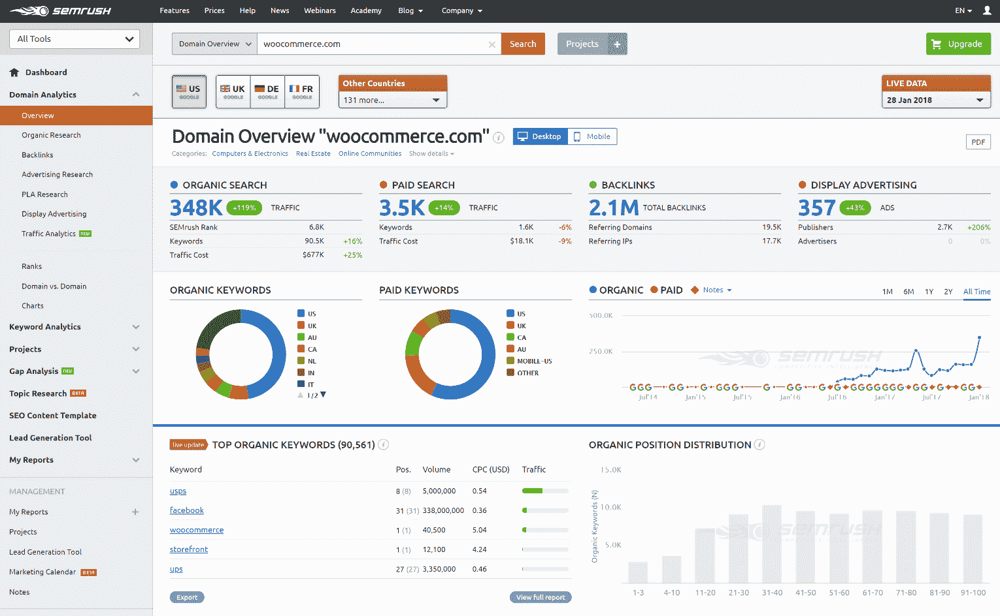](https://www.semrush.com/)

Semrush SEO tool

你选择 Semrush 的一个主要原因是分析部分。它在比较付费流量和有机流量方面做得非常好。我们也喜欢广告策略分析，因为一旦你开始学习如何更有策略地发布谷歌广告，这必然会把更多的人推向你的网站。

#### 为什么我们喜欢这个搜索引擎优化工具

*   这个界面对于普通用户来说足够简单易懂。
*   Semrush 涵盖了中小型企业所需的大多数 SEO 工具。竞争对手分析比较强，关键词研究用自己的网站和竞争对手。
*   如果你正在为多个客户运行报告和分析，这是一个很棒的程序。这些看起来很专业的报告是业内最好的，你可以将它们发送给任何地方的其他人。

### 5.KWFinder

KWFinder 为预算有限的人提供更实惠的价格。定价从每月 29.08 美元开始。这包括对关键字研究、SERP 分析、排名跟踪和反向链接分析的支持。最高价格点是每月 79.08 美元，增加了查找和关键字跟踪的数量。你也可以选择注册一个免费账户，但是每 24 小时你只能查询五次。这对于一个小博客来说可能没问题，但是对于其他的博客来说就不太好了。

需要一个给你带来竞争优势的托管解决方案吗？Kinsta 为您提供了令人难以置信的速度、一流的安全性和自动伸缩功能。[查看我们的计划](https://kinsta.com/plans/?in-article-cta)

[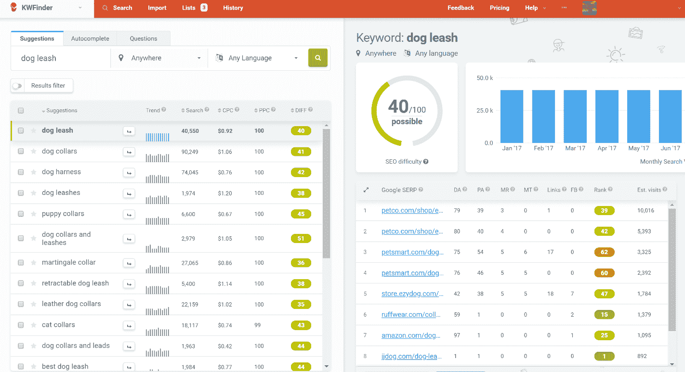](https://kwfinder.com/)

KWFinder SEO tool

KWFinder 用户界面丰富多彩且直观，排名显示清晰，便于初学者理解。主要功能是为你的网站推荐关键词，并将这些关键词与其他竞争对手的关键词进行比较。

#### 为什么我们喜欢这个搜索引擎优化工具

*   你找不到更干净的用户界面了。
*   搜索量似乎比市场上的其他关键词规划和搜索工具更准确。
*   价格很难被击败，你可以选择玩免费计划。
*   关键词难度分数不仅比竞争对手更有逻辑意义，而且对于那些不打算每天分析数百个关键词的人来说是完美的。

### 6.谷歌关键词规划器

如果你不打算花钱买一个关键词研究工具，但想在你的 SEO 规划背后获得一些动力，那就去看看谷歌关键词规划器。这是许多在线营销人员在寻找最佳付费关键词时使用的方法。Google Keyword Planner 有一个超本地搜索量工具，这对于那些经营小型本地企业的人来说是必不可少的。你也可以根据人口统计来锁定目标人群，所以电子商务公司应该有这样的武器库。

[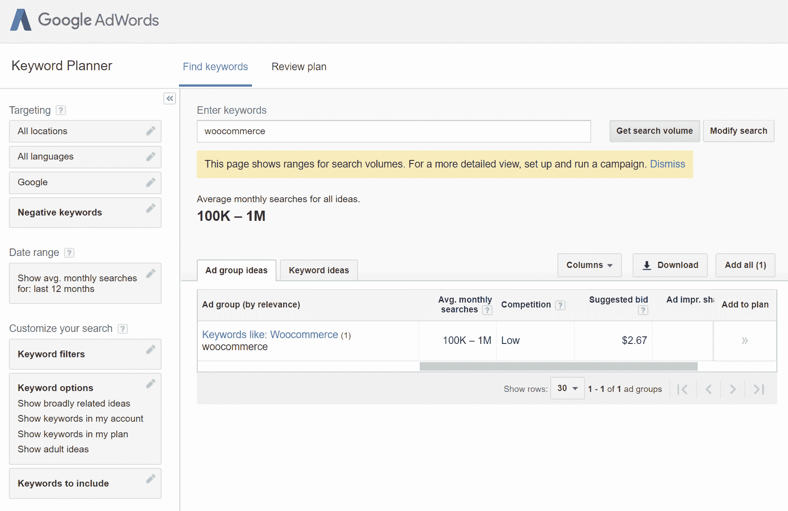](https://adwords.google.com/home/tools/keyword-planner/)

Google Keyword Planner SEO tool.

主要问题是，它依赖于平均值，而不是硬趋势。然而，你可以将它与 Google Trends 配对，找到正确的关键词，然后测试它们的表现。但是，如果您需要更准确的数据，我们建议您使用高级工具。

#### 为什么我们喜欢这个搜索引擎优化工具

*   希望对当地企业和产品进行排名的公司应该对地理工具感兴趣。
*   这是 WordPress 最好的搜索引擎优化插件之一，因为你不需要集成任何东西，而且很容易与其他工具交叉引用数据。
*   谷歌关键词规划器是来自谷歌的人，所以你正在利用一个系统，直接涉及最流行的搜索引擎。
*   你不用花一毛钱就可以使用谷歌关键词规划器。
*   如果你计划用你的关键词发布谷歌广告，谷歌关键词计划器可以让你上传关键词列表来预测你的活动。

### 7.Moz 开放站点浏览器和专业版

Moz 最出名的是它对域权限指标的使用。由于 Google 已经停止更新 PageRank，许多 SEO 利用其他指标，如 Moz 的域权限和 Ahrefs 的域评级，来快速判断一个网站在 SEO 方面有多强大。

Moz Open Site Explorer 在很大程度上是免费的，但受到不升级就能看到的数据量的限制。例如，搜索您自己的网站会出现一个列表，并对入站链接、热门页面、链接域名等进行分析。您可以运行垃圾邮件分析来保护您的网站，并根据您和您的竞争对手的行为来寻找链接机会。Moz 还有一个锚文本区，在这里你可以了解网站可能会对哪些关键词进行排名。

[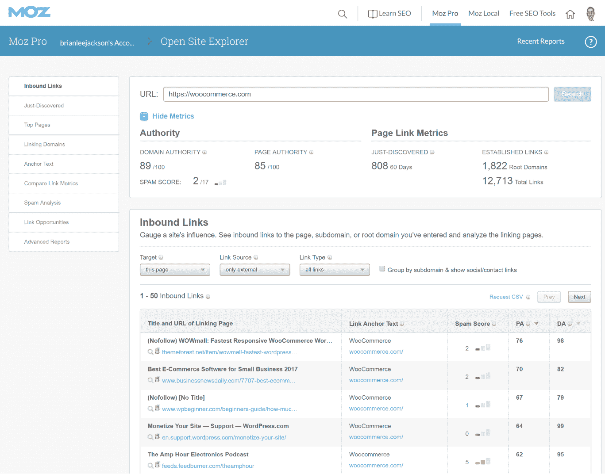](https://moz.com/researchtools/ose/)

Moz Open Site Explorer tool

如果你想要额外的数据和工具，你可以升级到 Moz Pro，每月 149 美元起。这显然是昂贵的一面，但该套件是相当令人印象深刻的，对刚刚开始与搜索引擎优化的初学者来说很棒。他们在高级版中也有类似的工具，比如他们的[关键词浏览器工具](https://moz.com/explorer)。

[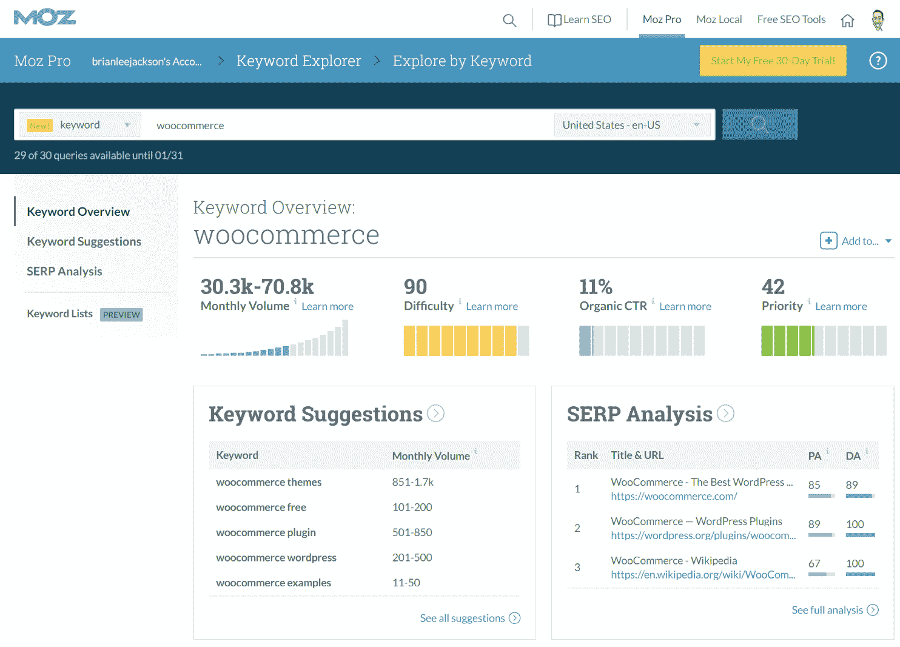](https://moz.com/explorer)

Moz Pro SEO tool

你肯定会说 Moz 拥有你所期望的 SEO 工具的最重要的特性。从域名分析到站外 SEO，从竞争对手分析到关键词追踪，很难发现有什么问题。

#### 为什么我们喜欢这个搜索引擎优化工具

*   如果你拥有一家本地企业，Moz Local 也是一个选择。
*   免费的 Moz 工具提供了广泛的 SEO 工具。
*   你也可以利用他们免费的 MozBar 扩展在浏览网站时快速查看工具栏中的域名权限。
*   尽管许多人认为这个界面很笨重，但它在提供竞争对手数据和技术搜索引擎优化分析方面表现出色。

### 8.地震

SEOquake 采用了一种完全不同的 SEO 方法，因为大部分工作是通过 Chrome 扩展完成的。这样，您可以导航到一个页面并进行页面上的 SEO 审计，而无需任何复杂的仪表板。您还可以在比较 URL 和域名的同时，实时检查外部和内部链接。

[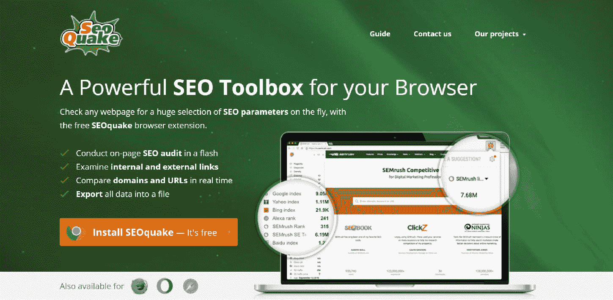](https://www.seoquake.com/index.html)

SEOquake tool

此外，SEOquake 将所有这些有价值的数据导出到一个文件中，供您放入不同的程序或发送给同事。最初你可能会认为一个简单的 Chrome 扩展不足以满足你的 SEO 需求，但是这个小小的 SEO 插件包含的信息量令人印象深刻。例如，您可以看到 URL、标题、服务器和元描述。查看社交活动和 Alexa Pagerank 也很不错。

SEOquake data

#### 为什么我们喜欢这个搜索引擎优化工具

*   SEOquake 工具是一个简单的 Chrome 扩展，完全免费。然而，如果你想要一些额外的数据，你可能需要一个 Semrush 帐户。
*   这是快速获取 SEO 信息的最简单的方法之一，不需要笨重的仪表板。
*   你也可以选择安装 SEOquake [Firefox 扩展](https://kinsta.com/blog/firefox-extensions/)。
*   可以打印和导出 SEO 数据。

### 9.复制景观

不幸的是，在我们生活的这个时代，如果你制作了高质量的内容，总会有人为了自己的利益而试图抄袭。在金斯塔，这种事经常发生在我们身上。事实上，在撰写本文时，我们有 4 起 [DMCA 投诉](https://kinsta.com/blog/dmca-takedown-notice/)和案件未结。不确定是否有人抄袭了你的内容？这就是 [Copyscape](http://copyscape.com/) 工具的用武之地。

Copyscape 本质上是扫描网页，并检查是否有相似的网页。它以百分比匹配为基础，比如有人逐字复制你 80%的内容，或者 50%的部分匹配，等等。虽然谷歌在重复内容问题和原创内容排名方面非常聪明，但你不应该让别人来抢你的功劳。

[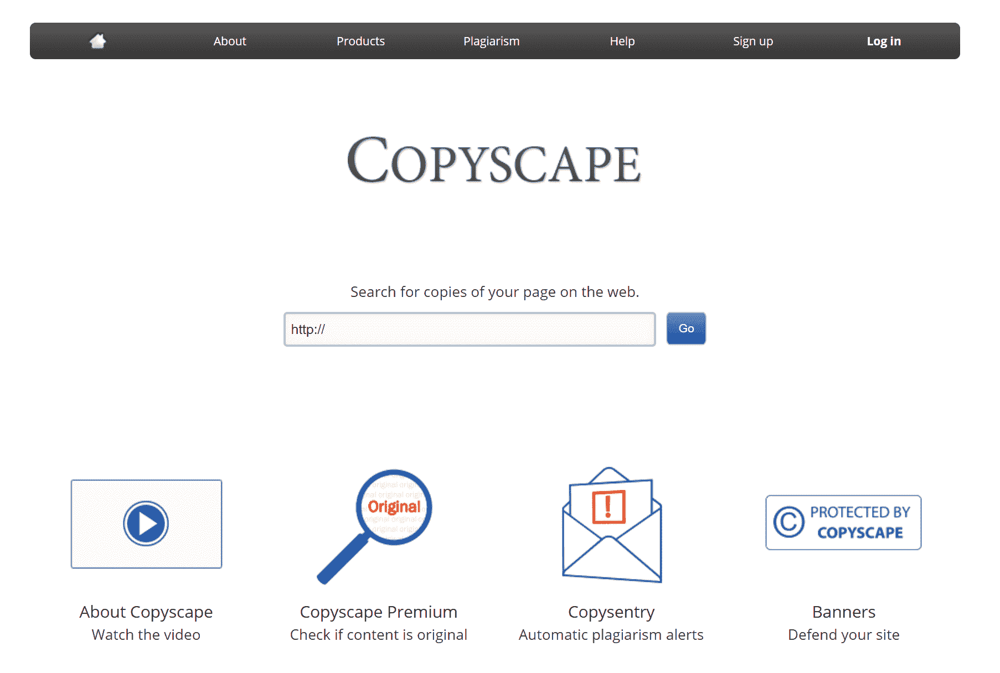](http://copyscape.com/)

Copyscape SEO tool

免费版对于定期检查非常有用，但是你也可以付费购买高级版，定期监控你的网站。

#### 为什么我们喜欢这个搜索引擎优化工具

*   如果你真的想保护你的站点，你可以让 Copyscape 扫描你的站点地图文件，如果它在网上找到你的内容的副本，它会自动通知你。
*   Copyscape 自 2007 年以来一直存在，是迄今为止检测网络抄袭的最佳工具。
*   易于使用，即使是初学者。复制并粘贴你的内容或网址，它会在几秒钟内对整个网站进行检查。

### 10.关键词无处不在

有很多工具，你可以用来做关键字研究。Google Keyword Planner 或 Ahrefs 等服务会返回比你想象的更多的关于关键词建议的信息。

但是，您可能要查找关于特定搜索词的数据。这就是到处都有的[关键词的地方。](https://keywordseverywhere.com/)

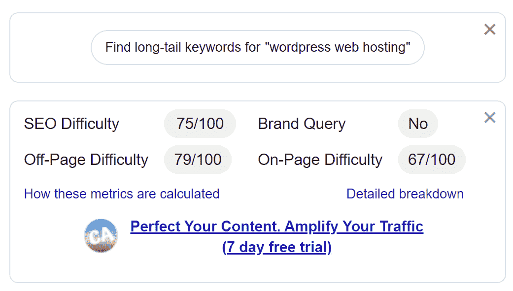

关键词随处可见

有了这个 Chrome/Firefox 扩展，你就可以访问你在谷歌上运行的每次搜索的数据。除了常规搜索结果之外，您还会看到关键词难度、历史搜索数据、相关关键词的建议等等。

免费版可以在谷歌和必应上运行，它能让你访问大量数据。如果您选择为高级版本付费，您将获得更多深入的数据和对其他平台的支持，包括 YouTube、Amazon 等。

#### 为什么我们喜欢这个搜索引擎优化工具

*   Keywords Everywhere 易于设置，因此您可以立即访问关键字数据。
*   用谷歌或必应搜索任何一个词，你都会得到大量信息。
*   您可以使用该工具快速查找您感兴趣的关键词，并评估它们的难度，而使用关键字规划器等工具可能会更加耗时。
*   Keywords Everywhere 会为您查找的任何搜索词返回几个相关的关键字建议(假设有足够的可用数据)。

### 11.相似网络

如果你花很多时间看竞争对手的网站，你会喜欢这个 Chrome 扩展。Similarweb 使您能够查找您访问的任何网站的 SEO 指标，包括全球排名、一段时间内的访问者、跳出率、平均访问持续时间等等。

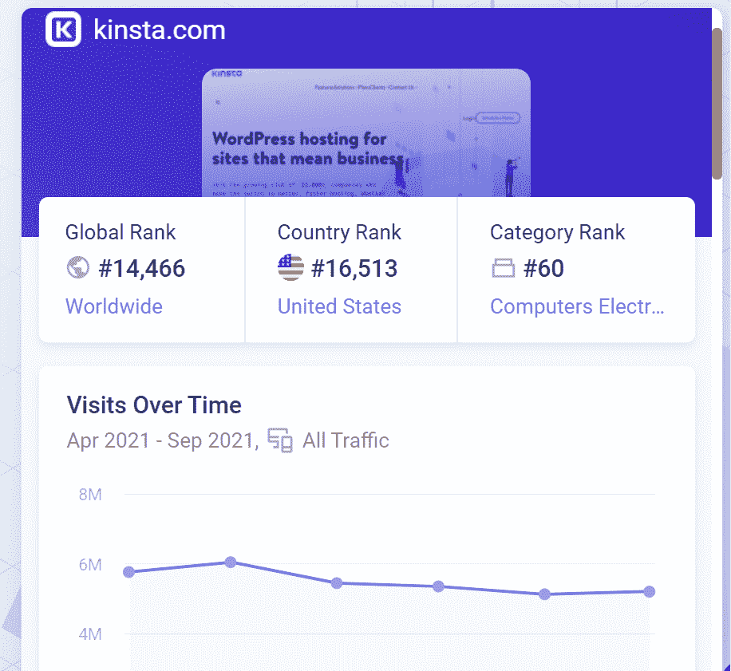

使用 Similarweb 扩展

通过免费扩展，Similarweb 可以让你访问你访问的任何网站的大量数据。要使用它，你只需在浏览网站时点击该扩展的图标，它就会打开一个标签，显示你正在寻找的信息。

使用 Similarweb 的另一个好处是，该扩展为您提供了任何站点的顶级流量来源的信息。您可以使用它来确定给定页面的大部分流量是否来自搜索引擎、直接点击、推荐、社交媒体、电子邮件链接或显示广告。一目了然，这些信息可以告诉你哪些流量来源最适合你的竞争对手，并帮助你决定是否需要重新思考你的战略。

#### 为什么我们喜欢这个搜索引擎优化工具

*   Similarweb 使你能够快速查找你感兴趣的任何页面的 SEO 信息。
*   您可以访问总体流量、月访问量、跳出率、平均网站停留时间等数据。
*   这个扩展向你展示了访问者在寻找什么。
*   你可以查找任何网站的流量来源。

### 12.BuzzSumo

BuzzSumo 是一个强大的工具，可以帮助你发现关键词、热门话题以及用户在网上问的问题。该平台还包括一套社交媒体工具，使您能够识别任何给定主题的顶级影响者，并获得他们的联系信息。

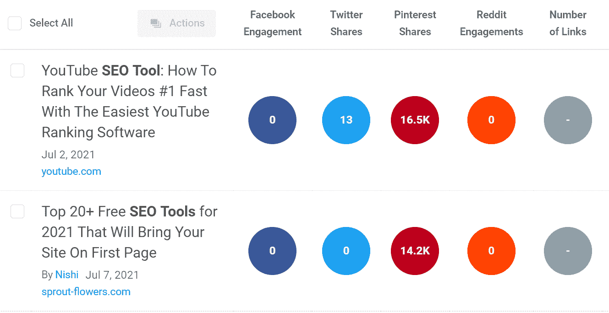

BuzzSumo。

使用 BuzzSumo，您可以确定哪些内容在哪些平台上获得了最多的参与度。当你把这些信息与其他来源的关键词和流量数据放在一起，你就能全面了解是什么让用户愿意分享内容。

BuzzSumo 还可以显示有多少网站链接回特定的帖子和页面。如果你想增加网站的反向链接，分析有很多链接的页面可以帮助你了解你的内容缺失了什么。

#### 为什么我们喜欢这个搜索引擎优化工具

*   BuzzSumo 是一个非常棒的工具，可以用来确定哪些内容在不同的社交媒体平台上表现最好。
*   你可以使用 BuzzSumo 来确定你所在领域的顶级影响者，并与他们联系。
*   这个工具帮助你识别你所在领域的热门话题、关键词和问题。

### 13.关键词洞察

寻找潜在的关键词相对简单。然而，找出哪些关键词是可行的选择完全是另一回事。一些关键词可能竞争太激烈，而另一些可能没有足够的量。此外，并不是每个关键词都适合你的目标地区。

[Keyword Insights](https://www.keywordinsights.ai/) 可以获取这些关键词列表，并告诉你可以在同一页面上搜索哪些关键词。它还会建议你最好用独特的内容瞄准哪些选项。

关键词见解。

简而言之，这个工具可以帮助你将关键词组织成簇。这样，你就可以最大限度地提高每个页面的潜在流量，而不会通过对自身具有更好潜力的搜索词进行分组来蚕食流量。

关键字洞察还可以建议您应该针对每个关键字关注哪些内容。它通过分析每个搜索词的意图来确定用户为什么要寻找这些特定的关键词，从而生成这些数据。

#### 为什么我们喜欢这个搜索引擎优化工具

*   你可以输入关键词洞察列表，它会告诉你如何以及在哪里使用它们。
*   您可以选择将一长串关键字分成几组。
*   您可以分析每个关键字的搜索意图，并获得关于围绕它生成什么内容的建议。

### 14.Ubersuggest

有很多很棒的免费关键词查找工具，但是 [Ubersuggest](https://neilpatel.com/ubersuggest/) 绝对是最棒的。虽然它不能像 Google Keyword Planner 那样为你提供大量的数据，但是这个工具以一种更加用户友好的方式组织信息。

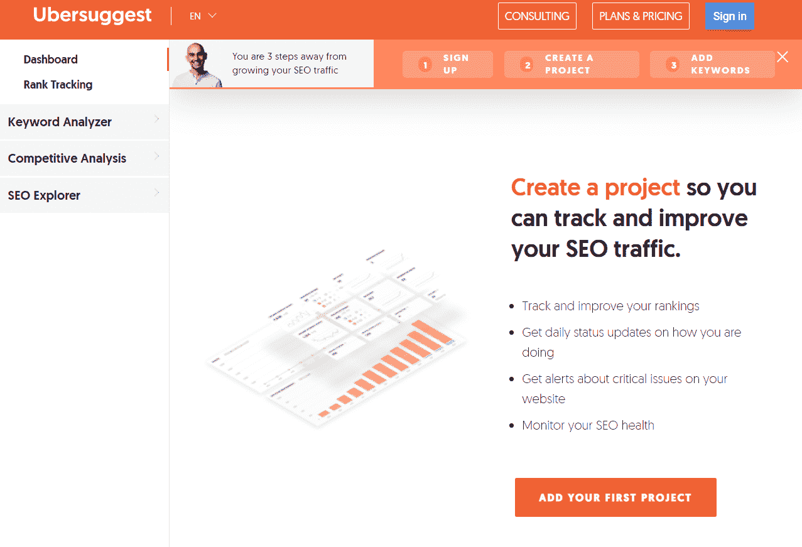

Ubersuggest。

使用 Ubersuggest，您可以分析关键字以确定它们的受欢迎程度、竞争程度，并找到相关的搜索词。该工具还会显示每个关键词的一些排名最好的内容，包括估计流量、反向链接数量和社交分享。

除了关键字数据，Ubersuggest 还可以帮助你分析特定的域名，了解它们的表现。您将获得详细信息，包括流量、关键词排名、热门页面等。

#### 为什么我们喜欢这个搜索引擎优化工具

*   如果你因为关键词研究工具的复杂性而害怕它们，那么 Ubersuggest 以一种更加用户友好的方式打包了所有的信息。
*   您可以使用此工具来研究潜在的关键字，找到最适合它们的内容，并接收相关的搜索词建议。
*   Ubersuggest 让你可以分析竞争对手表现最好的内容。

### 15\. SpyFu

从搜索引擎优化的角度来看，有很多方法可以了解你的竞争对手的网站，了解他们做得有多好。然而，大多数搜索引擎优化工具包括竞争对手分析作为事后的想法。另一方面，间谍软件就是窥视竞争对手的起居室，看看他们在做什么。

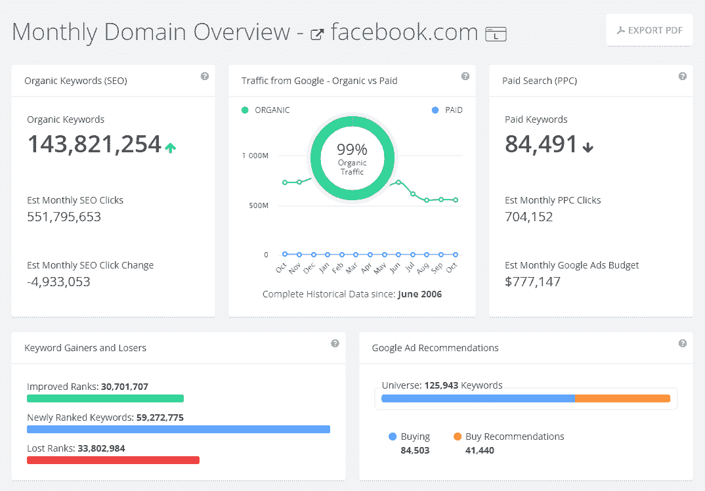

用 SpyFu。

这个工具可以让你输入任何网址，它会返回一个深入的搜索引擎优化概述。你可以查看一个网站有多少流量，是自然流量还是付费流量，最近排名是上升了还是下降了，等等。

有了 Spyfu，你可以看到你的竞争对手之间分享了哪些关键词，以及他们的热门搜索词和页面是什么。该工具甚至显示有机的排名历史图表，其规范涵盖了搜索算法的更新。这将使你能够看到这些变化如何影响他们的有机交通。最棒的是，所有这些信息都在一个单页报告中，因此很容易理解。

#### 为什么我们喜欢这个搜索引擎优化工具

*   研究竞争对手可能非常耗时，但 SpyFu 通过在一份单页报告中列出您需要知道的所有基本 SEO 指标，让这变得很容易。
*   你可以看到你的竞争对手得到了多少流量，是有机的还是付费的。
*   SpyFu 能让你看到任何竞争对手的热门关键词和页面。
*   感谢历史流量和排名图表，你可以看到具体的搜索算法更新如何影响你的竞争对手。

[Want to optimize your content for search engines better... and gain deeper insight into your audience and traffic sources? ✅ Check out these helpful SEO plugins 🔎Click to Tweet](https://twitter.com/intent/tweet?url=https%3A%2F%2Fkinsta.com%2Fblog%2Fbest-seo-plugins-for-wordpress%2F&via=kinsta&text=Want+to+optimize+your+content+for+search+engines+better...+and+gain+deeper+insight+into+your+audience+and+traffic+sources%3F+%E2%9C%85+Check+out+these+helpful+SEO+plugins+%F0%9F%94%8E&hashtags=SEO%2CSEOTips)

## 摘要

当你没有合适的工具时，搜索引擎优化看起来很乏味和复杂。然而，当你找到最好的 best WordPress 插件，并花些时间学习如何使用它们时，像关键字规划、竞争对手分析和报告这样的任务将变得轻而易举。

这个列表涵盖了相当多，但一些公司有不同的 SEO 需求。因此，基于我们对 WordPress 最佳 SEO 插件和工具的研究，这里是我们的最终建议:

*   **分别优化页面和帖子的最佳 SEO 插件**–Yoast SEO，SEO 框架，排名数学
*   **最好的一体化 SEO 工具**——Ahrefs、Semrush
*   **最好的不带广告的白标 SEO 插件**——SEO press
*   最好的轻量级 SEO 插件——Slim SEO
*   **最人性化的 SEO 插件**–smart crawl
*   对于预算有限的人来说最好的搜索引擎优化工具——KWFinder、Keywords Everywhere 和 Google Keyword Planner
*   **最好的 SEO 插件和工具**——断链检查器、Copyscape 和 BuzzSumo

如果你有任何关于寻找最好的 WordPress SEO 插件或工具的问题，欢迎在下面的部分发表评论！

**查看我们关于 SEO 流量增长的视频:**

* * *

让你所有的[应用程序](https://kinsta.com/application-hosting/)、[数据库](https://kinsta.com/database-hosting/)和 [WordPress 网站](https://kinsta.com/wordpress-hosting/)在线并在一个屋檐下。我们功能丰富的高性能云平台包括:

*   在 MyKinsta 仪表盘中轻松设置和管理
*   24/7 专家支持
*   最好的谷歌云平台硬件和网络，由 Kubernetes 提供最大的可扩展性
*   面向速度和安全性的企业级 Cloudflare 集成
*   全球受众覆盖全球多达 35 个数据中心和 275 多个 pop

在第一个月使用托管的[应用程序或托管](https://kinsta.com/application-hosting/)的[数据库，您可以享受 20 美元的优惠，亲自测试一下。探索我们的](https://kinsta.com/database-hosting/)[计划](https://kinsta.com/plans/)或[与销售人员交谈](https://kinsta.com/contact-us/)以找到最适合您的方式。