# 如何从 Squarespace 迁移到 WordPress (7 个步骤)

> 原文：<https://kinsta.com/blog/squarespace-to-wordpress/>

Squarespace 是一个直观的平台，可以轻松创建简单的网站和在线商店。但是，它的功能有限。所以，你可能在寻找一个更灵活的解决方案，[比如 WordPress](https://kinsta.com/blog/why-use-wordpress/) 。

从 [Squarespace 迁移到 WordPress](https://kinsta.com/blog/squarespace-vs-wordpress/) 可以帮助你的网站更上一层楼。有了 WordPress，你可以用几十种方式定制你的内容，使用页面生成器插件和[块编辑器](https://kinsta.com/blog/gutenberg-wordpress-editor/)。最重要的是，你不需要支付[使用内容管理系统(CMS)](https://kinsta.com/knowledgebase/what-is-wordpress/) 或解锁附加功能。

在这篇文章中，我们将告诉你在开始从 Squarespace 迁移到 WordPress 之前你需要知道的事情。然后，我们会一步一步地引导你完成这个过程。

我们开始吧！

T3】

### 查看我们的视频指南从 Squarespace 迁移到 WordPress


## 为什么从 Squarespace 转移到 WordPress

如果你正在做你的第一个网站，并且你不确定主机如何工作或者如何把所有的东西放在一起，Squarespace 是一个很好的选择。有了 Squarespace，你可以将托管、页面构建功能和营销工具捆绑到一个平台上。

这样做的问题是你被束缚在使用 Squarespace 上。如果你想获得更好的功能，你需要支付更昂贵的计划。


> Kinsta 把我宠坏了，所以我现在要求每个供应商都提供这样的服务。我们还试图通过我们的 SaaS 工具支持达到这一水平。
> 
> <footer class="wp-block-kinsta-client-quote__footer">
> 
> 
> 
> <cite class="wp-block-kinsta-client-quote__cite">Suganthan Mohanadasan from @Suganthanmn</cite></footer>

[View plans](https://kinsta.com/plans/)

最贵的 Squarespace 计划[每月花费 40 美元](https://squarespace.com/pricing)，你可以使用诸如销售订阅、提供折扣和高级运输功能等功能。同样的价格，你可以支付一个顶级的托管 WordPress 托管计划，并使用免费插件来访问所有这些相同的功能。当你完成时，你甚至可能还有剩余的钱。

## 从 Squarespace 迁移到 WordPress 之前需要考虑的事情

即使你使用的是[迁移插件](https://kinsta.com/blog/wordpress-migration-plugins/)，移动一个网站也会很耗时。迁移过程本身通常不需要很长时间。然而，在这一进程开始之前，需要做一些准备工作。我们来看看主要的。

### 寻找 WordPress 网络主机

使用 WordPress 的最大好处之一就是你可以自由选择任何你想要的网络主机。CMS 与你能找到的任何托管计划和提供商合作。然而，如果你把搜索的重点放在 WordPress 友好的网络主机上，你会轻松很多。

就我们而言，[托管 WordPress 主机](https://kinsta.com/blog/managed-wordpress-hosting/)是大多数网站的发展方向。有了托管服务，你就可以让[专注于发展你的网站](https://kinsta.com/ebooks/wordpress/managed-wordpress-hosting/)和发布内容，而你的网络主机则负责优化、保护你的网站和备份任务。

Kinsta 提供了广泛的托管 WordPress 托管计划，以适应不同的预算。对于每一项计划，您都可以访问相同的高性能服务器，以及一系列使您能够专注于运营网站的功能，包括:

*   全天候支持和恶意软件删除服务
*   自动备份
*   免费的 SSL 证书和设置
*   自动[内容分发网络](https://kinsta.com/blog/wordpress-cdn/)集成
*   [暂存功能](https://kinsta.com/blog/wordpress-staging-site/)
*   与我们免费的本地 WordPress 开发工具 [DevKinsta](https://kinsta.com/devkinsta/) 集成

有很多优秀的 WordPress web 主机可供你选择。我们建议你不要满足于你能找到的最便宜的托管计划。相反，在你注册一个计划之前，花点时间看看评论，看看一些[最好的虚拟主机](https://kinsta.com/kinsta-alternatives/)能提供什么。

如果您注册了 Kinsta 计划，您可以受益于我们的[迁移服务](https://kinsta.com/wordpress-migration/)。我们在迁移过程中提供帮助，根据你来自哪个平台，我们的 WordPress 专家可以为你完成整个迁移。
T3】

### 备份您的 Squarespace 数据

需要注意的是，在迁移到 WordPress 的过程中，你的 Squarespace 网站不会受到任何影响或消失。这意味着在开始“移动”网站之前，您不需要备份网站。

无论如何，Squarespace 不提供常规的备份功能。这个平台不能让你创建网站的完整副本，万一出了问题，你只需点击几下就可以恢复。

Squarespace 允许你导出你的网站数据，这是一种备份。我们将在迁移到 WordPress 的过程中使用导出的数据，所以让我们直接进入主题。

[想要更大的创作弹性？Squarespace ➡️ WordPress 的一个转变可能是答案... 点击推文](https://twitter.com/intent/tweet?url=https%3A%2F%2Fkinsta.com%2Fblog%2Fsquarespace-to-wordpress%2F&via=kinsta&text=Want+more+flexibility+to+create%3F+A+switch+from+Squarespace+%E2%9E%A1%EF%B8%8F+WordPress+could+be+the+answer...&hashtags=Squarespace%2CWordPress)

## 如何从 Squarespace 迁移到 WordPress (7 个步骤)

从 Squarespace 迁移到 WordPress 需要导出前者的所有内容，然后导入后者。这个过程比你想象的要简单，但是在我们开始之前，你需要安装 WordPress。

### 步骤 1:安装 WordPress

现在你有了一个网站主机和一个计划，是时候安装 WordPress 了。当你创建一个新网站时，一些托管的 WordPress 主机会给你提供自动安装 CMS 的选项:


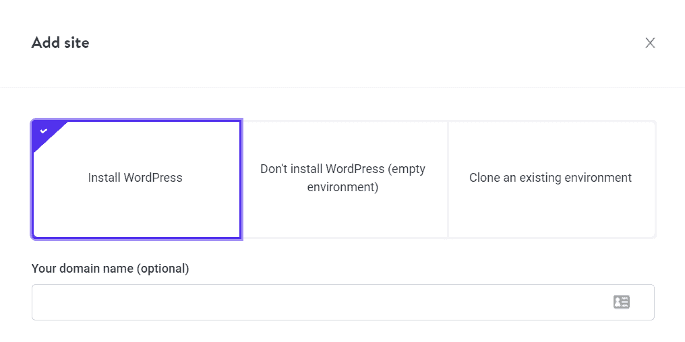

在 MyKinsta 中安装 WordPress。


如果你的主机不提供这个功能，还有其他的选择。一些主机控制面板，如 cPanel，包括内置的软件安装程序，有几十个选项。

例如，Softaculous 可以让你在几分钟内建立一个 WordPress 网站:


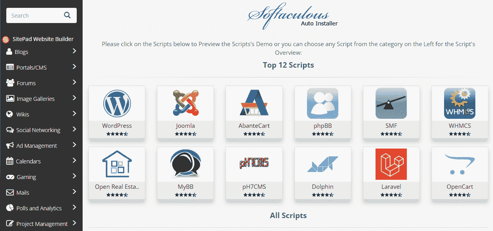

心软。


你也可以手动安装 WordPress，这比听起来容易得多。整个 CMS 可以在 WordPress.org 下载。你可以将 WordPress 文件上传到你的服务器上，然后运行[“五分钟”WordPress 安装程序](https://kinsta.com/knowledgebase/manually-install-wordpress/)，它会引导你完成整个过程。

### 第二步:从 Squarespace 导出你的网站内容

Squarespace 允许你将网站的大部分内容导出到一个 XML 文件中，但不是全部内容。以下是该平台允许您带给新主机的内容:

*   页面和帖子(以及站点的主博客页面)
*   图库页面
*   文本和嵌入块

总的来说，Squarespace 使您能够导出站点的大部分内容。然而，如果你正在使用 Squarespace 经营一家网上商店，你可能就没那么幸运了。这是因为该平台的导出文件不包括产品页面、图像、音频或视频文件，或者您网站上的任何自定义 CSS。

要将这类内容转移到 WordPress，你需要手动复制/粘贴或者从头开始。同样，将 Squarespace 图片导入 WordPress 也是一件苦差事，需要使用插件。

现在，让我们继续导出 Squarespace 允许您下载的内容。为此，请访问您网站的仪表盘，进入**设置>高级>导入/导出**。你会在右边看到你的网站的预览，在左边看到一个菜单，其中包括一个写着**导出**的选项:


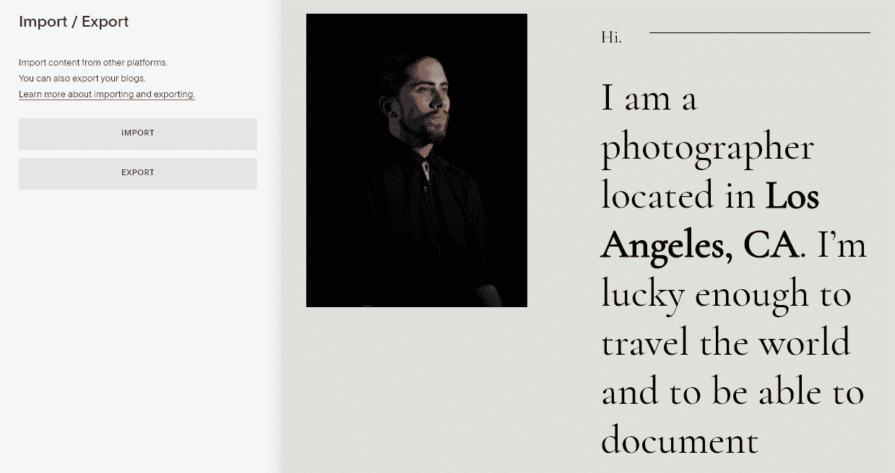

从 Squarespace 导出内容。


点击**导出，**，Squarespace 会显示一个选项，将你的文章和页面导出到 WordPress。继续并选择 WordPress 图标:


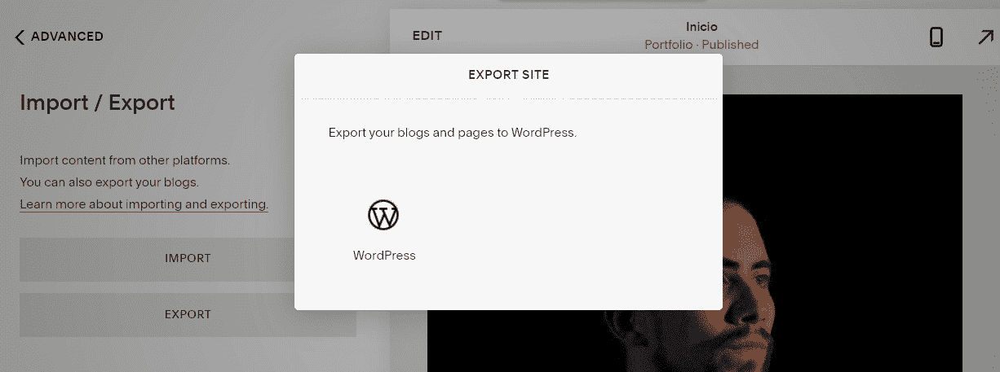

导出到 WordPress 图标。


Squarespace 需要一分钟时间来准备您的站点以便导出。当 XML 文件准备就绪时，下载它的选项将出现在左侧的菜单中:


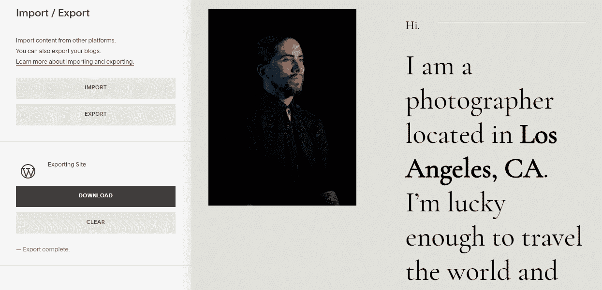

下载 XML 文件。


将该文件保存到您的计算机上，并记下您保存它的位置。这个文件使得从 Squarespace 迁移到 WordPress 成为可能，下一步您将需要它。

### 步骤 3:将你的 Squarespace 内容导入 WordPress

WordPress 提供了大量的工具，可以让你将不同类型的内容导入到平台中。尽管 WordPress 中没有专门的 Squarespace 导入工具，但 CMS 可以导入 XML 格式的内容。

进入你的 WordPress 仪表盘，跳转到**工具>导入**来访问这个特性。在页面底部寻找 **WordPress** 选项，点击**立即安装**:


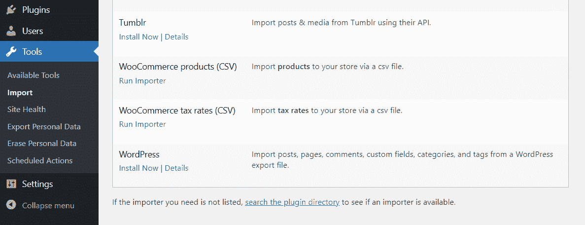

寻找 WordPress 选项。


如果已经设置了 WordPress 导入工具，你会看到**运行导入器**选项。点击它，WordPress 会要求你选择一个 XML 文件来上传:

## 注册订阅时事通讯


### 想知道我们是怎么让流量增长超过 1000%的吗？

加入 20，000 多名获得我们每周时事通讯和内部消息的人的行列吧！

[Subscribe Now](#newsletter)


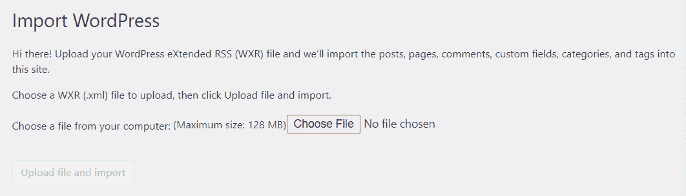

运行导入工具。


选择您在上一步中下载的文件，点击**上传文件并导入**。现在你可以在 WordPress 中将你想从 Squarespace 导入的文章和页面分配给一个新的或现有的作者:


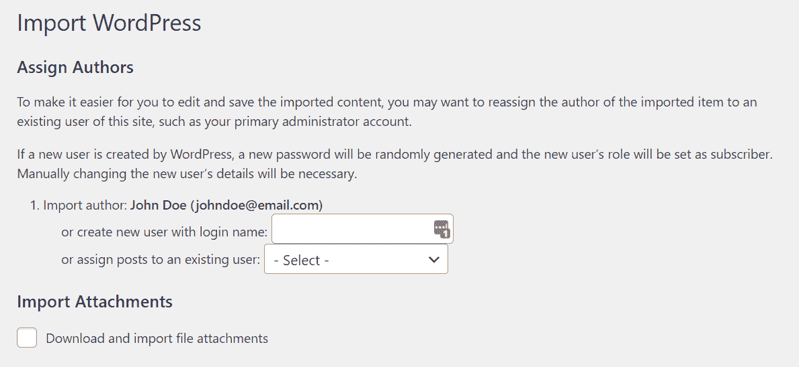

在 WordPress 中分配作者。


你还会看到一个将附件从 Squarespace 导入 WordPress 的选项。启用该选项并点击**提交。**根据您导入的数据量，此过程可能需要一段时间。完成后，您会看到一条成功消息。

你现在可以通过导航到**帖子**或**页面**标签来检查所有导入的内容。正如我们之前提到的，Squarespace 导出文件不能让你将图片导入 WordPress。为此，我们需要使用一个插件。

### 步骤 4:从 Squarespace 导入图像

一个网站不是没有图片，除非你还生活在 90 年代。将你的 Squarespace 图片放入 WordPress 的一个方法是下载所有图片，将每个文件上传到你的新网站，然后将它们一个一个地放入你的内容中。然而，*没有人*有时间做所有这些，除非你只是导入几页。

自然，一些插件可以自动导入 Squarespace 图片到 WordPress。我们最喜欢的工作叫做[自动上传图片](https://wordpress.org/plugins/auto-upload-images/):


自动上传图片。


这个插件在你的文章和页面中寻找图片网址。然后，它自动获取这些网址，下载图片，并上传到 WordPress，替换原来的网址。

当你将 Squarespace 数据导入 WordPress 时，CMS 不会自动上传图片。然而，它*确实*导入了原始的 Squarespace 图像 URL，这意味着这个插件非常适合您的需求。

首先，安装并激活插件，然后转到仪表板中的**帖子>所有帖子**。选择靠近屏幕顶部的**屏幕选项**菜单，并将**每页条目数**选项更新为一个数字，该数字将在一页上显示你所有的 WordPress 文章。然后，点击**应用**:


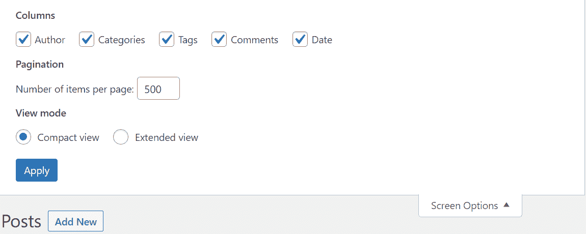

一次更新所有帖子。


这样，你可以一次更新你所有的 WordPress 文章，这将使插件能够一次性导入所有的图片。

现在，选择你网站上的所有帖子，打开**批量操作**菜单，点击**编辑**:


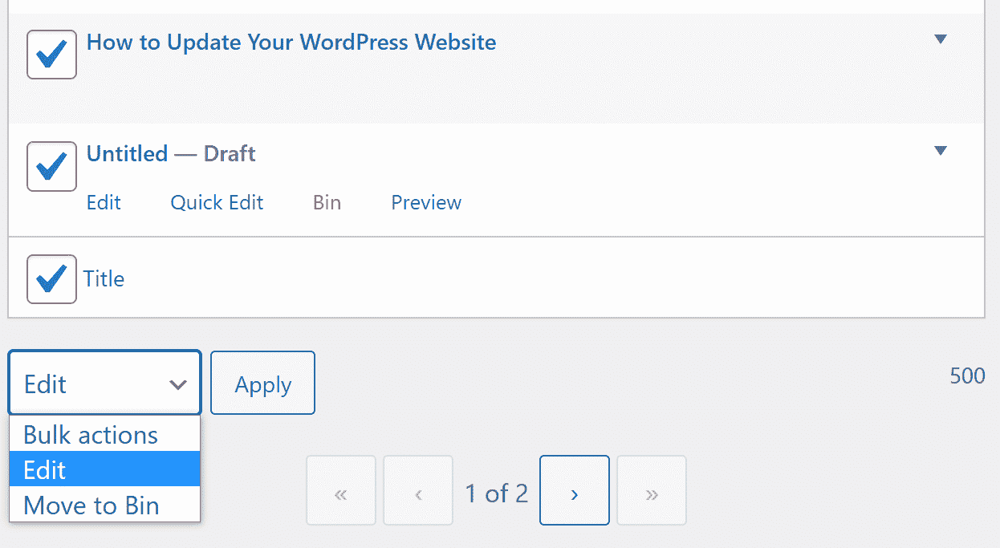

选择【编辑】下的批量操作。


将出现一个菜单，显示您现有帖子的批量编辑选项。点击**更新**而不选择任何选项，等待页面重新加载。

所有的 Kinsta 托管计划都包括来自我们资深 WordPress 开发者和工程师的 24/7 支持。与支持我们财富 500 强客户的同一个团队聊天。查看我们的计划！

当你点击**更新**时，你可能会遇到的一个问题是页面需要*很长的*时间来重新加载或更新。这是因为 WordPress 会导入你的网站丢失的 Squarespace 图片，并更新每篇文章。如果你使用的是慢速网络主机，这个过程会导致 WordPress 超时:


你可能会得到超时警告。


如果发生这种情况，你需要小批量更新帖子，而不是一次上传所有帖子的图片。你一次可以处理的文章数量很大程度上取决于你的主机服务。

记住，你还需要为你的 WordPress 页面重复整个过程。之后，你所有的 Squarespace 内容都应该出现在 WordPress 中，没有一张图片丢失。

### 第五步:将你的域名指向 WordPress

目前，你用于网站的域名仍然指向 Squarespace 的[域名服务器](https://kinsta.com/knowledgebase/what-is-a-nameserver/)。不用[为你的 WordPress 网站注册一个新域名](https://kinsta.com/help/technical-faq/#do-you-offer-domain-registration)，你可以更新你现有的域名。这样，当访问者输入域名时，他们就会出现在你的新网站上。

更新域设置的过程会有所不同，这取决于您在哪里注册了该域。例如，如果你[使用了一个域名注册商](https://kinsta.com/blog/best-domain-registrar/)，你需要登录你的账户来管理它的 DNS 设置(告诉它指向的域名的信息):


管理 DNS。


一些 web 主机允许您通过它们的控制面板注册和管理域。在这种情况下，你需要访问面板来更新 DNS 记录，并将域名指向你的新 WordPress 网站。

如果你正在使用 Kinsta，你可以使用 MyKinsta 将域名指向你的网站。这个过程适用于使用和不使用 Kinsta Cloudflare CDN 的网站。

### 步骤 6:更新你的 WordPress 永久链接结构

如果你现在打开任何你的 WordPress 帖子或页面，你会注意到它们的 URL 可能是这样的:

```
yourwebsite.com/?p=123
```

这是 WordPress 使用的默认 URL 或[永久链接结构](https://kinsta.com/blog/wordpress-permalinks/)。每个帖子或页面都有一个唯一的 ID，它的 URL 包含这个号码。建议你在网站生命周期的早期就改变永久链接的结构。否则，它会影响您网站的搜索引擎优化(SEO ),并导致重大的技术错误。

要更改您网站的永久链接结构，请在您的仪表板中进入**设置>永久链接**，并选择您想要使用的 URL 类型:


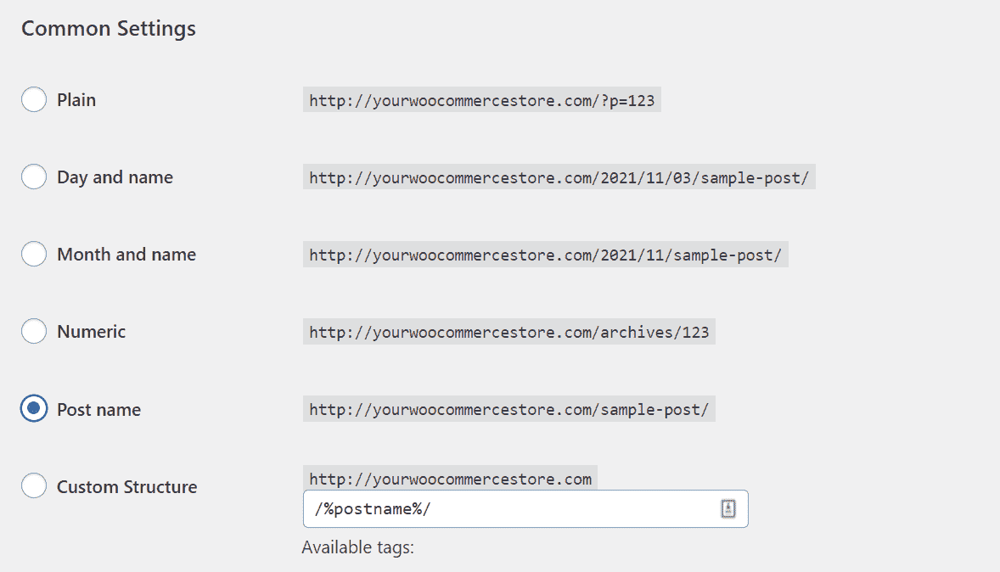

更新永久链接结构。


在我们看来，最好的永久链接结构是**帖子名称**。只要你为网站上的每个帖子和页面设置了一个独特的 slug，那么**帖子名称**结构就会产生你所看到的最短最干净的 URL。

您可以自由选择您喜欢的 permalink 结构，但是我们建议不要使用 **Plain** 选项。当你准备好了，保存你的修改，然后进入最后一步。

### 步骤 7:为你的 WordPress 网站选择一个主题

Squarespace 网站有一个非常精致的外观。当你把 Squarespace 的内容导入 WordPress 时，你可能会觉得它看起来不像你以前的网站那么圆滑。然而，有了正确的主题，你的 WordPress 网站会比 Squarespace 网站看起来更好。

WordPress 在主题方面给了你大量的选择。免费的[WordPress.org 主题库](https://wordpress.org/themes/)是一个开始寻找类似你的旧 Squarespace 网站风格的好地方:


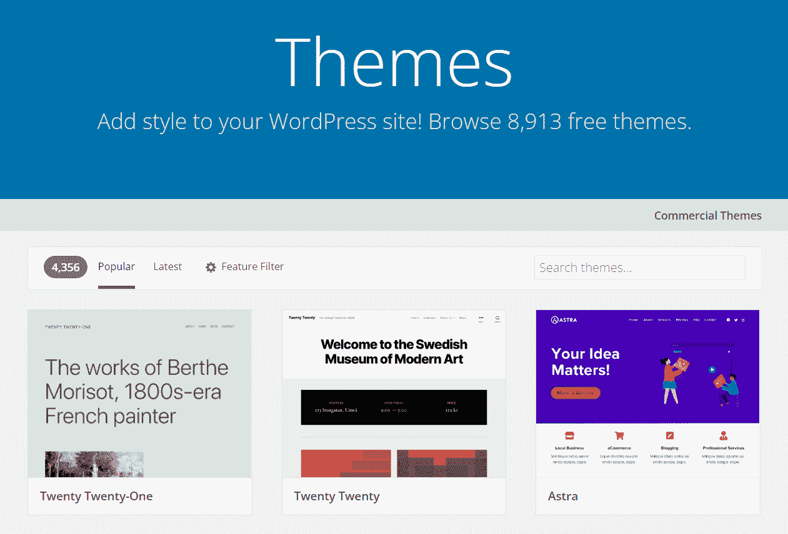

WordPress 主题知识库。


如果你想尝试新的造型，现在是最好的时机。你可以选择任何你想选择的主题，WordPress 会让你的内容适应它。许多[高级 WordPress 主题](https://kinsta.com/blog/wordpress-free-vs-paid-themes/)带有高级功能，如强大的页面生成器和[完全响应的设计](https://kinsta.com/blog/responsive-web-design/)。

WordPress 还让你可以使用直观的[块编辑器](https://wordpress.org/gutenberg/)，使你能够使用可视界面[编辑任何页面](https://kinsta.com/blog/how-to-customize-wordpress-theme/)或帖子的布局和风格。无论你是选择复制旧网站的设计还是重新开始，WordPress 都能为你提供比 Squarespace 更好的体验。

如果你不确定从哪里开始，我们有一个精选的清单，列出了你在 2021 年可以使用的最好的主题。这个列表包括了你能想到的几乎所有类型的网站的选项，所以去看看吧。
T3】

## 从 Squarespace 迁移到 WordPress 后要做什么

如果你来自 Squarespace，WordPress 为你打开了一个无限可能的世界。最激动人心的变化是你现在可以访问插件了。

Squarespace 为其用户提供了一个广泛的扩展库。然而，一旦你安装了 WordPress，这个功能与众多可用选项相比就相形见绌了。给你一个概念，[WordPress.org 插件库](https://wordpress.org/plugins/)有近 60，000 个插件(全部免费):


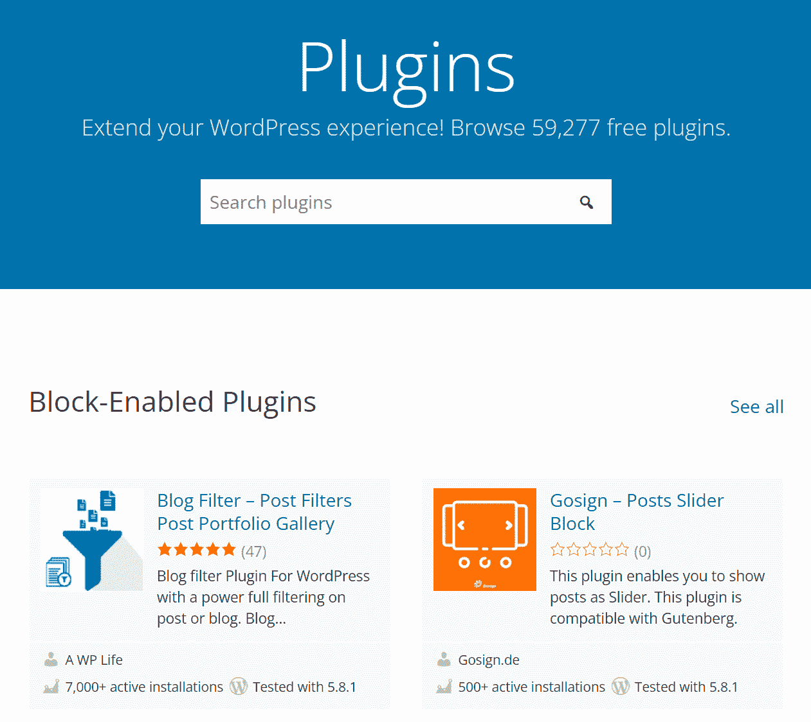

WordPress 插件库。


如果你能想象出一个特性，很有可能会有一个插件(就像自动上传图片一样)。许多 WordPress 新用户最终会花费数小时或数天来尝试新工具，所以这里有一个快速链接，链接到你应该试用的[最佳插件列表](https://kinsta.com/best-wordpress-plugins/)。

不要让 Squarespace 的限制阻碍你的网站🙅‍♀️从这个指南中学习如何安全地将你的内容转移到 WordPress💪

## 摘要

如果你要开始你的第一个网站，Squarespace 是一个合适的选择。然而，WordPress 是世界上[最受欢迎的 CMS](https://kinsta.com/cms-market-share/)([40%的网站](https://kinsta.com/blog/wordpress-statistics/)使用它)是有原因的，那是由于它的灵活性。

WordPress 致力于让你创建任何你想要的网站，以任何你能想象的风格，以任何你需要的功能。从 Squarespace 迁移到 WordPress 只需要几个小时，但你将在未来几年收获回报。

关于如何从 Squarespace 迁移到 WordPress，你有什么问题吗？下面评论区来说说吧！

* * *

让你所有的[应用程序](https://kinsta.com/application-hosting/)、[数据库](https://kinsta.com/database-hosting/)和 [WordPress 网站](https://kinsta.com/wordpress-hosting/)在线并在一个屋檐下。我们功能丰富的高性能云平台包括:

*   在 MyKinsta 仪表盘中轻松设置和管理
*   24/7 专家支持
*   最好的谷歌云平台硬件和网络，由 Kubernetes 提供最大的可扩展性
*   面向速度和安全性的企业级 Cloudflare 集成
*   全球受众覆盖全球多达 35 个数据中心和 275 多个 pop

在第一个月使用托管的[应用程序或托管](https://kinsta.com/application-hosting/)的[数据库，您可以享受 20 美元的优惠，亲自测试一下。探索我们的](https://kinsta.com/database-hosting/)[计划](https://kinsta.com/plans/)或[与销售人员交谈](https://kinsta.com/contact-us/)以找到最适合您的方式。