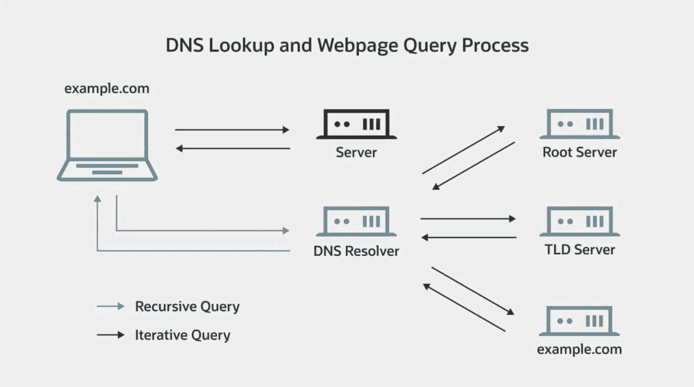
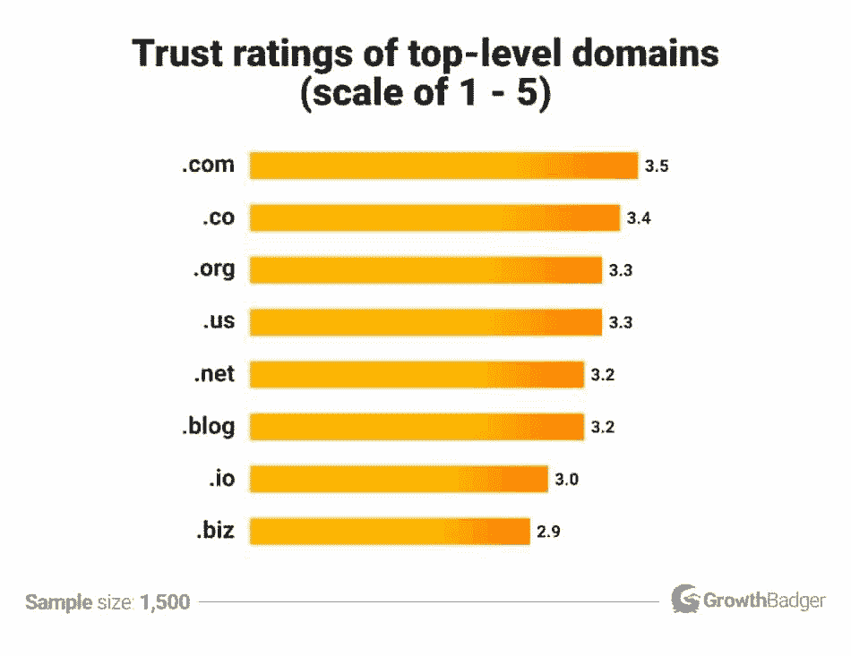
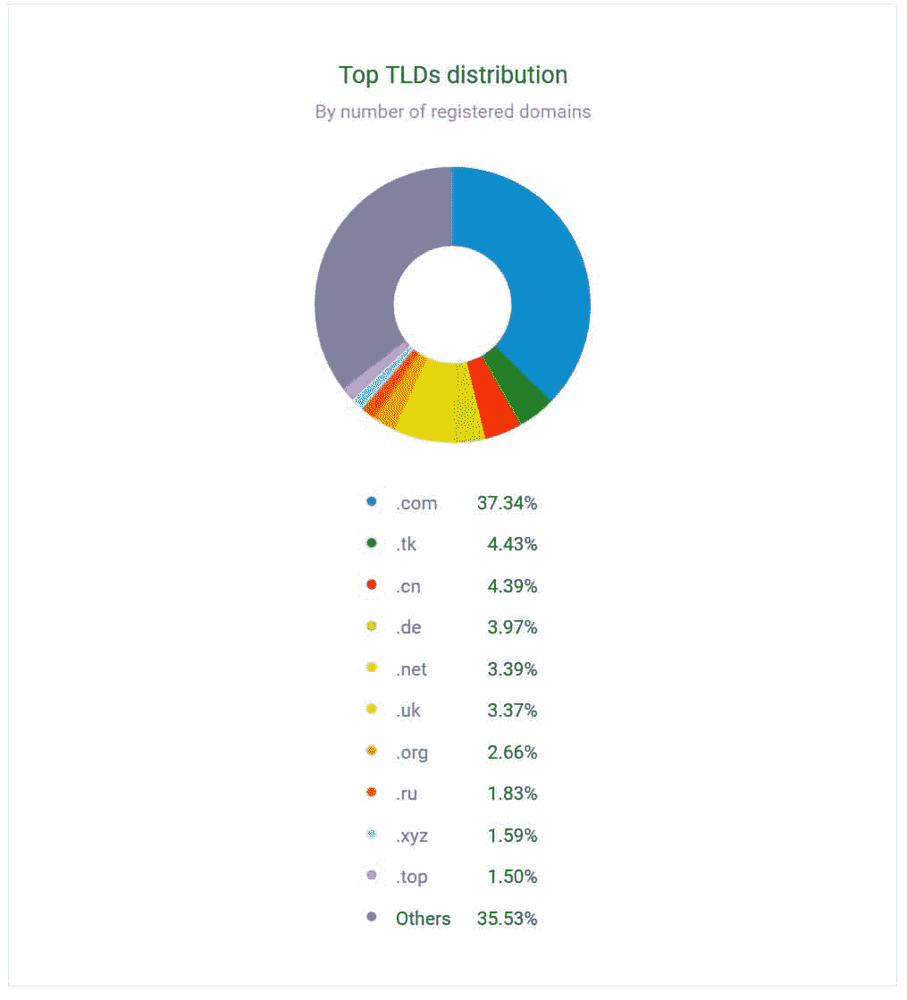
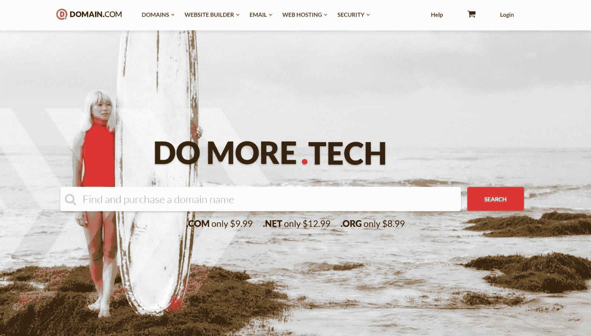
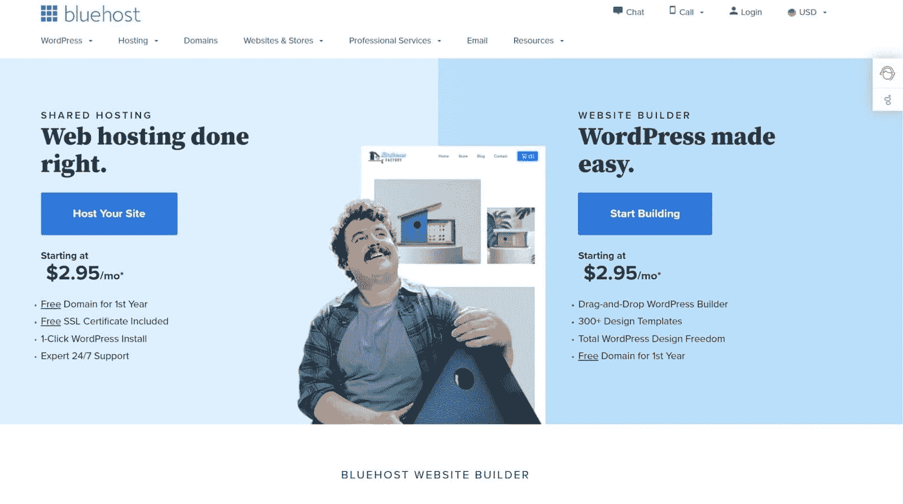
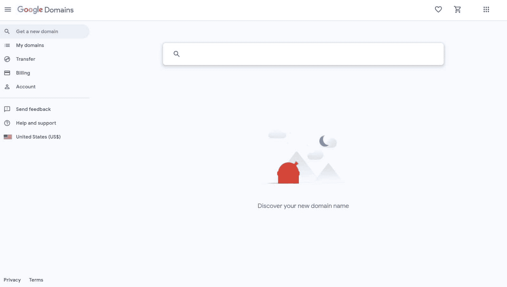
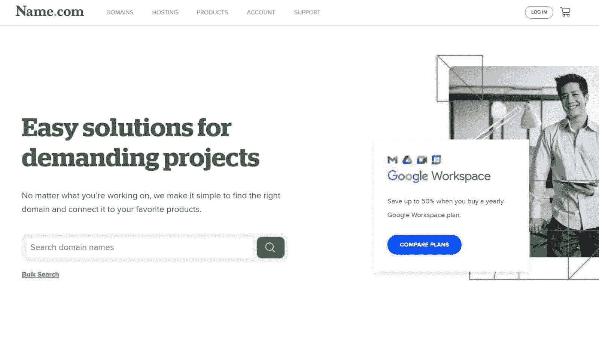
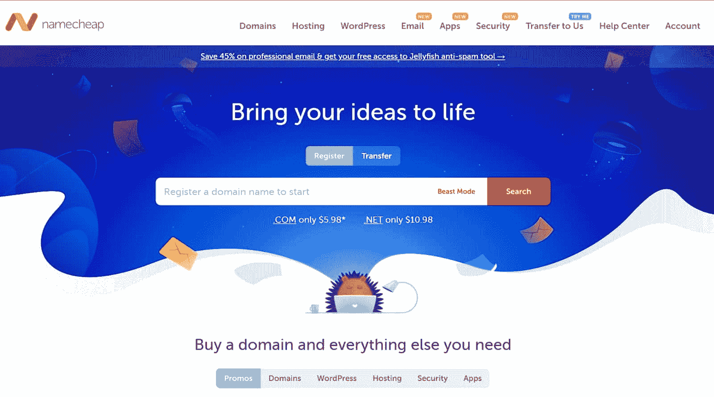
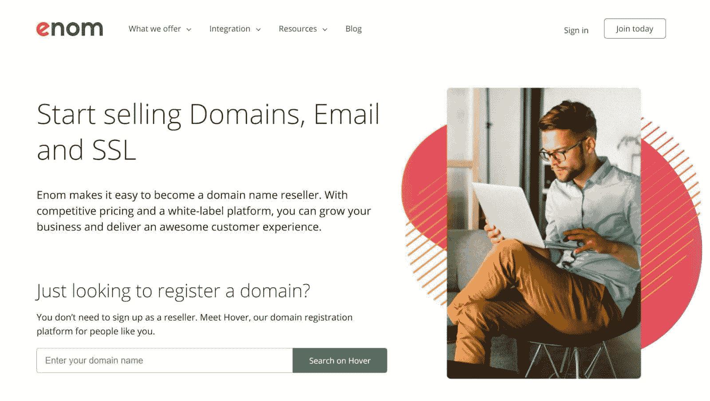

# 如何购买域名:综合指南

> 原文：<https://kinsta.com/blog/how-to-buy-a-domain-name/>

你想知道如何购买域名吗？我们将在本指南中为您详细介绍具体步骤。

无论你是一个即将创建你的第一个网站的新企业主，还是一个拓展到新领域的营销人员，或者只是想为你的爱好建立一个网站，我们都能满足你。

如果你以前从未注册过域名，那么注册域名可能会很棘手。但这出奇的容易——毕竟，有超过 19 亿个[网站](https://www.internetlivestats.com/total-number-of-websites/)在线(截至 2021 年 11 月)。

在本文中，我们将教你如何购买域名，并回顾市场上一些最好的域名注册商(让你购买和注册域名的服务)。

我们走吧。

T3】

## 什么是域名？

域名是人们用来访问你的网站的数字地址。比如我们的域名是“kinsta.com”

你的域名在你的数字生活中扮演着重要的角色。这是一种很容易识别的方式来标记谁运营每个网站。

虽然我们现在每天都在使用域名，但它们并不总是互联网的主要内容。在 1983 年之前，人们通过 IP 地址导航到网站(“191.268.1.43”)。 [IP 地址](https://kinsta.com/blog/static-vs-dynamic-ip/)标记每个联网设备。

由于记住一个 IP 地址很复杂，互联网工程任务组(IETF)在 1983 年引入了[域名系统(DNS)](https://kinsta.com/knowledgebase/what-is-dns/) 。你不需要了解 DNS 如何工作来购买你的域名。

How domain names work. (**Source:** [Oracle](//www.oracle.com/ae/cloud/networking/dns/what-is-dns/%E2%80%9D))

有几个关键短语，你需要了解当你得到你的域名。其中包括:

*   **域名注册商:**注册和管理域名的公司。域名注册商由互联网名称与数字地址分配机构(ICANN)认证。
*   **域检查器:**一个工具，检查谁拥有一个域，以及所有者拥有它多长时间了。最受欢迎的检查程序之一是 T2 ICANN 数据查找 T3。
*   **顶级域名:**域名末尾的后缀(即“ [www.name.tld](http://www.name.tld/) ”)。有四种类型:国家代码顶级域名(如。au 或。美国)、赞助顶级域名(如。政府和。edu)、通用顶级域名(如[)。com 和。org](https://kinsta.com/knowledgebase/org-vs-com/) )和新通用顶级域名(如[)。io](https://kinsta.com/knowledgebase/what-is-io/)

在下面的环形图中，你可以看到每种类型的 TLD 网站的百分比。

Domain distribution by TLD type (**Source:** [Domainnamestat](//domainnamestat.com/statistics/overview%E2%80%9D))

[想知道如何购买域名？💰不要再看了...🤝 点击推文](https://twitter.com/intent/tweet?url=https%3A%2F%2Fkinsta.com%2Fblog%2Fhow-to-buy-a-domain-name%2F&via=kinsta&text=Wondering+how+to+buy+a+domain+name%3F+%F0%9F%92%B0+Look+no+further...+%F0%9F%A4%9D&hashtags=DomainName%2CWordPress)

## 什么时候需要买域名？

根据 Verisign 的数据，接近 2021 年第二季度，有超过[3.67 亿个域名注册](https://www.verisign.com/en_US/domain-names/dnib/index.xhtml)，比去年下降了 0.7%(280 万)。

虽然域名购买正在放缓，但这不应该安抚你。从域名所有者那里购买域名比自己注册要难得多。所以，你应该尽快购买你想要的域名，因为你不想让别人抢注。

如果你对你的域名有一个想法，你已经走在了选择域名的正确道路上。

购买域名时，考虑购买你想要的任何其他名称。其中包括您的以下域名:

*   产品线
*   服务
*   客户支持计划
*   客户忠诚度计划

如果你想在未来使用一个域名，但不是马上，你可以在你的域名上安装一个“即将推出”的页面，带有 WordPress 扩展，比如 [SeedProd](https://wordpress.org/plugins/coming-soon/) 。你也可以[“停放”你的域名](https://kinsta.com/knowledgebase/parked-domain/)。域名停放现象非常普遍，ICANN 估计[目前有 52.95%的域名](https://icannwiki.org/nTLDStats:.wiki/Parked_Domains_Percentage)被停放。

## 如何购买被盗用的域名

想象一下:你有了一个伟大的新商业想法和完美的域名匹配。但是当你在谷歌上输入地址时，你会发现其他人已经拥有了这个域名。

如果你还想要这个域名，你可以从所有者那里购买。以下是方法。

### 第一步:确定所有者，并找到一个经纪人

首先，你需要去网站找到主人的联系方式。一般来说，这里有三种可能的情况:

1.  域名交易者拥有域名。域名交易者是指注册并通过出售域名来赚钱的人。
2.  有人拥有该域名，但他们不使用它或已停放它
3.  有人拥有该域名并正在积极使用它

一旦你弄清楚自己的处境，就该考虑雇佣经纪人了。经纪人会代表你行事，确保卖家不会利用你。一些经纪人从你为域名支付的钱中抽取一定比例的费用，而另一些经纪人则收取固定费用或小时费用。

如果你不知道谁拥有这个域名或者是否有其他人在使用它，你可能需要一个经纪人(因为如果所有者在积极使用这个域名，说服他们出售会更有挑战性)。

### 第二步。表达你的兴趣

接下来，你需要接近域名所有者，表达你对该域名的兴趣。他们可能:

1.  拒绝出售，在这种情况下，你可能需要离开销售，想出另一个域名。
2.  要求报价，这样就可以进行下一步了。

如果它不工作，你需要购买一个不同的域名，不要选择一个相同或相似的域名与另一个 TLD。研究表明人们信任。com，。co 还有。org 域名最多。商业领域最少。

如果你在你的 TLD 和域名上妥协，这可能会长期损害你的品牌。毕竟，你会更信任哪个网站？“r3ta1lbizadvice.io”或“retailbusinessadvice.com？”

A chart showing the most and least trusted TLDs. (**Source:** [GrowthBadger](//growthbadger.com/top-level-domains/%E2%80%9D))

### 第三步。出价

如果域名所有者愿意出售域名，请以书面形式提出正式报价。该报价应包括:

*   你想要的域名
*   你提供的价格
*   您的姓名和联系方式
*   如果卖家接受你的出价，域名将成为你的
*   合同的条款

如果你使用经纪人，他们可能会给你一个报价信模板或执行这一步。

为了获得最佳效果，请确保您:

*   确定一个价格范围，给自己一个上限(一个“走开价格”)
*   出价低于你的承受能力，这样你就可以以物易物了
*   准备还价
*   不要在电话中提出口头提议，而不写下后续行动

域名所有者可能希望与您协商价格和合同条款，直到双方都同意。务必以书面形式确认你的最终价格。

### 第四步。签合同

一旦你和卖家就价格达成一致，你需要签署一份合同来正式完成交易。合同将保护双方，并确保交易对双方都有利。

你还需要为你的域名付费。一些卖家更喜欢:

*   全额预付款
*   签约时的定金和域名转让后的总金额
*   按照经纪人的指示付款

不幸的是，一些域名所有者可能会试图诈骗你的钱。使用[安全支付平台](https://kinsta.com/blog/paypal-alternative/)或托管服务来保护自己。

此外，您可能希望避免使用加密货币支付域名。如果卖家不遵守交易条款，可能很难对加密货币交易提出异议。

### 第五步。将域名转移到你的名下

最后，你需要为你的新域名找到一个 ICANN 认可的注册商，这样你就可以把所有权转移到你的名下。您可以使用旧域名所有者使用的同一个注册商。

虽然许多注册服务商都有自己的内部转让流程，但大多数都要求您确认旧所有者已经向您出售了该域名，并且您是新所有者。然后，注册服务商将处理转让，并在转让完成后通知双方。域名转让过程可能需要 60 天，您可能需要支付一定的费用。

如果旧所有者在不到 60 天前购买了该域名，则该域名可能会变更注册人锁定。你需要等到这段时间过去后才能改变所有权。

## 如何永久购买域名

如果你想要的域名是免费的，保护它是很容易的。我们会一步一步地教你。

### 第一步。选择域名注册商

首先，你需要选择一个 ICANN 认可的注册商来注册你的名字。此注册器与您的 web 主机不同。

您的 DNS 主机通过您的域名将访问者连接到您的网站，而您的网站主机则为您的网站提供空间。你的 DNS 主机就像一本电话簿，而你的网站主机就像你的房东。

选择注册商时，请考虑:

*   **费用结构:**每个注册服务商都有自己的费用体系。域名[的平均费用为每年 10-20 美元](https://kinsta.com/blog/how-much-does-a-domain-name-cost/)(尽管对于备受追捧的顶级域名来说这个价格会更高)。
*   **您的注册商提供的任何附加服务:**这些服务可能包括域名停放和域名隐私。域名隐私(或“Whois 隐私”)在您网站的公开列表中隐藏您的姓名、联系方式和业务详情。
*   **注册商的到期政策:**你需要确认你可以长期保护你的域名。
*   **注册服务商的域名转让政策:**您可能希望以后能够灵活地更换注册服务商或出售您的域名。
*   **注册商是否提供** **[安全套接层(SSL)证书](https://kinsta.com/blog/types-of-ssl-certificates/)** **:** 此数字证书加密您的网站连接，保护访问者。

### 第二步。遵循注册商的结账流程

接下来，使用注册商的工具，看看它是否能卖给你你想要的域名和 TLD。

如果您可以购买您的域名，请选择一个计划，并遵循注册商的结帐流程。一些注册服务商会提供一个基础计划，并附带附加功能，比如与你的域名绑定的[专业电子邮件地址](https://kinsta.com/blog/professional-email-address/)。其他人提供的方法可以根据您的需求进行扩展。

许多注册服务商还会为您提供多个 TLD 作为捆绑交易(如“contacttree.com”、“contacttree.net”和“contacttree.org”)。这些计划是完美的，任何人都担心游客难以找到正确的地址或竞争对手购买域名。

进入结账流程后，您需要向注册服务商提供您的:

*   名字
*   地址
*   组织名称
*   联系方式(电子邮件和电话号码)
*   支付信息

如果你不想你的联系信息被公开，确保你购买了域名隐私。

你也应该仔细检查你的注册期限。许多注册商将允许您一次购买几年的域名，但是如果您以前没有使用过该注册商，您可能希望选择一个较短的计划。

如果您对注册商的速度、安全性、服务或其他方面不满意，选择一个较短的计划将允许您进行转换。

### 第三步。注册您的域名并验证您的所有权

接下来，你需要注册你的域名。您的注册服务商将在幕后为您完成大部分繁重的工作，这个过程可能需要几天时间。

您需要确认您的详细信息，以确保您的注册完整。根据您的注册商，您可能需要验证您的电子邮件地址或电话号码。

此外，您可能需要提供额外的验证来购买像. edu 这样的顶级域名。如果是这种情况，您需要按照注册商的说明来验证您的身份。

### 第四步。设置网站托管

最后，如果你希望有人为你做这件事，是时候找一个网站主持人了。我们推荐 Kinsta。

Kinsta 网站快速、易于构建，并受到硬件防火墙、SSL 支持、正常运行时间监控和[分布式拒绝服务(DDoS)](https://kinsta.com/blog/what-is-a-ddos-attack/) 检测的保护。Kinsta 还提供专家帮助，并允许您选择 28 个谷歌云平台数据中心中的哪一个来托管您的网站。

您可以通过[注册我们的一个计划](https://kinsta.com/plans/?plan=&interval=month)来开始使用 Kinsta。然后，按照我们的指示到[把你的域名添加到你的 Kinsta 站点](https://kinsta.com/help/add-domain/)。

## 可以免费获得域名吗？

到目前为止，我们已经介绍了购买域名的两种方式。但是你能免费得到一个吗？答案是肯定的。有三种方法可以获得免费域名:

## 注册订阅时事通讯

### 想知道我们是怎么让流量增长超过 1000%的吗？

加入 20，000 多名获得我们每周时事通讯和内部消息的人的行列吧！

[Subscribe Now](#newsletter)

1.  注册一个提供免费域名的虚拟主机提供商
2.  通过像 WordPress、Tumblr 或 Squarespace 这样的网站构建器来创建你的网站(这些域名将带有 TLD。wordpress，。tumblr 或者。方形空间)
3.  获得一个提供免费域名的 TLD 免费域名(这些将有一个 TLD 喜欢。ml，。嘎，。cf，或者。gq)

虽然你可以免费获得一个好域名，但你应该考虑你的域名让你的网站看起来有多专业。你的 TLD 向游客传达了合法性、权威性和可信度。

人们最信任熟悉的顶级域名，超过 37%的域名目前拥有 TLD .com。tumblr 域名免费，投资于。com 域名可能会有更好的长期回报。

TLD distribution (**Source:** [Domainnamestat](//domainnamestat.com/statistics/tld/others%E2%80%9D))

## 购买域名的最佳地点

如果你以前没有买过域名，选择域名注册商可能会让人望而生畏。为了帮助您做出选择，我们整理了六个您可以使用的注册商列表。

### Domain.com

Domain.com 成立于 1998 年，是最著名的网站注册商之一。截至 2021 年，它为超过 120 万个网站提供支持。Domain.com 适用于个人或商业网站，因为许多网站所有者使用它。

Domain.com

Domain.com 提供域名、网页设计、电子邮件托管和数字营销。

**特性:**

*   总体 DNS 管理
*   URL 转发
*   电子邮件转发
*   转移锁定
*   SSL 证书

**价格:**

Domain.com 提供从 0.99 美元起的域名。平均值。com 域名每年的费用约为 9.99 美元。

**优点:**

*   全天候客户服务
*   提供域隐私
*   提供高级域名
*   新客户获得入门价格
*   提供多种顶级域名
*   提供电子邮件托管，一个网站建设者，和网站锁

**缺点:**

*   您需要为 SSL 证书支付额外费用

### BlueHost

成立于 2003 年， [BlueHost](https://www.bluehost.com/) 是一家域名和虚拟主机提供商，深受使用 WordPress 的博客作者和小企业的欢迎。

BlueHost

BlueHost 提供 DNS 托管、虚拟主机、电子邮件、网站构建器和营销工具。目前有超过 200 万个网站在使用 Bluehost。是 WordPress 的合作伙伴。

**特性:**

*   自动续订(因此您不需要每年续订您的域名)
*   域锁
*   域转发

**价格:**

BlueHost 提供 4.99 美元及以上的域名托管服务。平均水平。com 域名第一年的价格是 12.99 美元，之后是 18.99 美元。

**优点:**

*   提供专用的虚拟专用服务器(VPS)和共享主机
*   与微软 365 集成
*   提供国家顶级域名
*   提供 24/7 域支持

**缺点:**

涡轮增压您的网站，享受我们的资深 WordPress 团队的 24/7 支持。我们的谷歌云驱动的基础设施侧重于可伸缩性、性能和安全性。[查看我们的计划](https://kinsta.com/plans/?in-article-cta)

*   不使用 WordPress 的人可能更喜欢另一个注册商
*   比许多竞争对手更贵
*   如果你以前没有用过 BlueHost 的仪表盘，使用起来可能会很棘手
*   域名隐私是昂贵的

### 谷歌域名

成立于 2015 年 1 月的 [Google Domains](https://kinsta.com/blog/google-domains-review/) 是一个域名托管服务，非常适合那些想要注册域名而不需要网络托管的人。

Google Domains

Google Domains 非常出色，因为它集成了 Google Workspace——以前称为 G-suite、Google Search Console 和其他 Google 服务。谷歌域名目前托管着 [2%的域名](https://www.statista.com/statistics/1114460/worldwide-domain-registration-top-registrars/)。

**特性:**

*   域和子域转发
*   电子邮件转发

**价格:**

大多数。com 和。org 谷歌域名售价 12 美元。谷歌域名收取固定年费，第一年后不会涨价。

**优点:**

*   隐私保护是免费的
*   您可以启用[双因素认证(2FA)](https://kinsta.com/blog/wordpress-two-factor-authentication/)
*   兼容 Google Workspace
*   使用方便
*   使用谷歌云 DNS

**缺点:**

*   不像某些注册服务商提供那么多顶级域名

### Name.com

成立于 2003 年在科罗拉多州，[Name.com](https://www.name.com/)是一个初学者友好的域名主机。

Name.com

Name.com 提供电子邮件、域名系统托管、网站托管、网站建设和数字营销服务。Name.com 还经营着一个名为 Name.gives 的慈善捐赠项目，为非营利组织提供资金。Name.com 是甜甜圈公司的一部分，目前拥有所有网站的 1%。

**特性:**

*   自动续订
*   云托管
*   域名投资服务
*   Sitelock

**价格:**

Name.com 域名的价格为 2.99 美元以上。平均值。第一年的费用是 12.99 美元。

**优点:**

*   报价 2FA
*   免费域名隐私
*   非常适合 WordPress
*   提供多种 SSL 证书选项(因此您可以购买适合自己的证书)
*   提供捆绑定价
*   提供高级域名

**缺点:**

*   Name.com 的网站可能很难浏览
*   比许多竞争对手更贵

### NameCheap

成立于 2000 年，是最受欢迎的域名主机之一。

NameCheap

目前，它托管着超过 1400 万个网站，并提供域名托管、电子邮件和其他服务。NameCheap 还支持电子前沿基金会和为未来而战。

**特性:**

*   托管 WordPress 主机
*   虚拟专用网络
*   内容交付网络(CDN)
*   反垃圾邮件保护

**价格:**

廉价域名起价约为 6.99 美元，平均价格为。com 域名费用为每年 9.48 美元。

**优点:**

*   域名隐私是免费的
*   包括营销工具，如徽标制作工具、站点标记和名片制作工具
*   您可以启用 2FA
*   提供身份验证(因此您可以验证客户的身份)

**缺点:**

*   比数字营销专业人士更适合新手和博客爱好者
*   你需要为 SSL 证书付费

### 伊诺姆

[Enom](https://www.enom.com/) 是一个白标域名平台，提供域名、SSL 证书和电子邮件。

Enom

Enom 已经注册了超过 650 万个域名，并与 22，000 家域名经销商合作。互联网服务和电信公司 Tucows 在 2016 年收购了 Enom。

**特性:**

*   SSL 证书
*   通过 Hover 的经销商工具(Enom 的经销商平台)
*   经销商友好的价格
*   用于电子邮件、域名转售和 SSL 证书的 API

**价格:**

Enom 域名起价 5 美元，平均价格。com 域名的年费为 14 美元。

**优点:**

*   提供超过 550 个顶级域名
*   加拿大的客户服务
*   提供多种 SSL 证书选项
*   域名隐私是免费的

**缺点:**

*   向 ICANN 收取额外费用(该费用目前为 0.18 美元)
*   SSL 证书需要额外付费
*   Enom 不像其他注册者那样提供很多隐私功能

[无论你是即将创建自己第一个网站的新企业主，还是正在拓展新领域的营销人员，这篇文章都能满足你。](https://twitter.com/intent/tweet?url=https%3A%2F%2Fkinsta.com%2Fblog%2Fhow-to-buy-a-domain-name%2F&via=kinsta&text=Whether+you%27re+a+new+business+owner+about+to+create+your+first+website+or+marketer+branching+out+into+a+new+field%2C+this+post+has+you+covered.&hashtags=DomainName%2CWordPress)

## 摘要

购买域名似乎是新企业主、[博主、](https://kinsta.com/podcast/blogger-grew-6-figure-business/)或数字营销人员面临的最大压力之一。但是不要有压力。遵循本指南中的步骤，您将轻松完成域名注册过程。

请记住:

*   购买域名时仔细检查协议条款，确保你不会被额外的费用所刺痛
*   获取[域隐私](https://kinsta.com/blog/domain-privacy/)
*   注意你的域名到期的日期(这样你就不会丢失它)

既然我们已经教了你如何购买域名，我们想听听你的意见。注册你的第一个域名最大的挑战是什么？如果你必须重新来过这个过程，你会给别人什么建议？请在下面的评论中告诉我们。

* * *

让你所有的[应用程序](https://kinsta.com/application-hosting/)、[数据库](https://kinsta.com/database-hosting/)和 [WordPress 网站](https://kinsta.com/wordpress-hosting/)在线并在一个屋檐下。我们功能丰富的高性能云平台包括:

*   在 MyKinsta 仪表盘中轻松设置和管理
*   24/7 专家支持
*   最好的谷歌云平台硬件和网络，由 Kubernetes 提供最大的可扩展性
*   面向速度和安全性的企业级 Cloudflare 集成
*   全球受众覆盖全球多达 35 个数据中心和 275 多个 pop

在第一个月使用托管的[应用程序或托管](https://kinsta.com/application-hosting/)的[数据库，您可以享受 20 美元的优惠，亲自测试一下。探索我们的](https://kinsta.com/database-hosting/)[计划](https://kinsta.com/plans/)或[与销售人员交谈](https://kinsta.com/contact-us/)以找到最适合您的方式。