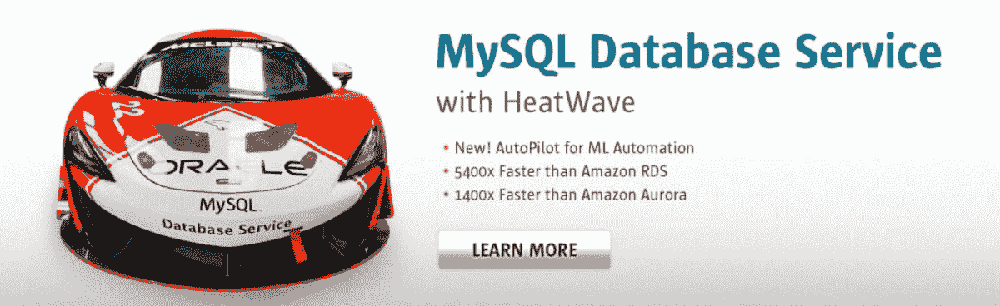
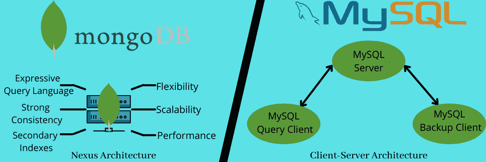
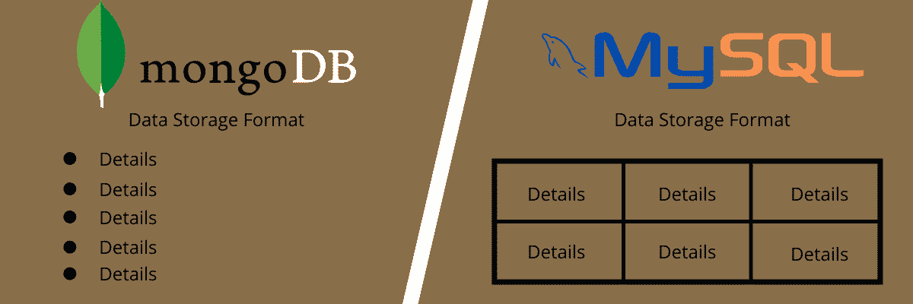
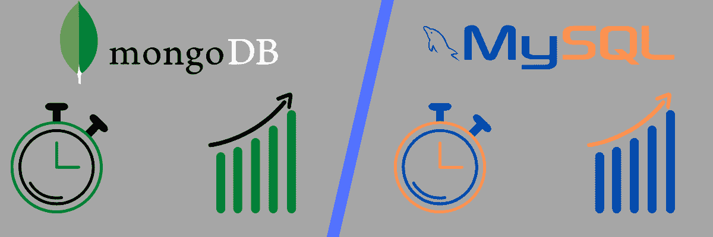
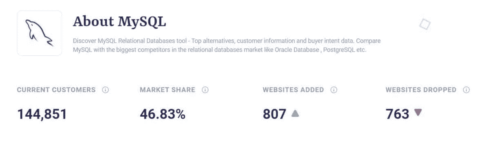
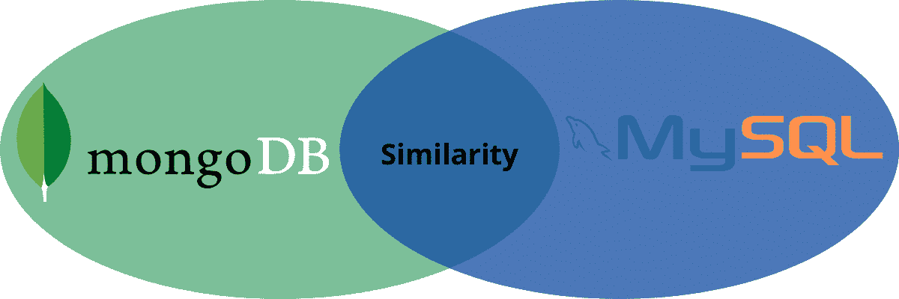

# MongoDB vs MySQL:哪个是更好的数据库管理系统？

> 原文:# t0]https://kinta . com/blog/monodb-vs-MySQL/

市场上有各种各样的[数据库](https://kinsta.com/blog/adminer/),用户经常会就 MongoDB 和 MySQL 进行争论，以找出更好的选择。

随着需求的变化，使用 MySQL 等关系数据库的组织在管理和存储数据时可能会面临一定的困难。与此同时，新公司想知道选择什么样的数据库，这样他们就不会在开发过程中遇到问题。

与此同时，开发金融应用的开发者也经常困惑，他们是应该坚持使用旧的备用 MySQL T1，还是冒险尝试用 T2 MongoDB T3 再分一杯羹。

这就是我们进行这场辩论的原因。比较 MongoDB 和 MySQL 将有助于您了解两个数据库之间的差异，它们的优缺点，以及哪个更适合什么用途。简而言之，它将帮助您为您的项目选择正确的数据库。

所以，欢迎参加辩论！

### 查看我们的视频指南 [MongoDB vs MySQL](https://www.youtube.com/watch?v=u4RdVf7oF_k)


## MongoDB vs MySQL:它们是什么？

在我们开始比较 MongoDB 和 MySQL 之前，让我们快速勾勒出它们各自是什么。


### 什么是 MongoDB？

[](https://kinsta.com/wp-content/uploads/2021/11/MongoDB-1.jpg)

MongoDB.


MongoDB 是一个强大的开源且免费使用的非关系数据库系统，用于存储大量数据。它是 12 年前的 2009 年由 10gen(现在的 MongoDB Inc .)发布的，带有服务器端公共许可证。t 一个用 C++、 [Python](https://kinsta.com/blog/python-tutorials/) 、 [JavaScript](https://kinsta.com/blog/php-vs-javascript/) 编写的具有跨平台兼容性的 NoSQL 数据库程序。它支持操作系统，包括 Windows、macOS 和 Linux，以及 C、 [PHP](https://kinsta.com/blog/php-vs-angular/) 、Java、Ruby、 [Node.js](https://kinsta.com/blog/node-js-apps/) 等语言。

MongoDB 与传统数据库系统的不同之处在于数据的存储方式。

MongoDB 没有在行和列中存储数据，而是采用面向文档的设计，在各种类似 JSON 的文档和集合中表示数据。这些文档包含一系列不同类型的值或键对，比如嵌套文档和数组。对于不同的文档，键/值对的结构可以不同。

除了修改数据结构或模式的灵活性之外，MongoDB 还提供了更高的安全性、可靠性和效率。因此，它有利于更高的速度和存储要求。

[MongoDB or MySQL? 🤔 Which database management system is right for you? 👀Click to Tweet](https://twitter.com/intent/tweet?url=https%3A%2F%2Fkinsta.com%2Fblog%2Fmongodb-vs-mysql%2F&via=kinsta&text=MongoDB+or+MySQL%3F+%F0%9F%A4%94+Which+database+management+system+is+right+for+you%3F+%F0%9F%91%80&hashtags=MySQL%2CMongoDB)

#### MongoDB 的特性

现在，让我们继续来看看 MongoDB 的一些主要特性:

*   **复制:** MongoDB 允许您使用复制(副本集)制作数据的多个副本，并将它们部署在不同的服务器上。该功能有助于数据备份和灾难管理。如果服务器出现故障，您可以随时从存储在其他服务器上的副本中检索数据。
*   **索引:**您可以将 MongoDB 文档中的字段作为主字段或次字段进行索引。这有助于提高数据库中的搜索性能，并允许您对索引而不是整个文档执行搜索，这自动有助于提高搜索速度。
*   **临时查询:**临时查询是临时命令，为执行查询提供不同的返回。也就是说，MongoDB 支持范围查询、正则表达式(Regex)和字段搜索。此外，查询包括用户定义的 JavaScript 函数，可以返回特定的文档字段。您可以借助 MongoDB 查询语言(MQL)实时更新这些即席查询，这对企业的实时分析非常有用。

*   **分片:** MongoDB 能够在分片的帮助下进行水平扩展，分片是一种在不同数据集合之间分布大型数据集的方法。在这里，用户可以选择一个碎片键(一个带有单个或多个副本的主键)来确定集合中的数据分布，并将数据划分到不同碎片的不同范围中。每个碎片都作为一个单独的数据库，使用其他碎片形成一个单独的数据库有助于负载平衡和执行复杂的查询。

*   **负载平衡:** MongoDB 有助于控制并发性，以同时处理多个客户端对不同服务器的请求。这有助于减少每台服务器上的负载，确保数据正常运行时间和一致性，并允许可扩展的应用程序。
*   **文件存储:**你可以使用 MongoDB 作为一个文件系统，称为 GridFS，它带有数据复制和负载平衡功能，可以供多台计算机存储文件。GridFS，或网格文件系统，包括 MongoDB 驱动程序，你可以用 Nginx 和 lighttpd 插件或 mongofiles 实用程序访问它[。MongoDB 还允许开发人员操作文件和内容。](https://kinsta.com/knowledgebase/what-is-nginx/)
*   **聚合:**数据聚合允许用户获得与 SQL 子句`- GROUP BY`相似的结果。MongoDB 提供了三种聚合方式:

*   **封顶集合:** MongoDB 支持封顶集合，即处理数据插入顺序的集合类型。

#### MongoDB 的使用

MongoDB 被世界上成千上万的组织用于数据存储或作为其应用程序的数据库服务。它在以下方面很有用:

*   像 [WordPress](https://kinsta.com/blog/wordpress-permissions/) 这样的内容管理系统可以输入、存储和编辑内容
*   网络和移动应用的数据存储
*   社交网站
*   维护地理空间或基于位置的数据
*   电子商务产品目录和资产管理
*   基于云的系统
*   从大型机中转移工作负载
*   高速实时分析
*   可扩展的高性能视频游戏
*   现代化支付架构和遗产现代化
*   具有不断发展的数据存储需求、更快的日志记录和缓存需求以及不断变化的设计的系统
*   MEAN technology stack for web development，其中 M 代表 MongoDB，其余技术分别为 ExpressJS、AngularJS 和 NodeJS。

Twitter、IBM、Oracle、Zendesk、Citrix、Sony、Intercom、HTC 等公司都在使用 MongoDB。下面是一些被广泛认可的 MongoDB 用例:

*   **Aadhar:** Aadhar 是印度唯一的身份识别项目，也是世界上最大的生物特征数据库。MongoDB 是它用来存储超过 12 亿人的生物特征和人口统计数据的数据库之一。
*   **易贝:**美国电子商务公司易贝，其功能是 B2C 和 C2C，在其各种项目中使用 MongoDB，如搜索建议、云管理和元数据存储。
*   **Shutterfly:** Shutterfly 是一个流行的照片共享平台，使用 MongoDB 存储和管理 60 多亿张图片，每秒钟处理 10k 次操作。

### 什么是 MySQL？

[](https://kinsta.com/wp-content/uploads/2021/11/MySQL-1.jpg)

MySQL.


MySQL 是一个免费的开源关系数据库管理系统(RDBMS)。它将数据组织和存储为表格格式，表格中的行和列与数据类型相关。它有 GNU 通用公共许可证，你可以在 [GitHub](https://kinsta.com/blog/gitlab-vs-github/) 上找到它的库。

这个数据库最初是由瑞典公司 MySQL AB 于 1995 年创建的，其创始人是瑞典人 David Axmark、芬兰人 Michael Widenius 和 Allan Larsson。然而，太阳微系统公司收购了 MySQL AB，2010 年，甲骨文公司收购了太阳微系统公司。

MySQL 的命名法也很有趣——它结合了两个术语:

*   迈克尔·维德纽斯女儿的名字。
*   **SQL:** 代表结构化查询语言。

SQL 是一种特定于领域的编程语言，可以通过对数据执行包括创建、提取、删除和修改在内的功能来管理 RDBMS 中的数据。

[MySQL](https://kinsta.com/knowledgebase/what-is-mysql/) 与许多操作系统(如 Windows、macOS、Linux、FreeBSD、OpenBSD 和 Solaris)配合使用，在设备的存储系统中实现 RDBMS，允许网络访问，管理用户，促进数据库完整性测试，以及创建备份。它是用 C++和 C 编写的，使用词法分析器，而它的 SQL 解析器使用 yacc。

该数据库已经收到了积极的反馈，特别是其易于使用的界面的平均使用。就性能而言，它快速而稳定，并且具有多线程和多用户数据库服务器的特性。

MySQL 有两个版本:开源[社区服务器](https://kinsta.com/knowledgebase/mysql-community-server/)和专有企业服务器。后者提供了大量的服务器插件，无需修改代码就可以安装。

#### MySQL 的特性

下面就来多讲讲这个流行的 RDBMS 的特性。

*   **复制和集群:** MySQL 允许复制和集群，这有助于通过不同的同步类型提高应用程序的可伸缩性和性能。您还可以将数据从一个 [SQL 服务器](https://kinsta.com/blog/postgresql-vs-sql-server/)复制到其他副本 SQL 服务器。这还允许您在多个数据库中备份数据，以避免数据丢失。
*   **密码支持:**当有人试图访问数据库时，MySQL 会为主机验证提供一个密码加密系统。它增加了数据库的安全性，确保只有授权的个人才能访问。此外，其最新版本 MySQL 8.0 也提供了对双重密码的支持，允许开发人员在不停机的情况下轻松修改密码凭据。

*   **性能模式:**它监控应用程序性能、资源利用率和服务器事件。这使您能够适当地分配资源，提高应用程序检测任何速度变慢的性能，并在出现任何可疑的服务器事件时采取必要的措施。
*   **在线模式:** MySQL 支持多种在线模式，帮助您满足数据存储需求并提供更大的灵活性。
*   **弹性:** MySQL 支持的应用程序对故障具有弹性，可以在这种情况下轻松应对。因此，它为所有类型的应用程序(web 或移动)提供了高数据可用性。
*   **事务支持:**您可以获得对多级和分布式事务、无限行级阻塞和 ACID 兼容事务的支持。在事务处理上下文中，有四个原则称为 ACID 原则。它代表原子性、一致性、孤立性和持久性。此外，它还可以帮助您维护数据库快照和完整性，以及多版本并发控制和外键实现等约束。

*   **GUI 支持:**MySQL 中有大量的 GUI 工具，可以简化创建、设计和管理命令行工具的过程，从而节省时间。数据库架构师、管理员和开发人员可以利用这些工具简化他们的工作。
*   **局限性:**横向缩放不容易；数以百万计的读取或写入过程会影响数据库性能，并包括关系数据库共有的其他限制。

#### MySQL 的使用

MySQL 已经存在了二十多年，为全球的组织提供了存储大量数据的便利。以下是 MySQL 的一些用法以及使用它的人。

*   内容管理系统和博客
*   有大量产品的电子商务应用程序
*   日志应用程序
*   数据库
*   对于需要高端数据安全性的应用，脸书和 Instagram 等社交媒体网站
*   MySQL 用于存储引擎，如 InnoDB、MyISAM、Memory、CSV、Merge、Archive、Blackhole 和 Federated。
*   LAMP Stack 是一个使用 MySQL 作为其组件之一的 web 开发技术堆栈。它代表 Linux、 [Apache](https://kinsta.com/blog/nginx-vs-apache/) 、MySQL 和 PHP/Python/Perl。
*   它安装在各种云平台上，如[微软 Azure](https://kinsta.com/blog/aws-vs-azure/) ，亚马逊 EC2，甲骨文[云](https://kinsta.com/blog/cloud-market-share/)等。

事实上，Oracle Cloud 提供了 MySQL 即服务，允许用户安装 MySQL 服务器并将其部署在云中。这样，您不需要在本地服务器上安装它。

使用 MySQL 的著名组织有 Airbnb、NASA、索尼、YouTube、网飞、Pinterest、Drupal、Joomla 等等。以下是一些著名的 MySQL 用例:

*   维基百科是一个在全球传播知识的免费百科全书。它使用 MySQL，需要高可扩展性来满足不断增长的用户群。该数据库帮助他们更新内容，容纳更多的内容和访问者，并支持数以千计的条目和编辑。
*   Twitter: Twitter 从 tweet 存储的时态分片发展到使用 T-bird 的更加分布式的方法。而 T-bird 是用使用 MySQL 的 Gizzard 构建的。

临时分片非常昂贵，而且需要更多的机器来填满推文。他们还面临着负载平衡的问题，对数据库管理员来说逻辑上很复杂。支持 T-bird 的 MySQL 解决了这些问题。

这就是关于 MongoDB 和 MySQL 的全部内容。现在，让我们最后比较一下 MongoDB 和 MySQL，以帮助您决定什么可以更好地适合您的下一个软件应用程序。

## MongoDB 与 MySQL DBMS 的比较

这里有一些参数，我们将根据这些参数来比较 MongoDB 和 MySQL。

### 体系结构

[](https://kinsta.com/wp-content/uploads/2021/11/MongoDBvsMySQL_-Architecture.png)

MongoDB vs MySQL Architecture.


架构构成了每个系统的基础，并建立了引入所有特性和功能的框架。因此，比较 MongoDB 和 MySQL 的架构并仔细理解它们以决定哪种架构更适合您的应用程序是非常重要的。

#### MongoDB

它将 Nexus 架构作为其设计理念，结合了关系数据库的功能。它可以通过提供高可伸缩性、全局可用性和灵活的模式来满足现代应用程序的需求。因此，改变它的设计是相当容易的。

此外，MongoDB 包括领先开发环境的官方驱动程序，如 [AWS](https://kinsta.com/blog/aws-outage/) 、Azure 和 Kubernetes，以及 JavaScript、Python 等编程语言。，以及 Django 这样的框架。

#### 关系型数据库

另一方面，MySQL 包括一个客户端-服务器架构，其存储经过优化以提供高性能和多线程。它的文档还展示了一些处理配置而不是微调 SQL 度量的性能优化技术。

胜利者:平手。

### 数据存储格式

[](https://kinsta.com/wp-content/uploads/2021/11/Data-Storage-Format.png)

MongoDB vs MySQL: Data Storage Format.


#### MongoDB

MongoDB 中的数据存储格式可以是这样的:

```
{
Account Number: 1234567890
First Name: "Jon"
Last Name: "Doe"
Branch Name: "Los Angeles"
}
```

您可以看到这种格式类似于 JSON，并且您可以轻松地对数据进行更改，这意味着您可以毫不费力地添加更多数据、删除一些信息和修改数据。上面的例子显示了数据库没有固定的模式，从而引入了更多的灵活性。

#### 关系型数据库

另一方面，MySQL 中的数据存储格式看起来像这样:

| 账号 | 西方人名的第一个字 | 姓 | 分行名称 |
| --- | --- | --- | --- |
| Twelve billion three hundred and forty-five million six hundred and seventy-eight thousand nine hundred and one | 【男性名字】乔恩 | 母鹿 | 洛杉矶 |
| Twelve billion three hundred and forty-five million six hundred and seventy-eight thousand nine hundred and two | 简（女子名） | 母鹿 | 西雅图 |

上表显示了 MySQL 如何以行和列的形式组织数据。与 MongoDB 相比，它有一个合适的、严格的结构，很难改变。这是因为你不能引入大量的行或列；你需要以这样一种方式进行设计，每一行都有一列，反之亦然；否则，将违反模式。但是，在 MongoDB 中，您可以很容易地修改数据。

MongoDB 和 MySQL 的术语略有不同:

| MongoDB | 关系型数据库 |
| --- | --- |
| 收藏品 | 桌子 |
| 文件 | 排 |
| 田 | 圆柱 |
| 链接和嵌入 | 连接 |
| 分片 | 划分 |
| 重复 | 分身术 |

**赢家** : MongoDB 的数据存储格式更容易修改。

### 模式灵活性

您选择的数据库必须能够根据不同的需求灵活地修改数据库的设计或模式。否则，即使需求有一点点变化，也会变得很烦人。

因此，让我们根据 MongoDB 和 MySQL 的模式灵活性来找出它们的区别。

#### MongoDB

MySQL 提供了一个灵活的模式，使用户能够根据需求改变设计，特别是对于大数据应用程序。它允许您轻松地组合和存储不同类型的数据，并在不停机的情况下动态地修改模式。您可以在一个集合中存储多个文档，即使它们之间没有任何关系，因为这是一个非关系数据库系统。它使用具有可选模式的类似 JSON 的文档。

但是，它缺少事务和连接；因此，您需要根据应用程序访问数据的方式进行频繁的模式优化。

#### 关系型数据库

在 MySQL 中，在存储数据以及行和列之前，必须明确定义列和表。这里，每个字段由一行和一列组成。这意味着数据存储不会像 MongoDB 那样给你很大的灵活性。这也意味着更慢的部署和开发过程。

但是如果您的应用程序有一个固定的模式，MySQL 是最好的。它将提供更好的数据一致性，而不需要一次又一次地改变设计或浪费时间。但是，如果您有不断变化的需求，MongoDB 可能是您更好的选择。

显然，MongoDB 提供了更多的模式灵活性。

### 使用的查询语言

了解哪个数据库使用什么查询语言至关重要。它会帮助你了解哪一个对你来说更方便，而不是在安装后感到困惑。

#### MongoDB

MongoDB 利用了 MongoDB 查询语言(MQL)而不是 [SQL](https://kinsta.com/blog/sql-injection/) 。它表达丰富，支持 CRUD 函数，可以创建、读取、更新和删除数据。此外，它还有助于数据聚合、地理空间查询和文本搜索。

如果您想要请求数据，您必须定义具有与预期结果相匹配的属性的文档。这意味着您需要执行查询操作来从数据库中获取数据，如 **db.collection.find()** 。MongoDB 通常使用通过 JSON 链接的[操作符](https://kinsta.com/blog/mongodb-operators/)来执行查询。此外，它还支持 OR 和布尔 and 查询。

然而，MongoDB 从不使用连接操作，它也有任何其他等价的操作符。

#### 关系型数据库

另一方面，MySQL 像其他关系数据库一样使用 SQL。通过支持连接功能，它可以从不同的表中提取数据。这就是像 MySQL 这样的关系数据库“关系化”的原因该操作允许您在一个查询中链接多个表中的数据。

也就是说，SQL 有一个:

*   用于创建、删除和更改表的数据定义语言(DDL)
*   具有提交和回滚等操作的数据事务语言(DTL)
*   具有插入、删除和更新行等选项的数据操作语言(DML)
*   带有撤销和授权命令的数据控制语言(DCL)

胜利者:平手。

### 性能和速度

[](https://kinsta.com/wp-content/uploads/2021/11/Performance-and-Speed.png)

MongoDB vs MySQL: Performance and Speed.


在选择数据库时，性能和速度是你永远不能忽视的。您必须知道对哪个数据库有什么期望以及有什么目的。对于像开发人员和管理员这样忙碌的专业人士来说，每一秒都是至关重要的。

因此，您必须选择能够提供更好性能的数据库来支持您的工作效率，而不是相反。所以，我们来比较一下他们的速度和性能。

由于 MongoDB 和 MySQL 有不同的数据存储方法，评估它们的性能有点困难。您可以将两个 SQL 数据库与一些标准基准进行比较，但是很难对非关系数据库进行同样的比较。

但是我们将基于常见操作以及它们在更大数据量下的表现来比较 MongoDB 和 MySQL。

#### MongoDB

由于 MongoDB 存储大量非结构化数据，并遵循基于文档的存储方法，因此它比 MySQL 相对更快。这意味着 MongoDB 将数据存储在一个实体的单个文档中，并有助于更快地读取或写入数据。复制等功能可能是造成这种情况的一个重要原因。由于 Jason 式的对象存储，它在处理对象时的性能也更好。

此外，MongoDB 从不涉及供应商锁定，如果您对一种服务不满意，您可以自由地使用替代方案来提高性能。

#### 关系型数据库

MySQL 在处理大量数据时会表现出较慢的性能。这是因为它以规范化的方式存储表。如果您想要更改数据或提取数据，您需要遍历许多表来读写数据，这会增加服务器负载并影响其性能。但是对于事务性操作，您可以使用 MySQL。

它需要一个明确的数据结构才能将数据添加到数据库中。因此，如果您想存储非结构化数据，它并不合适。有时，当涉及复杂数据时，设计合适的模式也变得很困难。

**赢家** : MongoDB 更快，性能更好。

### 安全性

[](https://kinsta.com/wp-content/uploads/2021/11/Security.png)

MongoDB vs MySQL: Security.


考虑到全球范围内越来越多的网络攻击事件，安全性始终是比较两个系统的主要标准之一。因此，比较 MongoDB 和 MySQL 以确定哪一个对您的应用程序更安全是很重要的。

#### MongoDB

MongoDB 利用基于角色的访问控制，为用户和设备提供灵活的权限。每个用户都被赋予一个角色，基于该角色，他们被赋予访问数据和执行操作的特定权限。例如，像高级员工这样的用户会有更高的权限级别，因此他们的特权会更大。

这是为您的数据库提供安全性的一种方式，这样未经授权的用户或攻击就无法访问您的数据库并利用它。此外，MongoDB 还支持[传输层安全(TLS)](https://kinsta.com/blog/tls-1-3/) 加密和一个名为[安全套接字层(SSL)](https://kinsta.com/knowledgebase/tls-vs-ssl/) 的安全协议，以增加安全性。您还可以使用主密钥将加密的文档写入数据集合，以实现静态数据加密。

#### 关系型数据库

另一方面，MySQL 有基于权限的访问控制。它还支持像 MongoDB 这样的加密工具，具有类似的认证模型，包括授权、认证和审计。您可以向用户授予角色和权限，使他们能够访问数据集和操作的权限。此外，还可以申请 TLS 和 SSL，安全性更高。

在其最近的更新中，MySQL 还包括了双密码支持，以确保数据访问的安全性。

虽然两者在安全性方面似乎是不分上下，但 MySQL 被认为更安全。原因在于其僵化的架构和模式，这提供了更好的数据一致性和可靠性。

**赢家** : MySQL 更安全(死板也不坏)。

### 可量测性

[](https://kinsta.com/wp-content/uploads/2021/11/Scalability.png)

MongoDB vs MySQL: Scalability.


随着您的应用程序随着用户群和流量的增加而增长，您必须能够平稳地扩展它以满足不断变化的需求。如果您的应用程序不可伸缩，客户在使用它时会有不好的体验，经常崩溃、滞后和停机。没有人喜欢使用这样的系统，他们可以跳到其他替代系统，如果不是现在，那就更快。

因此，考虑应用程序的可伸缩性很重要，您选择的数据库会影响可伸缩性。因此，让我们根据 MongoDB 和 MySQL 提供的可伸缩性来比较它们。

#### MongoDB

MongoDB 具有极强的可伸缩性，这是它被用于不断增长的网站、CMS 系统和电子商务商店的主要原因之一。它可以使用一种称为分片的过程进行水平扩展。分片是数据库的一部分，分片是跨多个集合和机器的数据分布技术。它使您能够部署具有更高吞吐量操作和大型数据集的系统。

有了更高的可伸缩性，您可以根据自己的需求向数据库中添加越来越多的服务器，从而轻松地创建多个服务器集群。它允许您在具有更高读写性能的分片集群中存储数据集的副本，以支持不同规模的应用程序。它还能让您确保数据得到备份，并且在网络攻击或灾难发生时不会丢失。

更不用说，将负载和数据集划分到不同的服务器上还可以让您以更低的成本运行它们，相比之下，一台服务器上的所有数据都需要高端、昂贵的硬件。MongoDB 中分片的另一个好处是它最大化了磁盘空间并提供了动态负载平衡。

此外，MongoDB 支持基于范围的分片或数据分区，以及透明的查询路由和自动分发数据量。

#### 关系型数据库

来到 MySQL，可伸缩性是有限的。它为您提供了两种扩展应用程序的选择—创建读取副本或垂直扩展。它允许通过集群进行数据复制和垂直扩展，有助于通过不同的同步类型提高应用程序的可伸缩性和性能。

这里显著的区别是 MySQL 提供垂直伸缩，而 MongoDB 提供更灵活的水平伸缩。现在，垂直扩展意味着系统允许您通过增加具有上限的单个服务器中的 CPU 或 RAM 规格来增加负载。

如果您想要执行复制，使用读取复制很容易。这允许您创建数据库的只读拷贝，并将它们添加到不同的服务器上，但有一些限制—一个是您可以添加的副本总数。由于这一限制，您可能会面临一些关于应用程序定期读写数据库(或大量写入)的问题。

尽管 MySQL 中引入了多主复制，但与 MongoDB 中的功能相比，它的实现仍然有限。它可以增加更多的写规模，但仅限于单独的应用程序；他们中的每一个人都可以写信给不同的电源，并获得规模。

此外，MySQL 不涉及分片的标准实现。尽管它提供了两种分片方法——MySQL Fabric(分片框架)和自动分片——但由于许多障碍和限制，人们很少部署它们。这就是为什么像脸书这样的公司使用他们自己的切分框架。

如果您利用分片实现可伸缩性，请确保选择正确的分片密钥，因为错误的密钥会导致系统不灵活。例如，更改分片键可能会对应用程序、节点事务和位置产生负面影响。此外，如果碎片变更不完整，可能会出现数据一致性等问题。

因此，在使用 MySQL 时，您必须谨慎地做出正确的决策，以进行模式更改以及数据分区、分片键、节点和数据库之间的映射。

获胜者 : MongoDB 提供了更高的可伸缩性，而 MySQL 有很多限制，如果某些过程做得不对，可能会带来不一致和问题，如前所述。

### 事务模型:ACID 与 BASE

选择数据库的一个重要步骤是找出它的事务模型。事务模型由确定数据库如何存储、操作和组织数据的规则组成。

两种交易模型很流行:

*   酸(原子的、一致的、孤立的和持久的)
*   基础(基本可用性、软状态和最终一致性)

根据 CAP(一致性、可用性和分区)定理，在允许分区的分布式系统或即使在临时通信中断时也能继续工作的系统中，不可能同时拥有可用性和一致性。

具有 ACID 和 base 模型的数据库之间的区别在于它们如何处理这种限制。ACID 数据库提供更一致的系统，而 base 数据库提供更高的可用性。

## 注册订阅时事通讯


### 想知道我们是怎么让流量增长超过 1000%的吗？

加入 20，000 多名获得我们每周时事通讯和内部消息的人的行列吧！

[Subscribe Now](#newsletter)

现在，让我们来看看 MongoDB 和 MySQL 遵循什么模型。

#### MongoDB

MongoDB 遵循基本模型，并确保事务始终可用。它是这样工作的:

*   **基本可用:**具有基本模型的数据库通过在数据库集群中的不同节点之间复制和传播数据来确保数据可用性，而不是强制实现瞬时一致性。
*   **软状态:**基本模型中的数据值会随着时间而变化，因为没有即时的一致性。该模型还可以脱离数据库概念，强制实现其一致性，并将此责任委托给开发人员。
*   **最终一致:**虽然 BASE 不强制立即一致，但它可以。当它出现时，您仍然可以执行数据读取。

MongoDB 以外的数据库采用的基础模型有 Redis 和 Cassandra。如果您的应用程序需要情感分析，这个模型是一个很好的选择。

客户服务和营销公司可以利用这一点来进行他们的社会网络研究。该数据库还可以容纳社交网络订阅源中的大量数据。

#### 关系型数据库

MySQL 遵循 ACID 模型来确保每个事务的一致性。它适用于处理在线分析处理(如数据仓库)或在线交易处理(如金融机构)的企业。这类组织需要一个能够管理任意规模的小型并发事务的数据库。酸的工作原理如下:

*   **Atomic:**ACID 模型中的每个事务要么正常执行，要么完全停止，同时数据库恢复到事务的初始状态。这样做是为了确保数据在整个数据库中有效。
*   **一致:**事务是一致的，绝不会损害数据库的结构完整性。
*   **Isolated:** 该属性确保在处理过程中没有事务会干扰其他事务，从而损害它们在数据库中的完整性。
*   **持久:**与已完成的交易相关的数据可以在断电或网络中断期间持续存在。即使事务失败，也不会影响任何数据。

由于它提供了更高的安全性和交易保证，金融机构只使用 ACID 数据库。它的原子性质也有利于安全的资金转移。它确保被中断的事务被立即终止以防止错误。

除了 MySQL 之外的 Acid 兼容关系数据库还有 [PostgreSQL](https://kinsta.com/knowledgebase/what-is-postgresql/) ，SQLite，Oracle 等。此外，一些非关系数据库在一定程度上也是 ACID 兼容的，比如 Apache CouchDB 和 IBM Db2。

问题是哪种事务模型更好，答案是不清楚的，因为两者对于不同的用例以及项目方面都是有用的。由于其结构化的性质，ACID 数据库可以适合需要更高一致性、可靠性和可预测性的项目。

另一方面，基本数据库更适合于需要更高、更简单、更灵活的伸缩性的项目。

胜利者:平手。

### 易用性

[](https://kinsta.com/wp-content/uploads/2021/11/Ease-of-Use.png)

MongoDB vs MySQL: Ease of Use.


选择数据库时，您必须记住数据库的易用性。它不应该给你的团队带来困难，否则生产力会下降，你将不得不花费资源和时间来培训他们。

所以，让我们来看看 MongoDB 和 MySQL 哪个数据库更容易使用。

#### MongoDB

MongoDB 的数据存储过程相当简单，任何有编程技能的人都能理解。它以非结构化格式将数据存储在集合中，以提供更大的灵活性。它允许开发人员(可能是也可能不是数据库专家)使用它来支持他们的应用程序开发。

对于不同的模式，MongoDB 为那些不需要 MySQL 等关系数据库提供的特性的团队提供了一个灵活的接口。例如，开发人员构建一个不依赖于结构化模式的 web 应用程序可以使用 MongoDB。

然而，并不是你团队中的所有人都需要熟悉像 MongoDB 这样的 NoSQL 数据库。在这种情况下，如果你想继续开发这个数据库，你需要帮助他们理解它。此外，某些查询与 SQL 数据库完全不同，如更新、插入、删除等。

#### 关系型数据库

MySQL 有一个设计好的结构，任何有基本编程技能的人都能很容易理解。学习和使用 MySQL 很容易，这就是为什么当谈到数据库时，人们会从 MySQL 或任何其他 SQL 数据库开始。

即使您的开发人员不精通 MySQL，但有使用其他 SQL 数据库的经验，他们也可能会很快赶上。

此外，像 select、join 等查询。在基于 SQL 的数据库如 MySQL、SQLite、Oracle、PostgreSQL 等中执行起来毫不费力。

开发人员创建的应用程序需要严格复杂的数据结构和带有大量表的模式，他们会发现使用 MySQL 很容易。对于开发需要顶级安全性或涉及频繁事务的应用程序，它也更容易使用。

例如，银行应用程序可以利用 MySQL 来存储对敏感信息至关重要的大型数据集。他们需要高级别的安全性、交易保证和完整性。

**赢家**:对比 MongoDB 和 MySQL，MySQL 因为简单，结构得当，更容易上手。

### 全文搜索可用性

#### MongoDB

这个数据库最近增加了一个全文搜索，它使用一个字符串数组的特定索引类型来执行。此外，MongoDB 支持术语搜索和阶段搜索，使任何技能水平的用户都可以轻松找到东西。

此外，MongoDB 还支持使用短语和术语搜索的布尔搜索。尽管有某些限制，您仍然可以很容易地执行这个特性。为了执行全文搜索，数据库不便于控制子集字段的定义。它与包含的每个字段一致地匹配，向您显示结果。

#### 关系型数据库

MySQL 支持全文搜索已经有相当长的时间了。它也可以使用一种特殊的索引类型来执行，并借助短语搜索、术语搜索和布尔搜索来实现。

但是对于集群数据库，MySQL 还不支持全文索引。所以，这里可以认为是一个限制。

**赢家** : MongoDB 的全文比较容易，限制少。

### 数据复制

数据复制是数据库的重要组成部分。这意味着需要制作数据的副本并将其存储在其他数据库服务器中。它不仅可以提高应用程序的可扩展性和性能，还可以让您备份数据以避免丢失。此外，它还提高了访问数据的效率。

让我们根据 MongoDB 和 MySQL 提供复制的能力来比较它们。

#### MongoDB

MongoDB 支持的唯一复制类型是主-从数据复制，其中每个数据由一个主服务器组成。这种配置允许大量节点(非主节点或辅助节点),并限制在单个数据库中执行的操作。

单个主节点接受写入和读取，并且配置可能还包括只读辅助节点或服务器。在这里，数据从主服务器异步复制到辅助服务器。这种类型的复制通常更快，但不太可靠。

MongoDB 中的主-从复制先于数据副本集，但是可以提供较少的冗余。MongoDB 提供了一个将主-从配置转换成副本集的选项。使用副本集，it 可以创建不同的数据副本，并且在整个过程中，副本集中的每个成员都被分配了一个角色，可以是主要角色，也可以是辅助角色。

此外，默认情况下，读取或写入发生在主复制副本上，然后您可以在辅助复制副本上复制它。此外，副本集更健壮，更适合生产使用。

#### 关系型数据库

与支持单一复制方法的 MongoDB 不同，MySQL 提供了两种类型的复制方法——主-主复制和主-从复制。借助多源复制，您可以轻松地从不同的主机并行复制数据。

主-主复制的工作方式类似于主-辅复制，但不同之处在于两个节点同时是副本和主节点。这意味着节点之间存在循环复制。这里，您可以有多个主节点来接受写和读请求。您还可以为每个主服务器获取多个辅助服务器。此外，主机之间的复制是异步的。

使用干线-干线数据库的优点是你可以在几个站点上的整个网络中分配干线。主-主配置被认为更适合现代使用，因为每个单元都有一套完整的数据。所以，即使他们中的一个失败了，其他人也会在那里服务。缺点是，它可能涉及通信延迟。

Struggling with downtime and WordPress problems? Kinsta is the hosting solution designed to save you time! [Check out our features](https://kinsta.com/features/)

除此之外，MySQL 还可以使用其他复制模型，如多主集群和组复制。

**赢家**:显然，与 MongoDB 相比，MySQL 提供了更多可靠的复制选项。

### 索引优化

索引有助于您在数据库中快速查找数据。尽管索引优化是 MongoDB 和 MySQL 的一个共同特征，但它们有不同的方法。因此，了解哪种方法更好，能给你带来更多方便，这一点很重要。

因此，让我们根据 MongoDB 和 MySQL 如何执行索引优化来比较它们。

#### MongoDB

如果找不到索引，就需要扫描集合中的每个文档，以选择与查询语句匹配的文档。这个过程既繁琐又耗时。此外，它需要更多的努力，因为没有特定的结构来存储数据。

#### 关系型数据库

如果没有定义索引，数据库搜索引擎将开始扫描整个表来查找相关的行。因为它是一个具有适当结构的关系数据库，所以 search query 的性能最佳，并且比 MongoDB 提供更快的结果。

**赢家** : MySQL 提供更快的索引优化。

### 本地语言驱动程序

#### MongoDB

MongoDB 对开发人员的限制较少。MongoDB 驱动程序和 API 必须是所用编程语言的原生程序。

#### 关系型数据库

MySQL 为开发人员提供了有限的与 JSON 数据交互的选项，因为有多个 SQL 功能层。它也有很多限制，这可能会成为一个巨大的开销，需要更好的规划和执行。想要通过惯用 API 进行交互的开发人员也面临许多困难。

**赢家** : MongoDB 显然是这里的赢家。

### 社区支持和部署

无论你是初学者还是专家用户，随时都可能遇到麻烦。当这种情况发生时，您可以从数据库开发人员社区获得帮助。他们可以回答您的问题，帮助您了解更多信息，并提供为社区做贡献的机会。

同样，您还必须知道哪个数据库可以在什么平台上运行。它将帮助您根据您的项目需求和使用的其他技术来决定选择什么数据库。

因此，让我们根据 MongoDB 和 MySQL 的社区支持和部署来比较它们。

#### MongoDB

MongoDB Inc .拥有并维护 MongoDB。随着 NoSQL 用户的激增，这是此类数据库中的一个。由于其无可挑剔的特性和开源的可用性，它有一个强大的社区，你可以依靠。

谈到部署，MongoDB 易于跨各种平台使用和部署，包括 Windows、Linux、macOS、FreeBSD 和 Solaris，并且可用于 web、云和 SaaS 应用程序。

#### 关系型数据库

甲骨文公司目前拥有和维护 MySQL，它最初是在 Sun Microsystems 和 MySQL AB 之下。它已经存在了 20 多年，在全球拥有广泛的用户基础。因此，它的社区支持也非常好。通过成为这个大社区的一部分，您可以联系、学习和增长您的数据库知识。

对于部署，MySQL 也毫不费力。您甚至可以使用在 GitHub 上找到的源代码手动构建和安装它。或者，如果不需要特殊定制，您可以从二进制包中安装它。

MySQL 可用于 web、云和 SaaS 应用程序，如 MongoDB，并运行在多种平台上，如 Windows、macOS、Linux、Solaris 和 FreeBSD。它也可以运行在云平台上，如 Microsoft Azure、Oracle Cloud 和 Amazon EC2。您可以使用包管理器下载 MySQL，并为许多 Linux 发行版轻松安装它。接下来，您可能需要在其上配置优化和安全设置。

**赢家**:鉴于广泛的社区基础以及易用性和部署性，MySQL 的得分超过了 MongoDB。

### 市场份额和知名度

MongoDB 和 MySQL 都是数据库行业的响当当的名字。因此，是时候我们来看看哪种产品更受欢迎，为什么以及它们在全球的市场份额了。

#### MongoDB

MongoDB 是最受欢迎的非关系数据库，在整个数据库市场上广受好评。

根据 Datanyze 的数据， [MongoDB 在数据库](https://www.datanyze.com/market-share/databases--272/mongodb-market-share)中排名第 7，市场份额为 4.5%。它还强调了全球超过 7k 家公司在使用 MongoDB。

[](https://kinsta.com/wp-content/uploads/2021/11/MongoDB-Market-Share.jpg)

MongoDB Market Share.


其受欢迎的原因是开发人员需要应用程序的灵活性和可伸缩性来满足当前不断增长的用户需求。它还使用户能够操作数据，轻松查询，并找到有用的见解。

此外，MongoDB 有超过 177k 个存储库，GitHub 上有 923k+个提交。

#### 关系型数据库

MySQL 是世界上最流行的数据库之一。人们将它作为一个独立的系统使用，或者与其他系统如 [MongoDB、PostgreSQL](https://kinsta.com/blog/mongodb-vs-postgresql/) 等结合使用。

[根据 Statista 的报告](https://www.statista.com/statistics/809750/worldwide-popularity-ranking-database-management-systems/)，截至 2021 年 6 月，MySQL 是仅次于 Oracle 的全球第二大数据库管理系统。原因可以这么多；它是免费的，开源的，并且有很好的特性。它提供了可伸缩性、可用性和安全性，使其适合现代项目。此外，其庞大的在线社区和易用性吸引了大量用户。

另一份报告显示，MySQL 的[市场份额约为 46.83%，拥有 144，000 多名活跃客户。](https://www.slintel.com/tech/relational-databases/mysql-market-share)

[](https://kinsta.com/wp-content/uploads/2021/11/MySQL-Market-Share-1.jpg)

MySQL Market Share.


此外，MySQL 在 GitHub 上有 222k 以上的存储库和超过 700 万次提交。

胜利者:毫无疑问，MySQL 在这两者中更受欢迎。

## MongoDB vs MySQL:何时使用它们？

MongoDB 和 MySQL 各有利弊，各有优缺点。因此，它们在不同的情况下都很有用。

#### MongoDB

如果除了更快、自动和快速的数据恢复之外，您还想获得更高的数据可用性，那么这个数据库非常有用。由于它提供了出色的可伸缩性，如果您正在开发一个需求不断增长的应用程序或站点，可以考虑 MongoDB。

对于没有数据库的小公司，管理员可以充分利用 MongoDB。然而，如果你的目标是增长，这不应该是一个永久的解决方案。此外，如果您想降低与模式迁移相关的成本，MongoDB 可能是一个可行的选择。

此外，如果您运行的大多数服务都在云上，那么 MongoDB 可能适合您。它有一个原生的体系结构，具有可扩展性特性，如分片，以满足您希望的水平扩展和业务敏捷性。

#### 关系型数据库

对于不需要立即扩展的早期初创企业，MySQL 是更好的选择。此外，如果您正在从事一个未来不需要太多扩展的项目，您可以考虑 MySQL。它还将提供简单的设置和维护。

除此之外，如果您希望用结构化数据保持一个固定的模式，不需要您随时间而改变，那么您可以考虑 MySQL。此外，如果您的预算有限，但仍需要高性能，MySQL 是不二之选。

此外，如果您正在构建一个具有较高事务率的财务应用程序或项目，MySQL 是一个不错的选择。它的安全特性还可以保护您的应用程序和数据安全，防止它们落入他人之手或在网络攻击中被窃取。

赢家:由于两者对不同类型的企业都有用，所以没有明确的赢家。

## MongoDB 与 MySQL:优势与劣势

看看与 MongoDB 和 MySQL 相关的各种优点和缺点:

#### MongoDB

MongoDB 的优点是:

*   它具有高度的适应性和灵活性，可以满足不断变化的业务需求和情况。
*   轻松放大或缩小
*   允许在文档中查询和返回字段
*   支持数据复制，因此您可以保存数据的副本，永远不会丢失
*   允许存储不同类型、不同大小的文件，而不会影响您的技术堆栈
*   允许创建索引以提高搜索性能
*   在多台服务器上运行，并提供数据复制和负载平衡，因此即使在硬件故障时也能正常工作
*   遵循基本模型以提供更高的数据可用性
*   使用方便

MongoDB 的缺点是:

*   与其他数据库系统相比，ACID 模型并不强大
*   没有为存储过程提供选项，这意味着您不能在数据库级别实现业务逻辑，这与关系数据库不同
*   交易有时会很复杂或不安全
*   有点陡峭的学习曲线
*   文档结构不良
*   涉及更高的内存消耗，并且缺少连接或内置分析

#### 关系型数据库

MySQL 提供了以下优势:

*   支持多种复制选项，如主-辅助、主-主、横向扩展、组复制等。
*   通过用户友好的界面轻松使用和安装。此外，您可以使用不同的来源(如有用的书籍、白皮书和博客)轻松地学习和排除故障。
*   可以管理大量数据，从存储到对数据执行操作
*   降低了与存储引擎相关的开销
*   更安全，并使用基于权限的身份验证
*   提供像全局数据分发和报告这样的功能，这使它对不同形状和大小的应用程序非常有用
*   支持内存存储引擎来查找经常使用的表

使用 MySQL 的缺点是:

*   不缓存存储过程
*   具有系统目录的事务不符合 ACID
*   用于触发器或过程的 MySQL 表大多是预先锁定的
*   系统崩溃会破坏整个系统目录
*   严重依赖 SQL
*   不支持 Python 或 Java 集成

赢家:没有明确的赢家，因为 MySQL 和 MongoDB 都有一些优点和缺点。

## MongoDB 与 MySQL:版本和定价

虽然 MongoDB 和 MySQL 是开源的，可以免费使用，但它们也提供付费版本，以提供更多的功能和好处。

#### MongoDB

MongoDB 提供各种免费和付费的计划。你可以将它的免费版用于部署在共享云上的小规模应用。以下是它的三个版本:

*   MongoDB 社区服务器:它是免费的，可以在 Windows、OS X 和 Linux 上运行。
*   **MongoDB 企业服务器:**是商用的。
*   MongoDB Atlas: 这是一个完全托管的按需云数据库，运行在 GCP、Azure 和 AWS 上。

因此，如果您有不同的需求，您可以根据云的类型、安全标准和存储来选择定价等级。它包括三种定价方案:

*   **共享**:0 美元/月
*   **专用**:每月 57 美元
*   **无服务器**:每百万次读取 0.30 美元起

#### 关系型数据库

除了免费版，MySQL 还有以下商业计划:

*   MySQL 标准版:价格为每年 2000 美元
*   MySQL 企业版:售价 5000 美元/年
*   **MySQL Cluster CGE:** 价格为每年 10，000 美元

**赢家**:平手，比较定价和收益。

## MongoDB 与 MySQL:主要的相似之处和不同之处

[](https://kinsta.com/wp-content/uploads/2021/11/Similarities.png)

Similarities between MongoDB and MySQL.


MongoDB 和 MySQL 的主要相似之处如下:

### 类似

MongoDB 和 MySQL 都是:

*   是开源和免费的数据库。
*   使用强大的查询语言。
*   使用短语和术语搜索支持全文搜索。
*   借助短语搜索和文本搜索提供索引搜索。
*   拥有数千名专业人士的强大社区支持
*   报价指数优化
*   通过主从配置提供数据复制。

### 差异

让我们用一个容易理解的表格来看看 MongoDB 和 MySQL 的区别:

| 参数 | MongoDB | 关系型数据库 |
| --- | --- | --- |
| 数据库的类型 | 这是一个由 MongoDB Inc .开发的开源、非关系型(NoSQL)数据库系统。 | 它是一个开源的关系数据库管理系统(RDBMS ),由 MySQL AB 开发，目前归 Oracle 所有。 |
| 数据库结构 | 它将数据存储在类似 JSON 的文档和集合中。模式可以变化，并且很容易进行修改 | 它以包含行和列的表格结构存储数据。 |
| 体系结构 | 它遵循 Nexus 架构，具有更高的灵活性和可用性。 | 它遵循客户端-服务器架构，具有优化的存储性能和多线程。 |
| 模式灵活性 | 高度灵活的模式，无需停机即可轻松修改设计。 | 它的模式是严格的，因此进行修改并不容易。 |
| 查询语言 | 它使用 MongoDB 查询语言(MQL)，这是丰富的，表达与 CRUD 函数。 | 它使用 SQL，并使用连接功能从其他表中获取数据。 |
| 性能和速度 | t 比 MySQL 更快，有助于快速读写请求。 | 在处理大量数据时，它比 MongoDB 相对较慢，因为它以表格格式存储数据。 |
| 安全性 | 由于没有固定的结构，可能会出现不一致和数据安全问题。 | MySQL 提供了更好的安全性，因为它定义了具有更高一致性的数据结构。 |
| 本地语言驱动程序 | 它为开发人员提供了更少的限制，并支持原生 MongoDB 驱动程序和类似于所用编程语言的 API。 | 由于各种 SQL 功能层，它与 JSON 交互的选项有限。 |
| 可量测性 | 它高度可扩展，并通过分片提供水平扩展。 | 它的可扩展性是有限的，您可以选择使用读取副本或垂直扩展来扩展。 |
| 交易模型 | MongoDB 遵循基础模型，具有更高的可用性。 | 它遵循更一致的 ACID 模型。 |
| 易用性 | 使用 MongoDB 既简单又容易。 | MySQL 具有定义明确、易于理解的结构，对每个人来说都更容易使用。 |
| 术语 | 集合、字段、文档、链接和嵌入文档 | 表、列、行和联接 |

## MongoDB 能取代 MySQL 吗？

以上问题的答案是:“可能吧！”

虽然用 MongoDB 替换 MySQL 对于某些用例或情况来说可能是一个明智的决定，但对于其他人来说却行不通。由于 MongoDB 非凡的灵活性、可伸缩性和许多有用的特性，它的执行速度更快。

易贝和 Twitter 等全球知名公司正在使用该数据库来满足他们的数据存储和管理需求。因此，如果您面临以下问题，您可以替换 MySQL:

*   大数据；因为 MySQL 在没有合适模式的情况下处理大数据时会出现问题
*   无法形成数据库的复杂数据
*   如果您想扩大规模并简化数据分区
*   如果您有大量低商业价值的数据，请替换为 MongoDB，并将其部署在开源模型中。

但是，如果您想构建一个像金融或银行应用程序这样的安全应用程序，您可以考虑不要用 MongoDB 替换 MySQL。此外，如果您想构建营销或分析应用程序，那么 MySQL 在其他用例中更好。

[With a variety of databases available in the market, the debate often boils down to MongoDB vs MySQL... so which one is right for you? 🤔Click to Tweet](https://twitter.com/intent/tweet?url=https%3A%2F%2Fkinsta.com%2Fblog%2Fmongodb-vs-mysql%2F&via=kinsta&text=With+a+variety+of+databases+available+in+the+market%2C+the+debate+often+boils+down+to+MongoDB+vs+MySQL...+so+which+one+is+right+for+you%3F+%F0%9F%A4%94&hashtags=MySQL%2CMongoDB)

## 摘要

MongoDB 和 MySQL 有不同的架构和特性，适合不同的用例。它们各有利弊，说明哪种适合什么用途。

因此，这里没有放之四海而皆准的政策。在 MongoDB 和 MySQL 的比较中，我们不能说哪一个更好。这不是因为这场比赛是平局，而是由于它们在各种不同任务中的适用性。

由于灵活性和可伸缩性是 MongoDB 的强大属性，它适合于需求不断变化的应用程序，并主要用于增长。另一方面，MySQL 的长处是[安全性](https://kinsta.com/blog/website-security-check/)和一致性；出于这个原因，它更适合涉及交易的应用程序，基于金融的应用程序等。，还有那些不需要经常换的。

因此，在您选择 MongoDB 还是 MySQL 之前，请确保确定您的项目需求和优先级，然后选择更适合您需求的那个。

对 MongoDB vs MySQL 有看法吗？请在下面的评论区告诉我们！

* * *

让你所有的[应用程序](https://kinsta.com/application-hosting/)、[数据库](https://kinsta.com/database-hosting/)和 [WordPress 网站](https://kinsta.com/wordpress-hosting/)在线并在一个屋檐下。我们功能丰富的高性能云平台包括:

*   在 MyKinsta 仪表盘中轻松设置和管理
*   24/7 专家支持
*   最好的谷歌云平台硬件和网络，由 Kubernetes 提供最大的可扩展性
*   面向速度和安全性的企业级 Cloudflare 集成
*   全球受众覆盖全球多达 35 个数据中心和 275 多个 pop

在第一个月使用托管的[应用程序或托管](https://kinsta.com/application-hosting/)的[数据库，您可以享受 20 美元的优惠，亲自测试一下。探索我们的](https://kinsta.com/database-hosting/)[计划](https://kinsta.com/plans/)或[与销售人员交谈](https://kinsta.com/contact-us/)以找到最适合您的方式。