# 15 个最佳 WordPress 照片库插件(与示例相比)

> 原文：<https://kinsta.com/blog/wordpress-photo-gallery-plugins/>

每个网站都使用图片，WordPress 照片库插件使得这些图片更容易吸引人。

但是有如此多的选项可供选择，很难挖掘所有的东西并找到一个提供了特性、美学和易用性的正确组合的插件。

为了帮助你找到那个插件，我们编辑了一个最好的 WordPress 照片库插件列表，剖析了它们的功能列表，并抓取了一个代表性的截图，这样你就知道每个插件可以创建什么类型的图片库了。

准备好潜水了吗？我们走吧！

## 如何选择最好的 WordPress 照片库插件

你有大量的 WordPress 图片库插件可供选择。去 WordPress.org 的 CodeCanyon，或者在谷歌上搜索，你仍然会看到一长串没有指导的信息。

因此，当我们浏览这些 WordPress 图片库插件时，我们编辑了最好的特性来考虑。每个人的情况会有所不同，但试着从下面的列表中挑选出基本特征来缩小搜索范围:

*   **不同画廊形式的集合**，如瓷砖、马赛克和砖石。
*   **Lightbox viewing，**供用户在您的图库中获取更大版本的照片。
*   **图片分享**通过[社交媒体](https://kinsta.com/blog/wordpress-social-media-plugins/)和其他选项如[电子邮件](https://kinsta.com/blog/email-marketing-best-practices/)。
*   **图片评论**为[创建一个社区](https://kinsta.com/blog/wordpress-forum-plugins/)和照片背后的对话。
*   **支持视频和照片，**提供链接到 [YouTube](https://kinsta.com/blog/embed-youtube-video-wordpress/) 和 [Vimeo](https://kinsta.com/blog/video-hosting/#3-vimeo) 视频的工具。
*   **链接选项**向人们发送关于[你的投资组合的描述](https://kinsta.com/blog/wordpress-portfolio-plugins/)或包含更多信息的博客帖子。
*   **打开图形访问**与第三方工具集成，定制图库外观。
*   **图像保护**适用于那些不希望自己的照片未经许可被使用的人。
*   电子商务支持通过 WordPress 网站出售你的照片。
*   一个数字下载管理系统编辑这些图像，并将其分类。
*   **动画和其他效果**当用户在你的照片上滚动时，会吸引注意力。
*   **拖放构建器**用于快速构建照片或视频图库，无需复杂的编码或设置。
*   **手机友好型图库**，这样用户就可以[从平板电脑和手机上查看你的照片](https://kinsta.com/blog/web-design-best-practices/#mobile-responsiveness)。
*   **图像优化**与[懒加载](https://kinsta.com/blog/wordpress-lazy-load/)。如果你打算在你的网站上放很多照片，这是必不可少的。这一定会[提高你网站的速度](https://kinsta.com/learn/speed-up-wordpress/)，让搜索引擎高兴。
*   **画廊模板**无需从头开始创建画廊。
*   **定制工具**，这样你就可以将你的品牌、[字体](https://kinsta.com/blog/how-to-change-font-in-wordpress/)、颜色和其他元素与你当前的网站相匹配。

这个列表还可以继续下去，但这是一个很好的起点，让你在寻找一个图片库插件时，确定什么对你的业务最重要。一些公司不会发现版权保护的任何价值，但是其他公司不会考虑没有这个功能的 WordPress 图库插件。

因此，当你阅读下面我们的深度图库插件评估时，请记住所有这些主要特性。

## 2022 年最佳 WordPress 照片库插件

### 1 .模块

Modula 是一个非常用户友好的 WordPress 图库插件，来自 Macho Themes，帮助你快速创建令人兴奋的照片和视频图库。借助 Modula 灵活的定制选项，您可以根据自己的喜好轻松调整图库。

Modula WordPress plugin.

借助 Modula 的自定义网格功能，您可以在图库的容器内自由调整图像大小，控制它们的高度、宽度和纵横比。

此外，您只需将图库从“创意图库”切换到“自定义网格”,然后点击并拖动图库中图片的右下角，开始更改图片的尺寸。

如果你决定尝试一下 Modula，你会很快注意到这个插件迎合了所有 WordPress 用户，不管他们的体验如何。他们易于使用的拖放界面和定制选项使得在不到五分钟的时间内创建一个看起来像他们的演示之一的图库成为可能。

Modula 为更高级的用户提供了一个高级定制部分，用户可以添加 CSS 来单独应用于图库。这一点，加上他们精心编写的文档，有助于我们相信这是一个真正伟大的用户体验。

#### 由 Modula 创建的典型图库

Modula 的免费版本可以在官方 WordPress 插件库中获得，甚至包括他们的自定义网格功能。您可以尝试页边距、阴影、边框半径等设置来改变图库的外观。这里有一个由 Modula Lite 创建的画廊风格的好主意:

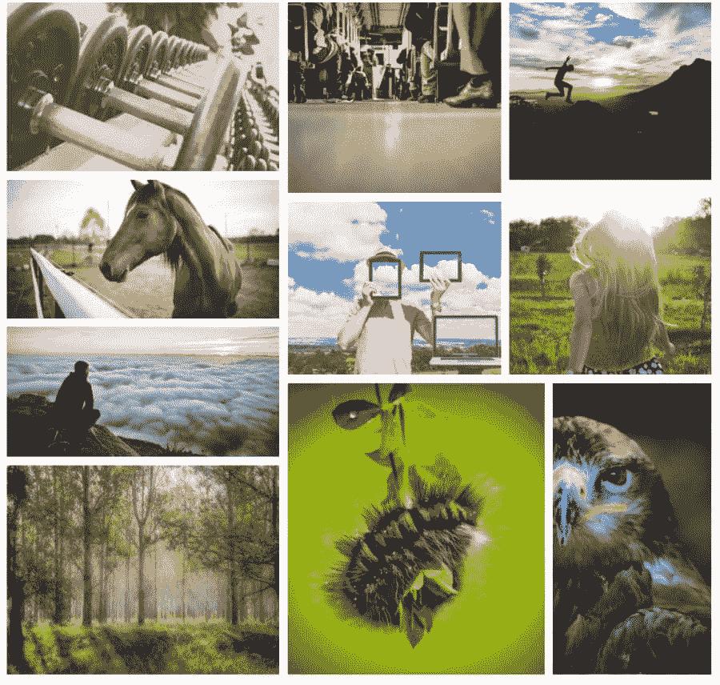

Modula WordPress Photo Gallery Plugin.

Modula 的计划从单个站点的 39 美元开始，到多达 99 个站点的代理选项的 149 美元。

#### 使用 Modula 的理由

*   它使您能够设计自定义网格。所有网格部分都是可定制的，可以选择在 gallery 容器中自由调整图像的大小。
*   轻松创建包含不同灯箱样式的灯箱图库。t
*   您可以添加图像输入动画(如滑动和旋转)。还有超过 40 个内置的悬停效果来吸引注意力，使您的画廊看起来更有吸引力。
*   该插件提供了高级工具，可以用 CSS 进一步定制你的图库[。这不适合初学者，但更高级的用户会喜欢这样的事实，他们可以进入](https://kinsta.com/blog/wordpress-css/)[自定义代码](https://kinsta.com/knowledgebase/edit-wordpress-code/)。
*   其中一个高级扩展允许你添加视频到你的图库中，所有的视频都有简单的链接。
*   该插件提供了[社交媒体按钮](https://kinsta.com/blog/wordpress-social-media-plugins/)，以便你的访客与其他人分享你的照片。
*   您可以从大量的网格格式中进行选择，如砖石、灯箱画廊和规则的方形网格。
*   所有画廊都准备在移动设备上工作。
*   将 gif 图片添加到你的图片库，这样你的整个网格就充满了动态图像。
*   生成相册以更好地组织您的图库和照片。
*   所有定制都是通过拖放界面完成的。
*   一个“辅助网格”让你知道在哪里放置你的图片，并在发布前显示图库的样子。
*   向您的图库添加过滤器，以便用户可以筛选您的图像，并找出他们最喜欢的图像。这对[作品集画廊](https://kinsta.com/blog/wordpress-portfolio-plugins/)尤为重要。
*   该插件的高级版本有一个保护扩展，使网站访问者不能右键单击和下载你的照片。
*   水印扩展可用于[保护您的照片](https://kinsta.com/blog/protect-images/)。
*   速度扩展对于[优化添加到你的图库中的每一张图片](https://kinsta.com/blog/optimize-images-for-web/)来说很方便。
*   使用[短代码](https://kinsta.com/blog/wordpress-shortcodes/)在你网站的任何地方插入你的图库。例如，您可能会考虑在博客帖子或页脚模块中的任何地方放置图库短代码。

#### 选择 Modula 前需要考虑的事项

Modula 主要用于网格图库。这是它最擅长的。免费版本中提供的大多数特性都围绕着网格图库，这也是事实。如果你想解锁幻灯片或其他布局，你需要考虑升级到一个高级版本。

*   **价格:** [免费](https://wordpress.org/plugins/modula-best-grid-gallery/) +付费计划单站点许可起价 39 美元。
*   **点评:** 4.7 分满分 5 颗星(WordPress.org)
*   **活跃安装:** 90，000 以上
*   **PHP 版本:** 5.6 以上

### 2.下一代画廊

据统计， [NextGEN Gallery](https://www.imagely.com/wordpress-gallery-plugin/) 是 WordPress 最受欢迎的 WordPress 照片图库插件之一。它每年继续获得超过 150 万的新下载量，以及很好的总体评价。它是由非常了解这个行业的摄影专家 Imagely 开发的。

NextGEN Gallery WordPress plugin.

NextGEN Gallery 的[免费版本提供了两种主要的图库样式(幻灯片和缩略图图库)和两种相册样式(压缩和扩展)，它们都带有一系列用于控制大小、样式、定时、过渡、控件、灯箱效果等的选项。然后，您可以用各种高级包来扩展它。](https://wordpress.org/plugins/nextgen-gallery/)

除了各种不同的画廊类型，这些高级版本还增加了更多高级功能，如:

*   [电子商务功能](https://kinsta.com/blog/wordpress-ecommerce-plugins/)出售图片。
*   图像保护([热链接保护](https://kinsta.com/blog/hotlinking/)、[水印](https://kinsta.com/blog/protect-images/#watermark-images)等。).
*   灯箱画廊的图像深度链接。

#### 由 NextGEN Gallery 创建的典型画廊看起来像…

次世代画廊的吸引力之一是它提供了如此多不同类型的画廊，所以没有单一的典型画廊。

对于这个例子，我将使用基本的缩略图库，因为它包含在免费版本中。如果您使用专业版，您可以访问更多令人兴奋的模板:

NextGEN Gallery.

#### 使用次世代画廊的理由

*   您可以创建不同图片库的相册，如果您需要显示许多图片，这很有帮助。
*   根据您拥有的版本，您可以创建幻灯片放映图库和许多其他图库类型。
*   高级版本提供高级功能，如水印、深层图像链接等。
*   NextGEN Pro 包括电子商务功能，如果你是一个销售摄影的摄影网站，这很有帮助。
*   你可以在免费版本中选择压缩和扩展图库。所以，这是一个在长长的照片列表和统一布局之间的选择。
*   你会收到不同于日常网格图库的独特选择。这些选项包括缩略图画廊、列表相册和博客风格的画廊。
*   通过[社交媒体按钮](https://kinsta.com/blog/wordpress-social-media-plugins/)和其他选项，如通过电子邮件发送，可以分享图片。
*   您的网站访问者可以访问您的图库并对影像进行评论。这不是必需的，所以您可以打开或关闭该功能。
*   销售税是在销售照片时自动生成的。
*   一些支付网关包括 [Stripe 和 PayPal](https://kinsta.com/blog/stripe-vs-paypal/) 。
*   如果出售画廊的照片，你会得到向顾客发送优惠券的工具。
*   如果您想与一家声誉良好的打印机合作，打印实验室履行是可用的。这通常是大多数摄影师所做的，因为打印照片太费时间和金钱。
*   Lightroom 插件附带了高级版本，用于快速编辑和发布。

#### 选择下一代之前需要考虑的事项

免费版本曾经非常基础，但他们一直在积极增加更多功能。例如，基本幻灯片可以显示箭头和改变过渡时间。NextGEN 是一个专业级的图库。我们推荐给任何买得起的人。首先试用免费版本，然后考虑升级，如果你想保护图像和提供额外的画廊布局。记住，NextGEN Pro 是最昂贵的 WordPress 照片库插件之一。

*   **价格:**免费。最便宜的高级套装是 29 美元的 NextGEN Starter。
*   **点评:** 4.3 满分 5 星(WordPress.org)。
*   **活跃安装:** 70 万+。
*   **PHP 版本:** 5.6 以上。

### 3.Envira 画廊

Envira Gallery 于 2018 年初被 Nathan Singh 收购，是另一个受欢迎的免费增值画廊插件。有一个[免费版本可用](https://wordpress.org/plugins/envira-gallery-lite/)。一些品牌可能会发现，核心插件是他们制作一个美丽的画廊所需要的。然而，许多最酷的特性是为高级插件库保留的。

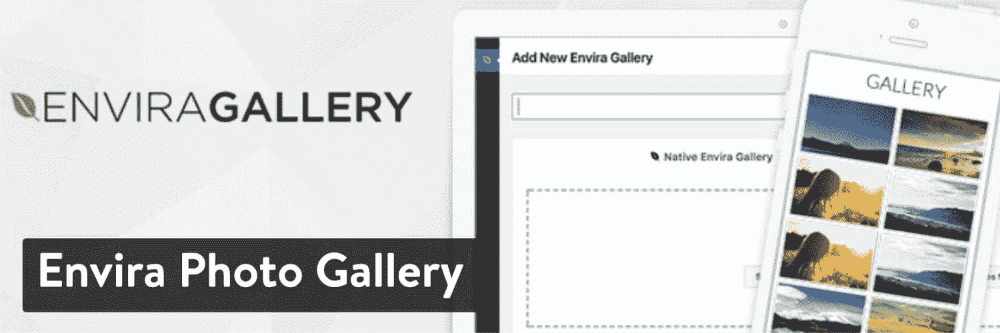

Envira Photo Gallery WordPress plugin.

Envira Gallery 的一个吸引人之处是，像 Modula 一样，它的界面被设计成尽可能容易地在 WordPress 中快速建立并运行一个好看的图库。

虽然免费版本对基本画廊来说很好，但[各种高级计划](https://enviragallery.com/pricing/)是您获得大量有用功能的地方，包括:

*   社交分享。
*   视频支持。
*   相册。
*   水印。
*   图像深度链接。
*   WooCommerce 支持。
*   更多。

#### Envira Gallery 创建的典型图库看起来像…

虽然 Envira Gallery 允许您创建多种类型的图库，但以下是不涉及任何设置的结果:

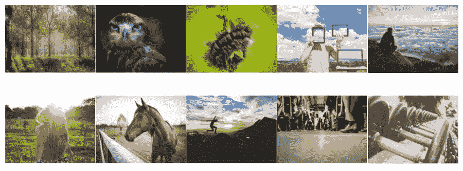

Envira Gallery.

#### 使用 Envira 画廊的理由

*   界面设计得很好，你可以在[拖放生成器](https://kinsta.com/blog/wordpress-page-builders/)的帮助下创建你的图库。没有必要搞乱任何代码。你把图片放到适当的位置，然后点击发布按钮。
*   专业版可以让你使用许多功能(尽管它们可能会很贵)。
*   你可以在你的图库中使用专业版的视频。
*   提供了几个有用的附加组件，支持 [WooCommerce](https://kinsta.com/blog/woocommerce-tutorial/) 、校对、Lightroom 等等。
*   社交媒体分享按钮是标配。
*   您可以链接到您的[社交媒体页面](https://kinsta.com/blog/how-to-create-a-facebook-page/)，并在您的图库中显示这些页面中的照片。
*   免费版提供了相当多的模板，省去了建立一个新画廊的时间。
*   为您的图库分配标签和类别，以便更好地组织。
*   深层链接可以向用户发送更多关于你的照片的信息。
*   Envira Gallery 中创建的所有图库都可以在移动设备上很好地工作。图库和照片会根据您的屏幕大小对齐。
*   你可以与 WooCommerce 整合，通过 Stripe 这样的网关出售你的照片并收取费用。
*   Envira Gallery 是独一无二的，它包括 [Gutenberg blocks](https://kinsta.com/blog/gutenberg-wordpress-editor/) 可以将你的图库放在你网站的任何地方。没有多少竞争者有古腾堡街区。
*   当你想完全阻止用户拍摄你的照片并在其他地方使用它们时，水印和[密码保护](https://kinsta.com/blog/password-protect-wordpress-site/)工具就派上用场了。
*   你可以从 Instagram 和 Pinterest 等网站自动导入图片。
*   如果你有经验摆弄定制编码[的话，CSS 样式](https://kinsta.com/knowledgebase/edit-wordpress-code/)是完全可定制的。

#### 选择 Envira Gallery 前需要考虑的事项

有些人喜欢 Envira，而有些人则建议永远不要考虑它。这是一个 WordPress 图片库插件，你必须测试它，看看它是否适合你。如果价格是你主要关心的，我们建议跳过 Envira 画廊。

总的来说，如果你有钱的话，Envira 画廊的特色是坚如磐石的。然而，想要免费图库的用户应该去别处看看。

*   **价格:**免费。基本高级版本的单站点许可证起价为 26 美元，但全功能专业版的价格为 89 美元。
*   **点评:** 4.8 分满分 5 颗星(WordPress.org)
*   **活跃安装:** 100，000 以上
*   **PHP 版本:** 5.6 以上

### 4.Gmedia 照片库

当人们四处寻找新的 WordPress 照片库插件时，Gmedia 照片库插件可能不是首选。尽管如此，它确实有一个光滑的设计，一旦出版和一些强大的定制工具，以配合你的品牌和满足大型画廊的需求。

你可以免费安装这个插件，不用花一分钱就可以创建一个照片库。一个[高级版本](https://codeasily.com/gmedia-premium/)可供你考虑，一个网站每年 29.99 美元起，当你在 20 多个网站上激活画廊时，每年增加到 8.50 美元。

简而言之，如果你需要在很多网站上放图库，这看起来像是一个可靠且负担得起的图库插件。因此，我们喜欢让[开发商](https://kinsta.com/blog/web-developer-salary/)和[代理商](https://kinsta.com/blog/wordpress-agency/)这样做，因为从长远来看，你可以省钱。

Gmedia Photo Gallery WordPress plugin.

Gmedia 照片库插件突出显示了一系列优秀的演示，供您在安装插件或购买高级版本之前测试照片库的外观。所有的演示都有一些奇怪或难以描述的名字，但有选择的旅游博客、滑块、T2 电子商务产品等等。

总的来说，如果你渴望后端简单，这不是完美的解决方案，但我们喜欢你在发布后看到的结果。

#### 用 Gmedia 照片库创建的典型照片库如下所示…

与大多数图库测试一样，我们安装了 Gmedia 照片图库插件，并试图在几分钟内添加一个图库。不需要调整任何设置来启动测试网站上的图片，但这不像一些竞争对手那样容易。

从下面的截图可以看到，图库一发布出来就很漂亮。但是，您需要在创建图库之前生成一个相册。这在开始时很难弄清楚，也没有多大意义。本质上，您正在创建两个图像集合并将它们链接在一起。

也就是说，结果是一个高质量的画廊，没有任何裁剪或分辨率的困难。

Gmedia Photo Gallery.

#### 使用 Gmedia 照片库的理由

*   Gmedia 照片库插件提供了四个 Gutenberg 模块，可以快速地将照片库添加到文章或页面中。其他的一些模块对于相册和标签来说是很棒的。
*   开发页面展示了大量的演示来激发你的创造力。你可以模仿一些给你的演示，或者从插件的后端选择一个模板。
*   在每篇博客文章的底部有一个自动创建相关文章库的选项。这样就不需要为与[相关的文章](https://kinsta.com/blog/how-to-reduce-bounce-rate/#6-add-related-posts-to-your-site)获取另一个第三方插件。
*   一个[小部件](https://kinsta.com/blog/wordpress-widgets/)可用于图库，减少了将图库添加到页脚或侧边栏所需的时间。
*   激活用户评论，了解人们对你的照片的看法，并收集对你的作品集的反馈。
*   该插件与默认的 [WordPress 搜索栏](https://kinsta.com/blog/wordpress-search/)直接集成。
*   您可以在画廊中播放音乐和视频。
*   分享是在社交媒体按钮和邮件分享工具的帮助下完成的。
*   对于拥有高分辨率照片的用户来说，整页图库模板非常方便。我们最喜欢那些从一开始就让人们惊叹的摄影师。
*   拖放功能可用于调整照片在图库中的组织方式。
*   地理定位可以给你所有的图片添加位置标签。
*   如果你想跳过古腾堡街区，画廊[短码](https://kinsta.com/blog/wordpress-shortcodes/)就会发挥作用。
*   这个插件在你的 WordPress 站点的后端添加了图像编辑工具。

#### 选择 Gmedia 照片库之前需要考虑的事项

这个图库插件在添加到购物车或免费下载核心版本之前，有两个主要方面需要考虑。首先，没有经验的用户可能会发现这个插件太复杂而无法使用。

它提供了数百种设置，其中大部分在[后端](https://kinsta.com/knowledgebase/wordpress-admin/)上组织得不是很好。这对[开发者](https://kinsta.com/blog/hire-wordpress-developer/)来说很好，但是对普通用户来说有一点学习曲线。我们主要不喜欢你必须在激活你的图库之前制作一个相册。为什么我们不能建一个画廊然后就到此为止呢？

我们的第二点是首要优势。这个插件有不止一个，而是四个古腾堡拖放块。这击败了列表中的每一个插件，对于那些喜欢与 Gutenberg 一起工作的人来说是理想的。这些块包括相册、类别、图库和标签的选项。

*   价格:核心的 Gmedia 照片库插件可以在任意多的网站上免费使用。高级功能售价为 29.99 美元，可以在一个网站上建立一个画廊。如果您需要多个许可证，每个许可证的价格会更低。
*   **点评:** 4.5 满分 5 星(WordPress.org)。
*   **活跃安装:**10000+。
*   **PHP 版本:**未列出。

### 5.10Web 的照片库

10Web 的[照片图库插件在 WordPress 图库插件的下载量方面排名靠前。它提供免费和](https://wordpress.org/plugins/photo-gallery/)[高级插件](https://10web.io/plugins/wordpress-photo-gallery/)，在核心插件中提供基本的网格格式。管理界面的设计很容易理解，并立即在您的网站上获得照片。

没有太多你需要担心的设置，使它成为所有经验水平的理想选择。然而，如果你想要一个更高级的画廊设计，如裁剪图像或共济会安排，高级插件是必需的。

Photo Gallery by 10Web WordPress plugin.

这个插件允许你创建无限的图库和无限的相册来存放这些图库。10Web 照片库的一个特别好的功能是，你还可以从[嵌入的视频](https://kinsta.com/blog/embed-youtube-video-wordpress/)中创建照片库，包括将照片和视频混搭在一起的选项。

免费版或高级版中提供的其他有用功能包括:

*   图像水印和右击保护。
*   [社交分享按钮](https://kinsta.com/blog/wordpress-social-media-plugins/)。
*   显示脸书相册的选项。
*   许多不同的图库模板选项。
*   [电子商务](https://kinsta.com/blog/wordpress-ecommerce-plugins/)从您的网站销售数字内容的附加软件。

#### 由 10Web 照片库创建的典型照片库看起来像…

虽然该插件的高级版本增加了更多有创意的图片库类型，但这里有一个典型的图片库示例，您可以使用 10Web 的免费版图片库来创建。这是非常基本的，但它确实有用。

免费版中没有太多定制工具来开发真正脱颖而出的图库。幸运的是，大多数图库都不需要花那么多钱升级到高级版本，包括 10Web 的照片图库。

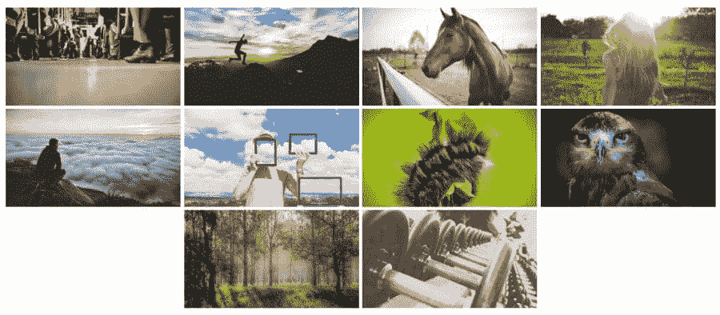

Photo Gallery by 10Web.

#### 10Web 使用照片库的原因

*   使用高级版，您可以在图库中包含图像和视频。
*   创建大量不同的画廊类型，包括砖石，幻灯片，电影，等等(尽管大多数需要高级版本)。
*   获取附加组件以获得显示脸书专辑和销售数字内容等高级功能。
*   如果你担心图片被盗，这个插件包括水印和右键点击保护。
*   图库插件提供了[放大你的 SEO 效率](https://kinsta.com/blog/wordpress-seo/)的字段。例如，它允许你插入相关的标签和元数据，所有这些都可以从你的 WordPress 仪表盘方便地完成。
*   有一个博客风格的选项，以人们阅读博客时习惯的格式呈现你的图像。
*   lightbox 功能在移动设备上看起来非常棒，它提供了 15 种幻灯片效果来吸引注意力，并帮助访问者毫无问题地滚动浏览您的照片。
*   激活社交共享，以确保用户将您的照片发送给他们的在线朋友。
*   有图像评论的可能性，围绕你的图像产生对话，并推动你的作品背后的社区。
*   lightbox 自动播放功能减少了人们在观看幻灯片时点击任何按钮的需要。
*   画廊支持视频和音频，这意味着音乐家和其他以音频为中心的企业可以有组织地展示他们的作品。
*   你可以从像 [YouTube](https://kinsta.com/blog/youtube-stats/) 、 [Instagram](https://kinsta.com/blog/best-blogging-platform/#14-instagram) 、 [Flickr](https://kinsta.com/blog/free-images-for-wordpress/#flickr) 和 [Vimeo](https://kinsta.com/blog/video-hosting/#3-vimeo) 这样的地方下载媒体。
*   插件附带了一些小部件，用于快速将图库插入侧栏和页脚等区域。
*   该插件提供预加载的主题来开始设计过程。但是，您可以自定义大多数元素，如颜色和照片大小，以匹配您网站的品牌。
*   相当多的附加软件被出售或免费赠送，以实现结果或脸书专辑，销售数字图像，等等。

#### 选择 10Web 照片库之前需要考虑的事项

像 NextGEN Gallery 一样，许多最好看的图库模板只在高级版中提供。然而，一旦你解锁了这些高级功能，10Web 的照片图库插件将图库游戏带到了一个新的高度。

*   **价格:**免费。高级版本的单站点许可起价为 30 美元。额外许可证的价格会上涨。你也可以注册一个插件捆绑包，从 10Web 开发者那里获得每一个插件。
*   **点评:** 4.6 分满分 5 颗星(WordPress.org)
*   **活跃安装:** 300，000 以上
*   **PHP 版本:**未列出

### 6.喷气背包

如果你不熟悉， [Jetpack](https://wordpress.org/plugins/jetpack/) 是 Automattic 的一个流行的多功能插件，它为[自托管 WordPress](https://kinsta.com/blog/wordpress-com-vs-wordpress-org/) 安装带来了几个[WordPress.com](https://kinsta.com/blog/best-blogging-platform/#5-wordpresscom)的特性。

Jetpack WordPress plugin.

其中一个特性是对核心 WordPress 图库功能的增强。虽然 Jetpack 的图片库不像以前的 WordPress 图片库插件那样强大，但它是创建基本类型图片库的好选择，特别是如果你已经在你的网站上使用 Jetpack。

此外，Jetpack 图库可供您免费使用，无需担心额外的升级。当然，Jetpack 有几个其他的附加组件和功能，你可以付费，但所有的图库功能都是免费的。

我们特别喜欢 Jetpack，因为它提供了消除你可能正在使用的许多其他插件的可能性。插件越少，网站性能越好，所以许多网站所有者选择 Jetpack 或类似社交媒体分享按钮、图库和 SEO 的东西。

#### 由 Jetpack 创建的典型图库看起来像…

标准的 Jetpack gallery 显示规则的正方形，裁剪到照片，图像之间的空白。您给出了将此布局调整为平铺或圆形的选项:

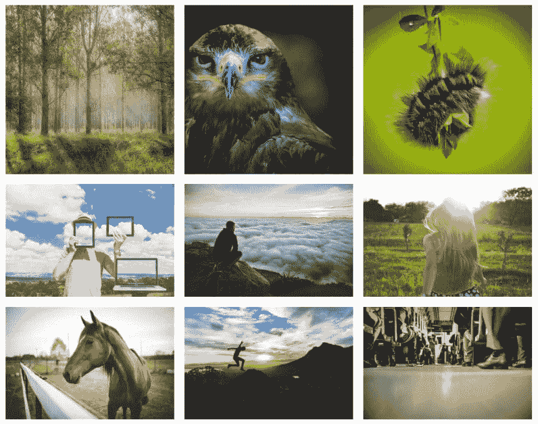

Jetpack gallery.

#### 使用 Jetpack 的理由

*   Jetpack 插件的图库部分是完全免费的，一路上没有追加销售。
*   Jetpack 图库增强了当前 WordPress 上的图库系统。它们非常适合添加简单、干净的图库，而无需进行过多编辑。
*   一些格式预装了 Jetpack 平铺图库功能。一个是没有任何裁剪的标准瓷砖，而另一个提供了一些裁剪的完美正方形。另一个选择是将图片剪切一点，使它们变成圆形。
*   如果你不想的话，可以不使用 Jetpack 的图库。例如，你可能会发现你喜欢 Jetpack 的某些部分，但会为你的照片使用不同的插件。
*   在 Jetpack 中运行图库之前，需要打开[图片 CDN 工具](https://kinsta.com/help/kinsta-cdn/)。这确保了图像加载迅速，不会对网站性能造成问题。
*   平铺的图库块用于将快速图库拖放到页面或文章中。
*   您可以对每个图库进行简单的更改，比如添加新名称、激活随机顺序以及使用更多列。
*   为画廊中的所有图像添加标题，或者删除标题以获得更整洁的外观。
*   对于想要控制 Jetpack 图库前端外观的开发人员来说，有一些高级的编码功能。例如，您可以决定添加一些自定义代码来定义画廊的特定宽度。

#### 选择 Jetpack 之前需要考虑的事项

如果你安装 Jetpack 只是为了它的图库功能，你可能会失望。Jetpack 不是作为一个图库插件设计的，而是一个 WordPress 基本工具的集合。图库工具相当可靠，所以给它一个机会。

请记住，Jetpack 图片库远没有本文中提到的其他一些 WordPress 图片库插件灵活。此外，画廊没有在安装 Jetpack 后立即激活。您必须转到设置并打开表演区域中的画廊。还必须激活图像 CDN，图库才能正常工作。

Jetpack 对于许多梦想将多个插件编译成一个插件的网站所有者来说是有意义的。因此，如果你只是在寻找一个基本的、干净的、免费的图库，Jetpack 看起来是个赢家。此外，您可以选择利用 Jetpack 的其他功能进行备份、暴力阻止和社交媒体共享。有些功能是免费的，但有些可能需要付费。

如果你已经在你的网站上使用 Jetpack 做其他事情，你也应该测试一下 Jetpack 的图库部分。如果你已经有了一个插件，就没有必要再添加新的插件了！

*   **价格:**免费(Jetpack 中的一些功能需要付费，但这取决于你是否想要它们。画廊完全免费)。
*   **点评:** 3.9 分满分 5 颗星(WordPress.org)
*   **活跃安装:**500 多万
*   **PHP 版本:** 5.6 以上

更多信息，请跟随我们的指南[如何配置 Jetpack](https://kinsta.com/knowledgebase/wordpress-jetpack/) 。

### 7.Supsystic 的照片库

像这个列表中的大多数其他 WordPress 照片库插件一样，Supsystic 的[照片库是另一个免费的插件，它提供了一个可靠的免费版本，在 Pro 版本的后面隐藏了一些附加功能。高级版从每年 46 美元开始，无限量站点的费用高达每年 149 美元。](https://wordpress.org/plugins/gallery-by-supsystic/)

使用 Supsystic 的照片库，您可以使用多个模板创建无限的照片库。然后，您可以通过编辑边距、阴影、边框等来自定义这些图库。一些画廊类型包括视频，宝丽来，旋转木马和砖石。

在测试了免费版本之后，我注意到一般的企业都可以通过定制来制作一个漂亮的图库，而且完全不需要升级。然而，许多公司会为特定的布局和排列扣动扳机。

Photo Gallery by Supsystic WordPress plugin.

如果您需要[批量导入图片](https://kinsta.com/knowledgebase/bulk-upload-files-wordpress-media-library-ftp/)或从社交网络导入图片，Supsystic 的照片库有几个很酷的功能，可以让您:

*   通过 FTP 将图像添加到您的图库。
*   从脸书、 [Instagram](https://kinsta.com/blog/wordpress-instagram-plugin/) 等导入图片。

如果你有专业版，你也可以在你的图库中显示视频，包括从 YouTube 直接导入视频的功能。

#### 由 Supsystic 的照片库创建的典型图库看起来像…

像许多其他人一样，Supsystic 的照片库包括几个不同的模板。即使是免费的插件也有一些有创意的模板可供选择。以下是免费马赛克图库类型的外观。我没有接触任何设置来给你一个默认情况下画廊产生的概念。

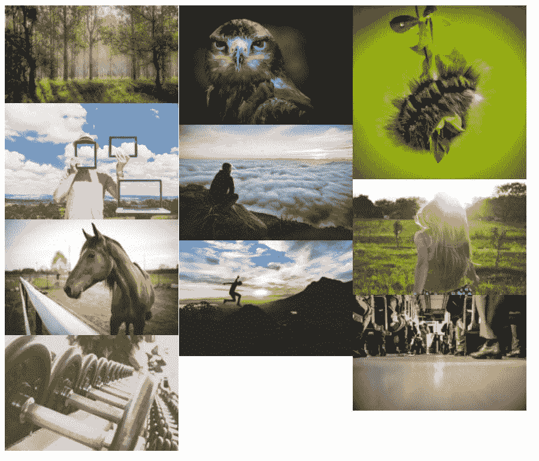

Photo Gallery by Supsystic.

#### Supsystic 使用照片库的原因

*   您可以通过 FTP 将图像添加到您的图库[，如果您正在处理许多不同的图像，这将非常有用。](https://kinsta.com/blog/best-ftp-clients/)
*   您可以从脸书、Instagram 和 YouTube 等社交网络导入图像。
*   专业版包括[分页](https://kinsta.com/blog/wordpress-pagination/)和图像类别(图库过滤器)。
*   你可以[给你的图库添加水印](https://kinsta.com/blog/protect-images/#watermark-images)(即使是免费版)。
*   几十种图库类型使这个插件在竞争中脱颖而出。例如，你可以找到带有社交分享按钮、个人说明和马赛克设计的不寻常的图库。
*   这两个版本的图库都有吸引人的风格可以定制。这些样式更改包括阴影、边框和图标的设置。
*   画廊是搜索引擎优化友好的。
*   Supsystic 使用照片库制作的所有照片集[都可以在移动设备上查看](https://kinsta.com/blog/web-design-best-practices/#mobile-responsiveness)。
*   为了快速加载，包含了一些元素，比如 Load More 按钮、分页和所有图像的延迟加载。
*   [图像压缩](https://kinsta.com/blog/optimize-images-for-web/)在您上传新图像时进行。将这与内置优化结合起来，您就不必过多考虑您的[图像文件](https://kinsta.com/blog/image-file-types/)是否过大。
*   该插件带有 [CDN(内容交付网络)](https://kinsta.com/blog/wordpress-cdn/)选项。
*   你可以将这个插件翻译成几十种其他语言，包括日语、意大利语和土耳其语。
*   标题和图像过滤器是 Supsystic plugin 的照片库的标准配置，允许像褪色的图库图像和这些图像的标题这样的效果。
*   当人们浏览你的照片时，你可以加入动画。
*   通过制作相册和标签来管理您的照片。我们最喜欢这种方式来收集大量照片，尤其是当您打算搜索或过滤这些图像时。
*   您可以完全控制视觉效果，如按钮和标题。只需简单点击几下，即可改变颜色和字体等项目。

#### 选择 Supsystic 照片库之前需要考虑的事项

画廊创建界面有点繁忙和复杂，尽管这不是一个主要的缺点。

我们相信，Supsystic 的照片图库为那些寻求创建有趣图库的人提供了一个坚实的利基市场。宝丽来模板是一个很好的例子，因为它把你所有的图像交错宝丽来打印。

除此之外，很明显，一些公司使用 Supsystic 的免费照片库没有问题。然而，当您开始为许可证付费时，真正的定制就开始发挥作用了。

*   价格:免费。专业版单站点许可起价 46 美元。
*   **点评:** 4.8 满分 5 星(WordPress.org)。
*   **活跃安装:5 个** 0，000 个以上
*   **PHP 版本:**未列出。

### 8.对齐图像网格

对齐图像网格是这个列表中为数不多的在 WordPress 不能免费获得的 WordPress 图片画廊插件之一。但是，它是 CodeCanyon 上最畅销的 WordPress 图片库插件，销量超过 20，900。所以，这是个好兆头！

## 注册订阅时事通讯

### 想知道我们是怎么让流量增长超过 1000%的吗？

加入 20，000 多名获得我们每周时事通讯和内部消息的人的行列吧！

[Subscribe Now](#newsletter)

虽然你不能在 CodeCanyon 上测试这个插件，但它提供了一个演示，让你至少可以看到图库是如何出现在网站前端的。我们也鼓励你浏览评论、评论和截图。

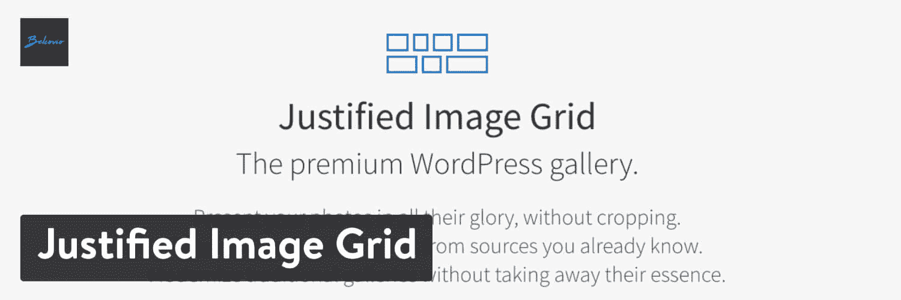

Justified Image Grid WordPress plugin.

除了保持图像原始长宽比的漂亮水平图像网格之外，对齐图像网格最非凡的一点是，它允许您从大量不同的外部服务导入内容，如:

*   脸书。
*   Flickr。
*   YouTube。
*   Vimeo。
*   [RSS](https://kinsta.com/blog/wordpress-rss-feed/) 。

您甚至可以将最近的帖子或 [WooCommerce 产品](https://kinsta.com/learn/woocommerce-guide/)作为项目导入画廊。

尽管 Gutenberg 块没有提供对齐图像网格插件，但开发人员已经取得了很大进展，以确保所有图库都可以使用拖放构建器。此外，该插件还集成了实时预览功能。

#### 由对齐图像网格创建的典型图库看起来像…

对齐图像网格的卖点之一是它的水平图像网格保留了所有图像的原始纵横比。你可以在下面的例子中看到这一点。

这是非常有用的，因为没有什么比配置一个图库插件却发现你的部分或大部分图片被错误地裁剪或者根本没有被裁剪更令人沮丧的了。

Justified Image Grid example.

#### 使用对齐图像网格的原因

*   图像网格会保留图像的宽高比，而不是未经您的允许就裁剪它们。有时图像会被裁剪，但前提是您在设置中指定了想要这样做。总的来说，这是一个伟大的插件来保持你的照片质量。
*   该插件提供了许多内容源的链接。这意味着你可以将图库连接到你的博客或 WooCommerce 等网站，这样照片就会自动更新。其他来源包括脸书、Flickr、NextGEN 和 RSS。
*   视频支持需要你从 YouTube 和 Vimeo 等地方粘贴视频链接。
*   整个插件是手机友好的，视网膜就绪，适用于平板电脑和手机上的所有访客。
*   灯箱上有社交分享按钮。
*   一些特殊效果是对齐图像网格插件所独有的。你所要做的就是为一幅图像或整个图库选择一种效果。
*   该插件与 Gutenberg 配合得很好，尽管它不提供将图库立即放入页面的功能块。
*   如果您对使用拖放构建器感兴趣，可以使用 WPBakery 集成。
*   通过使用自定义链接、过滤和无限滚动的一些设置来调整自定义照片行为。
*   视觉方面很容易定制，具有特殊效果，如模糊，发光和棕褐色选项。
*   这个插件有工具可以改变你图库中所有图片的长宽比和重新定义它们的形状。
*   短代码编辑器确保你总是有办法在你的网站上的某个地方放置一个图库。
*   lightboxes 与其他插件(包括列表中的一些)兼容，如 Foobox、NextGEN 和 Jetpack。
*   该插件在 WPML 插件的帮助下提供翻译支持。
*   您可以选择上传动画 gif 和透明 png 到您的画廊。
*   CDN 的兼容性加快了你的网站的速度，减少了加入另一个性能插件的需求。
*   包括从照片库中下载或发表博客文章的链接。

#### 选择对齐图像网格之前要考虑的事项

没有免费版本的调整图像网格，但这种优质的解决方案提供了出色的客户支持和令人难以置信的功能冲击。更不用说，它的售价很低，一次性成本。

如果你喜欢其他一些 WordPress 图片库插件裁剪图像的方式，你会想继续使用它们而不是对齐图像网格。然而，我们知道很多人喜欢从合理的图像网格中删除，特别是因为它似乎不会减少图像视图或使事情看起来很傻。

*   **价格:**整个插件 27 美元。这个插件没有免费版本。延长客户支持时间也需要付费。
*   **点评:** 4.79 分满分 5 颗星(CodeCanyon.net)
*   **活跃安装:** 20，000 以上
*   **PHP 版本:**未列出

### 9.珠穆朗玛峰画廊 Lite

Everest Gallery Lite 是市场上较新的 WordPress 图片库插件之一。然而，它是由 AccessPress Themes 的团队开发的，他们有着创造[高质量主题](https://kinsta.com/best-wordpress-themes/)的悠久历史。该插件提供了多种模板，包括网格布局和砖石布局。

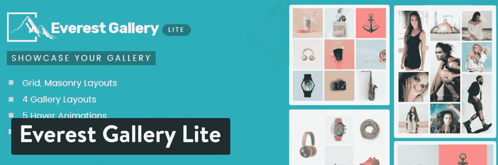

Everest Gallery Lite WordPress plugin.

该插件的免费版本包含了相当多的内容。该插件具有 30 多种无缝图库布局，并允许您配置栏以适应屏幕大小。它有悬停动画，灯箱选项，并能够在发布前预览一切。你也可以用它的[高级版本](https://codecanyon.net/item/everest-gallery-responsive-wordpress-gallery-plugin/20067428)来扩展插件。

#### 由 Everest Gallery Lite 创建的典型图库看起来像…

Everest Gallery Lite 的卖点之一是其所有布局都具有非常现代的感觉。最好的配置只在高级版本中提供，但是当使用 Lite 插件时，它仍然非常可靠。

下面的例子显示了在我安装了 Lite 插件并上传了一些图片后，图库看起来是什么样子的，所有这些都没有触动任何设置。

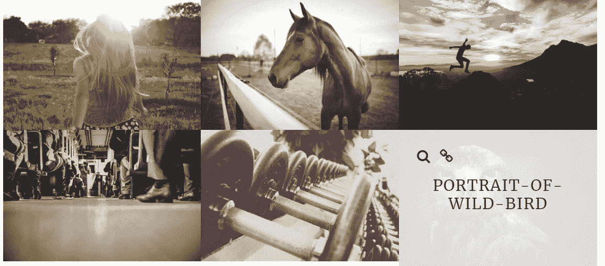

Everest Gallery Lite grid layout.

#### 使用 Everest Gallery Lite 的理由

*   如果你想让你所有的图片库布局有一种现代的感觉，这个插件是很棒的。
*   它允许你利用他们的拖放系统。
*   您可以控制每个定制方面，从图像的大小到当用户滚动图像时它们对效果的反应。这对于渴望完全控制的开发人员来说至关重要。
*   免费版有四种布局，高级插件有 30 多种布局，让你的设计灵感源源不断。
*   你会收到一些预先设计好的优秀悬停动画，当人们在图像上滚动时，这些动画一定会引起注意。
*   一些独特的画廊格式让你从竞争中脱颖而出。例如，电影设计看起来棒极了，博客画廊直接链接到你的特色图片。
*   该插件支持来自 Instagram 和 YouTube 等各种来源的图像和视频。
*   图像过滤器是预先设计好的，可以定制以匹配您网站上的品牌。
*   分页和加载更多按钮提供了多种颜色、效果和字体。
*   lightbox 提供了各种选项来显示更大版本的图像。
*   如果你有这样的经验，你可以插入你的自定义 CSS。
*   一旦你弄清楚所有的控制，后端就很容易使用。

#### 选择 Everest Gallery Lite 之前需要考虑的事项

Everest Gallery Lite 是市场上较新的 WordPress 图片库插件之一，但它也是更先进的工具之一。它包括调整图库每个细节的工具，是开发人员的理想选择。

这对每个人来说听起来都是一件好事，但是如果您对无穷无尽的设置不感兴趣，配置就会变得令人困惑。如果你只是上传你的照片，并有一个标准的网格布局，想想这个列表中的其他插件。

最后，高级版本通过 Envato Market 销售，这意味着您必须支付额外的费用来延长一整年的支持。

*   **价格:**Lite 版免费，CodeCanyon 上的 Pro 版 21 美元。之后，额外的客户支持也需要付费。
*   **点评:** 5 颗星中的 5 颗(WordPress.org)。
*   **活跃安装:**2000 个以上
*   **PHP 版本:**未列出。

### 10.机器人图片库

Robo 的图片库有一个通过 WordPress.org 的免费插件，由 T2 的高级版本补充。该插件无需从一开始就调整设置就能产生惊人的效果。此外，古腾堡模块提供即时出版，消除了任何短码的需要，除非你喜欢使用它们。

类似于其他一些带有古腾堡区块的 WordPress 图片库插件，这个特殊的功能大大加快了这个过程。毫无疑问，你是否忘记保存画廊，或者在出版前它会是什么样子。您可以在发布该系列之前测试一下图库，看看会有什么。

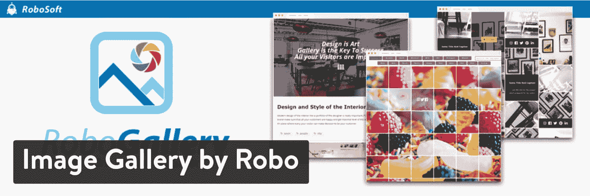

Image Gallery by Robo WordPress plugin.

我们喜欢开发商在 WordPress.org 页面上提供了几十个演示，供您测试并为您的画廊设计寻找灵感。YouTube 演示看起来不错，如果你想在一个不断更新的图库中包含特色图片，博客风格当然值得考虑。

还提供了到 Vimeo 的连接，为所有内容创建者将你的图库变成一个更灵活的解决方案。免费版本的插件似乎提供了丰富的设置库，但看看高级演示来找出你可能缺少的东西也不失为一个好主意。

#### 由 Robo 的图像库创建的典型图库看起来像…

由 Robo 插件提供的图片库中的默认设置看起来时尚且用户友好。和我的大多数测试一样，我没有使用任何设置来发布图片库，也没有看到它开箱后的样子。在免费版本中有相当多的设置可用，但我认为标准图库在不做任何调整的情况下看起来相当不错。

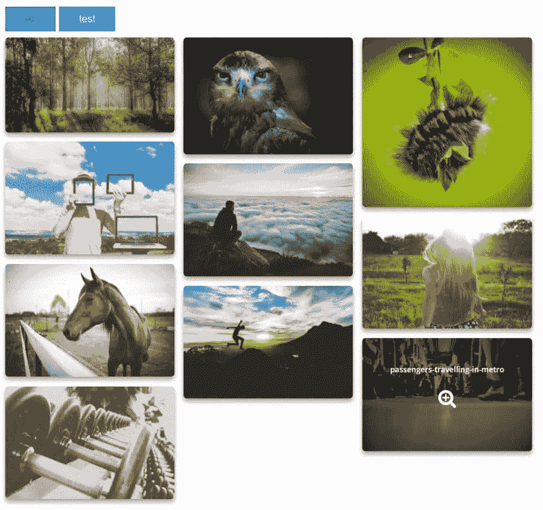

Image Gallery by Robo.

#### 使用 Robo 图片库的理由

*   安装插件，上传照片，将古腾堡区块放到页面或帖子中，不超过一两分钟。默认的设计也很漂亮，并且可以让你的图片看起来像真的一样。
*   该插件产生响应图库，因此不管客户使用什么尺寸的屏幕。
*   当有人用鼠标悬停在你的图像上时，淡入淡出效果被激活。
*   你可以批量上传大量的图片，而不会引起 WordPress 限制的问题。
*   该插件具有自动调整图像大小和裁剪图像的设置。默认工具是为了让你的图片保持原来的样子，但是很高兴知道你可以尝试使用[缩略图和调整](https://kinsta.com/blog/regenerate-thumbnails/)的大小。
*   超过 15 个额外的悬停效果是该插件的标准配置。你必须为它们中的一些付费，但对于高级版本来说价格还不错。
*   该插件的代码是稳定和轻量级的，最大限度地减少了与其他插件和主题的冲突，同时也消除了它可能对现场性能产生的任何影响。
*   从宝丽来效果中进行选择，为您的画廊增添一点乐趣和怀旧之情。
*   一个内置的颜色选择器可以让你找出你的品牌颜色，并与你的画廊相匹配。
*   边框和阴影已经配置为默认设置，但是您也可以选择删除它们。
*   [字体设置](https://kinsta.com/blog/wordpress-fonts/)是完全可定制的，每个图片上都有标题、说明和描述工具。
*   高级缓存和延迟加载通过确保您的图像不会对[站点性能](https://kinsta.com/learn/page-speed/)造成问题来增加插件的价值。
*   裁剪和调整大小可以通过手动工具来完成。
*   每个 lightbox 都提供各种效果和功能，如字体透明度、社交分享按钮和字体颜色。
*   Robo 的图片库插件支持来自 Vimeo 和 YouTube 等各种来源的视频。

#### 选择 Robo 图库前需要考虑的事项

这是一个带有古腾堡块的图库插件，与没有古腾堡块的插件相比，它非常有价值。同样令人印象深刻的是，核心插件中包含了如此多的免费功能。有些人可能会觉得界面有点过于混乱，但图库结果应该会缓解这些担忧。

创意是这个游戏的名字，由 Robo 设计，它的动画和效果与我们在其他插件中看到的完全不同。

与我们世界一流的支持团队一起体验卓越的 WordPress 托管支持！与支持我们财富 500 强客户的同一个团队聊天。[查看我们的计划](https://kinsta.com/plans/?in-article-cta)

*   **价格:**核心插件免费。高级版起价 30 美元，一次性付款。多个网站安装需要更高价格的计划。
*   **点评:** 4.4 分满分 5 颗星(WordPress.org)
*   **活跃安装:** 50，000 以上
*   **PHP 版本:**未列出。

### 11.喵画廊

喵画廊由[喵应用](https://meowapps.com/)开发，这是一个由法国和日本开发者组成的小团队，总部位于日本。该插件的免费版本包括五种免费布局(瓷砖、砖石、两端对齐、正方形和层叠式)，一个古腾堡块，甚至还有一个短代码，让你更容易管理你的画廊。

这是迄今为止最快的 WordPress 图片库插件之一。与我为本文所做的其他测试相比，喵图库大大减少了上传和插入图库的时间。至于定价，大多数公司对核心插件都没问题。

但是您可以升级到高级版本，以获得额外的客户支持、附加功能和多个站点的许可证。

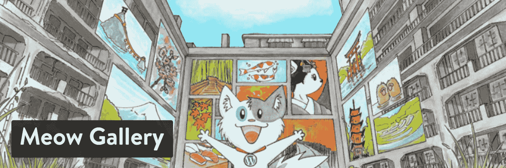

Meow Gallery WordPress plugin.

喵图库也可以和 Lightroom 一起使用(通过 WP/LR Sync):只需点击一下就可以和你的图库同步。

#### 喵画廊创建的典型画廊看起来像…

在这个图库插件的免费版本中提供的五种布局中，标题布局选项显示了这个插件对于那些运行摄影博客的人来说是一个多么令人兴奋的选项。

正如在这个插件的介绍中提到的，我认为喵图库插件在上传照片、发布照片以及对照片的外观感到满意方面是这个列表中最快的。正如你所看到的，没有图像被裁剪，它们之间有一个体面的空白，它有一个现代的瓷砖设计。

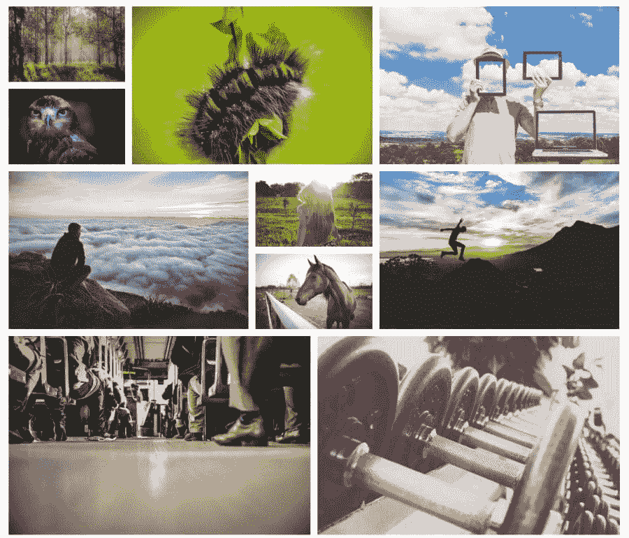

Meow Gallery: Tiles layout.

#### 使用喵图库的理由

*   喵图库插件有许多照片过滤器，可以给你的图库添加令人兴奋的效果。
*   这是一个 WordPress 照片图库插件，可以帮助你在几秒钟内建立一个令人满意的图库并在你的网站上运行。这是我目前为止测试这些插件最快的体验。更不用说，发布后我不用编辑任何设置。
*   这是一个轻巧、快速、反应灵敏、支持视网膜的插件，可以在所有移动设备上运行。
*   该插件与 Lightroom 连接以编辑该程序，并将完成的产品发送到您网站上的画廊。
*   古腾堡模块可以快速搜索。你所要做的就是在古腾堡编辑器中启动图库之前，按照你喜欢的方式配置设置。
*   有相当多的布局可供选择，包括对齐、砖石和方形。它们看起来都很漂亮和现代，边缘和裁剪做得相当好。
*   可以将您的图库项目链接到外部和内部链接。当链接到[作品集项目](https://kinsta.com/blog/wordpress-portfolio-plugins/)甚至是与图片相关的第三方文章时，你可以考虑这个。
*   音乐和其他类型的[音轨](https://kinsta.com/blog/wordpress-audio-players/)可以添加到您的图像中。当有人点击画廊项目时，音乐就会播放。
*   该插件具有一个惰性加载工具和无限加载。这些很好地结合起来，为最终用户提供了更快的整体网站和更流畅的体验。
*   旋转木马设计在高级版本中可用，以幻灯片的方式展示您的图像。
*   还有一种独特的图库格式，称为“地图布局”，是分享旅行照片的理想选择。我们最喜欢它给经常在世界各地旅行的旅游博主或摄影师。你甚至可以将画廊链接到谷歌地图上，给网站访问者完整的体验。
*   动画为您的图库提供了动态效果。一旦你升级到高级版本，你可以从这些效果列表中选择。一些选项包括淡入、着色和高亮。
*   发布图库前选择所有图像的大小。一些用户喜欢缩略图，而另一些用户则坚持使用全尺寸图片。您可以启用从文件名中自动提取的标题。

#### 选择喵画廊之前要考虑的事情

一些优秀的特性，比如轮播格式和动画，只有 pro 版的插件才有。

从好的方面来说，喵图库制作了令人惊叹的图片图库，而无需你做太多工作。在承诺付费解决方案之前测试一下这个是有意义的。这个过程如此之快是因为有一个古腾堡块，因为默认格式通常不需要你回去编辑任何东西。

*   **价格:**核心 app 免费。高级版每年 19 美元起。
*   **点评:** 4.9 分满分 5 颗星(WordPress.org)
*   **活跃安装:**6000 个以上
*   **PHP 版本:** 7.0 或更高

### 12.作品集画廊

组合图库为你的 WordPress 站点提供令人惊叹的图库，不需要任何复杂的编码。它没有古腾堡街区，但画廊的设计过程不超过几分钟。无论是[高级用户](https://kinsta.com/blog/free-html-editor/)还是初学者，使用作品集制作精美的演示文稿都不会有问题。

核心插件是免费下载的，但是你可以选择花 29 美元升级到高级版本。这提供了优越的支持，更多的模板，无限的过滤器，以及更长的功能列表，使您的画廊脱颖而出。

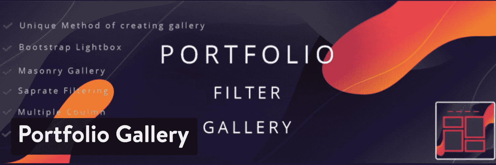

Portfolio Gallery WordPress plugin.

与其他 WordPress 图片库插件相比，我们喜欢它的原因之一是因为后端的简单性。一开始可能会显得有些杂乱，但只需一会儿就能意识到大上传按钮的位置，以及将图库放在网站其他地方的简码。

更重要的是，我们测试了平板电脑和智能手机上的移动画廊，看它们出来很漂亮。

#### 由 Portfolio Gallery 创建的典型画廊看起来像…

下图是没有任何设置的图库。这并不坏，考虑到你仍然得到光滑的效果，如阴影和圆形边缘。你不能用截图再现这一点，但主图库也会产生动画，当你在照片上滚动鼠标时，图像会移动一点。

图库是使用短代码插入的。制作图库时，您还可以选择添加链接和实现标题。标题是从文件名中提取的。我觉得这很讨厌，但有些人可能会有不同的看法。

总的来说，作品集插件的结果看起来既时尚又专业。如果看起来不太对劲，你可以随时回去更改设置。

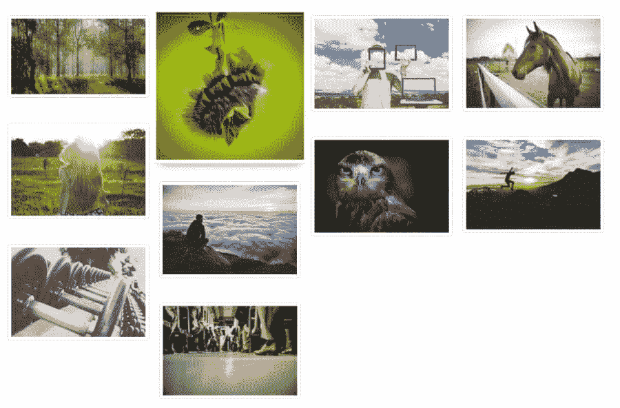

Portfolio Gallery.

#### 使用作品集插件的理由

*   这是 WordPress 图片库插件之一，包含了你在网站上插入的大多数图片库的过滤器。通过这种方式，您可以立即将您的照片库转换为可过滤的[作品集](https://kinsta.com/blog/portfolio-website/)以便于浏览。
*   lightbox 在移动设备上运行得非常好，加载速度很快，可以快速浏览。
*   单击一个按钮，从设置区域选择多个列。
*   您可以选择在图像上显示文本、标题、滤镜和数字。
*   每次创建图库时，系统都会询问您是要添加间距还是不添加间距。
*   作品集插件附带了一些模板，包括砖石格式和规则网格。
*   您可以自定义图库中图像的所有内容，从颜色到圆形。
*   高级版包含更多悬停效果和优化工具。
*   您可以选择向帖子、页面和小部件添加多个图库。
*   定制 CSS 区域非常适合想要完全控制图库外观的高级开发者。

#### 选择作品集前需要考虑的事项

与其他 WordPress 照片库插件相比，我们更喜欢 Portfolio Gallery 插件，因为免费版本中包含了大量的功能。

从滤镜到 lightbox 工具和预制模板到图像优化，许多品牌可能会使用这个插件，并决定没有理由升级到高级版本。

你应该记住，它不是市场上最干净的后端界面。所以，一些初学者或洁癖者可能不喜欢这个插件。

最后，作品集插件缺少古腾堡块。

*   **价格:**核心插件免费，高级插件 29 美元。
*   **点评:** 4.8 分满分 5 颗星(WordPress.org)
*   **活跃安装:** 20，000 以上
*   **PHP 版本:** 5.4 以上

### 13.响应式灯箱和画廊

响应式灯箱&图库插件已经安装了数千次，并获得了令人印象深刻的评分。它基本上是免费的，有很多设置。当考虑你最需要的特性时，有几个扩展需要考虑[。不仅如此，一些扩展是完全免费的。其他人有价格标签，但他们不会打破银行。](https://dfactory.eu/products/responsive-lightbox-gallery-extensions/)

你的图库和灯箱的美丽让这个图库插件脱颖而出。你只需点击几下就可以启动一个图库，而且有许多 lightbox 格式可以实现。当你看到这么多只有一两个 lightbox 选项的插件时，这是令人耳目一新的。

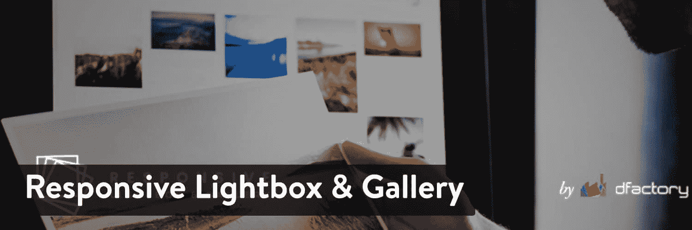

Responsive Lightbox & Gallery WordPress plugin.

总的来说，Responsive Lightbox & Gallery 插件是轻量级的，初学者友好的，扩展灵活。我们最喜欢的几个扩展包括隐藏画廊、更多灯箱、砖石画廊等等。

#### 由 Responsive Lightbox & Gallery 创建的典型图库看起来像…

安装后只需几分钟就可以在网站前端发布一个图库。以下示例是已经在设置中配置的基本图库。

设置区充满了自定义选项，使你的画廊看起来很漂亮。我们认为这对于几分钟的工作来说已经很不错了。更不用说，lightbox 工具可以创建光滑灵活的灯箱。

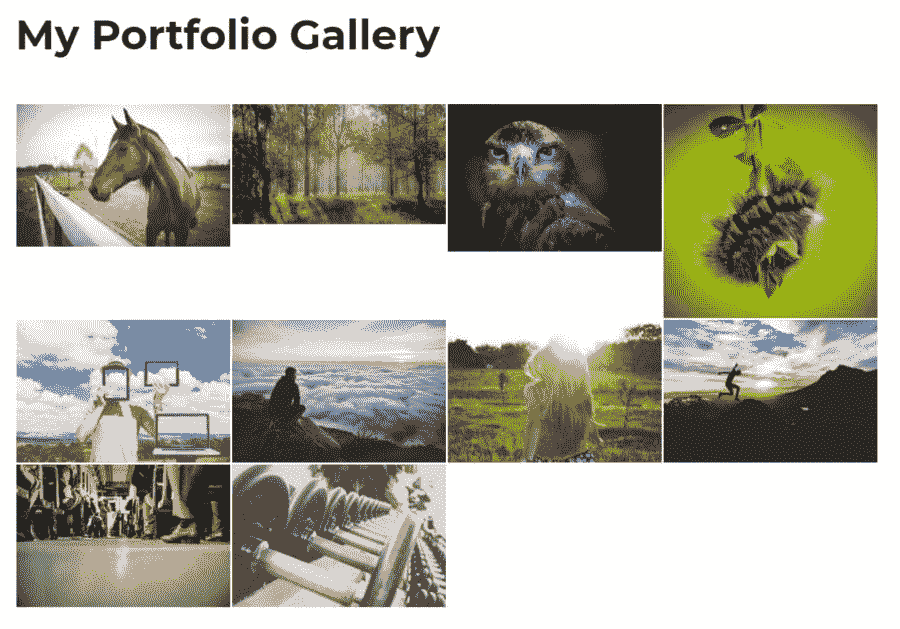

Responsive Lightbox & Gallery.

#### 使用响应式灯箱和画廊的理由

*   图库构建器灵活易用，适合所有技能水平。只有最轻微的学习曲线，所以大多数初学者应该没有任何问题。
*   核心插件包含三个图库模板，帮助您入门。
*   lightbox 是这里真正的佼佼者，插件提供了八种 light box 格式。
*   您可以通过上传图像或将图像链接到帖子来创建图库。
*   许多设计工具都提供了拖放界面。
*   一个远程图片库连接到插件，这样你就可以[找到适合你图片库的创作共用照片](https://kinsta.com/blog/free-images-for-wordpress/)。
*   该插件与古腾堡建筑兼容。插件附带了一个程序块，所以你不必使用任何短代码或小部件。
*   你有机会链接到视频。
*   您可以自动将灯箱添加到整个网站的链接中。
*   如果你打算把你的图库放在页脚或侧边栏这样的地方，图库小部件是可用的。
*   有 [WooCommerce](https://kinsta.com/blog/woocommerce-tutorial/) 支持在一个漂亮的画廊里展示你的产品图片。
*   您可以访问一组高级扩展。其中一些非常适合调整灯箱的视觉效果，而另一些则更适合扩展常规图库的功能。
*   该插件提供了[多站点支持](https://kinsta.com/blog/wordpress-multisite/)。

#### 选择响应式灯箱和画廊前需要考虑的事项

使用响应式 Lightbox & Gallery 插件创建画廊只需几分钟。然而，要获得正确的图库格式需要一点定制。它不像其他选项那样相对简单，但它允许有经验的开发人员和初学者制作漂亮的图库。

该插件最显著的优点是它有古腾堡块。如果这是你的风格，可以考虑试试响应式 Lightbox & Gallery 插件。同样好的是，不需要为插件支付任何费用，并且扩展都是单独出售的，这给了你灵活性。

*   **价格:**免费，可以选择下载其他免费和高级扩展，或者以折扣价购买所有扩展(图片艺术套装)。
*   **点评:** 4.9 分满分 5 颗星
*   **活跃安装:** 200，000 以上
*   PHP 版本: 5.2.4 或更高版本

### 14.图库银行的照片图库插件

图库银行的 [WordPress 照片图库插件是从头开始创建图库的绝佳解决方案。您可以轻松制作展示和作品集，借助小工具和短代码在页面上发布您的图库。](https://wordpress.org/plugins/gallery-bank/)

开发者夸口说这个插件包含了 200 多种功能，你可以制作从砖石设计到缩略图布局的任何东西。我们发现界面相对容易理解。对某些人来说，它可能看起来有点杂乱，但所有的设置都被整合到一个区域，带有清晰标记的按钮，用于上传图像和获取短代码。

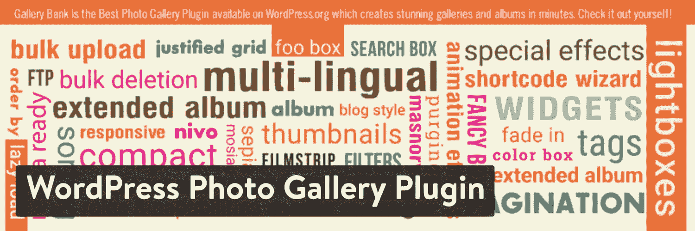

WordPress Photo Gallery Plugin by Gallery Bank.

看起来你需要组装图库的很大一部分功能都在这个插件的免费版本中。然而，要达到 200 个功能标志，你必须注册[高级版](https://tech-banker.com/gallery-bank/)。

这也能让你获得 WordPress 上[标准论坛之外的客户支持。如果能有一个古腾堡块来代替短码，那就太好了，但是我们只能寄希望于未来了。](https://kinsta.com/blog/wordpress-support/#forums-groups-and-channels)

#### 图库银行的 WordPress 图片库插件创建的典型图库看起来像…

图库出来很漂亮，不用碰设置模块里的一个按钮。你可以选择标准或砖石开始，但这是所有你必须考虑之前，将它添加到你的网站页面。

短代码很长(与短代码应该是的[相反)，但是复制粘贴代码很容易。](https://kinsta.com/blog/wordpress-shortcodes/)

除此之外，边距、尺寸、裁剪和 lightbox 元素都表现得很好。你不能对图库插件要求更多，尤其是考虑到有这么多插件开箱后看起来很糟糕。

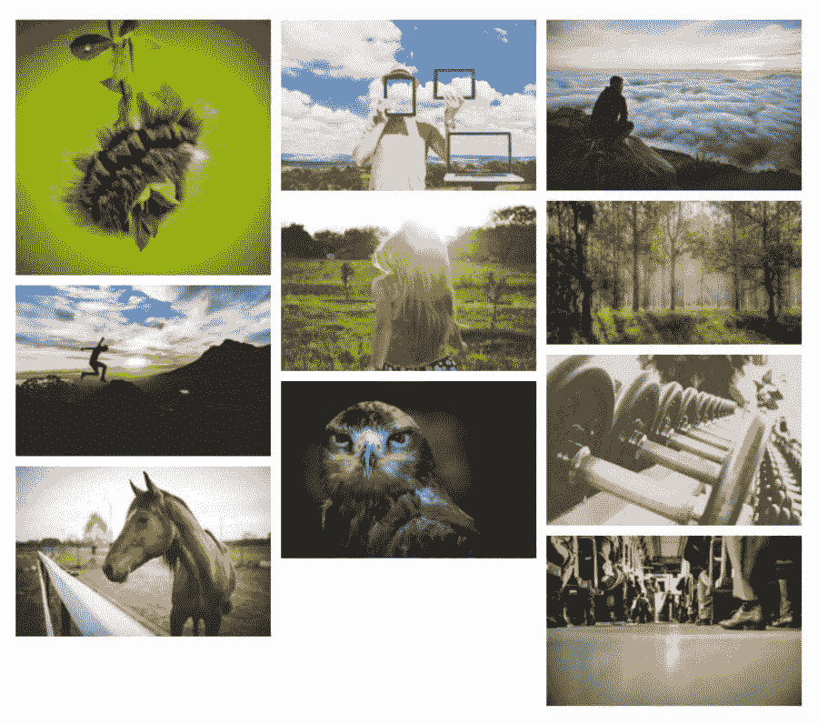

WordPress Photo Gallery Plugin by Gallery Bank.

#### 图库银行使用 WordPress 图片库插件的原因

*   WordPress 图片库插件有响应图片库，在移动设备上看起来非常漂亮。太多时候，我们偶然发现声称响应的插件，但随后图库在移动设备上失败了。
*   无需调整任何设置，您就可以获得干净、现代的画廊设计。
*   该插件提供砖石和缩略图布局。
*   每个图片库都是通过快速上传你的照片，然后生成一个短代码供你粘贴到页面和帖子上来建立的。
*   您可以创建无限数量的图库，想要多少照片就有多少照片。
*   你上传的所有图片都存储在一个不同的文件夹中，以免在 wp-uploads 文件夹中出现问题。
*   高级版扩展了核心功能，增加了一长串额外的布局、相册和上传工具。
*   幻灯片和博客布局是可能的。有工具[链接你的博客文章](https://kinsta.com/blog/wordpress-seo/#16-create-an-internal-linking-strategy)来根据你发表的内容更新图库。
*   在高级版本中有许多灯箱可供选择，包括彩色灯箱和通过 CSS 模块完全可定制的灯箱。
*   当你想让你的图片随着用户的滚动而跳动或旋转时，这些特效就派上用场了。
*   高级版允许水印，保护你的图像不被盗，并使你的品牌更容易。
*   您可以选择将广告添加到图库中。一些网站所有者可能有一个装满广告的画廊，而其他人可能会偷偷把它们放进去，以显得不那么突出。

#### 在选择图库银行的 WordPress 图片图库插件之前需要考虑的事情

这个插件非常适合在几秒钟内启动图库。如果你不希望过多的设置，这是一个可行的选择。我们无法想象大多数人会需要为这个插件付费，看看那个版本中大多数最好的特性是怎样的。

请记住，扩展既可以单独出售，也可以打包出售。如果你计划购买一些扩展，目前最划算的是购买 10 个扩展。然而，拥有这些独立插件的全部意义在于购买时的灵活性，所以如果你只需要一两个插件，就不要购买组合插件。

*   **价格:**免费，每年 35 美元左右起的高级升级。终身会员也很便宜。
*   **点评:** 4.5 分满分 5 颗星
*   **活跃安装:** 10，000 以上
*   **PHP 版本:** 5.4 以上

### 15.GT3 照片库

GT3 的图片库插件提供了图片库插件应有的简洁和紧凑。安装后，它提供了一个古腾堡块，可以立即添加一组图片到任何职位或页面。

我花了一点时间才弄明白如何将照片添加到图库，但它实际上是在古腾堡编辑器内，将所有设置和上传模块保存在一个区域。发现这个区域后，很明显使用这个插件是多么简单，因为所有的调整都是在一个地方完成的。

总的来说，GT3 图片库插件通过扩展 WordPress 上的[编辑器的功能，并为你的照片添加格式精美的演示，生成了优秀的图片库。](https://kinsta.com/blog/wordpress-tinymce-editor/)

Photo Gallery by GT3 WordPress plugin.

更重要的是，您可以访问多个古腾堡块，允许您制作砖石画廊或标准网格。免费版本似乎可以满足基本图库的要求，而且你不需要花太多时间来定制。

还有一款售价 45 美元的[高级版](https://gt3themes.com/gt3-photo-video-gallery-pro-is-live-now/)。该计划提供了新的布局、社交分享选项、图片下载按钮等。如果你愿意，你也可以购买一个图像优化插件。

#### GT3 的照片库创建的典型照片库看起来像…

正如你从截图中看到的，我在使用 GT3 插件的照片库时的第一个结果看起来干净而现代，没有任何严重的裁剪或图像退化。这正是我们在一个高质量的图库插件中寻找的。

WordPress 编辑器中的 Gutenberg 设置也很有用。这将所有工具合并到一个区域，在可视编辑器中显示您的调整。

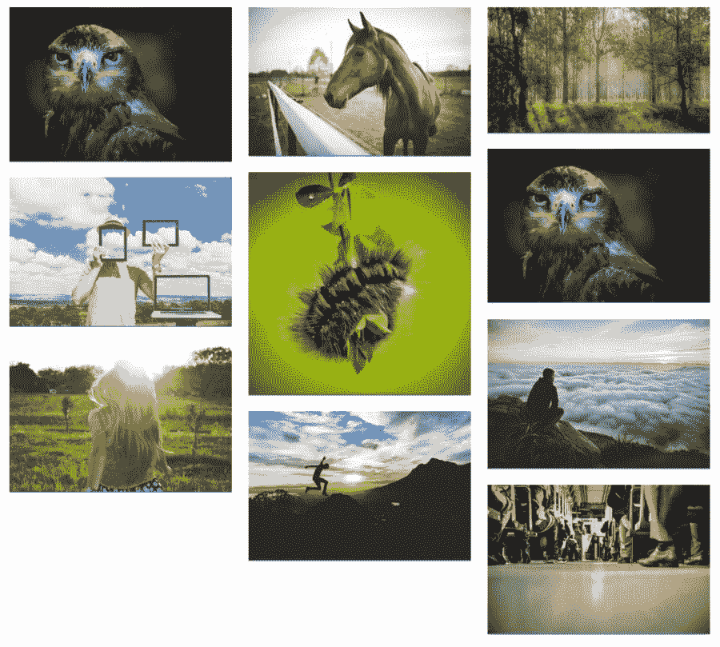

Photo Gallery by GT3.

#### 使用 GT3 照片库的理由

*   GT3 的图片库插件包括古腾堡块，用于即时添加到帖子和页面的图片库。
*   免费插件充满了伟大的功能，而高级插件也令人印象深刻，仍然负担得起。
*   所有的设置都可以在 WordPress 编辑器中修改，这意味着你不必在两个窗口中工作。调整边距、图像大小和其他更改在一个区域完成，结果显示在编辑器中。
*   为各种各样的[页面生成器](https://kinsta.com/blog/wordpress-page-builders/)提供支持。
*   每当您更新 Instagram 帐户时，您可以选择链接到您的 Instagram 帐户，获取[动态订阅源](https://kinsta.com/blog/wordpress-instagram-plugin/)。
*   提供了几个滑块和图库格式。您还可以选择在图库中包含过滤器，以便按类别进行组织。
*   有一些选项可以将即时下载按钮添加到您的图像中。
*   自定义的延迟加载一定会帮助你加快图库的加载速度。
*   水印和其他[安全措施](https://kinsta.com/blog/wordpress-security-plugins/)可以购买。
*   高级版融入了社交分享、视频控制等元素，并且能够通过一次点击将图库转换为滑块。

#### 选择 GT3 的照片库之前要考虑的事情

GT3 照片库插件在安全性和性能方面有很大的优势。这个免费的插件不仅允许快速和漂亮的图库，而且升级也很便宜，可以完全保护你的照片。

此外，图像优化扩展只需 10 美元。如果你有使用[图像优化插件](https://kinsta.com/blog/optimize-images-for-web/#image-optimization-wordpress-plugins)的经验，你会知道如果你的网站上有更多的照片，它们会变得相当昂贵。然而，优化照片是必不可少的。否则，你的[站点速度](https://kinsta.com/blog/website-speed-test/)和 [SEO](https://kinsta.com/blog/what-does-seo-stand-for/) 都会受到影响。这消除了拥有第二个可能花费更多的插件的需要。

*   **价格:**免费，45 美元高级升级。一个图像优化扩展售价 10 美元。
*   **点评:** 4.9 分满分 5 颗星
*   **活跃安装:** 10，000 以上
*   **PHP 版本:**未列出

[The right photo gallery plugin will make your images shine ✨ ...and this list has everything you need to choose the right one for your site 🌅Click to Tweet](https://twitter.com/intent/tweet?url=https%3A%2F%2Fkinsta.com%2Fblog%2Fwordpress-photo-gallery-plugins%2F&via=kinsta&text=The+right+photo+gallery+plugin+will+make+your+images+shine+%E2%9C%A8+...and+this+list+has+everything+you+need+to+choose+the+right+one+for+your+site+%F0%9F%8C%85&hashtags=GalleryPlugin%2CWordPressPhoto)

## 摘要

就像通常使用 WordPress 插件的情况一样，WordPress 图片库插件没有通用的建议。如果你想以最快的方式创建美丽的画廊，Modula 可能有最友好的用户界面，而 NextGEN 和 Envira Gallery 并列第二。

如果你是一名打算展示相册甚至出售照片的摄影师，你会更喜欢像 NextGEN Gallery 或 Envira Gallery 这样的重型设备。另一方面，如果你更关心的是[找到一个符合你需求的主题](https://kinsta.com/best-wordpress-themes/#photography)，你会想要跑腿浏览 WordPress 照片库插件的各种演示。

我们也建议你浏览我们上面的列表，并注意那些有古腾堡积分的。令人难以置信的是，古腾堡积木让画廊的创作过程变得如此之快。其他插件将来会增加这个功能，但是现在，我们强烈建议考虑已经有这个功能的 WordPress 照片库插件。

总的来说，这些 WordPress 图片库插件大部分都是免费的，所以你可以自己使用它们，看看你喜欢它的模板和界面。

现在轮到你了。我们错过了一个很棒的图库插件吗？请在评论中告诉我们吧！

* * *

让你所有的[应用程序](https://kinsta.com/application-hosting/)、[数据库](https://kinsta.com/database-hosting/)和 [WordPress 网站](https://kinsta.com/wordpress-hosting/)在线并在一个屋檐下。我们功能丰富的高性能云平台包括:

*   在 MyKinsta 仪表盘中轻松设置和管理
*   24/7 专家支持
*   最好的谷歌云平台硬件和网络，由 Kubernetes 提供最大的可扩展性
*   面向速度和安全性的企业级 Cloudflare 集成
*   全球受众覆盖全球多达 35 个数据中心和 275 多个 pop

在第一个月使用托管的[应用程序或托管](https://kinsta.com/application-hosting/)的[数据库，您可以享受 20 美元的优惠，亲自测试一下。探索我们的](https://kinsta.com/database-hosting/)[计划](https://kinsta.com/plans/)或[与销售人员交谈](https://kinsta.com/contact-us/)以找到最适合您的方式。