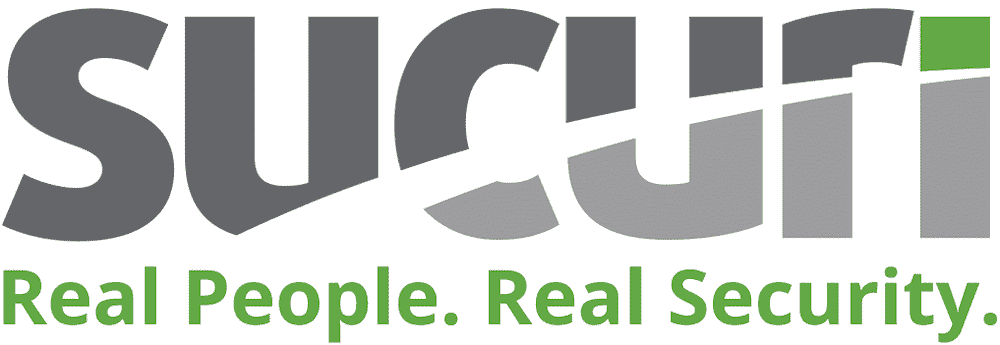

# IP 欺骗介绍(以及如何防止)

> 原文：<https://kinsta.com/blog/ip-spoofing/>

无论使用何种媒介，身份盗窃始终是一种威胁。所谓的“IP 欺骗”是恶意用户为其黑客攻击尝试快速获取可信度的一种常见方式。

鉴于每台计算机和服务器都有一个唯一的标识符(一个[“互联网协议”——或 IP 地址](https://kinsta.com/tools/what-is-my-ip/))，几乎任何使用互联网的人都可能受到攻击。IP 欺骗是一种“伪造”源地址(如电子邮件地址)外观的方法，是一种冒充技术。它可以以各种形式出现，所以你必须保持警惕。

在这篇文章中，我们将讨论 IP 欺骗，它是什么，为什么你是一个目标，等等。我们还将讨论一些您将遇到的最常见的 IP 欺骗攻击，以及 IP 欺骗的一些合法用途。

## 什么是 IP 欺骗？

从一般意义上来说，IP 欺骗获取你在互联网上发送的一部分数据，并使其看起来好像来自合法来源。IP 欺骗是许多不同攻击的广泛术语:

*   **IP 地址欺骗:**这是对攻击者 IP 地址的直接混淆，以进行[拒绝服务(DoS)攻击](https://kinsta.com/blog/what-is-a-ddos-attack/)，等等。
*   [域名服务器(DNS)欺骗](https://kinsta.com/blog/dns-poisoning/):这将修改 DNS 的源 IP，以将域名重定向到不同的 IP。
*   **地址解析协议(ARP)欺骗:**ARP 欺骗是一种较为复杂的攻击。它包括使用欺骗的 ARP 消息将计算机的媒体访问控制(MAC)地址链接到合法的 IP。

更专业的说法是，IP 欺骗获取数据，并在网络层改变一些可识别的信息。这使得欺骗几乎不可检测。

例如，以 DoS 攻击为例。

> 需要在这里大声喊出来。Kinsta 太神奇了，我用它做我的个人网站。支持是迅速和杰出的，他们的服务器是 WordPress 最快的。
> 
> <footer class="wp-block-kinsta-client-quote__footer">
> 
> 
> 
> <cite class="wp-block-kinsta-client-quote__cite">Phillip Stemann</cite></footer>

[View plans](https://kinsta.com/plans/)

这种方法使用一组使用假冒 IP 地址的僵尸程序将数据发送到特定的站点和服务器，使其离线。在这里，欺骗 IP 使得攻击很难被检测到，直到为时已晚，而且事后也很难追踪。

中间机器(MITM)攻击也利用 IP 欺骗，因为 MITM 方法依赖于两个端点之间的虚假信任。稍后我们将更详细地讨论这两种攻击。

[IP 欺骗是恶意用户快速获取可信度的常用方式，几乎任何使用互联网的人都可能受到攻击。😥在本指南中了解更多信息👇 点击推文](https://twitter.com/intent/tweet?url=https%3A%2F%2Fkinsta.com%2Fblog%2Fip-spoofing%2F&via=kinsta&text=IP+spoofing+is+a+common+way+for+malicious+users+to+gain+quick+credibility%2C+and+almost+anyone+using+the+internet+could+be+vulnerable.+%F0%9F%98%A5+Learn+more+in+this+guide+%F0%9F%91%87&hashtags=Hackers%2CIP)

## IP 欺骗是如何发生的

为了更好地理解 IP 欺骗，让我们给你一些关于互联网如何发送和使用数据的背景。

每台计算机都使用一个 IP 地址，你发送的任何数据都被分成许多块(“包”)。每个数据包都是单独传输的。然后，一旦它们到达链条的末端，它们就被重新组合，并作为一个整体呈现出来。此外，每个数据包都有自己的可识别信息(“报头”)，其中包括来自源和目的地的 IP 地址。

理论上，这应该确保数据到达目的地时不会被篡改。然而，情况并非总是如此。

IP 欺骗使用源 IP 报头并改变一些细节，使其看起来像是真的。因此，这甚至可以破坏最严格和最安全的网络。结果是网络工程师经常试图寻找新的方法来保护在网络上传播的信息。

例如， [IPv6 是一个较新的建立加密和认证的协议](https://kinsta.com/blog/ipv4-vs-ipv6/)。对于最终用户来说，[安全外壳(SSH)和安全套接字层(SSL)](https://kinsta.com/knowledgebase/ssh-vs-ssl/) 有助于减轻攻击，但我们稍后将讨论为什么这不能根除问题。至少在理论上，你实施的加密步骤越多，你就能更好地保护你的计算机。

同样值得注意的是，IP 欺骗是*而不是*非法行为，这就是它盛行的原因。IP 欺骗有许多合法的用途，我们将在另一节讨论。因此，虽然 IP 欺骗本身为黑客打开了大门，但它可能不是破坏信任的唯一技术。

## 为什么你的 IP 是欺骗的目标

抛开所有道德和伦理方面的考虑，他人的用户身份具有巨大的价值。毕竟，有许多坏演员，只要有机会，他们会很乐意使用别人的身份来获得某些东西，而不受道德影响。

对于许多恶意用户来说，欺骗 IP 地址是一种高价值的追求。IP 欺骗的行为没有多大价值，但是你将获得的机会可能是头奖。

例如，通过 IP 欺骗，用户可以假冒一个更受信任的地址，从一个毫无戒心的用户那里获取个人信息(以及更多信息)。

这也会对其他用户产生连锁反应。黑客不需要伪造每个目标的 IP 地址，他们只需要一个就可以突破防御。通过使用这些不劳而获的凭证，同一黑客也可以获得网络中其他人的信任，并引导他们共享个人信息。

因此，知识产权本身没有价值。然而，根据对欺骗 IP 的处理，回报可能是巨大的，通过 IP 欺骗访问其他系统的可能性也不小。

## 3 种最常见的 IP 欺骗攻击类型

IP 欺骗非常适合某些类型的攻击。接下来让我们看三个。

### 1.屏蔽僵尸网络

僵尸网络是攻击者从单一来源控制的计算机网络。每台计算机都运行一个专用的机器人，代表坏人进行攻击。你会发现，如果没有 IP 欺骗，屏蔽僵尸网络的能力是不可能的。

正常情况下，黑客通过感染[获得控制权，比如恶意软件](https://kinsta.com/blog/types-of-malware/)。僵尸网络的使用可以帮助恶意用户执行垃圾邮件攻击、DDoS 攻击、广告欺诈、勒索软件攻击等等。这是一种针对其他用户进行有针对性的小冲突的通用方法。

部分原因是 IP 欺骗。网络中的每个 bot 通常都有一个假冒的 IP，这使得追踪恶意行为者变得非常困难。

这里恶搞 IP 的主要好处就是逃避执法。然而，这不是唯一的一个。

例如，使用带有欺骗性 IP 的僵尸网络也会阻止目标通知所有者问题。首先，这会延长攻击时间，让黑客将注意力“转移”到其他标记上。从理论上讲，这可能导致攻击无限运行，以最大化收益。

### 2.直接拒绝服务(DDoS)攻击

如果一个站点由于服务器上过多的恶意流量而崩溃，这就是 DDoS 攻击。这对任何网站所有者来说都是致命的，有很多方法可以减轻这种影响。

这涵盖了几个相关的欺骗攻击和技术，这些攻击和技术结合在一起构成了整个攻击。

#### DNS 欺骗

首先，恶意用户会利用 DNS 欺骗来渗透网络。恶意参与者将使用欺骗将与 DNS 相关联的[域名更改为另一个 IP 地址。](https://kinsta.com/knowledgebase/what-is-dns/)

从这里，您可以执行任何数量的进一步攻击，但恶意软件感染是一个流行的选择。因为它本质上将流量从合法来源转移到恶意来源而不被检测到，所以很容易感染另一台计算机。从那里，更多的机器将屈服于感染，并创建僵尸网络来有效地实施 DDoS 攻击。

#### IP 地址欺骗

在 DNS 欺骗之后，攻击者将执行其他 IP 地址欺骗，以帮助混淆网络中的各个僵尸程序。这通常遵循一个永久随机化的过程。因此，IP 地址不会长时间保持不变，这使得几乎不可能检测和跟踪。

## 注册订阅时事通讯

### 想知道我们是怎么让流量增长超过 1000%的吗？

加入 20，000 多名获得我们每周时事通讯和内部消息的人的行列吧！

[Subscribe Now](#newsletter)

最终用户不可能检测到这种网络级攻击(这也难倒了许多服务器端专家)。这是实施恶意攻击而不承担后果的有效方法。

#### ARP 中毒

ARP 欺骗(或“中毒”)是进行 DDoS 攻击的另一种方式。它比屏蔽僵尸网络和 IP 欺骗的暴力方法复杂得多，但它将两者结合起来进行攻击。

其思想是以局域网(LAN)为目标，通过恶意 ARP 数据包来改变 MAC 表中的 IP 地址集。对于攻击者来说，这是一种一次访问大量计算机的简单方法。

ARP 中毒的目的是通过受感染的计算机引导所有网络流量，然后从那里操纵它。通过攻击者的计算机很容易做到这一点，它让他们在 DDoS 或 MITM 攻击之间进行选择。

### 3.MITM 袭击

中间机器(MITM)攻击特别复杂、高效，对网络来说是灾难性的。

这些攻击是一种在数据到达你连接的服务器(比如说，你的网络浏览器)之前拦截数据的方法。这使得攻击者可以使用虚假网站与您进行交互，从而窃取您的信息。在某些情况下，攻击者是拦截两个合法来源之间的传输的第三方，这增加了攻击的有效性。

当然，MITM 攻击依赖于 IP 欺骗，因为需要在用户不知情的情况下破坏信任。此外，与其他攻击相比，实施 MITM 攻击有更大的价值，因为黑客可以长期持续收集数据并出售给其他人。

[MITM 攻击的真实案例](https://www.europol.europa.eu/newsroom/news/international-operation-dismantles-criminal-group-of-cyber-fraudsters)展示了 IP 欺骗是如何发挥作用的。如果你假冒一个 IP 地址，并获得个人通信帐户的访问权限，这就可以让你跟踪通信的任何方面。从那里，你可以挑选信息，引导用户到虚假网站，等等。

总的来说，MITM 攻击是获取用户信息的一种危险且非常有利可图的方式，IP 欺骗是其中的核心部分。

## 为什么 IP 欺骗对你的站点和用户是危险的

因为 IP 欺骗发生在较低的网络级别，所以它对互联网上的几乎每个用户都是一种危险。

[网络钓鱼和电子欺骗](https://kinsta.com/blog/work-from-home-security/#1-phishing-scams)如影随形。一个好的欺骗攻击不会表现为网络钓鱼企图。这意味着用户没有任何警惕的迹象，因此可能会交出敏感信息。

业务关键元素将是主要目标，例如[安全系统和防火墙](https://kinsta.com/blog/what-is-a-firewall/)。这就是为什么[网站安全](https://kinsta.com/cheatsheets/site-security-cheat-sheet/)是许多人最关心的问题。你不仅需要实现足够的功能来减少攻击，还需要确保你的网络用户保持警惕，并使用[良好的安全实践](https://kinsta.com/blog/password-protect-wordpress-site/)。

需要为你的 WordPress 站点提供超快的、可靠的、完全安全的托管服务吗？Kinsta 提供所有这些以及 WordPress 专家提供的 24/7 世界级支持。[查看我们的计划](https://kinsta.com/plans/?in-article-cta)

The Wordfence plugin is a solid security solution to help protect you from IP spoofing.

然而，IP 欺骗的一个方面使遏制它变得不那么简单:这种技术在网络上有许多合法的使用案例。

## IP 欺骗的合法用途

因为 IP 欺骗有很多非恶意的使用案例，所以你很难阻止其他人使用它。

例如，成千上万的“道德黑客”期待为公司测试系统。这种类型的道德黑客行为是一种经批准的系统违规，旨在测试安全资源和实力。

这将遵循与恶意黑客攻击相同的过程。用户将对目标进行侦察工作，获得并保持对系统的访问，并模糊他们的渗透。

你经常会发现，不道德的黑客会转变成道德的类型，并在他们过去可能认为是目标的公司找到工作。你甚至可以找到官方考试和认证来帮助你获得合适的证书。

一些公司还会在与系统漏洞无关的模拟练习中使用 IP 欺骗。例如，对于成千上万的 IP 地址来说，群发邮件是一个很好的用例，它们都需要通过(合法的)欺骗来创建。

用户注册测试也使用 IP 欺骗来模拟结果。任何需要模拟许多用户的情况都是道德 IP 欺骗的理想案例。

## 为什么你不能防止 IP 欺骗

因为欺骗很难识别，而且这种方法的本质是隐藏真实身份，所以你几乎无法阻止它的发生。但是，您可以最小化风险并消除影响。

值得注意的是，最终用户(即客户端机器)无法以任何方式停止欺骗。服务器端团队的工作是尽可能防止 IP 欺骗。

有几种方法可以在黑客和潜在目标之间设置障碍。迄今提到的一些包括:

*   使用更安全的协议，如 IPv6
*   确保用户群在使用网站和网络时实施良好的[个人安全](https://kinsta.com/blog/work-from-home-security/)
*   在你的站点上实现 SSL 和 SSH

然而，你还可以做更多的事情。例如，您可以使用专用的 web 应用程序防火墙(WAF ),如 [Sucuri](https://sucuri.net/website-firewall/) ,这将有助于在您的站点周围“建造高墙”。

The Sucuri logo.

您还可以实现公共关键基础设施(PKI)来帮助验证用户和相关数据。这依赖于私钥和公钥的组合来加密和解密数据。由于加密的本质，黑客破解起来更具挑战性。

[网络监控](https://kinsta.com/blog/application-performance-monitoring/)是一项基本技术，也可以帮助您发现 IP 欺骗或相关攻击的迹象。这可以采取多种形式，但是您越了解您的系统，发现恶意攻击的机会就越大。

包过滤也有助于打击 IP 欺骗企图。“入口”和“出口”过滤查看传入和传出通信的源标头。如果某些东西没有通过那个过滤器，它就不会影响网络内的用户。

最后，[深度数据包检测(DPI)](https://digitalguardian.com/blog/what-deep-packet-inspection-how-it-works-use-cases-dpi-and-more) 是一种同样有效的类似技术。这种方法和这里的其他方法甚至可以结合起来帮助支撑网络或服务器。

[Learn more about IP spoofing and what roadblocks you can put up to help reduce the chances of being targeted right here 🦹‍♀️Click to Tweet](https://twitter.com/intent/tweet?url=https%3A%2F%2Fkinsta.com%2Fblog%2Fip-spoofing%2F&via=kinsta&text=Learn+more+about+IP+spoofing+and+what+roadblocks+you+can+put+up+to+help+reduce+the+chances+of+being+targeted+right+here+%F0%9F%A6%B9%E2%80%8D%E2%99%80%EF%B8%8F&hashtags=Hackers%2CIP)

## 摘要

你的 IP 地址对你来说是独一无二的，因为它适用于今天使用的每一台计算机。该地址有助于完成许多任务，如身份验证、加密等。推而广之，这使得几乎任何 IP 地址都成为潜在黑客或罪犯的目标。

IP 欺骗伪造地址的合法性，并利用它来破坏安全网络以获取更多利益。

解决 IP 欺骗是最终用户无法控制的事情，系统管理员也很难处理。总的来说，你只能减轻 IP 欺骗对你的网络的影响，而不能完全根除它。

尽管如此，还是有很多障碍可以阻挡潜在的恶意用户。典型的加密方法会有所帮助，良好的防火墙和网络监控策略也是如此。

您是 IP 欺骗的受害者吗？如果是，您是如何解决这种情况的？在下面的评论区分享你的想法吧！

* * *

让你所有的[应用程序](https://kinsta.com/application-hosting/)、[数据库](https://kinsta.com/database-hosting/)和 [WordPress 网站](https://kinsta.com/wordpress-hosting/)在线并在一个屋檐下。我们功能丰富的高性能云平台包括:

*   在 MyKinsta 仪表盘中轻松设置和管理
*   24/7 专家支持
*   最好的谷歌云平台硬件和网络，由 Kubernetes 提供最大的可扩展性
*   面向速度和安全性的企业级 Cloudflare 集成
*   全球受众覆盖全球多达 35 个数据中心和 275 多个 pop

在第一个月使用托管的[应用程序或托管](https://kinsta.com/application-hosting/)的[数据库，您可以享受 20 美元的优惠，亲自测试一下。探索我们的](https://kinsta.com/database-hosting/)[计划](https://kinsta.com/plans/)或[与销售人员交谈](https://kinsta.com/contact-us/)以找到最适合您的方式。