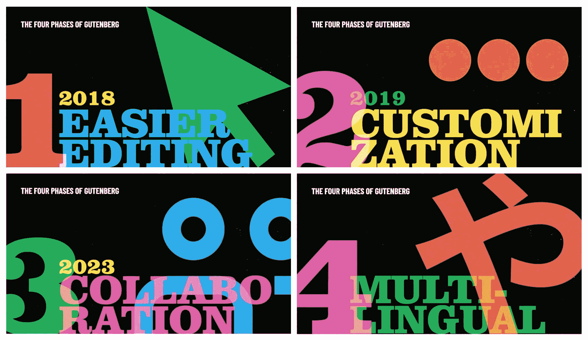
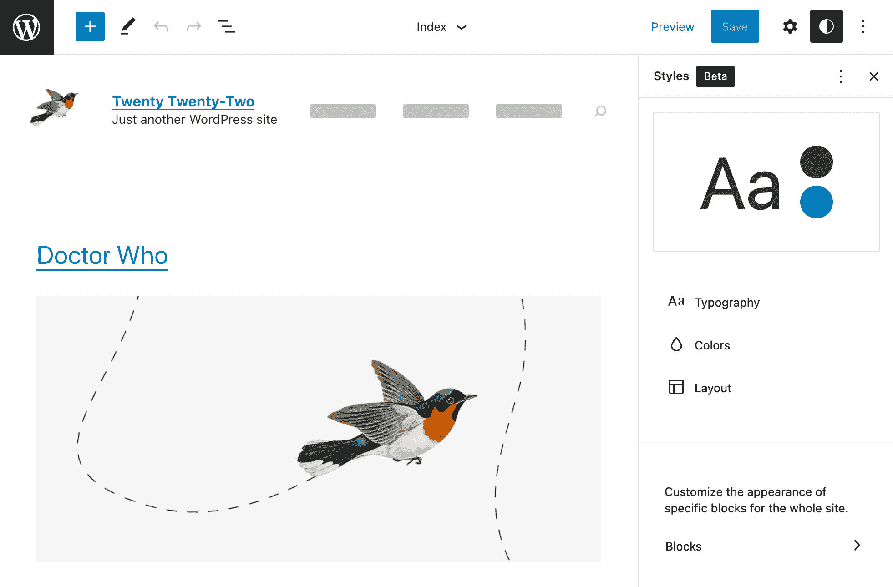
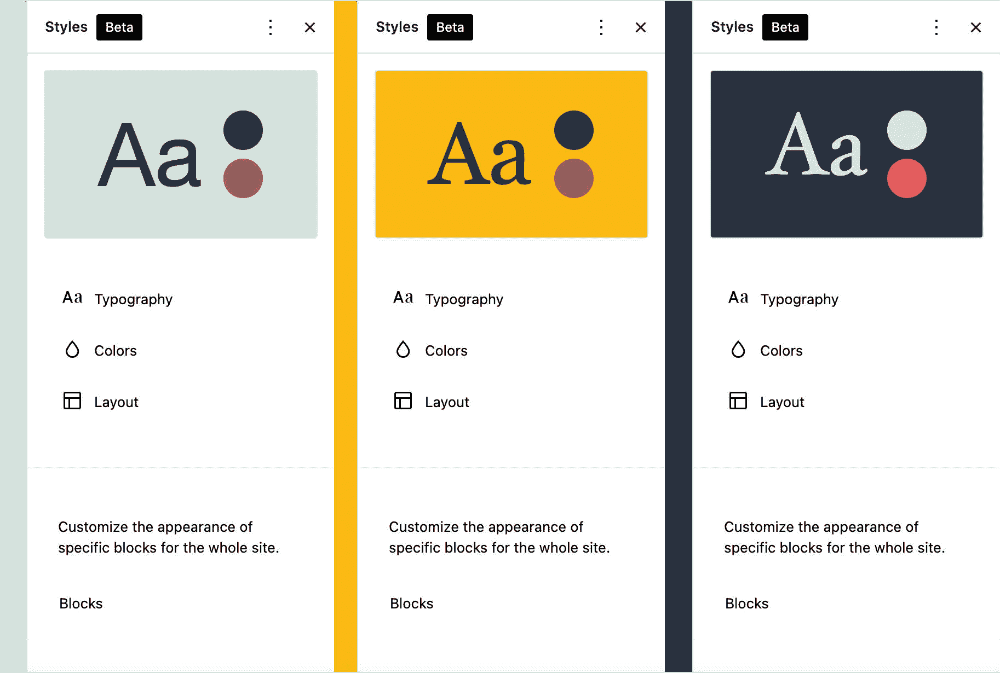
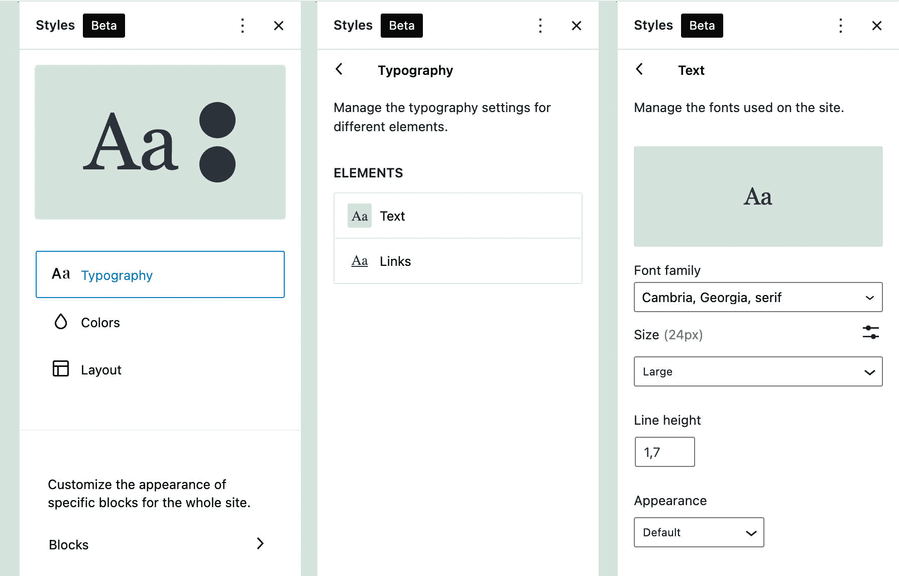
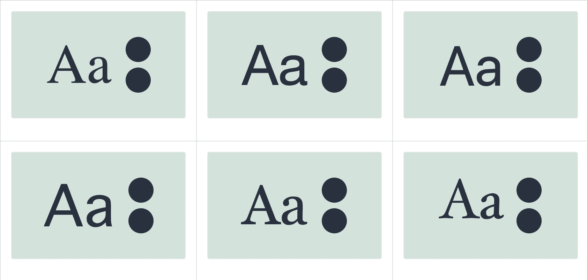
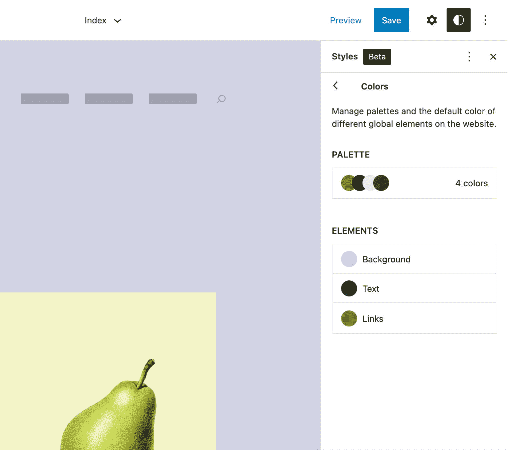
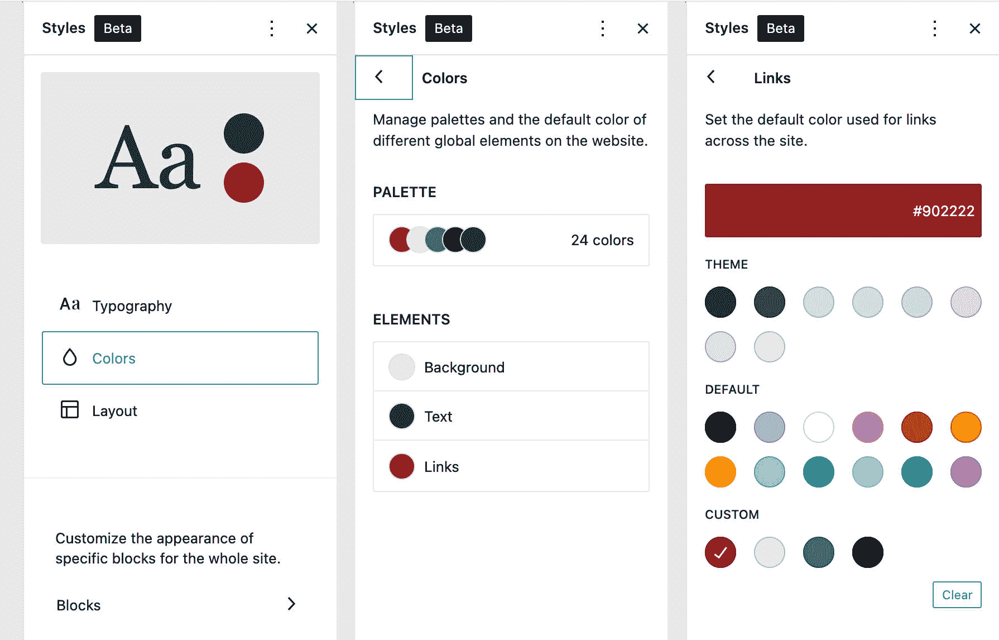
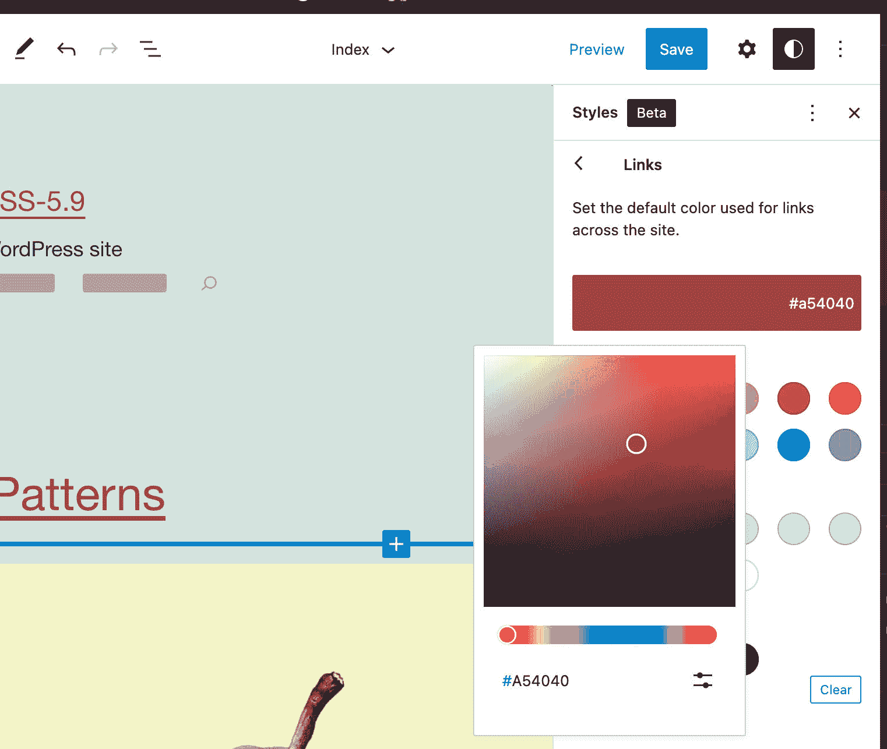
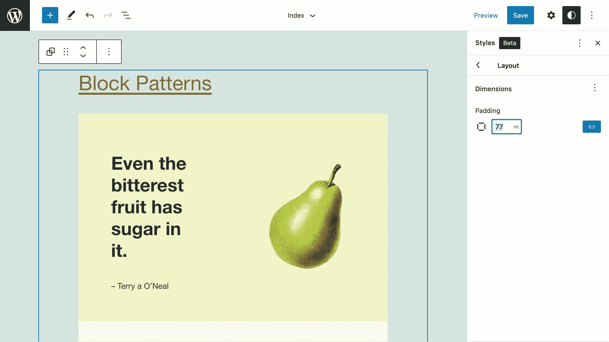
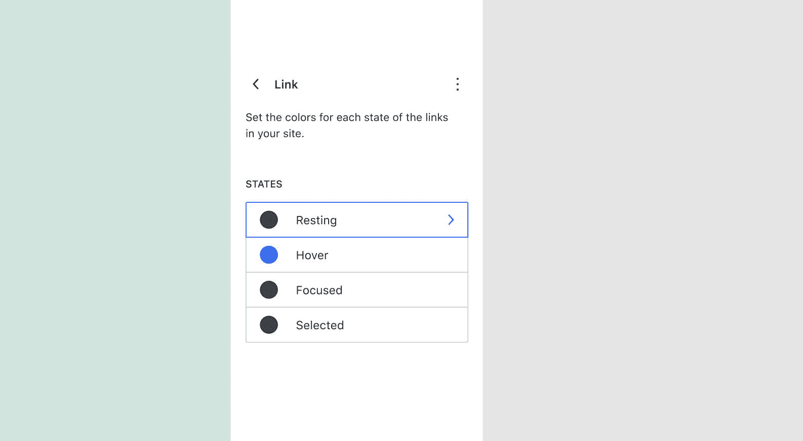

# WordPress 5.9 的新功能——全站点编辑、全局样式、块、模式、API、UI 增强等等

> 原文:[https://kinsta.com/blog/wordpress-5-9/](https://kinsta.com/blog/wordpress-5-9/)

约瑟芬来了！今年的第一个 WordPress 版本最初计划于 2021 年 12 月 14 日发布。由于几个公开的问题和未解决的 bug，最终的[发布被推迟](https://make.wordpress.org/core/2021/11/22/wordpress-5-9-revised-release-schedule/)，最终在 2022 年 1 月 25 日发布。

如果你想知道 WordPress 5.9 有什么新功能，简短的回答是**全站点编辑** (FSE)。

事实上，许多 5.9 的特性只有在你使用支持全站点编辑的主题时才可用，比如全新的默认主题，[Twenty Twenty Twenty](https://kinsta.com/blog/twenty-twenty-two-theme/)。


A preview of Twenty Twenty-Two, the new WordPress default theme. (Image source: [WordPress.org](https://make.wordpress.org/core/2021/10/06/introducing-twenty-twenty-two/))


有了 WordPress 5.9，我们就进入了古腾堡路线图第二阶段的核心部分:T2 定制阶段，主要集中在网站编辑、区块模式、区块目录和基于区块的主题上。

> 下个月即将推出的 5.9 版本，我想说，我们处于 MVP 阶段，这是古腾堡定制阶段的最小可行产品。

这些来自马特·莫楞威格的话最好地总结了新 WordPress 发布的主要特点。



The Gutenberg roadmap. (Image source: [Matt Mullenweg: 2021 State of the Word](https://wordpress.tv/2021/12/15/matt-mullenweg-2021-state-of-the-word/))


也就是说，2022 年的第一个 WordPress 版本有什么新的？

让我们来了解一下！

<link rel="stylesheet" href="https://kinsta.com/wp-content/themes/kinsta/dist/components/ctas/cta-mini.css?ver=2e932b8aba3918bfb818">


> Kinsta 把我宠坏了，所以我现在要求每个供应商都提供这样的服务。我们还试图通过我们的 SaaS 工具支持达到这一水平。
> 
> <footer class="wp-block-kinsta-client-quote__footer">
> 
> 
> 
> <cite class="wp-block-kinsta-client-quote__cite">Suganthan Mohanadasan from @Suganthanmn</cite></footer>

[View plans](https://kinsta.com/plans/)

 <kinsta-auto-toc heading="Table of Contents" exclude="last" list-style="arrow" selector="h2" count-number="-1">## 全局样式:用于 **theme.json** 的图形界面

随着 2021 年 WordPress 5.8 的[发布，操纵](https://kinsta.com/blog/wordpress-5-8/#block-settings-and-styles-with-themejson) [theme.json](https://developer.wordpress.org/block-editor/reference-guides/theme-json-reference/) 文件成为主题开发者定制编辑器设置和样式的标准方式。

WordPress 5.9 引入了一个图形界面，允许用户为他们的网站定制[风格预置](https://kinsta.com/blog/twenty-twenty-two-theme/#twenty-twentytwo-at-its-core-a-quick-overview-of-themejson)，无论是全局的还是块级的，无需编写一行代码。

全局样式机制应该会显著改变你习惯于定制网站外观的方式，因为[全局样式](https://make.wordpress.org/design/handbook/focuses/global-styles/)会影响 WordPress 网站设计的几个方面。

首先，全局样式界面取代了[定制器](https://kinsta.com/blog/how-to-customize-wordpress-theme/#customizing-your-theme-via-the-customizer)，并且现在是用块主题定制设置和样式的唯一方式。同样，复杂的主题选项管理页面将不再需要。这提供了一种新的配置主题设置和样式的标准方法，同时，应该可以简化主题开发工作流。

有了全局样式，WordPress 用户可以获得对他们网站的更多控制，无论是全局的还是块类型的，超越了个人页面或文章的上下文。

站点编辑器中现在有了一个新的侧边栏，在它的顶部你会发现一个小的预览面板和四个组件，顺序如下:

*   [排版](#typography)
*   [颜色](#colors)
*   [布局](#layout)
*   [块](#blocks)

我们可以预期随着时间的推移会有新的组件添加进来。



The Global Styles sidebar with the [Blockbase theme](https://wordpress.org/themes/blockbase/) by Automattic.


让我们仔细看看新的界面。

[到了！🎉你需要知道的关于 WordPress 5.9 的一切，都在一篇大帖子里😄 点击推文](https://twitter.com/intent/tweet?url=https%3A%2F%2Fkinsta.com%2Fblog%2Fwordpress-5-9%2F&via=kinsta&text=It%27s+here%21+%F0%9F%8E%89+Everything+you+need+to+know+about+WordPress+5.9%2C+all+in+one+mega+post+%F0%9F%98%84&hashtags=WordPress%2CWPTips)
【CTA】

### 样式预览

全局样式工具条中的第一个元素是一个预览面板。此面板允许您检查定制的结果，并且当您的更改应用于站点编辑器画布中不可见的元素时特别有用。

下图显示了三种不同的风格组合:



Global Styles previews compared.


### 排印

排版面板是你控制网站排版的地方。当然，这个面板中可用的控件取决于您的 **theme.json** 设置。

例如，[二十个二十一个街区](https://wordpress.org/themes/tt1-blocks/) (TT1 街区)主题声明了以下版式属性:

```
"settings": {
	"typography": {
		"customLineHeight": true,
		"fontSizes": [],
		"fontFamilies": []
	}
}
```

下图显示了全局样式边栏中产生的版式设置:



Typography settings in TT1 Blocks Global Styles.


让我们深入一点，看看 TT1 Blocks 主题如何声明`fontFamilies`:

```
"fontFamilies": [
	{
		"fontFamily": "-apple-system,BlinkMacSystemFont,\"Segoe UI\",Roboto,Oxygen-Sans,Ubuntu,Cantarell,\"Helvetica Neue\",sans-serif",
		"slug": "system-font",
		"name": "System Font"
	},
	{
		"fontFamily": "Helvetica Neue, Helvetica, Arial, sans-serif",
		"slug": "helvetica-arial"
	},
	{
		"fontFamily": "Geneva, Tahoma, Verdana, sans-serif",
		"slug": "geneva-verdana"
	},
	{
		"fontFamily": "Cambria, Georgia, serif",
		"slug": "cambria-georgia"
	},
	{
		"fontFamily": "Hoefler Text, Baskerville Old Face, Garamond, Times New Roman, serif",
		"slug": "hoefler-times-new-roman"
	}
]
```

您可以在“全局样式预览”面板中检查这些字体系列:



Font families available in Twenty Twenty-One Blocks.


### 颜色；色彩；色调

在颜色部分，您可以查看和编辑调色板，并自定义几个站点元素的颜色。



Colors panel in Twenty Twenty-One Blocks


通过点击这些元素，您可以访问一个新的面板，您可以从三个调色板中选择颜色:核心、主题和自定义调色板(在[默认颜色、主题颜色和自定义颜色](https://github.com/WordPress/gutenberg/issues/29568)中了解更多信息)。



Color settings in Twenty Twenty-One Blocks


在这个面板中，您可以设置和修改当前元素的颜色。



Customizing link color in Global Styles.


### 布局

最后一组工具用于布局定制。在全局上下文中，这仅限于站点容器。



Layout settings in Twenty Twenty-One Blocks.


### 阻碍

随着全局样式机制的实现，现在还可以更改特定块的外观，比如段落(版式和颜色)、按钮(布局)和列(颜色和布局)。

注意，只有当块在相应的 **block.json** 文件中声明支持特定功能时，才能从全局样式接口定制**块样式。例如，`core/post-title`块目前支持以下样式:**

```
"supports": {
	"align": [ "wide", "full" ],
	"html": false,
	"color": {
		"gradients": true,
		"link": true
	},
	"spacing": {
		"margin": true
	},
	"typography": {
		"fontSize": true,
		"lineHeight": true,
		"__experimentalFontFamily": true,
		"__experimentalFontWeight": true,
		"__experimentalFontStyle": true,
		"__experimentalTextTransform": true,
		"__experimentalLetterSpacing": true,
		"__experimentalDefaultControls": {
			"fontSize": true,
			"fontAppearance": true,
			"textTransform": true
		}
	}
},
```

由于`core/post-title`块支持颜色、间距和排版，您可以在文章标题块的全局样式设置中找到相应的条目。

下图显示了排版设置，您可以很容易地将其与上面的代码进行比较:


Customizing Post Title typography settings


值得注意的是，WordPress 5.9 只提供了全局样式接口的第一个实现。正如 [Matias Ventura 指出的](https://github.com/WordPress/gutenberg/issues/34574)，我们有理由期待新款控制功能的进一步发展:

> 将来，系统中会内置一些流程，允许您从局部样式转移到全局样式，例如对按钮块进行定制，并选择将它们的全局更改应用于该类型的所有按钮。

因此，我们可能很快就会看到重大改进。下图只是我们可能预期的一个例子:



In the future, you can control the link state color. (Image source [GitHub](https://github.com/WordPress/gutenberg/issues/34574))


额外的改进可能包括主题的[能力](https://github.com/WordPress/theme-experiments/pull/292)到[提供可选的调色板](https://github.com/WordPress/gutenberg/issues/36304)和[多种全球风格变化](https://github.com/WordPress/gutenberg/pull/35619)。

> 上周，我在超级简单的儿童主题中建立了一些 Twenty Twenty 2 的颜色+字体变化。它们真的很轻便，我喜欢这个想法，只需一次点击就能给人们提供一个完全不同的网站。🎉[https://t.co/dItIkvvhK9](https://t.co/dItIkvvhK9)pic.twitter.com/rB4CcTfW0AT2
> 
> — kjellr (@kjellr) [November 15, 2021](https://twitter.com/kjellr/status/1460270505513082881?ref_src=twsrc%5Etfw)</kinsta-auto-toc>