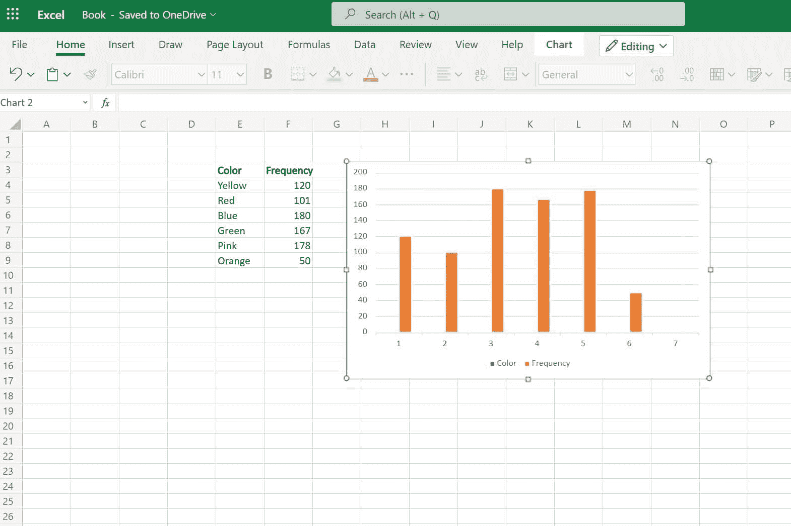
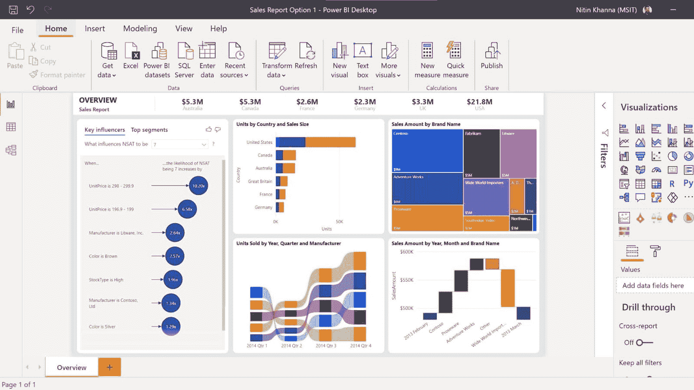
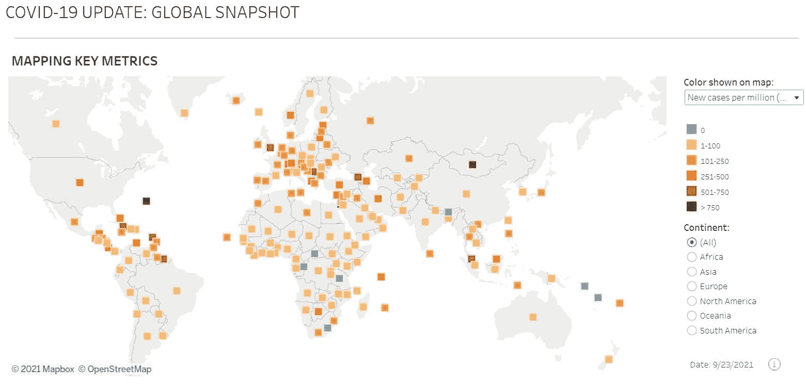
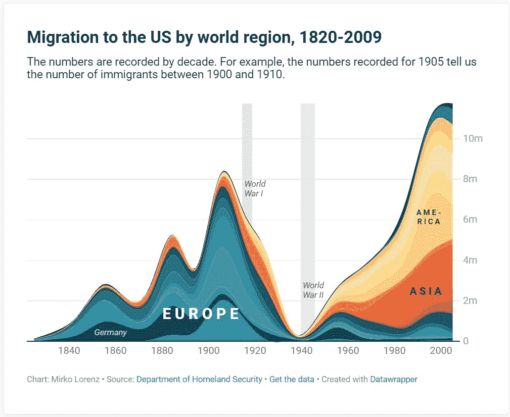
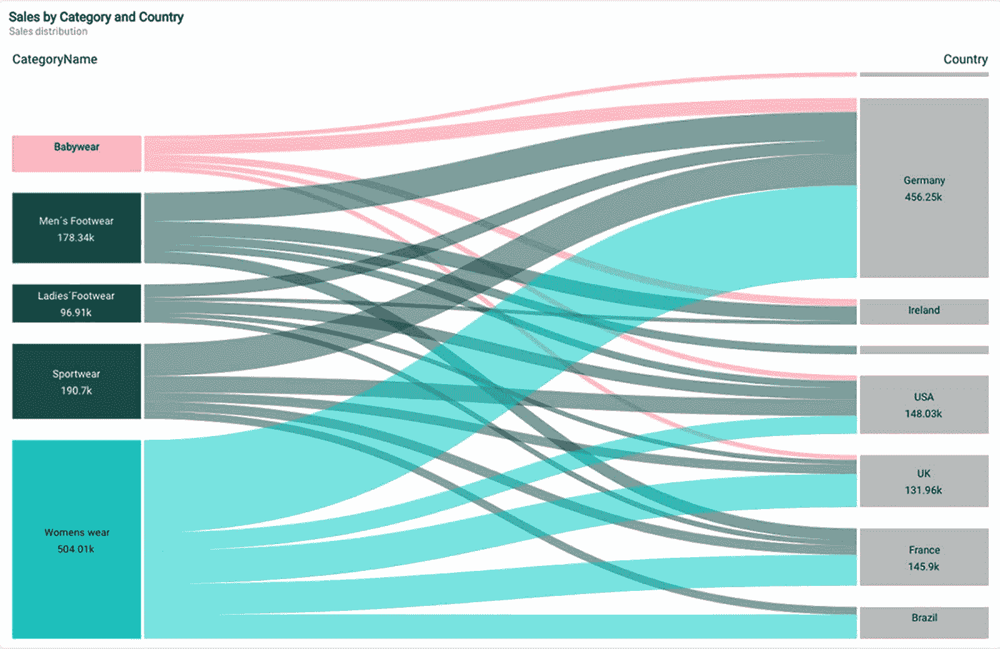
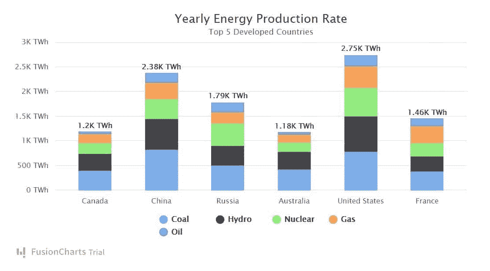
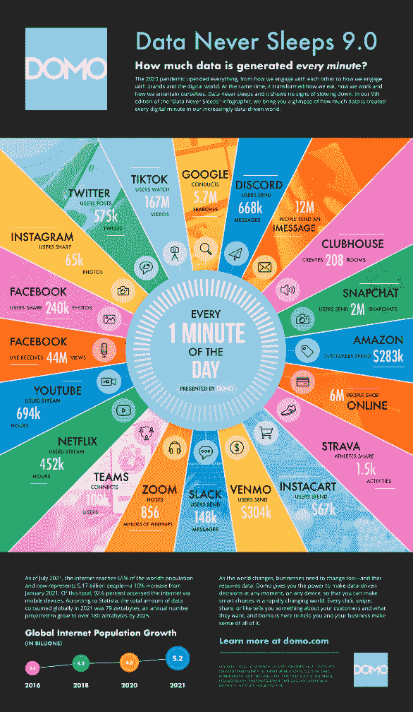
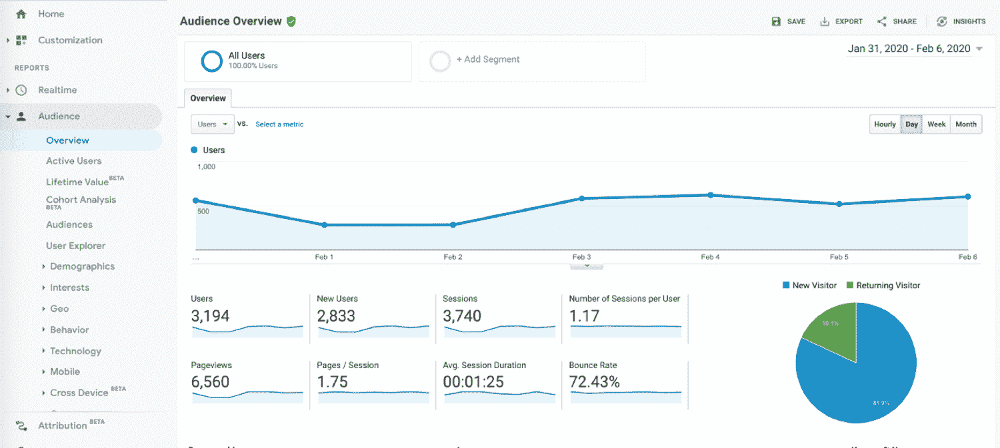
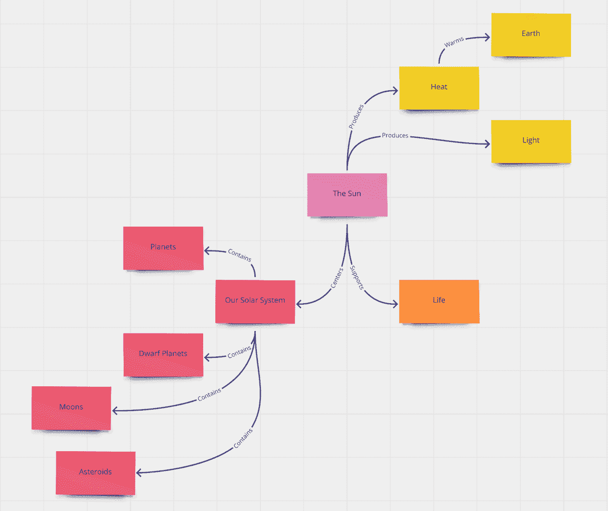

# 2022 年顶级数据可视化工具指南

> 原文：<https://kinsta.com/blog/data-visualization-tools/>

如果您点击了这篇文章，您可能处于以下情况:您有一个关键数据集要分析，但您不知道任何好的数据可视化工具。

谢天谢地，你来对地方了。

在本文中，我们将教您关于数据可视化工具需要了解的一切，包括它们是什么，为什么应该使用它们，以及我们推荐尝试的 11 种潜在工具。

准备好了吗？开始吧！

T3】

## 什么是数据可视化？

数据可视化是创建数据集趋势、模式和关键见解的可视化表示的过程。数据可视化工具是帮助您创建可视化的软件。

虽然您可能不会每天都处理数据，但是您可能以前使用过许多不同类型的数据可视化。一些最流行的可视化包括:

*   **饼状图**，显示百分比明细
*   **表格**，显示对于文本来说过于复杂的数据
*   **时间线**，提供一段时间内的一系列事件
*   **直方图**，显示由连续或离散数据组成的数据集的分布
*   甘特图显示一个项目的时间表
*   **盒须图**，提供数据集的五个数字汇总(包括最小值、第一个四分位数、中值、第三个四分位数和最大值)
*   **散点图**，显示两组数据之间的关系(如身高与体重)
*   **条形图**，显示数据在两个类别中的分布(如 A/B 测试的[结果](https://kinsta.com/blog/google-optimize/)

创建数据可视化没有“一种”方法，尽管创建数据可视化的一般过程如下所示:

> Kinsta 把我宠坏了，所以我现在要求每个供应商都提供这样的服务。我们还试图通过我们的 SaaS 工具支持达到这一水平。
> 
> <footer class="wp-block-kinsta-client-quote__footer">
> 
> 
> 
> <cite class="wp-block-kinsta-client-quote__cite">Suganthan Mohanadasan from @Suganthanmn</cite></footer>

[View plans](https://kinsta.com/plans/)

*   **第一步:**收集数据集
*   **第二步:**“清理”您的数据，确保数据一致且无误
*   **步骤 3:** 将数据集导出到数据可视化软件中
*   第四步:使用软件生成可视化效果
*   第五步:评估你想象的可靠性和有效性，并随意使用图表

在讨论数据时，重要的是要注意“可靠性”和“有效性”是两回事。“可靠性”指的是你的数据和数据背后的方法如何衡量你正在评估的东西，而“有效性”指的是你的数据本身有多准确。

[✨眼见为实👀点击此处查看数据可视化的 11 大选项⬇️ 点击推文](https://twitter.com/intent/tweet?url=https%3A%2F%2Fkinsta.com%2Fblog%2Fdata-visualization-tools%2F&via=kinsta&text=Seeing+is+believing+%E2%9C%A8%F0%9F%91%80+Check+out+11+great+options+for+data+visualization+right+here+%E2%AC%87%EF%B8%8F&hashtags=Data%2CExcelTips)

## 为什么数据可视化很重要

数据可视化非常有用，因为它们可以帮助您:

*   **发现商业智能洞察:**商业智能(BI)洞察是影响您决策的重要信息。

例如，如果你分析了你的[电子邮件打开率](https://kinsta.com/blog/email-marketing-statistics/)，如果说你通过 [MailChimp](https://kinsta.com/blog/how-to-use-mailchimp/) 而不是 GetResponse 发送的电子邮件的点击率(CTR)更高，这是一种商业智能的见解。这种洞察力可能会影响您使用的平台。

*   向他人传达复杂或详细的结果:可视化可以帮助你向你的老板、投资者、同事或媒体解释你的数据，因为它们将复杂的数据简化为易于理解的图形。

例如，如果你在你的 WordPress 站点上做 [A/B 测试](https://kinsta.com/blog/wordpress-ab-testing-tools/)，你可以使用数据可视化来显示“A”和“B”结果的结果，这样它们就容易理解了。

*   **分析并了解您业务数据中隐藏的趋势:**虽然有些趋势通过查看数据集是显而易见的，但许多数据集太大，无法在没有可视化的情况下进行解释。

例如，如果您正在分析一整年的[广告重定位结果](https://kinsta.com/blog/ad-retargeting/)，数据可视化将向您显示季节性高峰，您可能无法通过查看周环比结果来注意到这些高峰。

*   **快速比较大数据集中的数字****:**你不必拥有一个大企业来生成大量数据。

许多企业跟踪数据，比如他们的网站转化率数据。这些数据集包含来自数百名访问者的结果，因此手动分析数据将非常耗时。

## 数据可视化工具的常见功能

尽管每个数据可视化工具都不同，但大多数工具都有一些共同的(非常有用的)特性。本节将简要描述这些特性，以及为什么在选择理想工具时它们是必不可少的。

### 数据导入 API

许多工具包括一个应用编程接口(API ),允许您将数据从您的[数据收集工具](https://kinsta.com/blog/google-analytics-alternatives/)导入到您的可视化工具。API 加快了可视化过程，因为您需要下载数据，上传到您的工具，并在没有 API 的情况下手动格式化数据。

### 图表模板

图表模板是预设的设计，您可以使用它来快速创建有吸引力的可视化效果。如果你不是图形设计师或数据分析师，这些是完美的，因为你只需将数据插入图表。

大多数图表模板还允许您自定义图表的颜色、字体和标题。

### 交互式图表

当您与交互式图表交互时，它们会做出反应，这意味着您可以突出显示关键数字、趋势或变量，而无需为每个分析创建不同的可视化效果。

### 版本历史

版本历史允许您查看和恢复数据可视化的旧版本，这意味着您可以在不丢失数据的情况下撤销错误。

### 移动优化

顾名思义，移动优化允许您改变可视化的呈现方式，以适应移动设备。

## 2022 年的顶级数据可视化工具

如果你搜索“数据可视化软件”，你会找到数百个不同的选项。有很多选项可供选择，因此为了帮助您缩小范围，我们在本节中汇编了一份 11 大工具列表。

### 1.微软优越试算表

微软 Excel 是这个列表中最古老的(也可能是最著名的)程序。由微软于 1987 年推出的 Excel 允许你创建表格、图表和大约 20 种其他可视化形式。

**顶级功能**

*   **Power Pivot:** 一个插件，可以用来创建数据模型并对大型数据集进行分析
*   **内置公式**
*   自动筛选:一个可以自动对你的数据进行排序的程序

**优点**

*   适用于 Windows、macOS、Android 和 iOS 设备
*   您可以自定义可视化的字体、颜色和功能
*   它附带了许多微软的软件包(所以你的电脑上可能已经有了)
*   允许您快速导入和导出多种文件类型的数据
*   包括版本历史

**缺点**

*   可能很贵
*   如果你不是数据科学家，很难在大型数据集上使用
*   不是为团队设计的

**定价**

微软 Excel 的一个许可费用为每年[159.99 美元](https://www.microsoft.com/en-us/microsoft-365/p/excel/cfq7ttc0hr4r?activetab=pivot:overviewtab)，如果与 Office 365 一起购买，则为每月 6.99 美元。

**实际情况如何**

微软 Excel 可视化。

### 2.Microsoft Power BI

微软 Power BI 是 Excel 更年轻、更聪明的表亲。Power BI 允许您单独或在报告中创建数据可视化。

**顶级功能**

*   **微软人工智能:**一种能够自动准备和分析数据的人工智能(AI)程序
*   **完全可定制的仪表盘**
*   **实时可视化**

**优点**

*   包括许多图表模板和预设报告
*   具有机器学习能力
*   可以分析来自 Dynamics 365、Excel、SharePoint、Salesforce 和 Azure SQL DB(以及其他来源)的数据
*   非常适合团队
*   可以创建交互式数据可视化
*   非常安全
*   在桌面和移动设备上可用

**缺点**

*   最适合以前分析过数据或经常使用 Excel 的人
*   一次最多只能处理 2 GB 的数据(因此不适合大规模数据集)

**定价**

Power BI Pro 的价格为每个用户每月 13.70 美元，Power BI Premium 的价格为每个用户每月 27.50 美元。Power BI 还为大型组织提供“按容量”计划。

**实际情况如何**

异能匕显形。

### 3.谷歌图表

Google Charts 是一个基于网络的工具，可以从小型和大型数据集创建简单的可视化。您可以使用 Google Charts 构建可视化效果并发布到您的网站上。

**顶级功能**

*   跨浏览器兼容性:你的可视化可以在其他(非微软)浏览器上运行，比如 Safari、Mozilla Firefox 和 Google Chrome
*   **互动图表**

**优点**

*   您可以使用它来创建许多不同类型的可视化
*   初学者友好的
*   您可以使用它来分析来自任何 [SQL 数据库](https://kinsta.com/help/how-to-restore-or-import-a-mysql-database/)的数据
*   您可以使用 CSS 编辑来自定义您的可视化

**缺点:**

*   您需要对 JavaScript 有一个基本的了解，才能将您的可视化发布到您的网站上

**定价**

谷歌图表目前完全免费使用。

**实际情况如何**

谷歌图表可视化。

### 4.（舞台上由人扮的）静态画面

Tableau 是一个功能强大且众所周知的数据可视化工具，允许您同时分析来自多个来源的数据。Salesforce 拥有 Tableau。

**顶级功能**

*   **询问数据:**一个可以回答关于你的数据的基本问题的工具
*   **解释数据:**一个人工智能工具，解释为什么你的数据集有离群值(离群值是与其他数据点异常不同的数据点)
*   **Tableau Prep:** 一个自助式数据准备工具，可以根据您的指示创建可视化效果

**优点**

*   包括各种图表模板
*   可以处理大量数据
*   可以从许多地方导入数据

**缺点**

*   学会使用可能需要一些时间
*   Tableau Public 使您的数据对其他用户可见

**定价**

Tableau 的公共版本目前是免费的。然而，Tableau 还提供了[查看器、创建器和浏览器计划](https://www.tableau.com/pricing/teams-orgs)，起价分别为 12 美元、35 美元和 70 美元。它还提供企业计划。

**实际情况如何**

画面形象化

### 5.Zoho 分析

Zoho Analytics 是一款深受 200 多万用户喜爱的数据可视化工具，其中包括惠普、现代和铃木等大品牌的员工。

**顶级功能**

*   **多用户协作:**您可以授予其他用户查看和编辑可视化效果的权限
*   **移动商务智能应用:**可在 Android 和 iOS 设备上使用
*   **自动报告**

**优点**

*   包括广泛的预设模板
*   你可以将 Zoho 可视化嵌入到你的网站中，只需要很少的代码或者不需要代码
*   与 500 多个应用程序集成(包括 Google Ads、Salesforce 和许多社交媒体平台)
*   学习 Zoho Analytics 很容易，因为 Zoho 已经为用户制作了视频教程、网络研讨会和产品参观

**缺点**

*   Zoho Analytics 最适合对分析和数据分析有基本了解(或有时间学习)的人

**定价**

## 注册订阅时事通讯

### 想知道我们是怎么让流量增长超过 1000%的吗？

加入 20，000 多名获得我们每周时事通讯和内部消息的人的行列吧！

[Subscribe Now](#newsletter)

Zoho Analytics 提供基本、标准、高级和企业计划，价格从每月 24 美元到 455 美元不等。

**实际情况如何**

Zoho 分析可视化

### 6.数据包装器

Datawrapper 是一个易于使用的工具，非常适合为网站创建图表、表格和地图。最初，Datawrapper 开发人员为新闻网站构建了该工具，但现在许多组织都在使用它。

**顶级功能**

*   **内置色盲检查器:**使您的可视化色盲友好
*   **手机友好型**

**优点**

*   您可以在免费帐户上创建无限数量的可视化效果
*   易学易用，因为 Datawrapper 已经发表了 100 多篇“操作”文章

**缺点**

*   您只能从少数来源导入数据
*   Datawrapper 的高级计划比竞争工具更贵

**定价**

Datawrapper 提供免费计划、每年 5990 美元的定制计划和企业计划。

**实际情况如何**

Datawrapper 可视化。

### 7\. Qlik Sense

Qlik Sense 是一款数据可视化工具，专为希望使用增强分析来分析数据的大型企业和个人而设计。Qlik Sense 是“QlikView”的继任者，QlikView 是一种类似(但更小)的视觉分析工具。

**顶级功能**

*   **可视化和高级数据准备:**可以自动清理和分类您的数据
*   **Insight Advisor:** 一个人工智能程序，可以帮助你分析数据，理解你发现的任何商业智能见解
*   **互动图表**

**优点**

*   在移动设备上在线和离线工作
*   非常适合团队
*   可扩展，适合大型企业

**缺点**

*   最适合有数据分析经验的人

**定价**

Qlik Sense 提供 Qlik Sense 业务，每个用户每月 30 美元和企业计划。

**实际情况如何**

Qlik 感知可视化。

### 8.FusionCharts

FusionCharts 是一个流行的谷歌图表替代品。FusionCharts 允许你创建可视化嵌入到网页中。目前全球有超过 28，000 家企业在使用它，包括谷歌、苹果和 IBM 等科技巨头。

**顶级功能**

*   **集成:**与 JavaScript 框架一起工作，如 [Angular](https://kinsta.com/blog/angular-vs-react/) ，Ember，React 和 jQuery
*   **兼容性:**与服务器端编程语言 Java、 [PHP](https://kinsta.com/blog/php-8-1/) 、Ruby on Rails 和 [Django](https://kinsta.com/blog/django-vs-laravel/) 兼容
*   **实时数据仪表板**

**优点**

需要为您的电子商务网站提供超快的、可靠的、完全安全的托管服务吗？Kinsta 提供所有这些服务，并由 WooCommerce 专家提供 24/7 的世界级支持。[查看我们的计划](https://kinsta.com/plans/?in-article-cta)

*   提供 100 多种不同类型的图表和 2000 多张 choropleth 地图
*   初学者友好的
*   出色的用户界面(UI)
*   您可以快速轻松地导出图表
*   处理大型数据集

**缺点**

*   比许多其他数据可视化软件选项更昂贵
*   不适用于 iOS 或 Android 设备

**定价**

FusionCharts 提供基本包[每年 499 美元起](https://www.fusioncharts.com/buy)，专业包每年 1299 美元起，企业包每年 2499 美元起。

**实际情况如何**

这张图片展示了用 FusionCharts 创建的可视化效果。

融合图像可视化。

### 9.多莫

Domo 是一个 BI 工具，面向拥有复杂或大型数据集的企业。像易贝、ESPN、思科和艾默生这样的组织都使用 Domo。

**顶级功能**

*   **实时分析**
*   **互动图表**
*   **Buzz:** Domo 的内置聊天应用程序，允许您与您的团队进行交流
*   **App Dev Studio:** 一个内置程序，允许你用 HTML、Javascript 和 CSS 构建可视化

**优点**

*   丰富的报告和图表模板库
*   Domo 有一个自然语言查询功能，可以回答关于数据的基本问题
*   Domo 可以分析来自 1000 多个数据源的数据
*   Domo 提供了警报，当你达到预定的目标时，警报就会响起

**缺点**

*   不适合初学者

**定价**

Domo 的[定价是特定于组织的](https://www.domo.com/pricing) —因此您需要联系销售部门进行报价。

**实际情况如何**

Domo visualization.

### 10.谷歌分析

[Google Analytics](https://kinsta.com/blog/how-to-use-google-analytics/) 是一款久经考验的商业智能工具，非常适合希望分析其网站活动的大、中、小型企业。谷歌分析可以跟踪跳出率、平均会话持续时间和每次会话的页面数等关键数据。

**顶级功能**

*   **集成:**与谷歌广告、谷歌搜索控制台和 [WordPress](https://kinsta.com/blog/google-analytics-wordpress/) 一起工作
*   **实时报告:**显示您网站的当前活动
*   **交互式仪表盘**

**优点**

*   易于设置
*   Google Analytics 会自动收集和分析关于您的受众、转化、受众获取以及他们的行为的数据
*   您可以将数据导出到其他程序中进行进一步分析

**缺点**

*   仅适用于分析 web 流量数据
*   仅提供一些预设的可视化效果

**定价**

谷歌分析目前是免费的。然而，谷歌也提供谷歌分析 360，这是特定于组织的。

**实际情况如何**

谷歌分析可视化。

### 11.维斯梅

Visme 是一个直观的程序，可以创建数据可视化和信息图表。Visme 非常适合那些希望制作简单的图表，并且设计流畅美观的人。

**顶级功能**

*   **图形生成器**
*   **数据微件库**
*   **动画**
*   **微软 Office 集成**

**优点**

*   Visme 提供了许多图表和信息图模板
*   您可以下载多种文件类型的图表
*   脱机和联机工作
*   允许您自定义图表的字体、颜色、背景和设计

**缺点**

*   Visme 最适合拥有中小型数据集的企业
*   VIsme 基本计划中的所有项目都是公开的
*   Visme 在 Android 或 iOS 设备上不可用

**定价**

Visme 提供免费的基本计划、每月 15 美元的个人计划、每个用户每月 29 美元的商业计划和企业计划。Visme 还为学生、教师和非营利组织提供折扣。

**实际情况如何**

视见可视化。

## 决策:选择工具时要寻找什么

虽然我们在上一节中介绍了 11 种潜在的数据可视化工具，但是每个人的理想工具看起来都不一样。那么如何选择适合自己的呢？

为您的企业选择数据可视化解决方案时，请检查:

### 它满足您需求的程度如何

由于每个企业使用不同的数据，您需要检查工具是否满足您的特定需求。要做到这一点，问问自己:

*   该工具能处理我们需要可视化的数据类型吗？
*   它是否与我们的数据收集软件或[客户关系管理](https://kinsta.com/blog/wordpress-crm/) (CRM)系统集成？
*   它是否适合我们的技能组合(例如，如果你是一名初级数据分析师，它对初级用户友好吗？)?
*   它能在我们的设备和网站上运行吗？

### 定价

在投资新软件时，价格是一个需要考虑的重要因素。在你点击“注册”之前，问问你自己:

*   我们买得起工具吗？
*   这个工具对我们有价值吗？
*   有没有更便宜的工具可以提供同样的价值？

### 未来兼容性

虽然该工具可能满足您今天的业务需求，但一年后它对您还有帮助吗？由于许多工具使用基于订阅的定价，如果您注册了一个不随您的业务扩展的工具，您可能会将自己锁定在一个会后悔的合同中。

要评估您的工具的未来兼容性，问问自己:

*   该工具能处理更大的数据量吗？
*   我们能否使用该工具来跟踪我们的关键绩效指标(KPI)结果？
*   一年后我们还会使用这个工具吗？
*   它能衡量我们所有的[网站营销策略](https://kinsta.com/blog/how-to-drive-traffic-to-your-website/)吗？

## 可视化前的数据:最大化数据的技巧

最终，您的数据可视化工具只是一个工具。如果数据的可靠性和有效性很低，你的可视化效果就不会很好(不管你用什么工具)。

那么，如何确保您的数据是高质量的呢？我们建议您:

*   在创建数据可视化之前，识别并删除重复记录
*   明确定义您的数据格式，这样您就不会有多种格式的数据(如“2010 年 10 月 2 日”和“2021 年 10 月 2 日”)
*   长期收集数据(因为收集非常短视的数据会给你一个不准确的数据图像)
*   识别异常值并解释它们，这样它们就不会改变你的视觉效果
*   明确定义您的数据指标(例如，“我们将[日转化率](https://kinsta.com/blog/conversion-rate-optimization-tips/)定义为从第一天午夜到第二天午夜成为客户的销售线索的百分比”)
*   将您的数据存储在安全的基于云的位置
*   识别数据差距和不正确的数据，并在创建可视化效果之前修复它们
*   用高质量的工具收集数据

[用这些方便的可视化工具分解数据💪📊](https://twitter.com/intent/tweet?url=https%3A%2F%2Fkinsta.com%2Fblog%2Fdata-visualization-tools%2F&via=kinsta&text=Break+down+the+data+with+these+handy+visualization+tools+%F0%9F%92%AA%F0%9F%93%8A&hashtags=Data%2CExcelTips)

## 摘要

数据可视化工具改变了游戏规则，因为它们可以帮助您快速创建高质量的可视化效果。创建数据可视化有许多优点，因为它们允许您:

*   生成商业智能洞察
*   以吸引人的方式向他人解释数据
*   发现长期数据集中的趋势
*   轻松理解复杂或大型数据集

虽然您的完美工具将取决于您的价格和需求，但我们相信顶级工具包括 Power BI、Tableau 和 Google Charts。

* * *

让你所有的[应用程序](https://kinsta.com/application-hosting/)、[数据库](https://kinsta.com/database-hosting/)和 [WordPress 网站](https://kinsta.com/wordpress-hosting/)在线并在一个屋檐下。我们功能丰富的高性能云平台包括:

*   在 MyKinsta 仪表盘中轻松设置和管理
*   24/7 专家支持
*   最好的谷歌云平台硬件和网络，由 Kubernetes 提供最大的可扩展性
*   面向速度和安全性的企业级 Cloudflare 集成
*   全球受众覆盖全球多达 35 个数据中心和 275 多个 pop

在第一个月使用托管的[应用程序或托管](https://kinsta.com/application-hosting/)的[数据库，您可以享受 20 美元的优惠，亲自测试一下。探索我们的](https://kinsta.com/database-hosting/)[计划](https://kinsta.com/plans/)或[与销售人员交谈](https://kinsta.com/contact-us/)以找到最适合您的方式。