# 博客名创意:挑选有效博客名的终极指南

> 原文：<https://kinsta.com/blog/blog-name-ideas/>

挑选一个合适的博客名字可能会非常困难。产生博客名字的想法会有所帮助，但这是一个需要很多因素的过程。

如果你能想出一些聪明的东西来充分表达你的博客将会是什么样的，那将是最好的。然而，你不想太受限制，或者选择一些在搜索引擎上排名不好的内容。

更糟糕的是，你可能会选择一些没有可用域名或正确的社交渠道句柄的东西。

这篇文章将概述如何产生博客名字的想法，并分享你需要采取的步骤来创造一个完美的博客名字。在我们开始之前，让我们看看什么是一个好的博客名字。

T3】

## 什么是好的博客名字？

就像选择正确的域名一样，选择你的博客名字需要仔细考虑。

一个好的博客名字应该是:

*   足以令人难忘，引人注目
*   与企业销售的产品或服务相关
*   区别于市场上的其他博客名称

从长远来看，选择错误的名字可能代价高昂。如果你不得不改变它，你就失去了品牌机会，而你本可以在那之前建立品牌的。

> Kinsta 把我宠坏了，所以我现在要求每个供应商都提供这样的服务。我们还试图通过我们的 SaaS 工具支持达到这一水平。
> 
> <footer class="wp-block-kinsta-client-quote__footer">
> 
> 
> 
> <cite class="wp-block-kinsta-client-quote__cite">Suganthan Mohanadasan from @Suganthanmn</cite></footer>

[View plans](https://kinsta.com/plans/)

此外，你将不得不投资一个新的标志，并用新的品牌重新吸引你的读者。

当今世界上有超过 6 亿个博客。确保你的博客有一个与众不同的名字，同时与你的品牌保持松散的联系。

例如，看看钞票，一个创造者市场标签为付费的博客。商家将创作者与品牌相匹配，以增加销量。

引人入胜的博客名字有助于使它们令人难忘。

第一次尝试就获得正确的博客名应该是你的目标。

## 如何想出一个博客名

当你头脑风暴博客名字的想法时，你应该考虑很多因素。

在你开始之前，为你的博客确立一个目标。你是在写旅游博客还是时尚博客呢？你会强调你所在地区最好的食物 T4 吗？你的主题可以马上引导你的博客名头脑风暴。

建立你的博客利基将帮助你框定你的期望，并找到有创意的博客名称。无论你是在创建个人博客还是健身博客，每个博客作者在为他们的领域选择一个成功的名字时，都必须像营销人员一样思考。

这里有一个因素清单，可以指导你选择最好的博客名字:

*   主题:你在写什么？
*   **目标受众:**谁会看你写的东西？
*   写博客的动机:你最初为什么要创建这个博客？仅仅是一个创意出路还是一个 SEO 引擎来带动流量和销量？
*   写作风格:你的博客会是幽默的还是严肃的？你的名字应该和那种风格一致。
*   未来焦点:你的博客会发展成新的话题吗？不要选择限制性太强的名称。
*   长度:在有字符限制的地方，你的博客名字怎么读？

选择错误的博客名字就像在流沙床上盖房子。最好有一个合适的名字作为基础。

每一个新的博客都想想一个吸引人的博客名字。他们经历了许多命名的想法，试图找到符合他们品牌和博客定位的常用词或短语。这往往说起来容易做起来难。

正确的博客名称应该与公司或个人的品牌相关联。它应该感觉自然和迷人。如果你大声说出这个名字，你应该明白这个博客和与之相关的企业或个人之间的联系。

Mailchimp 使用了一个与其品牌相关的词作为博客名称:Courier。

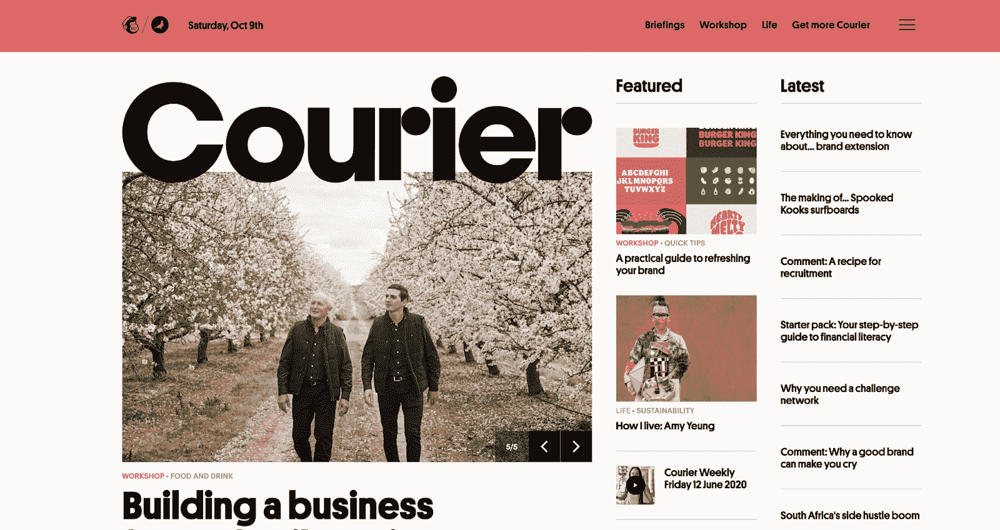

Mailchimp 使用一个与其品牌相关的词作为博客名称。

它的平台最初是一个电子邮件营销平台，使企业能够接触到他们的客户。所以，Courier 作为博客的名字是有意义的。

既然你已经知道了博客的名字应该是什么，让我们来概括一下如何找到适合你的品牌的名字。

## 寻找博客名字的想法

知道在博客名中寻找什么是一回事。遇到正确的名字是一个完全不同的挑战。

这里有几个步骤，你应该采取找到正确的博客名字的想法。

### 1.从一两个关键词开始

如果你正在[为 SEO 优化，](https://kinsta.com/blog/wordpress-seo/)你的每篇文章都应该有一个焦点关键词。为什么你的整个博客不能？

考虑你要写的内容，在名字中包含一个单一的焦点关键词。

例如，迪斯尼可以称它的博客为富有想象力和魔力的东西。然而，这可能并不完全是人们输入搜索引擎的内容。

相反，它有不同的博客有针对性的重点。例如，这里有一个迪斯尼公园博客，一个新闻网站，重点介绍各种迪斯尼主题公园的新内容:

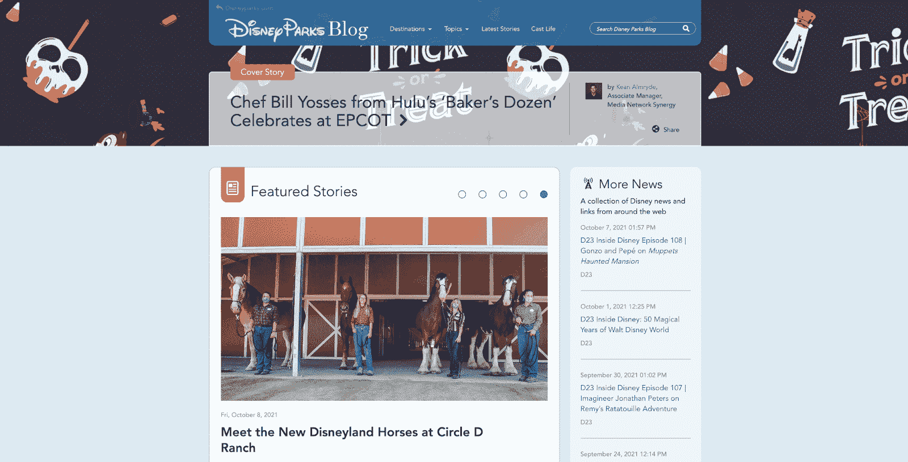

迪士尼乐园博客。

如果读者搜索“迪斯尼公园”，这个博客就会出现。

您可以将相关的单词串在一起，尝试找到与搜索查询相匹配的域名。

### 2.用你自己的名字

有时，你甚至不必为你的博客使用不同的名字。

如果你有一个知名的公司名称或者是行业思想领袖，用你的名字作为博客名称可能更有意义。

领先的营销平台 HubSpot 有一个“HubSpot 博客”,用于发布所有最新内容:

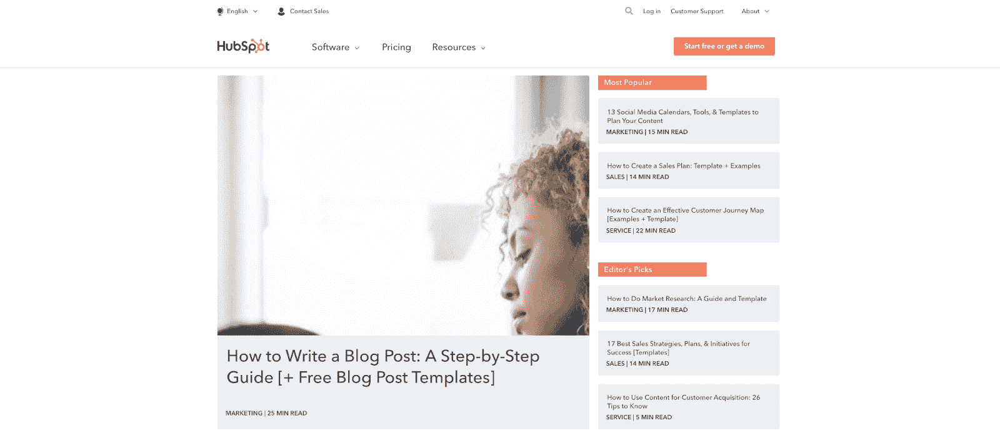

HubSpot 博客。

消费者认可 HubSpot，因此他们立即知道其博客产生了可信的内容。

### 3.使用同义词库

想不出一个与您的品牌相关的词？

写出你的信息中出现的一些最常见的单词。然后，你可以使用词典来查找其他相关的单词。

例如，如果您在同义词库中查找单词“target”，您可能会找到单词“bullseye”

因此，Target 将其博客命名为“牛眼视角”是有道理的。

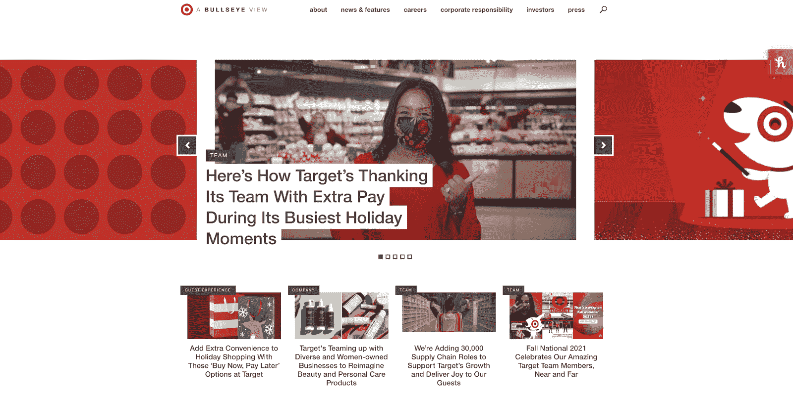

Target 使用品牌词同义词作为其博客名称。

Target 使用一个与其品牌相关的词来确保其博客停留在品牌上。

### 4.使用头韵

使用以相同字母开头的单词的短语会很容易记住。

这就是为什么使用头韵作为你的博客名称是一个好主意。

星巴克的博客“星巴克的故事”脱口而出。这是好玩的，朗朗上口的，有趣的。

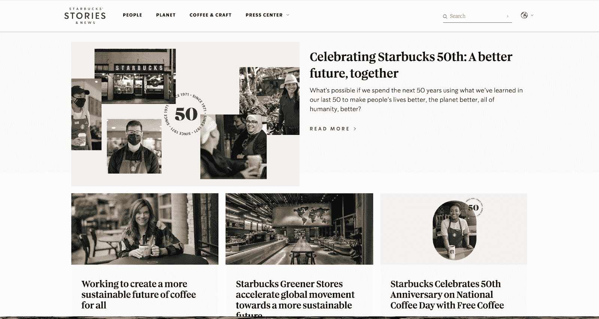

星巴克故事博客。

星巴克的故事是一个简单而有效的博客名称，将留在读者的脑海中。

### 5.使用首字母缩写词或缩写

考虑一下如果你的名字很长，首字母缩略词或缩写会是什么样子。

如果您的域名已经被占用，这种策略也很有用。你可以使用一个流行的[域名注册商](https://kinsta.com/blog/best-domain-registrar/)来查看你的域名是否可用。

你也应该看看[你的域名花费](https://kinsta.com/blog/how-much-does-a-domain-name-cost/)多少，以确保你不会超支。

使用博客名称的首字母缩写或缩写，您可以精简博客名称，以确保易于在浏览器中查找和键入。

例如，看看 NASA 的博客，一个简单、直白的空间组织博客:

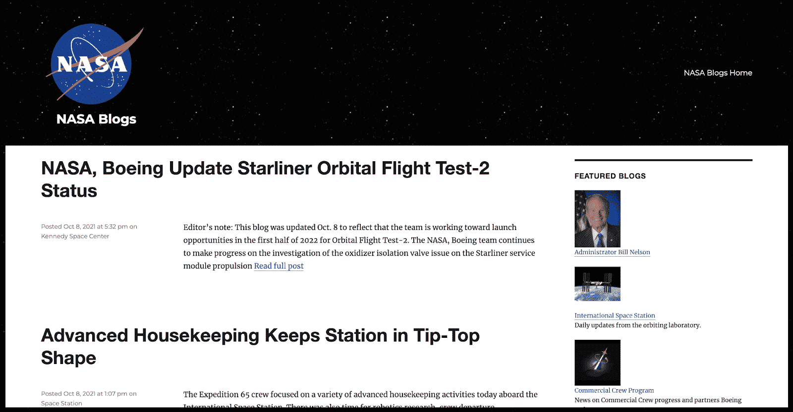

美国宇航局博客。

这个简短的缩写易于输入，是一个简单有效的博客名称。

### 6.制作一个旅行箱

组合词是将两个单词组合成一个全新的单词。

如果你的博客是关于两件事的统一，这是有效的。此外，通过创建自己的单词，您将不必担心域名被占用。

拉布拉多是一个组合体，所以 Agape Labradoodles 博客利用了这个策略:

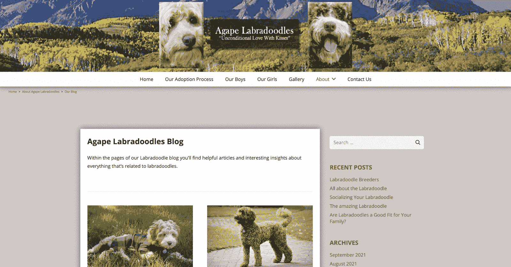

阿加比拉拉写写博客。

不过，你要小心点。如果不能立即识别，有些读者可能会感到困惑和不清楚。

### 7.用一句俗语

给你的博客起一个读者已经在说的名字。

例如,“心流”的状态，或者说当你顺利时的自然工作状态，是有商业头脑的人经常思考的事情。

社交媒体管理平台 Buffer 将其博客命名为“Flow ”,为职场人士突出营销故事和相关内容。

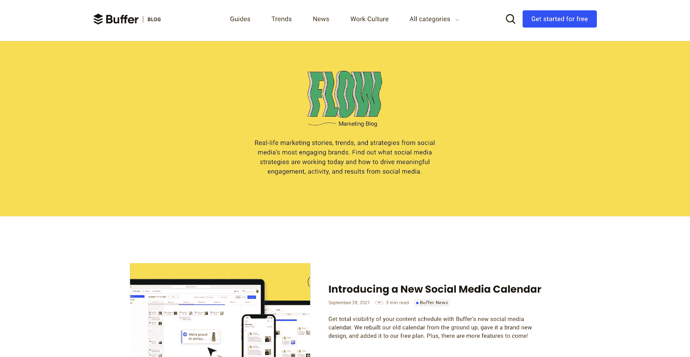

缓冲博客。

这个策略吸引了你的读者，并使你的博客符合他们的语言。

## 注册订阅时事通讯

### 想知道我们是怎么让流量增长超过 1000%的吗？

加入 20，000 多名获得我们每周时事通讯和内部消息的人的行列吧！

[Subscribe Now](#newsletter)

### 8.考虑不同语言中的单词

即使你没有国际读者，你可能会发现其他语言的一些单词会成为优秀的博客名称。

以博客 de Pelis 为例:

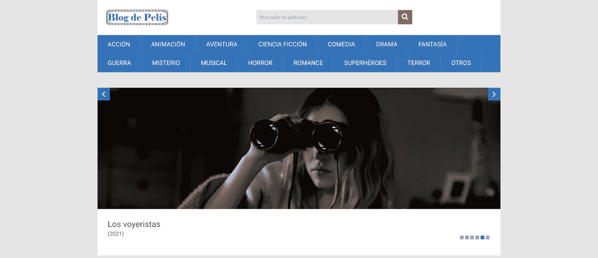

博格德佩利斯。

这是一个受欢迎的电影博客，重点介绍新的版本和功能。

用不同语言的博客标题，你可以扩大你的读者群，吸引许多新的浏览者。

### 9.选择一个随机的名称

有时候，你需要把你的博客名放在墙上。那会使它更令人难忘。

广受欢迎的电影评论博客 AV Club 就采用了这种策略。

AV 俱乐部。

它的博客是电影爱好者俱乐部的代表。虽然最初没有俱乐部存在，但 AV Club 创造并拥有自己的品牌名称，将其读者与迷人的社区联系起来。

### 10.检查竞争对手的名字

在选择一个博客名字之前，你应该看看你的竞争对手在做什么。

在寻找正确的名字时，这可以作为一个有用的路标。

好事达品牌坚持其在竞争激烈的保险领域的根基。该公司没有偏离其名称，而是坚持其消费者熟知的品牌。

好事达博客是您咨询所有保险相关问题的首选资源:

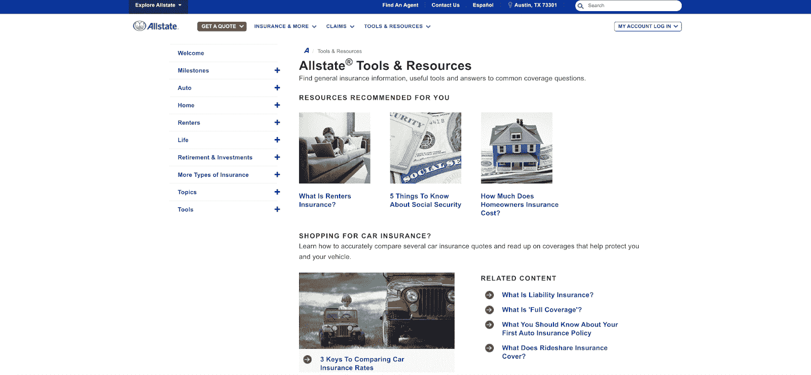

好事达博客。

该公司利用其独特的品牌身份，通过其博客为消费者提供保险相关问题的答案。

现在你知道了你应该考虑的十个因素，是时候看看十个不同的博客生成器来作为额外的资源了。

## 2022 年的 10 个博客名称生成器

市场上有许多博客名称生成器来帮助你找到完美的名字。以下是你应该考虑的十大问题。

### 1.BNG

博客名称生成器(BNG) 是一个简单明了的名称生成器，可以帮助你只需点击几下鼠标就能想出惊人的博客名称。

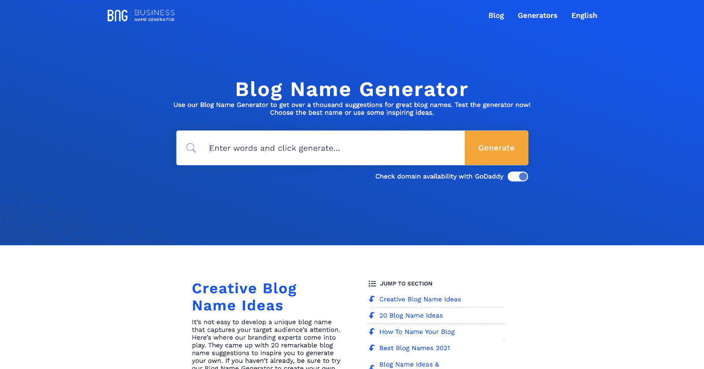

博客名称生成器。

它将生成数百个名称，并与 GoDaddy 交叉引用其域名可用性。网站上有多种语言的多个生成器。

如果你不知道从哪里开始，从博客名称生成器开始，得到一些想法。

### 2.杰作生成器

[杰作生成器](https://www.name-generator.org.uk/blog/)是一个名称生成器，从多个特定的关键字中提取。相反，您可以输入与您的公司相关的多个形容词、动词和单词。生成器在构思你的名字时会考虑这些单词。

需要一流的，快速的，安全的主机为您的新电子商务网站？Kinsta 提供超快的服务器和来自 WooCommerce 专家的 24/7 世界级支持。[查看我们的计划](https://kinsta.com/plans/?in-article-cta)

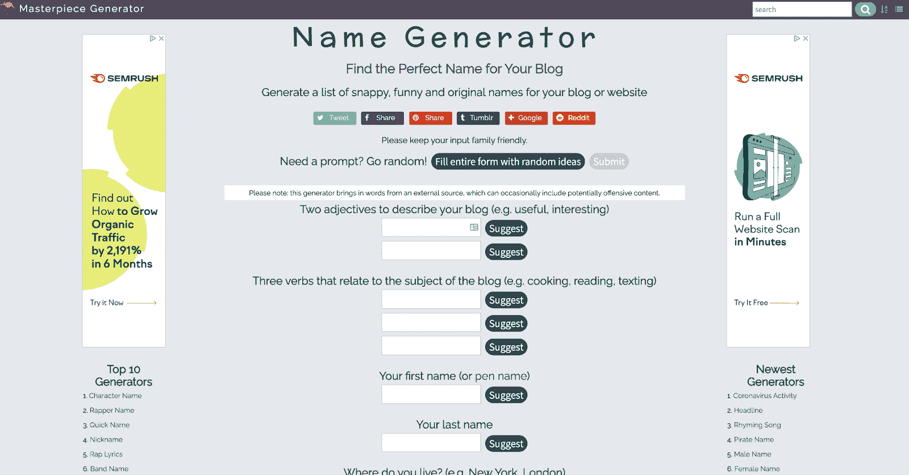

杰作生成器。

这个网站有更多的输入来生成你的名字的特定组合。它可以使你得到更精确和更有针对性的结果。

### 3.命名男孩

Nameboy 是一个博客名称生成器，它收集博客名称，并立即将你与主机提供商联系起来。该平台与 Bluehost 集成在一起，帮助你进行域名托管。

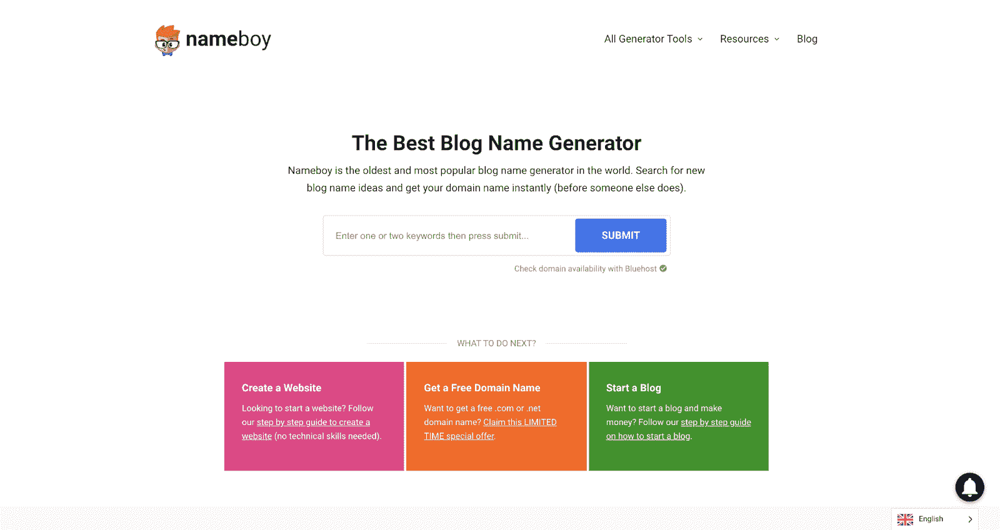

取名男孩。

最重要的是，Nameboy 为各种用例提供了多种生成器。这包括播客、店面、企业、博客等的名称生成器。它有一个特殊的公式，只为你的品牌采购最好的名字。

### 4.单词

如果你不知道从哪里开始，Wordoid 是一个有效的名称生成器。你可以输入两个品牌词，创造一个全新的、独特的词。这个生成器以不同的方式组合多个单词，为你的博客起一个独特的名字。

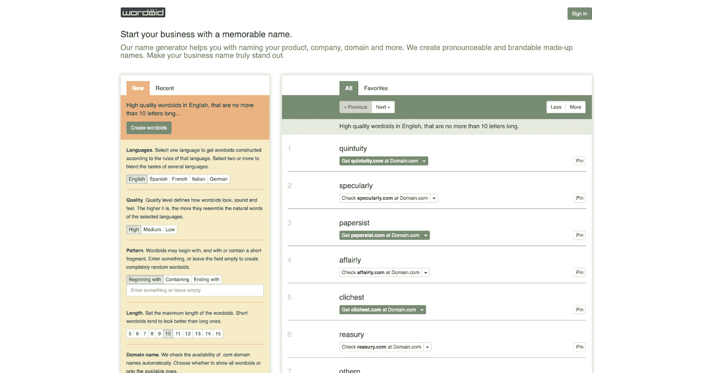

词体。

如果你使用这项服务来获取你的博客名，请小心。错误的名字会损害你博客的发展。确保在上线之前测试您在多个阅读器上创建的新名称 mashup，以获得反馈。

### 5.Wizlogo

Wizlogo 是一个免费的博客名称生成器，它将为你的新博客制定许多可行的选项。就像其他生成器一样，你需要做的就是输入与你的博客相关的单词。

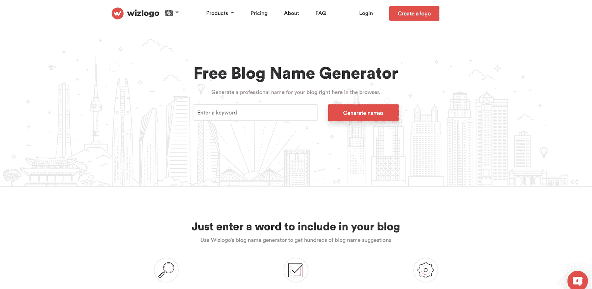

wiz logo 博客名称生成器。

Wizlogo 的神奇之处在于，在你输入一个关键词后，它会自动为你的博客生成一个免费的 logo。这项服务使它成为发布你的博客的一站式商店。有了新的名字和标志，你就可以开始写你的第一篇博文了。

### 6.纳米化

Namify 是一个博客名称生成器，它允许你根据你的关键词选择一个更精确的名称类别。

Namify。

例如，如果你有一个食物博客，你可以选择“食物”并输入你要写的食物类型。Namify 将基于该搜索查询聚合相关的博客名称。

一个额外的关键特性是 Namify 能够自动检查匹配的社交句柄和域是否可用。如果没有匹配的句柄供您使用，这可能会让您重新考虑一些名称。

### 7.Wix 博客名称生成器

Wix 的博客名称生成器是帮助你为博客选择正确名称的绝佳资源。如果你计划在[使用 Wix 来构建你的站点](https://kinsta.com/blog/wix-vs-wordpress/)，这是一个很自然的选择。

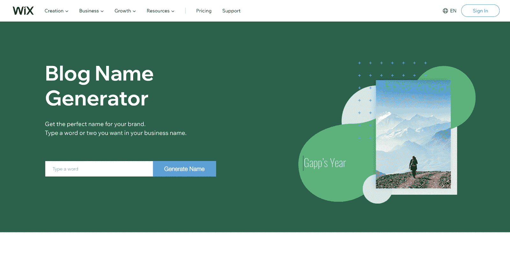

Wix 博客名称生成器。

博客名称生成器会自动将您的名称选项与您可以直接通过 Wix 购买的可用域名进行交叉引用。

### 8.123 查找器. com

123 查找器. com

123Finder.com 是一个有用的博客名生成器，它考虑了很多你在考虑博客名时可能没有考虑到的技术限制。

例如，您可以考虑字符限制并设置参数，以确保您的博客名称不会太长或太短。

如果你登陆了一个你喜欢的博客名称，但该域名不可用，123Finder.com 会为目前市场上没有的网站提供 WHOIS 信息。如果你想用这个域名来发布你的博客，你可以尝试从这个人那里购买这个域名。

### 9.即时域名搜索

[即时域名搜索](https://instantdomainsearch.com/)提供了一个简单的域名生成器来帮助你为你的博客名寻找灵感。除了提供想法，它还强调了哪些域名正在出售，并列出了潜在的[域名扩展](https://kinsta.com/blog/domain-extensions/)供您参考。

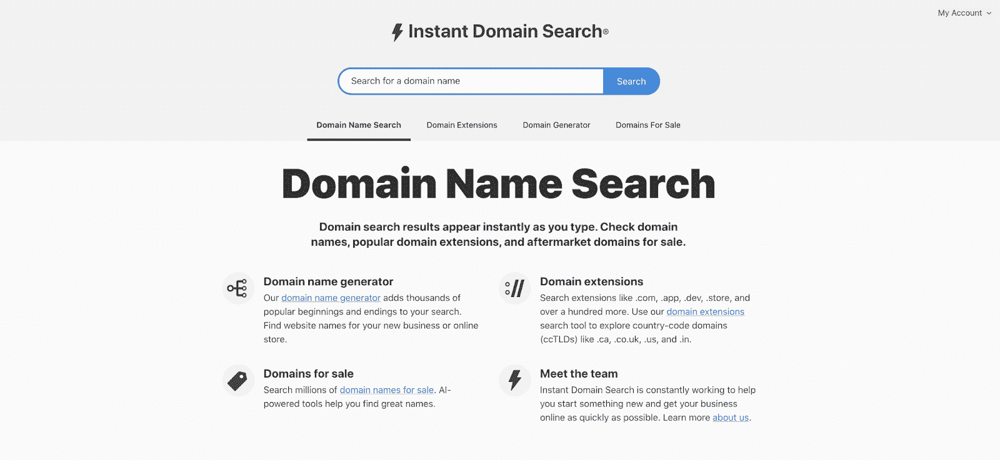

即时域名搜索。

这是一个一体化的解决方案，它将帮助你考虑你的博客和任何品牌推广媒体渠道的未来。如果你认为你可以从你现有的主要博客中扩展开来，这个网站将是思考你的长期未来的最佳选择。

### 10.精益领域搜索

[精益域名搜索](https://leandomainsearch.com/search/)是一个易于使用的域名搜索引擎，可以兼作你的博客名创意生成器。网站上的说明很简单:“试着输入一个搜索词。”然后，你所有的想法都会从结果中产生。

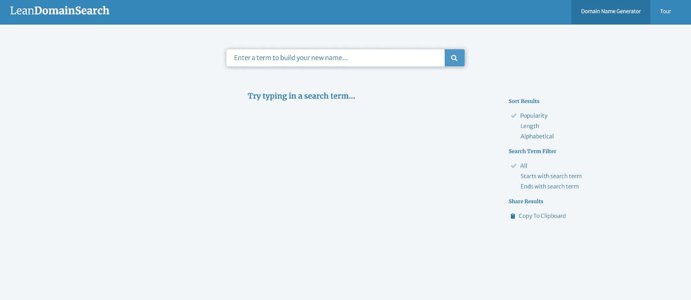

精益领域搜索。

生成器允许您按照流行度、长度或字母顺序进行排序。您还可以筛选以搜索词开头或结尾的结果。这个网站没有太多的特色，所以如果你想找一个简单的，就从这里开始吧。

## 在做最后决定之前

有了你的名字，在你把它作为你博客的正式名称之前，你应该问自己几个最后的问题。

这些安全措施是为了确保你从多个角度考虑你的新博客名字。

### 博客名称/域名是否可用？

一些名称生成器内置了此功能。如果没有，考虑一下你正在使用的网站软件，如 [WordPress](https://kinsta.com/knowledgebase/what-is-wordpress/) 或 Wix，看看是否有域名。

### 域名格式读起来好吗？

想象你的博客名带有. com 或。在它之后写博客，以确保它不会感到怪异或尴尬。有些名字一开始可能看起来很合适。

直到你看到这个领域的外观和感觉，你应该等待巩固你的决定。

### 名字好说好拼吗？

当你推广你的博客时，你不想一直为别人拼写它。一个简单明了、易于拼写和查找的名称至关重要。

### 社交媒体账户可用吗？

完成对所有主要社交媒体网站的扫描。如果您想要的手柄不可用，请检查替代手柄，如 **@yourblogname_official** 或您喜欢的其他变体。

[在选择博客名字的时候感觉被卡住了？👀继续读😌](https://twitter.com/intent/tweet?url=https%3A%2F%2Fkinsta.com%2Fblog%2Fblog-name-ideas%2F&via=kinsta&text=Feeling+stuck+when+it+comes+to+picking+a+blog+name%3F+%F0%9F%91%80+Read+on+%F0%9F%98%8C&hashtags=DomainName%2CBlogTips)

## 摘要

为你的博客找到合适的名字是一个过程。你需要产生博客名称的想法，并缩小范围，以选择正确的。之后，如果你问自己各种各样的资格问题来考虑你的博客名字将会被如何看待，这将会有所帮助。

有了正确的博客名称，你就可以建立自己的网站，取得最大的成功。

通过 Kinsta 为你的下一个博客或项目获得应用程序、数据库和托管 WordPress 主机。[查看我们的计划](https://kinsta.com/plans/)或[与销售人员](https://kinsta.com/contact-us/)交谈，找到适合您的计划。

* * *

让你所有的[应用程序](https://kinsta.com/application-hosting/)、[数据库](https://kinsta.com/database-hosting/)和 [WordPress 网站](https://kinsta.com/wordpress-hosting/)在线并在一个屋檐下。我们功能丰富的高性能云平台包括:

*   在 MyKinsta 仪表盘中轻松设置和管理
*   24/7 专家支持
*   最好的谷歌云平台硬件和网络，由 Kubernetes 提供最大的可扩展性
*   面向速度和安全性的企业级 Cloudflare 集成
*   全球受众覆盖全球多达 35 个数据中心和 275 多个 pop

在第一个月使用托管的[应用程序或托管](https://kinsta.com/application-hosting/)的[数据库，您可以享受 20 美元的优惠，亲自测试一下。探索我们的](https://kinsta.com/database-hosting/)[计划](https://kinsta.com/plans/)或[与销售人员交谈](https://kinsta.com/contact-us/)以找到最适合您的方式。