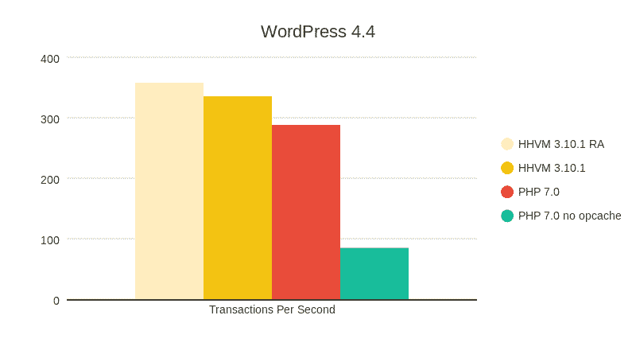
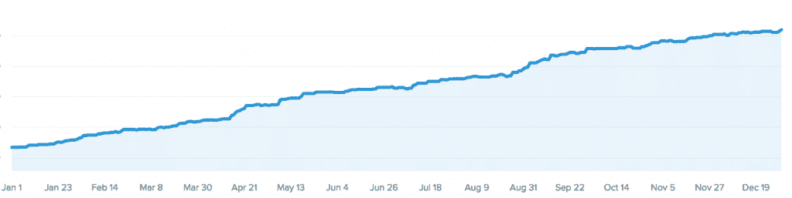
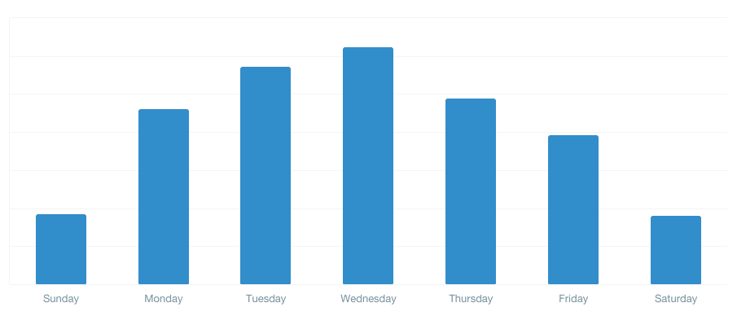
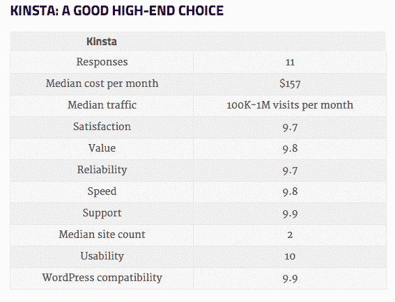
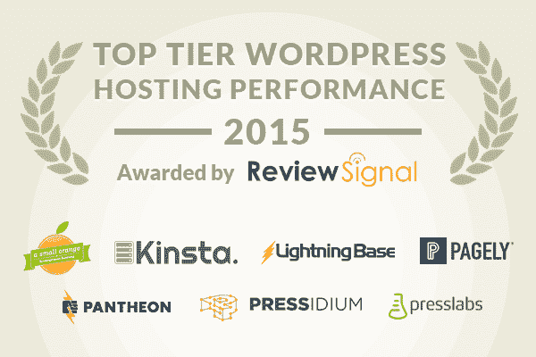

# 2015 年回顾——金斯塔洞察

> 原文：<https://kinsta.com/blog/2015-year-in-review/>

然而，我们已经取得了成功，今年的收入将达到 7 位数，而且我们正在呈指数级增长。感谢所有帮助我们走了这么远并将帮助我们继续成长的客户。

来自 6 大洲 62 个国家的客户用他们辛苦赚来的钱信任我们。我们还没有来自南极洲的顾客，但是我们没有放弃！

## 几个数字

*   通过 4 家提供商的 11 个全球数据中心
*   每月处理 50 亿次 HTTP 请求
*   每月传输 75 TB 出口数据
*   数百个 VPS 和近 1000 个 CPU
*   许多网站每月都有超过 1000 万的独特性

最近，我们收购了几个著名的客户，比如 Swagway，我们帮助他从网络星期一的主机灾难中拯救了 T1。

## 最新工艺

我们是第一批为 HHVM 的计划提供支持的 WordPress 主办方之一(*如果不是*、T2 是第一个)。HHVM [仍然提供更好的性能](https://kinsta.com/blog/php-benchmarks/)，正因为如此，我们更喜欢在这里托管的每个网站上尽可能使用它，而不是标准的 PHP。

## 我们的增长率

这张图表显示了我们 2015 年的增长率，您可以看到我们的规模每 X 个月翻一番。

## 我们非常重视支持

我们一直使用 Intercom 作为我们的支持软件，并且对此非常满意。客户似乎更喜欢它，而不是像 Zendesk 这样过时的解决方案。Intercom 的一些 2015 年见解包括:

*   4255 张已解决的罚单
*   过去 90 天有 720 张票
*   **9 分钟的平均首次响应时间**

一周中支持票最繁忙的日子是周二、周三和周四，周末比预期的要安静得多。

我们一直在努力提供更好的支持，今年我们将努力增加支持人员，进一步缩短平均响应时间。根据 [HostingReviews.io](http://hostingreviews.io) 的调查，我们的支持率仍然是全球第一，几乎每周我们都会面临新的独特情况和案例。

我们将质量支持放在首位，并且**你永远不会得到诸如“自己想办法解决”**之类的答案，这似乎是主机行业的典型问题。我们也一直在使用 New Relic 的 APM 功能，它允许我们查看幕后，以确定性能问题和改进你的 WordPress 站点的方法。

## 独立评论

我们感到自豪的是，我们不仅参与了 WPShout 的年度主机审查调查，而且在主机的总体满意度中名列第一，这些主机得到了足够多的调查反馈，可以列入图表。**我们打出了 9.7/10.0** 的成绩，击败了 [WP Engine、](https://kinsta.com/wp-engine-alternative/) [Pagely](https://kinsta.com/pagely-alternative/) 、[数字海洋](https://kinsta.com/digitalocean-alternative/)、[飞轮](https://kinsta.com/flywheel-hosting-alternative/)、 [GoDaddy](https://kinsta.com/godaddy-alternative/) 、 [MediaTemple](https://kinsta.com/media-temple-alternative/) ，以及 [Bluehost](https://kinsta.com/bluehost-alternative/) 等所有 EIG 自有品牌。其他得分包括价值 9.8 分，可靠性 9.7 分，速度 9.8 分，支持 9.9 分。

在 Review Signal 的 [最新基准测试](http://reviewsignal.com/blog/2015/07/28/wordpress-hosting-performance-benchmarks-2015/) 中，我们也被授予“顶级 WordPress 托管性能”。

## 2016 年及以后

在过去的几个月里，我们一直在做一些很棒的东西，这些东西将会在 WordPress 主机行业掀起波澜。这么说吧，它会打破所有的记录，在性能上树立一个新的标杆。我们谈论的是改进的性能、可靠性、可伸缩性等等。我们离公开发布越来越近了，所以请关注[我们的博客](https://kinsta.com/blog/)并在[推特](https://twitter.com/kinstahosting)上关注我们。我们也将很快推出我们的会员计划，如果您有兴趣[请填写这张表格](https://kinsta.com/affiliates/)，一旦它上线，我们会通知您。

* * *

让你所有的[应用程序](https://kinsta.com/application-hosting/)、[数据库](https://kinsta.com/database-hosting/)和 [WordPress 网站](https://kinsta.com/wordpress-hosting/)在线并在一个屋檐下。我们功能丰富的高性能云平台包括:

*   在 MyKinsta 仪表盘中轻松设置和管理
*   24/7 专家支持
*   最好的谷歌云平台硬件和网络，由 Kubernetes 提供最大的可扩展性
*   面向速度和安全性的企业级 Cloudflare 集成
*   全球受众覆盖全球多达 35 个数据中心和 275 多个 pop

在第一个月使用托管的[应用程序或托管](https://kinsta.com/application-hosting/)的[数据库，您可以享受 20 美元的优惠，亲自测试一下。探索我们的](https://kinsta.com/database-hosting/)[计划](https://kinsta.com/plans/)或[与销售人员交谈](https://kinsta.com/contact-us/)以找到最适合您的方式。