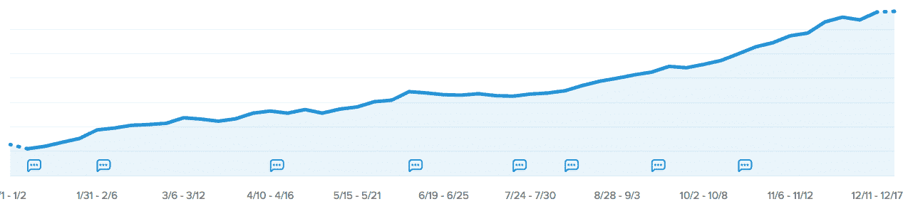
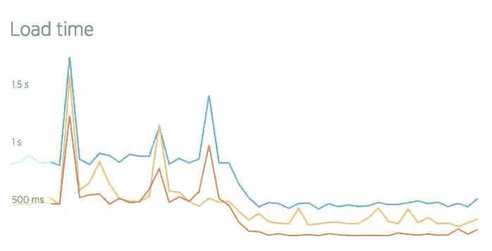
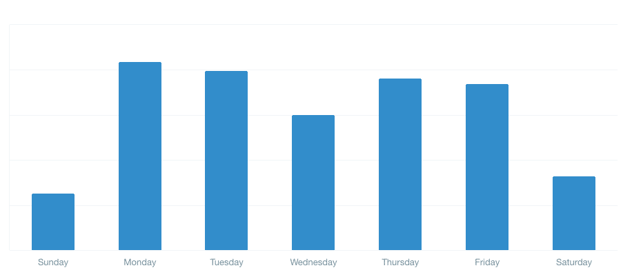
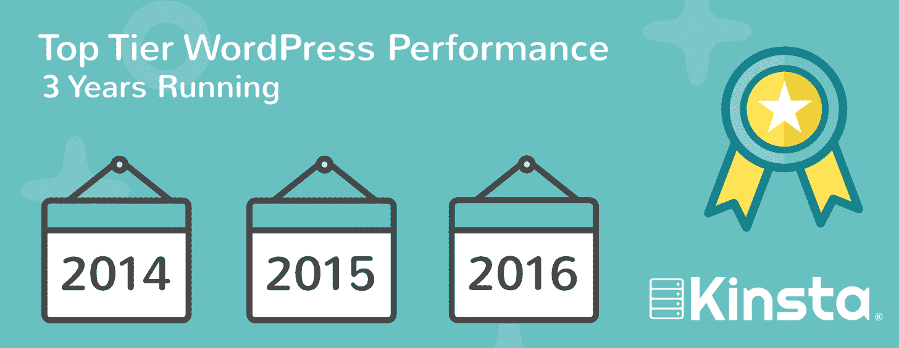

# 2016 年回顾——金斯塔洞察

> 原文：<https://kinsta.com/blog/2016-year-in-review/>

2016 年对我们金斯塔来说是极其忙碌和激动人心的一年。我们首先要感谢你们所有人迄今为止对我们的支持以及对我们托管你们的企业、博客和电子商务 WordPress 网站的信任。随着 WordPress 社区的持续增长，截至 2018 年 1 月，[占网络的 29.3%](https://kinsta.com/wordpress-market-share/)，我们也将如此。请在下面查看我们在 2016 年取得的更多成就，以及我们已经计划在 2017 年初推出的一些令人惊叹的功能。

## 客户和收入增长率

2016 年，Kinsta 的客户和收入持续增长。在过去的 12 个月里，我们的客户群增长了 346.2% 。我们努力保持尽可能的公开和透明，所以下面是我们的 MRR(每月经常性收入)图，直接来自 Baremetrics。我们现在的收入是 2015 年的 4 倍。

如果你不熟悉 Baremetrics，我们强烈推荐你看看我们关于 [40+ SaaS 产品](https://kinsta.com/blog/saas-products/)的博客文章，我们用这些产品来种植 Kinsta。在过去的一年里，我们博客的时事通讯订阅者增长了 64.78%。

## 向谷歌云平台的转移

2016 年标志着[迁移到谷歌云](https://kinsta.com/blog/managed-wordpress-hosting-in-the-google-cloud/)的一年！在 Kinsta，我们一直相信速度和稳定性是一个伟大网站的标志。我们的使命是并将永远是给你带来顶级的托管 WordPress 主机服务。正如你们中的一些人所知，在 2015 年，我们的主要提供商开始经历故障和其他中断，这不仅给我们带来了问题，也给其他托管公司带来了问题。这是不可接受的，因此我们开始寻找符合我们质量标准的其他解决方案。

[T2】](https://cloud.google.com/)

我们决定与谷歌云合作，我们知道谷歌云将确保高水平的冗余，并对我们的服务器进行粒度控制。2016 年初，我们开始迁移客户；使我们成为第一个专门使用谷歌云平台的托管 WordPress 主机。谷歌云的一些额外优势包括:

*   谷歌拥有世界上最大的网络之一。Will Shulman，MongoLab 的联合创始人，在 Google I/O 的一个小组中谈到网络时说:“它正在飞速发展。另一件事——它在所有数据中心之间有一个私有分布式主干网。你是在通过谷歌的主干网说话，而不是通过互联网。”
*   Google Cloud 支持虚拟机的实时迁移，这意味着我们的虚拟机基本上一直保持运行，当虚拟机在主机之间实时迁移时，性能没有明显下降。
*   我们的一些客户仅仅通过迁移到谷歌云就看到加载时间减少了 50%。我们已经看到谷歌云机器轻松处理 60k+的并发访问者，没有任何停顿。Kinsta 还使用 Linux 容器(LXC)和 LXD 来协调它们，在谷歌云平台之上，这使我们能够完全隔离不仅仅是每个帐户，而是每个独立的 WordPress 站点。

请务必查看我们关于使用谷歌云的其他[优势的文章。我们对此次基础架构迁移的表现非常满意，它将确保您的站点在我们发展的过程中保持快速、冗余和安全。](https://kinsta.com/blog/google-cloud-hosting/)

> 需要在这里大声喊出来。Kinsta 太神奇了，我用它做我的个人网站。支持是迅速和杰出的，他们的服务器是 WordPress 最快的。
> 
> <footer class="wp-block-kinsta-client-quote__footer">
> 
> 
> 
> <cite class="wp-block-kinsta-client-quote__cite">Phillip Stemann</cite></footer>

[View plans](https://kinsta.com/plans/)

## 团队扩展

Kinsta 也有很多新面孔！团队规模是去年同期的 3 倍。我们最大的目标之一是雇用更多的支持团队成员，以确保您获得全天候的响应，我们已经做到了这一点。我们还雇佣了更多的工程师，他们目前正在为你开发新功能《T2》。2017 年将是 Kinsta 的特色年，我们迫不及待地要发布它们。

在营销方面，Kinsta 让我加入团队，担任集客营销总监。具有讽刺意味的是，当 Kinsta 首次推出时，我实际上是他们的第一批客户之一，现在我很高兴能为其增长做出贡献。我已经在 web 性能行业工作了一段时间，之前在 KeyCDN 工作过。我对 WordPress 的热爱已经超过 10 年了。阅读更多关于我从[搬到金斯塔](https://kinsta.com/blog/kinsta-hires-brian-jackson-inbound-strategy/)的信息。我在 Twitter 上最活跃，你可以联系我[@ brianlejackson](https://twitter.com/brianleejackson)。

多拉也加入了这个团队，担任客户关系总监。她承担了管理客户和产品开发之间沟通的创造性任务。她努力研究新的解决方案，带来令人惊叹的客户体验。她在 10 个不同的国家旅行、学习、工作和志愿服务了 5 年多，有很强的国际背景和很好的人际交往能力。她热爱舞蹈，喜欢学习语言。你可以在推特 [@dorakinsta](https://twitter.com/dorakinsta) 上和她联系。

我们还在 2016 年启动了新的[西班牙计划](https://kinsta.com/blog/spanish-hosting/)，这要感谢[彼得·科瓦奇](https://twitter.com/PeterKowacs)，他现在是我们西班牙和拉丁美洲地区的执行董事，以及[丹尼尔·哈弗奇](https://twitter.com/daniel_harfouch)、运营总监。他们负责推出新的 Kinsta 网站并将其翻译成西班牙语([kinsta.com/es/语](https://kinsta.com/es/))，以及建立新的在线社交网站 [@kinsta_es](https://twitter.com/Kinsta_ES) 和[facebook.com/kinsta.es 语](https://www.facebook.com/kinsta.es/)。

我们的博客也正在翻译中，更多内容将于 2017 年推出。查看我们西班牙语的一些深入教程和文章:

*   [详细指南:WordPress 中从 HTTP 迁移到 HTTPS？](https://kinsta.com/es/blog/http-a-https/)
*   [WordPress SEO 核对表–2017 年 45 条提示](https://kinsta.com/es/blog/lista-control-seo-wordpress/)
*   [选择 WordPress 托管的 8 大原因](https://kinsta.com/es/blog/wordpress-hosting-gestionado/)

金斯塔很高兴现在能够帮助你在西班牙语前进！

## 注册订阅时事通讯

### 想知道我们是怎么让流量增长超过 1000%的吗？

加入 20，000 多名获得我们每周时事通讯和内部消息的人的行列吧！

[Subscribe Now](#newsletter)

## 2016 年的功能更新

随着我们迁移到 Google Cloud，这意味着我们支持 PHP 7 作为所有 WordPress 站点的默认设置。我们还在 2016 年推出了许多新功能。以下是其中一些的简要介绍:

*   2016 年 4 月 21 日:[一键修改 SFTP 密码](https://kinsta.com/help/connecting-with-sftp/)
*   2016 年 4 月 26 日:[多种支付方式](https://kinsta.com/help/multiple-credit-debit-cards/)
*   2016 年 4 月 29 日:最新 Ubuntu16.04 更新
*   2016 年 4 月 29 日:[整页缓存删除](https://kinsta.com/blog/wordpress-clear-cache/)
*   2016 年 4 月 29 日:从我的添加 HTTPS 凭据。Kinsta 仪表板
*   2016 年 5 月 20 日:[新的一键 WordPress 安装选项](https://kinsta.com/help/new-site/)
*   2016 年 5 月 31 日: [PHP 环境控制](https://kinsta.com/knowledgebase/how-to-update-php-in-wordpress/)(更改 PHP 版本，重启 PHP)
*   2016 年 6 月 1 日:[新的备份功能](https://kinsta.com/help/wordpress-backups/)
*   2016 年 6 月 2 日:插件列表添加到我的。Kinsta 仪表板
*   2016 年 6 月 3 日:为新 WordPress 安装强制安全密码
*   2016 年 6 月 8 日:分离暂存环境和实时环境
*   2016 年 7 月 6 日:[分期推送上线](https://kinsta.com/help/push-staging-live/)
*   2016 年 7 月 15 日:将公司添加到我的。Kinsta 仪表板
*   2016 年 8 月 01 日: [HHVM 环境切换](https://kinsta.com/blog/hhvm-wordpress/)
*   2016 年 8 月 26 日:账户活动日志
*   2016 年 9 月 15 日:[双因素认证](https://kinsta.com/blog/wordpress-two-factor-authentication/)
*   2016 年 11 月 30 日:[通过 Let's Encrypt 提供免费 SSL 支持](https://kinsta.com/blog/free-ssl-certificate/)
*   2016 年 12 月 14 日:[定制新文物追踪](https://kinsta.com/help/custom-new-relic-tracking/)

## 我们非常重视支持

当然，在 Kinsta，支持是我们非常重视的一件事。Kinsta 的支持团队都是 WordPress 的开发者，为 WordPress Core 和其他开源项目做贡献，每天都在使用 WordPress。这包括我们所有的新员工。因此，我们支持部门的专业知识是首屈一指的。在过去的 90 天里，我们的客户开出了 2，154 张新票，其中我们的支持团队回复的平均首次响应时间为 7 分钟。在这一年中，我们已经解决了 10，000+张罚单。

根据 Intercom 的数据，我们支持团队最忙的日子是周一/周二和周四/周五。周末就不那么忙了。

## 独立评论

独立的虚拟主机评论网站 ReviewSignal 在九月份发布了他们的年度 WordPress 主机性能基准测试。我们很高兴金士达再次证明了**是所有层级中最好的公司之一！**这是我们连续第三年获得顶级奖项。

Struggling with downtime and WordPress problems? Kinsta is the hosting solution designed to save you time! [Check out our features](https://kinsta.com/features/)

> 我不知道该说些什么来称赞他们的表演。–凯文，ReviewSignal 的所有者

我们还获得了 codeinwp.com 的最高评级，并被评为最可靠的托管公司。

## 连接 WordPress 社区

Kinsta 还有一个目标，那就是今年与 WordPress 社区建立更多的联系，我们很高兴赞助了 15 个 WordPress 夏令营，并亲自参加了巴塞罗那的 WordPress 夏令营。

以下是我们今年赞助的单词营列表:

*   奥兰治县
*   东京单词营
*   悉尼单词营
*   DFW 世界夏令营
*   里约热内卢单词营
*   纳什维尔单词营
*   凤凰世界
*   西雅图单词营
*   斯德哥尔摩 wordcamp
*   日内瓦世界夏令营
*   WordCamp Udaipur
*   世界夏令营美国奖学金
*   圣保罗世界夏令营
*   WordCamp Barcelona
*   迈阿密单词营

我们还有幸采访了 WordPress 社区和代理/咨询领域的 15 位顶尖人物。我们的首席运营官，肖恩·奥布莱恩，在组织这些方面做得很好。下面只是几个，你可以在这里查看我们发布的全部。

*   [采访摩登部落的特拉维斯·托茨](https://kinsta.com/blog/interview-with-travis-totz-from-modern-tribe/)
*   [采访威望会议的 Kiko Doran](https://kinsta.com/blog/interview-with-kiko-doran/)
*   采访 WordImpress 的马特·克伦威尔
*   [采访男仆梅森·詹姆斯](https://kinsta.com/blog/interview-with-mason-james/)
*   [采访 WP 市长 Jean Galea](https://kinsta.com/blog/interview-with-jean-galea/)
*   采访 WordPress 小妞的 Kim Doyal
*   [采访 Zeek 的 Steve Zehngut](https://kinsta.com/blog/interview-with-steve-zehngut/)
*   [采访《99 个机器人》的查理·帕特尔](https://kinsta.com/blog/interview-with-charlie-patel/)
*   [采访《人造人》的汤姆·威尔莫特](https://kinsta.com/blog/interview-with-tom-willmot/)
*   [采访《多点》的阿尼尔·古普塔](https://kinsta.com/blog/interview-with-anil-gupta/)
*   [采访行政专栏的大卫·莫斯特德](https://kinsta.com/blog/interview-with-david-mosterd/)

## 2017 年有什么期待

我们对 2017 年感到兴奋，并且确信您会喜欢我们即将推出的一些功能。

明年年初我们将在 [正式推出我们的加盟计划](https://kinsta.com/affiliates/) 。这项工作已经进行了一段时间。原因是，我们完全是从零开始开发的！将不会有混乱的 ShareASale 或其他第三方会员登录处理。它将包含与 My 相同的用户界面。金斯塔仪表板。我们自己建立它让我们能够确保我们的联盟项目将是 WordPress 主机行业中最好的。

我们还将在 [增加更多的数据中心](https://kinsta.com/knowledgebase/google-cloud-data-center-locations/) 。谷歌云正在全球范围内迅速扩张，我们也是如此。这包括伦敦、孟买、悉尼和圣保罗。你还可以期待更多的工具，详细的分析和更多的功能在我的。金斯塔仪表板。

感谢您一直以来的支持，祝大家节日快乐！我们 2017 年再见。

* * *

让你所有的[应用程序](https://kinsta.com/application-hosting/)、[数据库](https://kinsta.com/database-hosting/)和 [WordPress 网站](https://kinsta.com/wordpress-hosting/)在线并在一个屋檐下。我们功能丰富的高性能云平台包括:

*   在 MyKinsta 仪表盘中轻松设置和管理
*   24/7 专家支持
*   最好的谷歌云平台硬件和网络，由 Kubernetes 提供最大的可扩展性
*   面向速度和安全性的企业级 Cloudflare 集成
*   全球受众覆盖全球多达 35 个数据中心和 275 多个 pop

在第一个月使用托管的[应用程序或托管](https://kinsta.com/application-hosting/)的[数据库，您可以享受 20 美元的优惠，亲自测试一下。探索我们的](https://kinsta.com/database-hosting/)[计划](https://kinsta.com/plans/)或[与销售人员交谈](https://kinsta.com/contact-us/)以找到最适合您的方式。