# 回顾 2017 年——金士达年度回顾

> 原文：<https://kinsta.com/blog/2017-year-in-review/>

哇，我们真不敢相信已经快到 2018 年了。过去的一年里发生了太多的事情，我们只希望你能完成这篇文章。随着金斯塔以惊人的速度成长，许多新面孔加入了这个团队。我们特别自豪的一些变化和新功能包括增加 10 个新的数据中心，推出新的入门级主机计划(起价 35 美元/月)，添加 CDN，启动并运行我们的联盟计划，以及最终改造我们的外观。

更新:[回顾不可思议的 2018–金士塔年回顾](https://kinsta.com/blog/2018-year-in-review/)

我们首先要感谢你们所有人到目前为止对我们的支持，以及对我们托管你们的业务、博客和电子商务网站的信任。请在下面查看我们在 2017 年取得的更多成就，以及我们为即将到来的一年计划的一些令人惊叹的功能。在金斯塔，我们永远不会停止创新。

[#Webhosting isn't a race to the bottom. It's about innovation and providing value to customers.Click to Tweet](https://twitter.com/intent/tweet?url=https%3A%2F%2Fkinsta.com%2Fblog%2F2017-year-in-review%2F&via=kinsta&text=%23Webhosting+isn%27t+a+race+to+the+bottom.+It%27s+about+innovation+and+providing+value+to+customers.)

## 客户和收入增长率

我们的首席财务官 Tom 最近详细分享了将 Kinsta 从 0 美元提升到 7 位数收入的 16 条经验。这是一本很棒的读物，如果你还没有看过，一定要去看看。就像任何 SaaS 或初创公司一样，我们在前进的道路上也有许多障碍需要克服。但是[把我们的客户放在第一位，提供无与伦比的支持](https://kinsta.com/kinsta-support/)已经并将永远是我们的第一要务。我们相信正是这一点让我们走到了今天。

Kinsta 在 2017 年再次实现了客户和收入的持续增长。在过去的 12 个月里，我们的客户群增长了 157.7%。我们努力保持尽可能的公开和透明，所以下面是我们的净收入图，直接来自 Baremetrics。我们现在的**发电量是 2015 年**的 5 倍多。

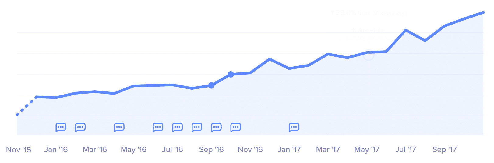

Kinsta net revenue (based on full year of data in 2017)

如果你不熟悉 Baremetrics，我们强烈推荐你看看我们关于 [40+ SaaS 产品](https://kinsta.com/blog/saas-products/)的博客文章，我们用这些产品来种植 Kinsta。这里还有一些有趣的事实:

> Kinsta 把我宠坏了，所以我现在要求每个供应商都提供这样的服务。我们还试图通过我们的 SaaS 工具支持达到这一水平。
> 
> <footer class="wp-block-kinsta-client-quote__footer">
> 
> 
> 
> <cite class="wp-block-kinsta-client-quote__cite">Suganthan Mohanadasan from @Suganthanmn</cite></footer>

[View plans](https://kinsta.com/plans/)

*   Kinsta 的客户平均每月发出 70 亿次 HTTP 请求。
*   **每月通过 Kinsta 的服务器传输超过 120 TB 的出口数据**。

根据我们从 Intercom 获得的数据，我们支持团队最忙的时段是周一至周四下午 3-9 点，周末相当慢。

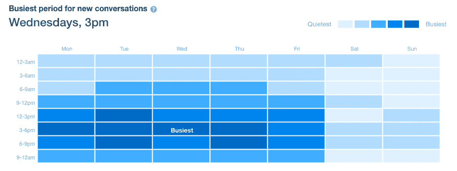

Busiest time of week (based on full year of data in 2017)

我们已经将之前 7 分钟的中值支持服务响应时间缩短至 **2 分钟**(12 月至今)，现在提供全天候服务。解决和关闭您的问题的平均时间也提高了很多，现在是 55 分钟。这个数字更高的原因是，它包含了许多更复杂的技术问题，我们的系统管理员必须检查您的站点来解决问题。

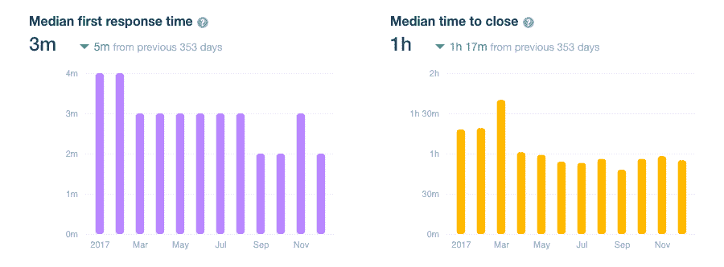

Support median response time (based on full year of data in 2017)

如果我们看看全年的支持请求，11 月是我们有史以来最忙的一个月。我们有创纪录数量的新客户，这可能与门票的增加有关。

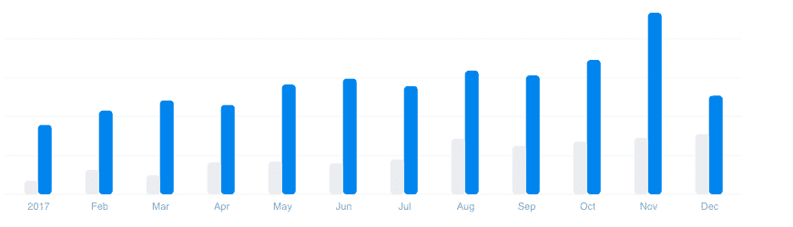

Number of support requests (based on full year of data in 2017)

## 团队扩展

毫不奇怪，金斯塔又有很多新面孔了！团队规模是去年同期的两倍。我们已经雇佣了更多的工程师来进一步减少售票时间，还雇佣了新的开发人员来帮助构建和改进我们已经发布的所有新功能。

在管理方面，我们很高兴 Jon Penland 现在成为我们的销售和支持负责人。组合这个角色在主机行业不太常见。然而，我们发现这样做效果最好，因为参与我们的支持团队意味着他对正在发生的事情以及最常见的问题有一个总体的了解。这使得销售团队能够更好地回答售前问题和管理客户期望，而不是简单地试图增加销售数字，最终给客户带来负面体验。

Jon 帮助我们的销售和支持团队，确保他们拥有所需的工具和支持，然后放手让他们去做，让他们做得更好。他坚信，被授权的员工不需要被微观管理，当被当作专业人士对待时，他们会把工作做得最好。

Jon Penland

乔恩也是有家室的人。因此，当他不狂热地敲击笔记本电脑的按键时，他通常会帮助他的一个孩子修理自行车，或者为一个不耐烦的学龄前儿童设置网飞。你可以在 [LinkedIn](https://www.linkedin.com/in/jonpenland/) 上和他联系。

Daniel Harfouch，以前的运营总监(西班牙和拉丁美洲)现在是我们的全球扩张负责人。在过去的一年里，他一直在努力工作，管理我们的内部项目(改造我们的网站)，并帮助我们的[西班牙倡议](https://kinsta.com/blog/spanish-hosting/)。我们希望每个人都能用自己的母语轻松访问 Kinsta。Daniel 负责我们在全球范围内的扩张，并管理将我们的内容翻译成新语言的庞大任务。

Daniel Harfouch

在办公室之外，丹尼尔喜欢旅行和结识新朋友。他热爱西班牙和拉丁美洲文化，并有幸在巴塞罗那生活了几年，享受着甜蜜的生活方式。你可以在推特上和他联系。

## 金赛周

我们团队的大部分人都住在偏远地区(超过 50%)，因此每年我们都会举办“金斯塔周”在过去的两年里，这发生在美丽的匈牙利布达佩斯。我们中的大多数人只是通过我们许多无聊的对话来了解彼此，所以面对面地与每个人见面总是很有趣的！这一周通常包括一些关于公司未来发展战略的会议，当然还有其他团队建设活动，如激光枪战、卡丁车或彩弹射击。

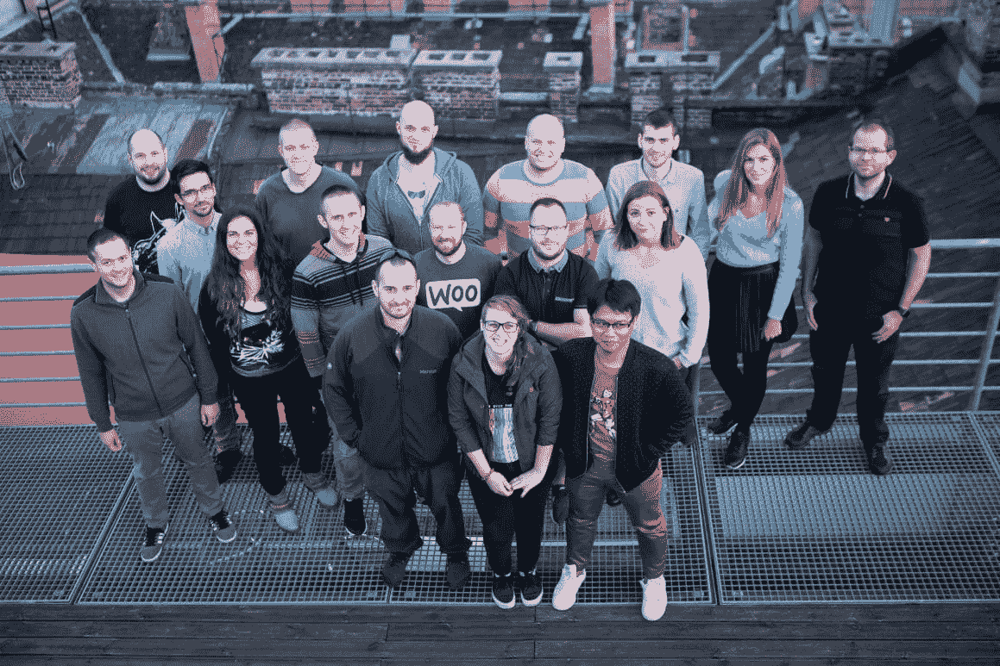

Kinsta week (minus a few team members)

## 功能更新和变化

我们今年推出了如此多的新功能，我们不可能全部列出来！因此，下面我们将介绍基础架构、定价和控制面板的主要更新和变化。

### 推出 PHP 7.2 支持

我们一直致力于为您带来 PHP 的最新稳定版本，只要我们已经在我们的环境中彻底测试了它。我们是首批推出 [PHP 7.2](https://kinsta.com/blog/php-7-2/) 的托管 WordPress 主机之一(截至 2017 年 12 月 4 日)。当然，就像我们在 Kinsta 构建的所有东西一样，你可以**在 MyKinsta 仪表板的工具下，点击一下鼠标，轻松地更改 PHP 版本**。

[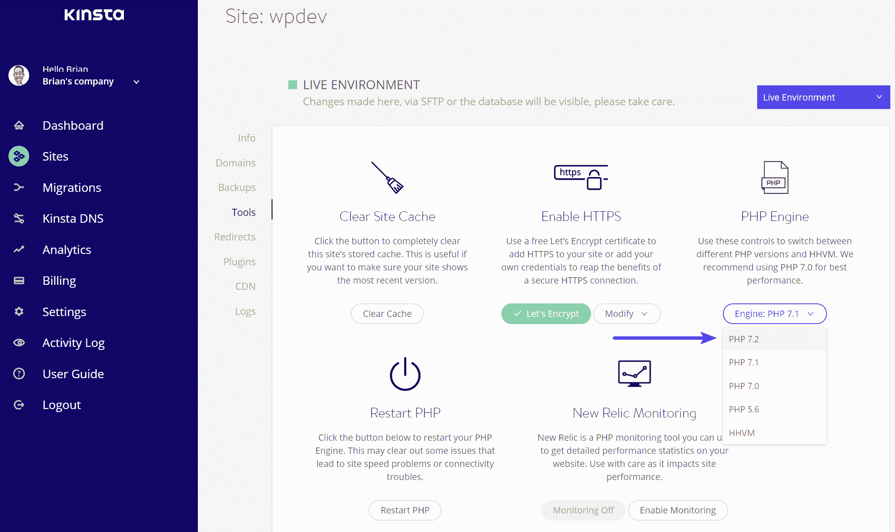](https://kinsta.com/blog/php-7-2/)

Change to PHP 7.2

### 增加了 10 个新的数据中心

增加新的数据中心对我们来说是重中之重。因为 Kinsta 是建立在谷歌云平台上的，我们现在可以推出新的地点。随着谷歌的成长，金斯塔也在成长！这让我们在过去的一年里又增加了 10 个[数据中心](https://kinsta.com/knowledgebase/google-cloud-data-center-locations/)，使我们的数据中心总数达到 13 个。

[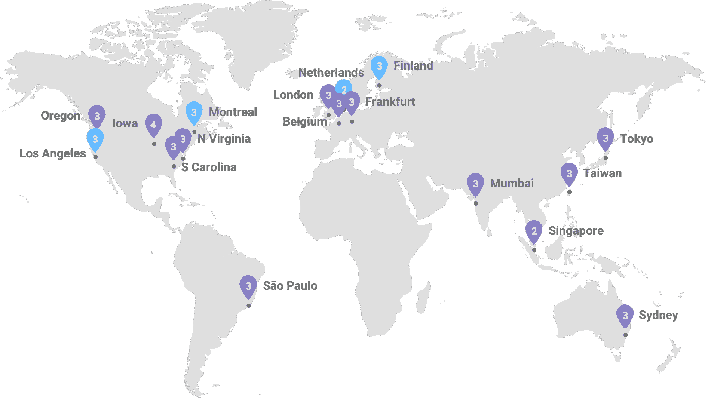](https://kinsta.com/knowledgebase/google-cloud-data-center-locations/)

Google Cloud data center locations

这种基础设施的改变允许你更有策略地定位你的 WordPress 站点，使其更接近你的访问者和客户。这有助于减少延迟， [TTFB](https://kinsta.com/blog/ttfb/) ，并确保更快的页面加载时间。以下是 2016 年旧地点和 2017 年新增地点的列表:

*   美国爱荷华州康瑟尔布拉夫斯(2016 年)
*   比利时圣吉斯兰(2016 年)
*   台湾彰化县(2016 年)
*   澳大利亚悉尼**(新)**
*   美国俄勒冈州达尔斯**(新)**
*   美国弗吉尼亚州阿什本**(新)**
*   美国南卡罗来纳州蒙克斯角**(新)**
*   英国伦敦**(新)**
*   德国法兰克福**(新)**
*   新加坡裕廊西**(新)**
*   日本东京**(新)**
*   巴西圣保罗**(新)**
*   印度孟买**(新)**

### 对 MyKinsta Analytics 进行全面检查

在金斯塔，我们热爱的一件事就是数据。这就是我们彻底改造我们的 [MyKinsta Analytics](https://kinsta.com/help/mykinsta-analytics/) 工具的原因。你现在可以更容易地从仪表板中调查和诊断你的 WordPress 站点上的问题。找出引擎盖下发生了什么！

## 注册订阅时事通讯

### 想知道我们是怎么让流量增长超过 1000%的吗？

加入 20，000 多名获得我们每周时事通讯和内部消息的人的行列吧！

[Subscribe Now](#newsletter)

[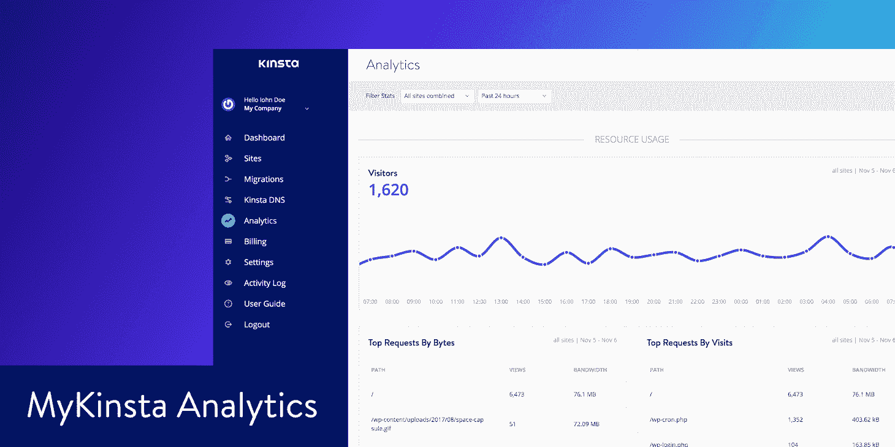](https://kinsta.com/help/mykinsta-analytics/)

MyKinsta analytics

MyKinsta Analytics 现在分为六个不同的部分:

*   **资源:**访问者、带宽使用、按字节排序的最大请求、按计数排序的最大请求
*   **分散:**移动 vs 桌面
*   **性能:**平均 PHP + MySQL 响应时间、PHP 吞吐量、AJAX 使用率、最高平均上行时间、最高最大上行时间
*   **响应:**响应代码细分、响应统计、500 错误细分、400 错误细分、重定向细分
*   **高速缓存:**高速缓存组件堆栈，高速缓存组件图表，顶级高速缓存旁路
*   **地理& IP:** 顶级国家、顶级地区、顶级城市、顶级客户 IP

显示上述数据的许多后端查询被完全重写，并且对我们缓存数据的方式进行了改进。🚀这确保了更快的 MyKinsta 仪表板加载时间。

### 重塑我们的形象

几个月前，Kinsta 焕然一新！我们从头开始重新设计了我们的网站，包括新的徽标、布局、配色方案和简化的导航。

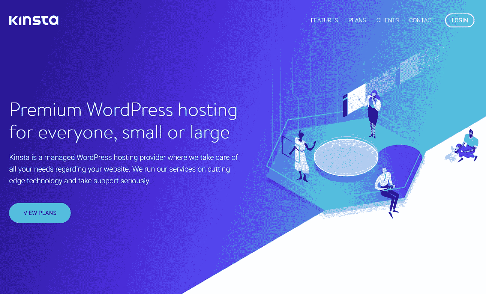

New Kinsta website

除了重新设计，我们还根据过去几年收到的用户反馈建立了新的页面。你们中的许多人要求更多地了解我们的基础设施是如何运作的。因此，我们现在有了更深入地涵盖这些主题的附加内容。比如**kin sta scaling 如何工作**，关于我们硬件和软件栈的信息，关于[服务器级缓存的细节](https://kinsta.com/blog/wordpress-cache/)， [PHP workers](https://kinsta.com/blog/php-workers/) 等等。查看我们的[功能](https://kinsta.com/features/)页面。

当谈到学习 WordPress 以及如何使用它来扩展你的业务时，我们总是试图在网上提供最好的内容。正因为如此，我们建立了一个全新的[资源区](https://kinsta.com/resources/)，它包括了我们所有博客文章、知识库文章和学习教程的**通用搜索**。现在您可以快速找到文章，无论它们位于网站的哪个位置。

[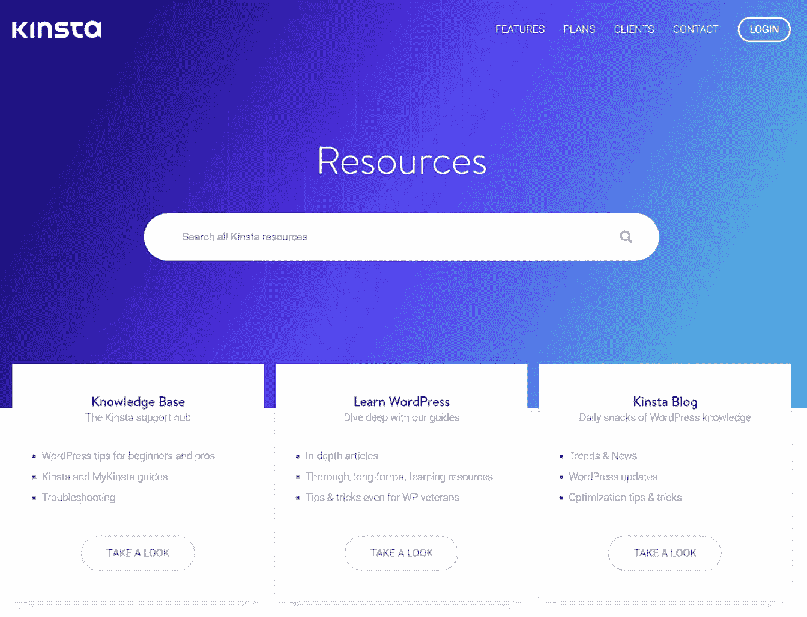](https://kinsta.com/resources/)

Kinsta resources

### 添加了 Kinsta CDN

你的 WordPress 站点的性能已经并将永远是我们的首要任务之一。正因为如此，我们与 HTTP/2 内容交付网络[key dn](https://www.keycdn.com/)合作，以增强您在全球的资产。KeyCDN 的内容交付架构是从零开始构建的，专注于高性能，旨在实现高吞吐量和低延迟。这使得客户的内容可以从全球 28 个以上的 pop 中进行交付和缓存。

Kinsta CDN

查看我们关于[CDN 如何工作](https://kinsta.com/blog/wordpress-cdn/)以及为什么你应该使用 CDN 的帖子。根据我们的经验，CDN 通常可以帮助**从您的 web 主机卸载 70%的带宽**请求，并且在某些情况下**将加载时间减少多达 50%！**Kinsta CDN 现已在 MyKinsta 仪表盘中提供。就像我们的其他工具一样，这是一个简单的单击过程。我们还为新客户和现有客户提供了大量的免费 CDN 带宽。

### 每月 35 美元起的新入门级计划

2017 年最受欢迎的功能之一是我们推出了一些更实惠的计划。我们听到了您的反馈，我们很高兴最近推出了我们的**新入门级计划**，起价为每月 35 美元。[的新计划](https://kinsta.com/plans/)代表了我们的定价结构向**的延伸，让更多的用户能够使用 Kinsta**。Kinsta 一直是企业和专业开发人员的首选解决方案，但我们还没有提供面向 WordPress 新用户、小企业、博客作者或作者的计划。

Struggling with downtime and WordPress problems? Kinsta is the hosting solution designed to save you time! [Check out our features](https://kinsta.com/features/)

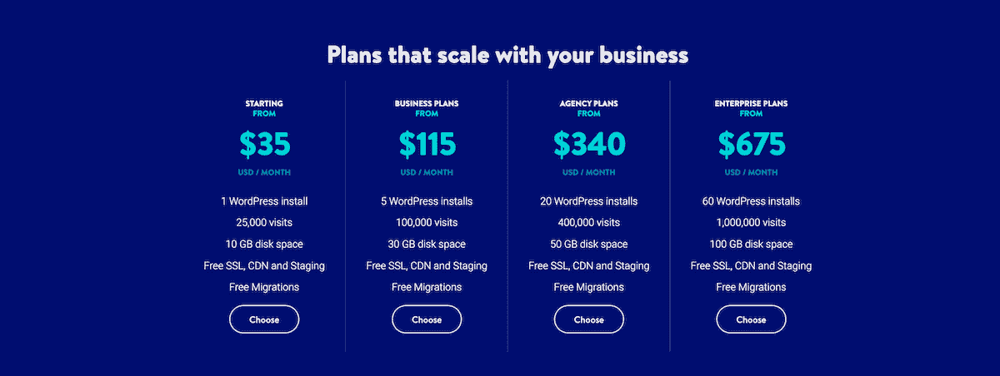

Kinsta plans

新计划将使刚刚开始使用的新用户能够享受 Kinsta 平台和工具在计划上的强大功能，分配适合他们的需求。到目前为止，我们新计划的反馈非常好！

### 启动金士达加盟计划

最后但同样重要的是，我们终于推出了我们的 [WordPress 托管联盟项目](https://kinsta.com/affiliates/)。在过去的几年里，你们中的许多人都把客户和朋友介绍给了金斯塔，对此我们感激不尽。这是我们成为市场上增长最快的托管 WordPress 主机的驱动因素之一。这比我们最初预计的时间要长，因为我们想让它变得完美！我们从头开始设计我们的附属仪表板，这意味着您不必使用令人困惑和混乱的第三方工具。

[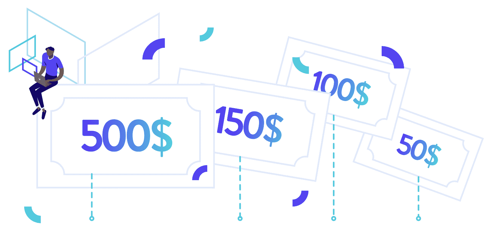](https://kinsta.com/affiliates/)

Kinsta affiliate program

以下是一些你应该加入的更好的理由:

*   我们有业内最高的奖金，每个推荐高达 500 美元，此外还有 **10%的每月定期佣金**！
*   Kinsta 对每个客户都有极高的终身价值。我们的**流失率低于 5%** 。这意味着你可以轻松赚取该客户一生的经常性佣金。
*   我们提供 **60 天的跟踪 cookies** 以确保您获得销售积分。

### 其他更新

除了上面提到的所有主要特性的更新和变化，这里有几个额外的快速概述。

*   2017 年 1 月 6 日:[将备份恢复到转移状态](https://kinsta.com/feature-updates/restore-backups-staging/)
*   2017 年 1 月 25 日:[MyKinsta 上的错误日志](https://kinsta.com/feature-updates/error-logs-now-visible-kinsta/)
*   2017 年 2 月 13 日: [PHP 7.1](https://kinsta.com/feature-updates/php-7-1-now-available-kinsta/)
*   2017 年 3 月 28 日:[克隆 WordPress 网站](https://kinsta.com/feature-updates/cloning-wordpress-sites/)
*   2017 年 5 月 8 日:[重定向 MyKinsta 上的规则](https://kinsta.com/feature-updates/redirect-rules-mykinsta/)
*   2017 年 12 月 20 日:[搜索和替换工具](https://kinsta.com/feature-updates/search-replace-tool/)

## 连接 WordPress 社区

回顾去年的这个时候，WordPress 占据了 27%的网络份额，今天它的份额已经超过了 43.3%。正因为如此，我们总是尽可能地尝试与成长中的社区建立联系。我们很高兴今年赞助了各种单词营和聚会:

*   迈阿密单词营
*   WordCamp Nashik
*   布宜诺斯艾利斯单词营
*   坎普尔单词营
*   WordCamp Udaipur
*   哥斯达黎加圣若泽·科斯塔单词营
*   里斯本单词营
*   wordcamp
*   桑坦德世界夏令营
*   墨西哥坎昆瓜达拉哈拉，普埃布拉，蒙特雷，瓜达拉哈拉
*   波哥大(哥伦比亚)
*   马那瓜(尼加拉瓜)

没有什么比一群 WordPress 粉丝聚在一起聊天更好的了！😄我们目前还赞助了 [WPCouple](https://wpcouple.com/) ，这样他们就可以专注于开源项目，回馈社区。他们目前为 WordPress core、 [Gutenberg](https://kinsta.com/blog/gutenberg-wordpress-editor/) 做贡献，并且有大量的[其他项目](https://github.com/ahmadawais)。

WPCouple

[WP-Tonic](https://www.wp-tonic.com/) ，一家 [WordPress 维护](https://kinsta.com/blog/wordpress-maintenance/%E2%80%8E)公司，是我们最近赞助的另一家。他们有一个每周两次的 WordPress 商业播客，涵盖了 WordPress 开发、商业和营销的交叉领域。他们采访了 WordPress 和在线营销领域的一些大腕，还在每周六现场主持圆桌讨论。如果你想听 WordPress 的人们谈论 WordPress，这是给你的播客！

WP-Tonic

我们还有幸在 2017 年采访了 WordPress 社区和代理/咨询领域的 13 位顶尖人物。下面只是几个，你可以在这里查看我们发布的全部。

*   [采访标志性人物詹姆斯·坎普特](https://kinsta.com/blog/interview-james-kemp/)
*   [采访 MH 主题的迈克尔·赫本斯特雷特](https://kinsta.com/blog/interview-michael-hebenstreit/)
*   采访 AppPresser 的 Scott bo linger
*   [采访 WP 网站维护的瑞安·沙利文](https://kinsta.com/blog/interview-ryan-sullivan/)
*   采访艾塞姆的查理·利文斯顿
*   WP 迷乔·霍华德访谈
*   采访 WP Newsify 的彼得·尼尔森
*   [采访威格洛特的奥古斯丁·普罗特](https://kinsta.com/blog/interview-augustin-prot/)
*   [元素之本·派恩斯访谈](https://kinsta.com/blog/interview-ben-pines/)
*   [采访 GiveWP 的德文·沃克](https://kinsta.com/blog/interview-devin-walker/)
*   [采访 ProteusThemes 的 Primoz Cigler](https://kinsta.com/blog/interview-primoz-cigler/)
*   [采访洛克丹设计公司的约翰·洛克](https://kinsta.com/blog/interview-john-locke/)

## 提供高质量的内容

正如你可能已经猜到的那样，我们喜欢 Kinsta 的内容营销！🙌我们在 2017 年花费了数百个小时来编写和更新内容，以帮助您的生活变得更加轻松。以下是我们最受欢迎的 10 篇博文和教程:

*   [2017 年谷歌云 vs AWS(巨头对比)](https://kinsta.com/blog/google-cloud-vs-aws/)
*   [WooCommerce 教程——如何在你的网站上设置它](https://kinsta.com/blog/woocommerce-tutorial/)
*   [深入探究 Pingdom 速度测试工具](https://kinsta.com/blog/pingdom-speed-test/)
*   [潜入新古腾堡 WordPress 编辑器(利弊)](https://kinsta.com/blog/gutenberg-wordpress-editor/)
*   [WordPress Robots.txt 指南——它是什么以及如何使用它](https://kinsta.com/blog/wordpress-robots-txt/)
*   [如何针对网页和性能优化图像](https://kinsta.com/blog/optimize-images-for-web/)
*   [如何用 WordPress 在 Google PageSpeed Insights 中打 100/100 分](https://kinsta.com/blog/google-pagespeed-insights/)
*   [WordPress CDN——为什么你应该使用一个](https://kinsta.com/blog/wordpress-cdn/)
*   [如何诊断你的 WordPress 站点上的高 Admin-Ajax 使用率](https://kinsta.com/blog/admin-ajax/)

最后但同样重要的是我们的 [WordPress SEO 清单](https://kinsta.com/blog/wordpress-seo/)。去年我们**的有机流量增长了 500%** 。在这篇文章中，我们分享了一些对我们有效的技巧和策略。

我们有很多很棒的内容，所以一定要订阅我们的时事通讯。📧我们将很快扩展我们当前可用的资源部分，推出一个专门用于联盟营销的新渠道。这将是一个完整的指南，从开始到结束。了解从哪里以及如何开始，并学习提高转化率的高级技巧。

## 2018 年再见

我们对 2018 年感到无比兴奋，并且确信您会非常喜欢我们商店中的一些功能。

我们的一大重点是扩展到全球新的领域，因为我们希望人们能够使用他们的母语。我们今年实现的许多功能和即将实现的功能都来自客户的反馈。如果您有任何需要，请随时告诉我们，并继续支持我们。

我们金斯塔全体员工祝您节日快乐。🎄为成功的 2018 年干杯！

* * *

让你所有的[应用程序](https://kinsta.com/application-hosting/)、[数据库](https://kinsta.com/database-hosting/)和 [WordPress 网站](https://kinsta.com/wordpress-hosting/)在线并在一个屋檐下。我们功能丰富的高性能云平台包括:

*   在 MyKinsta 仪表盘中轻松设置和管理
*   24/7 专家支持
*   最好的谷歌云平台硬件和网络，由 Kubernetes 提供最大的可扩展性
*   面向速度和安全性的企业级 Cloudflare 集成
*   全球受众覆盖全球多达 35 个数据中心和 275 多个 pop

在第一个月使用托管的[应用程序或托管](https://kinsta.com/application-hosting/)的[数据库，您可以享受 20 美元的优惠，亲自测试一下。探索我们的](https://kinsta.com/database-hosting/)[计划](https://kinsta.com/plans/)或[与销售人员交谈](https://kinsta.com/contact-us/)以找到最适合您的方式。