# 回顾不可思议的 2018-金士塔年

> 原文：<https://kinsta.com/blog/2018-year-in-review/>

哇，2018 年对 Kinsta 的团队来说是不可思议的一年。我们的发展速度超出了我们的想象，并以惊人的速度推出了新的功能更新。正如您可能已经猜到的，我们有许多新面孔加入了团队，从开发人员到支持工程师。我们共同的使命是继续建立业内最好的托管平台。

我们首先要感谢你们所有人到目前为止对我们的支持，以及对我们托管你们的业务、博客和电子商务网站的信任。没有您我们就不会在这里，您的反馈和建议对我们的团队来说是无价的。👏在金斯塔，有一件事永远不会改变，那就是我们永远不会停止创新。

我们今年特别引以为豪的一些变化和新功能包括:

*   发布了我们 MyKinsta 仪表板的几十项改进。我们仍然称之为仪表板，但实际上，它已经发展得远远不止这些了。这是一个真正的**一体化解决方案** **来管理你所有的 WordPress 站点**。
*   添加五个新的数据中心，允许您从 18 个不同的数据中心中选择托管您的站点。
*   听取您的反馈，并在我们的托管计划中增加更多磁盘空间、迁移和安装。
*   成为首批发布 [PHP 7.3](https://kinsta.com/blog/php-7-3/) 的主机之一。性能已经并将永远是我们的重中之重。这就是我们发布年度 [PHP 性能基准](https://kinsta.com/blog/php-benchmarks/)的原因。
*   帮助各种规模的开发团队完成更多工作。SSH 现在在所有计划中都可用。这使得那些甚至在我们的入门计划中的人也可以利用 Git、WP-CLI 和流行的工具，比如基岩和 Trellis。
*   释放[多用户访问权限](https://kinsta.com/blog/manage-users-hosting-account/)以便代理和开发者可以一起工作。

请在下面查看我们在 2018 年取得的更多成就，以及我们为即将到来的一年计划的一些令人惊叹的功能。

[Actively listening to your users is one of the most important things you can do when growing a company. 🤟Click to Tweet](https://twitter.com/intent/tweet?url=https%3A%2F%2Fkinsta.com%2Fblog%2F2018-year-in-review%2F&via=kinsta&text=Actively+listening+to+your+users+is+one+of+the+most+important+things+you+can+do+when+growing+a+company.+%F0%9F%A4%9F&hashtags=saas%2Cstartups)

## 客户和收入增长率

对于那些不知道的人来说， **Kinsta 是一家** **100%自主创业的公司**，我们对此感到非常自豪！如果你还没有阅读，请务必查看我们的首席财务官关于[从 0 美元到 7 位数收入的 16 条经验教训的帖子。](https://kinsta.com/blog/bootstrapping-startup/)

当我们几乎所有的竞争对手都走上了风险投资的道路时，我们选择了建立我们想要建立的公司，没有投资者在幕后做决定。这使我们能够专注于性能、客户反馈和提供行业最佳支持等方面。例如，[我们的支持团队没有分成不同的级别](https://kinsta.com/kinsta-support/)。我们认为这种模式在主机方面已经被打破了。我们的整个团队由最好的 Linux 工程师和 WordPress 开发者组成。

> 需要在这里大声喊出来。Kinsta 太神奇了，我用它做我的个人网站。支持是迅速和杰出的，他们的服务器是 WordPress 最快的。
> 
> <footer class="wp-block-kinsta-client-quote__footer">
> 
> 
> 
> <cite class="wp-block-kinsta-client-quote__cite">Phillip Stemann</cite></footer>

[View plans](https://kinsta.com/plans/)

其中一些策略并不总是能让我们在前期赚到最多的钱，但它有助于改善我们整个平台的发展。因为是自举，所以我们有能力做到这一点。我们很高兴看到它在结果中得到回报！

Kinsta 在 2018 年再次实现了客户和收入的持续增长。我们努力保持尽可能的公开和透明，所以下面是我们的年度运行率图表，直接来自 Baremetrics。在过去的 12 个月里，我们的收入增长了 124%。我们现在的**发电量是 2015 年**的 11 倍以上。

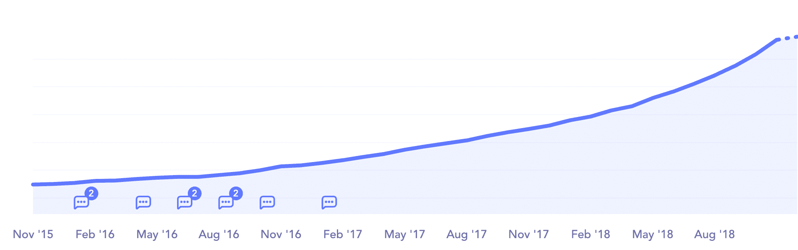

Annual run rate from Baremetrics

在过去的 12 个月里，我们的**客户群增长了 262%** ！(之前 2017 年增长 157.7%)。十月是迄今为止我们最忙的一个月。

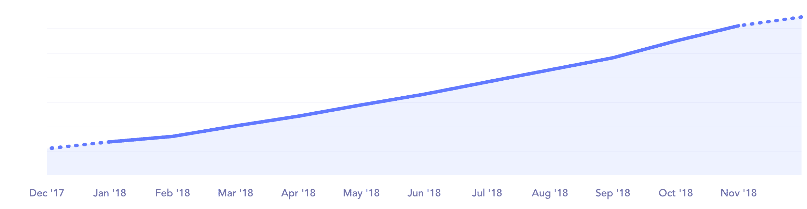

Active subscriptions from Baremetrics (client growth rate)

我们总是发现我们的客户群是如此的多样化，这很有意思。在过去的一年里，我们有幸与从小博客作者到 WordPress 代理，以及行业中的一些大牌合作，如 MariaDB、Freshbooks 和 Tripadvisor。

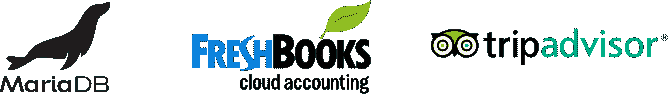

我们惊人的分支机构也为我们的增长做出了很大贡献。今年，Kinsta 联盟的数量激增，我们现在与全球数以千计的博客作者和联盟营销人员合作。

谁不喜欢一点被动收入？😉我们的低流失率，目前不到 5%，使这一点更容易！我们感到自豪的是，Kinsta 附属机构可以推荐客户，知道他们会得到照顾，而不仅仅是因为我们试图快速赚钱。

关于我们每月交付的大量数据，这里还有一些有趣的事实:

*   客户通过 Kinsta 的服务器平均发出 75 亿次 HTTP 请求。
*   **236 TB 以上的出口数据传输**通过 Kinsta 的服务器传输。
*   **20.5 亿次 HTTP 请求**通过 Kinsta CDN 提供服务。
*   **92+TB 数据传输**通过 Kinsta CDN 传输。

根据我们从 Intercom 获得的数据，我们再次成功缩短了我们的**中值支持票响应时间**，降至 **1 分 35 秒**(2017 年为 2 分钟，2016 年为 7 分钟)。解决和关闭问题的平均时间也有所缩短。目前为 48 分钟，低于 2017 年的 55 分钟。

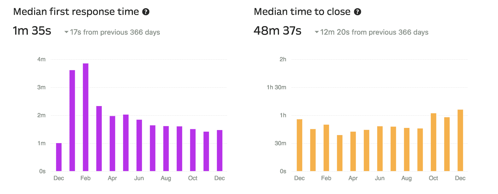

Median support time (From Intercom)

随着我们的成长，我们不断增加新的高技能支持工程师，以便我们始终保持相同的服务水平和质量。到目前为止一切顺利。 **97%的实时聊天/票证在客户满意的情况下结束**。为我们出色的支持团队取得的成就大声欢呼吧！他们一年 365 天 24 小时不间断工作，以确保所有 Kinsta 客户都能得到最好的支持。

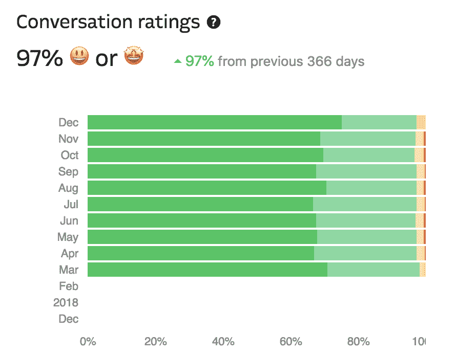

Support conversation ratings (From Intercom)

今年，我们也很高兴能提供更多语言的支持。没错，我们的许多支持工程师也会双语。我们正致力于实现全天候的本地语言支持，但目前的时间表如下:

*   欧洲中部时间周一至周五 10:00 至 1:00 提供西班牙语支持。
*   欧洲中部时间周一至周五 9:00 至 17:00 提供德语支持。
*   欧洲中部时间周一至周五 8:00 至 16:00 提供法语支持。
*   荷兰支持在工作日的 8:00 到 16:00(欧洲中部时间)提供。

## 团队扩展

该团队在 2018 年再次增加了一倍多。我们雇佣了更多的支持工程师、开发人员、系统管理员以及团队成员来帮助营销和销售。事实上，我们没有不招人的时候，所以如果你想寻找在 Kinsta 工作的机会，一定要看看我们的[职业页面](https://kinsta.com/careers/)。

[Tip: When hiring, lose the ego and surround yourself with people smarter than you! 🤓Click to Tweet](https://twitter.com/intent/tweet?url=https%3A%2F%2Fkinsta.com%2Fblog%2F2018-year-in-review%2F&via=kinsta&text=Tip%3A+When+hiring%2C+lose+the+ego+and+surround+yourself+with+people+smarter+than+you%21+%F0%9F%A4%93&hashtags=startups%2Csaas)

由于许多竞争对手提供的服务都不尽人意，Kinsta 不得不增加一个专门的迁移团队，帮助我们完成所有的高级迁移。您可以高枕无忧，因为您知道您的数据在迁移时是安全的。

在管理方面，我们很高兴看到 [Tom Sepper](https://www.linkedin.com/in/tomsepper/) 成为我们新的支持总监。汤姆在虚拟主机和 IT 行业有超过 16 年的工作经验，其中大部分时间是在管理岗位上与[远程团队](https://kinsta.com/blog/working-remotely/)一起工作。你也可以认为他是一个“百事通”，因为他什么都干过，包括运营、客户服务、项目管理、市场营销和人力资源。

汤姆来自伟大的得克萨斯州(达拉斯/沃思堡地区)。他有家室，是小熊队的铁杆粉丝，也是德州扑克迷。[了解更多关于汤姆的信息](https://kinsta.com/blog/tom-sepper/)。

在营销方面，我们很高兴地欢迎西蒙·伊勒斯担任我们的联盟营销经理。如果您对联盟计划有疑问，需要帮助您的博客内容，您可以通过发送电子邮件 [【电子邮件保护】](/cdn-cgi/l/email-protection#3d5c5b5b5451545c49584e7d5654534e495c135e5250) 直接联系他。

在销售方面，我们的销售经理是珍妮·劳顿。有关于选择哪个托管计划的问题，或者 Kinsta 是否能在你的下一个项目中帮助你？或者你需要一个定制的计划，是的，如果你需要的话，Kinsta 确实提供定制的专用解决方案。[给我们发一条信息](https://kinsta.com/contact-us/)，你很可能会在这个过程中的某个时刻和珍妮聊天。

### 重组

每当一家公司发展得像我们这样快时，总会有一些重组在进行。你想把团队成员放在他们最能成功的位置上，同时做他们喜欢的事情。在过去的一年里，我们对管理团队进行了一些调整:

*   [乔恩·彭兰德](https://www.linkedin.com/in/jonpenland)已经从销售负责人&调任首席运营官。
*   安妮塔·杜奈从首席运营官被任命为本地运营主管。
*   [Brian Jackson](https://www.linkedin.com/in/brianleejackson/) 从集客营销总监调任首席营销官。

## 功能更新和变化

现在是有趣的部分！在过去的一年中，我们能够推出的所有功能更新和变化。我们不可能详细讨论所有的变化，所以我们只讨论主要的变化。

### 根据客户的反馈，我们的托管计划发生了巨大的变化

Kinsta 非常重视所有反馈和建议。当我们给你发信息或推文说我们会把这个信息传递给我们的开发或客户服务团队时，我们是认真的。在整个 2018 年，我们听到很多人说我们的一些计划不令人满意，因此我们做了一些改变！

以前，我们的业务 1 计划有三个安装。你们中的许多人管理着多个网站或者与客户一起工作，这是远远不够的。因此，我们又增加了两个，使我们的 Business 1 计划中安装了五个 WordPress。

我们还从许多拥有较小站点的开发人员那里听说，在我们的低层计划中缺少 SSH 是一个很大的失望。这减缓了你的工作流程，并阻止了像 Bedrock 和 Trellis 这样的伟大工具的使用。

因此， **SSH 访问现在在计划**上可用，从初始计划到企业计划。以前，这仅适用于我们的 Business 1 和更高级别的计划。这也意味着 Git 和 WP-CLI 现在也可以全面访问。我们希望作为开发人员，这将有助于使您的生活变得更轻松！

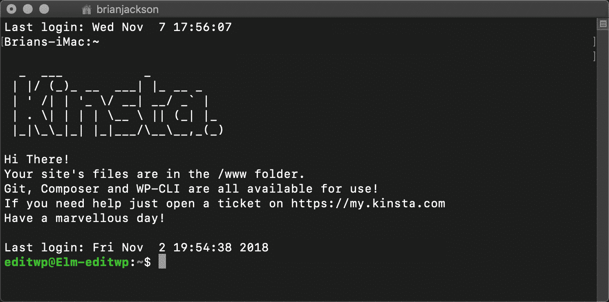

SSH

我们听到的最大的批评之一是，我们没有在我们的低层计划中提供足够的磁盘空间( [SSD 存储](https://kinsta.com/blog/what-is-ssd/))。尽管我们发现许多用户严重高估了他们实际需要的磁盘空间，我们还是同意了。尤其是对于那些拥有较大文件和媒体的人。因此，我们**在我们的 Starter、Pro 和 Business 1 计划**上增加了更多的磁盘空间。

以下是这些变化的摘要:

*   启动计划现在有 5 GB(以前是 3 GB)
*   专业计划现在有 10 GB(以前是 6 GB)
*   业务 1 计划现在有 15 GB(以前是 10 GB)

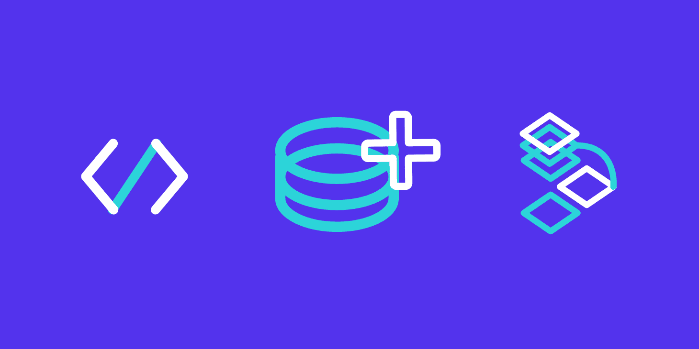

SSH, disk space, and free migrations

我们知道对于你们中的一些人来说，迁移一个 WordPress 站点是一件非常重要的事情，而且可能会让人不知所措。以前，只有我们的 Pro 和更高级计划包含一定数量的免费迁移。然而，我们发现，启动计划中的人通常是最需要迁移帮助的人。因此，**所有起始年度计划现在都包括免费迁移**。

这包括那些通过信用卡和电汇支付年费的人。那些有资格享受我们的非营利和开源项目折扣的人也可以利用免费迁移。

我们绝对不想阻碍任何人尝试 Kinsta 的能力，所以让我们的专家团队处理您的网站迁移。我们希望这能让你更顺利地过渡到 Kinsta！

### 基础设施增加:五个新的数据中心

增加新的数据中心始终是我们的一大优先事项，不仅是因为性能，也是因为数据隐私法。因为 Kinsta 是建立在[谷歌云平台](https://kinsta.com/blog/google-cloud-hosting/)上的，所以我们的团队有能力在新位置可用后立即推出它们。这意味着随着谷歌的成长，金斯塔也在成长！这使得我们在过去的一年中又增加了五个数据中心，使我们的数据中心总数达到了 18 个。

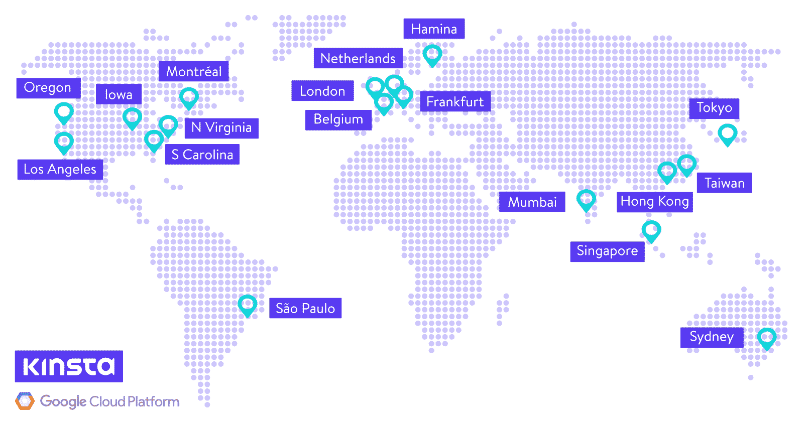

Google Cloud data center locations

这种基础设施的改变允许你更有策略地定位你的 WordPress 站点，使其更接近你的访问者和客户。这有助于减少[网络延迟](https://kinsta.com/blog/network-latency/)、 [TTFB](https://kinsta.com/blog/ttfb/) ，并确保更快的页面加载时间。以下是旧地点和 2018 年新增地点的列表:

*   香港**(新)**
*   美国加州洛杉矶**(新)**
*   芬兰哈米娜**(新)**
*   加拿大蒙特利尔**(新)**
*   荷兰伊姆斯黑文**(新)**
*   美国爱荷华州康瑟尔布拉夫斯
*   比利时圣吉斯兰
*   台湾彰化县
*   澳大利亚悉尼
*   美国俄勒冈州达尔斯
*   美国弗吉尼亚州阿什本
*   美国南卡罗来纳州蒙克斯角
*   英国伦敦
*   德国法兰克福
*   新加坡裕廊西
*   日本东京
*   巴西圣保罗
*   印度孟买

同样重要的是要记住，Kinsta 的所有托管计划都是在谷歌云平台的高级网络上。虽然我们的一些竞争对手正在利用标准层，但我们绝不会退而求其次。

对于跨洲传输的数据，**谷歌云的高级层网络平均比标准层网络快 41%**。对于传输到邻近地区(同一大洲)的数据，高级层的速度大约快 8%。虽然网络只占总页面加载时间的一小部分，但是每一毫秒都会累积起来！

如果你想了解更多关于为什么 Kinsta 选择 Google 云平台作为提供商的信息，请查看我们与 Google 的[案例研究。](https://cloud.google.com/customers/kinsta/)

### 对 MyKinsta 仪表板的改进

我们的开发团队在过去的一年里夜以继日地工作，使我们的 [MyKinsta](https://kinsta.com/mykinsta/) dashboard 不仅仅是一个仪表板，而是一个管理你托管的 WordPress 站点的一体化解决方案。如果你不是 Kinsta 的客户，并且已经习惯了 cPanel，你会被这个震惊的！以下是过去一年中许多改进中的几个。

#### 强制 HTTPS 工具

过去，Kinsta 客户必须联系我们的支持团队，或者使用插件将他们所有的 HTTP 流量重定向到 HTTPS。不再有了！我们现在有了一个[强制 HTTPS 工具](https://kinsta.com/knowledgebase/redirect-http-to-https/#http-to-https-mykinsta)。这使您只需在 MyKinsta 仪表板上点击几下，就可以重定向流量。

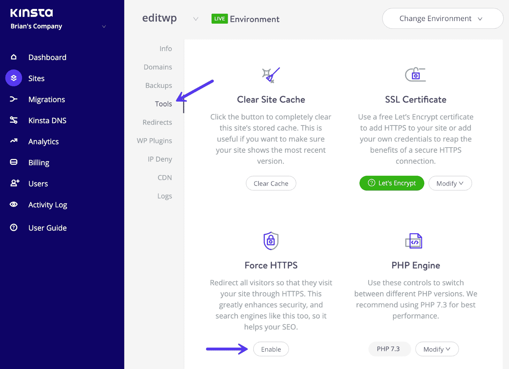

Force HTTPS in MyKinsta

#### MyKinsta Analytics 中的 CDN 使用

作为数据爱好者，我们希望你能获得尽可能多的数据。这让你更容易解决你的 WordPress 站点的性能和计费问题，而不必联系我们的支持团队。因此，我们在 MyKinsta Analytics 中添加了查看您的 [CDN 使用情况](https://my.kinsta.com/analytics/cdn/all)的功能。

您可以查看所有站点的使用情况概览，也可以单独过滤。可以获得过去 24 小时、7 天和 30 天的数据。顶部显示了 [Kinsta CDN](https://kinsta.com/help/kinsta-cdn/) 使用的带宽。在它下面，您可以看到按请求排序的前几个文件和按字节排序的前几个文件。如果你网站上的某个媒体文件占用了你所有的 CDN 带宽，你可以在几秒钟内很容易地发现它。

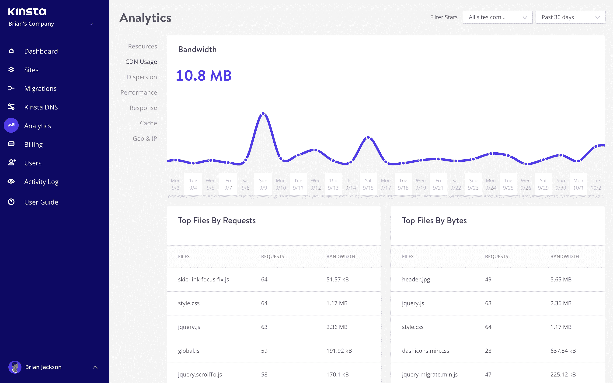

CDN usage in analytics

您还可以按字节查看排名靠前的文件扩展名。这就很容易看出你的站点上哪种类型的媒体占用了你的大部分带宽。我们也给你一个响应代码分解。

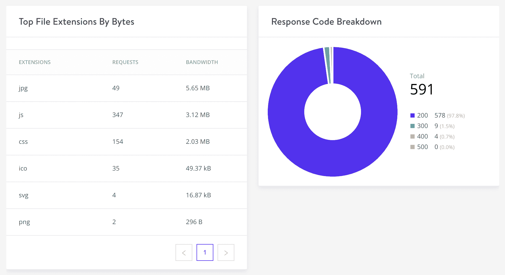

CDN top file extensions and response codes

#### 多用户访问和权限

[多用户访问和权限](https://kinsta.com/blog/manage-users-hosting-account/)也是 2018 年请求最多的功能之一。我们很高兴终于在 MyKinsta 仪表盘上看到了这个。无论[你是一家与数百名客户合作的机构](https://kinsta.com/blog/wordpress-agency/)，还是仅仅需要给开发者一个受限的访问权限，这一切现在都可以通过简单的点击来完成。

## 注册订阅时事通讯

### 想知道我们是怎么让流量增长超过 1000%的吗？

加入 20，000 多名获得我们每周时事通讯和内部消息的人的行列吧！

[Subscribe Now](#newsletter)

现在，您可以向用户应用六种角色来进一步授予或限制访问权限:

*   **公司管理员:**完全控制所有公司和站点数据。
*   **公司开发人员:**管理所有站点，管理其级别或级别以下的用户。无法访问账单详情或公司设置。
*   **公司账单:**仅查看账单详情和公司设置，如发票、公司地址等。
*   **站点管理员:**完全访问某个站点，并完全控制该站点的所有环境。无法从公司中删除站点。
*   **站点开发者:**访问单个站点的[暂存环境](https://kinsta.com/help/staging-environment/)。可以对其执行任何操作，除了删除登台环境。
*   **公司所有者:**只允许一个，并且自动成为公司管理员。可以请求关闭帐户或将所有权转移给另一个公司管理员。

在一个不断变化的团队中工作？没问题。我们添加的另一个新功能是转移公司所有权的能力。这允许在您公司的顶层轻松地重构权限。

#### 可下载的备份

多疑吗？即使 Kinsta 提供自动备份，你也不会太安全。因此，去年我们增加了[可下载的备份](https://kinsta.com/help/wordpress-backups/#downloadable-backups)。现在，您只需点击一下鼠标，就可以创建一个可下载的存档文件。zip)包含你的整个 WordPress 站点。存档文件包含您网站的文件以及包含数据库内容的 SQL 文件。

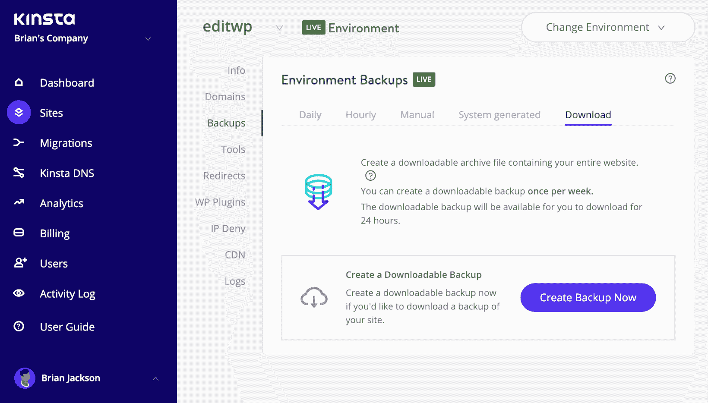

Downloadable WordPress backup

#### 您可以在 MyKinsta 中添加您的 SSH 密钥

作为 WordPress 开发者，我们总是试图找出加快开发工作流程的方法。你们中的许多人每天都在 Kinsta 使用 SSH。无论是执行常见的 sysadmin 任务，还是运行 Composer、WP-CLI 等工具。

因此，我们增加了在 [MyKinsta](https://my.kinsta.com/settings/user) 仪表板中添加 SSH 密钥的功能。SSH 密钥提供了一种**更安全的登录服务器的方式**，并且不再需要密码。尽管您可以通过添加密码短语来进一步保护您的登录。

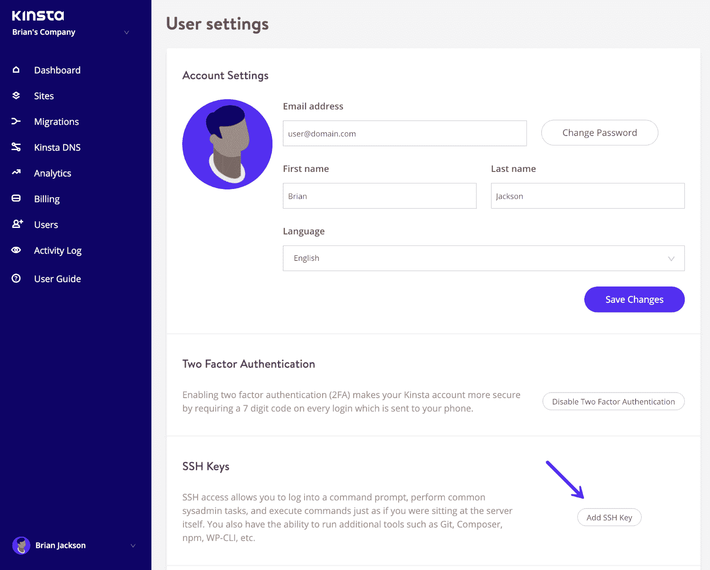

Add SSH keys

#### 每小时备份插件

虽然 Kinsta 已经提供了每 24 小时自动备份，但这对于一些客户来说还远远不够。

许多人运行的 WordPress 网站经常变化。无论是获得大量评论的高流量博客，还是电子商务、会员、社区等数据密集型网站。丢失数据是您无法承受的。如果出现问题，不得不 24 小时回滚一个站点不仅不是一个可行的解决方案，而且在合并事务性数据时可能是一场噩梦。

因此，我们添加了一个新的[每小时备份插件](https://kinsta.com/help/wordpress-backups/#hourly-backups)，它允许您选择每小时或每 6 小时的增量。

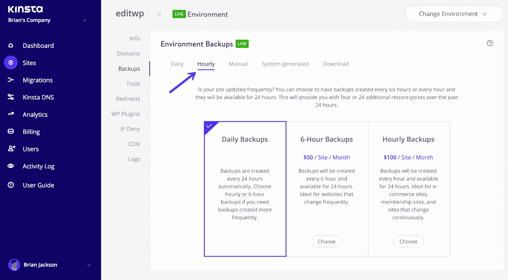

WordPress hourly backups

#### IP 拒绝工具

虽然我们已经在 Kinsta 采取了一些安全防范措施，但某些网站将会受到比其他网站更严重的攻击，无论是来自机器人、垃圾邮件发送者还是黑客。因此，为了帮助解决这个问题，我们添加了一个 [IP 拒绝工具](https://kinsta.com/knowledgebase/block-ip-address/)。这让你可以阻止他们死在他们的轨道上。

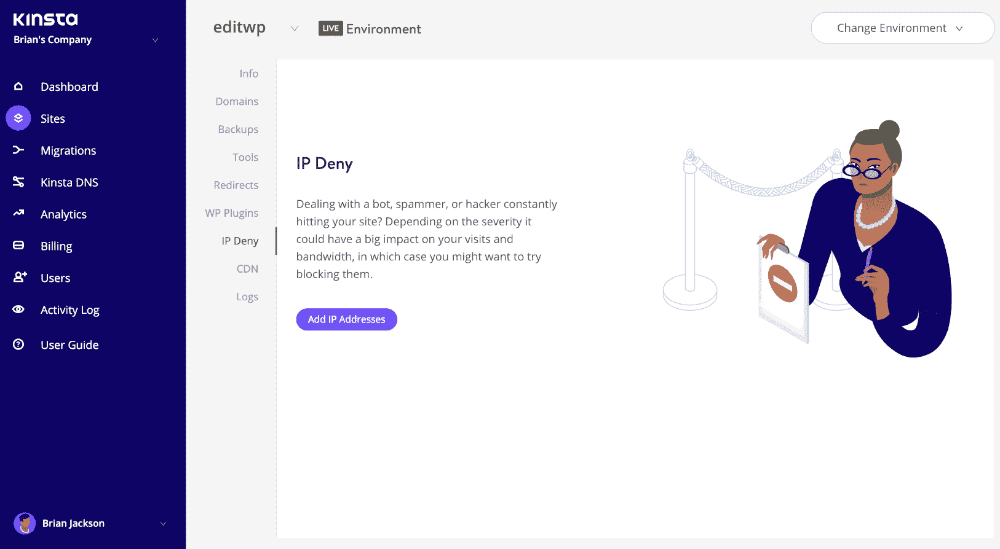

IP Deny tool

#### 一键式数据库密码更改

以前，您必须联系 Kinsta 支持团队来更改您的数据库密码。不再有了！我们在 MyKinsta 仪表板中添加了一个简单的按钮，您可以使用它轻松地生成新的数据库密码。

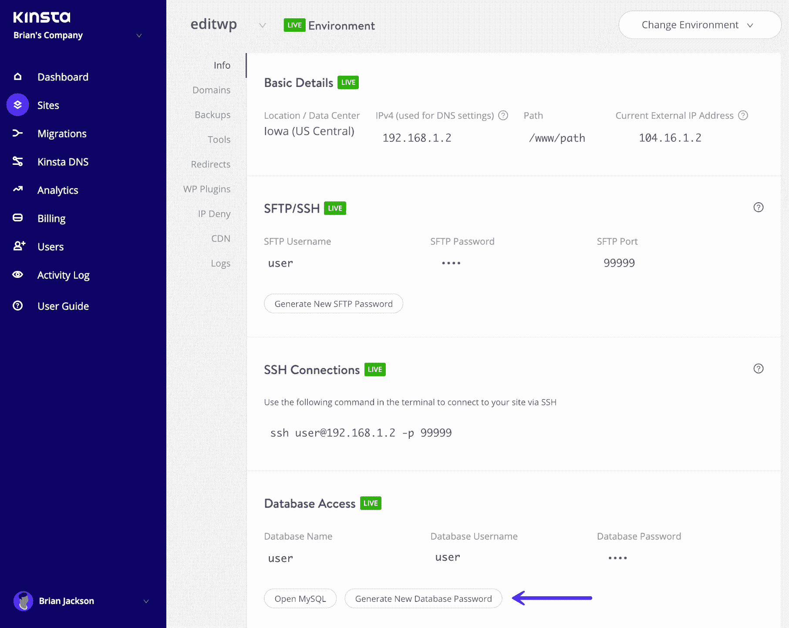

Change database password

### 重建了我们的附属仪表板

我们早在 2017 年就推出了 [Kinsta 联盟计划](https://kinsta.com/affiliates/)，然而，今年我们的开发人员从头开始重建了整个联盟仪表板。当我们完成时，我们留下了一个非常优秀的系统，它需要更少的管理，有更多的功能，自动化常见的附属管理任务，并与我们的主要产品 MyKinsta 共享相同的技术堆栈。

附属仪表板现在还提供西班牙语、意大利语、法语和德语版本。2019 年将有更多的语言问世。

Struggling with downtime and WordPress problems? Kinsta is the hosting solution designed to save you time! [Check out our features](https://kinsta.com/features/)

Kinsta affiliate dashboard

阅读更多关于[重建我们的联盟系统](https://kinsta.com/blog/affiliate-system/)的信息。

### 启动一个附属脸书集团和博客

如果你是一个代销商，想出额外的方法来赚钱或增加你的收入可能是你一直在想的事情。🤑令人沮丧的是，许多新的策略和方法需要时间来测试，而时间是你们很多人所没有的。

因此，我们决定发起[用 WordPress 脸书集团](https://www.facebook.com/groups/263423794308573/)赚钱，完全专注于如何用这个星球上最好的 CMS 增加你的收入！学习联盟营销技巧，并与他人聊天，谁看到了成功，并获得适用的捷径，以获得更高的收入。我们已经有 650 多名会员了！走过来加入到对话中来。

Make money with WordPress Facebook group

想要更多附属内容？我们还在博客上推出了[附属学院版块](https://kinsta.com/affiliate-academy/)。这仍然是相当新的，但我们已经采访了一些大牌联盟营销人员，这些采访将很快发表。每天从前线人员那里获得内部消息总是有帮助的。

### PHP 7.3 来了，很快！

我们并不羞于承认，痴迷于性能，今年对我们来说最令人兴奋的功能更新之一是正式发布的 [PHP 7.3](https://kinsta.com/blog/php-7-3/) ！谁不喜欢免费提速？

好奇它表现如何？我们用 WordPress 4.9.8、WordPress 5.0、WooCommerce 和 Easy Digital Downloads 测试了 PHP 7.3。在我们的每一项基准测试中，PHP 7.3 都是明显的赢家。

*   根据我们的发现，PHP 7.3 平均比 PHP 7.2 快 9%。🚀
*   如果将 PHP 7.3 与 PHP 5.6 进行比较，它每秒可以处理的请求(事务)几乎是前者的 3 倍！

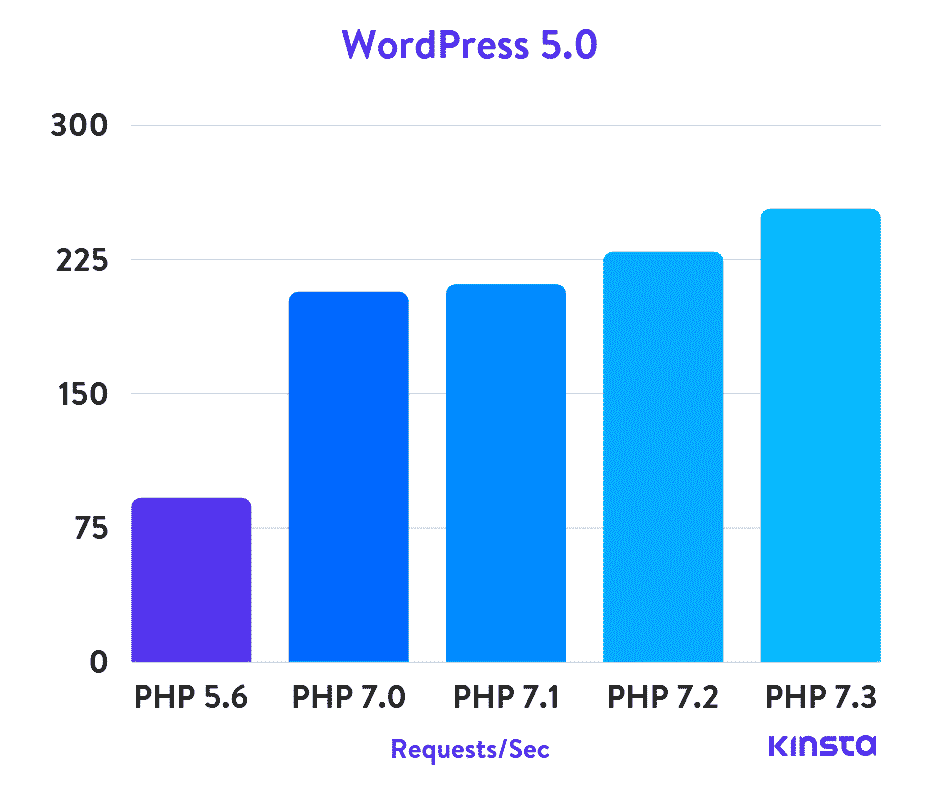

WordPress 5.0 PHP benchmarks

*   WordPress 5.0 PHP 5.6 基准测试:91.64 请求/秒
*   WordPress 5.0 PHP 7.0 基准测试结果:206.71 请求/秒
*   WordPress 5.0 PHP 7.1 基准测试结果:210.98 请求/秒
*   WordPress 5.0 PHP 7.2 基准测试结果:229.18 req/sec
*   WordPress 5.0 **PHP 7.3 基准测试结果:253.20 req/sec** **🏆**

要查看所有平台的性能和更详细的测试结果，请务必查看我们的年度 [PHP 基准报告](https://kinsta.com/blog/php-benchmarks/)。

请记住，您可以在 MyKinsta 仪表板中点击几下[来更改您的 PHP 版本](https://kinsta.com/knowledgebase/how-to-update-php-in-wordpress/)。

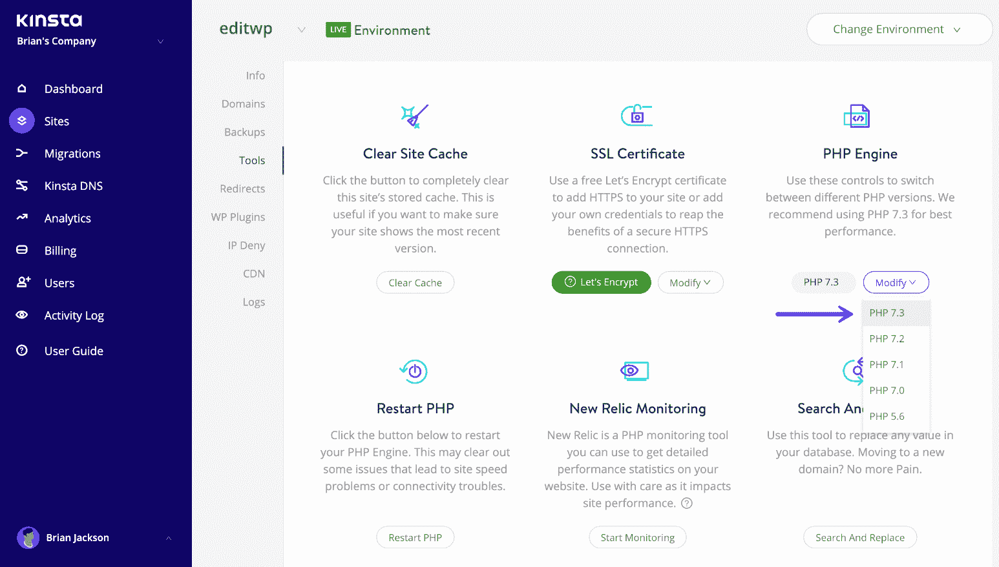

Change to PHP 7.3

### 其他更新

除了上面提到的所有主要特性的更新和变化，这里有几个额外的快速概述。

*   2018 年 11 月 2 日: [WP-CLI v2 现在是所有 Kinsta 服务器上的默认版本](https://kinsta.com/feature-updates/wp-cli-v2/)
*   2018 年 9 月 21 日:[对 MyKinsta 导航、用户资料和计费的改进](https://kinsta.com/feature-updates/nav-user-billing/)
*   2018 年 9 月 17 日:[关注我们新的状态页面](https://kinsta.com/feature-updates/status-page/)
*   2018 年 5 月 1 日:[导出重定向到 CSV、新的备份 UI 和快速导航](https://kinsta.com/feature-updates/export-redirects-csv/)
*   我们的 CDN 合作伙伴 KeyCDN 在 2018 年增加了 9 个 pop，使总位置达到 35 个。他们还增加了 IPv6 支持。🚀

## 连接 WordPress、博客和营销社区

回顾去年的这个时候，WordPress 占据了 29%的网络份额，今天它的份额已经超过了 32%。正因为如此，我们总是尽可能地尝试与成长中的社区建立联系。我们很高兴今年赞助了各种单词营和聚会:

*   [维罗纳营](https://2018.verona.wordcamp.org/thank-you-kinsta-bronze-sponsor/)
*   [WordCamp Asheville](https://2018.asheville.wordcamp.org/2018/08/17/bronze-sponsor-highlight-cutting-edge-speed-and-dependability-with-kinsta/)
*   多伦多单词营
*   [WordCamp Udaipur](https://2018.udaipur.wordcamp.org/2017/12/01/kinsta-lake-pichola-sponsor/)
*   [亚特兰大世界夏令营](https://2018.atlanta.wordcamp.org/sponsor/kinsta/)
*   [波尔图世界夏令营](https://2018.porto.wordcamp.org/sponsor/kinsta-2/)
*   [圣保罗词汇营](https://2018.saopaulo.wordcamp.org/patrocinadores/)
*   [大加那利岛夏令营](https://2018.laspalmas.wordcamp.org/patrocinadores/)
*   [瓜达拉哈拉世界夏令营](https://2018.guadalajara.wordcamp.org/sponsor/kinsta/)
*   [WordCamp Puebla](https://2018.puebla.wordcamp.org/sponsor/kinsta-limited/)
*   [蒙得维的亚世界夏令营](https://2018.montevideo.wordcamp.org/)
*   [WordPress Meetup 图鲁阿(Col)](https://www.meetup.com/WordPress-Tulua/)
*   [WordPress Meetup(Ven)](https://www.meetup.com/WordPress-Meetup-Caracas/)
*   波哥大(Col)
*   [WordPress Meetup 莱昂(Nic)](https://www.meetup.com/WordPress-Meetup-de-Leon/)

*   [WordPress Meetup Pubela(Mx)](https://www.meetup.com/wppuebla/)

能看到几张图总是好的。这是丹尼尔·哈弗奇，我们的全球拓展主管，和 YITH 团队在一起。😄

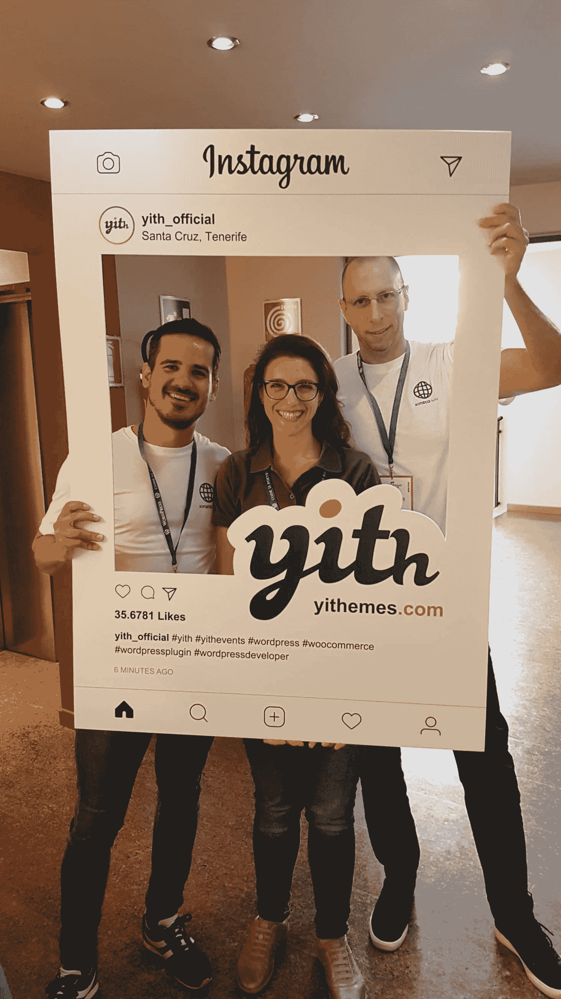

Kinsta with YITH (on the left)

还有 Rafael Benard，Kinsta 的支持工程师，他在参加美国世界语言营时与马特·莫楞威格合影。

Rafael Benard (Kinsta) with Matt Mullenweg

Kinsta 团队还将在 2019 年参加[北欧世界夏令营](https://2019.nordic.wordcamp.org/)和[欧洲世界夏令营](https://2019.europe.wordcamp.org/)(我们的日程中已经有更多活动)。如果你要去，一定要过来打个招呼！👋我们很乐意见到你。

在整个 2018 年，我们有幸采访了整个社区的九位顶尖人物；从开发者到博主，甚至是 WordCamp 的组织者。下面只是几个，你可以在这里查看全部[。](https://kinsta.com/search/kingpin/)

*   [采访《鸟语》的雷琳·莫雷](https://kinsta.com/blog/interview-raelene-morey/)
*   采访 WP-Tonic 的乔纳森·登伍德
*   [采访 MapSteps 的 David von gris](https://kinsta.com/blog/interview-david-vongries/)
*   [采访忍者形态詹姆斯法则](https://kinsta.com/blog/interview-james-laws/)
*   采访 kevinmuldoon.com 的凯文·马尔登
*   [采访 XLPlugins 的达曼·杰特](https://kinsta.com/blog/interview-daman-jeet/)
*   [采访 NinjaOutreach 的 Basilis Kanonidis](https://kinsta.com/blog/interview-basilis-kanonidis/)
*   [采访让·加利亚&WP 市长马克·萨拉](https://kinsta.com/blog/interview-with-wp-mayor/)
*   [采访 Yoast 的劳拉·萨科](https://kinsta.com/blog/interview-laura-sacco/)

## 提供高质量的内容

正如你可能已经猜到的那样，我们喜欢 Kinsta 的内容营销！😉我们在 2018 年花费了数千个小时来编写和更新内容，以帮助您的生活变得更加轻松。以下是我们最受欢迎的 10 篇博文和教程:

*   [WordPress 5.0 的新功能(你好古腾堡)](https://kinsta.com/blog/wordpress-5-0/)
*   [PHP 死了吗？不要！至少不是根据 PHP 的使用统计](https://kinsta.com/blog/is-php-dead/)
*   托管 WordPress 会员网站的注意事项
*   [Pingdom 速度测试工具:2019 年终极指南](https://kinsta.com/blog/pingdom-speed-test/)
*   【WordPress 多语言终极指南——我们如何推出 12 种语言
*   [为什么你应该停止使用空的 WordPress 插件和主题](https://kinsta.com/blog/nulled-wordpress-plugins-themes/)
*   [加盟系统很烂，所以我们推出了自己的](https://kinsta.com/blog/affiliate-system/)
*   [PHP 7.3 的新特性](https://kinsta.com/blog/php-7-3/)
*   WordPress 安全吗？下面是数据所说的
*   [网站宕机:如何防止宕机的实用技巧](https://kinsta.com/blog/website-downtime/)

另一个我们今年特别自豪的内容是我们的[加速 WordPress 指南](https://kinsta.com/learn/speed-up-wordpress/)。如果你还没看过，一定要去看看！我们分享超过 15 年的经验和教训，都在一个大规模的指南。这是 25，000 多字的关于 WordPress 性能的实用技巧和高级策略。

当然，我们不能忘记我们的年度 [PHP 基准报告](https://kinsta.com/blog/php-benchmarks/)。我们测试了 18 个平台/配置的性能(WordPress，Drupal，Joomla！)五个版本的 PHP 上(5.6，7.0，7.1，7.2，7.3)！从结果中，你可以清楚地看到 **PHP 7.3 正在称霸**。还要看看哪个版本的 WordPress 更快，4.9.8 还是 5.0。😉

我们在 2019 年有很多精彩的内容，所以请务必订阅我们的[简讯](https://kinsta.com/wordpress-newsletter/)。

### 走向多语言

2017 年，我们推出了西班牙语网站。但今年我们更进一步，推出了 10 多种语言的网站！我们也不用自动翻译工具。我们的团队与专业的母语人士合作，以确保最高质量的翻译。当我们的团队做某事时，我们会全力以赴。

我们的内容现在有以下 12 种语言版本:

*   英语🇺🇸
*   意大利🇮🇹
*   葡萄牙🇵🇹
*   法属🇫🇷
*   德国🇩🇪
*   日本🇯🇵
*   荷属🇳🇱
*   西班牙🇪🇸
*   瑞典🇸🇪
*   芬兰🇫🇮
*   挪威🇳🇴
*   丹麦🇩🇰

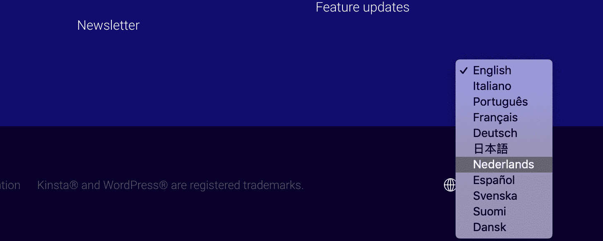

Language switcher

### 我们的情况如何

好奇金斯塔是怎么积累的吗？根据 Review Signal 的独立测试，Kinsta 在 2018 年连续第四年成为表现最佳的 WordPress 主机之一，赢得了[顶级 WordPress 主机性能奖](https://reviewsignal.com/blog/wordpress-hosting-performance-benchmarks-2018/)。我们还创建了一些页面，帮助您了解我们与市场上其他提供商的不同之处:

*   [金斯塔 vs. WP 引擎](https://kinsta.com/wp-engine-alternative/)
*   [kinta 诉地盘](https://kinsta.com/siteground-alternative/)
*   [金斯塔 vs 飞轮](https://kinsta.com/flywheel-hosting-alternative/) 

## 新的 30 天退款保证

我们支持我们的服务，这就是为什么我们现在决定提供 [30 天退款保证](https://kinsta.com/knowledgebase/refund-policy/)，同时不提供长期合同。这意味着你可以**试用 Kinsta 无风险 30 天**！我们毫不怀疑，一旦你尝试了我们的平台，你就会发现你错过了什么，以及[为什么 Kinsta 与众不同](https://kinsta.com/why-us/)。

## 2019 年有什么期待

2019 年，我们将重点检查我们的支持系统。目标是为我们的客户和支持工程师提供更好的支持体验。在 MyKinsta 方面，我们将**专注于用户体验**。我们正在检查我们的 UI 元素，确保它们绝对最适合每项任务。我们的目标不仅是为您提供市场上最好的工具，还要确保您在 MyKinsta 花费的时间尽可能少，这样您就可以专注于发展您的业务。

您将看到对分析部分的一系列**升级(比以往更多的指标)、更简单的迁移、更好的通知(应用内和电子邮件)和一系列优化，以确保 MyKinsta 顺利运行。我们将在多个方面继续我们的全球扩张。我们已经推出了 12 种语言，并逐渐增加了营业时间支持。我们正准备引入多种货币**，以确保尽可能多的客户可以用他们选择的货币支付。****

 **我们将改进/添加的其他一些具体内容包括:

*   从一个开发域切换到一个活动域将比以往更加容易。
*   改进我们的 DNS 编辑器用户界面。
*   [WebP](https://kinsta.com/blog/webp/) 支持来了。⚡️
*   MyKinsta dashboard 将提供我们所有的新语言版本。
*   MyKinsta 和我们的支持系统之间更紧密的集成:MyKinsta 工具将比以往任何时候都更容易找到，我们的支持团队将达到新的效率高度，因为我们的支持系统智能地、主动地向我们的工程师提供关键的省时信息。
*   联盟仪表板将获得许多新功能，以提供更多的数据，如查看哪些网站正在转换，哪些页面和帖子等。我们还将增加在社交媒体上与你的会员链接轻松分享 Kinsta 内容的功能。
*   代销商仪表盘和横幅将以我们所有的新语言提供。
*   将我们的网站翻译成更多语言的可能性很大。
*   我们全球扩张项目的新员工。

[Web hosting isn't a race to the bottom. It's about innovation and providing value to customers. 👍Click to Tweet](https://twitter.com/intent/tweet?url=https%3A%2F%2Fkinsta.com%2Fblog%2F2018-year-in-review%2F&via=kinsta&text=Web+hosting+isn%27t+a+race+to+the+bottom.+It%27s+about+innovation+and+providing+value+to+customers.+%F0%9F%91%8D&hashtags=webhosting%2Csaas)

如果您需要什么，请随时告诉我们，我们感谢您的持续支持。我们金斯塔全体员工祝您节日快乐。🎄为成功的 2019 年干杯！

* * *

让你所有的[应用程序](https://kinsta.com/application-hosting/)、[数据库](https://kinsta.com/database-hosting/)和 [WordPress 网站](https://kinsta.com/wordpress-hosting/)在线并在一个屋檐下。我们功能丰富的高性能云平台包括:

*   在 MyKinsta 仪表盘中轻松设置和管理
*   24/7 专家支持
*   最好的谷歌云平台硬件和网络，由 Kubernetes 提供最大的可扩展性
*   面向速度和安全性的企业级 Cloudflare 集成
*   全球受众覆盖全球多达 35 个数据中心和 275 多个 pop

在第一个月使用托管的[应用程序或托管](https://kinsta.com/application-hosting/)的[数据库，您可以享受 20 美元的优惠，亲自测试一下。探索我们的](https://kinsta.com/database-hosting/)[计划](https://kinsta.com/plans/)或[与销售人员交谈](https://kinsta.com/contact-us/)以找到最适合您的方式。**