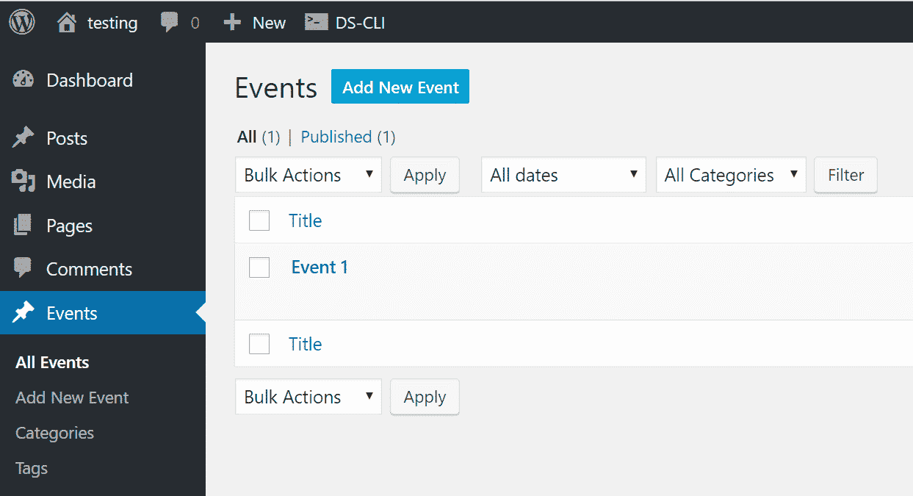
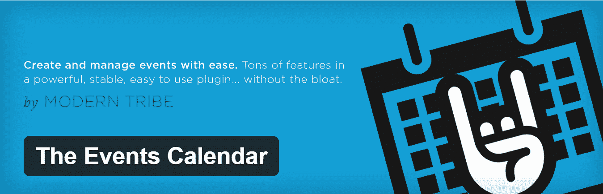

# WordPress 事件:如何用代码和插件创建它们

> 原文：<https://kinsta.com/blog/wordpress-events/>

众所周知，社交活动可以帮助任何企业发展。作为一名企业主，没有比这更好的建立新关系的方式了——无论是与潜在客户、商业伙伴还是投资者。

事件本身有许多不同的风格和不同的目的；从简单的面对面聚会到大型商务会议和聚会。

无论活动规模大小，它们都是有效的营销技巧，因为它们通常围绕一个主题，这意味着你有机会在目标受众面前展示你的业务。

当你选择参加一个活动时，你不仅树立了自己的权威(尤其是如果你是主题演讲人之一的话)，你还展示了你的企业或产品是你的听众所面临的问题的解决方案，这反过来导致了销售的增加。

不管你的企业规模有多大，举办一场活动，或者仅仅是参加几场活动，都是聪明的营销策略。

如果你一直在考虑将活动整合到你的营销计划中，但不知道如何将它添加到你的网站上；你来对地方了。

在这篇文章中，我们将向你展示如何添加 WordPress 事件，包括手动添加和插件添加。

*   [如何添加代码为](#wordpress-events-code)的 WordPress 事件
*   [创建 WordPress 事件的 5 大插件](#wordpress-plugins-events)

## 如何用代码添加 WordPress 事件

WordPress 拥有强大的功能，这使得它不仅仅是一个简单的博客平台。


> Kinsta 把我宠坏了，所以我现在要求每个供应商都提供这样的服务。我们还试图通过我们的 SaaS 工具支持达到这一水平。
> 
> <footer class="wp-block-kinsta-client-quote__footer">
> 
> 
> 
> <cite class="wp-block-kinsta-client-quote__cite">Suganthan Mohanadasan from @Suganthanmn</cite></footer>

[View plans](https://kinsta.com/plans/)

它最强大的功能之一是能够创建自定义内容，并按照您想要的方式显示。

因为我们想要一种简单的方式在我们的网站上显示事件，我们将利用 WordPress 的功能并利用自定义的帖子类型。

首先，你需要登录你的 WordPress 仪表盘，点击**外观**，然后点击**编辑器**。


### 重要的

如果操作不当，编辑 WordPress 主题的源代码可能会破坏你的网站。如果你不喜欢这样做，请先咨询开发者。或者使用下面提到的插件。


一旦加载了编辑器，看屏幕的右边——您会看到一堆文件。

我们的自定义帖子类型的代码需要到**functions.php**所以点击它加载到编辑器中。

现在在**functions.php**文件的末尾粘贴以下代码:

```
// register custom post type to work with
 function lc_create_post_type() {
 // set up labels
 $labels = array (
 'name' => 'Events',
 'singular_name' => 'Event',
 'add_new' => 'Add New Event',
 'add_new_item' => 'Add New Event',
 'edit_item' => 'Edit Event',
 'new_item' => 'New Event',
 'all_items' => 'All Events',
 'view_item' => 'View Event',
 'search_items' => 'Search Events',
 'not_found' => 'No Events Found',
 'not_found_in_trash' => 'No Events found in Trash',
 'parent_item_colon' => '',
 'menu_name' => 'Events',
 );
 //register post type
 register_post_type ( 'event', array(
 'labels' => $labels,
 'has_archive' => true,
 'public' => true,
 'supports' => array( 'title', 'editor', 'excerpt', 'custom-fields', 'thumbnail','page-attributes' ),
 'taxonomies' => array( 'post_tag', 'category' ),
 'exclude_from_search' => false,
 'capability_type' => 'post',
 'rewrite' => array( 'slug' => 'events' ),
 )
 );
 }
 add_action( 'init', 'lc_create_post_type' );
```

上面的代码首先创建了名为 event 的自定义文章类型，并告诉 WordPress 你想用什么标签。然后，我们注册 post 类型，并将其设置为类似于 post 的行为。我们还添加了类别的标准分类[和](https://kinsta.com/knowledgebase/what-is-taxonomy/)[标签](https://kinsta.com/knowledgebase/wordpress-tags/),这将使我们以后更容易对事件进行分类。

添加完代码后，点击**保存**文件。现在你会注意到在你的工具条中有一个新的菜单项叫做**事件**。



WordPress events


您现在可以开始在您的网站上添加活动，在您有几个活动后，导航回[您的仪表板](https://kinsta.com/knowledgebase/wordpress-admin/)，点击**设置>永久链接**，点击**保存**更改以刷新永久链接，并允许您的自定义帖子类型显示在前端。

如果你想添加事件到你的导航菜单，进入**外观>菜单**，你会看到**事件**显示在左边。只需将任何事件拖到您的菜单上即可包含它们。

通过使用这种方法，您将能够在您的网站上添加和显示简单的事件。

但是如果你想要更多的功能呢？如果你想让人们注册你的活动，并通过你的网站直接付款呢？如果您希望事件的显示方式不同于常规帖子，该怎么办？如果你真的不想写所有的代码呢？

在这种情况下，使用插件是一个明智的选择。让我们来看看 WordPress 的 5 大活动插件。


## 创建 WordPress 事件的 5 大插件

### 1.活动日历

[](https://wordpress.org/plugins/the-events-calendar/)

The Events Calendar WordPress plugin


事件日历是一个用户友好的插件，它是为开箱即用而构建的:只需安装它，激活它，配置你喜欢的选项，你就可以开始了。这个插件是完全响应的，可以和所有主要的主题框架一起工作，比如 Avada，Genesis，WooThemes 和 Thesis。

最重要的是，该插件还进行了 SEO 优化，包括微格式支持以及翻译和国际化支持。

[官方资源库](https://wordpress.org/plugins/the-events-calendar/)上可用的插件精简版具有以下特性:

## 注册订阅时事通讯


### 想知道我们是怎么让流量增长超过 1000%的吗？

加入 20，000 多名获得我们每周时事通讯和内部消息的人的行列吧！

[Subscribe Now](#newsletter)

*   快速创建事件
*   保存的场馆和组织者
*   带工具提示的日历月视图
*   列表视图
*   日视图
*   事件搜索
*   [谷歌地图](https://kinsta.com/blog/wordpress-google-maps/)
*   小部件:即将发生的事件列表
*   事件分类法(类别和标签)
*   Google 日历和 iCal 导出
*   更多

插件的 [pro 版本](https://theeventscalendar.com/product/wordpress-events-calendar-pro/)允许你添加重复发生的事件、额外的视图和小部件，能够在你的 WordPress 仪表盘内销售门票和管理与会者，并集成流行的电子商务插件，如 [WooCommerce](https://kinsta.com/blog/woocommerce-tutorial/) 和 [Easy Digital Downloads](https://kinsta.com/blog/easy-digital-downloads/) ，以及连接你的 Eventbrite 帐户的能力。

WordPress Events Calendar Pro 有三个价格等级，个人许可的一年支持和更新起价为 89 美元。

### 2.全在一个活动日历中

[](https://wordpress.org/plugins/all-in-one-event-calendar/)

All In One Event Calendar WordPress plugin


ly 是一个在 WordPress 中列出你的活动并与世界其他地方分享的美丽方式。他们的日历系统融合了简洁的视觉设计和强大的功能。

这个插件也有免费版和高级版。

该插件的免费版本可从官方资源库获得，并允许您创建和导入无限的事件。事件可以显示在天，周，月，议程视图和免费版本还允许您创建重复事件。

您可以借助从免费到付费的附加组件来进一步扩展插件的功能。

All In One Events Calendar 的 [pro 版本](http://time.ly/pricing/)作为托管解决方案提供，可以嵌入到任何网站上，并带有额外的功能，如 CSV 导入、超级小部件、导入未来活动的能力、[导入 RSS 提要](https://kinsta.com/blog/wordpress-rss-feed/)以及活动的前端提交。付费计划起价为每月 9 美元。

### 3.WP 事件管理器

WP 事件管理器是一个更简单的轻量级 WordPress 事件管理插件。对于那些想保持网站运行速度，不想占用太多空间或者用臃肿的功能把后端搞得乱七八糟的人来说，它非常有用。它很快成为一个非常受欢迎的插件，拥有很好的评论和更好的客户支持。我们甚至注意到用户对开发者支持免费版本的插件赞不绝口。

正如这个列表中的许多插件一样，WP 事件管理器插件提供了一个免费的核心插件，以及购买高级插件来扩展其功能的选项。虽然界面时尚简单，但免费插件的功能列表相当令人印象深刻。例如，你会收到从多语言翻译到前端表单、小工具，甚至是可搜索事件列表的简码。

Struggling with downtime and WordPress problems? Kinsta is the hosting solution designed to save you time! [Check out our features](https://kinsta.com/features/)

[](https://wordpress.org/plugins/wp-event-manager/)

WP Event Manager WordPress plugin


WP 事件管理器开发者已经在速度和用户体验上下了不少功夫——漂亮的缓存特性、响应元素、AJAX 驱动的事件列表等等。至于[高级附加软件](https://www.wp-eventmanager.com/plugins/)，有一长串，但这里有一些亮点:

*   日历
*   谷歌地图
*   电子商务售票
*   注册
*   事件警报
*   可嵌入的事件小部件
*   联系人组织者
*   电子邮件
*   [滑块](https://kinsta.com/blog/wordpress-slider/)
*   谷歌分析
*   事件标签

### 4.事件管理器

[](https://wordpress.org/plugins/events-manager/)

Events Manager WordPress plugin


[事件管理器](https://wordpress.org/plugins/events-manager/)是一个全功能的事件注册管理插件，包括重复事件、地点管理、日历、谷歌地图集成、预订管理等。

一些功能包括:

*   简单的活动注册(带开始/结束时间的一天)
*   周期性和长时间(多天)事件注册
*   预订管理(包括批准/拒绝、导出简历等等！)
*   多张票
*   [多站点支持](https://kinsta.com/blog/wordpress-multisite/)
*   BuddyPress 支持
*   来宾/会员活动提交
*   分配事件位置并按位置查看事件
*   谷歌地图
*   还有更多。

该插件的[高级版本](http://wp-events-plugin.com/features/)Events Manager Pro 增加了自动电子邮件提醒、优惠券管理、可定制的预订表格，以及与 PayPal、Authorize.net 和离线支付的集成。一个站点的活动管理器专业版售价为 75 美元。

### 5.活动组织者

[](https://wordpress.org/plugins/event-organiser/)

Event Organiser WordPress plugin


[事件组织者](https://wordpress.org/plugins/event-organiser/)通过使用内置的“自定义帖子类型”添加事件管理，并允许您创建与帖子具有相同功能的 WordPress 事件，同时添加允许您管理事件的附加功能。

您可以根据复杂的时间表创建重复的活动，并将活动分配到场地。用户界面直观易用，事件可以在 WordPress 列表或日历页面上查看。

该插件可以进一步扩展，包括前端用户提交，折扣代码，额外的支付网关和 iCal 同步。

[Event organizer Pro](http://wp-event-organiser.com/pro-features/)具有额外的功能，如预订管理、可定制的电子邮件、场馆定制字段等。个人许可证的起价为 40 美元。

## 摘要

活动是添加到您的营销策略中的强大资产。无论你是想举办一个活动，还是简单地列出你所在地区的活动，都有一个简单的方法可以将活动添加到 WordPress。

如果您所需要的是一种不需要处理预订和售票就能列出活动的方式，那么使用自定义帖子类型是一种简单明了的解决方案。

另一方面，如果你需要额外的功能，允许你创建重复活动，整合谷歌地图，在线售票，管理场馆，那么使用我们列表中的插件是一个不错的选择。

在你做出最终决定之前，这里有一些事情需要记住，还有一些特性需要在事件插件中寻找:

*   与谷歌日历等第三方工具集成
*   移动用户的响应能力
*   多个日历视图和过滤器
*   活动出席登记
*   网上售票设施
*   将事件保存到用户的第三方日历服务的能力
*   简单的外观定制选项
*   计划的和重复的事件
*   用于显示事件的侧栏小部件
*   导入和导出事件

最后，要考虑的最后一点是价格，并通过了解活动的复杂性提前了解您将需要哪些功能。在某些情况下，一个免费版本的插件就足够了。但是如果你预先知道你将需要额外的功能，比如重复的 WordPress 事件和与你的电子邮件列表的集成，那么选择一个额外版本的插件是最好的选择。

* * *

让你所有的[应用程序](https://kinsta.com/application-hosting/)、[数据库](https://kinsta.com/database-hosting/)和 [WordPress 网站](https://kinsta.com/wordpress-hosting/)在线并在一个屋檐下。我们功能丰富的高性能云平台包括:

*   在 MyKinsta 仪表盘中轻松设置和管理
*   24/7 专家支持
*   最好的谷歌云平台硬件和网络，由 Kubernetes 提供最大的可扩展性
*   面向速度和安全性的企业级 Cloudflare 集成
*   全球受众覆盖全球多达 35 个数据中心和 275 多个 pop

在第一个月使用托管的[应用程序或托管](https://kinsta.com/application-hosting/)的[数据库，您可以享受 20 美元的优惠，亲自测试一下。探索我们的](https://kinsta.com/database-hosting/)[计划](https://kinsta.com/plans/)或[与销售人员交谈](https://kinsta.com/contact-us/)以找到最适合您的方式。