# 回望 2021——金士塔年回顾

> 原文：<https://kinsta.com/blog/2021-year-in-review/>

2021 年已经过去了，哦，天哪——对每个人来说，这都是充满挑战的一年！在不同程度上，每个人都必须跟上疫情改变我们的习惯，改变我们的工作方式，影响我们的日常生活，并最终影响我们的感觉。

对许多人来说，每年年底都是一个完美的时间来回顾你已经取得的成就和你可能失败的地方，更广泛地说，为你和你的企业规划新的一年。

这正是我们在这篇博文中所做的。

在开始之前，我们要感谢所有[我们的客户信任 Kinsta](https://kinsta.com/clients/) 并选择我们来主持他们的[业务](https://kinsta.com/small-business-hosting/)，如 [WooCommerce 商店](https://kinsta.com/woocommerce-hosting/)、[高流量出版物](https://kinsta.com/wordpress-hosting-publishers/)和[代理网站](https://kinsta.com/wordpress-hosting-agencies/)。这只是我们乐意支持的众多业务类型中的一部分。

如果没有对我们所有的读者、关注者、观众和听众真诚的“谢谢”，一封公开的感谢信是不完整的。在 2021 年，我们开始了与新频道的冒险(下面会有更多)，我们有机会接触新的观众，了解他们，并与他们接触。感谢大家如此积极主动！

我们代表 Kinsta 的团队成员向您表示感谢。我们的同事和朋友使 Kinsta 成为可能，并为您提供这些天您能得到的最好的托管体验。您可以通过查看[我们的“关于”页面](https://kinsta.com/about-us/)来了解他们。

现在，是时候分享一些关于金斯塔 2021 年的真正有趣的事实和统计数据了。

你准备好了吗？让我们跳进来吧！

## 客户基础和收入增长

2021 年，我们的客户群比上一年增长了 41.8%以上！就新客户注册而言，三月是我们迄今为止最繁忙的一个月。Kinsta 现在为来自世界各地的 22，500 多名客户提供服务。

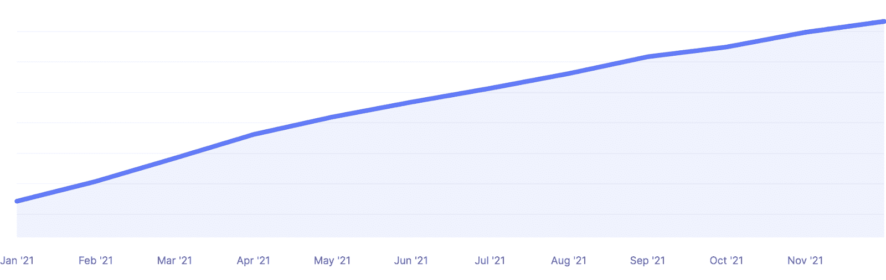

Customer base growth in 2021

有些人可能会想:更多的顾客意味着更多的钱！他们一点都不会错。

2021 年，与 2020 年相比，Kinsta 的收入大幅增长了 47%。客观地看，到年底，我们的经常性收入大约是 2015 年底的 60 倍。

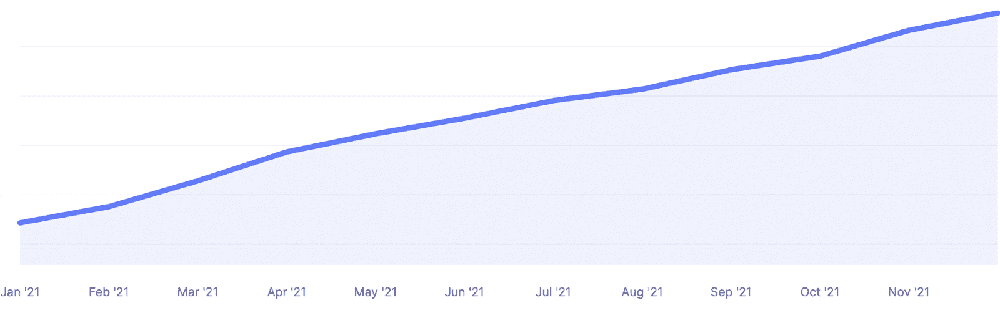

金士达 2021 年收入增长

### 金斯塔网站的 PHP 版本

为了提供一些有趣的数据，这里总结了 2021 年 Kinsta 客户中最常见的 PHP 版本:

*   94%的人使用的是 PHP 7.4 版本
*   5%的人在使用 [PHP 8.0](https://kinsta.com/blog/php-8/)
*   0.1%的人在使用 [PHP 8.1](https://kinsta.com/blog/php-8-1/)

Kinsta 在所有环境下支持[PHP 8.1](https://kinsta.com/feature-updates/php-8-1/)。每个新的 PHP 版本都有性能改进。这就是为什么我们鼓励每个人首先在他们的升级网站上升级到最新的 PHP 版本[,来测试一下，看看他们自己的改进。](https://kinsta.com/blog/php-versions/)

我们通过 MyKinsta 让这个过程变得超级简单！

Kinsta 客户中使用最多的 [WordPress 版本](https://kinsta.com/blog/wordpress-version/)怎么样？接下来让我们来看看这些数字。

### Kinsta 客户使用的 WordPress 版本

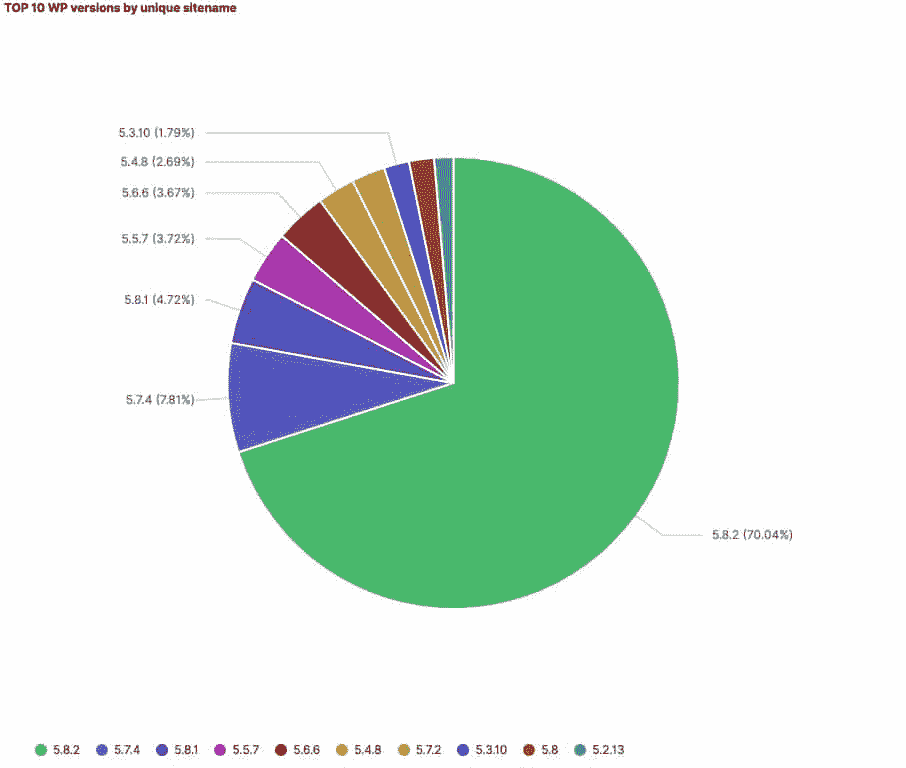

Top 10 WordPress versions used by Kinsta customers in 2021

一目了然，你可以看到 WordPress 5.8.2 位于我们图表的最顶端(70.04%的托管网站)，其次是 WordPress 5 . 7 . 4(7.81%)，WordPress 5.8.1 (4.72%)位于第三位。

以下是我们每月交付的数据的一些附加统计数据:

*   通过 Kinsta 服务的 500 亿次 HTTP 请求
*   Kinsta 提供 1.9 的数据
*   通过[集成 CDN](https://kinsta.com/help/kinsta-cdn/) 服务的 170 多亿次 HTTP 请求
*   集成 CDN 提供超过 760 TB 的数据

## 你说金斯塔支持？无比的

Kinsta 的支柱之一——我们的北极星——一直致力于提供令人难以置信的客户支持。当客户寻求帮助时，我们将尽一切努力确保有一名知识渊博的支持工程师提供帮助。

让我们看看实际客户的数据告诉了我们什么，以及他们如何评价我们在 2021 年的支持。

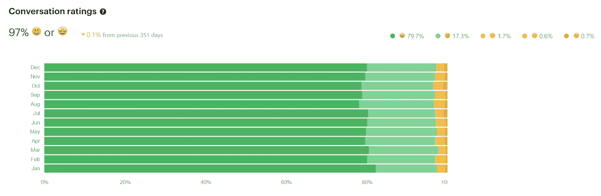

Kinsta’s conversation ratings in 2021

在整个一年(与前一年一样)，我们平均获得了约 97%的正面对话评分。这告诉我们，我们在支持客户方面做得很好。

但是请等一下，我想分享更多关于 Kinsta 在 2021 年支持工作的统计数据:

*   回应了 146 658 次支持对话(高于 2020 年记录的 105 182 次)
*   首次响应时间的中位数是 1:22 秒(低于 2020 年记录的 1:40)
*   平均关闭时间为 43 分 37 秒(低于 2020 年记录的 43 分 55 秒)
*   中值积极评价为 97%(与 2020 年相同)
*   世界协调时下午 4 点是我们支持部门最忙的时候(与 2020 年相同)
*   恶意软件和滥用团队处理了 5，142 起垃圾邮件/恶意软件/违反服务条款的案例
*   [迁移团队](https://kinsta.com/wordpress-migration/)将 8，500 多个站点迁移到我们的平台上

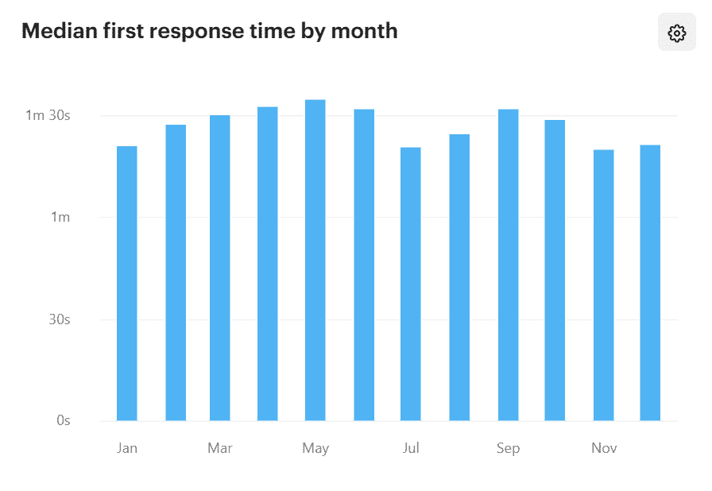

Kinsta’s median first response times in 2021

为了确保我们能够及时有效地照顾所有客户，2021 年，我们额外雇佣了 25 名支持工程师(2020 年我们雇佣了 15 名支持工程师)。 [Kinsta 支持](https://kinsta.com/kinsta-support/)全年全天候提供英语支持，由于我们的双语支持工程师，我们还能够以其他几种语言为客户提供帮助。

多语言支持时间表如下:

*   西班牙语支持在工作日的下午 2 点至上午 12 点(UTC)提供。🇪🇸
*   法语支持在工作日的上午 6 点至下午 5 点(UTC)提供。🇫🇷
*   德国不再提供支持。
*   意大利支持服务时间为世界协调时周一至周五上午 8 点至下午 4 点。🇮🇹
*   葡萄牙语支持服务时间为工作日上午 9 点至下午 5 点(🇵🇹协调时间)

我们一直在寻找更多有才华的工程师加入我们的团队。如果你有兴趣，[查看我们的职业页面](https://kinsta.com/careers/)。

我们感到幸运和荣幸能够为如此出色的客户服务。读到他们对我们所做的事情和从我们这里得到的帮助有多么感激，我们的心真的很温暖:

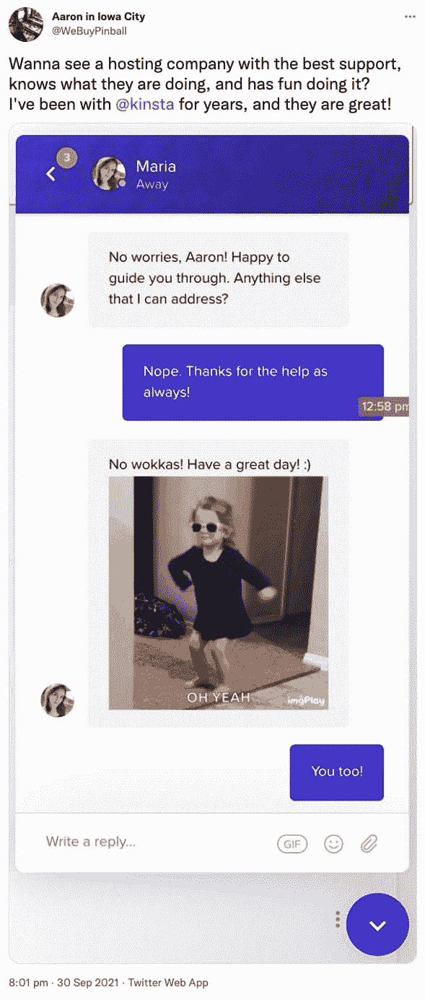

大声喊出来，大声说“谢谢！”感谢我们出色的支持和系统管理员团队所做的工作！

## 团队扩张增长了 64% —没有放缓

年初，我们有 158 名团队成员。现在，我们在世界各地拥有 259 名优秀的团队成员！人力资源团队一直忙于这 64%的增长，包括欢迎一些新角色加入我们的团队。

今年，我们还启动了我们的职业发展计划，每年花费 1000 美元用于提高我们团队成员的技能，并且全年定期举行职业对话。我们还启动了领导力发展计划，以提高我们经理的技能组合，提供他们需要的额外工具，为专业人士提供一个蓬勃发展的环境。

能够入选偏远团队的[最佳工作场所](https://qz.com/work/2053446/the-best-companies-for-working-from-home/?utm_source=email&utm_medium=quartz-membership&utm_content=ff77f70d-10cd-11ec-a4f7-d6d57c20313e)名单也是一件非常令人高兴的事情。更重要的是，我们的团队成员 NPS 脉冲调查显示稳定的评级超过 80(如果你知道你的 NPS 评级，你会知道这是非常好的！).

Balazs, Product Owner, sharing why he loves working at Kinsta

Andrea, VP of Marketing, sharing why she loves working at Kinsta

Roger, Head of Client Experience, sharing why he loves working at Kinsta

我们仍在成长，所以如果你有兴趣加入我们，请务必访问和/或书签[我们的职业页面](https://kinsta.com/careers/)！

## 连接和支持世界各地的 WordPress 社区

与 2020 年类似，去年许多现场活动被取消/推迟或转移到虚拟活动。Kinsta 一直积极支持世界各地的 WordPress 社区，2021 也不例外。

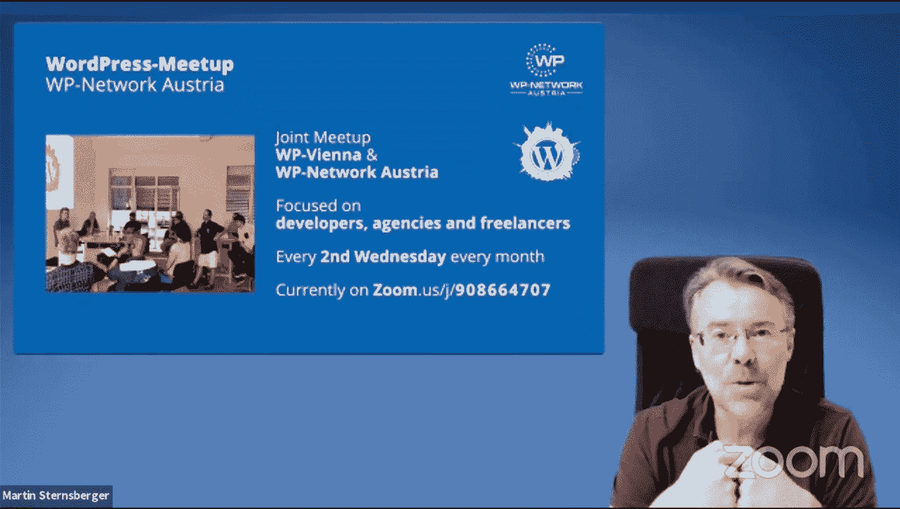

[Austria WordPress Meetup](https://kinsta.com/de/blog/wordpress-meetup-wien/)

[Vienna WordPress Meetup](https://www.meetup.com/de-DE/Vienna-WordPress-Meetup/?_locale=de-DE)

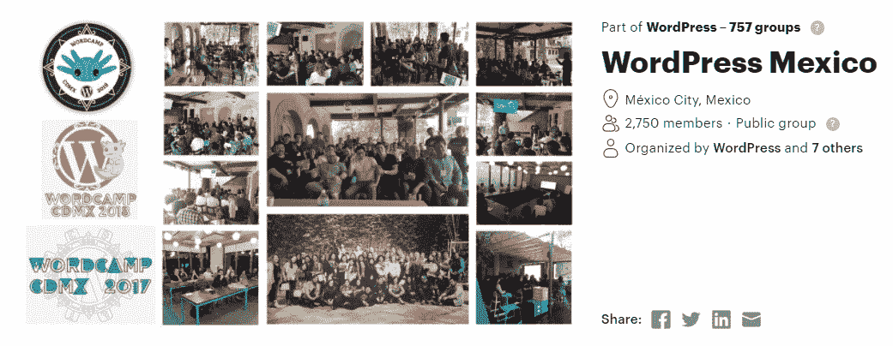

[Mexico City WordPress Meetup](https://www.meetup.com/WordPress-Mexico/)

[Lille WordPress Meetup](https://www.meetup.com/fr-FR/WPinLille/)

### 单词营

*   【2021 年日本世界夏令营
*   【2021 年意大利世界夏令营
*   [中美洲 wordcamp】](https://centroamerica.wordcamp.org/2021/patrocinador-izalco-kinsta/)

尽管我们已经告别了 2021 年，但我们可能还需要一段时间才能安全地参加现场活动。2022 年最终会是那一年吗？

让我们希望如此——我们怎么强调都不为过，我们是多么期待见到大家，谈论 [WordPress](https://kinsta.com/topic/WordPress-Tips/) 、[网站速度](https://kinsta.com/topic/website-speed/)、 [SEO 战略](https://kinsta.com/topic/seo-strategy/)或其他任何事情，只要再次有可能举行面对面的活动！

## 2021 年的功能更新和变化

2021 年，我们的工程师和开发团队都挺忙的。我们整理了去年推出的主要功能更新和变化的列表，这样您就可以看到我们前进了多远(请确保[订阅我们的新闻简报](https://kinsta.com/wordpress-newsletter/)以免错过更新)。

### Cloudflare 集成(新的 CDN、企业级安全性、通配符 SSL 支持)

毫无疑问，2021 年最大的更新是[将 Cloudflare 集成到我们的 Kinsta 托管解决方案](https://kinsta.com/cloudflare-integration/)中，并向所有计划的所有客户免费提供。

由于我们的技术堆栈和服务器架构得到了增强，Kinsta 客户现在可以利用企业级防火墙，其中包括 [DDoS 保护](https://kinsta.com/blog/what-is-a-ddos-attack/)、 [HTTP/3 支持](https://kinsta.com/blog/http3/)、[通配符 SSL](https://kinsta.com/knowledgebase/wildcard-setups/#wildcard-ssl)和[高性能 Kinsta CDN](https://kinsta.com/feature-updates/kinsta-cdn-cloudflare/) ，后者由 Cloudflare 遍布 100 多个国家近 200 个城市的全球网络提供支持。

在我们的性能基准测试中，我们发现，与不使用 Kinsta CDN 的网站相比，使用 kin sta CDN 的网站的页面加载时间减少了 44%。如果您还没有，请确保在您的网站上[启用 Kinsta CDN](https://kinsta.com/help/kinsta-cdn/) 。

### 德夫金斯塔

从第一天起，我们就在 Kinsta 听取顾客的反馈。我们收到的最常见的请求之一是为开发人员提供更多的工具，使他们的工作(和生活)更容易。

## 注册订阅时事通讯

### 想知道我们是怎么让流量增长超过 1000%的吗？

加入 20，000 多名获得我们每周时事通讯和内部消息的人的行列吧！

[Subscribe Now](#newsletter)

2020 年，我们发布了 [Kinsta APM](https://kinsta.com/apm-tool) ，这是我们强大的内置工具，用于[应用性能监控](https://kinsta.com/blog/application-performance-monitoring/)。2021 年，我们发布了 [DevKinsta](https://kinsta.com/devkinsta/) ，这是我们永远免费的本地 WordPress 开发工具套件。我们让它适用于 macOS、Windows 和 Ubuntu。

DevKinsta 最棒的事情之一是它的[社区论坛](https://community.devkinsta.com/)，用户在这里分享技巧，谈论他们如何使用 Devkinsta，并有办法直接向我们提出问题。

要使用 DevKinsta，您不需要成为 Kinsta 的客户，所以请随意[下载它](https://kinsta.com/devkinsta/)并尝试一下——其他开发者已经有 16，500+了！

### 5 个新的数据中心位置

让你的网站尽可能靠近你的客户和用户是改善你的页面加载时间和减少延迟的最重要的因素之一。

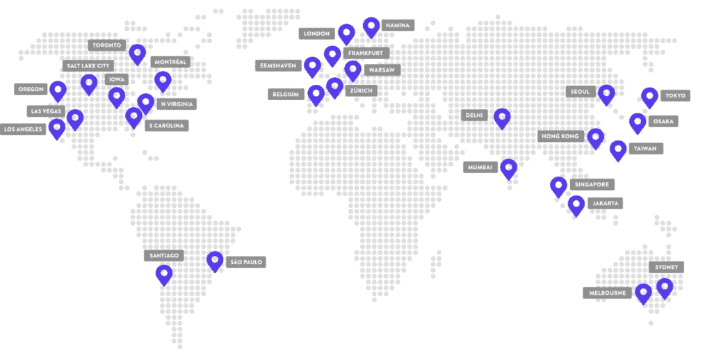

Kinsta’s global data centers

2021 年，我们增加了五个新的[谷歌云数据中心位置](https://kinsta.com/knowledgebase/google-cloud-data-center-locations/)。您现在可以从总共 35 个位置中进行选择:

*   台湾彰化县(东亚 1)
*   香港(东亚 2)
*   日本东京(亚洲东北部 1)
*   日本大阪(亚洲东北部 2)
*   韩国首尔(东北亚 3)
*   印度孟买(亚洲南部 1)
*   印度德里(亚洲南部 2)——**新！**
*   新加坡裕廊西(东南亚 1)
*   印度尼西亚雅加达(东南亚 2)
*   澳大利亚悉尼(澳大利亚东南部 1)
*   澳大利亚墨尔本(澳大利亚-东南 2)——**新！**
*   波兰华沙(欧洲中部 2)——**新！**
*   芬兰哈米娜(欧洲-北欧 1)
*   比利时圣吉斯兰(欧洲-西方 1)
*   英国伦敦(欧洲-西方 2)
*   德国法兰克福(欧洲-西方 3)
*   荷兰 Eemshaven(欧洲-西方 4)
*   瑞士苏黎世(欧洲-西方 6)
*   加拿大蒙特利尔(北美-东北 1)
*   加拿大多伦多(北美-东北 2)——**新！**
*   巴西圣保罗(南美-东方 1)
*   智利圣地亚哥(南美-西方 1)——**新！**
*   美国爱荷华州康瑟尔布拉夫斯(美国中部 1)
*   美国南卡罗来纳州蒙克斯角(美国东部 1)
*   美国弗吉尼亚州阿什本(美国东部 4)
*   美国俄勒冈州达拉斯市(美国西部 1)
*   美国加利福尼亚州洛杉矶(美国西部 2)
*   美国犹他州盐湖城(美国西部 3)
*   美国内华达州拉斯维加斯(美国西部 4)

### 无限制的免费基本 WordPress 迁移

我们一直坚持认为，更换主机提供商应该像提交支持票一样简单。

[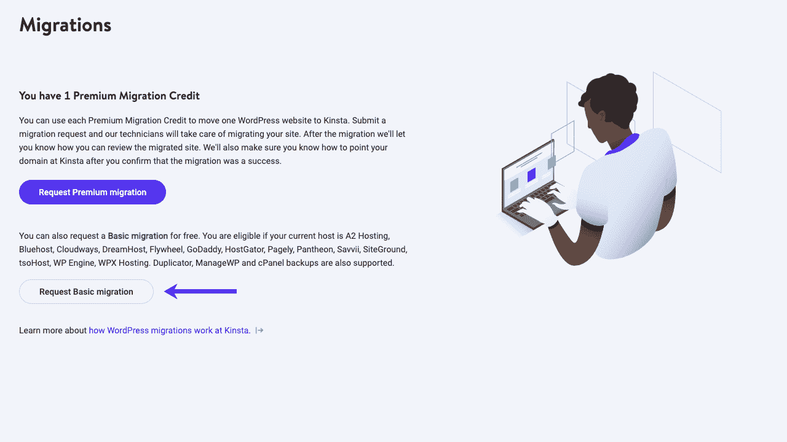](https://kinsta.com/wp-content/uploads/2022/01/migration-request-mykinsta-2022.png)

Submitting a MyKinsta migration request

在 2021 年，我们将我们的愿景付诸实践，并引入了一项重大变革，即您可以向多少(以及从哪些)托管提供商申请免费基本迁移。

具体来说，所有新客户和现有客户现在都可以免费请求 **[无限制的基本 WordPress 迁移](https://kinsta.com/wordpress-migration/)** ，每当他们需要时，不管他们需要从哪个主机提供商那里迁移网站。

要申请免费基本迁移，您应该:

1.  [创建一个账户](https://kinsta.com/plans/)(如果你是新客户)。
2.  根据您是从另一个托管提供商请求迁移[还是从备份文件](https://kinsta.com/knowledgebase/wordpress-migrations/#how-to-request-a-migration-from-another-host)请求迁移[，按照我们文档中概述的步骤，直接通过 MyKinsta 提出您的请求。](https://kinsta.com/knowledgebase/wordpress-migrations/#how-to-request-a-migration-from-a-backup)

### 选择性推送

我们的客户最欣赏的功能之一是 Kinsta 的 [staging environments](https://kinsta.com/wordpress-staging/) ，它在所有计划中都是免费的。2021 年，我们通过增加[选择性推送功能](https://kinsta.com/feature-updates/selective-push/)，让它们变得更加有用。

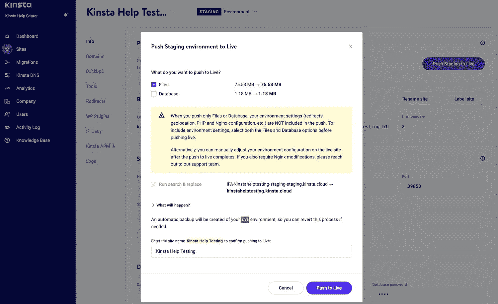

Kinsta’s Selective Push feature

得益于选择性推送功能，您可以更精确地控制您可以实时推送的内容。事实上，您可以选择:

*   [仅推送文件](https://kinsta.com/help/push-staging-live/#push-files-only)
*   [仅推送数据库](https://kinsta.com/help/push-staging-live/#push-database-only)
*   [推送一切](https://kinsta.com/help/push-staging-live/#push-all)

### 其他更新

除了上面提到的所有主要功能更新和更改之外，下面是一些附加功能发布的列表。如您所见，我们的开发、工程和 MyKinsta 团队一直非常忙碌！

*   [PHP 8.1 适用于所有环境](https://kinsta.com/feature-updates/php-8-1/)
*   [插件和主题管理](https://kinsta.com/feature-updates/plugin-and-theme-management/)
*   [增强型现场转移](https://kinsta.com/feature-updates/site-transfer-tool/)
*   [帮助中心](https://kinsta.com/feature-updates/help-center/)
*   [地理定位工具](https://kinsta.com/feature-updates/geolocation/)

## 金斯塔的评论出来了

作为一家托管公司，我们能得到的最好的赞美就是知道 Kinsta 帮助客户的业务取得了成功，并让他们安心。

Struggling with downtime and WordPress problems? Kinsta is the hosting solution designed to save you time! [Check out our features](https://kinsta.com/features/)

我们感到幸运的是，收到了来自世界各地客户的数千条评论，他们分享了他们的 Kinsta 体验，以及他们在进行切换后看到的 [SEO、速度和安全优势](https://kinsta.com/wordpress-hosting/)。

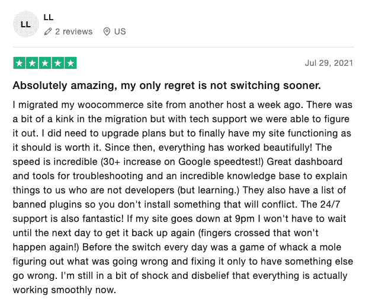

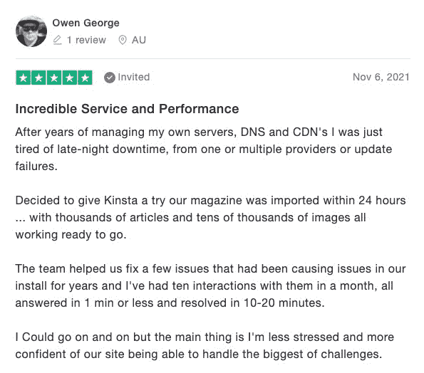

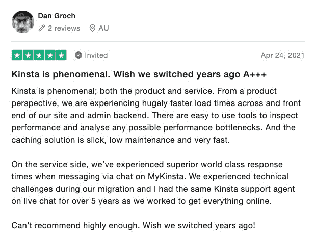

你可以在 [G2](https://www.g2.com/products/kinsta/reviews) 、 [Trustpilot](https://www.trustpilot.com/review/kinsta.com) 、 [Google](https://www.google.com/maps/place/Kinsta/@34.0816031,-118.3912632,17z/data=!4m8!3m7!1s0x80c2bfcf613de833:0x1ea1e9efc329664!8m2!3d34.0815987!4d-118.3890745!9m1!1b1!16s%2Fg%2F11n0982xzq?hl=en-HU) 上阅读更多 [Kinsta 评论](https://kinsta.com/kinsta-reviews/)。

## 更多内容，更多格式

如果 2020 年是我们通过推出我们的 [YouTube 频道](https://www.youtube.com/kinsta)来测试视频的一年，那么 2021 年就是它的孪生兄弟，因为我们开始了一个新的(也是真正令人兴奋的)探索，这就是 Kinsta 的商业和技术播客 Reverse Engineered！

### 逆向工程

2021 年推出，由 Kinsta 首席运营官 Jon Penland 主持的 [Reverse Engineered](https://kinsta.com/podcast/) 是我们的播客，来自[谷歌](https://kinsta.com/podcast/innovation-at-google/)、 [Databox](https://kinsta.com/podcast/make-the-most-of-your-data/) 、[五角星](https://kinsta.com/podcast/how-to-make-data-more-human/)、 [eWebinar](https://kinsta.com/podcast/building-business-around-the-life-you-want/) 等公司的企业家分享他们的成功、失败和商业故事。

例如，在下面，你会听到奥斯汀·金德的声音，他是一名独立开发者，独自管理着 1300 多个 WordPress 网站:

当我们听到奥斯汀的故事时，我们被震撼了，我们知道它会引起我们更广泛的观众的兴趣！

如果你想听和看更多来自科技行业中一些最鼓舞人心和最杰出的声音的故事，请务必收听并订阅逆向工程:

*   [YouTube](https://www.youtube.com/playlist?list=PLhYfuAN3YCfwZkEDA1GdeyjbK9F2Dx77T)
*   [苹果播客](https://podcasts.apple.com/us/podcast/reverse-engineered/id1563477273)
*   [Spotify](https://open.spotify.com/show/6URm7SfixcNrc0FMTaDQ64)
*   [谷歌播客](https://podcasts.google.com/feed/aHR0cHM6Ly9mZWVkcy5idXp6c3Byb3V0LmNvbS8xNzU3Mzg0LnJzcw?sa=X&ved=0CAYQrrcFahcKEwiIiPLl9J3wAhUAAAAAHQAAAAAQSA)
*   [装订机](https://www.stitcher.com/show/reverse-engineered)
*   [Deezer](https://www.deezer.com/en/show/2555932)

嘘…我们正在制作即将到来的 re 第二季，但是你没有从我这里听到！；)

### 金斯塔的 YouTube 频道

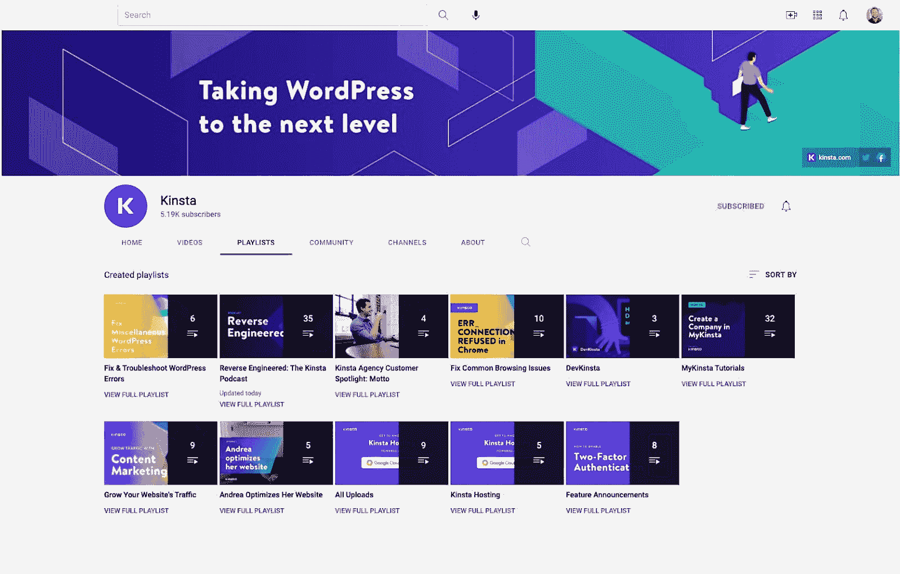

Kinsta’s YouTube channel

我们推出 YouTube 频道已经一年多了。2021 年，我们成功地开始建立一个视频社区，并利用我们在 [YouTube SEO](https://kinsta.com/blog/youtube-seo/) 的经验。

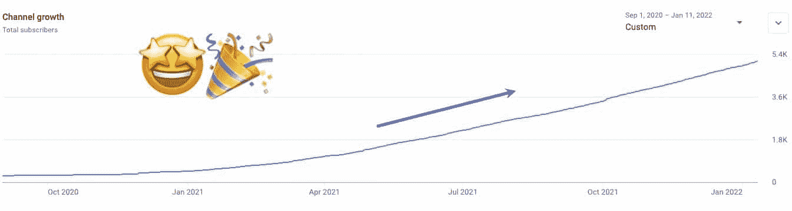

Kinsta’s channel growth in 2021

如您所见，2021 年是我们渠道增长持续上升的一年。这是我们在制作高质量和有用的内容方面的巨大承诺和团队合作的结果，大多数观众似乎都很欣赏这一点。

由于视频提供了一种强大的交流方式，我们今年和未来肯定会继续关注它们。

事实上，我迫不及待地想让大家看看我们在过去几个月里制作的新视频。为了确保你不会错过我们定期发布的那些和所有有用的教程，请务必[订阅我们的 YouTube 频道](https://www.youtube.com/c/Kinsta?sub_confirmation=1)。

### 我们在 2021 年出版了多少

谁想知道我们去年发布了多少内容？

我看到很多手举在空中，所以…开始吧:

*   新博文: **181**
*   新知识库文章: **64**
*   帮助中心文章: **149**
*   新视频: **202**
*   新登陆页面: **50+**
*   新案例研究: **9**
*   新功能更新: **15**
*   新电子书: **7**
*   每周简讯: **51**

这个列表没有考虑到 2021 年发布的所有内容更新。Kinsta 的内容机器每年都在进一步推动其极限。

上面的数字让你看到了我们能够制作多少内容的一部分，因为它们都与我们的主网站(kinsta.com)相关，并且是用英语编写的。不过，Kinsta 也为不讲英语的观众提供服务。

这就是我们的全球扩展团队和翻译人员，以他们巨大的工作量和努力，帮助提供非英语的其他语言的内容。在下面，你可以看到全球扩张产生了多少内容(结合了 Kinsta 提供的所有语言):

A pie chart of Kinsta’s publications in 2021, separated by language.

*   博文:**1169 篇**
*   知识库: **454**
*   功能更新: **97**
*   登陆页面: **261**

我们对他们的工作和帮助永远感激不尽，因为他们确保了我们的内容能够到达不讲英语的用户手中。

## 2021 年阅读最多的文章

为了能够获得完整的图片，除了数量，让我与你分享哪些书面内容表现最好。

### 十大博客文章

1.  [如何修复你的连接不在 Chrome 中的私有错误(18 个提示)](https://kinsta.com/blog/your-connection-is-not-private/)
2.  [如何修复你的 WordPress 网站上的 502 坏网关错误](https://kinsta.com/blog/502-bad-gateway/)
3.  [22 个可供选择的搜索引擎](https://kinsta.com/blog/alternative-search-engines/)
4.  [如何使用 Gmail SMTP 服务器免费发送电子邮件](https://kinsta.com/blog/gmail-smtp-server/)
5.  [如何修复 ERR_CONNECTION_TIMED_OUT 错误(一步一步)](https://kinsta.com/blog/err_connection_timed_out/)
6.  [找到某人电子邮件地址的 13 种方法(提升你的拓展游戏水平)](https://kinsta.com/blog/find-email-address/)
7.  [如何修复 Chrome 中的 ERR _ CONNECTION _ rejected 错误(9 个小技巧)](https://kinsta.com/blog/err_connection_refused/)
8.  [如何修复你的 WordPress 网站上的 504 网关超时错误](https://kinsta.com/blog/504-gateway-timeout/)
9.  [如何修复 ERR_TOO_MANY_REDIRECTS 错误](https://kinsta.com/blog/err_too_many_redirects/)
10.  [如何修复你的 WordPress 网站上的 405 方法不允许错误](https://kinsta.com/blog/405-method-not-allowed-error/)

### 前 10 篇知识库文章

1.  [如何修复 Chrome 中的 DNS _ PROBE _ FINISHED _ NX domain](https://kinsta.com/knowledgebase/dns_probe_finished_nxdomain/)
2.  [如何修复 Windows 和 Mac 上的“DNS 服务器不响应”错误](https://kinsta.com/knowledgebase/dns-server-not-responding/)
3.  [如何修复 NET::ERR _ CERT _ AUTHORITY _ INVALID 错误](https://kinsta.com/knowledgebase/neterr-cert-authority-invalid/)
4.  [10 种修复 NET::ERR_CERT_DATE_INVALID 错误的方法](https://kinsta.com/knowledgebase/net-err_cert_date_invalid/)
5.  [如何修复 400 错误请求错误【原因和修复】](https://kinsta.com/knowledgebase/400-bad-request/)
6.  [如何修复 SSH“连接被拒绝”错误](https://kinsta.com/knowledgebase/ssh-connection-refused/)
7.  [如何修复“SSL 握手失败”错误(5 种方法)](https://kinsta.com/knowledgebase/ssl-handshake-failed/)
8.  [如何清除所有主流浏览器的缓存](https://kinsta.com/knowledgebase/how-to-clear-browser-cache/)
9.  [如何修复 ERR_SSL_PROTOCOL_ERROR](https://kinsta.com/knowledgebase/err_ssl_protocol_error/)
10.  [如何修复 NET::ERR _ CERT _ COMMON _ NAME _ INVALID 错误](https://kinsta.com/knowledgebase/net-err_cert_common_name_invalid/)

## 2022 年有什么期待

你喜欢深入探究金斯塔的 2021 年吗？希望如此！

但是，嘿，新的一年已经开始了，虽然我不能说漏嘴，分享我们将在 2022 年推出的所有东西，相信我，这将是前所未有的！—我很乐意让你先睹为快。

### 更快更安全的网站

[边缘计算](https://kinsta.com/knowledgebase/edge-servers/)提供了无数的机会来改进我们的托管平台，进而改进我们向客户提供的产品。

这些速度优势就是为什么 Kinsta 在 [MyKinsta 仪表板](https://kinsta.com/mykinsta/) 中内置了一个 [代码缩小功能](https://kinsta.com/help/kinsta-cdn-code-minification) 。客户可以选择为他们的 CSS 和 JavaScript 文件选择自动缩减代码，无需手动操作就可以加速他们的网站。

### 帮助客户发展业务的更多解决方案

我们关心我们的客户，我们总是尽力支持他们。这意味着[我们定期推出新的工具和特性](https://kinsta.com/feature-updates/)；我们及时回复他们的支持请求；我们发布[教程和提示](https://kinsta.com/topic/wordpress-tips/)；我们保持[我们的文档](https://kinsta.com/help/)整洁。

2022 年将是我们推出新的、更具体的解决方案来帮助开发者、[代理机构](https://kinsta.com/agency-directory/)和企业在线发展的一年。

### 还有什么？

好吧，可以说 2022 年将是 Kinsta 创新的一年，超越你对 WordPress 主机的任何期望！

我们很想听听我们的客户关于 2021 年 Kinsta 的哪些功能或帖子对他们帮助最大。评论分享你的！我们感谢您的持续支持，我们一直期待着您的回音。

为 2022 年的良好开端干杯！

> 随着 2021 年即将结束，我们想花点时间向我们的客户说声谢谢💜
> 
> 感谢您激励我们，信任我们，让我们成为您今年旅程的一部分。
> 
> 我们迫不及待地想看看 2022 年将会发生什么。🚀[#特姆金斯塔](https://twitter.com/hashtag/TeamKinsta?src=hash&ref_src=twsrc%5Etfw)[#新年快乐](https://twitter.com/hashtag/HappyNewYear?src=hash&ref_src=twsrc%5Etfw)[pic.twitter.com/u6H8A9DCWN](https://t.co/u6H8A9DCWN)
> 
> -金沙萨(@金沙萨)[12 月 31 日，2021 年](https://twitter.com/kinsta/status/1476870827702374400?ref_src=twsrc%5Etfw)

* * *

让你所有的[应用程序](https://kinsta.com/application-hosting/)、[数据库](https://kinsta.com/database-hosting/)和 [WordPress 网站](https://kinsta.com/wordpress-hosting/)在线并在一个屋檐下。我们功能丰富的高性能云平台包括:

*   在 MyKinsta 仪表盘中轻松设置和管理
*   24/7 专家支持
*   最好的谷歌云平台硬件和网络，由 Kubernetes 提供最大的可扩展性
*   面向速度和安全性的企业级 Cloudflare 集成
*   全球受众覆盖全球多达 35 个数据中心和 275 多个 pop

在第一个月使用托管的[应用程序或托管](https://kinsta.com/application-hosting/)的[数据库，您可以享受 20 美元的优惠，亲自测试一下。探索我们的](https://kinsta.com/database-hosting/)[计划](https://kinsta.com/plans/)或[与销售人员交谈](https://kinsta.com/contact-us/)以找到最适合您的方式。