# 2022 年前 14 大安全电子邮件提供商

> 原文：<https://kinsta.com/blog/secure-email-providers/>

电子邮件是我们日常生活的一大部分。了解所有的安全电子邮件提供商是非常重要的。

普通人每天花超过五个小时查看他们的工作和个人邮件。

尽管电子邮件很有价值，也很高效，但它并不十分安全。至少如果你使用的是标准的电子邮件提供商，比如 Gmail 或者 Outlook。

电子邮件是黑客获取您公司数据的最简单方式之一。为了保护您的电子邮件和每天发送的所有信息，您需要一个安全的电子邮件提供商。

本文介绍了 14 大安全电子邮件提供商，并帮助您选择适合您企业的提供商。

## 什么是安全的电子邮件提供商？

一个安全的电子邮件提供商有一些功能可以保护你的电子邮件帐户和邮件内容的安全。

通常，这是通过端到端加密来实现的。端到端加密意味着电子邮件在从发件人到收件人的整个过程中都是加密的。

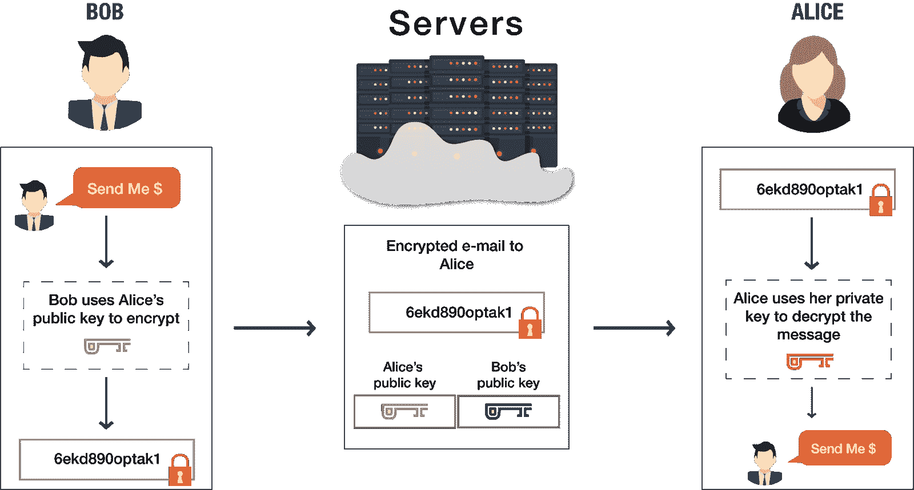

端到端加密。(来源:[需求预测](//www.preveil.com/blog/encrypted-email/%E2%80%9D) )

然而，安全电子邮件没有标准定义——任何电子邮件提供商都可以自称为安全的。

出于这个原因，当你选择一个安全的电子邮件提供商时，你必须注意加密的类型和使用的其他安全措施。

### 为什么你需要一个安全的电子邮件提供商？

为了理解为什么安全的电子邮件是必不可少的，让我们来看看当你从一个标准的提供商如 [Gmail](https://kinsta.com/blog/gmail-add-ons/) 发送电子邮件时会发生什么。

并不是说 Gmail 没有安全功能。从 Gmail(和许多其他主要提供商)发送的电子邮件使用[传输层安全](https://kinsta.com/blog/tls-1-3/) (TLS)加密来加密在您的计算机和服务器之间传输的邮件。

一旦它们到达服务器，谷歌就在网络层对数据进行加密。但是谷歌自己有权限。

它不再像 2017 年之前那样阅读你的电子邮件来为你提供广告。但谷歌仍会扫描你的电子邮件内容，以提供智能回复等功能。

Gmail 或其他提供商也很容易让第三方访问你的电子邮件。

因此，现在你的电子邮件正在离开谷歌的服务器，前往其目的地。如果收件人的电子邮件提供商也使用 TLS，该电子邮件将像大多数主要电子邮件服务一样，在传输过程中继续受到保护。

但是，如果收件人不使用 TLS，邮件将是不加密的，很容易被拦截。

即使电子邮件在传输过程中受到保护，一旦到达收件人的电子邮件服务器，它也可能不安全。有些邮件提供商根本不在服务器上加密邮件。

### 安全的电子邮件提供商如何保护您的电子邮件？

最安全的电子邮件提供商使用端到端加密来保护您的电子邮件。

这意味着即使是电子邮件提供商本身也无法访问你的电子邮件。唯一能阅读加密邮件的人是有身份验证的收件人。

提供商也可以使用[发件人政策框架(SPF)](https://kinsta.com/knowledgebase/spf-record/) 来验证电子邮件并进一步保护您。

使用 SPF，当有人试图代表您发送一封不是来自有效 IP 地址的电子邮件时，收件人将被通知该电子邮件来自一个未经授权的用户，他们可以选择拒绝它。

### 你必须改变你的电子邮件地址来切换到一个安全的电子邮件提供商吗？

在大多数情况下，当你更换电子邮件提供商时，你必须[创建一个新的电子邮件地址](https://kinsta.com/blog/professional-email-address/)。

只要您的旧电子邮件帐户存在，您就可以将您的电子邮件转发到您的新收件箱。但请记住，这些转发的电子邮件通过旧提供商的服务器，所以它们不是端到端加密的。

一些安全的电子邮件提供商有额外的功能来帮助您从旧的电子邮件提供商迁移。

## 如何选择安全的电子邮件提供商

每个安全电子邮件提供商都有一套不同的功能。这里有一些你应该考虑的事情。

### 服务器位置

包括美国在内的一些国家收集和共享从电子邮件服务器收集的情报数据。

如果你比政府机构更担心黑客，这可能对你不重要。

但是对于活动家和其他不想让他们的电子邮件落入政府之手的人来说，位于瑞士、德国、比利时、挪威或瑞典的电子邮件提供商是理想的选择。他们都有更严格的隐私法。

### 加密

我们已经讨论了端到端加密和传输加密(如 TLS)之间的区别。

在端到端加密中，有不同的类型。

例如，您可以使用对称或非对称加密。对称加密使用单个密钥来加密和解密数据。发送者和接收者都需要这个密钥。

不对称加密(也称为公钥密码或加密)是指使用两组不同的密钥来加密数据。

发送方使用接收方的公钥加密邮件。这个公钥在数学上与只有接收者知道的私钥相关联。电子邮件可以用私钥解密。

不对称加密不如对称加密直接或快速，但它增加了另一层安全性。

### 双因素身份验证(2FA)

除了选择具有可靠加密的提供商之外，确保您的帐户凭证受到保护也很重要。

[双重认证](https://kinsta.com/blog/wordpress-two-factor-authentication/)意味着窃取你的密码不足以进入你的电子邮件账户。您还需要另一种形式的身份验证。

一个因素是你知道的东西，比如密码。另一个是你有的东西，比如你的手机。双因素身份验证最常见的形式之一是向您发送一次性代码，与您的用户名和密码一起使用。

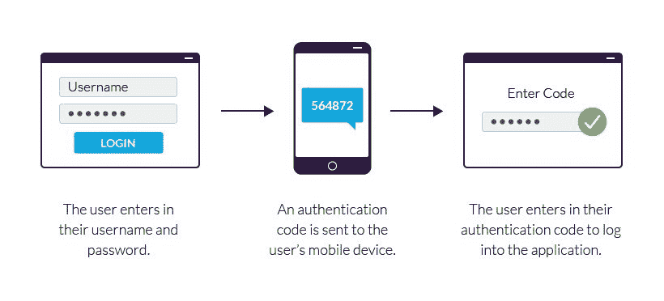

双因素认证的例子。(来源: [Imperva](//www.imperva.com/learn/application-security/2fa-two-factor-authentication/%E2%80%9D) )

### 元数据头剥离

电子邮件通常包含有关收件人和发件人的电脑、浏览器和网络的元数据。

许多安全电子邮件提供商将这些信息删除。

### 开放源码

开源软件让用户和开发者可以使用它的源代码。这意味着任何人都可以检查产品的代码以确保其安全性。

### 其他加密功能

你的标准电子邮件提供商可能还会提供其他工具，比如 [Google Calendar 和 Google Drive with Gmail](https://kinsta.com/blog/google-workspace/) 。

一些安全电子邮件提供商提供类似的功能，但它们是加密的——例如，安全日历或安全云存储。

### 桌面和移动设备上的可用性

您正在转向安全电子邮件进行数据加密，但这并不意味着用户体验不重要。

如果你喜欢在移动设备上查看电子邮件，选择一个在移动设备上运行良好的电子邮件提供商。你不能总是给你最喜欢的邮件客户端应用添加安全提供商。

## 2022 年 14 大安全电子邮件提供商

让我们来细分 14 大安全电子邮件提供商，包括它们的主要功能和定价。

### 1.质子机

ProtonMail 是最知名的安全电子邮件提供商。

它是开源的，位于瑞士，提供端到端的非对称加密。如果您每天发送的邮件少于 150 封，并且不需要大量存储空间，您可以免费使用 ProtonMail。

ProtonMail 的一个简洁特征是自毁邮件。您设置了电子邮件的到期日期，该日期将从收件人的收件箱中删除。

使用 ProtonMail，您的数据使用零访问加密存储。这意味着 ProtonMail 本身不知道你的密码，无法解密你的邮件。(这也意味着他们无法重置您的密码)。

ProtonMail 还为 Android 和 iOS 提供了一个移动应用程序。

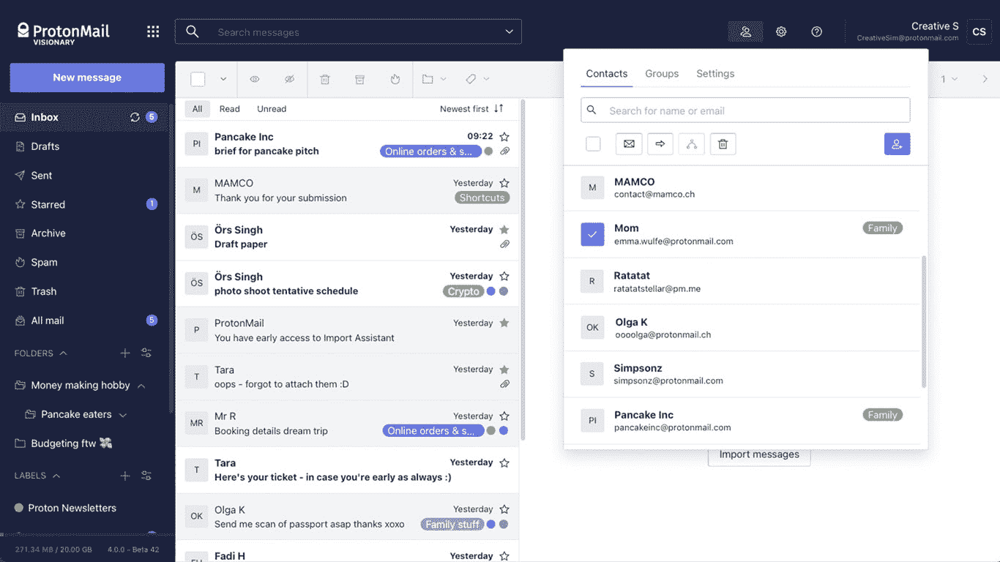

质子邮件

**主要特征**

*   位于瑞士的服务器
*   开放源码
*   端到端加密
*   零访问加密
*   自毁邮件
*   移动应用程序
*   付费计划的自定义域名

**定价**

*   **免费** : 1 个用户，500 MB 存储空间，每天 150 条消息
*   **加**:1 个用户每月 5 美元，5 GB 存储空间，每天 1000 条消息
*   **Professional**:1-5，000 名用户每月 8 美元，每位用户 5 GB 存储空间，无限消息
*   有远见的人:6 个用户每月 30 美元，20 GB，无限量信息

### 2.Mailbox.org

Mailbox.org 是一项安全的电子邮件服务，旨在帮助商业用户寻找谷歌或微软工具的替代品。除了电子邮件，它还提供加密的[云存储](https://kinsta.com/blog/what-is-cloud-storage/)、视频会议、地址簿、日历和任务规划器。

该电子邮件提供商使用 PGP 加密，这是一种公钥加密程序，已成为电子邮件加密的标准。

没有免费计划，但 Mailbbox.org 相对来说还是比较实惠的。你可以匿名注册并支付服务费用。

Mailbox.org 还以使用环保能源而自豪。

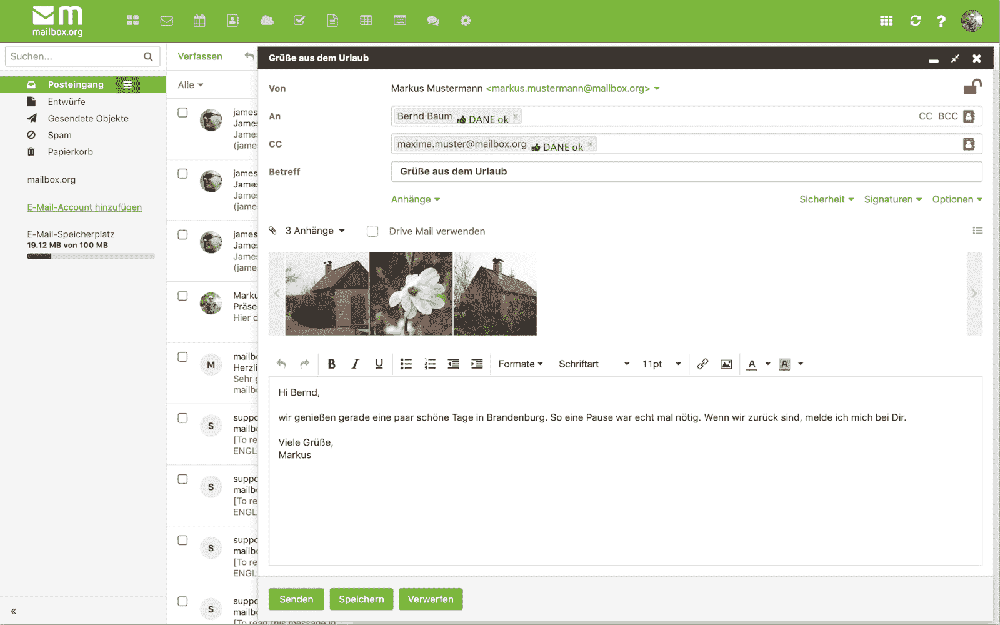【Mailbox.org】T2

**主要特征**

*   位于德国的服务器
*   PGP 加密
*   加密云存储
*   电视会议
*   日历
*   环保的
*   没有免费计划

**定价**

*   **标准**:10gb 邮件存储和 5 GB 云存储每月 3 欧元
*   **Premium**:25gb 邮件存储和 50 GB 云存储每月 9 欧元
*   **光**:2gb 邮件存储 1 欧元/月，无云存储

### 3.轮毂点

HubSpot 通常以其一体化商业解决方案而闻名，该解决方案提供从电子邮件托管和 T2 营销服务到客户支持和内容管理的一切服务。谈到电子邮件安全，HubSpot 的工具提供了大量不同的安全措施，以确保您和您的客户的数据安全可靠。

借助 HubSpot 的营销电子邮件工具，你可以使用 [SPF、DKIM、DMARC 和最新的 BIMI 认证标准](https://kinsta.com/blog/email-authentication/)来认证邮件。每当 HubSpot 传输或存储您的个人数据时，HubSpot 都会在与您的计算机交换数据时对您的数据进行加密，并使用顶级安全措施来防止对其网络的未授权或意外访问。

不仅你的电子邮件是安全的，而且 HubSpot 还保护你的整套工具，无论你是在使用他们的电子邮件、 [CMS](https://kinsta.com/blog/cms-software/#5-hubspot-cms--from-300month) 、网站建设者等等。

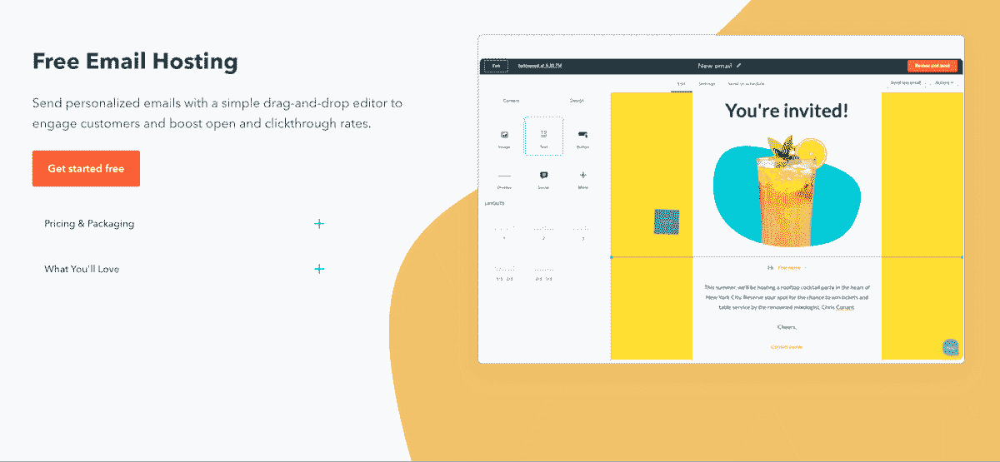

HubSpot

**主要特征**

*   双因素身份验证(2FA)
*   企业的单点登录(SSO)
*   SPF、DKIM、DMARC 和 BIMI 认证标准
*   电子邮件召回
*   一体化 CRM 解决方案
*   与营销、销售、服务中心的数据同步

**定价**

*   提供免费工具
*   **初始:**$ 45/月，包括 1000 个营销联系人
*   **专业:**$ 800/月，包括 2000 个营销联系人
*   **企业:** $3，200/月，包括 10，000 个营销联系人

### 4.Zoho 邮件

Zoho Mail 有一个免费版本，任何人都可以使用，但这项服务对商业用户来说非常珍贵。工作场所计划提供了文字处理器、电子表格软件、网络研讨会平台、聊天功能和其他协作工具。

它使用一种叫做 S/MIME 的非对称加密技术来加密你在传输中和 Zoho 服务器上的电子邮件。每个用户都有一个独特的数字签名，确保电子邮件不会被欺骗。

Zoho Mail 因其易用性获得好评。通过其控制面板，您可以从一个位置管理组织中所有邮箱的设置。

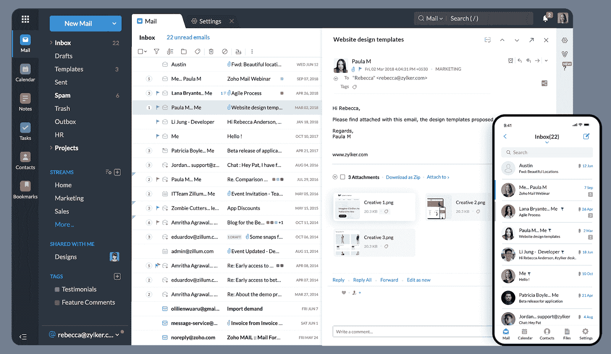

Zoho Mail

**主要特征**

*   分布在世界各地的服务器
*   端到端加密
*   日历
*   联系门户
*   协作工具
*   电子邮件召回
*   移动应用

**定价**

## 注册订阅时事通讯

### 想知道我们是怎么让流量增长超过 1000%的吗？

加入 20，000 多名获得我们每周时事通讯和内部消息的人的行列吧！

[Subscribe Now](#newsletter)

*   **Mail lite** :每月 1 美元或 1.25 美元，每月 5 GB 或 10 GB
*   **邮件溢价**:每月 4 美元，每用户 50 GB
*   **工作场所**:自订价格，3 美元/月起

### 5.图坦诺塔

[Tutanota](https://tutanota.com/) 是另一个开源的安全电子邮件提供商，提供端到端加密和双因素认证。

Tutanota 对隐私非常重视。它不使用 PGP，而是使用 AES 和 RSA 加密。这些系统使用与 PGP 相同的算法，但是它们通过组合对称和非对称密钥增加了额外的安全层。

其他安全功能包括图像屏蔽、标题剥离和网络钓鱼攻击警告。

免费计划仅供私人使用，并为您提供 1 GB 的存储空间和一个日历。

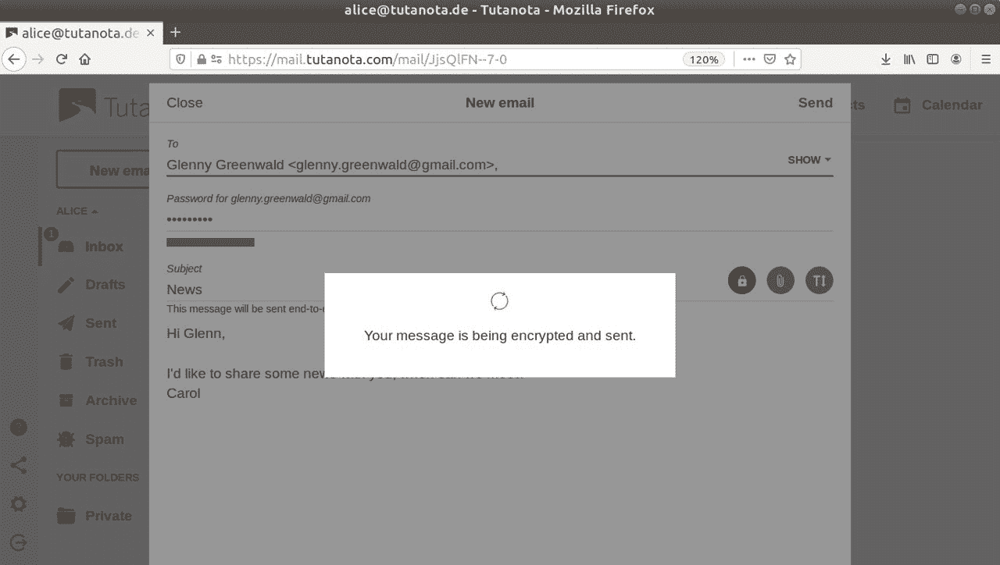

**主要特征**

*   位于德国的服务器
*   端到端加密
*   双因素认证
*   元数据剥离
*   加密的联系人和日历
*   向网站添加加密的联系表单
*   付费计划中的自定义域名
*   无限的消息，甚至在免费版本

**定价**

*   **可用空间** : 1 GB 存储空间
*   **高级**:1gb 存储每月 1 欧元
*   **团队**:10gb 存储每月 4 欧元
*   众多可用的附加组件

### 6.波斯特奥

Posteo 很受需要匿名的活动家和记者的欢迎，因为它允许你匿名注册和支付。

Posteo 对传输中和静态的数据进行加密。虽然 Posteo 默认不使用端到端加密，但是你可以选择启用它。对 POP 和 IMAP 的支持允许你在 Outlook 这样的电子邮件客户端使用 Posteo。

如果你正从另一家电子邮件提供商那里转移，Posteo 的迁移服务会通过迁移你的存档电子邮件、文件夹结构、联系人列表和日历，让你轻松搞定。

据 Posteo 称，其服务器和办公室完全依靠绿色和平组织的绿色能源运行。

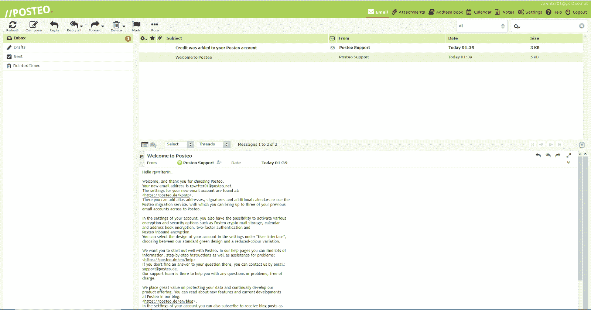

**主要特征**

*   位于德国的服务器
*   提供端到端加密
*   开放源码
*   加密主题、标题、正文、元数据和附件
*   支持 POP、 [SMTP](https://kinsta.com/blog/free-smtp-server/) 和 IMAP 协议
*   允许匿名现金支付
*   没有免费计划

**定价**

*   2 GB 存储每月 1 欧元
*   额外存储:0.25 欧元/GB/月
*   其他可用的附加组件

### 7.xyz

xyz 是一家不太知名的安全电子邮件提供商。它没有内置的端到端加密，但你可以通过一个名为 Mailvelope 的浏览器插件使用 OpenPGP 端到端加密。你的电子邮件也受到 T2 垃圾邮件过滤器和防火墙的保护。

xyz 是加拿大公司，它的很多服务器都位于美国——如果你想从政府机构那里获得隐私，这并不是最好的选择。

迁移服务将帮助您从 [Office 365](https://kinsta.com/knowledgebase/office-365-smtp/) 、Gmail 和其他电子邮件提供商处迁移您的电子邮件、日历和联系人。

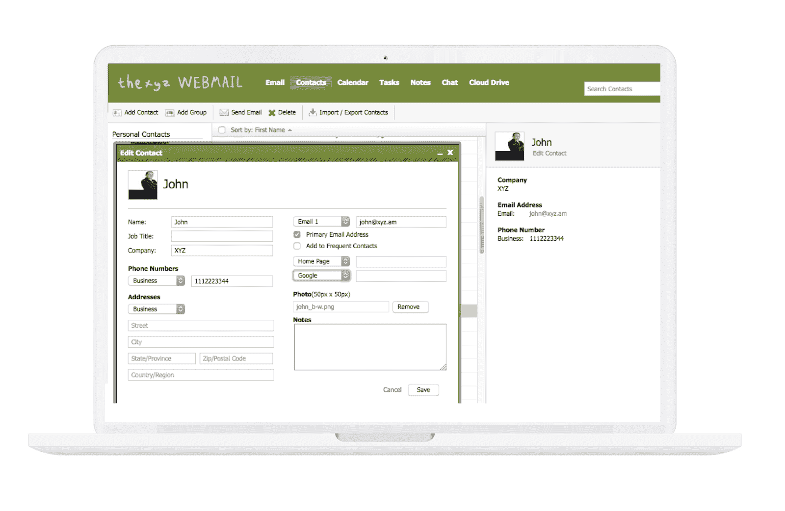

Thexyz

**主要特征**

*   服务器主要位于美国，少数位于欧洲
*   IMAP、POP 和 OpenPGP 支持
*   双因素认证
*   日历
*   垃圾邮件过滤器
*   [SSL 加密](https://kinsta.com/blog/types-of-ssl-certificates/)
*   删除的电子邮件恢复
*   移动应用

*   没有免费计划

**定价**

*   高级网络邮件:每月 2.95 美元，25 GB 存储空间
*   可用的附加组件

### 8.私人邮件

PrivateMail 提供端到端 OpenPGP 加密和其他安全功能，如自毁电子邮件。

所有的 Kinsta 托管计划都包括来自我们资深 WordPress 开发者和工程师的 24/7 支持。与支持我们财富 500 强客户的同一个团队聊天。查看我们的计划！

PrivateMail 在其云存储中有别于其他安全电子邮件服务。由于 AES 256 加密，您的数据在云中[是安全的。下载文件时，您可以在本地解密或保持加密状态。](https://kinsta.com/blog/cloud-security/)

PrivateMail 还通过端到端加密提供安全的文件共享。

PrivateMail 的缺点是它的总部设在美国，而且比大多数其他选择都要贵。

PrivateMail。

**主要特征**

*   位于美国的服务器
*   端到端加密
*   安全云存储
*   自毁邮件
*   AES 256 文件加密
*   加密文件共享
*   没有免费计划

**定价**

*   标准计划:10 GB 电子邮件存储和 10 GB 云存储空间每月 8.95 美元
*   private mail Pro:20 GB 电子邮件存储和 20gb 云存储空间每月 15.95 美元

### 9.开始邮件

StartMail 是一种安全的电子邮件服务，由运营私人搜索引擎 Startpage 的同一批人管理。

Startmail 使用 PGP 加密，可以与其他 PGP 客户端一起工作。如果非 PGP 用户知道机密问题的答案，您可以向他们发送加密邮件。

虽然 Startmail 没有免费计划，但它提供 30 天的免费试用。

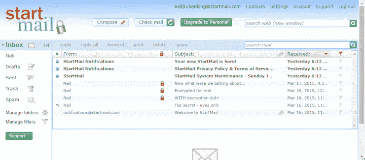

StartMail。

**主要特征**

*   位于荷兰的服务器
*   简易 PGP 加密
*   IMAP 和 SMTP 支持
*   模糊 IP 地址和主机名
*   可以使用您的域名
*   没有免费计划

**定价**

*   个人账户:35.99 美元/年
*   企业账户:59.95 美元/年

### 10.Hushmail

Hushmail 是历史最悠久的安全电子邮件提供商之一，以简单易用著称。它使用 OpenPGP 加密。

由于专注于 HIPAA 合规性，Hushmail 在医疗保健行业很受欢迎。Hushmail for Healthcare 计划允许您加密包含个人健康信息的电子邮件。为了帮助审计，它创建了一个单独的存档帐户，跟踪您的域中所有用户发送或接收的所有电子邮件。

也有个人使用、小企业和律师的计划。

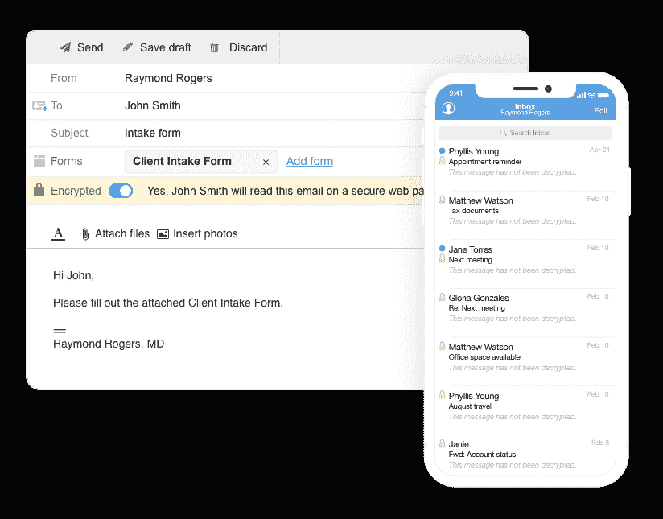

Hushmail 加密邮件。

**主要特征**

*   位于加拿大的服务器
*   PGP 加密
*   IMAP 和 POP 支持
*   双因素认证
*   垃圾邮件过滤器
*   安全 web 表单
*   电子签名
*   私人信息中心
*   移动应用程序
*   支持 HIPAA 合规性

**定价**

*   面向医疗保健的 Hushmail:每月 9.99 美元起
*   面向小型企业的 Hushmail:每月 5.99 美元起
*   Hushmail for Law:每月 9.99 美元起
*   个人使用的 hush mail:49.98 美元/年起

### 11.反邮件

[反邮件](https://countermail.com/)认真对待安全问题。

像这个列表中的许多提供商一样，CounterMail 使用 PGP 加密。它还通过 AES 和 RSA 算法增强了加密功能。您可以通过为双因素身份验证配置 USB 闪存盘来进一步保护您的数据。

基于瑞典的服务器是独一无二的，因为它们没有硬盘，而不是从光盘启动以获得额外的安全性。

保险箱是反邮件的密码管理器。保险箱中的所有用户名和密码都有一个主密码保护，如果您忘记了，就无法找回。

如果你已经认识使用反邮件的人，你可以得到十天的免费试用。

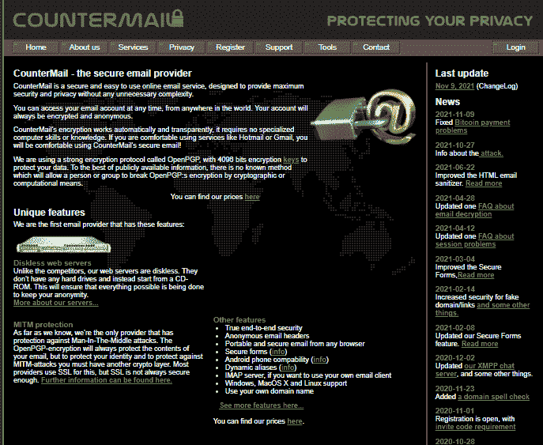

将信将疑。

**主要特征**

*   位于瑞典的无盘服务器
*   端到端加密
*   双因素认证
*   匿名[电子邮件标题](https://kinsta.com/blog/email-header/)
*   不保留 IP 日志
*   USB 密钥选项
*   IMAP 支持
*   密码管理器
*   没有免费计划

**定价**

*   29 美元/6 个月、49 美元/年或 79 美元/2 年
*   增加了 250 MB 的存储空间，起价 19 美元

### 12.邮件围栏

[Mailfence](https://mailfence.com/) 是一家安全的电子邮件提供商，提供端到端加密和双重认证。它有一个 500 MB 存储空间的免费计划。

Mailfence 使用 OpenPGP 加密并提供数字签名。它还有一个[密码管理器](https://kinsta.com/blog/password-managers/)。

这不是最安全的解决方案，但它提供了一套办公工具，如日历和消息。对于一直在使用 Gmail 或 Outlook 的用户来说，如果他们想要一个更安全、可用性水平相似的东西，Mailfence 是一个很好的选择。

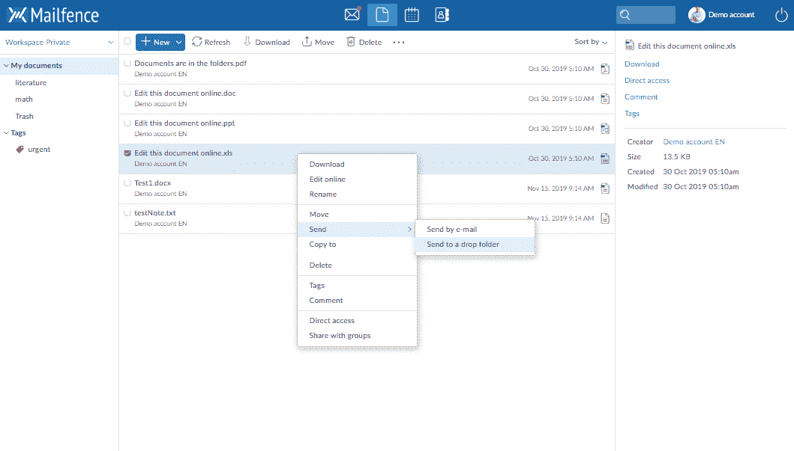

邮件栏。

**主要特征**

*   位于比利时的服务器
*   端到端加密
*   双因素认证
*   pop、IMAPS 和 SMTPS 支持
*   密码管理器
*   日历
*   信息发送
*   文档存储

**定价**

*   免费:500 MB 的邮件和 500 MB 的文件
*   入门:5 GB 电子邮件和 12 GB 文档每月 2.50 欧元
*   利:20 GB 的电子邮件和 24 GB 的文件每月 7.50 欧元
*   超:50 GB 电子邮件和 70 GB 文档每月 25 欧元

### 13.跑锋

Runbox 是一家总部位于挪威的电子邮件提供商。它使用 PGP 加密和双重认证来保护您的电子邮件。

您可以允许 IP 地址访问您的 Runbox 帐户，并查看最近成功和失败的登录尝试列表。

Runbox 致力于道德和环保，使用水力发电厂的可再生能源为其服务器供电。

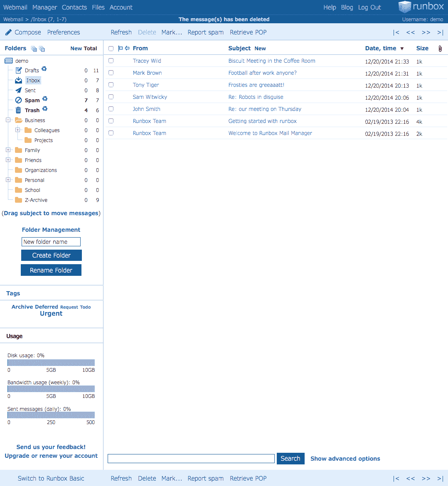

Runbox。

**主要特征**

*   位于挪威的服务器
*   双因素认证
*   IP 允许列表
*   病毒和垃圾邮件过滤器
*   POP、IMAP、SMTP 和 WAP 支持
*   没有免费计划

**定价**

*   微:2 GB 电子邮件存储和 200 MB 文件存储每年 19.95 美元
*   迷你:10 GB 的电子邮件存储和 1 GB 的文件存储，每年 34.95 美元
*   中等:25 GB 电子邮件存储和 2 GB 文件存储每年 49.95 美元
*   最高:50 GB 电子邮件存储和 5 GB 文件存储 79.95 美元/年

### 14.Kolab 现在

Kolab Now 提供安全的电子邮件和一系列工具，如日历、笔记和视频会议。

总部位于瑞士的 Kolab 现在提供端到端加密选项，并且符合 GDPR、HIPAA 和 PCI 标准。

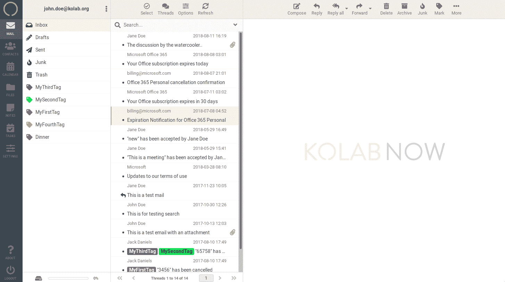

现在的科拉布。

**主要特征**

*   位于瑞士的服务器
*   端到端加密
*   开放源码
*   日历
*   笔记
*   联系人
*   电视会议

**定价**

*   **只需发邮件**:5.00 瑞士法郎/月
*   **全额 Kolab**:9.90 瑞士法郎/月

## 您企业的最佳安全电子邮件提供商

最适合您企业的安全电子邮件提供商取决于您的需求。这里有一些建议供您考虑:

*   对于最好的全方位安全电子邮件提供商，试试 **ProtonMail** 或 **Tutanota**
*   对于顶级免费安全电子邮件提供商，试试 **ProtonMail 的**免费计划
*   对于最安全的电子邮件提供商，试试**反邮件**
*   对于为企业提供协作功能的安全电子邮件提供商，请尝试使用 **Zoho Mail**

[Email is one of the easiest ways for hackers to get access to your company's data 🦹‍♀️ Make sure you're protected with help from this post 💪Click to Tweet](https://twitter.com/intent/tweet?url=https%3A%2F%2Fkinsta.com%2Fblog%2Fsecure-email-providers%2F&via=kinsta&text=Email+is+one+of+the+easiest+ways+for+hackers+to+get+access+to+your+company%27s+data+%F0%9F%A6%B9%E2%80%8D%E2%99%80%EF%B8%8F+Make+sure+you%27re+protected+with+help+from+this+post+%F0%9F%92%AA&hashtags=SiteSecurity%2CEmailTips)

## 摘要

电子邮件对于商务交流是必不可少的，但它也有缺陷。如果你通过电子邮件发送任何类型的私人信息，考虑放弃你目前的提供商，选择一个更安全的选择。

*想了解更多关于企业电子邮件战略的信息吗？看看这些[电子邮件营销软件推荐](https://kinsta.com/blog/email-marketing-software/)和[电子邮件营销技巧](https://kinsta.com/blog/email-marketing-tips/)。*

* * *

让你所有的[应用程序](https://kinsta.com/application-hosting/)、[数据库](https://kinsta.com/database-hosting/)和 [WordPress 网站](https://kinsta.com/wordpress-hosting/)在线并在一个屋檐下。我们功能丰富的高性能云平台包括:

*   在 MyKinsta 仪表盘中轻松设置和管理
*   24/7 专家支持
*   最好的谷歌云平台硬件和网络，由 Kubernetes 提供最大的可扩展性
*   面向速度和安全性的企业级 Cloudflare 集成
*   全球受众覆盖全球多达 35 个数据中心和 275 多个 pop

在第一个月使用托管的[应用程序或托管](https://kinsta.com/application-hosting/)的[数据库，您可以享受 20 美元的优惠，亲自测试一下。探索我们的](https://kinsta.com/database-hosting/)[计划](https://kinsta.com/plans/)或[与销售人员交谈](https://kinsta.com/contact-us/)以找到最适合您的方式。