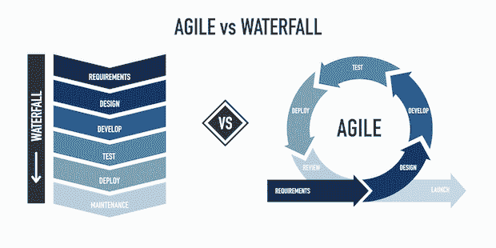
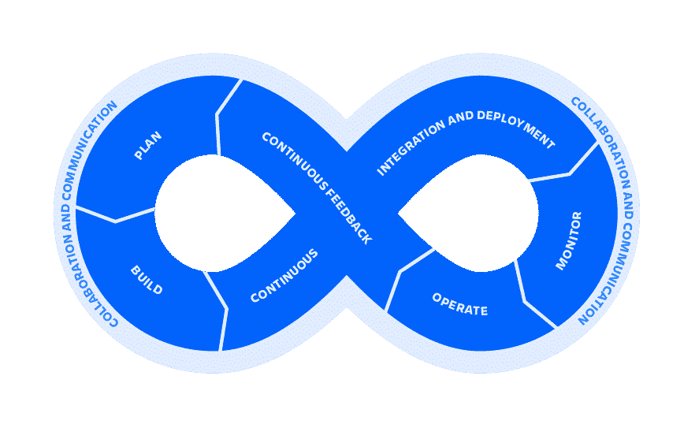
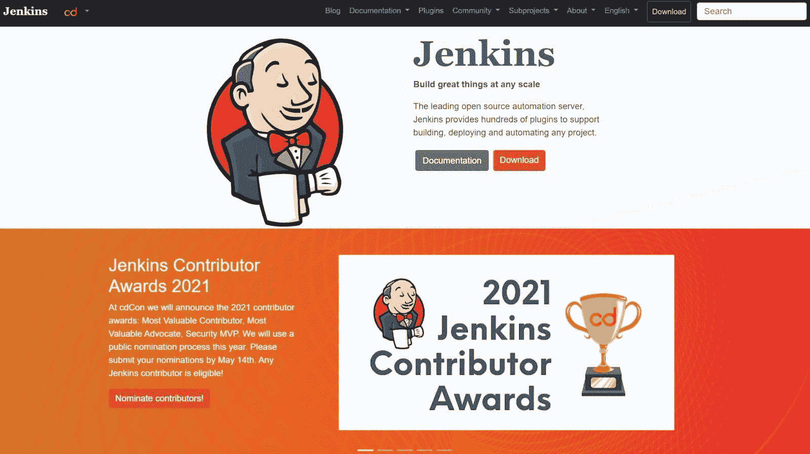
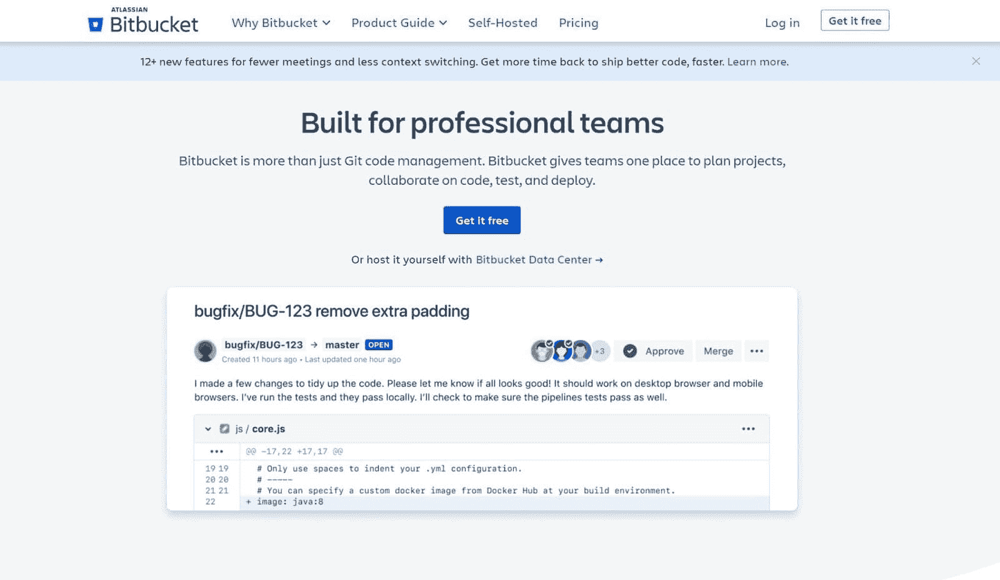
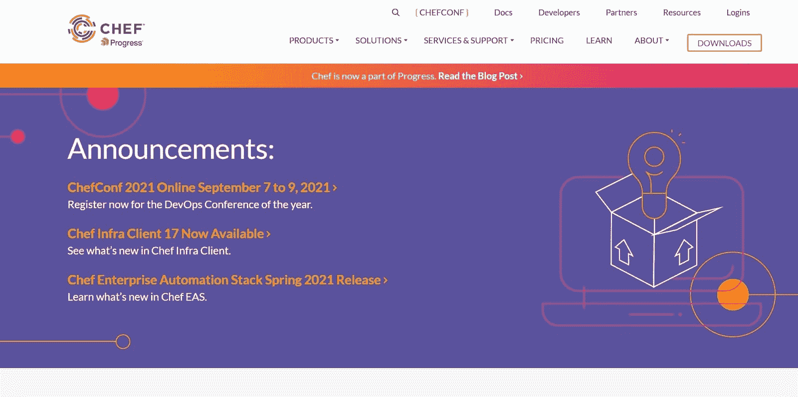
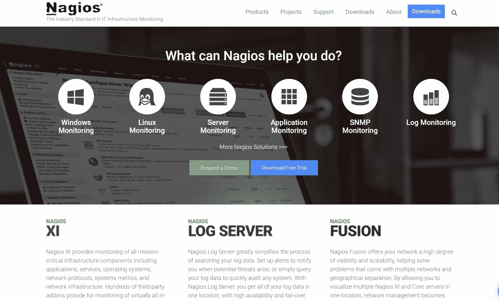
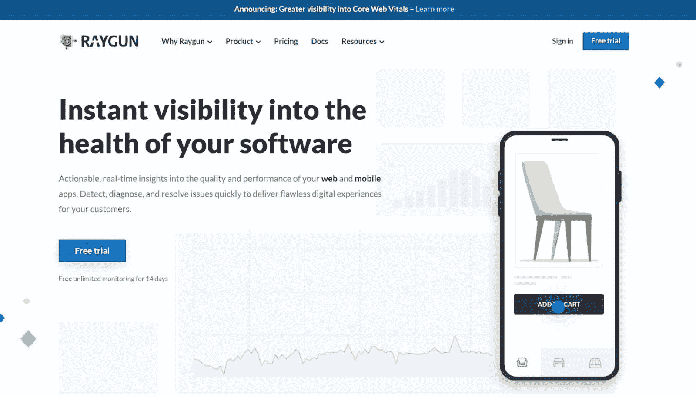
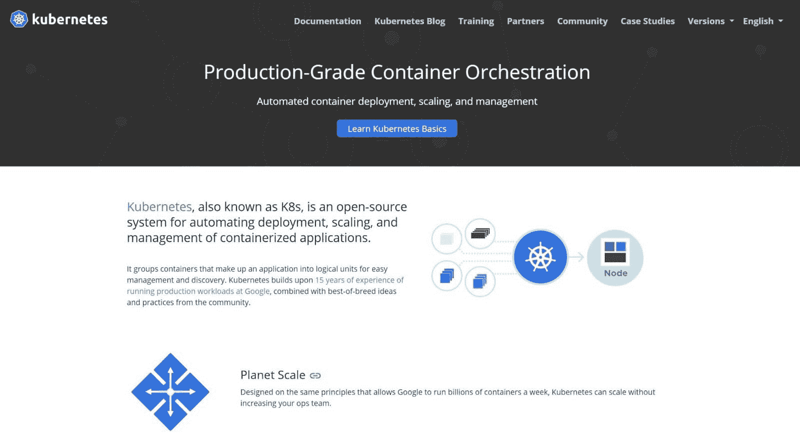
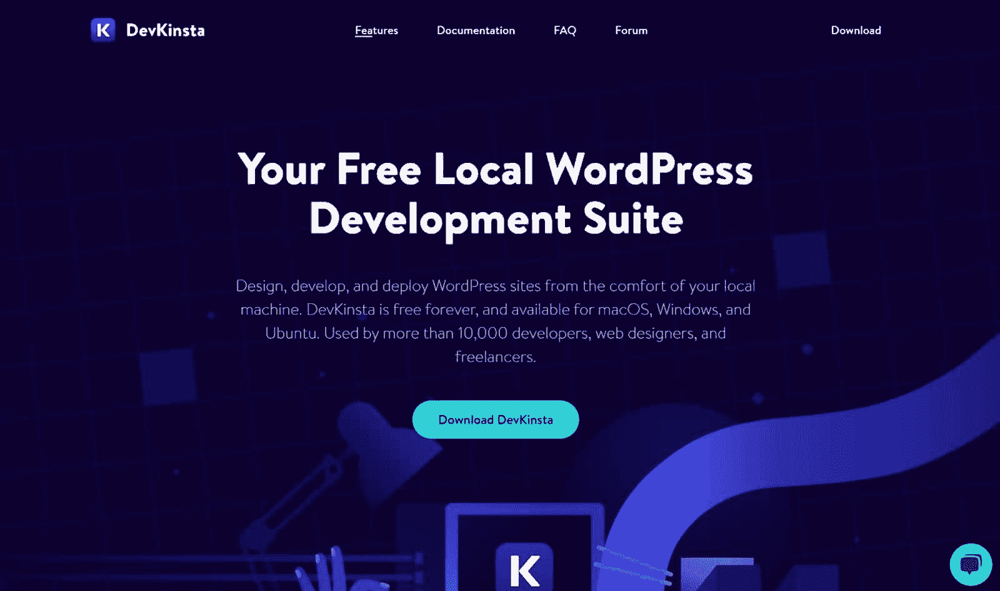

# 成为 DevOps 工程师所需的一切

> 原文：<https://kinsta.com/blog/devops-engineer/>

20 年前,“DevOps 工程师”这个词还闻所未闻。

如今，DevOps 工程师是将 IT 部门团结在一起的粘合剂，使他们能够更快、更高效地交付项目。

这种增长体现在金钱上。虽然 2019 年 DevOps 市场的价值仅为 40 亿美元，但预计到 2026 年将增长到 170 亿美元。自然，全球对 DevOps 工程师的需求正在快速增长。

如果你曾经想知道 DevOps 工程师是做什么的，这篇文章就是为你准备的。

请继续阅读，您将了解成为 DevOps 工程师所需的一切，包括您需要的技能、您作为 DevOps 工程师的职责以及您在新职位上的期望收入。

让我们开始吧！

T3】

## DevOps 是什么？

DevOps 是管理软件开发和 IT 项目的实践、工具和方法的集合。

术语“DevOps”来自单词“开发”和“操作”。Patrick Debois 最初被任命为 2009 年大会 DevOps 日的 DevOps。在 DevOps 日，Debois 展示了 DevOps 作为一种替代方法，通过精心管理和持续交付，帮助开发人员更快地交付项目。

> Kinsta 把我宠坏了，所以我现在要求每个供应商都提供这样的服务。我们还试图通过我们的 SaaS 工具支持达到这一水平。
> 
> <footer class="wp-block-kinsta-client-quote__footer">
> 
> 
> 
> <cite class="wp-block-kinsta-client-quote__cite">Suganthan Mohanadasan from @Suganthanmn</cite></footer>

[View plans](https://kinsta.com/plans/)

会议之后，DevOps 开始在世界范围内越来越受欢迎。2013 年，DevOps 出现在“[凤凰计划](https://itrevolution.com/the-phoenix-project/)”中(由乔治·斯帕福德、凯文·贝尔和吉恩·金编剧)。IT 经理 Bill 在书中使用 DevOps 在 90 天内完成了一个重大项目。

[20 年前，“DevOps 工程师”这个词还闻所未闻。如今，它们是将 IT 部门凝聚在一起的粘合剂。🚀在这里了解更多关于这个职业机会的信息👨‍💻 点击推文](https://twitter.com/intent/tweet?url=https%3A%2F%2Fkinsta.com%2Fblog%2Fdevops-engineer%2F&via=kinsta&text=20+years+ago%2C+the+term+%27DevOps+engineer%27+was+unheard+of.+Today%2C+they%27re+the+glue+that+keeps+IT+departments+together.+%F0%9F%9A%80Learn+more+about+this+career+opportunity+here+%F0%9F%91%A8%E2%80%8D%F0%9F%92%BB&hashtags=WebDev%2CDevOps)

## 什么是 DevOps 工程师？

DevOps 工程师是一名 IT 专业人员，他与软件开发人员、IT 运营人员、系统用户和管理人员合作，优化新更新和程序的推出。

DevOps 工程师本质上是其 IT 部门的骨干——快速创建集成的、用户友好的系统。

### 雇佣 DevOps 工程师的好处

尽可能雇佣 DevOps 专家有很多好处:

*   帮助企业更好地集成其 IT 系统，使其更加用户友好
*   通过简化开发过程，帮助开发人员更快地发布系统项目
*   实现 [DevOps 工具](https://kinsta.com/blog/devops-tools/)帮助开发人员提高工作质量
*   自动化重复的内部流程
*   帮助设计网络安全系统
*   实施 DevOps 实践，如持续集成/持续交付(CI/CD)

来自 Atlassian 的 [2020 DevOps 趋势](https://www.atlassian.com/whitepapers/devops-survey-2020)报告的研究还显示:

*   61%实施了 DevOps 的受访企业认为它有助于产生“更高质量的可交付成果”
*   49%实施开发运维的受访公司认为 it 提高了部署频率
*   99%的受访公司认为开发运维“对他们的组织产生了积极影响”

## DevOps 工程师是做什么的？

要理解 DevOps 工程师的工作，您需要理解系统开发生命周期(SDLC)。

**SDLC 包括六个开发阶段，包括:**

1.  **计划**:当开发人员概述项目的范围和需求时
2.  **分析:**当开发人员研究和分析需求以将其实现到系统中时
3.  **设计:**当开发人员设计项目的架构时
4.  **实现**:开发人员构建系统时
5.  **测试:**开发人员[测试系统代码](https://kinsta.com/help/website-testing-tools/)并解决错误
6.  **部署和维护**:开发人员发布系统并进行维护以保持系统平稳运行

SDLC 有几种方法，包括瀑布和敏捷方法。在瀑布方法中，人们从计划到部署和维护依次完成 SDLC。在敏捷方法中，人们通过 SDLC 不断地工作。

瀑布和敏捷方法看起来像这样:

瀑布和敏捷方法到 SDLC ( **来源:** [易捷](//www.easyagile.com/blog/agile-software-development-life-cycle/%E2%80%9D) )

DevOps 部分建立在敏捷开发方法的基础上。具体来说，DevOps 工程师实现了 SDLC 的一个版本，称为 DevOps 生命周期。与敏捷方法一样，DevOps 生命周期循环往复，不断重复这些阶段:

*   规划
*   连续反馈
*   操作
*   持续集成和持续部署
*   建筑物

DevOps 的生命周期如下所示:

DevOps 生命周期(**来源:** [亚特兰蒂斯](//www.atlassian.com/devops/what-is-devops%E2%80%9D) )

DevOps 工程师还遵循持续集成和持续交付(CI/CD)原则。

持续集成是将代码变更不断添加到代码库中的实践(本质上是在编写代码时编译代码)。持续交付是自动地、一致地为部署准备代码变更的实践(持续地向用户推送新特性、错误修复和更新，而不是在一次大的更新中)。

### DevOps 工程师的职责是什么？

每个 DevOps 工程师的日常工作都是不同的，因为每个开发人员都为采用不同 DevOps 方法的公司从事独特的项目。然而，大多数 DevOps 工程师都有一些关键职责。其中包括:

#### 项目管理

DevOps 工程师经常同时监督和管理多个 IT 项目。在实践中，这意味着他们安排和运行会议，设置截止日期，检查团队成员，委派工作，评估工作，指导队友，并对项目决策提出建议。

在设计系统时，DevOps 工程师还与用户、管理人员和开发人员保持联系。

#### 管理系统安全

DevOps 工程师通过设计网络安全系统、更新和实践来优化企业 IT 基础设施的安全性。虽然所有的 DevOps 工程师都在日常工作中考虑安全性，但一些 DevOps 工程师(称为 SecDevOps 工程师)全职关注系统安全性。

#### 改善 IT 基础设施

DevOps 工程师寻找 IT 基础设施中的弱点，并努力改进它们。具体来说，他们创建解决方案来帮助开发人员更快地工作，发现程序缺陷，或者根据用户反馈设计更新。

随着 DevOps 工程师专注于 CI/CD 方法，他们不断地对 IT 基础设施进行小的改进。

#### 自动化重复性任务

DevOps 工程师减少了将新系统或更新投入使用所需的重复性任务。例如，DevOps 工程师可能会设计一个软件插件来帮助开发人员更快地编写代码并减少错误。

值得注意的是，DevOps 工程师并没有试图让开发人员自动失业。他们只是通过实现更简单、更快速的开发解决方案来提高开发人员的效率。

#### 性能基准和测试

DevOps 工程师通过[基准测试](https://kinsta.com/blog/wordpress-performance-benchmarks/)跟踪 IT 基础设施的日常运行。基准测试帮助他们识别系统中效率低下的区域，并在潜在问题出现之前减轻它们。

每个 DevOps 工程师使用的基准测试是组织和项目相关的，尽管他们通常使用遵循[七个基准测试原则](https://dberleant.github.io/papers/BenchmarkingContemporaryDeepLearningHardwareAndFrameworks.pdf)的测试。

1.  关联
2.  代表性
3.  股权
4.  可重复性
5.  成本效益
6.  可量测性
7.  透明度

#### 优化发布周期

DevOps 工程师通过减少项目或更新所需的时间和资源来优化系统发布周期。DevOps 工程师有许多方法来改进发布周期，包括消除时间消耗，对每个发布的关键组件进行优先级排序，或者引入新的软件和工具。

#### 监控和报告错误

最后，DevOps 工程师不断跟踪软件和系统，以帮助快速解决系统错误。DevOps 工程师特别关注缩短检测到错误(即检测或 TTD 时间)和修复错误(即最小化或 TTM 时间)之间的时间长度。虽然一些 DevOps 工程师手动解决系统错误，但其他人将此留给了[全栈开发人员](https://kinsta.com/blog/full-stack-developers-salary/)。

### 成为 DevOps 工程师需要具备哪些技能？

由于 DevOps 工程师在工作中有不同的职责，你需要许多不同的技能才能成为一名工程师。本节将概述其中一些关键技能。

#### 使用自动化工具的经验

首先，你需要知道如何使用自动化工具。自动化工具允许你将重复的功能外包给自动化程序。其中两个自动化程序包括:

##### 亚特兰蒂斯竹子

[Atlassian Bamboo](https://www.atlassian.com/software/bamboo) 是一个集成和 CI 工具，允许开发人员自动化构建和部署过程。它是一个开源程序，可以与所有编程语言一起工作，提供预构建、代码测试、报告工具和部署工具。这个工具还集成了其他程序，如吉拉、[、比特桶](https://kinsta.com/blog/bitbucket-vs-github/)和 Git(等等)。Atlassian 有免费和付费两种版本，具体取决于您的团队规模和需求。

亚特兰蒂斯竹

##### 詹金斯

Jenkins 是一个免费的自动化服务器，可以帮助开发者通过插件自动构建系统。Jenkins 提供了超过 1，800 个社区贡献的插件，并且是开源的(所以你可以开发和使用你的定制插件)。Jenkins 还集成了像 Git 这样的工具。

#### 有版本控制系统的经验

作为一名 DevOps 工程师，你还需要熟悉版本控制系统(VCS)。这些工具帮助开发人员和 DevOps 工程师跟踪他们的源代码库的更新。当多人同时添加代码时，它们也能解决冲突。

如果你有软件开发背景，你应该已经知道如何使用流行的 VCS 工具，比如 [Git](https://kinsta.com/help/git/) 。Git 是一个免费的开源工具，集成了像 GitHub 和 BitBucket 这样的存储库托管工具。

t1

去

去

#### 使用存储库托管工具的经验

作为开发团队的一员，你将知道如何作为一名 DevOps 工程师使用存储库托管工具。顾名思义，存储库托管工具在云中安全地托管代码。这些工具还让开发人员能够访问预先编写的代码，从而加快软件开发过程。

作为一名 DevOps 工程师，你需要熟悉三个关键的托管工具。其中包括:

##### 开源代码库

GitHub 是一种基于云的托管服务，由 6500 多万开发人员、300 多万组织和 72%的世界财富 500 强公司使用。GitHub 从 2008 年就开始了，提供免费和付费版本。微软目前拥有 [GitHub](https://kinsta.com/knowledgebase/what-is-github/) 。

## 注册订阅时事通讯

### 想知道我们是怎么让流量增长超过 1000%的吗？

加入 20，000 多名获得我们每周时事通讯和内部消息的人的行列吧！

[Subscribe Now](#newsletter)

GitHub

##### GitLab

GitLab 是 GitHub 的替代产品，具有 DevOps 特性，如持续集成、安全性和项目管理工具。GitLab 提供免费和付费计划，并与 Git 集成。尽管名字相似，但 GitLab 和 GitHub 之间并没有隶属关系。

##### 亚特兰蒂斯比特桶

BitBucket 是专门为开发团队设计的托管服务。它集成了 Git 和项目管理工具，如吉拉和特雷罗。如果你有五个或更少的用户，你可以通过它的免费计划使用 BitBucket。

比特斗

#### 使用配置管理工具的经验

作为一名 DevOps 工程师，您还需要熟悉配置管理工具。这些工具帮助 IT 专业人员一致地配置不同的系统或网络元素。它们还帮助开发人员减少部署新系统的时间。

DevOps 工程师使用两种流行的配置管理工具。其中包括:

##### 木偶

Puppet 早于 DevOps，因为 Puppet Labs Limited 在 2005 年首次发布了它。尽管年代久远，Puppet 仍然是当今最好的配置管理工具之一，因为它允许开发人员为他们的系统设置期望的状态。然后，Puppet 会自动将系统配置到该状态。

##### 厨师

Chef 是另一个开源的配置管理工具。Chef 是围绕“Chef 服务器”构建的，该服务器充当其运营中心。Chef 服务器监督和管理网络上的 Chef 工作站和 Chef 节点。像 Puppet 一样，Chef 允许开发人员以“食谱”的形式为他们的系统设置期望的状态。脸书、IBM 和乐天都用 Chef。

厨师

#### 使用监控软件的经验

由于监控是 DevOps 工程师工作的重要组成部分，DevOps 工程师需要熟悉监控软件。监控软件允许您监视基础架构的任何潜在问题。

虽然每个组织都有自己的监控方法，但您可以使用以下监控工具:

##### 纳吉奥斯

Nagios 是 2002 年发布的较老的开源 DevOps 工具。Nagios 在后台监视您的基础设施，如果怀疑有问题，就会向您发出警报。目前有 9，000 多个客户使用 Nagios 进行服务器和应用程序监控。

Nagios

##### 射线枪

Raygun 是一款针对网络和移动应用的实时监控服务。Raygun 跟踪部署、客户体验、错误和崩溃，以及用户如何与系统交互。像可口可乐、塔吉特、微软、安飞士等品牌都使用 Raygun。

雷枪

#### 编码技巧

由于 DevOps 工程师是开发过程中至关重要的一部分，您需要熟悉一些最常见的脚本和编程语言，才能在您的角色中取得成功。

所有的 Kinsta 托管计划都包括来自我们资深 WordPress 开发者和工程师的 24/7 支持。与支持我们财富 500 强客户的同一个团队聊天。查看我们的计划！

脚本语言是一种编程语言，在运行后会被翻译成机器代码。有两种类型的脚本语言:服务器端和客户端。一些最流行的客户端脚本语言包括 HTML、CSS 和 Javascript。一些最流行的服务器端脚本语言包括 PHP、Node.js、ASP.NET、Ruby、Perl、Python 和 Java。

一种[编程语言](https://kinsta.com/blog/best-programming-language-to-learn/)使用编译器将代码转换成机器代码。最流行的两种编程语言是 C++和 C。

#### 集装箱工具方面的专业知识

许多组织中的 DevOps 工程师使用容器化工具。容器化工具帮助开发人员将代码打包并部署到小型容器中。使用容器化部署代码允许系统在不同环境之间更快更有效地运行。

要成为一名成功的 DevOps 工程师，您应该学习容器化工具的基础知识，例如:

##### 码头工人

Docker 是一个平台即服务工具，允许开发人员通过容器构建、打包和部署代码。Docker 集成了 GitHub 和 powers [DevKinsta](https://kinsta.com/devkinsta/) 。

##### 库伯内特斯

Kubernetes(也称为“K8s”)是一个使用容器化进行部署和管理的开源系统。Kubernetes 提供自动部署、配置管理、自动化容器打包、批处理执行和负载平衡(以及其他功能)。

#### 有项目管理工具的经验

由于 DevOps 工程师管理和监督开发项目，在成为 DevOps 工程师之前，您需要了解项目开发工具。项目管理工具帮助人们使用甘特图、清单和基于卡片的归档系统来跟踪项目。

DevOps 的三个最受欢迎的项目管理工具包括:

*   Trello: Trello 是一个基于董事会的项目管理工具。使用 Trello，您可以创建包含一系列列表的公告板。然后，你在这些列表之间移动卡片。Trello 是一个协作工具，这意味着多人可以编辑每个板。人们经常[把特雷罗比作 Asana](https://kinsta.com/blog/trello-vs-asana/) 。

*   阿特拉斯·吉拉:吉拉是一个项目管理工具，专门为使用敏捷或开发运维方法的 IT 团队设计。吉拉允许你用项目所需的卡片和纸板来跟踪每一项任务。吉拉也是一个协作工具，可以同时托管多个用户。

*   **Atlassian Confluence:**Atlassian Confluence 是一个工作空间工具，允许小团队通过日历或时间线共享工作和管理项目。一些团队一起使用吉拉和合流。

#### 公共云服务体验

由于 DevOps 工程师经常参与基于云的项目，因此您需要熟悉基于云的服务，以便在新的岗位上取得成功。公共云服务是允许组织共享网络、存储和硬件的计算服务。当组织使用公共云服务时，他们通过互联网访问其基础架构。

三种最受欢迎的公共云服务包括:

*   Microsoft Azure
*   [谷歌云](https://kinsta.com/blog/google-cloud-network/)
*   亚马逊网络服务(AWS)

#### 面向客户的技能

由于 DevOps 开发人员需要与系统用户一起工作，你需要很强的客户服务技能才能在 DevOps 中取得成功。具体来说，你需要出色的积极倾听技巧、良好的沟通技巧、解决冲突的技巧，以及理解用户需求的诀窍。

#### 协作管理技能

由于 DevOps 工程师经常在小团队中工作，你需要很强的团队合作技能。具体来说，你需要擅长给出建设性的反馈，接受反馈，在小组中集思广益，朝着共同的目标努力。

#### WordPress 开发技巧

由于 WordPress 驱动了 40%的网站，你可能需要很强的 WordPress 开发技能来成为 T2 WordPress devo PS 团队的一员。具体来说，你需要学习 WordPress 是如何工作的，并使用像 DevKinsta 这样的托管工具。

DevKinsta 是一个免费的开发工具，人们用来创建、开发和测试 WordPress 网站。DevKinsta 提供数据库管理、内置电子邮件测试、WordPress 错误日志和简单部署。目前有超过 10，000 名专业人员在使用 DevKinsta。

德夫金斯塔

### DevOps 工程师工资

虽然 DevOps 工程仍在发展，但大多数 DevOps 工程师的薪水都很丰厚。

截至 2021 年 6 月 28 日，美国平均 [DevOps 工程师工资](https://kinsta.com/blog/devops-engineer-salary/)为[118872](https://www.salary.com/research/salary/listing/devops-engineer-salary)美元。这意味着大多数全职 DevOps 工程师的收入在 107023 美元到 132217 美元之间。这个范围的变化是由于教育、专业经验、技能、责任、地点和公司的原因。如果你的雇主支付你加班费、奖金或福利，你的工资可能在这个范围之外。

由于 DevOps 仍然是新的，值得注意的是[平均 DevOps 工资](https://kinsta.com/blog/devops-engineer-salary/)在一些网站上是不同的。例如，Indeed 报告称，DevOps 在美国的平均薪资为【2021，035 美元(截至 2021 年 7 月 13 日)。

## 招聘 DevOps 工程师时需要注意什么

到目前为止，这篇文章主要关注那些想成为 DevOps 工程师的人。但是雇主呢？如果你打算雇佣一名 DevOps 工程师，一些基本的技能和属性会让优秀的 DevOps 工程师脱颖而出。

其中包括以下内容。

### 硬技能

*   脚本和编程语言知识
*   理解敏捷方法和 SDLC
*   理解集装箱化和自动化等概念
*   网络安全专业知识
*   具有版本控制系统、存储库托管工具、配置管理工具、容器化工具和自动化工具的经验
*   有监控、规划和设计开发项目的经验

如果一个潜在的开发人员拥有使用以下工具的经验，他们也可能拥有成为一名出色的 DevOps 工程师的技能:

*   竹子
*   詹金斯
*   饭桶
*   开源代码库
*   BitBucket
*   木偶
*   厨师
*   纳吉奥斯
*   射线枪
*   码头工人
*   德夫金斯塔
*   库伯内特斯
*   特雷罗
*   亚特兰蒂斯吉拉
*   亚特兰蒂斯汇流

### 软技能

*   管理项目的经验，包括主持会议、设定截止日期和委派工作
*   优秀的团队合作和协作技能
*   良好的创造性解决问题的技能
*   接受反馈并相应调整工作的能力
*   出色的积极倾听技巧
*   在用户和不同团队中工作的经验，在这些团队中，人们拥有完全不同的技能集

### 适合 DevOps 工作的背景

由于 DevOps 是一个新领域，许多 DevOps 工程师从其他角色过渡到 DevOps。如果你考虑的人有软件开发、硬件管理、一般 IT 管理或系统管理的背景，他们将拥有适合 DevOps 工程工作的可转移技能。

如果候选人拥有以下领域的学士学位或更高学位，他们也可能成为一名出色的 DevOps 工程师:

*   计算机科学
*   信息技术
*   信息系统
*   [软件工程](https://kinsta.com/software-engineering-statistics/)
*   系统工程

[想成为 DevOps 工程师？👨‍💻继续读...👀](https://twitter.com/intent/tweet?url=https%3A%2F%2Fkinsta.com%2Fblog%2Fdevops-engineer%2F&via=kinsta&text=Want+to+become+a+DevOps+engineer%3F+%F0%9F%91%A8%E2%80%8D%F0%9F%92%BB+Read+on...+%F0%9F%91%80&hashtags=WebDev%2CDevOps)

## 摘要

虽然 DevOps 仍在开发中，但 DevOps 工程师在拥有大量(但关键)IT 系统的企业中变得越来越重要。

一个成功的 DevOps 工程师是物有所值的，因为他们可以监督 IT 项目，优化其他团队的表现，并加快开发生命周期。

假设你想成为一名优秀的 DevOps 专业人士。在这种情况下，您应该构建您的 DevOps 知识，并熟悉流行的公共云服务、虚拟化技术、项目管理工具、配置管理工具、自动化工具和编码相关工具。你还需要发展强大的协作、倾听和项目管理技能。

你认为 DevOps 方法怎么样？请在下面的评论中告诉我们。

* * *

让你所有的[应用程序](https://kinsta.com/application-hosting/)、[数据库](https://kinsta.com/database-hosting/)和 [WordPress 网站](https://kinsta.com/wordpress-hosting/)在线并在一个屋檐下。我们功能丰富的高性能云平台包括:

*   在 MyKinsta 仪表盘中轻松设置和管理
*   24/7 专家支持
*   最好的谷歌云平台硬件和网络，由 Kubernetes 提供最大的可扩展性
*   面向速度和安全性的企业级 Cloudflare 集成
*   全球受众覆盖全球多达 35 个数据中心和 275 多个 pop

在第一个月使用托管的[应用程序或托管](https://kinsta.com/application-hosting/)的[数据库，您可以享受 20 美元的优惠，亲自测试一下。探索我们的](https://kinsta.com/database-hosting/)[计划](https://kinsta.com/plans/)或[与销售人员交谈](https://kinsta.com/contact-us/)以找到最适合您的方式。