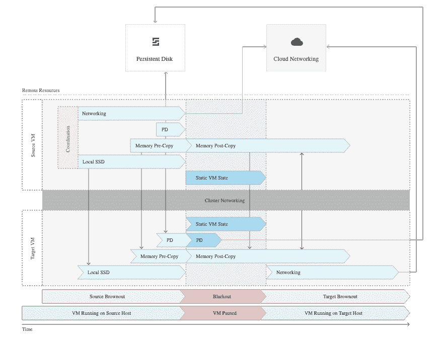
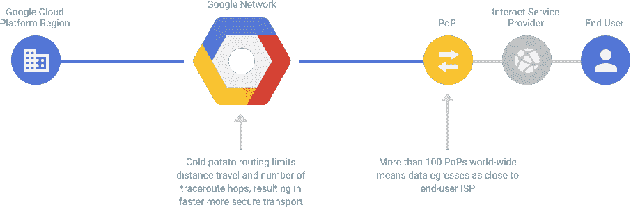
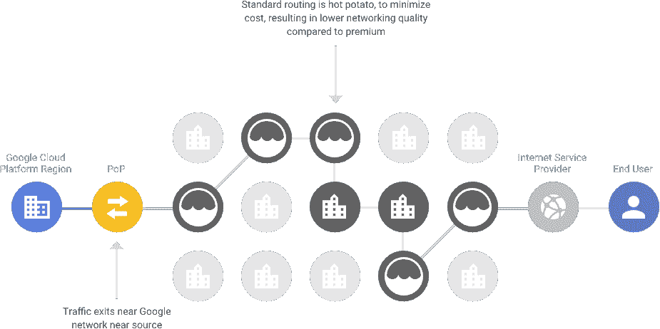
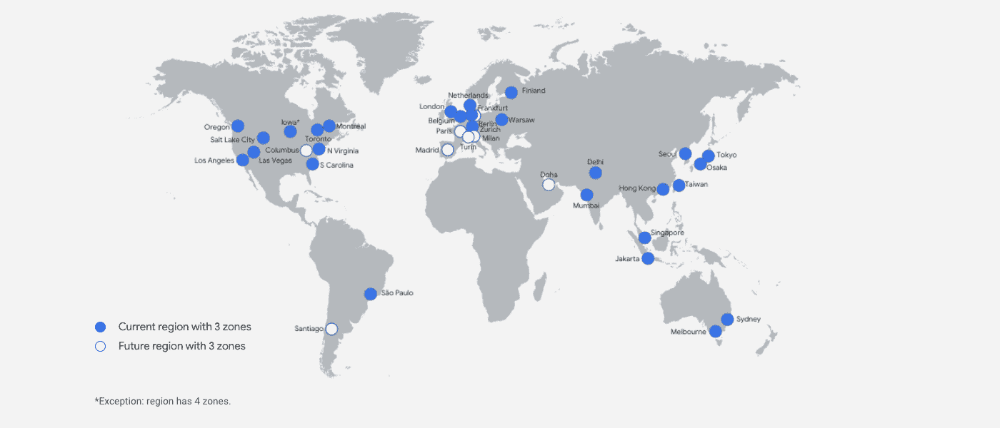
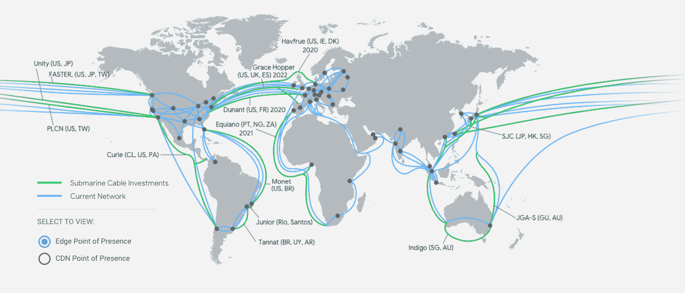

# 选择谷歌云托管的十大优势(2022)

> 原文：<https://kinsta.com/blog/google-cloud-hosting/>

如果你想要一个商业网站，选择一个虚拟主机应该是你的首要任务。你对主机提供商的选择将直接影响你网站的质量和成功。

虚拟主机提供商不仅向访问者提供网站文件。它控制着您网站的工作方式、加载速度、停机期间的可用性及其安全性，所有这些都直接影响到您客户的用户体验和您网站作为销售工具的成功。

你明白了——拥有一个优秀的虚拟主机是至关重要的！

近年来，谷歌的云托管解决方案已经崭露头角，并成为数百万客户的领先服务。如果你正在考虑选择谷歌，我们已经汇编了选择谷歌云托管的主要优势，以帮助你做出决定——包括为什么我们认为它是目前市场上最好的解决方案。

## 1.出色的可用性和正常运行时间

网站成功的一个基本因素是它的可用性。你可以拥有市场上最好的内容或产品，但是如果访问者不能访问你的网站，这些都没用。

你最不需要的就是因为[网站宕机](https://kinsta.com/blog/website-downtime/)而失去访客和收入。这是潜在的追随者和客户最有可能找到你的竞争对手的时候。

定期的网站宕机不仅会影响你的底线，还会对你的搜索引擎排名产生负面影响。Google 和 Bing 蜘蛛会定期访问您的网站，抓取您的网站，检查内容、页面速度和可用性。频繁或长时间的停机会影响您的 [SEO(搜索引擎优化)](https://kinsta.com/blog/what-does-seo-stand-for/)。

你的主机提供商对你的网站正常运行时间有直接的影响。你自己很难增加正常运行时间。除了避免代码中的错误，你完全依赖于你的主机提供商。

### 实现 99.99%的正常运行时间

选择谷歌云托管解决方案的一个巨大优势是他们承诺实现 99.99%以上的正常运行时间。这反映在他们的计算引擎服务水平协议(SLA)中，其中任何低于每月正常运行时间 99.99%的下降都将导致财务积分。

在 Kinsta，[将我们的基础设施迁移到谷歌云平台(GCP)](https://kinsta.com/google-cloud-wordpress/) 让我们可以坐在巨人的肩膀上。我们获得了对世界上最大网络之一的访问权，该网络可以抵御无数次系统和服务器故障的故障转移。然后，我们将这些优势直接传递给我们的客户，提供[高级托管](https://kinsta.com/features/)解决方案，其中[每月正常运行时间接近 100%](https://status.kinsta.com/) 。

其他领先的云提供商，包括[亚马逊网络服务(AWS)](https://kinsta.com/aws-market-share/) 和[微软 Azure](https://kinsta.com/azure-market-share/) ，拥有可与谷歌云的正常运行时间可用性相媲美的基础设施。然而，经过大量的研究之后，似乎还没有一个权威的或有声望的研究能为最可靠的云平台加冕(到目前为止)。

## 2.虚拟机的实时迁移

谷歌云托管的另一个巨大优势是虚拟机(VM)的实时迁移，尤其是在 Kinsta。这使我们作为托管提供商能够在主机之间实时迁移虚拟机时，保持您网站的可用性，而不会明显降低性能。

修补、修复和更新软件和硬件是交付尖端服务的必备条件。使用 Google 进行实时迁移可以在以下情况下保持实例和网站可用:

*   定期基础设施和维护升级
*   数据中心的网络和电网维护
*   硬件故障，包括 CPU、内存、磁盘、网络接口、电源等(尽管这并不总是可能的；在硬件阻止实时迁移或出现故障的情况下，虚拟机将会崩溃并自动重启)
*   主机操作系统(OS)和 BIOS 升级
*   高度重要的安全相关更新
*   系统配置更改

这涉及许多组成部分，是一个非常复杂的过程。为了更好地理解所涉及的移动部件，请查看高级步骤的图示:

Live VM migration on Google Cloud. (Image Source: [Google Cloud](https://cloud.google.com/compute/docs/instances/live-migration))

虽然最初是谷歌云的独特产品，但竞争对手已经开始看到好处:实时迁移是微软 Azure 随后复制的服务。

## 3.免费正常运行时间监控

考虑到停机的潜在影响，[监控您的基础设施和网站可用性](https://kinsta.com/blog/performance-testing-tools/)是一项至关重要的实践。

实施一个执行正常运行时间检查的解决方案可以让您自动跟踪您的托管设置的可用性，并在发生任何停机时得到提醒。这使您能够快速响应您控制范围内的任何问题，最大限度地减少停机时间，同时还能跟踪您的提供商是否满足其 SLA。

谷歌云托管的另一个优势是[操作套件](https://cloud.google.com/products/operations)，它允许你监控你的平台和应用的性能。创建正常运行时间检查和警报策略是一个简单的过程。监控你的谷歌基础设施也是完全免费的(尽管谷歌云之外的监控技术需要额外付费)。

该平台允许您跨以下资源类型创建正常运行时间检查:

*   统一资源定位器
*   立方结构负载平衡器服务
*   虚拟机实例
*   应用引擎服务
*   AWS 负载平衡器

## 4.领先的全球基础设施

谷歌云主机区别于其他公司的最大因素之一是他们的全球网络。它无疑是世界上最大的网络之一，可以与微软和亚马逊的全球基础设施相媲美。

比较三大云提供商的全球基础设施并非易事。他们各自使用不同的术语来描述他们的全球网络，某些数据点是不公开的。

虽然我们看不出明显的赢家，但从下表中我们收集的数据可以看出，谷歌云提供了领先的全球网络:

|  | 地区 | 区域 | 边缘位置 | 国家 |
| 亚马逊网络服务 | Twenty-five | Eighty-one | Two hundred and sixty-five | Two hundred and forty-five |
| 谷歌云 | Twenty-eight | eighty-five | One hundred and forty-six | 200+ |
| 微软 Azure | Sixty | 不适用的 | One hundred and seventy | One hundred and forty |

全球网络的存在将在您的用户体验中发挥关键作用。[地理上的邻近性在用户访问网站和资源的速度上起着关键作用](https://kinsta.com/knowledgebase/edge-servers/)。

一个更大、地理分布更广的网络让您可以为更多的人提供本地访问。这意味着更多的最终用户将在访问您的网站时享受更快更好的用户体验。

谷歌云在其领先的全球基础设施中提供了几个托管优势，我们将在下面详细介绍。

## 5.无与伦比的吞吐量

吞吐量是数据在两个位置之间处理和传输的速率。在网络中，它用于测量虚拟机和[硬盘](https://kinsta.com/blog/what-is-ssd/)以及互联网和网络连接的性能，即速度。

网络吞吐量衡量在设定的时间范围内有多少数据包成功到达目的地。数据包丢失会导致网络速度慢、性能差。这反过来会降低应用程序的速度，影响用户。

简而言之，你的网站将需要更长的时间来加载，尤其是在交通高峰期。

选择谷歌云托管的一个主要优势是该平台无与伦比的网络吞吐量。最近[对三大云提供商](https://resources.cockroachlabs.com/guides/2021-cloud-report)的比较显示，谷歌云虚拟机的网络吞吐量是 AWS 和 Azure 的近 3 倍。谷歌表现最差的网络吞吐量机器比 AWS 和 Azure 表现最好的机器分别高出 65%和 105%。

网络吞吐量性能的获奖虚拟机类型是谷歌的新[计算优化虚拟机(C2)](https://cloud.google.com/blog/products/compute/introducing-compute-and-memory-optimized-vms-for-google-compute-engine) 。在 Kinsta，我们已经使用我们的托管解决方案为每个人提供了这些[新 GCP 机器。](https://kinsta.com/blog/boosting-wordpress-performance/)

正是这些 C2 机器帮助像 [Hardbacon](https://kinsta.com/clients/hardbacon/) 和 [Enventys Partners](https://kinsta.com/clients/enventys-partners/) 这样的 Kinsta 客户意识到了页面加载时间的减少——分别减少了 63%和 50%——同时也让因流量峰值导致的性能下降成为了过去。

## 6.网络服务层的性能优化

谷歌云托管的一个关键优势是，通过选择[网络服务等级](https://kinsta.com/blog/google-cloud-network/)，有机会优化您的网络性能或价格。

谷歌云平台创建了一个庞大的现实世界基础设施网络，可以支持从用户到资源的绝大部分旅程。客户可以访问他们的尖端网络，绕过拥挤的公共互联网路由，并最大限度地减少跟踪路由跳数，以获得更快的性能。

让我们看看谷歌云平台网络服务层是如何分解的。

### 高级层

高级层是两个选项中较贵的一个，是为高性能路由而设计的。流量是通过谷歌的全球专用光纤网络进行的，该网络有 100 多个接入点。

高级层旨在提高速度。用户在最近的 PoP 处被互联网服务提供商(ISP)接走。然后，它们使用冷土豆路由通过谷歌网络，这种方法限制了距离和 traceroute 跳数，以实现更快、更安全的传输。

Diagram of how Google’s Premium Network Service Tier operates. (Image Source: [Google](https://cloud.google.com/network-tiers#tab1))

您还可以获得全局负载平衡的额外好处。一个大规模负载平衡器将服务器之间的流量划分到不同的区域，而不是每个区域有多个负载平衡器。这使您可以对整个网络使用单个任播 IP 地址，这只有在您完全控制底层硬件时才有可能。

在此设置中，您受到全球服务水平协议(SLA)的保护。这通过一份合同约束谷歌提供一定水平的服务，如果他们达不到这些水平，你将得到补偿。

### 标准层

标准层旨在以牺牲最高性能为代价优化您的网络。但是，您仍将获得与其他云提供商竞争的性能水平。

## 注册订阅时事通讯

### 想知道我们是怎么让流量增长超过 1000%的吗？

加入 20，000 多名获得我们每周时事通讯和内部消息的人的行列吧！

[Subscribe Now](#newsletter)

您的大部分流量通过现有的互联网服务提供商(ISP)的标准路由网络传输。流量是用烫手山芋的方法处理的，在到达最终目的地之前，它要经过许多网络、自治系统和 ISP。当数据到达用户之前有更多的跳跃时，速度会受到影响。

Diagram of how Google’s Standard Network Service Tier operates. (Image Source: [Google](https://cloud.google.com/network-tiers#tab2))

标准层也更加复杂，因为您只能访问区域云负载平衡服务。这意味着作为客户端的您有更多的“工作空间”,而在高级层中您的设置有全局负载平衡。

标准层也不具备高级层提供的全球 SLA。所以，在极少数没有达到性能标准的情况下，你不会因为缺乏服务而得到补偿。

### 谷歌云网络层的竞争

谷歌云平台是第一个提供分层云网络的主要公共云提供商。就像在云领域推出的任何新的独特产品一样，不久之后，其他重要的参与者也加入了这个行列。

2018 年底，亚马逊悄然推出 [AWS 全球加速器](https://aws.amazon.com/global-accelerator/)。然后在 2020 年中期，微软用 Azure 路由首选完成了三位一体。

两家提供商都提供了类似于 GCP 网络服务等级的解决方案。流量通过用户众多 pop 中的一个在用户附近被接受。然后通过他们的全球网络传送。

每种方法都提供了一种冷土豆方法，通过尽可能少的跳来路由流量，以提高性能并确保低延迟。和 GCP 一样，【Azure 和 AWS 解决方案都有额外的数据传输成本。

## 7.继续致力于网络扩展

尽管已经提供了全球规模的基础设施，谷歌仍然致力于发展和改善其全球网络。他们专注于扩展到新的地区和国家，以产生更多的网络边缘位置。

这种增长趋势将反过来提高您为访问您网站的客户提供卓越用户体验的能力。您将能够在世界各地的更多地方提供不断降低的延迟和不断提高的性能。

截至 2021 年 11 月，谷歌已宣布开放五个新地区。这些城市包括华沙(波兰)、德里(印度)、墨尔本(澳大利亚)和多伦多(加拿大)。

但这并不止于此。除了在以色列建立新区域的计划之外，Google Cloud 即将推出以下内容:

*   多哈(卡塔尔)
*   巴黎(法国)
*   米兰(意大利)
*   圣地亚哥(智利)
*   马德里(西班牙
*   都灵(意大利)
*   哥伦布(美国)
*   柏林(德国)

A world map of Google Cloud regions. (Image Source: [Google Cloud](https://cloud.google.com/about/locations#regions))

值得一提的不仅仅是新的地区，还有谷歌用海底电缆更好地连接基础设施的承诺。这些新的连接加速了数据传输，因为它们将我们的数字命脉从地球的一端带到了另一端。

仅在 2021 年，谷歌就宣布了连接非洲、中东、欧洲、亚洲和美国的六条新海底电缆的计划:

*   杏:一条新的海底电缆，将连接新加坡、日本、关岛、菲律宾、台湾和印度尼西亚——计划于 2024 年抵达。
*   [Blue](https://cloud.google.com/blog/products/infrastructure/announcing-the-blue-and-raman-subsea-cable-systems) :与 Sparkle 等合作，连接意大利、法国、希腊和以色列。
*   杜楠特:一条海底电缆系统，横跨大西洋，连接美国的弗吉尼亚海滩和法国大西洋海岸的圣希莱尔德列兹。
*   [Echo](https://cloud.google.com/blog/products/infrastructure/introducing-the-echo-subsea-cable) :从美国到亚洲的海底电缆，连接加州和新加坡，中途在关岛停留。
*   Firmina :一条开放的海底电缆，连接美国东海岸和阿根廷的 Las Toninas，并在巴西的 Praia Grande 和乌拉圭的 Punta del Este 登陆。
*   [拉曼](https://cloud.google.com/blog/products/infrastructure/announcing-the-blue-and-raman-subsea-cable-systems):与 Sparkle 等人的又一次合作，连接约旦、沙特阿拉伯、吉布提、阿曼和印度。

A world map of the Google Cloud network. (Image Source: [Google Cloud](https://cloud.google.com/about/locations#network))

## 8.易于设置

当[开始建立](https://kinsta.com/blog/cms-software/)一个网站、博客或应用程序时，建立基础设施可能是一个令人生畏的前景。一系列挑战和决策可能会很快堆积起来，例如:

涡轮增压您的网站，享受我们的资深 WordPress 团队的 24/7 支持。我们的谷歌云驱动的基础设施侧重于可伸缩性、性能和安全性。[查看我们的计划](https://kinsta.com/plans/?in-article-cta)

*   [在哪里购买域名](https://kinsta.com/blog/best-domain-registrar/)
*   [使用哪个内容管理系统](https://kinsta.com/blog/cms-software/)
*   需要什么类型的服务器
*   [您需要多少存储空间](https://kinsta.com/blog/disk-space-wordpress-hosting/)
*   [附加哪个数据库](https://kinsta.com/blog/mariadb-vs-mysql/)

谷歌云托管的最大优势是易于部署新的网络托管解决方案。该服务让您从 100 多个点击部署的虚拟主机解决方案中进行选择，极大地简化了设置和启动过程。

这些点击部署解决方案提供了一个预配置的设置，通常包括虚拟机服务器、操作系统、存储磁盘、内容管理系统和数据库。它们价格实惠，无需花费时间和精力去寻找入门所需的资源。

所有谷歌云的点击部署托管解决方案都是可定制的。因此，一旦您启动并运行了第一天的部署，您可以在以后回来调整并进一步优化解决方案。

如果你正在考虑[发布你的第一个博客或网站](https://kinsta.com/knowledgebase/what-is-wordpress/)，那么[的 Google Click to Deploy solution for WordPress](https://console.cloud.google.com/marketplace/product/click-to-deploy-images/wordpress)当然值得一看。这个解决方案在计算引擎平台上提供了一个现成的 WordPress 设置，在不同的价位上提供了一系列的主机选项。

当比较前三大云提供商时，谷歌云似乎是轻松设置的领导者。AWS 通过 [Amazon Lightsail](https://aws.amazon.com/lightsail/) 提供有竞争力的开箱即用的虚拟主机解决方案，但这个过程感觉更复杂；需要更多的配置和思考才能入门。

Azure 在这里有点神秘。它还提供虚拟主机服务，尽管不是很明显。它包含在他们的[网络应用服务](https://azure.microsoft.com/en-us/services/app-service/web/)中，很容易被忽略，因为他们的网站谈论的是网络应用而不是网站。

## 9.惊人的支持服务

选择虚拟主机提供商的一个关键因素是你将得到的支持的质量。在这个过程中，你可能会遇到网站托管设置的问题。当这种情况发生时，你会想要一个快速、简单和全面的支持解决方案来解决[遇到的任何问题。](https://kinsta.com/blog/wordpress-errors/)

谷歌提供的支持无疑是谷歌云托管的主要优势之一。这有三种形式，我们将在下面详细介绍。

### 全面有偿支持

选择谷歌的付费客户服务计划之一，就可以获得对其全部云技术的高级支持。有三种付费支持计划—标准、增强和特优支持。

随着您逐步升级付费支持计划，您将获得更多支持形式、更快的响应时间、更多的沟通渠道、更高的可用性以及针对更紧迫问题的升级选择。

使用“特优”支持，您可以获得 15 分钟内响应时间的保证，并获得全年 365 天全天候的关键影响问题支持。它还配备了专门的技术客户经理，以帮助优化您的谷歌云平台的使用。您可以针对每种产品和服务全面定制和定制您的支持，甚至可以获得实际操作培训。

然而，支持价格每年可超过 150，000 美元，并不适合所有人。

### 社区支持

即使你没有选择付费支持计划，你也可以免费获得一个庞大的爱好者和专家社区，他们可以作为谷歌云的客户提供支持。

谷歌云社区拥有 20，000 名成员。在这里，您可以遇到业内同行，提出问题，并合作寻找您每天都会使用的谷歌产品的答案。你也可以去[谷歌群组](https://groups.google.com/)，在那里你会找到一系列讨论谷歌云的论坛。

### 大量支持文档

Google 云平台拥有最全面的支持文档集合。如果你有技术头脑，喜欢 DIY 方法，你会在文档中找到你需要的一切来解决你的虚拟主机问题。

该平台提供指南、代码示例、架构图、最佳实践、教程、API 参考等，以便您可以了解 Google Cloud 设置的各个方面并进行故障排除。最棒的是，它是完全免费的。

## 10.最先进的安全措施

对于任何企业来说，安全性都是首要考虑的问题。选择谷歌云平台，您将受益于 15 年来通过创新不断改进的安全模式。同样的系统保护他们的顶级产品，包括 Gmail 和谷歌搜索。

您也可以高枕无忧，因为谷歌的行业领先的安全和隐私专家团队致力于增强平台的最先进的安全性。

以下是选择谷歌云平台时您将受益的顶级安全功能:

*   对传输中的和静态的数据进行加密，确保您的敏感信息受到行业领先的 256 位 AES 加密的保护，无论您的数据是存储在 Google 持久磁盘上还是在您和他们的数据中心之间传输。
*   漏洞管理专家团队致力于持续扫描、识别和修补谷歌云平台中的漏洞。
*   它自己建立了全球网络，并与世界领先的 ISP 建立了牢固的关系，通过减少公共互联网上的中继来提高数据传输的安全性。
*   对其安全性、隐私和合规性控制的持续独立验证。
*   获得行业领先的认证，包括 ISO/IEC[27001](https://cloud.google.com/security/compliance/iso-27001)/[27017](https://cloud.google.com/security/compliance/iso-27017)/[27018](https://cloud.google.com/security/compliance/iso-27018)/[27701](https://cloud.google.com/security/compliance/iso-27701)、 [PCI DSS](https://cloud.google.com/security/compliance/pci-dss) 、 [GDPR](https://cloud.google.com/security/gdpr) 和 [HIPAA](https://cloud.google.com/security/compliance/hipaa-compliance) ，让您高枕无忧，确保平台的安全性，同时通过代理帮助您进一步实现合规性。

在金斯塔，我们不仅仅依赖谷歌的安全性。我们通过构建他们现有的平台和原则来确保全天候安全的[应用托管](https://kinsta.com/application-hosting/)、[数据库托管](https://kinsta.com/database-hosting/)和[托管 WordPress 托管](https://kinsta.com/wordpress-hosting/)。

我们的方法保护和隔离每个帐户和每个单独的站点。我们使用 Linux 容器(LXC)和 LXD 在谷歌云平台上协调它们来实现这一点。

除此之外，我们还利用谷歌云的企业级[防火墙，在恶意流量](https://kinsta.com/blog/what-is-a-firewall/)进入我们的服务器网络之前将其过滤掉。

## 摘要

正如你所看到的，选择谷歌云托管和利用谷歌云平台为你的网站有很多优势。

由于该平台的简单性和点击部署托管配置，开始很容易。一旦托管启动，您的网站将以闪电般的速度加载，并且由于世界领先的云网络之一，几乎始终保持可用。您甚至可以选择网络服务等级，让您能够以一定的成本提高性能。

您和您的客户可以高枕无忧，因为他们知道敏感数据受到最先进的安全性和专家团队的保护。当你需要支持时，你可以求助于一个广泛的自助工具库，或者你可以联系谷歌的专家支持人员，他们是全天候可用的。

做完这一切后，剩下的唯一问题是:你还在等什么？

* * *

让你所有的[应用程序](https://kinsta.com/application-hosting/)、[数据库](https://kinsta.com/database-hosting/)和 [WordPress 网站](https://kinsta.com/wordpress-hosting/)在线并在一个屋檐下。我们功能丰富的高性能云平台包括:

*   在 MyKinsta 仪表盘中轻松设置和管理
*   24/7 专家支持
*   最好的谷歌云平台硬件和网络，由 Kubernetes 提供最大的可扩展性
*   面向速度和安全性的企业级 Cloudflare 集成
*   全球受众覆盖全球多达 35 个数据中心和 275 多个 pop

在第一个月使用托管的[应用程序或托管](https://kinsta.com/application-hosting/)的[数据库，您可以享受 20 美元的优惠，亲自测试一下。探索我们的](https://kinsta.com/database-hosting/)[计划](https://kinsta.com/plans/)或[与销售人员交谈](https://kinsta.com/contact-us/)以找到最适合您的方式。