# 图像搜索引擎:它们是什么以及如何使用它们

> 原文：<https://kinsta.com/blog/image-search-engine/>

寻找完美的图像有时是一个挑战。您需要使用确切的关键字，并希望图像存在。这就是图片搜索引擎的用处。

没有这些[搜索引擎](https://kinsta.com/blog/alternative-search-engines/)，你会发现自己在浏览数百张类似的照片，希望找到一张有用的。更糟糕的是，你可以看到你爱的人，但不知道如何接近他。

谢天谢地，图片搜索引擎的存在让你的生活变得更容易。营销人员可以通过流行的图片搜索引擎和反向图片搜索引擎找到他们想要的东西。

在这篇文章中，我将向你展示你需要知道的关于图像搜索引擎、反向图像搜索的一切，以及你如何使用这两者来得到你需要的东西。

T3】

### 查看我们的[视频指南](https://www.youtube.com/watch?v=M8U8k76jhAs)到图片搜索引擎

## 什么是图像搜索引擎？

图像搜索引擎是一个在线门户，它可以将数以千计标有特定关键字的图像编入索引。

如果你正在寻找一个特定的图片，你会在大多数时候求助于一个流行的图片搜索引擎。

> Kinsta 把我宠坏了，所以我现在要求每个供应商都提供这样的服务。我们还试图通过我们的 SaaS 工具支持达到这一水平。
> 
> <footer class="wp-block-kinsta-client-quote__footer">
> 
> 
> 
> <cite class="wp-block-kinsta-client-quote__cite">Suganthan Mohanadasan from @Suganthanmn</cite></footer>

[View plans](https://kinsta.com/plans/)

一旦搜索者输入查询，与搜索关键词相对应的图像将会出现。用户喜欢图片搜索引擎，因为它们可以帮助人们找到他们想要找的特定图片。

一些图片搜索引擎让你更容易找到你想要的图片类型。例如，如果你正在寻找一张可以用于商业用途的图片，你可以使用免版税的图片搜索引擎。

用户每天都在搜索数百万张图片。谷歌上大约有 19% 的搜索查询是针对图片的。这里有一个谷歌图片搜索“金斯塔”的例子:

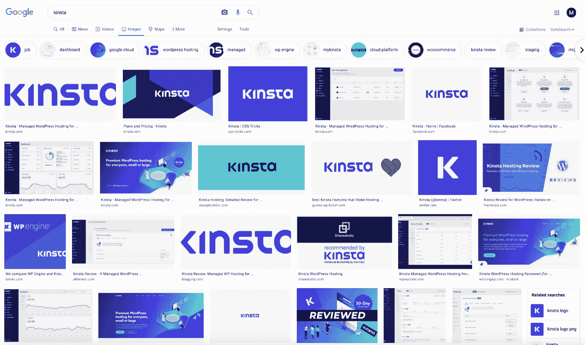

谷歌图片搜索结果为 Kinsta logo。

通过正确使用图像搜索引擎，人们可以在几秒钟内找到他们需要的正确图像。

不过，这不是找到图像的唯一方法。如果您有图像，但需要知道它来自哪里，该怎么办？

这就是逆向图像搜索引擎发挥作用的地方。

## 什么是反向图像搜索引擎？

反向图像搜索引擎帮助搜索者在上传类似的相关图像作为他们的搜索查询后定位源图像。

你不再使用关键词来搜索，而是从图片开始，并且需要找出它来自哪里。

这种类型的搜索引擎使用户能够找到他们正在寻找的东西，如果他们拥有类似的图片。

谷歌反向图片搜索是最常见的反向图片搜索引擎之一:

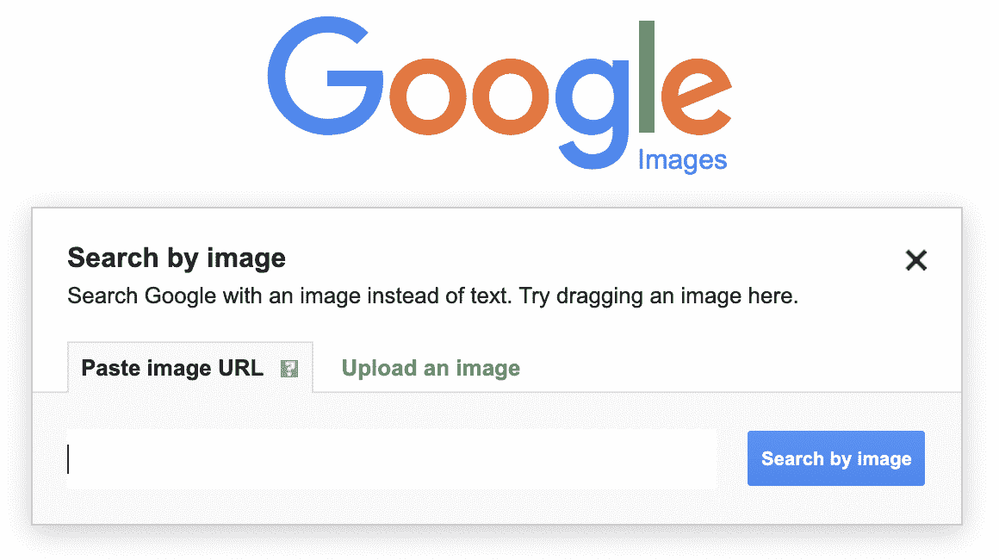

谷歌图片的‘按图片搜索’选项。

反向图像搜索引擎主要用于查找类似的高质量图像或源文件。

他们还为你的品牌提供各种 SEO 机会。如果你的网站上有独特的图片，并使用正确的关键词进行标记，用户可以通过普通图片搜索或反向图片搜索找到你的网站。

确保你的网站和图片与反向图片搜索兼容是一个有远见的公司的标志。它可以为您的企业带来额外的收入，并使您能够挤掉竞争对手。

据估计，将视觉和语音搜索考虑在内的网站设计公司将在下一年将数字商务收入增加 [30%](https://www.gartner.com/smarterwithgartner/gartner-top-strategic-predictions-for-2020-and-beyond) 。

准备好深入探索一些流行的搜索引擎了吗？让我们来看看目前市场上的顶级选项。

## 11 个最佳图片搜索引擎

市场上有如此多的图像搜索引擎。你应该选择哪一个？

下面，你会发现一些最流行的图片搜索引擎，以及哪些应该用于不同的使用场合。

### 1.谷歌图片搜索

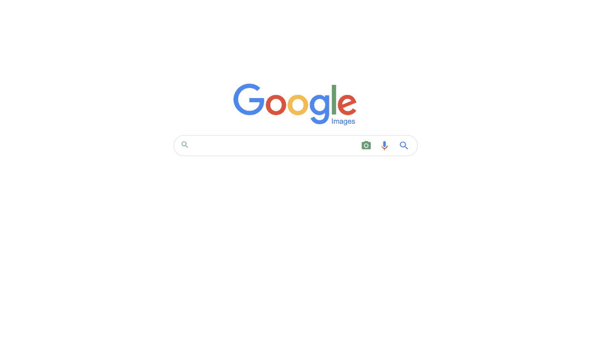

谷歌图片搜索。

你可能用过几次谷歌来找一张图片。这就是为什么它在我们的清单上排在第一位。

Google Images 是一个流行的图片搜索引擎，它标记和索引了数十亿张图片，只为找到与您的搜索查询相匹配的最合适的选项。

谷歌的简约主页与搜索引擎的简单功能相匹配。您需要输入您的查询，并点击放大镜开始。

一旦您的[搜索引擎结果页面(SERP)](https://kinsta.com/blog/decline-seo-rankings/) 出现，您就可以通过其他标准过滤结果。

谷歌是一个完美的搜索引擎，可以广撒网，从各种来源获取各种图像。

### 2.雅虎图片搜索

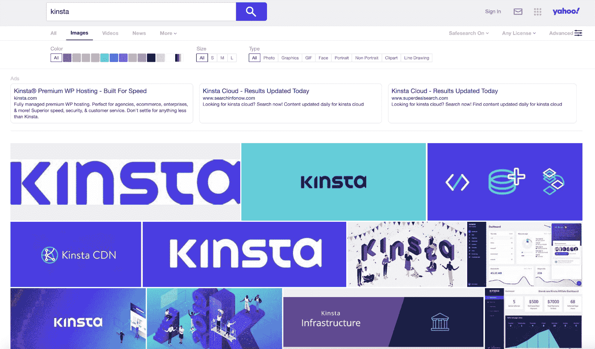

雅虎图片搜索。

领先的搜索引擎雅虎(Yahoo)是搜索图片的另一种强大方式，他们帮助数十亿用户找到完美的图片。

每一个图片搜索引擎都是不同的，所以雅虎上最热门的搜索结果中的图片可能与谷歌上的有所不同。这是因为算法不同，每个门户的标记约定也不同。

雅虎允许你按颜色过滤，如果你想找一张特定色调的图片，可以很容易地浏览你的结果。此外，您可以按照片类型(即照片、图片、肖像等)进行过滤。)来缩小自己到底想要什么。

### 3.皮沙贝

Pixabay 是查找免版税图片的绝佳资源。

Pixabay 是一个不太知名，但仍然很常见的图片搜索引擎。大多数人使用 Pixabay 是因为它提供[免版税的图片](https://kinsta.com/blog/free-images-for-wordpress/)。你可以将你在 Pixabay 上找到的大部分图片用于商业应用。

如果你正在寻找图片用于你的网站或营销材料，这是一个很好的开始。

搜索引擎可能没有谷歌或雅虎那么多选择。尽管如此，免版税方面使它成为一个令人信服的和直接的解决方案，营销人员和企业主一样。

### 4.佩克斯

Pexels 指数百万张免费股票照片。

Pexels 提供“天才创作者分享的最好的免费照片和视频”与 Pixabay 非常相似，这是免版税图像的绝佳选择。更好的是，所有的图片都来自技术娴熟的创作者，包括有抱负的[摄影师](https://kinsta.com/blog/photography-website/)和摄像师。

Pexels 在其搜索引擎中也包括视频。您可以使用“发现”选项卡浏览，找到一些由创作者提交的最新图片。如果你不知道什么样的图像适合你的项目，使用这个可以激发你的灵感。

Pexels 提供了美观的布局，易于导航。这是搜索那些有创意的、免版税的图片的一个有用的方法。

### 5.快门架

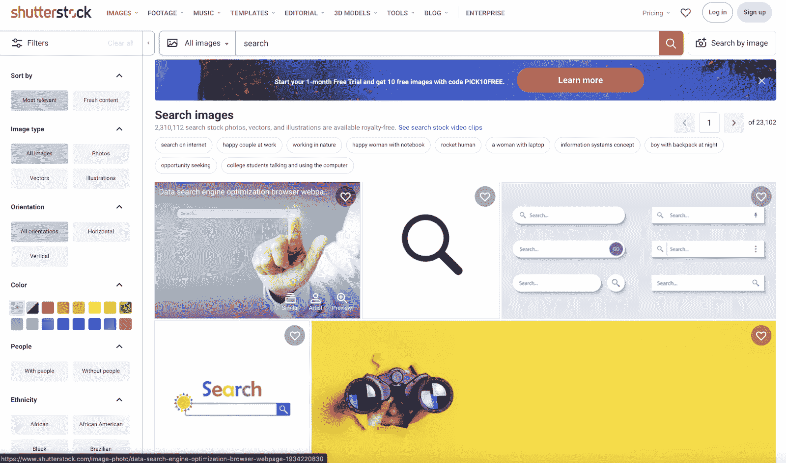

Shutterstock 是一个流行的股票图片网站。

如果你正在考虑定位一张库存照片，可能会想到 [Shutterstock](https://www.shutterstock.com/) 。Shutterstock 自 2003 年以来一直存在，是一个可供购买的库存照片在线目录。

Shutterstock 是最受欢迎的股票图片网站之一，也是提供优质在线股票图片的市场领导者。您可以搜索任何图像，Shutterstock 将为您提供一个结果页面，其中包含您可以许可的相关图像。

如果你有预算，并且想要一张用于商业用途的精美图片，这个网站是一个值得推荐的搜索引擎。他们的选择范围很广，你应该能找到你想要的。

### 6.知识共享搜索

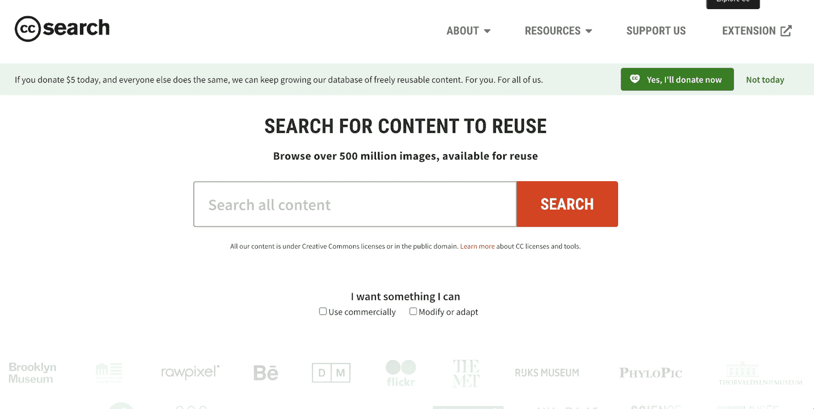

全世界的创作者都为知识共享搜索做出贡献。

Creative Commons Search 汇集了世界各地创作者贡献的图片。该网站聚集了超过 5 亿张“可供重复使用”的图片你不必为使用这些图片付费。相反，该网站要求捐款。

你甚至可以过滤图像，看看那些你可以修改或适应。这使得找到可以重新打包为公司资产的内容变得更加容易。几十个领先品牌使用知识共享——他们都在主页上突出显示。

自 2021 年 5 月 11 日起，CC 搜索成为 [WordPress](https://kinsta.com/knowledgebase/what-is-wordpress/) 开源项目( [Openverse](https://wordpress.org/news/2021/05/welcome-to-openverse/) )的一部分。

### 7.IQDB(最佳动漫图片搜索引擎)

[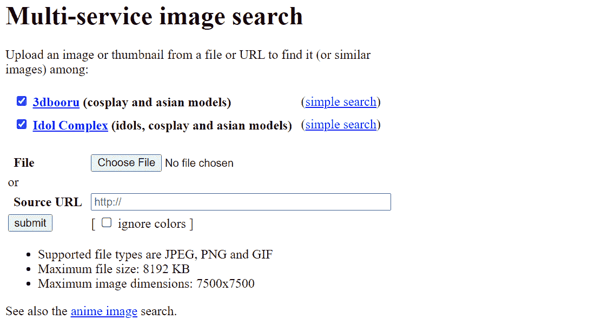](https://kinsta.com/wp-content/uploads/2021/12/IQDB-Image-Search-Engine.png)

IQDB is a multi-service image search portal.

有时，您可能需要查找不同风格或更模糊的图像。对于动漫风格的图片和图形，需要使用 IQDB。

## 注册订阅时事通讯

### 想知道我们是怎么让流量增长超过 1000%的吗？

加入 20，000 多名获得我们每周时事通讯和内部消息的人的行列吧！

[Subscribe Now](#newsletter)

[IQDB](https://3d.iqdb.org/) 是一个多服务图片搜索，抓取多个动漫搜索引擎，包括 Danbooru、Konachan、yande.re、Gelbooru 等。这是一种在网络上的一些顶级动漫图片聚合器中进行全面搜索的快捷方式。

IQDB 允许您将图像直接上传到搜索引擎。不使用关键字，您可以添加[源 URL](https://kinsta.com/knowledgebase/what-is-a-url/) 来查找相关图像。它将运行一个查询，将图片与网络上的其他图片进行匹配。

### 8.脸书图像搜索引擎

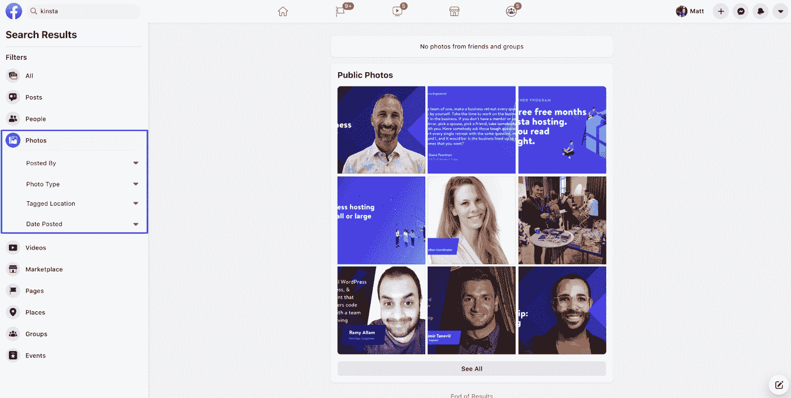

Facebook image search engine.

每天都有数十亿人在脸书注册账户并上传照片。从你妈妈到你最喜欢的企业，每个人都在平台上发布内容。

这就是为什么脸书的图像搜索功能是另一个独特的图像搜索引擎，可以帮助你找到完美的照片。有了平台上发布的所有图片，你很有可能找到你需要的东西。

要访问搜索引擎，请点按搜索栏中的放大镜或键入您的关键字，然后按 enter 键。然后，您可以通过选择左侧的选项来按“照片”进行过滤。

您甚至可以进一步深入，并选择按帖子类型、标记位置和发布日期发布的帖子。

### 9.Reddit 图像搜索引擎

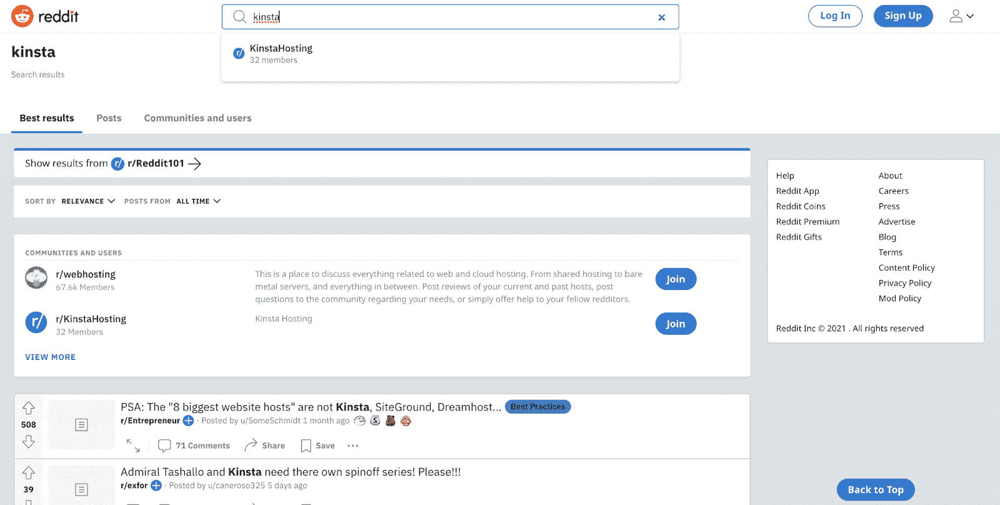

Reddit 图片搜索引擎。

Reddit 自诩为“互联网的首页”用户在网站的论坛上发布图像、视频、新闻文章、gif 和其他内容类型。因此，使用 Reddit 的图片搜索功能来找到受欢迎的图片是一个好主意。

用户可以通过相关关键字进行搜索，以发现用相似关键字标记的内容。你甚至可以挖掘出一个充满你可以使用的图片的流行线索。

Reddit 为图片内容提供了无限的可能性，因为它拥有来自世界各地的用户。

如果你不知道你在找什么，搜索 Reddit，看看哪些图片会推动参与度，以及目前的趋势。

### 10.最佳艺术图片搜索引擎

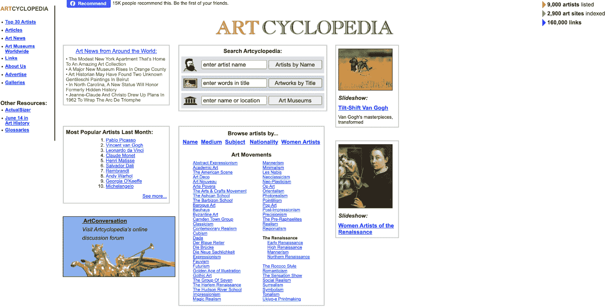

有了艺术百科全书，就不难找到艺术精品。

Artcylcopedia 帮助用户找到目前存在于世界各地的艺术图片。你可以通过艺术家，标题，甚至艺术博物馆来搜索。这让你很容易找到你心目中的艺术作品的图像。

该网站易于使用，尽管外观陈旧，但提供了各种不同年代的艺术图片。它也有很好的索引，很容易从一部分浏览到另一部分。

如果你正在寻找一种方法来找到一件特定的艺术品，从艺术百科全书开始，探索它的图书馆。你可能会找到你需要的东西。

### 11.Yandex

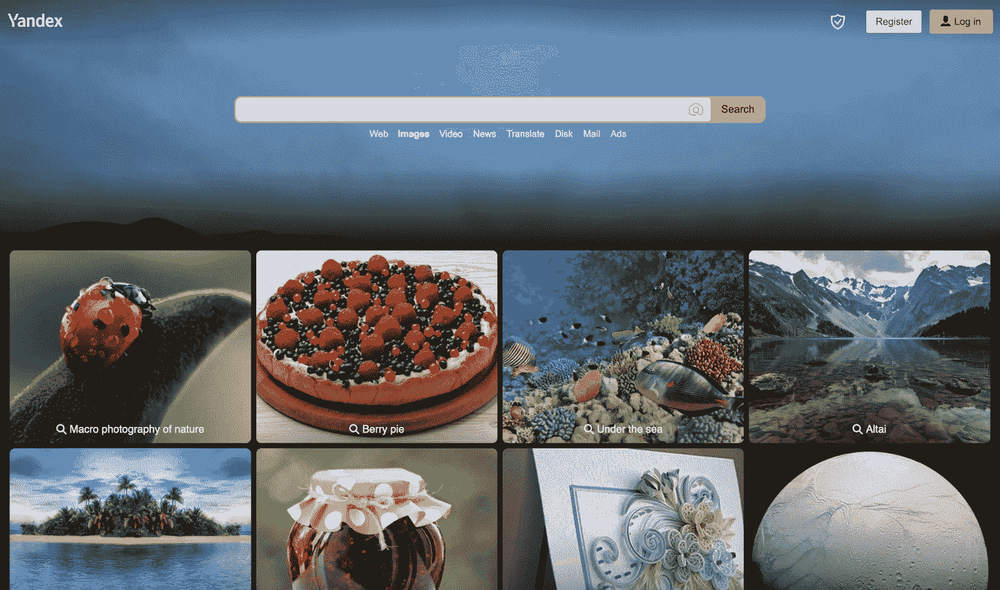

Yandex 图片搜索。

[Yandex](https://yandex.com/) 是另一个类似谷歌和雅虎的图片搜索引擎。它聚集并标记了网络上发布的数百万张图片。只需点击几下，您就可以评估与您的查询相匹配的数千张图片。

你会注意到 Yandex 拥有令人愉悦的用户体验。搜索之后，你的结果页面很容易导航，并且添加了 splash 元素。当你将鼠标悬停在一张照片上时，它会从屏幕上弹出，以便你能更好地看到它。

厌倦了低于 1 级的 WordPress 托管支持而没有答案？试试我们世界一流的支持团队！[查看我们的计划](https://kinsta.com/plans/?in-article-cta)

您可以按方向、图像类型、发布日期、文件类型、大小等过滤结果。最酷的部分是，你甚至可以输入一个网址，在那个特定的网站上搜索图片。

有了这些过滤工具，可能性是无穷无尽的，你可以很快缩小你的图像范围。

## 顶级反向图像搜索引擎(和工具)

反向图像搜索引擎有助于寻找图像的源文件。

如果您有一个图像，但它很小或模糊，您可以通过反向图像源找到原始图像。

此外，反向图像搜索[添加上下文](https://kinsta.com/blog/wordpress-seo/#10-add-alt-text-to-your-images)。如果你不知道一张图片里有什么，你可以反向图片搜索，看看它在网上的位置。然后，您可以复制并粘贴图像，将其添加到您的项目中。

在我们进入一些顶级的图片搜索引擎之前，让我们来看看使用它们的核心步骤。

### 如何使用反向图像搜索

反向图像搜索引擎需要三个步骤。

首先，你需要访问一个反向图片搜索引擎，比如 TinEye.com 的[、ReverseImageSearch.org 的](http://TinEye.com)或 T2 的。

接下来，粘贴图像 URL 或将图像上传到站点。大多数网站都提供这两种选择，以使最终用户的过程更容易。

点击搜索后，网站将运行查询，并在几毫秒内查看所有匹配的标记图像。

最后，您将能够浏览并从结果中选择合适的图像。

让我们来看看你应该考虑使用的一些最好的反向图片搜索网站。

### 1.TinEye

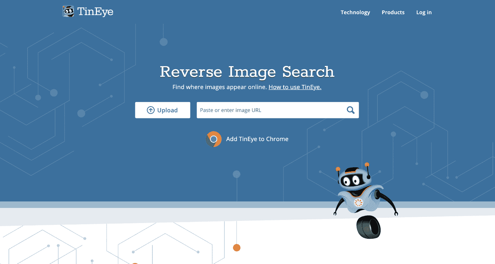

TinEye 是最流行的反向图片搜索引擎之一。

TinEye 是一个简单的反向图片搜索引擎，可以给你你需要的一切。一旦你登陆该网站，一个友好的机器人会迎接你，一个简单的行动号召会邀请你上传你的照片或粘贴网址。

### 2.反向图像搜索

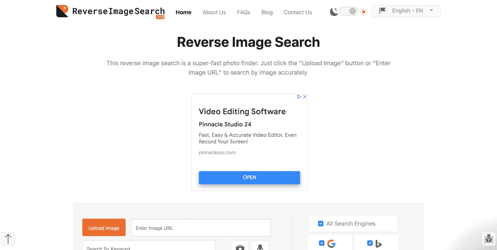

反向图像搜索。

ReverseImageSource.org 是另一个流行的反向图片搜索网站。该网站将自己定位为“一个超级快速的照片查找器”在你上传你的图片后，该网站将从数百万张照片中寻找相似的匹配。

这是一个基本的反向图片搜索引擎，省略了其他网站的额外功能和特点。一旦登陆首页，简单易用，一目了然。初级和中级营销人员将从这个网站中找到价值。

如果你在寻找多张图片，你可以从 [Dropbox](https://kinsta.com/blog/slack-integrations/#storage-and-administrative-integrations) 或 Google Drive 上传。这使得搜索效率更高，耗时更少。ReverseImageSource.org 让你很容易找到你一直想要的形象。

不想依赖已经建立的搜索引擎？也许可以考虑建造你自己的。

## 如何制作基于图像的搜索引擎

对市场上的选择感到沮丧？想为别人做一个有魄力的解决方案？

你可以建立自己的基于图像的搜索引擎。

基于图像的搜索引擎有三个主要组件:

1.  查询引擎
2.  标记的照片清单
3.  提取请求的标记照片的逻辑

首先，你需要理解[如何编码和构建一个具有后端能力的数据库](https://kinsta.com/blog/how-to-become-a-web-developer/)来存储和抓取资产。

接下来，你需要收集照片并将它们添加到数据库中。这些照片应该使用您自己的标签系统进行标记。

搜索引擎的成功依赖于向消费者提供相关图片(基于与标签相对应的查询)的能力。

标记惯例的一些考虑事项应该包括:

*   照片类型(照片与图片)
*   照片的颜色
*   图像内容(相关关键词)
*   照片的类别(照片类别的总称)

知道这一点将有助于您构建搜索查询。例如，如果有人想要一张摩天大楼的黑白照片，你的基于图像的搜索引擎应该能够找到一张。

通过适当的标记约定，这是可能的。

最后，如果你有逻辑将所有事情整合在一起，那会很有帮助。如果你的查询框没有连接到你的图像库，你的图像搜索引擎将一无是处。

如果你不能建立回忆图像的逻辑，你就没有一个有效的搜索引擎。这就像制造一辆没有引擎的汽车。它可能是零散的，但是如果没有把所有的东西放在一起，它就不能帮助你到达你要去的地方。

然而，构建一个带有图像检索的逆向图像搜索工具不仅仅是编写一个简单的脚本。有很多因素会影响搜索结果的形成。

你可能需要一个额外的工具或应用程序来帮助你找到相似的图像，或者像另一个视觉搜索引擎一样在相同的时间范围内检索图像。

最重要的是，你需要获得用户。许多人在谷歌上搜索图片，所以你必须在 Twitter 和其他网站上大力宣传你的图片数据库。

建立一个基于图像的搜索引擎是一项艰巨的任务，除非你是认真的，否则不应该尝试。许多令人印象深刻的搜索引擎已经在市场上，以帮助你得到你需要的一切。

[了解你需要知道的关于图片搜索引擎、反向图片搜索的一切，更多内容尽在此 点击推文](https://twitter.com/intent/tweet?url=https%3A%2F%2Fkinsta.com%2Fblog%2Fimage-search-engine%2F&via=kinsta&text=Learn+everything+you+need+to+know+about+image+search+engines%2C+reverse+image+search%2C+and+more+in+this+helpful+guide+%E2%AC%87%EF%B8%8F&hashtags=ImageSearch%2CWPTips)

## 摘要

图片搜索引擎是帮助数百万人定位高质量图片的必要入口。如果没有它们，用户将会浪费无数的时间在网上搜寻他们想要的图片。

知道如何高效使用图片搜索引擎超级有效。这将帮助您更好地执行搜索查询，为您的下一个项目找到完美的图像。

有什么在线搜索图片的技巧和建议吗？请在下面的评论中分享！

* * *

让你所有的[应用程序](https://kinsta.com/application-hosting/)、[数据库](https://kinsta.com/database-hosting/)和 [WordPress 网站](https://kinsta.com/wordpress-hosting/)在线并在一个屋檐下。我们功能丰富的高性能云平台包括:

*   在 MyKinsta 仪表盘中轻松设置和管理
*   24/7 专家支持
*   最好的谷歌云平台硬件和网络，由 Kubernetes 提供最大的可扩展性
*   面向速度和安全性的企业级 Cloudflare 集成
*   全球受众覆盖全球多达 35 个数据中心和 275 多个 pop

在第一个月使用托管的[应用程序或托管](https://kinsta.com/application-hosting/)的[数据库，您可以享受 20 美元的优惠，亲自测试一下。探索我们的](https://kinsta.com/database-hosting/)[计划](https://kinsta.com/plans/)或[与销售人员交谈](https://kinsta.com/contact-us/)以找到最适合您的方式。 