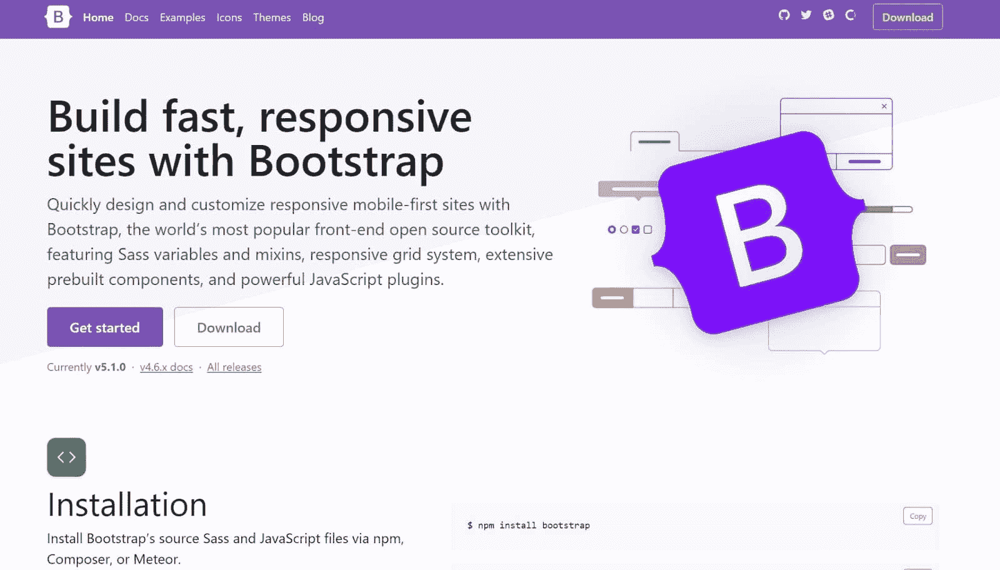
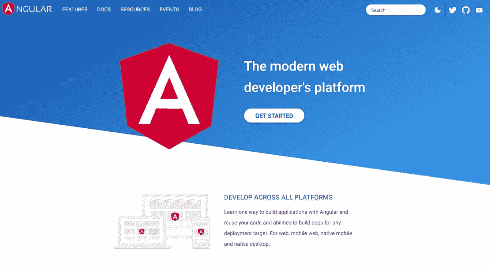
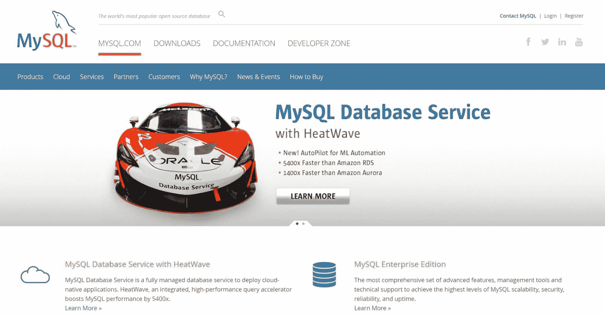
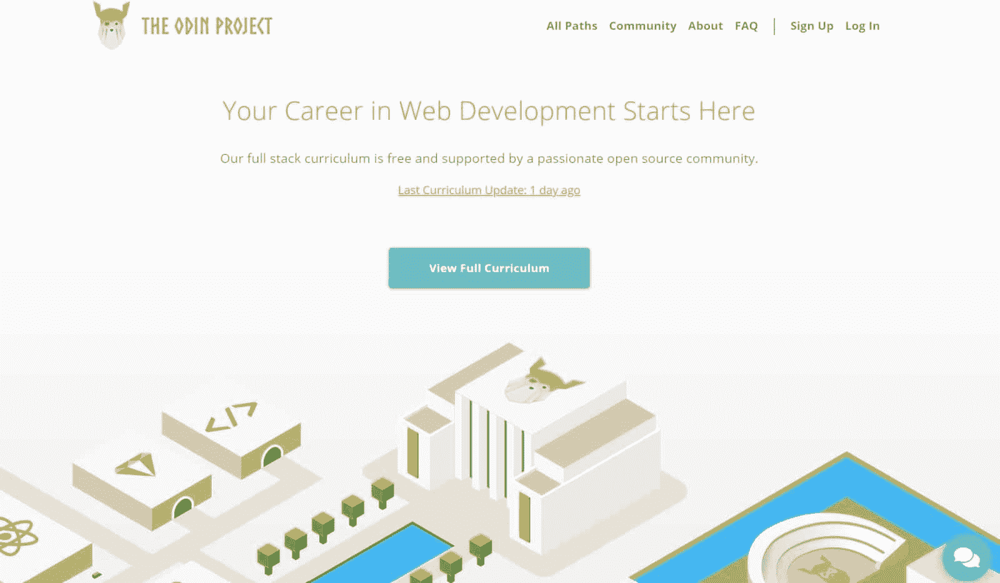
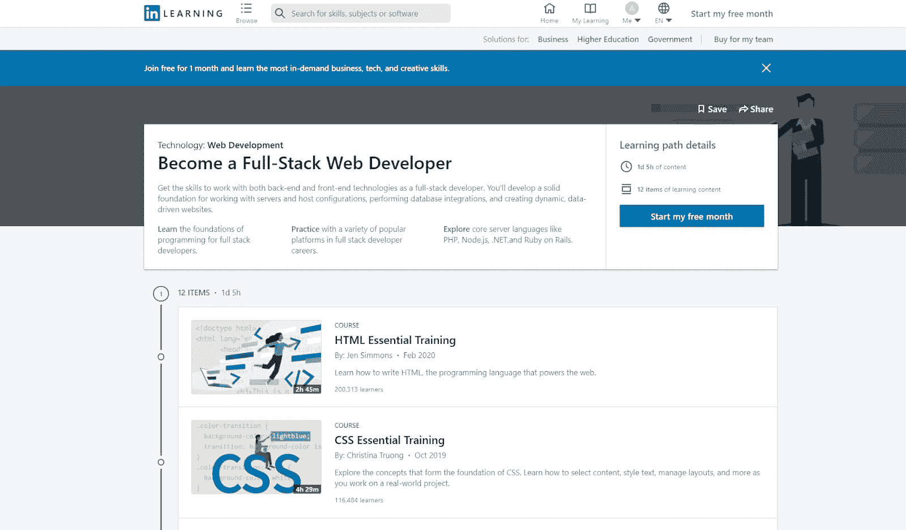
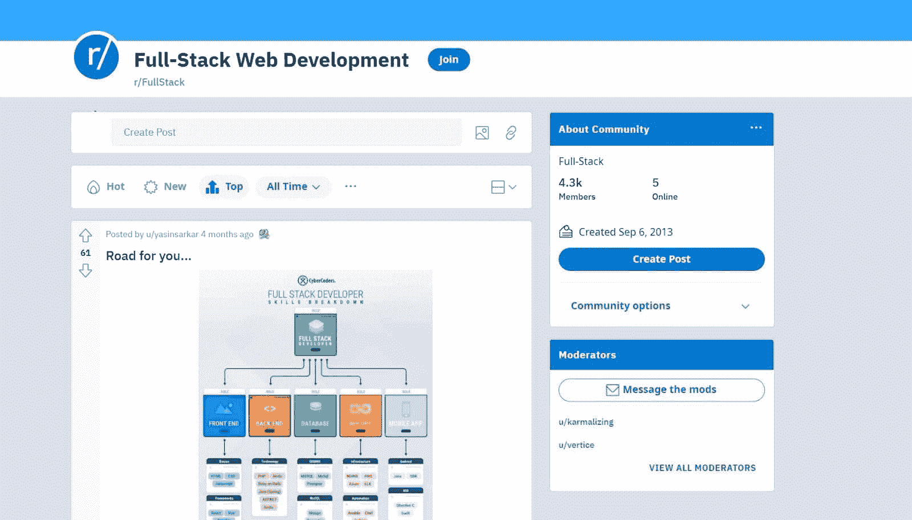

# 什么是全栈开发者？全栈开发指南

> 原文：<https://kinsta.com/blog/what-is-a-full-stack-developer/>

如果你对目前的开发角色感到厌倦，转换到全栈开发工作可能是你职业生涯中最好的事情。

根据 LinkedIn 的《2020 年新兴工作报告》,全栈开发人员的工作在增长的工作中排名第四位。美国劳工统计局(BLS)的研究显示了类似的轨迹，因为他们估计，到 2029 年，网络开发和设计工作将增加 [8%](https://www.bls.gov/ooh/computer-and-information-technology/web-developers.htm) 。

但是什么是全栈开发者，他们做什么，你如何成为一个？请继续阅读，我们将告诉您成为全栈开发人员所需了解的一切。

让我们开始吧！

T3】

## “全栈”是什么意思？

在成为全栈开发人员之前，您需要理解术语“全栈”以“全栈”能力工作的开发人员在前端和后端开发项目上工作。

前端开发(或客户端开发)项目包括用户看到的任何东西。它包括客户与之交互的网站和 web 应用程序(就像电子商务 web 应用程序的界面)。

后端开发(或服务器端开发)项目包括网站或 web 应用程序的任何幕后部分。具体来说，后端开发关注三件事:

1.  **服务器:**运行网站后端的电脑
2.  **数据库:**网站存储数据的空间
3.  **应用:**与服务器和数据库通信的工具

由于全栈开发人员同时从事前端和后端项目，他们需要在工作中同时使用[前端和后端编程语言](https://kinsta.com/blog/best-programming-language-to-learn/)和工具。

> Kinsta 把我宠坏了，所以我现在要求每个供应商都提供这样的服务。我们还试图通过我们的 SaaS 工具支持达到这一水平。
> 
> <footer class="wp-block-kinsta-client-quote__footer">
> 
> 
> 
> <cite class="wp-block-kinsta-client-quote__cite">Suganthan Mohanadasan from @Suganthanmn</cite></footer>

[View plans](https://kinsta.com/plans/)

这包括用于前端开发的语言，如 [HTML](https://kinsta.com/blog/html-vs-html5/) 、 [JavaScript](https://kinsta.com/knowledgebase/what-is-javascript/) 和 [CSS](https://kinsta.com/blog/optimize-css/) ，以及用于后端开发的编程语言，如 Java、 [Python](https://kinsta.com/blog/python-object-oriented-programming/) 和 Ruby。

但是除了编码，全栈开发人员每天还做些什么呢？

[对目前的角色感到厌烦吗？😴了解全栈开发职业可以提供什么👀 点击推文](https://twitter.com/intent/tweet?url=https%3A%2F%2Fkinsta.com%2Fblog%2Fwhat-is-a-full-stack-developer%2F&via=kinsta&text=Bored+in+your+current+role%3F+%F0%9F%98%B4+See+what+a+career+in+full-stack+development+could+have+to+offer+%F0%9F%91%80&hashtags=FullStack%2CWebDev)

## 全栈开发者做什么？

作为一名全栈开发人员，您的日常职责会因您工作的公司、您所在的行业和您的专业知识而有所不同。所有这些因素都会影响雇主给你的工作类型。

然而，如果你看看全栈开发人员的招聘信息，你会注意到许多职位都有十个典型的职责。其中包括:

*   设计新网站和基于网络的程序的架构。
*   开发应用程序编程接口(API)。API 是帮助应用程序相互通信的软件中介。
*   在设计新网站或程序时，与用户合作，了解他们的技术需求。
*   开发更新以增强网站后端的可用性和功能。
*   维护一个网站的前端，以确保它的工作。
*   [优化网站](https://kinsta.com/blog/performance-testing-tools/)确保它们对手机友好。
*   与平面设计师一起开发有吸引力和功能性的网站。
*   为网站创建服务器和数据库。
*   在系统开发生命周期(SDLC)的每个阶段监督项目。
*   与其他专业人员合作(包括 [DevOps 工程师](https://kinsta.com/blog/devops-engineer/)、网络安全专家、图形设计师和其他 web 开发人员)。

自然，由于全栈开发人员在工作中承担着广泛的责任，他们的报酬相当不错。

接下来我们来看看全栈开发者的平均工资。

### 全栈开发者赚多少？

让我们具体看看美国全职职位的一些数据。

根据 Glassdoor 的数据，全栈开发人员的平均年收入为 98，000 美元，大多数开发人员的收入在[63，000 美元到](https://www.glassdoor.com.au/Salaries/us-full-stack-developer-salary-SRCH_IL.0,2_IN1_KO3,23.htm?countryRedirect=true)156，000 美元之间。Glassdoor 的平均薪资数据是基于 3372 份薪资报告得出的。

根据 Payscale 的数据，全栈开发人员的平均基本工资为 75，057 美元，许多开发人员的年薪在 48，000 美元到 113，000 美元之间。

根据 Indeed 的数据，全栈开发人员的平均年收入为 104，396 美元。他们的数据基于 5000 份薪水的报告。

最后，根据 Talent.com 的调查，全栈开发的平均年薪为 107，434 美元，范围在每年[87，750 美元到](https://www.talent.com/salary?job=full+stack+developer)144，754 美元之间。Talent.com 的平均工资数字是基于 10，000 英镑的工资。

这些网站的平均工资差距很大。

这种偏离是由几个因素造成的，包括教育、经验、工作职责、公司(及其盈利能力)、工作地点以及该职位是否包括福利。

那么，全栈开发者的工资相比其他工作怎么样呢？

根据我们的计算，WordPress 开发人员在美国的平均全职工资为 63，348 美元，web 开发人员的平均工资在 T2 的 60，000 美元到 75，000 美元之间，PHP 开发人员的平均工资在 T4 的 63，000 美元(初级职位)和 94，000 美元(高级职位)之间。

这意味着[全栈开发人员挣得更多](https://kinsta.com/blog/full-stack-developers-salary/)——然而，全栈开发人员需要比其他开发人员掌握更广泛的工具和技术。

现在让我们来看看其中的一些工具。

## 成为全栈开发者需要哪些技能？

如果你想成为一名成功的全栈开发者，有十个前端和后端开发技巧和能力是你应该建立的。其中包括:

### 1.用前端语言编码的能力

由于全栈开发人员经常在网站前端工作，您需要掌握前端开发语言，如:

#### 超文本标记语言

开发者使用[超文本标记语言(HTML)](https://kinsta.com/blog/html-best-practices/) 来创建网站的结构。当你创建带有不同标题、表格、列表、段落框和图片的网页时，你会用到 HTML。

#### 半铸钢ˌ钢性铸铁(Cast Semi-Steel)

开发者使用[层叠样式表(CSS)](https://kinsta.com/blog/wordpress-css/) 来创建网站用户界面的风格部分。

作为一名全栈开发人员，您将使用 CSS 添加风格元素(如颜色和字体)并为移动和平板设备调整网站。

#### java 描述语言

开发者使用 Javascript 来创建与用户交互的网页元素。

作为一名全栈开发人员，您将使用 Javascript 来构建功能部分，并将前端和后端的元素组合在一起。

例如，当创建按钮供用户点击时，可以使用 [Javascript。](https://kinsta.com/blog/javascript-libraries/)

### 2.前端框架和库方面的专业知识

在前端开发项目中，全栈开发人员使用一系列框架和工具来快速工作。当然，如果您学习了这些框架和工具，会有所帮助，包括:

#### 引导程序

Bootstrap 是一个广泛的代码框架，提供 HTML、CSS 和 Javascript 代码。Bootstrap 是目前世界上最流行的前端框架，所以它是你的武器库的一个极好的工具。

自举

#### jQuery 和 React

jQuery 和 [React](https://kinsta.com/blog/angular-vs-react/) 都是开发者用于 JavaScript 项目的框架。

#### 有角的

Angular 是一个开发人员用来构建网站和基于网络的应用程序的平台和框架。Angular 是一个非常新的工具，因为谷歌的 Angular 团队在 2016 年才发布了它。

对于需要设计在电脑、手机和平板电脑上一致工作的网站或 web 应用程序的开发人员来说，Angular 是一个绝佳的选择。

棱角分明

### 3.用后端语言编码的能力

由于全栈开发人员也处理网站的后端，你需要掌握后端开发语言，如:

#### 服务器端编程语言（Professional Hypertext Preprocessor 的缩写）

[超文本预处理器(PHP)](https://kinsta.com/blog/php-8-1/) 是一种用于 web 开发的通用脚本语言。

PHP 于 1995 年首次发布，此后一直相当流行，在所有已知语言的网站中，有 79.1% 在使用它。人们经常[将 PHP 比作 Angular](https://kinsta.com/blog/php-vs-angular/) (尽管 Angular 是针对前端开发的)。

#### 计算机编程语言

Python 是一种编程语言，可以追溯到 1991 年。Python 在处理数据库或构建 web 应用程序时特别有用。

#### Java 语言(一种计算机语言，尤用于创建网站)

Java 是一种基于对象的面向对象编程(OOP)语言。它于 1995 年首次发布，现在有 40.2%的软件开发者在使用它。

#### 红宝石

Ruby 是另一种全栈开发人员使用的通用编程语言。Ruby 是一种开源语言，非常容易掌握。在所有已知服务器端编程语言的网站中，有 5% 使用 Ruby。

### 4.后端框架和库方面的专业知识

与前端开发一样，全栈开发人员使用一系列框架和工具来快速处理后端项目。

当然，您需要学习其中的一些工具和框架，包括:

#### Laravel 框架

Laravel framework 是一个 PHP 框架，它让开发者可以访问大量的预写代码库。Laravel 框架是开源的，遵循 MVC 架构模式(MVC 代表“模型、视图、控制器”)。

Github 上的 Laravel 框架

#### 春天

Spring 是一个开源框架，开发者用它来快速地用 Java 构建项目。

Spring 使用面向方面编程(AOP)。AOP 是一种编程范式，它使用横切来创建一个灵活的程序，能够快速适应变化。

#### 姜戈

Django 是一个可伸缩的、安全的、快速的框架，开发人员用它来用 Python 构建项目。Django 非常适合网站建设，因为它可以帮助你创建任何网站，并且可以与大多数客户端框架一起工作。

## 注册订阅时事通讯

### 想知道我们是怎么让流量增长超过 1000%的吗？

加入 20，000 多名获得我们每周时事通讯和内部消息的人的行列吧！

[Subscribe Now](#newsletter)

### 5.数据库技能

在后端开发项目中，全栈开发人员需要构建和管理数据库。当然，您需要学习使用一些最流行的数据库工具，包括:

#### 关系型数据库

MySQL 是开发者用来存储 web 数据库的免费开源数据库系统。

这是一个关系数据库管理系统，它将数据整理成表格。MySQL 也是 LAMP 软件栈的一部分(我们将在下一节介绍)。

MySQL

T4】

#### 神谕

Oracle 是一个受大型项目和复杂数据库欢迎的数据库管理系统。Oracle 也使用关系数据库方法，尽管 Oracle 设计其系统专门用于复杂的数据库。

如果您想充分利用 MySQL 和 Oracle，您还需要学习使用结构化查询语言(SQL)。SQL 将帮助您与工具进行通信，以快速更新和检索数据。

#### MongoDB

MongoDB 是开发人员用于 web 应用的数据库工具。与 Oracle 和 MySQL 不同，MongoDB 不使用 SQL，因此您不需要学习如何使用 SQL 来使用 MongoDB。

### 6.流行书库方面的专业知识

作为一个全栈开发者，你需要学习使用流行的技术栈。

技术栈是用于产生网络应用、项目和网站的软件的集合。虽然您使用的栈将取决于您的雇主和团队，但是在成为全栈开发人员之前，您应该熟悉流行的栈。

这些流行的堆栈包括:

*   **LAMP 栈:**包括 Linux、Apache、MySQL 和 PHP
*   **平均栈**:包括 MongoDB、 [Express.js](https://kinsta.com/knowledgebase/what-is-express-js/) 、Angular.js、Node.js
*   **MERN 栈:**包括 MongoDB、Express.js、React.js 和 [Node.js](https://kinsta.com/knowledgebase/what-is-node-js/)
*   **SERN 栈**:包括 SQL、Express.js、React.js、Node.js
*   **Django 栈:**包括 Django、Python 和 MySQL
*   **Ruby on Rails 栈:**包括 Ruby、SQLite 和 Rails

### 7.对 DevOps 的理解

根据您的组织，您可能需要以全栈开发人员的身份与 DevOps 工程师合作。DevOps 工程师将工具、实践和想法的组合应用到项目中，以帮助他们快速地从概念转移到发布。

当然，如果您需要采用 DevOps 方法，您应该了解 DevOps 框架。

DevOps 方法使用 SDLC 的修改版本，指导开发人员逐步构建和发布更新和项目(DevOps 工程师称之为“持续集成/持续交付”或 CI/CD)。

DevOps 生命周期(**来源:** [亚特兰蒂斯](//www.atlassian.com/devops/what-is-devops/%E2%80%9D) )

一旦你理解了什么是 DevOps，你就会想要学习如何从这个方法中获得最大的收益。这意味着掌握以下工具:

*   **Atlassian Bamboo 和 Jenkins，**自动化重复任务
*   **木偶和厨师，**帮助 DevOps 工程师配置系统的不同元素，使它们保持一致
*   Nagios 和 Raygun，允许开发人员在部署后跟踪项目的性能
*   **Docker 和 Kubernetes，**帮助开发人员将代码打包并部署到容器中

### 8.对 UX 设计原则的理解

由于全栈开发人员建立了许多网站，你需要学习如何使用用户体验(UX)设计原则来设计一个伟大的网站。这些原则包括:

需要为你的 WordPress 站点提供超快的、可靠的、完全安全的托管服务吗？Kinsta 提供所有这些以及 WordPress 专家提供的 24/7 世界级支持。[查看我们的计划](https://kinsta.com/plans/?in-article-cta)

*   关注用户
*   使用一致性
*   用层次结构构建你的[网站(也就是说，把基本元素放在第一位)](https://kinsta.com/blog/wordpress-template-hierarchy/)
*   为移动和桌面设备设计您的网站
*   让用户控制他们在网站上的体验
*   让所有用户都可以访问您的网站(即，确保盲人、聋人和色盲者可以与您的网站互动)
*   在发布之前，测试你的网站的可用性

### 9.使用开发工具的经验

如果你有开发背景，你可能已经知道如何使用必不可少的开发工具，比如 BitBucket、GitHub 和 Git。然而，作为一名全栈开发人员，您将进行大量的 web 开发，您也应该学会使用 [web 开发工具](https://kinsta.com/blog/web-development-tools/),例如:

*   [MAMP](https://kinsta.com/knowledgebase/mamp-phpmyadmin-not-working/)
*   [XAMPP](https://kinsta.com/knowledgebase/localhost-xampp-index-php/)
*   [图](https://kinsta.com/blog/figma-vs-sketch/)
*   素描
*   视觉工作室

你可能还需要学习如何使用 WordPress 开发工具，比如 [DevKinsta](https://kinsta.com/devkinsta/) 。DevKinsta 是一套免费的工具，可以帮助你建立、开发和测试 WordPress 网站。

目前有超过 10，000 名专业人士在使用 DevKinsta，包括网页设计师、自由职业者和开发人员。

德夫金斯塔

### 10.伟大的软技能

最后，任何开发人员都需要出色的软技能。虽然全栈开发是一项技术工作，但您需要与同事和用户合作来交付每个项目。

当然，您需要:

*   **出色的积极倾听技巧:**帮助你理解他人的观点
*   出色的团队合作技巧:帮助你与他人合作
*   接受建设性反馈的能力:你需要根据同事和用户的反馈调整你的工作
*   指导其他开发人员的能力:你的雇主可能希望你将自己的专长借给仍在培养技能的初级开发人员
*   时间管理技巧:你可能需要同时兼顾多个项目

那么，假设你拥有我们讨论过的所有 10 种技能，为什么要将它们应用到全栈开发中呢？

## 为什么要成为全栈开发者？

由于大多数全栈开发人员的年薪超过 75，000 美元，因此全栈开发是一个利润丰厚的职业。但它也提供了其他好处。

作为一名全栈开发人员，您将在前端和后端开发之间架起一座桥梁。这将给你一个独特的 web 开发方法，因为你将在一个项目的每个方面工作(而不仅仅是一个微小的部分)。

当你把一个项目从概念带到发布时，许多开发人员发现这部分角色令人满意。

对于喜欢在工作中展示不同肌肉的专业人士来说，全栈开发也是一个很好的职业。全栈开发人员使用许多工具和技能，从事各种各样的项目，这意味着您的工作将非常引人入胜。

作为一名全栈开发人员，你将学到许多技能，你也将成为雇主的一笔巨大财富。自然，如果你有兴趣进入管理角色，全栈开发可能是完美的垫脚石(取决于你的公司)。

那么，如何从全栈开始呢？

## 如何成为全栈开发人员

由于您需要很强的软件开发技能才能成功担任全栈开发人员的角色，大多数全栈开发人员在从事另一份软件开发工作后会过渡到这个职位。

如果你之前没有做过开发，不妨考虑先从事 web 开发、 [java 开发、](https://kinsta.com/blog/java-developer/)、软件工程师、[前端开发、](https://kinsta.com/blog/frontend-developer/)或者[后端开发](https://kinsta.com/blog/backend-developer/)的工作。

一旦您有了一些经验，您可以通过以下步骤过渡到全栈角色:

### 第一步:掌握基础知识

首先，你需要提高你的编程技能。虽然你不需要精通每一种语言，但我们建议你提高以下方面的技能:

*   半铸钢ˌ钢性铸铁(Cast Semi-Steel)
*   java 描述语言
*   超文本标记语言
*   Java 语言(一种计算机语言，尤用于创建网站)
*   计算机编程语言
*   [红宝石](https://kinsta.com/blog/scripting-languages/#4-ruby)

有许多资源可以用来培养你的开发技能。例如，你可以使用 Odin 项目这样的资源，它会教你全栈开发的基础知识，以及如何使用 Ruby on Rails 和 Javascript 进行开发。

奥丁项目

由于 WordPress 现在支持互联网上 40%的网站，你也应该学习如何使用 WordPress 来管理网站，开发主题，以及使用插件。

虽然你可以通过试错来学习，但是学习 WordPress 的最好方式是通过在线课程。

如果你以前没有用过 PHP，你应该在学习 WordPress 的时候熟悉它。

由于 WordPress 主要建立在 PHP 之上，你可能需要 PHP 来进行后端开发。参加课程是学习 PHP 的好方法。你也可以[安装 PHP](https://kinsta.com/blog/install-php/) ，并随着时间的推移建立你的技能。

### 第二步:增加你的知识

一旦掌握了基础知识，您应该通过增强知识和培养技能来为新的全栈开发角色做准备。有许多方法可以做到这一点，包括:

*   找出你知识中的差距，并通过练习或辅导来填补它们
*   在你的工作场所请一位全栈开发人员指导你，并就你对工作的准备情况给你反馈
*   通过编码训练营或在线认证提升技能，如 LinkedIn 的[全栈 Web 开发人员学习课程](https://www.linkedin.com/learning/paths/become-a-full-stack-web-developer?src=aff-lilpar&veh=aff_src.aff-lilpar_c.partners_pkw.27795_plc.Sovrn%20Commerce%20%28formerly%20Viglink%29_pcrid.465847_learning&trk=aff_src.aff-lilpar_c.partners_pkw.27795_plc.Sovrn%20Commerce%20%28formerly%20Viglink%29_pcrid.465847_learning&clickid=2zRx%3A8VHpxyLWuI2fYzGLXMLUkBUvByaTUw5w00&irgwc=1)或 IBM 的[全栈云开发人员专业证书](https://www.coursera.org/professional-certificates/ibm-full-stack-cloud-developer)。

LinkedIn Learning 的全栈开发者课程

你也应该通过 StackOverFlow 这样的网站和 r/fullstack 这样的子编辑加入在线全栈开发社区。加入社区将有助于你通过观察他人来学习，因为你可以看到他们是如何解决问题的。

开发者在线对话的 r/fullstack subreddit 页面

### 第三步:创建作品集，申请工作

接下来，你应该[建立一个数字作品集](https://kinsta.com/blog/portfolio-website/)来展示你的全栈开发技能。理想情况下，你的作品集应该记录两到四个你的 web 开发项目。

最佳投资组合非常简单，因为它们包括:

*   每个网站或项目的链接
*   对每个项目使用的工具和流程的详细说明
*   您对流程的任何反思(例如，哪些工作做得好，您面临的任何挑战，您从流程中学到了什么)

一旦你完成了你的作品集，把它添加到你的简历中，开始申请全栈工作。您可以在以下网站上找到全筹码头寸:

*   [的确](https://www.indeed.com/q-Full-Stack-Developer-jobs.html)
*   [玻璃门](https://www.glassdoor.com/Job/full-stack-developer-jobs-SRCH_KO0,20.htm)
*   [LinkedIn](https://www.linkedin.com/jobs/full-stack-developer-jobs/)

#### 帮助你找到工作的建议

当你还在进入这个领域的时候，寻找一份全栈开发的工作可能会让人望而生畏。以下是一些帮助你获得完美角色的建议:

*   不要担心掌握每一种工具或语言，优先选择那些在你想要的工作中最适合你的
*   根据你的技能考虑选择一个合适的位置(例如，把自己标榜为全栈 WordPress 开发者)。
*   参加全栈会议，建立关系网，寻找导师
*   如果可能的话，和你的经理谈谈在你目前的工作中承担更多的全栈开发人员职责，因为这将帮助你更容易地过渡到全栈角色
*   从头开始开发你的投资组合网站，展示你的技能

[你知道吗，到 2029 年，网页开发和设计工作将增长 8%。📈好奇吗？继续读...👀](https://twitter.com/intent/tweet?url=https%3A%2F%2Fkinsta.com%2Fblog%2Fwhat-is-a-full-stack-developer%2F&via=kinsta&text=Did+you+know+that+web+development+and+design+jobs+will+grow+by+8%25+by+2029%3F+%F0%9F%93%88+Intrigued%3F+Read+on...+%F0%9F%91%80&hashtags=FullStack%2CWebDev)

## 摘要

如果您是一名寻求挑战的开发人员，那么转换到全栈开发工作可能是您职业生涯中的一个绝佳选择。

全栈开发职位要求很高，但也是值得的，因为你可以接手一个项目并从头开始构建。

成为一名开发者也是一项伟大的长期职业发展，因为 BLS 估计，从 2019 年到 2029 年，软件开发工作将增长 [22%](https://www.bls.gov/ooh/computer-and-information-technology/software-developers.htm) 。

作为一名成功的开发人员，你需要掌握 HTML、CSS、Javascript、Python、Java 和 Ruby 等编程语言。您还需要学习使用 Spring、Laravel、Bootstrap 等框架，以及 DevKinsta 等 web 开发工具。

*当然，这不是一个详尽的列表，所以如果你能想到新的全栈开发人员应该知道的任何其他工具，请在下面的评论中分享它们。*

* * *

让你所有的[应用程序](https://kinsta.com/application-hosting/)、[数据库](https://kinsta.com/database-hosting/)和 [WordPress 网站](https://kinsta.com/wordpress-hosting/)在线并在一个屋檐下。我们功能丰富的高性能云平台包括:

*   在 MyKinsta 仪表盘中轻松设置和管理
*   24/7 专家支持
*   最好的谷歌云平台硬件和网络，由 Kubernetes 提供最大的可扩展性
*   面向速度和安全性的企业级 Cloudflare 集成
*   全球受众覆盖全球多达 35 个数据中心和 275 多个 pop

在第一个月使用托管的[应用程序或托管](https://kinsta.com/application-hosting/)的[数据库，您可以享受 20 美元的优惠，亲自测试一下。探索我们的](https://kinsta.com/database-hosting/)[计划](https://kinsta.com/plans/)或[与销售人员交谈](https://kinsta.com/contact-us/)以找到最适合您的方式。