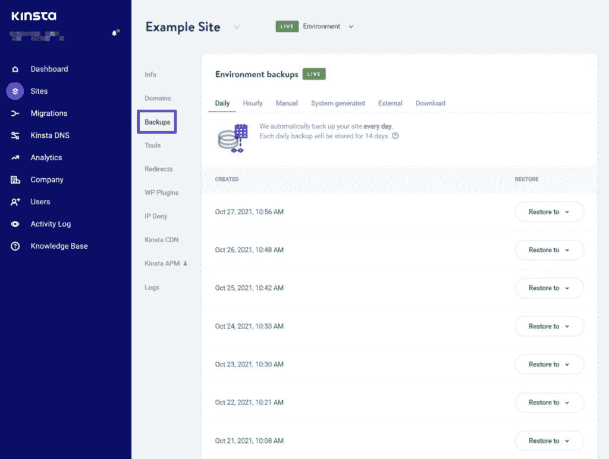
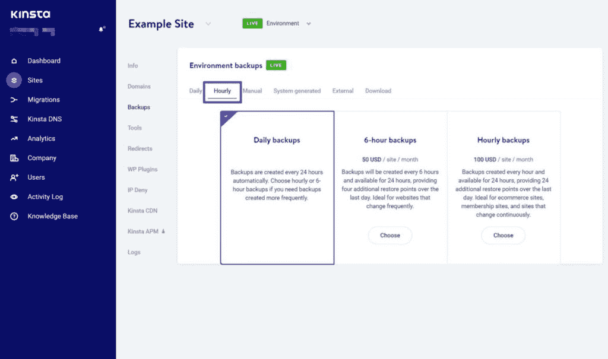
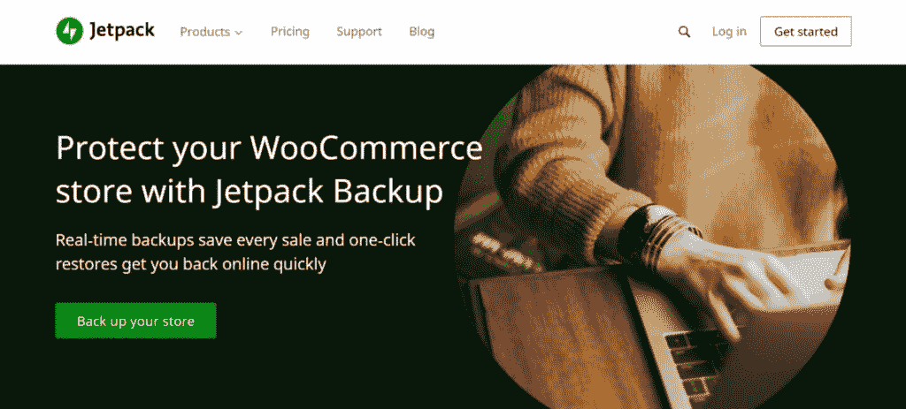
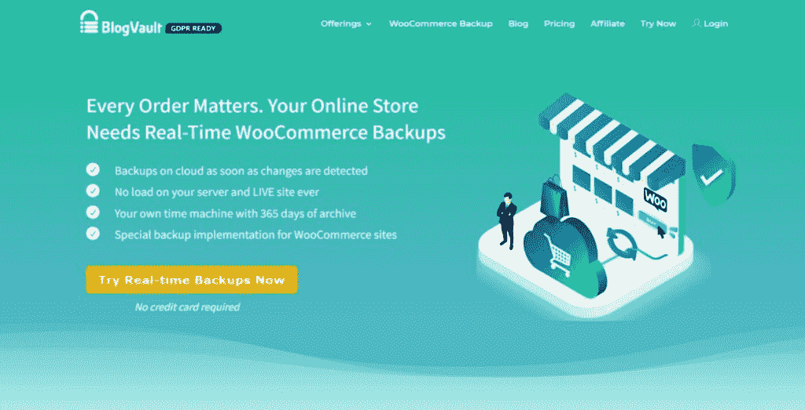
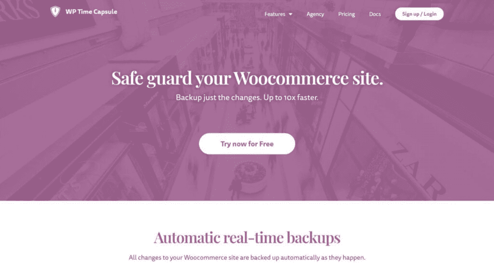
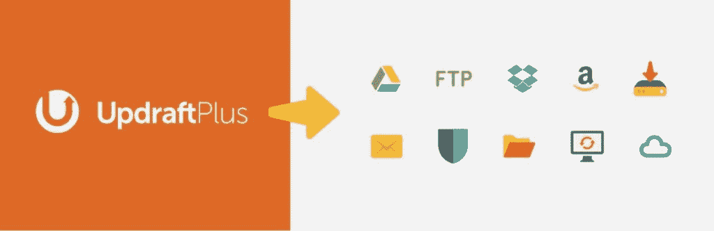
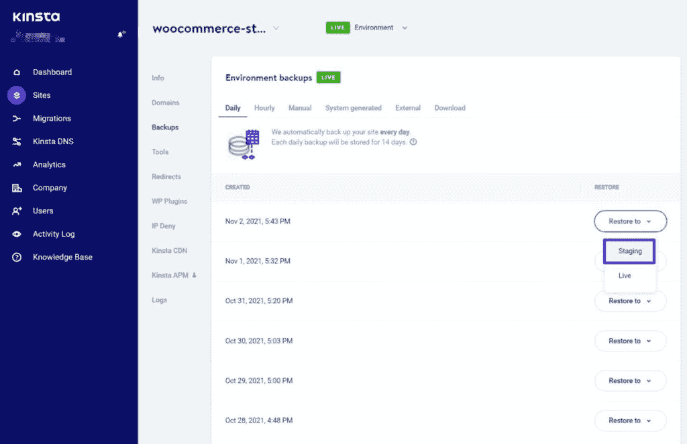
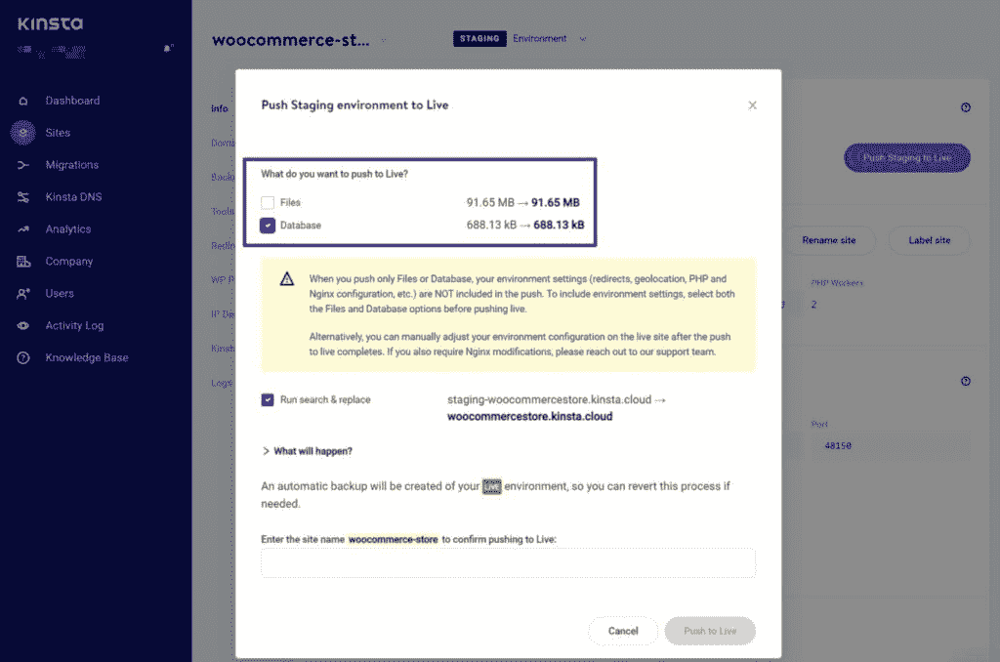
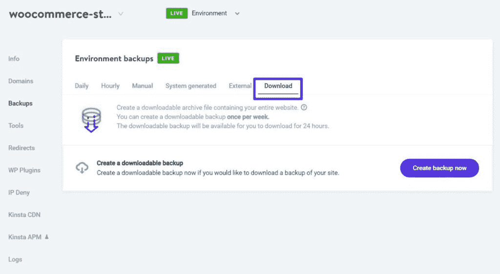

# 如何备份 WooCommerce 数据库以保护您商店的数据

> 原文：<https://kinsta.com/blog/how-to-backup-woocommerce-database/>

想知道如何备份 WooCommerce 数据库？

WooCommerce 是一个受欢迎的全服务电子商务插件,它让任何人都可以很容易地创建一个由 WordPress 支持的商店。

如果你[用 WooCommerce 建立了你的商店](https://kinsta.com/blog/woocommerce-tutorial/)，定期备份是必不可少的，以确保你永远不会丢失重要数据，如新订单、客户信息、库存状态等等。

虽然备份很重要，但您可能不确定如何开始以及多久备份一次商店，尤其是如果您的商店很忙，有很多订单要处理。

这篇文章将教你关于 WooCommerce 备份需要知道的一切，包括最佳实践和如何开始备份你的商店。

### 查看我们的[视频指南](https://www.youtube.com/watch?v=Taxun6CY6ds)如何备份 WooCommerce 数据库

## 为什么备份 WooCommerce 数据库很重要？

有了一个成熟的 WooCommerce 商店，你的商店的文件可能不会每天都有太大的变化。如果你已经选择了[一个 WooCommerce 主题](https://kinsta.com/blog/woocommerce-themes/)，添加了你的产品照片，并安装了[所有必要的插件](https://kinsta.com/blog/woocommerce-plugins/)，你的商店文件在很大程度上将保持不变。

> 需要在这里大声喊出来。Kinsta 太神奇了，我用它做我的个人网站。支持是迅速和杰出的，他们的服务器是 WordPress 最快的。
> 
> <footer class="wp-block-kinsta-client-quote__footer">
> 
> 
> 
> <cite class="wp-block-kinsta-client-quote__cite">Phillip Stemann</cite></footer>

[View plans](https://kinsta.com/plans/)

相比之下，你的 WooCommerce 商店的数据库是不断变化的。每次[购物者下订单](https://kinsta.com/learn/woocommerce-guide/)，注册账户，[，留下评论](https://kinsta.com/blog/best-wordpress-review-plugins/)等等，所有这些信息都会存储在你商店的数据库中。同样，当您更改订单状态、编辑产品库存状态以及对后端商店数据进行任何其他更改时，也是如此。

如果您丢失了商店数据库中的信息，可能会导致订单丢失、客户信息丢失、评论被删除、产品详情不准确以及其他重大问题。丢失这些数据会导致收入损失、[失去顾客的信任](https://kinsta.com/blog/conversion-rate-optimization-tips/)，并对商店的运作造成总体损害。

学习如何备份 WooCommerce 数据库并实施一个强大的备份策略可以帮助您避免这些问题。

如果你的实体店遇到问题，那绝对不是一件好事。但是拥有一个有效的 WooCommerce 备份策略可以确保这些问题只是带来不便，而不是灾难。

[想知道如何备份 WooCommerce 数据库？🤔没必要紧张😌⬇️ 点击推文](https://twitter.com/intent/tweet?url=https%3A%2F%2Fbit.ly%2F3GU51Dg&via=kinsta&text=Trying+to+figure+out+how+to+back+up+the+WooCommerce+database%3F+%F0%9F%A4%94+No+need+to+stress+%F0%9F%98%8C%E2%AC%87%EF%B8%8F&hashtags=WooCommerce%2CEcommerce)

## 你应该多久备份一次 WooCommerce 数据库？

你应该多久备份一次 WooCommerce 数据库取决于你的商店有多活跃。

你应该问自己的基本问题是:

如果我丢失了过去 X 分钟/小时/天的所有数据，这将是一个多大的问题

如果您的商店每周只有几个订单，并且您不经常编辑/更新产品详细信息，您可能只需要每天备份一次。

另一方面，如果您的商店每天收到几十个订单，即使丢失一天的数据也是一件大事。在这种情况下，您可能希望更频繁地进行备份。

就更频繁的备份而言，您有两种选择:

首先，你可以增加备份频率。例如，您可能每小时备份一次存储，而不是每天一次。这样，即使最坏的情况也只会让您丢失一个小时的数据。

然而，对于一些繁忙的商店来说，即使丢失一个小时的数据也可能是一个大问题。在这种情况下，您可能会选择第二个选项—实时增量备份。

通过实时增量备份，您的站点将在更改发生时自动备份更改。例如，当新订单到来时，数据库的更改会立即得到备份。

为了避免性能问题，这些工具将使用增量方法。这意味着该工具将只备份新的更改—它不会对您的存储进行每次更改的完整备份。因此，当新订单到来时，它将只备份该订单中的新数据库信息，而不是对您的数据库进行完整备份(因为它已经备份了其他信息)。

## 如何用 Kinsta 备份你的 WooCommerce 商店

如果你用 Kinsta 托管你的 WooCommerce 商店，Kinsta 的[专用备份工具](https://kinsta.com/help/wordpress-backups/)可以轻松备份你商店的数据库和文件。

首先，默认情况下，Kinsta 会每天自动备份您的完整存储(文件和数据库)。您还可以选择增加这些自动备份的频率，我们稍后将对此进行讨论。

您可以从位于 [MyKinsta](https://kinsta.com/mykinsta/) 的商店仪表盘的**备份**选项卡中访问所有这些备份。

The Kinsta backup tool.

如果您要对您的商店进行更改，您也可以让 Kinsta 只需点击几下鼠标，就可以对您的商店进行手动备份。只需前往**手动**选项卡，点击**立即备份**按钮:

How to take a manual backup at Kinsta.

### 如何提高 Kinsta 自动备份的频率

默认情况下，Kinsta 每天都会自动备份您的存储，并将这些备份存储 14-30 天(取决于您的计划)。

如果您的商店需要更频繁的备份，您可以支付一点额外费用，按照以下计划更频繁地备份:

*   **每六小时**——每个站点每月 50 美元。
*   **每小时**每个站点每月 100 美元。

要升级您的备份频率，请转到 Kinsta 备份工具中的**每小时**选项卡。

How to change Kinsta backup frequency.

## 如何用插件备份 WooCommerce 数据库

如果你不是用 Kinsta 托管，或者你的商店有独特的备份需求，你可能想用 WooCommerce 备份插件。

使用专用备份插件的一个优点是可以访问实时增量备份。同样，这意味着您的备份解决方案将在新的更改发生时立即备份它们。

然而，这里需要注意的是，所有提供实时增量备份的[插件](https://kinsta.com/blog/wordpress-backup-plugins/)都为此功能收费。根据插件的不同，你需要支付每年 49 美元到 480 美元不等的费用。

以下是你的最佳选择。

### 喷气背包备份

The Jetpack backup service.

Jetpack Backup 是 Automattic 提供的一个流行的备份插件/服务，这家公司也是 WooCommerce 插件的开发者。这项功能曾经是综合喷气背包插件的[的一部分，但 Automattic 最近在 2021 年 10 月将其剥离出来，作为自己的](https://kinsta.com/knowledgebase/wordpress-jetpack/)[独立喷气背包备份插件](https://wordpress.org/plugins/jetpack-backup/)。

Jetpack Backup 将使用增量备份方法自动将您的站点备份到 Automattic 的服务器上。根据您的计划，您可以获得每日备份或实时备份。

它还提供无限的备份存储，只需点击几下鼠标，您就可以将您的存储快速恢复到任何备份点。

Jetpack Backup 的价格取决于您的备份频率:

*   **每日增量备份**——每年 96 美元。
*   **实时增量备份**——每年 480 美元。

第一年你还可以享受 50%的折扣，所以从第二年起你只需要支付全部零售价。

### 博客跳马

The BlogVault backup service.

BlogVault 是一个高级 WordPress 备份插件，可以自动备份你的网站，并将备份存储在 BlogVault 的云中。

总的来说，它在功能上与上面的 Jetpack 备份插件非常相似。

入门级计划将每天自动备份您的存储，并将这些备份存储 90 天。然而，大多数 WooCommerce 商店可能会想要高级计划，该计划提供实时增量备份和 365 天的存储。

除了备份您的站点之外，BlogVault 还可以让您轻松地将备份恢复到实时站点或临时服务器。

入门级的基本计划每年需要 89 美元，但以 WooCommerce 为重点的高级计划每年需要 249 美元。

### WP 时间胶囊

The WP Time Capsule plugin.

WP Time Capsule 提供了与前两个插件略有不同的方法。WP Time Capsule 不是为你的备份创建自己的云存储服务，而是让你将备份发送到你首选的云存储提供商的账户。

## 注册订阅时事通讯

### 想知道我们是怎么让流量增长超过 1000%的吗？

加入 20，000 多名获得我们每周时事通讯和内部消息的人的行列吧！

[Subscribe Now](#newsletter)

目前，WP Time Capsule 支持以下选项:

*   亚马逊 S3
*   Google Drive
*   Dropbox
*   B2 的背景
*   芥末

这增加了设置过程的复杂性，但也意味着您可以完全控制您的数据。WP Time Capsule 也比前两个插件便宜，因为它只卖一个插件(而不是捆绑在存储服务中)。

WP Time Capsule 提供实时增量备份，因此每次有变化时，它都会自动备份您的数据库。它还提供增量恢复，因此您可以快速将您的存储恢复到特定的更改。

如果您使用亚马逊 S3、Wasabi 或 Backblaze B2 作为存储源，您还可以受益于 365 天的恢复窗口。但是，其他云服务仅支持 30 天的恢复窗口。

WP Time Capsule 最多可以在两个网站上使用，一年的许可费用仅为 49 美元，终身支持和更新费用为 149 美元。

但是，请记住，您还需要为您的云存储支付费用。通常，这是相当负担得起的，虽然。例如，亚马逊 S3 标准版每月每 GB 仅需 0.023 美元。每 GB 2.3 美分，因此 43 GB 的备份每月只需 1 美元。

### UpdraftPlus

The UpdraftPlus plugin.

[UpdraftPlus](https://wordpress.org/plugins/updraftplus/) 在这份榜单上有两个独特之处——一个正面，一个负面:

*   正面-它有一个全功能的免费版本，其他插件都没有提供。
*   **负**–不支持实时备份。它支持增量备份，但你不能实时备份。

虽然 UpdraftPlus 不支持实时备份，但它允许您设置自己的自定义自动备份计划。您可以完全控制计划—对于更高级的用户，您甚至可以基于[服务器 cron 作业](https://kinsta.com/help/how-to-write-a-cron-job/)或 [WP-CLI](https://kinsta.com/blog/wp-cli/) 触发备份。

这里的特殊细节是 UpdraftPlus 允许您对站点的其他部分使用不同的备份计划。例如，您可以每小时备份一次 WooCommerce 数据库，但每天只备份一次文件。或者，您可以更进一步，每 30 分钟备份一次数据库，每三天备份一次文件，这完全由您决定。

为了存储您的备份，UpdraftPlus 可以自动将备份文件发送到一系列云存储提供商，包括:

*   [亚马逊 S3](https://kinsta.com/knowledgebase/wordpress-amazon-s3/)
*   [谷歌云存储](https://kinsta.com/knowledgebase/wordpress-google-cloud-storage/)
*   任何 S3 兼容提供商，包括数字海洋空间、Cloudian、Eucalyptus 等
*   Google Drive
*   Dropbox
*   任何 FTP 服务器
*   Rackspace 云

或者，开发者也提供他们自己的付费存储服务，名为 UpdraftVault。

UpdraftPlus 还可以让您轻松地恢复全部或部分站点。例如，您可以在不更改任何文件的情况下恢复 WooCommerce 数据库备份。

该插件的免费版本应该适用于许多商店，尤其是如果您习惯使用 cron jobs 或 WP-CLI 来安排备份的话。

高级版本的价格为 70 美元，为您提供增量备份、灵活的仪表板内备份计划、更多的异地存储选项、更多的数据库备份选项以及其他有价值的功能。

厌倦了低于 1 级的 WordPress 托管支持而没有答案？试试我们世界一流的支持团队！[查看我们的计划](https://kinsta.com/plans/?in-article-cta)

## 如何从备份中恢复您的 WooCommerce 商店

拥有商店的最新备份只是难题的一部分——如果你的商店遭遇灾难，你还需要能够恢复备份。

首先，我们总是建议将备份恢复到临时站点。这样，您可以在启用备份之前对其进行全面测试。

如果您使用的是 Kinsta 的备份工具，您可以直接恢复到您的临时站点。

How to restore a backup to Kinsta staging.

一旦你在你的临时站点上测试了所有的东西，你就可以让你的站点的恢复版本上线了。通过 [Kinsta 的选择性推送暂存选项](https://kinsta.com/feature-updates/selective-push/)，您可以选择仅将数据库更改应用到您的实时存储，或者同时推送文件和数据库。

How to use Kinsta’s selective push feature.

如果你用的是上面的 WooCommerce 备份插件，它们都提供了简单的一键恢复过程。

它们还为您提供了将存储恢复到暂存站点的选项，尽管有些选项比其他选项更容易。我们建议参考插件的支持文档来获得帮助。

如果需要，你也可以[手动迁移你的商店](https://kinsta.com/blog/wordpress-migration-plugins/)来激活它，尽管你应该尽可能避免手动途径。

## WooCommerce 备份最佳实践

上面我们已经介绍了一些技巧，但是让我们快速回顾一下 WooCommerce 备份的最佳实践。

### 根据需要经常备份

我们在这篇文章的前面讨论了备份频率，但它值得快速重温，因为它对保持您商店的数据安全至关重要。

一般来说，您的商店的理想备份策略取决于它的活跃程度。

请记住，这是一个需要回答的重要问题:

如果我丢失了过去 X 分钟/小时/天的所有数据，这将是一个多大的问题

对于一些商店，答案可能是一天，在这种情况下，每天备份可能就可以了。对于其他商店，答案可能是五分钟，在这种情况下，您可能需要实时增量备份解决方案。

### 异地存储备份

永远不要把你的备份和你的 WooCommerce 商店放在同一个服务器上，那样会产生单点故障。如果你的商店出了什么问题，你会失去*你的实时商店和备份。*

如果您正在使用 Kinsta 备份，您不必担心这一点，因为我们会为您安全地存储备份。

如果你想要一些额外的灵活性，你也可以购买[外部备份插件](https://kinsta.com/help/external-backups/)，让 Kinsta 将你的备份发送到你自己的[亚马逊 S3 或谷歌云存储账户](https://kinsta.com/blog/google-cloud-vs-aws/)。

另一方面，如果你使用的是 WooCommerce 备份插件，你需要确保你已经将插件配置为异地存储备份。像 Jetpack Backup 和 BlogVault 这样的插件会自动处理这个问题，而像 UpdraftPlus 这样的插件则需要你专门设置异地存储。

您还可以考虑将备份副本下载到本地计算机，这有助于您遵循 3-2-1 备份策略，即总共存储三份数据副本，其中两份在本地的不同介质上，至少一份在异地。

在 Kinsta，您可以通过进入备份工具的**下载**选项卡，每周下载一次备份。

How to download a backup to your local computer.

### 将备份还原到临时站点

除非完全不可避免，否则您绝不会想要将备份直接恢复到您的实时网站。

虽然备份*应该*是您的商店在该备份点存在的完美代表，但测试您网站的恢复版本以确保没有任何问题是至关重要的。

如果您恢复到一个临时站点，您将能够在一个安全的环境中彻底测试一切。一旦您验证了您的存储运行正常，您就可以实时推送暂存环境。

如果您使用 Kinsta 进行托管，您还可以利用 Kinsta 的选择性推送暂存功能来实时推送暂存数据库，而无需更改实时站点上的任何文件。这对于 WooCommerce 商店来说尤其方便，因为你的商店的大部分更改都在数据库中，而不是在文件中。

### 定期测试您的备份

只有在以下情况下，备份才有用:

1.  他们定期工作。
2.  如果你的网站出了问题，你知道如何恢复它们。

出于这些原因，定期测试您的备份以确保您了解该过程并能够从您的备份文件恢复您的站点的工作副本是很重要的。

为了在一个安全的环境中进行测试，您可以练习将您的备份恢复到一个临时站点，或者使用一个本地开发工具，比如 [DevKinsta](https://kinsta.com/feature-updates/local-wordpress-development/) 。

[不确定多久备份一次你的商店？🤷‍♀️继续读下去👀](https://twitter.com/intent/tweet?url=https%3A%2F%2Fbit.ly%2F3GU51Dg&via=kinsta&text=Not+be+sure+how+often+to+back+up+your+store%3F+%F0%9F%A4%B7%E2%80%8D%E2%99%80%EF%B8%8F+Read+on+%F0%9F%91%80&hashtags=WooCommerce%2CEcommerce)

## 摘要

了解如何备份 WooCommerce 数据库对于保护您商店的数据至关重要。

如果你在 Kinsta 上托管，Kinsta 会每天自动备份你的商店。如果您需要更频繁的备份，您可以将自动频率升级到每小时一次。

对于更频繁的备份，您可以考虑一个实时增量备份插件来备份发生的更改。

一旦您有了备份，您可以快速将您的商店恢复到一个[暂存站点](https://kinsta.com/help/staging-environment/)。然后，通过 Kinsta 的选择性暂存推送功能，您可以选择是恢复整个网站还是仅恢复 live store 上的数据库更改。

* * *

让你所有的[应用程序](https://kinsta.com/application-hosting/)、[数据库](https://kinsta.com/database-hosting/)和 [WordPress 网站](https://kinsta.com/wordpress-hosting/)在线并在一个屋檐下。我们功能丰富的高性能云平台包括:

*   在 MyKinsta 仪表盘中轻松设置和管理
*   24/7 专家支持
*   最好的谷歌云平台硬件和网络，由 Kubernetes 提供最大的可扩展性
*   面向速度和安全性的企业级 Cloudflare 集成
*   全球受众覆盖全球多达 35 个数据中心和 275 多个 pop

在第一个月使用托管的[应用程序或托管](https://kinsta.com/application-hosting/)的[数据库，您可以享受 20 美元的优惠，亲自测试一下。探索我们的](https://kinsta.com/database-hosting/)[计划](https://kinsta.com/plans/)或[与销售人员交谈](https://kinsta.com/contact-us/)以找到最适合您的方式。