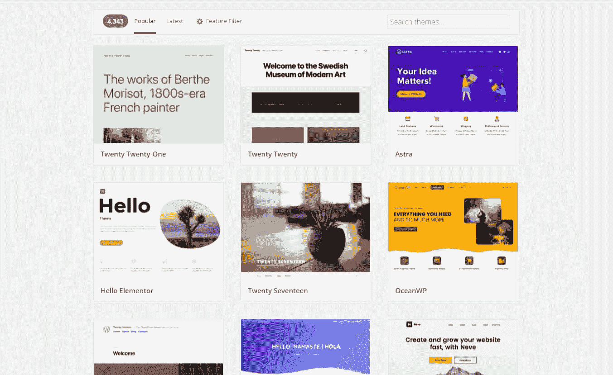
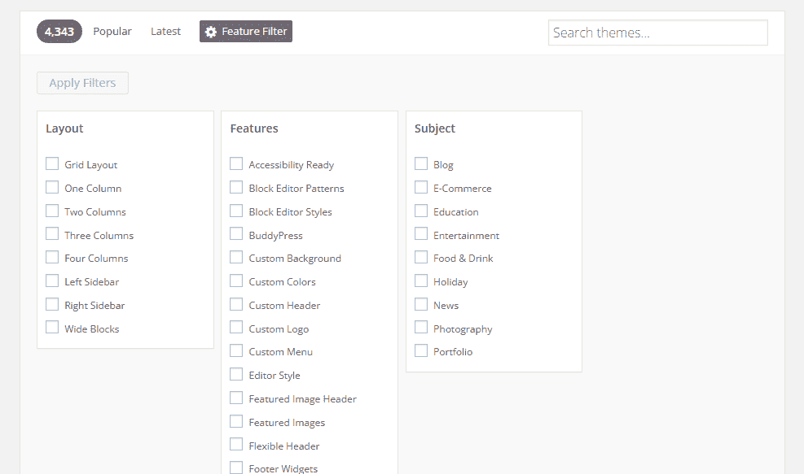
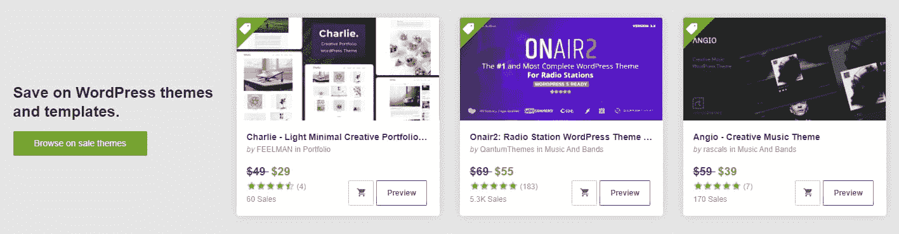
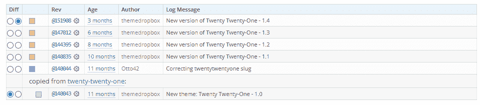
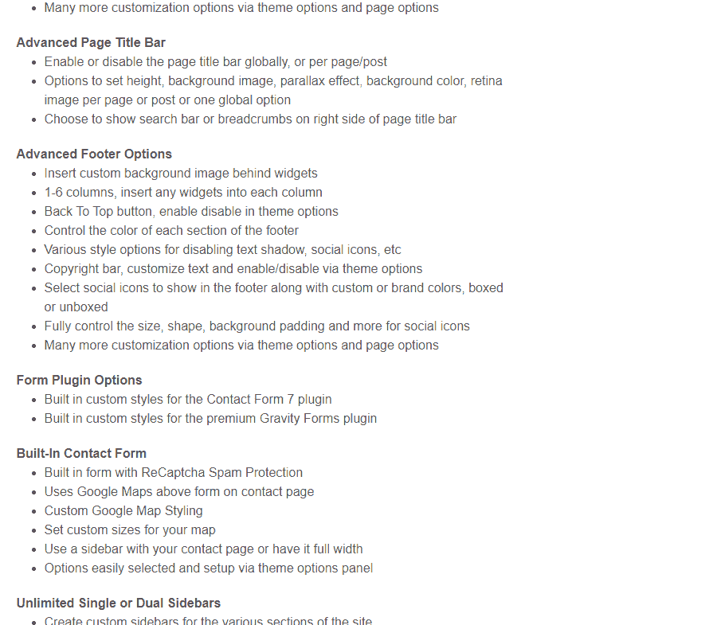
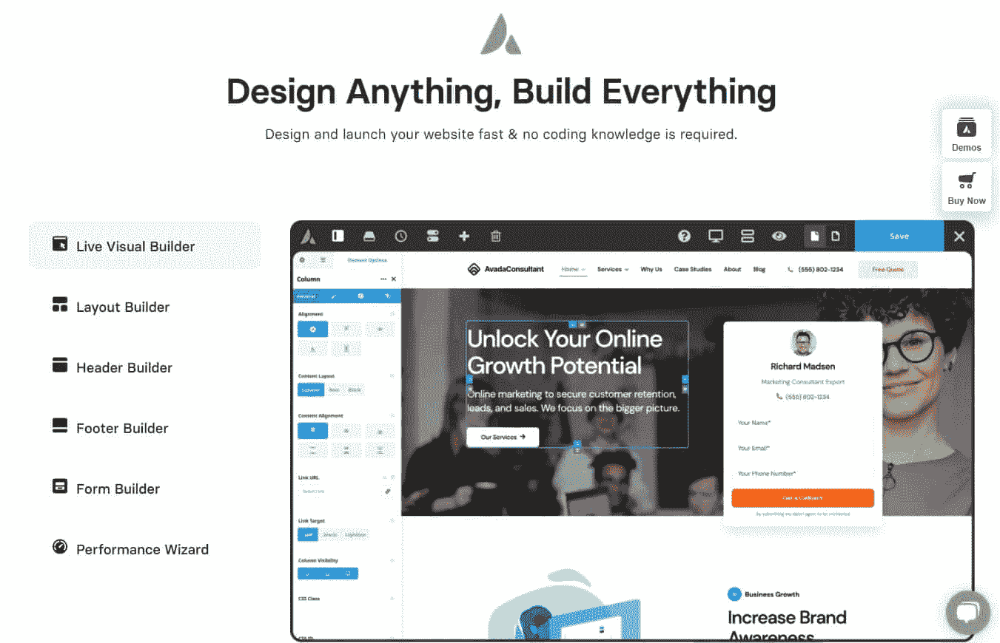
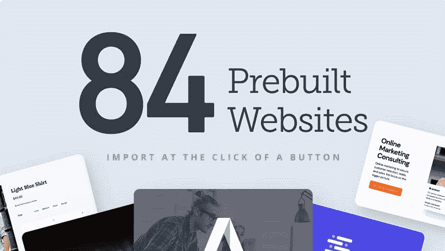
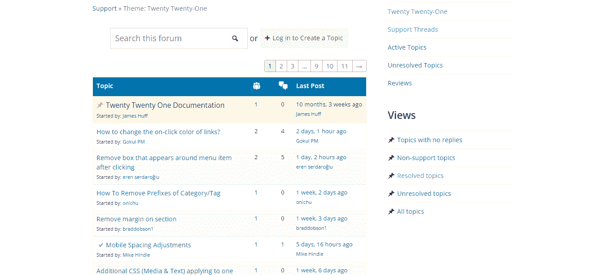
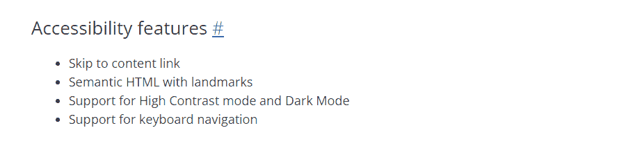

# 如何选择一个不会降低网站速度的主题

> 原文：<https://kinsta.com/blog/how-to-choose-a-wordpress-theme/>

如今，WordPress 主题仓库充满了膨胀软件，塞满了糟糕的代码、不必要的预装插件和巨大的文件大小。这些主题中的大部分会让你的网站慢如蜗牛，新用户可能无法识别出罪魁祸首，直到为时已晚。因此，知道如何选择 WordPress 主题是至关重要的。

但是有成千上万的主题，这并不总是简单明了的。你怎么知道哪些是好的，哪些会因为缓慢的加载时间而让你的访问者感到沮丧呢？

找一个合适的主题没有硬性规定，但是这些建议会让你知道应该注意什么，应该避免什么。

### 查看我们的[视频指南](https://www.youtube.com/watch?v=a2mcZ-S9u7A)来选择一个快速的 WordPress 主题

## 为什么选择正确的主题很重要

如果你能为你的网站做一件事，你应该花时间仔细挑选一个合适的主题。

WordPress themes

知道如何选择一个 WordPress 主题是你整个网站的基础，因为你的访问者首先会接受的是你的布局、导航、调色板、[字体](https://kinsta.com/blog/best-google-fonts/)、[图片](https://kinsta.com/blog/optimize-images-for-web/)以及其他美学选择。

如果你给人留下了极好的第一印象，他们更有可能留下来阅读内容。设计糟糕或者页面速度延长的网站，他们会在你的网站完成加载之前就把它关掉。

就当是装修实体店吧。愉快的氛围会吸引你，并让你再次光顾。你的网站设计也是如此。一个独特的、制作精良的网站无疑会影响你获得的回头客、潜在客户和顾客的数量。

## 选择 WordPress 主题时需要考虑什么

当[挑选一个主题](https://kinsta.com/tools/wordpress-theme-detector/)时，缩小范围可能会让人不知所措。你可能会有十几个潜在的选择，但不知道哪一个是最好的。幸运的是，一些考虑可以帮助你排除大多数选项。
T3】

### 要查找的功能

每个主题都是不同的，有各种各样的功能可供选择。有些只是装饰性的，但其他的对你的网站的实际功能可能很重要。

我们将在下面详细讨论这些特性，但是现在，这里有一个需要注意的快速列表。

*   小尺寸——最好不要选择一个功能齐全的主题，而是选择一个标榜自己时尚轻便、文件最小、几乎没有插件依赖的主题。
*   **定制**–有些主题基本上是预先做好的，没有给你多少改变设计的选择。这意味着你的网站看起来就像其他成千上万使用这个主题的网站一样。选择有大量[定制选项](https://kinsta.com/blog/how-to-customize-wordpress-theme/)的。
*   可访问性(Accessibility)–使用与屏幕阅读器一起工作并且对其他辅助设备友好的主题总是一个好主意。这将有助于很大一部分你的访客，也有助于搜索引擎优化，因为谷歌提供了搜索引擎优化促进无障碍网站。
*   **插件支持**——支持热门必备插件的主题，如 [WooCommerce](https://kinsta.com/blog/fastest-woocommerce-theme/) 、BuddyPress、[页面生成器](https://kinsta.com/blog/wordpress-page-builders/)和联系人表单插件(取决于你的需求)总是受欢迎的。
*   **多语言**–选择一个支持非拉丁字符的翻译主题。

### 外观首选项

这可能不言而喻，但有一件事你应该问自己，而选择一个主题是你希望它看起来像什么。试着想象你的网站，列出你想要的装饰功能，甚至可以画一个模型。

如果你不确定如何设计，可以看看类似的网站。如果你正在[写博客](https://kinsta.com/blog/best-blogging-platform/)，你最喜欢的博客看起来怎么样？博主如何让自己的网站与众不同？如果你正在设计一个商店，看看你所在行业中一些流行的电子商务商店。

你甚至可能想做一点研究，列出利弊清单。记下你注意到的任何巧妙的设计选择。这些网站最大的优点是什么？设计或布局有什么特别吸引人的地方吗？导航容易且不费力吗？你有什么不喜欢的吗？

最重要的是，试着想想你如何能给 wow 访问者增加你的触觉。你不想打破常规——常见的工业设计元素的存在是有原因的——但考虑给事物添加你的旋转是个好主意。

查看 WordPress 主题库中的[特性过滤器](https://wordpress.org/themes/)。您可以从各种功能中进行选择，如边栏位置、栏、布局类型和页眉/页脚。

Feature Filter on the WordPress theme repository

如果你选择使用这样的过滤器，其他网站比如 Themeforest 可能没有，但是这可以给你一个你正在寻找的一般设计的概念。
T3】

### 免费与付费

当谈到免费和付费主题时，许多人会说，如果你正在建立一个专业网站，这个选择是显而易见的，但这可能不是真的。

那些站在付费主题一边的人声称免费主题的代码质量差，设计不吸引人，而且通常不值得信任。

溢价主题是膨胀流行的最重要的贡献者之一。付钱并不能保证你得到的是圆滑的、专业的、由熟练的开发人员编写的东西。

没有什么能阻止任何一个经验很少的开发者用从互联网上复制的代码拼凑出一个主题，并在 ThemeForest 上出售。代码质量与插件是免费的还是付费的关系不大，更多的是与制作它的人有关。

高级软件也倾向于加载大量不必要的功能，当你试图关闭时，会使你的网站崩溃。

也就是说，付费主题也有一些好处。如果你找到一个专业的开发工作室，那么你可能会得到一个更漂亮、编码更好的主题，物有所值。你也保证支持和更新，而免费开发者可能没有时间继续支持免费发布的软件。

此外，免费主题也非常受欢迎。如果你想看起来更独特一点，获得付费主题是一个很好的方法。

WordPress themes on ThemeForest

但是高级主题并不一定比免费主题更好。浏览免费和付费的，阅读评论，做你的研究，挑选你最喜欢的和认为最适合你网站的。

### 售后修改(定制代码或子主题)

在你安装了你的主题之后，很有可能你需要编辑它来添加新的特性或者调整现有的特性。如果您使用内置工具来替换调色板和上传徽标，您不需要太担心，但是严肃的代码编辑有独特的考虑。

在这种情况下，如果出现问题，你应该使用一个[登台站点](https://kinsta.com/help/premium-staging-environments/)或者一个[子主题](https://kinsta.com/blog/wordpress-child-theme/)。

问题是有些主题不支持子主题，或者甚至试图限制定制。在你锁定自己之前，确保你的主题支持代码编辑和子主题。

## 如何选择 WordPress 主题的提示

需要更多指导吗？上面的想法可以给你一个大概的想法，但是这些建议可以帮助你缩小范围。这里有一些你想在主题中使用的关键东西。

### 1.简单

许多主题会试图用华而不实的设计和成千上万的功能让你眼花缭乱，很容易上当。但是通常情况下，最好的主题是最简单的——做好本职工作，别无其他。

Twenty Twenty-One WordPress theme

一个简单的外观可以走很长的路，对于非设计师来说，它通常是最好的选择，也是最容易使用的。一个令人愉悦的布局，一些有品味的动画，大量的定制选项，你就有了一个很棒的主题。

这可能不是你的访问者见过的最令人难忘的网站，但你也不会得到一个独特的，引人注目的设计，40 美元的 WordPress 主题。过度的设计只会降低网站的速度，用过多的内容淹没访问者。

最重要的是，你的网站是功能性的、可读性强的，并且完成了它的工作，而不是看起来普通而乏味。选择一个漂亮但简单的主题，有足够的功能来添加你的风格而不偏离轨道。

### 2.发布频率

你可能认为使用任何主题都是可以的，只要它编码良好并且没有明显的问题。但事实是，一个三年前的顶级主题今天可能充满了过时的代码和明显的安全漏洞。

互联网是不断发展的。每年，编码标准都会更新，让你当前主题的 HTML 充满冲突。另外，[PHP](https://kinsta.com/blog/php-8-1/)等系统的新版本会定期发布。随着黑客的发现，现有的漏洞变得显而易见。

这就是为什么使用超过两年没有更新的插件不是一个好主意。随着时间的推移，越来越多的错误和安全问题将变得明显，如果您不能更新到最新的 PHP 版本，您将得不到支持。

每周甚至每月的更新是不必要的，但是你应该期待一年几次更新来修复错误和解决漏洞。

Update log

查看支持论坛，看看问题目前是否得到解决，这是一个好主意。如果主题已经几年没有更新了，支持论坛上充满了未解决的抱怨，那么最好继续前进。

### 3.大小

功能丰富的主题的问题在于，它们会让你的网站瞬间膨胀，让你的加载速度变得极其缓慢，而这一切都发生在你进行任何定制或安装插件之前。

轻量级主题总是最好的。低于 200-600 KB 的主题可以称为真正的小，而 2-3MB 左右的任何内容都在可接受的范围内。任何更多的事情都表明一个非常可能的情况，臃肿的软件充满了你永远不会使用的功能。

虽然这不是一个通用的规则，但你希望你的网站开始时尽可能小，因为当你添加内容并开始安装插件时，页面大小将不可避免地增加。

### 4.响应性

每个名副其实的主题都会把自己列为响应式的。你可能很清楚手机的繁荣； [90%的互联网用户使用移动设备浏览网页](https://www.statista.com/topics/779/mobile-internet/)。无论是手机、平板电脑还是智能手表，都有各种不同的屏幕尺寸。

解决方案是响应式设计，网站适应你的屏幕大小。在购买一个主题之前，有必要访问一下你手机上的演示页面，或者至少调整一下你的浏览器窗口，看看它在小屏幕上是什么样子。

## 注册订阅时事通讯

### 想知道我们是怎么让流量增长超过 1000%的吗？

加入 20，000 多名获得我们每周时事通讯和内部消息的人的行列吧！

[Subscribe Now](#newsletter)

[图像要适当缩放](https://kinsta.com/blog/optimize-images-for-web/)，版面变化没有任何奇怪的效果。如果一个主题没有响应性，它就不值得使用。

### 5.兼容插件

很少会发现一个插件和主题不在一起，但是不兼容是存在的。仔细阅读文档，看看是否有想要的插件与你选择的主题不匹配。

更重要的是，你可能想要寻找与某些插件集成的主题。虽然一个完全需要几十个插件的主题可能是一个危险信号，但知道它将与流行的[缓存](https://kinsta.com/blog/wordpress-caching-plugins/)、[安全](https://kinsta.com/blog/wordpress-security-plugins/)和[电子商务](https://kinsta.com/blog/wordpress-ecommerce-plugins/)插件一起工作会是一个不错的奖励。

### 6.评级和评论

看看收视率总是个好主意。阅读评论可以让你很好地了解大多数人喜欢和不喜欢这个主题的什么，以及哪些功能最有影响力。

WordPress theme reviews

为了更平衡地看待主题，请注意三星和四星评论，因为用户更有可能对他们喜欢和不喜欢的内容做出合理的解释。当然，两星和一星的评价可以让你知道什么不是很好。

你也可以搜索有深度的第三方评论，但要留意使用[附属链接](https://kinsta.com/knowledgebase/affiliate-program/)的人，并找到一个尝试过该主题的公正来源。

这些不会帮助你知道长期使用它是什么感觉，但它们至少应该让你知道这个设计有多吸引人，使用起来有多简单。

### 7.SEO 优化的

选择一个 SEO 优化的主题总是一个好主意，但是很难一眼看出它是否符合这个标准。大多数 SEO 优化都是在幕后进行的，并且与页面的底层结构有关。

虽然每个主题都会说它是 SEO 优化的，但并不是所有的都是。除非你精通 HTML5，否则你可能不知道如何辨别它是否真正制作精良。

尽管如此，SEO 友好的主题通常具有较小的尺寸(较快的速度)、反应灵敏的设计和良好的 HTML 结构。

寻找像[不恰当嵌套的标题](https://www.w3.org/WAI/tutorials/page-structure/headings/)/多个 H1 标题、混乱的导航菜单和[混乱的 HTML 代码](https://validator.w3.org/)这样的线索，就知道一个页面的结构很差。

请记住，大多数 SEO 优化都涉及到创建高质量的内容，所以这主要取决于你。

### 8.安全的

就像 SEO 一样，每个主题都会说它是安全的，但是如果不熟悉代码，就没有办法测试这个声明。与 SEO 不同的是，如果不深入研究源代码，就很难发现安全性差的主题。

你可以使用像主题检查插件这样的工具或者像 T2 这样的在线扫描仪。当在你的网站上测试时，这些是最有效的。

Theme security check notifications

如果只有几个问题，没有必要惊慌，因为不可能编写一个完全没有警告的主题，而且也不是所有问题都是主题的错。但是，如果你看到几个突出的通知弹出，可能是时候改变了。

还有主题本身与恶意软件捆绑在一起的问题。为了避免这种情况，坚持使用像官方 WordPress 主题库这样的知名供应商，或者像 TemplateMonster 或 ThemeForest 这样受欢迎的第三方供应商。不要在没有大量研究的情况下安装来自未知网站的软件，并且[避免盗版/无效主题](https://kinsta.com/blog/nulled-wordpress-plugins-themes/)。

Struggling with downtime and WordPress problems? Kinsta is the hosting solution designed to save you time! [Check out our features](https://kinsta.com/features/)

### 9.翻译就绪

如果你打算翻译你的网站，并让全世界的人都可以使用它，选择一个主题，并把它列为“[翻译就绪](https://translatepress.com/how-to-translate-wordpress-theme/)”是非常必要的

这样的主题有适当的文件，让您可以引用您的翻译文件，并根据需要交换页面上的文本，以及处理 RTL 语言和非拉丁字母。这听起来可能很简单，但如果你自己去设置，那绝对是一场噩梦。

即使你现在不打算翻译你的网站，你也不知道将来你是否会有几十万访问者，你可能会开始考虑本地化你的内容并引入国际访问者。

不要切换到一个新的主题或者付钱给开发人员来准备翻译，而是选择一个已经为你做好工作的主题。

## 要避免的主题

你现在知道在一个主题中应该寻找什么，但是你想要避免什么呢？甚至像 [Avada](https://avada.theme-fusion.com/) 、ThemeForest 上最畅销的[主题这样的热门主题也不能幸免于膨胀。](https://themeforest.net/category/wordpress?sort=sales)

虽然符合这些标准的主题并不总是坏的，但如果你考虑的主题太大，有不必要的大量功能列表，或者有其他问题，你应该小心。

### 1.傲慢的

主题膨胀对你和你的访问者来说是一个严重的问题。一个主题塞满了各种功能，不太可能对用户友好，而且这些功能会大大增加它的尺寸。

一个优化不佳的主题可以一手毁掉你的网站速度。所有这些功能在纸上听起来可能很棒，但是一个巨大的主题，里面塞满了你永远不会用到的东西，会影响你的性能。

Bloated WordPress themes make your website slower.

如前所述，轻量级主题可以低于 1MB，而优化良好的主题很少会超过 2-3mb。像 Avada 这样的大型主题和“工具包”可以以超过 8mb 的速度运行，并且还在继续，如此之大以至于一些网络主机甚至不让你直接上传它们。

WordPress 核心，包括它所有的功能，只有 8mb 多一点。想想看，为了匹配或超过 WordPress 本身的大小，有多少杂乱的东西必须被塞进一个简单的美学模板中。

这就是为什么你应该选择做好本职工作的优化过的主题，而把实际的功能留给插件。

### 2.太多选择

当你访问一个主题描述时，一个常见的景象是一大堆看起来没完没了的特性。但这是好事，对吧？如果能以同样的价格获得所有这些功能，为什么还要购买简单的东西呢？

事实是，那些没完没了的功能列表，几十个预制模板和数百个捆绑插件，是一个膨胀的主题的标志，很可能会让你的网站慢下来。

这些所谓的“多用途”主题，问题太多，不胜枚举。

你永远不会使用所有这些几百个小功能，但它们仍然在那里，膨胀的文件大小和减慢你的网站。此外，更多的功能意味着更多的潜在安全漏洞。这就是为什么你应该使用轻量级的主题，只安装你需要的插件！

像 Avada 这样带有定制网站和表单生成器等功能的主题，会导致一个被称为“主题锁定”的问题。跳过为插件付费似乎是一个好主意，但是当你最终尝试切换到一个新的主题时，你会发现你的网站完全崩溃了，充满了奇怪的布局问题和丑陋的短代码。

Live visual builder within Avada

这就是为什么你应该避免使用带有[自定义帖子类型](https://kinsta.com/blog/wordpress-custom-post-types/)、短代码或任何重要功能(如联系表单或构建器)的主题，而是使用插件。

最后，预制模板也不总是一件好事。它们抬高了价格和主题的大小，通常没有用，除非你在 24 小时内拼凑一个站点，并且不打算替换任何演示图片或内容。

几个不同布局的模板会很有帮助，但是一百个针对每一个可能的利基市场的演示是多余和不必要的。

Prebuilt demos in the Avada theme

Avada 标榜自己拥有 550 多页的文档，但是对于一个为你的网站提供简单设计基础的工具来说，这似乎太多了。

如果你需要这些功能，最好依赖那些可以轻易关闭的插件，而不是把它们挂在你网站最重要的后台支持上，这样以后就很难换掉了。

### 3.非活动支持

不积极的支持从来都不是一个好兆头。无论你是需要帮助安装一个主题还是修复一个突然出现的 bug，向官方开发者求助总是好的。如果没有支持，这是一个很好的迹象，表明它不会再更新了。

如果你使用的是 WordPress 知识库中的主题，通过访问它的页面，向下滚动，查看支持论坛，很容易就能看出它是否被支持。带有复选标记的主题已被解决，所以如果您看不到任何复选标记，则可能不太受支持。

WordPress theme support forum

不幸的是，第三方网站上的支持往往不够透明。主题可能有支持论坛，在那里你可以手动检查主题是否得到解决，但是很难看到支持当前是否有效。

### 4.难见到的

最后，避免那些没有考虑到易访问性的主题是至关重要的。这会给辅助设备用户带来问题，即使您熟悉代码，自己解决也会很耗时。

主题可能会说它们是可访问的，但是要确保它们列出了它们已经采取的具体步骤。这可能包括屏幕阅读器优化、键盘快捷键或特殊功能，如 [Twenty Twenty One 的](https://kinsta.com/blog/twenty-twenty-one-theme/)对比颜色选择器。

Accessibility features in the Twenty Twenty-One theme

在安装之前，[亲自检查它是否可访问](https://accessiblewpthemes.com/check-your-theme/)或者通过[自动可访问性检查器](https://wave.webaim.org/)运行演示。

[不要让臃肿的主题拖慢你的网站。🙅‍♂️在本指南的帮助下选择正确的一个⬇️ 点击推文](https://twitter.com/intent/tweet?url=https%3A%2F%2Fkinsta.com%2Fblog%2Fhow-to-choose-a-wordpress-theme%2F&via=kinsta&text=Don%27t+let+a+bloated+theme+slow+down+your+site.+%F0%9F%99%85%E2%80%8D%E2%99%82%EF%B8%8F+Choose+the+right+one+with+help+from+this+guide+%E2%AC%87%EF%B8%8F&hashtags=WPTips%2CWordPressTheme)

## 摘要

缓慢、臃肿的主题是 WordPress 的一个大问题。这是一个会让你付出很大代价的问题，使得你很难在不破坏你的网站的情况下离开这个主题。

避免带有大量功能列表的主题，而是坚持简单、轻量级的主题，只包含基本要素。有大量的主题既实用又美观，不会因为一百个不必要的功能而陷入困境。

寻找简单、响应迅速、SEO 优化、安全并且定期更新的主题。避免笨重和臃肿的软件，它们的功能比你可能会用到的要多得多。

你在为你的新项目选择合适的主题时有困难吗？请在下面的评论中与我们的社区分享您的需求！

* * *

让你所有的[应用程序](https://kinsta.com/application-hosting/)、[数据库](https://kinsta.com/database-hosting/)和 [WordPress 网站](https://kinsta.com/wordpress-hosting/)在线并在一个屋檐下。我们功能丰富的高性能云平台包括:

*   在 MyKinsta 仪表盘中轻松设置和管理
*   24/7 专家支持
*   最好的谷歌云平台硬件和网络，由 Kubernetes 提供最大的可扩展性
*   面向速度和安全性的企业级 Cloudflare 集成
*   全球受众覆盖全球多达 35 个数据中心和 275 多个 pop

在第一个月使用托管的[应用程序或托管](https://kinsta.com/application-hosting/)的[数据库，您可以享受 20 美元的优惠，亲自测试一下。探索我们的](https://kinsta.com/database-hosting/)[计划](https://kinsta.com/plans/)或[与销售人员交谈](https://kinsta.com/contact-us/)以找到最适合您的方式。