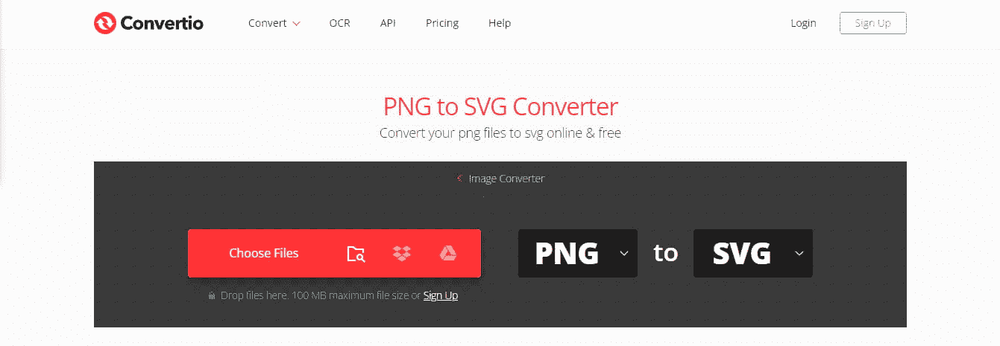

# SVG 和 PNG:有什么区别，什么时候使用它们

> 原文：<https://kinsta.com/blog/svg-vs-png/>

有几十种[图像文件类型](https://kinsta.com/blog/image-file-types/)，每一种都因压缩类型、格式和浏览器支持而异。但是最常用的两种格式是 SVG 和 PNG。

这两种文件类型有天壤之别，每一种都更适合特定的情况。它们当然不能在每个方面互换，但是您可能会发现 SVG 比标准的 PNG 图像能更好地执行特定的任务。

了解 SVG 和 PNG 的区别，以及它们在网站上的最佳应用。

### 查看我们的[视频指南](https://www.youtube.com/watch?v=VEi_BU2FqQw)到 SVG vs PNG

## What Is SVG？

SVG 代表[可缩放矢量图形](https://kinsta.com/blog/what-is-an-svg-file/)，它是网络上使用最广泛的矢量文件格式。让我们来分解一下:

*   **可缩放:**SVG 可以在不损害图像质量的情况下上下调整大小。无论它有多大或多小，它都会非常清脆和清晰。
*   **矢量:**大多数图像文件类型都包含像素。向量本质上是实时渲染图像的代码片段，将图像转换为您在屏幕上看到的像素。虽然它们显示相同的图像，但背景中的内容却大不相同。
*   **图形:**虽然 SVG 可能不太为人所知，但它是一种类似 PNG、JPEG 或 GIF 的图像文件类型。它只是处理事情的方式有点不同。

向量是用 XML 编写的代码片段，表示形状、线条和颜色，以阐述其工作原理。

> Kinsta 把我宠坏了，所以我现在要求每个供应商都提供这样的服务。我们还试图通过我们的 SaaS 工具支持达到这一水平。
> 
> <footer class="wp-block-kinsta-client-quote__footer">
> 
> 
> 
> <cite class="wp-block-kinsta-client-quote__cite">Suganthan Mohanadasan from @Suganthanmn</cite></footer>

[View plans](https://kinsta.com/plans/)

虽然只用代码创建图像是完全可能的，但大多数人使用的是矢量图形编辑器，如 Inkscape 或 Adobe Illustrator。你也可以[将 png](https://convertio.co/png-svg/)或其他光栅图像转换成 SVG，但是结果并不总是很好。

Convertio is a PNG to SVG converter.

当页面加载时，这些代码被转换成图形，所以您不能立即区分 SVG 和 PNG。但是因为 SVG 只是转换成像素的代码行，这意味着它们可以缩放到任何分辨率——大或小— [,而不会损失质量](https://kinsta.com/blog/lossy-compression/)。

Example of an enlarged SVG.

SVG 还支持动画和透明度，使其成为一种通用的文件格式。

唯一的问题是，它不像 PNG 这样的标准格式那样被广泛使用，所以它在旧的浏览器和设备上不太受支持，而且将它上传到您的网站并让它正确显示并不总是最容易的。

[想知道 SVG 文件和 png 有什么不同？🤔本指南旨在为您提供帮助💪 点击推文](https://twitter.com/intent/tweet?url=https%3A%2F%2Fkinsta.com%2Fblog%2Fsvg-vs-png%2F&via=kinsta&text=Wondering+what+makes+SVG+files+different+from+PNGs%3F+%F0%9F%A4%94+This+guide+is+here+to+help+%F0%9F%92%AA&hashtags=SVG%2CPNG)

### SVG 的利与弊

尽管仍没有像 PNG 这样的光栅文件类型那样广泛使用，但矢量图形的流行程度正在快速增长。它们完成一些光栅图像无法完成的重要任务。这就是人们喜欢 SVG 的原因。

*   SVG 图像是可缩放的。你可以以任何分辨率设计它，它会在不损害质量或像素化的情况下放大或缩小。对于光栅图像，你需要从一开始就知道你想要什么样的尺寸，否则你可能会使图像过大或过小。
*   SVG 总是看起来清晰而美丽，因为从来没有经历过质量损失。即使稍微调整大小，光栅图像也会开始看起来模糊。
*   由于 SVG 只是代码，它们的文件大小是最小的[并且经过了很好的优化](https://kinsta.com/blog/optimize-images-for-web/)。SVG 优化器的存在使得它们更易于管理。如果你使用它们，你的网站可能会加载得更快一些。
*   与 png 不同，SVG 支持动画。

SVG 比 PNG 好很多，从可伸缩到更小，但并不是在所有情况下都更好。这是矢量文件类型的缺点。

*   虽然 SVG 在所有主流的现代浏览器上都受到支持，但是在旧的浏览器和设备上呈现它们会遇到兼容性问题。如果你的访问者中有相当一部分使用这些，转换可能是一个坏主意。
*   SVG 更难处理，需要特殊的程序来创建和编辑。虽然您可以只用 XML 来设计它们，但这并不总是可行的。像 Adobe Illustrator 这样的高级工具可能很贵。
*   SVG 不像 png 那样容易嵌入。如果你使用 WordPress，默认的[媒体库](https://kinsta.com/blog/wordpress-media-library/)不支持它，所以你需要一个插件来上传它们。
*   SVG 必须在页面加载时由浏览器呈现，因此使用过多的 SVG 或包含许多向量的大文件会加重设备的负担。

### 何时在 PNG 上使用 SVG

虽然您绝对不应该将所有的 png 转换为 SVG，但是矢量图形可以很好地替代某些图像。

SVG 图像特别适用于装饰性的网站图形、徽标、图标、图形和图表以及其他简单的图像。参见[我们的主页](https://kinsta.com/)上一个很好的矢量艺术作品的例子。

The Kinsta homepage.

然而，它们不能很好地处理涉及许多颜色和形状的复杂图像，如截图、[摄影](https://kinsta.com/blog/photography-website/)，甚至详细的艺术作品。虽然可以将任何图像转换为 SVG，但浏览器并不总是能很好地处理具有数百种颜色的复杂矢量，因为它们必须在页面加载时呈现。

此外，SVG 作品可能很漂亮，但是设计复杂的图像需要大量的时间、精力和对高级编辑工具的熟练程度。如果你想创建矢量图像，保持简单。

如果你有详细的图片，一定要坚持使用 PNG。

然而，由于 SVG 的可伸缩性和没有质量下降，它们更适合于响应性和 retina 就绪的 web 设计。此外，它们支持动画，而 PNG 不支持，支持动画的光栅文件类型如 GIF、APNG 和 [WebP](https://kinsta.com/blog/webp/) 都有它们的问题。

对于可能需要动画并且保证在任何屏幕尺寸上缩放良好的简单图形，请使用 SVG。

## 什么是 PNG？

PNG 代表可移植网络图形，这个名称反映在这种文件类型的广泛程度上。任何使用过电脑的人都可能使用过 png，因为它是互联网上仅次于 JPEG 的最常见的文件类型。

## 注册订阅时事通讯

### 想知道我们是怎么让流量增长超过 1000%的吗？

加入 20，000 多名获得我们每周时事通讯和内部消息的人的行列吧！

[Subscribe Now](#newsletter)

PNG 是一种光栅图像文件类型，类似于大多数常见的图像格式。这意味着它由像素组成，即显示在你的显示器或屏幕上的相同的小点。虽然这使其易于显示，但也意味着图像质量取决于分辨率，即图像中有多少像素。

因此，如果您放大或缩小光栅图像，质量将会受到影响。有时，这种损害可以忽略不计，尤其是在缩小时，有时它会使图像模糊不清，完全无法使用。

Example of an enlarged PNG.

尽管如此，PNG 的流行使其成为通用用途的良好候选。这种文件类型支持透明，但不支持动画。

### 巴布亚新几内亚的利弊

是什么让 PNG 成为网上最广泛使用的图像文件格式？以下是优点:

*   PNG 文件可以在任何常见的图像编辑工具中轻松编辑和打开。创建或更改 PNG 图像无需支付高级程序费用；最多可能需要下载一个 GIMP 这样的免费编辑器。
*   无论你是从头开始编码还是使用 WordPress 媒体管理器，在你的网站上显示 PNG 图像都是一项简单的任务。
*   PNG 使用[无损压缩](https://kinsta.com/blog/optimize-images-for-web/)，这使得它看起来比[有损压缩](https://kinsta.com/blog/lossy-vs-lossless)JPEG 更清晰。然而，这样做的代价是更大的文件大小，而且无法与矢量图像相比。

另一方面，PNG 格式是几十年前创建的，有几个明显的缺陷，这些缺陷还没有针对现代时代进行更新。

*   您无法在不降低质量的情况下调整 PNG 文件的大小。在设计光栅图形时，你需要仔细计划，并确保它的大小[正确](https://kinsta.com/blog/wordpress-image-sizes/)，否则你可能会浪费时间制作无用的图像。
*   由于无损压缩，png 非常大。因此，他们可以减缓你的网站。解决这个问题需要进一步压缩，这会损害质量。
*   用 PNGs 制作“视网膜就绪”的图像更加繁琐，也更容易造成模糊。
*   PNG 不支持动画。其他动画光栅文件类型，如 gif，可能会有严重的问题；例如，gif 的质量非常低，只支持 256 色。

### 何时在 SVG 上使用 PNG

PNG 是最常见的文件类型，这是有原因的；它非常通用，几乎适合任何情况。在使用它时，需要考虑一些缺陷，比如它们的文件太大，缺乏可伸缩性。

需要一个给你带来竞争优势的托管解决方案吗？Kinsta 为您提供了令人难以置信的速度、一流的安全性和自动伸缩功能。[查看我们的计划](https://kinsta.com/plans/?in-article-cta)

png 适用于显示详细的图像、艺术作品和照片——矢量图像无法处理的所有内容。任何具有数百种颜色和高分辨率的文件都应该是 PNG 文件。

这并不是说你不能使用 png 来制作更简单的图像，比如徽标和装饰性图形，但是 SVG 更适合这项任务。

当你不确定一个平台是否能处理更新的、不太受支持的 SVG 文件类型时，PNG 是一个不错的选择——如果安全的话。

例如，你不能将 SVG 上传到大多数社交媒体上。由于一些电子邮件客户端可能会与矢量进行斗争，所以通常建议在电子邮件模板中坚持使用 png。

一般来说，png 可以很好地处理任何复杂的非动画图像，尤其是那些需要透明的图像。你几乎可以在任何地方使用它；只是有时候 SVG 会更适合。

请记住，如果您的 SVG 加载失败，您总是可以使用 [PNG 回退](https://css-tricks.com/a-complete-guide-to-svg-fallbacks/),因此使用 vectors 通常是安全的，即使您的用户群中有很大一部分仍然使用旧设备或浏览器。

## SVG 和 PNG 哪个最好？

没有哪种文件类型比另一种更好或更差；每一种都有其局限性。虽然 SVG 在几个方面优于 PNG，但是 PNG 在处理某些事情上要好得多。

不过，一般来说，只要合适，就应该坚持使用 SVG，而在 vectors 不能处理的所有其他情况下使用 png。在这些情况下，您可能在技术上能够使用其中任何一种，但是在一些特定的领域，SVG 是更可取的。

SVG 支持动画，而 PNG 不支持。像 GIF 和 APNG 这样的光栅文件类型也可以考虑。尽管如此，仍然没有一种完美的动画光栅格式被广泛支持、广为人知、高质量，并且文件很小。SVG 满足了所有这些需求。

SVG 还可以完美地缩放到任何屏幕尺寸，这使得它们在默认情况下反应灵敏，并且支持 retina。png 在调整大小时会失去质量，并且让它们很好地缩放是一件麻烦的事情——特别是如果你只有很小的图像，在大屏幕上显示不好。

最后，SVG 通常比 png 小，所以尽管需要在加载时渲染，但它们对服务器的负担较轻。

在你的网站上用它们来制作简单的、平面的艺术作品、标志和装饰图形。

另一方面，png 适用于以大分辨率显示复杂的图形，或者具有成千上万种颜色的图片。SVG 目前无法处理如此多的颜色和形状。

这些复杂的图片通常会构成你网站上的大部分图片，所以现在还不是抛弃 PNG 的时候。

png 在浏览器和特定平台上得到更广泛的支持，比如电子邮件客户端。如果您不确定 SVG 是否能够正确呈现，请谨慎使用 PNG。

[SVG 和 png 听起来可能相似，但这两种流行的文件类型适合特定的情况。🤷‍♀️了解更多就在这里⬇️ 点击推文](https://twitter.com/intent/tweet?url=https%3A%2F%2Fkinsta.com%2Fblog%2Fsvg-vs-png%2F&via=kinsta&text=SVGs+and+PNGs+may+sound+similar+but+these+two+popular+file+types+are+suited+for+specific+situations.+%F0%9F%A4%B7%E2%80%8D%E2%99%80%EF%B8%8F+Learn+more+right+here+%E2%AC%87%EF%B8%8F&hashtags=SVG%2CPNG)

## 摘要

SVG 和 PNG 是两种非常不同的文件格式。最后，在非常特殊的用例之外，在站点上使用 PNG 还是 JPEGs 并不是什么大不了的事情，但是在 SVG 和 PNG 之间做出选择是一个更重要的选择。

您更有可能使用 png，因为它是一种更简单、更容易访问、更通用的文件格式。复杂的图像如截图和详细的插图应该使用 PNG。

虽然 SVG 更难创建和编辑，但它们比 png 有许多优点。只要适合使用矢量图像，比如装饰图形和徽标，就一定要使用 SVG。

您不太可能将网站上的每一张图片都换成 SVG，但是它们的响应速度和较小的文件大小使它们在某些情况下成为很好的候选对象。

*你是 SVG 还是 PNG 帮？请在下面的评论中与我们的社区分享您的观点！*

* * *

让你所有的[应用程序](https://kinsta.com/application-hosting/)、[数据库](https://kinsta.com/database-hosting/)和 [WordPress 网站](https://kinsta.com/wordpress-hosting/)在线并在一个屋檐下。我们功能丰富的高性能云平台包括:

*   在 MyKinsta 仪表盘中轻松设置和管理
*   24/7 专家支持
*   最好的谷歌云平台硬件和网络，由 Kubernetes 提供最大的可扩展性
*   面向速度和安全性的企业级 Cloudflare 集成
*   全球受众覆盖全球多达 35 个数据中心和 275 多个 pop

在第一个月使用托管的[应用程序或托管](https://kinsta.com/application-hosting/)的[数据库，您可以享受 20 美元的优惠，亲自测试一下。探索我们的](https://kinsta.com/database-hosting/)[计划](https://kinsta.com/plans/)或[与销售人员交谈](https://kinsta.com/contact-us/)以找到最适合您的方式。