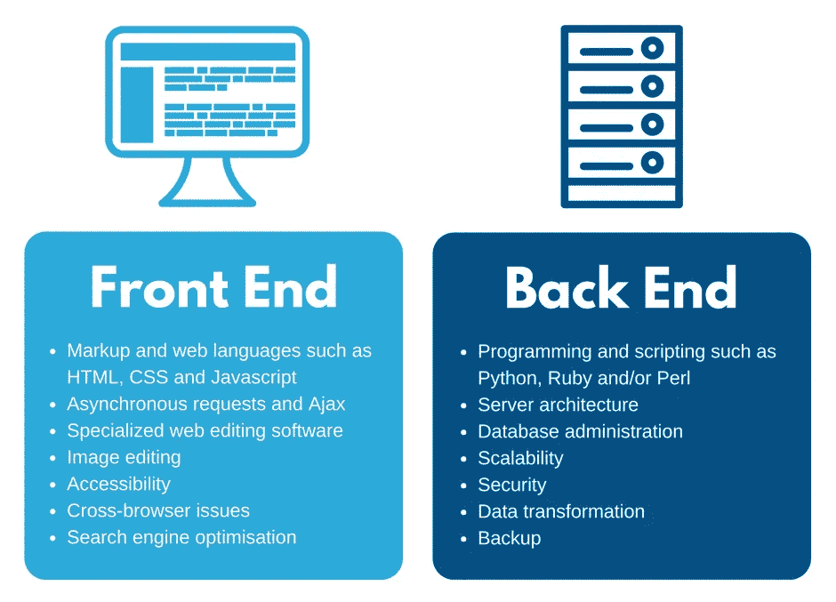
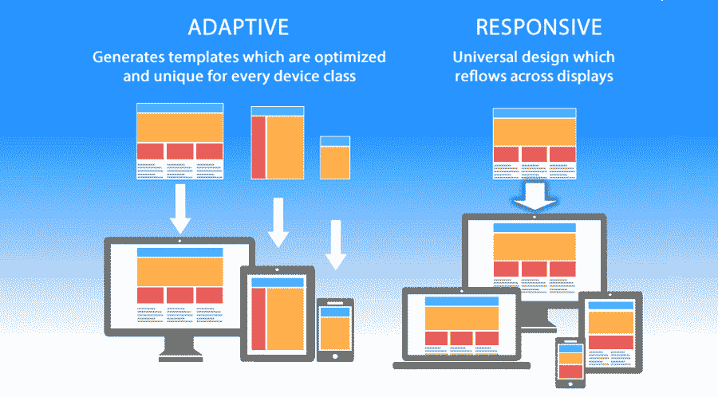
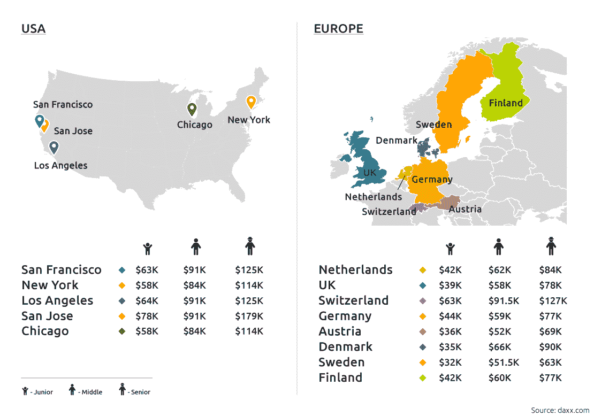

# 成为前端开发人员指南:工作技能和责任

> 原文：<https://kinsta.com/blog/frontend-developer/>

我们大多数人每天都要与多个网站和移动应用程序进行交互。我们点击按钮，登录和退出，并添加产品到我们的购物车，而不考虑谁使这一切成为可能。

但每次我们与网站或应用程序交互时，我们都喜欢前端开发人员的工作。

那听起来像是一个了不起的工作。但是在 2022 年成为前端开发者值得吗？你是如何开始的呢？

这篇文章告诉你你需要了解前端开发人员做什么，他们需要的技能，以及你如何才能得到这份工作。

你是一个正在寻找前端开发人员的雇主吗？我们也报道这个。

T3】

## 什么是前端开发人员？

前端开发人员使用代码来实现网站或应用程序设计。

他们的主要工具是 [HTML](https://kinsta.com/blog/html-vs-html5/) 、 [CSS](https://kinsta.com/blog/wordpress-css/) 和 [JavaScript](https://kinsta.com/knowledgebase/what-is-javascript/) — HTML 用于网站的一般结构和内容，CSS 用于样式，JavaScript 用于高级交互。

### 什么是前端开发？

前端开发是网站用户界面的开发。用户可以查看或与之交互的任何东西(如布局、图像、菜单或登录表单)都被认为是站点的前端。

web 开发的另一个主要类型是后端开发。用户看不到后端开发人员的工作，但它使网站成为可能。网站的后端包括服务器、数据库、后端逻辑和 API。

前端 vs 后端开发(**来源:**[Francesco letli . info](//francescolelli.info/software-engineering/front-end-development-back-end-development-and-full-stack-developers/%E2%80%9D))

您还会听到全栈开发这个术语。全栈开发人员是既做前端开发又做后端开发的多面手。

[准备好担当新角色了吗？✅想知道成为一名前端开发者需要什么吗？👩‍💻从这里开始⬇️ 点击推文](https://twitter.com/intent/tweet?url=https%3A%2F%2Fbit.ly%2F3yq8IgJ&via=kinsta&text=Ready+to+take+on+a+new+role%3F+%E2%9C%85+Want+to+know+what+it+takes+to+be+a+frontend+developer%3F+%F0%9F%91%A9%E2%80%8D%F0%9F%92%BB+Start+here+%E2%AC%87%EF%B8%8F&hashtags=TechJobs%2CNowHiring)

## 前端开发人员是做什么的？

前端开发人员构建并维护网站或应用程序的前端。他们工作的网站部分包括:

*   布局
*   导航功能
*   形象
*   录像
*   小跟班
*   搜索框
*   登录页面
*   社交媒体整合

### 前端开发人员的职责是什么？

前端开发人员负责构建一个网站或应用程序，提供令人愉快的用户体验。这意味着它看起来很好，功能正常。

前端开发人员通常不负责网站的设计。然而，他们将与 UI 和 UX 设计师密切合作，将他们的想法变成现实。

一旦网站或应用建立起来，前端开发人员负责维护、测试和持续开发，如功能升级。

## 做前端开发人员需要哪些技能？

每个前端开发人员都需要精通 HTML、CSS 和 JavaScript。这三种语言几乎是你做任何事情的基础。

你还需要其他技能，但同样的技能要求会因工作不同而不同。

下面的列表涵盖了前端开发工作所需的一些最常见的技能。尽可能多的了解会让你成为各种职位的最佳候选人。

### HTML 和 CSS

[HTML 和 CSS](https://kinsta.com/knowledgebase/edit-wordpress-code/) 齐头并进，是网站设计的积木。

HTML 代表超文本标记语言。它定义了网页的结构。例如，您将使用 HTML 来指示标题的位置、放置段落分隔符的位置以及插入图像的位置。你在这个页面上看到的所有文本和图像都是 HTML 的功劳。

CSS 代表级联样式表，它处理样式。例如，CSS 可能规定背景颜色或字体。您可以使用单个 CSS 样式表来定义整个站点的样式(例如，一次定义多个页面)。

一个好的前端开发人员对 HTML 和 CSS 很有经验，能够很快理解如何一起使用它们来创建一个设计。

幸运的是，HTML 和 CSS 非常容易学习。但是真正掌握它们需要时间。

一旦你掌握了基础知识，你就可以通过查看现有网站并尝试复制你看到的布局和功能来练习你的编码技能。

### Java Script 语言

HTML 设定了框架，CSS 定义了风格，而 JavaScript 使网站具有交互性。

如果一个网站不仅仅是显示静态信息，这可能要归功于 JavaScript。例如，您可以使用 JavaScript 创建一个实时更新的地图或制作网站的动画部分。

根据 StackOverflow 的调查，JavaScript 是专业 web 开发人员使用最多的编程语言。下一个最流行的语言是 HTML/CSS。

最近一年专业开发者使用的编程语言(**来源:**[insights.stackoverflow.com](//insights.stackoverflow.com/survey/2021#most-popular-technologies-language-prof%E2%80%9D))

JavaScript 比 HTML 或 CSS 更复杂，但仍然是更容易理解的编程语言之一。期待你能在几个月内学会它。

### React 和其他 JavaScript 库和框架

[JavaScript 库和框架](https://kinsta.com/blog/javascript-libraries/)是让 JavaScript 开发更快更容易的工具。

JavaScript 库是一组可重用的代码，可以放入项目中。当其他开发人员已经开发了某个功能时，它可以省去您从头开发该功能的麻烦。

现有超过 83 个图书馆，每个都有特定的用途。例如，Chart.js 是一个库，它允许你轻松地为你的网站创建图表和图形。

您应该熟悉的一个 JavaScript 库是 React。React 是一个由脸书维护的免费开源库。它用于为单页应用程序构建用户界面，是目前最流行的 JavaScript 库。

JavaScript 框架类似于库。它们都提供了可重用的代码，但是用法有点不同。

当你使用一个库时，你负责应用程序的流程。您决定在代码中的何处调用库组件。

使用框架，你可以把你的代码插入到框架中。框架在指定的点调用你的代码，而不是你的代码调用库。

需要熟悉的两个流行框架是 [Angular.js](https://kinsta.com/blog/php-vs-angular) 和 [Vue.js](https://kinsta.com/blog/vue-js/) 。

### 节点. js

Node.js 经常被误称为框架或编程语言，但它是前端和后端开发的运行时环境。

通常，用户的浏览器呈现 JavaScript。Node.js 允许您在浏览器之外运行 JavaScript 代码。

Node.js 之所以受欢迎，是因为它让 web 开发更加高效。它允许程序员使用单一的编程语言创建应用程序的前端和后端。

您可能必须在前端开发人员的工作中使用 Node.js，因此学习它是一件好事。可以[自己下载安装](https://kinsta.com/blog/how-to-install-node-js/)以便练习。

### 埃阿斯

Ajax 是异步 JavaScript 和 XML 的缩写。Ajax 本身并不是一项技术，而是一套编程技术。

Ajax 是关于异步开发的。这意味着您可以更新网页的一部分内容，而无需重新加载整个页面。

一个典型的例子是自动完成。当你开始在谷歌中输入搜索查询时，搜索引擎会为你提供自动完成选项。它可以做到这一点，而无需重新加载整个搜索结果页面。

许多前端开发人员的工作要求熟悉 Ajax 概念。一旦你掌握了 JavaScript，在线教程可以教你如何在 Ajax 中使用它。

### 其他编程语言

根据你正在做的项目，你可能想知道 JavaScript 之外的其他编程语言。

例如，TypeScript 是微软开发的一种越来越流行的编程语言。Typescript 是 JavaScript 的超集。与 JavaScript 不同，它被设计用来创建企业级应用程序。

JavaScript 是一门需要了解的基本语言，但是一旦你精通了它，你就可以研究其他的可能性，比如:

*   以打字打的文件
*   榆树
*   流动
*   镖
*   纯脚本

除了 JavaScript 之外，懂一两门编程语言能让你在求职者中脱颖而出。

### 引导程序

我们已经讨论了 JavaScript 的框架和库。

## 注册订阅时事通讯

### 想知道我们是怎么让流量增长超过 1000%的吗？

加入 20，000 多名获得我们每周时事通讯和内部消息的人的行列吧！

[Subscribe Now](#newsletter)

CSS 也利用框架。最重要的一个是 Bootstrap。

Bootstrap 是用 HTML、CSS 和(可选的)JavaScript 编写的可重用代码的免费集合。它让开发者快速建立完全移动响应的网站。

作为一名前端开发人员，至少了解 Bootstrap 的基本知识是很有帮助的。有很多在线课程和教程，但是在你对 HTML 和 CSS 有了很深的理解之前，不要深究。

### 内容管理系统

内容管理系统是一种软件，可以帮助用户创建、编辑和管理网站上的内容，而不需要专业技能。

例如，您可以输入一篇博客文章并将其添加到您的站点，而不必担心用于显示文章的 HTML 和 CSS。

WordPress 是目前最受欢迎的内容管理系统。其他你会遇到的包括 Drupal，Joomla！，还有幽灵。

作为一名前端开发人员，你会经常在使用 CMS 的网站上工作。这些平台的工作知识是一项很有市场的技能。

你也可以为 WordPress 或其他内容管理系统创建新的[主题。](https://kinsta.com/best-wordpress-themes/)

### RESTful 服务和 API

API(应用程序编程接口)允许一个应用程序或服务访问另一个应用程序或服务中的资源。

例如，开发人员可能希望将天气数据集成到他们的网站中。他们可以使用一个 API 来联系气象服务并获取数据。

RESTful APIs 是一种 API，它符合 REST(表述性状态转移)架构风格的约束，并允许连接到 RESTful web 服务。

作为一名前端开发人员，您不需要编写 API 供他人调用(这是后端工作)，但是您应该知道如何调用 API 并在您的站点上有意义地显示它。

### 移动响应设计

如今，网站的访问者使用各种各样的浏览器和设备。

当移动设备占全球网站流量的 [54.8%](https://www.statista.com/statistics/277125/share-of-website-traffic-coming-from-mobile-devices/) 时，一个网站在笔记本电脑屏幕上看起来很好是不够的。

一些网站会有不同的桌面和移动版本，但更常见的是，你需要[建立一个移动响应的网站](https://kinsta.com/blog/responsive-web-design/)。

响应式网站旨在在任何设备、窗口或屏幕尺寸上都能很好地呈现。

移动自适应 vs 移动响应设计。

网站是否具有移动响应能力很重要。 [45%](https://www.slideshare.net/adobe/2019-adobe-brand-content-survey) 的消费者会放弃任何在他们使用的设备上显示不佳的内容。

因为没有一个网站不需要在移动设备上工作，所以对于前端开发人员来说，理解响应式设计原则是一项不容置疑的技能。

响应式设计是通过 HTML 和 CSS 完成的。不太直观，但是很多网络课程和资源都有。

与我们世界一流的支持团队一起体验卓越的 WordPress 托管支持！与支持我们财富 500 强客户的同一个团队聊天。[查看我们的计划](https://kinsta.com/plans/?in-article-cta)

### 跨浏览器测试和开发

一个网站需要看起来不错，并能在任何浏览器上正常工作。虽然 Chrome 是最受欢迎的浏览器，但开发者不应该忽视 Safari、Edge 或 Firefox。

作为一名前端开发人员，你的部分工作将是确保你的作品在任何主流浏览器上都看起来不错。这意味着理解浏览器之间的差异，并在浏览器上测试你的设计。

您可以在流行的编码资源网站上阅读跨平台开发。你也应该练习。当你自己做项目时，请不要忽视在多种浏览器中进行测试。

还有一些工具可以帮助您进行跨浏览器测试。一些免费版本包括:

*   [LamdaTest](https://www.lambdatest.com/)
*   [酱实验室](https://saucelabs.com/)
*   [浏览器堆栈](https://www.browserstack.com/)
*   [交叉浏览器测试](https://crossbrowsertesting.com/)

### 版本控制系统

版本控制系统可以帮助你跟踪网站代码的变化。如果出现问题，您可以使用它们恢复到早期的代码版本。

万一出错，这可以节省大量时间。您可以将项目回滚到早期版本，而不是找到问题并手动撤销它。

版本控制系统对于协作也是必不可少的。它们允许多个用户在没有冲突版本的情况下处理同一个项目。

Git 是最流行的版本控制管理系统，许多开发工作都需要它，无论是前端、后端还是全栈。通过[安装 Git](https://kinsta.com/help/git/) 并在【GitHub.com】的[上创建账户](https://kinsta.com/knowledgebase/what-is-github/)开始学习。

## 如何成为一名前端开发者

[成为前端开发人员](https://kinsta.com/blog/how-to-become-a-web-developer)最重要的资格是精通 HTML、CSS、JavaScript 和上面列出的一些其他技能。没有编码能力，你简历上的其他东西都不重要。

如今，利用在线资源自学编程已经成为可能。

当前 web 开发人员中，40.39% 参加过在线编码课程，31.62%通过在线论坛学习，59.53%使用博客或视频等其他在线资源。

要学习 web 开发，请访问以下网站:

*   [w3 学校](https://www.w3schools.com/)
*   [代码学院](https://www.codecademy.com/)
*   [我们打](https://www.udemy.com/)
*   [堆栈溢出](https://stackoverflow.com/)
*   [德芙金斯](https://kinsta.com/devkinsta/)

当前开发者在哪里学会了编码(**来源:**[insights.stackover.com](//insights.stackoverflow.com/survey/2021#experience-learn-code%E2%80%9D))

自学代码是可能的，但这并不意味着你的正规教育不重要。许多前端开发人员的工作更喜欢或甚至要求你有一个相关的学位。如果你还没有，你必须确保你的[网络开发组合](https://kinsta.com/blog/portfolio-website/)能说明一切。

那么，如果没有工作经验，如何创建作品集呢？

炫耀你前端开发技能的一个方法是独立构建网站和应用程序。创建一个与你的兴趣相关的工具，或者看看你认识的人是否需要完成开发工作。

## 前端开发者受欢迎吗？

成为一名网站开发人员是一个很好的职业发展。我们可以期待在未来十年看到 8%的就业增长。这相当于每年约有 13400 个职位空缺——比一般职业的增长速度快得多。

前端和后端开发人员都有需求，但前端开发人员的职位空缺略多。在 Indeed.com，美国目前有 14，600 个前端开发人员职位，而后端开发人员有 12，300 个。

## 前端开发人员平均工资是多少？

据 Glassdoor 统计，平均[前端开发者薪资](https://kinsta.com/blog/front-end-developer-salary/) 为[【86088 美元](https://www.glassdoor.com/Salaries/front-end-developer-salary-SRCH_KO0,19.htm) 。

然而，这并不是故事的全部。

根据公司类型、工作所需的技能、你所在的位置和你的经验水平，网站开发人员的薪水会有很大的不同。如果你坚持几年，你可以期望得到更高的薪水。拥有高级前端开发人员头衔的人平均收入为 107，276 美元。

各地区前端开发人员工资(**来源:**[【daxx.com】](//www.daxx.com/blog/development-trends/front-end-developer-salary%E2%80%9D))

## 雇用前端开发人员时要注意什么

很多网络开发人员都在外面，但是真正有才华的人很难找到。

当[雇佣一个前端开发人员](https://kinsta.com/blog/hire-wordpress-developer/)时，以下是需要记住的。

### 技术

每个前端开发工作都是不同的。进入招聘流程，了解你想要的技能组合。

也就是说，web 开发是一个不断变化的领域。如果你要和这个开发人员长期合作，他们学习新技能的决心比他们现有的技能更重要。

你可以通过给候选人一个简短的编码测试来测试他们的技术能力。如果他们做得好，分配一个小的(付费的)测试项目也是有帮助的。使用它来评估他们对细节的关注，他们解决方案的创造性，以及他们与团队成员沟通的程度。

### 其他技能

除了编码技能，一个好的前端开发人员了解用户体验的重要性。

前端开发人员创建用户与之交互的网站元素。他们本身不是 UX 设计师，但是一个好的前端开发人员知道如何给网站访问者带来积极的体验。

你的前端开发人员也应该有很强的人际交往能力。他们将与其他团队成员和利益相关者一起工作，并就项目进行有效的沟通。

[每次我们与网站或应用程序互动时，我们都在享受前端开发人员的工作...但是怎样才能让这成为你的全职工作呢？👀本帖已覆盖⬇️ 点击推文](https://twitter.com/intent/tweet?url=https%3A%2F%2Fbit.ly%2F3yq8IgJ&via=kinsta&text=Every+time+we+interact+with+a+website+or+app%2C+we%27re+enjoying+the+work+of+a+frontend+developer...+but+what+does+it+take+to+make+this+your+full-time+job%3F+%F0%9F%91%80+This+post+has+you+covered+%E2%AC%87%EF%B8%8F&hashtags=WebDev%2CDevJobs)

## 摘要

成为一名前端开发人员是一个很好的职业发展。

这是一份你可以在网上自学的工作，潜在的薪水很高，而且未来几年对你的能力会有需求。

成为前端开发人员的最佳方式是尽可能地学习 HTML、CSS、JavaScript 和相关技能。你可以通过学校或者利用网络资源自学。

*现在学习前端开发？看看这些 [60 款优秀的网络开发工具](https://kinsta.com/blog/web-development-tools/)。*

* * *

让你所有的[应用程序](https://kinsta.com/application-hosting/)、[数据库](https://kinsta.com/database-hosting/)和 [WordPress 网站](https://kinsta.com/wordpress-hosting/)在线并在一个屋檐下。我们功能丰富的高性能云平台包括:

*   在 MyKinsta 仪表盘中轻松设置和管理
*   24/7 专家支持
*   最好的谷歌云平台硬件和网络，由 Kubernetes 提供最大的可扩展性
*   面向速度和安全性的企业级 Cloudflare 集成
*   全球受众覆盖全球多达 35 个数据中心和 275 多个 pop

在第一个月使用托管的[应用程序或托管](https://kinsta.com/application-hosting/)的[数据库，您可以享受 20 美元的优惠，亲自测试一下。探索我们的](https://kinsta.com/database-hosting/)[计划](https://kinsta.com/plans/)或[与销售人员交谈](https://kinsta.com/contact-us/)以找到最适合您的方式。