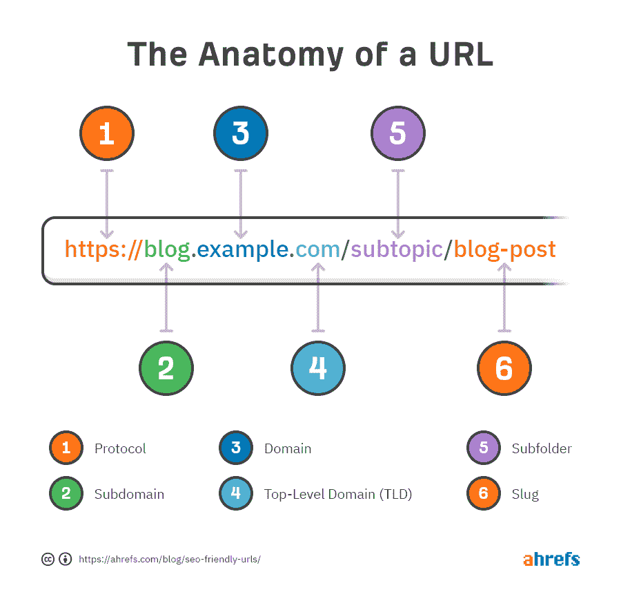
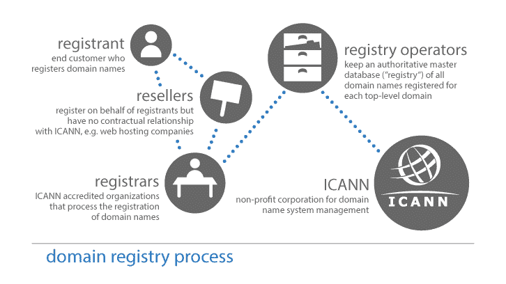
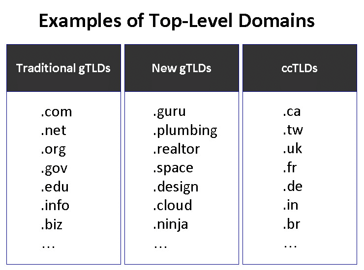
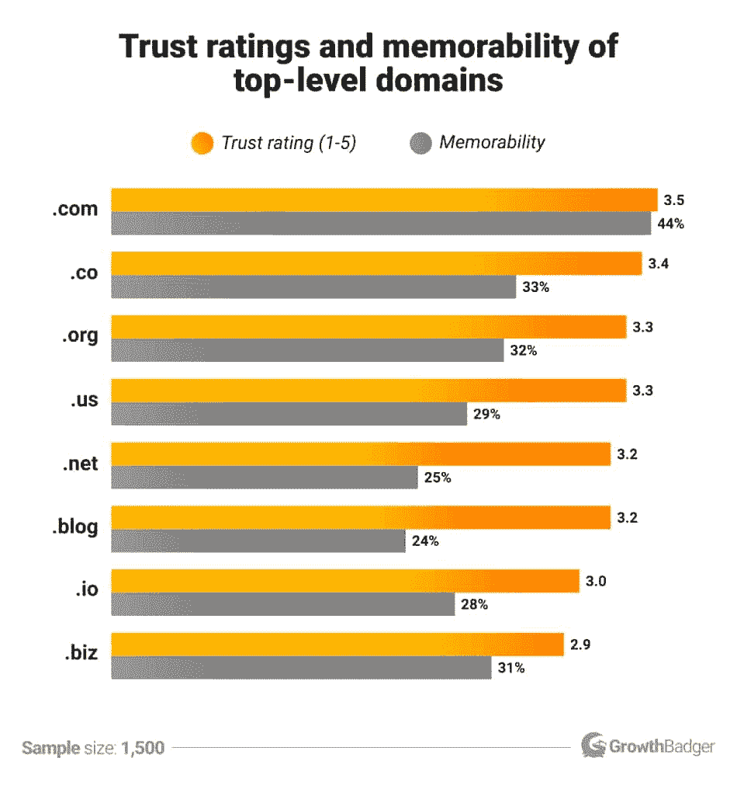
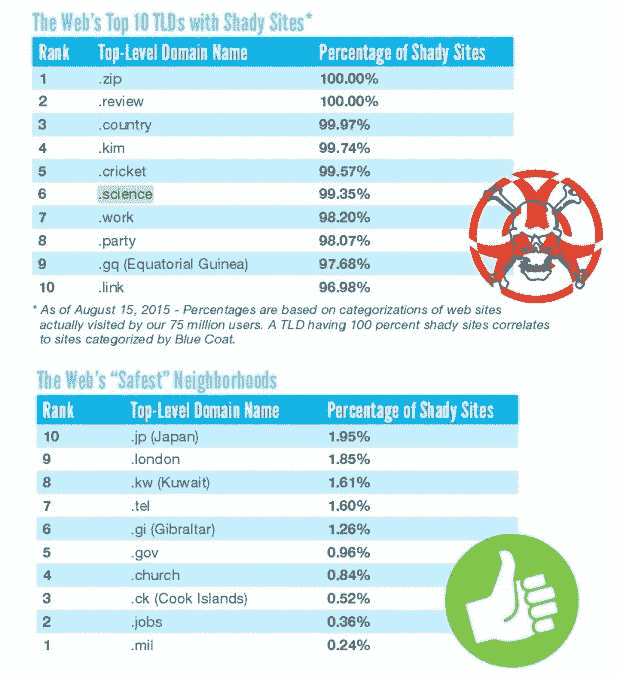
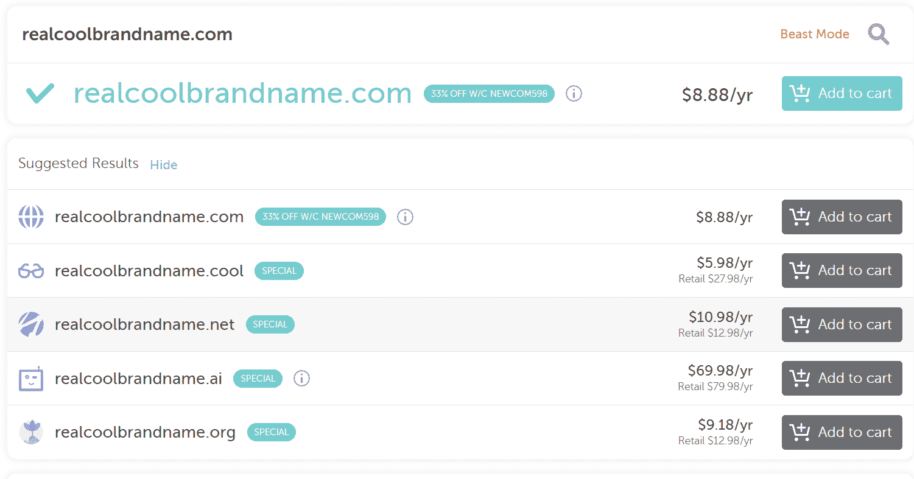

# 什么是域名扩展？(以及如何选择域名扩展)

> 原文：<https://kinsta.com/blog/domain-extensions/>

你能想到的大部分网站大概都以**结尾。com** 。你肯定也遇到过一些以**结尾的。org** 或**。edu** 。

但是你知道吗，你也可以注册一个以**结尾的域名。披萨**？

网址末尾的那些字母被称为域名扩展名，大约有[1500](https://www.iana.org/domains/root/db)种可能性。有些仅限于特定的组织或个人，但任何人都可以快速注册大多数扩展。

这使得为你的网站选择域名有点复杂。你应该选择 **yourbusiness.bingo** 还是 **yourbusiness.fish** ？如果你卖鱼，后者似乎更合适。

这篇文章介绍了域名扩展，包括它们是什么，它们做什么，以及如何为你的网站选择一个最好的。

## 什么是域名扩展？

域名扩展名是 URL 中最后一个句号后面的字母。常见的扩展名有**。com** ，**。组织**，和**。网**。

域名扩展的另一个术语是顶级域名。这是因为您可以将域名的各个部分视为分类级别。

> 需要在这里大声喊出来。Kinsta 太神奇了，我用它做我的个人网站。支持是迅速和杰出的，他们的服务器是 WordPress 最快的。
> 
> <footer class="wp-block-kinsta-client-quote__footer">
> 
> 
> 
> <cite class="wp-block-kinsta-client-quote__cite">Phillip Stemann</cite></footer>

[View plans](https://kinsta.com/plans/)

在顶部，我们有域扩展。在这个层次上，领域被划分为几大类。

比如域扩展**。de** 将该域名归入“德国”类别。使用**。gov** 表示该域名属于“美国政府组织”类别。

域扩展不再总是以这种方式使用——我们稍后会谈到这一点——但这是最初的意图。

下一层是领域。那是在扩展之前的部分。它指定 URL 属于哪个网站。例如，在网址**kinsta.com**中，“kinsta”是域名。

有时还有另一个级别叫做[子域](https://kinsta.com/blog/wordpress-subdomain/)。子域将网站组织成独立的部分。例如，下图显示了 blog.example.com 的网址**。**

 **在这里，“博客”是子域。该域名还可能包含其他子域名，如 support.example.com 的 T1 或 email.example.com 的 T3。

部分网页的网址。(**来源:** [Ahrefs](//ahrefs.com/blog/seo-friendly-urls/%E2%80%9D) )

当你[注册一个域名](https://kinsta.com/blog/best-domain-registrar/)时，你必须选择域名和域名扩展名。子域和 URL 中任何在扩展名之后的内容可以在以后创建。

[你能想到的大多数网站可能都以. com 结尾，但是你知道吗，你也可以注册一个以. com 结尾的域名。披萨？🍕😄在此了解更多信息👇 点击推文](https://twitter.com/intent/tweet?url=https%3A%2F%2Fkinsta.com%2Fblog%2Fdomain-extensions%2F&via=kinsta&text=Most+of+the+websites+you+can+think+of+probably+end+in+.com.+But+did+you+know+you+can+also+register+a+domain+that+ends+in+.pizza%3F+%F0%9F%8D%95%F0%9F%98%84+Learn+more+here+%F0%9F%91%87&hashtags=TechTips%2CWebTips)

## 为什么会存在域名扩展？

域名扩展的最初目的是根据类型对网站进行分类。

比如任何一个地址以**结尾的网站。com** 本应是一个商业网站。

但是你知道，各种网站都用**。com** 。随着互联网的发展，域名扩展的用途经常与最初的意图不同。

这里有一个您可能不太熟悉的例子:扩展名**。fm** 应该指定一个来自密克罗尼西亚的网站。但它目前被许多广播电台和音频流媒体网站使用。

还有扩展，像**。gov** ，仅限于特定组织。但是很多其他的对任何人都是开放的。

作为一个网站所有者，你的域名扩展服务于几个目的。它可以告诉人们他们在什么样的网站上，它可以激发信任，它可以创建一个吸引人和令人难忘的网址。

## 谁负责域名扩展？

互联网名称与数字地址分配机构(ICANN)通过其分支机构互联网数字地址分配机构(IANA)管理域名扩展。

ICANN 指定的注册管理机构管理每个扩展。注册管理机构保存了使用该扩展名的所有域名的数据库。

比如**。com** ，**。net** ，其他各种扩展由美国公司 VeriSign 管理。品牌扩展通常由注册它们的公司管理。比如说，**。三星**注册表由三星运营。

政府分支机构或非盈利机构可以操作国家代码扩展。例如，**的注册管理执行机构。在**是印度的国家互联网交换。

这些注册管理机构将扩展外包给 ICANN 认可的注册服务商。这些是你可以注册域名的公司，比如 Google Domains 或 Cloudflare。

负责域名注册的机构。(**来源:** [WHOIS](//whois.icann.org/en/domain-name-registration-process%E2%80%9D) )

## 域名扩展的类型

有三种类型的域名扩展:通用顶级域名、赞助商顶级域名和国家代码顶级域名。

### gTLDs

通用顶级域名类别包括我们都知道和喜爱的扩展名，例如:

*   **。com**
*   **。组织**
*   **。网络**

这些是第一批域名扩展，与国家代码扩展相比，它们被标记为“通用”。

2011 年，ICANN 开始允许组织注册自己的通用域名扩展。这导致了品牌扩展和许多其他随机扩展。例如:

*   **。药房**
*   **。棒球**
*   **伊斯坦布尔**
*   **。丰田**

域名扩展的例子。

### 短期债务

赞助顶级域名是由特定实体使用的扩展。这可能是一个企业，一个政府部门，或另一种类型的团体。例如，一些最常见的 sTLDs 有:

*   **。政府**(美国政府)
*   **。edu** (美国认可的大专教育机构)
*   **。mil** (美国军方)

一些鲜为人知的短期债务是:

*   **。博物馆**(博物馆)
*   **。cat** (加泰罗尼亚语网站)
*   **。职位**(有[职位列表](https://kinsta.com/careers/)的网站)

### ccTLDs(中央处理器)

国家代码 TLD 代表特定的国家，如**。jp** 代表日本。每个国家代码域扩展都有自己的规则。有些仅限于该国的组织，而其他人可以使用。

一些常见的 ccTLDs 包括:

*   **。ru** (俄罗斯)
*   **。cn** (中国)
*   **。德**(德国)
*   **。ca** (加拿大)

## 最常见的域名扩展是什么？

虽然有一千多个域扩展可用，但你会看到一些比其他的多得多。让我们来看几个最著名的例子。

### 。com

这是我们都最了解的一个。不出所料，几乎 50%的网站使用 T2。com 域名扩展。

它可能曾经指定了一个商业网站，但今天我们可以认为它是默认的域名扩展。

### 。网

喜欢**。com** ，**。net** 是最早的域扩展之一。它是为参与网络技术的组织而创建的。

这几天，**。net** 经常被用来替代**。com** 。那些不能得到他们偏爱的**的公司。com** 域选择**。网**。

### 。（同 organic）有机

**。org** 是为非营利组织使用的[而创建的，现在仍然是这些组织选择的域名扩展。](https://kinsta.com/web-hosting-for-nonprofits/)

的。org 扩展开放给任何人使用。但是，如果你选择了一个**。org** 域名，大多数人不会期望你的网站是商业性的。

### 。电子显示器(electronic display unit)ˌ教育机构域名(education)ˌ实验发展处(Experimental Development Unit)

在域名扩展的早期，**。任何致力于教育的组织都可以使用 edu。**

自 2001 年以来，扩展仅限于特定名单上的机构认可的中学后教育机构。这意味着美国以外的机构不经常使用它。

### 。政府

**。gov** 分机只能由美国政府机构使用。它最初只对联邦政府网站开放，但在 2003 年对州、地方和部落政府开放。

少数政府部门不使用**。gov** ，就像使用 usps.com 的美国邮政署​**。**

### 。密耳

**。mil** 仅限于美国军方的部门、军种和机构。美国是唯一一个军事领域扩展的国家。

### 。茹，。cn，。英国等。

许多国家代码仍然普遍用于这些国家的网站。你大概可以假设[一个. jp 网站](https://kinsta.com/wordpress-hosting-japan/)比如真的来自日本。

但是一些国家代码域扩展已经被用于其他目的，包括下面这个列表。

### 。超正析象管

如果你知道什么 [**。io** 网站](https://kinsta.com/knowledgebase/what-is-io/)，他们可能属于科技公司。近年来**。io** 在科技初创公司中越来越受欢迎，因为它暗指 **I/O** (输入/输出)，这是一个流行的科技术语。

## 注册订阅时事通讯

### 想知道我们是怎么让流量增长超过 1000%的吗？

加入 20，000 多名获得我们每周时事通讯和内部消息的人的行列吧！

[Subscribe Now](#newsletter)

商家选择**。io** 因为这标志着他们的网站与技术相关。它受欢迎也是因为**。io** 域通常在**时可用。com** 版本拍摄。

但是木卫一也代表印度洋。域名扩展的最初目的是指定英属印度洋领地的网站。

### 。（同 Internationalorganizations）国际组织

**。int** 代表国际化，是要求最严格的域扩展之一。它只能由国际条约认可的组织和项目使用。例如，欧洲航天局的网站位于 esa.int 的 T2。

不过，年纪大一些的**。不符合要求的 int** 域名，如 ymca.int 的**被保留。**

### 。摩比

**。mobi** TLD 表示一个站点是[为移动设备](https://kinsta.com/blog/google-mobile-first-index/)优化的。一个使用**的网站。mobi** 必须符合注册管理机构设定的要求。

如今，几乎所有的网站都是手机友好的，所以指定一个单独的**。mobi** 网站不如以前有价值了。
T3】

## 域名扩展对你的网站意味着什么？

您可能想知道为您的网站选择哪个扩展是否重要。域名扩展对你的网站有什么实际意义？

首先，它给潜在访问者对你的网站的第一印象。在他们点击链接并看到你的设计和内容之前，人们会注意到你的网站是否是一个**。com** ，**。org** ，或**。忍者**，而且每一个都会给他们不一样的印象。

第二，一些域名的注册费用比其他的要高。例如，你可能会为一个**支付更多的钱。io** 域名多于以**结尾的域名。com** 。

但是你的域名扩展不是一个纯粹基于成本的选择。记住，和一个值得信赖的人在一起，你可能会赚更多的钱。com 站点比同一个站点注册了一个**。biz** 域名。

你的域名扩展不会影响(至少不会直接影响)搜索引擎优化。

新通用顶级域名创建后不久， [Google 的 Matt Cutts](https://www.youtube.com/watch?v=ldFPcJZulXQ) 被问及它们将如何影响 SEO。

他澄清说，无论网站使用什么样的 TLD，谷歌都会努力为查询返回最佳结果。

然而，你的域名扩展可以间接影响你的网页排名。

拥有一个令人难忘且值得信赖的域名[有利于你网站的 SEO](https://kinsta.com/ebooks/wordpress/how-to-improve-seo/) ，因为人们更有可能点击并链接到它。

## 如何为你的网站选择最好的域名扩展

选择域名——包括扩展名——是一个重大决定。

毕竟这是你的网站从此以后的生存之地。遵循这些最佳实践来挑选对你的网站最有益的域名扩展。

### 如果有疑问，就去网络公司

对于大多数网站来说，老可靠**。com** 就是要走的路。人们认可并信任**。com** 。如果他们要猜测你的品牌网站，他们可能会从 yourbrandname.com 的**开始。**

在一些情况下，使用不同的扩展名是有意义的。

如果您的组织属于具有众所周知的指定域扩展名的类别，您可以使用该扩展名。例如，一个非营利组织应该使用**。org** ，美国大学应该用**。edu** 。

与我们世界一流的支持团队一起体验卓越的 WordPress 托管支持！与支持我们财富 500 强客户的同一个团队聊天。[查看我们的计划](https://kinsta.com/plans/?in-article-cta)

一些企业想强调他们的位置。如果他们在加拿大，他们可能会选择**。ca** (但是**)。com** 如果他们全球化运营就更好了)。

而**。com** 是品牌最好的域名扩展，你的品牌名称也很关键。

如果 yourbrandname.com 被占领了，你会怎么做？

选择不同的扩展名可能有意义。大多数情况下，你还是应该选择人们熟悉的东西，比如**。网**。

### 让它令人难忘

如果人们跟随一个链接到你的网站，网址并不那么重要。

但也许他们以前去过你的网站，想重游。或者，他们从朋友那里听说了这个网站。

那样的话，他们肯定记得你的域名。

说到可记忆性，**。com** 胜。域使用。与使用其他顶级域名的网址相比，com 比[多 33%](https://growthbadger.com/top-level-domains/) 更令人难忘。当人们忘记一个域名时，他们认为它以**结尾的可能性是之前的 3.8 倍。com** 比什么都重要。

然而，一些新的 TLD 扩展允许企业创建令人难忘的，更具创造性的领域。例如，如果你的企业是 Pasta Guru，你现在可以注册 **pasta.guru** (已经有人注册了那个域名)。

域名扩展有多值得信赖和记忆？(**来源:**[growth badger](//growthbadger.com/top-level-domains/%E2%80%9D))

### 明确你网站的目的

域名扩展最初是为了根据目的或类型对网站进行分类。

虽然现在事情变得更加灵活，但是你的域名仍然给访问者一个关于你的网站是关于什么的线索。

默认为**。com** —它几乎可以用于任何事情。但是如果你选择一个不同的扩展，确保它能让访问者对你的网站有一个正确的印象。

### 避免可疑的探测域

你更有可能把你的信用卡信息给**buywidgets.com**或 **buywidgets.zip** ？

如果你选择了第一个，你并不孤单。

人们倾向于对特定的域扩展保持警惕，这通常是有充分理由的。垃圾网站几乎完全接管了一些扩展。

那么，你如何避免一个听起来粗略的域名呢？

除非你符合**这样的条件。州长**或**。米尔**，你最好的选择是坚持(你猜对了)**。com** 。

安全 vs 可疑的域名扩展。(**来源:** [Softpedia](//news.softpedia.com/news/have-you-ever-wondered-what-are-the-web-s-more-dangerous-domains-490830.shtml%E2%80%9D) )

## 你能发明自己的域名扩展吗？

在 URL 的末尾有这么多疯狂的词，你能自己造一个吗？

从技术上讲，答案是肯定的。您可以申请注册一个全新的通用域名扩展(gTLD)。不过，对于大多数个人和小企业主来说，这不是一个现实的选择。

首先，你不能随时申请——你必须等待 ICANN 开放申请。没有人知道下一次会发生在什么时候，但很多人都在猜测 2022 年。

也许你愿意等那么久。接下来，你需要支付申请费。在上一个注册期，该费用为 [$185，000](https://newgtlds.icann.org/en/applicants/global-support/faqs/faqs-en) 。

如果这是一个值得的投资，以确保您的品牌独特的域名扩展，你可以开始填写申请。ICANN 列出了域名扩展必须满足的要求。例如，它不能与另一个 TLD“极其相似”。

您还需要技术能力来充当所有使用该扩展的站点的注册中心。

换句话说，**yourbrandname.com**将会很好地为你的网站服务。

## 如何注册域名扩展

当你注册域名时，你可以选择你的域名扩展名。

并非每个域名注册商都能提供每个域名扩展。然而，像谷歌域名、GoDaddy 和 Namecheap 这样的主要注册商将会有许多顶级域名，包括最常见的域名。

一些扩展可能会比其他的更贵。如果你选择了一个你知道可用的域名和扩展，你可以在几个注册商处货比三家，看看谁提供的价格最优惠。

域名扩展选项。

一些不太常见的域名扩展将只在利基注册服务商提供。

如果你找不到一个地方来注册你的扩展选择，你可以尝试找出谁是负责人。为此，请访问此顶级域名列表。点击你想要的扩展名，向下滚动到“注册表信息”

您应该会看到一个指向注册该扩展的组织的链接。在某些情况下，你可以使用域名注册商。

gTLD 也可能属于某个品牌或组织，该品牌或组织计划将扩展保留给自己。

## 可以更改域名扩展名吗？

希望你为你的网站选择了不同的域名扩展？

你可以通过[设置一个 301 重定向](https://kinsta.com/blog/wordpress-redirect/)来改变它。301 重定向让搜索引擎知道你要发送给访问者的页面已经移动了。

首先，你需要注册你的新域名，并使用更新的扩展创建一个你的站点的克隆。然后你将所有的网址重定向到最新的版本。

这里有一个关于将你的 WordPress 站点重定向到一个新域的指南。

更改域名会暂时影响 SEO。但是如果你做对了，你的排名应该会很快恢复正常。

[想知道网址末尾的那些字母是干什么用的？🤔潜到这里⬇️ 点击推文](https://twitter.com/intent/tweet?url=https%3A%2F%2Fkinsta.com%2Fblog%2Fdomain-extensions%2F&via=kinsta&text=Wondering+what+those+letters+at+the+tail+end+of+a+web+address+are+for%3F+%F0%9F%A4%94+Dive+in+here+%E2%AC%87%EF%B8%8F&hashtags=TechTips%2CWebTips)

## 摘要

它可能只是你域名末尾的几个短字母，但是你的域名扩展是你网站的重要组成部分。

它可以让网站的网址看起来值得信赖和记忆——或者它可以做相反的事情。创建和维护网站的成本会有所不同。它可以给访问者提供关于你的网站的信息。

随着时间的推移，域名扩展的使用发生了变化，而且还会继续变化。

将来，新的顶级域名可能会取代旧的标准。**。io** 可能是每个科技公司的延伸。但是今天，一个可靠的 TLD 喜欢**。com** 或者**。org** 依然是你的最佳选择。

*刚刚注册了你的新域名？让我们让它活起来。[把它添加到你的金斯塔网站](https://kinsta.com/knowledgebase/add-domain/)。*

* * *

让你所有的[应用程序](https://kinsta.com/application-hosting/)、[数据库](https://kinsta.com/database-hosting/)和 [WordPress 网站](https://kinsta.com/wordpress-hosting/)在线并在一个屋檐下。我们功能丰富的高性能云平台包括:

*   在 MyKinsta 仪表盘中轻松设置和管理
*   24/7 专家支持
*   最好的谷歌云平台硬件和网络，由 Kubernetes 提供最大的可扩展性
*   面向速度和安全性的企业级 Cloudflare 集成
*   全球受众覆盖全球多达 35 个数据中心和 275 多个 pop

在第一个月使用托管的[应用程序或托管](https://kinsta.com/application-hosting/)的[数据库，您可以享受 20 美元的优惠，亲自测试一下。探索我们的](https://kinsta.com/database-hosting/)[计划](https://kinsta.com/plans/)或[与销售人员交谈](https://kinsta.com/contact-us/)以找到最适合您的方式。**