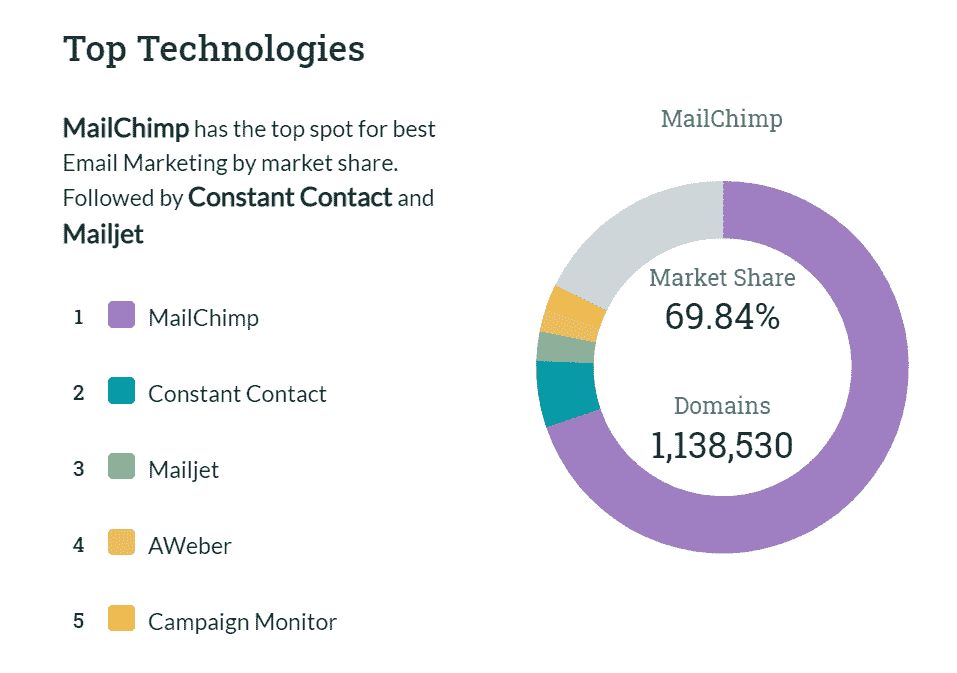
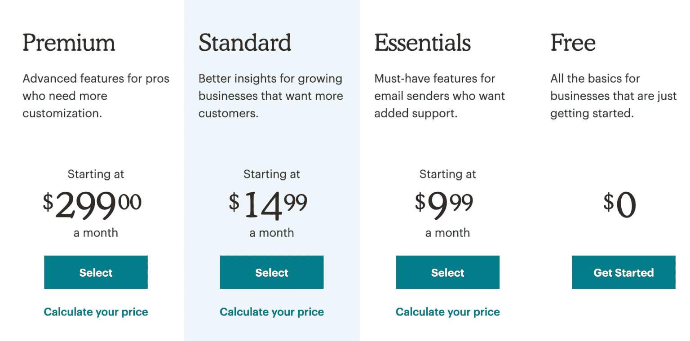
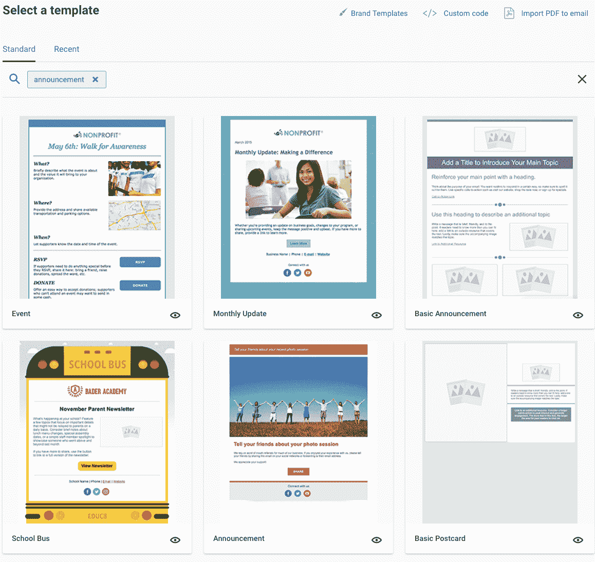
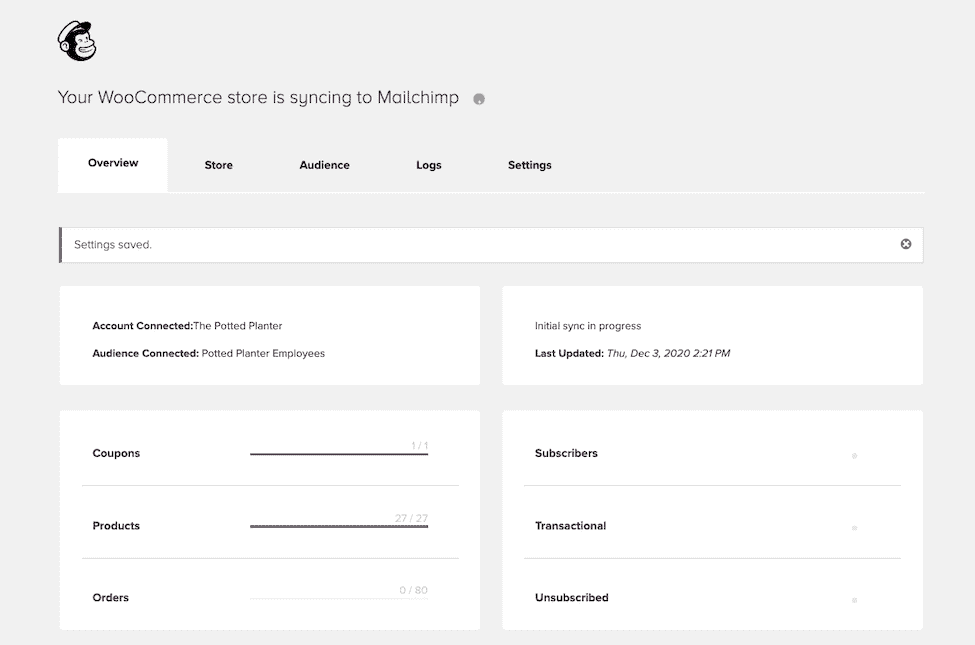
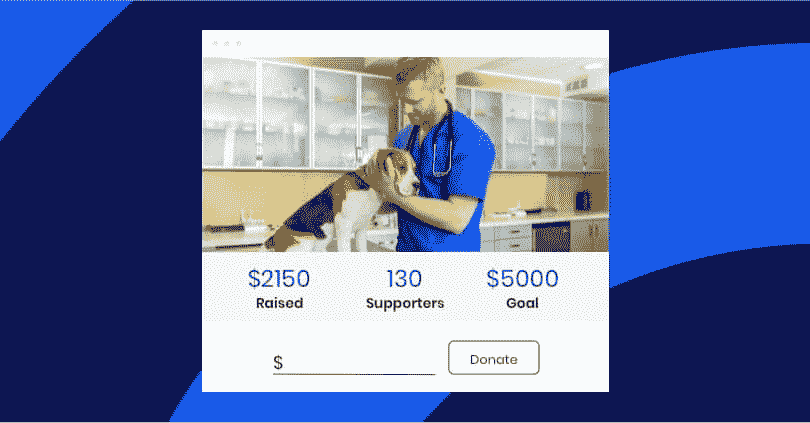
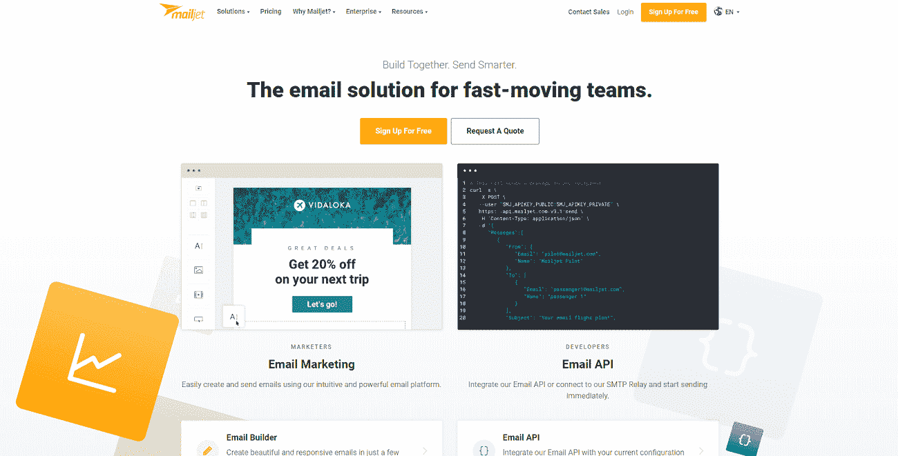

# 持续联系 vs Mailchimp:2022 年使用哪种电子邮件营销工具？

> 原文：<https://kinsta.com/blog/constant-contact-vs-mailchimp/>

如果你想从营销中获得最大收益，你不能忽视电子邮件。你在电子邮件营销上每投资 1 美元，你的生意就能赚到 35 美元。

那么，利用这一可观投资回报的最佳方式是什么呢？说到电子邮件营销工具，你的选择是无穷无尽的。

第一个想到的可能是 Mailchimp。Mailchimp 已经存在了 20 年，是最受欢迎的电子邮件营销软件。即使你没有听说过 Mailchimp，你也可能经常收到 Mailchimp 的邮件。

持续联系是一个强大的电子邮件解决方案，甚至比 Mailchimp 还要古老。它的用户群较小，但却是 Mailchimp 的强大竞争对手。

哪个更好？为了找到答案，我们必须挖掘细节！

T3】

## 恒接触和 Mailchimp 一样吗？

两者都是帮助你[建立和自动化电子邮件](https://kinsta.com/blog/email-marketing-automation/)与你的目标受众对话的工具。然而，他们确实有他们的不同之处。

在一场人气竞赛中，Mailchimp 以 [69.84%](https://www.datanyze.com/market-share/email-marketing--13) 的电子邮件营销市场份额轻松胜出。恒接触可能是它的头号竞争对手，但市场份额只有 5.74%。

电子邮件营销平台市场份额。(**来源:** [YDatanyze](//www.datanyze.com/market-share/email-marketing--13%E2%80%9D) )

但是 Mailchimp 拥有最多的用户并不意味着它是最有效的。为了确定我们不断接触 vs Mailchimp 摊牌的赢家，让我们并排看看他们。

> Kinsta 把我宠坏了，所以我现在要求每个供应商都提供这样的服务。我们还试图通过我们的 SaaS 工具支持达到这一水平。
> 
> <footer class="wp-block-kinsta-client-quote__footer">
> 
> 
> 
> <cite class="wp-block-kinsta-client-quote__cite">Suganthan Mohanadasan from @Suganthanmn</cite></footer>

[View plans](https://kinsta.com/plans/)

[你在电子邮件营销上每投资 1 美元，你的生意就能赚 35 美元💰...这意味着选择正确的电子邮件营销工具是一个关键的决定📧 点击推文](https://twitter.com/intent/tweet?url=https%3A%2F%2Fkinsta.com%2Fblog%2Fconstant-contact-vs-mailchimp%2F&via=kinsta&text=For+every+%241+you+invest+in+email+marketing%2C+your+business+could+earn+%2435+%F0%9F%92%B0...+which+means+that+picking+the+right+email+marketing+tool+is+a+key+decision+%F0%9F%93%A7&hashtags=EmailMarketing%2CEmailTips)

## 持续接触与 Mailchimp 定价

对于小企业来说，决策往往归结为成本。不管电子邮件平台有多少华而不实的功能，如果你只有几个订户，你就不会花大价钱。

Mailchimp 在所有级别的定价上都胜出。

它的免费计划使它成为刚刚起步的企业的明确选择。恒常联系提供免费试用，但在那之后，你要为最便宜的计划每月支付至少 20 美元。

随着你的电子邮件营销工作的发展，Mailchimp 仍然是一个不太昂贵的选择。

如果你有 500 个联系人，Mailchimp 最基本的付费计划(Mailchimp Essentials)每月费用为 9.99 美元。相比之下，持续联系的最便宜的计划(持续联系的电子邮件)是 20 美元。

50，000 个联系人，Mailchimp Essentials 将花费 270 美元，恒定联系人电子邮件将花费 335 美元。

Mailchimp 定价计划。

然而，请记住 Mailchimp 的计划有每月电子邮件限额。有了持续的联系，你就可以无限发送邮件。

计划发送大量营销邮件的公司可能会倾向于持续联系。

Mailchimp 还为那些不想按月付费的企业提供了一个现收现付的定价计划。发送电子邮件需要花费“信用”，你可以随时购买。不断接触没有等同于这个计划。

## 持续接触与 Mailchimp 功能比较

当然，选择营销技术不仅仅是为了获得一笔好交易。Constant Contact 和 Mailchimp 都有很多有用的电子邮件营销功能。

让我们一个一个地看。

### 电子邮件设计

你的读者对你的电子邮件的第一印象不是邮件的内容，而是邮件的外观。一个专业的品牌形象可以让潜在客户对你的生意感觉良好。

Mailchimp 和 Constant Contact 都提供了各种各样易于使用的拖放模板。对于初学者来说，Constant Contact 的模板可能更直观一些。

恒联系人邮件模板。

总的来说，持续接触也提供了更多的模板。

然而，Mailchimp 有更好的定制选项，这对于为您的电子邮件添加个性化风格至关重要，许多评论者认为 Mailchimp 模板更加时尚和现代。

有时，根据电子邮件客户端或设备的不同，同一封电子邮件可能看起来非常不同。

Mailchimp 有一个有用的功能，可以让你预览你的电子邮件在 30 多个不同的客户端上会是什么样子。恒定联系也提供收件箱预览，但只针对五个电子邮件客户端。

### 注册表格

您的电子邮件订阅者注册表格可以创建或破坏您的电子邮件列表。

Mailchimp 有一个优秀的拖放编辑器和各种用于表单的自定义字段。

持续接触可以让你改变颜色和字体，但总的来说，它的形式不太容易定制。

一种独特的持续联系服务是注册表单二维码，用户可以通过手机快速扫描二维码来加入你的名单。

除非你喜欢二维码功能，否则 Mailchimp 会赢。

### 电子邮件自动化

任何现代的电子邮件营销平台都可以让你的营销活动自动化。

“持续联系”也不例外，但它的自动邮件比 Mailchimp 的简单，尤其是如果你的计划不那么昂贵的话。

通过持续联系，您可以发送:

*   欢迎电子邮件问候新订户
*   给没有打开你第一封邮件的人发邮件
*   生日和周年纪念电子邮件

你也可以在一些固定的联系价格层级上自动发送一系列电子邮件。这些可以通过几种方式触发:

*   打开电子邮件的联系人
*   联系人点击电子邮件中的链接
*   注册或被添加到特定列表的联系人
*   在您的 Shopify 商店采取行动的联系人

您可以使用这些选项做很多事情，但 Mailchimp 自动化更先进。像持续接触一样，它提供了基本要素:

*   基于日期的自动化
*   自动回复器
*   欢迎电子邮件
*   生日和周年纪念电子邮件

它还有一长串可用的电子邮件触发器，包括许多类型的电子商务活动。

例如，您可以向购买产品的用户发送电子邮件。你甚至可以通过向长时间没有购买的用户发送电子邮件来重新吸引流失的客户。

重定向电子邮件是 Mailchimp 自动化的另一种有用类型。例如，您可以创建一封电子邮件，鼓励客户购买他们在您的网站上查看过的商品或被遗弃在购物车中的[。](https://kinsta.com/blog/abandoned-cart-email/)

如果你在 Mailchimp 的列表中没有看到你的完美的预制触发器，你可以从各种标准中创建一个自定义触发器。

### A/B 测试

[A/B 测试](https://kinsta.com/blog/wordpress-ab-testing-tools/)或分割测试对于优化营销活动至关重要。A/B 测试是当你发送一封电子邮件的多个版本(通常发送给一个小的测试组)来看哪一个执行得更好。

然后你可以把表现更好的邮件发送给你的更大的名单，让活动发挥出最大的潜力。您还可以使用测试中的信息来优化未来的活动。

Mailchimp 允许您测试多达三种不同的活动。您可以测试电子邮件的主题行或内容。

持续联系只允许您测试主题行，如果您使用 Email Plus 计划，您只能进行 A/B 测试。

与“经常联系”不同，Mailchimp 允许你在给你名单中的其他人发送邮件之前，决定有多少人接受 A/B 测试。

### 列表管理和分段

基于易用性和可用功能，持续联系在这里胜出。首先，它比 Mailchimp 提供了更多上传联系人的选择。

Mailchimp 还经常通过区分群体和细分市场来混淆用户。

根据 Mailchimp 的说法，群体是“根据兴趣或偏好分类的联系人的集合。”细分是“过滤和划分相似联系人的操作”产生的列表

不确定这些有什么不同？你并不孤单。持续的联系使得快速将你的清单分成几个部分变得更简单。

### 登录页面

登录页面是独立的页面，当您的联系人点击您的某个活动时，他们会登录到该页面。它们可以具有高度针对性，以匹配特定电子邮件的受众。

Constant Contact 和 Mailchimp 都提供可定制的、易于构建的具有电子商务功能的登录页面。Mailchimp 有一点优势，因为它为你的页面提供了自定义域名。

### 易用性

Mailchimp 和 Constant Contact 对初学者和高级用户都是直观友好的。

G2 和 Capterra 上的用户评论给 Mailchimp 的易用性评分略高，尽管这两个电子邮件平台在这两个网站上都获得了积极的评价。

### 集成

Constant Contact 和 Mailchimp 都有数百个可用的集成，哪一个胜出将取决于您的业务需求和现有的技术堆栈。

例如，你的电子商务平台很重要。Mailchimp 与 WooCommerce 和 BigCommerce 进行了整合，但没有与 Shopify 进行整合。持续的接触与这三者融为一体。

## 注册订阅时事通讯

### 想知道我们是怎么让流量增长超过 1000%的吗？

加入 20，000 多名获得我们每周时事通讯和内部消息的人的行列吧！

[Subscribe Now](#newsletter)

我们不可能开始查看每个平台的所有集成，但是我们可以介绍一些您可能感兴趣的。我们将从 Mailchimp 集成开始。

*   给任何帖子或页面添加一个 Mailchimp 注册表单，让访问者有机会加入你的列表，无论他们在你网站的什么地方。
*   **简单短信:**通过简单短信向客户发送一对一的短信营销活动。整合您的短信和电子邮件列表。
*   **谷歌分析:**了解人们如何在你的电子邮件活动和你的网站之间移动。
*   **Zendesk:** 查看票证请求者收到了哪些电子邮件活动，并在 Zendesk 中管理您的 Mailchimp 电子邮件列表。
*   **脸书:**发布脸书广告，在社交网站上分享你的电子邮件活动，或将你的社交帖子转化为电子邮件。
*   **WooCommerce:** 同步客户、订单、产品和促销代码，以更好地吸引客户。
*   将你的 Mailchimp 报告与来自 Instagram、脸书、脸书广告、谷歌广告、LinkedIn 等的分析结合起来。
*   **Eventbrite:** 将活动参与者同步到 Mailchimp 列表。
*   **Recurly:** 管理您的电子邮件列表的重复计费。

Mailchimp 的 WooCommerce 整合

持续接触也有很好的集成，包括:

*   轻松地添加联系表格到你的 WordPress 站点。
*   **Eventbrite:** 推广活动，跟踪响应，管理注册。
*   **Shopify:** 以定制的电子邮件消息为目标 Shopify 客户。
*   **Outlook:** 上传 Outlook 文件夹、列表和群组中的联系人。
*   **Salesforce:** 同步您的联系人、潜在客户和客户，并根据 Salesforce 自定义字段映射发送有针对性的活动。
*   **QuickBooks:** 将 QuickBooks 客户导入一个固定联系人列表。
*   **WooCommerce:** 同步联系人，将产品插入电子邮件，并根据商店活动发送有针对性的电子邮件。
*   **Vimeo:** 创建视频并将其添加到电子邮件和登录页面，保持联系。
*   **捐助者作用:**跟踪和管理你的筹款。

访问 Mailchimp 和 Constant Contact 网站，浏览每个网站的完整集成列表。

### 供应能力

电子邮件送达率指的是有多少电子邮件最终进入了用户的收件箱。

我们倾向于认为它们都到达了预定的收件人，但是有几个因素会损害你的投递能力。

它们中的许多与你有更多的关系，而不是你的电子邮件营销平台，但是你使用的软件也可以帮助你的电子邮件到达目的地。

截至 2021 年 3 月，Constant Contact 的[送达率为 91.5%](https://www.emailtooltester.com/en/email-deliverability-test/) ，而 Mailchimp 的送达率为 86.9%。均优于 [83%](https://help.returnpath.com/hc/en-us/articles/360040913972-2020-Deliverability-Benchmark-Report-PDF-) 的平均产能。

### 为非营利组织筹款

持续接触对于非营利组织来说有一个独一无二的特点，这是 Mailchimp 无法比拟的。该平台允许您在定制的登录页面上收集和跟踪在线捐款。

不断为非营利组织联系募捐。

登录页面很容易通过拖放构建器放在一起，并允许您设置筹款目标和建议的捐款金额。

通过实时报告，您可以跟踪捐款情况，查看电子邮件活动的绩效统计数据。

### 分析和报告

如果你是一个电子邮件营销初学者，你可能不想被大量的统计数据轰炸。

任何人都很容易理解持续联系仪表板。它涵盖了所有的基础知识，如电子邮件打开，点击率和反弹。它还与[谷歌分析](https://kinsta.com/blog/how-to-use-google-analytics/)集成，用于转换跟踪。

Mailchimp 分析更加广泛。

《持续接触》已经赶上了 Mailchimp 的一些独特的报告功能，如链接热图和与行业平均水平的比较。但是 Mailchimp 仍然允许你更深入地研究你的统计数据，尤其是如果你是一个高级用户的话。

## 持续联系 vs Mailchimp 客户支持

在购买营销工具时，很容易忽略客户支持的差异——直到出现问题。

在这个比较中，持续的联系是最重要的，至少对付费用户来说是这样。

当您首次注册 Mailchimp 时，您将获得电子邮件支持。然而，如果你是一个免费计划用户，你将只有 30 天的选择。付费用户继续拥有它。

需要为你的 WordPress 站点提供超快的、可靠的、完全安全的托管服务吗？Kinsta 提供所有这些以及 WordPress 专家提供的 24/7 世界级支持。[查看我们的计划](https://kinsta.com/plans/?in-article-cta)

要获得 Mailchimp 电话支持，您必须加入最昂贵的高级计划。

另一方面，持续联系通过电话为所有用户提供客户服务。

## 可以在 Mailchimp 和 Constant Contact 之间转移联系人吗？

您已经了解了 Mailchimp 和 Constant Contact 提供的所有功能。如果你认为你做了错误的选择呢？

幸运的是，你可以在不丢失用户列表的情况下切换平台。

### 将联系人从 Mailchimp 转移到常量联系人

要将您的 MailChimp 列表移到“经常联系”,您首先需要导出它们。您必须分别导出每个列表。

在您的 MailChimp 帐户中，按照以下步骤操作:

1.  转到**受众**选项卡。
2.  点击**查看联系人**。
3.  点击**导出联系人**并导出为 CSV。

您现在可以解压缩文件并上传到 Constant Contact。

如果您需要更高级的功能，如通过标签导出您的联系人，Constant Contact 为您提供了一篇知识库文章。

### 将联系人从持续联系转移到 Mailchimp

Mailchimp 警告说，在下载之前，你应该将所有被退回的邮件从你的联系人列表中删除。

在你做到这一点之后，在不断的联系中遵循这些步骤:

1.  点击**联系人**。
2.  点击**列表**。
3.  在您想要导出的列表旁边，单击**导出**。
4.  在弹出窗口中选择要包含在文件中的所有字段。
5.  点击**导出**。

您现在有了一个可以上传到 Mailchimp 的 CSV 文件。您还可以[下载多个列表](https://knowledgebase.constantcontact.com/articles/KnowledgeBase/7572-Exporting-Contacts-from-MailChimp?lang=en_US)。

## 恒定接触和 Mailchimp 哪个更好？

这个问题没有错误的答案。Mailchimp 和 Constant Contact 都是成熟的平台，可以推进大多数企业的营销战略。

哪种更适合你，取决于你的独特需求。

Mailchimp 占据如此大的市场份额是有原因的。通常，这是您业务的理想解决方案。如果您:

*   需要一个免费或便宜的计划
*   确定电子邮件分析和分割测试的优先级
*   想把再营销作为你电子邮件策略的一部分吗

持续的联系有利于一些组织更好地工作。如果您符合以下条件，持续联系是更好的选择:

*   经营一个想要筹款的非营利组织
*   使用 Shopify 作为您的电子商务平台
*   优先考虑高电子邮件送达率

## MailChimp 和持续接触替代方案

Mailchimp 和 Constant Contact 是最受欢迎的电子邮件营销平台，但它们不是唯一的。

有许多[持续接触和 Mailchimp 替代品](https://kinsta.com/blog/mailchimp-alternatives/)在那里，每一个都有其功能列表和专业。这里有几个你可能想看看。这个列表包括免费和付费的电子邮件软件。

### 轮毂点

如果你熟悉 [HubSpot](https://www.hubspot.com/marketing/free/f160) ，它可能是一个 [CRM 平台或一套营销解决方案](https://kinsta.com/blog/wordpress-crm/)。电子邮件只是它众多产品中的一种。Hubspot 电子邮件提供的显著优势是它与您的其他销售和营销工具相集成。

### 活动监视器

[Campaign Monitor](https://www.campaignmonitor.com/) 是一个付费电子邮件营销平台，拥有许多与 Mailchimp 相同的功能和持续联系。如果你是电子商务企业，你可能想看看他们的电子邮件营销解决方案， [CM Commerce](https://cm-commerce.com/) 。

CM Commerce 与 Shopify、WooCommerce 和 BigCommerce 等平台集成，在电子邮件活动中使用您现有的客户数据。

### 邮件快递

Mailjet 的免费基本计划比 Mailchimp 的功能少得多。

然而，Mailjet 列出了潜在的持续联系和 Mailchimp 替代方案，因为它的电子邮件 API 允许您将[交易电子邮件](https://kinsta.com/help/transactional-email/)构建到您的网络或移动应用程序中。这意味着你可以自动发送电子邮件来响应你的应用程序上的一些用户活动。

Mailjet 电子邮件营销平台。

### AWeber

AWeber 是一个简单易用的解决方案，比 Mailchimp 存在的时间还要长。这是一个可靠的解决方案，但只有当你的订户少于 500 人时才是免费的。

付费计划相对便宜，只有一层，所以你不会因为是基本计划而错过高级功能。

### 克拉维约

Klaviyo 是一个多渠道营销平台，包括电子邮件、短信和社交媒体广告。

它提供了与 Shopify、WooCommerce、BigCommerce 和 Magento 的本地集成。

Klaviyo 有一个单层付费计划，在大多数情况下会比 Mailchimp 或 Constant Contact 更贵。

### 交流邮件

AcyMailing 是一个初学者友好的 WordPress 和 Joomla！帮助你管理电子邮件通讯的时事通讯插件。它的免费计划对用户数量、发送的电子邮件和集成没有限制。

如果你想要更高级的功能，也有付费计划。

[Mailchimp 还是恒联络？👀这两个电子邮件营销巨头将在本指南中针锋相对📧](https://twitter.com/intent/tweet?url=https%3A%2F%2Fkinsta.com%2Fblog%2Fconstant-contact-vs-mailchimp%2F&via=kinsta&text=Mailchimp+or+Constant+Contact%3F+%F0%9F%91%80+The+two+email+marketing+giants+are+going+head+to+head+in+this+guide+%F0%9F%93%A7&hashtags=EmailMarketing%2CEmailTips)

## 摘要

最适合你网站的电子邮件营销平台取决于你的需求。

Mailchimp 是一个可靠的整体解决方案，具有高级功能，但仍然易于使用。另外，它更便宜。但是一些因素可能会使经常联系成为你生意的赢家。

现在你已经准备好选择最适合你的电子邮件营销平台，是时候发送一些可以转化的电子邮件了。点击此处获取我们关于[电子邮件最佳营销实践的顶级技巧。](https://kinsta.com/blog/email-marketing-best-practices/)T3】

* * *

让你所有的[应用程序](https://kinsta.com/application-hosting/)、[数据库](https://kinsta.com/database-hosting/)和 [WordPress 网站](https://kinsta.com/wordpress-hosting/)在线并在一个屋檐下。我们功能丰富的高性能云平台包括:

*   在 MyKinsta 仪表盘中轻松设置和管理
*   24/7 专家支持
*   最好的谷歌云平台硬件和网络，由 Kubernetes 提供最大的可扩展性
*   面向速度和安全性的企业级 Cloudflare 集成
*   全球受众覆盖全球多达 35 个数据中心和 275 多个 pop

在第一个月使用托管的[应用程序或托管](https://kinsta.com/application-hosting/)的[数据库，您可以享受 20 美元的优惠，亲自测试一下。探索我们的](https://kinsta.com/database-hosting/)[计划](https://kinsta.com/plans/)或[与销售人员交谈](https://kinsta.com/contact-us/)以找到最适合您的方式。