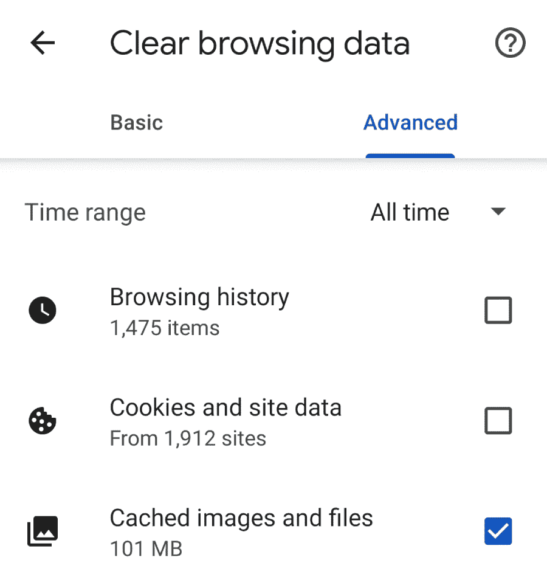
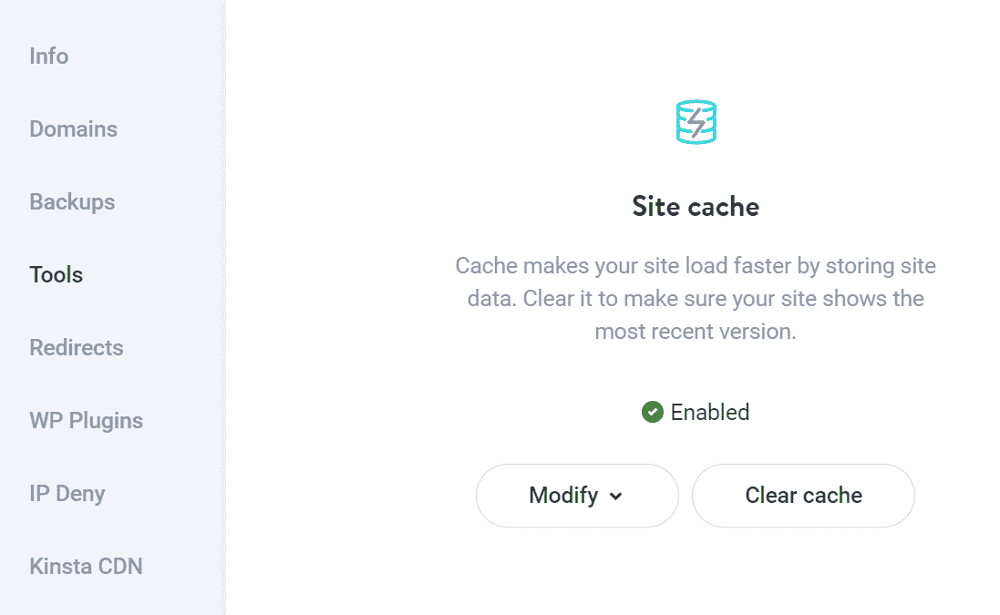
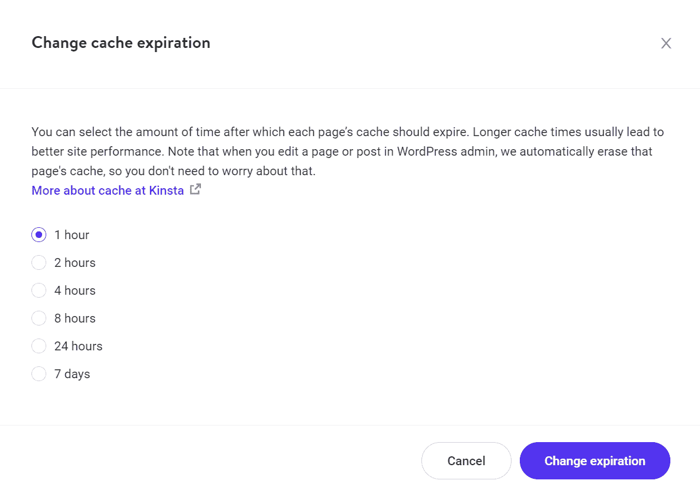
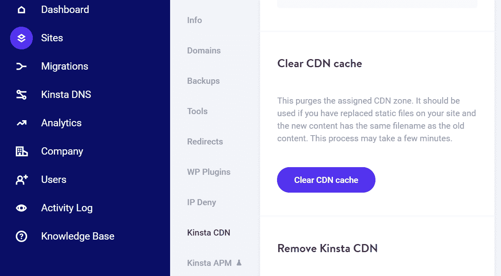

# 什么是缓存数据？探索 3 种简单的方法来清除它

> 原文：<https://kinsta.com/blog/what-is-cached-data/>

如果你花很多时间在线，你可能熟悉“[缓存数据](https://kinsta.com/blog/what-is-cache/)的概念您知道这个术语指的是存储在某处的*数据，但是您可能不确定为什么会出现这种情况。理解什么是缓存以及它是如何工作的是理解现代网络的关键。*

您可以在浏览器或服务器上缓存数据。存储这些数据可以使访问变得更容易、更快。这意味着你可以为你网站的用户提供更好的体验。作为互联网用户，你也可以更快地加载网站。

在本文中，我们将深入挖掘缓存数据。我们将讨论存储什么类型的数据，为什么缓存很重要，以及清除这些信息的利弊。

我们开始吧！

## 缓存数据的工作原理

首先，必须建立多种类型的缓存数据。一些最常见的例子包括:

*   存储在本地缓存中的信息，例如，存储在个人电脑、笔记本电脑和智能设备上的信息
*   储存在服务器上的网站文件
*   储存在浏览器中的网站数据

在每种情况下，保存的数据并不完全相似。应用程序可能会在缓存内存中存储一些文件以加快加载速度。你的 WordPress 网站或网络主机可能会在缓存级别存储文件或页面副本，以提高性能。同样，您的浏览器可能会在本地保存一些文件，因此您不必在每次访问网站时都重新加载它们。

> Kinsta 把我宠坏了，所以我现在要求每个供应商都提供这样的服务。我们还试图通过我们的 SaaS 工具支持达到这一水平。
> 
> <footer class="wp-block-kinsta-client-quote__footer">
> 
> 
> 
> <cite class="wp-block-kinsta-client-quote__cite">Suganthan Mohanadasan from @Suganthanmn</cite></footer>

[View plans](https://kinsta.com/plans/)

在所有这些情况下，缓存数据通过提供[更好的性能](https://kinsta.com/blog/performance-testing-tools/)来改善用户体验。我们指的是更快的加载时间，不管你说的是应用还是网站。

一般来说，缓存数据在任何情况下都是一样的。有人为存储什么信息、存储在哪里以及存储多长时间制定了规则。缓存数据通常有一个截止日期。这可以确保你不会在更新网站或应用程序后很久还在加载过时的文件或信息。

[准备好深入研究缓存数据了吗？👩‍💻了解存储的是什么类型的数据，为什么缓存很重要，清除这些信息的利弊等等👇 点击推文](https://twitter.com/intent/tweet?url=https%3A%2F%2Fkinsta.com%2Fblog%2Fwhat-is-cached-data%2F&via=kinsta&text=Ready+to+dive+deep+into+cached+data%3F+%F0%9F%91%A9%E2%80%8D%F0%9F%92%BB+Learn+what+type+of+data+gets+stored%2C+why+caching+is+important%2C+the+pros+and+cons+of+clearing+this+information+and+more+%F0%9F%91%87&hashtags=Caching%2CCachedData)

## 为什么缓存数据很重要

如果你是我们博客的常客，你会知道我们非常关心网站的性能。让你的网站[加载更快](https://kinsta.com/blog/boosting-wordpress-performance/)对于提供最好的用户体验至关重要。

如果配置得当，缓存可以全面大幅减少加载时间。比方说，由于大量的图片，你的网站的主页需要一段时间来加载。您可以做几件事来确保页面尽可能快地显示，包括:

1.  [在上传前或上传过程中压缩图像](https://kinsta.com/blog/optimize-images-for-web/)以减小其文件大小
2.  使用平均重量轻的[图像格式](https://kinsta.com/blog/image-file-types/)
3.  使用可以缓存图像的[内容交付网络(CDN)](https://kinsta.com/blog/wordpress-cdn/)
4.  选择在服务器级别处理缓存的 web 主机，比如 Kinsta
5.  配置访问者的浏览器应该缓存的文件

在五种可能的性能优化中，有三种与缓存有关。除了使用信誉良好的网络主机之外，缓存数据可能是确保你的网站加载更快的最有效的方法。

然而，缓存并不是灵丹妙药。正如我们之前提到的，缓存是临时的。你不能无限期地保存相同的数据，并期望它保持相关性。网站和应用程序会定期更新(至少好的会更新！).这意味着您可能偶尔需要清除缓存。

## 清除缓存数据的利弊

如果您没有遇到任何问题，您可以让缓存的数据自行过期。另一方面，清除缓存数据并没有太大的负面影响，除了您需要从头重新加载所有内容(一次。如果您清除浏览器的缓存数据，可能会导致特定网站的加载时间稍长。

大多数情况下不需要清除缓存的数据，除非你遇到错误。如果有一个网站不能正常工作，或者你在试图访问它时遇到了一个 [HTTP 错误](https://kinsta.com/blog/http-status-codes/)，清除你的缓存数据是我们经常推荐的故障排除步骤之一。

如果你正在运行一个 WordPress 网站，还有一些其他的原因让你想要清空它的缓存。每当你对你的站点进行重大修改时，比如改变主题，添加插件，删除页面，甚至上传新产品，清空缓存是一个好主意。

这样做可以确保新数据能够正确加载。根据您的 web 主机或缓存插件，您网站的缓存可能会在您更新内容时自动清除。

## 如何清除缓存数据(3 种方式)

清除缓存数据的工作方式非常不同，这取决于您在等式的哪一边。如果你运行一个网站，你需要在服务器级别清除缓存数据(或者通过你的 CDN，如果你正在使用的话)。

另一方面，如果您是最终用户，您将通过浏览器清除缓存的数据。让我们来探索这些选项中的每一个。

## 注册订阅时事通讯

### 想知道我们是怎么让流量增长超过 1000%的吗？

加入 20，000 多名获得我们每周时事通讯和内部消息的人的行列吧！

[Subscribe Now](#newsletter)

### 1.清除您的浏览器缓存

如果你使用的是 PC 或笔记本电脑，你可以阅读我们的完整指南[清除你的浏览器缓存](https://kinsta.com/knowledgebase/how-to-clear-browser-cache/)。然而，在移动设备上清除缓存的工作方式略有不同。

对于移动设备，有两种类型的缓存数据可以清除:

1.  **缓存的应用程序数据:**这些文件是应用程序保存到设备的缓存中以缩短加载时间的文件。通常，您可以通过应用程序管理选项清除此类数据。
2.  **网站缓存数据:**这是网站通过浏览器缓存保存到您设备上的信息。如何清除这些数据将取决于您使用的手机浏览器。

[清除移动设备上的浏览器缓存](https://kinsta.com/blog/most-secure-browser/)相对简单。例如，如果你使用的是移动版 Chrome，你可以打开**设置**菜单，跳转到**隐私与安全** > **清除浏览数据。**然后选择**高级**选项卡下的**缓存图像和文件**选项。

清除 Chrome 浏览器中的浏览数据。

这个过程会根据您使用的浏览器而有所不同。为了让你的生活更轻松，这里有一些在 Safari 中清理缓存的说明(因为 Chrome 和 Safari 是世界上最受欢迎的两个浏览器)。

### 2.清除服务器的缓存数据

如果你在服务器级别存储缓存数据，并且你正在使用 WordPress，有几种方法可以清除这些文件。您的 web 主机可能正在服务器级别缓存数据。在这种情况下，您应该能够从您的主机控制面板刷新这些数据。

这正是金斯塔的情况。如果您是 Kinsta 用户，您可以访问 [MyKinsta 控制面板](https://my.kinsta.com/login)。从那里，你可以导航到**网站**，并选择有问题的网站。

与我们世界一流的支持团队一起体验卓越的 WordPress 托管支持！与支持我们财富 500 强客户的同一个团队聊天。[查看我们的计划](https://kinsta.com/plans/?in-article-cta)

接下来，转到**工具**选项卡。在这里，你会看到一个选项，在**站点缓存**下面写着**清除缓存**。

清除 MyKinsta 仪表盘中的缓存。

MyKinsta 还允许您修改缓存到期日期。为此，选择**修改>更改缓存到期**选项。

在 MyKinsta 中更改缓存到期日期。

总的来说，如果您设置了合理的缓存到期日期，那么您就不需要手动清除它。默认情况下，Kinsta 每小时清理一次站点的缓存，这对大多数网站来说已经足够频繁了。为了防止用户加载过时信息的问题，我们还会在你每次更新页面或在 WordPress 发帖时清除缓存。

如果你使用的是一个 [WordPress 缓存插件](https://kinsta.com/blog/wordpress-caching-plugins/)，它应该包括一个选项[手动清除缓存](https://kinsta.com/blog/wordpress-clear-cache/)。具体的步骤会根据您使用的缓存插件而有所不同，所以我们建议查看其官方文档以获取更多信息。

### 3.清除你的 CDN 的缓存

cdn 的工作原理是将你的网站或应用程序的数据缓存在世界各地的服务器集群中。当访问者试图访问您的网站时，他们的请求会被路由到最近的服务器。这提供了一个你的站点或者它的部分数据的缓存版本。

简而言之，cdn 通过减少工作量来帮助您提高站点的性能。CDN 的服务器通常经过优化，可以无瓶颈地处理大量流量。另外，你的网站的数据不需要传播那么远。它可以从作为 CDN 一部分的附近服务器上获取。

如果你使用的是 CDN，它应该包括一个选项来清除你网站服务器上的缓存文件。在 Kinsta，我们将 Cloudflare CDN 用于所有客户网站。也可以通过 MyKinsta 控制面板清除 CDN 缓存。

为此，选择 [Kinsta CDN](https://kinsta.com/help/kinsta-cdn/) 选项卡，然后打开您站点的设置。在里面，你会发现一个选项，上面写着**清除 CDN 缓存**。

清除 MyKinsta 中的 CDN 缓存。

如果你正在使用一个替代的 CDN 提供商，你将需要检查它的文档中关于清除缓存的说明。然而，这个选项应该不难找到，因为这是您在使用 CDN 时需要执行的操作。

[Understanding what a cache is and how it works is key to understanding the modern web... and this guide is the perfect place to start 💪Click to Tweet](https://twitter.com/intent/tweet?url=https%3A%2F%2Fkinsta.com%2Fblog%2Fwhat-is-cached-data%2F&via=kinsta&text=Understanding+what+a+cache+is+and+how+it+works+is+key+to+understanding+the+modern+web...+and+this+guide+is+the+perfect+place+to+start+%F0%9F%92%AA&hashtags=Caching%2CCachedData)

## 摘要

数据缓存是现代网络的重要组成部分。每次访问时重新加载每个网站的所有资源是非常低效的。通过利用缓存，你可以告诉访问者的浏览器他们应该存储什么数据，以及在多长时间后过期。此外，如果你使用一个著名的 web 主机或 CDN ( [最好两者都用](https://kinsta.com/cloudflare-integration/))，你将在服务器级访问缓存。

让我们快速回顾一下清除这些保存数据的三种方法:

1.  清除您的浏览器缓存。
2.  清除服务器存储的数据。
3.  清除您的 CDN 缓存。

关于数据缓存，您有什么问题吗？请在下面的评论区告诉我们！

* * *

让你所有的[应用程序](https://kinsta.com/application-hosting/)、[数据库](https://kinsta.com/database-hosting/)和 [WordPress 网站](https://kinsta.com/wordpress-hosting/)在线并在一个屋檐下。我们功能丰富的高性能云平台包括:

*   在 MyKinsta 仪表盘中轻松设置和管理
*   24/7 专家支持
*   最好的谷歌云平台硬件和网络，由 Kubernetes 提供最大的可扩展性
*   面向速度和安全性的企业级 Cloudflare 集成
*   全球受众覆盖全球多达 35 个数据中心和 275 多个 pop

在第一个月使用托管的[应用程序或托管](https://kinsta.com/application-hosting/)的[数据库，您可以享受 20 美元的优惠，亲自测试一下。探索我们的](https://kinsta.com/database-hosting/)[计划](https://kinsta.com/plans/)或[与销售人员交谈](https://kinsta.com/contact-us/)以找到最适合您的方式。