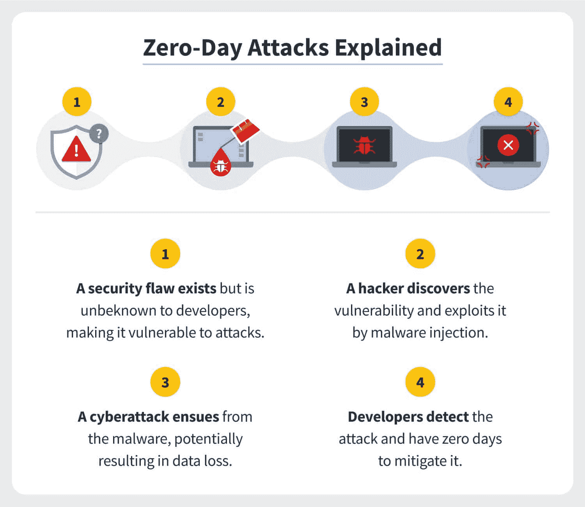
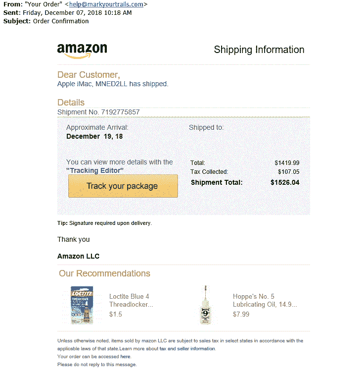
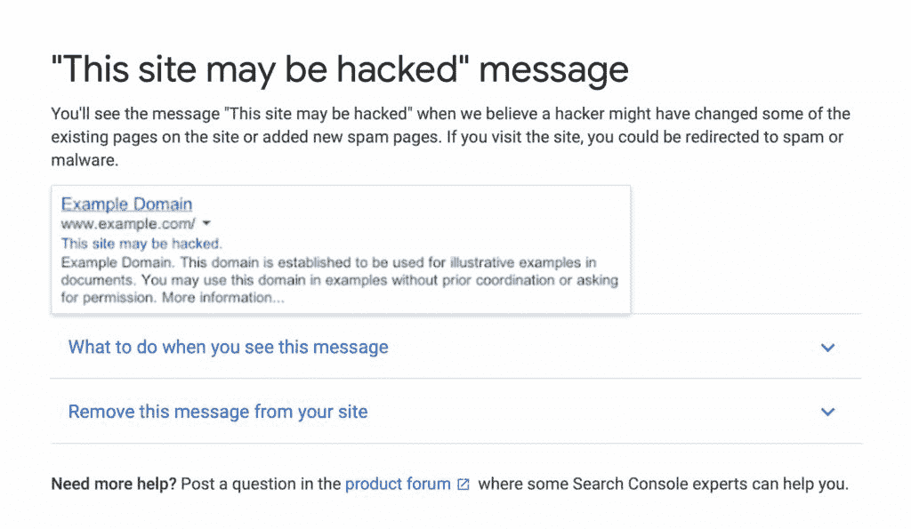
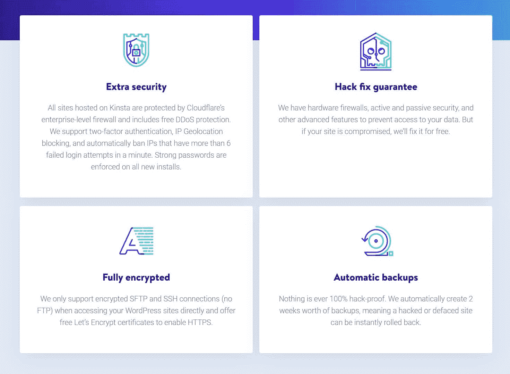
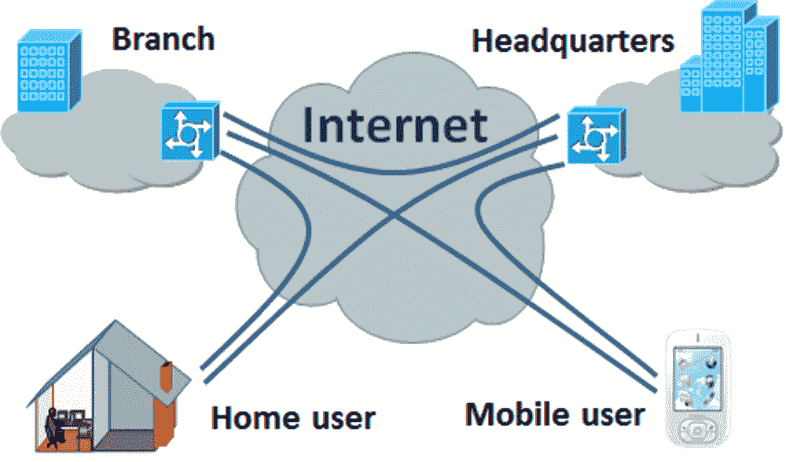

# 什么是零日漏洞利用？为什么它们是危险的？

> 原文：<https://kinsta.com/blog/zero-day-exploit/>

虽然企业总是有许多威胁要应对，但网络攻击正变得越来越令人担忧。零日漏洞是最严重的恶意软件威胁之一。

网络攻击会给企业带来严重后果，因为黑客可以窃取金钱、数据或知识产权，从而危及您的运营。任何公司都不能幸免。它们会影响交易者、本地企业、全国连锁企业，甚至像谷歌这样的全球巨头(事实上，谷歌每年至少有 [22 次不可预见的攻击](https://www.vmware.com/content/dam/digitalmarketing/vmware/en/pdf/docs/vmwcb-report-detecting-and-responding-to-zero-day-attacks.pdf))。

但这并不是说网络攻击不可避免。我们可以采取一些措施来保护自己。

在本文中，我们将告诉您关于零日漏洞利用您需要知道的一切，为什么它们是危险的，以及您如何识别和预防它们。

开始吧！

T3】

## 什么是零日漏洞利用？

零日漏洞是您的软件或硬件中以前未发现的安全缺陷，黑客可以利用它来破坏您的系统。零日漏洞有许多不同的名称，包括“零时漏洞”或“零日漏洞”

不管名字如何，“零时差”的由来都是一样的。“零日”一词强调了问题的严重性。在有人发现零日漏洞后，开发人员有零天时间来修复错误，以免它变成紧急问题。

当了解零日漏洞利用时，您可能会听到它们被称为“零日漏洞”或“零日攻击”这些术语之间有一个本质的区别:

> 需要在这里大声喊出来。Kinsta 太神奇了，我用它做我的个人网站。支持是迅速和杰出的，他们的服务器是 WordPress 最快的。
> 
> <footer class="wp-block-kinsta-client-quote__footer">
> 
> 
> 
> <cite class="wp-block-kinsta-client-quote__cite">Phillip Stemann</cite></footer>

[View plans](https://kinsta.com/plans/)

*   **“零日漏洞利用”**指黑客攻击软件的方法
*   **“零日漏洞”**指您系统中未被发现的漏洞
*   **“零日攻击”**指黑客利用漏洞攻破你的系统时采取的行动

在讨论零日漏洞时，“未发现”一词至关重要，因为该漏洞必须不为系统创建者所知，才能被视为“零日漏洞”一旦开发者知道了问题并发布了补丁，安全漏洞就不再是“零日漏洞”。

许多不同的人群实施零日攻击，包括:

*   **网络罪犯:**有经济动机的犯罪黑客
*   黑客行动主义者:寻求侵入系统以推进政治事业或议程的人
*   公司黑客:寻求了解竞争对手信息的黑客
*   **以盈利为目的的黑客:**找到漏洞卖给公司的人(但自己并不打算利用漏洞)

### 零日攻击是如何工作的

虽然每种攻击都不同，但大多数攻击通常是这样工作的:

*   第一步:你的开发人员创建一个系统。这个系统包含一个开发者不知道的零日漏洞。
*   **第二步:**系统上线后，黑客(有时称为“威胁行动者”或“恶意行动者”)发现了系统中的漏洞。
*   **第三步:**黑客编写并执行恶意代码，利用漏洞攻破你的系统。
*   **第四步:**无论是公众还是开发者都注意到了一个严重的问题，开发者用补丁修复了这个问题。

有时候，发现你零日威胁的黑客和攻击你系统的黑客是不同的人。

一些黑客通过黑市向其他黑客出售信息。黑市存在于[暗网](https://kinsta.com/blog/dark-patterns/)上——互联网的一部分，你无法通过谷歌、雅虎和必应等搜索引擎触及。人们通过 Tor 这样的匿名浏览器访问黑暗网络。

一些网络安全公司也在寻找漏洞，向系统所有者出售这些信息。

这些公司通过“白色”或“灰色”市场出售这些数据(尽管白色、灰色和黑色市场之间的区别因您当地的网络安全法而异)。

黑客如何实施零日攻击。(**来源:** [诺顿](https://us.norton.com/internetsecurity-emerging-threats-how-do-zero-day-vulnerabilities-work.html) )

既然您已经知道零日漏洞是如何工作的，您可能想知道黑客是如何侵入您的系统的。

虽然没有可靠的方法，但许多黑客使用:

#### 起毛

模糊化(或称“模糊测试”)是黑客用来寻找系统漏洞的一种暴力技术。

当黑客模糊目标时，他们使用软件将随机数据输入系统的输入框(人们输入信息的文本框)。然后，黑客会观察崩溃、内存泄漏或表明代码中有漏洞的失败断言。

许多模糊技术集中在用随机的、无意义的或无效的答案向输入框发送垃圾信息。例如，如果你有一个文本框让某人输入他们的年龄，黑客会测试你的系统在他们输入“-94”或“@45”时的反应。

#### 社会工程

社会工程是黑客用来通过用户进入系统的操纵技术。

有许多类型的社会工程，包括:

*   当有人使用借口时，他们试图通过创造一个可信的场景来获得你的信任。例如，他们可能假装来自您的 IT 部门，并说他们需要您的密码。
*   当有人引诱你时，他们试图通过引诱你接触腐败材料来破坏你的系统。例如，2018 年，一名中国黑客向[美国多个州和地方当局](https://krebsonsecurity.com/2018/07/state-govts-warned-of-malware-laden-cd-sent-via-snail-mail-from-china/)发送了一张神秘的光盘。目的是欺骗他们出于好奇打开 CD 的内容。
*   **网络钓鱼:**当有人对您进行网络钓鱼时，他们会冒充您认识的人，诱使您向他们提供机密信息、打开恶意文件或点击损坏的链接。例如，如果您正在等待一封来自“[【电子邮件保护】](/cdn-cgi/l/email-protection)”的电子邮件，黑客可能会使用该电子邮件地址“[【电子邮件保护】](/cdn-cgi/l/email-protection)”对您进行网络钓鱼。由于 2019 年对美国公司的网络攻击中有 38%使用了网络钓鱼，许多公司使用类似于 [FraudLabsPro 或 similarity](https://kinsta.com/blog/ecommerce-fraud-prevention/)的欺诈防范工具来保护自己免受网络钓鱼的攻击。

钓鱼邮件的例子。(**来源:** [SecureWorld](//www.secureworld.io/industry-news/how-to-spot-fake-amazon-email%22) )

一旦黑客利用社交工程攻破系统，他们就会利用用户的账户从内部寻找零日漏洞。

### 共同目标

你不需要成为一家价值数十亿美元的银行公司，黑客就会盯上你。黑客会攻击任何他们可以从中获利的组织、个人或实体，尤其是:

*   网络安全差的组织
*   处理个人数据(尤其是地址、社会保险号(SSN)、客户的法定全名和客户的出生日期)的组织
*   政府机构
*   拥有机密信息的组织
*   为客户开发软件或硬件的组织(因为他们可以利用技术来黑客户)
*   在国防领域工作的组织

在选择黑客时，许多黑客会寻找容易获得高额回报的目标，因为他们希望以最少的努力和风险赚最多的钱。

尽管每个黑客的工作方式不同，但大多数黑客的目标是:

*   操作系统
*   网络浏览器
*   硬件和固件
*   软件应用
*   物联网(IoT)设备

### 例子

虽然你可能不会经常想到网络攻击，但它们发生的频率比你意识到的要高。截至 2020 年，个人和组织已经检测出[超过 6 . 77 亿](https://www.statista.com/statistics/680953/global-malware-volume/)件恶意软件。这比 2010 年增加了 2317.86%，当时人们只检测到超过 2800 万个[恶意软件](https://kinsta.com/blog/types-of-malware/)。

根据 Ponemon Institute 的研究，近 [48%的组织](https://www.servicenow.com/lpayr/ponemon-vulnerability-survey.html)在过去两年中遭遇过数据泄露。这些组织中有 62%在攻击之前不知道该漏洞(意味着它们是零日攻击)。

虽然大多数组织不会公开他们攻击的细节，但我们知道过去几年发生了许多大型攻击。其中包括:

#### 2021 年谷歌 Chrome 黑客事件

在 2021 年 4 月的[日，谷歌发布了 Windows、Linux 和 Mac 设备上的谷歌 Chrome 浏览器的更新。此外，此次更新修复了黑客利用的零日漏洞。他们称这个漏洞为“CVE-2021-21224”](https://chromereleases.googleblog.com/2021/04/stable-channel-update-for-desktop_20.html)

虽然谷歌没有分享攻击的全部细节，但 CVE-2021-21224 允许某人通过特制的 HTML 页面在沙箱[中运行代码。
T3】](https://nvd.nist.gov/vuln/detail/CVE-2021-21224#vulnCurrentDescriptionTitle)

#### 2020 年的 Zoom Hack

2020 年 7 月，网络安全公司 0patch 报告称，一名匿名人士[发现了 Zoom](https://blog.0patch.com/2020/07/remote-code-execution-vulnerability-in.html) 中的一个零日漏洞。该漏洞允许黑客在 Zoom 中远程运行代码，只要他们通过让用户点击链接或打开恶意软件来获得入口。该漏洞只存在于运行 Windows 7 或更早版本 Windows 的计算机上。

在了解到该漏洞后，0patch 将这些信息带到了 Zoom，Zoom 的开发人员在一天内就发布了该问题的安全补丁。

#### 2016/2017 微软 Word 攻击

2016 年，Ryan Hanson(Optiv 的安全研究员和顾问)在微软 Word 中发现了一个零日漏洞。该漏洞(被称为“CVE-2017-0199”)允许攻击者在用户下载运行恶意脚本的 Word 文档后，在用户的计算机上安装恶意软件。

据[路透社](https://www.reuters.com/article/us-microsoft-cyber-idUSKBN17S32G)报道，黑客利用 CVE-2017-0199 从网上银行账户窃取了数百万美元，之后微软开发人员在 2017 年对其进行了修补。有趣的是，汉森不是唯一一个发现 CVE-2017-0199 的人——2017 年 4 月，迈克菲和火眼的研究人员都报告发现了该漏洞。

#### 2010 年的震网病毒攻击

2010 年，Stuxnet 以伊朗的几个设施(包括核设施)为目标。Stuxnet 是一种电脑蠕虫，它通过含有恶意软件的 u 盘感染 Windows 电脑。

然后，Stuxnet 恶意软件通过攻击机器的可编程逻辑控制器(PLC)来攻击机器。这些 PLC 使机器过程自动化，这意味着 Stuxnet 可以干扰其目标的机器。

据[迈克菲](https://www.mcafee.com/enterprise/en-au/security-awareness/ransomware/what-is-stuxnet.html)报道，Stuxnet 摧毁了伊朗纳坦兹铀浓缩设施的几座水处理厂、发电厂、天然气管道和离心机。Stuxnet 还衍生出许多后代，包括 Duqu(一种从其目标计算机中窃取数据的恶意软件)。

### 为什么零日攻击是危险的

零日攻击的财务、运营和法律影响可能是毁灭性的。根据威瑞森 2021 年数据泄露调查报告， [95%被黑客攻击的组织](https://www.verizon.com/business/resources/reports/dbir/2021/masters-guide/summary-of-findings/)丢失了:

*   价值 250-984，855 美元的商业电子邮件泄露(BEC)攻击
*   148 美元到 1，594，648 美元之间的计算机数据泄露(CDB)事件
*   69-1，155，755 美元的勒索事件

但是，零日攻击即使不赔钱，仍然是毁灭性的。原因如下:

它们可能几天、几个月甚至几年都不会被发现

由于开发人员不知道零日漏洞，许多组织直到攻击发生很久之后才知道攻击者何时攻破了他们的系统。不幸的是，这意味着黑客可能会在你阻止他们之前反复滥用你的系统。

## 注册订阅时事通讯

### 想知道我们是怎么让流量增长超过 1000%的吗？

加入 20，000 多名获得我们每周时事通讯和内部消息的人的行列吧！

[Subscribe Now](#newsletter)

#### **漏洞可能难以修复**

一旦您的企业了解到黑客已经入侵了您的系统，您就需要找出漏洞在哪里。由于许多组织使用多个系统，定位和修补漏洞可能需要一段时间。

#### 黑客可以利用它们窃取金融数据或银行信息

许多攻击者进入系统窃取金融数据或银行信息。一些黑客将这些数据出售给第三方，而另一些黑客则会利用你的财务信息来窃取你的资金。

#### 罪犯可以利用他们来挟持你的公司勒索赎金

虽然许多黑客使用零日攻击来窃取数据，但其他人通过[分布式拒绝服务(DDoS)攻击](https://kinsta.com/blog/what-is-a-ddos-attack/)和其他勒索技术来勒索你的公司。DDoS 攻击向您的网站发送垃圾请求，直到网站崩溃。

如果你想了解如何阻止 DDoS 攻击，你可以阅读我们的案例研究:“[如何在其轨道上阻止 DDoS 攻击](https://kinsta.com/blog/ddos-attack/)”

#### 犯罪分子会瞄准你的顾客

如果你销售有专门用户群的软件或硬件，黑客可能会破坏你的系统，并利用它来攻击你的客户。

我们最近看到了一个毁灭性的例子，犯罪分子侵入了 Kaseya 的软件，并使用他们的系统用勒索软件攻击了 Kaseya 的 800-1500 名客户。

## 如何识别零日攻击

由于每个零日攻击的工作方式不同，因此没有完美的方法来检测它们。但是，组织识别攻击有许多常见的方法。这是其中的六个。

### 1.进行漏洞扫描

漏洞扫描是搜寻系统中零日漏洞的过程。一旦你发现一个漏洞，你就努力在黑客利用它之前修补它。

漏洞扫描可以是独立的活动，也可以是开发过程中的常规部分。许多组织也选择将其漏洞扫描外包给专业的网络安全公司。

### 2.收集和监控来自系统用户的报告

由于您的系统用户经常与您的系统交互，他们可能会在您之前发现潜在的问题。当然，您应该跟踪您的用户报告，查看有关可疑电子邮件、弹出窗口或密码尝试通知的报告。

### 3.观察你网站的表现

根据威瑞森的《2021 年数据泄露调查报告》，[超过 20%](https://www.verizon.com/business/resources/reports/dbir/2021/masters-guide/summary-of-findings/) 的网络攻击以 web 应用为目标。虽然您并不总是能够判断黑客是否入侵了您的 web 应用程序或网站，但在以下情况下，有人可能已经攻击了您的网站:

*   你不能登录
*   您网站的外观已经改变
*   您的网站会将访问者重定向到未知网站
*   你的[网站表现出乎意料地坦克](https://kinsta.com/blog/debugging-wordpress-performance/)
*   您的网站显示浏览器警告，如下所示:

来自谷歌的消息，称一个网站可能受到威胁。

### 4.利用复古狩猎

追溯是寻找重大网络攻击报告并检查您的组织是否受到影响的过程。要充分利用复古狩猎，请确保您:

需要一个给你带来竞争优势的托管解决方案吗？Kinsta 为您提供了令人难以置信的速度、一流的安全性和自动伸缩功能。[查看我们的计划](https://kinsta.com/plans/?in-article-cta)

*   将来自软件供应商的所有电子邮件定向到一个中央收件箱，并定期检查它以获得有关安全缺陷的通知
*   每天浏览新闻，检查对您所在行业组织的新攻击
*   阅读最近攻击的详细信息，并要求您的开发人员检查您的系统是否能够承受类似的攻击

### 5.注意降低的网络速度

当黑客通过恶意软件访问系统时，网络流量的增加有时会降低受害者的互联网连接速度。因此，如果您密切关注您的网络速度，您就可以在攻击发生时发现它。

### 6.跟踪您软件的性能

当有人通过漏洞获得对您系统的访问权时，他们注入到您软件中的代码可能会降低您程序的速度、改变其功能或使功能脱机。自然，您可以通过观察系统中的重大或无法解释的变化来识别零日攻击。

## 如何保护自己免受零日漏洞攻击

当你等待开发人员修补漏洞时，你别无选择，只能坐看黑客窃取金钱、数据和商业机密，零日攻击压力很大。

组织应对零日攻击的最佳武器是更好的准备。这里有八种方法可以保护您的系统免受零日攻击。

### 1.使用安全软件

安全软件保护您的系统免受病毒、基于互联网的入侵和其他安全威胁的侵害。

虽然每个软件提供的保护类型略有不同，但大多数软件解决方案都可以扫描下载的恶意软件，阻止未经授权的用户进入您的系统，并加密您的数据。

一些安全软件公司也为网站开发专门的软件。例如，如果你使用 WordPress(就像 [40%](https://kinsta.com/wordpress-market-share) 的网站)，你可以保护你的网站:

*   [文件完整性监控(FIM)软件](https://kinsta.com/blog/file-integrity-monitoring/)
*   寻找可疑评论的插件(如 [Astra Web Security 和 WP fail2ban](https://kinsta.com/blog/wordpress-security-plugins/)
*   保护你的网站免受暴力攻击的插件
*   一个[内容分发网络](https://kinsta.com/blog/wordpress-cdn/)

或者，你可以使用一个通用的安全插件，如 [Sucuri 或 Wordfence](https://kinsta.com/blog/sucuri-vs-wordfence/) 。

### 2.经常安装新的软件更新

随着黑客在过时的代码中发现漏洞，[更新您的网站](https://kinsta.com/blog/wordpress-maintenance/)，网络应用程序和软件是保证您系统安全的关键。新的更新保护您的系统，因为:

*   它们包含针对已知网络安全漏洞(包括零日漏洞)的补丁
*   它们删除黑客可能利用的旧的或未使用的程序部分
*   他们引入了新的网络安全措施来保护用户的安全
*   他们修复易受模糊影响的小错误

### 3.使用安全的虚拟主机

黑客每天攻击超过 127，000 个网站。因为黑客可以通过插件、网站主题或 WordPress 核心的过时版本侵入你的网站， [WordPress 网站](https://kinsta.com/blog/is-wordpress-secure/)是[的主要目标](https://kinsta.com/blog/wordpress-hacked/)。

幸运的是，你可以通过使用像 Kinsta 这样的安全主机提供商来保护你的组织。Kinsta 通过以下方式保护您的网站:

*   加密的安全文件传输协议(SFTP)和安全外壳(SSH)连接
*   与谷歌云平台的安全连接
*   黑客修复保证
*   一个 [IP 拒绝工具](https://kinsta.com/knowledgebase/block-ip-address/)，可以阻止 IP 地址访问你的网站
*   通过 Cloudflare 实现分布式拒绝服务(DDoS)保护和企业级防火墙
*   每两周自动备份一次
*   一份[恶意软件安全保证书](https://kinsta.com/knowledgebase/malware-security/)

金斯塔的安全 WordPress 托管保证。

### 4.使用防火墙

防火墙就像它们听起来的那样:你的系统和外界之间的数字墙。防火墙为您的系统增加了一层额外的保护，因为黑客需要突破防火墙才能攻击您的系统。

有许多类型的防火墙可供选择，包括个人防火墙、包过滤防火墙、状态防火墙、web 应用防火墙和下一代(NGFW)防火墙。

### 5.使用最少访问规则

最少访问规则规定，组织中的人员应该只能访问他们执行日常工作职责所需的数据、硬件和软件。

最少访问规则为使用社会工程的黑客创造了更少的入口点，限制了对每个系统拥有管理权限的人数。

### 6.切换到 DevOps 开发

DevOps 是一种使用持续开发系统不断更新程序的方法。它可以帮助您加强针对零日漏洞的安全性，因为它迫使您不断更新和更改您的系统。

如果你想了解更多关于 DevOps 开发的知识，你可以阅读我们的文章[“devo PS 工具”](https://kinsta.com/blog/devops-tools/)但简而言之，DevOps 开发遵循这样的生命周期:

一个 DevOps 生命周期的示意图。(**来源:** [亚特兰蒂斯](//www.atlassian.com/devops/what-is-devops%22) )

### 7.实施用户安全培训

用户安全培训教导您的员工识别社会工程技术和安全威胁。

培训您的员工发现网络安全威胁将有助于他们识别攻击，迅速通知正确的人，并在不惊慌或给黑客信息的情况下采取行动。

### 8.使用 vpn

[虚拟专用网络(VPN)](https://kinsta.com/blog/proxy-vs-vpn/)是中间服务器，在您浏览互联网时保护您的浏览数据、IP 地址和连接数据。使用 VPN 将使犯罪黑客更难通过你的网络浏览器入侵你的系统，因为他们可以用来对付你的信息更少了。

vpn 是这样工作:

VPN 是如何工作的。(**来源:** [黄石计算](//www.yellowstonecomputing.net/blog/vpns-your-personal-tunnel-to-privacy-part-2%E2%80%9D) )

[了解这种日益普遍的网络漏洞形式:零日漏洞。😬](https://twitter.com/intent/tweet?url=https%3A%2F%2Fbit.ly%2F3deZxpJ&via=kinsta&text=Learn+everything+you+need+to+know+about+this+increasingly+common+form+of+cyber+vulnerability%3A+zero-day+exploits.+%F0%9F%98%AC&hashtags=WebSecurity%2CCyberAttacks)

## 摘要

零日攻击变得越来越普遍，成为全球组织的一大担忧。但是，您可以采取一些措施来降低遭受攻击的风险，包括:

*   培训您的员工发现和应对攻击
*   使用网络安全措施，如 VPN、安全软件和防火墙
*   改变你的开发过程，定期更新系统
*   小心控制对数据和易受攻击系统的访问
*   使用安全的网站托管服务(如 Kinsta)

既然我们已经分享了我们的建议，就交给你了。您采取了哪些措施来降低贵组织遭受网络攻击的风险？请在下面的评论中告诉我们。

* * *

让你所有的[应用程序](https://kinsta.com/application-hosting/)、[数据库](https://kinsta.com/database-hosting/)和 [WordPress 网站](https://kinsta.com/wordpress-hosting/)在线并在一个屋檐下。我们功能丰富的高性能云平台包括:

*   在 MyKinsta 仪表盘中轻松设置和管理
*   24/7 专家支持
*   最好的谷歌云平台硬件和网络，由 Kubernetes 提供最大的可扩展性
*   面向速度和安全性的企业级 Cloudflare 集成
*   全球受众覆盖全球多达 35 个数据中心和 275 多个 pop

在第一个月使用托管的[应用程序或托管](https://kinsta.com/application-hosting/)的[数据库，您可以享受 20 美元的优惠，亲自测试一下。探索我们的](https://kinsta.com/database-hosting/)[计划](https://kinsta.com/plans/)或[与销售人员交谈](https://kinsta.com/contact-us/)以找到最适合您的方式。