# 如何修复“Safari 无法建立到服务器的安全连接”错误(6 种解决方案)

> 原文:[https://kinsta . com/blog/safari-cant-establish-a-secure-connection-to-the-server/](https://kinsta.com/blog/safari-cant-establish-a-secure-connection-to-the-server/)

当你浏览网页时，你最不想看到的就是一条错误信息。如果你是 macOS 用户，你可能会遇到的一个问题是:“Safari 无法建立到服务器的安全连接”错误。

虽然一开始看起来有点吓人，但这是一个相对常见的问题，有一些简单的解决方案。在您能够有效地(安全地)访问该站点之前，通常只需要一点点故障排除。

这篇文章将解释 Safari 的错误信息以及一些常见的原因。然后我们会给你提供六个简单的方法来解决这个问题。

我们开始吧！

<kinsta-auto-toc heading="Table of Contents" exclude="last" list-style="arrow" selector="h2" count-number="-1">T3】

### 查看我们的[视频指南](https://www.youtube.com/watch?v=D688pgFHW2E)来修复“Safari 无法与服务器建立安全连接”的错误

<kinsta-video src="https://www.youtube.com/watch?v=D688pgFHW2E"></kinsta-video>

## 什么是“Safari 无法建立到服务器的安全连接”错误？

Mac 设备的一些最佳特性是它们的[内置安全设置](https://kinsta.com/blog/most-secure-browser/)。苹果创造了一种体验，旨在保护您和您的设备的安全，尤其是在浏览网页时。

这就是为什么它的原生浏览器 Safari 有时会阻止你访问它认为不安全的网站。发生这种情况时，您可能会看到一条错误信息，指出“Safari 无法与服务器建立安全连接。”

<link rel="stylesheet" href="https://kinsta.com/wp-content/themes/kinsta/dist/components/ctas/cta-mini.css?ver=2e932b8aba3918bfb818">

> 需要在这里大声喊出来。Kinsta 太神奇了，我用它做我的个人网站。支持是迅速和杰出的，他们的服务器是 WordPress 最快的。
> 
> <footer class="wp-block-kinsta-client-quote__footer">
> 
> 
> 
> <cite class="wp-block-kinsta-client-quote__cite">Phillip Stemann</cite></footer>

[View plans](https://kinsta.com/plans/)

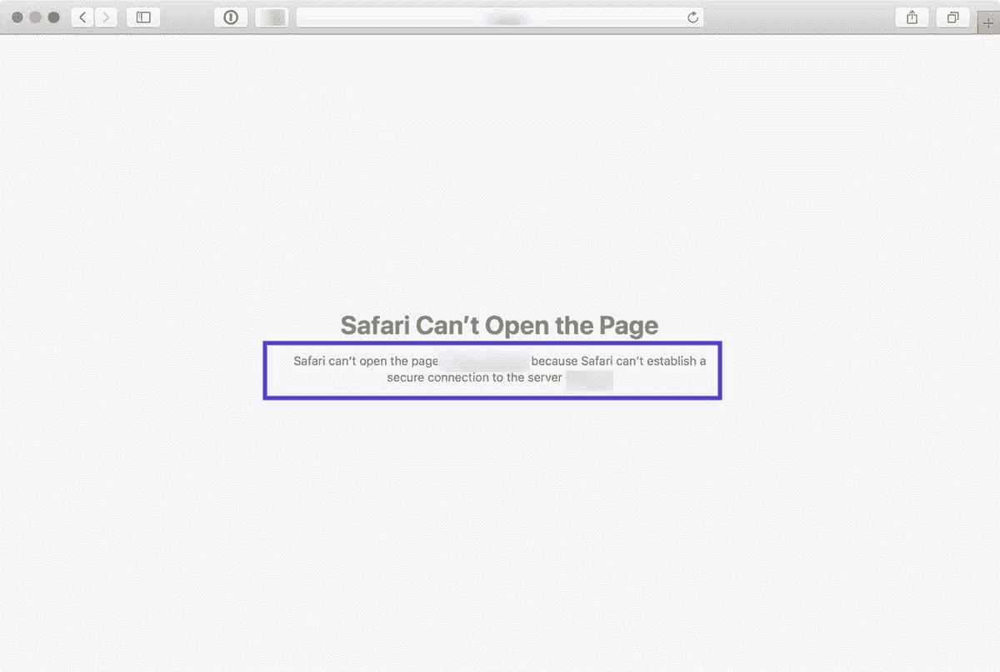

“Safari 无法与服务器建立安全连接”错误。

错误的具体措辞可能会有所不同。例如，正如您在上面的图像中看到的，您可能还会遇到一个通知，让您知道“Safari 无法打开该页面”

简而言之，这个错误信息意味着浏览器不信任站点上的加密数据。或者，Safari 无法成功访问和验证信息。例如，当一个站点没有正确配置[安全套接字层(SSL)证书](https://kinsta.com/knowledgebase/how-ssl-works/)时，可能会发生这种情况。

使用 SSL 和[安全外壳访问(SSH)](https://kinsta.com/knowledgebase/ssh-vs-ssl/) 对于当今的网站来说至关重要。当你有一个处理敏感客户数据的网站时，尤其如此，比如一个 [WooCommerce 商店](https://kinsta.com/knowledgebase/woocommerce-ssl/)。

但是，如果您知道您正在访问的站点是安全的，问题可能出在 Safari 上。许多人在访问热门网站时都会遇到这种错误信息，如脸书、YouTube 和谷歌。

## 什么原因导致“Safari 无法建立到服务器的安全连接”错误？

您可能会看到此错误消息，原因有很多。正如我们提到的，主要的解释是 Safari 无法验证你试图访问的网站是否足够安全来保护你的数据。

然而，有必要了解*为什么*认为网站不安全，并知道如何解决这个问题。有时，您可能不知道什么是罪魁祸首，直到您尝试排除故障。

也就是说，“Safari 无法建立安全连接”信息背后有一些常见原因。例如，问题可能归因于您在浏览器上安装的第三方扩展或加载项。这可能只是拥有过时的缓存数据这样简单的事情。然而，这可能是一个更复杂的问题，比如您正在使用的[互联网协议(IP)](https://kinsta.com/blog/ipv4-vs-ipv6/) 版本。

## 如何修复“Safari 无法建立到服务器的安全连接”错误(6 种解决方案)

现在我们对这个问题及其潜在原因有了更多的了解，是时候看看如何解决它了。以下是您可以用来解决“Safari 无法建立安全连接”错误的六种解决方案。

### 1.清除您的浏览器数据

当您访问网站时，Safari 会将一些信息存储在浏览器缓存和 cookies 中。如果这些数据包含与站点的 [SSL 或加密](https://kinsta.com/blog/types-of-ssl-certificates/)相关的过时细节，这可能是您看到错误消息的原因。

因此，您可以使用的解决此错误的最快和最简单的方法之一是[清除您的浏览器缓存](https://kinsta.com/knowledgebase/how-to-clear-browser-cache/)。要在 Safari 中做到这一点，您可以从打开浏览器开始。

接下来，点击**偏好** > **隐私**，然后选择**删除所有网站数据**。

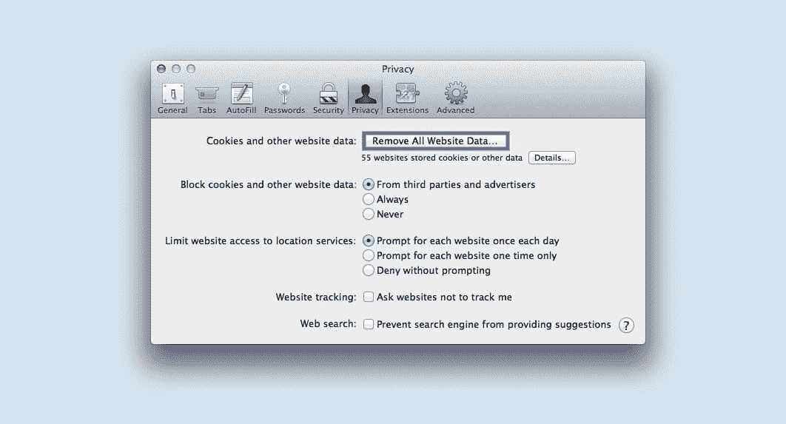

清除 Safari 中的浏览器缓存。

完成加载后(可能需要一两分钟)，您可以决定从哪些网站清除数据。例如，您可以选择所有这些文件，或者只选择您无法访问的文件。

完成后，点击屏幕底部的**完成**按钮。

接下来，要清除您的整个浏览历史，您可以导航到 **Safari** > **历史** > **清除历史**。

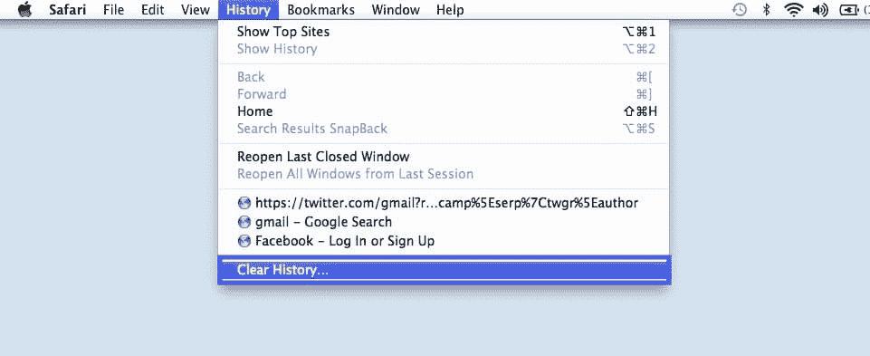

清除你的整个浏览历史。

完成后，尝试重新访问显示错误信息的站点。如果它还在，你可以继续下一个解决方案。
<kinsta-advanced-cta language="en_US" type-int-post="107063" type-int-position="2"></kinsta-advanced-cta>

### 2.检查您设备的日期和时间

虽然看起来很奇怪，但有时 Mac 设备上的日期和时间不正确会导致 Safari 出现一些问题。因此，确保您的时区和日期设置正确至关重要。

要开始，你可以点击苹果图标，然后导航到**系统偏好** > **日期&时间**。

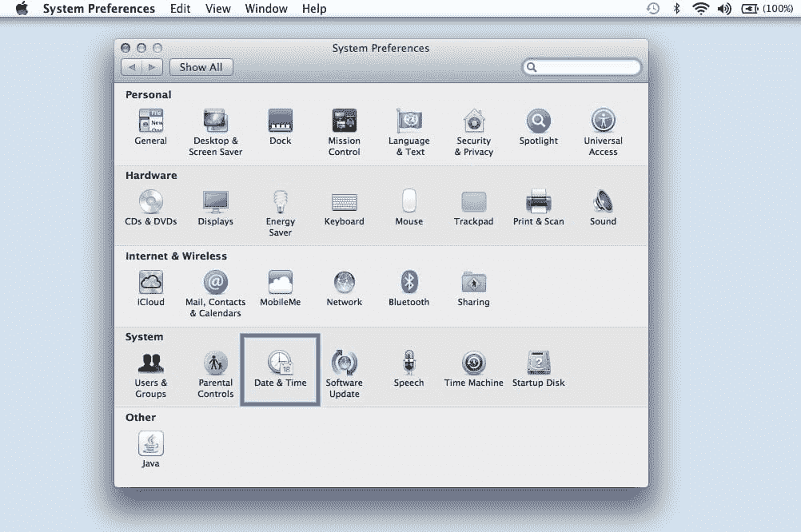

在首选项中找到日期和时间选项。

从这里，您可以验证您使用了正确的日期和时间。

 ## 注册订阅时事通讯

### 想知道我们是怎么让流量增长超过 1000%的吗？

加入 20，000 多名获得我们每周时事通讯和内部消息的人的行列吧！

[Subscribe Now](#newsletter)

验证您使用的是正确的日期和时间。

在**时区**标签下，您还可以让您的设备自动同步到您的当前位置。完成后，您可以退出窗口并尝试重新访问该网站。

### 3.更改您的 DNS 设置

如果错误仍然存在，您可能需要检查您的[域名服务器(DNS)](https://kinsta.com/knowledgebase/what-is-dns/) 设置。简而言之，您的 DNS 就像一个电话簿，允许设备和站点相互联系。Safari 使用您的 DNS 设置来连接网站。

如果您的 DNS 设置有问题，这可能是您看到“Safari 无法建立到服务器的安全连接”信息的原因。要查看是否是这种情况(并解决它)，您可以尝试更改您的 DNS 地址。例如，你可以使用谷歌的公共域名系统。

要开始使用，浏览到**苹果** > **系统偏好** > **网络**。

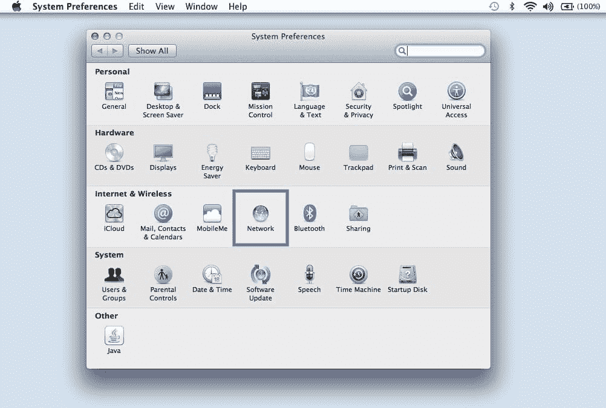

在首选项中找到网络选项。

从这个窗口中，选择您的连接，然后点击**高级**选项卡，接着点击 **DNS** 。接下来，点击 **IPv4 或 IPv6 地址**旁边的 **(+)图标**。

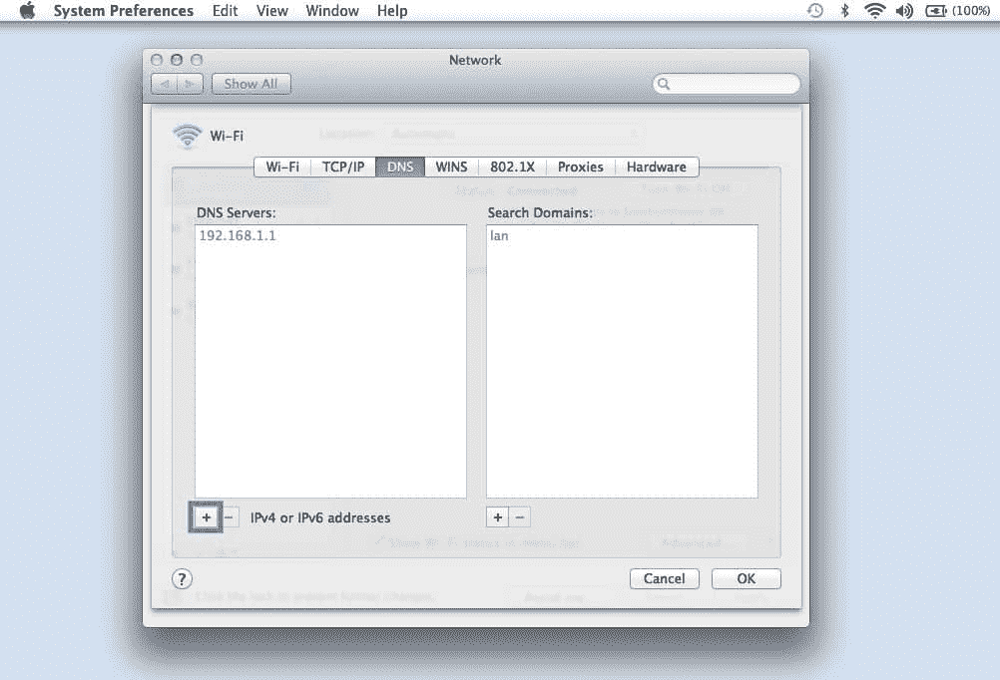

点击 DNS 选项卡。

然后，您可以输入新的 DNS IP 地址。比如想用谷歌的公共 DNS，可以输入“8.8.8.8”和“8.8.4.4”。

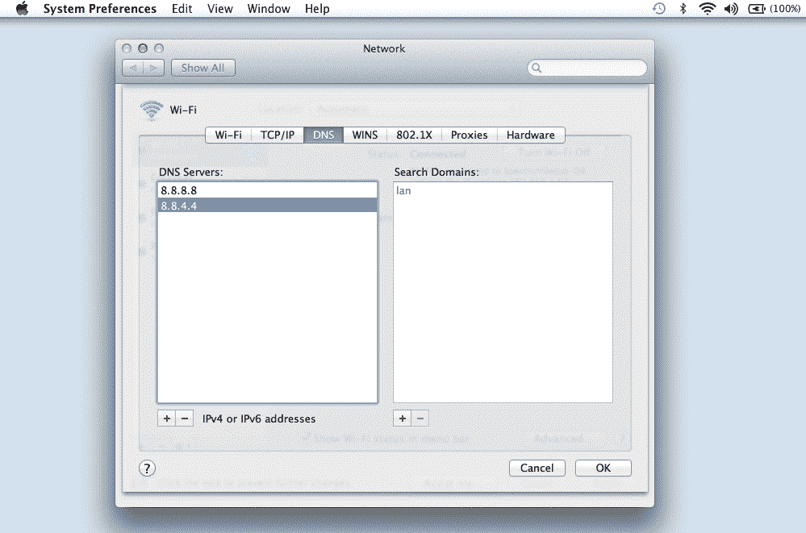

输入新的 DNS IP 地址。

完成后，点击**确定**按钮。重新检查网站，查看此过程是否删除了错误信息。

### 4.卸载或禁用您的浏览器扩展

正如我们之前提到的，浏览器中的扩展或附加组件可能会与 Safari 安全连接到网站的能力相冲突。有时，这在反病毒程序和安全相关的扩展中很常见。

所有的 Kinsta 托管计划都包括来自我们资深 WordPress 开发者和工程师的 24/7 支持。与支持我们财富 500 强客户的同一个团队聊天。查看我们的计划！

因此，下一步是尝试停用所有的浏览器扩展。为此，你可以打开 Safari，然后导航到**偏好设置**并点击**扩展**标签。

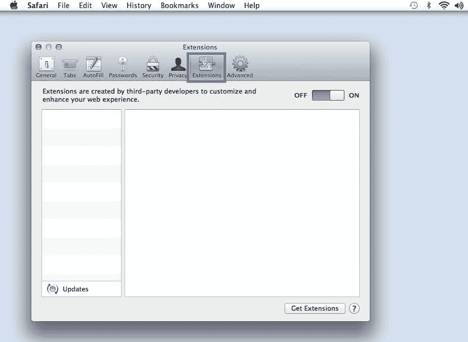

禁用或卸载浏览器扩展

您的扩展列表将显示在左栏中。您可以单击加载项名称旁边的复选标记来禁用它。

完成后，尝试重新访问该网站。如果这解决了问题，您将需要查明是哪个扩展造成的。您可以通过系统地启用每个附加组件并在每次启用后访问网站来实现这一点。

### 5.禁用 IPv6

互联网协议(IP)是一组控制数据如何在互联网上传输的规则。IPv6 是较新的协议版本。但是，一些网站仍然使用旧版本 IPv4。如果是这种情况，这可能就是您遇到“Safari 无法建立安全连接”信息的原因。

因此，您可以尝试在您的网络上禁用 IPv6。为此，再次导航至**系统偏好** > **网络**，然后点击您的网络连接，接着点击**高级**按钮。

在**TC**T2【P/IP 选项卡下，点击**配置 IPv6** 下的下拉菜单，选择**手动**。

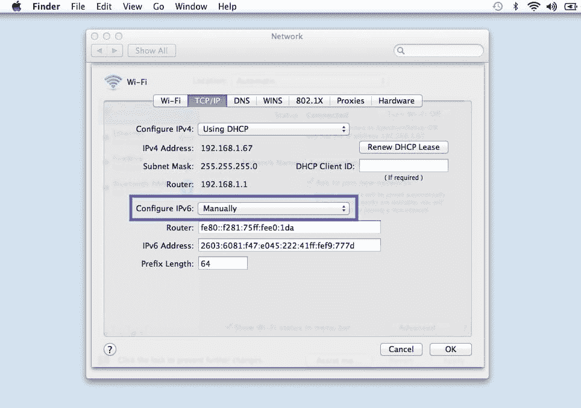

配置 IPv6，手动选择

完成后，点击**确定**按钮。如果 IPv6 是问题所在，这应该可以解决问题。如果没有，你可以尝试最后一个解决方案。

### 6.确定钥匙串信任该证书

之前，我们提到过，如果 Safari 无法验证站点 SSL 证书的有效性，它有时会显示连接错误消息。如果是这种情况，您可以通过在您的 [macOS 的钥匙串访问](https://support.apple.com/guide/keychain-access/what-is-keychain-access-kyca1083/mac)应用程序中配置设置来绕过这个问题。

钥匙串访问是[储存您的密码](https://kinsta.com/blog/password-managers/)、帐户详细信息和应用程序证书的应用程序。它可以保护您的数据安全，并可以控制您的设备信任哪些网站。因此，您可以告诉它继续接受站点的 SSL 证书。

为此，您可以访问显示错误信息的网站，然后点击地址栏左侧的锁图标，然后点击**查看/显示证书** > **详细信息**。

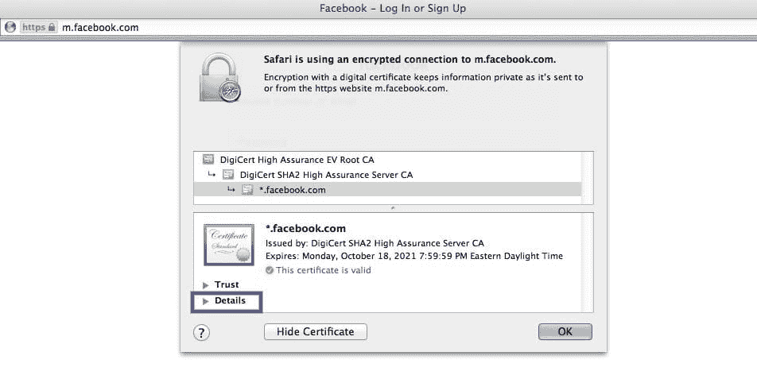

检查钥匙串是否信任证书。

细节面板展开后，点击**控件+空格键**。Spotlight 搜索栏将出现在屏幕的右上角。在搜索栏中输入“钥匙串”。

接下来，在左侧，点击**系统根目录**。搜索网站的证书。一旦你找到它，去**信任**部分。然后在使用此证书部分时点击**旁边的下拉菜单，并选择**始终信任**:**

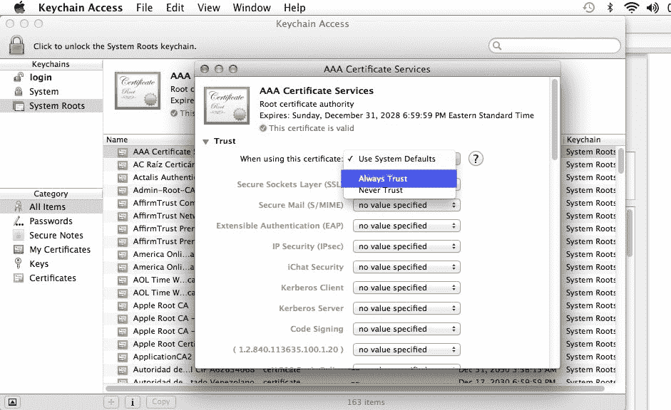

选择“永远信任”选项

就是这样！现在，您应该能够成功访问该站点了。

[虽然乍一看似乎令人生畏，但这种错误相对来说很常见...你可以在几分钟内修好它👨‍💻在这里了解更多🛠 点击推文](https://twitter.com/intent/tweet?url=https%3A%2F%2Fkinsta.com%2Fblog%2Fsafari-cant-establish-a-secure-connection-to-the-server%2F&via=kinsta&text=While+it+may+seem+intimidating+at+first%2C+this+error+is+relatively+common...+and+you+can+fix+it+in+a+manner+of+minutes+%F0%9F%91%A8%E2%80%8D%F0%9F%92%BB+Learn+more+here+%F0%9F%9B%A0&hashtags=Safari%2CmacOS)

## 摘要

试图访问一个网站，却遇到一个错误信息，这是非常令人沮丧的。虽然 Safari 只是试图保护您的数据，但有时它可能会配置错误。在这种情况下，浏览器可能会不必要地显示安全通知，如“Safari 无法建立安全连接”

出现此问题时，您可以使用六种方法来解决:

1.  清除您的浏览器数据，包括缓存和 cookies。
2.  检查您设备的数据和时间。
3.  更改您的 DNS 设置。
4.  卸载或禁用您的[浏览器扩展](https://kinsta.com/blog/best-chrome-extensions/)和附加组件。
5.  禁用 IPv6。
6.  确定钥匙串信任 SSL 证书。

对于修复 Safari 安全连接问题，您有任何疑问吗？请在下面的评论区告诉我们！

* * *

让你所有的[应用程序](https://kinsta.com/application-hosting/)、[数据库](https://kinsta.com/database-hosting/)和 [WordPress 网站](https://kinsta.com/wordpress-hosting/)在线并在一个屋檐下。我们功能丰富的高性能云平台包括:

*   在 MyKinsta 仪表盘中轻松设置和管理
*   24/7 专家支持
*   最好的谷歌云平台硬件和网络，由 Kubernetes 提供最大的可扩展性
*   面向速度和安全性的企业级 Cloudflare 集成
*   全球受众覆盖全球多达 35 个数据中心和 275 多个 pop

在第一个月使用托管的[应用程序或托管](https://kinsta.com/application-hosting/)的[数据库，您可以享受 20 美元的优惠，亲自测试一下。探索我们的](https://kinsta.com/database-hosting/)[计划](https://kinsta.com/plans/)或[与销售人员交谈](https://kinsta.com/contact-us/)以找到最适合您的方式。</kinsta-auto-toc>