# 2022 年前 13 个语法选择

> 原文：<https://kinsta.com/blog/grammarly-alternative/>

无论你是给客户发电子邮件，还是发布关于你公司的博客，写作都是一项基本技能。好的写作让你听起来更专业、更迷人、更有说服力。

市面上有不少工具可以帮助你提高写作水平。你可能听说过语法上的。但是 Grammarly 并不是唯一的语法和写作工具。

如果你打算依靠一个写作工具来优化你的交流和内容，你要确保你选择了最好的一个。本文探索了市场上一些最好的语法和样式检查器。

开始吧！

## 语法概述

Grammarly 最初是作为一种捕捉拼写和语法错误的方法，但现在它可以做得更多。

在我们浏览语法选择列表之前，让我们快速浏览一下原文。

### 应用程序

Grammarly 的 [Chrome 扩展](https://kinsta.com/blog/best-chrome-extensions/)允许你将 Grammarly 的建议用于 Gmail、WordPress 和任何你在网上写的东西。

> 需要在这里大声喊出来。Kinsta 太神奇了，我用它做我的个人网站。支持是迅速和杰出的，他们的服务器是 WordPress 最快的。
> 
> <footer class="wp-block-kinsta-client-quote__footer">
> 
> 
> 
> <cite class="wp-block-kinsta-client-quote__cite">Phillip Stemann</cite></footer>

[View plans](https://kinsta.com/plans/)

你也可以把 Grammarly 作为一个 Windows 桌面应用。只需拖放一个文件，你想校对成语法。

有一款专门针对微软 Office 的应用。你可以用它来写 Word 文档或者 [Outlook 邮件](https://kinsta.com/blog/outlook-alternative/)。

你可以使用 Grammarly 的 Android 和 iOS 应用程序在移动设备上检查你的文本或其他文字。

如果你不想安装任何东西，你可以使用 Grammarly 的在线编辑器。

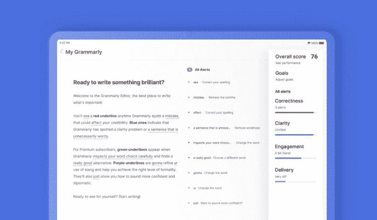

语法在线文字编辑

[让你的在线交流听起来更专业的最简单方法？🗂得到这些流行的语法和风格检查之一！✅ 点击推文](https://twitter.com/intent/tweet?url=https%3A%2F%2Fkinsta.com%2Fblog%2Fgrammarly-alternative%2F&via=kinsta&text=The+easiest+way+to+sound+more+professional+in+your+online+communications%3F+%F0%9F%97%82+Get+one+of+these+popular+grammar+and+style+checkers%21+%E2%9C%85&hashtags=Grammarly%2CWritingTips)

### 语法上做什么

不管它的名字，Grammarly 不仅仅是一个语法检查器。它检查您的书写内容:

*   正确性
*   清楚
*   [参与度](https://kinsta.com/blog/wordpress-quiz-plugins/)(你的写作是否刺激有趣)
*   表达方式(比如你听起来是严厉还是礼貌，是自信还是胆怯)

免费版包含正确性和清晰性，而参与和交付是高级功能。

对于每个文档，您可以设定目标以获得量身定制的建议。例如，你可以选择你的写作是正式的还是非正式的，是为专家读者还是普通读者写作。

有些目标在免费计划中有，有些目标只包含在保费中。

它也给你的写作一个“总分”，你可以通过接受建议来提高它。

### 语法定价

Grammarly 提供三种计划:免费、高级和商务。

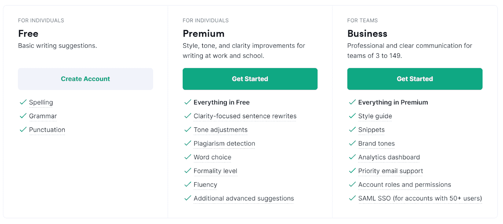

语法定价

**语法自由**

*   包括语法和拼写检查
*   提高清晰度的一些建议

**语法溢价**

*   每月 30 美元、每季度 60 美元或每年 144 美元
*   语法和拼写检查器
*   剽窃检查器
*   建议集中在语气、用词和正式程度上
*   为清晰起见，句子进行了改写

**语法商务(三人或三人以上团队)**

*   定价取决于用户数量。起价为 12.50 美元/月/用户
*   包括保费计划中的所有项目
*   添加您的品牌风格指南
*   团队分析仪表板
*   帐户角色和权限

## 为什么要选择语法上的替代？

Grammarly 有很多很棒的功能，可以提高你的写作水平。

但是，根据您的需求和预算，它可能不是您的最佳解决方案。这里有几个你可能想尝试语法替代的原因。

### 其他选择更便宜

Grammarly 有一个免费版本，可能就是你所需要的。但它的超值套餐并不是市场上最便宜的。货比三家，以最优惠的价格买到你想要的特定功能。

### 语法上不会重写(所有)你的句子

Grammarly 提供了很多有帮助的建议，包括一些对罗嗦或不清楚的句子的重写建议(在高级版本中)。但是如果你的目标是重写你的作品，语法不是你的工具。

### 语法只关注英语

如果你需要用英语以外的语言写作——或者翻译你现有的内容——语法上帮不了你。然而，它支持多种英语方言。

### 每个工具都有不同的集成

Grammarly 与 web 应用程序和桌面应用程序有很多有益的集成，但是您可能会发现其他工具的集成更适合您的业务。

这个列表中几乎所有的语法选择都有免费版本(其他的有负担得起的基本计划)，所以试几个出来看看什么对你有用。

## 语法上的 13 个最佳选择

让我们来分解一下 Grammarly 的 13 个替代方案，包括关键特性和价格。

### 1.ProWritingAid

ProWritingAid 是一个语法上的顶级竞争者，拥有许多相同的功能。除了检查语法和拼写，ProWritingAid 的免费版本还会向您展示一些样式建议。要获得完整的列表，您必须购买高级版。

ProWritingAid 有一些语法上没有的有趣的报告，比如头韵分析和对话标签检查。在免费版本中，它们只在文档的前 500 个单词中运行。

它有针对 Firefox、Safari 和 Edge 的浏览器扩展，还有一些 Grammarly 没有的集成，比如 Scrivener。

**主要特征**

*   语法检查器
*   剽窃检查器
*   样式检查器
*   同义词建议
*   Chrome、Firefox、Safari 和 Edge 扩展
*   与 Microsoft Office、Google Docs、Scrivener 等的集成
*   大量撰写报告

**定价**

*   免费版本
*   保费:每月 20 美元，每年 79 美元，终身 399 美元

ProWritingAid 编辑工具

### 2.海明威应用程序

欧内斯特·海明威以其简洁直接的写作风格而闻名。海明威应用程序帮助你在写作中去掉多余的单词和过于复杂的句子。

将你的作品粘贴到这个免费的在线编辑器中，它会突出显示你的副词、被动语态以及复杂难读的句子。它也给整个作品一个可读性分数。

如果你正试图在 [WordPress 或 Medium](https://kinsta.com/blog/medium-vs-wordpress/) 上改进你的写作，海明威桌面应用程序有一个有用的集成，让你直接从编辑器发布到你的博客。

这款桌面应用售价 19.99 美元。

**主要特征**

*   突出冗长和复杂的句子，副词和被动语态
*   可读性分数
*   在线编辑器
*   Windows 和 macOS 桌面应用程序
*   与[媒体和 WordPress](https://kinsta.com/blog/medium-vs-wordpress/) 的整合
*   导出到 Word 或 PDF

**定价**

*   网络版:免费
*   桌面应用:19.99 美元

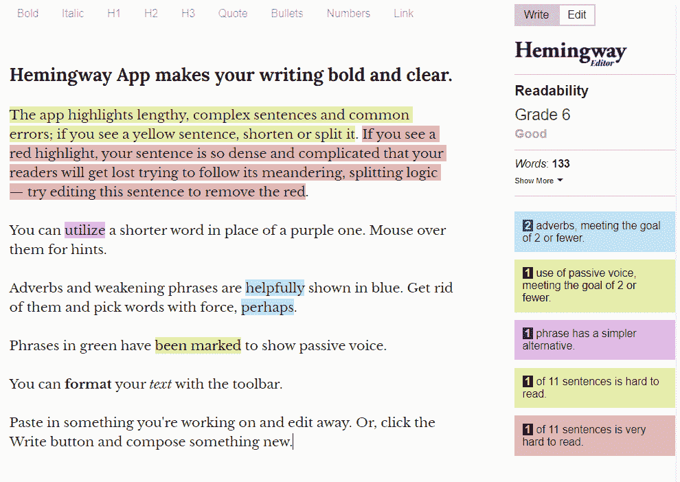

海明威 App 在线编辑

### 3.白烟

[WhiteSmoke](https://www.whitesmoke.com/) 有语法检查器、风格检查器、抄袭检查器和翻译工具。

它的特点比 Grammarly 的更基本，但在某些方面有优势。它包括 Safari、Opera 和 [Firefox 浏览器扩展](https://kinsta.com/blog/firefox-extensions/)以及适用于 macOS 和 Windows 的原生桌面应用。它也做语言翻译。

WhiteSmoke 的一个缺点是它没有免费版本。然而，基于浏览器扩展的网页版比 Grammarly Premium 便宜，并且包含 WhiteSmoke 的样式检查器。

WhiteSmoke Premium 和商业计划包括桌面应用程序以及与 Microsoft Word 和 Gmail 的集成。

**主要特征**

*   语法检查器
*   样式检查器
*   剽窃检查器
*   Chrome、 [Safari](https://kinsta.com/blog/most-secure-browser/#2-safari) 、Opera 和 Firefox 浏览器扩展
*   桌面和移动应用
*   电子邮件和文档模板
*   翻译工具

**定价**

*   没有免费版本
*   网络:59.95 美元/年，124.95 美元/三年
*   保费:79.95 美元/年，199.95 美元/三年
*   商业:137.95 美元/年，317.50 美元/三年

### 4.易读的

正如你从名字中可以猜到的， [Readable](https://readable.com/) 使用包括 Flesch-Kincaid 和 Gunning-Fog 在内的算法来检查你的文章的可读性。

Readable 还有一个语法和风格工具，可以发现被动语态、陈词滥调和副词等问题。此外，它可以检查你的写作关键字密度。

Readable 的一个很好的特性是一个 [URL](https://kinsta.com/knowledgebase/what-is-a-url/) 检查器，可以让你分析现有的网页。高级用户可以看到他们评分的每个网址的完整历史。如果你有一个想要优化的博客或网站，这可能会很有帮助。

Readable 没有免费版本，但是可以免费试用 ContentPro 计划七天。

**主要特征**

*   语法检查器
*   样式检查器
*   可读性测试
*   关键词密度工具
*   可用于网络、文档或电子邮件
*   URL 分析
*   与 Dropbox 和 Slack 的集成
*   支持多种英语方言

**定价**

*   ContentPro 的七天免费试用
*   ContentPro:每月 8 美元或每年 48 美元
*   商业专业:每月 48 美元或每年 288 美元
*   专业代理:138 美元/月 828 美元/年

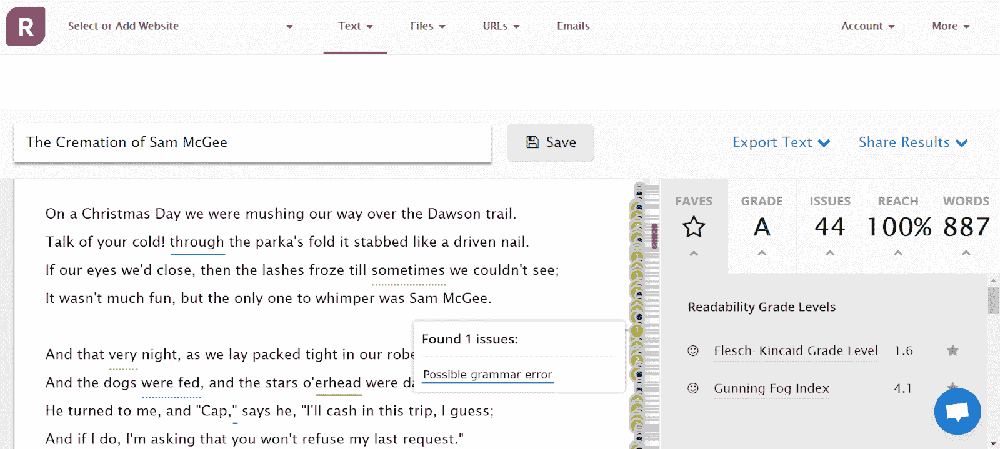

可读性、语法和样式检查器

### 5.WordTune

WordTune 也是一个改善你的语法和风格的工具，但是它与这个列表中的其他语法选项有点不同。

WordTune 不是充当校对工具，而是专注于整句改写。将鼠标悬停在一个句子上，它会给你多条建议，告诉你如何改写这个句子。

例如，如果你输入句子“我正在寻找最好的语法工具，因为我想为我的网站写令人敬畏的内容”，它会给你十个建议，包括“如果我想写引人注目的内容，我的网站需要一个好的语法工具”，以及更正式的“为我的网站制作令人敬畏的内容，我寻求最好的语法工具。”

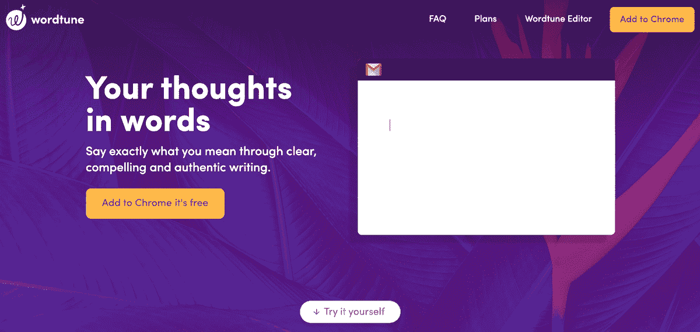

WordTune

高级版可以让你选择重写是正式的还是非正式的，以及你是想写得更短还是更长。

## 注册订阅时事通讯

### 想知道我们是怎么让流量增长超过 1000%的吗？

加入 20，000 多名获得我们每周时事通讯和内部消息的人的行列吧！

[Subscribe Now](#newsletter)

**主要特征**

*   为句子提供多种重写建议
*   突出显示一个短语以获取同义词
*   Chrome 扩展和在线编辑器

**定价**

*   免费版本
*   保费:每月 24.99 美元，每年 119.88 美元

### 6.精力

Ginger Software 的写作工具提供了许多与 Grammarly 相同的功能，以及 WordTune 的重组功能。

免费浏览器扩展有 600 个字符的限制。它只做基本的语法检查。但是，它确实为您使用的单词提供了重写建议和同义词。

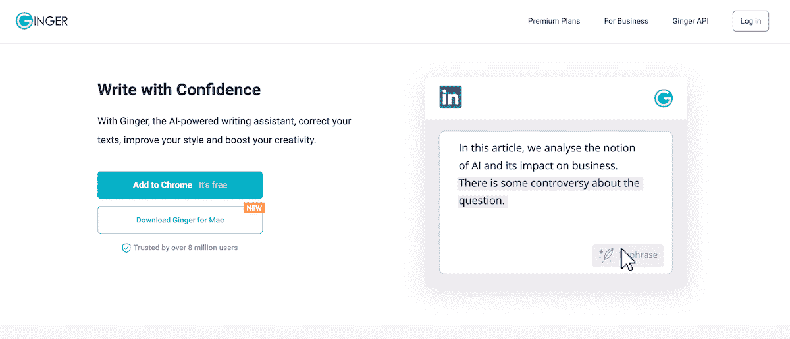

生姜软件

Premium 计划提供了更多的风格建议，并有一个工具可以将您的作品翻译成 40 多种语言。

**主要特征**

*   语法检查器
*   建议重新措辞
*   字典查找
*   [翻译工具](https://kinsta.com/blog/how-to-translate-a-website/)
*   在线编辑器
*   铬延伸
*   桌面和移动应用

**定价**

*   免费版本
*   保费:13.99 美元/月，89.88 美元/年，167.76 美元/两年

### 7.树苗

[Sapling](https://sapling.ai/) 是[与客户关系管理系统](https://kinsta.com/blog/wordpress-crm/)和信息平台合作的工具，帮助销售和支持团队撰写个性化回复。

Sapling 提供语法纠正和风格建议，但它也专注于帮助您更快地响应客户。例如，您可以快速插入工作组经常使用的文本。

管理人员可以查看团队的写作分数和错误报告，以确保客户获得优秀的专业沟通。

Sapling 与 Zendesk、Helpshift 和 Freshdesk 等服务台解决方案以及 Salesforce、Hubspot 和 [Mailchimp](https://kinsta.com/blog/how-to-use-mailchimp/) 等销售和营销工具进行了大量集成。

Sapling 的大部分独特功能只有 Pro 版或企业版才有，但免费版也会给你基本的写作建议。

**主要特征**

*   关注客户支持团队
*   与许多 CRM 和服务台工具集成
*   Chrome、Edge 和 Firefox 的浏览器扩展
*   人工智能学习过去的模式

**定价**

*   免费计划
*   教授:每月 25 美元
*   企业:自定义定价

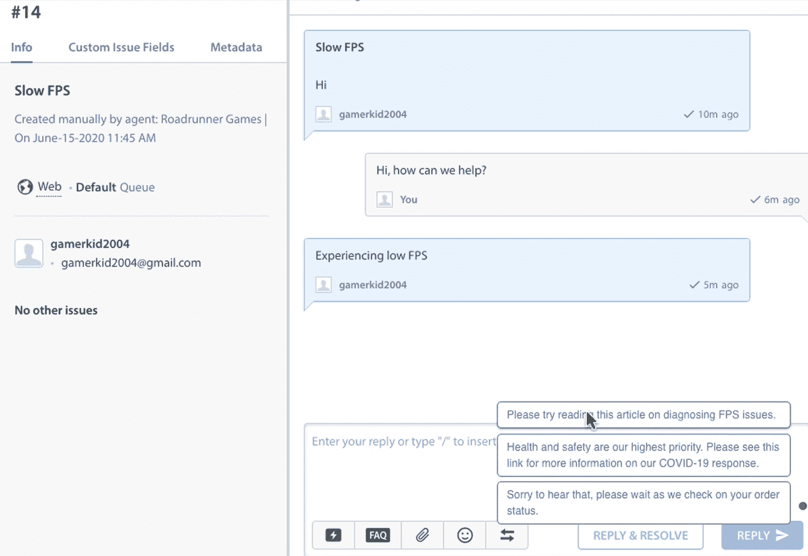

树苗支持应对建议

### 8.纸质评级员

PaperRater 是一个语法和抄袭工具，主要针对申请[大学](https://kinsta.com/learn/wordpress-education/)的学生论文和个人论文。

作为一个语法检查工具，PaperRater 还不错，但它没有这个列表中的一些解决方案那么多高级功能。

抄袭工具让你知道你的内容是否是原创的，并提供一个可能有类似内容的网址列表。你必须获得付费计划，才能看到哪个文本片段不是原创的。

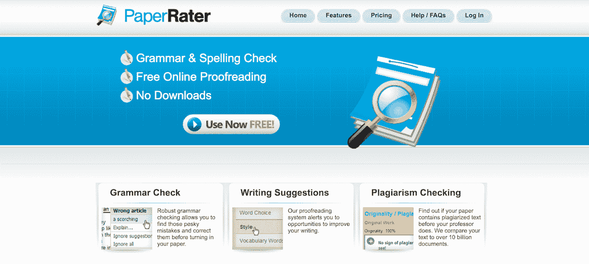

阅卷人

当你提交你的写作时，你可以让工具知道作者的等级和提交的论文类型。对于五年级以上的作家，它会给论文评分。它还提供了更多的报告，比如分析论文包含了多少学术词汇。

需要一流的，快速的，安全的主机为您的新电子商务网站？Kinsta 提供超快的服务器和来自 WooCommerce 专家的 24/7 世界级支持。[查看我们的计划](https://kinsta.com/plans/?in-article-cta)

**主要特征**

*   语法检查
*   剽窃检查
*   论文评分
*   文件上传(MS Word，。txt，。rtf)
*   在线编辑器

**定价**

*   免费版本
*   保费:每月 14.95 美元，每年 95.40 美元

### 9.偶数页

Reverso 主要被认为是一个翻译工具，可以翻译 14 种语言。翻译一个短语后，它会给你上下文中的文本示例，并建议同义词。

你可以通过听母语人士如何读文章和观察十种语言的动词变化来提高你的外语技能。

对于英语和法语，它也有一个语法检查。

免费版只能让你检查 450 个字符，并提供基本的错误纠正。高级计划使您能够检查多达 2，000 个字符的文本。它还建议同义词和句子重写。

**主要特征**

*   [多语言翻译](https://kinsta.com/blog/wordpress-multilingual/)
*   英语和法语拼写检查和语法检查
*   字典查找
*   改写建议

**定价**

*   免费版本
*   保费:每月 9.99 欧元，每年 59.88 欧元

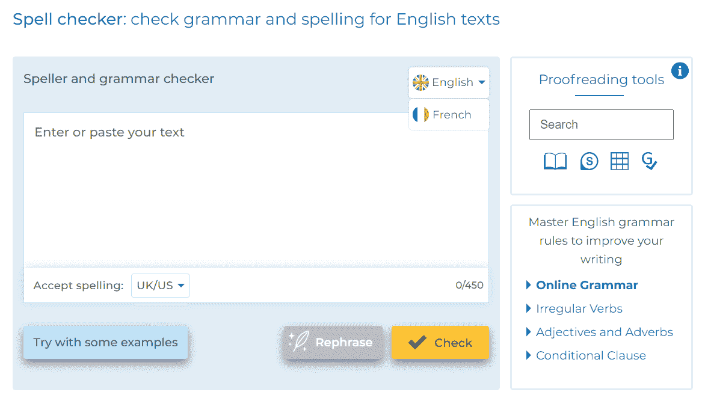

Reverso 拼写和语法检查

### 10.流畅的写作

我们从最好的消息开始: [Slick Write](https://www.slickwrite.com/#!home) 免费。它还提供了一些很棒的功能，而这些功能是大多数解决方案都必须支付的。

例如，它检查过于复杂的句子和过多的副词。

您可以根据自己的喜好定制反馈。例如，你可以选择是否允许亵渎或被动语态。

Slick Write 擅长的一个领域是它的报告和分析。主编辑页面提供关键的统计数据，如可读性、平均句子长度、预计阅读时间等等。你也可以深入研究你的写作报告，分析句子结构和词汇。

如果你在写作中突出某个短语，它会给你单词联想和链接，让你在维基百科、城市词典和谷歌上查看这个短语。

**主要特征**

*   语法检查器
*   样式检查器
*   定制反馈
*   报告和分析
*   Chrome 和 Firefox 扩展
*   在线编辑器

**定价**

*   自由的

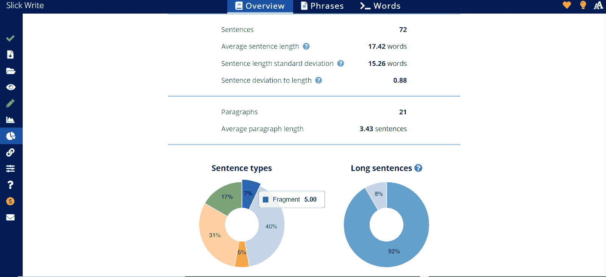

油嘴滑舌写报告

### 11.语言工具

LanguageTool 做了很多和 Grammarly 一样的事情。

免费版提供语法、拼写和标点检查。它还提供了一些基本的风格建议，如消除被动语态和多余的单词。您可以将它设置为“挑剔模式”，让它发现更多问题。

高级版给你额外的风格和语气评论和同义词建议。其他独特的功能包括检测电子邮件中拼写错误的名称和标题以及不正确的数字，如 ISBN 号。

LanguageTool 的与众不同之处在于它可以检查数十种语言和方言的文本。

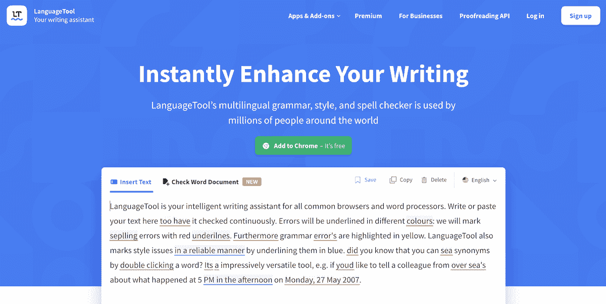

LanguageTool

**主要特征**

*   多语言语法和样式检查器
*   多种英语方言
*   Chrome、Safari、Edge、Opera 和 Firefox 扩展
*   在线编辑器
*   用于 Windows 和 macOS 的桌面应用程序
*   MS Word、Google Docs、OpenOffice 和 LibreOffice 的插件
*   Gmail 和 Thunderbird 的电子邮件附件

**定价**

*   免费版本
*   个人保险费:每月 19 美元，每年 59 美元
*   团队保险费:每年 106.20 美元

### 12.作者

像这个列表中的许多其他工具一样， [Writer](https://writer.com/) 检查语法、风格和抄袭。

作为一个个人写作工具，作家是有竞争力的语法和其他语法检查。但是它的亮点是作为团队的解决方案。

Writer 可以根据您的风格指南和[品牌](https://kinsta.com/blog/wordpress-site-examples/)声音指南检查您团队的内容。您还可以共享团队“片段”——从单个句子到长达一页的模板的经过批准的、可重复使用的文本部分。

报告可以帮助你跟踪你的团队，并找出他们犯的最大错误，谁在使用该应用程序，以及他们在哪里使用它。

Writer 的一个独特功能是它的包容性检查器，可以帮助您避免攻击性和负面的表达。

**主要特征**

*   语法检查器
*   样式检查器
*   剽窃检查器
*   包容性检查器
*   可读性分数
*   铬延伸
*   在线编辑器
*   与 Google Docs、MS Word、Outlook 和 Figma 的集成

**定价**

*   免费版本
*   赞成:每月 11 美元，每年 99 美元
*   团队:18 美元/月，162 美元/年
*   企业:自定义定价
*   职业和团队计划 30 天免费试用

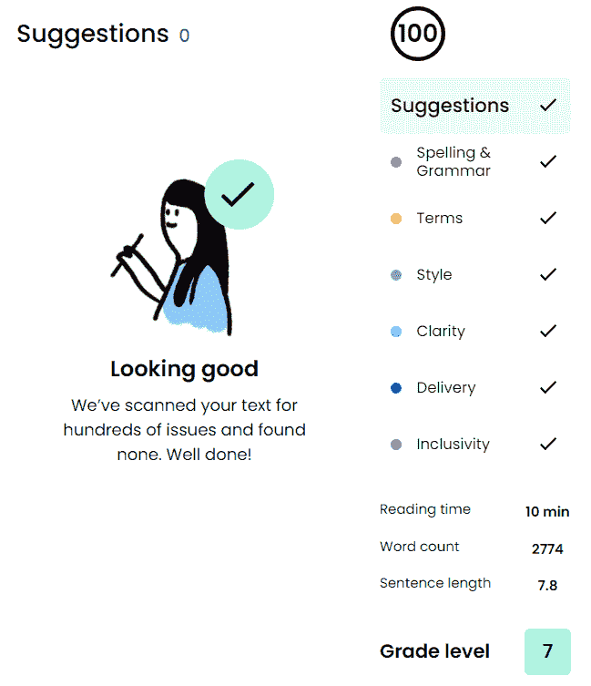

作家在线编辑

### 13.句子检查

忘记上面语法竞争对手的那些华而不实的东西。如果您只是想要一个基本的语法、拼写和标点符号检查器作为语法替代方案，该怎么办？

试试 [SentenceCheckup](https://sentencecheckup.com/) 。你不需要下载任何东西或者付费。它不会告诉你你的语气是否有问题，或者你是否使用了太多的被动语态，但是它会告诉你你是否有语法错误。

只要把你写的东西粘贴到在线工具上，它就会突出你的错误。将鼠标悬停在突出显示的错误上，然后一键更改它。

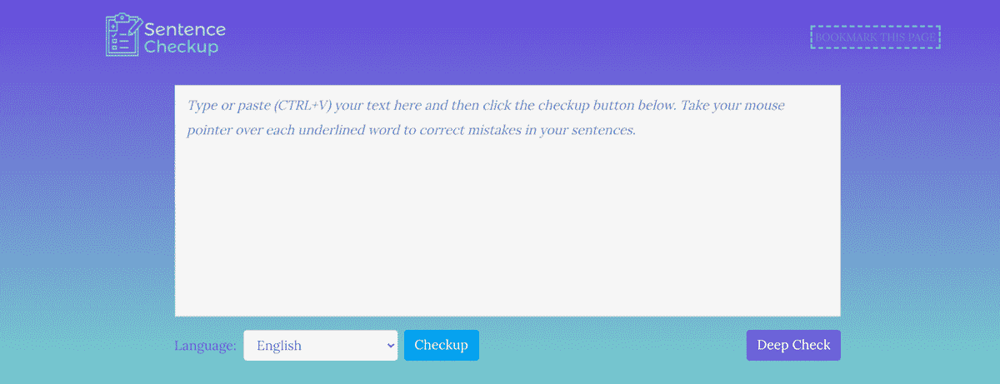

SentenceCheckup

**主要特征**

*   免费的[网络工具](https://kinsta.com/blog/web-development-tools/)
*   突出显示错误
*   支持美国和英国英语方言

**定价**

*   自由的

[Make sure your written communication is polished and professional with help from these grammar tools ✨Click to Tweet](https://twitter.com/intent/tweet?url=https%3A%2F%2Fkinsta.com%2Fblog%2Fgrammarly-alternative%2F&via=kinsta&text=Make+sure+your+written+communication+is+polished+and+professional+with+help+from+these+grammar+tools+%E2%9C%A8&hashtags=Grammarly%2CWritingTips)

## 摘要

找到适合你的语法选择的最好方法是自己尝试几个。

为了让你开始，这里是我们的建议。

*   对于一个不太贵的、语法上很像的工具，请尝试 ProWritingAid。
*   对于改写句子的工具，试试 WordTune。
*   如需翻译和多语言语法和风格帮助，请尝试 LanguageTool。
*   要获得最好的免费语法选择和深度报道，请尝试 SlickWrite。
*   要与客户支持解决方案集成，请尝试 Sapling。
*   如果想找一个让团队保持一致的工具，可以试试 Writer。

写出更好的内容不仅仅是选择最好的语法工具。查看我们关于创建优秀的[博客文章](https://kinsta.com/learn/blogging-tips/)和[营销邮件](https://kinsta.com/blog/email-marketing-best-practices/)的建议。

* * *

让你所有的[应用程序](https://kinsta.com/application-hosting/)、[数据库](https://kinsta.com/database-hosting/)和 [WordPress 网站](https://kinsta.com/wordpress-hosting/)在线并在一个屋檐下。我们功能丰富的高性能云平台包括:

*   在 MyKinsta 仪表盘中轻松设置和管理
*   24/7 专家支持
*   最好的谷歌云平台硬件和网络，由 Kubernetes 提供最大的可扩展性
*   面向速度和安全性的企业级 Cloudflare 集成
*   全球受众覆盖全球多达 35 个数据中心和 275 多个 pop

在第一个月使用托管的[应用程序或托管](https://kinsta.com/application-hosting/)的[数据库，您可以享受 20 美元的优惠，亲自测试一下。探索我们的](https://kinsta.com/database-hosting/)[计划](https://kinsta.com/plans/)或[与销售人员交谈](https://kinsta.com/contact-us/)以找到最适合您的方式。