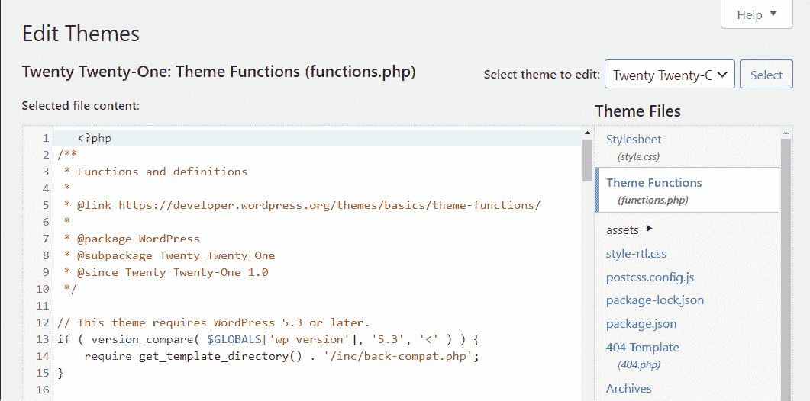
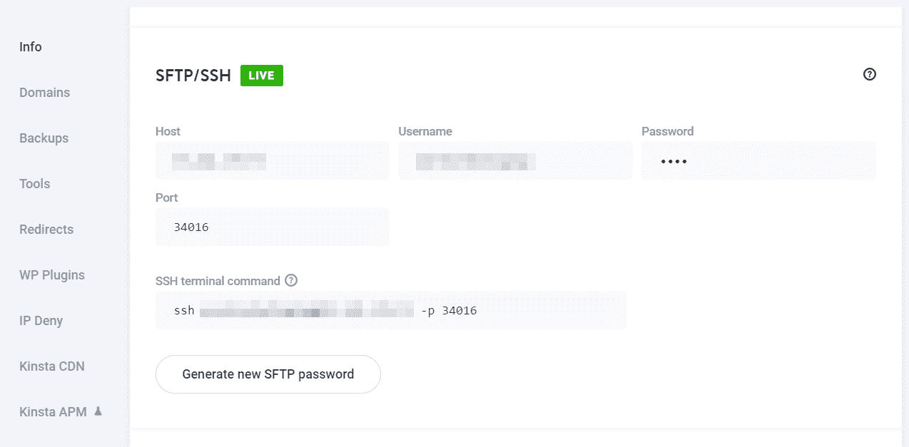
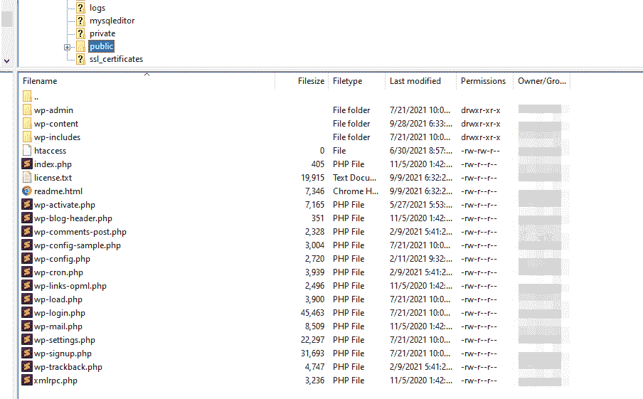
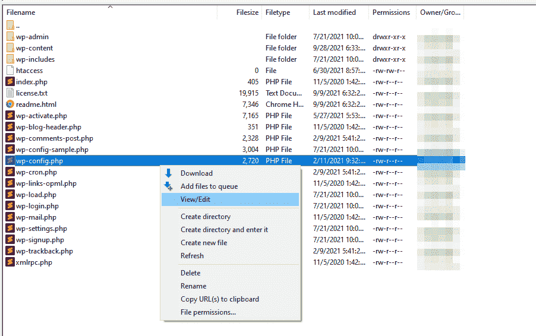
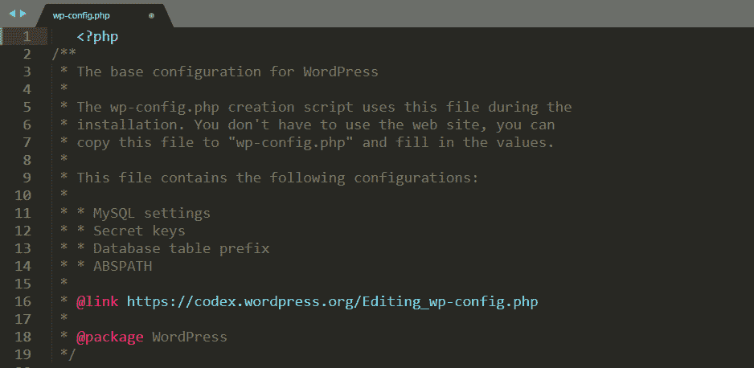

# 如何修复“无法修改邮件头信息–邮件头已由发送者发送”错误

> 原文：<https://kinsta.com/blog/cannot-modify-header-information-headers-already-sent-by/>

大多数的 WordPress 错误信息会让你知道是什么导致了你的网站出现问题。“警告:无法修改标题信息-标题已由发送者发送”错误也不例外。如果一个 [PHP](https://kinsta.com/knowledgebase/what-is-php/) 文件由于代码中的问题而无法执行，您将会看到这条消息。

“无法修改标题信息”错误有几个潜在的原因。幸运的是，消息本身会告诉您哪个文件导致了问题。它甚至指向包含问题的代码行。

在本文中，我们将讨论这个错误及其原因。然后，我们将讨论解决问题的两种方法。我们开始工作吧！

## 什么导致了“无法修改标题信息–标题已被发送”错误

正如我们之前提到的，当你的一个站点的**出现时，你会遇到这个错误。php** 文件无法执行。 [WordPress 依靠。php 文件](https://kinsta.com/knowledgebase/wordpress-files/)，如 wp-config.php 的[和 functions.php](https://kinsta.com/blog/wp-config-php/)的[，用于其核心功能。](https://developer.wordpress.org/themes/basics/theme-functions/)

如果其中一个**出现问题。php** 文件，您会看到一条类似这样的错误消息:

```
**Warning: Cannot modify header information - headers already sent by (output started at /home/public_html/wp-config.php:#) in /home/public_html/wp-includes/file-example.php on line 33**
```

幸运的是，“无法修改标题信息”错误提供了大量信息，使得故障排除相对简单。该消息将把您指向两个文件——第一个文件包含问题，这阻止了第二个文件的执行。


在错误消息的末尾，您会看到一个显示“第 XX 行”的部分它显示了导致问题的特定代码的位置。

通常，PHP 代码中的问题很容易解决。可能触发错误消息的一些常见原因包括:

*   代码的`**<?php**`段之前或结束的`**?>**`标记之后的空格
*   一个 [HTML 块](https://kinsta.com/blog/markdown-editor/) *在*PHP 头文件函数之前
*   在 PHP [头文件函数](https://kinsta.com/knowledgebase/add-code-wordpress-header-footer/)前添加`**print**`或`**echo**`语句
*   插件代码的问题

修复这些类型的错误需要你至少对修改 PHP 代码感到舒适。您不需要自己添加任何代码。

尽管如此，您可能需要一些额外的帮助来识别问题。如果这个问题与 PHP header 函数之前的空白或语句无关，那就更是如此。

## 如何解决“警告:无法修改邮件头信息-邮件头已被发送”错误(2 种方法)

有两种方法可以解决“无法修改邮件头信息-邮件头已被发送”错误。第一种方法不需要你退出 WordPress 仪表盘。

然而，如果你不能访问仪表板或使用 WordPress，第二种策略使用 FTP/SFTP。

先说第一种故障排除方法。

### 1.用插件/主题编辑器修复错误或替换插件

当您遇到“无法修改邮件头信息-邮件头已被发送”错误时，您需要做的第一件事是打开导致该问题的文件。然后，找到消息指示的行。

例如，如果你看到一个如下的错误，这意味着你需要查看你的主题的**functions.php**文件:

```
**Warning: Cannot modify header information - headers already sent by (output started at /home/public_html/wp-content/themes/twentytwentyone/functions.php:#) in /home/public_html/wp-includes/file-example.php on line 1**
```

在这种情况下，你可以使用 WordPress [主题编辑器](https://kinsta.com/blog/php-editor/)找到问题的根源。要访问它，进入**外观** *>* **主题编辑器**。

进入后，使用右边的菜单选择您需要访问的文件。

## 注册订阅时事通讯


### 想知道我们是怎么让流量增长超过 1000%的吗？

加入 20，000 多名获得我们每周时事通讯和内部消息的人的行列吧！

[Subscribe Now](#newsletter)




主题函数文件(functions.php)。


如果你仔细观察，你会注意到在`**<?php**`标签前有几个空格。错误消息本身指向第一行。因此，这告诉您，空白是问题的根源。

在这个例子中，你所要做的就是删除空白并点击**更新文件**。现在试着重新加载你的网站，错误应该会消失。

你可以使用 WordPress 插件编辑器(**插件** *>* **插件编辑器**)应用相同的过程。如果错误消息指向一个有问题的插件文件，这种方法是适用的。

或者，你可能会遇到一个错误，指出你的 WordPress 插件目录中的一个文件。在这种情况下，您可以删除并重新安装该插件。在大多数情况下，这将为您解决问题。

但是，请记住，根据您使用的工具，您可能会丢失该插件的配置。因此，您可能需要再次设置该插件。


### 2.通过 FTP/SFTP 编辑问题文件

在某些情况下,“不能修改标题信息——标题已经被发送”错误的来源不在于你可以使用 WordPress 主题或插件编辑器访问的文件。或者，你可以使用非 WordPress 网站。

在这些场景中，您的最佳选择是使用 [FTP/SFTP](https://kinsta.com/knowledgebase/ftp-vs-sftp/) 访问问题文件。为此，你需要[使用 FTP 或 SFTP 客户端](https://kinsta.com/blog/best-ftp-clients/)，比如[的 FileZilla 平台](https://wordpress.org/support/article/using-filezilla/)。

你还需要访问你的网站的 FTP/SFTP 证书。在大多数情况下，你应该可以在你的主机面板中找到它们。

需要为您的电子商务网站提供超快的、可靠的、完全安全的托管服务吗？Kinsta 提供所有这些服务，并由 WooCommerce 专家提供 24/7 的世界级支持。[查看我们的计划](https://kinsta.com/plans/?in-article-cta)

如果您使用 Kinsta，您可以访问 [MyKinsta](https://kinsta.com/mykinsta/) ，在**网站**下选择您的网站，并点击其**信息**标签。




SFTP/宋承宪在 MyKinsta。


一旦你有凭证，使用你的 FTP 或 SFTP 客户端连接到你的网站。你需要找到网站的根文件夹。通常情况下，它的名字应该是 **root，public_html** ， **public** ，或者你自己站点的名字。

这里快速看一下 WordPress **根**文件夹的内部。




WordPress 根文件夹。


继续操作，找到“无法修改标题信息-标题已被发送”错误指示的文件。例如，如果问题是`**public/wp-config.php**`，右击文件并选择**查看/编辑**选项。




点击 wp.config 文件。


该选项将使用默认的文本编辑器打开选定的文件。文档打开后，通过导航到错误消息指向的行来定位问题。




查找有错误信息的行。


如果你不能发现错误，你可能需要咨询有 PHP 文件工作经验的人。然而，假设您正在处理 PHP 头前的空白问题或语句。在这种情况下，您应该能够自己解决问题。

完成后，保存对文件的更改并关闭 FTP/SFTP 客户端。尝试重新访问您的网站，错误应该会消失。

[Seeing this error message? 😥 This post has 2 guaranteed ways tod fix it 💪Click to Tweet](https://twitter.com/intent/tweet?url=https%3A%2F%2Fkinsta.com%2Fblog%2Fcannot-modify-header-information-headers-already-sent-by%2F&via=kinsta&text=Seeing+this+error+message%3F+%F0%9F%98%A5+This+post+has+2+guaranteed+ways+tod+fix+it+%F0%9F%92%AA&hashtags=HTML%2CWPTips)

## 摘要

“警告:无法修改邮件头信息–邮件头已由发送者发送”的错误可能会令人害怕，因为它会输出一条很长的消息。然而，详细的错误信息使得这个错误相对容易解决。与其他问题不同，这个问题很有礼貌地告诉您是哪个文件导致了这个问题，以及您需要查看哪一行代码。

根据导致错误的文件，有两种方法可以解决问题:

1.  使用插件/主题编辑器修复错误或替换插件。
2.  通过 FTP/SFTP 客户端编辑问题文件。

找到这个错误的来源很简单。然而，如果你不熟悉 PHP，修复它可能是一个问题。

修复此错误仍有问题吗？请在下面的评论中与我们的社区分享你的经验！

* * *

让你所有的[应用程序](https://kinsta.com/application-hosting/)、[数据库](https://kinsta.com/database-hosting/)和 [WordPress 网站](https://kinsta.com/wordpress-hosting/)在线并在一个屋檐下。我们功能丰富的高性能云平台包括:

*   在 MyKinsta 仪表盘中轻松设置和管理
*   24/7 专家支持
*   最好的谷歌云平台硬件和网络，由 Kubernetes 提供最大的可扩展性
*   面向速度和安全性的企业级 Cloudflare 集成
*   全球受众覆盖全球多达 35 个数据中心和 275 多个 pop

在第一个月使用托管的[应用程序或托管](https://kinsta.com/application-hosting/)的[数据库，您可以享受 20 美元的优惠，亲自测试一下。探索我们的](https://kinsta.com/database-hosting/)[计划](https://kinsta.com/plans/)或[与销售人员交谈](https://kinsta.com/contact-us/)以找到最适合您的方式。