# 如何在你的 WordPress 网站上嵌入谷歌评论(2 种方法)

> 原文：<https://kinsta.com/blog/embed-google-reviews/>

展示积极的客户评价是提升你的企业声誉和增加转化率的最有效的方法之一。然而，简单地将这些反馈复制粘贴到你的网站上会降低它的合法性，甚至让它看起来像假的。

幸运的是，在你的 WordPress 网站上嵌入谷歌评论很简单。你可以使用[评论插件](https://kinsta.com/blog/best-wordpress-review-plugins/)或者编辑你网站的 HTML 来显示反馈，当反馈进来时会自动更新。

在本指南中，我们将讨论在你的网站上显示谷歌评论的好处，以及你应该把它们放在哪里。然后，我们将解释几种不同的方法来把它们嵌入到你的 WordPress 网站上。

我们开始吧！

T3】

## 为什么显示谷歌评论是有益的

谷歌评论是谷歌我的商业平台的一部分。它们使您的客户能够分享他们的经验，并为您的服务留下星级评价。这些评价是公开的，你可以从你的 Google My Business 账户回复它们。


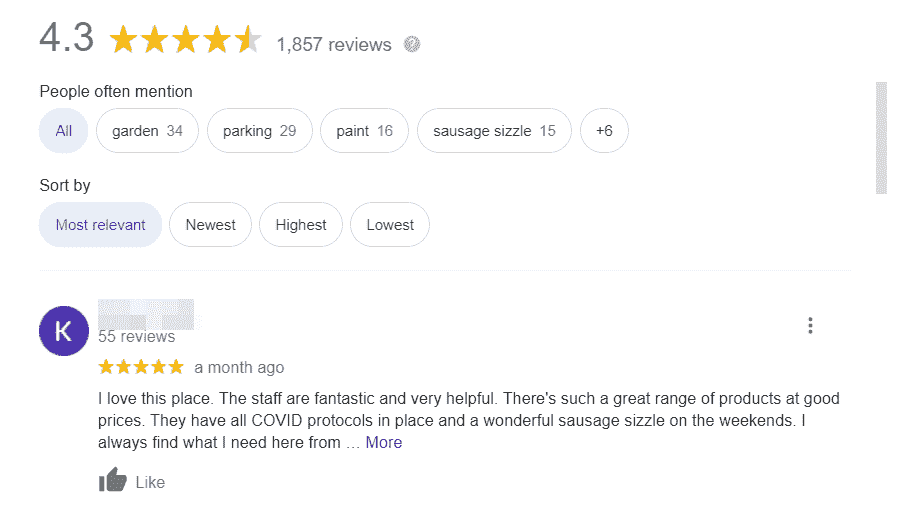

谷歌评论举例


谷歌评论是必不可少的，因为它们可以增加你企业的可信度。大约[86%的购买者使用评级](https://www.brightlocal.com/blog/the-impact-of-online-reviews/)来告知他们的购买决定。因此，正面的评价可以提升你在 T4 的整体电子商务销售额。

在你的网站上展示谷歌评论也可以提高你的搜索引擎优化(SEO)。这是让你的网站在搜索引擎结果上排名靠前的过程。谷歌根据各种因素评估你的网站。评论和评级可以占到算法的[15%。](https://moz.com/local-search-ranking-factors)


最后，推荐可以促使用户在你的网站上花更多的时间。如果他们沉迷于阅读评论，他们可能会在你的网站上停留更长时间。这可以降低你的跳出率，为你的读者提供更好的用户体验(UX)。

[展示积极的客户评价是提升企业声誉的最佳方式之一&提高转化率。🌟开始使用本指南👇 点击推文](https://twitter.com/intent/tweet?url=https%3A%2F%2Fbit.ly%2F3DFcTal&via=kinsta&text=Displaying+positive+customer+reviews+is+one+of+the+best+ways+to+promote+your+business%E2%80%99s+reputation+%26amp%3B+increase+conversions.+%F0%9F%8C%9F+Get+started+with+this+guide+%F0%9F%91%87&hashtags=SmallBiz%2CEcommerce)


## 你应该在哪里显示谷歌评论

你有几个不同的嵌入谷歌评论的位置选项。理想情况下，您希望它们易于查找和阅读，但不会妨碍网站的其他内容。

你的第一个选择是在你网站的主页上显示谷歌评论。例如， [Embed Social](https://embedsocial.com/) 会在首页展示客户评价。


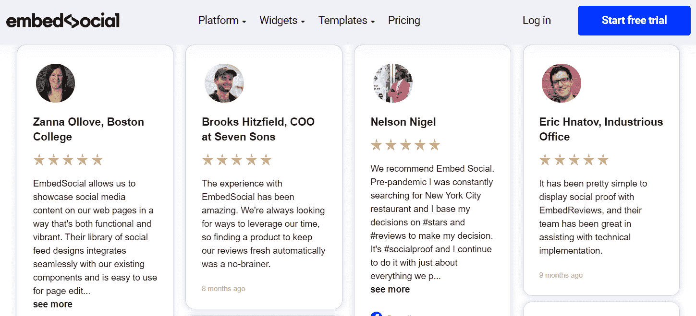

嵌入社交显示谷歌评论


您可以将它们放在页面底部或小部件部分。通过这样做，潜在客户几乎可以在登陆你的网站后立即看到你的推荐。因此，他们可能会立即对你的企业更加信任。

或者，你可以在你的“关于”页面嵌入谷歌评论，或者创建一个专门的“评论”页面。用户通常访问这个页面来了解更多关于你的企业的历史，价值观和其他细节。在这里展示客户评价也可以向潜在客户展示你的声誉。

例如，冰岛露营车租赁公司 [Happy Campers](https://happycampers.is/reviews/) 在一个专门的页面上嵌入了谷歌评论。


谷歌评论专用页面


最后，你可能想在你的电子商务商店的产品页面上展示推荐。


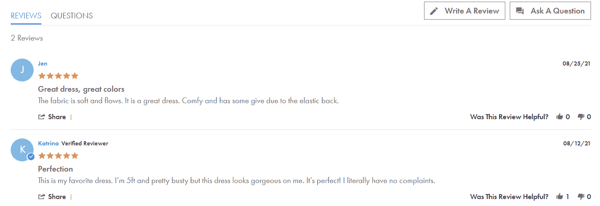

谷歌评论是电子商务页面上的推荐。


或者，你可以嵌入谷歌对你整个公司的评论。使用这种方法，你可以说服犹豫不决的顾客承诺购买并选择你的业务。

## 如何在你的 WordPress 网站上嵌入谷歌评论(2 种方法)

现在你知道在你的 WordPress 站点上显示谷歌评论有多重要了。你也应该有一个好主意，你想嵌入它们。

你可以使用插件或者通过[编辑你网站的 HTML](https://kinsta.com/knowledgebase/edit-wordpress-code/) 将这些评论添加到你的网站上。让我们更详细地看一下每种方法。
T3】

### 1.使用谷歌评论插件的小部件

嵌入客户评价最简单的方法之一是使用谷歌评论插件的[小部件。](https://wordpress.org/plugins/widget-google-reviews/)


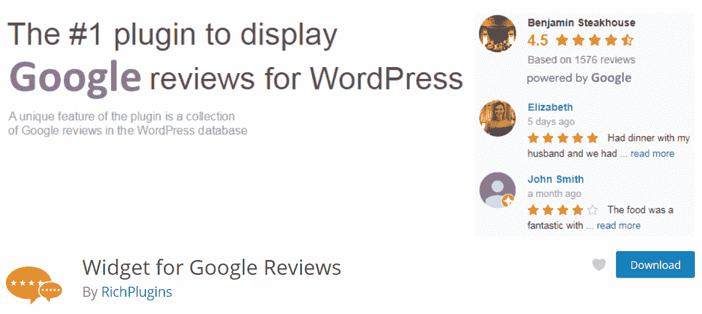

谷歌评论插件


的小工具

这个插件可以在你网站的[窗口部件部分](https://kinsta.com/blog/wordpress-widgets/)显示谷歌评论。因此，如果你想在你所有的帖子和页面上展示推荐，这可能是一个不错的选择。

首先，打开你的 WordPress 仪表盘，安装插件。

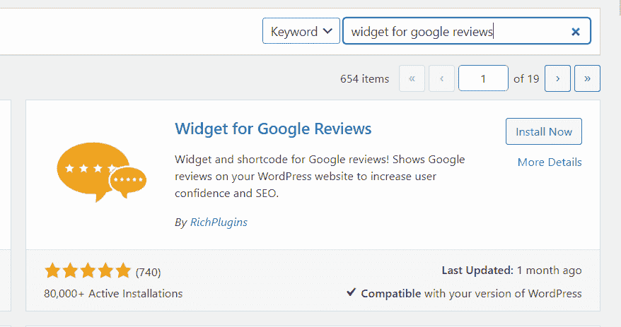

Install the Widget for Google Reviews plugin


点击**激活**完成该过程。然后，进入插件的**设置**。您可以浏览**完整安装指南**标签，了解详细的安装说明。


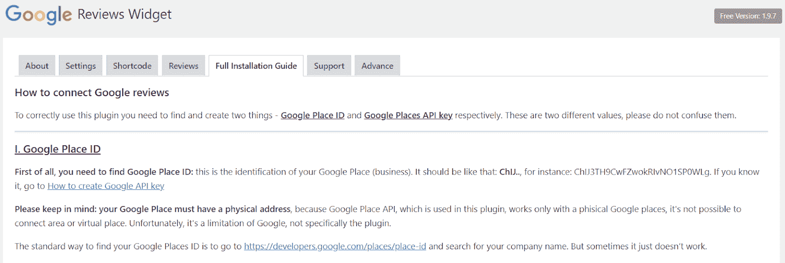

谷歌评论小工具完整安装指南


首先，你需要获得你的 Google Place ID。你可以通过前往 [Google Place ID Finder](https://developers.google.com/maps/documentation/places/web-service/place-id) 并输入你的企业名称来找到它。

## 注册订阅时事通讯


### 想知道我们是怎么让流量增长超过 1000%的吗？

加入 20，000 多名获得我们每周时事通讯和内部消息的人的行列吧！

[Subscribe Now](#newsletter)


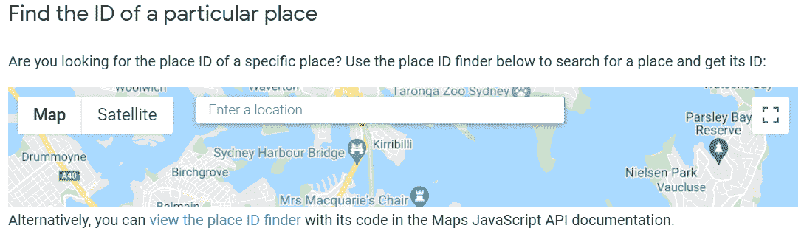

Google Place ID finder


接下来，你需要一个 [Google Places API](https://developers.google.com/maps/documentation/places/web-service/overview) 。要得到一个，你需要登录你的[谷歌控制台账户仪表板](https://console.cloud.google.com/apis/dashboard)。然后，点击**选择一个项目**并选择**新建项目**。


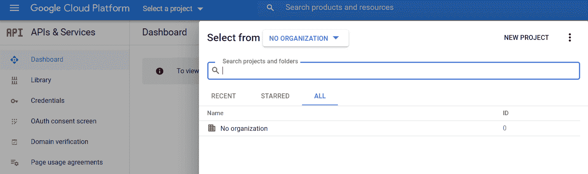

谷歌控制台账户仪表盘


命名并保存您的项目。然后，选择**启用 API 和服务>放置 API >启用。**

接下来，进入**导航菜单**，选择**API&服务>凭证**。这将把你带到下一页。


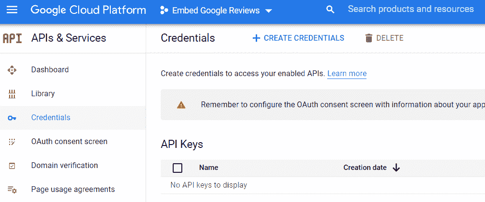

创建凭证


然后，点击 **+创建凭证> API 键**。这将生成一个代码，您以后需要复制它。

要在谷歌控制台中完成该过程，再次打开**导航菜单**并选择**计费>链接一个计费账户>创建计费账户。**然后会提示你注册免费试用。


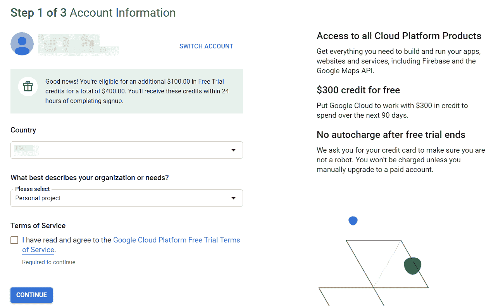

报名免费试用


按照提示完成注册过程。然后，回到你的 WordPress 仪表盘和插件的**设置**。在这里，粘贴 API 密匙并点击**保存。**


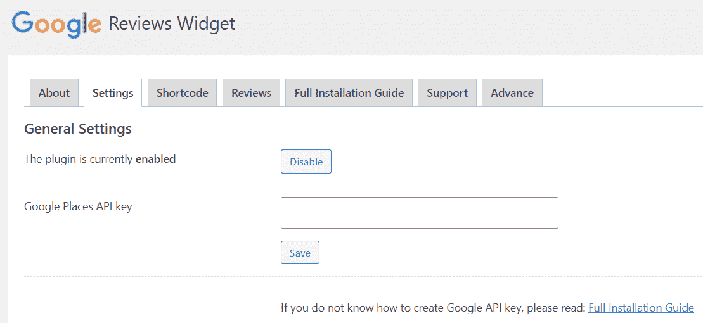

将 API 粘贴回主插件设置


接下来，导航到**短代码**标签，输入您的 Google Place ID。您还可以自定义一些设置，例如评论的显示方式。


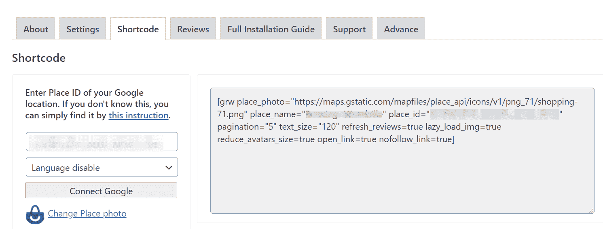

在短码标签


下输入您的 Google Place ID

插件会自动[生成你的短代码](https://kinsta.com/blog/wordpress-shortcodes/)。现在，你可以通过添加一个**短代码**块并粘贴你的独特代码，将谷歌评论嵌入任何帖子或页面。


所有的 Kinsta 托管计划都包括来自我们资深 WordPress 开发者和工程师的 24/7 支持。与支持我们财富 500 强客户的同一个团队聊天。查看我们的计划！

### 2.用 JavaScript 编辑你网站的 HTML

或者，你可以通过编辑 HTML 直接在你的 WordPress 站点上嵌入谷歌评论。HTML 控制不同元素(如文本和图像)在网站上的显示方式。

这个策略将使用 JavaScript，这是一种流行的脚本语言，可以与你的网站的 HTML 交互。如果你选择这种方法，你可以在你网站的任何部分显示谷歌评论。当新的推荐进来时，它们也会自动更新。

在继续之前，您可能希望[创建一个子主题](https://kinsta.com/blog/wordpress-child-theme/)。这样，如果你在接下来的步骤中犯了任何错误，它们都不会损害整个网站的功能。

首先，你需要你的 Google Places ID 和一个 API 密匙。如果您不知道如何访问它们，您可以查看本教程上一节中的详细说明。

接下来，你需要 [Google Places 脚本](https://github.com/peledies/google-places/blob/master/google-places.js)。你可以跟随[地图 Javascript API 文档](https://developers.google.com/maps/documentation/javascript/places)来学习如何从头获得它。

现在，您将把一个脚本粘贴到站点的 head 部分。为此，你需要编辑你站点的**header.php**文件。

在你的 WordPress 仪表盘中，导航到**外观>主题编辑器**并寻找名为【header.php】的文件:


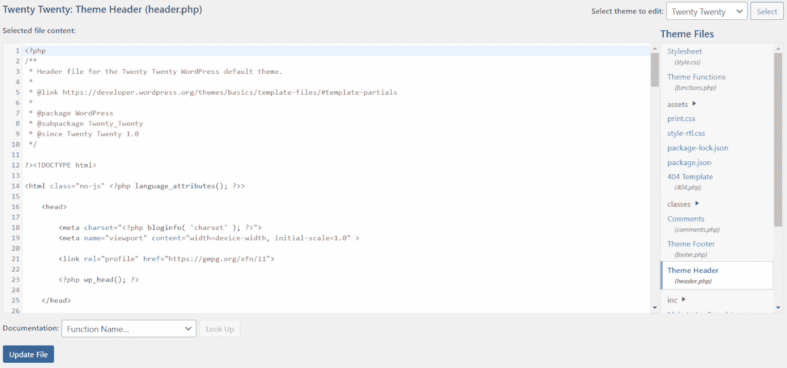

寻找 header.php 档案


然后，将此脚本代码粘贴到您的文件中:

```
<script src="https://ajax.googleapis.com/ajax/libs/jquery/3.2.1/jquery.min.js"></script>
<script src="/js/google-places.js "></script>

<script src="https://maps.googleapis.com/maps/api/js?v=3.exp&libraries=places&key=[(API_KEY)]"></script>
```

您将输入您的 Google Places API，而不是`(API_KEY)`。接下来，将下面的函数添加到文件中:

```
<script>
jQuery(document).ready(function() {
$("#google-reviews").googlePlaces({
placeId: '[PLACES_ID]',
render: ['reviews'],
min_rating: 5,
max_rows: 0
});
});
</script>
```

然而，你要放的不是`[PLACES_ID]`，而是你公司的 Google Places ID。准备好之后，保存您的更改。

接下来，转到你想显示嵌入的谷歌评论的文章或页面。切换到代码编辑器，将下面一行粘贴到您希望显示评价的位置:

```
<div id="google-reviews"></div>
```

最后，保存您的更改。你的谷歌评论现在应该显示在你的帖子或页面上了！

[想提升对你企业的信任度&增加转化率？🤩嵌入客户评论是一个完美的起点🚀](https://twitter.com/intent/tweet?url=https%3A%2F%2Fbit.ly%2F3DFcTal&via=kinsta&text=Want+to+promote+trust+in+your+business+%26amp%3B+increase+conversions%3F+%F0%9F%A4%A9+Embedding+customer+reviews+is+the+perfect+place+to+start+%F0%9F%9A%80&hashtags=SmallBiz%2CMarketingTips)

## 摘要

在你的网站上展示顾客评论有助于提高你企业的可信度和转化率。它也可以提高你的搜索引擎排名。幸运的是，有一些简单的方法可以让您的客户看到这些反馈。

概括地说，你可以通过以下方式在你的 WordPress 网站上嵌入谷歌评论:

1.  使用谷歌评论插件的小部件在文章和页面中显示它们。
2.  用 JavaScript 直接编辑你网站的 HTML。

关于如何在你的网站上嵌入谷歌评论，你有什么问题吗？请在下面的评论区告诉我们！

* * *

让你所有的[应用程序](https://kinsta.com/application-hosting/)、[数据库](https://kinsta.com/database-hosting/)和 [WordPress 网站](https://kinsta.com/wordpress-hosting/)在线并在一个屋檐下。我们功能丰富的高性能云平台包括:

*   在 MyKinsta 仪表盘中轻松设置和管理
*   24/7 专家支持
*   最好的谷歌云平台硬件和网络，由 Kubernetes 提供最大的可扩展性
*   面向速度和安全性的企业级 Cloudflare 集成
*   全球受众覆盖全球多达 35 个数据中心和 275 多个 pop

在第一个月使用托管的[应用程序或托管](https://kinsta.com/application-hosting/)的[数据库，您可以享受 20 美元的优惠，亲自测试一下。探索我们的](https://kinsta.com/database-hosting/)[计划](https://kinsta.com/plans/)或[与销售人员交谈](https://kinsta.com/contact-us/)以找到最适合您的方式。