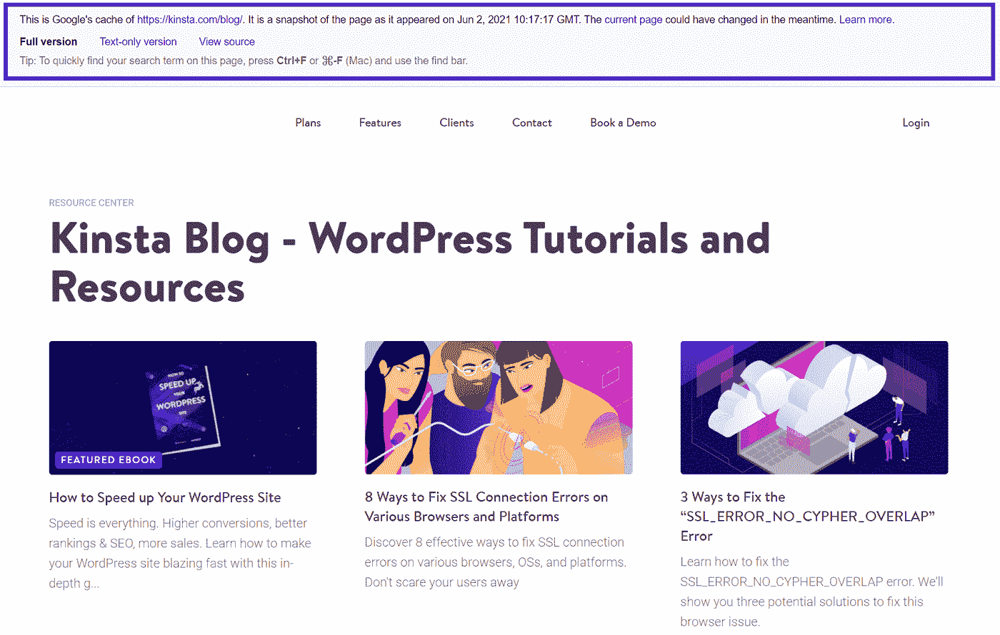
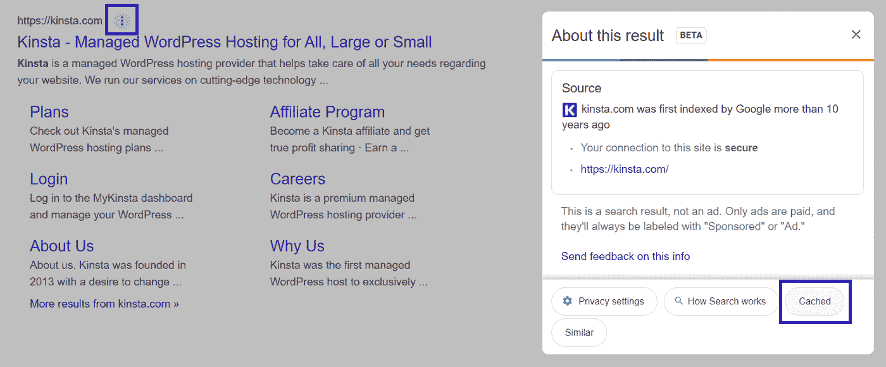
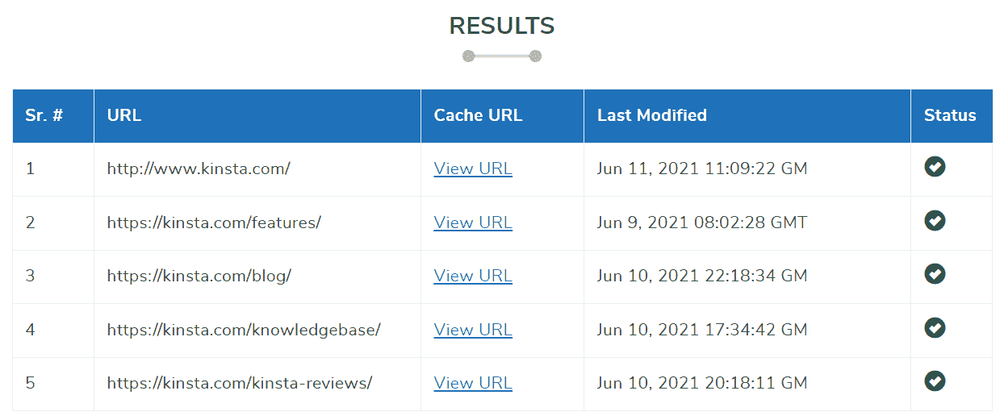
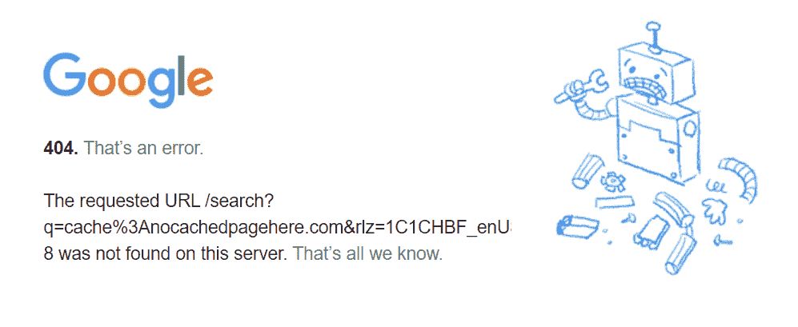
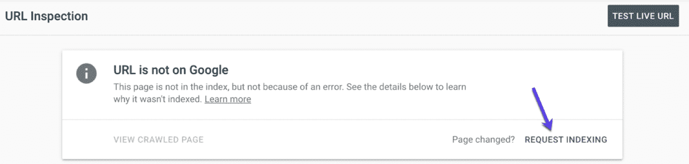

# 什么是谷歌缓存？网站所有者需要知道的一切

> 原文：<https://kinsta.com/blog/google-cache/>

谷歌的网络爬虫不断地在互联网上搜索新的和更新的网页。

当这些爬虫索引一个站点的内容时，它们不仅仅使用信息来传递搜索结果。他们对页面进行备份，并将其添加到一个名为谷歌缓存的统一数据库中。

你可能使用过谷歌缓存来查看关闭或加载不正确的旧版本网站。但是你知道你也可以用它来解决你网站上的问题吗？它甚至可以帮助你的搜索引擎优化工作。

本文介绍了 Google Cache 以及如何检查它。我们还将看看谷歌缓存是如何有帮助的——以及什么时候你不应该过于依赖它。

### 查看谷歌缓存的[视频指南](https://www.youtube.com/watch?v=A4lvU89RrUY)

## 什么是谷歌缓存？

Google 缓存页面是在 Google 的一次抓取中获取的页面内容的原始 HTML 备份。谷歌缓存作为一个整体由这些备份页面组成。

> 需要在这里大声喊出来。Kinsta 太神奇了，我用它做我的个人网站。支持是迅速和杰出的，他们的服务器是 WordPress 最快的。
> 
> <footer class="wp-block-kinsta-client-quote__footer">
> 
> 
> 
> <cite class="wp-block-kinsta-client-quote__cite">Phillip Stemann</cite></footer>

[View plans](https://kinsta.com/plans/)

如果你查看网站的[缓存版本，它可能看起来很像网站被抓取时的样子。但是有几个原因导致它有时看起来和你想象的不一样。](https://kinsta.com/blog/what-is-cache/)

两个主要原因是:

*   网页是由你的浏览器呈现的，而不是谷歌。这可能会导致与网站的当前版本不一致。
*   JavaScript 没有被保存到缓存中，所以你网站的某些部分可能会丢失。

### 谷歌缓存页面看起来像什么？

在缓存页面的顶部，您会看到一个横幅，显示三件事:

1.  **缓存页面的 URL**—这通常是您想要访问的 URL。在某些情况下，如重定向的 URL，它会有所不同。
2.  **该版本页面的缓存日期** —您可以查看您正在查看的缓存页面是昨天还是上周创建的。这不一定是最后一次对您的网页进行爬网；我们一会儿会谈到这一点。
3.  **版本** —您可以选择查看页面的完整版本、纯文本版本或[源。完整版向您显示由浏览器呈现的页面。纯文本版本关闭了 CSS，不显示图像，但仍会看到超链接。点击**查看源代码**显示页面源代码:](https://kinsta.com/blog/inspect-element/)

Example of a cached version of a Kinsta page.

[您知道可以使用谷歌缓存来解决网站问题吗...它甚至可以帮助你的搜索引擎优化工作？🔎在这里了解更多⬇️ 点击推文](https://twitter.com/intent/tweet?url=https%3A%2F%2Fbit.ly%2F3cwAMot&via=kinsta&text=Did+you+know+that+you+can+use+Google+Cache+to+solve+problems+on+your+website...+and+it+can+even+help+with+your+SEO+efforts%3F+%F0%9F%94%8E+Learn+more+here+%E2%AC%87%EF%B8%8F&hashtags=GoogleCache%2CSEO)

## 为什么谷歌缓存很重要

谷歌缓存的主要用途是供人们浏览互联网。它允许他们看到关闭的或者加载有问题的网页。

作为网站所有者，谷歌缓存至关重要还有其他原因。你希望你的网站永远不会关闭或有故障，但它发生了。有了缓存，即使有些地方不太正常，用户也可以使用您的内容。

你也可以使用你网站的缓存版本来了解你的网站是如何被索引的，并[诊断问题](https://kinsta.com/blog/decline-seo-rankings/)。请继续阅读，了解更多信息。

## 如何查看 Google Cache？

如何从谷歌搜索引擎结果中找到缓存的谷歌页面取决于你使用的设备类型。在桌面 web 浏览器中，您有两种选择:

1.  你可以从谷歌搜索结果中找到一个页面缓存版本的链接。
2.  可以直接进入页面。

在移动浏览器上，您只能选择使用直接 URL。

### 从 Google 搜索结果中查看缓存页面

即使你有从搜索结果页面查看缓存站点的经验，你也可能想要阅读这篇文章，因为谷歌在 2021 年初改变了查找缓存链接的方式。

首先，在谷歌上搜索你想看的页面。在搜索结果中页面的 URL 旁边，您应该会看到三个垂直的点。单击它们，会出现一个标有“关于此结果”的弹出窗口:

谷歌的“关于这个结果”功能。

这项功能目前处于测试阶段。这是为了让你在点击之前了解一个网站的更多信息(比如它是否安全)。

在弹出窗口的右下角，有一个标记为 **Cached 的按钮。**点击查看缓存页面。

在某些情况下，您可能看不到缓存的按钮。这可能意味着页面没有被缓存；我们稍后会讨论这意味着什么。

但如果你在手机上，你不会看到任何页面的按钮。在这种情况下，请继续阅读，了解查看缓存页面的另一种方法。

### 修改 URL 以查看缓存的页面

对于这种方法，你必须知道你想看到的网页的网址。在搜索栏中输入`cache:website.xyz`即可。

例如，`cache:kinsta.com`将带您直接进入我们的缓存主页。

### 查看 Google 缓存的其他工具

查看缓存页面不需要任何特殊工具；谷歌本身就让它变得极其简单。但是有一些工具有您可能喜欢的特性。

Chrome 的 [Web Cache Viewer](https://chrome.google.com/webstore/detail/web-cache-viewer/pbkloffickinnlnmefmjmjbacohecpbd) 扩展允许你右击任何链接，查看页面的谷歌缓存版本和 [Wayback Machine web archive 版本](https://kinsta.com/blog/archive-a-website/)。

来自小型 SEO 工具的 [Google Cache Checker](https://smallseotools.com/google-cache-checker/) 可以让你一次查看多达五个页面的 URL 和缓存日期:

谷歌缓存检查器。

### 使用 Google Cache 查看页面的旧版本

你的页面说它是昨天缓存的，但是你想看上周的版本。用谷歌缓存可能吗？

可惜没有。

谷歌只能显示一个版本的缓存页面。要查看以前的网站版本，你可以使用类似于 [Wayback Machine](https://archive.org/web/) 的工具，这是一个网页过去版本的存档。

看看我们以前的样子！

way back 机器上的 2014 Kinsta 网站。

## 作为网站所有者使用 Google Cache 的理由

事实是，有其他工具可以完成下面的一切——在许多情况下，[更复杂的工具](https://kinsta.com/blog/apm-tools/)。

但谷歌缓存的快速和易于检查是无与伦比的。这使得它成为监控网页某些方面的一种有价值的方式。

作为网站所有者，你可以通过以下五种方式使用谷歌缓存。

### 1.检查重复的内容

有时你点击一个缓存的链接，并在一个不同的网页比你预期的土地。

发生这种情况的一个原因是由于[重复内容](https://kinsta.com/knowledgebase/duplicate-page-post-wordpress/)。当谷歌看到两个高度相似的页面时，它可能会决定不在索引中将它们分开。这导致只有一个保存在缓存中。

谷歌缓存同一链接下的多个页面可以提醒你，你的网站上有重复的内容。重复的内容不仅仅会造成混乱的缓存状况——对 SEO 来说也是不利的。

请抓住机会检查这两个页面，并找到区分它们的方法。

### 2.验证谷歌尊重你的规范标签

也许你的网站上的重复内容是故意的，但你已经添加了`rel=canonical`标签来告诉谷歌要抓取哪个版本。

检查一个你不想抓取的页面的 Google 缓存版本。您应该被带到规范页面的缓存中。

### 3.确保你的营销努力已经被抓取

你已经加大了你的搜索引擎优化或内容制作的努力，你想确保谷歌是索引的变化。

快速浏览一下页面的缓存版本就可以知道它已经被抓取了。

## 注册订阅时事通讯

### 想知道我们是怎么让流量增长超过 1000%的吗？

加入 20，000 多名获得我们每周时事通讯和内部消息的人的行列吧！

[Subscribe Now](#newsletter)

请注意，如果您的更改没有出现在缓存的页面上，它们可能仍已被编入索引。如果你担心，你可以去[谷歌搜索控制台的网址检查器](https://kinsta.com/blog/google-search-console/#features)确认。但是如果你在缓存上看到你的更新，你知道它们已经被编入索引，并将开始影响你的搜索结果排名。

### 4.关注竞争对手网站的变化

当[的竞争对手突然抢走你的位置](https://kinsta.com/blog/saas-marketing/#learn-from-successful-competitors)时，你关心你自己的事情，享受你在一个关键关键词的搜索结果上的位置。他们是怎么做到的？你可以用谷歌缓存了解一下。将他们的缓存页面与当前版本进行比较——您将能够看到竞争对手最近做了哪些更改。

### 5.检索站点的最新版本

你应该总是为你的网站做一个[备份，以防万一。也就是说，有时最坏的事情可能会发生，即使是最有准备的人。](https://kinsta.com/blog/backup-wordpress-site/)

虽然你的网站的谷歌缓存版本不能取代完整备份，但它有时确实能让你看到你的页面在灾难发生前的样子。您可以使用它来检索丢失的旧内容或代码。

## 谷歌缓存的局限性

谷歌的缓存可以提供有用的信息，如果有些东西看起来很奇怪，就值得调查。但是谷歌缓存有一些已知的限制。

### 谷歌缓存不会告诉你上次抓取你的网页是什么时候

让我们从一个最大的误解开始。

很多人认为每当 Googlebot 抓取一个页面时，缓存就会更新。关于这个主题的许多其他文章会告诉你使用缓存来查看你的页面被抓取的频率。

这不是真的。

我们知道这一点，因为谷歌的约翰·穆勒在一个帮助帖中告诉我们，他说:

> “一般来说，我们并不总是在每次抓取页面时更新缓存的页面。尤其是当页面没有明显变化时，我们可能会选择只保留旧日期。”

给你一个专业建议:如果你想知道谷歌抓取你网站的频率、原因和使用的机器人，忘记缓存吧。这些数据在谷歌搜索控制台上。你可以在侧边栏的**设置**下找到抓取报告。

但是，您只能在域级别看到这些信息。搜索控制台不会告诉你每一页被抓取的频率。

### 页面可能无法正确呈现

幸运的是，在这方面已经取得了一些进展。谷歌的网页渲染服务，在网络上渲染实时页面，过去是基于一个过时的 Chrome 版本。因此，最新的浏览器有时呈现缓存页面的方式与 Google 呈现当前页面的方式不同。

自 2019 年起，谷歌网页渲染服务使用最新版本的 Chrome。

然而，如果你的 Chrome 版本较旧，或者你正在使用不同的浏览器，缓存的页面可能会显示不正确。

另一个渲染问题与[缺少资源](https://kinsta.com/blog/wordpress-errors/)有关。谷歌备份的代码可能会引用 CSS 或 JavaScript 等资源[。如果这些资源不再存在或已经改变，页面将无法正确呈现。](https://kinsta.com/blog/optimize-css/)

### 显示错误的页面

我们已经了解了重复的内容或不正确的规范标签如何导致 Google Cache 显示错误的页面。正如您所想象的，这限制了查看特定网页的缓存的有用性。

需要为你的 WordPress 站点提供超快的、可靠的、完全安全的托管服务吗？Kinsta 提供所有这些以及 WordPress 专家提供的 24/7 世界级支持。[查看我们的计划](https://kinsta.com/plans/?in-article-cta)

### 一些页面没有被缓存

这可能令人惊讶，但事实证明许多页面根本没有被缓存。

一个普遍的误解是，一个未缓存的网站意味着谷歌不认为它是必要的，但这不一定是真的。接下来，我们将了解页面可能不会被缓存的一些原因。

## 为什么我找不到缓存的网页？

并非所有被爬网的页面都被缓存。如果您的页面没有缓存版本，不要惊慌！这并不意味着你的页面没有被索引。

404 错误表示页面没有缓存版本。

如果你担心它真的没有被索引，你可以使用谷歌搜索控制台的网址检查。

为了证明索引页面并不总是被缓存，我们回到 Google 的 John Mueller。在 Twitter 上，他回复了一位用户关于未缓存页面的问题:

> “我们不会缓存我们索引的所有页面，所以会发生这种情况。有时需要一段时间，有时我们根本不缓存它。”

当用户问他未缓存的网站是否总是低质量的，他说:

> “That + it 可以是各种古怪技术怪癖的页面。缓存是独立的，所以它不代表我们索引和排名的内容。”

换句话说，缓存的页面不是一个排名因素。即使您的网页没有缓存版本，您也可以将其放在搜索结果的顶部。

但是一个未缓存的页面仍然值得一查。你可以探索几种不同的可能性。

### 您的页面基于 JavaScript

谷歌索引一些 JavaScript 支持的页面比其他页面要容易。但是许多 JavaScript 页面最终没有缓存，甚至没有索引。

这是因为大多数 HTML 直到 JavaScript 执行后才会加载。如果没有索引，Google 就不会创建缓存页面。

### 缓存由 meta 标记表示

页面 HTML 代码中的一个`noindex` meta 标签意味着该页面不能被谷歌索引，而`noarchive`则阻止它被缓存。[任何一个都会导致](https://kinsta.com/help/wordpress-temporary-url/)一个未缓存的页面。

也许这正是你想要的。但是，如果您没有意识到页面上有一个`noindex`或`noarchive`标签，删除它可以解决您的丢失缓存问题。

### 该页面是重复的(或者谷歌认为是重复的)

如果谷歌认为你的两个页面是重复的，想办法让它们变得独特。考虑每个页面不同的搜索意图。

## 如何解决网站缓存页面的问题

你的页面不一定要被缓存，但是如果你想让它发生，你可以做一些事情。

### 将你的页面提交给谷歌

如果你担心谷歌没有索引你的网页，你可以查看谷歌搜索控制台。

在搜索控制台顶部的 URL 检查搜索栏中输入页面的 URL。如果你得到的结果是“URL 在 Google 上”，那么这个页面已经被索引了。如果页面最近发生了变化，而你认为谷歌没有对新版本进行索引，你可以点击**请求索引**请求谷歌对其进行重新索引。

你也可能得到“页面不在谷歌上”的结果如果是这样，向下滚动，您将能够看到该页面的一些详细信息。例如，您可以检查该页面是否允许爬行，以及用户选择的 canonical 是否与 Google 选择的 canonical 匹配。要[请求标引](https://kinsta.com/blog/submit-website-to-search-engines/)，点击**请求标引**:

谷歌搜索控制台 URL 索引请求。

### 检查常见的站点问题

我们已经讨论了页面不被缓存的几个原因，比如大量的 JavaScript 和重复的内容。

除此之外，鼓励频繁索引的最好方法就是创建一个高质量的网站。确保你已经[为移动](https://kinsta.com/blog/google-mobile-first-index/)优化了你的网站，并且你的[网站速度很快](https://kinsta.com/cheatsheets/site-speed-cheat-sheet/)。

如果你的[页面加载时间](https://kinsta.com/blog/ttfb/)太慢，它甚至会降低谷歌机器人的速度，导致索引延迟。

## 如何从谷歌缓存中移除页面？

我们认为谷歌缓存非常有用，但出于各种原因，你可能不希望旧版本的网页存储在谷歌的服务器上。例如，您可能不希望停产产品的页面可用。

防止页面缓存的一种方法是使用上面提到的`noindex`和`noarchive`标签。如果您想保留页面，但不想缓存它们，这些标签是理想的永久解决方案。

你也可以直接要求谷歌从谷歌缓存中删除网址。为此，进入谷歌搜索控制台，点击侧边栏中的**移除**。然后点击**新请求**。此时，你有两个选择:**暂时删除网址**和**清除缓存网址**。

暂时删除意味着该网址在大约六个月内不会出现在谷歌搜索结果中。缓存也将消失。当页面再次运行时，它将被重新索引和重新缓存(如果您不希望发生这种情况，您必须添加一个 meta 标记)。

清除缓存的 URL 听起来确实如此。缓存将被删除，但当对网站进行爬网时，页面将被再次缓存。

如果你想让旧版本的更新页面消失，这是一个很好的方法。你也可以在修改页面后，通过提交页面进行索引，让谷歌更新页面的缓存。

[Google Cache is a valuable tool for solving problems on your site, and can even help with SEO efforts...but there are a few reasons you shouldn't rely on it exclusively 👀Click to Tweet](https://twitter.com/intent/tweet?url=https%3A%2F%2Fbit.ly%2F3cwAMot&via=kinsta&text=Google+Cache+is+a+valuable+tool+for+solving+problems+on+your+site%2C+and+can+even+help+with+SEO+efforts...but+there+are+a+few+reasons+you+shouldn%27t+rely+on+it+exclusively+%F0%9F%91%80&hashtags=SEOTips%2CGoogleCache)

## 摘要

谷歌缓存并不像传言的那样。你不能用它来检查你的网站最后一次被抓取的时间——拥有它并不能提高你的搜索引擎排名。有时，你网站的存储版本是奇怪的，不完整的，或者完全错误的。

但是谷歌缓存对网站所有者有它的用处。这是一个快速检查你的网站如何被索引的方法，它可以帮助你发现和诊断问题。你也可以使用[谷歌搜索控制台来提高你的搜索引擎排名](https://kinsta.com/blog/google-search-console/)。

关于 Google Cache，您还有什么问题吗？请在评论区告诉我们——我们希望听到他们的声音！

* * *

让你所有的[应用程序](https://kinsta.com/application-hosting/)、[数据库](https://kinsta.com/database-hosting/)和 [WordPress 网站](https://kinsta.com/wordpress-hosting/)在线并在一个屋檐下。我们功能丰富的高性能云平台包括:

*   在 MyKinsta 仪表盘中轻松设置和管理
*   24/7 专家支持
*   最好的谷歌云平台硬件和网络，由 Kubernetes 提供最大的可扩展性
*   面向速度和安全性的企业级 Cloudflare 集成
*   全球受众覆盖全球多达 35 个数据中心和 275 多个 pop

在第一个月使用托管的[应用程序或托管](https://kinsta.com/application-hosting/)的[数据库，您可以享受 20 美元的优惠，亲自测试一下。探索我们的](https://kinsta.com/database-hosting/)[计划](https://kinsta.com/plans/)或[与销售人员交谈](https://kinsta.com/contact-us/)以找到最适合您的方式。