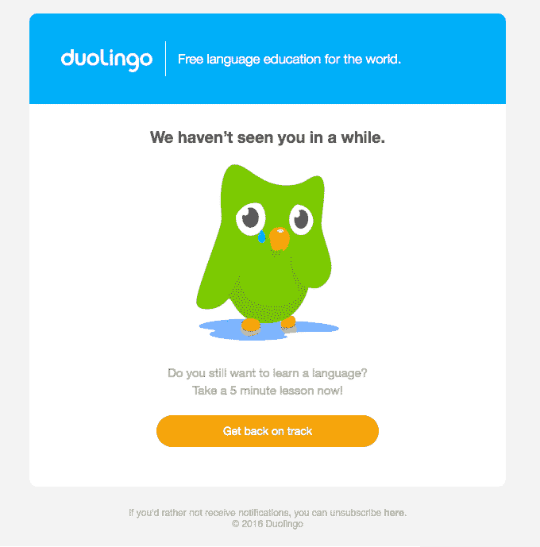
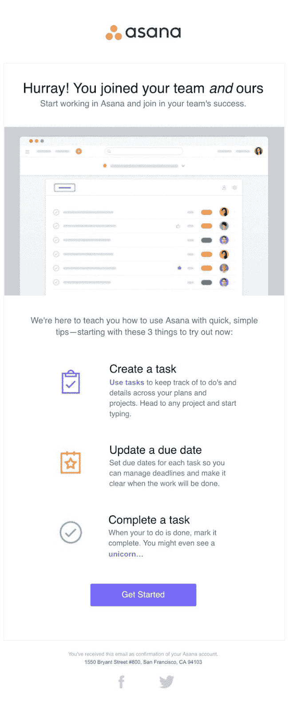
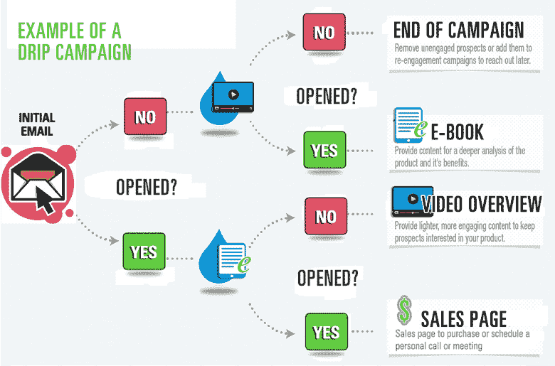
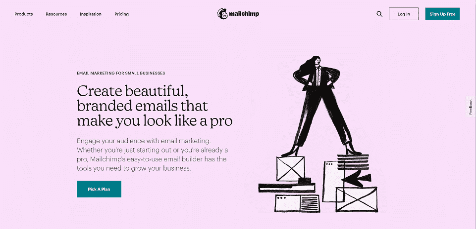
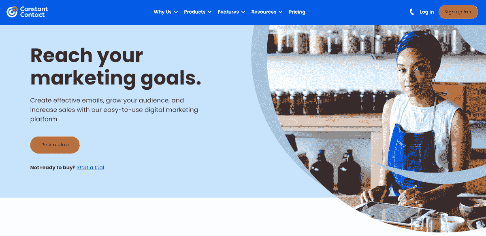
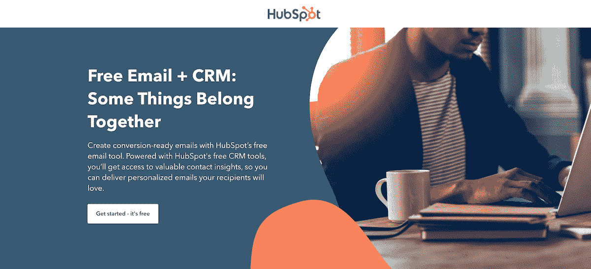
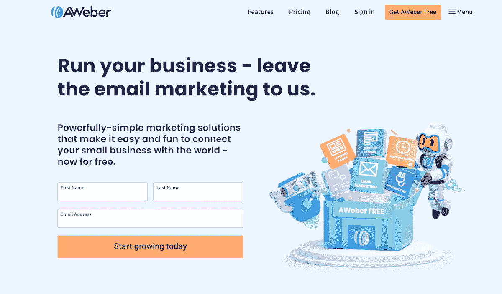
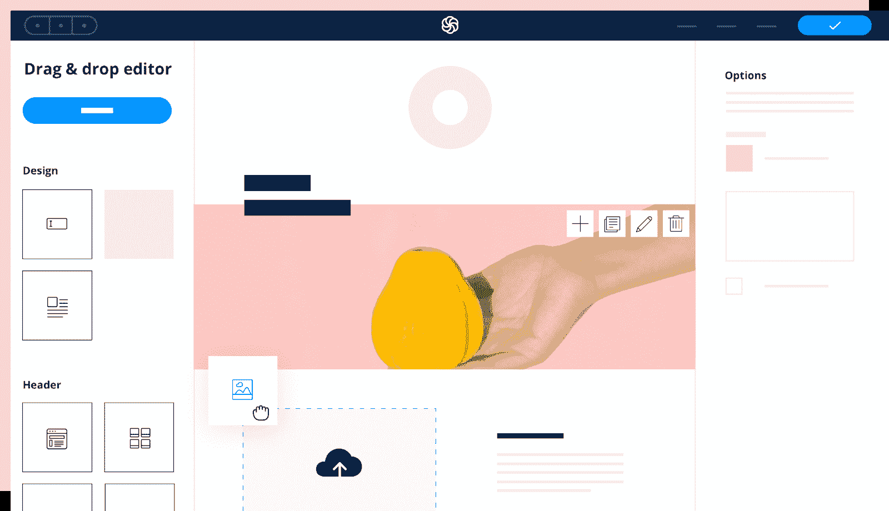
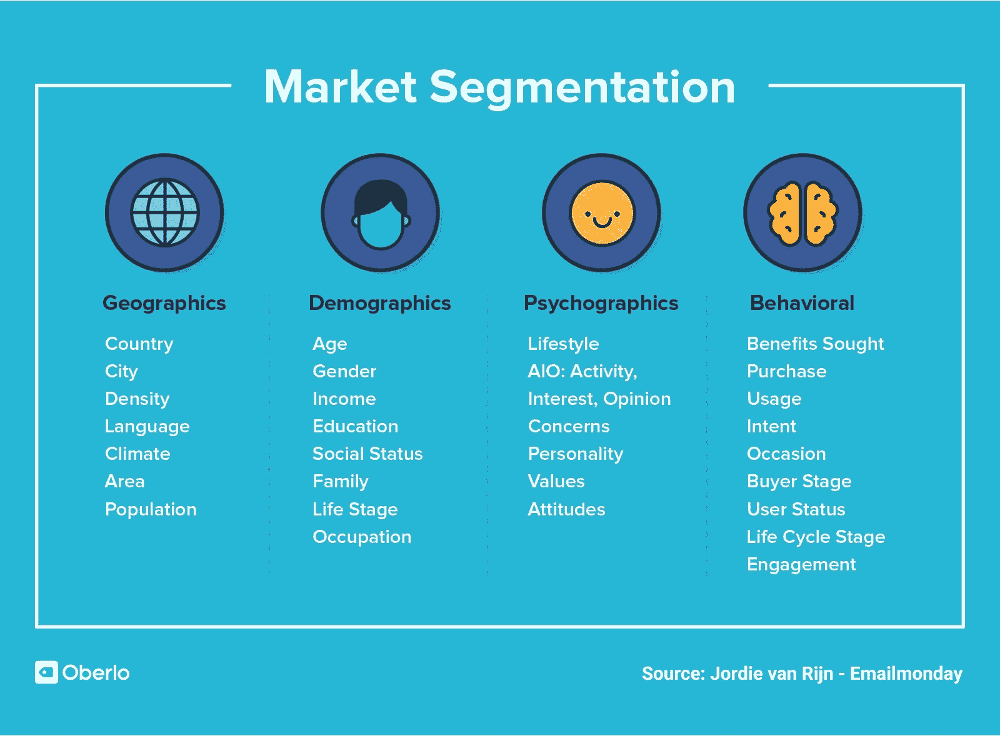
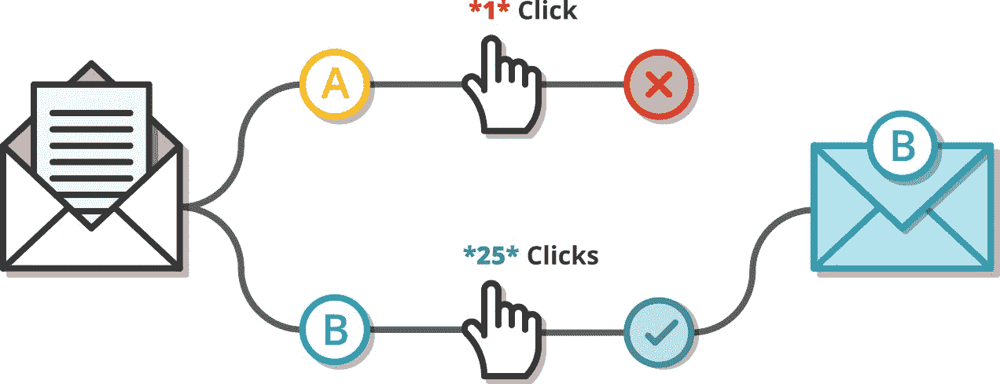

# 通过电子邮件营销自动化增强您的业务

> 原文：<https://kinsta.com/blog/email-marketing-automation/>

电子邮件是你的企业建立和保持客户群的最有力的工具之一。

首先，你的观众喜欢它。51%的消费者表示，电子邮件是他们更喜欢的品牌联系方式。这使得它比其他任何频道都受欢迎。

电子邮件也有很高的投资回报率(ROI)。在电子邮件营销上每投入 1 美元，平均可以获得 35 美元的回报。

但是定期创建和发送电子邮件会非常耗时，尤其是当你的业务增长时。

为了充分利用你的电子邮件营销，你需要自动化它。

幸运的是，一些工具使这变得容易。本文将介绍电子邮件营销自动化，包括如何做到这一点，以及什么平台最适合这项工作。

T3】

## 什么是电子邮件营销自动化？

电子邮件营销自动化使用自动化工作流程[在正确的时间向正确的人发送正确的电子邮件](https://kinsta.com/blog/email-marketing-best-practices/)。

最基本的，电子邮件营销自动化意味着安排一封电子邮件在特定的时间发送。但是电子邮件自动化能做的远不止这些。

可以基于各种触发器发送一封电子邮件或一系列电子邮件。例如，您可以根据用户在您网站上的操作发送电子邮件。

现代电子邮件营销自动化软件通过简化以下内容，将大量手动工作从您手中拿走:

*   订户列表管理
*   电子邮件创建
*   消息个性化
*   [A/B 测试](https://kinsta.com/blog/google-optimize/)
*   分析学

[Email is one of the most powerful tools your business has for building and retaining a customer base. 📈 But to get the most out of your marketing, you need to automate it. 📧Click to Tweet](https://twitter.com/intent/tweet?url=https%3A%2F%2Fkinsta.com%2Fblog%2Femail-marketing-automation%2F&via=kinsta&text=Email+is+one+of+the+most+powerful+tools+your+business+has+for+building+and+retaining+a+customer+base.+%F0%9F%93%88+But+to+get+the+most+out+of+your+marketing%2C+you+need+to+automate+it.+%F0%9F%93%A7&hashtags=EmailTips%2CEmailMarketing)

## 电子邮件营销自动化的好处

我们已经讨论了电子邮件营销的高投资回报率，以及消费者更喜欢通过电子邮件联系。

但是为什么你需要使用电子邮件营销自动化工具呢？

以下是几个原因。

### 效率

电子邮件自动化节省您的时间和精力。例如，您不必手动编译和管理您的订户列表。

或者，假设您想向许多人发送一封电子邮件，但您希望他们根据所在时区或工作时间表在不同时间收到邮件。

全天手动发送电子邮件是不合理的。但是电子邮件营销平台工具可以在你处理其他任务时自动完成这项工作。

许多自动化平台甚至可以计算出向每个列表成员发送电子邮件的最佳时间。

### 可量测性

如果您的列表中只有几个订阅者，您可以在没有自动化解决方案的情况下向他们发送最新更新。但是向一个庞大列表的多个部分发送常规电子邮件(包括新闻、促销、有用内容等)变得不可能。

电子邮件营销自动化平台可以发展你的业务。你可以定期给你名单上的每个人发送有针对性的电子邮件，不管它有多大。

### 提高客户保留率

顾客往往注意力不集中。

他们可能曾经买过你的产品，但是如果他们再也没有你的消息，他们就会忘记你。谁能责怪他们呢？他们每天都会看到来自其他公司的营销邮件、广告和社交媒体帖子。

如果没有自动化的电子邮件，维护与客户的关系将是一项挑战。

电子邮件营销自动化可以保持现有客户的参与，并提醒他们喜欢你的产品。

客户留存邮件示例(来源: [Chamaileon](https://chamaileon.io/resources/retention-email-marketing-10-types-of-emails-to-guide-your-next-campaign/) )

### 消息个性化

一刀切的电子邮件不再适用。

72% 的消费者表示，他们只关注符合他们兴趣的营销信息。对于“经常购物的人”来说，这甚至更准确。其中 80%的人只会购买个性化体验的品牌。

营销人员明白这一点——69%的人正在使用某种个性化的电子邮件。

为了具有竞争力，你还必须个性化你的电子邮件信息。电子邮件营销自动化平台可以帮助你做到这一点，而无需增加大量额外的人工工作。

## 何时使用电子邮件营销自动化

自动化电子邮件是高度可定制的，以满足您的业务需求。您可以随时发送任何类型的电子邮件。

也就是说，我们建议企业在电子邮件营销策略中包含一些关键类型的营销电子邮件。

### 废弃购物车电子邮件

几乎 70%的购物车被电子商务网站抛弃。

你可以让这些人回来完成他们的购买。[发送电子邮件](https://kinsta.com/blog/abandoned-cart-email/)提醒他们购物车中的商品。向顾客提供该商品的特价可能会吸引他们回来。

您可以通过将电子邮件自动化工具与网站跟踪相结合来实现这一点。甚至可以根据其他网站访问者的行为发送电子邮件，比如查看某个特定主题的资源。

### 时事通讯

定期发送简讯是吸引观众的有效方法。

它们可以让你将各种重要信息放入一封电子邮件中，如公司新闻、活动、促销和令人兴奋的内容。

### 促销电子邮件

促销电子邮件是电子邮件活动，旨在让人们了解你的企业正在提供的东西。它们可以围绕产品发布、服务、[免费下载内容](https://kinsta.com/blog/easy-digital-downloads/)或即将到来的事件。

他们经常给你的订户打折或特价商品。

促销邮件可以非常成功地让人们对你的品牌感兴趣。当你锁定最有可能对促销感兴趣的订户时，它们的效果最好。

### 新订户欢迎电子邮件

企业花了很多时间培养现有的联系，但你知道名单订户什么时候最有可能向你购买吗？

就在他们订阅之后。

在那一刻，他们对你的业务有足够的兴趣加入你的邮件列表。这是促使他们改变信仰的绝佳机会。

为此，你可以发送一封欢迎邮件，甚至是一系列的欢迎邮件。欢迎邮件很受欢迎——平均打开率为 [86.03%](https://www.getresponse.com/resources/reports/email-marketing-benchmarks) 。

相比之下，简讯的平均打开率为 18.76%

一封欢迎邮件的例子(来源: [Vero](https://www.getvero.com/) )

### 事件和约会提醒

有即将举行的活动吗？

不要让你的观众忘记这一点。安排几封活动提醒邮件可以提高出勤率。您还可以自动提醒单个约会。

### 对询问的自动回复

当潜在客户联系你时，他们希望得到及时的回复。但是你可能无法立即回复每一封邮件。

借助电子邮件营销自动化，您可以设置自动回复查询。例如，你可以让这个人知道他们多快可以得到一个人的回复，同时指引他们去找相关的资源。

## 电子邮件营销自动化工具的主要特性

希望你相信电子邮件营销自动化解决方案的好处。所以我们来看看[邮件软件](https://kinsta.com/blog/email-marketing-software/)能做什么。

### 电子邮件营销活动构建工具

在您担心自动触发和 A/B 测试之前，您必须创建一封电子邮件。

它应该看起来专业，包括你的品牌。如今，它的移动响应能力也很重要。

幸运的是，你不需要设计或编码资源来实现这一点。顶级电子邮件营销工具提供了模板，您可以编辑这些模板来创建一封流畅、响应迅速的电子邮件。

### 扳机

触发器是导致自动发送电子邮件活动的原因。

您可以使用时间触发器—例如，1 月 20 日下午 5 点。

还有更高级的触发器。当某人出现以下情况时，会自动发送电子邮件:

*   订阅您的列表
*   在您的网站上采取特定的行动
*   单击您之前的电子邮件活动中的链接
*   在贵公司过生日或周年纪念日
*   购买你的产品

与促销电子邮件或时事通讯不同，这些类型的电子邮件会在恰当的时间发送给单个列表订阅者。

### 自动化滴灌活动

一个滴滴运动就是一系列相关的电子邮件。它们通常用于在客户旅程中培养销售线索。

滴滴邮件可以按照简单的时间表。例如，加入您的列表的订户可以触发每月向他们发送一次关于您的产品的信息电子邮件。

有些滴滴运动的流程更复杂。例如，对于打开第一封电子邮件的订阅者和没有打开第一封电子邮件的订阅者，系列中的第二封电子邮件可能不同。

一个滴滴运动的例子(来源:[大通新媒体](http://www.chasenewmedia.com/online-marketing/email-autoresponder-series) )

### A/B 测试

A/B 测试，也称为分割测试，有助于提高您的营销活动绩效。A/B 测试是指你发送一封电子邮件的多个版本——通常是发给一个小的测试小组——来看看哪一个表现得更好。

例如，测试用不同的主题行发送相同的电子邮件是很常见的。根据你的电子邮件营销平台，你可能有其他选择，如测试内容或图片。有几种不同类型的 A/B 测试工具可用。

A/B 测试不仅能帮助你选择最好的电子邮件版本，还能让你更多地了解你的受众。

### 响应跟踪和分析

电子邮件营销不仅仅是发送电子邮件。是关于订婚的。

你需要能够看到对你的电子邮件的回复。它们被打开了吗？有多少人点击了每个链接？

电子邮件营销自动化平台通常提供[报告和分析](https://kinsta.com/blog/how-to-use-google-analytics/)来帮助您衡量电子邮件的成功，并改进未来的活动。

## 顶级电子邮件营销自动化工具

市场上有大量的电子邮件营销工具。这些是最好的几个。

## 注册订阅时事通讯

### 想知道我们是怎么让流量增长超过 1000%的吗？

加入 20，000 多名获得我们每周时事通讯和内部消息的人的行列吧！

[Subscribe Now](#newsletter)

### 1.Mailchimp

Mailchimp 是电子邮件营销领域的主导者，拥有 [72.97%](https://www.datanyze.com/market-share/email-marketing--13) 的市场份额。这么多公司使用它是有原因的。

Mailchimp 使创建看起来专业的品牌邮件变得容易，它的测试和分析是一流的。更棒的是，它是各种规模企业的经济高效的解决方案。

如果你的联系人少于 2000 人，每月发送的电子邮件少于 10000 封，你可以免费使用 Mailchimp。

付费计划的价格取决于你有多少联系人，因此拥有 500 个联系人的企业不会像拥有 50，000 个联系人的企业那样为高级功能支付那么多费用。

麦钦普

**主要特征**

*   带有模板的电子邮件生成器
*   分段和列表管理
*   个性化
*   高级自动化
*   报告和分析
*   登录页面
*   A/B 和多元检验
*   发送时间优化

**定价**

*   **免费:**最多 2000 个联系人
*   **要点:**500 个联系人每月 9.99 美元起
*   **标准:**500 个联系人每月 14.99 美元起
*   **Premium:**10，000 个联系人每月 299 美元起

### 2.经常接触

[恒联系](https://www.constantcontact.com/)是第二受欢迎的电子邮件营销自动化平台，尽管它只有 5.36%的市场份额。

Constant Contact 有许多与 Mailchimp 相同的功能，如模板、自动化和分析。

它还有一些独特的功能来帮助非营利组织筹集资金。

Constant Contact

然而，Constant Contact 没有免费版本，付费计划比 Mailchimp 的更贵。

**主要特征**

*   带有模板的电子邮件生成器
*   分段和列表管理
*   个性化
*   高级自动化
*   报告和分析
*   A/B 测试
*   登录页面
*   筹款工具

**定价**

*   **电子邮件:**500 个联系人每月 20 美元起
*   **Email Plus:**500 个联系人每月 45 美元起
*   **电子商务专业版:**起价 195 美元/月，有 2500 个联系人

### 3.轮毂点

HubSpot 最广为人知的是一个 T2 CRM 平台或一套营销工具。其营销中心包括电子邮件。如果你也想使用 Hubspot 的其他营销解决方案，Hubspot 电子邮件是值得考虑的。

HubSpot Email Marketing

它有一个免费计划，让你每月发送多达 2000 封电子邮件。之后，您可以购买付费营销中心计划。

**主要特征**

*   带有模板的电子邮件生成器
*   分段和列表管理
*   个性化
*   高级自动化
*   报告和分析
*   A/B 测试
*   与 CRM 和其他营销工具的集成

**定价**

*   **免费 Hubspot 电子邮件:**每月 2000 封电子邮件的限额
*   **营销中心启动版:【1,000 个营销联系人的起价为每月 45 美元**
*   **营销中心专家**:起价 800 美元/月，可联系 2000 名营销人员
*   **营销中心企业:**10，000 个营销联系人的起价为每月 3，200 美元

### 4.AWeber

AWeber 有 600 多个电子邮件模板和易于使用的自动化选项。

它的定价是基于你有多少联系人。无论你的名单上有 50 个还是 50，000 个用户，你都可以使用 AWeber 的所有功能。

厌倦了低于 1 级的 WordPress 托管支持而没有答案？试试我们世界一流的支持团队！[查看我们的计划](https://kinsta.com/plans/?in-article-cta)

AWeber Email Marketing

这使得 AWeber 成为小型企业的绝佳选择，这些企业需要高级功能，而无需为企业级计划付费。

**主要特征**

*   带有模板的电子邮件生成器
*   分段和列表管理
*   个性化
*   高级自动化
*   报告和分析
*   A/B 测试
*   CMS 集成

**定价**

*   范围从免费(0-500 名订户)到每月 146.15 美元(10，001-25，000 名订户)

### 你是谁

Sendinblue 是一款价格实惠的电子邮件营销解决方案，可与 Mailchimp 等更知名的平台竞争。

事实上，在 EmailToolTester 的上一次邮件送达率测试中，Sendinblue 的 [96.3%](https://www.emailtooltester.com/en/email-deliverability-test/) 送达率优于 Mailchimp、Constant Contact、AWeber 和 Hubspot。

Sendinblue 的付费计划限制了你可以发送的电子邮件数量，但没有限制你的列表大小。因此，与 Mailchimp 或 AWeber 不同，拥有大量联系人的企业可以继续使用免费计划。

Sendinblue 邮件编辑

**主要特征**

*   带有模板的电子邮件生成器
*   分段和列表管理
*   个性化
*   高级自动化
*   报告和分析
*   A/B 测试
*   API/Webhooks
*   闲谈

**定价**

*   **免费:**每天最多 300 封电子邮件
*   **Lite:** 每月 10，000 封电子邮件的起价为 25 美元
*   **Premium:** 起价 65 美元/月，每月发送 2 万封电子邮件
*   **企业:**定制定价

上面这些是我们最喜欢的，但是还有很多其他的。

## 电子邮件营销自动化最佳实践

一旦您选择了电子邮件营销自动化平台，请遵循以下提示充分利用该工具并[了解最佳实践](https://kinsta.com/blog/email-marketing-best-practices/)。

### 1.建立一个高质量的列表

不要只是建立一个庞大的联系人列表。试着关注这些联系的质量。

高质量的列表订阅者是那些已经表达出对你的业务、产品或内容感兴趣的人。

这些人最有可能改变信仰。

您可以通过让订户选择加入来创建高质量的列表。实现这一点的一些方法包括:

*   将[注册表单](https://kinsta.com/blog/wordpress-forms/)添加到您的网站
*   在你的表格底部有一个“把我加入你的名单”的复选框
*   从下载资产的人那里收集电子邮件
*   为人们在贸易展和其他活动中注册提供场所

许多电子邮件营销自动化平台提供表格添加到您的网站，但它们不是您唯一的选择。如果你有一个 WordPress 网站，[试试这些潜在客户生成插件](https://kinsta.com/blog/wordpress-lead-generation/)。

### 2.细分你的受众

企业并不总是擅长将正确的信息传递给正确的人。

许多公司认为他们做得很好——59%的营销人员认为他们发送的大部分电子邮件都是相关且有价值的。

但只有 15%的消费者认为他们收到的大多数营销邮件是相关和有用的。那么如何成为为数不多的有效针对其邮件的品牌呢？

细分你的清单是至关重要的。

细分市场是联系人列表中具有某些共同点的人群，例如:

*   位置
*   语言
*   年龄
*   性别
*   职业
*   生活方式
*   兴趣
*   购买历史
*   买方阶段

细分类型(来源:[奥博洛](https://www.oberlo.com/blog/market-segmentation) )

细分您的电子邮件列表，让您个性化您的活动，以满足特定受众的需求和愿望。

### 3.瞄准客户旅程的每个阶段

你名单上的人与你公司的关系处于不同的阶段。

有些人几乎不知道你是谁。这些人可能在你的联系人名单上，因为他们[从你的网站](https://kinsta.com/podcast/qualified-leads/)下载了白皮书，或者在你的博客上填写了表格。

其他列表订阅者已经收到你的邮件有一段时间了，但他们还没有转换。

当然，还有你的忠实顾客。

每个小组都应该收到不同类型的电子邮件。确保你没有忽略漏斗的任何部分。

例如，在早期阶段向人们发送令人兴奋的内容可以让他们更多地了解你的业务。同时，您可以用特别优惠来奖励现有客户。

### 4.注意电子邮件的频率

你是否曾经注册了一个有趣的电子邮件列表，却在收到太多邮件时感到恼火？

我们大多数人都经历过。

定期发送电子邮件让你的听众参与进来是很重要的，但是你必须意识到你联系每个名单成员的频率。

那么多久才算太频繁呢？

没有放之四海而皆准的规则。你可以通过查看电子邮件营销自动化软件中的电子邮件分析来判断你做得如何。

如果你看到打开率和[点击率](https://kinsta.com/blog/conversion-rate-optimization-tips/)下降，退订上升，这是一个危险信号。看看如果你少发邮件会发生什么。

### 5.远离垃圾邮件文件夹

你想象你的电子邮件安全地到达每个预定收件人的收件箱。

但事实并非总是如此。所有电子邮件中有 11.1% 从未进入收件箱。有几个因素会影响[电子邮件的送达率](https://kinsta.com/blog/email-deliverability-manager/)。

如果出现以下情况，您的电子邮件可能会被放在垃圾邮件文件夹中:

*   您的列表中有不活动的电子邮件地址
*   您使用的词语可能会触发垃圾邮件过滤器
*   邮件收件人[将你的邮件标记为垃圾邮件](https://kinsta.com/blog/email-authentication/),因为他们认为这些邮件没有帮助或者没有意义
*   你同时发送了太多电子邮件

### 6.A/B 测试一切

A/B 测试意味着您不断发送优化版本的电子邮件活动。

如果一个主题行在 A/B 测试中没有引起你的观众的共鸣，你就不会犯把它发送给你的整个联系人列表的错误。

A/B 测试也有助于你了解你的潜在客户，从而在未来创造更好的营销活动。

邮件 A/B 测试流程(来源:[扎皮尔](//zapier.com/learn/email-marketing/ab-testing-email-marketing/) )

[手动创建和发送电子邮件对于一个成长中的企业来说是不可持续的，但电子邮件营销看到了巨大的投资回报。📈进入，自动化。💪](https://twitter.com/intent/tweet?url=https%3A%2F%2Fkinsta.com%2Fblog%2Femail-marketing-automation%2F&via=kinsta&text=Manually+creating+and+sending+emails+isn%27t+sustainable+for+a+growing+business%2C+but+email+marketing+sees+a+huge+ROI.+%F0%9F%93%88+Enter%2C+automation.%F0%9F%92%AA&hashtags=EmailTips%2CEmailMarketing)

## 摘要

凭借其出色的投资回报率，电子邮件营销是每个企业的必备。借助合适的电子邮件自动化解决方案，可以轻松高效地完成这项工作。

电子邮件营销自动化可以帮助建立受众，改善与客户的关系，并销售产品。

*准备好制定您的电子邮件策略了吗？立即获取[更多电子邮件营销技巧](https://kinsta.com/blog/email-marketing-tips/)！*

* * *

让你所有的[应用程序](https://kinsta.com/application-hosting/)、[数据库](https://kinsta.com/database-hosting/)和 [WordPress 网站](https://kinsta.com/wordpress-hosting/)在线并在一个屋檐下。我们功能丰富的高性能云平台包括:

*   在 MyKinsta 仪表盘中轻松设置和管理
*   24/7 专家支持
*   最好的谷歌云平台硬件和网络，由 Kubernetes 提供最大的可扩展性
*   面向速度和安全性的企业级 Cloudflare 集成
*   全球受众覆盖全球多达 35 个数据中心和 275 多个 pop

在第一个月使用托管的[应用程序或托管](https://kinsta.com/application-hosting/)的[数据库，您可以享受 20 美元的优惠，亲自测试一下。探索我们的](https://kinsta.com/database-hosting/)[计划](https://kinsta.com/plans/)或[与销售人员交谈](https://kinsta.com/contact-us/)以找到最适合您的方式。