# 如何从 Weebly 迁移到 WordPress(完全指南)

> 原文：<https://kinsta.com/blog/weebly-to-wordpress/>

Weebly 是许多网站建设者之一，当人们考虑发布他们的网站时，他们可能会考虑。为什么？它提供了一个免费的计划。然而，如果你已经超出了基本设置的范围，并且不想升级 Weebly 计划，该怎么办呢？在这种情况下，你最好的选择之一就是从 Weebly 迁移到 WordPress。

在这个循序渐进的指南中，我们将带你完成你需要做的事情，成功地将你现有的网站从 Weebly 迁移到新的 WordPress 网站。

在我们进行实际的迁移步骤之前，让我们看一下为了使迁移过程尽可能顺利和容易，需要做的几件事情。从[获得域名](https://kinsta.com/blog/choose-domain-name/)和[托管](https://kinsta.com/small-business-hosting/)到为迁移过程设置 WordPress，我们为您提供服务。

T3】

## 从 Weebly 到 WordPress:迁移先决条件

我们知道你渴望并准备将你的网站从 Weebly 转移到 WordPress。在这发生之前，让我们回顾一下在开始实际的网站迁移过程之前你应该已经注意的一些事情。

从一个 CMS[到另一个 CMS](https://kinsta.com/knowledgebase/content-management-system/) 并不总是容易的。Weebly 和 WordPress 尤其如此。当我们为你安排步骤时，某些事情必须事先考虑。

也许要记住的最重要的事情是 Weebly 和 WordPress 之间的主要区别。

Weebly 于 2018 年被 Square 收购，它不是一个开源系统。这是一个专有的拖放网站建设者，给人们一切他们需要立即开始建立一个网站，并让它上线。

虽然这一切都很好，但人们往往会超越 Weebly 设置，因为他们想要更多的自由和控制他们在网站上能做什么和不能做什么。

WordPress 正是为此而构建的。WordPress 是一个开源系统，在控制和灵活性方面给了用户大量的选择。

有了 WordPress，用户可以定制(几乎)任何东西，[包括底层源代码](https://kinsta.com/knowledgebase/edit-wordpress-code/)、[主题](https://kinsta.com/best-wordpress-themes/)，以及功能性([通过插件](https://kinsta.com/best-wordpress-plugins/))，这允许了很大的自由度。

既然我们已经强调了两个平台之间的核心区别，让我们来看看你需要执行的具体操作，以确保你从 Weebly 到新 WordPress 网站的迁移顺利进行。

[准备好出发了吗？这篇文章让你了解了这一过程的每一步💪 点击推文](https://twitter.com/intent/tweet?url=https%3A%2F%2Fbit.ly%2F3jMcDhI&via=kinsta&text=Ready+to+go+from+Weebly+%E2%9E%A1%EF%B8%8F+WordPress%3F+This+post+has+you+covered+every+step+of+the+way+%F0%9F%92%AA&hashtags=Weebly%2CWordPress)

### 注册域名

如果你从 Weebly 这样的平台转向 WordPress，你可能需要注册并购买一个域名。由于 Weebly 有一个免费计划，在那里建立网站的用户有一个看起来像这样的 URL:

*mysite.weebly.com*

现在，情况并不总是这样。因此，如果你已经有了自己的域名，请随意跳到下一部分。

有几个[好的域名注册商可以从](https://kinsta.com/blog/best-domain-registrar/#best-domain-registrar-options)中选择。你需要考虑定价和可用的 T2 TLD(顶级域名)名称 T3 等问题。

购买域名是将你的网站从 Weebly 迁移到 WordPress 的第一步。我们的深入指南涵盖了如何选择最好的域名注册商，可以让你更详细地了解这一过程。

### 购买主机

现在你已经有了一个域名，是时候购买虚拟主机了，这样你就可以让你的新 WordPress 站点正常运行了。同样，你需要在你的域名上安装一个新的 WordPress 来启动和运行你的 WordPress 站点，这样你才能正确地执行迁移。

有不同类型的托管可用。然而，我们建议用[管理 WordPress 主机](https://kinsta.com/blog/managed-wordpress-hosting/),原因有很多。

我们的 [Kinsta 主机平台](https://kinsta.com/plans/)是一个很好的选择，它可以让你访问所有的 [WordPress 主机特性和工具](https://kinsta.com/features/)，你可以轻松地在 WordPress 中建立一个网站，并准备好执行从 Weebly 到 WordPress 的迁移。

### 安装和设置 WordPress

有几种不同的方法可以在你选择的域名上安装 WordPress 并让它正常运行。你安装它的方式可能基于你选择的主机平台。

如果你在一个使用 cPanel 的主机提供商那里，那么在那里设置 WordPress 并不困难。有一个一键式安装过程，但有一些细节需要填写和选项需要考虑。非技术用户可能会遇到一些问题。

#### 迈金斯塔

另一方面，我们有 [MyKinsta](https://kinsta.com/mykinsta/) ，这是我们定制设计的仪表板，通过添加一些信息并使用可用的一键操作，就可以安装 WordPress。

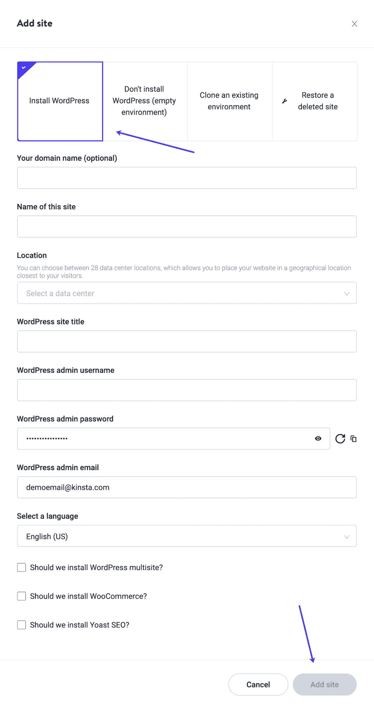

使用 MyKinsta 安装 WordPress。

## 将 Weebly 网站迁移到 WordPress 的 3 种方法

现在，您已经准备好执行迁移了。将你的网站从 Weebly 迁移到 WordPress 有三种主要方式。其中包括:

1.  手动迁移(免费 DIY)
2.  自动迁移(免费和付费插件)
3.  外包迁移(付费)

让我们一起回顾一下这三种方法。

### 手动迁移

手动将 Weebly 网站迁移到 WordPress 并不是一件困难的事情。实际上，这可能是你想要的方式，因为这是最简单的过程。你所要做的就是将内容从一个地方复制粘贴到另一个地方。

手动迁移最吸引人的地方在于，您可以确保每一部分内容都能以您想要的方式正确迁移。

这里要考虑的一件事是你目前在 Weebly 上的站点的大小。手动迁移有点耗时，因此如果您有一个大型站点，使用自动化方法或外包方法可能是一个好主意，这两种方法我们将在下面介绍。

#### 步骤 1:在 WordPress 中创建页面和文章

在你开始从 Weebly 复制粘贴内容到 WordPress 之前，如果你先创建页面和帖子，会有助于这个过程进行得更快。

这加快了这个过程，因为你不需要创建页面和文章。

有几种方法可以做到这一点；你可以一个接一个地手动创建页面和文章，或者你可以使用一个叫做[批量页面创建器](https://wordpress.org/plugins/bulk-page-creator/)的插件来更快地批量创建页面。

如果你真的想使用这个插件，那么继续在你的 WordPress 网站上安装并激活它。

一旦插件被激活，进入**设置**，然后点击**批量页面创建器**标签。

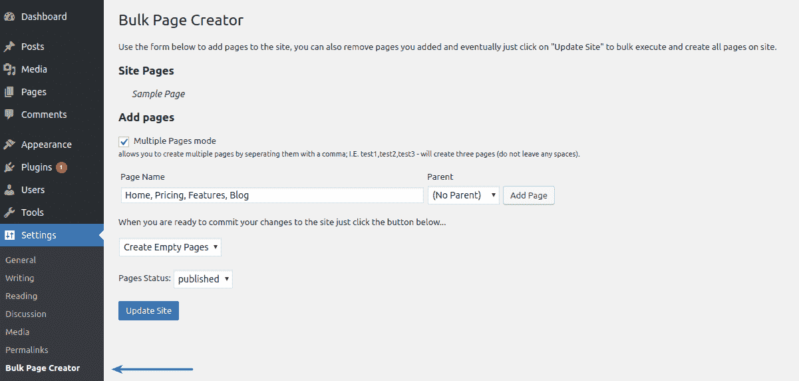

批量页面创建者插件选项。

点击**多页模式**复选框，然后输入你想要创建的每个页面的名称，并用逗号分隔。

例子: *test1，test2，test3* 等。逗号和页面标题之间不要留有任何空格。

在这个过程中，您可能还想使用另一个插件。快速批量发布&页面创建器插件允许你做与批量页面创建器完全相同的事情，除了它扩展到帖子、媒体、层级等等。

一旦你安装了这个插件，点击**工具**，然后选择**快速帖子创建器**标签。

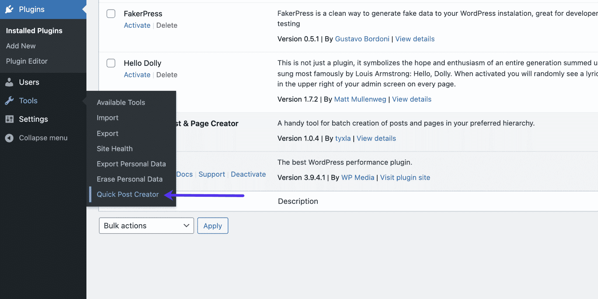

快速批量发布&页面创建器插件。

一旦进入插件选项页面，你会看到这个插件提供了更多的功能。然而，我们想用它来创建批量发布。你可以看到我们在一些帖子例子中写道。

继续创建您需要的文章标题，使用选项设置您喜欢的配置，然后当您准备好创建文章时，单击页面底部的**批量插入**按钮。

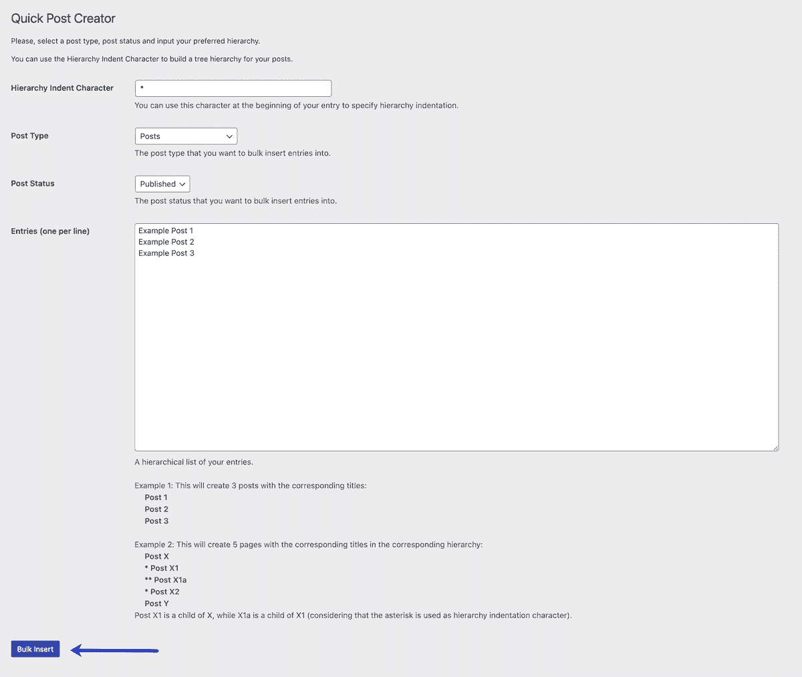

快速批量发布&页面创建器插件选项。

当您这样做时，您可以转到仪表板的**帖子**部分，看到相关的帖子已经被创建。

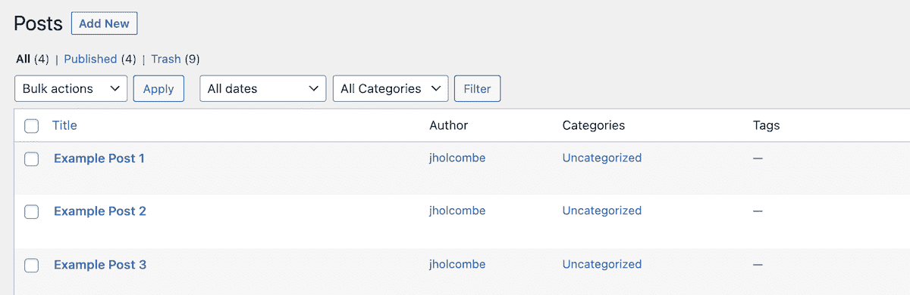

相关岗位被创建。

### 重要的

快速批量发布&页面创建插件已经有一段时间没有更新了。然而，正如你在上面看到的，我们确实测试了它，它仍然可以完美地添加大量文章和页面。

#### 步骤 2:从 Weebly 复制内容并粘贴到 WordPress

现在你已经在 WordPress 中创建了所有相关的页面和文章，是时候开始从你的 Weebly 站点复制内容并粘贴到你的新站点上正确的文章或页面上了。

这需要多长时间？嗯，这个要看你要带过来的内容量。就是这样！手动过程非常简单，但可能非常耗时。

还应该注意的是，你当然会想把所有相关的图片从 Weebly 带到 WordPress。

要做到这一点，你需要直接从你的 Weebly 网站保存图片，然后手动上传到 WordPress 媒体库。

一旦图像在你的库中，你可以简单地把它们放在正确的页面或文章中。

不要忘记修改任何内部链接，以便它们指向你的新 WordPress 站点的正确位置。

你可以为来自 Weebly 站点的每个帖子和页面手动设置，或者如果 Weebly 上的旧 URL 和 WordPress 上的新 URL 设置了特定的模式，你也可以选择使用 regex 选项。

### 自动化迁移

从 Weebly 到 WordPress 网站的自动化迁移可能会很好，因为你可以摆脱更多的手动复制和粘贴程序。然而，经常使用插件来移动这样的内容可能会让您在导入完成后需要整理一些东西。

还有一个问题是找到合适的插件，在一个地方给你所有必要的工具。

有很多插件选项可以帮助你完成这个过程。问题是其中许多都很旧了，有一段时间没有更新了。这是真的，他们中的大多数仍然工作，但对于文章的这一部分，我们想找到一些既免费又最新的东西。

## 注册订阅时事通讯

### 想知道我们是怎么让流量增长超过 1000%的吗？

加入 20，000 多名获得我们每周时事通讯和内部消息的人的行列吧！

[Subscribe Now](#newsletter)

为此，我们将使用 [Feedzy RSS 聚合器](https://kinsta.com/blog/wordpress-rss-feed/#1-feedzy-rss-feeds)插件。这个插件不仅提供了一个可靠的方法来帮助你自动化 Weebly 到 WordPress 的迁移过程，而且他们也有一个[高级版本的插件](https://themeisle.com/plugins/feedzy-rss-feeds/)。

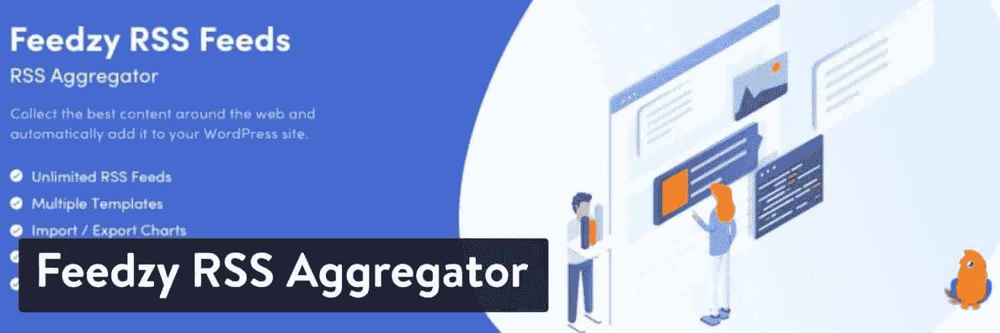

Feedzy RSS 聚合器插件。

应该注意的是，我们使用这个插件的免费版本来执行 posts 迁移过程。如果你想要更多的功能，那么请随意使用高级版本，看看它是否能提供你需要的东西。

让我们用这种更自动化的方法把你的网站从 Weebly 转移到 WordPress。

#### 步骤 1:安装并激活 Feedzy 插件

在你的 WordPress 仪表盘中，点击**插件**，然后**添加新插件**，进入插件安装区。这将把你带到需要搜索 Feedzy 插件的地方。

继续使用可用的搜索字段搜索 Feedzy。当你看到它，安装并激活它的权利，从您的仪表板。

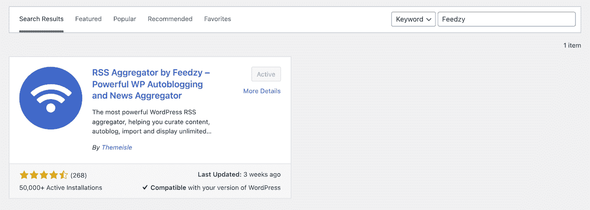

为 Feedzy 搜索插件库。

既然插件已经安装并激活，您就可以使用它提供的功能了。我们要做的是用它来抓取你的 Weebly 网站 RSS 订阅源，并使用该订阅源在你的新 WordPress 站点上创建帖子。

#### 第二步:找到“导入文章”标签

激活 Feedzy 后，在你的 WordPress 仪表盘中找到主标签并点击它。从那里，你需要点击 **Import Posts** 标签来创建一个新的导入，并从你的 Weebly 站点获取文章。

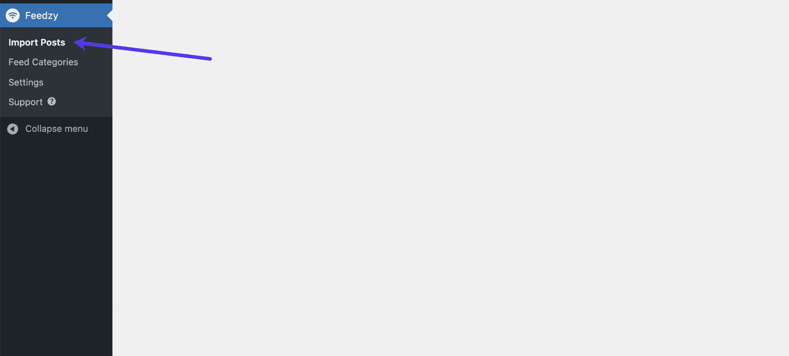

找到【导入帖子】标签页。

进入该部分后，点击页面顶部的**新导入**按钮。这将带你到 Feedzy 的主要配置选项，并允许你导入 RSS 提要到你的网站。

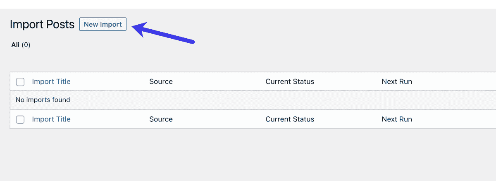

点击【新建导入】按钮。

#### 步骤 3:从 Weebly 导入文章到 WordPress

此时，您已经到达了插件的主导入页面。你将使用这个页面直接从 Weebly 导入 feeds 到你的新 WordPress 网站。

继续为您的导入命名。该名称可以是与提要相关的任何名称，也可以是您想要的任何名称。请记住，如果需要，您可以一次引入多个提要。

您希望将 Weebly 站点的提要 URL 直接放入标记为“Source”的字段中。如果您想知道 Weebly feed 的 URL 到底是什么，它通常是以下之一:

*   *https://yourdomain.com/1/feed*
*   *https://yourdomain.com/feed*
*   *https://yourdomain.com/rss*

在那里，填写你认为合适的设置和配置。请记住，不是每个提要设置看起来都一样。您如何完成这部分过程在很大程度上取决于您的配置。

这是你将要看到的布局。您可以看到有些选项不可用，因为它们只是高级版的一部分。

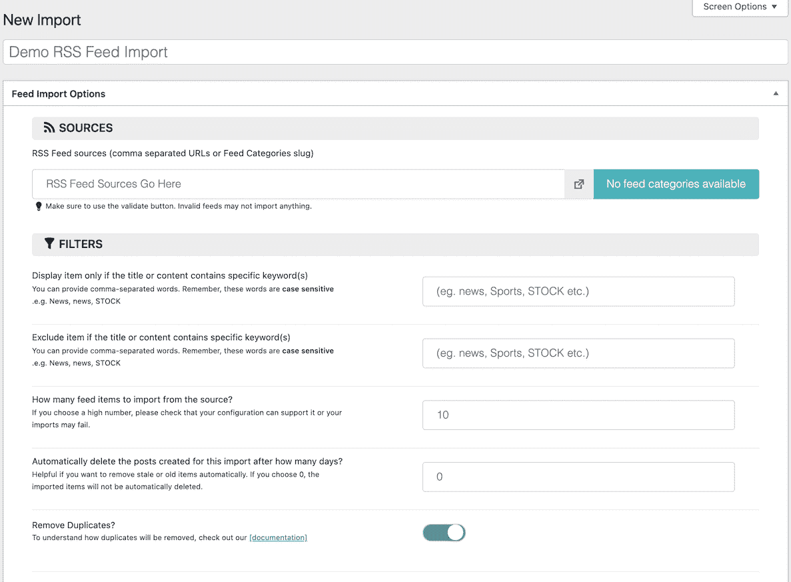

命名您的导入并填写 RSS 源。

您可以继续向下滚动并分配更多元素。

与我们世界一流的支持团队一起体验卓越的 WordPress 托管支持！与支持我们财富 500 强客户的同一个团队聊天。[查看我们的计划](https://kinsta.com/plans/?in-article-cta)

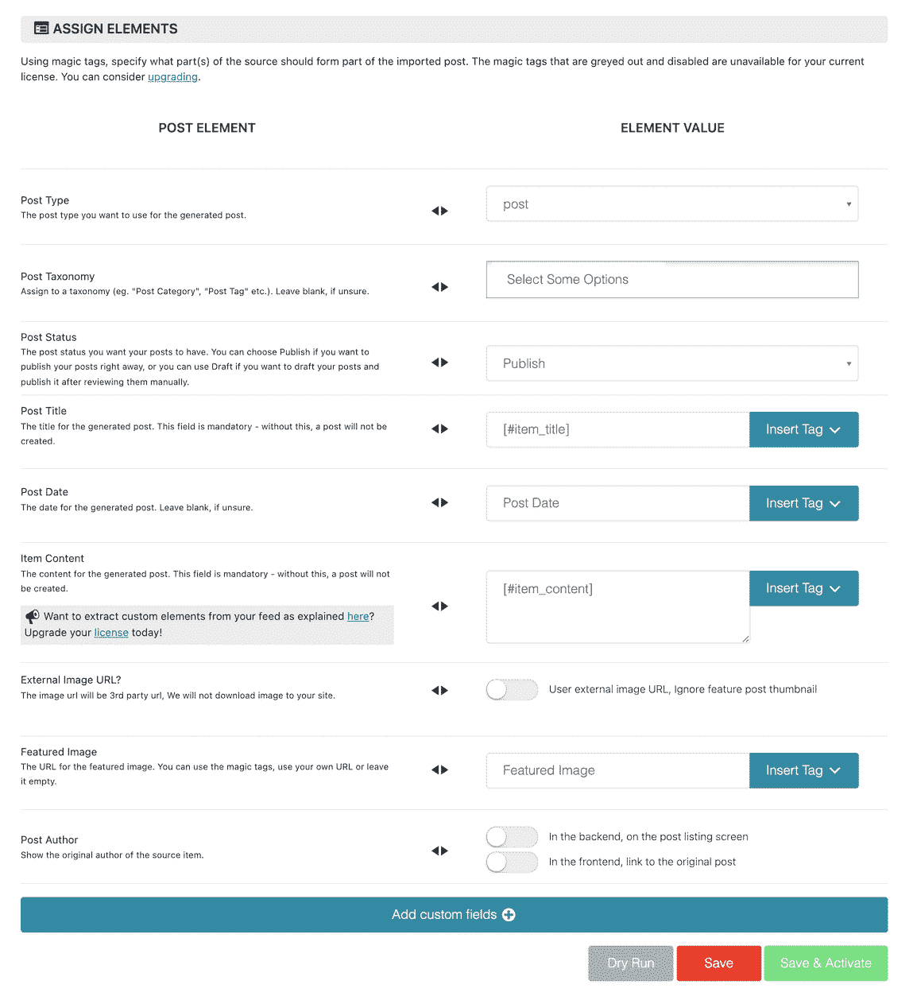

赋予更多的元素。

当您按照自己的意愿填写完所有选项后，就可以点击页面右下角的保存并激活按钮了。

这将自动导入提要，并带您回到“Import Posts”部分。

在这里，您将看到从您选择的提要中找到并导入了什么。

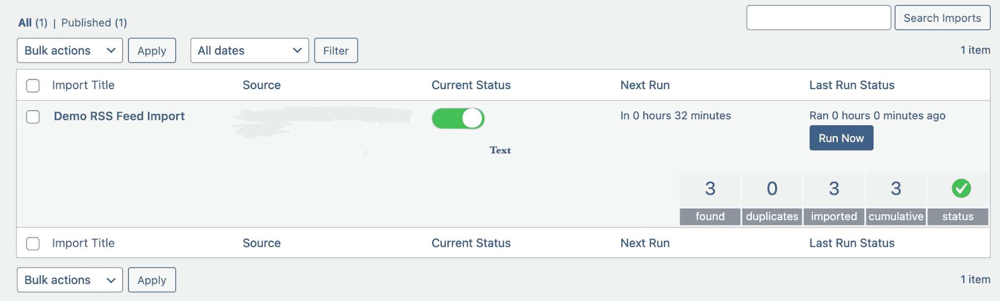

查看您的导入。

#### 步骤 4:导入页面和图像

和手工方法一样，从 Weebly 导出页面和图片到 WordPress 的方式也不同，因为页面不包含在 RSS 提要中。

这里有几个选项，取决于你的页数。你可以使用我们上面谈到的复制粘贴方法来完成你的页面，或者你可以使用几个不同的插件来完成这个任务。

如果您需要使用插件方法，请访问您的 Weebly 网站并将页面导出为 HTML 文件。你也可以请求他们的支持来帮你做这件事，尽管你可能要等几天才能得到回复。

一旦你有了 HTML 格式的页面，你就可以使用像 [HTML Import](https://wordpress.org/plugins/import-html-pages/) 这样的插件将这些页面文件导入你的 WordPress 站点。

你可以随意手动保存这些图片，然后上传到你的 [WordPress 媒体库](https://kinsta.com/blog/wordpress-media-library/)中。

您还可以通过 FTP 或 SFTP 批量上传文件。如果你熟悉这个选项，会节省一些时间。

### 重要的

Kinsta 只使用 SFTP，但其他一些主机仍然使用 FTP。点击了解主要差异[。](https://kinsta.com/knowledgebase/ftp-vs-sftp/)

### 将 Weebly 外包给 WordPress 迁移

还有一种方法可以轻松地从 Weebly 迁移到 WordPress，几乎没有任何麻烦。如果你有兴趣外包项目，那么这是一个很好的方法。

有几个网站提供优秀的 Weebly to WordPress 迁移服务。这允许你输入一些信息，然后坐下来让他们帮你处理。

我们有两个很好的建议给你。

#### CMS2CMS

CMS2CMS 是一个自动化的服务，让你能够从任何平台迁移到 WordPress。

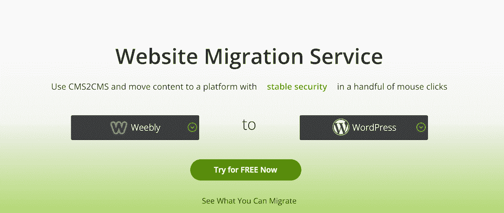

CMS2CMS。

它们提供了一个轻松、流畅、完全自动化的过程。尽管这是一项高级服务，但它提供了免费的演示迁移，可以传输有限的内容。这样，您就可以确切地看到它是如何工作的，以及这个过程有多简单

CMS2CMS 还提供了一个免费的迁移计算器，您可以相当快速地填写并通过几次点击获得迁移成本。

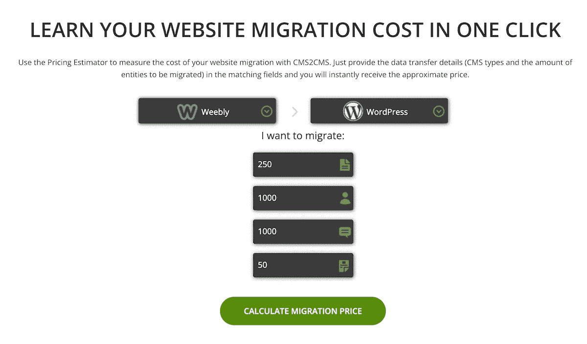

CMS2CMS 迁移计算器。

如果你想免费尝试有限的过程，那么[在他们的网站](https://app.cms2cms.com/auth#sign-up)上注册一个账户，通过他们的一步一步的过程，看看它是否适合你。

#### 单词爱好者

将 Weebly 外包给 WordPress 站点迁移的另一个好选择是[wordheed](https://kinsta.com/partners/wordherd/)。

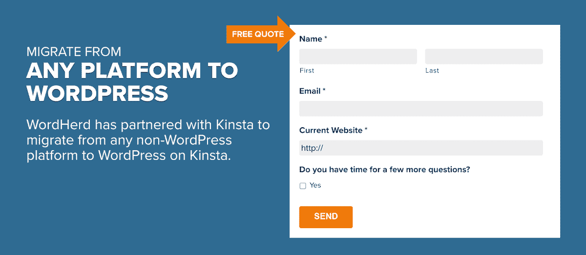

他们提供全方位的迁移服务，允许你从任何平台直接迁移到 WordPress。

不管你的网站是大是小。WordHerd 与从小企业网站到大公司的所有人合作。

要开始免费报价 Weebly 到 WordPress 的迁移，[访问他们的网站](https://wordherd.io/partners/kinsta/)并填写“免费报价”表格。

尽管我们喜欢自己动手，但有时(根据具体情况)简单地外包迁移可能会更好。是的，你会付出一些，但这是一个有保证的过程，可以让你设置和运行比手动和自动过程更快。

## 迁移后

无论您选择哪种方法，在迁移过程完成后，都有一些事情需要考虑。

### 主题和插件

WordPress 有适合任何利基市场的主题，所以去挑选一个用在你的新网站上。你可以[安装](https://kinsta.com/blog/how-to-install-a-wordpress-theme/)和[定制](https://kinsta.com/blog/how-to-customize-wordpress-theme/)你想要的。这些主题使设计变得更加容易，并且非常用户友好。是的，可能会有一个轻微的学习曲线，但在你经历了一些事情后，你应该没有问题建立和设计你的新网站。

反过来，WordPress 也有一个庞大的插件库。你可以下载并安装任何插件来扩展你网站的功能。一定要包括[现有的最好的 WordPress 插件](https://kinsta.com/best-wordpress-plugins/)，因为这些将有助于增强你的网站。

### 永久链接

确保你的永久链接结构是你想要的也很重要。你可以在你的 WordPress 仪表盘中访问永久链接，并设置成你想要的样子。

我们知道在使用 WordPress 永久链接时需要考虑很多事情，所以这本[WordPress 永久链接终极指南](https://kinsta.com/blog/wordpress-permalinks/)会有所帮助。

### 指向您的 DNS

最后但同样重要的是，如果你还没有这样做，你的最后一项任务是将网站 DNS 从 Weebly 转移到你的托管平台上。 [Kinsta 让这个过程变得简单](https://kinsta.com/help/dns/#how-to-configure-kinsta-dns-for-your-domain)。

一旦这样做了，你就有机会马上把网站推出来，或者在推出之前，在一个[临时环境](https://kinsta.com/help/staging-environment/)上工作，让网站达到你想要的位置。

[当你的基本 Weebly 设置已经无法满足你的需求，又不想升级你的计划时，会发生什么？👀你当然会迁移到 WordPress！😄](https://twitter.com/intent/tweet?url=https%3A%2F%2Fbit.ly%2F3jMcDhI&via=kinsta&text=What+happens+when+you+outgrow+a+basic+Weebly+setup+and+don%27t+want+to+upgrade+your+plans%3F+%F0%9F%91%80+You+migrate+to+WordPress%2C+of+course%21+%F0%9F%98%84&hashtags=Weebly%2CWordPress)

## 摘要

将一个网站从 Weebly 迁移到 WordPress 并不一定是一个过于复杂的过程。然而，根据内容的数量以及你可以使用的插件和工具，这可能是一个更加紧张的过程。

这就是为什么我们提供了三种方法来执行这个过程。因此，在手动、自动和外包选项之间，您应该能够找到适合您的方法。

你更喜欢用哪种方式将你的网站从 Weebly 迁移到 WordPress？请在评论区告诉我们！

* * *

让你所有的[应用程序](https://kinsta.com/application-hosting/)、[数据库](https://kinsta.com/database-hosting/)和 [WordPress 网站](https://kinsta.com/wordpress-hosting/)在线并在一个屋檐下。我们功能丰富的高性能云平台包括:

*   在 MyKinsta 仪表盘中轻松设置和管理
*   24/7 专家支持
*   最好的谷歌云平台硬件和网络，由 Kubernetes 提供最大的可扩展性
*   面向速度和安全性的企业级 Cloudflare 集成
*   全球受众覆盖全球多达 35 个数据中心和 275 多个 pop

在第一个月使用托管的[应用程序或托管](https://kinsta.com/application-hosting/)的[数据库，您可以享受 20 美元的优惠，亲自测试一下。探索我们的](https://kinsta.com/database-hosting/)[计划](https://kinsta.com/plans/)或[与销售人员交谈](https://kinsta.com/contact-us/)以找到最适合您的方式。