# 如何使用各种可能的方法在 WordPress 中编辑页脚

> 原文：<https://kinsta.com/blog/how-to-edit-footer-in-wordpress/>

由于 WordPress 页脚非常有用，在某些时候，你必须了解页脚，它是如何工作的，编辑它有什么可能，以及如何删除与你的品牌无关的预设页脚内容。这就是为什么我们想向你展示如何在 WordPress 中编辑页脚，以及页脚的好处和内容的完整解释。

网站页脚包含任何不适合网站主菜单的信息由来已久。从链接到支持文档和社交媒体页面，各种元素在页脚中表现得相当不错。

我们开始吧！

### 查看我们的[视频指南](https://www.youtube.com/watch?v=wbadPVTyYRg)来编辑 WordPress 页脚


## 什么是 WordPress 页脚？

页脚不是 WordPress 独有的。大多数网站建设者和[内容管理系统](https://kinsta.com/knowledgebase/content-management-system/)提供包括页脚的能力。然而，WordPress 提供了其独特的页脚功能，以及一个预设的页脚设计，通常伴随着你安装的的[主题。](https://kinsta.com/knowledgebase/what-is-a-wordpress-theme/)

WordPress 页脚位于你网站的底部。这是一个静态的内容区域，显示在页面的最底部，与用户登陆的页面无关。虽然不像页眉那样被访问，但页脚仍然非常重要，为用户提供社交媒体按钮、[客户支持链接](https://kinsta.com/blog/wordpress-live-chat-plugin/)和联系信息。


> 需要在这里大声喊出来。Kinsta 太神奇了，我用它做我的个人网站。支持是迅速和杰出的，他们的服务器是 WordPress 最快的。
> 
> <footer class="wp-block-kinsta-client-quote__footer">
> 
> 
> 
> <cite class="wp-block-kinsta-client-quote__cite">Phillip Stemann</cite></footer>

[View plans](https://kinsta.com/plans/)


An example restaurant footer menu.


总的来说，如果你在 WordPress 上做一个网站，你可以期望在你的设计中默认放置一个页脚。WordPress 的系统内置了一个核心文件，专门用来管理页脚(**footer.php**)。

页脚有各种形状和大小，您可以编辑它们以包括不同的颜色、字体和背景。您还可以在页脚中插入内容元素，比如博客文章列表、安全徽章，甚至是[表单](https://kinsta.com/blog/wordpress-forms/)和图像。

[网站页脚:极其有用，但编辑起来可能会令人困惑。🥴在这里了解如何入门⬇️ 点击推文](https://twitter.com/intent/tweet?url=https%3A%2F%2Fkinsta.com%2Fblog%2Fhow-to-edit-footer-in-wordpress%2F&via=kinsta&text=Website+footers%3A+extremely+useful%2C+but+potentially+confusing+to+edit.+%F0%9F%A5%B4+Learn+how+to+get+started+here+%E2%AC%87%EF%B8%8F&hashtags=WordPress%2CWPTips)

页脚就像是整个网站的结论。它为那些对你的内容感兴趣并深入挖掘的人展示了重要的链接和信息。最后，页脚完成了网站的整体设计，就像幻灯片演示中的最后一张幻灯片或演讲的结论。

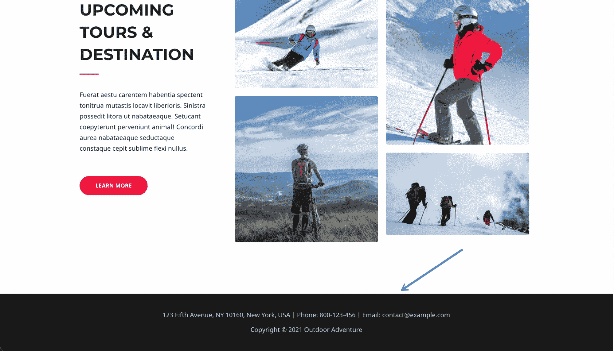

A footer with contact and copyright information


## 拥有(和编辑)WordPress 页脚的理由

很容易忘记页脚，或者把它作为你设计的最后一项。许多人甚至想去掉他们的页脚，因为他们认为它们没有多大价值。这不是最棒的计划。页脚是有价值的，即使它没有你的主菜单或主要内容区域被浏览或点击的多。

为了让你了解页脚的价值，这里列出了拥有页脚的所有理由，并学习如何在 WordPress 中编辑页脚以适应你的品牌。

*   WordPress 页脚提供了一个静态模块，显示在你网站的每一页上，使得它比一个标准的页面更容易被看到，当有人点击时，这个页面就会消失。
*   它完成了网站的设计，包括视觉上的和在你的 WordPress 文件中的。它告诉 WordPress 在哪里结束它的代码，并向用户指示内容何时结束。更不用说，它有助于更干净的界面。
*   许多互联网用户都希望页脚中有特定的链接和内容，所以他们会直接到页脚去找。想想支持链接和[社交媒体按钮](https://kinsta.com/blog/wordpress-social-media-plugins/)。
*   页脚提供了更多的[转化和参与机会](https://kinsta.com/blog/conversion-rate-optimization-tips/)，就像一篇博文结尾的行动号召。您可以添加表单、指向其他内容的链接，甚至是公司标语。
*   这是一个包含重要链接的地方，这些链接可能不会出现在主菜单中。

既然我们知道了使用页脚的好处，那么在页脚放置什么这个大问题就开始起作用了。所有的主题都是不同的，但是在安装一个新的主题后，经常会在页脚看到“由 WordPress 提供支持”的信息。

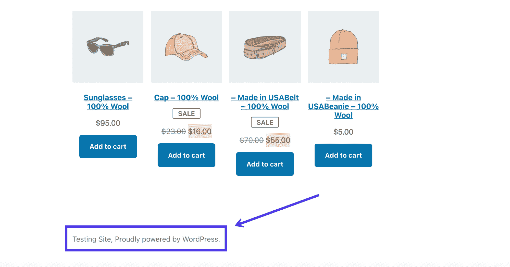

The “Powered By WordPress” credit.


其他时候，主题开发者可能会包括他们自己的预制设计或关于主题制作者的信息。

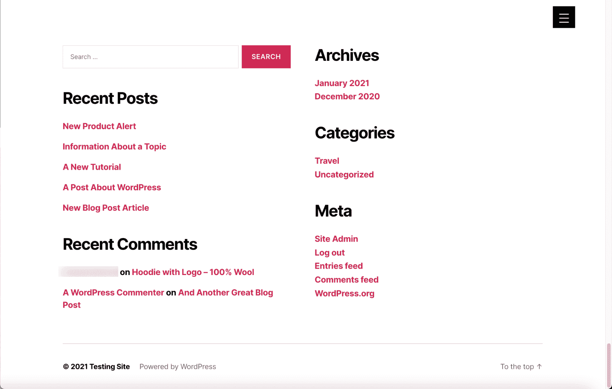

A simple default footer in a free theme.


这些都不错，但目标是定制你的 WordPress 页脚，链接到你有价值的页面，包括与你的品牌相关的内容，并清除默认内容，如来自主题开发者或 WordPress 的消息。同样明智的做法是调整样式，用定制的字体和颜色来匹配你的品牌。

那么，在你的 WordPress 页脚中应该放些什么呢？

*   供用户订阅您的时事通讯消息或博客更新的表单
*   链接到客户支持资源，如[FAQ](https://kinsta.com/blog/wordpress-faq-plugins/)、知识库文章和论坛
*   下载应用程序和播客等数字产品的图标链接
*   即将到来的事件列表
*   最近的博客文章列表
*   忠诚度链接和[附属计划](https://kinsta.com/knowledgebase/affiliate-program-vs-agency-partner-program/)
*   链接到信息页面，如关于我们或职业页面
*   徽章和图标，以提升您的声誉、过去的奖项或网站安全性
*   链接到页面的社交媒体图标
*   一个[完整的网站地图](https://kinsta.com/blog/wordpress-sitemap/),让你在整个网站上更容易导航
*   版权声明、[隐私政策](https://kinsta.com/podcast/privacy-conscious-hosting-provider/)以及条款和条件等法律声明
*   联系信息，如您的地址、位置、电话号码和营业时间，或一份[联系表](https://kinsta.com/blog/wordpress-contact-form-plugins/)
*   用于改进导航的[搜索框](https://kinsta.com/blog/wordpress-search/)
*   任何其他不适合你的主菜单，但仍然需要在你的网站上的位置的附加页面

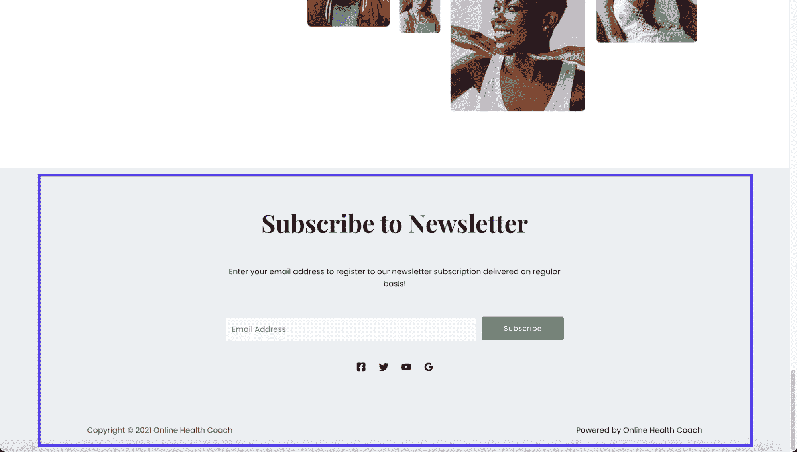

Footer with an email subscription form, social buttons, and copyright information


## 如何在 WordPress(自托管版本)中编辑页脚

编辑一个[WordPress.org(自托管)网站](https://kinsta.com/blog/wordpress-com-vs-wordpress-org/)的页脚有一些技巧。在接下来的章节中，我们将讨论使用主题定制器、小部件、插件和代码在 WordPress 中编辑页脚。作为奖励，我们将讨论如何用一个可视化的页面构建器，比如 Elementor 来管理 WordPress 页脚。

### 用主题定制器编辑 WordPress 页脚

编辑 WordPress 页脚最快最有效的方法是利用[内置的 WordPress 主题定制器](https://kinsta.com/blog/how-to-customize-wordpress-theme/#customizing-your-theme-via-the-customizer)。主题定制器的设置根据你选择的主题而变化，但是定制器本身总是位于 [WordPress 仪表盘](https://kinsta.com/knowledgebase/wordpress-admin/)上的准确位置。

要开始这个过程，请到仪表板，点击**外观**，然后点击**主题**。

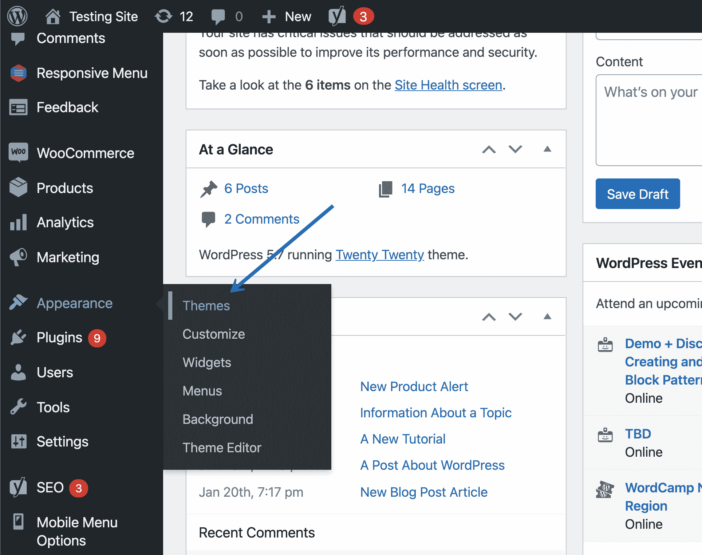

The Themes button in WordPress.


然后，点击当前活动主题下方的**自定义**按钮。

随意地[交换主题](https://kinsta.com/blog/change-wordpress-theme/)来看看页脚如何从一个主题变化到另一个主题。


Customize your active theme.


作为一个稍微快一点的选择，你也可以点击**外观>定制**，这将直接把你带到活动主题的 WordPress 主题定制器。

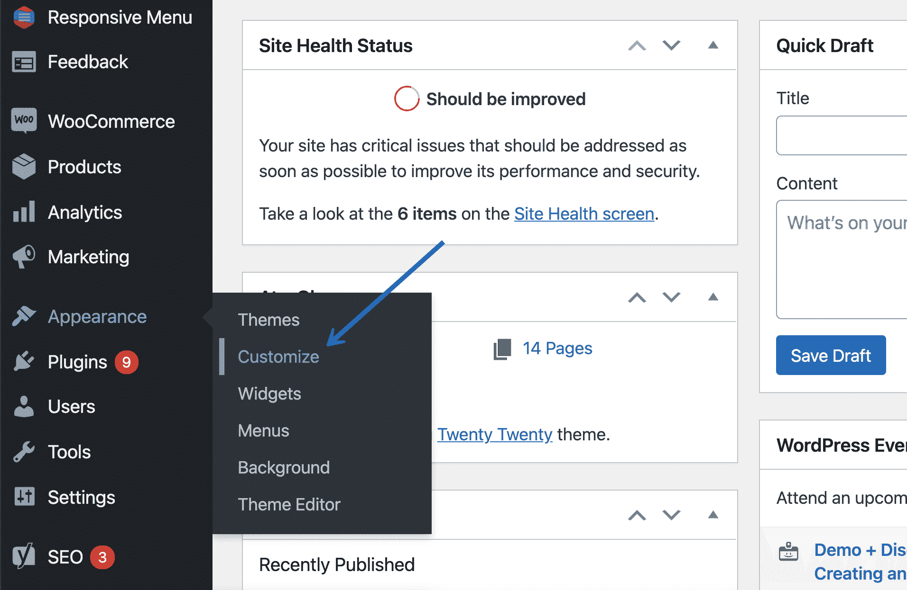

Click the Customize button.


WordPress 主题定制器在右边显示了你的网站的视觉效果，在左边显示了几个菜单项，这些菜单项可以引导你进行设置和定制工具。同样，每个主题都有不同的定制选项，所以你的屏幕看起来可能会和我们的截图有些不同。

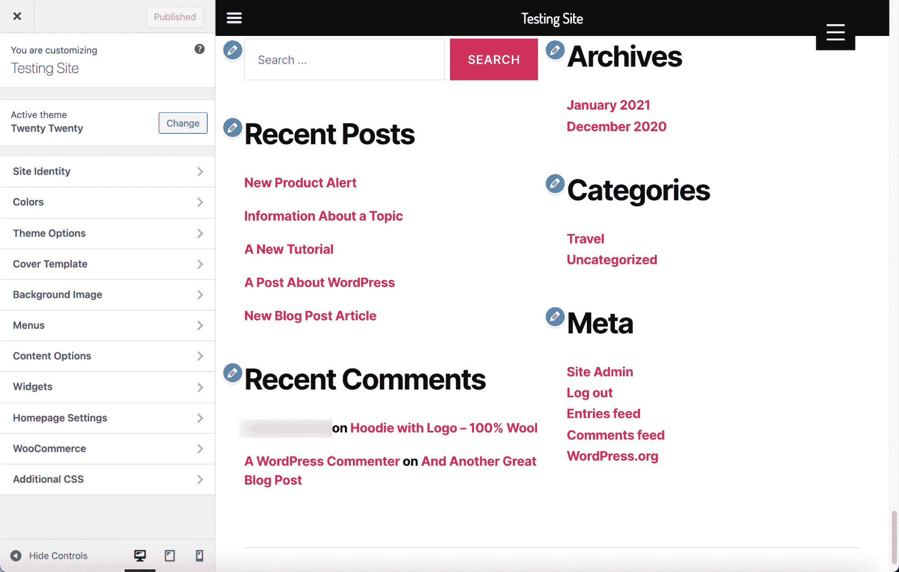

The Theme Customizer with footer in view.


一个开始定制页脚的好地方是[和颜色](https://kinsta.com/blog/website-color-schemes/)。

我们当前的主题有一个**颜色**按钮，可以很容易地识别我们需要去哪里。

选择**颜色**按钮，如果你的主题中有这个按钮的话。

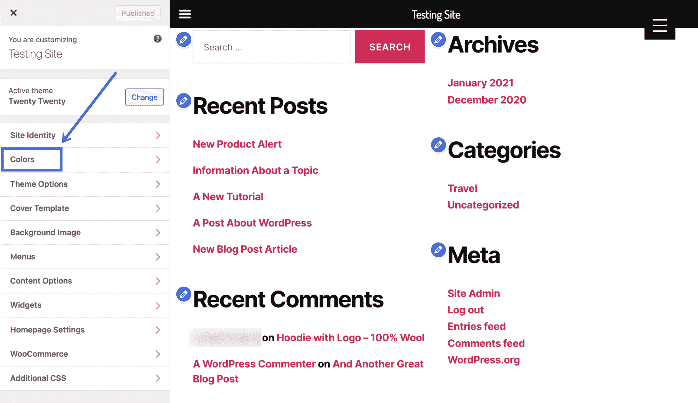

The Colors tab.


选择**页眉页脚背景色**字段下的**选择颜色**按钮。

使用颜色选择器测试所有类型的颜色，看看哪些颜色与您的品牌相匹配，哪些颜色在页面末尾看起来不错。

有了这个特殊的主题，任何颜色修改实际上也调整了字体颜色，使它们看起来清晰，不管背景颜色是什么。

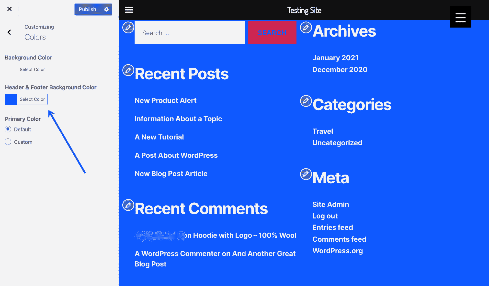

Select a Header and Footer Background Color.


正如你所看到的，深色的 WordPress 页脚会自动改变链接、标题和段落文本的字体颜色，这样你就不需要自己动手了。

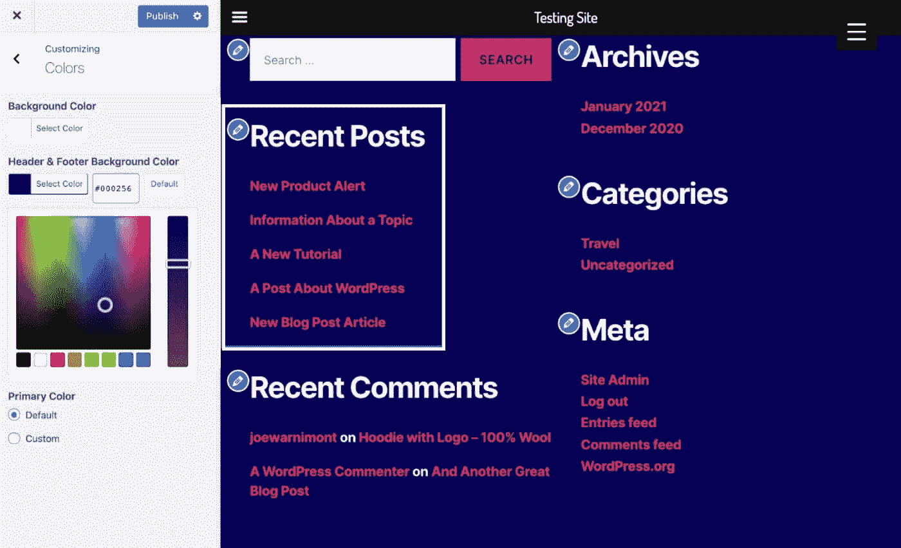

The text changes colors when you modify the background color in this theme.


现在让我们尝试另一个主题。在这种情况下，我们将 [Twenty Twenty 主题](https://kinsta.com/blog/twenty-twenty-theme/)替换为 Storefront 主题。

果然，Storefront 主题的 WordPress Customizer 显示了 Twenty Twenty 主题中没有显示的按钮。

因此，你的主题决定了你在 WordPress 定制器中对页脚的控制程度。在这方面，有些主题比其他主题更好。

对于店面主题，我们有一个**页脚**标签。点击它，看看有什么可以定制页脚。


The Footer tab in the Storefront theme


与之前的主题不同，Storefront 不会在您调整背景颜色时自动更改文本和链接颜色。但是，您可以自己控制所有这些颜色，包括**背景颜色**、**标题颜色**、**文本颜色**和**链接颜色**字段。

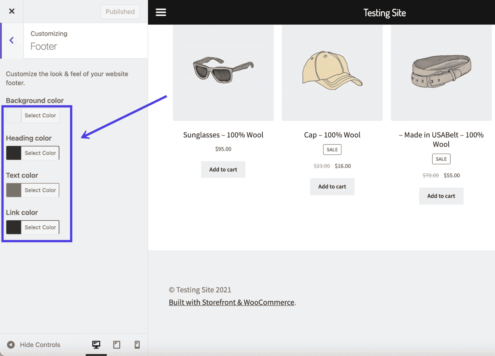

Footer color settings.


页脚颜色设置

在我们的 WordPress 页脚预览中快速选择显示结果。在这之后，你应该点击**发布**按钮，在前端看到新的页脚颜色。

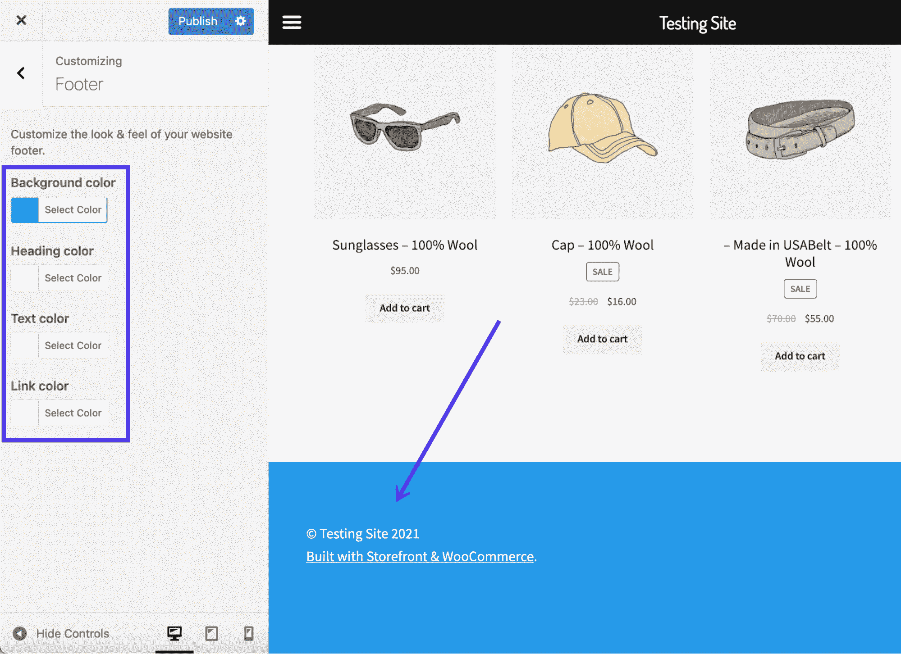

A new background and text color in the WordPress footer.


但是页脚中默认呈现的链接和文本元素呢？

同样，调整页脚内容的主要方法是在 WordPress 定制器中。在接下来的部分中，我们将解释如何使用两种方法在页脚中添加和删除文本和链接内容:作为菜单项和作为小部件。

### 向你的 WordPress 页脚添加小部件

编辑页脚内容的一种方法是添加小部件。WordPress widgets 有很多功能，还有几个位置，包括侧边栏和页脚，如果你的主题支持的话。

回到 WordPress 定制器，寻找**窗口小部件**标签。

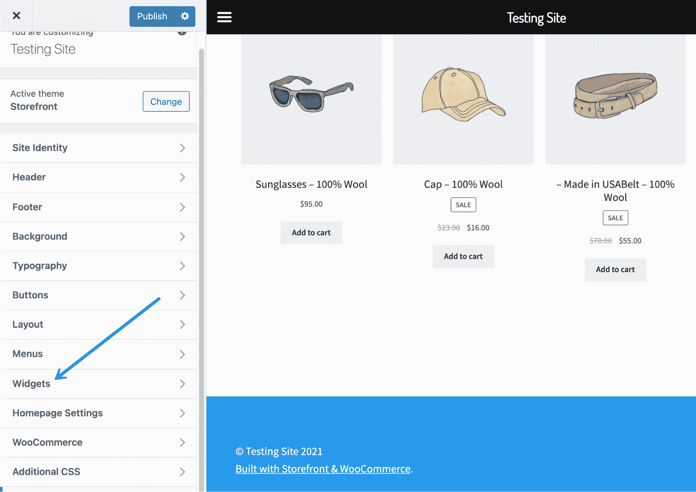

The Widgets tab.


仔细阅读列表，在您的网站上放置 widgets。您可能会看到边栏、顶部菜单和底部菜单等区域的选项。希望您的主题还包括页脚，作为放置小部件的区域。如果没有，还有其他方法来编辑你的页脚，但是如果你更喜欢使用小部件，考虑切换到一个不同的主题，允许在页脚中使用小部件。

这个主题实际上在页脚提供了四个小部件位置，并排排列在四列中，以形成一个尽可能适合页脚内容的漂亮格式。

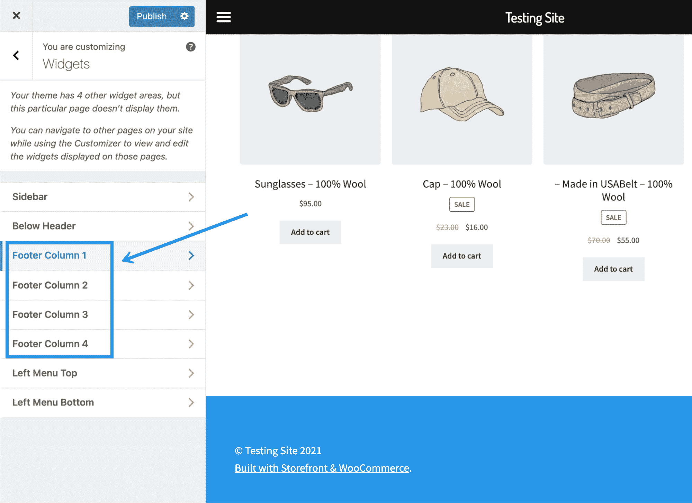

Choose a footer column.


点击任何页脚微件位置，显示一个区域，用于**添加微件**。点击那个按钮来显示 WordPress 和主题上所有可用部件的幻灯片视图。再一次，你可能会看到一组完全不同的小部件，考虑到一些主题包含他们自己的小部件，或者你可能已经安装了[扩展或插件](https://kinsta.com/knowledgebase/how-to-install-wordpress-plugins/)来添加更多的小部件到你的仪表板。

常见的小部件从档案到音频，从定制 HTML 到产品过滤器。

您所要做的就是选择要添加到这个特定小部件区域的小部件。它们将显示在左侧，供您重新组织和配置它们的单独设置。

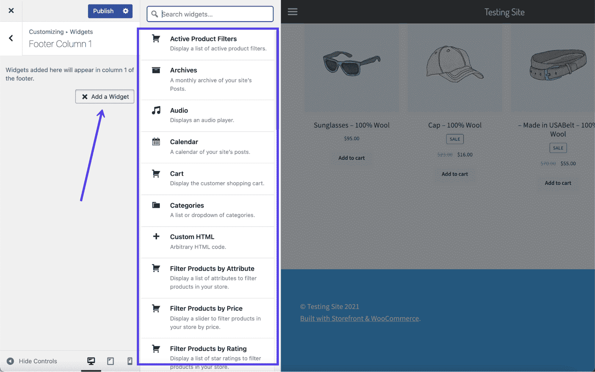

Scroll through the list of widgets.


经过一些快速的工作，我们已经在三个页脚列模块中放置了几个小部件，包括一个主菜单、一个最近帖子的列表和一些我们商店的产品。您还会注意到，我们添加了一个搜索栏，让用户的导航更加容易。

需要注意的一个重要方面是小部件设置部分。每个小部件在左侧都有自己的设置，所以请确保浏览这些字段，并使它们看起来完全符合您的需要。

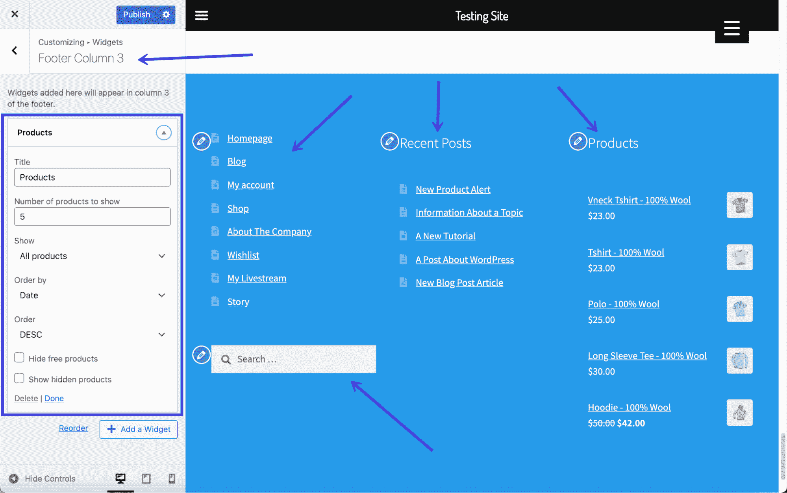

A completed WordPress footer with several widgets.


正如你在浏览主题设置时可能了解到的，并不是所有的主题都可以使用标准的**添加菜单**设置直接在页脚区添加菜单。例如，我们的主题有激活主菜单、次菜单、手持菜单和移动菜单的点，但是没有激活页脚的点。

我们将在下一节介绍菜单，但是我们想解释一个快速的解决方法，用一个小部件添加一个菜单，以防你的主题不支持通常方式的菜单。

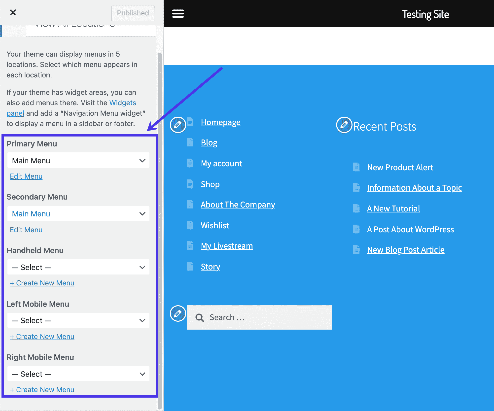

Some themes don’t have spots to put menus in footers.


本质上，您所要做的就是进入一个部件页脚模块，搜索导航菜单部件。在这里，您可以点击一个下拉字段来查看您网站上所有创建的菜单。随意为您的页脚生成一个菜单(在仪表板的**菜单**部分),并将其作为小部件添加到该部分。

或者，选择主菜单，或者你创建的任何菜单。它们都应该显示在菜单小部件下拉列表中。

之后，您选择的菜单会出现在页脚中，只要您在页脚区域添加了导航菜单小部件，并点击了 **Publish** 按钮。如果你想解释下面的链接包含什么，你甚至可以输入菜单的标题。


A Navigation Menu widget.


#### 如何将自定义文本、图像和代码作为页脚小部件插入

许多 WordPress 小部件提供预先配置的内容列表，比如最近的帖子小部件或搜索栏。

然而，有时你可能想要编辑 WordPress 页脚来包含完全自定义的内容，比如简单的文本、图像或者一些代码，来创建一些全新的东西。

WordPress 为这些都提供了一个小部件。

所有需要做的就是去**主题定制器>小部件**。然后，选择窗口小部件区域，该区域反映了您希望窗口小部件在页脚的位置。

点击**添加小部件**按钮，搜索“图像”。

添加图像小部件并自定义标题。点击**添加图片**，然后考虑添加图片链接。您可以通过点击**编辑图像**来编辑图像尺寸。

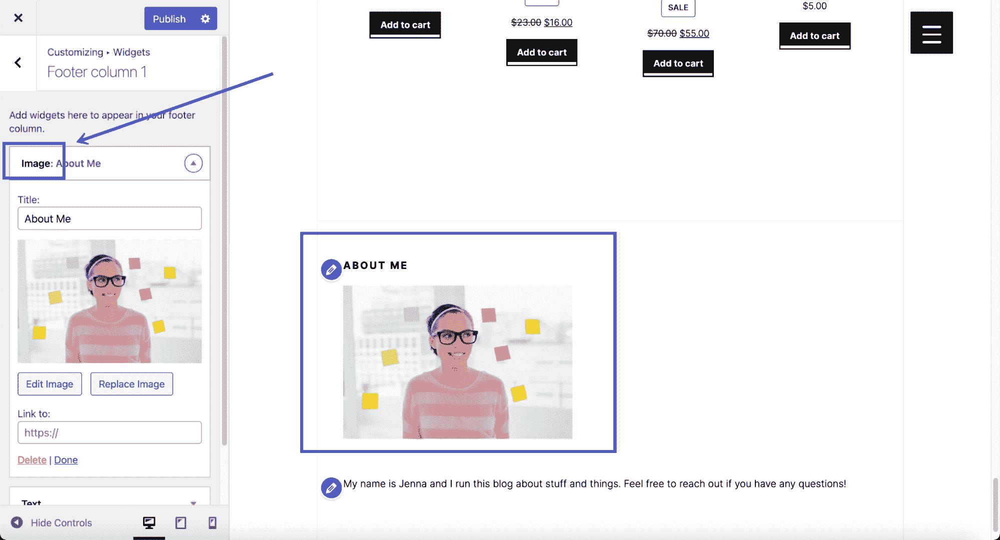

The Image widget.


接下来，在小部件库中搜索“文本”。

将文本小部件添加到您的页脚，并键入您想要的任何内容。它还有一个标题字段和一个可视化编辑器，很像你在 WordPress 中写博客文章或页面时收到的。我们尝试过通过文本小部件插入图像(因为技术上是可行的)，但是许多主题不允许这样做。


The Text widget.


最后，您可能会发现使用定制的 HTML 小部件是最好的方法，特别是如果您希望完全控制页脚设计或者为类似电子邮件注册表单这样的东西加入独特的设计。

为此，在小部件库中搜索“HTML”并选择自定义 HTML 小部件。

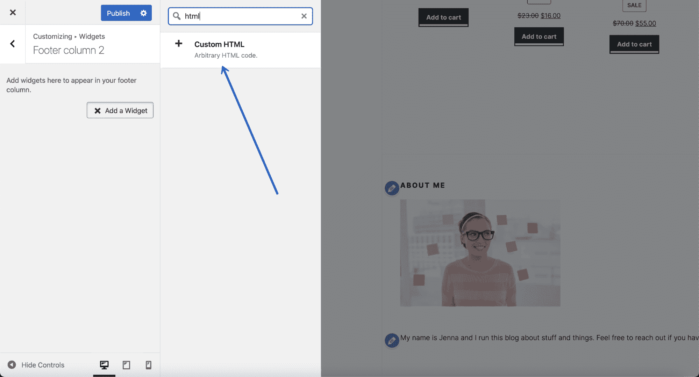

The Custom HTML widget.


粘贴或[输入你的自定义 HTML](https://kinsta.com/blog/html-vs-html5/) 并留意右边的预览，以确保它看起来像它应该的样子。你可能还需要[添加一些 CSS 样式](https://kinsta.com/blog/wordpress-css/)，让它以你想要的方式出现。

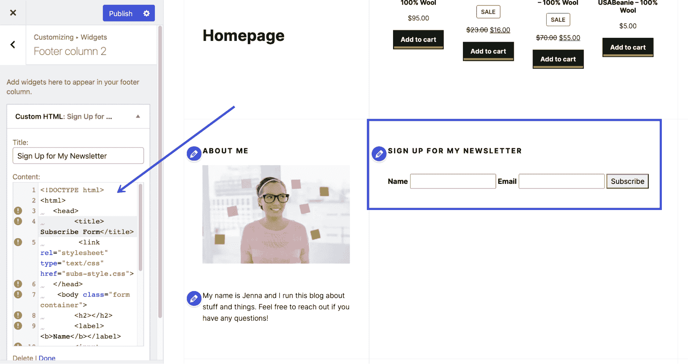

Paste HTML code into the widget.


和往常一样，记得在最后点击**发布**按钮。

### 向 WordPress 页脚添加菜单

你在 WordPress 中通过进入**外观>菜单**来制作[菜单。一旦你建立了一个菜单，它就可以添加了，至少是你选择的主题所支持的位置。](https://kinsta.com/blog/wordpress-custom-menu/)

也可以在 WordPress 定制器中创建你的菜单，所以这取决于你觉得在哪里添加新页面和链接最合适。

#### 查看我们的[视频指南](https://www.youtube.com/watch?v=EXBbc6emmus)将菜单添加到 WordPress 页脚


提醒一下，并不是所有的 WordPress 主题都允许页脚包含菜单。事实上，其中一些只有一两个菜单位置，所以你必须检查你的主题是否支持菜单。如果没有，请参考上一节，了解使用小部件在页脚中合并菜单的解决方法。

如果使用的主题允许在页脚使用菜单，那么进入 WordPress Customizer 并点击**菜单**标签。

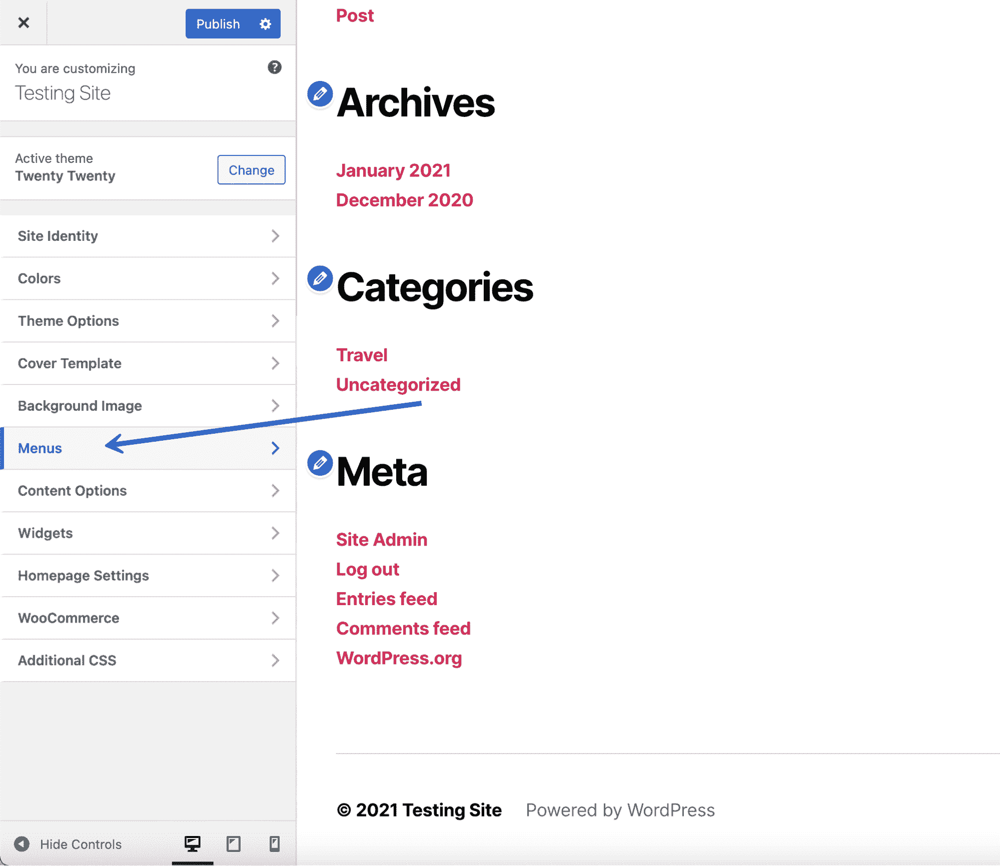

The “Menus” tab


您很可能会看到一个空菜单页面，上面有几个按钮可供选择。其中一个按钮让您选择要显示哪些菜单以及在哪里显示它们。**查看所有位置**标签共享你的主题支持的菜单。

最后， **Create New Menu** 按钮与仪表板中的标准菜单创建面板非常相似，只是它不要求您退出定制器。

点击**创建新菜单**按钮。如果您已经准备好了菜单，您可以通过前往**查看所有位置**将其添加到页脚。

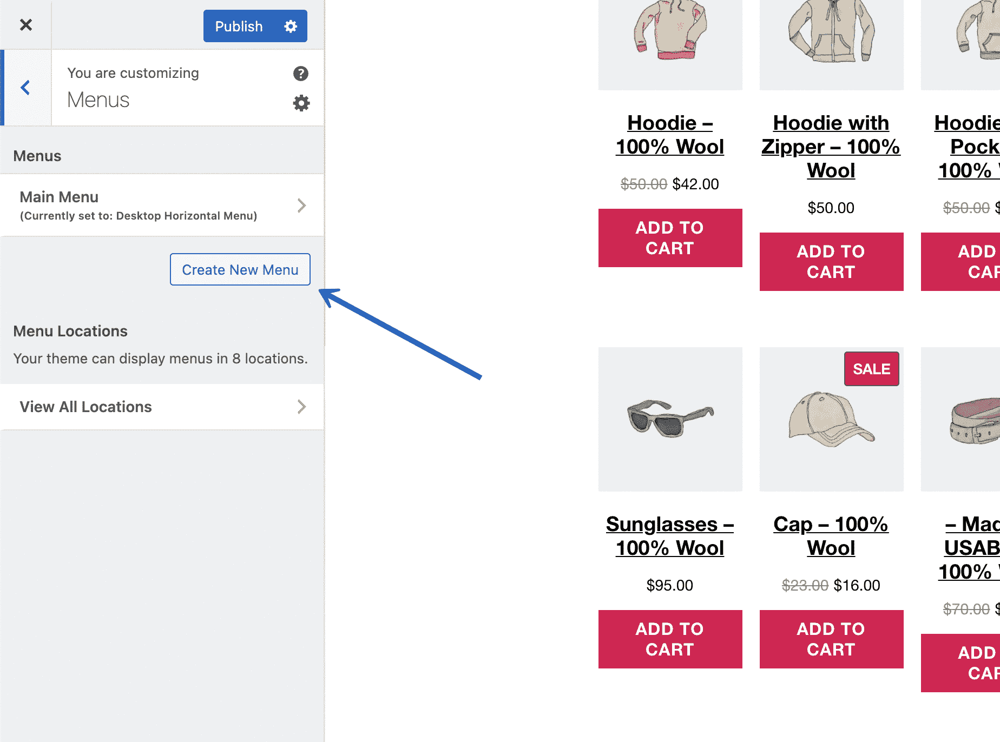

“Create New Menu” button


命名你的菜单(在这种情况下，我们将使用明显的页脚名称)并选中名为**页脚菜单**的框。这告诉 WordPress 你希望你创建的**页脚**菜单出现在**页脚**位置。它们是分开的东西。一个是实际的菜单，另一个是菜单所在的网站区域。如果你觉得页脚菜单有点混乱，你可以改变它的名字。

点击面板底部的**下一个**按钮继续。

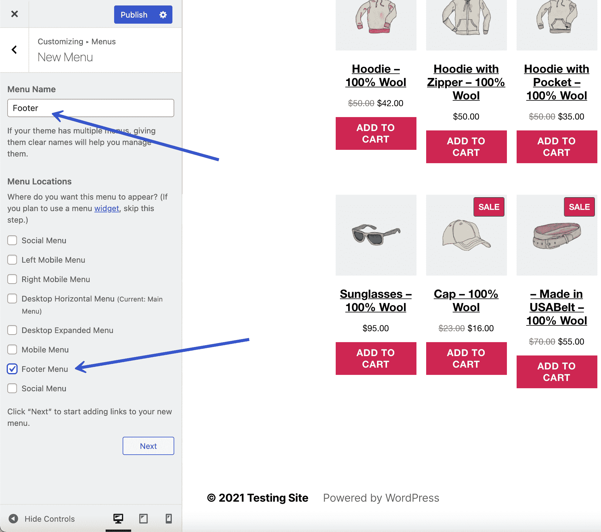

Add the Footer Menu.


现在你有了一个名为 **Footer** 的菜单，但是它缺少任何按钮或链接来使它成为一个真正的功能菜单。

点击**添加项目**按钮，开始在菜单中放置页面链接和按钮。

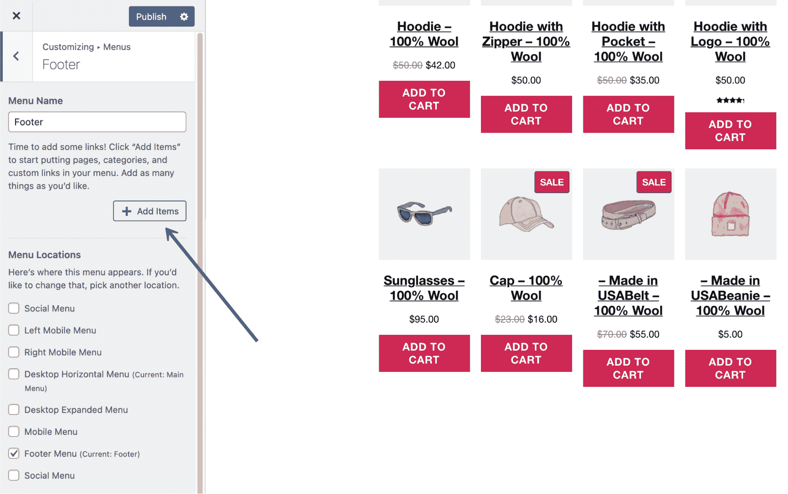

The Add Items button.


将出现一个新的滑出式面板，其中包含要添加到菜单中的所有选项。例如，您可以包含指向内部或外部页面、博客帖子、您自己站点的页面(已创建的页面)、产品、标签和类别的自定义链接，以及您可能拥有的任何其他类型的内容页面。

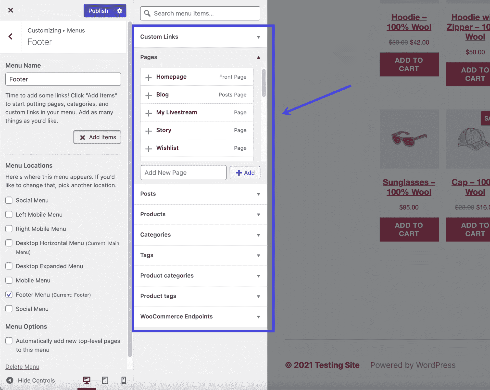

Add pages and other elements to the menu.


你选择的每一个菜单项都会显示在菜单面板中，在这里你可以重新组织它们，点击每一个菜单项来编辑它们各自的设置。对于这个例子，我们在整个网站上添加了五个页面链接，包括博客、一个直播页面和一个关于公司的页面。

请参考本文开头的列表，了解在页脚中应该包含哪些内容。

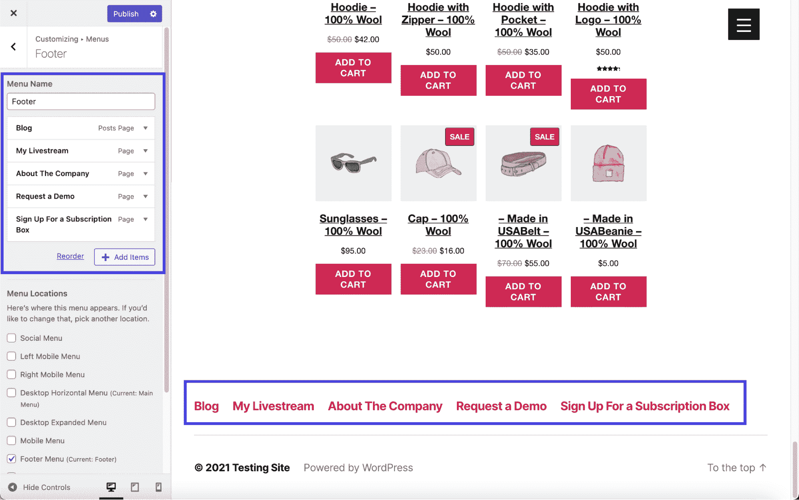

An example of a menu inside the footer.


### 使用插件在 WordPress 中编辑页脚

WordPress 已经有内置的工具来修改你的页脚，但是你能在多大程度上编辑你特定网站的页脚取决于你选择的主题，以及你是否想弄乱任何代码。

#### 查看我们的[视频指南](https://www.youtube.com/watch?v=A4lvU89RrUY)中的最佳页脚插件


正如您将在本文中进一步了解到的，删除默认的“Powered By”文本需要您进入**footer.php**文件并删除一些代码。因此，很明显，如果您没有经验或不愿意修改代码或寻找新主题，页脚编辑的几个方面可能会超出您的能力范围。

这就是 WordPress 插件发挥作用的地方。相当多的插件提供了页脚编辑和扩展功能，以消除手动编辑代码的需要，有时还可以对页脚进行快速更改，如颜色和列。

我们推荐的 WordPress 页脚插件包括:

*   [页脚巨型网格列](https://wordpress.org/plugins/footer-mega-grid-columns/) —这个插件修复了你在主题中页脚缺少三列网格格式的问题。有些主题只提供一两列，而其他时候页脚会从主题中完全剥离。Footer Mega Grid Columns 添加了一个 Footer 小部件，不仅可以显示三列，还可以根据需要显示其他列。
*   [移除页脚点数](https://wordpress.org/plugins/remove-footer-credit/) —使用这个插件完全移除 WordPress 或你的主题开发者放在那里的页脚点数。你也可以选择键入你自己的 HTML 代码来创建一个页脚或一些更适合你的网站的内容。
*   页眉页脚代码管理器(Header Footer Code Manager)——这个插件有一点点的学习曲线，但是对于中级 WordPress 用户来说，它是一个理想的解决方案，这些用户宁愿访问仪表板中的页脚和页眉编码区域，而不是打开站点文件。您可以向页脚添加无限数量的样式和脚本，这对于在每篇博客文章或页面后显示信息非常方便。
*   [Footer Putter](https://wordpress.org/plugins/footer-putter/) —使用此插件为版权信息或您的商标插入一个小部件。这是一个非常有用的解决方案，可以将公司的详细信息放在页脚区，包括链接、营业时间、电话号码等等。
*   作为修改你的 WordPress 页脚的最简单的方法之一，页脚文本插件激活前端和后端编辑面板来改变你的页脚。它带有一个所见即所得(WYSIWYG)编辑器，所以它可以格式化你的文本，并可能添加图片等项目。

在接下来的章节中，我们将探索如何使用这些插件来完成一些任务，比如添加社交媒体按钮或者在 WordPress 页脚中插入自定义代码。

### 用代码手动编辑 WordPress 页脚

编辑你的 WordPress 页脚的一个更技术性的方法是点击进入**footer.php**文件并编辑其内容。

为了让这种方法对你有用，你必须有编码经验——或者说[渴望学习](https://kinsta.com/blog/learn-wordpress/)——但是有一些小的调整，所有初学者都可以处理(主要是删除页脚中的预设文本)。查看我们的[指南，添加页眉和页脚代码](https://kinsta.com/knowledgebase/add-code-wordpress-header-footer/)，了解更多详细信息。

要访问**footer.php**文件，使用 FTP 客户端通过[链接到你的 WordPress 站点文件。我们也推荐看看这篇关于](https://kinsta.com/blog/best-ftp-clients/)[如何使用 SFTP](https://kinsta.com/knowledgebase/how-to-use-sftp/) 链接到 WordPress 的文章，因为 [SFTP 比 FTP](https://kinsta.com/knowledgebase/ftp-vs-sftp/) 更安全。

一旦通过你的 FTP 客户端连接到你的 WordPress 站点文件，找到 **/public** 文件夹。点击**/WP-内容**，然后点击**/主题**，显示当前安装在你的 WordPress 仪表盘上的所有主题。注意站点上哪个主题是活动的，并打开该主题的文件夹。

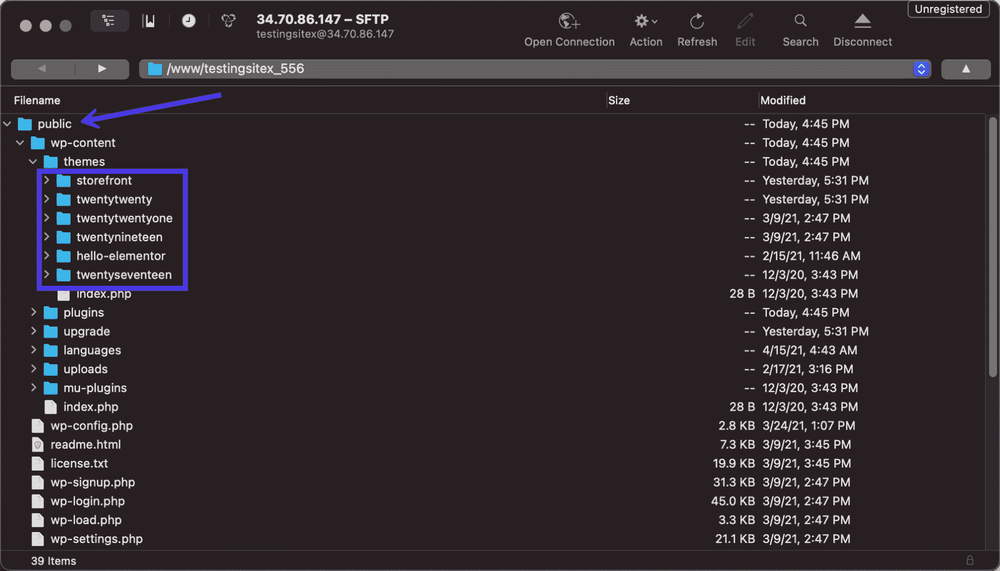

Use an FTP client to open your site files.


所有的 WordPress 主题在主题文件夹中都有一个**footer.php**文件。在该批文件中滚动，找到 footer.php 的**文件。**

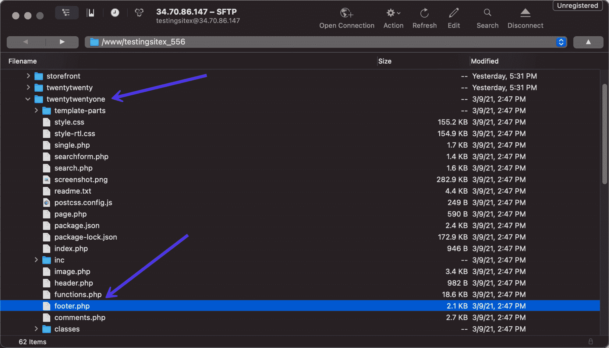

Choose the footer.php file for the right theme.


用您选择的编辑器打开文件。在那里，你可以编辑当前的代码或者添加新的内容，这取决于你想要达到的目标。 **get_template_part** 部分经常被修改以插入新的文本，但是我们将由您决定，因为每个页脚都是不同的。

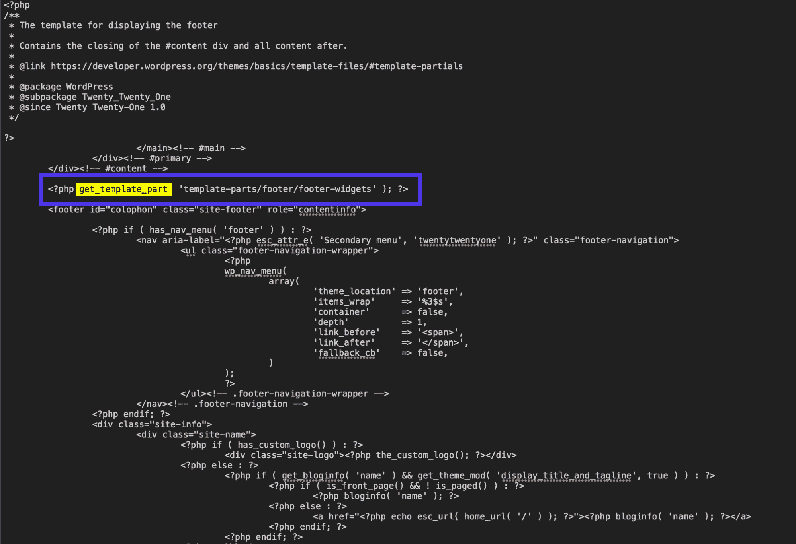

The opened footer.php file.


或者，您可以使用一个插件来编辑页脚代码，该插件为**footer.php**文件显示一个可视区域。这样，你就不必安装一个 FTP 客户端并链接到你的网站。这也是一个更直观、对初学者友好的过程，可以随时显示在您的仪表盘上，以供将来编辑。

为此，安装并激活[页眉页脚代码管理器](https://wordpress.org/plugins/header-footer-code-manager/)插件。


The Header Footer Code Manager plugin.


一旦安装完毕，点击出现在 WordPress 仪表盘上的 **HFCM** 标签。然后，命名代码片段，选择您想要它显示的位置，并将位置设置为页脚。

最重要的部分是**片段/代码**字段，您可以用您想要的任何代码来填充它。有些人使用这个插件来验证或跟踪前端没有显示的代码。然而，你也可以用它来输入新的文本，并获得对页脚内容的完全控制。

确保点击**保存**按钮查看结果。

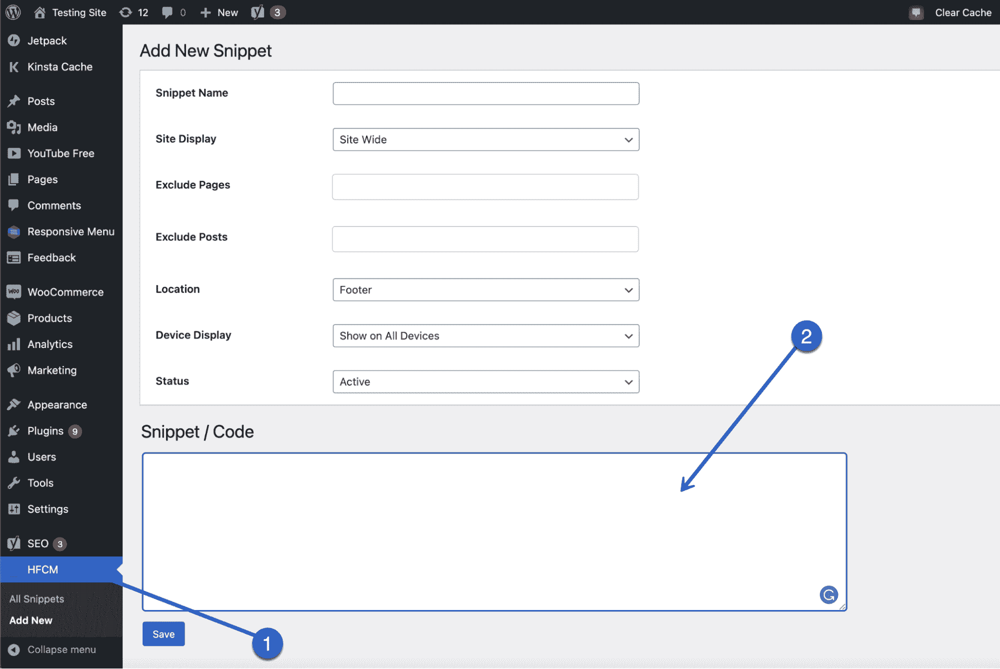

Paste in a Snippet or Code.


### 使用带有页脚设计器的页面生成器

修改你的 WordPress 页脚的一个额外的方法，不需要代码或者许多标准的 WordPress 页脚工具，就是使用页面生成器。并非所有的页面生成器都提供页脚编辑器，所以重要的是[进行一些研究](https://kinsta.com/blog/wordpress-page-builders/)并确保你当前的页面生成器提供页脚编辑器或者你计划购买的页面生成器具有页脚功能。

#### 查看我们的[视频指南](https://www.youtube.com/watch?v=Xs7Bxo_bA14)到用页面生成器编辑 WordPress 页脚


不管怎样，对于页面生成器来说，这是一个相对基本的特性，所以如果你打算用它来定制你的整个网站，那么使用页面生成器是一个好主意。

其他一些页面生成器也提供页脚编辑，但是我们最喜欢的包括 [Elementor](https://elementor.com/help/create-footers-using-elementors-theme-builder/) 和 [Visual Composer](https://visualcomposer.com/help/theme-builder/header-footer-sidebar-editor/) 。

要使用 Visual Composer 创建自定义页脚，您必须拥有专业版。有一些变通办法可以用免费版编辑网站的下半部分，但是真正的页脚拖放构建器需要升级。

安装完成后，点击仪表板上的**页面**按钮。滚动浏览您想要编辑的页面，并在任何页面上选择【用 Visual Composer 编辑 T2】链接。

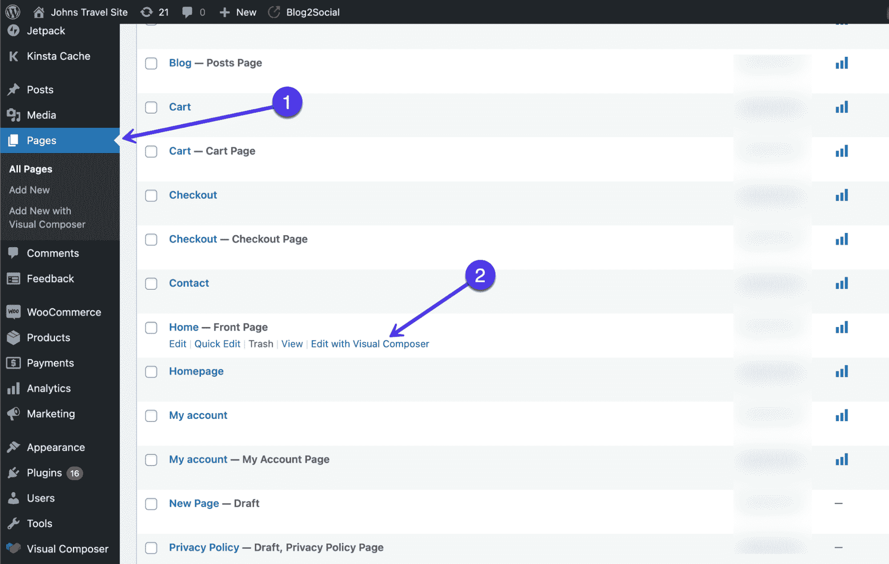

Edit With Visual Composer.


这将打开 Visual Composer 设计器，右侧是网页的实时预览，左侧是元素和模板等拖放设计工具。

实现一个漂亮的页脚的最简单的方法之一就是简单地选择一个模板(很多都是免费的)。这些模板为您的整个网站提供了专业的设计，以及一个可定制的漂亮页脚。

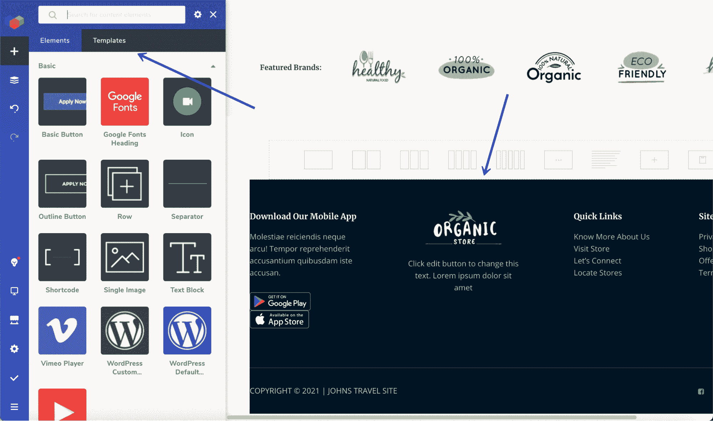

A premade footer that comes with one of the Visual Composer templates.


要查看有什么可用的，您可以点击**模板**选项卡，然后点击**获取更多模板**按钮。Visual Composer 为站点的各个方面提供了模板，包括页眉、页脚和侧栏。

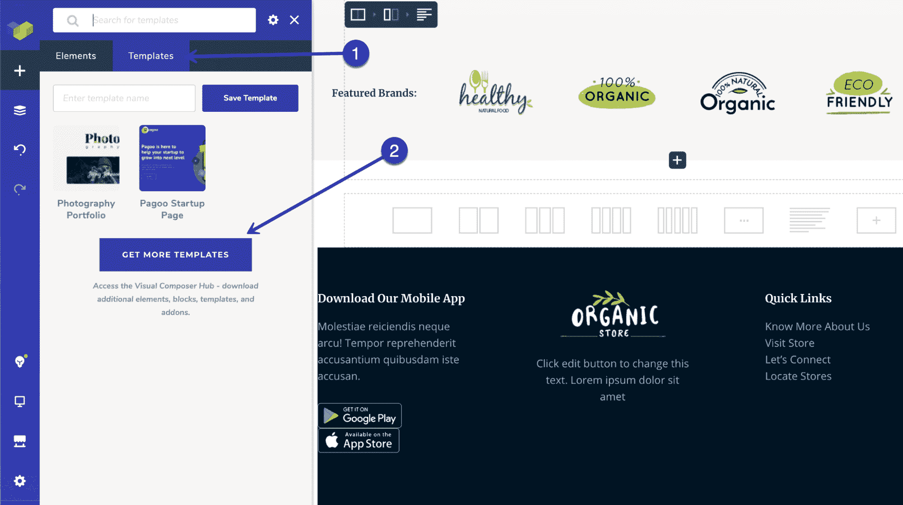

下一个窗口显示了一个很大的模板库，所有的模板都在过滤器下分类，比如**元素**、**模板**、**块**和**页脚**。

选择**页脚**选项卡，显示所有预制的页脚模板。

同样，Visual Composer 的这一部分需要专业版。一旦激活，您可以滚动浏览几十个页脚模板，在您的网站上实现它们，并随意编辑它们。

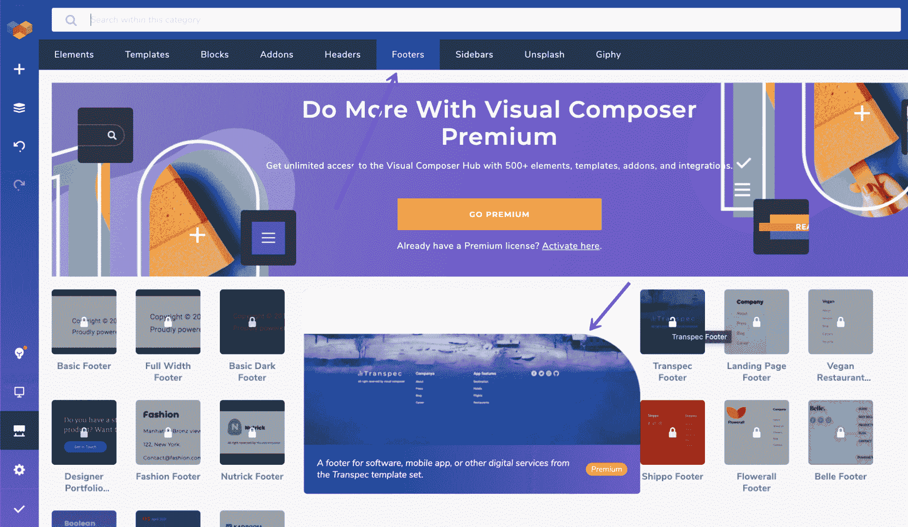

Footers in Visual Composer.


另一个带有页脚编辑工具的页面生成器叫做[element 或](https://kinsta.com/blog/divi-vs-elementor/)。与 Visual Composer 非常相似，Elementor 提供了一个完整的网站构建器来构建主页、产品页面、页脚等等。

请记住，您确实可以通过这种方法免费获得页脚内容块，但是实际的页脚生成器使用的是 Elementor 的 Pro 版本。像 Visual Composer 一样，您需要升级才能获得完整的功能。

首先，安装并激活[元素或](https://wordpress.org/plugins/elementor/)和[元素或页眉页脚和模块模板](https://wordpress.org/plugins/header-footer-elementor/)插件。

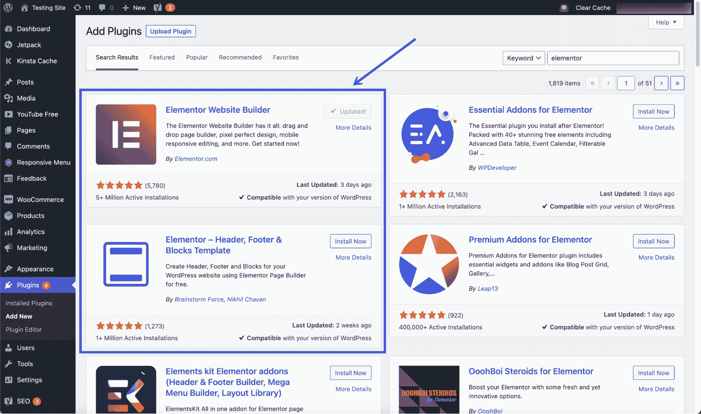

Elementor plugins.


点击**模板>主题构建器**从 Elementor 打开完整的网站构建器。


The Elementor Theme Builder.


在这里，你会看到一个菜单来编辑你的网站的各个部分，如页眉、页脚和单页。

## 注册订阅时事通讯


### 想知道我们是怎么让流量增长超过 1000%的吗？

加入 20，000 多名获得我们每周时事通讯和内部消息的人的行列吧！

[Subscribe Now](#newsletter)

在左侧菜单或页面中间的图标按钮上选择您想要定制的站点部分。如你所见，在两个地方有一个**页脚**链接。

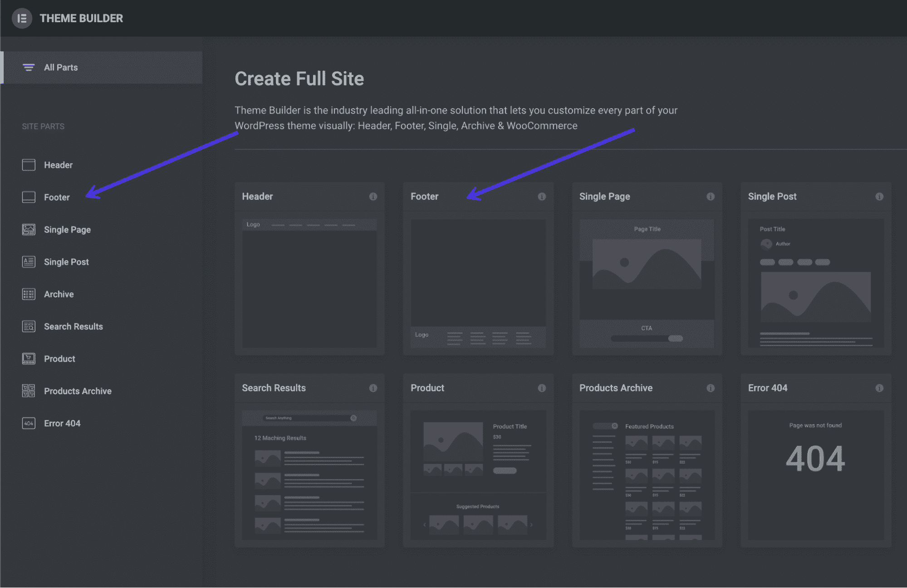

Footer editing options in Elementor.


页脚编辑器的工作方式与 Elementor 中的其他编辑器类似:您可以更改布局、调整样式，并单击块来键入新内容。使用 Elementor 时，页脚的每个方面都是可定制的，这使得它成为页脚控制和学习如何在 WordPress 中编辑页脚时更灵活和更理想的选择之一。

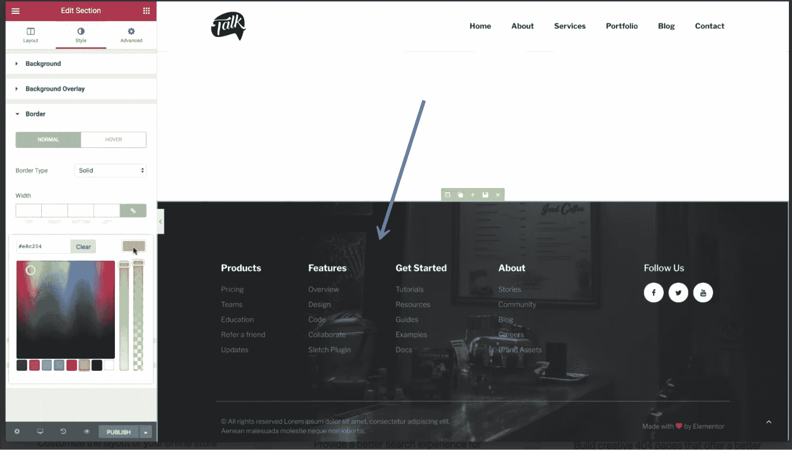

Editing the footer with Elementor.


页眉页脚和块插件提供了专门为页眉和页脚制作的内容模块。就页脚块而言，您可以从版权信息、图像、网站标题和标语等模块中进行选择。

要使用这些模块，请转到仪表板中的**外观>页眉页脚和模块**。

您还可以创建一个独特的块，并选择在 Elementor 页面生成器中编辑它。在 Elementor 中，向下滚动到用于**页眉页脚和块**的块集合，然后将这些元素中的任何一个拖动到您当前的设计中，以激活页脚中一些更常见的内容项。如前所述，你可以在这些版块中找到从搜索栏到网站标志和购物车图标到版权文本的所有内容。

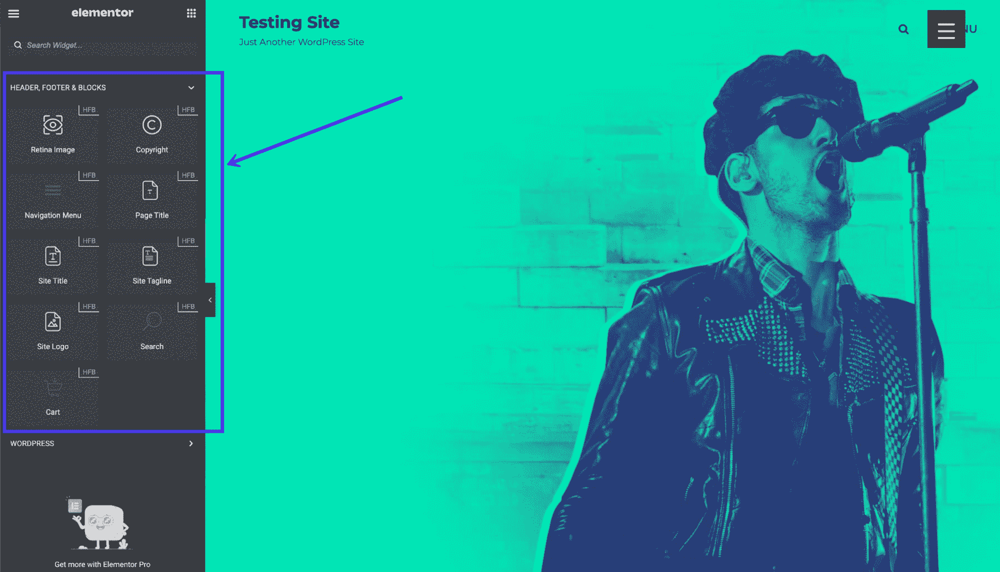

Footer block examples.


## 如何在 WordPress.com 编辑页脚

WordPress 的托管版 WordPress.com 包括了许多主题的页脚，点击几下就可以删除或更改页脚。在 WordPress.com 编辑页脚的方法有点类似于在自托管的 WordPress.org 版本，但是有一些不同。

### 查看我们的[视频指南](https://www.youtube.com/watch?v=Db9FnCIxHHw)在 WordPress.com 编辑页脚


首先，界面看起来不完全一样。

您必须登录到您的 WordPress.com 仪表板，并在主题定制器中管理您的页脚。幸运的是，为 WordPress.com 提供的许多主题与你在 WordPress.org 找到的相似或完全相同。然而，这也意味着你在 WordPress.com 编辑页脚的方式取决于你安装的主题。

首先，进入仪表板中的**外观>定制**。

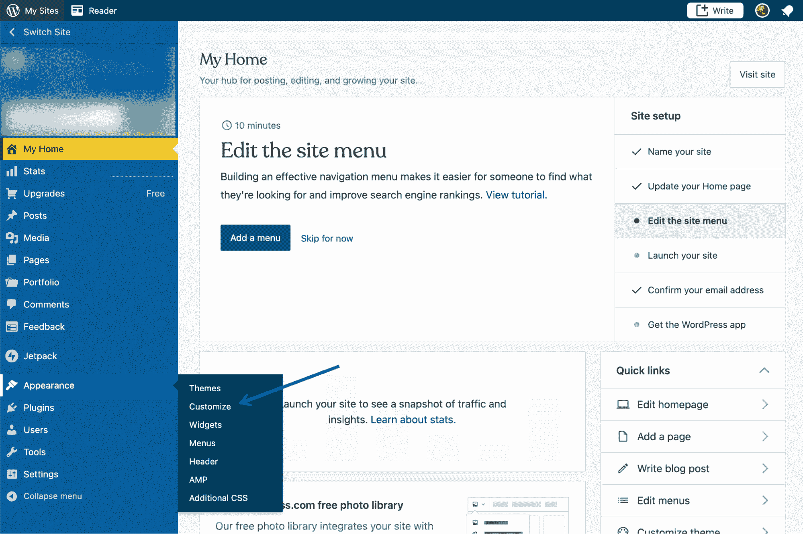

Go to the Theme Customizer.


查看可用于该特定主题的主题定制器选项卡。大多数主题都有一个 **Widgets** 选项卡，但是你必须弄清楚你的主题是否提供了一个放置 Widgets 的页脚区。点击**小工具**标签了解详情。

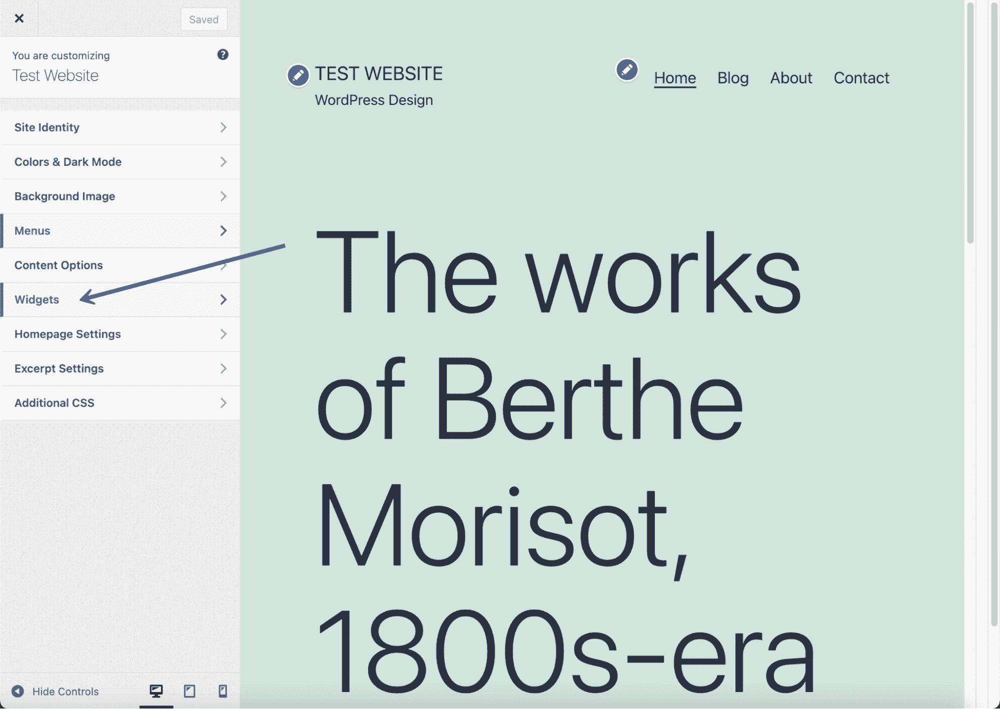

Click on the widgets tab.


我们当前使用的主题提供了一个**页脚小部件**模块。如果你看不到在页脚放置小部件的选项，考虑尝试一个新的主题，或者使用菜单代替小部件。

对于这个例子(有一个页脚小部件区域)，点击**添加一个小部件**按钮。

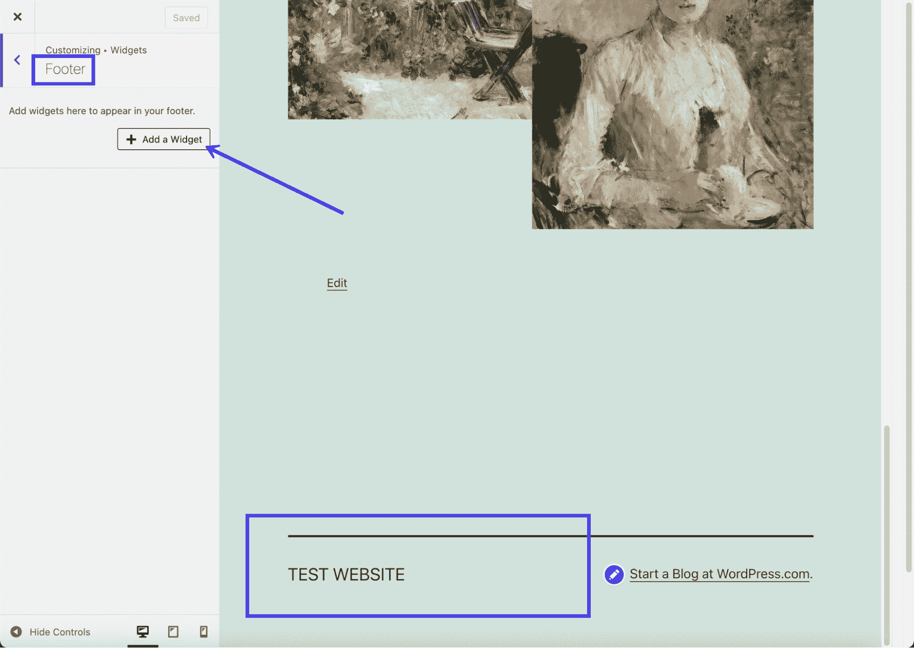

Add A Widget button.


将出现一个滑出菜单，其中包含一组 widgets。您可以选择对您的公司最有意义的部件。

同样，主题决定了在不显得太杂乱的情况下可以在页脚中放入多少小部件。在设计开始看起来混乱之前，这个特殊的主题似乎允许大约三列小部件。

对于我们的示例，我们将选择一个联系信息和地图小部件，以及一个关注博客小部件，它会提示访问者使用他们的电子邮件地址注册。

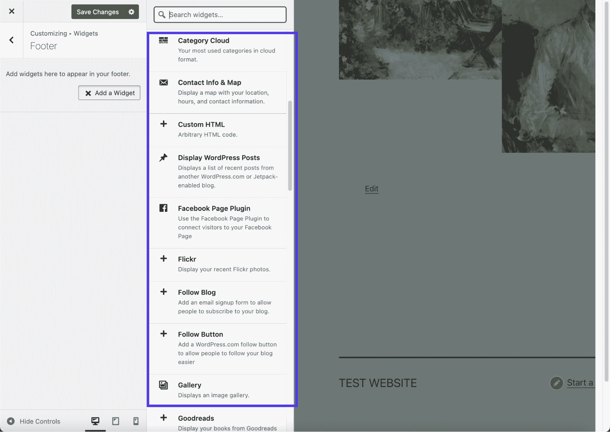

The long list of WordPress widgets.


右边的预览显示了运行中的小部件。我们建议浏览每个小部件设置面板，以配置单个元素，如显示文本，并选择要在每个小部件中显示的字段。

确保您点击了**保存更改**按钮，这样小部件就会出现在您网站的前端。

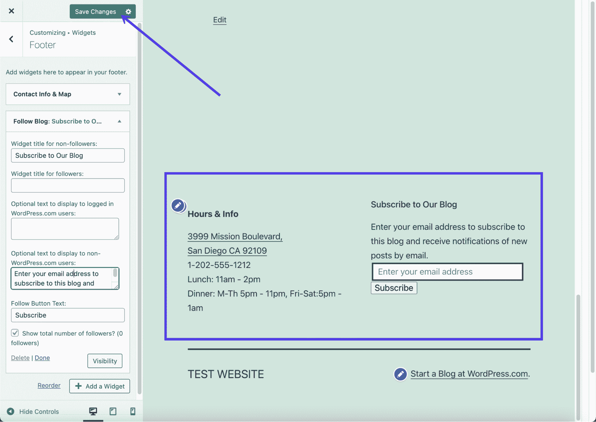

A completed footer with contact info and subscription widgets.


你可能还会注意到，WordPress 会自动在你的页面底部添加你的站点标题和一个 WordPress 标签。如果你愿意，你通常可以去掉网站标题，但是 WordPress 信用移除需要你为商业计划付费。

要修改这两个元素，单击**站点标识**按钮。

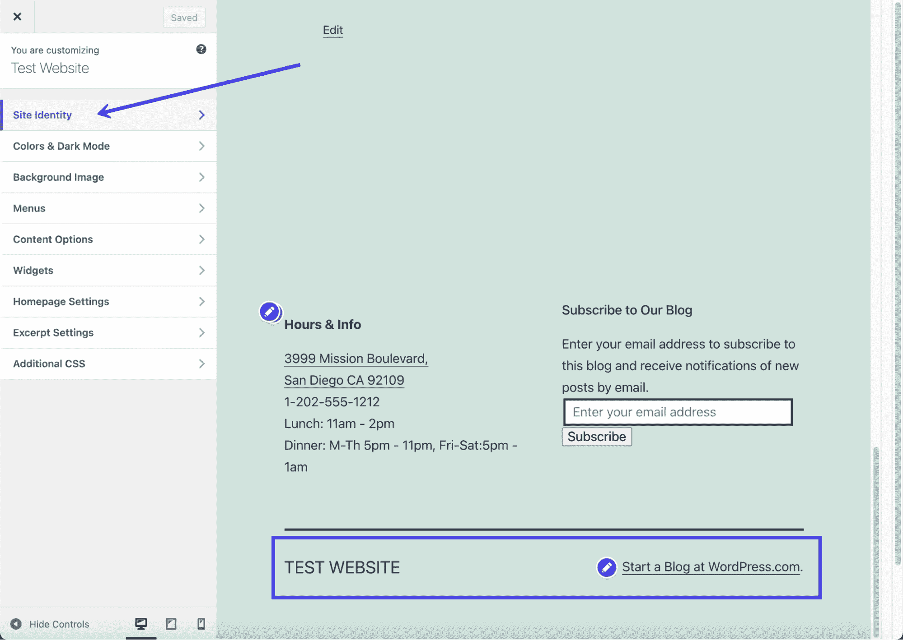

Go to Site Identity.


首先，在设置的底部找到**页脚积分**字段。单击下拉菜单显示所有可能选项。

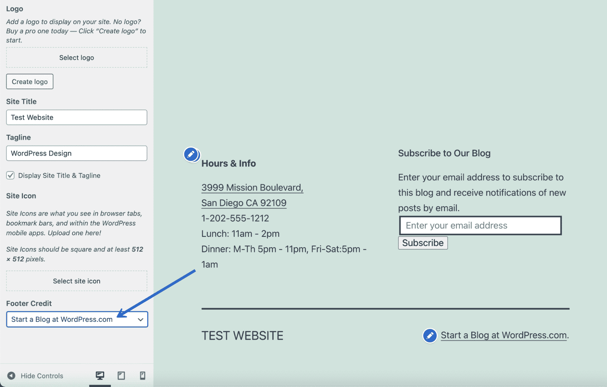

The Footer Credit dropdown.


每一个演职员表都提到了 WordPress。如果你在经营个人博客或在线杂志，WordPress 的信用并不是什么大不了的事情，但是如果你的网站是合法经营的，我们建议你升级到商业计划并取消信用。

之后，你可以点击下拉菜单，选择**隐藏**选项，彻底摆脱信用。

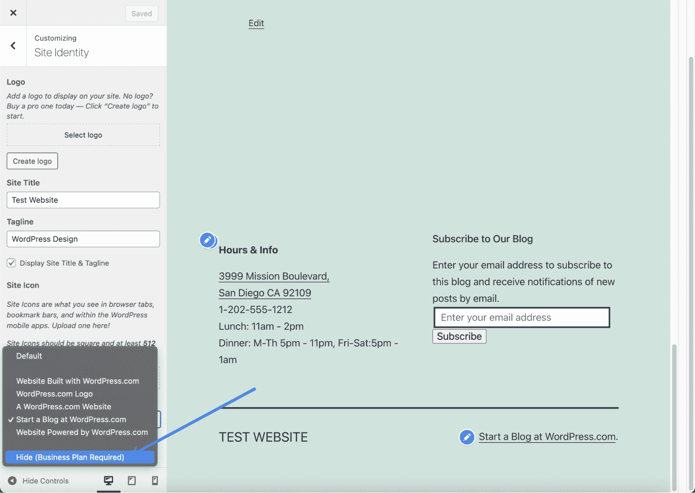

You must have the Business Plan to hide the WordPress credit.


然后，在预览中，你添加到页脚的小部件会随着网站标题一起消失。

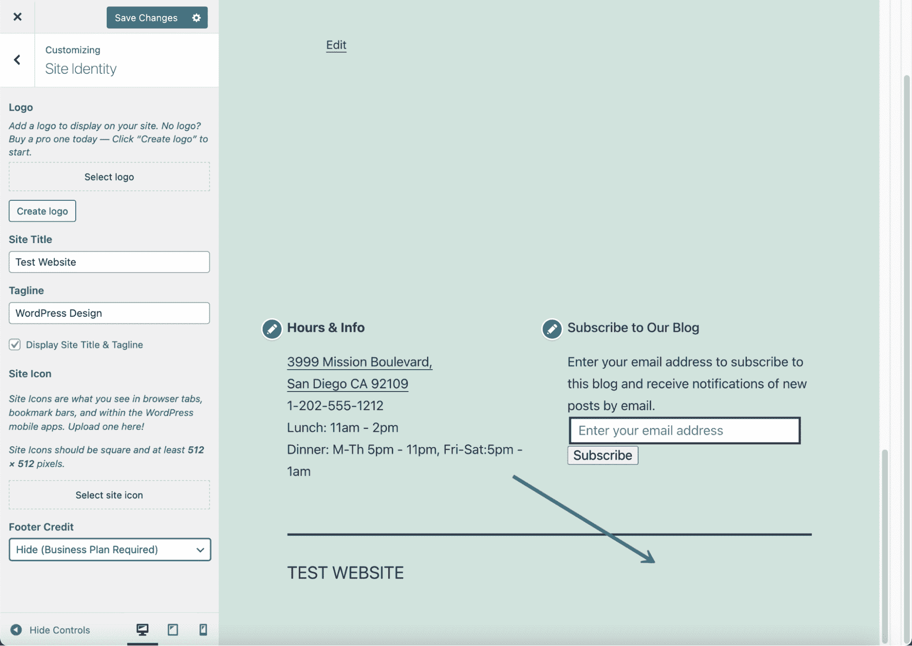

A footer without the WordPress credit.


有些主题还可以从页脚中删除网站标题。最简单的方法是取消选中**显示网站标题和标语**框。这样就去掉了页脚和潜在的页眉中的网站标题。对于页眉，我们还是建议上传一个 logo。

其他主题有不同的方式来删除网站标题和标语。有时候根本不可能，而其他时候，网站标题并不包含在页脚中。当有疑问时，如果您没有**显示网站标题和标语**复选框，请尝试删除**网站标题**字段中的内容。

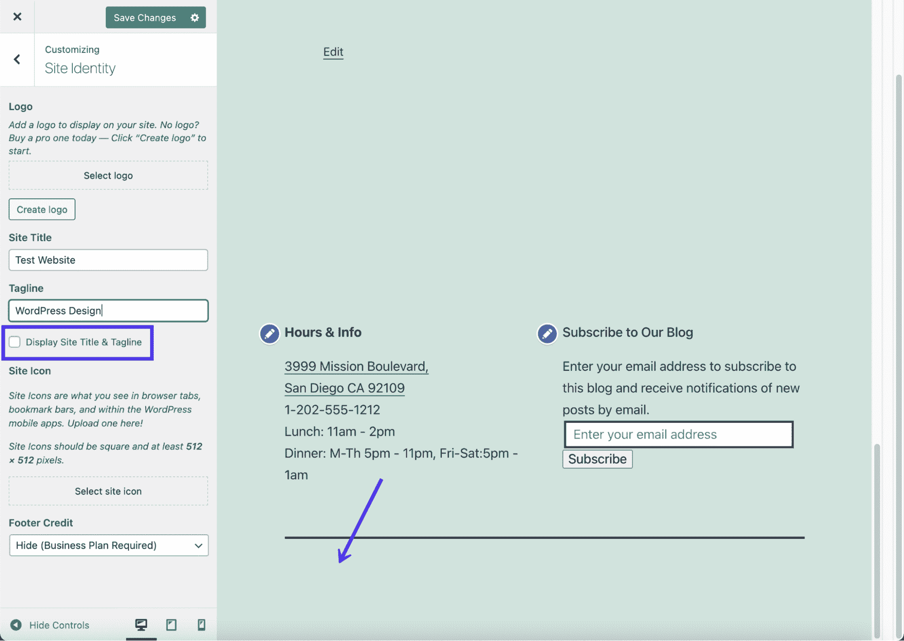

A footer without the Site Title.


另一种在你的 WordPress 页脚插入内容的方法是利用**菜单**面板。不是所有的主题都允许在页脚使用菜单，但是至少检查一下是个好主意。

点击**菜单**标签继续。

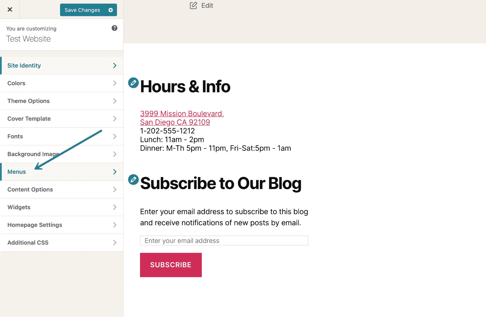

Click on the Menus tab.


选择**查看所有位置**。这将显示一个列表，其中列出了在这个特定主题中允许放置菜单的位置。

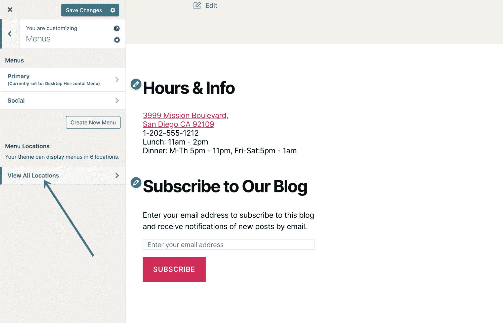

Select the “View All Locations” option


对于我们的示例主题，我们有相当多的菜单位置选项，其中之一是页脚。你不会对你遇到的每一个主题都这么幸运，所以准备好要么把它们换出来，要么考虑使用小部件技术来编辑你的页脚。

对于支持页脚菜单的主题，点击**页脚**下拉字段。


This theme has a spot to put a menu in the footer.


我们为页脚选择了一个预制的社交菜单。如果您还没有合适的菜单，请随意选择**创建新菜单**链接。

结果是一个简单的文本/链接菜单，出现在已经添加到页脚的任何小部件的上方。您可能无法将小部件添加到您的主题中，因此您可能看不到完全相同的格式。

请记住，所有的菜单都是简单的文本和链接列表，所以你不能整合像社交媒体图标菜单这样的东西，除非你考虑一个支持它的独立插件。

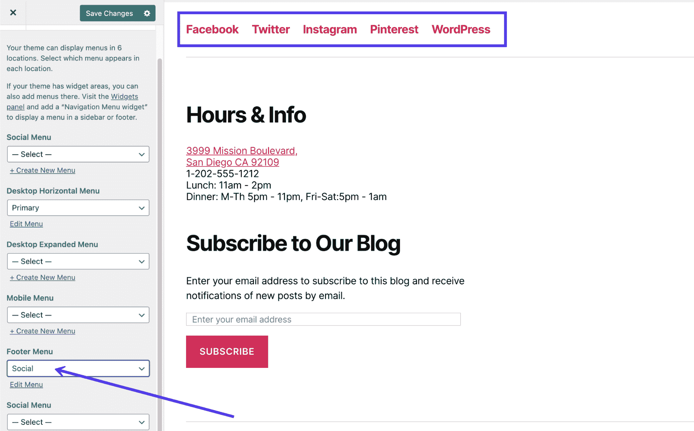

Adding a menu to the Footer area.


## 如何将社交媒体图标添加到 WordPress 页脚

页脚区的支柱是社交媒体按钮的经典列表。许多网站将社交按钮添加到主菜单中，但是将它们放在网站底部也是一个不错的主意，或者作为将社交按钮放在网站顶部的替代方案。总的来说，如果你觉得页眉已经很混乱了，那就用页脚吧。

相当多的插件提供了一些插件，可以在你的页脚和页眉添加社交媒体图标和链接。因此，我们建议远离这里的任何定制编码。

尽管存在许多社交图标插件，我们的目标是找到一个专门提供快速添加链接和定制按钮的插件。

需要一个给你带来竞争优势的托管解决方案吗？Kinsta 为您提供了令人难以置信的速度、一流的安全性和自动伸缩功能。[查看我们的计划](https://kinsta.com/plans/?in-article-cta)

WPZoom 推出的一个广受欢迎、评价很高的解决方案叫做[社交图标小工具& Block。它有超过 400 个社交媒体和其他平台的图标，还有一个小工具可以直接把你的图标放到你的页脚。不仅如此，你还可以上传自己定制的图标，切换颜色和大小的设置。](https://wordpress.org/plugins/social-icons-widget-by-wpzoom/)

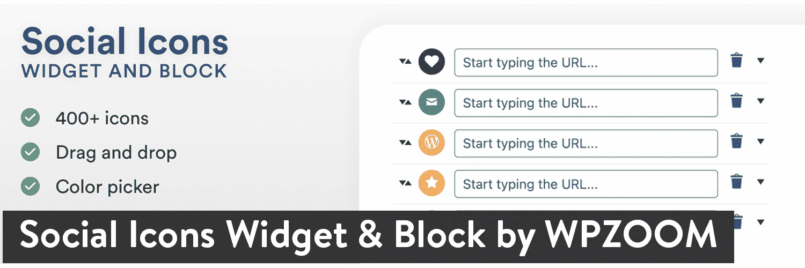

Social Icons Widget plugin by WPZOOM.


安装插件后，你可以进入**设置**页面，如果你不想要某些字体包，就禁用它们。但是，它们都已经是活动的了，所以如果你想让一切都可用，就跳过这些设置。

要在你的 WordPress 页脚添加社交图标，请前往**外观>自定义**。

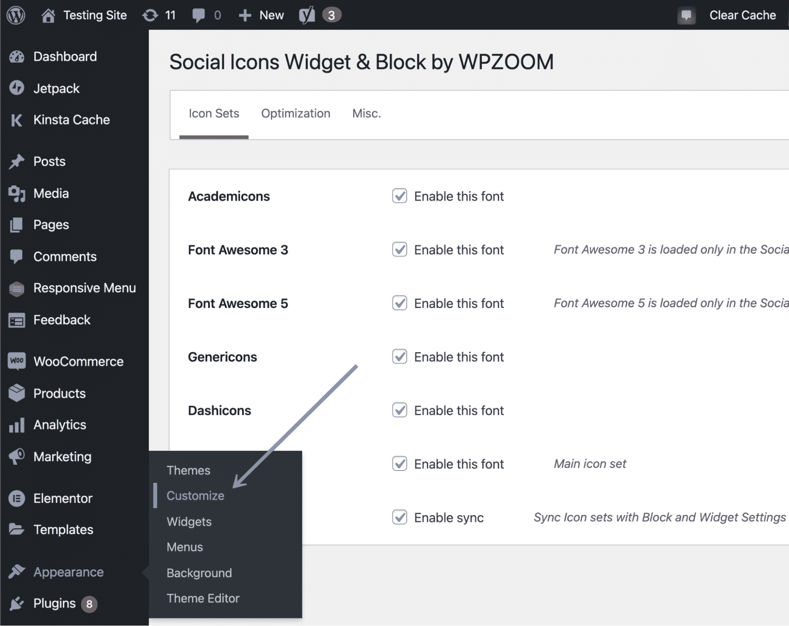

Going to the Theme Customizer.


这将带您进入 WordPress 主题定制器，在这里您可以向页脚添加小部件(只要您的主题支持页脚中的小部件)。正如我们在本文前面提到的，避开没有页脚小部件的主题的唯一方法是自己找到一个新主题或自定义页脚代码。

找到并点击 **Widgets** 选项卡继续。

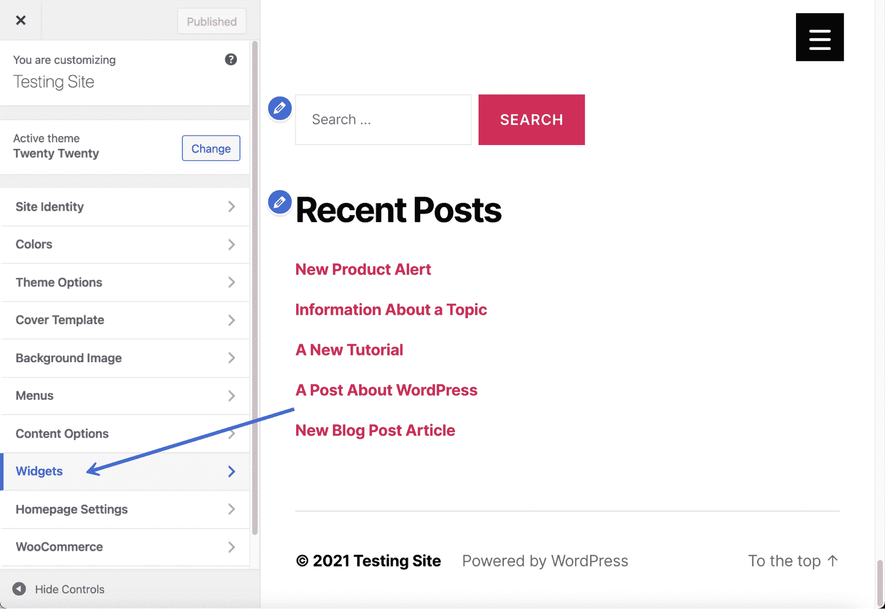

The Widget button in the Theme Customizer.


这个主题有两个区域可以向页脚添加小部件。并非所有的主题都是如此，所以您可能会发现您的主题没有页脚小部件区域。另一方面，你可能很幸运，在你的页脚中有四五个位置可以放置小部件。这完全取决于你安装的主题。

点击其中一个**页脚**标签。

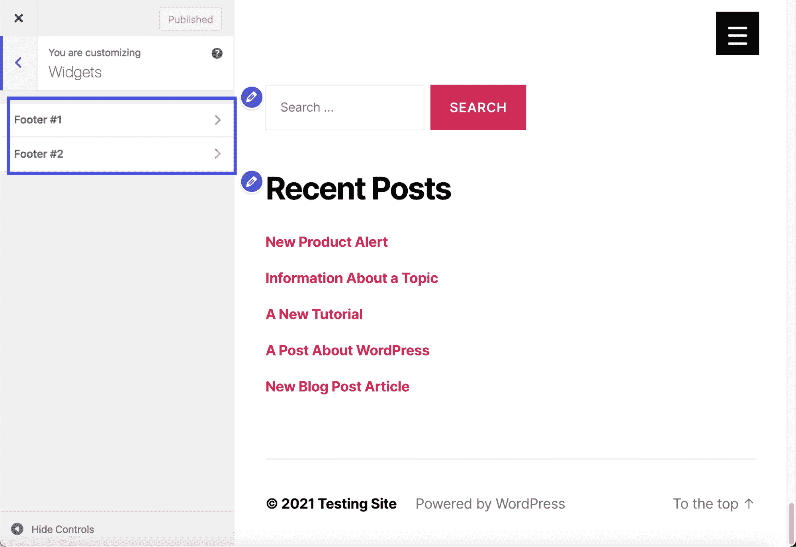

The Footer widget locations.


可以向页脚添加无数的小部件——或者至少是您已经安装的任何小部件。

点击**添加微件**按钮，显示您可用的微件菜单。

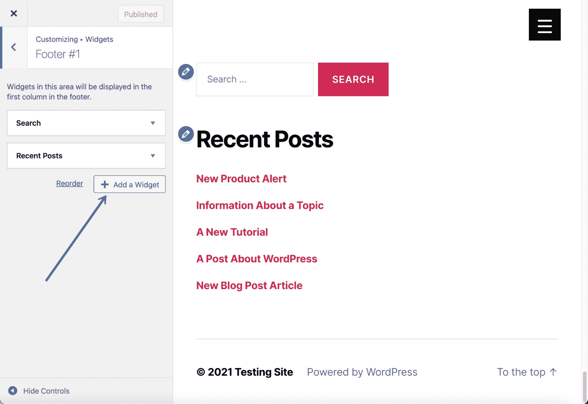

The Add A Widget button.


滑出式菜单提供了搜索栏和可能的小部件列表。向下滚动找到 WPZOOM 的名为 Social Icons 的小部件。

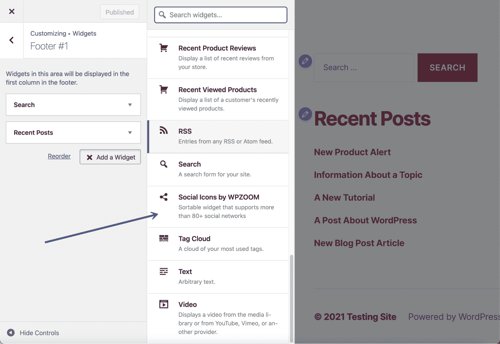

The Social Icons widget is located in the widgets list.


现在，您应该可以在网站预览中看到默认的社交媒体图标和按钮。

但是，您仍然需要自定义这些按钮的设置，以确定这些按钮的大小、颜色以及您希望它们指向的链接。

首先键入小部件的标题，它出现在页脚中(如果您愿意，也可以留空)。继续指定设置，如您是否需要图标标签、无关注链接和特定的图标对齐方式。

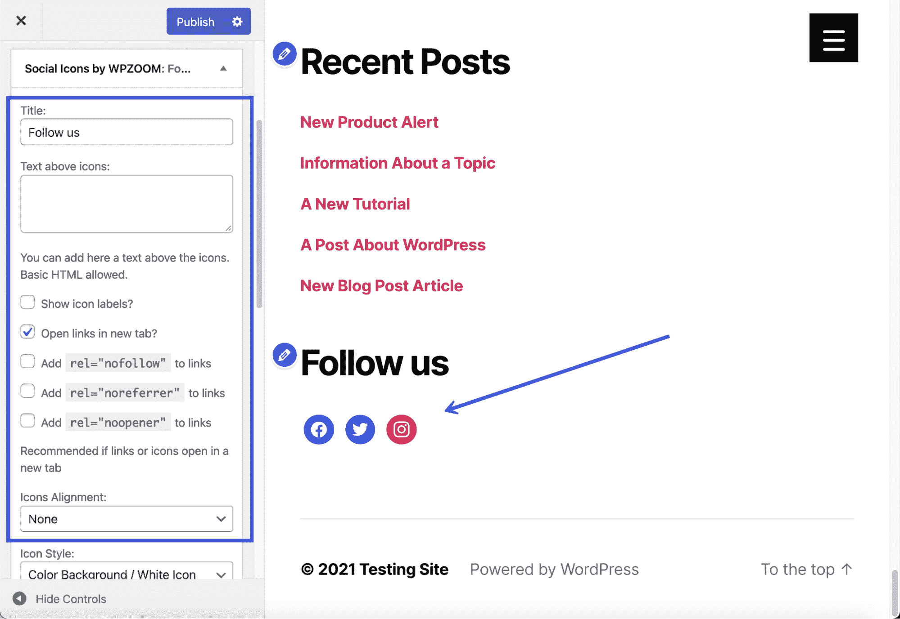

Change social icon settings and look for the new designs on the right.


继续使用设置来指定图标样式、背景样式和填充。您还可以选择图标的大小和颜色。请记住，您需要点击小部件定制模块底部的**保存**按钮，以便在预览中看到您的更改结果。

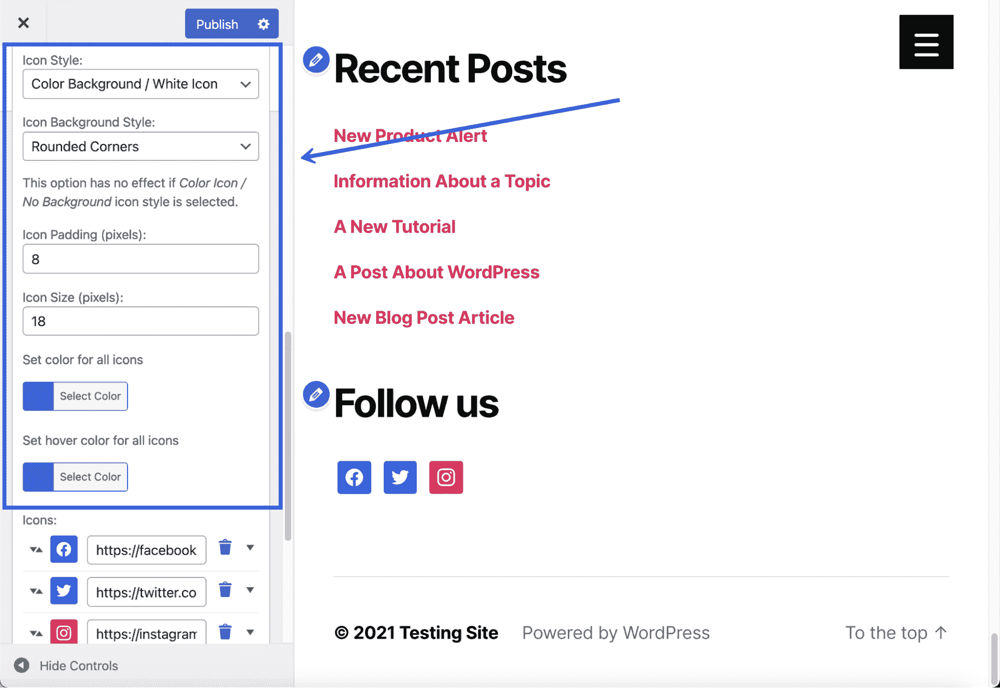

Adjust settings like Icon Style, Background Style, and more.


**图标**字段已经为您准备了一些默认的社交图标。列出你为公司运营的社交媒体网站，将链接复制并粘贴到相应的字段中。删除任何对你的业务没有意义的图标。

要打开图标库并添加更多图标，点击字段列表底部的**添加更多**按钮。

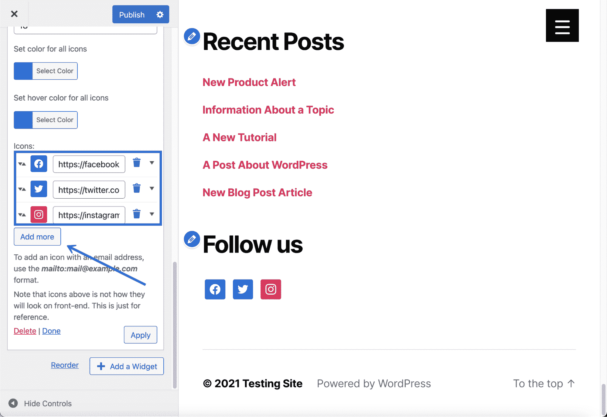

Add as many social icons as you want.


该插件提供了一个大的图标集合，带有设置图标颜色、悬停颜色和图标工具包来源的选项。主要工具包被称为 Socicons，但其他几个工具包是免费的插件。点击**选择图标套件**下拉菜单查看您的选项。

最后，浏览每个工具包提供的图标。其中许多你可能甚至不认识，所以只坚持那些你积极经营的，能为你的客户提供价值的。

在我们的例子中，我们将选择 YouTube 图标添加到我们的页脚。

点击**保存**按钮将其放入列表，然后点击小组件框底部的下一个**保存**按钮查看您的更改。

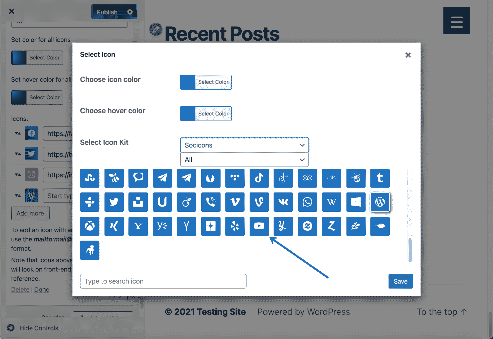

The plugin has dozens of icons to choose from.


如你所见，我们改变了图标的大小和形状，同时增加了一个额外的社交图标。如果你的改变看起来不太对，回到小部件设置来解决问题。

永远记得点击**发布**按钮，以便小工具在你网站的前端生效。我们还建议您亲自检查一下前端，确保社交图标以正确的方式出现。


A view of the finished social media buttons.


## 如何给你的 WordPress 页脚添加背景

借助一些页脚插件和页面生成器，页脚背景是可能的。然而，你也可以通过使用你的主题的基本设置在你的页脚后面放置一个图片或者颜色背景。

### 查看我们的[视频指南](https://www.youtube.com/watch?v=CzUsO7TZh94)添加一个 WordPress 页脚背景


万一所有这些都失败了，我们将向你展示如何插入 CSS 代码来给 WordPress 页脚添加背景。

首先，检查你的主题设置，看看页脚背景功能是否是标准配置。例如，Abletone 主题在主题定制器中提供了一个**页脚背景图片**标签。

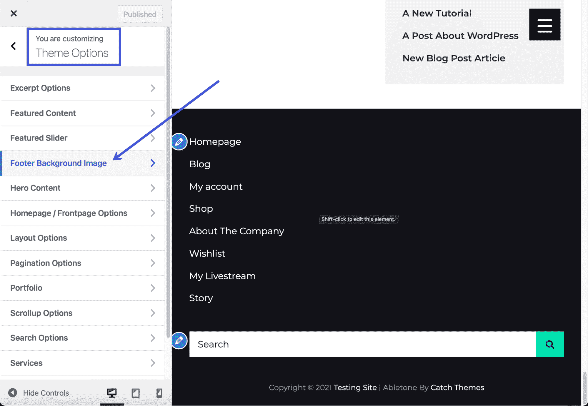

This theme has a Footer Background Image feature.


你只需点击**选择图片**按钮，在你的媒体库中搜索一张图片[，从你的电脑上传一张新的，或者](https://kinsta.com/blog/wordpress-media-library/)[寻找一张符合你需要的库存照片](https://kinsta.com/blog/wordpress-stock-photos/)。

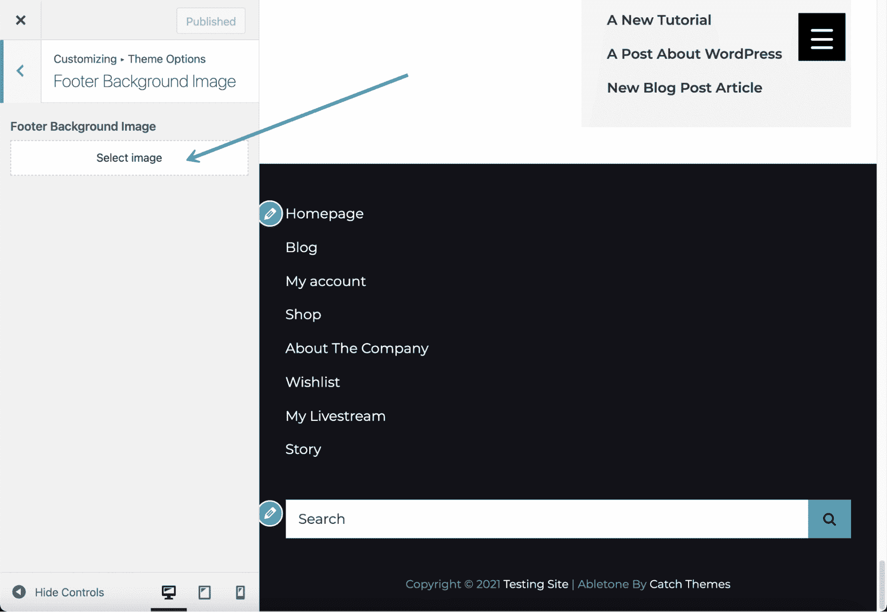

The Select Image button in the Theme Customizer.


一旦上传，图片将作为你的 WordPress 页脚的背景出现。有些主题提供了拉伸或平铺图像的附加设置，但是如果没有自己编辑 CSS，您就只能使用主题附带的设置。

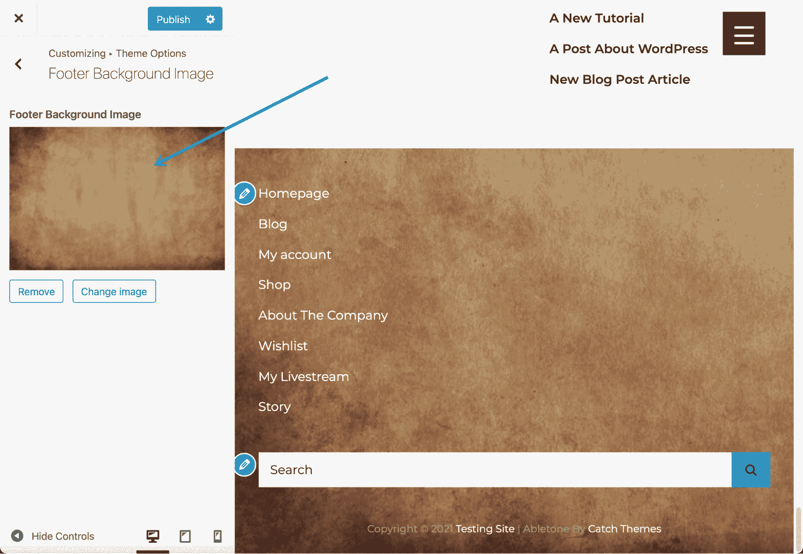

You can see the background thumbnail preview.


如果你没有一个主题、页面生成器或插件来添加页脚背景，那么添加 CSS 代码可以处理这个任务，不管你的主题或页面生成器是什么。

进入 WordPress 的主题定制器，然后点击**附加 CSS** 菜单项。

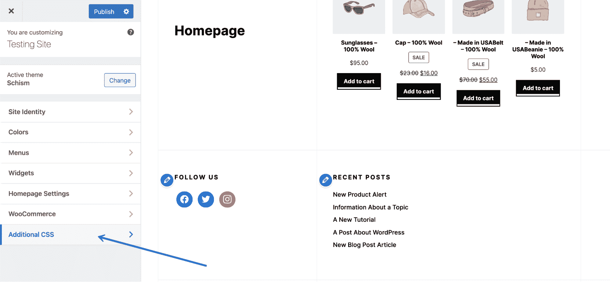

Click on the “Additional CSS” tab


将此 CSS 代码粘贴到字段中，但用所需图像的 URL 替换 YOURIMAGEURL:

```
footer { background: url(YOURIMAGEURL) repeat; }
```

上传到媒体库后，您可以在其详细信息视图中找到任何图像的 URL。

一定要点击**发布**按钮才能在前端看到。

您还可以插入其他代码来更改元素，如大小和背景拉伸大小或重复。正如你所想象的，添加 CSS 代码并不像点击插件按钮那么简单，但是在线快速搜索可以帮助你找到适合你需要的代码。

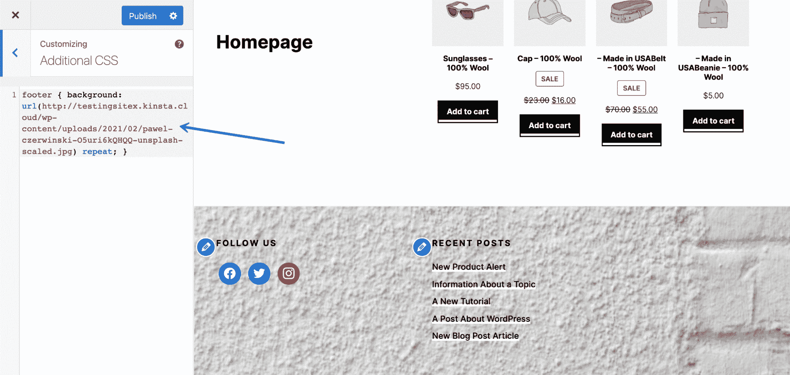

Paste your own CSS code into the field.


## 删除“由 WordPress 提供动力”文本

在上一节中，我们介绍了如何移除你的 WordPress 页脚中的 WordPress 信用点数。这在一个自托管的 WordPress 站点上有点棘手，因为大多数主题没有提供一种方法来移除主题定制器的站点标识部分中的信用。

因此，我们必须寻找其他方法来删除页脚中的“Powered by WordPress”文本。

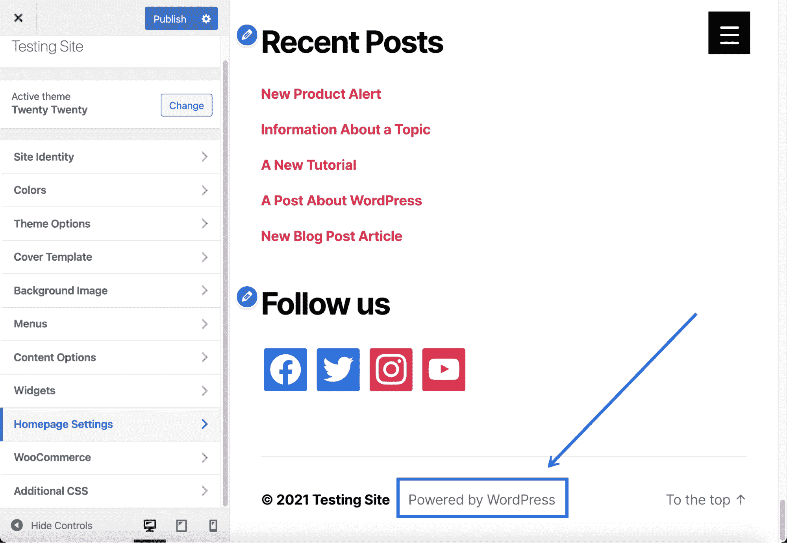

An example of the “Powered By WordPress” message.


为了解决这个问题，请阅读我们的[关于移除页脚中“Powered By WordPress”标签](https://kinsta.com/knowledgebase/remove-powered-by-wordpress/)的深度指南。这篇知识库文章涵盖了以下所有主题:

*   为什么你想删除“由 WordPress 提供动力”的信息
*   当您可能不想删除它时
*   尝试取消积分时应避免的方法
*   如何用插件删除积分
*   如何手动删除“由 WordPress 支持”的点数
*   用你自己的代码替换页脚

对于一般的 WordPress 用户来说，用插件编辑页脚致谢非常容易。然而，走手动路线可以确保您对页脚有完全的控制权，并且它消除了在您的仪表板上安装另一个插件的需要。

### 去掉“傲然由 WordPress 提供动力”合法吗？

考虑到 WordPress 使得从你的页脚中移除“自豪地由 WordPress 提供动力”的文本变得有点棘手，你可能想知道去掉这个消息是否合适。

答案是，我们非常欢迎你在页脚中去掉“由 WordPress 提供动力”的文字，而不必担心任何法律后果或违反 [WordPress 服务条款](https://wordpress.com/tos/)。这是因为 WordPress 的使用受到 GPL(通用公共许可证)的保护，这意味着任何人都可以以他们认为合适的方式重新发布和修改 WordPress。

总的来说，我们强烈建议删除“自豪地由 WordPress 提供动力”的文字，因为它与你的品牌没有任何关系，只是促进了另一个组织。是的，宣传 WordPress 很好，但不能以牺牲你自己的品牌和宝贵的网站空间为代价。

现在，你的主题开发者展示的页脚信息是一个不同的故事。我们将在下一节讨论这一点。

### 如何删除 WordPress 页脚中的“由 XYZ 主题驱动”文本

我们现在知道，当你删除“自豪地由 WordPress 驱动”页脚信息时，你将不会有法律或 WordPress 的问题。但是那些把“由 XYZ 主题驱动”放在页脚的主题开发者呢？

幸运的是，绝大多数的 WordPress 主题都有一个通用的公共许可证，所以完全可以删除那些文本，用更适合你的业务的东西来代替。然而，谨慎的做法是仔细检查你的主题开发者，确保他们没有在条款和条件中要求你在页脚保留开发信用。

你可以简单地询问开发者这个主题是否属于通用公共许可证的范畴。如果没有，或者他们的条款和条件要求离开信用，我们建议[寻找另一个主题](https://kinsta.com/best-wordpress-themes/)，因为这并不是你网站上想要的东西。

那么，你如何去除页脚中的“由 XYZ 主题驱动”的文字呢？

#### 查看我们的[视频指南](https://www.youtube.com/watch?v=jI7ZbeVL710)从你的 WordPress 页脚移除“Powered by WordPress”


一些删除“Powered by WordPress”信息的插件也可以删除主题开发者插入的任何信息。然而，这并不是一件确定的事情。

因此，我们建议选择以下方法之一:

*   直接编辑页脚网站文件，以消除信贷信息。
*   请开发商为您移除。
*   升级到主题的高级版本。

编辑页脚站点文件需要一些技术知识，但是您通常可以在几分钟内完成。要求开发者删除主题开发者信用可能最终会奏效，但是你本质上是希望你会得到一个友好的开发者，他愿意带你完成这个过程。通常，如果你只是使用他们主题的免费版本，他们不会提供这个。

最简单的选择是升级到主题为的[高级版本。许多高级主题开发者给出了他们的主题的简化、免费版本，希望你能升级以获得更好的特性和更多的控制。](https://kinsta.com/blog/wordpress-free-vs-paid-themes/)

由于升级到高级主题并与开发人员交谈可以自己完成，我们将主要讨论如何编辑主题站点文件以消除信用信息。

首先，检查你的主题的页脚，确认你的底部是否有开发者信用。如果是这样，请记下显示的确切文本，因为这有助于在您的站点文件中找到该消息。


### 信息

尽管不太可能，但还是要检查一下开发者是否有办法移除主题定制器中的积分。你可能会发现一个快速的复选框来剥夺你的网站的信用。


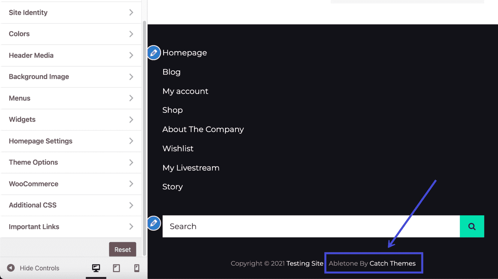

A theme developer credit in the footer.


正如本文前面所讨论的，使用 FTP 客户端连接到您的站点文件。每个主题开发者在页脚的位置上有所不同，但是一个好的开始是去**/public/WP-content/themes**。

选择您在网站上激活的主题。


Find the right theme folder.


从这里，一个选择是在一个[文本编辑器](https://kinsta.com/blog/best-text-editors/)或 [PHP IDE](https://kinsta.com/blog/php-editor/) 中打开主**footer.php**文件，并搜索页脚的引用。使用您选择的编辑器中的 **Find** 功能键入并搜索在页脚中显示的确切文本。

与所有主题一样，这可能不是删除页脚致谢的正确文件；这完全取决于主题是如何构建的。如果你没有找到 footer.php 的档案，继续去别处找。


### 信息

你通常可以在网上搜索特定的主题，找到支持文档或论坛，人们在那里讨论如何删除特定主题的页脚。


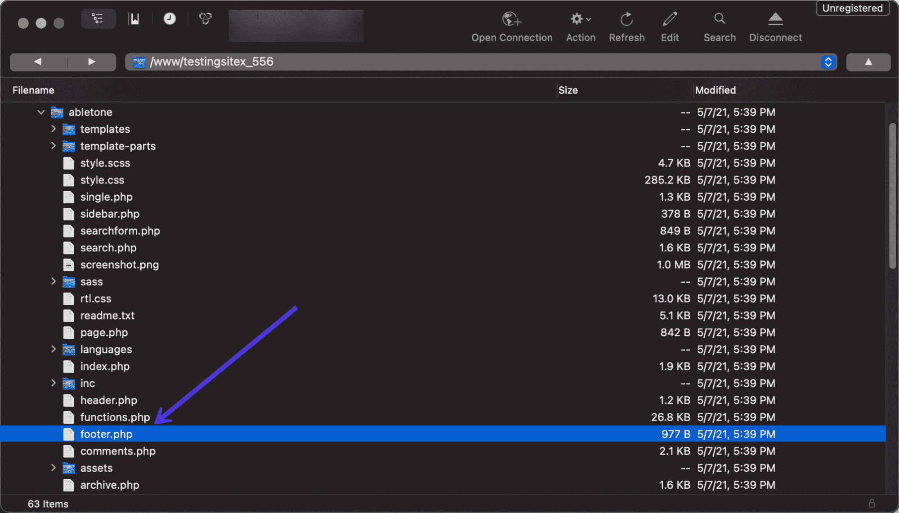

The footer.php file.


在 **/template-parts** 文件夹中最容易找到页脚信用信息代码。我们发现这就是我们为本教程安装的当前测试主题的情况。

我们可以转到**/页脚**文件夹，然后点击 site-info.php 的**文件。site-info.php 的那个**文件(或者它的一些变体)是存储主题页脚信用信息的一个公共地方。****

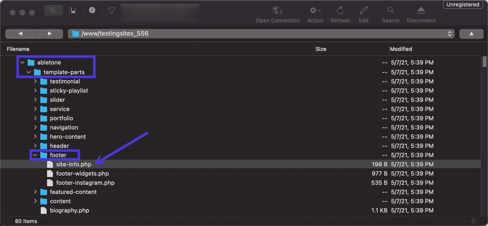

The site-info.php file.


请随意删除页脚演职员表或用其他内容替换它们。对于这种情况，我们将简单地删除底部的 credits 挂钩和 **do_action** credits 代码。

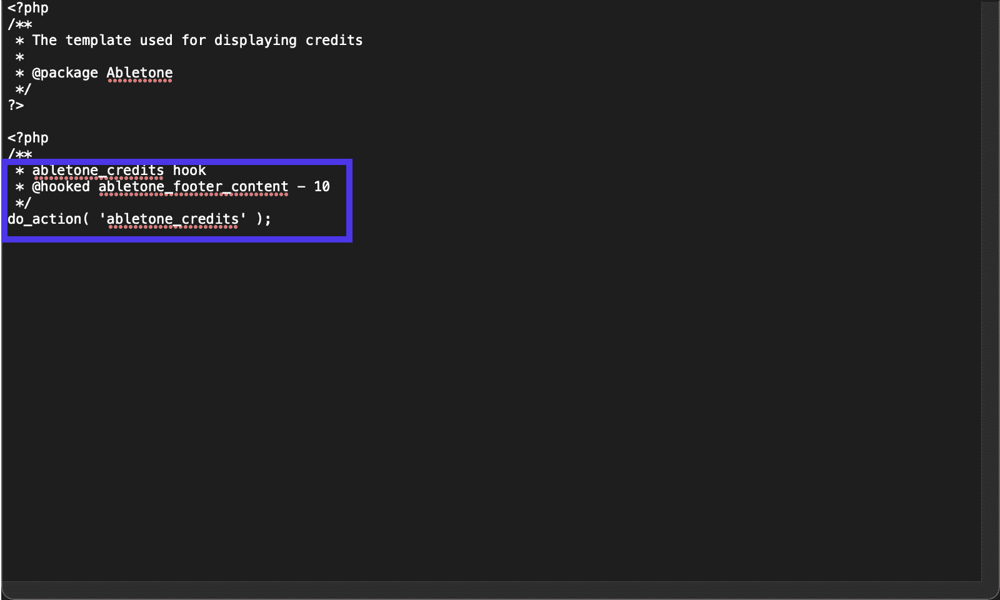

Remove the credits hook and the do_action credits code.


这成功地消除了主题开发者的所有荣誉。它对页脚内容也没有任何影响，比如我们的小部件和菜单。

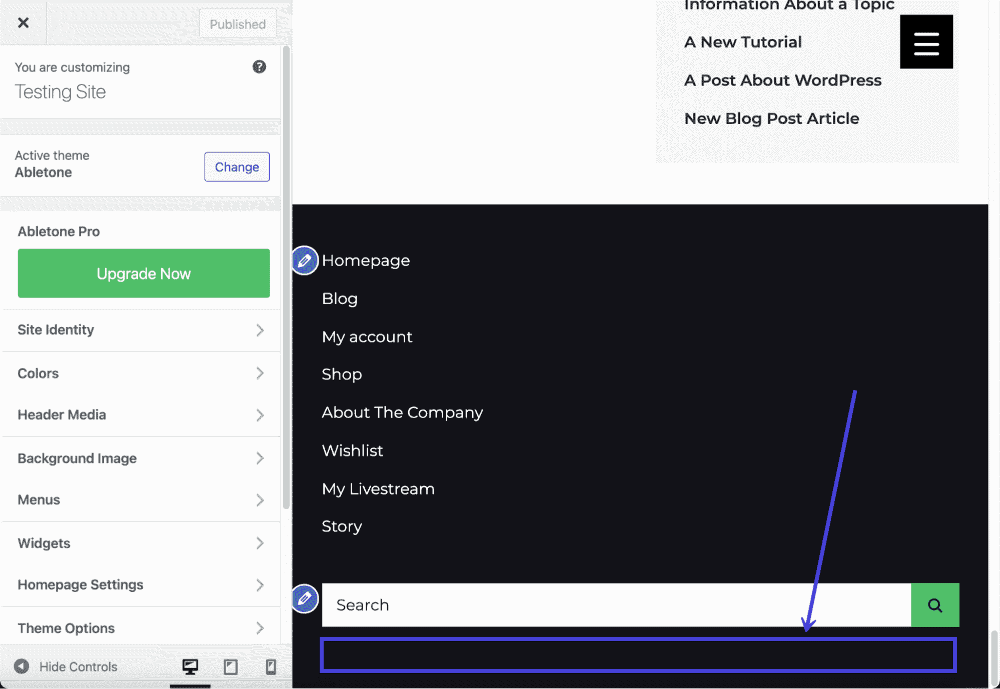

No more footer credit!.


如前所述，一种隐藏页脚的方法，同时也支持主题开发者和获得更好的特性，就是升级到主题的高级版本。留意仪表板上的一个按钮，以升级到专业版，或前往开发者网站进行支付。

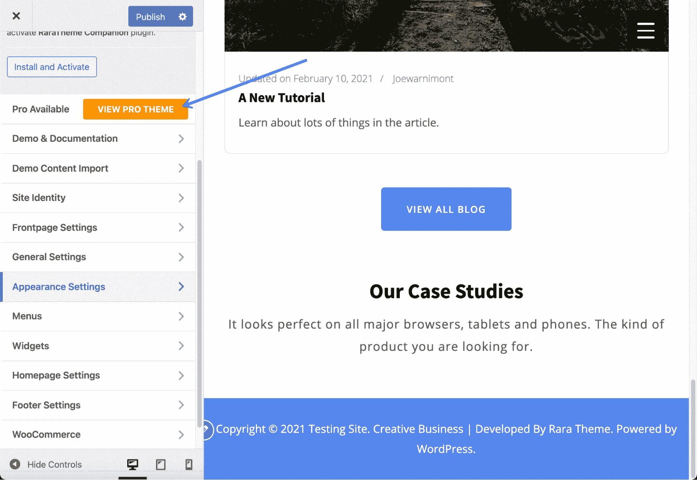

Consider upgrading to premium theme versions to remove footer credits.


## 如何完全删除 WordPress 页脚

虽然大多数网站都不推荐，但是在某些情况下完全删除 WordPress 页脚有时是有意义的。

如果你发现一个 WordPress 的页脚造成了太多的混乱(这在登陆页面中很常见)，或者如果你不希望页脚被搜索引擎抓取，把页脚从等式中完全去掉可能不是一个坏的选择。

但是，请记住，你并没有从你的 WordPress 文件中删除页脚。footer.php 文件是 WordPress 文件的核心部分，所以你必须离开它。然而，我们可以使用 CSS 代码告诉 WordPress 不要显示页脚及其内容。

要完全隐藏 WordPress 页脚，进入**主题定制器**，点击**附加 CSS** 标签。

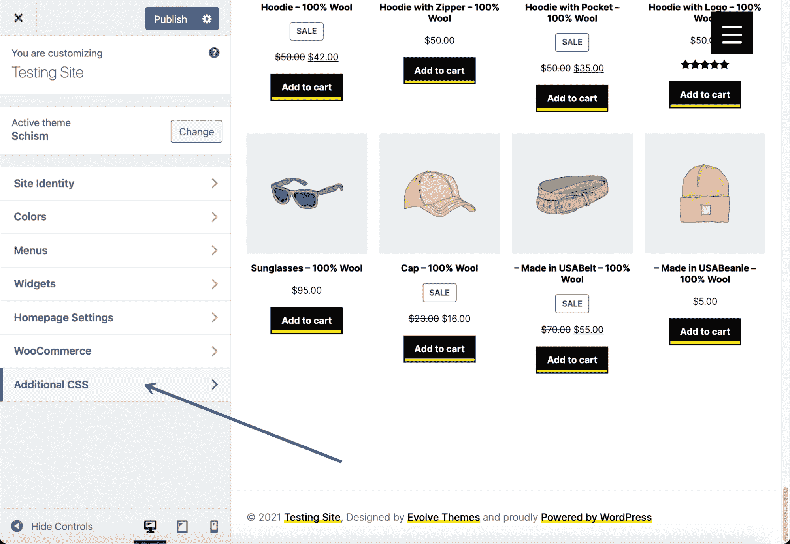

Click on the “Additional CSS” tab.


目标是粘贴 CSS 来告诉 WordPress 我们不想在我们的网站上看到页脚。

我们试图隐藏这个例子中的所有内容，从版权信息到 WordPress 和主题开发者名单。您还可以使用这种方法来隐藏页脚中的窗口小部件和菜单等项目。

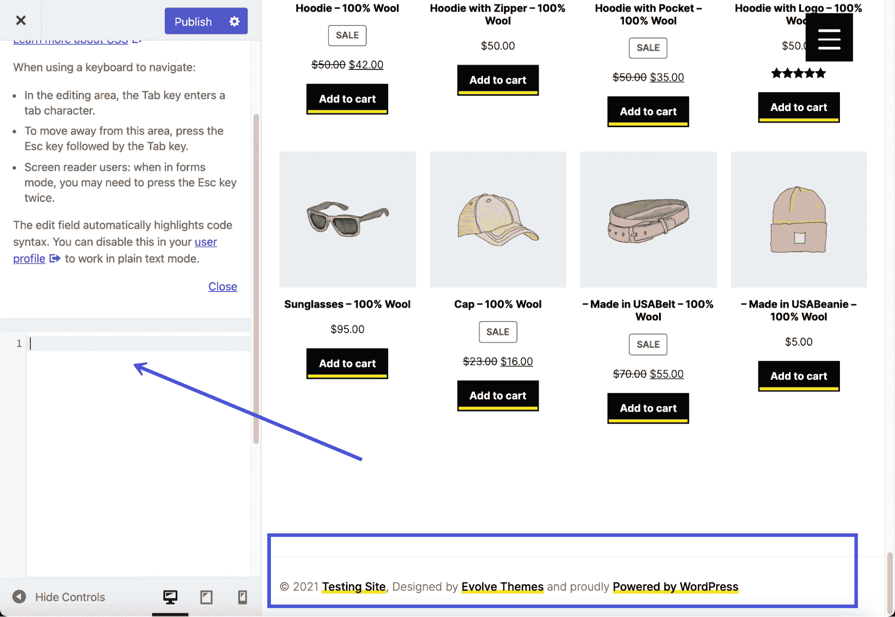

The Custom CSS module.


继续将以下代码粘贴到 **CSS** 框中:

```
footer{

display:none;

}
```

这告诉 WordPress 隐藏**footer.php**文件中的所有内容。该文件保留在您的文件目录中，以防您将来想要重新添加内容。

主题定制器预览现在应该显示一个空格。确保点击**发布**按钮，在前端查看结果。

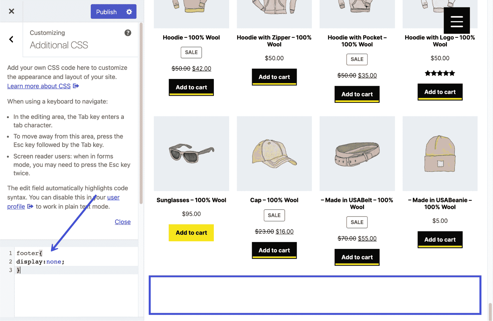

Paste in the CSS code.


虽然 CSS 应该适用于大多数主题，但是您可能会发现主题开发人员有不同的文件配置。另一种可能删除大部分页脚内容的方法是使用下面的代码，而不是前面讨论的代码:

```
.site-info { display:none; }
```

这个选项不太可能奏效，但是主题开发者在页脚的**模板部件**文件夹中制作一个名为**site-info.php**的文件也不是没有过。

[从链接到支持文档和社交媒体页面，你的网站页脚包含了很多重要信息。💪在本指南中了解其工作原理⤵️ 点击推文](https://twitter.com/intent/tweet?url=https%3A%2F%2Fkinsta.com%2Fblog%2Fhow-to-edit-footer-in-wordpress%2F&via=kinsta&text=From+links+to+support+documents+and+social+media+pages%2C+your+website+footer+contains+a+lot+of+important+info.+%F0%9F%92%AA+Learn+how+it+works+in+this+guide+%E2%A4%B5%EF%B8%8F&hashtags=WordPress%2CWPTips)

## 摘要

WordPress 页脚有很多用途，从添加社交媒体按钮到显示最近的博客文章、支持页面和表单。这样做的目的是利用这些额外的空间，因为在你的主菜单上放太多的链接或者试图在你的侧边栏上塞满大量的内容是不明智的。

你已经学会了很多编辑 WordPress 页脚的方法。我们希望你现在可以成功地在任何 WordPress 网站上编辑和定制页脚！

如果你对在 WordPress 中编辑页脚有任何问题，请在下面的评论中告诉我们！

* * *

让你所有的[应用程序](https://kinsta.com/application-hosting/)、[数据库](https://kinsta.com/database-hosting/)和 [WordPress 网站](https://kinsta.com/wordpress-hosting/)在线并在一个屋檐下。我们功能丰富的高性能云平台包括:

*   在 MyKinsta 仪表盘中轻松设置和管理
*   24/7 专家支持
*   最好的谷歌云平台硬件和网络，由 Kubernetes 提供最大的可扩展性
*   面向速度和安全性的企业级 Cloudflare 集成
*   全球受众覆盖全球多达 35 个数据中心和 275 多个 pop

在第一个月使用托管的[应用程序或托管](https://kinsta.com/application-hosting/)的[数据库，您可以享受 20 美元的优惠，亲自测试一下。探索我们的](https://kinsta.com/database-hosting/)[计划](https://kinsta.com/plans/)或[与销售人员交谈](https://kinsta.com/contact-us/)以找到最适合您的方式。