# 构建定制的古腾堡积木:权威积木开发教程

> 原文：<https://kinsta.com/blog/gutenberg-blocks/>

许多人抱怨开始构建古腾堡块和应用程序的障碍。学习曲线很陡，主要是由于安装和配置开发环境的难度。此外，扎实的 JavaScript、Node.js、React 和 Redux 知识是这个相当复杂的食谱的必备要素。

官方的 [WordPress Block Editor 手册](https://developer.wordpress.org/block-editor/handbook/tutorials/create-block/)为开发者提供了大量的信息，但是你可能会发现自己迷失在细节的海洋中。

值得一提的是古腾堡项目的首席建筑师马蒂亚斯·文图拉在接受 WP Tavern 采访时的报道:

> 虽然有些人可以很快学会，但这对人们来说仍然是一个很大的障碍。我认为这有几个层面；文档在组织和表达方面都可以好一个数量级。我希望我们能在那里做得更多。

考虑到这一点，我们决定提供一个循序渐进的教程，旨在帮助我们的读者开始古腾堡块开发。

听起来有趣吗？让我们开始吧！

## 古腾堡区块开发先决条件

对于本教程，唯一需要的技能是对 WordPress 插件开发有很好的了解，至少对 HTML 、CSS、JavaScript 和 React 有[的基本理解。](https://kinsta.com/blog/html-best-practices/)


这将是一个雄心勃勃的项目吗？你打赌它会是！

在完整性和简单性之间找到合适的折衷，或者决定包含哪些主题和省略哪些主题并不容易。

希望中高级读者原谅我们没有深入钻研某些概念，比如[反应状态](https://reactjs.org/docs/state-and-lifecycle.html)、[还原存储](https://redux.js.org/api/store)、[高阶元件](https://reactjs.org/docs/higher-order-components.html)等等。这些主题需要额外的空间和注意力，并且对于开始块开发来说可能太高级了(除非您是 React 开发人员)。

出于同样的原因，我们将不涉及一些与 Gutenberg 块开发相关的更高级的主题，例如[动态块](https://kinsta.com/blog/dynamic-blocks/)和[元盒](https://developer.wordpress.org/block-editor/how-to-guides/metabox/)。

有了这篇文章结束时你将获得的知识，你将能够马上开始享受乐趣并富有成效。

一旦你开始建造积木，你就可以进一步提高你的技能，自己建造更先进的古腾堡积木。

[Starting with Gutenberg block development can be intimidating at first… 😵‍💫 But no fear! This complete guide for beginners has you covered 🙏Click to Tweet](https://twitter.com/intent/tweet?url=https%3A%2F%2Fkinsta.com%2Fblog%2Fgutenberg-blocks%2F&via=kinsta&text=Starting+with+Gutenberg+block+development+can+be+intimidating+at+first%E2%80%A6+%F0%9F%98%B5%E2%80%8D%F0%9F%92%AB+But+no+fear%21+This+complete+guide+for+beginners+has+you+covered+%F0%9F%99%8F&hashtags=Gutenberg%2CDevelopment) ## 什么是古腾堡地块？

自 2018 年 12 月首次发布以来，[块编辑器](https://kinsta.com/blog/gutenberg-wordpress-editor/)在各个方面都有了很大的改进:更[强大的 API](https://developer.wordpress.org/block-editor/reference-guides/block-api/)，更高级的用户界面，改进的可用性，大量的新块，[首次实现全站点编辑](https://kinsta.com/blog/wordpress-5-8/#full-site-editing-features-in-wordpress-58)，等等。

简而言之，即使 Gutenberg 仍在大力开发中，但它已经走过了漫长的道路——今天，block editor 作为一个可靠的、功能性的页面和站点构建器，已经是一个成熟的候选者。

从开发者的角度来看，Gutenberg 是一个基于 React 的[单页应用](https://en.wikipedia.org/wiki/Single-page_application) (SPA)，允许 WordPress 用户在 WordPress 中创建、编辑和删除内容。然而，这不应该让你想到增强版的[传统内容编辑器](https://kinsta.com/blog/wordpress-tinymce-editor/)。

我们想弄清楚这一点:


古腾堡是*而不是*一个普通的所见即所得编辑。相反，它重新定义了 WordPress 的整个编辑体验。


在古腾堡，内容被分成块，块是用户可以用来创建帖子和页面或他们的整个网站的“砖块”。

但是技术上什么是块呢？

我们喜欢 [WordPress 的定义](https://developer.wordpress.org/block-editor/reference-guides/packages/packages-blocks/):

> *“块”是一个抽象术语，用于描述组成网页内容或布局的标记单元。这个想法将我们今天在 WordPress 中实现的概念与短代码、自定义 HTML 以及将发现嵌入到一个一致的 API 和用户体验中相结合。*

标题、段落、列、图像、图库以及组成编辑器界面的所有元素，从侧边栏面板到块工具栏控件，都是 React 组件。

那么，什么是 React 组件呢？W3Schools 提供了[如下定义](https://www.w3schools.com/react/react_components.asp):

> 组件是独立的、可重用的代码。它们的作用与 JavaScript 函数相同，但是独立工作，并通过一个`render()`函数返回 HTML。

[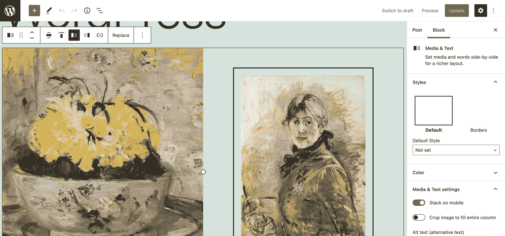](https://kinsta.com/wp-content/uploads/2021/10/working-with-blocks.jpg)

Working with Gutenberg blocks in WordPress 5.8.


虽然与传统的 WordPress 编辑器相比，Gutenberg 提供的编辑体验是新的，但是 WordPress 在数据库中存储内容的方式没有任何改变。这是因为 Gutenberg 是一个在 WordPress 内运行的应用程序，但并没有改变 CMS 的核心工作方式。

使用 Gutenberg 创建的文章(包括文章、页面和自定义文章类型)仍然存储在`wp_posts`表中，就像使用经典编辑器一样。

但是在用古腾堡创建的帖子中，你会发现表格中的附加信息，这些信息代表了通过经典编辑器和古腾堡创建的帖子之间的根本区别。

这些信息看起来像 HTML 注释，它们有特定的功能:分隔块:

[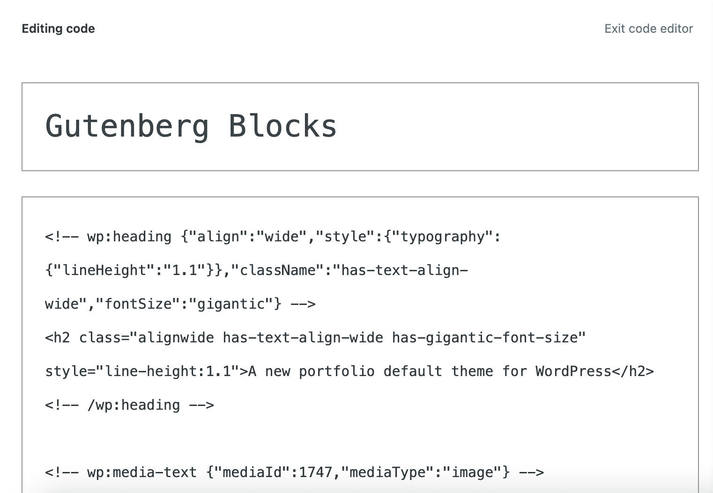](https://kinsta.com/wp-content/uploads/2021/10/code-editor-view.jpg)

A blog post in Code editor view.


告诉 WordPress 什么块将被呈现在屏幕上。它们还为 JSON 对象中的块属性提供值。这些道具决定了块应该在屏幕上呈现的方式:

[](https://kinsta.com/wp-content/uploads/2021/10/post-content.jpg)

A blog post stored in the `wp_posts` table.


## 设置你的 WordPress 开发环境

建立一个现代化的 JavaScript 开发环境需要扎实的高级技术知识，如 [Webpack](https://webpack.js.org/) 、 [React](https://reactjs.org/) 和 [JSX](https://facebook.github.io/jsx/) 、 [Babel](https://babeljs.io/docs/en/index.html) 、 [ESLint](https://eslint.org/) 等。

被恐吓？不要！WordPress 社区已经通过提供强大的工具来帮助你避免混乱的手动配置过程。

为了简单起见，我们不会在本文中讨论[trans pilling](https://kinsta.com/blog/transpiling-php/)(尽管如此，我们还是建议您在学习了块开发的基础知识之后熟悉它)。相反，我们将介绍两个替代工具，您可以使用它们在几分钟内快速轻松地建立一个现代 JavaScript 开发环境。您可以选择最适合您的项目的方法。

建立一个 JavaScript 开发环境来构建 Gutenberg 块需要三个步骤:

1.  [安装 Node.js 和 npm](#node-npm)
2.  [设置开发环境](#dev-environment)
3.  [设置屏蔽插件](#block-plugin)

让我们开始吧。

### 1.安装 Node.js 和 npm

在安装开发环境和注册第一个块之前，您需要安装 [Node.js](https://kinsta.com/it/knowledgebase/node-js/) 和节点包管理器(npm)。


### 信息

[Node.js](https://nodejs.org/en/) 是基于 Chrome 的 V8 JavaScript 引擎构建的 JavaScript 运行时。 [npm](https://www.npmjs.com/) ，俗称节点包管理器，被认为是“世界上最大的软件注册表”


你可以通过几种不同的方式在[安装 Node.js 和 npm](https://docs.npmjs.com/downloading-and-installing-node-js-and-npm) 。但是首先，你可能想检查一下软件是否已经安装在你的机器上。

为此，启动终端并运行以下命令:

```
node -v
```

如果结果是`command not found`，那么 Node.js 没有安装在您的计算机上，您可以继续安装。

对于本文，我们选择了最简单的安装选项，即[节点安装程序](https://nodejs.org/en/download/)。您只需下载与您的操作系统相对应的版本，并启动安装向导:

[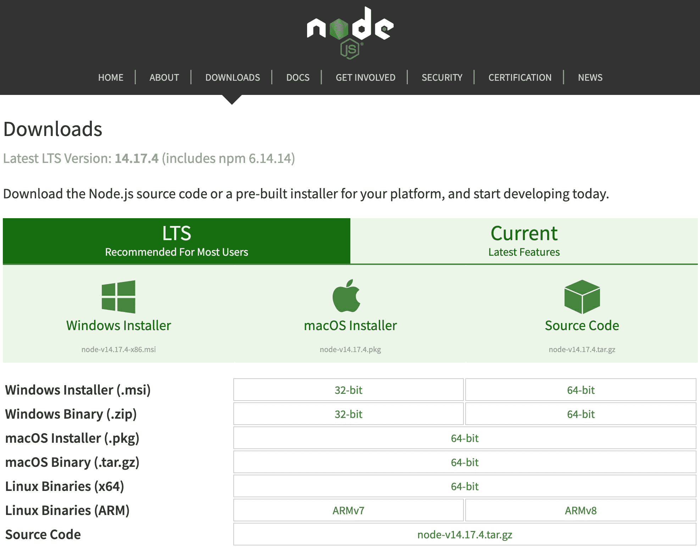](https://kinsta.com/wp-content/uploads/2021/10/nodejs-downloads.jpg)

Node.js Downloads page.


一旦安装了 Node.js，再次在终端中运行命令`node -v`。您还可以运行`npm -v`命令来确认您有可用的 npm 包。

您现在配备了以下工具:

*   `npx` Node.js 包运行器([见文档](https://nodejs.dev/learn/the-npx-nodejs-package-runner))。这允许您运行一个`npm`命令，而无需先安装它。
*   `npm` Node.js 包管理器([见文档](https://docs.npmjs.com/))。这用于安装依赖项和运行脚本。

下一步是安装开发环境。

### 2.设置您的开发环境

一旦你在本地机器上有了 Node.js 和 npm 的最新版本，你将需要一个 WordPress 的开发环境。

你可以使用像 DevKinsta 这样的本地开发环境，也可以使用官方的 WordPress 工具。让我们来看看这两个选项。

#### 选项 1:本地开发环境(DevKinsta)

只需点击几下，你就可以[使用](https://kinsta.com/ebooks/wordpress/wordpress-local-development/) [DevKinsta](https://kinsta.com/devkinsta/) (我们现代的本地 WordPress 开发工具)在本地安装 WordPress。或者你可以选择不同的本地开发工具，例如 [MAMP](https://kinsta.com/blog/install-wordpress-locally/#how-to-install-wordpress-locally-on-mac-using-mamp) 或 [XAMPP](https://kinsta.com/blog/install-wordpress-locally/#how-to-install-wordpress-locally-using-xampp) :

[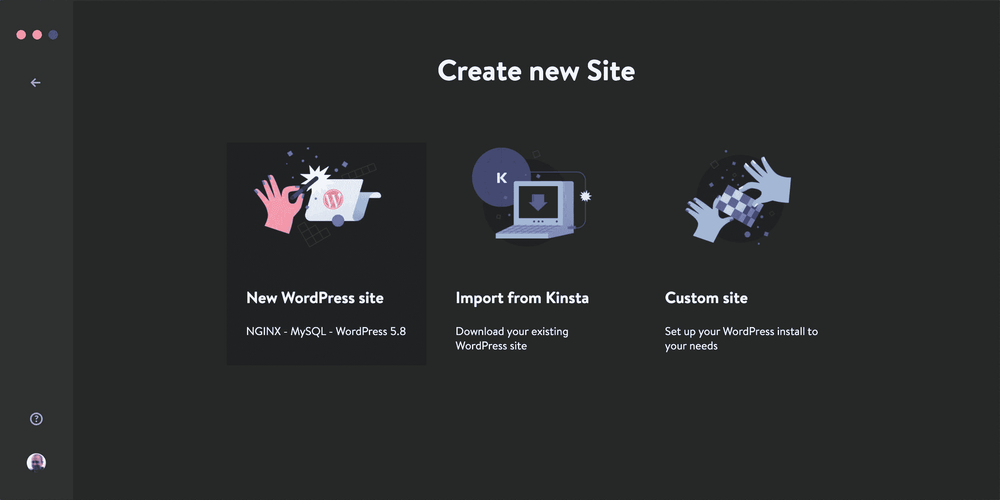](https://kinsta.com/wp-content/uploads/2021/10/dev-kinsta-create-new-site.jpg)

Create a new WordPress website in DevKinsta.


#### 备选方案 2: wp-env

你也可以选择官方的 [`wp-env`工具](https://www.npmjs.com/package/@wordpress/env)，它提供了一个本地的 WordPress 开发环境，你可以直接从命令行启动。诺亚·阿廉[这样定义](https://make.wordpress.org/core/2020/03/03/wp-env-simple-local-environments-for-wordpress/):

> 本地 WordPress 环境现在就像运行一个命令一样简单。`wp-env`是一个用于无痛本地 WordPress 环境的零配置工具。它提供了对选项的决策，这样用户可以快速启动 WordPress 而不浪费时间。事实上，我们的目标是让所有人都能轻松访问这些环境——无论您是开发人员、设计人员、经理还是其他任何人。

如果你决定试一试，安装`wp-env`需要最少的努力。只需遵循以下步骤:

##### 步骤 1:确认 Docker 和 Node.js 安装

为了满足技术要求，你首先需要在你的电脑上安装 [Docker](https://www.docker.com/) 和 Node.js。这是因为`wp-env`创建了一个运行 WordPress 网站的 Docker 实例。对代码的任何修改都会立即反映在 WordPress 实例中。

##### 步骤 2:从命令行安装`@wordpress/env`

随着 Docker 和 Node.js 在你的计算机上运行，你可以继续安装 WordPress [开发环境](https://developer.wordpress.org/block-editor/handbook/tutorials/devenv/#wordpress-development-site)。

您可以在全局或本地安装`wp-env`。要在全局范围内实现这一点，您需要在插件目录中运行以下命令(在下面的“重要”通知框中有更多相关信息):

```
npm install -g @wordpress/env
```

让我们来分解一下:

*   `npm install` [安装软件包](https://docs.npmjs.com/cli/v7/commands/npm-install)。
*   附加到命令[的`-g`全局安装指定的包](https://docs.npmjs.com/downloading-and-installing-packages-globally)。
*   `@wordpress/env`就是你要安装的[包。](https://www.npmjs.com/package/@wordpress/env)


### 重要的

默认情况下，在 Mac 或 Linux 上[节点包安装在**/usr/local/lib/node _ modules**中](https://nodejs.dev/learn/where-does-npm-install-the-packages)。

如果当前用户没有该目录的写权限，将发出 EACCES 错误。了解更多关于[解决全局安装包时的 EACCES 权限错误](https://docs.npmjs.com/resolving-eacces-permissions-errors-when-installing-packages-globally)。


要确认`wp-env`已成功安装，请运行以下命令:

```
wp-env --version
```

您应该看到当前的`wp-env`版本，这意味着您现在可以从您的插件的文件夹中使用下面的命令[启动环境:](https://www.npmjs.com/package/@wordpress/env#user-content-usage)

```
wp-env start
```

您可以使用以下地址访问 WordPress 仪表盘:

*   http://localhost:8888/WP-admin/

默认凭据如下:

*   用户名:`admin`
*   密码:`password`

### 设置您的阻止插件

现在，您需要一个 starter block 插件来构建。但是不用手动创建一个包含所有必需文件和文件夹的开发模块插件，您可以简单地运行一个开发工具，提供您开始开发模块所需的所有文件和配置。

同样，您有几个选项可以选择。让我们来看看每一个。

#### 选项 1:用@wordpress/create-block 设置一个 Block 插件

[@wordpress/create-block](https://developer.wordpress.org/block-editor/reference-guides/packages/packages-create-block/) 是官方用于创建古腾堡区块的零配置工具:

> Create Block 是官方支持的为 WordPress 插件注册块的方法。它提供了一个没有配置的现代构建设置。它生成 PHP、JS、CSS 代码，以及启动项目所需的一切。
> 
> 它在很大程度上受到了 [create-react-app](https://create-react-app.dev/docs/getting-started/) 的启发。向 [@gaearon](https://github.com/gaearon) 、整个脸书团队和 React 社区致敬。

一旦您的本地环境启动并运行，您可以通过简单地运行`npx @wordpress/create-block` [命令](https://www.npmjs.com/package/@wordpress/create-block)来设置一个启动块，它将提供您需要的所有文件和文件夹[来创建插件脚手架](https://developer.wordpress.org/block-editor/handbook/tutorials/create-block/wp-plugin/)并注册一个新的块。

让我们做一个测试，看看它是如何工作的。

从命令行工具中，导航到 **/wp-content/plugins/** 目录，并运行以下命令:

```
npx @wordpress/create-block my-first-block
```

当要求确认时，输入`y`继续:

[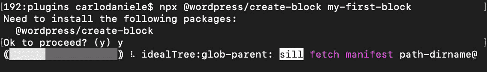](https://kinsta.com/wp-content/uploads/2021/10/create-block-my-first-block.jpg)

Creating a block with @wordpress/create-block.


这个过程需要一些时间。完成后，您应该会得到以下响应:

[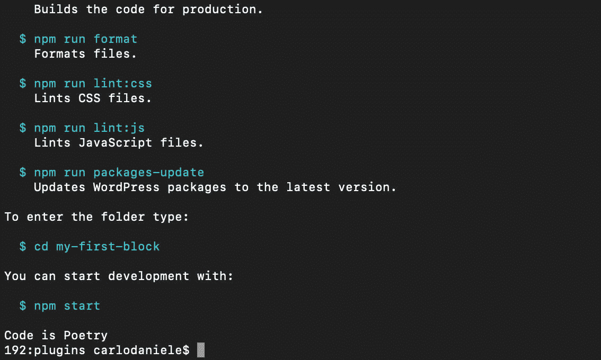](https://kinsta.com/wp-content/uploads/2021/10/wordpress-create-block-completed.jpg)

The block plugin has been created.


就是这样！

现在启动你的 WordPress 开发环境，进入 WordPress 仪表盘中的**插件**屏幕。一个名为“我的第一块”的新插件应该已经添加到您的插件列表中:

[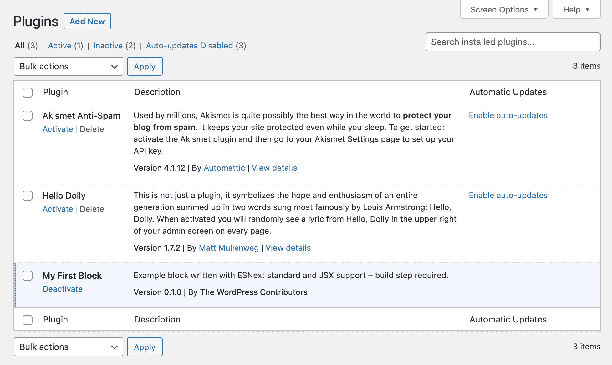](https://kinsta.com/wp-content/uploads/2021/10/my-first-block-plugin.jpg)

The block plugin has been successfully installed.


### 信息

如果你正在使用`wp-env`工具并从包含插件的目录中运行`wp-env start`，它将自动安装并激活插件。如果你从任何其他目录运行`wp-env start`，一个通用的 WordPress 环境将被创建(参见 [WordPress 开发网站](https://developer.wordpress.org/block-editor/handbook/tutorials/devenv/#wordpress-development-site))。


如果需要，激活插件，创建新的博客文章，向下滚动块插入器到 **Widgets** 部分，并选择您的新块:

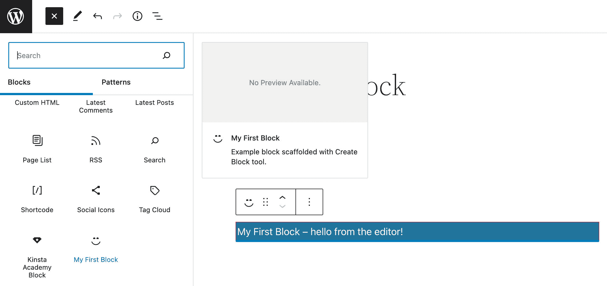

An example block created with @wordpress/create-block.


现在回到终端，将当前目录更改为 **my-first-block** :

```
cd my-first-block
```

然后运行以下命令:

```
npm start
```

这使您能够在开发模式下运行插件。要创建生产代码，您应该使用以下命令:

```
npm run build
```

#### 选项 2:使用 create-guten-block 设置块插件

[`create-guten-block`](https://github.com/ahmadawais/create-guten-block) 是一款用于构建古腾堡积木的第三方开发工具:

> *`create-guten-block`是零配置 dev-toolkit (#0CJS)在不配置 React、webpack、ES6/7/8/Next、ESLint、Babel 等的情况下，在几分钟内开发 WordPress Gutenberg 块。*

就像官方的`create-block`工具一样，`create-guten-block`基于 [create-react-app](https://create-react-app.dev/docs/getting-started) ，可以帮你轻松生成你的第一个屏蔽插件。

这个工具包提供了创建一个现代 WordPress 插件所需的一切，[包括下面的](https://github.com/ahmadawais/create-guten-block#whats-included):

> *   反应，JSX 和 ES6 语法支持。
> *   幕后的 webpack 开发/生产构建流程。
> *   ES6 之外的额外语言，比如对象扩展操作符。
> *   自动前缀的 CSS，所以你不需要-webkit 或其他前缀。
> *   一个构建脚本，将 JS、CSS 和图像与源地图捆绑在一起用于生产。
> *   使用单一依赖 cgb-scripts 轻松更新上述工具。

请注意以下警告:

> 代价是这些工具被预先配置为以特定的方式工作。如果您的项目需要更多的定制，您可以[“弹出”](https://github.com/ahmadawais/create-guten-block#--npm-run-eject)并定制它，但是之后您将需要维护这个配置。

一旦你有了一个本地的 WordPress 网站，启动你的命令行工具，导航到你的安装的 **/wp-content/plugins** 文件夹，然后运行下面的命令:

```
npx create-guten-block my-first-block
```

在创建项目结构和下载依赖项时，您需要等待一两分钟:

[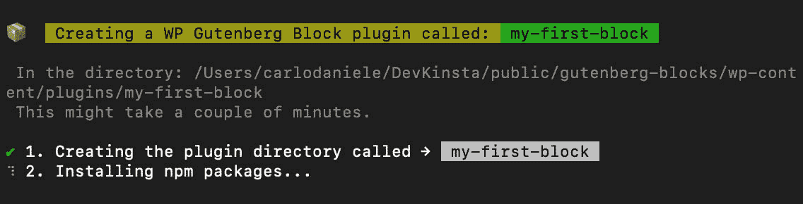](https://kinsta.com/wp-content/uploads/2021/10/create-guten-block.jpg)

Creating a Gutenberg block with create-guten-block.


该过程完成后，您应该会看到以下屏幕:

[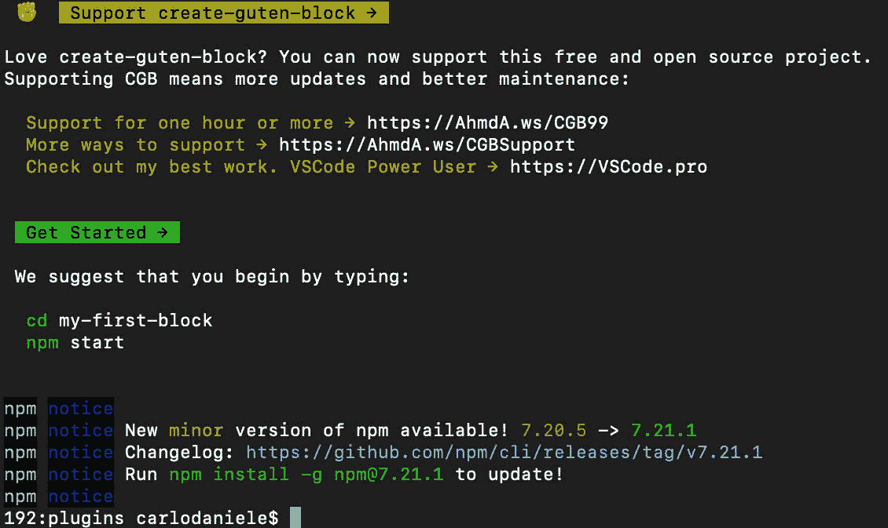](https://kinsta.com/wp-content/uploads/2021/10/create-guten-block-complete.jpg)

Gutenberg block successfully created with create-guten-block.


下一张图片显示了终端在 Visual Studio 代码中运行的项目结构:

[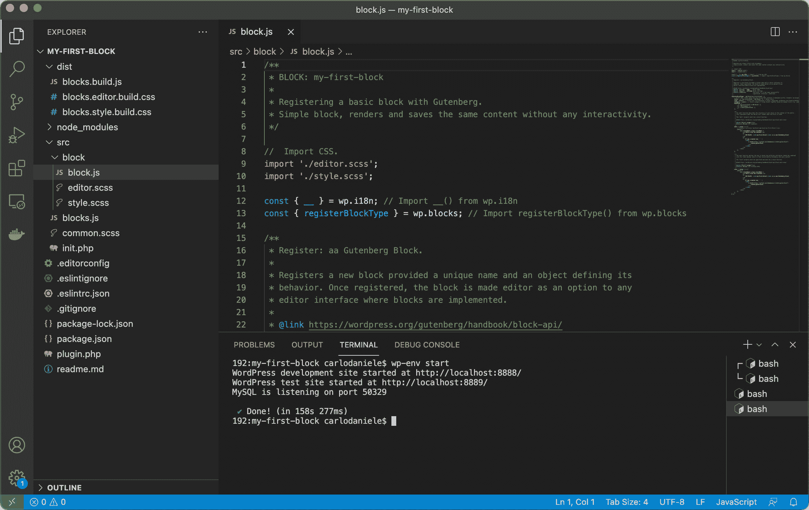](https://kinsta.com/wp-content/uploads/2021/10/create-guten-block-plugin-in-visual-studio-code.jpg)

The block plugin in Visual Studio Code.


现在回到你的 WordPress 仪表盘。插件屏幕中应该会列出一个新项目——它是 **my-first-block** 插件:

[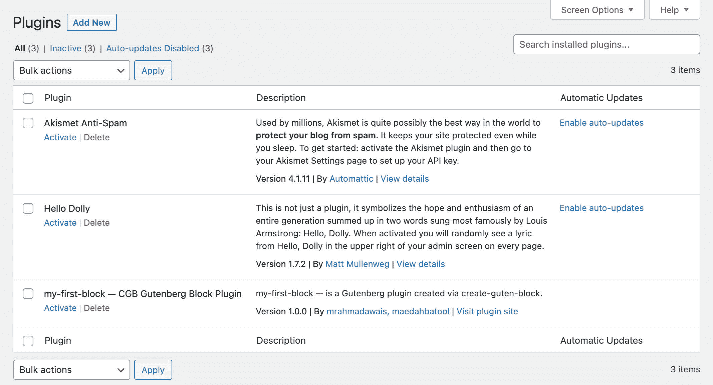](https://kinsta.com/wp-content/uploads/2021/10/plugins-screen.jpg)

The Plugins screen with a new plugin created with create-guten-block.


激活插件并返回终端。将当前目录更改为 **my-first-block** ，然后运行`npm start`:

```
cd my-first-block
npm start
```

您应该会得到以下响应:

[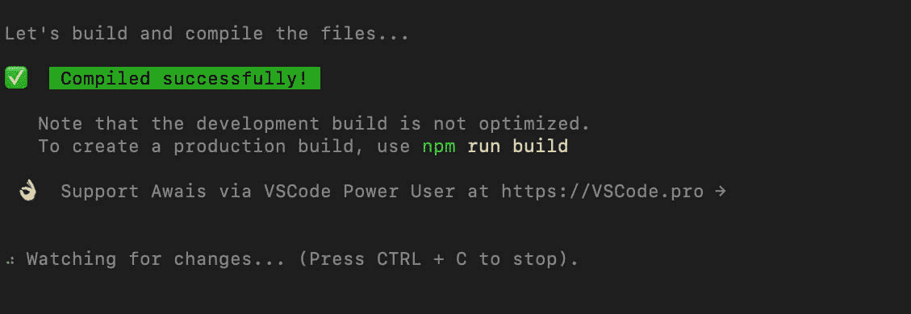](https://kinsta.com/wp-content/uploads/2021/10/npm-started.jpg)

npm started.


同样，这使您能够在开发模式下运行插件。要创建生产代码，您应该使用:

```
npm run build
```

激活插件并创建一个新的帖子或页面，然后浏览您的区块并选择您的全新古腾堡区块:

[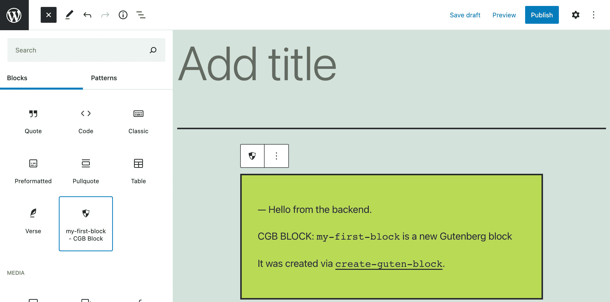](https://kinsta.com/wp-content/uploads/2021/10/first-block-created-with-create-guten-block.jpg)

A new block created with create-guten-block.


如需更深入的概述或出现错误，请参考 Ahmad Awais 提供的[文档。
T3】](https://github.com/ahmadawais/create-guten-block)

## 启动块脚手架的演练

无论您选择两个开发工具中的哪一个，您现在都有了一个块脚手架，可以用来作为构建块插件的起点。

但是[块脚手架](https://make.wordpress.org/core/2020/02/28/new-wordpress-create-block-package-for-block-scaffolding/)到底是什么？

> *Block scaffolding 是一个速记术语，描述了 WordPress 识别一个块所需的支持目录结构。通常，该目录包括像 index.php、 **index.js** 、 **style.css** 等文件，这些文件又包含像`register_block_type`这样的调用。*

我们选择了官方的**创建块**开发工具，因为[在块编辑手册](https://developer.wordpress.org/block-editor/handbook/tutorials/devenv/)中使用。但是即使你决定使用像`create-guten-block`这样的第三方工具，你的体验也不会有太大的不同。

说完这些，让我们更深入地研究一下 [`create-block`工具](https://developer.wordpress.org/block-editor/handbook/tutorials/create-block/)。

### 仔细查看创建块开发工具

正如我们上面提到的， [Create Block](https://www.npmjs.com/package/@wordpress/create-block) 是创建古腾堡块的官方命令行工具。在您的终端中运行`@wordpress/create-block`生成注册新块类型所需的 PHP、JS 和 SCSS 文件和代码:

```
npx @wordpress/create-block [options] [slug]
```

*   `[slug]`(可选)—用于分配块段塞并安装插件
*   `[options]`(可选)—可用选项

默认情况下，会分配一个 [ESNext](https://developer.wordpress.org/block-editor/how-to-guides/javascript/esnext-js/) 模板。这意味着你将得到 JavaScript 的[下一版本，增加了](https://www.freecodecamp.org/news/es5-to-esnext-heres-every-feature-added-to-javascript-since-2015-d0c255e13c6e/) [JSX 语法](https://en.wikipedia.org/wiki/JSX_(JavaScript))。

如果省略块名，该命令将以交互模式运行，使您可以在生成文件之前自定义多个选项:

```
npx @wordpress/create-block
```

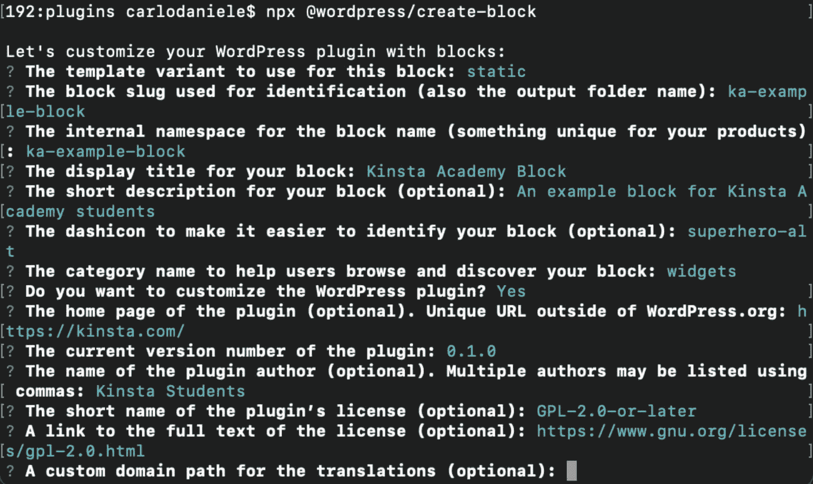

Running Create Block in interactive mode


下图显示了使用官方创建块工具创建的块插件的文件结构:

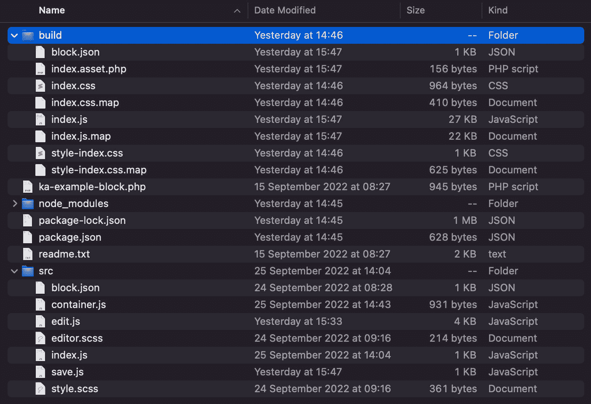

Files and folders of a block plugin created with @wordpress/create-block.


也就是说，让我们浏览一下我们新的 block 插件的主要文件和文件夹。

### 插件文件

用主插件文件[在服务器](https://developer.wordpress.org/block-editor/reference-guides/block-api/block-metadata/#php-server-side)上注册块:

```
<?php
/**
 * Plugin Name:       Kinsta Academy Block
 * Plugin URI:        https://kinsta.com/
 * Description:       An example block for Kinsta Academy students
 * Requires at least: 5.9
 * Requires PHP:      7.0
 * Version:           0.1.0
 * Author:            Kinsta Students
 * License:           GPL-2.0-or-later
 * License URI:       https://www.gnu.org/licenses/gpl-2.0.html
 * Text Domain:       ka-example-block
 *
 * @package           ka-example-block
 */

/**
 * Registers the block using the metadata loaded from the `block.json` file.
 * Behind the scenes, it registers also all assets so they can be enqueued
 * through the block editor in the corresponding context.
 *
 * @see https://developer.wordpress.org/reference/functions/register_block_type/
 */
function ka_example_block_ka_example_block_block_init() {
	register_block_type( __DIR__ . '/build' );
}
add_action( 'init', 'ka_example_block_ka_example_block_block_init' );
```

`register_block_type`函数[使用存储在 **block.json** 文件中的元数据在服务器](https://developer.wordpress.org/reference/functions/register_block_type/)上注册一个块类型。

该函数有两个参数:

*   包括名称空间的块类型名称，或一个到文件夹的路径，该文件夹位于 **block.json** 文件，或一个完整的`WP_Block_Type`对象
*   块类型参数的数组

在上面的代码中，`__DIR__` [幻常数](https://www.php.net/manual/en/language.constants.magic.php)返回当前文件夹。这意味着 **block.json** 文件驻留在 */build* 子文件夹中。

### package.json 文件

[package.json 文件](https://docs.npmjs.com/cli/v7/configuring-npm/package-json)为您的项目定义 JavaScript 属性和脚本。这是您可以安装项目依赖项的地方。

为了更好地理解这个文件的含义，用您最喜欢的代码编辑器打开它:

```
{
	"name": "ka-example-block",
	"version": "0.1.0",
	"description": "An example block for Kinsta Academy students",
	"author": "Kinsta Students",
	"license": "GPL-2.0-or-later",
	"homepage": "https://kinsta.com/",
	"main": "build/index.js",
	"scripts": {
		"build": "wp-scripts build",
		"format": "wp-scripts format",
		"lint:css": "wp-scripts lint-style",
		"lint:js": "wp-scripts lint-js",
		"packages-update": "wp-scripts packages-update",
		"plugin-zip": "wp-scripts plugin-zip",
		"start": "wp-scripts start"
	},
	"devDependencies": {
		"@wordpress/scripts": "^24.1.0"
	},
	"dependencies": {
		"classnames": "^2.3.2"
	}
}
```

`scripts` [属性](https://docs.npmjs.com/cli/v7/using-npm/scripts)是一个[字典，包含使用`npm run [cmd]`在包](https://www.npmjs.com/package/@wordpress/scripts)的[生命周期的不同时间运行的命令](https://docs.npmjs.com/cli/v7/configuring-npm/package-json)。

在本文中，我们将使用下面的命令:

*   `npm run build` —创建(压缩的)生产版本
*   `npm run start`或`npm start` —创建一个(未压缩的)开发构建

`dependencies`和`devDependencies`是将[包名映射到版本](https://docs.npmjs.com/cli/v7/configuring-npm/package-json#dependencies)的两个对象。`dependencies`是生产需要的，而`devDependences`只是局部开发需要的([阅读更多](https://docs.npmjs.com/specifying-dependencies-and-devdependencies-in-a-package-json-file))。

唯一默认的开发依赖是`@wordpress/scripts`包，它被[定义为](https://www.npmjs.com/package/@wordpress/scripts)“一个为 WordPress 开发定制的可重用脚本集合”

### block.json 文件

从 WordPress 5.8 开始， **block.json** [元数据文件](https://developer.wordpress.org/block-editor/reference-guides/block-api/block-metadata/)是注册块类型的[规范方式。](https://kinsta.com/blog/wordpress-5-8/#block-api-enhancements)

拥有一个 **block.json** 文件有几个好处，包括[改进的性能](https://developer.wordpress.org/block-editor/reference-guides/block-api/block-metadata/#benefits-using-the-metadata-file)和在 [WordPress 插件目录上更好的可视性](https://wordpress.org/plugins/):

> *从性能的角度来看，当主题支持延迟加载资产时，用 **block.json** 注册的块将会优化它们的资产队列。只有当块出现在页面上时，`style`或`script`属性中列出的前端 CSS 和 JavaScript 资产才会排队，从而减小页面大小。*

运行`@wordpress/create-block`命令生成以下 **block.json** 文件:

```
{
	"$schema": "https://schemas.wp.org/trunk/block.json",
	"apiVersion": 2,
	"name": "ka-example-block/ka-example-block",
	"version": "0.1.0",
	"title": "Kinsta Academy Block",
	"category": "widgets",
	"icon": "superhero-alt",
	"description": "An example block for Kinsta Academy students",
	"supports": {
		"html": false
	},
	"textdomain": "ka-example-block",
	"editorScript": "file:./index.js",
	"editorStyle": "file:./index.css",
	"style": "file:./style-index.css"
}
```

以下是[默认属性](https://developer.wordpress.org/block-editor/reference-guides/block-api/block-metadata/#block-api)的完整列表:

*   `apiVersion` —该块使用的 API 版本(当前版本为 2)
*   `name` —包括名称空间的块的唯一标识符
*   `version` —块的当前版本
*   `title` —块的显示标题
*   `category` —一个块类别
*   `icon`—[大图标](https://developer.wordpress.org/resource/dashicons/)鼻涕虫或自定义 SVG 图标
*   `description` —在块检查器中可见的简短描述
*   `supports` —控制编辑器中使用的功能的一组选项
*   `textdomain` —插件文本域
*   `editorScript` —编辑器脚本定义
*   `editorStyle` —编辑器样式定义
*   `style`-为块提供替代样式

除了上面列出的属性，您还可以(并且可能会)定义一个`attributes`对象，提供关于您的块所存储的数据的信息。在您的 **block.json** 中，您可以在*键/值*对中设置任意数量的属性，其中键是属性名，值是属性定义。

请看下面的属性定义示例:

```
"attributes": {
	"content": {
		"type": "array",
		"source": "children",
		"selector": "p"
	},
	"align": {
		"type": "string",
		"default": "none"
	},
	"link": { 
		"type": "string", 
		"default": "https://kinsta.com" 
	}
},
```

我们将在文章的后面更深入地研究 **block.json** 文件[，但是你可能也想查看块编辑器手册以获得更多关于 **block.json**](#block-json-at-work) [元数据](https://developer.wordpress.org/block-editor/reference-guides/block-api/block-metadata/)和[属性](https://developer.wordpress.org/block-editor/reference-guides/block-api/block-attributes/)的详细信息。

### src 文件夹

文件夹是开发发生的地方。在该文件夹中，您会找到以下文件:

*   **index.js**
*   **edit.js**
*   **save.js**
*   **editor.scss**
*   **style.scss**

#### 索引. js

**index.js** 文件是你的起点。在这里，您将导入依赖关系并在客户端上注册数据块类型:

```
import { registerBlockType } from '@wordpress/blocks';

import './style.scss';

import Edit from './edit';
import save from './save';
import metadata from './block.json';

registerBlockType( metadata.name, {
	/**
	 * @see ./edit.js
	 */
	edit: Edit,

	/**
	 * @see ./save.js
	 */
	save,
} );
```

第一条语句从`@wordpress/blocks` [包](https://developer.wordpress.org/block-editor/reference-guides/packages/packages-blocks/)中导入`registerBlockType`函数。下面的[导入语句](https://developer.mozilla.org/en-US/docs/Web/JavaScript/Reference/Statements/import)从 *block.json* 文件中导入样式表以及`Edit`和`save`函数和一个元数据对象。

`registerBlockType`函数[在客户端](https://developer.wordpress.org/block-editor/reference-guides/block-api/block-registration/)注册组件。该函数有两个参数:块名和块配置对象。

`Edit`函数提供在块编辑器中呈现的块接口，而`save`函数提供将被序列化并保存到数据库中的结构([阅读更多信息](https://developer.wordpress.org/block-editor/reference-guides/block-api/block-edit-save/))。

#### 编辑. js

**edit.js** 是构建块管理界面的地方:

```
import { __ } from '@wordpress/i18n';
import { useBlockProps } from '@wordpress/block-editor';
import './editor.scss';

export default function Edit() {
	return (
		<p {...useBlockProps()}>
			{__('My First Block – hello from the editor!', 'my-first-block')}
		</p>
	);
}
```

首先，它从`@wordpress/i18n`包(这个包包含一个翻译函数的 JavaScript 版本)中导入`__`函数、 [`useBlockProps`](https://make.wordpress.org/core/2020/11/18/block-api-version-2/) [React 钩子](https://developer.wordpress.org/block-editor/reference-guides/block-api/block-edit-save/#block-wrapper-props)和`editor.scss`文件。

接下来，它导出 React 组件(阅读更多关于[导入](https://developer.mozilla.org/en-US/docs/Web/JavaScript/Reference/Statements/import)和[导出](https://developer.mozilla.org/en-US/docs/Web/JavaScript/Reference/Statements/export)语句的信息)。

#### save.js

**save.js** 文件是我们构建要保存到数据库中的块结构的地方:

```
import { __ } from '@wordpress/i18n';
import { useBlockProps } from '@wordpress/block-editor';

export default function save() {
	return (
		<p {...useBlockProps.save()}>
			{__(
				'My First Block – hello from the saved content!',
				'my-first-block'
			)}
		</p>
	);
}
```

#### editor.scss 和 style.scss

除了脚本之外，两个 [SASS](https://sass-lang.com/) 文件驻留在 **src** 文件夹中。 **editor.scss** 文件包含应用于编辑器上下文中的块的样式，而 **style.scss** 文件包含用于在前端和编辑器中显示[的块的样式。我们将在本指南的第二部分更深入地研究这些文件。](https://developer.wordpress.org/block-editor/contributors/code/coding-guidelines/#scss-file-naming-conventions-for-blocks)

### node_modules 和构建文件夹

`node_modules`文件夹包含节点模块及其依赖关系。我们不会深入研究节点包，因为这超出了本文的范围，但是您可以在本文的[中阅读更多关于 npm 在哪里安装包](https://nodejs.dev/learn/where-does-npm-install-the-packages)的内容。

`build`文件夹包含构建过程产生的 JS 和 CSS 文件。您可以在 [ESNext 语法](https://developer.wordpress.org/block-editor/how-to-guides/javascript/esnext-js/)和 [JavaScript 构建设置](https://developer.wordpress.org/block-editor/how-to-guides/javascript/js-build-setup/)指南中更深入地了解构建过程。

## 项目:建造你的第一个古腾堡街区

是时候把手弄脏了。这一节将教你如何创建一个插件，提供一个名为 Kinsta Academy Block 的 CTA 块。

该块将由两列组成，左边是一个图像，右边是一个文本段落。带有可自定义链接的按钮将放置在文本下方:


The block type you will learn to build in this guide.


这只是一个简单的例子，但它让我们能够涵盖古腾堡区块开发的基础知识。一旦你对基础知识有了清晰的理解，你就可以在[块编辑器手册](https://developer.wordpress.org/block-editor/)和其他大量可用资源的帮助下，继续创建越来越复杂的古腾堡块。


### 信息

本教程中提供的示例代码也可以在 Gist 上找到供您参考。


假设你已经在本地开发环境中运行了最新版本的 WordPress，下面是你将从这里学到的东西:

*   [如何设置启动块插件](#set-up-the-plugin)
*   [block.json 在工作](#block-json-at-work)
*   [使用内置组件:RichText 组件](#using-richtext-component)
*   [向块工具栏添加控件](#adding-block-toolbar-controls)
*   [定制区块设置侧边栏](#settings-sidebar)
*   [添加和定制外部链接](#external-link)
*   [添加多个块样式](#multiple-block-styles)
*   [用 InnerBlocks 组件嵌套块](#innerblocks-component)
*   [其他改进](#additional-improvements)

准备…预备…开始！

### 如何设置启动块插件

启动您的命令行工具并导航到 **/wp-content/plugins** 文件夹:

[](https://kinsta.com/wp-content/uploads/2021/10/new-terminal-at-folder.jpg)

New terminal at folder in Mac OS.


现在，运行以下命令:

```
npx @wordpress/create-block
```

该命令生成 PHP、SCSS 和 JS 文件，用于在交互模式下注册块，允许您轻松地为块添加必要的数据。对于我们的示例，我们将使用以下详细信息:

*   **模板变体**:静态
*   **Block slug**:ka-示例-block
*   **内部名称空间**:ka-示例-块
*   **区块显示标题**:金斯塔学院区块
*   **短积木描述**:金斯塔学院学生的积木示例
*   大世界:超级英雄-alt
*   **类别名称** : widgets
*   你想定制 WordPress 插件吗？:是
*   **插件首页**:https://kinsta.com/
*   **当前插件版本** : 0.1.0
*   **插件作者**:你的名字
*   **许可证**:-
*   **链接到许可证文本**:-
*   **自定义翻译域路径**:-

安装插件和所有依赖项需要几分钟时间。当该过程完成时，您将看到以下响应:

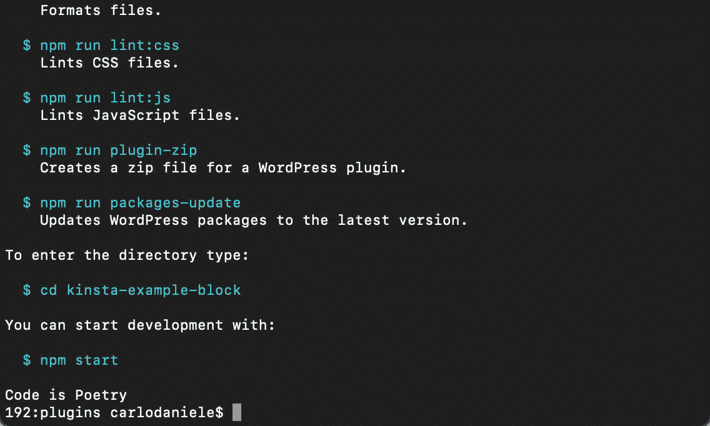

The example block has been installed and registered for development.


现在，从 **/wp-content/plugins** 文件夹运行以下命令:

```
cd ka-example-block
```


### 信息

如果你正在运行你的 WordPress 环境，你应该首先启动 Docker 桌面，然后在你的插件文件夹中运行`wp-env start`。

然后你可以从你的网络浏览器启动*http://localhost:8888/WP-log in*，使用**用户名:管理员**和**密码:密码**登录你的 WordPress 仪表盘。


[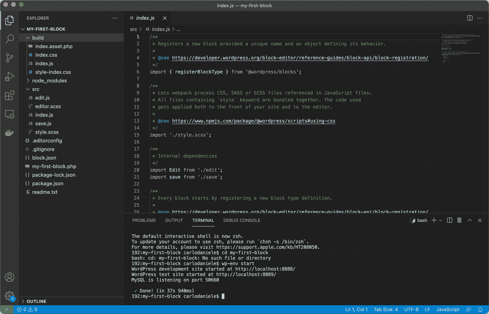](https://kinsta.com/wp-content/uploads/2021/10/visual-studio-code-terminal.jpg)

Running commands from Visual Studio Code Terminal.


最后，在插件的文件夹中(在我们的例子中是 **ka-example-block** )，您可以开始开发:

```
npm start
```

现在打开插件屏幕，找到并激活**金斯塔学院模块**插件:

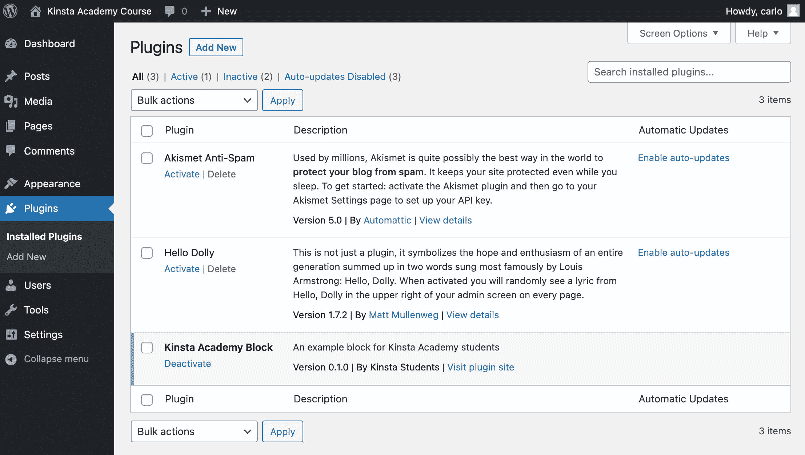

Activate the example block


创建一个新帖子，打开插件，向下滚动到**设计**类别。按一下以新增金斯塔学院区块:

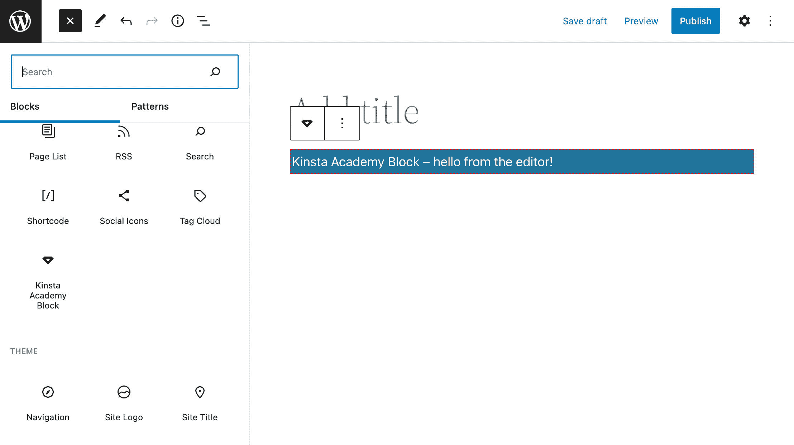

A starter block built with @wordpress/create-block.


### 工作中的 block.json

正如我们前面提到的，服务器端块注册发生在主**中。php** 文件。然而，我们不会在**中定义设置。php** 文件。相反，我们将使用 **block.json** 文件。

因此，再次打开 **block.json** ，仔细查看默认设置:

```
{
	"$schema": "https://schemas.wp.org/trunk/block.json",
	"apiVersion": 2,
	"name": "ka-example-block/ka-example-block",
	"version": "0.1.0",
	"title": "Kinsta Academy Block",
	"category": "widgets",
	"icon": "superhero-alt",
	"description": "An example block for Kinsta Academy students",
	"supports": {
		"html": false
	},
	"textdomain": "ka-example-block",
	"editorScript": "file:./index.js",
	"editorStyle": "file:./index.css",
	"style": "file:./style-index.css"
}
```

#### 脚本和样式

`editorScript`、`editorStyle`和`style`属性提供了前端和后端脚本和样式的相对路径。

你不必手动注册这里定义的脚本和样式，因为它们是由 WordPress 自动注册和排队的。为了证明这一点，启动浏览器检查器并打开**网络**选项卡:

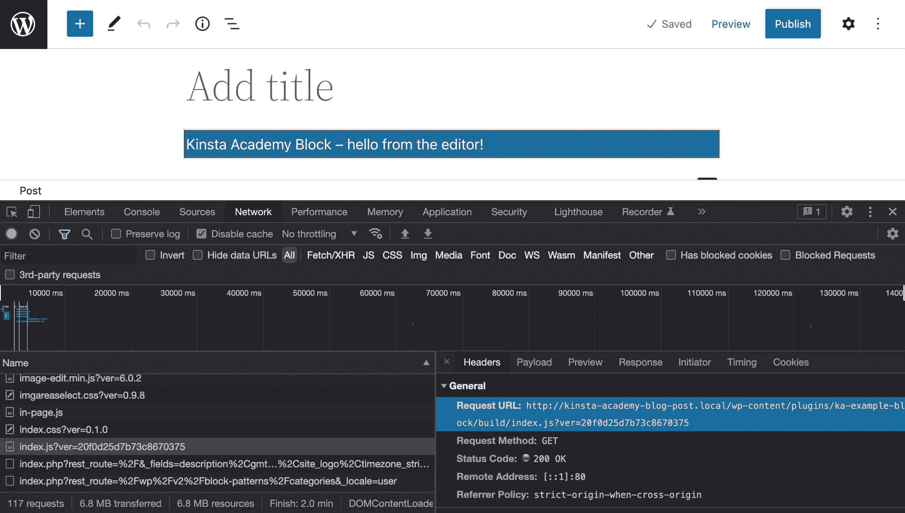

Inspecting resources in Chrome DevTools.


从上图中可以看到，我们的 **index.js** 脚本驻留在 **build** 文件夹中，已经被定期排入**队列，无需添加任何 PHP 代码**。

#### 用户界面标签

`title`和`description`属性提供了在编辑器中识别块所需的标签:

## 注册订阅时事通讯


### 想知道我们是怎么让流量增长超过 1000%的吗？

加入 20，000 多名获得我们每周时事通讯和内部消息的人的行列吧！

[Subscribe Now](#newsletter)

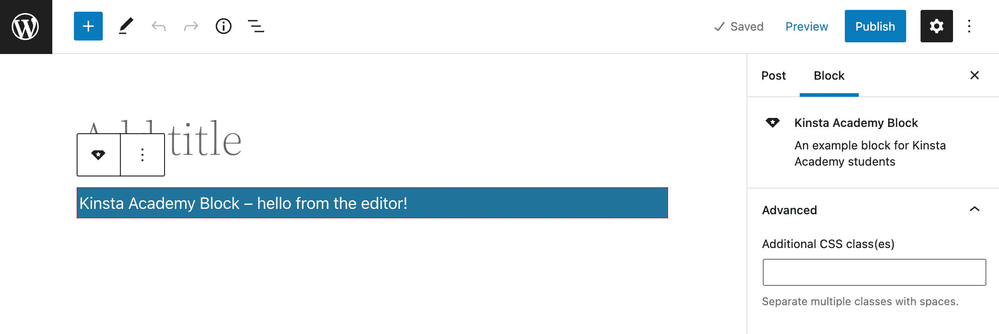

Block name and description in the block sidebar.


#### 关键词

正如我们前面提到的，您可以使用[属性](https://developer.wordpress.org/block-editor/reference-guides/block-api/block-registration/)和[属性](https://developer.wordpress.org/block-editor/reference-guides/block-api/block-attributes/)来精确地配置您的块设置。例如，您可以添加一个或多个`keywords`来帮助用户搜索块:

```
"keywords": [ 
		"kinsta", 
		"academy", 
		"superhero" 
	],
```

如果你现在在快速插入器中输入“金斯塔”、“学院”或“超级英雄”，编辑器会向你推荐金斯塔学院模块:

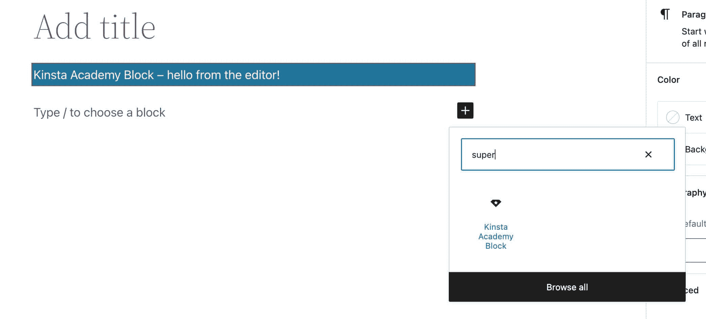

Searching for a block using a keyword in the quick inserter.


#### 本地化

如果您想知道 JSON 文件中字符串的本地化是如何发生的，这里有[答案](https://github.com/WordPress/gutenberg/pull/30293):

> *在 JavaScript 中，您可以使用`@wordpress/blocks`包中的 now `registerBlockTypeFromMetadata`方法，使用从 **block.json** 文件加载的元数据注册一个块类型。所有本地化的属性都自动包装在`_x`(来自`@wordpress/i18n`包)函数调用中，类似于它在 PHP 中使用`register_block_type_from_metadata`的方式。唯一的要求是在 **block.json** 文件中设置`textdomain`属性。*

这里我们用的是`registerBlockType`函数而不是`registerBlockTypeFromMetadata`，因为后者[从](https://github.com/WordPress/gutenberg/pull/32030)[古腾堡 10.7](https://make.wordpress.org/core/2021/05/27/whats-new-in-gutenberg-10-7-26-may/) 开始就已经被弃用，但是机制是一样的。

### 使用内置组件:RichText 组件

组成 Gutenberg 块的元素是 React 组件，您可以通过`wp`全局变量访问这些组件。例如，尝试在浏览器的控制台中键入`wp.editor`。这将为您提供包含在`wp.editor`模块中的组件的完整列表。

滚动列表，猜测组件名称的含义。

同样，您可以查看`wp.components`模块中包含的组件列表:

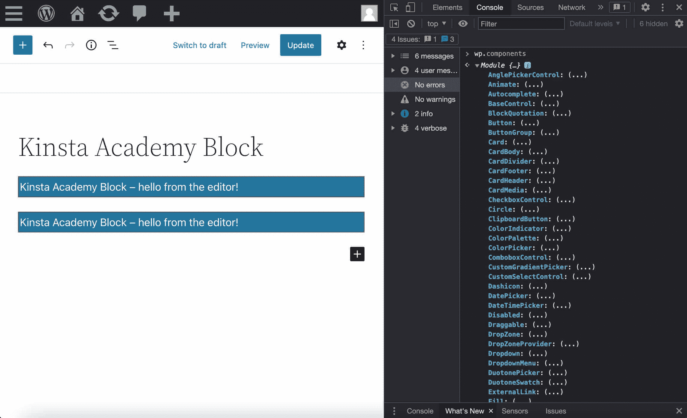

WP components


### 信息

**模块化编程**是一种软件设计技术，它强调将程序的功能分成独立的、可互换的**模块**，这样每个模块都包含执行所需功能的一个方面所需的一切(来源:[维基百科](https://en.wikipedia.org/wiki/Modular_programming))。


现在回到 **edit.js** 文件，仔细看看这个脚本:

```
import { __ } from '@wordpress/i18n';
import { useBlockProps } from '@wordpress/block-editor';
import './editor.scss';

export default function Edit() {
	return (
		<p { ...useBlockProps() }>
			{ __(
				'Kinsta Academy Block – hello from the editor!',
				'ka-example-block'
			) }
		</p>
	);
}
```

这段代码生成一个带有简单的、不可编辑的文本的静态块。但是我们可以很容易地改变事情:

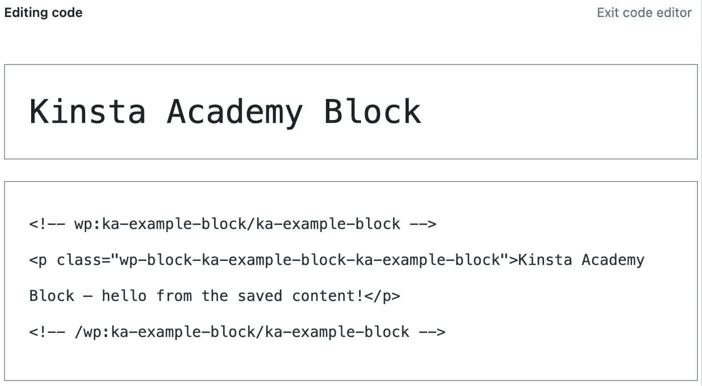

The starter block in the code editor.


要使文本可编辑，你必须用一个组件替换当前的`<p>`标签，使[输入内容可编辑](https://developer.mozilla.org/en-US/docs/Web/Guide/HTML/Editable_content)。为此，Gutenberg 提供了内置的 RichText 组件。

将内置组件添加到您的模块需要 5 个步骤:

1.  [从 WordPress 包中导入所需的组件](#import-components)
2.  [将相应的元素包含到您的 JSX 代码中](#jsx-elements)
3.  [在 block.json 文件中定义必要的属性](#define-attributes)
4.  [定义事件处理程序](#define-event-handlers)
5.  [保存数据](#save-data)

#### 步骤 1:从 WordPress 包中导入所需的组件

现在打开 **edit.js** 文件，修改下面的`import`语句:

```
import { useBlockProps } from '@wordpress/block-editor';
```

…致:

```
import { useBlockProps, RichText } from '@wordpress/block-editor';
```

这样，您就从`@wordpress/block-editor`包中导入了`useBlockProps`函数和`RichText`组件。

##### 使用 BlockProps

[`useBlockProps`](https://developer.wordpress.org/block-editor/reference-guides/block-api/block-edit-save/#block-wrapper-props) React 钩子标记了[块的包装元素](https://make.wordpress.org/core/2020/11/18/block-api-version-2/):

> *使用 API 版本 2 时，必须在块的`edit`函数中使用新的`useBlockProps`钩子来标记块的包装元素。挂钩将插入启用块行为所需的属性和事件处理程序。您希望传递给 block 元素的任何属性都必须通过`useBlockProps`传递，并且返回值将被传播到元素上。*

简单地说，`useBlockProps`自动将属性和类分配给包装元素(我们示例中的`p`元素):


Elements and classes generated by useBlockProps.


如果从 wrapper 元素中移除`useBlockProps`,就会得到一个简单的文本字符串，无法访问块功能和样式:

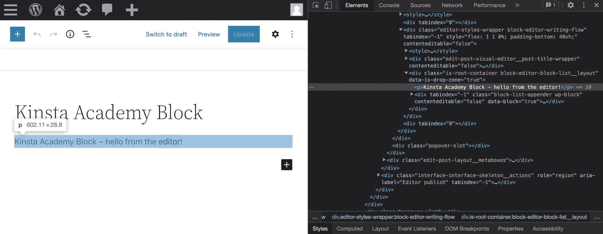

The same block without useBlockProps.


正如我们稍后将在中解释的那样，你也可以传递给`useBlockProps`一个属性对象来定制输出。

##### 法官文本

RichText 组件提供了一个 [contenteditable](https://developer.mozilla.org/en-US/docs/Web/Guide/HTML/Editable_content) 输入，允许用户编辑和格式化内容。

你可以在 GitHub 的[Gutenberg/packages/block-editor/src/components/rich-text/readme . MD](https://github.com/WordPress/gutenberg/blob/a84c037a0e62a344005054102544c34d7b970a6b/packages/block-editor/src/components/rich-text/README.md)找到这个组件。

#### 第二步:在你的 JSX 代码中包含相应的元素

```
...

const blockProps = useBlockProps();

return (
	<RichText 
		{ ...blockProps }
		tagName="p"
		onChange={ onChangeContent }
		allowedFormats={ [ 'core/bold', 'core/italic' ] }
		value={ attributes.content }
		placeholder={ __( 'Write your text...' ) }
	/>
);
```

让我们逐行注释代码:

*   `tagName` —可编辑 HTML 元素的标签名称
*   `onChange` —元素内容改变时调用的函数
*   `allowedFormats` —一组允许的格式。默认情况下，允许所有格式
*   `value` —可编辑的 HTML 字符串
*   `placeholder` —当元素为空时显示的占位符文本

#### 步骤 3:在 block.json 文件中定义必要的属性

[属性](https://developer.wordpress.org/block-editor/reference-guides/block-api/block-attributes/)提供一个块存储的数据的信息，比如丰富的内容、背景颜色、URL 等。

您可以在键/值对中的`attributes`对象内设置任意数量的属性，其中键是属性名，值是属性定义。

现在打开 **block.json** 文件，添加下面的`attributes`道具:

```
"attributes": {
	"content": {
		"type": "string",
		"source": "html",
		"selector": "p"
	}
},
```

`content`属性允许存储用户在可编辑字段中键入的文本:

*   `type`表示该属性存储的数据类型。除非定义了一个`enum`属性，否则类型是必需的。
*   `source`定义如何从文章内容中提取属性值。在我们的例子中，它是 HTML 内容。注意，如果你不提供一个源属性，数据被存储在块分隔符中( [read more](https://developer.wordpress.org/block-editor/reference-guides/block-api/block-attributes/#value-source) )。
*   `selector`是一个 HTML 标签或任何其他选择器，比如类名或 id 属性。

我们将向`Edit`函数传递一个对象的属性。因此，返回到 **edit.js** 文件并做如下修改:

```
export default function Edit( { attributes, setAttributes } ) { ... }
```

#### 步骤 4:定义事件处理程序

`RichText`元素有一个`onChange`属性，提供一个在元素内容改变时调用的函数。

让我们定义这个函数，看看完整的 **edit.js** 脚本:

```
import { __ } from '@wordpress/i18n';
import { useBlockProps, RichText } from '@wordpress/block-editor';
import './editor.scss';

export default function Edit( { attributes, setAttributes } ) {
	const blockProps = useBlockProps();

	const onChangeContent = ( newContent ) => {
		setAttributes( { content: newContent } )
	}

	return (
		<RichText 
			{ ...blockProps }
			tagName="p"
			onChange={ onChangeContent }
			allowedFormats={ [ 'core/bold', 'core/italic' ] }
			value={ attributes.content }
			placeholder={ __( 'Write your text...' ) }
		/>
	);
}
```

现在保存文件并返回到你的 WordPress 仪表盘，创建一个新的文章或页面并添加你的自定义区块:

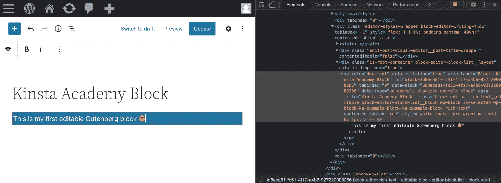

The output of the RichText component in the Block Editor.


添加一些文本并切换到代码视图。您的代码应该是这样的:

```
<!-- wp:ka-example-block/ka-example-block -->
<p class="wp-block-ka-example-block-ka-example-block">Kinsta Academy Block – hello from the saved content!</p>
<!-- /wp:ka-example-block/ka-example-block -->
```

正如您所看到的，如果您切换到代码编辑器，您的块的内容已经改变。这是因为您必须修改 **save.js** 文件，以便在保存帖子时将用户输入存储在数据库中。

#### 第五步:保存数据

现在打开 **save.js** 文件，将脚本修改如下:

```
import { __ } from '@wordpress/i18n';
import { useBlockProps, RichText } from '@wordpress/block-editor';

export default function save( { attributes } ) {
	const blockProps = useBlockProps.save();
	return (
		<RichText.Content 
			{ ...blockProps } 
			tagName="p" 
			value={ attributes.content } 
		/>
	);
}
```

这就是我们正在做的:

*   从`block-editor`包中导入`RichText`组件。
*   通过一个对象参数将几个属性传递给`save`函数(在本例中，我们只传递了 [`attributes`属性](https://developer.wordpress.org/block-editor/reference-guides/block-api/block-edit-save/#attributes)
*   返回`RichText`组件的内容


### 重要的

无论何时更改保存功能，都必须删除编辑器画布中的任何块实例，并再次包含它，以使其正常工作。阅读更多关于[块验证](https://developer.wordpress.org/block-editor/reference-guides/block-api/block-edit-save/#validation)的信息。


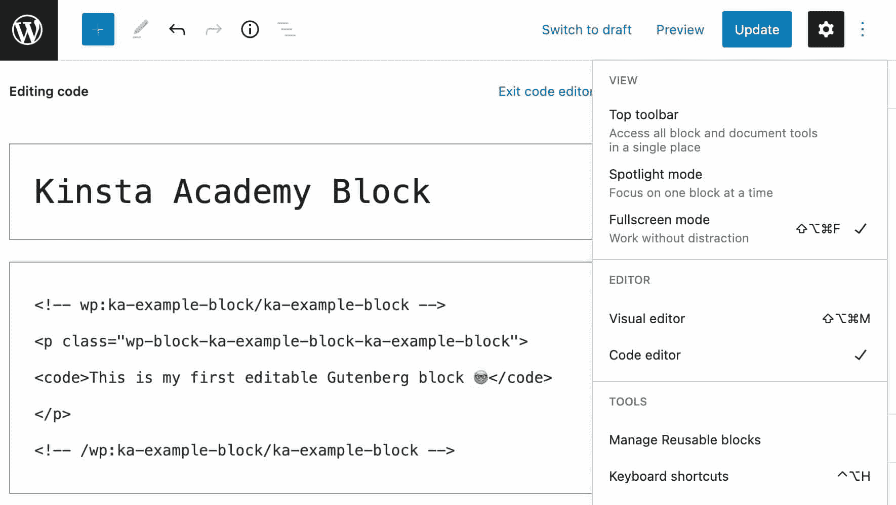

The block content has been saved in the database


你可以在[区块编辑器手册](https://developer.wordpress.org/block-editor/reference-guides/richtext/)中阅读更多关于`RichText`组件的内容，并在 Github 上找到[完整的道具列表。](https://github.com/WordPress/gutenberg/blob/HEAD/packages/block-editor/src/components/rich-text/README.md)

现在让我们更进一步。在下一节中，您将学习如何向块工具栏添加控件。

### 向块工具栏添加控件

[块工具栏](https://developer.wordpress.org/block-editor/how-to-guides/block-tutorial/block-controls-toolbar-and-sidebar/)包含一组控件，允许用户操作部分块内容。对于每个工具栏控件，您会发现一个组件:

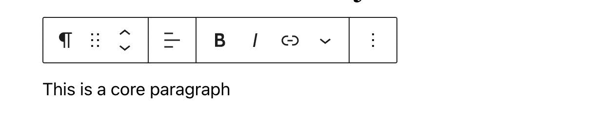

The core paragraph block toolbar.


例如，可以为块添加文本对齐控件。您需要做的就是从`@wordpress/block-editor`包中导入两个组件。

我们将经历与上一个示例相同的步骤:

1.  从 WordPress 包中导入所需的组件
2.  将相应的元素包含到您的 JSX 代码中
3.  在**块. json** 文件中定义必要的属性
4.  定义事件处理程序
5.  保存数据

#### 步骤 1:从@wordpress/block-editor 导入 BlockControls 和 AlignmentControl 组件

要将对齐控件添加到块工具栏，需要两个组件:

*   呈现控件的动态工具栏(未记录)。
*   `AlignmentControl`呈现下拉菜单，显示所选块的对齐选项([阅读更多信息](https://github.com/WordPress/gutenberg/blob/a84c037a0e62a344005054102544c34d7b970a6b/packages/block-editor/src/components/alignment-control/README.md)

打开 **edit.js** 文件，编辑`import`语句，如下图所示:

厌倦了低于 1 级的 WordPress 托管支持而没有答案？试试我们世界一流的支持团队！[查看我们的计划](https://kinsta.com/plans/?in-article-cta)

```
import { 
	useBlockProps, 
	RichText, 
	AlignmentControl, 
	BlockControls 
} from '@wordpress/block-editor';
```

#### 步骤 2:添加 BlockControls 和 AlignmentControl 元素

转到`Edit`功能，在与`<RichText />`相同的层级插入`<BlockControls />`元素。然后在`<BlockControls />`内加上`<AlignmentControl />`:

```
export default function Edit( { attributes, setAttributes } ) {
	const blockProps = useBlockProps();
	return (
		<>
			<BlockControls>
				<AlignmentControl
					value={ attributes.align }
					onChange={ onChangeAlign }
				/>
			</BlockControls>
			<RichText 
				{ ...blockProps }
				tagName="p"
				onChange={ onChangeContent }
				allowedFormats={ [ 'core/bold', 'core/italic' ] }
				value={ attributes.content }
				placeholder={ __( 'Write your text...' ) }
				style={ { textAlign: attributes.align } }
			/>
		</>
	);
}
```

在上面的代码中，`<>`和`</>`是声明 [React 片段](https://reactjs.org/docs/fragments.html#short-syntax)的简短语法，这是我们在 React 中返回多个元素的方式。

在本例中，`AlignmentControl`有两个属性:

*   `value`提供元素的当前值
*   `onChange`提供一个[事件处理程序](https://reactjs.org/docs/handling-events.html)，当值改变时运行

我们还为`RichText`元素定义了额外的属性(查看[完整的属性列表和示例](https://github.com/WordPress/gutenberg/blob/a84c037a0e62a344005054102544c34d7b970a6b/packages/block-editor/src/components/rich-text/README.md)

#### 步骤 3:在 block.json 中定义 align 属性

现在转到 **block.json** 文件并添加`align`属性:

```
"align": {
	"type": "string",
	"default": "none"
}
```

完成后，返回到块编辑器，刷新页面并选择块。您应该会在您的块中看到一条错误消息。

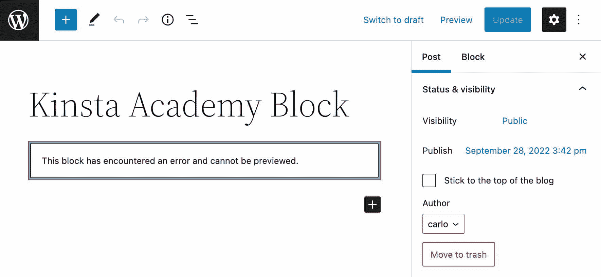

The block displays an error message


原因是我们还没有定义我们的事件处理程序。

#### 步骤 4:定义事件处理程序

现在定义`onChangeAlign`:

```
const onChangeAlign = ( newAlign ) => {
	setAttributes( { 
		align: newAlign === undefined ? 'none' : newAlign, 
	} )
}
```

如果`newAlign`是`undefined`，那么我们将`newAlign`设置为`none`。否则，我们用`newAlign`。

我们的 **edit.js** 脚本应该已经完成了(暂时):

```
export default function Edit( { attributes, setAttributes } ) {
	const blockProps = useBlockProps();
	const onChangeContent = ( newContent ) => {
		setAttributes( { content: newContent } )
	}
	const onChangeAlign = ( newAlign ) => {
		setAttributes( { 
			align: newAlign === undefined ? 'none' : newAlign, 
		} )
	}
	return (
		<>
			<BlockControls>
				<AlignmentControl
					value={ attributes.align }
					onChange={ onChangeAlign }
				/>
			</BlockControls>
			<RichText 
				{ ...blockProps }
				tagName="p"
				onChange={ onChangeContent }
				allowedFormats={ [ 'core/bold', 'core/italic' ] }
				value={ attributes.content }
				placeholder={ __( 'Write your text...' ) }
				style={ { textAlign: attributes.align } }
			/>
		</>
	);
}
```

现在，您可以返回编辑器并对齐块内容。您的块现在应该自豪地显示对齐工具栏。

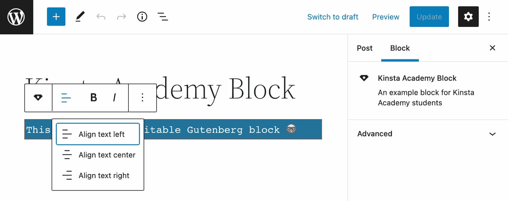

Our block now has an Alignment Toolbar


但是如果你保存了这篇文章，你会看到你的块的内容并没有像在块编辑器中那样在前端对齐。这是因为我们需要修改`save`函数来在数据库中存储块内容和属性。

#### 第五步:保存数据

打开 **save.js** ，按如下方式更改`save`功能:

```
export default function save( { attributes } ) {
	const blockProps = useBlockProps.save();
	return (
		<RichText.Content 
			{ ...blockProps } 
			tagName="p" 
			value={ attributes.content } 
			style={ { textAlign: attributes.align } }
		/>
	);
}
```

最后，为了提高代码的可读性，可以使用[析构赋值语法](https://developer.mozilla.org/en-US/docs/Web/JavaScript/Reference/Operators/Destructuring_assignment)从`attribute`对象中提取单个属性:

```
export default function save( { attributes } ) {
	const blockProps = useBlockProps.save();
	const { content, align } = attributes;
	return (
		<RichText.Content 
			{ ...blockProps } 
			tagName="p" 
			value={ content } 
			style={ { textAlign: align } }
		/>
	);
}
```

你可以在 **edit.js** 文件中做同样的事情。

现在保存文件并切换到代码编辑器。块代码应该如下所示:

```
<!-- wp:ka-example-block/ka-example-block {"align":"right"} -->
<p class="wp-block-ka-example-block-ka-example-block" style="text-align:right">This is my first editable <strong>Gutenberg</strong> <em>block</em> 😎</p>
<!-- /wp:ka-example-block/ka-example-block -->
```

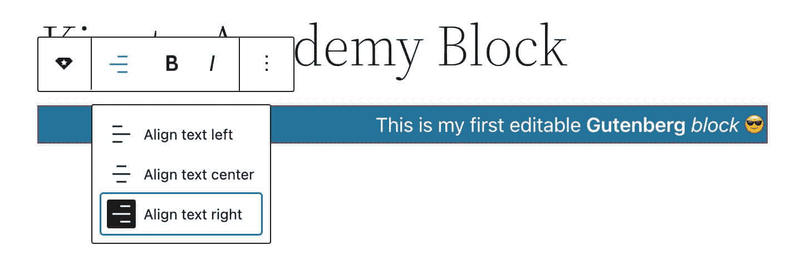

Checking block toolbar controls


就是这样！您刚刚向块的工具栏添加了一个对齐控件🤓

你可以在块编辑器手册中阅读更多关于[块工具栏控件](https://developer.wordpress.org/block-editor/how-to-guides/block-tutorial/block-controls-toolbar-and-sidebar/)的信息。

### 自定义块设置侧栏

您还可以将控件添加到块[设置侧栏](https://developer.wordpress.org/block-editor/how-to-guides/block-tutorial/block-controls-toolbar-and-sidebar/)(或者甚至为您的应用程序创建一个新的侧栏)。

API 为此提供了一个 [`InspectorControls`组件](https://github.com/WordPress/gutenberg/blob/a84c037a0e62a344005054102544c34d7b970a6b/packages/block-editor/src/components/inspector-controls/README.md)。

块编辑器手册解释了[如何使用设置侧栏](https://developer.wordpress.org/block-editor/how-to-guides/block-tutorial/block-controls-toolbar-and-sidebar/#settings-sidebar):

> *设置侧边栏用于显示不常用的设置或需要更多屏幕空间的设置。设置侧栏应仅用于**块级设置**。*
> 
> *如果您的设置只影响块内选定的内容(例如:段落内选定文本的“粗体”设置):*不要将其放在设置侧边栏内。*即使在 HTML 模式下编辑块时，设置侧边栏也会显示，因此它应该只包含块级设置。*

再次重申:

1.  从 WordPress 包中导入所需的组件
2.  将相应的元素包含到您的 JSX 代码中
3.  在 block.json 文件中定义必要的属性
4.  定义事件处理程序
5.  保存数据

#### 第一步。从@wordpress/block-editor 导入检查控件和 PanelColorSettings 组件

您可以添加几个控件，以允许用户自定义块的特定方面。例如，您可以提供一个颜色控制面板。为此，您需要从`block-editor`模块导入`InspectorControls`和`PanelColorSettings`组件:

```
import { 
	useBlockProps, 
	RichText, 
	AlignmentControl, 
	BlockControls,
	InspectorControls,
	PanelColorSettings
} from '@wordpress/block-editor';
```

#### 第二步:在你的 JSX 代码中包含相应的元素

现在您可以将相应的元素添加到由`Edit`函数返回的 JSX 中:

```
export default function Edit( { attributes, setAttributes } ) {
	const blockProps = useBlockProps();

	const { content, align, backgroundColor, textColor } = attributes;

	const onChangeContent = ( newContent ) => {
		setAttributes( { content: newContent } )
	}
	const onChangeAlign = ( newAlign ) => {
		setAttributes( { 
			align: newAlign === undefined ? 'none' : newAlign, 
		} )
	}
	return (
		<>
			<InspectorControls>
				<PanelColorSettings 
					title={ __( 'Color settings', 'ka-example-block' ) }
					initialOpen={ false }
					colorSettings={ [
						{
						  value: textColor,
						  onChange: onChangeTextColor,
						  label: __( 'Text color', 'ka-example-block' )
						},
						{
						  value: backgroundColor,
						  onChange: onChangeBackgroundColor,
						  label: __( 'Background color', 'ka-example-block' )
						}
					] }
				/>
			</InspectorControls>
			<BlockControls>
				<AlignmentControl
					value={ align }
					onChange={ onChangeAlign }
				/>
			</BlockControls>
			<RichText 
				{ ...blockProps }
				tagName="p"
				onChange={ onChangeContent }
				allowedFormats={ [ 'core/bold', 'core/italic' ] }
				value={ content }
				placeholder={ __( 'Write your text...' ) }
				style={ { textAlign: align, backgroundColor: backgroundColor, color: textColor } }
			/>
		</>
	);
}
```

注意，我们还更新了`RichText`元素的`style`属性:

```
<RichText 
	 { ...blockProps }
	 tagName="p"
	 onChange={ onChangeContent }
	 allowedFormats={ [ 'core/bold', 'core/italic' ] }
	 value={ content }
	 placeholder={ __( 'Write your text...' ) }
	 style={ { textAlign: align, backgroundColor: backgroundColor, color: textColor } }
/>
```

#### 步骤 3:在 block.json 中定义必要的属性

现在定义 **block.json** 文件中的`backgroundColor`和`textColor`属性:

```
"attributes": {
	"content": {
		"type": "string",
		"source": "html",
		"selector": "p"
	},
	"align": {
		"type": "string",
		"default": "none"
	},
	"backgroundColor": {
		"type": "string"
	},	 
	"textColor": {
		"type": "string"
	}
},
```

#### 步骤 4:定义事件处理程序

现在您需要定义两个函数来更新用户输入的`backgroundColor`和`textColor`:

```
const onChangeBackgroundColor = ( newBackgroundColor ) => {
	setAttributes( { backgroundColor: newBackgroundColor } )
}

const onChangeTextColor = ( newTextColor ) => {
	setAttributes( { textColor: newTextColor } )
}
```

#### 第五步:保存数据

最后一步:打开 **save.js** 文件，修改脚本如下:

```
export default function save( { attributes } ) {
	const blockProps = useBlockProps.save();
	const { content, align, backgroundColor, textColor } = attributes;
	return (
		<RichText.Content 
			{ ...blockProps } 
			tagName="p" 
			value={ content } 
			style={ { textAlign: align, backgroundColor: backgroundColor, color: textColor } }
		/>
	);
}
```

保存文件并在编辑器中检查该块。您可能会发现一个不受欢迎的惊喜:一条错误消息让您知道该块包含意外或无效的内容。

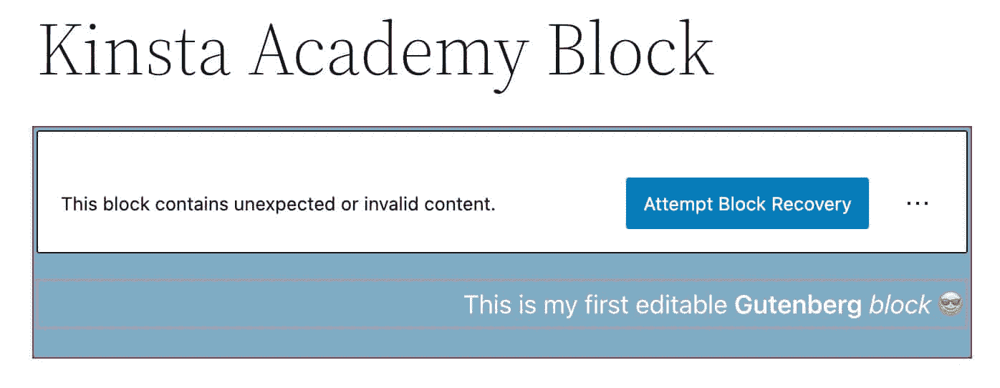

Unexpected or invalid content error message


发生这种情况是因为 **save.js** 文件被更改，并且保存在数据库中的代码与编辑器中使用的代码不匹配。

要解决此问题，请刷新页面，删除您的块的任何实例，然后再次将其添加到您的帖子中:

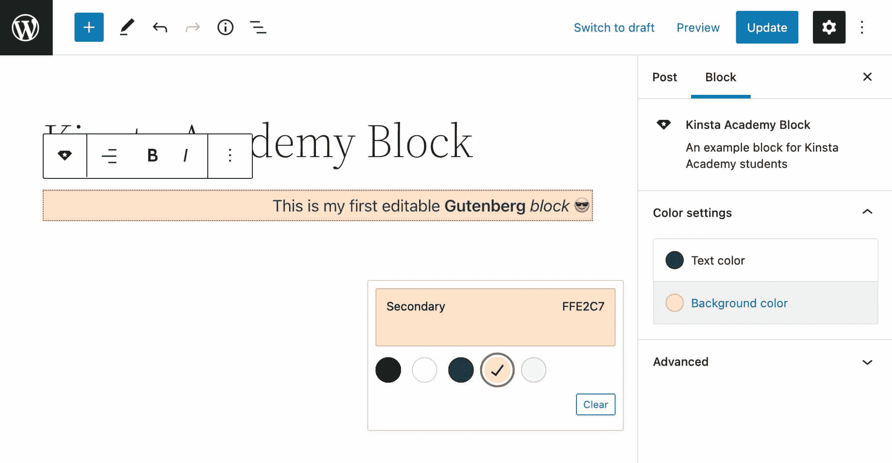

The Color settings panel in the block Settings Sidebar


进行更改，保存文章，并在前端查看。现在，您在块编辑器中所做的更改应该会反映在前端站点上。

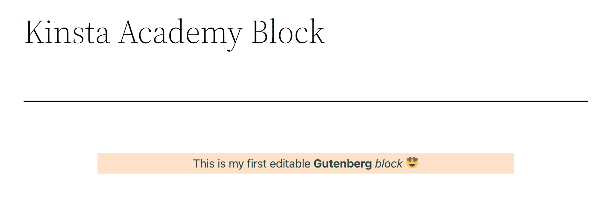

The custom block now works correctly on the front end


### 添加和自定义外部链接

在本节中，您将向块类型添加新组件:

*   一个`ExternalLink`组件，允许用户将一个可定制的链接添加到您的定制块中
*   几个侧边栏控件允许用户自定义链接设置

#### 第一步。从@wordpress/components 导入组件

现在您需要从`@wordpress/components`导入几个组件。打开您的 edit.js 文件并添加以下`import`语句:

```
import {
	TextControl,
	PanelBody,
	PanelRow,
	ToggleControl,
	ExternalLink
} from '@wordpress/components';
```

*   [`PanelBody`](https://github.com/WordPress/gutenberg/blob/a84c037a0e62a344005054102544c34d7b970a6b/packages/components/src/panel/README.md#panelbody) 在设置工具条中添加一个可折叠的容器。
*   [`PaneRow`](https://github.com/WordPress/gutenberg/blob/a84c037a0e62a344005054102544c34d7b970a6b/packages/components/src/panel/README.md#panelrow) 为侧边栏控件生成一个通用容器。
*   [`TextControl`](https://github.com/WordPress/gutenberg/blob/a84c037a0e62a344005054102544c34d7b970a6b/packages/components/src/text-control/README.md) 提供了文本输入控件。
*   [`ToggleControl`](https://github.com/WordPress/gutenberg/blob/a84c037a0e62a344005054102544c34d7b970a6b/packages/components/src/toggle-control/README.md) 提供了一个开关，使用户能够启用/禁用特定选项
*   [`ExternalLink`](https://github.com/WordPress/gutenberg/blob/a84c037a0e62a344005054102544c34d7b970a6b/packages/components/src/external-link/README.md) 是一个简单的添加外部链接的组件。

#### 第二步。将相应的元素包含到您的 JSX 代码中

首先将`ExternalLink`元素添加到`div`容器中与`RichText`相同的层次上:

```
<div { ...blockProps }>
	<RichText 
		...
	/>
	<ExternalLink 
		href={ kaLink }
		className="ka-button"
		rel={ hasLinkNofollow ? "nofollow" : "" }
	>
			{ linkLabel }
	</ExternalLink>

</div>
```

组件`ExternalLink`没有被记录，所以我们引用了[组件本身](https://github.com/WordPress/gutenberg/blob/a84c037a0e62a344005054102544c34d7b970a6b/packages/components/src/external-link/index.js)来获得可用属性的列表。这里我们使用了`href`、`className`和`rel`属性。

默认情况下，`rel`属性值被设置为`noopener noreferrer`。当切换控件为上的**时，我们的代码会将 [`nofollow`关键字](https://kinsta.com/knowledgebase/add-nofollow-links-in-wordpress/)添加到生成的`a`标签的`rel`属性中。**

现在你可以添加链接设置到块侧边栏。

首先，您将在`InspectorControls`中添加一个`PanelBody`元素，与`PanelColorSettings`处于同一级别:

```
<InspectorControls>
	<PanelColorSettings 
	...
	/>
	<PanelBody 
		title={ __( 'Link Settings' )}
		initialOpen={true}
	>
	...
	</PanelBody>
</InspectorControls>
```

我们是这样做的:

1.  `title`属性提供了面板标题。
2.  `initialOpen`设置面板最初是否打开。

接下来，我们将在`PanelBody`中添加两个`PanelRow`元素，在每个`PanelRow`中添加一个`TextControl`元素:

```
<PanelBody 
	title={ __( 'Link Settings', 'ka-example-block' )}
	initialOpen={true}
>
	<PanelRow>
		<fieldset>
			<TextControl
				label={__( 'KA link', 'ka-example-block' )}
				value={ kaLink }
				onChange={ onChangeKaLink }
				help={ __( 'Add your Academy link', 'ka-example-block' )}
			/>
		</fieldset>
	</PanelRow>
	<PanelRow>
		<fieldset>
			<TextControl
				label={__( 'Link label', 'ka-example-block' )}
				value={ linkLabel }
				onChange={ onChangeLinkLabel }
				help={ __( 'Add link label', 'ka-example-block' )}
			/>
		</fieldset>
	</PanelRow>
</PanelBody>
```

上面的代码现在看起来应该非常简单。这两个文本控件允许用户设置链接标签和 URL。

我们还将添加一个额外的`PanelRow`和一个`ToggleControl`来打开/关闭一个特定的选项，比如是否包含一个属性:

```
<PanelRow>
	<fieldset>
		<ToggleControl
			label="Add rel = nofollow"
			help={
				hasLinkNofollow
					? 'Has rel nofollow.'
					: 'No rel nofollow.'
			}
			checked={ hasLinkNofollow }
			onChange={ toggleNofollow }
		/>
	</fieldset>
</PanelRow>
```

#### 步骤 3:在 block.json 中定义必要的属性

现在定义 **block.json** 文件中的`kaLink`、`linkLabel`和`hasLinkNofollow`属性:

```
"kaLink": {
	"type": "string",
	"default": ""
},
"linkLabel": {
	"type": "string",
	"default": "Check it out!"
},
"hasLinkNofollow": {
	"type": "boolean",
	"default": false
}
```

这里没什么要补充的了！让我们继续定义[事件处理函数](https://developer.mozilla.org/en-US/docs/Web/Events/Event_handlers)。

#### 步骤 4:定义事件处理程序

返回到 **edit.js** 文件，向 attributes 对象添加新属性，并添加以下函数:

```
const { content, align, backgroundColor, textColor, kaLink, linkLabel, hasLinkNofollow } = attributes;

const onChangeKaLink = ( newKaLink ) => {
	setAttributes( { kaLink: newKaLink === undefined ? '' : newKaLink } )
}

const onChangeLinkLabel = ( newLinkLabel ) => {
	setAttributes( { linkLabel: newLinkLabel === undefined ? '' : newLinkLabel } )
}

const toggleNofollow = () => {
	setAttributes( { hasLinkNofollow: ! hasLinkNofollow } )
}
```

这些函数根据用户输入更新相应的属性值。

#### 第五步:保存数据

最后，我们必须更新 **save.js** 中的`save`函数:

```
export default function save( { attributes } ) {

	const { content, align, backgroundColor, textColor, kaLink, linkLabel, hasLinkNofollow } = attributes;

	const blockProps = useBlockProps.save( {
		className: `has-text-align-${ align }`
	} );

	return (
		<div 
			{ ...blockProps }
			style={ { backgroundColor: backgroundColor } }
		>
			<RichText.Content 
				tagName="p" 
				value={ content } 
				style={ { color: textColor } }
			/>
			<p>
				<a 
					href={ kaLink }
					className="ka-button"
					rel={ hasLinkNofollow ? "nofollow" : "noopener noreferrer" }
				>
					{ linkLabel }
				</a>
			</p>
		</div>
	);
}
```

注意，这里我们使用了常规的`a`元素，而不是`ExternalLink`。

你可以在下图中看到结果。

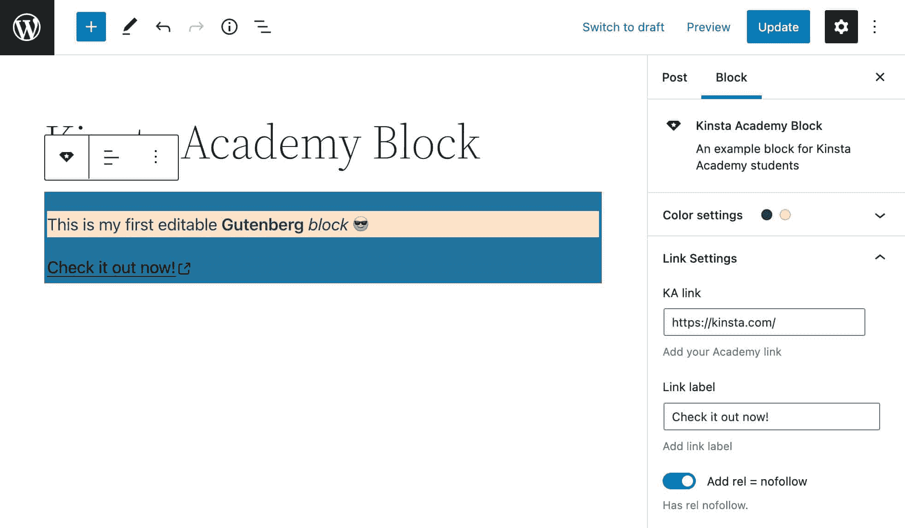

The Link settings panel in the block Settings Sidebar


### 添加多个块样式

在上一节中，您学习了如何添加一个块工具栏控件，允许用户对齐用户输入。我们可以向块工具栏添加更多的样式控件，但是我们也可以提供一组预定义的块样式，用户只需单击一下就可以从中进行选择。

为此，我们将使用块 API 的一个有用特性:[块样式](https://developer.wordpress.org/block-editor/reference-guides/block-api/block-metadata/#block-styles)。

您所需要做的就是定义 **block.json** `styles`属性，并在样式表中声明相应的样式。

例如，您可以添加以下样式数组:

```
"styles": [
	{
		"name": "default",
		"label": "Default",
		"isDefault": true
	},
	{
		"name": "border",
		"label": "Border"
	}
],
```

这样，您就添加了一个默认样式和一个名为`border`的附加样式。现在回到块编辑器:

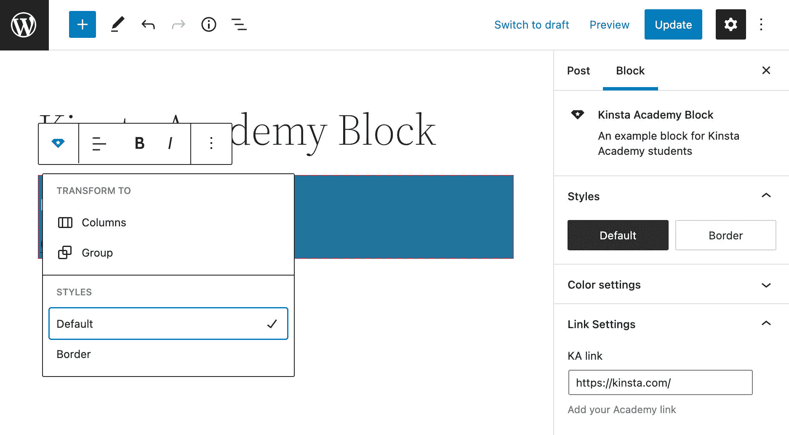

Two prebuilt block styles.


用户可以通过点击[块切换器](https://kinsta.com/blog/wordpress-5-8/#normalized-block-toolbars)，然后在**块设置侧边栏**中寻找**样式面板**来获得样式。

选择一种样式并检查应用于`p`元素的类。右键点击该块并**检查**。添加了一个新类，其名称结构如下:

```
is-style-{style-name}
```

如果您选中了“Border”样式，那么一个`is-style-border`类将被添加到`p`元素中。如果你选择了“默认”样式，那么将会添加一个`is-style-default`类。

现在你只需要声明 CSS 属性。打开 **editor.scss** 文件，用以下内容替换当前样式:

```
.wp-block-ka-example-block-ka-example-block {
    padding: 4px;
}
```

现在你可以用 **style.scss** 做同样的事情。正如我们上面提到的，在 **style.scss** 中定义的样式被应用在前端和编辑器中:

```
.wp-block-ka-example-block-ka-example-block {
	&.is-style-default{
		border: 0;
        background-color: #FFE2C7;
	}
	&.is-style-border{
		border: 2px solid #000;
        border-radius: 16px;
        background-color: #F6F6F6;
	}
}
```

就是这样！刷新页面，体验新的区块样式:

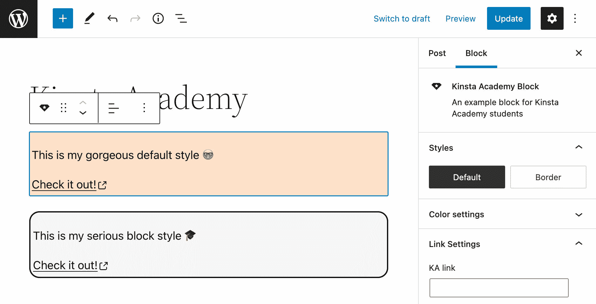

Block styles compared


### 用 InnerBlocks 组件嵌套 Gutenberg 块

虽然功能齐全，我们的定制块仍然不是很有吸引力。为了让观众更感兴趣，我们可以添加一张图片。

这可能会给我们的块增加一层复杂性，但幸运的是，您不需要重新发明轮子，因为 Gutenberg 提供了一个特定的组件，您可以使用它来创建一个由[个嵌套块](https://developer.wordpress.org/block-editor/how-to-guides/block-tutorial/nested-blocks-inner-blocks/)组成的结构。

`InnerBlocks`分量为[，定义如下](https://github.com/WordPress/gutenberg/blob/a84c037a0e62a344005054102544c34d7b970a6b/packages/block-editor/src/components/inner-blocks/README.md):

> *`InnerBlocks`导出一对可在块实现中使用的组件，以启用嵌套块内容。*

首先，您需要创建一个新的**。 **src** 文件夹中的 js** 文件。在我们的例子中，我们将这个文件命名为**容器. js** 。

现在您需要将新资源导入到 **index.js** 文件中:

```
import './container';
```

返回到 **container.js** 并导入必要的组件:

```
import { registerBlockType } from "@wordpress/blocks";
import { __ } from "@wordpress/i18n";
import {
	useBlockProps, 
	InnerBlocks 
} from "@wordpress/block-editor";
```

下一步是定义一个模板，提供放置块的结构。在下面的示例中，我们定义了一个由两列组成的模板，包含一个核心图像块和我们的自定义块:

```
const TEMPLATE = [ [ 'core/columns', { backgroundColor: 'yellow', verticalAlignment: 'center' }, [
	[ 'core/column', { templateLock: 'all' }, [
		[ 'core/image' ],
	] ],
	[ 'core/column', { templateLock: 'all' }, [
		[ 'ka-example-block/ka-example-block', { placeholder: 'Enter side content...' } ],
	] ],
] ] ];
```

该模板的结构是块类型(块名和可选属性)的[数组。](https://github.com/WordPress/gutenberg/blob/a84c037a0e62a344005054102544c34d7b970a6b/docs/reference-guides/block-api/block-templates.md)

在上面的代码中，我们使用了几个属性来配置列和列块。具体来说，`templateLock: 'all'`属性锁定列块，这样用户就不会添加、重新排序或删除现有的块。`templateLock`可以取下列值之一:

*   `all` — `InnerBlocks`被锁定，不能添加、重新排序或删除任何块。
*   `insert` —块只能被重新排序或删除。
*   `false` —模板未被锁定。

然后将模板分配给`InnerBlocks`元素:

```
<InnerBlocks
	template={ TEMPLATE }
	templateLock="all"
/>
```

为了防止任何兼容性问题，我们还为`InnerBlocks`组件添加了一个`templateLock`属性(参见 issue # [17262](https://github.com/WordPress/gutenberg/issues/17262) 和 pull # [26128](https://github.com/WordPress/gutenberg/pull/26128) )。

这是我们最后的 **container.js** 文件:

```
registerBlockType('ka-example-block/ka-example-container-block', {
	title: __( 'KA Container block', 'ka-example-block' ),
	category: 'design',

	edit( { className } ) {

		return(
			<div className={ className }>
				<InnerBlocks
					template={ TEMPLATE }
					templateLock="all"
				/>
			</div>
		)
	},

	save() {
		const blockProps = useBlockProps.save();
		return(
			<div { ...blockProps }>
				<InnerBlocks.Content />
			</div>
		)
	},
});
```

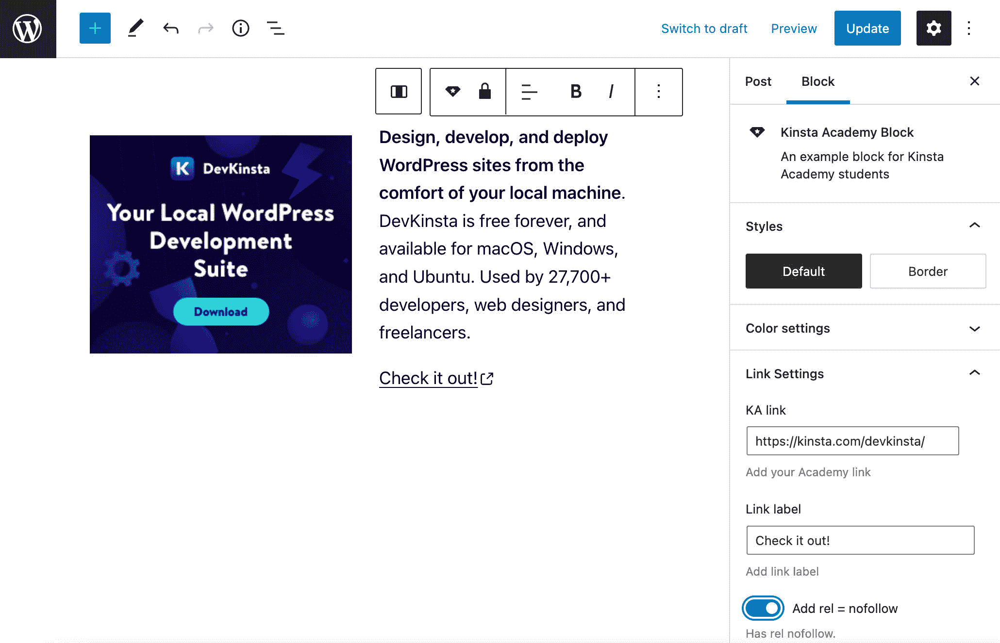

The final block in the block editor


### 其他改进

我们的块功能齐全，但我们可以通过一些小的变化来改进它。

我们将`backgroundColor`属性分配给由`RichText`组件生成的段落。然而，我们可能更喜欢给容器`div`分配背景颜色:

所以，把 **edit.js** 文件和 **save.js** `div` s 修改如下:

```
<div 
	{ ...blockProps }
	style={ { backgroundColor: backgroundColor } }
>
...
</div>
```

这将允许用户改变整个块的背景。

另一方面，一个更相关的变化涉及到`useBlockProps`方法。在原始代码中，我们将常数`blockProps`定义如下:

```
const blockProps = useBlockProps();
```

但是我们可以更有效地使用`useBlockProps`[传递一组属性](https://developer.wordpress.org/block-editor/reference-guides/block-api/block-edit-save/#block-wrapper-props)。例如，我们可以从`classnames`模块导入`classnames`，并相应地设置包装类名。

在下面的例子中，我们根据属性`align`的值( **edit.js** )分配一个类名。s

```
import classnames from 'classnames';

...

export default function Edit( { attributes, setAttributes } ) {
	...

	const onChangeAlign = ( newAlign ) => {
		setAttributes( { 
			align: newAlign === undefined ? 'none' : newAlign, 
		} )
	}

	const blockProps = useBlockProps( {
		className: `has-text-align-${ align }`
	} );
	...
}
```

我们将在 **save.js** 文件中做同样的修改:

```
import classnames from 'classnames';

...

export default function save( { attributes } ) {
	...
	const { content, align, backgroundColor, textColor, kaLink, linkLabel, hasLinkNofollow } = attributes;

	const blockProps = useBlockProps.save( {
		className: `has-text-align-${ align }`
	} );
	...
}
```

就这样结束了！您现在可以[运行生产版本](https://developer.wordpress.org/block-editor/reference-guides/packages/packages-scripts/#build):

```
npm run build
```

[If you're looking for an in-depth guide to getting started with Gutenberg block development, this massive guide is for you. Check it out and start building your Gutenberg blocks today! 👷‍♀️🧱Click to Tweet](https://twitter.com/intent/tweet?url=https%3A%2F%2Fkinsta.com%2Fblog%2Fgutenberg-blocks%2F&via=kinsta&text=If+you%27re+looking+for+an+in-depth+guide+to+getting+started+with+Gutenberg+block+development%2C+this+massive+guide+is+for+you.+Check+it+out+and+start+building+your+Gutenberg+blocks+today%21+%F0%9F%91%B7%E2%80%8D%E2%99%80%EF%B8%8F%F0%9F%A7%B1&hashtags=Gutenberg%2CDevelopment)

## 摘要

我们到了，这个不可思议的旅程的终点！我们从开发环境的配置开始，最终创建了一个完整的块类型。

正如我们在简介中提到的，扎实的 Node.js、Webpack、Babel 和 React 知识对于创建高级 Gutenberg 块和作为专业 Gutenberg 开发人员在市场中定位至关重要。

但是，您不需要已经建立了 React 经验，就可以开始享受块开发的乐趣。积木开发可以给你动力和目标，让你在古腾堡积木背后的技术中获得越来越广泛的技能。

因此，本指南远非完整。这仅仅是对各种主题的介绍，将帮助您开始构建您的第一个古腾堡积木。

因此，我们建议您通过仔细阅读在线文档和指南来深化您的知识。在众多可用资源中，我们推荐以下资源:

*   [官方为初学者打造的积木教程](https://developer.wordpress.org/block-editor/handbook/tutorials/create-block/)
*   [面向中级开发者的官方区块教程](https://developer.wordpress.org/block-editor/how-to-guides/block-tutorial/)
*   [动态块](https://developer.wordpress.org/block-editor/how-to-guides/block-tutorial/creating-dynamic-blocks/)
*   [如何为古腾堡创建动态块](https://kinsta.com/blog/dynamic-blocks/)
*   [元框](https://developer.wordpress.org/block-editor/how-to-guides/metabox/)
*   [为你的插件创建侧边栏](https://developer.wordpress.org/block-editor/how-to-guides/plugin-sidebar-0/)

如果你刚刚开始 WordPress 开发，你可能想了解前端开发的基本概念。这里有一个快速的资源列表，可以帮助你开始:

*   如何在本地安装 WordPress】(免费电子书)
*   托管 WordPress 主机的真正价值(免费电子书)
*   [JavaScript 是什么？](https://kinsta.com/knowledgebase/what-is-javascript/)
*   [HTML vs HTML5](https://kinsta.com/blog/html-vs-html5/)
*   [如何在 WordPress 中编辑 CSS](https://kinsta.com/blog/wordpress-css/)
*   [什么是 PHP？](https://kinsta.com/knowledgebase/what-is-php/)
*   WordPress Hooks Bootcamp:如何使用动作、过滤器和定制钩子

请记住，本指南示例的完整代码位于 Gist 上的[。](https://gist.github.com/carlodaniele/5f3dba8fff19d8ea836bdef5a2be7556)

现在轮到你了:你开发过古腾堡积木吗？到目前为止，你经历的主要困难是什么？请在评论中告诉我们你的经历！

* * *

让你所有的[应用程序](https://kinsta.com/application-hosting/)、[数据库](https://kinsta.com/database-hosting/)和 [WordPress 网站](https://kinsta.com/wordpress-hosting/)在线并在一个屋檐下。我们功能丰富的高性能云平台包括:

*   在 MyKinsta 仪表盘中轻松设置和管理
*   24/7 专家支持
*   最好的谷歌云平台硬件和网络，由 Kubernetes 提供最大的可扩展性
*   面向速度和安全性的企业级 Cloudflare 集成
*   全球受众覆盖全球多达 35 个数据中心和 275 多个 pop

在第一个月使用托管的[应用程序或托管](https://kinsta.com/application-hosting/)的[数据库，您可以享受 20 美元的优惠，亲自测试一下。探索我们的](https://kinsta.com/database-hosting/)[计划](https://kinsta.com/plans/)或[与销售人员交谈](https://kinsta.com/contact-us/)以找到最适合您的方式。