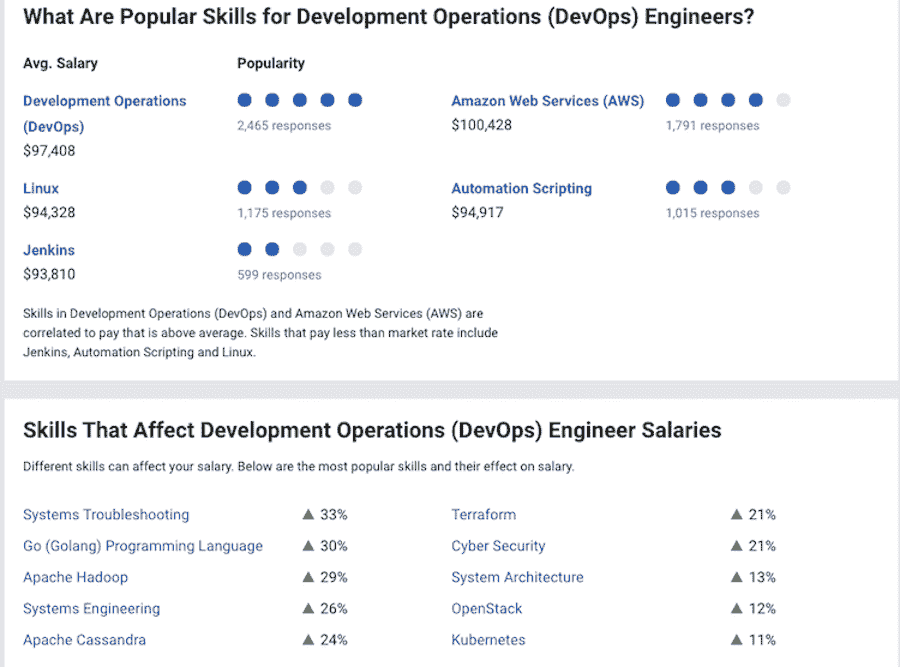
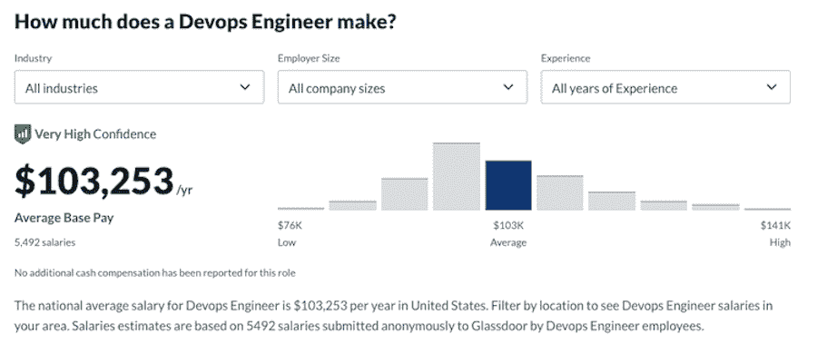
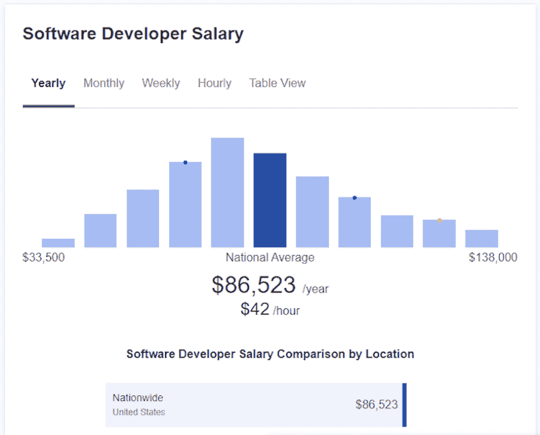
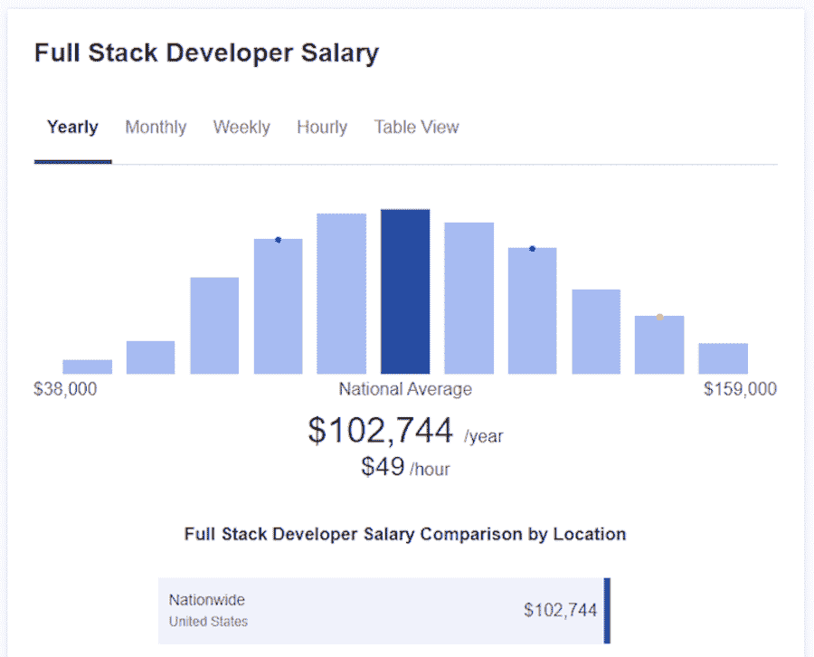
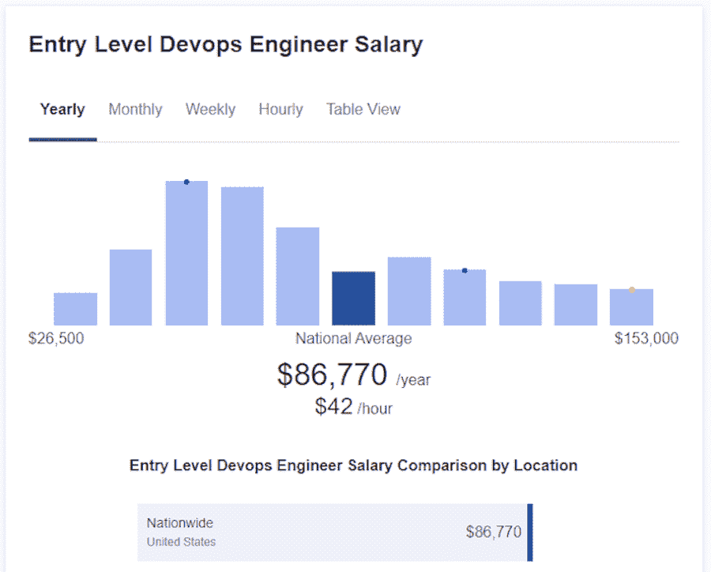
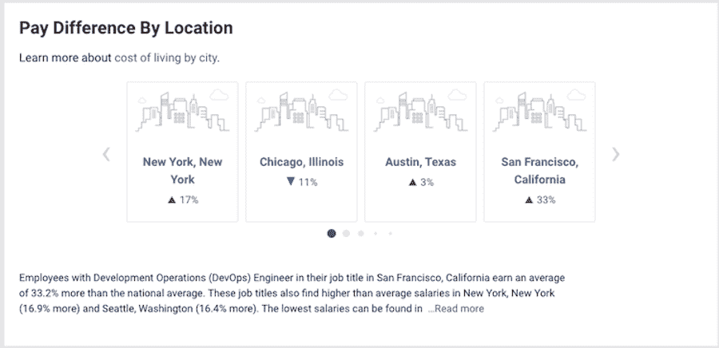

# DevOps 工程师平均工资多少？看看 2022 年的数据

> 原文：<https://kinsta.com/blog/devops-engineer-salary/>

[根据 LinkedIn](https://www.techrepublic.com/article/the-3-most-recruited-jobs-ever-on-linkedin-are-all-in-tech/) 显示，DevOps 工程师是平台上招聘最多的职位之一。然而，关于这个职位和这个角色到底需要什么，T2 有一场激烈的辩论。

就在短短几年前，这个头衔还不存在。因此，该角色的职责和责任可能因公司而异。

那么[如何成为一名 DevOps 工程师](https://kinsta.com/blog/devops-engineer/)，可以期望什么样的薪水？这就是我们将在本帖中发现的。

T3】

## DevOps 是什么？DevOps 工程师是做什么的？

“DevOps 工程师”是一个职位名称，在不同的公司有不同的含义和定义。然而，一般来说， [DevOps 工程师](https://kinsta.com/blog/wordpress-devops/)拥有[编码和工程技能](https://kinsta.com/developer-roles/coding-skills-at-kinsta/)，并与 IT 和运营团队合作。

它们促进了软件开发人员、系统操作员和其他 IT 团队之间的协作，以提高公司在发布、采用和使用新软件代码和产品方面的生产力。

[根据 LinkedIn 的数据，DevOps 工程师是招聘最多的职位之一👩‍💻但是确定这个角色到底需要什么(以及你能期望得到什么)可能会令人困惑🤯在本指南中了解更多信息👇 点击推文](https://twitter.com/intent/tweet?url=https%3A%2F%2Fkinsta.com%2Fblog%2Fdevops-engineer-salary%2F&via=kinsta&text=According+to+LinkedIn%2C+DevOps+engineer+is+one+of+the+most+recruited+positions+%F0%9F%91%A9%E2%80%8D%F0%9F%92%BB+But+determining+what+exactly+the+role+entails+%28and+what+you+can+expect+to+earn%29+can+be+confusing+%F0%9F%A4%AF+Learn+more+in+this+guide+%F0%9F%91%87&hashtags=DevOps%2CWebDev)

### 如何成为 DevOps 工程师？

如果你想成为一名 DevOps 工程师，准备好投入数年时间获得必要的技能和经验。希望雇佣 DevOps 工程师的雇主通常会寻找拥有计算机科学、[软件工程](https://kinsta.com/software-engineering-statistics/)或相关工程领域学士学位和额外资格的候选人。

DevOps 工程师通常是一个高级职位，需要丰富的行业经验以及对业务的技术和运营方面的全面而扎实的理解。

这个职位还没有专门的大学课程或学习途径。相反，当你在你的领域获得相关的经验时，你就会晋升到这个职位，并利用这些经验和你的技能来构思大局。

### DevOps 工程师的职责和技能

作为一名 DevOps 工程师，你将承担广泛的责任。它们可能包括:

*   分析特定公司中使用的当前[技术堆栈](https://kinsta.com/developer-roles/development-at-kinsta/#The-Development-Stack),并开发改进流程和步骤
*   为其他部门创建里程碑和流程以促进协作
*   在生产环境中部署新模块和升级修复程序，同时为生产准备好模块
*   计划、管理、监督并与其他项目经理合作，以确保项目及时执行
*   指导和培训公司内的其他工程师
*   与公司内的其他 IT 工程师合作，维护必要的硬件和软件

Popular skills required for DevOps engineer positions.

就技能而言，要成为一名 DevOps 工程师，你需要以下软硬技能的结合:

*   Linux 环境的知识
*   相关的脚本语言，如 [Python](https://kinsta.com/blog/python-tutorials/) ，Pearl 和 Ruby
*   Ansible 等各种 DevOps 工具的知识；持续集成工具，如 Travis CIDocker 等持续测试工具；以及 Splunk 等持续监控工具
*   理解作为代码模型的基础设施，以及如何应用它来解决部署问题
*   良好的沟通和[项目管理](https://kinsta.com/blog/wordpress-project-management-plugins/)技能

### DevOps 需求

如果你正在考虑 DevOps 工程师的职业生涯，我们有好消息。根据 2021 年的 [CodinGame 开发者调查](https://www.codingame.com/work/codingame-developer-survey-2021/), devo PS 是最受欢迎的职位之一。此外，64%的受访公司表示，他们计划今年雇佣 50 名这样的开发人员。该调查基于 15，000 名国际开发人员和人力资源专业人员的回复。

从上面的数字来看，DevOps 工程师这个职位前途光明，所以值得追求。

## DevOps 工程师的平均工资

现在我们已经讨论了 DevOps 工程师的工作，你如何成为一名 DevOps 工程师，你也知道了对 devo PS 工程师的需求，让我们来讨论一下薪水吧。

The average salary for DevOps engineers, according to Glassdoor.

[据 Glassdoor](https://www.glassdoor.com/Salaries/devops-engineer-salary-SRCH_KO0,15.htm) 报道，DevOps 工程师平均年薪为 103253 美元。该统计基于 DevOps 工程师角色匿名提交给 Glassdoor 的 5492 份薪水。最低工资每年 75K 美元左右，最高工资每年 141K 美元。

[PayScale 报告](https://www.payscale.com/research/US/Job=Development_Operations_(DevOps)_Engineer/Salary)devo PS 工程师的平均年薪为 96，637 美元，最低 6.5 万美元，最高 14 万美元。这一数字是基于提交给 PayScale 的 3，081 份薪资档案。

[ZipRecruiter 列出了](https://www.ziprecruiter.com/Salaries/What-Is-the-Average-Devops-Engineer-Salary-by-State)devo PS 工程师的平均年薪为 114，359 美元，最低 4.2 万美元，最高 16.3 万美元。

最后， [BuiltIn 报告](https://builtin.com/salaries/dev-engineer/devops-engineer)平均工资为 125，577 美元，平均额外现金补偿为 15，244 美元。有趣的是，BuiltIn 还报告了最高工资为 32.5 万美元，最低为 4.5 万美元。

基于这些数据，DevOps 工程师的平均年薪为 109，956 美元。鉴于这个职位的性质，以及它不仅包括编码和开发技能，还包括运营和管理技能，我们在这里看到六位数就不足为奇了。

先不说这个，让我们看看 DevOps 工程师的工资与类似职业相比如何，以及位置和经验如何影响这些数字。

### 开发工程师与 IT 通才的薪资

DevOps 工程师与 IT 通才有一些相似之处。然而，他们的责任更广泛。因此，我们可以假设开发人员的工资会高于 IT 通才。但是数字说明了什么呢？让我们仔细看看。

[根据 Glassdoor](https://www.glassdoor.com/Salaries/it-generalist-salary-SRCH_KO0,13.htm) 的数据，一名 IT 通才的平均年薪为 62，049 美元(最低为 37，000 美元；最高为 10.3 万美元)。

[PayScale 报告称](https://www.payscale.com/research/US/Job=IT_Generalist/Salary)IT 通才的平均年薪为 54，335 美元。报道的最低工资是 38K 美元，最高是 81K 美元。

另一方面， [ZipRecruiter](https://www.ziprecruiter.com/Salaries/IT-Generalist-Salary) 报告称，IT 通才的平均年薪为 57，105 美元(最低为 23，000 美元；最高是 78K 美元)。

Zippia 的类似数字约为每年 72，000 美元，最低为 46，000 美元，最高为 113，000 美元。

仔细分析上面的数字，我们得出 IT 通才的平均年薪为 43，390 美元。这几乎是 DevOps 工程师工资的一半，支持了我们之前的假设。

老实说，考虑到 DevOps 工程师拥有的知识和技能的广度以及他们要承担的责任的数量，这些数字并不令人惊讶。

### DevOps 工程师与软件开发人员/工程师的工资

软件开发人员或工程师是 DevOps 工程师与之有一些相似之处的另一个职业。所以让我们来看看他们的工资是如何比较的。

Glassdoor 报告称，软件开发人员的平均年薪为 96075 美元。软件开发人员的最低工资是 67K 美元，最高工资是 137K 美元。

PayScale 列出的平均年薪为 72609 美元，最低 51000 美元，最高 106000 美元。

Zippia 报告称软件开发人员的平均年薪为 80，000 美元，而[实际列出的年薪为](https://www.indeed.com/career/software-engineer/salaries?from=top_sb)101，182 美元，外加每年 4，000 美元的现金奖励。

Average software developer salary, according to ZipRecruiter.

最后， [ZipRecruiter 列出了](https://www.ziprecruiter.com/Salaries/Software-Developer-Salary)软件开发人员的平均年薪为 86523 美元，最低为 33000 美元，最高为 138000 美元。

## 注册订阅时事通讯

### 想知道我们是怎么让流量增长超过 1000%的吗？

加入 20，000 多名获得我们每周时事通讯和内部消息的人的行列吧！

[Subscribe Now](#newsletter)

根据这些数字，软件开发人员的平均年薪为 87，277 美元。这个数字低于 DevOps 平均年薪 109956 美元；但是，也没有一个 it 通才的工资低。

### DevOps 工程师与系统管理员(Sysadmin)的工资

系统管理员(或系统管理员)负责安装、升级、维护和监控软件和硬件。他们还维护操作系统、计算机、服务器和网络组件。让我们来看看他们的薪水如何与 DevOps 工程师的薪水相提并论。

根据 Glassdoor 的数据，系统管理员的平均年薪为 75，070 美元，最低为 53，000 美元，最高为 107，000 美元。

[确实列出了](https://www.indeed.com/career/systems-administrator/salaries)系统管理员的平均年薪为 74，341 美元，而[的 PayScale 列出了](https://www.payscale.com/research/US/Job=Systems_Administrator/Salary)的年薪为 62，902 美元，最低为 45，000 美元，最高为 88，000 美元。

ZipRecruiter 表示，系统管理员的平均年薪为 73，263 美元，最低为 37，000 美元，最高为 114，000 美元。

最后， [Zippia 列出了](https://www.zippia.com/systems-administrator-jobs/salary/)系统管理员的平均年薪为 68，000 美元。

这使得我们的总体平均年薪为 70，553 美元——远低于 DevOps 工程师的工资，但与科技行业的类似工作相当。

### DevOps 工程师与全栈开发人员的工资

像 DevOps 工程师一样，全栈开发人员拥有大量的知识、技能和责任。[全栈开发者工资](https://kinsta.com/blog/full-stack-developers-salary/)通常高于[后端开发者工资](https://kinsta.com/blog/back-end-developer-salary/)和[前端开发者工资](https://kinsta.com/blog/front-end-developer-salary/)。以下是他们与 DevOps 工程师的薪酬对比。

[Glassdoor 报道](https://www.glassdoor.com/Salaries/full-stack-developer-salary-SRCH_KO0,20.htm)全栈开发人员的平均工资为 97，748 美元，低至 61，000 美元，高至 156，000 美元。

[确实列出了](https://www.indeed.com/career/full-stack-developer/salaries)全栈开发人员的平均年薪为 106，208 美元，外加 4，100 美元。

Average full-stack developer salary, according to ZipRecruiter.

ZipRecruiter 列出的平均年薪为 102744 美元，最低 38000 美元，最高 159000 美元。

[PayScale 的](https://www.payscale.com/research/US/Job=Full_Stack_Software_Developer/Salary)全栈开发人员的平均年薪为 78，951 美元，最低为 54，000 美元，最高为 11.5 万美元。

根据上面的数字计算平均值后，全栈开发人员的平均年薪为 96，412 美元。虽然没有 DevOps 工程师的平均工资高，但它比我们在本指南中比较的其他职业更接近。

### DevOps 工程师经验工资

经验是决定你能赚多少钱的最重要的因素之一。通常，在你职业生涯的早期，你会从最低的薪水开始，随着你获得经验，你的薪水会随之增加。让我们来看看初级职位与高级职位在 DevOps 薪资上的差异。

所有的 Kinsta 托管计划都包括来自我们资深 WordPress 开发者和工程师的 24/7 支持。与支持我们财富 500 强客户的同一个团队聊天。查看我们的计划！

[据 Glassdoor](https://www.glassdoor.com/Salaries/entry-level-devops-engineer-salary-SRCH_KO0,27.htm) 报道，<一年经验的入门级 DevOps 工程师年薪 88512 美元(最低 68K 最高为 11.5 万美元)。

The average salary for entry-level DevOps engineers, according to PayScale.

PayScale 列出的入门级 DevOps 工程师的平均年薪为 74，000 美元，而 [ZipRecruiter 的年薪为 86，770 美元。](https://www.ziprecruiter.com/Salaries/Entry-Level-Devops-Engineer-Salary)

现在，让我们来看看作为一名 DevOps 工程师，随着你职业生涯的发展，你可以期待的薪水是多少。

[Glassdoor 报道](https://www.glassdoor.com/Salaries/senior-devops-engineer-salary-SRCH_KO0,22.htm)拥有 15 年以上工作经验的高级 DevOps 工程师平均年薪为 140，605 美元，最低 105，000 美元，最高 188，000 美元。

PayScale 表示，如果你有 20 年以上的工作经验，高级 DevOps 工程师的平均年薪是 13 万美元。

[ZipRecruiter 列出了](https://www.ziprecruiter.com/Salaries/What-Is-the-Average-Senior-Devops-Engineer-Salary-by-State)高级 DevOps 工程师的平均年薪为 134，079 美元，最低为 75，000 美元，最高为 185，000 美元。

我们可以看到，DevOps 工程师的平均入门级工资为每年 83，094 美元。高级 DevOps 工程师的平均年薪更高，为 134，894 美元。

换句话说，在你作为 DevOps 工程师的职业生涯中，随着经验和任期的增长，你可以期望最终每年额外获得 50，000 美元。

### 按地点列出的 DevOps 工程师薪金

最后，让我们看看不同的地点如何影响你作为 DevOps 工程师的薪水。

DevOps salary differences as it relates to location, according to PayScale.

[根据 PayScale](https://www.payscale.com/research/US/Job=Development_Operations_(DevOps)_Engineer/Salary) ，位于加州旧金山的 DevOps 工程师的平均收入比全国平均水平高出 33.2%。您还可以在纽约州纽约市(上涨 16.9%)和华盛顿州西雅图市(上涨 16.4%)获得更多收入。工资最低的是伊利诺伊州的芝加哥(低 10.8%)。

类似地，Zippia 报告称，DevOps 工程师工资最高的是加利福尼亚、华盛顿、纽约、特拉华和弗吉尼亚。

如果您正在寻找国际数据，Simplilearn 为不同国家的 DevOps 工程师提供了以下薪水:

*   印度: ₹700K+
*   德国:6 万欧元以上
*   法国:45000 欧元以上
*   加拿大:约 8.5 万美元以上
*   英国: 44K+

同样有趣的是，DevOps 工程师的工资根据你从事的行业而有所不同。例如， [Zippia](https://www.zippia.com/devops-engineer-jobs/salary/) 报道称，如果你在[零售部门](https://kinsta.com/blog/ecommerce-statistics/#businesstoconsumer-ecommerce)工作，作为开发工程师，你可以期待最高的薪水，平均每年 115，953 美元。

另一方面，医疗保健行业提供的 DevOps 年薪最低，平均每年 96，453 美元。

## DevOps 适合你吗？

DevOps 工程师的职业要求很高。你不仅要有编码和工程知识，还需要出色的沟通技巧，更不用说在项目的各个阶段计划、管理和监督项目的能力了。

109，956 美元的平均年薪当然证明了这个职位所需要的技能和责任。如果金钱是一个考虑因素，单就薪水而言，DevOps 职位是一个可行的选择。

请记住，地点和经验会影响你的薪水；如果你想最大限度地利用这一点，考虑搬到一个不同的地方，同时扩展你的技能组合是值得的。

除了钱，如果你喜欢与他人合作，喜欢参与项目的所有部分，而不仅仅是原始的执行，DevOps engineering 可能是你正确的选择。

然而，请记住，这是一个你成长和晋升的职位，而不是走一条直接的教育道路，让你在毕业后立即找到工作。

仅在几年前，DevOps 工程师这个头衔还不存在——这意味着这个职位的职责可能会因公司而异。👩‍💻在此了解更多信息👇

## 摘要

成为 DevOps 工程师没有固定的职业道路。你可能会从后端开发人员开始，然后对产品部署和项目管理感兴趣，最终成为开发运维工程师。或者，您可能从软件开发人员开始，决定脱离传统角色，帮助改进测试和部署。

不管怎样，除了有能力管理其他团队和项目之外，你还需要成为一名优秀的沟通者和团队成员。

因此，DevOps 工程师是一个要求很高但回报丰厚的职位，平均年薪为 109956 美元，达到六位数。这当然足以保证体面的生活。再加上 DevOps 工程师的需求量很大，你很快就会看到这个特殊的职位有着光明的未来。

你对 DevOps 工程师的工资水平有什么看法？请在评论区告诉我们！

* * *

让你所有的[应用程序](https://kinsta.com/application-hosting/)、[数据库](https://kinsta.com/database-hosting/)和 [WordPress 网站](https://kinsta.com/wordpress-hosting/)在线并在一个屋檐下。我们功能丰富的高性能云平台包括:

*   在 MyKinsta 仪表盘中轻松设置和管理
*   24/7 专家支持
*   最好的谷歌云平台硬件和网络，由 Kubernetes 提供最大的可扩展性
*   面向速度和安全性的企业级 Cloudflare 集成
*   全球受众覆盖全球多达 35 个数据中心和 275 多个 pop

在第一个月使用托管的[应用程序或托管](https://kinsta.com/application-hosting/)的[数据库，您可以享受 20 美元的优惠，亲自测试一下。探索我们的](https://kinsta.com/database-hosting/)[计划](https://kinsta.com/plans/)或[与销售人员交谈](https://kinsta.com/contact-us/)以找到最适合您的方式。